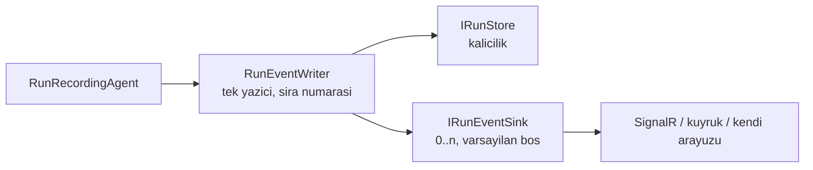

# Faz 70 — Çalıştırma Olayı Hedefi ve Düşünme Akışı

> **Durum:** 📋 Planlandı (2026-08-18)
> **Kaynak:** [ADAYLAR.md](ADAYLAR.md) · **F-115**
> **Önkoşul:** [Faz 6](06-GOZLEMLENEBILIRLIK.md) — `RunRecordingAgent` ve olay yazımı · [Faz 61](61-ISTEMCI-TOOLLARI-VE-GOMULEBILIR-SOHBET.md) — gömülebilir bileşen, taşıyıcı tarafının istemci yarısı
> **Paketler:** `AgentPrism.Abstractions`, `AgentPrism.Core`, `AgentPrism.UI`
> **Yeni paket:** Yok · **Migration:** Yok
> **Public API:** **büyüyor (küçük)** — bir arayüz ve `RunEventType`'a **bir ekleme**. Enum sonuna ekleme K-040 ile serbesttir. `PublicAPI.Shipped.txt` bugün **boş** — şimdi bedava
> **Site etkisi:** `concepts/runs.md`, `guides/observability.md`, `concepts/agents.md` (reasoning)
> **Manuel test alanı:** [`docs/manuel-test/11-ARAYUZ-RUN-SESSION-SSE.md`](manuel-test/11-ARAYUZ-RUN-SESSION-SSE.md)

---

## Bu Faza Başlarken

> `faz-baslangic` skill'ini uygula. Aşağıdaki liste o skill'in 2. adımıdır —
> **tamamını değil, yalnız işaret edilen bölümleri oku.**

1. Bu doküman
2. Kararlar — dosyanın tamamını **okuma**, yalnız bu kalemleri grep'le:
   ```bash
   grep -n "K-040\|K-014\|K-055\|K-398" docs/KARARLAR.md
   ```
   **K-040** (enum'lar JSON'a ad olarak yazılır; sıra değişmez, yalnız eklenir),
   **K-014** (olay akışı yalnız eklemelidir), **K-055** (OTel toplama
   `ActivityListener` ile), **K-398** (erken `DisposeAsync`'te terminal durum yazılır).
3. [`61-ISTEMCI-TOOLLARI-VE-GOMULEBILIR-SOHBET.md`](61-ISTEMCI-TOOLLARI-VE-GOMULEBILIR-SOHBET.md) — yalnız devir notu:
   ```bash
   awk '/## Sonraki Faza Devir Notu/,0' docs/61-ISTEMCI-TOOLLARI-VE-GOMULEBILIR-SOHBET.md
   ```
   SSE başlıklarının akış başlamadan gönderilme kısıtı (K-439) bu fazı ilgilendirir.
4. Alan hafızası (bu faz iki alana dokunuyor):
   [`hafiza/cekirdek-calistirma.md`](hafiza/cekirdek-calistirma.md) (🚨 `AsyncLocal` ve akışlı yol — **dört kez** bedel ödetti) ·
   [`hafiza/frontend.md`](hafiza/frontend.md) (arayüz, bundle)

---

## Amaç

AgentPrism'in olay akışı zengindir ama **tek bir tüketicisi** vardır: veritabanı.
Kendi gerçek zamanlı arayüzüne gömen bir tüketici bu akışa ancak kendi HTTP
sunucusuna SSE ile bağlanarak ya da `IRunStore`'u dekore ederek ulaşır. İkisi de
yanlış yerdir. Bu faz, olayları süreç içinde dinlenebilir kılar.

İkinci parça aynı yerdedir: modelin düşünme çıktısı bugün kayda **hiç girmiyor**.

- **F-115** — kayıt edilebilir bir çalıştırma olayı hedefi ve `ReasoningDelta`
  olay tipi.

### Bugün ne çalışmıyor — doğrulanmış kanıt

| Kanıt | Gözlem |
|---|---|
| [`RunEventWriter.cs:22`](../src/AgentPrism.Core/Recording/RunEventWriter.cs) | Tek hedef `IRunStore`. Gözlemci genişleme noktası yok |
| `grep -rn "IRunEventSink\|IRunEventObserver" src --include="*.cs" \| wc -l` → **0** | Kavram kod tabanında yok |
| [`RunEventType.cs`](../src/AgentPrism.Abstractions/Runs/RunEventType.cs) | Yirmi iki değer, `0`–`21`. `ReasoningDelta` yok |
| [`RunRecordingAgent.cs:947-965`](../src/AgentPrism.Core/Recording/RunRecordingAgent.cs) | `WriteContentsAsync` `switch`'i üç tipi tanır: `TextContent`, `FunctionCallContent`, `FunctionResultContent`. Geri kalan `default: break` |
| `Microsoft.Extensions.AI.Abstractions` **10.8.3** | `TextReasoningContent` **vardır** ve MAF onu üretir |

> Kanıtlar 2026-08-18 tarihinde doğrulandı.

🚨 **Aday listesindeki ifade ölçümle düzeltildi.** F-115 "düşünme akışı
`MessageDelta`'ya karışır" diyordu. Gerçek daha kötüdür: `TextReasoningContent`
`default: break` dalına düşer ve **hiç kaydedilmez**. Karışma değil, kayıp.

---

## 70.1 — Olay hedefi



**Dört kural bozulmaz:**

1. **Tek yazıcı korunur.** Sıra numarasını `RunEventWriter` üretir. Hedef
   olayları **numaralanmış hâlde** alır; canlı akış ile sonradan yapılan replay
   birebir aynı kalır. Bu, paketin bugünkü en güçlü garantilerinden biridir.
2. **Hedef bir `run`'ı asla bozmaz.** `RunEventWriter`'ın yut-ve-devam kuralı
   hedefe **birebir** uygulanır: hata loglanır, hedef o `run` için devre dışı
   kalır, `run` devam eder. Gözlemlenebilirlik işlevi düşürme hakkına sahip
   değildir.
3. **Hedef `run`'ı yavaşlatmaz.** Yazım `await` edilir ama hedef **sıcak
   yoldadır**; yavaş bir hedef akışı geciktirir. Plan bunu çözmez, **sınırlar**:
   sözleşme "hızlı ol, kuyruğa at" der ve doküman bunu açıkça yazar. Kuyruğa
   alma tüketicinin işidir.
4. **Varsayılan boştur.** Hiçbir hedef kayıtlı değilse bugünkü kod yolu
   birebir aynıdır — sıfır tahsis, sıfır dallanma farkı (K1).

### Neden `IRunStore` dekorasyonu yeterli değil

Bugün mümkün olan tek yol budur ve üç şeyi yanlış yapar:

| Sorun | Neden |
|---|---|
| Tüketici **tüm** kalıcılık sözleşmesini yeniden uygulamak zorunda | `IRunStore` on'dan fazla metot taşır; ilgilenilen tek şey olay akışıdır |
| Depo hatası ile yayın hatası **aynı** yut-geç kuralına girer | İkisi ayrı sorumluluktur; biri veri kaybı, diğeri gecikmiş bildirim |
| Sıra numarası garantisi tüketiciye devredilir | Yanlış uygulanırsa canlı akış ile replay ayrışır |

### 🚨 `AsyncLocal` uyarısı

Hedef, akışlı yolda çağrılır. MEMORY'de **dört kez** kayıtlı tuzak burada
geçerlidir: `AsyncLocal` yazımı çağırana geri akmaz ve akışlı yolda **her
`MoveNextAsync` öncesi** tekrarlanmalıdır. Hedef bir `Activity` veya kapsam
açıyorsa bunu kendi gövdesinde yapmalıdır; plan bunu XML dokümanına yazar.

---

## 70.2 — `ReasoningDelta`

`RunEventType`'ın **sonuna** `ReasoningDelta = 22` eklenir. Sıra değişmez
(K-040).

`WriteContentsAsync` `switch`'ine bir dal girer:

```csharp
case TextReasoningContent reasoning
    when _options.RecordReasoningDeltas && !string.IsNullOrEmpty(reasoning.Text):
    // ayrı olay tipi — MessageDelta'ya karıştırılmaz
```

### 🚨 Düşünme çıktısı varsayılan olarak kaydedilmez

`AgentPrismRunRecordingOptions.RecordReasoningDeltas` varsayılanı **`false`**
gelir. `RecordMessageDeltas`'tan farklı davranmasının üç gerekçesi vardır:

| Gerekçe | Açıklama |
|---|---|
| **Hacim** | Düşünme çıktısı yanıttan kat kat uzun olabilir; kayıt hacmi ölçülmedi |
| **Gizlilik** | Ara akıl yürütme kullanıcı verisini yanıtta görünmeyen biçimlerde tekrarlayabilir |
| **Sağlayıcı politikası** | Bazı sağlayıcılar ham düşünme metnini saklamaya kısıt koyar; kısıtlar **doğrulanmadı** |

Açmak isteyen bir satır yazar. K1 ile uyumludur ve
[Faz 25](25-VERI-SAKLAMA-VE-ARSIVLEME.md)'in saklama politikasıyla çelişmez.

**Not:** Faz 68 planlanmışsa `ReasoningTokens` alanı orada gelir. İkisi
bağımsızdır: token **sayısı** kullanımdan, `ReasoningDelta` **metinden** gelir.
Biri açılmadan diğeri çalışır.

---

## Planlanan Public API

> Taslak imzalardır. Gerçekleşen imzalar kapanışta ayrı bir bölüme yazılır.

```csharp
// AgentPrism.Abstractions
/// <summary>
/// Receives run events as they are written. Registered instances must be fast:
/// they run on the hot path. Queue and return; do not block.
/// A sink failure never fails the run.
/// </summary>
public interface IRunEventSink
{
    ValueTask OnEventAsync(RunEvent runEvent, CancellationToken cancellationToken = default);
}

public enum RunEventType
{
    // ... 0-21 unchanged ...

    /// <summary>A reasoning (thinking) delta. Off by default.</summary>
    ReasoningDelta = 22,
}

// AgentPrism.Core
public sealed class AgentPrismRunRecordingOptions
{
    /// <summary>Records reasoning deltas. Default false — volume and privacy.</summary>
    public bool RecordReasoningDeltas { get; set; }
}
```

Kayıt `TryAddEnumerable` ile birden çok hedefe izin verir; sıra kayıt sırasıdır.

### HTTP `endpoint`'leri

Yeni uç yok. Var olan SSE akışı `ReasoningDelta` olayını **açıkken** taşır.

### Arayüz payı

Düşünme akışı için katlanabilir bir blok. Yeni bağımlılık yok. Bugünkü bundle
146.104 B brotli (`index-*.js.br` 140.614 + `index-*.css.br` 5.490); bütçe
250 KB gzip. Fazın payı kapanışta ölçülür. Yeni metin `en.ts` **ve** `tr.ts`
içine girer (K-228).

---

## Planlanan Dosya Listesi

```
src/AgentPrism.Abstractions/Runs/
├── IRunEventSink.cs                    (YENİ)
└── RunEventType.cs                     (değişir — ReasoningDelta = 22)

src/AgentPrism.Core/
├── Recording/RunEventWriter.cs         (değişir — hedeflere yayın)
├── Recording/RunRecordingAgent.cs      (değişir — TextReasoningContent dalı)
├── AgentPrismRunRecordingOptions.cs    (değişir — RecordReasoningDeltas)
└── AgentPrismServiceCollectionExtensions.cs (değişir — hedef kaydı)

src/AgentPrism.UI/                      (düşünme bloğu + locales)
```

---

## Hata Modları ve Testler

| Ne bozulabilir | Seviye | Test sınıfı |
|---|---|---|
| Hedef patlar → `run` düşer | Fonksiyonel | `RunEventSinkFailureTests` |
| Hedef patlar → depoya yazım da durur | Fonksiyonel | aynı sınıf — iki yol **bağımsız** olmalı |
| Hedef olayları sırasız alır | Fonksiyonel (akışlı) | `RunEventSinkOrderingTests` |
| Hedef yavaşsa akış tamamen durur | Fonksiyonel | `RunEventSinkSlowTests` — davranış **belgelenir**, gizlenmez |
| Hedef kayıtlı değilken sıcak yol değişir | Birim | `RunEventWriterNoSinkTests` |
| Birden çok hedefte biri patlayınca diğeri de susar | Fonksiyonel | `RunEventSinkFailureTests` |
| `ReasoningDelta` varsayılan olarak yazılır | Birim | `ReasoningRecordingOptionsTests` |
| `ReasoningDelta` `MessageDelta` ile karışır | Fonksiyonel (SSE) | `ReasoningStreamTests` |
| Enum eklemesi eski istemcide çöker | Sözleşme | `RunEventTypeContractTests` — bilinmeyen tip **yok sayılır** |
| İptal edilen `run`'da hedef terminal olayı almaz (K-398) | Fonksiyonel | `RunEventSinkCancellationTests` |
| Hedef içinde `AsyncLocal` yazımı akışta kaybolur | Fonksiyonel | `RunEventSinkAmbientTests` |
| Başka kiracının olayı hedefe sızar | Sözleşme | `TenantIsolationContract` |

**Beş soru:** iptal — K-398 terminal olayı hedefe de gider · eşzamanlılık —
paralel `run`'lar tek hedefe yazar, hedef **thread-safe olmak zorundadır** ve bu
sözleşmeye yazılır · boş/aşırı girdi — çok uzun düşünme metni · başka kiracı —
sözleşme testi · alt sistem hatası — hedef ve depo bağımsız düşer.

---

## Manuel Kabul Case'leri

| # | Ön koşul | Adımlar | Beklenen sonuç |
|---|---|---|---|
| 1 | Hedef kayıtlı değil | Bir `run` | Bugünkü davranış birebir |
| 2 | Olayları sayan bir hedef | Bir akışlı `run` | Hedefin gördüğü sıra numaraları **boşluksuz** ve `GET /api/runs/{id}/events` ile birebir aynı |
| 3 | Her zaman patlayan bir hedef | Bir `run` | `run` başarılı biter; uyarı loglanır; **depoya yazım tam** |
| 4 | İki hedef, biri patlıyor | Bir `run` | Sağlam hedef tüm olayları alır |
| 5 | Reasoning destekleyen model, seçenek **kapalı** | Bir `run` | `ReasoningDelta` olayı **yok**; yanıt normal |
| 6 | Aynı model, seçenek **açık** | Bir `run` | `ReasoningDelta` olayları akar; `MessageDelta`'dan ayrı |
| 7 | Arayüz, seçenek açık | Aynı `run`'ı arayüzde izle | 👤 Düşünme bloğu ayrı ve katlanabilir görünür |
| 8 | 2 sn uyuyan bir hedef | Bir akışlı `run` | 👤 Akış gözle görülür yavaşlar. **Belgelenmiş sınır** — hedef hızlı olmalıdır |

---

## Açık Sorular

| # | Soru | Seçenekler | Öneri |
|---|---|---|---|
| 1 | Hedef sıcak yolda mı, kuyrukta mı? | A: sıcak yol, "hızlı ol" sözleşmesi · B: paket içinde kuyruk | **A** — B bir kuyruk, bir tüketici görevi ve bir taşma politikası demektir; K1'i (sıfır sürpriz) zorlar. Kuyruğa alma tüketicinin bilinçli kararıdır |
| 2 | Hedef hatası kaç kez tolere edilir? | A: ilk hatada o `run` için susar (`IsDisabled` deseni) · B: her olayda yeniden dener | **A** — `RunEventWriter`'ın var olan deseniyle birebir aynı; ikinci bir davranış modeli öğretmez |
| 3 | `ReasoningDelta` saklama politikasına nasıl girer? | A: `MessageDelta` ile aynı kova · B: ayrı saklama süresi | **A** bu fazda; B ölçülmemiş bir ihtiyaçtır. [Faz 25](25-VERI-SAKLAMA-VE-ARSIVLEME.md) sahibidir |
| 4 | Hedef `RunEvent`'i mi yoksa daraltılmış bir görünümü mü alır? | A: `RunEvent` · B: ayrı bir DTO | **A** — ikinci bir tip iki sözleşme demektir; `RunEvent` zaten public |

---

## Bitiş Ölçütleri (DoD)

- [ ] Hedef kayıtlı değilken sıcak yol değişmez (test kanıtıyla)
- [ ] Hedefin gördüğü sıra numaraları depodakiyle birebir aynı
- [ ] Patlayan hedef `run`'ı düşürmez ve depoya yazımı **engellemez**
- [ ] `RecordReasoningDeltas` varsayılanı `false`; açıkken `ReasoningDelta`
      olayları `MessageDelta`'dan ayrı akar
- [ ] Bilinmeyen olay tipi eski istemcide yok sayılır
- [ ] Dört doğrulama kapısı sıfır uyarı verir
- [ ] `samples/AgentPrism.Api` ile gerçek `run` yapıldı, çıktı belgeye yazıldı
- [ ] `secret` taraması boş döndü
- [ ] Manuel kabul case'leri
      [`docs/manuel-test/11-ARAYUZ-RUN-SESSION-SSE.md`](manuel-test/11-ARAYUZ-RUN-SESSION-SSE.md)
      içine eklendi; otomatikleştirilebilenler koşuldu
- [ ] `faz-denetim` koşuldu; 🔴 bulgu kalmadı
- [ ] `docs-site/` güncellendi; `npm run build` + `check-links.mjs` temiz
- [ ] `en.ts` ve `tr.ts` eksiksiz; bundle payı ölçüldü ve yazıldı

### Doğrulama komutları

```bash
# Reasoning olayı ayrı akıyor mu
curl -N -s http://localhost:5081/agentprism/api/agents/thinker/run/stream \
  -H 'content-type: application/json' -d '{"message":"think step by step"}' \
  | grep -c "ReasoningDelta"

# Sıra numaraları boşluksuz mu
curl -s http://localhost:5081/agentprism/api/runs/$RUN/events | jq '[.[].sequence] | . as $s | ($s|length) == ($s|max)'
```

---

## Riskler

| Risk | Önlem |
|------|-------|
| Yavaş hedef akışı durdurur | Sözleşme XML dokümanında açıkça yazar; Manuel Case 8 sınırı belgeler; Açık Soru 1 karara bağlanır |
| Hedef `run`'ı düşürür | Yut-ve-devam kuralı `RunEventWriter`'dan birebir devralınır; `RunEventSinkFailureTests` DoD'de |
| Tek yazıcı garantisi bozulur → replay ile canlı akış ayrışır | Sıra numarası yalnız `RunEventWriter` üretir; hedef numaralanmış olay alır |
| Düşünme metni beklenmedik hacim üretir | Varsayılan **kapalı**; hacim ilk açık koşumda ölçülür ve kapanış notuna yazılır |
| Sağlayıcı düşünme metnini saklama kısıtı koyar | Doğrulanmadı — açık soru olarak dokümana yazıldı; varsayılan kapalı olduğu için risk gerçekleşmez |
| `AsyncLocal` hedef içinde kaybolur | XML dokümanı uyarıyı taşır; `RunEventSinkAmbientTests` |

---

<!-- ============================================================
     AŞAĞISI KAPANIŞTA DOLDURULUR — `faz-tamamlama` skill'i.
     Plan anında boş kalır. Başlıkları SİLME.
     ============================================================ -->

## Plandan Sapmalar

> Kapanışta doldurulur.

## Bu Fazda Verilen Kararlar

> Kapanışta doldurulur. K-NNN numaraları burada alınır; plan numara rezerve etmez.

## Gerçekleşen Public API

> Kapanışta doldurulur.

## Dosya Listesi (gerçekleşen)

> Kapanışta doldurulur.

## Denetim Bulguları

> Kapanışta doldurulur.

## Sonraki Faza Devir Notu

> Kapanışta doldurulur.
