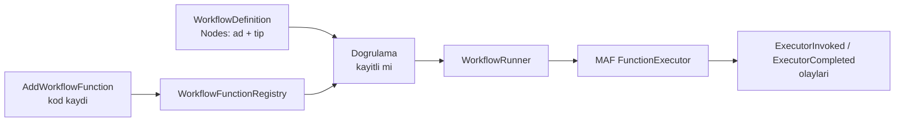

# Faz 71 — Workflow Kod Düğümü

> **Durum:** ✅ Tamamlandı (2026-08-19)
> **Kaynak:** [ADAYLAR.md](ADAYLAR.md) · **F-116**
> **Önkoşul:** [Faz 15](arsiv/fazlar/15-WORKFLOWS-YURUTME.md) — workflow yürütme ve kalıcılık · [Faz 16](arsiv/fazlar/16-WORKFLOWS-ARAYUZ.md) — graf, arayüz, human-in-the-loop
> **Paketler:** `AgentPrism.Abstractions`, `AgentPrism.Workflows`, `AgentPrism.Core`, `AgentPrism.AspNetCore`, `AgentPrism.UI`
> **Yeni paket:** Yok · **Migration:** Yok (düğüm tanımı var olan workflow tanımında yaşar) · **Doğrulanacak:** tanım sütununun şeması değişiyorsa üç set gerekir
> **Public API:** **büyüyor** — `WorkflowNodeKind` enum'una **ekleme**, `WorkflowDefinition`'a alan, bir kayıt yüzeyi. `PublicAPI.Shipped.txt` bugün **boş** — şimdi bedava
> **Site etkisi:** `concepts/workflows.md` (`guides/background-work.md` PLANDA
> vardı ama dokunulmadı — bkz. Plandan Sapmalar #5, ilgisiz çıktı)
> **Manuel test alanı:** [`docs/manuel-test/15-WORKFLOWS.md`](manuel-test/15-WORKFLOWS.md)

---

## Bu Faza Başlarken

> `faz-baslangic` skill'ini uygula. Aşağıdaki liste o skill'in 2. adımıdır —
> **tamamını değil, yalnız işaret edilen bölümleri oku.**

1. Bu doküman
2. Kararlar — dosyanın tamamını **okuma**, yalnız bu kalemleri grep'le:
   ```bash
   grep -n "K-129\|K-040\|K-394\|K-401\|K-403\|K-218" docs/KARARLAR.md
   ```
   **K-129** (🚨 MAF declarative workflow **reddedildi** — bu faz onu yeniden
   açmıyor, aşağıya bak), **K-040** (enum sırası değişmez), **K-394** (workflow'un
   tamamı tek `run` olarak kotaya yazılır), **K-401** (`ToRunError` sarmalayıcıları
   soyar), **K-403** (`RunStreamingAsync` gerçek yineleyici), **K-218** (boş servis sağlayıcı).
3. [`16-WORKFLOWS-ARAYUZ.md`](arsiv/fazlar/16-WORKFLOWS-ARAYUZ.md) — yalnız devir notu:
   ```bash
   awk '/## Sonraki Faza Devir Notu/,0' docs/arsiv/fazlar/16-WORKFLOWS-ARAYUZ.md
   ```
4. Alan hafızası (bu faz iki alana dokunuyor):
   [`hafiza/workflows.md`](hafiza/workflows.md) (yürütme, executor kimliği, HITL) ·
   [`hafiza/maf-api.md`](hafiza/maf-api.md) (MAF tipleri)

---

## Amaç

AgentPrism Workflows bugün yalnız **agent zinciri** kurabiliyor. Gerçek bir
üretim hattında ise AI çağırmayan adımlar vardır: dosya indirme, biçim
dönüştürme, ses sentezi, veritabanı yazımı. Bunlar grafiğe giremediği için
tüketici workflow'u yalnız hattının AI kısmı için kullanabiliyor; kalanını
kendi kuyruğunda tutuyor. Sonuç iki orkestratör, iki durum kaynağı, iki kurtarma
yolu.

- **F-116** — kayıtlı bir kod fonksiyonunu workflow düğümü olarak bağlamak.

### Bugün ne çalışmıyor — doğrulanmış kanıt

| Kanıt | Gözlem |
|---|---|
| [`WorkflowGraph.cs:94-110`](../src/AgentPrism.Abstractions/Workflows/WorkflowGraph.cs) | `WorkflowNodeKind` dört değer: `Unknown`, `Agent`, `Orchestration`, `RequestPort`, `Output`. Kod düğümü yok |
| [`WorkflowDefinition.cs:40,46`](../src/AgentPrism.Abstractions/Workflows/WorkflowDefinition.cs) | Tanım `AgentNames` ve `ManagerAgentName` taşır — düğüm kümesi **agent adlarıdır** |
| `Microsoft.Agents.AI.Workflows` **1.16.0** | 🚨 `FunctionExecutor<TInput>` ve `FunctionExecutor<TInput,TOutput>` **vardır**. Kurucu: `(string id, Func<TInput, IWorkflowContext, CancellationToken, ValueTask<TOutput>> handlerAsync, ExecutorOptions options, …)` |

> Kanıtlar 2026-08-18 tarihinde doğrulandı. MAF imzası XML dokümanından
> okundu; uygulama öncesi `maf-api-kesfi` ile bir kez daha teyit edilmelidir.

**Kazanç:** MAF ilkeli hazır. Bu faz sıfırdan bir yürütücü yazmaz —
`FunctionExecutor`'ı AgentPrism'in tanım, graf, kayıt ve arayüz katmanlarına
bağlar.

---

## 71.1 — 🚨 K2 sınırı: bu fazın ilk kararı

**K2 der ki: tool'lar yalnızca kodda tanımlanır. Arayüzden kod yazılamaz.**

Kod düğümü bu sınıra **çok yakındır** ve plan çizgiyi baştan çeker:

| İzinli | Yasak |
|---|---|
| Fonksiyon **kodda** kaydedilir; tanım ona **adıyla işaret eder** | Fonksiyonun gövdesi arayüzden veya veritabanından gelir |
| Arayüz kayıtlı fonksiyonlardan **seçtirir** | Arayüz ifade, script veya şablon dili girdirir |
| Tanım düğüm adı, kenar ve yapılandırma değeri taşır | Tanım çalıştırılabilir bir şey taşır |

Bu, `AgentDefinition.ToolNames`'in kayıtlı bir tool'a işaret etmesiyle **birebir
aynı** desendir. Kayıt yeri de aynı olmalıdır: bir düğüm ancak kayıtlı bir
fonksiyona işaret edebilir ve bu kuralı zorlayan **tek bir yer** vardır.

🚨 **K-129 yeniden açılmıyor.** MAF'ın declarative workflow'u ölçülüp
reddedilmişti (+19 paket ve Responses API şartı). Bu faz declarative workflow
**değildir**: yeni bir tanım dili getirmez, var olan AgentPrism tanımına bir
düğüm tipi ekler ve gövdeyi kodda tutar. Fark plan dokümanında yazılıdır ki
sonraki oturum bunu K-129'un ihlali sanmasın.

---

## 71.2 — Tasarım



**Dört parça:**

1. **Kayıt.** Kod fonksiyonu kurulum anında adıyla kaydedilir. Kayıt
   `IToolRegistry`'nin deseniyle aynıdır: ad çakışması **başlangıç hatasıdır**.
2. **Tanım.** `WorkflowDefinition` düğüm listesini adla taşır; `WorkflowNodeKind`
   sonuna `Function` eklenir (K-040: sıra değişmez, yalnız eklenir).
3. **Doğrulama.** Tanım derlenirken her fonksiyon düğümü kayıtta aranır;
   bulunmayan ad **derleme hatasıdır** — çalışma anı sürprizi değil. Bu,
   agent adlarında zaten uygulanan kuraldır.
4. **Yürütme.** `WorkflowRunner` düğümü `FunctionExecutor` olarak bağlar.
   `ExecutorInvoked` / `ExecutorCompleted` / `ExecutorFailed` olayları
   **zaten** `RunEventType` içinde (14, 15, 16) — akış ve arayüz bedavaya gelir.

### 🚨 K-218 burada da geçerlidir

Fonksiyon gövdesinin bağımlılıkları **kurulum anında** alınır. `IWorkflowContext`
bir servis sağlayıcı vermez ve tool tarafında MAF'ın `EmptyServiceProvider`
geçirdiği ölçülmüştür (K-218). Kayıt bir fabrika alır; fabrika DI'dan çözülür.

### Girdi ve çıktı tipi

`FunctionExecutor<TInput,TOutput>` tiplidir. AgentPrism tanımı ise **veridir**
ve tip taşımaz. Köprü kayıt anında kurulur: fonksiyon kendi tiplerini kayıtta
bildirir, tanım yalnız adı taşır. Tip uyuşmazlığı **tanım doğrulamasında**
yakalanır, çalışma anında değil.

### Kapsam dışı

| Dışarıda | Neden |
|---|---|
| Kod düğümünün maliyet ve token taşıması | AI çağırmaz; `TreeUsage` toplamına `0` katkı verir, `null` değil — bu bir **karardır** ve DoD'ye girer |
| Kod düğümünün kendi timeout'u | [Faz 69](69-TOOL-YETKILENDIRMESI-VE-TIMEOUT.md)'un tool timeout'u ile aynı sözleşme olmalı; ikisi ayrı planlanırsa iki desen doğar. Açık Soru 2 |
| Kod düğümünden alt agent çağırma | Ölçülmemiş ihtiyaç; `IWorkflowContext` üzerinden zaten mümkün olabilir — **doğrulanmadı** |

---

## Planlanan Public API

> Taslak imzalardır. Gerçekleşen imzalar kapanışta ayrı bir bölüme yazılır.
> 🚨 MAF imzaları XML dokümanından okundu; uygulama öncesi `maf-api-kesfi` ile
> teyit edilmelidir.

```csharp
// AgentPrism.Abstractions
public enum WorkflowNodeKind
{
    // ... 0-4 unchanged ...

    /// <summary>A node that runs a function registered in code.</summary>
    Function = 5,
}

public sealed record WorkflowFunctionDescriptor
{
    public required string Name { get; init; }
    public string? Description { get; init; }
    public required Type InputType { get; init; }
    public required Type OutputType { get; init; }
}

// AgentPrism.Workflows — registration
public static class AgentPrismWorkflowFunctionExtensions
{
    public static IAgentPrismBuilder AddWorkflowFunction<TInput, TOutput>(
        this IAgentPrismBuilder builder,
        string name,
        Func<IServiceProvider, Func<TInput, IWorkflowContext, CancellationToken, ValueTask<TOutput>>> factory,
        string? description = null);
}
```

### HTTP `endpoint`'leri

| Metot | Yol | Rol | Ne yapar |
|---|---|---|---|
| `GET` | `/api/workflows/functions` | Reader | Kayıtlı kod düğümlerini listeler (ad, açıklama, tipler) |

Var olan workflow uçları değişmez; graf yanıtı yeni düğüm tipini taşır.

### Arayüz payı

Graf tuvaline yeni bir düğüm şekli ve fonksiyon seçici. Yeni bağımlılık **yok** —
🚨 K-132 mermaid.js'i bundle bütçesi gerekçesiyle reddetti; bu faz o kararı
yeniden açmaz, var olan graf çizimi kullanılır. Bugünkü bundle 146.104 B brotli;
fazın payı kapanışta ölçülür. Yeni metin `en.ts` **ve** `tr.ts` (K-228).

---

## Planlanan Dosya Listesi

```
src/AgentPrism.Abstractions/Workflows/
├── WorkflowGraph.cs                    (değişir — WorkflowNodeKind.Function)
├── WorkflowDefinition.cs               (değişir — düğüm listesi)
└── WorkflowFunctionDescriptor.cs       (YENİ)

src/AgentPrism.Workflows/
├── AgentPrismWorkflowFunctionExtensions.cs (YENİ — kayıt)
├── Internal/WorkflowFunctionRegistry.cs    (YENİ)
└── Internal/WorkflowRunner.cs              (değişir — FunctionExecutor bağlama)

src/AgentPrism.Core/Compilation/          (tanım doğrulaması — kayıtlı mı)
src/AgentPrism.AspNetCore/Endpoints/WorkflowEndpoints.cs (değişir)
src/AgentPrism.UI/                        (graf düğümü + locales)
```

---

## Hata Modları ve Testler

| Ne bozulabilir | Seviye | Test sınıfı |
|---|---|---|
| Tanım kayıtlı olmayan bir fonksiyona işaret eder | Fonksiyonel | `WorkflowFunctionValidationTests` — **derleme hatası**, çalışma anı değil |
| İki fonksiyon aynı adla kaydedilir | Birim | `WorkflowFunctionRegistryTests` — başlangıç hatası |
| Tip uyuşmazlığı çalışma anında patlar | Fonksiyonel | aynı sınıf — doğrulamada yakalanmalı |
| Fonksiyon bağımlılığı `IWorkflowContext`'ten çözülmeye çalışılır (K-218) | Fonksiyonel (gerçek koşum) | `WorkflowFunctionWiringTests` |
| Fonksiyon patlar → workflow sessizce durur | Fonksiyonel | `WorkflowFunctionFailureTests` — `ExecutorFailed` üretilmeli |
| Sarmalayıcı istisna gerçek nedeni gizler (K-401) | Fonksiyonel | mevcut K-401 testi genişletilir |
| İptal fonksiyona ulaşmaz | Fonksiyonel | `WorkflowFunctionCancellationTests` |
| Kontrol noktasından devam fonksiyonu iki kez çalıştırır | Fonksiyonel | `WorkflowFunctionCheckpointTests` — 🚨 **idempotency sözleşmesi belgelenmeli** |
| Kod düğümü `TreeUsage`/maliyet toplamını bozar | Birim | `WorkflowUsageTests` |
| Kota muhasebesi kod düğümünü `run` sayar (K-394) | Fonksiyonel | `WorkflowQuotaTests` |
| Graf yanıtındaki yeni tip eski arayüzde çöker | Sözleşme | `WorkflowGraphContractTests` — bilinmeyen tip yok sayılır |
| Başka kiracının fonksiyon düğümü çalışır | Sözleşme | `TenantIsolationContract` |

**Beş soru:** iptal — token fonksiyona iletilir · eşzamanlılık — aynı fonksiyon
paralel superstep'lerde; **thread-safe olmak zorundadır** ve sözleşmeye yazılır ·
boş/aşırı girdi — `null` girdi ve çok büyük çıktı · başka kiracı — sözleşme
testi · alt sistem hatası — fonksiyon patlarsa `ExecutorFailed`.

🚨 **Kontrol noktasından devam en riskli hata modudur.** Bir kod düğümü yan etki
üretir (dosya yazar, HTTP çağırır). Kontrol noktasından devam onu **yeniden**
çalıştırabilir. Plan bunu çözmez, **sözleşmeye yazar**: kod düğümü idempotent
olmalıdır. Doküman bunu açıkça söyler; sessiz bırakılırsa tüketici veri bozar.

---

## Manuel Kabul Case'leri

| # | Ön koşul | Adımlar | Beklenen sonuç |
|---|---|---|---|
| 1 | Kod düğümü kaydedilmemiş | Var olan bir workflow koş | Bugünkü davranış birebir |
| 2 | Metni büyük harfe çeviren bir kod düğümü | Agent → fonksiyon → agent zinciri koş | Üç düğüm de çalışır; graf üçünü gösterir |
| 3 | Aynı workflow | `GET /api/runs/{id}/events` | `ExecutorInvoked` / `ExecutorCompleted` fonksiyon düğümü için de var |
| 4 | Kayıtlı olmayan ada işaret eden tanım | Tanımı kaydet | **Kaydetme anında** hata; çalıştırma denemesi gerekmez |
| 5 | Patlayan kod düğümü | Workflow koş | `ExecutorFailed`; hata mesajı gerçek nedeni gösterir (K-401) |
| 6 | Uzun süren kod düğümü | Koşuyu iptal et | 👤 Fonksiyon iptali görür ve durur |
| 7 | Kontrol noktalı workflow | Fonksiyondan sonra kontrol noktasından devam et | 👤 Fonksiyonun yan etkisi **tekrarlanır** veya tekrarlanmaz — davranış ölçülür ve belgelenir |
| 8 | Arayüz | Graf ekranını aç | 👤 Fonksiyon düğümü agent düğümünden ayırt edilebilir şekilde çizilir |

---

## Açık Sorular

| # | Soru | Seçenekler | Öneri |
|---|---|---|---|
| 1 | Kod düğümü hangi tipleri taşıyabilir? | A: JSON'a serileştirilebilir her tip · B: yalnız `string` ve `ChatMessage` | **A** — B gerçek bir hattı taşıyamaz. Serileştirilebilirlik kontrol noktası için zaten zorunludur; kural kayıt anında doğrulanır |
| 2 | Timeout bu fazda mı? | A: [Faz 69](69-TOOL-YETKILENDIRMESI-VE-TIMEOUT.md)'un sözleşmesi yeniden kullanılır · B: ayrı bir mekanizma | **A** — 69 önce giderse aynı desen; iki timeout modeli öğretmek maliyetlidir |
| 3 | Kod düğümü maliyet taşır mı? | A: `0` katkı · B: `null` | **A** — `null` "bilinmiyor" demektir ve yanlıştır; AI çağırmayan bir düğümün maliyeti gerçekten sıfırdır |
| 4 | Kayıt `IAgentPrismBuilder` üzerinden mi? | A: evet · B: ayrı bir workflow builder | **A** — tool kaydıyla aynı yüzey; ikinci bir kayıt yolu öğretmez |
| 5 | Var olan `WorkflowDefinition` şeması düğüm listesi taşıyabiliyor mu? | Ölçülmeli | 🚨 Bugün `AgentNames` düz bir liste. Düğüm listesine geçiş **migration gerektirebilir** — uygulama ilk adımda şemayı okumalı |

---

## Bitiş Ölçütleri (DoD)

- [ ] Kod düğümü kaydedilmemişken hiçbir davranış değişmez
- [ ] Agent → fonksiyon → agent zinciri uçtan uca koşar; çıktı belgeye yazıldı
- [ ] Kayıtlı olmayan ada işaret eden tanım **kaydetme anında** reddedilir
- [ ] Fonksiyon düğümü `ExecutorInvoked`/`ExecutorCompleted`/`ExecutorFailed` üretir
- [ ] İptal fonksiyona ulaşır
- [ ] Kontrol noktasından devam davranışı **ölçüldü ve belgelendi**
      (idempotency sözleşmesi dokümana yazıldı)
- [ ] Kod düğümü maliyet toplamına `0` katkı verir
- [x] Bilinmeyen düğüm tipi eski istemcide yok sayılır — 🚨 bağımsız denetimde
      BULUNDU ve kapandı: `WorkflowGraphView`'in `KIND_STYLE[node.kind]`
      araması tanımadığı bir `kind` için `undefined` döndürüyordu ve
      `style.stroke` erişimi TypeError ile ÇÖKERDİ — "yok sayma" iddiası
      doğru değildi (`WorkflowNodeKind`'a her yeni değer eklendiğinde var
      olan, hiç kapanmamış bir kırılganlık, Faz 16'dan beri). Çözüm:
      `KIND_STYLE[node.kind] ?? KIND_STYLE.Unknown` — tanımadığı her `kind`
      artık `Unknown`'ın stiline düşer, çökmez
      (`src/AgentPrism.UI/frontend/src/components/workflow-graph.tsx`).
      .NET tarafı için iddia geçerli DEĞİLDİR: `WorkflowNodeKind` düz
      `JsonStringEnumConverter<T>` kullanır ve tanımadığı bir adı
      **fırlatarak** reddeder — bu yalnız arayüz (TypeScript, çalışma-anında
      tip denetimi olmayan) tarafı için bir gereklilikti.
- [ ] Dört doğrulama kapısı sıfır uyarı verir
- [ ] `samples/AgentPrism.Api` ile gerçek workflow koşumu yapıldı, çıktı belgeye yazıldı
- [ ] `secret` taraması boş döndü
- [ ] Manuel kabul case'leri [`docs/manuel-test/15-WORKFLOWS.md`](manuel-test/15-WORKFLOWS.md)
      içine eklendi; otomatikleştirilebilenler koşuldu
- [ ] `faz-denetim` koşuldu; 🔴 bulgu kalmadı
- [ ] `docs-site/` güncellendi; `npm run build` + `check-links.mjs` temiz
- [ ] `en.ts` ve `tr.ts` eksiksiz; bundle payı ölçüldü ve yazıldı

### Doğrulama komutları

```bash
# Kayıtlı kod düğümleri
curl -s http://localhost:5081/agentprism/api/workflows/functions | jq

# Graf yeni tipi taşıyor mu
curl -s http://localhost:5081/agentprism/api/workflows/mixed/graph | jq '.nodes[].kind'
```

---

## Riskler

| Risk | Önlem |
|------|-------|
| 🚨 K2 sessizce delinir — gövde tanımdan gelmeye başlar | Sınır §71.1'de yazılı; `faz-denetim` bunu ilk kontrol eder |
| K-129 (declarative workflow) yeniden açılmış sanılır | Fark plan dokümanında yazılı; kapanışta karar defterine de yazılır |
| MAF imzası değişmiş olur | `maf-api-kesfi` uygulama öncesi koşulur; plan imzayı 1.16.0'dan okudu ve tarihini yazdı |
| Kontrol noktasından devam yan etkiyi tekrarlar | Sözleşme "idempotent olmalı" der; Manuel Case 7 davranışı ölçer |
| `WorkflowDefinition` şeması düğüm listesini taşıyamaz → beklenmedik migration | Açık Soru 5; uygulama ilk adımda şemayı ölçer |
| K-218 tuzağı tekrar eder | Kayıt bir fabrika alır; `WorkflowFunctionWiringTests` gerçek koşumla kanıtlar |

---

<!-- ============================================================
     AŞAĞISI KAPANIŞTA DOLDURULUR — `faz-tamamlama` skill'i.
     Plan anında boş kalır. Başlıkları SİLME.
     ============================================================ -->

## Plandan Sapmalar

1. **Kod düğümü desteği yalnız `Sequential` içinde uygulandı, plan kapsamıyla
   birebir** — sapma değil, plan böyle öngörmüştü. §71.2'nin mermaid şeması
   basitleştirilmiş bir akış çiziyordu; gerçek uygulama iki katman gerektirdi
   (bkz. K-494, K-495) ve şema plandaki kadar sade değil çıktı.
2. **Agent düğümü `AIAgentBinding` değil `WorkflowAgentStepExecutor` olarak
   bağlanıyor** — planın §71.2 mermaid'i "WorkflowRunner düğümü FunctionExecutor
   olarak bağlar" derken yalnız FONKSİYON düğümünü kastediyordu; agent
   düğümünün de bir `FunctionExecutor` alt sınıfı olması **ölçülerek**
   ortaya çıktı (K-495 — `AIAgentBinding` giriş dışı düğümde çalışmıyor).
   Yan etki: karışık zincirdeki bir agent adımı workflow'un üst seviye olay
   akışına `MessageDelta` yaymıyor (agent'ın kendi çocuk `runs` satırı yine
   de tam geçmiş tutuyor). Plan bu ayrıntıyı öngörmemişti çünkü MAF'ın
   agent-host protokolünün giriş-dışı düğümde çalışmadığı önceden bilinmiyordu.
3. **`WorkflowGraphReader.Classify`'a Function tanıma eklenirken agent-node
   sınıflandırması geçici olarak bozuldu, bağımsız denetimden ÖNCE
   kendi testimle yakalandı ve düzeltildi** — ilk tasarımda hem agent hem
   fonksiyon düğümü `FunctionExecutor`-türetilmiş olduğu için ikisi de
   `Function` olarak çiziliyordu (manuel doğrulama sırasında, gerçek
   `samples/AgentPrism.Api` koşumunda görüldü). Çözüm `WorkflowAgentStepExecutor`
   tip adını `AgentNameOf`'a tanıtmaktı; bkz. K-495.
4. **Fonksiyon zaman aşımı (Açık Soru 2) çözülmedi** — plan zaten bunu
   "Kapsam dışı" işaretlemişti; K-497 bu durumu resmileştirdi.
5. **`guides/background-work.md` güncellenmedi** — plan başlığın "Site
   etkisi" alanında bu sayfayı listelemişti, ama inceleme gösterdi ki sayfa
   TAMAMEN farklı bir arka plan mekanizmasından (zamanlanmış iş kuyruğu)
   bahsediyor; kod düğümüyle doğal, zorlamasız bir bağlantı yok. Plan
   tahmini yanlış çıktı — `concepts/workflows.md` güncellendi, bu sayfa
   dokunulmadan bırakıldı.
6. **UI'nin workflow editör ekranı fonksiyon seçici KAZANMADI** — plan
   "Arayüz payı" bölümünde "yeni bir düğüm şekli **ve** fonksiyon seçici"
   sözü veriyordu; yalnız GRAF GÖRÜNÜMÜ tarafı (şekil, renk, lejant, `Nodes`/
   `WorkflowFunctionResponse` tipleri) teslim edildi. DoD'nin kendisi
   yalnız "fonksiyon düğümü agent düğümünden ayırt edilebilir çizilir"
   diyordu (Manuel Case 8) — bu karşılandı. Editördeki YAZMA tarafı (bir
   `WorkflowNodeReference` listesi kurma arayüzü) kapsam/efor dengesiyle
   bilinçli olarak bu fazın dışında bırakıldı; karışık düğümlü bir workflow
   bugün yalnız `PUT /api/workflows/{name}` ile (doğrudan HTTP çağrısı)
   oluşturulabilir. Bağımsız denetimde bulunan yanlış bir kod yorumu
   (editörün bunu desteklediğini iddia eden) düzeltildi;
   `samples/AgentPrism.Api/Program.cs`'teki not artık bu boşluğu açıkça
   söylüyor. **Sonraki faz için aday**, `docs/ADAYLAR.md`'ye eklenmeli.
7. **`ChatForwardingExecutor` ve elle `TurnToken` gönderme denendi, ikisi de
   terk edildi** — plan bu ayrıntı düzeyine inmemişti (§71.2 mermaid'i tek
   bir "WorkflowRunner → FunctionExecutor" oku çiziyordu). K-495'in kendi
   metni bu iki başarısız denemeyi kanıt olarak taşıyor; sonraki bir
   oturumun aynı yolu yeniden denememesi için.

## Bu Fazda Verilen Kararlar

- **K-494** — Fonksiyon düğümü yalnız `Sequential`'da desteklenir;
  `WorkflowDefinition.Nodes` `AgentNames` ile karşılıklı dışlanır.
- **K-495** — Karışık zincirde agent düğümü `AIAgentBinding` değil
  `WorkflowAgentStepExecutor` (bir `FunctionExecutor` alt sınıfı) olarak
  bağlanır — `AIAgentBinding` giriş dışı düğümde çalışmıyor, ÖLÇÜLDÜ.
- **K-496** — Fonksiyon adı kaydetme anında da doğrulanır (agent adının
  aksine, yalnız derleme anında); kayıt süreç ömrü boyunca sabittir.
- **K-497** — Kod düğümünün kendi zaman aşımı bu fazda ele alınmadı; Faz
  69'un tool timeout sözleşmesi tek aday olarak bırakıldı (Açık Soru 2,
  ÇÖZÜLMEDİ).
- **K-498** — Kontrol noktasından devam sözleşmesi ÖLÇÜLDÜ: en son kontrol
  noktasından sürdürme kod düğümünü yeniden çağırmaz, daha erken bir kontrol
  noktasından sürdürme çağırır — `AddWorkflowFunction` işleyicisi bu yüzden
  idempotent olmak zorundadır.

Tam metin: [`KARARLAR.md`](KARARLAR.md), K-494 – K-498.

## Gerçekleşen Public API

Taslakla büyük ölçüde eşleşiyor; asıl fark `WorkflowFunctionRegistration`'ın
gövdesi ve `WorkflowAgentStepExecutor`'ın (planlanmamıştı, K-495'in sonucu)
eklenmesi — ikisi de `internal`, public yüzeyi büyütmüyor.

```csharp
// AgentPrism.Abstractions
public enum WorkflowNodeKind
{
    Unknown = 0, Agent = 1, Orchestration = 2, RequestPort = 3, Output = 4,
    Function = 5,
}

public sealed record WorkflowNodeReference
{
    public required string Name { get; init; }
    public required WorkflowNodeKind Kind { get; init; }
}

public sealed record WorkflowFunctionDescriptor
{
    public required string Name { get; init; }
    public string? Description { get; init; }
    public required Type InputType { get; init; }
    public required Type OutputType { get; init; }
}

public interface IWorkflowFunctionCatalog
{
    IReadOnlyList<WorkflowFunctionDescriptor> List();
    bool Contains(string name);
}

// WorkflowDefinition / WorkflowDescriptor kazandı:
public IReadOnlyList<WorkflowNodeReference> Nodes { get; init; } = [];

// AgentPrism.Workflows
public static class AgentPrismWorkflowFunctionExtensions
{
    public static IAgentPrismBuilder AddWorkflowFunction<TInput, TOutput>(
        this IAgentPrismBuilder builder,
        string name,
        Func<IServiceProvider, Func<TInput, IWorkflowContext, CancellationToken, ValueTask<TOutput>>> factory,
        string? description = null);
}

// AgentPrism.AspNetCore — wire-safe HTTP DTO (System.Text.Json Type serileştiremiyor, ÖLÇÜLDÜ)
public sealed record WorkflowFunctionResponse
{
    public required string Name { get; init; }
    public string? Description { get; init; }
    public required string InputType { get; init; }   // CLR tipin görünen adı
    public required string OutputType { get; init; }
}
```

### Gerçekleşen HTTP `endpoint`'leri

| Metot | Yol | Rol | Ne yapar |
|---|---|---|---|
| `GET` | `/api/workflows/functions` | Reader | Kayıtlı kod düğümlerini listeler — plandakiyle birebir |

`PUT /api/workflows/{name}` genişledi: gövde artık `nodes` alanı taşıyabilir;
bir fonksiyon düğümü kayıtlı değilse **kaydetme anında** `400` döner.

## Dosya Listesi (gerçekleşen)

```
src/AgentPrism.Abstractions/Workflows/
├── WorkflowGraph.cs                    (değişti — WorkflowNodeKind.Function)
├── WorkflowDefinition.cs               (değişti — Nodes alanı)
├── WorkflowDescriptor.cs               (değişti — Nodes alanı, PLANDA YOKTU)
├── WorkflowNodeReference.cs            (YENİ)
├── WorkflowFunctionDescriptor.cs       (YENİ)
└── IWorkflowFunctionCatalog.cs         (YENİ, PLANDA YOKTU — K-118 sınırını
                                          korumak için gerekti: AspNetCore,
                                          Workflows paketine bağımlı değil)

src/AgentPrism.Core/Workflows/
└── WorkflowDefinitionValidator.cs      (değişti — Nodes yapısal doğrulaması)

src/AgentPrism.Sql.Shared/Internal/
└── WorkflowDefinitionPayload.cs        (değişti — Nodes jsonb alanı)

src/AgentPrism.Workflows/
├── AgentPrismWorkflowFunctionExtensions.cs (YENİ — AddWorkflowFunction)
├── AgentPrismWorkflowsBuilderExtensions.cs (değişti — boş kayıt fallback'i)
└── Internal/
    ├── WorkflowFunctionRegistration.cs (YENİ)
    ├── WorkflowFunctionRegistry.cs     (YENİ)
    ├── WorkflowAgentStepExecutor.cs    (YENİ, PLANDA YOKTU — bkz. K-495)
    ├── WorkflowDefinitionCompiler.cs   (değişti — BuildMixedSequentialAsync)
    ├── WorkflowGraphReader.cs          (değişti — Function/agent-step tanıma)
    └── WorkflowCatalog.cs              (değişti — Describe Nodes taşır)

src/AgentPrism.AspNetCore/
├── Contracts/WorkflowContracts.cs      (değişti — WorkflowSaveRequest.Nodes,
                                          WorkflowFunctionResponse YENİ)
└── Endpoints/WorkflowEndpoints.cs      (değişti — /functions ucu, SaveAsync
                                          doğrulaması)

src/AgentPrism.UI/frontend/src/
├── lib/types.ts                        (değişti — WorkflowNodeKind.Function,
                                          WorkflowNodeReference, Nodes alanları)
├── components/workflow-graph.tsx       (değişti — Function stili, Unknown
                                          düşümü — bağımsız denetimde bulundu)
└── locales/{en,tr}.ts                  (değişti — graph.legend.function)

samples/AgentPrism.Api/Program.cs       (değişti — word-count fonksiyonu)

tests/
├── AgentPrism.Workflows.UnitTests/
│   ├── WorkflowFunctionNodeTests.cs    (YENİ — 9 test)
│   ├── WorkflowDefinitionValidatorTests.cs (değişti — 6 yeni Nodes testi)
│   └── Fakes/WorkflowTestHost.cs       (değişti — AddFunction desteği)
├── AgentPrism.AspNetCore.FunctionalTests/
│   └── WorkflowEndpointTests.cs        (değişti — 5 yeni test)
└── Shared/Contracts/
    └── WorkflowDefinitionStoreContract.cs (değişti — Node_list_survives_the_round_trip)

docs/
├── KARARLAR.md, KARARLAR-INDEKS.md     (K-494 – K-498)
└── manuel-test/15-WORKFLOWS.md         (MT-WF-110 – MT-WF-116)

docs-site/src/content/docs/
├── concepts/workflows.md               (değişti — "Function nodes" bölümü)
├── index.mdx                           (değişti — HTTP operasyon sayacı 160)
├── api/**                              (üretildi, commit edilmez)
└── http-api/**                         (üretildi, commit edilmez)

docs/openapi/agentprism.json            (yeniden üretildi)
```

## Denetim Bulguları

Bağımsız denetim `general-purpose` alt-agent ile taze bağlamda koşuldu
(2026-08-19). Sonuç: **🔴 yok.**

| # | Seviye | Bulgu | Sonuç |
|---|---|---|---|
| 1 | 🟡 | `samples/AgentPrism.Api/Program.cs`'teki yorum, karışık düğümlü bir workflow'un UI'nin workflow editöründen de oluşturulabildiğini YANLIŞ iddia ediyordu — editör hiç güncellenmedi. | **Düzeltildi.** Yorum artık editörün fonksiyon seçici taşımadığını açıkça söylüyor; bkz. Plandan Sapmalar #6. |
| 2 | 🟡 | `AddWorkflowFunction`'ın işleyicisi thread-safe olmak ZORUNDA (tek kayıt, paylaşılan kapanış) ama bu hiçbir yerde yazılı değildi — planın kendi "Beş soru" listesi bunu açıkça istiyordu. | **Düzeltildi.** XML belgesine ve `docs-site/concepts/workflows.md`'ye eklendi. |
| 3 | 🟡 | DoD satırı "Bilinmeyen düğüm tipi eski istemcide yok sayılır" hiçbir zaman doğru değildi: `KIND_STYLE[node.kind]` tanımadığı bir `kind` için `undefined` döner, `style.stroke` erişimi TypeError ile ÇÖKER — Faz 16'dan beri var olan, hiç kapanmamış bir kırılganlık. | **Düzeltildi.** `KIND_STYLE[node.kind] ?? KIND_STYLE.Unknown` düşümü eklendi (`workflow-graph.tsx`); DoD satırı gerçekleşen davranışı yansıtacak şekilde güncellendi. |
| 4 | 🟢 | `WorkflowGraphReader.AgentNameOf`'un hex-suffix sezgiseli, adı tesadüfen `{ad}_{32-hex}` biçimine denk gelen bir fonksiyon düğümünü yanlışlıkla `Agent` sınıflandırabilir. | **Gerekçelendi, aday eklenmedi.** Aşırı uç durum; `Concurrent` deseninin `Batcher` düğümleri için Faz 16'dan beri kabul edilen AYNI sınıf kısıtlama — Faz 71 bunu kötüleştirmiyor. |

**Temiz çıkan başlıklar:** 3.1 (DoD), 3.2 (test tiyatrosu), 3.3 (test seviyesi),
3.5 (imza-gövde), 3.6 (plan dışı public API), 3.7 (repo kuralları) — denetçinin
tam raporu bu oturumun geçmişindedir, özet burada tutulur.

Denetimden sonra dört kapı yeniden koşuldu (bkz. Doğrulama komutları altı);
hepsi yeşil.

## Sonraki Faza Devir Notu

- **Workflow editörü fonksiyon seçici KAZANMADI** (Plandan Sapmalar #6).
  Karışık düğümlü bir workflow bugün yalnız HTTP API'den (`PUT
  /api/workflows/{name}`) kurulabilir. Bir sonraki oturum bunu `docs/ADAYLAR.md`'ye
  aday olarak eklemeli; kapsam en az bir "düğüm listesi kurucu" (ekle/sil/
  sırala, Agent↔Function seçici) ve `GET /api/workflows/functions`'a bağlı
  bir fonksiyon seçici gerektirir.
- **Kod düğümü zaman aşımı hâlâ yok** (K-497, Açık Soru 2). Faz 69'un
  `TimeoutAIFunction` deseni yeniden kullanılabilir aday olarak duruyor.
- **Karışık zincirdeki agent adımı `MessageDelta` yaymaz** (K-495'in yan
  etkisi). Bir tüketici canlı token akışını KARIŞIK zincirlerde beklerse
  bu bir sürprizdir — belgelendi ama giderilmedi. Gerçek bir ihtiyaç
  ölçülürse, `WorkflowAgentStepExecutor`'ın kendi işleyicisinden
  `IWorkflowContext` üzerinden akış olayı yaymanın bir yolu araştırılmalı.
- **Alt agent çağırma ve Concurrent/Handoff/GroupChat/Magentic'e fonksiyon
  düğümü ekleme** plan tarafından zaten kapsam dışı bırakılmıştı (§71.2
  "Kapsam dışı" tablosu); bu faz bu sınırı değiştirmedi.
