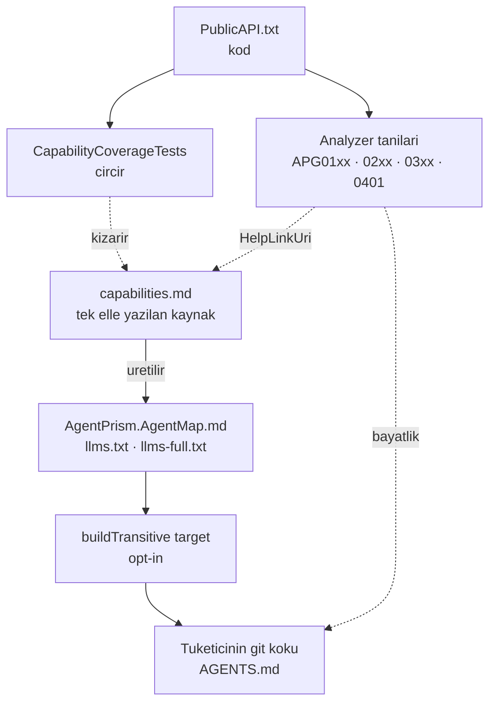

# Faz 73 — Tüketici Agent Desteği

> **Durum:** ✅ Tamamlandı (2026-08-19)
> **Kaynak:** [ADAYLAR.md](ADAYLAR.md) · **F-120**
> **Önkoşul:** [Faz 52](52-KAYNAK-URETECI.md) — generator paketleme borusu ve `APG` tanı deseni oradan devralınır · [Faz 59](59-URUN-DOKUMANTASYONU.md) — `capabilities.md` ve `docs-site/scripts/` üreteç deseni
> **Paketler:** `AgentPrism.Generators`, `AgentPrism.Core` (yalnız paketleme), `AgentPrism.Templates` · `docs-site/`
> **Yeni paket:** Yok · **Migration:** Yok
> **Public API:** **Büyümüyor.** Analyzer, MSBuild target ve üretilen dosyalar public API yüzeyi değildir; `PublicAPI.*.txt` bu fazda değişmez. Ölçüldü: `wc -l src/*/PublicAPI.Shipped.txt` her paket için 1 satır (hepsi boş)
> **Site etkisi:** `capabilities.md` **kaynak rolü kazanır** · yeni üretilen `docs-site/public/llms.txt` ve `llms-full.txt` · yeni üreteç `docs-site/scripts/build-agent-map.mjs` · `check-content.mjs` genişler
> **Manuel test alanı:** `docs/manuel-test/29-AGENT-DESTEGI.md` (28 numarayı Faz 64 aldı)

---

## Bu Faza Başlarken

> `faz-baslangic` skill'ini uygula. Aşağıdaki liste o skill'in 2. adımıdır —
> **tamamını değil, yalnız işaret edilen bölümleri oku.**

1. Bu doküman
2. Kararlar — dosyanın tamamını **okuma**, yalnız bu kalemleri grep'le:
   ```bash
   grep -n "K-007\|K-059\|K-228\|K-263\|K-413\|K-421" docs/KARARLAR.md
   ```
   **K-413** (üretilen dosya elle yazılmaz — bu fazın `AGENTS.md` tasarımının
   dayanağı), **K-421** (public API takibi açık; bu faz yüzeyi büyütmez),
   **K-263** (`AgentPrism.Generators`'ın tekil `TargetFramework` deseni — yeni
   analyzer aynı projeye girer), **K-007** (yeni paket gerekçe ister — bu faz
   **yeni paket açmaz**), **K-059** (`secret` veritabanına yazılmaz — `APG0201`
   tanısının kaynağı), **K-228** (arayüz sözlüğü; bu faz arayüze **dokunmaz**).
3. [`52-KAYNAK-URETECI.md`](52-KAYNAK-URETECI.md) — yalnız devir notu:
   ```bash
   awk '/## Sonraki Faza Devir Notu/,0' docs/52-KAYNAK-URETECI.md
   ```
   Generator DLL'inin `analyzers/dotnet/cs/` altına nasıl taşındığı ve `APG`
   tanı numaralandırması oradan devralınır. Bu faz aynı boruyu kullanır.
4. Alan hafızası (bu faz iki alana dokunuyor):
   [`hafiza/build-ve-analyzer.md`](hafiza/build-ve-analyzer.md) (**ana kaynak** —
   paketleme, analyzer yükleme, `TreatWarningsAsErrors` etkileşimi),
   [`hafiza/test-altyapisi.md`](hafiza/test-altyapisi.md) (cırcır testi deseni)
5. Gerektiğinde, tamamı değil ilgili bölümü:
   [`MIMARI.md`](MIMARI.md) — paketleme bölümü

---

## Amaç

AgentPrism'i entegre eden back-end uygulamalarının **kod agent'ları** paketin
yeteneklerine hâkim değildir. Var olduğunu bilmedikleri yeteneği kullanmazlar;
onun yerine elle yeniden yazarlar. Bu faz o boşluğu iki mekanizmayla kapatır ve
mekanizmaların kod ile hizada kalmasını bir teste bağlar.

- **F-120** — Paket, kendisini tüketen kod agent'ına iki kanaldan öğretir:
  derleme anında **tanılar** (Katman 0) ve oturum başında okunan **üretilmiş bir
  yetenek haritası** (Katman 1). Haritanın kod ile hizası
  `CapabilityCoverageTests` cırcır testiyle korunur.

Kapsam dışı: geliştirici MCP sunucusu (Katman 2) — `ADAYLAR.md` **F-121**,
ayrı faz olarak planlanacak.

### Bugün ne çalışmıyor — doğrulanmış kanıt

| Kanıt | Gözlem |
|---|---|
| [`docs-site/src/content/docs/api/`](../docs-site/src/content/docs/api/) | 922 dosya, 4.7 MB. [`http-api/`](../docs-site/src/content/docs/http-api/) 494 dosya, 2.1 MB. Toplam ~1.7 M token — hiçbir agent bağlamına sığmaz |
| Elle yazılmış anlatı (`concepts` + `guides` + `getting-started` + `reference` + kök sayfalar) | ~384 KB ≈ ~96 K token. Tek seferlik bile pahalı, her oturum imkânsız |
| [`docs-site/src/content/docs/capabilities.md`](../docs-site/src/content/docs/capabilities.md) | 219 satır, 17 458 bayt, 11 bölüm. Doğru şekle **sahip** ama agent'ın eline hiçbir yoldan geçmiyor |
| `grep -rn "llms" docs/ docs-site/src` | **Boş.** `llms.txt` yok — siteyi çeken agent için giriş noktası yok |
| [`src/AgentPrism.Templates/content/AgentPrism.Starter/`](../src/AgentPrism.Templates/content/AgentPrism.Starter/) | 6 dosya; `AGENTS.md` **yok**. Template ile gelen projede agent'a hiçbir harita düşmüyor |
| `grep -rn "contentFiles\|buildTransitive" src/*/*.csproj` | **Boş.** Pakete giren MSBuild aparatı bugün yok |
| [`AgentPrism.Core.csproj:63`](../src/AgentPrism.Core/AgentPrism.Core.csproj#L63) | Generator DLL'i `analyzers/dotnet/cs` altına **zaten** taşınıyor — tanı borusu kurulu, yeniden inşa gerekmiyor |
| [`ToolDiagnostics.cs`](../src/AgentPrism.Generators/ToolDiagnostics.cs) | `APG0001`–`APG0007` var. `APG0003` mesajı düzeltmeyi **içeriyor** (`AddTool(AIFunctionFactory.Create(...))`) — genişletilecek desen budur |
| `grep -rln "PublicAPI" tests/ --include='*.cs'` | **Boş.** 6905 satırlık makine okunur yüzeyi hiçbir test okumuyor |
| [`check-content.mjs:41`](../docs-site/scripts/check-content.mjs#L41) | `requiredCapabilityEvidence` **elle bakılan** 26 kalemlik liste. Kaldırmayı yakalar, **eklemeyi yakalamaz** |
| `PublicAPI.Unshipped.txt` taraması | 17 `Use*`, 2 `Map*`, 8 `IAgentPrismBuilder` üyesi var. **17 `Use*` üyesinin 9'u** (`UseMcp`, `UseOpenAI`, `UsePostgreSql`, `UseSqlServer`, `UseSqlite`, `UseTenancy`, `UseUI`, `UseVoice`, `UseWorkflows`) `requiredCapabilityEvidence` kapısının dışında |

> Kanıtlar 2026-08-18 tarihinde doğrulandı.

🚨 Son satır dikkatle okunmalı. Dokuz üyenin **dokuzu da** `capabilities.md`
içinde bugün geçiyor — harita eksik **değil**. Eksik olan onları orada tutan
kapıdır. 18. yetenek eklendiğinde hiçbir test kızarmaz.

---

## 73.1 — Katmanların sınırı



Bu fazda **iki** üretim yönü vardır ve karıştırılmaz:

| Yön | Kaynak | Çıktı | Kim üretir |
|---|---|---|---|
| Harita | `capabilities.md` | `AgentPrism.AgentMap.md`, `llms.txt`, `llms-full.txt` | `build-agent-map.mjs` (Node) |
| Kapı | `PublicAPI.*.txt` | test sonucu | `CapabilityCoverageTests` (.NET) |

Harita **commit edilir** — `AgentPrism.Core` paketi onu `dotnet pack` anında
okur ve Node zinciri `dotnet build`'e bağlanmaz.

---

## 73.2 — Katman 1: üretilen yetenek haritası

### Üreteç

Yeni script: `docs-site/scripts/build-agent-map.mjs`. Kaynağı `capabilities.md`,
üç çıktısı vardır:

| Çıktı | Yol | İçerik | Hedef boyut |
|---|---|---|---|
| Paket haritası | `src/AgentPrism.Core/buildTransitive/AgentPrism.AgentMap.md` | Paket→iş tablosu · zorunlu bağlama · sınırlar · "şuna bak" tablosu | **≤ 10 KB** (Sapma 1) |
| Site haritası | `docs-site/public/llms.txt` | Aynı harita + tam metin adresi | ≤ 10 KB |
| Tam anlatı | `docs-site/public/llms-full.txt` | `concepts` + `guides` + `getting-started` + `reference` + kök sayfalar birleştirilmiş | ölçüldü: **356 KB** |

`api/` ve `http-api/` **hiçbirine girmez**. O yüzeyi derleyici ve XML dokümanı
kapatır; haritaya koymak bütçeyi yakar ve hiçbir şey kazandırmaz.

Harita ilk satırında **içerik revizyonu** taşır (Sapma 2 — paket sürümü değil):

```markdown
<!-- AgentPrism agent map · revision: e4c7b05b · generated by docs-site/scripts/build-agent-map.mjs -->
```

Bu satır `APG0401` tanısının okuduğu tek veridir.

### Teslimat — opt-in

K1 ("sıfır sürpriz") korunur. Target **hiçbir şey yapmaz** ta ki tüketici
açıkça istemeyene kadar:

```xml
<PropertyGroup>
  <AgentPrismWriteAgentsFile>true</AgentPrismWriteAgentsFile>
</PropertyGroup>
```

`src/AgentPrism.Core/buildTransitive/AgentPrism.Core.targets` davranışı:

1. Özellik `true` değilse **çık**.
2. Git kökünü bul: `$(MSBuildProjectDirectory)`'den yukarı doğru `.git` ara.
   Bulunamazsa proje dizinine düş ve bir `Message` ile bunu bildir.
3. Hedefte `AGENTS.md` **varsa** hiçbir şey yapma. **Var olan dosya asla
   ezilmez** — tüketici onu elle düzenlemiş olabilir.
4. Yoksa `AgentPrism.AgentMap.md`'yi `AGENTS.md` olarak kopyala.

`buildTransitive/` seçilir çünkü tüketici çoğu zaman `AgentPrism` meta paketini
referanslar; `build/` geçişli referansta çalışmaz.

Template ([`AgentPrism.Starter.csproj`](../src/AgentPrism.Templates/content/AgentPrism.Starter/AgentPrism.Starter.csproj))
özelliği `true` yazar. Böylece `dotnet new agentprism-api` kullanan geliştirici
hiçbir şey yapmadan haritayı alır; mevcut projeler bilinçli olarak açar.

🚨 Opt-in kararının bedeli **benimseme oranıdır**. Özelliği açmayan repo'da
agent haritayı hiç görmez. Katman 0 o repo'da tek savunmadır; `APG03xx`
ailesinin kapsamı bu yüzden dar tutulamaz.

### Yenileme

Paket yükseltilince harita bayatlar. Yenileme yolu **dosyayı silmek ve yeniden
build etmektir**. Yeni komut ve yeni paket yoktur. `APG0401` bayatlığı bildirir
ve bu iki adımı mesajında yazar.

---

## 73.3 — Katman 0: tanı aileleri

Yeni tip: `AgentPrism.Generators/AgentPrismUsageAnalyzer.cs` —
`DiagnosticAnalyzer`, mevcut `ToolRegistrationGenerator` ile **aynı projede**
(netstandard2.0, K-263 deseni) ve aynı DLL ile sevk edilir. Yeni paketleme işi
yoktur.

| Aile | Aralık | Seviye | Ne yakalar |
|---|---|---|---|
| Bağlama | `APG0101`–`APG0199` | Warning | Çalışma anında hata verecek eksik kurulum |
| Sınır | `APG0201`–`APG0299` | Warning | Gevşetilmeyen kuralların ihlali |
| Yetenek keşfi | `APG0301`–`APG0399` | Warning | Elle yazılmış, pakette hazır olan iş |
| Harita bayatlığı | `APG0401` | Warning | `AGENTS.md` kurulu haritadan eski |

🚨 **Altısı da `Warning`'dir ve bu seçim değil ölçümdür** (Sapma 5): `Info`
tanıları `dotnet build` çıktısına **hiçbir ayrıntı seviyesinde düşmez**. Katman
0'ın tek okuru o çıktı olduğu için `Info` pratikte tanıyı kapatmak demekti.
Kaçış tek satırdır: `<AgentPrismUsageDiagnostics>false</AgentPrismUsageDiagnostics>`
— hedef aileyi `$(NoWarn)`'a ekler.

### Bu fazın kapsamındaki tanılar

> Liste **kapalıdır**. Yeni tanı eklemek sonraki fazın işidir; bu faz deseni ve
> kapıyı kurar.

| Id | Mesajın özü |
|---|---|
| `APG0101` | `MapAgentPrism()` çağrıldı, `AddAgentPrism()` çağrılmadı |
| `APG0102` | Model bağlaması yerleşik bir sağlayıcı adı taşıyor ama derleme onu hiç kaydetmiyor (Sapma 3) |
| `APG0201` | `AgentDefinition` içine düz `secret` yazıldı — yapılandırma anahtarının **adı** verilmeli (K-059) |
| `APG0301` | Elle `IChatClient` sarmalayan yeniden deneme döngüsü — paket bunu sunuyor |
| `APG0302` | Sarmalayıcı var ama derlemede hiç `IAgentDecorator` yok (Sapma 4) |
| `APG0401` | `AGENTS.md` revizyon işareti kurulu paketinkinden farklı |

Her mesaj `APG0003` desenini izler: **yanlışı söyler ve doğru API'yi öğretir.**
Her tanı bir `HelpLinkUri` taşır ve `capabilities.md` içindeki gerçek bir
başlığa çözülür.

---

## 73.4 — Kapı: `CapabilityCoverageTests`

Bu fazın en yüksek değerli parçasıdır. Bugün korunmayan yönü kapatır: **kod
büyür, harita geride kalır.**

Yeri: `tests/AgentPrism.Core.UnitTests/Architecture/CapabilityCoverageTests.cs` —
[`SourceLanguageTests.cs`](../tests/AgentPrism.Core.UnitTests/Architecture/SourceLanguageTests.cs)
ile **aynı cırcır mekaniği**. Yeni bir kavram getirilmez.

Çalışma sırası:

1. `src/*/PublicAPI.Shipped.txt` ve `PublicAPI.Unshipped.txt` dosyalarını oku.
2. Yetenek girişi olan üyeleri süz: `IAgentPrismBuilder`'ın kendi üyeleri ve
   `Add*`/`Use*`/`Map*` extension metotları — alıcısı `IAgentPrismBuilder`,
   `IServiceCollection`, `IHostApplicationBuilder`, `IHealthChecksBuilder` veya
   `IEndpointRouteBuilder` olanlar (Sapma 6, kullanıcı kararı). Ölçülen sayım:
   **39 ayrık üye** (8 arayüz üyesi + 24 builder extension'ı + 3 `Map*` +
   `AddAgentPrism`/`AddJobHandler`/`UseScheduling`/`AddAgentPrismHealthChecks`).
3. Her üye adının `capabilities.md` içinde geçtiğini doğrula.
4. Geçmeyeni `capability-coverage-baseline.txt` ile karşılaştır.
   **Taban çizgisi yalnız küçülür** — `SourceLanguageTests`'in kuralı.
5. Taban çizgisinde olup artık kapsanan üye varsa da kızar ("taban çizgisi
   bayat") — böylece liste kendiliğinden temizlenir.

Taban çizgisi bu fazda **boş doğdu** — ama dört üye önce haritaya eklendi
(`Configure`, `Services`, `AddToolApprovalPolicy`, `AddWorkflowFunction`).
Kapı ilk günden yeşildir ve **40. üyeyi yakalar**; iki yönde de kızardığı
gösterildi (Manuel Kabul, MT-AGD-013).

Yenileme, `SourceLanguageTests` ile aynı ortam değişkeni deseniyle yapılır.

---

## 73.5 — Kapı: tanı bütünlüğü

Katman 0'ın kendi kayması şudur: tanı bir API önerir, API yeniden adlandırılır,
tanı **yanlış öğretmeye devam eder**. Yanlış öğreten tanı, tanı olmamasından
kötüdür.

`tests/AgentPrism.Generators.UnitTests/DiagnosticIntegrityTests.cs` iki iddia
kurar:

- Her tanı mesajında geçen AgentPrism API adı `PublicAPI.*.txt` içinde **var**
- Her `HelpLinkUri` `capabilities.md` içindeki gerçek bir başlığa **çözülür**

İkincisi Katman 0 ile Katman 1'i bağlar: haritadan bölüm silinirse tanı testi
kızarır.

---

## 73.6 — `check-content.mjs` genişlemesi

Mevcut script ([348 satır](../docs-site/scripts/check-content.mjs)) zaten
"Landing-page metric drift" denetimi yapıyor. Aynı desene üç iddia eklenir:

- `AgentPrism.AgentMap.md` üreteci yeniden koşulduğunda **diff boş** olmalı
- `llms.txt` ve `llms-full.txt` için aynı
- Harita `≤ 10 KB` bütçesini aşmamalı

---

## Planlanan Public API

Bu faz **public API yüzeyini büyütmez**. Yerine üç sözleşme kurar:

### MSBuild özelliği

```xml
<!-- Varsayılan: boş (kapalı). K1 — sıfır sürpriz. -->
<AgentPrismWriteAgentsFile>true</AgentPrismWriteAgentsFile>
```

### MSBuild özelliği (ikinci)

```xml
<!-- Varsayılan: boş (açık). Aileyi $(NoWarn)'a ekler. -->
<AgentPrismUsageDiagnostics>false</AgentPrismUsageDiagnostics>
```

### Tanı numaraları

`APG0101`, `APG0102`, `APG0201`, `APG0301`, `APG0302`, `APG0401` — kategori
`AgentPrism.Usage` (mevcut `AgentPrism.Tools` kategorisinden **ayrı**, böylece
tüketici tek özellikle veya `.editorconfig` ile aileyi toptan bastırabilir).

### Paket içeriği

```
AgentPrism.Core.nupkg
├── analyzers/dotnet/cs/AgentPrism.Generators.dll   (mevcut, genişler)
└── buildTransitive/
    ├── AgentPrism.Core.targets                     (yeni)
    └── AgentPrism.AgentMap.md                      (yeni, üretilen)
```

### Arayüz payı

Yok — bu faz arayüze dokunmaz.

---

## Planlanan Dosya Listesi

```
src/AgentPrism.Generators/
├── AgentPrismUsageAnalyzer.cs          (yeni)
└── UsageDiagnostics.cs                 (yeni — ToolDiagnostics deseni)

src/AgentPrism.Core/
├── buildTransitive/
│   ├── AgentPrism.Core.targets         (yeni)
│   └── AgentPrism.AgentMap.md          (yeni, üretilen, commit edilir)
└── AgentPrism.Core.csproj              (değişir — buildTransitive paketleme)

src/AgentPrism.Templates/content/AgentPrism.Starter/
└── AgentPrism.Starter.csproj           (değişir — özellik true)

docs-site/
├── scripts/build-agent-map.mjs         (yeni)
├── scripts/check-content.mjs           (değişir)
└── public/llms.txt, llms-full.txt      (yeni, üretilen)

tests/AgentPrism.Core.UnitTests/Architecture/
├── CapabilityCoverageTests.cs          (yeni)
└── capability-coverage-baseline.txt    (yeni, boş doğar)

tests/AgentPrism.Generators.UnitTests/
├── DiagnosticIntegrityTests.cs         (yeni)
└── UsageAnalyzerTests.cs               (yeni)

tests/AgentPrism.Templates.Tests/
└── TemplateAgentsFileTests.cs          (yeni)

docs/manuel-test/29-AGENT-DESTEGI.md    (yeni; 28 numarayi Faz 64 aldi)
```

---

## Hata Modları ve Testler

| Ne bozulabilir | Seviye | Test sınıfı |
|---|---|---|
| Yeni `Use*` eklenir, `capabilities.md` güncellenmez | Birim (cırcır) | `CapabilityCoverageTests` |
| Taban çizgisi bayatlar — kapsanan üye listede kalır | Birim | `CapabilityCoverageTests` |
| Tanı mesajı artık var olmayan bir API önerir | Birim | `DiagnosticIntegrityTests` |
| `HelpLinkUri` silinmiş bir başlığa işaret eder | Birim | `DiagnosticIntegrityTests` |
| Analyzer doğru kodda yanlış pozitif verir | Birim | `UsageAnalyzerTests` |
| `APG0101` `AddAgentPrism()` başka dosyada çağrılınca yanılır | Birim | `UsageAnalyzerTests` |
| Target var olan `AGENTS.md`'yi ezer | **Fonksiyonel** (gerçek `dotnet build`) | `TemplateAgentsFileTests` |
| Özellik kapalıyken target yine de yazar | **Fonksiyonel** | `TemplateAgentsFileTests` |
| Git kökü yokken target çöker | **Fonksiyonel** | `TemplateAgentsFileTests` |
| Çok projeli çözümde iki kopya oluşur | **Fonksiyonel** | `TemplateAgentsFileTests` |
| `buildTransitive` meta paket üzerinden akmaz | **Fonksiyonel** (paket kurulumu) | `TemplateAgentsFileTests` |
| Üretilen harita commit'ten sapar | Manuel/CI | `check-content.mjs` |
| Harita 10 KB bütçesini aşar | Manuel/CI | üreteç + `check-content.mjs` |

Target davranışı **paket sınırını** geçer; birim testi onu kanıtlamaz. Bu
yüzden beş target case'i de gerçek `dotnet build` üzerinde koşar —
[`AgentPrism.Templates.Tests`](../tests/AgentPrism.Templates.Tests/) bu altyapıya
zaten sahiptir.

Beş soru:

| Soru | Cevap |
|---|---|
| İptal | Yok — analyzer ve target senkron çalışır |
| Eşzamanlılık | Paralel build'de iki proje aynı `AGENTS.md`'ye yazabilir. Target dosya varsa yazmaz; yarış zararsızdır ama `TemplateAgentsFileTests` çok projeli case'i koşar |
| Boş/aşırı girdi | `capabilities.md` boşsa üreteç **hata vermeli**, boş harita üretmemeli |
| Başka kiracı | Konu dışı — bu faz çalışma anına dokunmaz |
| Alt sistem hatası | Git kökü bulunamazsa target çökmez, proje dizinine düşer ve `Message` yazar |

---

## Manuel Kabul Case'leri

| # | Ön koşul | Adımlar | Beklenen sonuç |
|---|---|---|---|
| 1 | Boş `dotnet new web` projesi, `AgentPrism.Core` referanslı | `dotnet build` | `AGENTS.md` **oluşmaz** — özellik kapalı (K1) |
| 2 | Aynı proje, `AgentPrismWriteAgentsFile=true` | `dotnet build` | Git kökünde `AGENTS.md` oluşur, ≤ 10 KB, revizyon işareti taşır |
| 3 | `AGENTS.md` elle düzenlenmiş | `dotnet build` | Dosya **değişmez**; düzenleme korunur |
| 4 | `dotnet new agentprism-api` | `dotnet build` | `AGENTS.md` kendiliğinden oluşur — template özelliği açar |
| 5 | `MapAgentPrism()` var, `AddAgentPrism()` yok | `dotnet build` | `APG0101` uyarısı; mesaj eksik çağrıyı yazar |
| 6 | `AgentDefinition` içine düz API anahtarı | `dotnet build` | `APG0201` uyarısı; mesaj yapılandırma anahtarı adını önerir |
| 7 | Elle yeniden deneme döngüsü | `dotnet build` | `APG0301` uyarısı; `AgentPrismUsageDiagnostics=false` ile susar |
| 8 | `AGENTS.md` eski revizyon işaretli | `dotnet build` | `APG0401` uyarısı; sil-ve-derle yolunu yazar |
| 9 | `capabilities.md`'den bir `Use*` silinir | `dotnet test` | `CapabilityCoverageTests` kızarır |
| 10 | Yeni `UseSomething()` eklenir, harita güncellenmez | `dotnet test` | `CapabilityCoverageTests` kızarır ve üyeyi adıyla söyler |

---

## Açık Sorular

| # | Soru | Seçenekler | Öneri |
|---|---|---|---|
| 1 | `APG01xx` ve `APG02xx` seviyesi | A: `Warning` · B: `Info` | **A.** İkisi de çalışma anında hata veren gerçek kusurlardır. `TreatWarningsAsErrors` açık tüketicide build kırılır — bu **doğru** sonuçtur. Tüketici `.editorconfig` ile bastırabilir |
| 2 | `llms-full.txt` gerçekten üretilsin mi | A: Üret · B: Yalnız `llms.txt` | **A**, ama boyutu ölçüldükten sonra karar verilir. ~384 KB tek dosya bazı agent'lar için kullanışlı, çoğu için değil |
| 3 | `APG0302` (MAF sarmalama) yanlış pozitif riski taşır mı | — | Uygulamada ölçülmeli. Riskliyse bu fazdan **çıkarılır** ve ayrı kalem olur |
| 4 | Harita üreteci `dotnet build`'e bağlansın mı | A: Hayır, elle koşulur + `check-content` denetler · B: Evet | **A.** Node zinciri `dotnet build`'e bağlanmaz; `docs-site` ayrı yayın hattıdır |

---

## Bitiş Ölçütleri (DoD)

- [x] `AgentPrismWriteAgentsFile` kapalıyken `dotnet build` hiçbir dosya yazmaz — `Property_unset_writes_no_file`, gerçek paket
- [x] Özellik açıkken git kökünde ≤ 10 KB `AGENTS.md` oluşur; var olan dosya ezilmez — ölçüldü: **7763 bayt**; elle düzenlenen dosya iki build sonra bayt bayt aynı
- [x] `dotnet new agentprism-api` ile oluşan projede `AGENTS.md` kendiliğinden gelir — `A_generated_project_gets_the_map_without_being_asked`
- [x] Altı tanının altısı da gerçek bir tüketici projesinde tetiklendi; çıktı aşağıda
- [x] `CapabilityCoverageTests` yeşil; taban çizgisi **boş**; iki yönde de kızardığı gösterildi (üye haritadan silinince, API'ye yeni üye eklenince)
- [x] `DiagnosticIntegrityTests` yeşil — ve denetimden sonra **gerçekten** kızardığı gösterildi (mesajdaki `AddAgentPrism()` yeniden adlandırıldı → kırmızı)
- [x] `llms.txt` (7861 B) ve `llms-full.txt` (356 KB) üretildi; `check-content.mjs` diff'i boş buldu
- [x] Dört doğrulama kapısı sıfır uyarı verir — denetim düzeltmelerinden sonra tekrarlandı: **4394 test, 0 başarısız**. İlk koşumdaki tek Playwright düşüşü ikinci koşumda tekrarlamadı (F-102/F-122 sınıfı kırılganlık; bu fazın kodu arayüze dokunmuyor)
- [x] `samples/AgentPrism.Api` ile gerçek `run` yapıldı — `claude-support`, `Completed`, SSE akışı (çıktı aşağıda)
- [x] `secret` taraması boş döndü — `src/`, `tests/`, `samples/` içinde sıfır eşleşme
- [x] Manuel kabul case'leri `docs/manuel-test/29-AGENT-DESTEGI.md` içine eklendi (15 case); on birinin tamamı otomatik testte de koşuyor
- [x] `faz-denetim` koşuldu; 3 🔴 + 4 🟡 bulgu **kapatıldı**, 🔴 kalmadı
- [x] `docs-site/` güncellendi; `npm run build` + `check-links.mjs` temiz

### Gerçek çıktı — altı tanı, tek tüketici derlemesi

```text
Program.cs(7,1):   warning APG0101: 'MapAgentPrism()' is called, but this compilation never calls 'AddAgentPrism()'. ...
Program.cs(16,47): warning APG0102: The model binding names provider 'anthropic', but this compilation never calls 'UseAnthropic()'. ...
Program.cs(53,41): warning APG0201: 'McpServerDefinition.AuthorizationConfigurationKey' carries a literal secret value. ...
Program.cs(22,21): warning APG0301: 'RetryingChatClient' retries a chat client call by hand. ...
Program.cs(20,21): warning APG0302: 'LoggingAgent' wraps another agent, but this compilation implements no 'IAgentDecorator'. ...
AGENTS.md(1,1):    warning APG0401: 'AGENTS.md' was generated from capability map revision '00000000', but the installed AgentPrism ships revision 'e4c7b05b'. ...
```

`rm AGENTS.md && dotnet build` sonrası: `APG0401` sayısı **0**, dosya yeniden
yazıldı (`revision: e4c7b05b`, 7763 bayt).
`-p:AgentPrismUsageDiagnostics=false` ile: altı tanının **hiçbiri** çıkmıyor.

### Gerçek çıktı — örnek uygulama

```text
POST /agentprism/api/agents/claude-support/run   → SSE
  event: run     {"runId":"01a01b53-2f08-7801-a45a-83e01e93f464"}
  event: update  ... (Anthropic gercek yaniti)
GET  /agentprism/api/runs?limit=1
  {"id":"01a01b53-...","agentName":"claude-support","status":"Completed"}
```

Depo kökündeki `AGENTS.md` **değişmedi**: örnek uygulama `ProjectReference`
kullanır, `buildTransitive` yalnız paket tüketicisine akar.

### Doğrulama komutları

```bash
# Kapali iken dosya olusmaz
dotnet build /tmp/tuketici/Tuketici.csproj && test ! -f /tmp/tuketici/AGENTS.md && echo OK

# Acik iken olusur ve butcede kalir
dotnet build /tmp/tuketici/Tuketici.csproj -p:AgentPrismWriteAgentsFile=true
wc -c /tmp/tuketici/AGENTS.md   # <= 10240

# Kapinin gercekten yakaladigi gosterilir
dotnet test --filter CapabilityCoverageTests
```

---

## Riskler

| Risk | Önlem |
|------|-------|
| Opt-in yüzünden benimseme düşük kalır; agent haritayı çoğu repo'da görmez | Template özelliği açar · `llms.txt` siteden erişilebilir · `APG03xx` ailesi tek savunma olarak yeterli kapsamda tutulur |
| `APG0301`/`APG0302` yanlış pozitif üretir ve gürültüye dönüşür | İkisi de daraltıldı (Sapma 4, Denetim 🟡 6/7): `APG0302` yalnız dekoratörsüz **ve** fabrika agent'ı olmayan derlemede, `APG0301` yalnız `catch` içeren döngüde bildirir · kaçış tek özelliktir |
| `buildTransitive` meta paket üzerinden akmaz, target hiç çalışmaz | `TemplateAgentsFileTests` bunu gerçek paket kurulumuyla koşar — birim testiyle kanıtlanamaz |
| Üretilen harita commit edilmeyi unutulur, paket bayat harita sevk eder | `check-content.mjs` diff'i denetler; `faz-tamamlama` Adım 7'de koşulur |
| `capability-coverage-baseline.txt` kaçış kapısına dönüşür | Cırcır yalnız küçülür · bayat taban çizgisi de kızarır · `faz-denetim` taban çizgisi büyümesini 🔴 sayar |
| 10 KB bütçesi zamanla aşılır, harita yeniden okunamaz hâle gelir | Üreteç ve `check-content.mjs` bütçeyi zorlar; aşımda içerik **silinmez**, `llms-full.txt`'e taşınır |

---

<!-- ============================================================
     AŞAĞISI KAPANIŞTA DOLDURULUR — `faz-tamamlama` skill'i.
     Plan anında boş kalır. Başlıkları SİLME.
     ============================================================ -->

## Plandan Sapmalar

**1 — Harita bütçesi 6 KB değil 10 KB.** Ölçüldü: eksiksiz harita (17 paket ·
100 yetenek satırı · 12 bölüm kuralı · adresler) **7.735 bayt**. 6 KB'a
sığdırmanın tek yolu ~25 yeteneği haritadan çıkarmaktı — kapının bütün amacı
eksiksizlikti, yani bütçe içeriği değil içerik bütçeyi belirledi. Yeni bütçe
10.240 bayt (≈2500 token, bugün %76 dolu). Üreteç aşımda **hata verir**;
`check-content.mjs` ve `TemplateAgentsFileTests` aynı sayıyı zorlar.

**2 — Sürüm işareti paket sürümü değil, içerik revizyonu.** Plan
`sürüm: 1.4.0` yazıyordu. MinVer sürümü her commit'te değişir
(`0.0.0-preview.0.271`), yani harita her commit'te "bayat" görünürdü. İşaret
artık harita gövdesinin SHA-256'sının ilk 8 hanesidir. `APG0401` tüketicinin
dosyasını **paketin taşıdığı haritayla** karşılaştırır; iki dosya da
`AdditionalFiles` olarak gelir, çünkü analyzer diskten okuyamaz (RS1035).

**3 — `APG0102` yeniden tanımlandı.** Plandaki tanım ("`Use<Sağlayıcı>()`
çağrıldı ama sağlayıcı paketi referanslanmamış") **tespit edilemez**: paket
yoksa çağrı zaten `CS1061` ile derlenmez. Yerine gerçek ve tespit edilebilir
kusur kondu: `ModelBinding.Provider` yerleşik bir sağlayıcı adı taşıyor ama
derleme o sağlayıcıyı hiç kaydetmiyor. `AddModelProvider` veya
`UseOpenAICompatible` varsa tanı susar — tüketici sağlayıcısı her adı
karşılayabilir.

**4 — `APG0302` daraltıldı; plan hâli AgentPrism'in kendisini yakaladı.** İlk
uygulama "`AIAgent` sarmalayıcısı" diyordu. `dotnet pack` `AgentPrism.Core`'un
**kendi** `RunRecordingAgent` ve `ReplayMismatchGuard` sınıflarında hata verdi
(Core, üreteç projesini `OutputItemType=Analyzer` ile referanslar, yani kendi
analyzer'ını kendi üzerinde koşturur). Sarmalayıcı kusur değildir —
`IAgentDecorator`'ın işini yapma biçimidir. Kural iki kez daraltıldı: derlemede
hiç `IAgentDecorator` uygulaması **ve** hiç `AddAgent(name, factory)` çağrısı
yoksa bildirilir. Açık Soru 3'ün "riskliyse fazdan çıkarılır" yolu
kullanılmadı; tanı daraltılarak korundu. `APG0301` de aynı sebeple daraltıldı:
döngü bir `catch` içermelidir, yoksa hız sınırlayan bir istemci yanlışlıkla
"elle yeniden deneme" sayılır.

**5 — Tanı seviyesi `Info` değil `Warning`** *(kullanıcı kararı, ölçümle)*.
Açık Soru 1 önce `Info`ya çevrildi (çapraz-assembly yanlış pozitifi build
kırmasın diye). Sonra ölçüldü: **`Info` tanıları `dotnet build` çıktısına
hiçbir ayrıntı seviyesinde düşmüyor** — `-v:normal` ve `-t:Rebuild` ile de yok;
`.editorconfig` ile `warning`e çıkarılınca üçü de görünüyor. Katman 0'ın tek
okuru o çıktı olduğu için `Info` pratikte tanıyı kapatmak demekti. Altısı da
`Warning` oldu ve tek satırlık kaçış eklendi:
`AgentPrismUsageDiagnostics=false` → hedef aileyi `$(NoWarn)`'a ekler.

**6 — `CapabilityCoverageTests` kapsamı genişletildi** *(kullanıcı kararı)*.
Plandaki filtre (`IAgentPrismBuilder` üyeleri + `Use*`/`Map*`)
`AddToolApprovalPolicy` ve `AddWorkflowFunction`'ı dışarıda bırakıyordu;
`Configure` ve `Services` ise kapsanmadığı için taban çizgisi boş doğamazdı.
Kapsam **tüm kayıt giriş noktaları** oldu: alıcısı `IAgentPrismBuilder`,
`IServiceCollection`, `IHostApplicationBuilder`, `IHealthChecksBuilder` veya
`IEndpointRouteBuilder` olan her `Add*`/`Use*`/`Map*` — ölçülen **39 üye**.
Dört üye `capabilities.md`'ye eklendi; taban çizgisi DoD'nin istediği gibi
**boş** doğdu.

**7 — Manuel test dosyası 28 değil 29.** 28 numarayı Faz 64 aldı
(`28-DENETIM-ZINCIRI-VE-VERI-HAKLARI.md`).

**8 — `ToolDiagnostics` (APG0001–0007) de `HelpLinkUri` kazandı.**
`DiagnosticIntegrityTests` bütün `APG` ailesini denetliyor; yedi eski tanının
yardım bağlantısı hiç yoktu. Hepsi `#tools-skills-and-context` bölümüne çözülür.

**9 — Plan dışı düzeltme: `TemplateFixture` global paket önbelleğini
temizliyor.** MinVer sürümü commit'ler arasında sabit olduğu için yeniden
paketlenen `.nupkg` NuGet tarafından **hiç açılmıyor**; tüketici testleri günün
ilk paketine karşı koşuyordu. Bu fazda analyzer değişikliği **üç koşum boyunca**
görünmedi ve teşhis bu oldu. `ClearGlobalPackageCache` eklendi. Bu bir test
altyapısı kusurudur ve bu fazdan öncesini de etkiliyordu.

**10 — `buildTransitive` paketlemede `<None Update>` sessizce çalışmıyor.**
SDK'nın varsayılan `None` glob'u yalnız **iç** (TFM'e özgü) derlemelerde
uygulanır; `dotnet pack` paket dosyalarını **dış** çapraz-hedefleme
derlemesinde toplar. Ölçüldü: dışarıda 2, içeride 7 `None` öğesi. `Update`
hiçbir şeyle eşleşmiyor ve dosyalar **uyarısız** pakete girmiyor. Çözüm
`Remove` + `Include`.

## Bu Fazda Verilen Kararlar

| # | Karar |
|---|---|
| **K-505** | Yetenek haritası `capabilities.md`'den üretilir, commit edilir ve `dotnet pack` onu okur; Node zinciri `dotnet build`'e bağlanmaz |
| **K-506** | `AgentPrism.Usage` tanıları `Warning`'dir; `Info` `dotnet build` çıktısına düşmez (ölçüldü). Kaçış tek MSBuild özelliğidir |
| **K-507** | Harita sürüm işareti **içerik revizyonudur**, paket sürümü değil |
| **K-508** | `APG0302` sarmalayıcıyı değil, **dekoratörsüz ve fabrikasız** sarmalayıcıyı bildirir |
| **K-509** | `CapabilityCoverageTests` kapsamı tüm kayıt giriş noktalarıdır (39 üye), yalnız `Use*`/`Map*` değil |

Gerekçeler `docs/KARARLAR.md`'dedir.

## Gerçekleşen Public API

**Yüzey büyümedi.** `PublicAPI.*.txt` dosyalarının hiçbiri değişmedi; tek
`public` tip `AgentPrism.Generators` içindedir ve o proje
`AgentPrismPublicApiTrackingEnabled=false` + `IsPackable=false` taşır.

```csharp
// src/AgentPrism.Generators — analyzer, pakete DLL olarak girer
[DiagnosticAnalyzer(LanguageNames.CSharp)]
public sealed class AgentPrismUsageAnalyzer : DiagnosticAnalyzer
```

Tüketiciye dönük üç sözleşme:

```xml
<!-- Varsayilan: kapali (K1). AGENTS.md'yi git kokune yazar. -->
<AgentPrismWriteAgentsFile>true</AgentPrismWriteAgentsFile>

<!-- Varsayilan: acik. Aileyi $(NoWarn)'a ekler. -->
<AgentPrismUsageDiagnostics>false</AgentPrismUsageDiagnostics>
```

| Id | Seviye | Kategori |
|---|---|---|
| `APG0101` · `APG0102` | Warning | `AgentPrism.Usage` |
| `APG0201` | Warning | `AgentPrism.Usage` |
| `APG0301` · `APG0302` | Warning | `AgentPrism.Usage` |
| `APG0401` | Warning | `AgentPrism.Usage` |

```
AgentPrism.Core.nupkg
├── analyzers/dotnet/cs/AgentPrism.Generators.dll   (mevcut, genisledi)
└── buildTransitive/
    ├── AgentPrism.Core.targets                     (yeni)
    └── AgentPrism.AgentMap.md                      (yeni, uretilen, 7763 B)
```

## Dosya Listesi (gerçekleşen)

```
src/AgentPrism.Generators/
├── AgentPrismUsageAnalyzer.cs          (yeni)
├── UsageDiagnostics.cs                 (yeni)
├── ToolDiagnostics.cs                  (degisti — HelpLinkUri)
└── AnalyzerReleases.Unshipped.md       (degisti — alti tani)

src/AgentPrism.Core/
├── buildTransitive/AgentPrism.Core.targets    (yeni)
├── buildTransitive/AgentPrism.AgentMap.md     (yeni, uretilen, commit edilir)
└── AgentPrism.Core.csproj                     (degisti — Remove+Include)

src/AgentPrism.Templates/content/AgentPrism.Starter/
└── AgentPrism.Starter.csproj           (degisti — ozellik true)

docs-site/
├── scripts/build-agent-map.mjs         (yeni)
├── scripts/check-content.mjs           (degisti — sapma + butce kapisi)
├── public/llms.txt                     (yeni, uretilen)
├── public/llms-full.txt                (yeni, uretilen)
└── src/content/docs/
    ├── capabilities.md                 (degisti — dort uye + yeni bolum)
    ├── troubleshooting.md              (degisti — tani ve harita bolumu)
    ├── packages.md                     (degisti — Core artik analyzer tasiyor)
    └── getting-started/first-agent.md  (degisti — sablonun yazdigi AGENTS.md)

tests/AgentPrism.Core.UnitTests/Architecture/
├── CapabilityCoverageTests.cs          (yeni)
└── capability-coverage-baseline.txt    (yeni, BOS)

tests/AgentPrism.Generators.UnitTests/
├── AnalyzerTestHelper.cs               (yeni)
├── UsageAnalyzerTests.cs               (yeni — 19 test)
├── DiagnosticIntegrityTests.cs         (yeni — 27 test)
└── AgentPrism.Generators.UnitTests.csproj (degisti — AspNetCore + OpenAI referansi)

tests/AgentPrism.Templates.Tests/
├── TemplateAgentsFileTests.cs          (yeni — 8 test)
└── Infrastructure/TemplateFixture.cs   (degisti — onbellek temizligi)

.github/workflows/ci.yml                (degisti — harita sapma kapisi)
docs/manuel-test/29-AGENT-DESTEGI.md    (yeni — 15 case)
docs/manuel-test/00-INDEKS.md           (degisti — satir 29)
docs/hafiza/analyzer-yazimi.md          (yeni — build-ve-analyzer.md butceyi asinca bolundu)
```

**Test sayısı:** çözüm genelinde **4394**, sıfır başarısız. Bu fazın eklediği **55 case**: 19 `UsageAnalyzerTests` · 27 `DiagnosticIntegrityTests` (13 tanı × 2 teori + 1) · 1 `CapabilityCoverageTests` · 8 `TemplateAgentsFileTests`.

## Denetim Bulguları

Bağımsız denetçi (taze bağlam, yalnız DoD + çalışma ağacı) **3 🔴 · 4 🟡 · 4 🟢**
buldu. Üç 🔴'ın üçü de gerçekti.

| # | Seviye | Bulgu | Sonuç |
|---|---|---|---|
| 1 | 🔴 | `DiagnosticIntegrityTests`'in API kapısı 13 tanının 11'inde **hiçbir şey doğrulamıyordu**: desen `'Ad()'` biçimini reddediyor, yani `MapAgentPrism()`/`AddAgentPrism()` hiç denetlenmiyordu | **Düzeltildi.** Eşleşme artık tırnağın **içinde** arıyor; iç içe çağrı (`AddTool(AIFunctionFactory.Create(...))`) iki ad üretir, dosya adı (`AGENTS.md`) elenir. Kanıt: mesajdaki `AddAgentPrism()` yeniden adlandırıldı → test kızardı |
| 2 | 🔴 | Analyzer XML dokümanı hâlâ "`Info` … can never break a build" diyordu; kod `Warning` | **Düzeltildi.** Doküman ölçümü ve kaçış özelliğini yazıyor |
| 3 | 🔴 | Faz dokümanının DoD'si ve doğrulama komutu `≤ 6 KB` / `6144` diyordu; paketlenen dosya 7763 bayt. Ayrıca `28-AGENT-DESTEGI.md`, `dotnet new agentprism`, "bilgi satırı" kalıntıları | **Düzeltildi.** Gövdenin tamamı gerçekleşene göre hizalandı |
| 4 | 🟡 | `Copy` görevi `ContinueOnError` taşımıyordu: salt-okunur depo kökü (yaygın CI mount'u) tüketicinin build'ini `MSB3021` ile kırardı — üstelik şablon özelliği varsayılan açar | **Düzeltildi.** `ContinueOnError="WarnAndContinue"`; kolaylık dosyası build'i kıramaz |
| 5 | 🟡 | Harita↔kaynak sapma kapısı **hiçbir otomatik yolda değildi**: dört kapı Node'u koşmaz, `check:content` CI'da hiç çağrılmıyordu → bayat harita sevk edilebilirdi | **Düzeltildi.** CI `build` işine bağımlılıksız `build-agent-map.mjs --check` adımı eklendi |
| 6 | 🟡 | `APG0302`, dokümante edilmiş fabrika kaçış kapısına (`AddAgent(name, factory)`) yanlış pozitif veriyordu | **Düzeltildi + test.** Fabrika çağrısı olan derlemede tanı susar |
| 7 | 🟡 | `APG0301` herhangi bir döngü + `Task.Delay`'i yeniden deneme sayıyordu; hız sınırlayan istemci yanlış teşhis alırdı | **Düzeltildi + test.** Döngü bir `catch` içermelidir |
| 8 | 🟢 | `build-agent-map.mjs` içinde ölü `anchor()` | **Silindi** (ucuzdu) |
| 9 | 🟢 | Üretilen `Rule:` satırı bazı bölümlerde tablo sonrası paragrafı değil bölümün ilk paragrafını alıyor; `shorten()` kelime ortasından kesiyor | `ADAYLAR.md` · **F-124** |
| 10 | 🟢 | Kimlik bilgisi şekilli literaller birim testinde var, fonksiyonel testte çalışma anında kuruluyor — tutarsızlık | **Gerekçelendi.** İkisinin de yorumu artık literalin analyzer **girdisi** olduğunu yazıyor; depo tarama deseni hiçbirini yakalamıyor |
| 11 | 🟢 | `ClearGlobalPackageCache` makine genelindeki `~/.nuget/packages` altından siliyor | **Gerekçelendi.** Yalnız o koşumda paketlenen sürümün dizinini siler; alternatifi (izole `globalPackagesFolder`) her testte tüm geçişli bağımlılıkları yeniden indirirdi |

Üç 🔴 kapandıktan sonra dört kapı **yeniden koşuldu**.

**Denetçinin temiz bulduğu başlıklar:** 3.3 (test seviyesi — paket sınırını
geçen her davranış gerçek `dotnet build` ile, paketlenmiş meta paket üzerinden
koşuyor) · 3.5 (imza-gövde kayması yok) · 3.6 (plan dışı public API yok) ·
3.7 (repo kuralları, #2 dışında) · 3.8 (ürün yüzeyi). Denetçi §73.4 kapısını
**bağımsız olarak ölçtü**: 39 üyenin 39'u haritada, taban çizgisi gerçekten boş.

## Sonraki Faza Devir Notu

1. 🚨 **`Info` seviyeli analyzer tanısı `dotnet build` çıktısına DÜŞMEZ.**
   Ölçüldü (bu faz): `-v:normal` ve `-t:Rebuild` ile de görünmez; yalnız IDE'de
   ve `.editorconfig` ile seviye yükseltilirse çıkar. Bir agent'ın okumasını
   istediğin her tanı `Warning` olmalıdır. Kaçış mekanizmasını **aynı fazda**
   ver — AgentPrism'de bu `AgentPrismUsageDiagnostics` özelliğidir.
2. 🚨 **`AgentPrism.Core` kendi analyzer'ını KENDİ ÜZERİNDE koşturur**
   (`OutputItemType=Analyzer` ProjectReference'ı). Yeni bir `APG` tanısı
   yazarken Core'un kendi kodunu da tarayacağını hesaba kat; `APG0302`'nin ilk
   hâli `dotnet pack`'i kırdı. Diğer paketler etkilenmez — analyzer referansı
   çok sıçramalı `ProjectReference` zincirinde yayılmaz.
3. 🚨 **Tüketici testleri global NuGet önbelleğine takılır.** MinVer sürümü
   commit'ler arasında sabittir; aynı sürümle yeniden paketlenen `.nupkg` **hiç
   açılmaz**. `TemplateFixture.ClearGlobalPackageCache` bunu artık çözüyor —
   depo dışında elle bir tüketici denerken **sen de** o dizini sil, yoksa
   değişikliğin görünmez.
4. **Harita kaynağı tektir: `docs-site/src/content/docs/capabilities.md`.**
   Yeni bir yetenek eklerken oraya bir satır yaz, sonra
   `node docs-site/scripts/build-agent-map.mjs` koş. Yazmazsan
   `CapabilityCoverageTests` üyeyi adıyla söyleyerek kızarır; koşmazsan CI'ın
   sapma adımı kızarır. Üretilen üç dosya **commit edilir**.
5. **`AgentPrism.Generators` ikinci bir analyzer'ı ucuza alır.** Tanı deseni
   (`UsageDiagnostics` + `AnalyzerReleases.Unshipped.md` + `HelpLinkUri` →
   `capabilities.md` başlığı) ve test altyapısı (`AnalyzerTestHelper`, gerçek
   AgentPrism sembolleriyle) kurulu. Yeni tanı `DiagnosticIntegrityTests`'e
   kendiliğinden dahil olur — mesajdaki her API adı tırnak içinde yazılmalıdır.
6. **Katman 2 (geliştirici MCP sunucusu) hâlâ açık:** `ADAYLAR.md` **F-121**.
   Bu faz Katman 0 ve 1'i kapattı.
