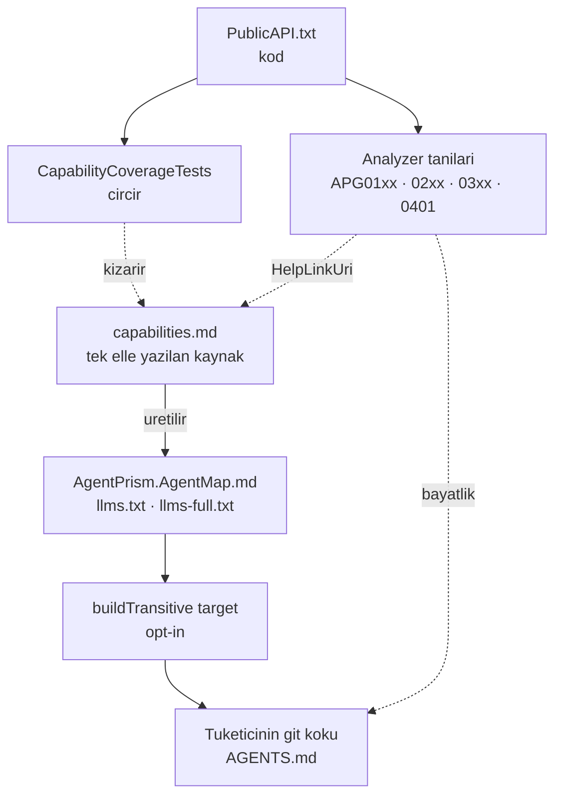

# Faz 73 — Tüketici Agent Desteği

> **Durum:** 📋 Planlandı (2026-08-18)
> **Kaynak:** [ADAYLAR.md](ADAYLAR.md) · **F-120**
> **Önkoşul:** [Faz 52](52-KAYNAK-URETECI.md) — generator paketleme borusu ve `APG` tanı deseni oradan devralınır · [Faz 59](59-URUN-DOKUMANTASYONU.md) — `capabilities.md` ve `docs-site/scripts/` üreteç deseni
> **Paketler:** `AgentPrism.Generators`, `AgentPrism.Core` (yalnız paketleme), `AgentPrism.Templates` · `docs-site/`
> **Yeni paket:** Yok · **Migration:** Yok
> **Public API:** **Büyümüyor.** Analyzer, MSBuild target ve üretilen dosyalar public API yüzeyi değildir; `PublicAPI.*.txt` bu fazda değişmez. Ölçüldü: `wc -l src/*/PublicAPI.Shipped.txt` her paket için 1 satır (hepsi boş)
> **Site etkisi:** `capabilities.md` **kaynak rolü kazanır** · yeni üretilen `docs-site/public/llms.txt` ve `llms-full.txt` · yeni üreteç `docs-site/scripts/build-agent-map.mjs` · `check-content.mjs` genişler
> **Manuel test alanı:** `docs/manuel-test/28-AGENT-DESTEGI.md`

---

## Bu Faza Başlarken

> `faz-baslangic` skill'ini uygula. Aşağıdaki liste o skill'in 2. adımıdır —
> **tamamını değil, yalnız işaret edilen bölümleri oku.**

1. Bu doküman
2. Kararlar — dosyanın tamamını **okuma**, yalnız bu kalemleri grep'le:
   ```bash
   grep -n "K-007\|K-059\|K-228\|K-263\|K-413\|K-421" docs/KARARLAR.md
   ```
   **K-413** (üretilen dosya elle yazılmaz — bu fazın `AGENTS.md` tasarımının
   dayanağı), **K-421** (public API takibi açık; bu faz yüzeyi büyütmez),
   **K-263** (`AgentPrism.Generators`'ın tekil `TargetFramework` deseni — yeni
   analyzer aynı projeye girer), **K-007** (yeni paket gerekçe ister — bu faz
   **yeni paket açmaz**), **K-059** (`secret` veritabanına yazılmaz — `APG0201`
   tanısının kaynağı), **K-228** (arayüz sözlüğü; bu faz arayüze **dokunmaz**).
3. [`52-KAYNAK-URETECI.md`](52-KAYNAK-URETECI.md) — yalnız devir notu:
   ```bash
   awk '/## Sonraki Faza Devir Notu/,0' docs/52-KAYNAK-URETECI.md
   ```
   Generator DLL'inin `analyzers/dotnet/cs/` altına nasıl taşındığı ve `APG`
   tanı numaralandırması oradan devralınır. Bu faz aynı boruyu kullanır.
4. Alan hafızası (bu faz iki alana dokunuyor):
   [`hafiza/build-ve-analyzer.md`](hafiza/build-ve-analyzer.md) (**ana kaynak** —
   paketleme, analyzer yükleme, `TreatWarningsAsErrors` etkileşimi),
   [`hafiza/test-altyapisi.md`](hafiza/test-altyapisi.md) (cırcır testi deseni)
5. Gerektiğinde, tamamı değil ilgili bölümü:
   [`MIMARI.md`](MIMARI.md) — paketleme bölümü

---

## Amaç

AgentPrism'i entegre eden back-end uygulamalarının **kod agent'ları** paketin
yeteneklerine hâkim değildir. Var olduğunu bilmedikleri yeteneği kullanmazlar;
onun yerine elle yeniden yazarlar. Bu faz o boşluğu iki mekanizmayla kapatır ve
mekanizmaların kod ile hizada kalmasını bir teste bağlar.

- **F-120** — Paket, kendisini tüketen kod agent'ına iki kanaldan öğretir:
  derleme anında **tanılar** (Katman 0) ve oturum başında okunan **üretilmiş bir
  yetenek haritası** (Katman 1). Haritanın kod ile hizası
  `CapabilityCoverageTests` cırcır testiyle korunur.

Kapsam dışı: geliştirici MCP sunucusu (Katman 2) — `ADAYLAR.md` **F-121**,
ayrı faz olarak planlanacak.

### Bugün ne çalışmıyor — doğrulanmış kanıt

| Kanıt | Gözlem |
|---|---|
| [`docs-site/src/content/docs/api/`](../docs-site/src/content/docs/api/) | 922 dosya, 4.7 MB. [`http-api/`](../docs-site/src/content/docs/http-api/) 494 dosya, 2.1 MB. Toplam ~1.7 M token — hiçbir agent bağlamına sığmaz |
| Elle yazılmış anlatı (`concepts` + `guides` + `getting-started` + `reference` + kök sayfalar) | ~384 KB ≈ ~96 K token. Tek seferlik bile pahalı, her oturum imkânsız |
| [`docs-site/src/content/docs/capabilities.md`](../docs-site/src/content/docs/capabilities.md) | 219 satır, 17 458 bayt, 11 bölüm. Doğru şekle **sahip** ama agent'ın eline hiçbir yoldan geçmiyor |
| `grep -rn "llms" docs/ docs-site/src` | **Boş.** `llms.txt` yok — siteyi çeken agent için giriş noktası yok |
| [`src/AgentPrism.Templates/content/AgentPrism.Starter/`](../src/AgentPrism.Templates/content/AgentPrism.Starter/) | 6 dosya; `AGENTS.md` **yok**. Template ile gelen projede agent'a hiçbir harita düşmüyor |
| `grep -rn "contentFiles\|buildTransitive" src/*/*.csproj` | **Boş.** Pakete giren MSBuild aparatı bugün yok |
| [`AgentPrism.Core.csproj:63`](../src/AgentPrism.Core/AgentPrism.Core.csproj#L63) | Generator DLL'i `analyzers/dotnet/cs` altına **zaten** taşınıyor — tanı borusu kurulu, yeniden inşa gerekmiyor |
| [`ToolDiagnostics.cs`](../src/AgentPrism.Generators/ToolDiagnostics.cs) | `APG0001`–`APG0007` var. `APG0003` mesajı düzeltmeyi **içeriyor** (`AddTool(AIFunctionFactory.Create(...))`) — genişletilecek desen budur |
| `grep -rln "PublicAPI" tests/ --include='*.cs'` | **Boş.** 6905 satırlık makine okunur yüzeyi hiçbir test okumuyor |
| [`check-content.mjs:41`](../docs-site/scripts/check-content.mjs#L41) | `requiredCapabilityEvidence` **elle bakılan** 26 kalemlik liste. Kaldırmayı yakalar, **eklemeyi yakalamaz** |
| `PublicAPI.Unshipped.txt` taraması | 17 `Use*`, 2 `Map*`, 8 `IAgentPrismBuilder` üyesi var. **17 `Use*` üyesinin 9'u** (`UseMcp`, `UseOpenAI`, `UsePostgreSql`, `UseSqlServer`, `UseSqlite`, `UseTenancy`, `UseUI`, `UseVoice`, `UseWorkflows`) `requiredCapabilityEvidence` kapısının dışında |

> Kanıtlar 2026-08-18 tarihinde doğrulandı.

🚨 Son satır dikkatle okunmalı. Dokuz üyenin **dokuzu da** `capabilities.md`
içinde bugün geçiyor — harita eksik **değil**. Eksik olan onları orada tutan
kapıdır. 18. yetenek eklendiğinde hiçbir test kızarmaz.

---

## 73.1 — Katmanların sınırı



Bu fazda **iki** üretim yönü vardır ve karıştırılmaz:

| Yön | Kaynak | Çıktı | Kim üretir |
|---|---|---|---|
| Harita | `capabilities.md` | `AgentPrism.AgentMap.md`, `llms.txt`, `llms-full.txt` | `build-agent-map.mjs` (Node) |
| Kapı | `PublicAPI.*.txt` | test sonucu | `CapabilityCoverageTests` (.NET) |

Harita **commit edilir** — `AgentPrism.Core` paketi onu `dotnet pack` anında
okur ve Node zinciri `dotnet build`'e bağlanmaz.

---

## 73.2 — Katman 1: üretilen yetenek haritası

### Üreteç

Yeni script: `docs-site/scripts/build-agent-map.mjs`. Kaynağı `capabilities.md`,
üç çıktısı vardır:

| Çıktı | Yol | İçerik | Hedef boyut |
|---|---|---|---|
| Paket haritası | `src/AgentPrism.Core/buildTransitive/AgentPrism.AgentMap.md` | Paket→iş tablosu · zorunlu bağlama · sınırlar · "şuna bak" tablosu | **≤ 6 KB** |
| Site haritası | `docs-site/public/llms.txt` | Aynı harita + site adresleri | ≤ 6 KB |
| Tam anlatı | `docs-site/public/llms-full.txt` | `concepts` + `guides` + `getting-started` + `reference` + kök sayfalar birleştirilmiş | ölçülecek (~384 KB bugün) |

`api/` ve `http-api/` **hiçbirine girmez**. O yüzeyi derleyici ve XML dokümanı
kapatır; haritaya koymak bütçeyi yakar ve hiçbir şey kazandırmaz.

Harita ilk satırında sürüm işareti taşır:

```markdown
<!-- AgentPrism agent map · sürüm: 1.4.0 · üretildi: build-agent-map.mjs -->
```

Bu satır `APG0401` tanısının okuduğu tek veridir.

### Teslimat — opt-in

K1 ("sıfır sürpriz") korunur. Target **hiçbir şey yapmaz** ta ki tüketici
açıkça istemeyene kadar:

```xml
<PropertyGroup>
  <AgentPrismWriteAgentsFile>true</AgentPrismWriteAgentsFile>
</PropertyGroup>
```

`src/AgentPrism.Core/buildTransitive/AgentPrism.Core.targets` davranışı:

1. Özellik `true` değilse **çık**.
2. Git kökünü bul: `$(MSBuildProjectDirectory)`'den yukarı doğru `.git` ara.
   Bulunamazsa proje dizinine düş ve bir `Message` ile bunu bildir.
3. Hedefte `AGENTS.md` **varsa** hiçbir şey yapma. **Var olan dosya asla
   ezilmez** — tüketici onu elle düzenlemiş olabilir.
4. Yoksa `AgentPrism.AgentMap.md`'yi `AGENTS.md` olarak kopyala.

`buildTransitive/` seçilir çünkü tüketici çoğu zaman `AgentPrism` meta paketini
referanslar; `build/` geçişli referansta çalışmaz.

Template ([`AgentPrism.Starter.csproj`](../src/AgentPrism.Templates/content/AgentPrism.Starter/AgentPrism.Starter.csproj))
özelliği `true` yazar. Böylece `dotnet new agentprism` kullanan geliştirici
hiçbir şey yapmadan haritayı alır; mevcut projeler bilinçli olarak açar.

🚨 Opt-in kararının bedeli **benimseme oranıdır**. Özelliği açmayan repo'da
agent haritayı hiç görmez. Katman 0 o repo'da tek savunmadır; `APG03xx`
ailesinin kapsamı bu yüzden dar tutulamaz.

### Yenileme

Paket yükseltilince harita bayatlar. Yenileme yolu **dosyayı silmek ve yeniden
build etmektir**. Yeni komut ve yeni paket yoktur. `APG0401` bayatlığı bildirir
ve bu iki adımı mesajında yazar.

---

## 73.3 — Katman 0: tanı aileleri

Yeni tip: `AgentPrism.Generators/AgentPrismUsageAnalyzer.cs` —
`DiagnosticAnalyzer`, mevcut `ToolRegistrationGenerator` ile **aynı projede**
(netstandard2.0, K-263 deseni) ve aynı DLL ile sevk edilir. Yeni paketleme işi
yoktur.

| Aile | Aralık | Seviye | Ne yakalar |
|---|---|---|---|
| Bağlama | `APG0101`–`APG0199` | Warning | Çalışma anında hata verecek eksik kurulum |
| Sınır | `APG0201`–`APG0299` | Warning | Gevşetilmeyen kuralların ihlali |
| Yetenek keşfi | `APG0301`–`APG0399` | **Info** | Elle yazılmış, pakette hazır olan iş |
| Harita bayatlığı | `APG0401` | **Info** | `AGENTS.md` kurulu sürümden eski |

Yetenek keşfi ailesinin `Info` olması kullanıcı kararıdır: build kırılmaz, ama
tanı `dotnet build` çıktısına düşer ve agent onu okur.

### Bu fazın kapsamındaki tanılar

> Liste **kapalıdır**. Yeni tanı eklemek sonraki fazın işidir; bu faz deseni ve
> kapıyı kurar.

| Id | Mesajın özü |
|---|---|
| `APG0101` | `MapAgentPrism()` çağrıldı, `AddAgentPrism()` çağrılmadı |
| `APG0102` | `Use<Sağlayıcı>()` çağrıldı ama sağlayıcı paketi referanslanmamış |
| `APG0201` | `AgentDefinition` içine düz `secret` yazıldı — yapılandırma anahtarının **adı** verilmeli (K-059) |
| `APG0301` | Elle `IChatClient` sarmalayan yeniden deneme döngüsü — paket bunu sunuyor |
| `APG0302` | Elle `AIAgent` alt sınıfı — MAF tipleri sarmalanmaz; dekoratör noktası var |
| `APG0401` | `AGENTS.md` sürüm işareti kurulu paketten eski |

Her mesaj `APG0003` desenini izler: **yanlışı söyler ve doğru API'yi öğretir.**
Her tanı bir `HelpLinkUri` taşır ve `capabilities.md` içindeki gerçek bir
başlığa çözülür.

---

## 73.4 — Kapı: `CapabilityCoverageTests`

Bu fazın en yüksek değerli parçasıdır. Bugün korunmayan yönü kapatır: **kod
büyür, harita geride kalır.**

Yeri: `tests/AgentPrism.Core.UnitTests/Architecture/CapabilityCoverageTests.cs` —
[`SourceLanguageTests.cs`](../tests/AgentPrism.Core.UnitTests/Architecture/SourceLanguageTests.cs)
ile **aynı cırcır mekaniği**. Yeni bir kavram getirilmez.

Çalışma sırası:

1. `src/*/PublicAPI.Shipped.txt` ve `PublicAPI.Unshipped.txt` dosyalarını oku.
2. Yetenek girişi olan üyeleri süz: `IAgentPrismBuilder` üyeleri ve
   `Use*` / `Map*` extension metotları. Bugünkü sayım: 8 + 17 + 2.
3. Her üye adının `capabilities.md` içinde geçtiğini doğrula.
4. Geçmeyeni `capability-coverage-baseline.txt` ile karşılaştır.
   **Taban çizgisi yalnız küçülür** — `SourceLanguageTests`'in kuralı.
5. Taban çizgisinde olup artık kapsanan üye varsa da kızar ("taban çizgisi
   bayat") — böylece liste kendiliğinden temizlenir.

Taban çizgisi bu fazda **boş** doğar: dokuz üyenin dokuzu da `capabilities.md`
içinde bugün geçiyor. Yani kapı ilk günden yeşildir ve **18. üyeyi yakalar**.

Yenileme, `SourceLanguageTests` ile aynı ortam değişkeni deseniyle yapılır.

---

## 73.5 — Kapı: tanı bütünlüğü

Katman 0'ın kendi kayması şudur: tanı bir API önerir, API yeniden adlandırılır,
tanı **yanlış öğretmeye devam eder**. Yanlış öğreten tanı, tanı olmamasından
kötüdür.

`tests/AgentPrism.Generators.UnitTests/DiagnosticIntegrityTests.cs` iki iddia
kurar:

- Her tanı mesajında geçen AgentPrism API adı `PublicAPI.*.txt` içinde **var**
- Her `HelpLinkUri` `capabilities.md` içindeki gerçek bir başlığa **çözülür**

İkincisi Katman 0 ile Katman 1'i bağlar: haritadan bölüm silinirse tanı testi
kızarır.

---

## 73.6 — `check-content.mjs` genişlemesi

Mevcut script ([348 satır](../docs-site/scripts/check-content.mjs)) zaten
"Landing-page metric drift" denetimi yapıyor. Aynı desene üç iddia eklenir:

- `AgentPrism.AgentMap.md` üreteci yeniden koşulduğunda **diff boş** olmalı
- `llms.txt` ve `llms-full.txt` için aynı
- Harita `≤ 6 KB` bütçesini aşmamalı

---

## Planlanan Public API

Bu faz **public API yüzeyini büyütmez**. Yerine üç sözleşme kurar:

### MSBuild özelliği

```xml
<!-- Varsayılan: boş (kapalı). K1 — sıfır sürpriz. -->
<AgentPrismWriteAgentsFile>true</AgentPrismWriteAgentsFile>
```

### Tanı numaraları

`APG0101`, `APG0102`, `APG0201`, `APG0301`, `APG0302`, `APG0401` — kategori
`AgentPrism.Usage` (mevcut `AgentPrism.Tools` kategorisinden **ayrı**, böylece
tüketici `.editorconfig` ile aileyi toptan bastırabilir).

### Paket içeriği

```
AgentPrism.Core.nupkg
├── analyzers/dotnet/cs/AgentPrism.Generators.dll   (mevcut, genişler)
└── buildTransitive/
    ├── AgentPrism.Core.targets                     (yeni)
    └── AgentPrism.AgentMap.md                      (yeni, üretilen)
```

### Arayüz payı

Yok — bu faz arayüze dokunmaz.

---

## Planlanan Dosya Listesi

```
src/AgentPrism.Generators/
├── AgentPrismUsageAnalyzer.cs          (yeni)
└── UsageDiagnostics.cs                 (yeni — ToolDiagnostics deseni)

src/AgentPrism.Core/
├── buildTransitive/
│   ├── AgentPrism.Core.targets         (yeni)
│   └── AgentPrism.AgentMap.md          (yeni, üretilen, commit edilir)
└── AgentPrism.Core.csproj              (değişir — buildTransitive paketleme)

src/AgentPrism.Templates/content/AgentPrism.Starter/
└── AgentPrism.Starter.csproj           (değişir — özellik true)

docs-site/
├── scripts/build-agent-map.mjs         (yeni)
├── scripts/check-content.mjs           (değişir)
└── public/llms.txt, llms-full.txt      (yeni, üretilen)

tests/AgentPrism.Core.UnitTests/Architecture/
├── CapabilityCoverageTests.cs          (yeni)
└── capability-coverage-baseline.txt    (yeni, boş doğar)

tests/AgentPrism.Generators.UnitTests/
├── DiagnosticIntegrityTests.cs         (yeni)
└── UsageAnalyzerTests.cs               (yeni)

tests/AgentPrism.Templates.Tests/
└── TemplateAgentsFileTests.cs          (yeni)

docs/manuel-test/28-AGENT-DESTEGI.md    (yeni)
```

---

## Hata Modları ve Testler

| Ne bozulabilir | Seviye | Test sınıfı |
|---|---|---|
| Yeni `Use*` eklenir, `capabilities.md` güncellenmez | Birim (cırcır) | `CapabilityCoverageTests` |
| Taban çizgisi bayatlar — kapsanan üye listede kalır | Birim | `CapabilityCoverageTests` |
| Tanı mesajı artık var olmayan bir API önerir | Birim | `DiagnosticIntegrityTests` |
| `HelpLinkUri` silinmiş bir başlığa işaret eder | Birim | `DiagnosticIntegrityTests` |
| Analyzer doğru kodda yanlış pozitif verir | Birim | `UsageAnalyzerTests` |
| `APG0101` `AddAgentPrism()` başka dosyada çağrılınca yanılır | Birim | `UsageAnalyzerTests` |
| Target var olan `AGENTS.md`'yi ezer | **Fonksiyonel** (gerçek `dotnet build`) | `TemplateAgentsFileTests` |
| Özellik kapalıyken target yine de yazar | **Fonksiyonel** | `TemplateAgentsFileTests` |
| Git kökü yokken target çöker | **Fonksiyonel** | `TemplateAgentsFileTests` |
| Çok projeli çözümde iki kopya oluşur | **Fonksiyonel** | `TemplateAgentsFileTests` |
| `buildTransitive` meta paket üzerinden akmaz | **Fonksiyonel** (paket kurulumu) | `TemplateAgentsFileTests` |
| Üretilen harita commit'ten sapar | Manuel/CI | `check-content.mjs` |
| Harita 6 KB bütçesini aşar | Manuel/CI | `check-content.mjs` |

Target davranışı **paket sınırını** geçer; birim testi onu kanıtlamaz. Bu
yüzden beş target case'i de gerçek `dotnet build` üzerinde koşar —
[`AgentPrism.Templates.Tests`](../tests/AgentPrism.Templates.Tests/) bu altyapıya
zaten sahiptir.

Beş soru:

| Soru | Cevap |
|---|---|
| İptal | Yok — analyzer ve target senkron çalışır |
| Eşzamanlılık | Paralel build'de iki proje aynı `AGENTS.md`'ye yazabilir. Target dosya varsa yazmaz; yarış zararsızdır ama `TemplateAgentsFileTests` çok projeli case'i koşar |
| Boş/aşırı girdi | `capabilities.md` boşsa üreteç **hata vermeli**, boş harita üretmemeli |
| Başka kiracı | Konu dışı — bu faz çalışma anına dokunmaz |
| Alt sistem hatası | Git kökü bulunamazsa target çökmez, proje dizinine düşer ve `Message` yazar |

---

## Manuel Kabul Case'leri

| # | Ön koşul | Adımlar | Beklenen sonuç |
|---|---|---|---|
| 1 | Boş `dotnet new web` projesi, `AgentPrism.Core` referanslı | `dotnet build` | `AGENTS.md` **oluşmaz** — özellik kapalı (K1) |
| 2 | Aynı proje, `AgentPrismWriteAgentsFile=true` | `dotnet build` | Git kökünde `AGENTS.md` oluşur, ≤ 6 KB, sürüm işareti taşır |
| 3 | `AGENTS.md` elle düzenlenmiş | `dotnet build` | Dosya **değişmez**; düzenleme korunur |
| 4 | `dotnet new agentprism` | `dotnet build` | `AGENTS.md` kendiliğinden oluşur — template özelliği açar |
| 5 | `MapAgentPrism()` var, `AddAgentPrism()` yok | `dotnet build` | `APG0101` uyarısı; mesaj eksik çağrıyı yazar |
| 6 | `AgentDefinition` içine düz API anahtarı | `dotnet build` | `APG0201` uyarısı; mesaj yapılandırma anahtarı adını önerir |
| 7 | Elle yeniden deneme döngüsü | `dotnet build` | `APG0301` **bilgi** satırı; build kırılmaz |
| 8 | `AGENTS.md` eski sürüm işaretli | `dotnet build` | `APG0401` bilgi satırı; sil-ve-derle yolunu yazar |
| 9 | `capabilities.md`'den bir `Use*` silinir | `dotnet test` | `CapabilityCoverageTests` kızarır |
| 10 | Yeni `UseSomething()` eklenir, harita güncellenmez | `dotnet test` | `CapabilityCoverageTests` kızarır ve üyeyi adıyla söyler |

---

## Açık Sorular

| # | Soru | Seçenekler | Öneri |
|---|---|---|---|
| 1 | `APG01xx` ve `APG02xx` seviyesi | A: `Warning` · B: `Info` | **A.** İkisi de çalışma anında hata veren gerçek kusurlardır. `TreatWarningsAsErrors` açık tüketicide build kırılır — bu **doğru** sonuçtur. Tüketici `.editorconfig` ile bastırabilir |
| 2 | `llms-full.txt` gerçekten üretilsin mi | A: Üret · B: Yalnız `llms.txt` | **A**, ama boyutu ölçüldükten sonra karar verilir. ~384 KB tek dosya bazı agent'lar için kullanışlı, çoğu için değil |
| 3 | `APG0302` (MAF sarmalama) yanlış pozitif riski taşır mı | — | Uygulamada ölçülmeli. Riskliyse bu fazdan **çıkarılır** ve ayrı kalem olur |
| 4 | Harita üreteci `dotnet build`'e bağlansın mı | A: Hayır, elle koşulur + `check-content` denetler · B: Evet | **A.** Node zinciri `dotnet build`'e bağlanmaz; `docs-site` ayrı yayın hattıdır |

---

## Bitiş Ölçütleri (DoD)

- [ ] `AgentPrismWriteAgentsFile` kapalıyken `dotnet build` hiçbir dosya yazmaz
- [ ] Özellik açıkken git kökünde ≤ 6 KB `AGENTS.md` oluşur; var olan dosya ezilmez
- [ ] `dotnet new agentprism` ile oluşan projede `AGENTS.md` kendiliğinden gelir
- [ ] Altı tanının altısı da gerçek bir tüketici projesinde tetiklenir; çıktı belgeye yazıldı
- [ ] `CapabilityCoverageTests` yeşil; taban çizgisi boş; **kasıtlı** bir `Use*` eklendiğinde kızardığı gösterildi
- [ ] `DiagnosticIntegrityTests` yeşil
- [ ] `llms.txt` ve `llms-full.txt` üretildi; `check-content.mjs` diff'i boş buldu
- [ ] Dört doğrulama kapısı sıfır uyarı verir
- [ ] `samples/AgentPrism.Api` ile gerçek `run` yapıldı, çıktı belgeye yazıldı
- [ ] `secret` taraması boş döndü
- [ ] Manuel kabul case'leri `docs/manuel-test/28-AGENT-DESTEGI.md` içine eklendi; otomatikleştirilebilenler koşuldu
- [ ] `faz-denetim` koşuldu; 🔴 bulgu kalmadı
- [ ] `docs-site/` güncellendi; `npm run build` + `check-links.mjs` temiz

### Doğrulama komutları

```bash
# Kapali iken dosya olusmaz
dotnet build /tmp/tuketici/Tuketici.csproj && test ! -f /tmp/tuketici/AGENTS.md && echo OK

# Acik iken olusur ve butcede kalir
dotnet build /tmp/tuketici/Tuketici.csproj -p:AgentPrismWriteAgentsFile=true
wc -c /tmp/tuketici/AGENTS.md   # <= 6144

# Kapinin gercekten yakaladigi gosterilir
dotnet test --filter CapabilityCoverageTests
```

---

## Riskler

| Risk | Önlem |
|------|-------|
| Opt-in yüzünden benimseme düşük kalır; agent haritayı çoğu repo'da görmez | Template özelliği açar · `llms.txt` siteden erişilebilir · `APG03xx` ailesi tek savunma olarak yeterli kapsamda tutulur |
| `APG0301`/`APG0302` yanlış pozitif üretir ve gürültüye dönüşür | `Info` seviyesi build'i kırmaz · yanlış pozitif ölçülürse tanı fazdan çıkarılır (Açık Soru 3) |
| `buildTransitive` meta paket üzerinden akmaz, target hiç çalışmaz | `TemplateAgentsFileTests` bunu gerçek paket kurulumuyla koşar — birim testiyle kanıtlanamaz |
| Üretilen harita commit edilmeyi unutulur, paket bayat harita sevk eder | `check-content.mjs` diff'i denetler; `faz-tamamlama` Adım 7'de koşulur |
| `capability-coverage-baseline.txt` kaçış kapısına dönüşür | Cırcır yalnız küçülür · bayat taban çizgisi de kızarır · `faz-denetim` taban çizgisi büyümesini 🔴 sayar |
| 6 KB bütçesi zamanla aşılır, harita yeniden okunamaz hâle gelir | `check-content.mjs` bütçeyi zorlar; aşımda içerik **silinmez**, `llms-full.txt`'e taşınır |

---

<!-- ============================================================
     AŞAĞISI KAPANIŞTA DOLDURULUR — `faz-tamamlama` skill'i.
     Plan anında boş kalır. Başlıkları SİLME.
     ============================================================ -->

## Plandan Sapmalar

> Kapanışta doldurulur. Plan ile gerçek arasındaki fark **gizlenmez** — sonraki
> oturumun en değerli bilgisidir.

## Bu Fazda Verilen Kararlar

> Kapanışta doldurulur. K-NNN numaraları burada alınır; plan numara rezerve etmez.

## Gerçekleşen Public API

> Kapanışta doldurulur. Koddaki **gerçek** imzalar.

## Dosya Listesi (gerçekleşen)

> Kapanışta doldurulur.

## Denetim Bulguları

> Kapanışta doldurulur — `faz-denetim` çıktısı. Her satır: bulgu · seviye
> (🔴/🟡/🟢) · sonuç (düzeltildi / gerekçelendi / F-NN olarak devredildi).
> Bulgu yoksa "🔴 ve 🟡 yok" yazılır; boş bırakılmaz.

## Sonraki Faza Devir Notu

> Kapanışta doldurulur: devralınan sözleşmeler, bilinen tuzaklar (🚨), yarım
> kalan işler, sıradaki faz.
