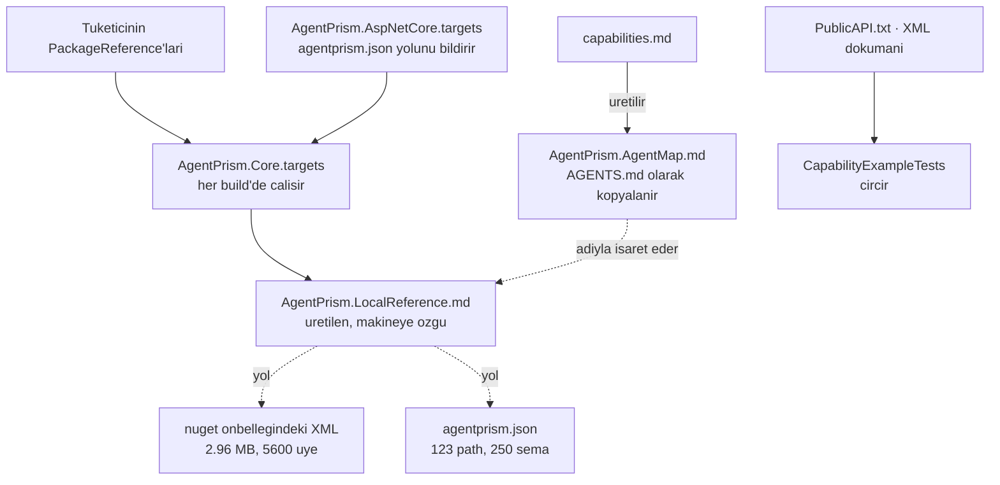

# Faz 74 — Yerel Referans Yüzeyi

> **Durum:** ✅ Tamamlandı (2026-08-20)
> **Kaynak:** [ADAYLAR.md](ADAYLAR.md) · **F-121** — kapsamı ölçümle değişti; gerekçe [§74.0](#740--f-121-neden-küçüldü)
> **Önkoşul:** [Faz 73](73-TUKETICI-AGENT-DESTEGI.md) — `buildTransitive` borusu, harita üreteci ve `CapabilityCoverageTests` cırcırı oradan devralınır · [Faz 40](arsiv/fazlar/40-OPENAPI-YAYINI.md) — `OpenApiSnapshotTests` belgeyi çalışan host'a bağlar, bu yüzden belgeyi paketlemek kayma üretmez
> **Paketler:** `AgentPrism.Core` (target), `AgentPrism.AspNetCore` (yeni `buildTransitive`), on bir paket (`<example>` yazımı) · `docs-site/`
> **Yeni paket:** Yok · **Migration:** Yok
> **Public API:** **Büyümüyor.** `<example>` eklemek imza değiştirmez; MSBuild özelliği ve paket içeriği public API yüzeyi değildir. Ölçüldü: `wc -l src/*/PublicAPI.Shipped.txt` = 16 satır (16 paket × 1 boş satır)
> **Site etkisi:** `capabilities.md` (bir satır) · `build-agent-map.mjs` "Where to look" bölümü · üretilen `AgentPrism.AgentMap.md`, `llms.txt`, `llms-full.txt` **revizyonu değişir**
> **Manuel test alanı:** `docs/manuel-test/30-YEREL-REFERANS.md` (29 numarayı Faz 73 aldı) — **19 case**

---

## Bu Faza Başlarken

> `faz-baslangic` skill'ini uygula. Aşağıdaki liste o skill'in 2. adımıdır —
> **tamamını değil, yalnız işaret edilen bölümleri oku.**

1. Bu doküman
2. Kararlar — dosyanın tamamını **okuma**, yalnız bu kalemleri grep'le:
   ```bash
   grep -n "K-007\|K-039\|K-413\|K-421\|K-505\|K-507\|K-509" docs/KARARLAR.md
   ```
   **K-505** (harita `capabilities.md`'den üretilir, Node zinciri `dotnet build`'e
   bağlanmaz — bu fazın harita değişikliği aynı boruyu kullanır), **K-507**
   (harita işareti içerik revizyonudur — bu faz gövdeyi değiştirdiği için
   revizyon **değişecek**, sonucu [§74.5](#745--haritanın-değişimi-ve-revizyon-etkisi)),
   **K-509** (`CapabilityCoverageTests` kapsamı 39 kayıt giriş noktasıdır — bu
   fazın kapısı **aynı 39 üyeyi** kullanır), **K-039** (OpenAPI paketi bağımlılık
   **yapılmadı** — bu faz bağımlılık değil **statik dosya** ekler, karar
   yeniden açılmıyor), **K-007** (yeni paket gerekçe ister — bu faz **yeni paket
   açmaz**), **K-413** (üretilen dosya elle yazılmaz), **K-421** (public API
   takibi açık; bu faz yüzeyi büyütmez).
3. [`73-TUKETICI-AGENT-DESTEGI.md`](73-TUKETICI-AGENT-DESTEGI.md) — yalnız devir notu:
   ```bash
   awk '/## Sonraki Faza Devir Notu/,0' docs/73-TUKETICI-AGENT-DESTEGI.md
   ```
   Altı maddenin **üçü bu faz için zorunludur**: madde 3 (tüketici testleri
   global NuGet önbelleğine takılır — `ClearGlobalPackageCache`), madde 4
   (harita kaynağı tektir), madde 2 (Core kendi analyzer'ını kendi üzerinde
   koşturur).
4. Alan hafızası (bu faz iki alana dokunuyor):
   [`hafiza/build-ve-analyzer.md`](hafiza/build-ve-analyzer.md) (**ana kaynak** —
   `buildTransitive` paketleme, `Remove`+`Include` tuzağı),
   [`hafiza/test-altyapisi.md`](hafiza/test-altyapisi.md) (cırcır testi deseni)
5. Gerektiğinde, tamamı değil ilgili bölümü:
   [`MIMARI.md`](MIMARI.md) — paketleme bölümü

---

## Amaç

Faz 73 tüketicinin kod agent'ına **haritayı** verdi: hangi yetenek var, hangi
çağrı onu açar. Harita 7 763 bayttır ve bunu tam olarak bilerek yapar — 39
giriş noktasını **adlandırır**, hiçbirini **anlatmaz**. Agent haritadan sonra
ikinci bir soru sorar: *"`AddToolApprovalPolicy` tam olarak nasıl çağrılır?"*

Bu fazın bulgusu şudur: o sorunun cevabı **zaten tüketicinin diskinde**. Paket
2.96 MB XML dokümanı taşır ve `~/.nuget/packages` altında durur. Eksik olan
erişim değil, **işaret**. Faz ilk boşluğu kapatır, sonra iki gerçek boşluğu:
HTTP yüzeyi hiçbir pakete girmiyor, ve giriş noktalarının 27'sinde çalışan
örnek yok.

- **F-121** — Tüketicinin kod agent'ı, kurulu paketin **kendi diskindeki**
  ayrıntısına yönlendirilir: üretilen bir yerel referans dosyası, paketlenen
  OpenAPI belgesi ve her giriş noktasında çalışan bir örnek. Örneklerin varlığı
  `CapabilityExampleTests` cırcırıyla korunur.

### 74.0 — F-121 neden küçüldü

`ADAYLAR.md`'deki F-121 bir **`dotnet tool` MCP sunucusu** öneriyordu ve kendi
kaydı "🚨 **Ölçülmedi** — Faz 73 kapandıktan sonra kalan sorgu hacmi ölçülmeden
planlanmaz" diyordu. Ölçüm yapıldı ve öneriyi **düşürdü**:

- Gerekçe ("6905 satırlık yüzey hiçbir bağlama sığmaz") **toptan okumaya** karşı
  doğru, **`grep`'e** karşı değil. On gerçek detay sorgusunun **onu da** yerel
  korpustan cevaplandı.
- Sunucunun `grep` üzerine koyacağı tek yeni yetenek **anlamsal aramadır**. O da
  RAG'dir ve Dalga 9 tartışmasında zaten elendi (chunk sınırı imzayı kullanımdan
  koparır).
- Maliyet yapısaldır: `PackAsTool` deseni repoda **yok** (`grep -rn PackAsTool`
  boş döndü) — yeni yayın hattı, sürümleme ve kimlik bilgisi ister. Bu, F-93'ün
  (TypeScript/npm) ayrı kalem tutulma gerekçesiyle aynı sınıftır.
- Benimseme Faz 73'ten **kötüdür**: tek MSBuild özelliğinin opt-in olması zaten
  Faz 73'ün en üst riskiydi; `dotnet tool install -g` + her agent için MCP kaydı
  bundan ağırdır.

Sunucu reddedilmedi, **gerekçesi düştü**. Talep ölçülürse yeniden açılabilir;
o zaman bu fazın çıktısı ona kaynak olur.

### Bugün ne çalışmıyor — doğrulanmış kanıt

| Kanıt | Gözlem |
|---|---|
| Paketlenmiş XML dokümanları (15 `.nupkg`) | **2 956 924 bayt**, ~5 600 dokümanlı üye. `~/.nuget/packages/agentprism.*/…/lib/net10.0/*.xml` altında tüketicinin diskinde **bugün duruyor** |
| `AgentPrism.Core.xml` | **13 532 satır**, satır satır basılmış. `grep -A8 AddToolApprovalPolicy` doğrudan `<summary>`, `<param>`, `<example>` döndürüyor |
| On detay sorgusu (`AddEvalCheck`, `UseMcp`, `AgentPrismTestHost`, tenancy, webhook imzası, compaction, `AddSkill`, `UseVoiceConversation`, `Idempotency`, `AddPatternContentGuard`) | Sekizi ilk `grep`'te, ikisi ikinci `grep`'te (ilk ad tahmini yanlıştı) — **10/10 yerel olarak cevaplandı** |
| `grep -c "<example>"` tüm XML korpusu | **22**. 2.96 MB özet var, çalışan örnek yok |
| 39 kayıt giriş noktası (K-509'un kümesi) | **12'sinde** `<example>` var, **27'sinde** yok. Kırılım [§74.4](#744--kapı-capabilityexampletests)'te |
| [`build-agent-map.mjs:264-269`](../docs-site/scripts/build-agent-map.mjs#L264-L269) | "Where to look" **dört adres** yazar, dördü de web. Yerel korpusa tek işaret yok |
| [`docs/openapi/agentprism.json`](openapi/agentprism.json) | **515 877 bayt**, 123 path, 250 şema. Gzip **66 283 bayt**. Hiçbir `.nupkg` içinde **yok** — `unzip -l` ile 15 pakette arandı |
| [`AgentPrism.AspNetCore.csproj`](../src/AgentPrism.AspNetCore/AgentPrism.AspNetCore.csproj) | `buildTransitive` **yok**; paket bugün yalnız `lib/` ve `README.md` taşıyor (1 010 KB) |
| Sonda derlemesi: `%(ReferencePath.NuGetPackageId)` + `%(ReferencePath.Identity)` | MSBuild çözülmüş yolu **veriyor**: `/Users/…/.nuget/packages/agentprism.core/0.0.0-preview.0.271/lib/net10.0/AgentPrism.Core.dll`. `.xml` aynı dizinde, aynı adla |
| [`OpenApiSnapshotTests.cs:62`](../tests/AgentPrism.AspNetCore.FunctionalTests/OpenApiSnapshotTests.cs#L62) | İşlenmiş belge çalışan host'un ürettiğiyle karşılaştırılıyor — belgeyi paketlemek **yeni bir kayma yüzeyi açmaz** |
| `grep -rn "PackAsTool"` | **Boş.** `dotnet tool` bu repo için sıfırdan bir dağıtım kanalıdır |

> Kanıtlar 2026-08-19 tarihinde bu depo ve `artifacts/package/release/*.0.271.nupkg`
> üzerinde doğrulandı.

---

## 74.1 — Üç teslimat ve sınırları



Faz 73'ün iki yönü korunur ve **üçüncüsü eklenmez**. Bu fazda üretim yönleri:

| Yön | Kaynak | Çıktı | Kim üretir | Ne zaman |
|---|---|---|---|---|
| Harita | `capabilities.md` | `AgentPrism.AgentMap.md`, `llms.txt`, `llms-full.txt` | `build-agent-map.mjs` | Elle, commit edilir (K-505) |
| Kapsam kapısı | `PublicAPI.*.txt` | test sonucu | `CapabilityCoverageTests` | `dotnet test` |
| **Örnek kapısı** | `PublicAPI.*.txt` + XML dokümanı | test sonucu | `CapabilityExampleTests` | `dotnet test` |
| **Yerel referans** | Tüketicinin `@(ReferencePath)`'i | `AgentPrism.LocalReference.md` | `AgentPrism.Core.targets` | **Tüketicinin** her build'i |

Son satır yenidir ve diğerlerinden ayrılır: çıktısı **bu depoda yaşamaz**. O
dosya tüketicinin makinesinde doğar, makineye özgü mutlak yollar taşır ve
işlenmez.

### Kapsam dışı

- **Anlamsal arama, indeks, gömü.** Bu bir RAG tasarımıdır; Dalga 9'da elendi.
- **`dotnet tool` veya MCP sunucusu.** [§74.0](#740--f-121-neden-küçüldü).
- **`AGENTS.md`'nin değiştirilmesi.** Faz 73'ün "var olan dosya asla ezilmez"
  kuralı gevşetilmez; bu yüzden işaretçi **ayrı bir dosyadır**.
- **Yeni tanı.** `APG` ailesi bu fazda büyümez. Referans dosyası her build'de
  yeniden yazıldığı için bayatlayamaz; bayatlık tanısına gerek yok.

---

## 74.2 — Yerel referans dosyası

> 🚨 **Bu bölümün konum ve sürüm başlığı iddiaları gerçekleşmedi.** Dosya
> **projenin yanına** yazılır, git köküne değil; ayrı bir `Installed version:`
> başlığı yoktur. Gerekçe: [Plandan Sapmalar](#plandan-sapmalar) 1 ve 2.

### Neden ayrı dosya

`AGENTS.md` **asla ezilmez** (Faz 73 kararı, tüketici onu elle düzenlemiş
olabilir). Yani makineye özgü ve her build'de değişen bilgi oraya yazılamaz.
Ayrı dosya bu kısıtı çözer: tamamen üretilir, ezilmesi zararsızdır, ve harita
onu **adıyla** işaret eder.

### Anahtar

```xml
<!-- Varsayilan: AgentPrismWriteAgentsFile ne ise o. Ayrica kapatilabilir. -->
<AgentPrismWriteLocalReference>false</AgentPrismWriteLocalReference>
```

`AgentPrism.Core.targets` içinde:

```xml
<PropertyGroup>
  <AgentPrismWriteLocalReference Condition="'$(AgentPrismWriteLocalReference)' == ''">$(AgentPrismWriteAgentsFile)</AgentPrismWriteLocalReference>
</PropertyGroup>
```

Tek anahtar ikisini de açar — benimseme engeli **artmaz**, K1 korunur. İkinci
özellik yalnız ayırmak isteyene lazımdır.

### Target davranışı

1. Özellik `true` değilse **çık**.
2. `@(ReferencePath)` içinden `%(NuGetPackageId)` değeri `AgentPrism` ile
   başlayanları süz. Her biri için XML yolu
   `$([System.IO.Path]::ChangeExtension('%(Identity)', '.xml'))`.
3. Hiç AgentPrism referansı yoksa (ör. `ProjectReference` ile derleyen bu depo)
   **dosya yazma**. `%(NuGetPackageId)` o durumda boştur.
4. `$(AgentPrismOpenApiDocumentFile)` doluysa OpenAPI satırını ekle. Boşsa
   ekleme — tüketici `AgentPrism.AspNetCore` referanslamamıştır.
5. `WriteLinesToFile` ile `AGENTS.md` ile **aynı dizine** yaz:
   `Overwrite="true"`, `WriteOnlyWhenDifferent="true"`,
   `ContinueOnError="WarnAndContinue"`.

Üç bayrağın üçü de gereklidir. `Overwrite` çünkü dosya tamamen üretilir.
`WriteOnlyWhenDifferent` çünkü değişmeyen dosyaya dokunmak `git status`'ü ve
dosya izleyicilerini boşuna kışkırtır — ayrıca paralel build'de iki projenin
aynı dosyayı yazması zararsız hâle gelir. `ContinueOnError` çünkü **kolaylık
dosyası build'i kıramaz** (Faz 73 denetim bulgusu 4: salt-okunur depo kökü
yaygın bir CI mount'udur).

### Dosyanın şekli

```markdown
<!-- AgentPrism local reference · generated on every build · machine-specific · do not commit -->
# AgentPrism local reference

Generated by the AgentPrism build. Paths are specific to this machine.
Add this file to .gitignore.

Installed version: 0.0.0-preview.0.271

## API documentation, one file per referenced package

- AgentPrism.Core: /Users/…/agentprism.core/0.0.0-preview.0.271/lib/net10.0/AgentPrism.Core.xml
- AgentPrism.Abstractions: /Users/…/AgentPrism.Abstractions.xml

## HTTP API document

- /Users/…/agentprism.aspnetcore/0.0.0-preview.0.271/buildTransitive/agentprism.json

## How to read them

grep -A8 'AddToolApprovalPolicy' <api-doc>        # one member, with its example
grep -o 'name="[MTP]:AgentPrism[^"]*Tenant[^"]*"' <api-doc>   # find the exact name first
```

Son bölüm bir reçetedir ve dosyanın en değerli yeridir. Ölçüm gösterdi ki iki
sorgu ancak **ikinci** denemede cevaplandı; sebep yanlış ad tahminiydi. Önce
adı bulan `grep`, sonra üyeyi okuyan `grep` — bu sırayı dosya kendisi öğretir.

🚨 **`WriteLinesToFile` öğe listesi `;` üzerinden bölünür.** Satırlar öğe olarak
kurulur; içinde `;` geçen bir yol satırı ikiye böler. Ölçülmedi, ama yol
üretimi `$([MSBuild]::Escape(…))` ile korunmalıdır.

### `.gitignore`

Dosya makineye özgüdür ve **işlenmemelidir**. Şablon
([`AgentPrism.Starter/.gitignore`](../src/AgentPrism.Templates/content/AgentPrism.Starter/.gitignore))
bir satır kazanır. Var olan projelerde bunu tüketici yapar; dosyanın ilk satırı
bunu söyler. **Tüketicinin `.gitignore`'una AgentPrism yazmaz** — başkasının
dosyasını değiştirmek K1'in ihlalidir.

---

## 74.3 — OpenAPI belgesinin paketlenmesi

`docs/openapi/agentprism.json` `AgentPrism.AspNetCore` paketine girer. Kopya
üretilmez: `csproj` dosyayı **kaynağından** paketler, yani sapma yüzeyi
oluşmaz ve yeni bir kapı gerekmez.

```xml
<ItemGroup>
  <None Remove="buildTransitive/**" />
  <None Include="buildTransitive/AgentPrism.AspNetCore.targets" Pack="true" PackagePath="buildTransitive/" />
  <None Include="../../docs/openapi/agentprism.json" Pack="true" PackagePath="buildTransitive/" />
</ItemGroup>
```

🚨 **`Update` burada sessizce çalışmaz.** SDK'nın varsayılan `None` glob'u yalnız
iç (TFM'e özgü) derlemelerde uygulanır; `dotnet pack` paket dosyalarını dış
çapraz-hedefleme derlemesinde toplar. `Remove` + `Include` çalışan biçimdir —
Faz 73 Sapma 10, aynı tuzak.

🚨 **Dosya adı sözleşmedir.** NuGet yalnız `buildTransitive/<PackageId>.props` ve
`buildTransitive/<PackageId>.targets` dosyalarını kendiliğinden import eder. Ad
`AgentPrism.AspNetCore.targets` olmalıdır; yanlış ad **uyarısız** hiçbir şey
yapmaz.

`buildTransitive/AgentPrism.AspNetCore.targets` tek iş yapar:

```xml
<Project>
  <PropertyGroup>
    <AgentPrismOpenApiDocumentFile>$(MSBuildThisFileDirectory)agentprism.json</AgentPrismOpenApiDocumentFile>
  </PropertyGroup>
</Project>
```

Core'un target'ı bu özelliği **çalışma anında** okur, değerlendirme anında
değil; bu yüzden iki `.targets` dosyasının import sırası önemsizdir.

Maliyet ölçüldü: gzip 66 283 bayt, paket 1 010 KB → ~1 075 KB (**%6**). Belge
tüketicinin projesine **kopyalanmaz**; yalnız paket dizininde durur ve yerel
referans dosyası yolunu yazar.

K-039 ile çelişmez: o karar `Microsoft.AspNetCore.OpenApi` **bağımlılığını**
reddetti (CVE'li geçişli paket sebebiyle). Statik bir JSON dosyası hiçbir
bağımlılık eklemez.

---

## 74.4 — Kapı: `CapabilityExampleTests`

`CapabilityCoverageTests` haritanın **eksiksizliğini** korur: her giriş noktası
haritada adı geçer. Bu faz ikinci bir eksiği kapatır: adı geçen üyenin **nasıl
çağrıldığı**.

Yeri: `tests/AgentPrism.Core.UnitTests/Architecture/CapabilityExampleTests.cs` —
`CapabilityCoverageTests` ile aynı klasör ve **aynı cırcır mekaniği**. Giriş
noktası toplayıcısı ortak bir yardımcıya (`CapabilityEntryPoints.cs`) çıkarılır;
iki test aynı 39 üyeyi okur, iki ayrı ayrıştırıcı yaşamaz.

### Kural

> Her giriş noktası **adı** için en az bir aşırı yükleme `<example>` taşır.

Ad bazlı olması bilinçlidir: `AddTool` yedi aşırı yüklemeye sahiptir ve yedisine
de aynı örneği yazmak gürültüdür. Kapsam kapısı da ad bazlıdır (K-509).

### Çalışma sırası

1. `CapabilityEntryPoints` ile 39 adı topla.
2. Derlenmiş XML dokümanlarını oku:
   `artifacts/bin/AgentPrism.*/<config>_net10.0/AgentPrism.*.xml`.
3. Her ad için `<member name="M:…Adı…">` bloklarını bul; içinde `<example>`
   arayan en az bir blok olmalı.
4. Kapsanmayanı `capability-example-baseline.txt` ile karşılaştır. **Taban
   çizgisi yalnız küçülür**; bayat taban çizgisi de kızarır.
5. İkinci iddia: her `<example>` gövdesinde geçen AgentPrism API adı
   `PublicAPI.*.txt` içinde **var olmalıdır**. Yanlış öğreten örnek, örnek
   olmamasından kötüdür — `DiagnosticIntegrityTests`'in aynı gerekçesi.

Taban çizgisi bu fazda **boş doğar**: 27 örnek bu fazda yazılır.

### 🚨 Üç tuzak

| Tuzak | Ölçüm | Sonuç |
|---|---|---|
| **Generic üye arite eki taşır** | 🚨 **Ölçüldü, plan iki yerde yanıldı:** ek **çift** ters tırnaktır (metot jeneriği), tek değil — ``AddJobHandler``1``, ``AddContentGuard``1``, ``AddWorkflowFunction``2`` — ve etkilenen üye **dört**tür: `AddToolsFrom` de generic'tir | Naif ad eşleştirmesi 39 üyenin **4'ünü** sessizce atlar. Kapı "39 üyenin 39'u okundu" iddiasını **açıkça** kurar (`The_reader_sees_every_entry_point_including_the_generic_ones`) |
| **XML dosyası TFM'e göre değişir** | `AgentPrism.Core.xml` net8.0/net9.0/net10.0 için **üç ayrı SHA** üretiyor | Tek TFM okunur: `net10.0` |
| **Çözüm derlenmemişse kapı sessizce yeşil olur** | XML yoksa "hiç kapsanmayan yok" sonucu çıkar | XML bulunamazsa test **yüksek sesle** düşmeli: "çözümü önce derle" |

### Yazılacak 27 örnek

| Paket | Sayı | Üyeler |
|---|---|---|
| `AgentPrism.Core` | 14 | `AddAgent`, `AddAgentPrism`, `AddClientTool`, `AddContentGuard`, `AddEvalCheck`, `AddJobHandler`, `AddModelProvider`, `AddSkill`, `AddTool`, `AddToolsFrom`, `Configure`, `Services`, `UseScheduling`, `UseVoiceConversation` |
| `AgentPrism.AspNetCore` | 3 | `MapAgentPrismA2A`, `MapAgentPrismMcpServer`, `UseA2A` |
| `AgentPrism.Workflows` | 2 | `AddWorkflow`, `AddWorkflowFunction` |
| Sağlayıcı paketleri | 4 | `UseAnthropic`, `UseAzureOpenAI`, `UseGoogle`, `UseOpenAI` |
| Depo paketleri | 3 | `UsePostgreSql`, `UseSqlServer`, `UseSqlite` |
| `AgentPrism.Voice` | 1 | `UseVoice` |

Örnek yazımı `<example><code>…</code></example>` biçimini izler ve mevcut on iki
örnekle aynı tonu tutar — en kısa çalışan çağrı, sonra tek satır bağlam.

---

## 74.5 — Haritanın değişimi ve revizyon etkisi

[`build-agent-map.mjs:264-269`](../docs-site/scripts/build-agent-map.mjs#L264-L269)
"Where to look" listesine bir satır ekler:

```
- Exact local paths for the version you have: AgentPrism.LocalReference.md, next to this file
```

`capabilities.md`'nin "Coding-agent support" bölümü aynı yeteneği bir satırla
kazanır — harita oradan üretilir (K-505), üreteç elle yazılmaz.

🚨 **Gövde değişince revizyon değişir** (K-507). Sonuç: kurulu her tüketicinin
`AGENTS.md`'si bayat sayılır ve `APG0401` tetiklenir. **Bu doğru davranıştır** —
harita gerçekten değişti — ve tanı yenileme yolunu (sil, yeniden derle) zaten
mesajında yazıyor. Faz kapanışında bu, bir kusur değil beklenen çıktı olarak
doğrulanır.

`llms.txt` aynı gövdeyi taşıdığı için satır orada da görünür. Ayırmak ikinci bir
revizyon üretirdi; tek revizyon kuralı buna değmez.

---

## Planlanan Public API

Bu faz **public API yüzeyini büyütmez**. Yerine iki sözleşme kurar.

### MSBuild özelliği

```xml
<!-- Varsayilan: AgentPrismWriteAgentsFile ile ayni. AGENTS.md'nin yanina
     uretilen bir referans dosyasi yazar. -->
<AgentPrismWriteLocalReference>false</AgentPrismWriteLocalReference>
```

### Paket içeriği

```
AgentPrism.Core.nupkg
├── analyzers/dotnet/cs/AgentPrism.Generators.dll   (degismez)
└── buildTransitive/
    ├── AgentPrism.Core.targets                     (degisir — yeni target)
    └── AgentPrism.AgentMap.md                      (degisir — yeni revizyon)

AgentPrism.AspNetCore.nupkg
└── buildTransitive/                                (YENI)
    ├── AgentPrism.AspNetCore.targets               (yeni)
    └── agentprism.json                             (yeni, docs/openapi'den paketlenir)
```

### HTTP `endpoint`'leri

Yok — bu faz çalışma anına dokunmaz.

### Arayüz payı

Yok — bu faz arayüze dokunmaz.

---

## Planlanan Dosya Listesi

```
src/AgentPrism.Core/
└── buildTransitive/AgentPrism.Core.targets      (degisir — yerel referans target'i)

src/AgentPrism.AspNetCore/
├── buildTransitive/AgentPrism.AspNetCore.targets (yeni)
└── AgentPrism.AspNetCore.csproj                  (degisir — Remove + Include)

src/AgentPrism.{Core,AspNetCore,Workflows,Voice,OpenAI,Anthropic,Google,Azure,PostgreSql,SqlServer,Sqlite}/
└── (27 giris noktasinin XML dokumanina <example> eklenir)

src/AgentPrism.Templates/content/AgentPrism.Starter/
└── .gitignore                                    (degisir — bir satir)

docs-site/
├── scripts/build-agent-map.mjs                   (degisir — Where to look)
└── src/content/docs/capabilities.md              (degisir — bir satir)
   → uretilen: buildTransitive/AgentPrism.AgentMap.md, public/llms.txt, public/llms-full.txt

tests/AgentPrism.Core.UnitTests/Architecture/
├── CapabilityEntryPoints.cs                      (yeni — ortak toplayici)
├── CapabilityCoverageTests.cs                    (degisir — toplayiciyi kullanir)
├── CapabilityExampleTests.cs                     (yeni)
└── capability-example-baseline.txt               (yeni, BOS dogar)

tests/AgentPrism.Templates.Tests/
└── LocalReferenceTests.cs                        (yeni — gercek paket kurulumu)

docs/manuel-test/30-YEREL-REFERANS.md             (yeni)
docs/manuel-test/00-INDEKS.md                     (degisir — satir 30)
```

---

## Hata Modları ve Testler

| Ne bozulabilir | Seviye | Test sınıfı |
|---|---|---|
| Özellik kapalıyken referans dosyası yazılır | **Fonksiyonel** (gerçek paket) | `LocalReferenceTests` |
| `AgentPrismWriteAgentsFile=true`, `AgentPrismWriteLocalReference=false` — yine de yazar | **Fonksiyonel** | `LocalReferenceTests` |
| Dosyadaki XML yolu diskte yok (yanlış hesaplanmış) | **Fonksiyonel** | `LocalReferenceTests` — her yolun `File.Exists` olduğunu doğrular |
| Yalnız `AgentPrism.Core` referanslı projede OpenAPI satırı çıkar | **Fonksiyonel** | `LocalReferenceTests` |
| `agentprism.json` pakete girmez (`Update` tuzağı) | **Fonksiyonel** (paket içeriği) | `LocalReferenceTests` |
| `buildTransitive/<PackageId>.targets` adı yanlış → hiç import edilmez | **Fonksiyonel** | `LocalReferenceTests` — OpenAPI satırının varlığı bunu kanıtlar |
| Salt-okunur depo kökü tüketicinin build'ini kırar | **Fonksiyonel** | `LocalReferenceTests` |
| Paralel build'de iki proje aynı dosyayı yazar | **Fonksiyonel** | `LocalReferenceTests` — çok projeli case |
| `ProjectReference` kullanan depoda (bu repo) dosya oluşur | **Fonksiyonel** | `LocalReferenceTests` + depo kökü denetimi |
| Yolda boşluk veya Unicode karakter var | **Fonksiyonel** | `LocalReferenceTests` |
| Kapı generic üyeleri arite eki yüzünden atlar | Birim | `CapabilityExampleTests` — "39 ad okundu" iddiası |
| Örnek silinir, kapı fark etmez | Birim (cırcır) | `CapabilityExampleTests` |
| Taban çizgisi bayatlar — kapsanan üye listede kalır | Birim | `CapabilityExampleTests` |
| Örnek artık var olmayan bir API öğretir | Birim | `CapabilityExampleTests` (ikinci iddia) |
| Çözüm derlenmemişken kapı sessizce yeşil olur | Birim | `CapabilityExampleTests` — XML yoksa düşer |
| Üretilen harita commit'ten sapar | CI | `build-agent-map.mjs --check` (mevcut adım) |
| Harita 10 KB bütçesini aşar | CI | `check-content.mjs` (mevcut kapı) |
| Revizyon değişimi tüketicide `APG0401` üretir | Manuel | `30-YEREL-REFERANS.md` |

Target davranışı **paket sınırını** geçer; birim testi onu kanıtlamaz. On
fonksiyonel case'in tamamı gerçek `dotnet build` üzerinde, **paketlenmiş meta
paket** üzerinden koşar —
[`AgentPrism.Templates.Tests`](../tests/AgentPrism.Templates.Tests/) bu altyapıya
Faz 73'ten beri sahiptir.

🚨 **Faz 73 devir notu madde 3 bu faz için zorunludur.** MinVer sürümü commit'ler
arasında sabittir; aynı sürümle yeniden paketlenen `.nupkg` NuGet tarafından
**hiç açılmaz** ve target değişikliğin **görünmez**.
`TemplateFixture.ClearGlobalPackageCache` bunu çözer; elle bir tüketici
denerken o dizini **sen de** sil.

Beş soru:

| Soru | Cevap |
|---|---|
| İptal | Yok — target senkron çalışır |
| Eşzamanlılık | Paralel build'de iki proje aynı dosyayı yazabilir. `WriteOnlyWhenDifferent` + `ContinueOnError` yarışı zararsız kılar; çok projeli case yine koşulur |
| Boş/aşırı girdi | Hiç AgentPrism referansı yoksa dosya **yazılmaz**. `AgentPrism.AspNetCore` yoksa OpenAPI satırı **yok** |
| Başka kiracı | Konu dışı — bu faz çalışma anına dokunmaz |
| Alt sistem hatası | Salt-okunur kök veya dolu disk: `WarnAndContinue`, build kırılmaz |

---

## Manuel Kabul Case'leri

| # | Ön koşul | Adımlar | Beklenen sonuç |
|---|---|---|---|
| 1 | Boş `dotnet new web`, `AgentPrism.Core` referanslı | `dotnet build` | `AgentPrism.LocalReference.md` **oluşmaz** — özellik kapalı (K1) |
| 2 | Aynı proje, `AgentPrismWriteAgentsFile=true` | `dotnet build` | Dosya `AGENTS.md` ile aynı dizinde oluşur; içindeki her XML yolu diskte var |
| 3 | Aynı proje | Dosyadaki yolu `grep -A8 'AddAgentPrism'` ile oku | `<summary>` ve `<example>` döner |
| 4 | Yalnız `AgentPrism.Core` referanslı | dosyayı oku | **OpenAPI satırı yok** |
| 5 | `AgentPrism.AspNetCore` de referanslı | dosyayı oku, yolu `python3 -c "import json…"` ile aç | 123 path, 250 şema okunur |
| 6 | Özellik açık, `AgentPrismWriteLocalReference=false` | `dotnet build` | `AGENTS.md` oluşur, referans dosyası **oluşmaz** |
| 7 | İkinci kez `dotnet build` | dosyanın `mtime`'ına bak | **Değişmemiş** — `WriteOnlyWhenDifferent` |
| 8 | Depo kökü salt-okunur | `dotnet build` | Build **başarılı**; uyarı yazılır |
| 9 | Faz 73'ten kalan `AGENTS.md` (eski revizyon) | `dotnet build` | `APG0401` uyarısı; `rm AGENTS.md && dotnet build` sonrası **0** |
| 10 | `dotnet new agentprism-api` | `git status` | Referans dosyası **izlenmiyor** — şablonun `.gitignore`'u kapsıyor |
| 11 | Bir giriş noktasının `<example>`'ı silinir | `dotnet test` | `CapabilityExampleTests` kızarır ve üyeyi **adıyla** söyler |
| 12 | `<example>` içine var olmayan bir API adı yazılır | `dotnet test` | `CapabilityExampleTests` kızarır |
| 13 | Yeni bir `UseSomething()` eklenir, örneği yazılmaz | `dotnet test` | `CapabilityExampleTests` kızarır |
| 14 | Çözüm derlenmeden `dotnet test --no-build` | — | Kapı **yeşil geçmez**; "çözümü önce derle" mesajıyla düşer |

---

## Açık Sorular

| # | Soru | Seçenekler | Öneri |
|---|---|---|---|
| 1 | Referans dosyasının adı | A: `AgentPrism.LocalReference.md` · B: `AGENTS.AgentPrism.md` | **A.** B, `AGENTS.md` ailesine ait görünür ve agent'ın ikisini karıştırmasına yol açar. A adıyla ne olduğunu söyler |
| 2 | `Configure` ve `Services` üyelerine örnek yazılsın mı | A: Evet · B: Kapı bu ikisini muaf tutsun | **A.** İkisi de kısa örnekle anlatılır ve muafiyet listesi bir kaçış kapısının başlangıcıdır. Karar uygulama anında, örnek yazılırken kesinleşir |
| 3 | `net8.0`/`net9.0` XML'i de okunsun mu | A: Yalnız `net10.0` · B: Hepsi | **A.** Üç dosya farklı (ölçüldü) ama fark koşullu derlemedendir; giriş noktaları her TFM'de vardır. B, kapıyı üç katına çıkarır ve hiçbir kusuru yakalamaz |
| 4 | Yerel referans satırı `llms.txt`'e de girsin mi | A: Evet, gövde tek · B: Yalnız paket haritasına | **A.** B ikinci bir revizyon üretir ve K-507'nin tek işaret kuralını bozar. Web okuyucusu için satır zararsızdır |
| 5 | Örnek yazımında hangi ton | A: En kısa çalışan çağrı + tek satır bağlam · B: Tam `Program.cs` parçası | **A.** Mevcut on iki örnek A tonundadır; B, XML dosyasını 2.96 MB'ın üstüne büyütür |

---

## Bitiş Ölçütleri (DoD)

- [x] Özellik kapalıyken `dotnet build` referans dosyası **yazmaz** — gerçek paket üzerinde (`Property_unset_writes_no_file`, MT-YRF-001)
- [x] Özellik açıkken dosya oluşur; **içindeki her yol diskte var** — `LocalReferenceTests` her yolu `File.Exists` ile doğrular ve dosyanın `<?xml` ile başladığını da okur
- [x] Yalnız `AgentPrism.Core` referanslayan projede OpenAPI satırı **yok**; `AgentPrism.AspNetCore` eklenince **var** — ölçüldü: Worker 2 satır/HTTP yok, Web 9 satır/HTTP var
- [x] `agentprism.json` `AgentPrism.AspNetCore` paketinde; paket boyutu ölçüldü: **1 034 455 → 1 100 931 B (+66 476 B, %6,4)**
- [x] İkinci build dosyaya dokunmaz — üç ardışık `-t:Rebuild` sonrası iki projenin de `mtime`'ı değişmedi (`A_second_build_leaves_the_file_untouched`, MT-YRF-008)
- [x] ~~Salt-okunur depo kökünde build başarılı~~ → **Yazılamayan dosya build'i kırmaz** (Sapma 4). Otomatik: `A_write_that_cannot_succeed_only_warns`. Elle, gerçek CI şekliyle: `warning MSB3491`, **`exit=0`**, dosya yok (MT-YRF-010)
- [x] 39 giriş noktasının **39'u** `<example>` taşır; `capability-example-baseline.txt` **boş** (yalnız 4 yorum satırı)
- [x] `CapabilityExampleTests`'in **iki yönde de** kızardığı gösterildi: `AddSkill`'in örneği silindi → `+ AddSkill: … carries no <example>`; örneksiz `UseSomething()` eklendi → **iki kapı birden** kızardı
- [x] Kapının generic üyeleri de okuduğu gösterildi — 39/39. 🚨 Plan `` `1 `` diyordu; ek **çift** ters tırnaktır ve etkilenen üye **dört**tür (`AddToolsFrom` dahil)
- [x] Çözüm derlenmemişken kapı **düşer**: `artifacts/bin/AgentPrism.Voice/release_net10.0` silindi → `No XML documentation was found … Build the solution first`
- [x] Harita revizyonu değişti (`e4c7b05b` → `5e144649`); `build-agent-map.mjs --check` "up to date and within budget"; harita **7 940 B** ≤ 10 240
- [x] Eski `AGENTS.md` taşıyan tüketici derlemesinde `APG0401` çıktı ve sil-derle ile **0**'a düştü — çıktı MT-YRF-011'de
- [x] Dört doğrulama kapısı sıfır uyarı verir: `build` 0/0 · `test` **4 407 test, 0 başarısız** · `pack` exit 0 · `format --verify-no-changes` exit 0
- [x] `samples/AgentPrism.Api` ile gerçek `run` yapıldı: `/openapi/v1.json` **127 path / 252 şema**, `/api/agents` kimliksiz `401` + `ProblemDetails`. Paketlenen belgeyle fark **dört isteğe bağlı uç**tur (A2A ×2, `api/diagnostics`, ses akışı) — belge canlı yüzeyin alt kümesidir, sapma değil
- [x] `secret` taraması boş döndü — çıkan beş satırın hepsi Faz 51/06'dan kalan test ve doküman sabitleri
- [x] Manuel kabul case'leri `docs/manuel-test/30-YEREL-REFERANS.md` içine eklendi (**19 case**); otomatikleştirilebilenler koşuldu — 1, 2, 3, 4, 5, 6, 8, 11, 12, 18, 19 gerçek tüketici üzerinde elle koşuldu
- [x] `faz-denetim` koşuldu; **üç 🔴 bulgu** çıktı ve üçü de kapandı; 🔴 kalmadı
- [x] `docs-site/` güncellendi (`capabilities.md`, `troubleshooting.md`); `check:content` 999 sayfa temiz, `npm run build` 1000 sayfa, `check-links.mjs` **126 755 bağlantı, kırık yok**

### Doğrulama komutları

```bash
# Kapali iken dosya olusmaz (dosya PROJENIN yaninda aranir)
dotnet build /tmp/tuketici/src/Consumer/Consumer.csproj \
  && test ! -f /tmp/tuketici/src/Consumer/AgentPrism.LocalReference.md && echo OK

# Acik iken olusur ve yollari gercek
dotnet build /tmp/tuketici/src/Consumer/Consumer.csproj -p:AgentPrismWriteAgentsFile=true
LR=/tmp/tuketici/src/Consumer/AgentPrism.LocalReference.md
grep -o '/.*\.xml' $LR | xargs -I{} test -f {} && echo "yollar gercek"

# Isaret ettigi korpus gercekten cevap veriyor
grep -A 12 "AddToolApprovalPolicy" $(grep -m1 -o '/.*AgentPrism\.Core\.xml' $LR)

# OpenAPI paketlendi mi
unzip -l artifacts/package/release/AgentPrism.AspNetCore.*.nupkg | grep agentprism.json

# Kapinin gercekten yakaladigi gosterilir
dotnet test --filter CapabilityExampleTests
```

---

## Riskler

| Risk | Önlem |
|------|-------|
| Referans dosyası tüketicinin deposunu kirletir ve yanlışlıkla işlenir | Opt-in · ilk satır "do not commit" der · şablon `.gitignore`'una girer · `WriteOnlyWhenDifferent` gereksiz değişikliği önler |
| Harita revizyonu değişince kurulu her tüketicide `APG0401` çıkar | **Beklenen sonuç**, kusur değil. Tanı sil-ve-derle yolunu zaten yazıyor; manuel case 9 bunu doğrular |
| `%(ReferencePath.NuGetPackageId)` bazı SDK sürümlerinde boş gelir | Sonda derlemesiyle **ölçüldü** (bu depo, .NET 10). Boş gelirse dosya yazılmaz — sessiz bozulma değil, sessiz yokluk. `LocalReferenceTests` yolların varlığını iddia eder |
| 27 örnek yazımı fazı şişirir | İş XML dokümanına sınırlı; kod değişmiyor, public API değişmiyor. Ton kuralı (Açık Soru 5) örnek başına birkaç satırda tutar |
| `capability-example-baseline.txt` kaçış kapısına dönüşür | **Boş doğar** · cırcır yalnız küçülür · bayat taban çizgisi de kızarır · `faz-denetim` taban çizgisi büyümesini 🔴 sayar |
| OpenAPI belgesi paketi büyütür | Ölçüldü: gzip 66 KB, paketin %6'sı. Dosya kaynağından paketlenir; kopya ve sapma yüzeyi yok |
| Yerel referans yine de yeterli olmaz; detay sorgusu açık kalır | Bu fazın çıktısı ölçülebilir bir taban verir. Talep sürerse F-121'in MCP okuması **bu fazın ölçümüyle** yeniden açılır |

---

<!-- ============================================================
     AŞAĞISI KAPANIŞTA DOLDURULUR — `faz-tamamlama` skill'i.
     Plan anında boş kalır. Başlıkları SİLME.
     ============================================================ -->

## Plandan Sapmalar

| # | Plan ne diyordu | Ne yapıldı | Gerekçe |
|---|---|---|---|
| 1 | Referans dosyası **`AGENTS.md` ile aynı dizine** (git köküne) yazılır ([§74.2](#742--yerel-referans-dosyası)) | Dosya **projenin yanına** yazılır (`$(MSBuildProjectDirectory)`) | 🚨 **Denetim bulgusu 3, ölçüldü.** Bir çözümde `src/Web` (meta paket) ve `src/Worker` (yalnız `AgentPrism.Core`) varken tek paylaşılan dosya iki cevabı birden taşıyamıyor: son derlenen proje kazanıyor, Web **HTTP belgesini kaybediyor** ve içerik derlemeden derlemeye değişiyor. İki DoD satırı ("ikinci build dosyaya dokunmaz", "yalnız Core referanslayanda OpenAPI satırı yok") bu düzende **yanlış** oluyordu. Önce birleştirme (merge) denendi ve **düşürüldü**: MSBuild'de öğe dönüşümü içinde string fonksiyonu yazılamıyor (dönüşümün ayracı da tek tırnak), ve daha önemlisi projeler **paralel** derlendiği için okuma-yazma yarışını birleştirme de çözmüyor. Proje başına dosya **yapısal olarak** doğrudur: yarış yok, birleştirme yok, `WriteOnlyWhenDifferent` dediğini yapıyor. Ölçüldü: Web 9 satır + HTTP bölümü, Worker 2 satır ve HTTP bölümü **yok**; üç ardışık derlemede iki dosyanın da `mtime`'ı değişmedi |
| 2 | Dosya `Installed version: <sürüm>` başlığı taşır | Ayrı sürüm başlığı **yok**; sürüm her yolun içindedir | Denetim bulgusu 5: `@(...->'%(NuGetPackageVersion)'->Distinct())` iki farklı sürümü `;` ile birleştiriyor ve `Include` onu **iki satıra bölüyordu**. Ölçüldü: `Core 272` + `Sqlite 271` → dosyada iki ayrı sürüm satırı. Tek bir başlık iki sürümü dürüst anlatamaz; yol zaten sürümü taşıyor (`/agentprism.core/0.0.0-preview.0.272/lib/...`) |
| 3 | 🚨 `WriteLinesToFile` öğe listesi `;` üzerinden bölünür; yol üretimi `$([MSBuild]::Escape(…))` ile korunmalıdır ([§74.2](#742--yerel-referans-dosyası)) | Koruma **yazılmadı** | Plan bunu "ölçülmedi" diye işaretlemişti; **ölçüldü ve iddia düştü**: öğe dönüşümü (`@(X->'…')`) kaynak öğe başına tam **bir** çıktı öğesi üretir, değeri `;` içerse bile (`a%3Bb.dll` tek öğe kaldı). Buna karşılık **ölçülmemiş gerçek bir tuzak** çıktı: MSBuild `Include` değerinin **baştaki boşluğunu kırpar**, bu yüzden girintili markdown kod bloğu üretilemiyor — reçete çitli (```` ``` ````) bloğa çevrildi. Sapma 2'de görüldüğü gibi `;` bölünmesi **özellik enterpolasyonlu** `Include` için gerçektir, dönüşüm için değil |
| 4 | `LocalReferenceTests` "salt-okunur depo kökü" case'i taşır | Case **taşınabilir** biçime çevrildi: dosyanın yerine bir **dizin** konur | Konum proje dizinine taşınınca "salt-okunur kök" anlamını yitirdi — proje dizini `bin/`/`obj/` için zaten yazılabilir olmalıdır, salt-okunur yapılınca **derlemenin kendisi** kırılır (`MSB3021`, AgentPrism ile ilgisiz). Ölçülen garanti aynı kaldı ve `chmod` semantiğine bağlı olmaktan çıktı. Gerçek CI şekli (`UseArtifactsOutput` ile çıktı başka yere, kaynak ağacı salt-okunur) **elle doğrulandı**: `warning MSB3491`, `exit=0`, dosya yok — `MT-YRF-010` |
| 5 | Örnek kapısı iki iddia taşır (örnek var mı · var olmayan API öğretiyor mu) | **Dört** iddia: örnek var mı · 39 adın 39'u okundu mu (generic dahil) · var olmayan `Add*`/`Use*`/`Map*` öğretiyor mu · örnek **kendi üyesini** çağırıyor mu | Dördüncü iddia 27 elle yazılmış örneğin davet ettiği kopyala-yapıştır kusurunu kapatır. Üçüncü iddia `ForeignRegistrationMembers` listesi ister — ad şeklinden AgentPrism üyesi olup olmadığı anlaşılamıyor (`AddSingleton`, `AddHealthChecks`, `MapHealthChecks` Microsoft'undur). Liste **yalnız Microsoft üyelerini** taşır; oraya bir AgentPrism adı eklemek incelemede tam olarak yanlış iddia olarak görünür |
| 6 | 27 örnek yazılır | 27 örnek yazıldı; **ikisi hatalıydı ve denetim yakaladı** | `Configure` örneği `options.DefaultTimeout` yazıyordu — o üye `AgentPrismToolOptions`'ta, `AgentPrismOptions`'ta **değil** (`CS1061`). `UseA2A` örneği `o.ExposedAgents = ["support"]` yazıyordu — property salt-okunurdur (`CS0200`). İkisi de düzeltildi ve **40 giriş noktası örneğinin tamamı gerçek paketle derlendi** (aşağıda) |
| 7 | Hafıza notları `docs/hafiza/build-ve-analyzer.md`'ye eklenir | Dosya bütçeyi aştı (17 367 B > 16 000); **`docs/hafiza/paketleme-ve-dagitim.md` açıldı** *(kullanıcı kararı)* | Sınır anlamlıdır: "nasıl derlenir/analiz edilir" `build-ve-analyzer.md`'de (11 238 B), "nasıl paketlenir ve tüketiciye nasıl ulaşır" yeni dosyada (6 829 B). `MEMORY.md` bir yönlendirme satırı kazandı |

## Bu Fazda Verilen Kararlar

K-510 · K-511 · K-512 · K-513 — `docs/KARARLAR.md`.

## Gerçekleşen Public API

**Public API yüzeyi büyümedi.** `src/*/PublicAPI.*.txt` dosyalarının **hiçbiri**
değişmedi (`git diff --stat src/*/PublicAPI.*.txt` boş). `<example>` eklemek
imza değiştirmez.

### MSBuild özelliği

```xml
<!-- Varsayilan: AgentPrismWriteAgentsFile ile ayni. Referans dosyasini
     PROJENIN YANINA yazar. -->
<AgentPrismWriteLocalReference>false</AgentPrismWriteLocalReference>
```

### Paket içeriği

```
AgentPrism.Core.nupkg
├── analyzers/dotnet/cs/AgentPrism.Generators.dll   (degismedi)
└── buildTransitive/
    ├── AgentPrism.Core.targets                     (degisti — yeni target)
    └── AgentPrism.AgentMap.md                      (degisti — revizyon e4c7b05b -> 5e144649)

AgentPrism.AspNetCore.nupkg                         (1 034 455 -> 1 100 931 B, +%6,4)
└── buildTransitive/                                (YENI)
    ├── AgentPrism.AspNetCore.targets               (872 B)
    └── agentprism.json                             (515 877 B, docs/openapi'den paketlendi)
```

### Üretilen dosyanın şekli (gerçek çıktı)

```markdown
<!-- AgentPrism local reference - regenerated on every build - machine-specific - do not commit -->
# AgentPrism local reference

Generated by the AgentPrism build for Web.csproj. The paths are
specific to this machine, and each one carries the version it was restored
from. Add this file to .gitignore.

## API documentation, one file per referenced package

- AgentPrism.Abstractions: /Users/…/agentprism.abstractions/0.0.0-preview.0.272/lib/net10.0/AgentPrism.Abstractions.xml
- AgentPrism.AspNetCore: /Users/…/agentprism.aspnetcore/0.0.0-preview.0.272/lib/net10.0/AgentPrism.AspNetCore.xml
…

## HTTP API document

- /Users/…/agentprism.aspnetcore/0.0.0-preview.0.272/buildTransitive/agentprism.json

## How to read them
…
```

### HTTP `endpoint`'leri · Arayüz payı

Yok — bu faz çalışma anına ve arayüze dokunmadı.

## Dosya Listesi (gerçekleşen)

```
src/AgentPrism.Core/
└── buildTransitive/AgentPrism.Core.targets          (degisti — AgentPrismWriteLocalReference target'i)

src/AgentPrism.AspNetCore/
├── buildTransitive/AgentPrism.AspNetCore.targets     (YENI)
└── AgentPrism.AspNetCore.csproj                      (degisti — Remove + Include)

src/AgentPrism.{Core,AspNetCore,Workflows,Voice,OpenAI,Anthropic,Google,Azure,PostgreSql,SqlServer,Sqlite}/
└── 27 giris noktasina <example> eklendi (12 dosya)

src/AgentPrism.Templates/content/AgentPrism.Starter/
└── .gitignore                                        (degisti — bir satir)

docs-site/
├── scripts/build-agent-map.mjs                       (degisti — Where to look)
├── src/content/docs/capabilities.md                  (degisti — bir satir + bir paragraf)
└── src/content/docs/troubleshooting.md               (degisti — YENI bolum)
   → uretilen: buildTransitive/AgentPrism.AgentMap.md (7 940 B), public/llms.txt, public/llms-full.txt

tests/AgentPrism.Core.UnitTests/Architecture/
├── CapabilityEntryPoints.cs                          (YENI — ortak toplayici)
├── CapabilityCoverageTests.cs                        (degisti — toplayiciyi kullanir)
├── CapabilityExampleTests.cs                         (YENI — dort iddia)
└── capability-example-baseline.txt                   (YENI, BOS: 4 yorum satiri)

tests/AgentPrism.Templates.Tests/
└── LocalReferenceTests.cs                            (YENI — 9 fonksiyonel case)

docs/hafiza/paketleme-ve-dagitim.md                   (YENI — butce bolunmesi)
docs/hafiza/build-ve-analyzer.md                      (degisti — bolundu)
docs/hafiza/test-altyapisi.md                         (degisti)
MEMORY.md                                             (degisti — bir yonlendirme satiri)

docs/manuel-test/30-YEREL-REFERANS.md                 (YENI — 19 case)
docs/manuel-test/00-INDEKS.md                         (degisti — satir 30)
```

### Testler

| Sınıf | Ne kanıtlar | Sayı |
|---|---|---|
| `LocalReferenceTests` | Paket sınırını geçen her davranış: özellik kapalı/açık, ikinci özellik, yolların gerçekliği, Core-only'de HTTP bölümü yok, HTTP belgesi pakette ve okunabilir, yazılamayan dosya build'i kırmaz, **farklı paket kümeli iki proje**, boşluk + ASCII-dışı yol, ikinci build dokunmaz | 9 |
| `CapabilityExampleTests` | Her giriş noktasının örneği var · 39/39 okundu (generic dahil) · var olmayan API öğretilmiyor · örnek kendi üyesini çağırıyor | 4 |
| `CapabilityCoverageTests` | (mevcut) Ortak toplayıcıya taşındı; davranış değişmedi | 1 |

Çözüm toplamı: **4 407 test, 0 başarısız** (`dotnet test AgentPrism.slnx -c Release --no-build`, ~2 dk 25 sn).

## Denetim Bulguları

`faz-denetim` taze bağlamlı bir denetçiyle koşuldu (2026-08-20). Denetçi dört
kapıyı bağımsız koştu, paket içeriğini `unzip` ile açtı, target davranışını üç
ayrı tüketici deposu kurarak ölçtü ve **27 örneğin tamamını derleyiciye verdi**.

| # | Seviye | Bulgu | Sonuç |
|---|---|---|---|
| 1 | 🔴 | `Configure` örneği var olmayan `AgentPrismOptions.DefaultTimeout` üyesini öğretiyor | **Düzeltildi** → `options.Tools.DefaultTimeout`. 40 örneğin tamamı derlendi |
| 2 | 🔴 | `UseA2A` örneği salt-okunur `ExposedAgents`'a atama yapıyor (`CS0200`) | **Düzeltildi** → `o.ExposedAgents.Add("support")` |
| 3 | 🔴 | Farklı paket kümesi taşıyan iki projede tek dosya yarışıyor; iki DoD satırı yanlış | **Düzeltildi** → dosya proje başına yazılır (Sapma 1). `Two_projects_with_different_references_each_get_their_own_answer` bunu kanıtlar |
| 4 | 🟡 | Kapının ikinci iddiası yalnız `Add\|Use\|Map` çağrılarını okuyor; 🔴 1 ve 2 tam bu delikten geçti. Öneri: örnekleri **derleyen** bir kapı | **Gerekçelendi + kısmen kapandı.** Metin denetimi bu iki kusuru yapısal olarak yakalayamaz: `DefaultTimeout` ve `ExposedAgents` **gerçek** API adlarıdır, yalnız yanlış tipin üzerinde kullanılmışlardır. Yakalayan tek şey derlemedir. Bu fazda 40 giriş noktası örneği elle bir doğrulama projesine çıkarılıp **gerçek paketle derlendi** (aşağıda) ve dördüncü iddia (örnek kendi üyesini çağırır) eklendi. Kalıcı bir derleme kapısı **yeni bir yetenektir**, kusur değil → `ADAYLAR.md` **F-125** |
| 5 | 🟡 | İki farklı sürümde `Installed version:` satırı ikiye bölünüyor | **Düzeltildi** → sürüm başlığı kaldırıldı (Sapma 2) |
| 6 | 🟡 | Üretilen dosya "her üye bir örnek taşır" diyor; gerçek 1838 üyede 19 | **Düzeltildi** → metin "her **kayıt giriş noktası**" diyor |
| 7 | 🟡 | Doküman naif eşleştirmenin **3** generic üyeyi atlayacağını yazıyor; gerçek **4** | **Düzeltildi** → [§74.4](#744--kapı-capabilityexampletests) tuzak tablosu; arite ekinin **çift** ters tırnak olduğu da eklendi |
| 8 | 🟢 | `ProjectReference` ile derleyen depoda dosya oluşmadığını kanıtlayan test yok | **Devredildi.** Bu depo `buildTransitive/`'i kendi üzerinde hiç yüklemez (`ProjectReference` bu varlıkları taşımaz), dolayısıyla davranış burada gözlemlenemez. Mekanizma dolaylı olarak kanıtlı: aynı filtre çerçeve referanslarını da eler ve `LocalReferenceTests` yazılan her yolun diskte olduğunu iddia eder |
| 9 | 🟢 | `MT-YRF-005` adım 2 iki değer basıyor | **Düzeltildi** → `echo $?` kaldırıldı |

**Denetçinin temiz bulduğu başlıklar:** 3.3 (test seviyesi) · 3.5 (imza-gövde) ·
3.6 (plan dışı public API yok) · 3.7 (repo kuralları: İngilizce sınırı, varsayılan
kapalı, `secret` taraması boş).

**Denetçinin notu:** doküman adımları denetimle paralel koştu; `MEMORY.md` ve üç
`docs/hafiza/` dosyası denetim kapsamı dışında kaldı. Bunlar yalnız
dokümantasyondur ve kod yolu taşımaz.

### 40 örneğin derlenmesi (denetim bulgusu 4'ün kapanış kanıtı)

Derlenmiş XML dokümanlarından 39 giriş noktasına ait **40** `<example><code>`
bloğu programatik olarak çıkarıldı (transkripsiyon hatası olmasın diye elle
kopyalanmadı), her biri bir metot gövdesine kondu ve yer tutucular
(`OrderTools`, `IOrderGateway`, `refundTool`, `OnPremiseModelProvider`,
`NightlyReportJobHandler`, `CustomerNameGuard`, `BuildTriageGraph`) ayrı bir
dosyada tanımlandı. Paketlenmiş `AgentPrism` + yedi sağlayıcı/depo paketi
referanslandı.

```
uretilen ornek: 40   kapsanan giris noktasi: 39/39
dotnet build -c Release  ->  Build succeeded.
```

## Sonraki Faza Devir Notu

1. 🚨 **Tüketiciye yazılan bir dosya PROJE başına yazılır, depo köküne değil.**
   Ölçüldü (bu faz): bir çözümdeki iki proje farklı paket kümesi referanslar ve
   tek bir paylaşılan dosya iki cevabı birden taşıyamaz. Birleştirme de çözmez —
   projeler paralel derlenir ve okuma-yazma yarışır. `AGENTS.md` istisnadır
   çünkü **hiç ezilmez** ve içeriği projeye göre değişmez.
2. 🚨 **MSBuild `Include` değerinin baştaki boşluğu kırpılır.** Girintili
   markdown kod bloğu üretilemez; çitli blok kullan. Sondaki `%0A` bir satırdan
   sonra bos satır üretir ve korunur.
3. 🚨 **Öğe dönüşümü (`@(X->'…')`) `;` üzerinden bölünmez, özellik
   enterpolasyonu bölünür.** Dönüşüm kaynak öğe başına tam bir öğe üretir; ama
   `Include="… $(Prop) …"` içindeki `;` satırı ikiye böler. Ayrıca dönüşüm
   ifadesi içinde string fonksiyonu **yazılamaz** — dönüşümün ayracı da tek
   tırnaktır.
4. 🚨 **Örneğin doğruluğunu yalnız derleme kanıtlar.** Metin denetimi
   `options.DefaultTimeout` (yanlış tipte gerçek ad) ve `ExposedAgents = [...]`
   (salt-okunur property) hatalarını yapısal olarak göremez. Bu fazda örnekler
   elle derlendi; kalıcı kapı **F-125**'tir.
5. **`CapabilityEntryPoints` iki kapının ortak kaynağıdır.** Yeni bir giriş
   noktası eklendiğinde iki kapı birden kızarır: haritaya bir satır
   (`capabilities.md` + `node docs-site/scripts/build-agent-map.mjs`) ve üyeye
   bir `<example>` gerekir.
6. **Statik başlatıcılar beyan sırasında koşar.** `CapabilityEntryPoints`'te
   `RepositoryRoot` `Lazy<T>` ile ve **en başta** beyan edilmiştir; sırayı
   bozmak `TypeInitializationException` verir.
7. **Paketlenmiş `agentprism.json` her zaman canlı belgenin bir ALT KÜMESİDİR.**
   Ölçüldü: `samples/AgentPrism.Api` 127 path sunuyor, belge 123 taşıyor; fark
   dört isteğe bağlı uçtur (A2A ×2, `api/diagnostics`, ses akışı). Bu bir sapma
   değildir — belge `AgentPrismTestHost`'un her zaman açık yüzeyini anlatır ve
   `OpenApiSnapshotTests` onu oraya sabitler.
