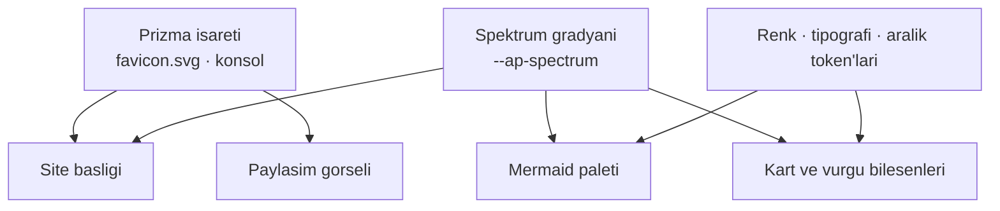

# Faz 76 — Doküman Kalitesi ve Görsel Kimlik

> **Durum:** 📋 Planlandı (2026-08-20)
> **Kaynak:** [ADAYLAR.md](ADAYLAR.md) · **F-127**
> **Önkoşul:** [Faz 75](75-TUKETICI-DOKUMAN-DOGRULUGU.md) — **zorunlu sıra.** Yanlış bir sayfayı güzelleştirmek onu daha zararlı yapar; doğruluk ve eksiksizlik önce gelir · [Faz 59](59-URUN-DOKUMANTASYONU.md) — sitenin kendisi, `check-content.mjs` deseni ve `site.css` katmanı oradan devralınır
> **Paketler:** Yok — bu faz `src/**` altına **hiç dokunmaz** · `docs-site/` · `tests/AgentPrism.Ui.E2ETests` (yalnız ekran görüntüsü)
> **Yeni paket:** Yok · **Migration:** Yok
> **Public API:** **Büyümüyor.** Bu faz hiçbir `.cs` dosyasını değiştirmez
> **Site etkisi:** Tamamı. 37 elle yazılmış sayfa, `astro.config.mjs`, `src/styles/site.css`, yeni Starlight bileşen geçersiz kılmaları, `public/` görselleri
> **Manuel test alanı:** `docs/manuel-test/32-DOKUMAN-KALITESI.md` (31 numarayı Faz 75 aldı)

---

## Bu Faza Başlarken

> `faz-baslangic` skill'ini uygula. Aşağıdaki liste o skill'in 2. adımıdır —
> **tamamını değil, yalnız işaret edilen bölümleri oku.**

1. Bu doküman
2. Kararlar — dosyanın tamamını **okuma**, yalnız bu kalemleri grep'le:
   ```bash
   grep -n "K-132\|K-228\|K-232\|K-413\|K-415" docs/KARARLAR.md
   ```
   **K-415** (ürün dokümantasyonu ayrı bir Astro Starlight sitesidir, İngilizce'dir
   — bu faz o kararı uygular, yeniden açmaz), **K-132** (arayüzde `mermaid.js`
   **reddedildi**: ~100 KB gzip. 🚨 Bu karar **konsol** içindir; doküman sitesi
   ayrı bir yayın hattıdır ve mermaid'i zaten kullanır — karar yeniden
   açılmıyor, sınırı hatırlatılıyor), **K-413** (üretilen dosya elle yazılmaz —
   `api/`, `http-api/` ve harita bu fazda **elle düzenlenmez**), **K-228** ve
   **K-232** (arayüz sözlüğü ve sunucu yanıtı — bu faz ikisine de dokunmaz)
3. [`75-TUKETICI-DOKUMAN-DOGRULUGU.md`](75-TUKETICI-DOKUMAN-DOGRULUGU.md) — yalnız devir notu:
   ```bash
   awk '/## Sonraki Faza Devir Notu/,0' docs/75-TUKETICI-DOKUMAN-DOGRULUGU.md
   ```
   Bu faz onun kapılarının **üstüne** yazar. Faz 75'in eklediği beş içerik
   iddiası hâlâ koşuyor olmalıdır; bu fazın hiçbir düzenlemesi onları
   gevşetemez.
4. Alan hafızası:
   [`hafiza/frontend.md`](hafiza/frontend.md) (yalnız ekran görüntüsü üreten
   E2E testine dokunulacaksa) · Faz 75 bir `hafiza/dokumantasyon.md` açtıysa **o**
5. Gerektiğinde: [`docs-site/README`](../docs-site/package.json) yerine doğrudan
   `astro.config.mjs` — kenar çubuğu ve bileşen sözleşmesi oradadır

---

## Amaç

Faz 75 dokümanın **doğru ve eksiksiz** olmasını sağladı. Bu faz onu **iyi**
yapar.

Ölçüm net bir tablo çiziyor: içerik yeterli, sunum değil. 37 elle yazılmış sayfa
ve 371 KB anlatı var — kapsam sorunu yok. Ama sayfaların **21'i** ne bir
diyagram ne bir görsel taşıyor; kapanış bölümü **üç farklı adla** yazılmış ve
sekiz sayfada hiç yok; açılış sayfası ürünün en büyük iddiasını **4,7 KB**'da
anlatıyor; ve markanın kendi prizma işareti `favicon.svg` ile konsolda
yaşıyorken sitenin başlığında **yok**.

Bu bir "tema seçme" fazı değildir. Marka **zaten var** — spektrum gradyanı,
prizma işareti, sakin ürün yüzeyi. Ölçüldü: `site.css` 163 satır ve 21 sınıf
taşıyor; bu bir stok tema değil, **eksik bırakılmış** bir tasarım katmanıdır.
Faz onu tamamlar.

- **F-127** — Doküman sitesi tek bir tasarım sistemine oturur, her sayfa aynı
  okuma sözleşmesini izler ve nitelikler ölçülebilir kapılara bağlanır.

Kapsam dışı: yeni içerik yazmak. Bir sayfa eksikse o Faz 75'in işidir. Bu faz
**var olan** içeriği yeniden düzenler, görselleştirir ve açar.

### Bugün ne çalışmıyor — doğrulanmış kanıt

| Kanıt | Gözlem |
|---|---|
| `grep -LE '```mermaid\|` | **21 sayfada** ne diyagram ne görsel var. Aralarında en uzun kılavuzlar da var: `guides/reliability.md` (14 771 B), `guides/production.md` (14 812 B), `guides/background-work.md` (12 768 B), `guides/observability.md` (12 720 B) |
| `grep -l "^## Read next"` / `"^## Related"` / `"^## Next$"` | Aynı iş **üç adla** yapılıyor: **19** sayfa "Read next", **7** sayfa "Related", **5** sayfa "Next". **8** sayfada hiç yok. Okur her sayfanın sonunda farklı bir sözleşmeyle karşılaşıyor |
| [`index.mdx`](../docs-site/src/content/docs/index.mdx) | **4 698 bayt** — 37 sayfanın en küçüklerinden biri. Ürünün tek satışa dönük yüzeyi bu sayfadır; `troubleshooting.md` ondan **beş kat** büyüktür |
| [`astro.config.mjs`](../docs-site/astro.config.mjs) | `logo:` anahtarı **yok** — başlık düz metindir. Oysa [`public/favicon.svg`](../docs-site/public/favicon.svg) (814 B) gerçek bir prizma işareti taşıyor ve yorumu "the same mark the console uses" diyor; konsol onu [`layout.tsx`](../src/AgentPrism.UI/frontend/src/components/layout.tsx) içinde kullanıyor |
| `astro.config.mjs` `head:` bloğu | **Tek bir `og:image`** bütün site için: `screenshots/dashboard.png`. Paylaşılan her bağlantı — kavram sayfası, HTTP referansı, sorun giderme — aynı görünüyor |
| [`site.css`](../docs-site/src/styles/site.css) | **163 satır, 26 CSS değişkeni, 21 sınıf.** Spektrum motifi (`--ap-spectrum`) yalnız **bir** yerde kullanılıyor: `.site-title::after` |
| `mermaid({ theme: 'neutral', autoTheme: true })` | 22 diyagramın hepsi Mermaid'in stok `neutral` paletiyle çiziliyor. Marka spektrumuyla ilişkisi yok |
| [`troubleshooting.md`](../docs-site/src/content/docs/troubleshooting.md) | **23 873 bayt, 62 `###` alt başlığı, 14 `##` bölümü.** Sitenin en büyük sayfası ve tek gezinme yardımı Starlight'ın sağ kenar listesidir |
| `reference/configuration.md` | **22 616 bayt** — ikinci en büyük. Faz 75 buna 13 üye daha ekliyor |
| `public/screenshots/` | **14 görüntü** (Faz 75 bunu 19'a çıkarır). Hepsi tek temada, tek çözünürlükte, `2880×1800` |
| `grep -lE "` | Görsel taşıyan sayfa sayısı: **1** (`ui.md`). `index.mdx` görselini bir Astro bileşeniyle koyar |

> Kanıtlar 2026-08-20 tarihinde doğrulandı.

🚨 **"Stok tema" teşhisi yanlıştır ve plan bunu ölçümle düzeltir.** İlk bakışta
site Starlight varsayılanı gibi görünüyor; `site.css` ölçülünce 21 sınıflık
bir ürün katmanı çıkıyor. Doğru teşhis: **kimlik var, uygulanmamış.** Bu, işi
küçültür — yeni bir dil icat edilmeyecek, var olan dil bütün sayfalara
yayılacak.

---

## 76.1 — Marka: var olan prizma motifini tamamlamak

Üç öğe zaten var: prizma işareti (`favicon.svg`), spektrum gradyanı
(`--ap-spectrum`) ve sakin bir renk paleti (`--sl-color-accent`). Faz bunları
bir sisteme çevirir.



| İş | Bugün | Sonra |
|---|---|---|
| Site başlığı | Düz metin + spektrum alt çizgisi | Prizma işareti + kelime markası; işaret tek kaynaktan gelir |
| Renk | 26 değişken, çoğu Starlight'ın kendi adları | Kapalı bir token kümesi: yüzey, metin, vurgu, uyarı, kod — açık ve koyu temada **ikisi de tanımlı** |
| Tipografi | Starlight varsayılanı | Ölçek tanımlanır (başlık, gövde, kod); satır uzunluğu `--sl-content-width` ile hizalanır |
| Spektrum | Bir yerde | Bölüm ayracı, aktif gezinme, diyagram vurgusu — **ölçülü**; her yerde kullanılırsa anlamını yitirir |
| Mermaid | Stok `neutral` | Token'lardan türeyen palet; açık/koyu temada okunaklı |

🚨 Renk kararı **erişilebilirlikten** türetilir, tersinden değil. Her metin/zemin
çifti WCAG AA eşiğini (normal metin 4.5:1) geçmelidir ve bu bir kapıya bağlanır
([§76.7](#767--erişilebilirlik-ve-ağırlık-kapıları)). Spektrum gradyanı
**metin arkasında kullanılamaz**.

---

## 76.2 — Açılış sayfası

`index.mdx` bugün doğru şeyleri söylüyor ve kısa kesiyor: dört ölçülmüş sayı,
dört kart, bir kod bloğu, bir ekran görüntüsü, dört yol.

Eksik olan, okurun **kendi durumunu** tanıması. Sayfa ürünü anlatıyor; okurun
sorununu değil. Üç ekleme:

1. **Sorun cümlesi.** "MAF ile bir agent yazdınız. Şimdi onu üretimde
   işletmeniz gerekiyor" — okur ilk ekranda kendini tanımalı.
2. **Ne yaptığını gösteren tek bir akış.** Bir agent tanımından bir `run`
   kaydına giden kısa bir görsel şerit; bugün bunu yalnız `capabilities.md`
   içindeki diyagram yapıyor ve oraya gitmek gerekiyor.
3. **Sınırın açıkça yazılması.** "Bir kütüphanedir, barındırılan bir servis
   değildir" ve dört tasarım kuralı bugün `getting-started/index.md`'de.
   Açılışta bir satırla durmalı — dürüstlük bir satış argümanıdır.

Dört ölçülmüş sayı **kalır** ve kapıya bağlı kalır
([`check-content.mjs:97-105`](../docs-site/scripts/check-content.mjs#L97-L105)).
Pazarlama dili girmez; sayı ve sınır, sıfat değil.

---

## 76.3 — Sayfa sözleşmesi

Okur bir sayfayı açtığında ne bulacağını bilmelidir. Bugün üç farklı kapanış
ve iki farklı açılış deseni var (bazı kılavuzlar "Mental model:" ile açıyor,
bazıları doğrudan işe giriyor).

Tek sözleşme:

| Konum | Ne | Zorunlu mu |
|---|---|---|
| Başlık altı | `description` — bugün zaten 70–180 karakter kapısında | ✅ (var) |
| İlk paragraf | Bu sayfanın hangi soruyu cevapladığı | ✅ |
| Gövde | İşin kendisi | ✅ |
| Son bölüm | **`## Read next`** — üç bağlantıdan fazla değil | ✅ |

"Related" ve "Next" başlıkları `Read next` olur. Sekiz sayfa yeni bir kapanış
kazanır. Kapanışsız bir sayfa okuru çıkmaza sokar; bu ölçülebilir ve kapıya
bağlanır ([§76.8](#768--kapılar)).

🚨 Bu bir yeniden yazma turu **değildir**. Cümleler korunur; başlık adı,
sıralama ve eksik kapanışlar düzeltilir. `check-content.mjs`'in mevcut
iddiaları (frontmatter, açıklama uzunluğu, kenar çubuğu erişilebilirliği)
zaten yeşildir ve yeşil kalmalıdır.

---

## 76.4 — Diyagram borcu

Yirmi bir sayfada görsel yok. Hepsine diyagram koymak yanlış olur — bir tablo
sayfası diyagram istemez. Kural şudur:

> Bir sayfa bir **akış**, bir **karar** veya bir **katman** anlatıyorsa, onu
> bir diyagram anlatmalıdır. Bir **liste** anlatıyorsa tablo yeterlidir.

Ölçülen aday sekiz sayfadır — hepsi 8 KB üstü ve hepsi akış anlatıyor:

| Sayfa | Boyut | Ne anlatmalı |
|---|---|---|
| `guides/reliability.md` | 14 771 B | Arıza sınırları: sağlık → yedek zincir → devre kesici → uzlaştırma |
| `guides/production.md` | 14 812 B | Süreç topolojisi: API · worker · tek yürütücü · store |
| `guides/background-work.md` | 12 768 B | Kuyruk yaşam döngüsü: kayıt → seçim → çalıştırma → yeniden deneme |
| `guides/observability.md` | 12 720 B | `span` ağacı ve metriklerin nereden doğduğu |
| `guides/testing.md` | 10 487 B | Test seviyeleri: `FakeModelProvider` → `AgentPrismTestHost` → E2E |
| `guides/external-agents.md` | 6 767 B | İki yön: tüketilen MCP · yayımlanan MCP/A2A |
| `guides/openai-api.md` | 6 901 B | İki uyumluluk yüzeyi ve durum sahipliği |
| `guides/voice.md` | 7 420 B | Ses yolu: tool'lar · gerçek zamanlı oturum |

Her diyagram **Mermaid**'dir (repo kuralı) ve `accTitle` + `accDescr` taşır —
bu zaten kapıdadır
([`check-content.mjs:214-221`](../docs-site/scripts/check-content.mjs#L214-L221)).

Kalan on üç sayfa (`reference/*`, `packages.md`, `http-api.md`, kısa başlangıç
sayfaları) **tablo sayfasıdır** ve diyagram almaz. Kapı bu ayrımı bilir:
eşik boyutun üstündeki sayfa ya bir diyagram taşır ya bir muafiyet listesinde
durur ([§76.8](#768--kapılar)).

---

## 76.5 — `troubleshooting.md` yeniden düzenlenir

23 873 bayt, 62 alt başlık, tek sayfa. Sorun giderme sayfası **taranarak**
okunur, baştan sona değil; bugünkü tek yardım sağ kenardaki başlık listesidir.

İki seçenek ölçüldü ve **birincisi öneriliyor**:

- **A — Tek sayfa kalır, gezinmesi güçlenir.** Başa bir belirti dizini
  (semptom → bölüm bağlantısı) konur; 14 `##` bölümü daraltılabilir gruplara
  ayrılır. `Ctrl+F` çalışmaya devam eder ve tek URL korunur.
- **B — Alt sayfalara bölünür.** Her bölüm kendi sayfası olur. Arama iyileşir
  ama tek sayfada arama biter ve 14 yeni URL doğar.

**A**, çünkü sorun giderme sayfasının en çok kullanılan özelliği tarayıcı
aramasıdır ve bölmek onu öldürür. Sayfanın başındaki mevcut "A fast diagnostic
order" bölümü bu dizinin doğal yeridir.

`reference/configuration.md` (22 616 B, Faz 75 sonrası daha büyük) aynı
tedaviyi alır: bölüm indeksi zaten var (`## Section index`), eksik olan her
bölümün başında **hangi paketin** o bölümü okuduğudur.

---

## 76.6 — Paylaşım yüzeyi

Bugün her sayfa aynı `og:image` ile paylaşılıyor: konsol gösterge paneli. Bir
kavram sayfasının bağlantısını paylaşan okur, ekran görüntüsü gören biri için
yanlış beklenti üretir.

Bölüm başına bir görsel yeterlidir — sayfa başına üretim gerekmez:

| Bölüm | Görsel |
|---|---|
| Start here · Build agents | Prizma işareti + ürün adı |
| The console | Gösterge paneli (bugünkü) |
| Operate in production | Bir `run` detay ekranı |
| Reference · HTTP API | Şema/tablo motifi |

Görseller **statiktir** ve `public/` altında durur. Derleme anında üretim
([Açık Soru 2](#açık-sorular)) yeni bir yayın hattı borcudur ve bu fazın
kapsamında değildir.

---

## 76.7 — Erişilebilirlik ve ağırlık kapıları

Yeni tasarımın iki bedeli vardır ve ikisi de ölçülür.

**Kontrast.** Her token çifti WCAG AA eşiğini geçer. Ölçüm derleme anında
yapılır: `site.css`'teki token'lar okunur, çiftler hesaplanır, eşiği geçmeyen
**hata** verir. Bu, `check-content.mjs`'in "koddan ölç" desenidir ve tarayıcı
gerektirmez.

**Ağırlık.** Bugün ölçülmemiş bir sayı yok — çünkü hiç ölçülmemiş. Faz bir
taban çizgisi kurar: bir doküman sayfasının HTML + CSS + JS ağırlığı
(mermaid parser hariç, çünkü o zaten talep üzerine yükleniyor ve
[`astro.config.mjs:20-22`](../docs-site/astro.config.mjs#L20-L22) bunu
gerekçelendiriyor). Sınır **ilk ölçümden sonra** konur — plan sayı uydurmaz.

🚨 Font kararı ağırlığın en büyük tek kalemidir. Web fontu **eklenirse**
`font-display: swap` ve alt küme zorunludur; eklenmezse sistem yığını kalır ve
ağırlık değişmez. Bu bir açık sorudur ([Açık Soru 1](#açık-sorular)).

---

## 76.8 — Kapılar

Faz 75'in beş içerik iddiasının üstüne dört sunum iddiası eklenir. Hepsi
`check-content.mjs` içindedir ve tarayıcı gerektirmez.

| # | İddia | Neden ölçülebilir |
|---|---|---|
| 6 | Her elle yazılmış sayfa bir `## Read next` bölümüyle biter | Başlık taraması |
| 7 | Eşiği aşan her anlatı sayfası en az bir diyagram veya görsel taşır; muafiyet listesi açıkça yazılır | Boyut + içerik taraması |
| 8 | `site.css` token çiftleri WCAG AA kontrastını geçer | Token ayrıştırma + kontrast hesabı |
| 9 | Her kenar çubuğu bölümünün bir `og:image`'ı var ve dosya diskte | Yapılandırma + dosya varlığı |

Muafiyet listesi bir kaçış kapısı değildir: içinde duran her sayfa için **neden**
yazılır ve `faz-denetim` listenin büyümesini 🔴 sayar — Faz 73 ve 74'ün taban
çizgisi kuralının aynısı.

---

## Planlanan Public API

**Yok.** Bu faz `src/**` altındaki hiçbir dosyayı değiştirmez.

### HTTP `endpoint`'leri

Yok.

### Arayüz payı

Konsol bundle'ı **değişmez** — bu faz `AgentPrism.UI` frontend koduna dokunmaz.
Doküman sitesinin ağırlığı ayrı ölçülür ([§76.7](#767--erişilebilirlik-ve-ağırlık-kapıları));
o bundle pakete girmez ve 250 KB konsol bütçesiyle ilgisi yoktur.

---

## Planlanan Dosya Listesi

```
docs-site/
├── astro.config.mjs                     (degisir — logo, bolum basina og:image, mermaid paleti)
├── src/styles/site.css                  (degisir — token kumesi, bilesen sinirlari)
├── src/components/                      (YENI — Starlight bilesen gecersiz kilmalari)
│   └── <az sayida, gerektigi kadar>
├── src/assets/prism-mark.svg            (YENI — favicon ile ayni kaynak, tek kopya)
├── public/social/<bolum>.png            (YENI — dort paylasim gorseli)
├── scripts/check-content.mjs            (degisir — dort yeni iddia)
└── src/content/docs/
    ├── index.mdx                        (degisir — acilis)
    ├── troubleshooting.md               (degisir — belirti dizini)
    ├── reference/configuration.md       (degisir — bolum basi isaretleri)
    ├── guides/{reliability,production,background-work,observability,
    │           testing,external-agents,openai-api,voice}.md   (degisir — diyagram)
    └── <20 sayfa>                       (degisir — kapanis bolumu tekleseme)

docs/manuel-test/32-DOKUMAN-KALITESI.md  (YENI)
docs/manuel-test/00-INDEKS.md            (degisir — satir 32)
```

---

## Hata Modları ve Testler

| Ne bozulabilir | Seviye | Test |
|---|---|---|
| Yeni sayfa kapanış bölümü olmadan eklenir | CI | `check-content.mjs` iddia 6 |
| Uzun bir kılavuz diyagramsız kalır | CI | `check-content.mjs` iddia 7 |
| Muafiyet listesi sessizce büyür | CI + denetim | `check-content.mjs` + `faz-denetim` |
| Yeni bir renk token'ı kontrastı düşürür | CI | `check-content.mjs` iddia 8 |
| Koyu temada bir yüzey tanımsız kalır ve okunmaz olur | CI + **Manuel** | iddia 8 (token çifti) + 👤 iki temada göz denetimi |
| Kenar çubuğuna bölüm eklenir, paylaşım görseli eklenmez | CI | `check-content.mjs` iddia 9 |
| Diyagram `accTitle`/`accDescr` taşımaz | CI | `check-content.mjs` (mevcut iddia) |
| Mermaid paleti koyu temada okunmaz | **Manuel** 👤 | Görsel denetim, iki tema |
| Yeni bileşen mobilde taşar | **Manuel** 👤 | 360 px genişlikte denetim |
| Ekran görüntüsü tema değişikliğinden sonra bayatlar | **E2E** | `DocumentationScreenshotTests` |
| Tasarım değişikliği Faz 75'in içerik kapılarını gevşetir | CI | Faz 75 iddiaları koşmaya devam eder |

Beş soru:

| Soru | Cevap |
|---|---|
| İptal | Konu dışı — çalışma anına dokunulmuyor |
| Eşzamanlılık | Konu dışı |
| Boş/aşırı girdi | Muafiyet listesindeki bir sayfa silinirse kapı **kızarır** (bayat liste), sessizce geçmez |
| Başka kiracı | Konu dışı |
| Alt sistem hatası | Kontrast hesabı bir token'ı çözemezse **hata verir**, iddiayı atlamaz |

🚨 Bu fazın çıktısının bir kısmı **göz gerektirir** ve bu dürüstçe yazılır.
Kontrast hesaplanabilir; "okunaklı" hesaplanamaz. Manuel case'ler 👤 ile
işaretlenir ve `faz-tamamlama` onları atlamaz.

---

## Manuel Kabul Case'leri

| # | Ön koşul | Adımlar | Beklenen sonuç |
|---|---|---|---|
| 1 | Yayınlanan site | Açılış sayfasını aç | Prizma işareti başlıkta; dört ölçülmüş sayı yerinde; sorun cümlesi ilk ekranda | 👤 |
| 2 | Aynı | Temayı koyuya çevir, on sayfa gez | Hiçbir yüzey okunmaz hâle gelmiyor; spektrum yalnız ayraçlarda | 👤 |
| 3 | Aynı | Tarayıcıyı 360 px genişliğe daralt | Tablo ve kod blokları kendi içinde kayıyor; sayfa gövdesi yatay kaymıyor | 👤 |
| 4 | Aynı | Sekiz kılavuzu tek tek aç | Sekizinde de diyagram var ve iki temada da okunuyor | 👤 |
| 5 | Aynı | Rastgele on sayfanın sonuna in | Onunda da `Read next` var ve en fazla üç bağlantı taşıyor |
| 6 | Aynı | `troubleshooting` sayfasını aç | Başta belirti dizini var; bir belirtiye tıklamak doğru bölüme gidiyor; `Ctrl+F` hâlâ tüm sayfayı buluyor | 👤 |
| 7 | Aynı | Dört bölümden birer sayfayı bir sohbete/sosyal ağa yapıştır | Dört farklı önizleme görseli çıkıyor | 👤 |
| 8 | Bir sayfadan `## Read next` bölümünü sil | `npm run check:content` | Kızarır ve sayfayı adıyla söyler |
| 9 | `site.css`'e kontrastı düşük bir token çifti ekle | Aynı | Kızarır ve oranı yazar |
| 10 | Kenar çubuğuna görselsiz bir bölüm ekle | Aynı | Kızarır |
| 11 | Uzun bir kılavuzdan diyagramı sil | Aynı | Kızarır veya muafiyet gerekçesi ister |
| 12 | Klavye ile gez | `Tab` ile başlıktan içeriğe | "Skip to content" çalışıyor; odak halkası her yerde görünür | 👤 |

---

## Açık Sorular

| # | Soru | Seçenekler | Öneri |
|---|---|---|---|
| 1 | Web fontu eklensin mi | A: Hayır, sistem yığını · B: Evet, tek aile, alt kümelenmiş | **A** ile başla, tipografi ölçeğini kur, **sonra** ölç. Sistem yığını sıfır ağırlıktır ve .NET okurunun makinesinde tutarlı görünür. Font ancak ölçek yetersiz kalırsa açılır |
| 2 | Paylaşım görselleri üretilsin mi | A: Dört statik dosya · B: Sayfa başına derleme anında üretim | **A.** B yeni bir üretim hattı, yeni bir bağımlılık ve K-413 kapsamında yeni bir "üretilen dosya" borcudur. Dört görsel bugünkü tek görselden dört kat iyidir |
| 3 | Starlight bileşenleri geçersiz kılınsın mı | A: Yalnız CSS · B: Az sayıda bileşen (başlık, açılış kartları) · C: Geniş geçersiz kılma | **B.** Yalnız CSS ile prizma işareti başlığa konamaz. Geniş geçersiz kılma Starlight yükseltmelerini pahalı yapar; sınır "kaçınılmaz olanlar" olmalı |
| 4 | `troubleshooting.md` bölünsün mü | A: Tek sayfa + belirti dizini · B: Alt sayfalar | **A** — [§76.5](#765--troubleshootingmd-yeniden-düzenlenir)'te gerekçelendirildi |
| 5 | Ekran görüntüleri koyu temada da üretilsin mi | A: Hayır, tek tema · B: Evet, çift set | **A.** Çift set 19 yerine 38 görüntü ve iki kat bakım demektir; kazanç kozmetiktir. Ölçüm gösterirse (koyu tema kullanım oranı) yeniden açılır |
| 6 | Sayfa ağırlığı sınırı ne olmalı | — | **Ölçülmedi.** İlk ölçümden sonra, ölçülen değere pay eklenerek konur. Plan sayı uydurmaz |

---

## Bitiş Ölçütleri (DoD)

- [ ] Site başlığı prizma işaretini taşıyor ve işaret **tek kaynaktan** geliyor (`favicon.svg` ile aynı dosya, kopya değil)
- [ ] `site.css` kapalı bir token kümesi tanımlıyor; her token açık **ve** koyu temada tanımlı; hiçbir renk yalnız bir tema bloğunda doğmuyor
- [ ] Kontrast kapısı yeşil; ölçülen en düşük oran belgeye yazıldı
- [ ] 37 elle yazılmış sayfanın 37'si `## Read next` ile bitiyor; "Related" ve "Next" başlığı **sıfır** kaldı
- [ ] Sekiz uzun kılavuzun sekizinde de diyagram var; muafiyet listesindeki her sayfa için gerekçe yazıldı
- [ ] Dört bölümün dördünün de kendi `og:image`'ı var ve dosya diskte
- [ ] `troubleshooting.md` belirti diziniyle açılıyor; dizindeki her bağlantı bir bölüme çözülüyor
- [ ] `index.mdx` sorun cümlesi, akış görseli ve sınır cümlesi taşıyor; dört ölçülmüş sayı hâlâ kapıya bağlı
- [ ] Doküman sayfası ağırlığı **ölçüldü** ve sınır belgeye yazıldı
- [ ] Faz 75'in beş içerik iddiası hâlâ yeşil — hiçbiri gevşetilmedi
- [ ] `npm run check:content` dört yeni iddiayla yeşil; `npm run build` + `check-links.mjs` temiz
- [ ] Dört doğrulama kapısı sıfır uyarı verir
- [ ] `samples/AgentPrism.Api` ile gerçek `run` yapıldı, çıktı belgeye yazıldı
- [ ] `secret` taraması boş döndü
- [ ] Manuel kabul case'leri `docs/manuel-test/32-DOKUMAN-KALITESI.md` içine eklendi; 👤 işaretli olanlar **elle** koşuldu ve sonuçları yazıldı
- [ ] `faz-denetim` koşuldu; 🔴 bulgu kalmadı

### Doğrulama komutları

```bash
# Kapanis bolumu tekil mi
cd docs-site/src/content/docs
grep -rl "^## Related\|^## Next$" . --include='*.md' | grep -v '/api/\|/http-api/'   # beklenen: bos

# Diyagram borcu kapandi mi
for f in guides/reliability.md guides/production.md guides/background-work.md \
         guides/observability.md guides/testing.md guides/external-agents.md \
         guides/openai-api.md guides/voice.md; do
  grep -q '```mermaid' "$f" || echo "eksik: $f"
done

# Kapilar
cd docs-site && npm run check:content && npm run build && npm run check:links
```

---

## Riskler

| Risk | Önlem |
|------|-------|
| Tasarım turu içeriği bozar — cümleler "sadeleştirilirken" bilgi düşer | Bu faz **yeni içerik yazmaz ve cümle silmez**; başlık adı, sıralama ve görselleştirme yapar. `faz-denetim` `git diff`'te silinen cümleleri arar |
| Faz 75'in kapıları bu fazın düzenlemeleriyle kızarır ve gevşetilme baskısı doğar | DoD'de açık satır: beş iddia yeşil kalmalı. Kızaran kapı **düzenlemenin** kusurudur, kapının değil |
| Starlight bileşen geçersiz kılmaları sonraki yükseltmeleri pahalı yapar | Açık Soru 3 sınırı "kaçınılmaz olanlar" olarak çiziyor; her geçersiz kılma için gerekçe yazılır |
| Görsel iş öznel bir tartışmaya dönüşür ve faz kapanmaz | DoD'nin **on maddesi ölçülebilir**; öznel olanlar 👤 manuel case'lerdir ve "koştu/koşmadı" ile kapanır |
| Mermaid paleti markayla uyumlu ama okunmaz olur | Kontrast kuralı diyagram renklerini de kapsar; iki temada manuel case (MT 4) |
| Sayfa ağırlığı sessizce büyür | Faz bir taban çizgisi kurar; sınır ölçülen değere göre konur ve `check-content.mjs` zorlar |
| `troubleshooting.md` dizini bayatlar — bölüm eklenir, dizine yazılmaz | Dizin bağlantıları başlıklara çözülür; kapı çözülmeyen bağlantıyı yakalar (`check-links.mjs` site içi çapaları görür) |

---

<!-- ============================================================
     AŞAĞISI KAPANIŞTA DOLDURULUR — `faz-tamamlama` skill'i.
     Plan anında boş kalır. Başlıkları SİLME.
     ============================================================ -->

## Plandan Sapmalar

> Kapanışta doldurulur.

## Bu Fazda Verilen Kararlar

> Kapanışta doldurulur. K-NNN numaraları burada alınır; plan numara rezerve etmez.

## Gerçekleşen Public API

> Kapanışta doldurulur.

## Dosya Listesi (gerçekleşen)

> Kapanışta doldurulur.

## Denetim Bulguları

> Kapanışta doldurulur.

## Sonraki Faza Devir Notu

> Kapanışta doldurulur.
