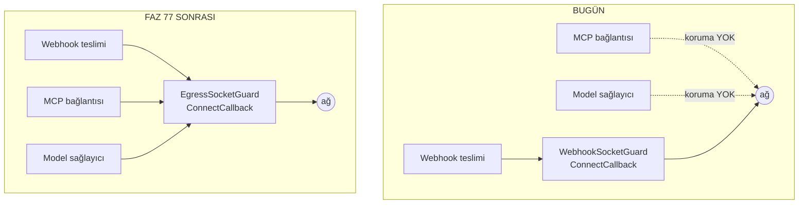

# Faz 77 — Giden Ağ Muhafızı

> **Durum:** ✅ Tamamlandı (2026-08-20)
> **Kaynak:** [ADAYLAR.md](ADAYLAR.md) · **F-131** · bulgular
> [`guvenlik-tarama/BULGULAR.md`](guvenlik-tarama/BULGULAR.md) B05-2 · B05-3 · B05-4 · B05-5 · B05-6 · B05-7
> **Önkoşul:** Yok — K-164'ün `ConnectCallback` deseni bugün webhook yolunda çalışıyor ve bu faz onu genelleştirir
> **Paketler:** `AgentPrism.Abstractions`, `AgentPrism.Core`, `AgentPrism.Mcp`, `AgentPrism.AspNetCore`
> **Yeni paket:** Yok · **Migration:** Yok
> **Public API:** Büyüyor — `PublicAPI.Shipped.txt` dosyaları **API kaydı taşımaz** (`wc -l src/*/PublicAPI.Shipped.txt` → her biri tek satır, yalnız `#nullable enable`), yani bugün eklemek ucuzdur; Faz 7'den sonra bir sürüm kararı olur
> **Tüketici yüzeyi:** `docs-site/src/content/docs/getting-started/security.md` (giden ağ bölümü) · `docs-site/src/content/docs/guides/production.md` (yeni ayar) · sevk edilen: `AgentPrismEgressOptions` XML dokümanı, `capabilities.md` satırı
> **Manuel test alanı:** [`manuel-test/13-KIRACI-VE-GUVENLIK.md`](manuel-test/13-KIRACI-VE-GUVENLIK.md) ve [`manuel-test/18-MCP-VE-A2A.md`](manuel-test/18-MCP-VE-A2A.md)

---

## Bu Faza Başlarken

> `faz-baslangic` skill'ini uygula. Aşağıdaki liste o skill'in 2. adımıdır —
> **tamamını değil, yalnız işaret edilen bölümleri oku.**

1. Bu doküman
2. Kararlar — dosyanın tamamını **okuma**, yalnız bu kalemleri grep'le:
   ```bash
   grep -n "K-164\|K-163\|K-165\|K-058\|K-059\|K-007" docs/KARARLAR.md
   ```
   **K-164** (SSRF koruması `WebhookHttpClient`'ın **içine** gömülüdür,
   `IHttpClientFactory` **kullanılmaz** — bu fazın en sıkı kısıtı) ·
   **K-163** (webhook imzası zaman damgası içerir) ·
   **K-165** (hız sınırı varsayılanı kapalı — varsayılan seçimi için emsal) ·
   **K-058/K-059** (`secret` değeri değil, yapılandırma anahtarının **adı**
   saklanır) · **K-007** (yeni NuGet paketi gerekçe ister)
3. [`76-DOKUMAN-KALITESI-VE-GORSEL-KIMLIK.md`](76-DOKUMAN-KALITESI-VE-GORSEL-KIMLIK.md)
   — yalnız devir notu:
   ```bash
   awk '/## Sonraki Faza Devir Notu/,0' docs/76-DOKUMAN-KALITESI-VE-GORSEL-KIMLIK.md
   ```
4. Alan hafızası (bu faz üç alana dokunuyor):
   [`hafiza/mcp-a2a-sunucu.md`](hafiza/mcp-a2a-sunucu.md) (MCP bağlantı kurulumu) ·
   [`hafiza/openai-saglayici.md`](hafiza/openai-saglayici.md) (sağlayıcı istemci fabrikaları) ·
   [`hafiza/aspnetcore-di.md`](hafiza/aspnetcore-di.md) (uç kaydı ve seçenek bağlama)
5. Gerektiğinde, tamamı değil ilgili bölümü:
   [`MIMARI-GUVENLIK.md`](MIMARI-GUVENLIK.md) — "Dış ağ erişimi" bölümü

---

## Amaç

AgentPrism bugün **üç** yerden dışarı ağ isteği atar: webhook teslimi, MCP
sunucu bağlantısı ve model sağlayıcı çağrısı. SSRF koruması yalnız **birincide**
vardır. Bu faz korumayı üçüne de taşır ve `secret`'ın yanlış hedefe gitmesini
engelleyen yapılandırma anahtarı kısıtını eksik iki yüzeye yayar.

- **F-131** — Giden ağ isteklerinin hedef adresini tek bir muhafızdan geçir;
  `secret` çözen her yapılandırma anahtarını bir önek allow-list'ine bağla.

Kazanan: çok kiracılı bir kurulumu işleten operatör. Bugün `AgentsAdmin`
kapsamlı bir çağrı MCP sunucusunu bulut sağlayıcısının metadata adresine
yöneltebilir; `SecurityAdmin` kapsamlı bir çağrı aynısını model sağlayıcısı için
yapabilir ve çözülen API anahtarı o adrese gider.

### Bugün ne çalışmıyor — doğrulanmış kanıt

| Kanıt | Gözlem |
|---|---|
| [`GovernanceEndpoints.cs:790`](../src/AgentPrism.AspNetCore/Endpoints/GovernanceEndpoints.cs) · [`:800`](../src/AgentPrism.AspNetCore/Endpoints/GovernanceEndpoints.cs) | MCP `endpoint` yalnız "mutlak URI" ve "şema `http`/`https`" denetimi görür. Adres denetimi yoktur |
| [`McpTransportFactory.cs:19-23`](../src/AgentPrism.Mcp/Internal/McpTransportFactory.cs) | `IsRemoteHttp` de yalnız şemaya bakar; `169.254.169.254` ve `10.0.0.5:8080` kabul edilir |
| [`AgentPrismWebhookOptions.cs:28`](../src/AgentPrism.Core/Webhooks/AgentPrismWebhookOptions.cs) | `AllowPrivateNetworkTargets` **yalnız** webhook seçeneklerindedir; MCP ve sağlayıcı yolunda karşılığı yoktur |
| [`TenantProviderEndpoints.cs:163`](../src/AgentPrism.AspNetCore/Endpoints/TenantProviderEndpoints.cs) | `Endpoint = request.Endpoint` — hiçbir denetimden geçmez. Aynı metotta `ApiKeyConfigurationName` için önek denetimi **vardır** |
| [`McpTransportFactory.cs:110`](../src/AgentPrism.Mcp/Internal/McpTransportFactory.cs) | `headers["Authorization"] = configuration[key]` — anahtar adı için önek kısıtı yoktur |
| [`AgentPrismInboundTriggerOptions.cs:27`](../src/AgentPrism.Abstractions/Options/AgentPrismInboundTriggerOptions.cs) · [`AgentPrismTenantProviderOptions.cs:18`](../src/AgentPrism.Abstractions/Options/AgentPrismTenantProviderOptions.cs) | Karşıt desen: iki yerde `AllowedConfigurationPrefix` vardır ve XML dokümanı ikisini de "a security boundary" diye adlandırır |
| `grep -rl "WebhookSocketGuard" tests` → boş | K-164'ün gerçek zorlama noktasının testi yoktur |
| [`WebhookUrlValidator.cs:207-262`](../src/AgentPrism.Core/Webhooks/WebhookUrlValidator.cs) | `::ffff:a.b.c.d` ele alınır; NAT64 (`64:ff9b::/96`) ve `::a.b.c.d` alınmaz |

> Kanıtlar 2026-08-20 tarihinde doğrulandı. Satır numaraları aynı gün yapılan
> güvenlik kapanışından **sonra** yeniden ölçüldü.

### Ölçülen: dört sağlayıcı da `HttpClient` enjeksiyonuna izin verir

Adaylar listesi bunu "ölçülmedi" diye bırakmıştı; bu fazın maliyetini belirleyen
soru buydu ve **ölçüldü**:

| Sağlayıcı | Kanca | Kanıt |
|---|---|---|
| Anthropic | `ClientOptions.HttpClient` (settable) + `ClientOptions.Handlers` | `~/.nuget/packages/anthropic/12.35.1/lib/net9.0/Anthropic.xml` — `P:Anthropic.Core.ClientOptions.HttpClient` |
| OpenAI | `OpenAIClientOptions` (Azure SDK `ClientPipelineOptions` ailesi) | [`OpenAIChatClientFactory.cs:110`](../src/AgentPrism.OpenAI/OpenAIChatClientFactory.cs) |
| Azure OpenAI | `AzureOpenAIClientOptions` (aynı aile) | [`AzureOpenAIChatClientFactory.cs:156`](../src/AgentPrism.Azure/AzureOpenAIChatClientFactory.cs) |
| Google | Fabrika zaten kendi `HttpClient`'ına sahiptir | [`GoogleChatClientFactory.cs:31`](../src/AgentPrism.Google/GoogleChatClientFactory.cs) yorumu |

**Sonuç:** yeni paket gerekmez, `IHttpClientFactory` gerekmez, K-164 korunur.

> 🚨 **Doğrulanmadı — uygulama anında ölçülmeli:** OpenAI ve Azure `ClientOptions`
> üzerinde `Transport` mü yoksa `HttpClient` mi kabul edildiği SDK sürümüne
> bağlıdır. İlk iş: `maf-api-kesfi` deseniyle bu iki tipin gerçek imzasını çıkar.
> Tahmin edilmiş bir imza sessizce yanlış koda dönüşür.

---

## 77.1 — Muhafız nereye konur

K-164 kısıtı bu fazın şeklini belirler: koruma **`SocketsHttpHandler.ConnectCallback`
içinde** kalır, çünkü orada doğrulanan adres soketin bağlandığı adresin ta
kendisidir (TOCTOU penceresi yoktur). `IHttpClientFactory` **kullanılmaz**.

Bugün bu mantık `WebhookSocketGuard` içinde webhook'a gömülüdür. Faz onu
`AgentPrism.Core` altında paylaşılan bir tipe çıkarır ve üç yüzeyin de kendi
`SocketsHttpHandler`'ını o tiple kurmasını sağlar.



**Neden ortak tip, üç kopya değil:** B05-1'in dersi tam buydu. MCP anahtarı elle
tekrarlanan bir ifadeydi ve okuma yolu ile yazma yolu sessizce ayrıştı. Aynı
çözüm+denetim döngüsünün üç kopyası aynı sonu verir — biri düzeltilir, ikisi
unutulur. `WebhookSocketGuard` bugün bile döngüyü `ValidateResolvedAsync`'ten
**kopyalıyor** (B05-6) ve testi yok.

## 77.2 — Varsayılan: özel ağ hedefleri reddedilir

**Kullanıcı kararı (2026-08-20):** üç yüzeyde de varsayılan **reddetmektir** —
webhook bugün ne yapıyorsa aynısı. Tek zihinsel model, tek ayar.

```
AgentPrism:Egress:AllowPrivateNetworkTargets = false   (varsayılan)
```

Bu bir davranış değişikliğidir ve **yükseltmede kırabilir**: iç ağda MCP sunucusu
çalıştıran bir kurulum bağlantı kuramaz. Plan bunu gizlemez:

- Hata mesajı hangi ayarın açılacağını **adıyla** söyler.
- `docs-site/.../production.md` bir yükseltme notu taşır.
- Ayar tek satırla geri alınır.

> **K1 (sıfır sürpriz) ile ilişkisi.** K1 yeni bir genişleme noktasının kapalı
> gelmesini ister. Burada kapalı olan **hedef**tir, yetenek değil: muhafız açık
> gelir ve özel ağı reddeder. Bu K1'in ruhuna uygundur — sürpriz olan, bir
> kurulumun farkında olmadan metadata adresine istek atabilmesidir.

## 77.3 — Yapılandırma anahtarı önek kısıtı iki yüzeye daha

`secret` çözen her yapılandırma anahtarı bir önek allow-list'ine bağlıdır.
Bugün iki yerde vardır, iki yerde yoktur:

| Yüzey | Bugün | Faz sonrası |
|---|---|---|
| Gelen tetikleyici imza `secret`'ı | ✅ `AgentPrism:TriggerSecrets:` | değişmez |
| Kiracı sağlayıcı API anahtarı | ✅ `AgentPrism:ProviderKeys:` | değişmez |
| MCP `AuthorizationConfigurationKey` | ❌ yok | ✅ yeni önek |
| MCP `OAuthClientSecretConfigurationKey` | ❌ yok | ✅ aynı önek |
| Webhook `SecretConfigurationKey` | ❌ yok | ✅ yeni önek |

Desen `InboundTriggerSecretResolver.ValidatePrefix` ile birebir aynıdır: boşsa
reddet, önekle başlamıyorsa reddet, hata mesajı öneki yazsın.

> **Bu da kırıcıdır.** Mevcut bir MCP kaydı öneksiz bir anahtar adı taşıyorsa
> kaydetme reddedilir. Yükseltme notu bunu söyler; varsayılan önekler
> (`AgentPrism:McpSecrets:`, `AgentPrism:WebhookSecrets:`) operatör tarafından
> gevşetilebilir.

## 77.4 — Muhafızın testi ve NAT64

Bu faz K-164'ün zorlama noktasına **ilk testini** yazar (B05-6) ve
`IsPrivate`'in kaçırdığı iki IPv6 biçimini ekler (B05-7): NAT64 `64:ff9b::/96`
ve IPv4-uyumlu `::a.b.c.d`.

Ayrıca webhook ek başlıklarına ad ve sayı sınırı gelir (B05-5): imza başlığının
adını taşıyan bir giriş alıcının doğrulamasını bozuyordu.

---

## Planlanan Public API

> Taslak imzalardır. Gerçekleşen imzalar kapanışta ayrı bir bölüme yazılır.

```csharp
// AgentPrism.Abstractions
/// <summary>Giden ağ isteklerinin hedef adresi için ortak kurallar.</summary>
public sealed class AgentPrismEgressOptions
{
    public const string SectionName = "AgentPrism:Egress";

    /// <summary>Özel ağ adreslerine bağlanmaya izin verilir mi. Varsayılan false.</summary>
    public bool AllowPrivateNetworkTargets { get; set; }

    /// <summary>Yalnız https kabul edilir mi. Varsayılan false (http de kabul).</summary>
    public bool RequireHttps { get; set; }
}

// AgentPrism.Core
/// <summary>Bir soketin bağlanacağı adresi bağlanmadan ÖNCE denetler.</summary>
public sealed class EgressSocketGuard
{
    public EgressSocketGuard(IOptionsMonitor<AgentPrismEgressOptions> options);

    /// <summary>ConnectCallback olarak takılacak temsilci.</summary>
    public ValueTask<Stream> ConnectAsync(SocketsHttpConnectionContext context, CancellationToken cancellationToken);

    /// <summary>Bir URI'yi kaydetmeden önce denetler (kaydetme ucu için).</summary>
    public ValueTask ValidateAsync(Uri target, CancellationToken cancellationToken = default);
}

/// <summary>Bir yapılandırma anahtarı adının izinli önekte olduğunu doğrular.</summary>
public static class ConfigurationKeyGuard
{
    public static void RequirePrefix(string configurationKeyName, string allowedPrefix, string fieldName);
}
```

### HTTP `endpoint`'leri

Yeni uç yoktur. Var olan iki uç **reddetmeye** başlar:

| Metot | Yol | Rol | Değişiklik |
|---|---|---|---|
| `PUT` | `/api/mcp-servers/{name}` | Admin | Özel ağ adresi veya önek dışı anahtar adı → `400` |
| `PUT` | `/api/tenants/{id}/providers/{provider}` | Admin | Özel ağ `Endpoint`'i → `400` |
| `PUT` | `/api/webhooks/{name}` | Admin | Önek dışı `secretConfigurationKey` → `400` |

### Arayüz payı

Yok. Arayüz yeni alan göstermez; sunucu yanıtındaki hata metni gösterilir (K-232:
sunucu yanıtları çevrilmez).

---

## Planlanan Dosya Listesi

```
src/AgentPrism.Abstractions/Options/
└── AgentPrismEgressOptions.cs              (yeni)

src/AgentPrism.Core/Egress/
├── EgressSocketGuard.cs                    (yeni — WebhookSocketGuard'dan çıkarıldı)
├── EgressAddressValidator.cs               (yeni — WebhookUrlValidator'dan çıkarıldı, NAT64 eklendi)
└── ConfigurationKeyGuard.cs                (yeni — ValidatePrefix deseni ortaklaştı)

src/AgentPrism.Core/Webhooks/
├── WebhookSocketGuard.cs                   (silinir — EgressSocketGuard'a taşındı)
├── WebhookUrlValidator.cs                  (incelir — adres mantığı taşındı)
└── WebhookDeliveryJobHandler.cs            (başlık sınırı eklenir)

src/AgentPrism.Mcp/Internal/
└── McpTransportFactory.cs                  (handler EgressSocketGuard ile kurulur; önek denetimi)

src/AgentPrism.Anthropic|Azure|Google|OpenAI/
└── *ChatClientFactory.cs                   (HttpClient/Transport muhafızla kurulur)

src/AgentPrism.AspNetCore/Endpoints/
├── GovernanceEndpoints.cs                  (MCP kaydetme: adres + önek denetimi)
├── TenantProviderEndpoints.cs              (Endpoint denetimi)
└── WebhookEndpoints.cs                     (önek + başlık denetimi)

tests/AgentPrism.Core.UnitTests/Egress/
├── EgressAddressValidatorTests.cs          (yeni — NAT64 dahil)
└── ConfigurationKeyGuardTests.cs           (yeni)

tests/AgentPrism.AspNetCore.FunctionalTests/
└── EgressGuardTests.cs                     (yeni — üç yüzey birden)
```

---

## Hata Modları ve Testler

> Mutlu yoldan değil, **ne bozulabilir**den türetilir. Seviyeyi plan seçer.
> Sınır geçen davranış (DI · HTTP · kiracı · akış · depo · paket) birim
> testiyle kanıtlanamaz — `faz-uygulama` Adım 2.

| Ne bozulabilir | Seviye | Test sınıfı |
|---|---|---|
| MCP `endpoint` özel ağa işaret ediyor, kaydetme geçiyor | Fonksiyonel (HTTP sınırı) | `EgressGuardTests` |
| Kiracı sağlayıcı `Endpoint`'i özel ağa işaret ediyor | Fonksiyonel | `EgressGuardTests` |
| Kaydetme geçiyor ama DNS **sonradan** özel adrese dönüyor (rebinding) | Fonksiyonel | `EgressGuardTests` — `ConnectCallback` kapısı |
| Önek dışı `secret` anahtar adı kabul ediliyor | Fonksiyonel | `EgressGuardTests` |
| NAT64 (`64:ff9b::a9fe:a9fe`) muhafızdan geçiyor | Birim | `EgressAddressValidatorTests` |
| `::ffff:169.254.169.254` regresyonu | Birim | `EgressAddressValidatorTests` |
| Muhafız iptal edilebiliyor mu (`CancellationToken` akıyor mu) | Birim | `EgressAddressValidatorTests` |
| Eşzamanlı iki bağlantı muhafızı yarıştırıyor | Birim | `EgressAddressValidatorTests` |
| Boş / aşırı uzun / şemasız URI | Birim | `EgressAddressValidatorTests` |
| **Başka kiracının** MCP kaydı bu kiracının önek ayarıyla denetleniyor | Fonksiyonel | `EgressGuardTests` |
| DNS çözümü hata veriyor (alt sistem hatası) → bağlantı **açılmıyor** | Birim | `EgressAddressValidatorTests` |
| Webhook ek başlığı imza başlığının adını taşıyor | Birim | `WebhookDeliveryHeaderTests` |
| Yükseltme: var olan öneksiz MCP kaydı okunuyor ama **yeniden kaydedilemiyor** | Fonksiyonel | `EgressGuardTests` |

Beş soru her yeni kod yolu için cevaplandı ve tabloya girdi: iptal ·
eşzamanlılık · boş/aşırı girdi · başka kiracının kaydı · alt sistem hatası.

Sözleşme testi gerekmiyor: muhafız depo katmanına dokunmaz, kiracı boyutu
taşımaz.

---

## Manuel Kabul Case'leri

| # | Ön koşul | Adımlar | Beklenen sonuç |
|---|---|---|---|
| 1 | Varsayılan ayarlar | `PUT /api/mcp-servers/probe` gövde `{"endpoint":"http://169.254.169.254/"}` | `400`; mesaj `AllowPrivateNetworkTargets` adını içerir |
| 2 | `AgentPrism:Egress:AllowPrivateNetworkTargets=true` | Aynı istek | `200`; kayıt oluşur |
| 3 | Varsayılan ayarlar | `PUT /api/tenants/acme/providers/anthropic` gövde `{"endpoint":"http://10.0.0.5/"}` | `400` |
| 4 | Varsayılan ayarlar | `PUT /api/mcp-servers/probe` gövde `authorizationConfigurationKey: "ConnectionStrings:Default"` | `400`; mesaj izinli öneki yazar |
| 5 | Faz öncesi kaydedilmiş öneksiz bir MCP kaydı | Arayüzden aç, değiştirmeden kaydet | `400` ve mesaj hangi alanın düzeltileceğini söyler (yükseltme yolu) |
| 6 | 👤 insan gerekir — iç ağda gerçek MCP sunucusu | Varsayılanla bağlan, sonra ayarı açıp tekrar bağlan | İlkinde red, ikincisinde bağlantı |

---

## Açık Sorular

| # | Soru | Seçenekler | Öneri |
|---|---|---|---|
| 1 | Sağlayıcı istemcilerine muhafız **her zaman** mı takılsın, yoksa yalnız kiracı `Endpoint` override'ı varken mi? | A: her zaman · B: yalnız override varken | **B.** Kurulum zamanı global `Endpoint` operatörün kendi kararıdır ve zaten koda yazılır; kiracıdan gelen override ise dış girdidir. A, sovereign cloud kurulumlarını gereksiz kırar |
| 2 | `RequireHttps` bu fazda gerçekten gerekli mi? | A: ekle · B: erteleme | **B.** Ölçülmedi: bugün kaç kurulumun `http` MCP sunucusu var bilinmiyor. Bir bayrak eklemek ucuz ama varsayılanı seçmek ölçüm ister; kalem F-NN olarak ayrılabilir |
| 3 | `EgressSocketGuard` `AgentPrism.Core`'da mı `AgentPrism.Abstractions`'ta mı? | A: Core · B: Abstractions | **A.** `Abstractions` yalnız sözleşme taşır; muhafız `SocketsHttpHandler`'a bağımlıdır. Yalnız `AgentPrismEgressOptions` Abstractions'a gider |
| 4 | Var olan öneksiz kayıtlar için bir taşıma (migration) yardımcısı gerekli mi? | A: gerekli · B: hata mesajı yeter | **B.** Kayıt sayısı azdır (MCP sunucusu ve webhook başına bir alan) ve değer değil **ad** taşınır; elle düzeltme ucuzdur |

---

## Bitiş Ölçütleri (DoD)

- [x] `PUT /api/mcp-servers/x` ile `http://169.254.169.254/` → `400`, mesaj ayar adını içerir
- [x] Aynı istek `AllowPrivateNetworkTargets=true` iken → `200`
- [x] `PUT /api/tenants/{id}/providers/anthropic` ile özel ağ `Endpoint`'i → `400`
- [x] MCP ve webhook `secret` anahtar adları önek dışındaysa → `400`
- [x] `WebhookSocketGuard`'ın (yeni adıyla `EgressSocketGuard`) testi vardır ve NAT64'ü kapsar
- [x] `WebhookUrlValidator` içindeki adres mantığı **tek** yerde kalır; kopya yoktur
- [x] Dört doğrulama kapısı sıfır uyarı verir
- [x] `samples/AgentPrism.Api` ile gerçek `run` yapıldı, çıktı belgeye yazıldı
- [x] `secret` taraması boş döndü
- [x] Manuel kabul case'leri `docs/manuel-test/13-KIRACI-VE-GUVENLIK.md` ve `18-MCP-VE-A2A.md` içine eklendi; otomatikleştirilebilenler koşuldu
- [x] `faz-denetim` koşuldu; 🔴 bulgu kalmadı
- [x] `docs-site/` güncellendi (`security.md` giden ağ bölümü + `production.md` yükseltme notu); `npm run build` + `check-links.mjs` temiz
- [x] [`BULGULAR.md`](guvenlik-tarama/BULGULAR.md) içindeki B05-2/3/4/5/6/7 satırları **KAPANDI** olarak işaretlendi

### Doğrulama komutları

```bash
# Özel ağ hedefi reddedilir
curl -s -X PUT http://localhost:5081/agentprism/api/mcp-servers/probe \
  -H 'Content-Type: application/json' \
  -d '{"endpoint":"http://169.254.169.254/","transport":"StreamableHttp"}' | jq .detail

# Önek dışı yapılandırma anahtarı reddedilir
curl -s -X PUT http://localhost:5081/agentprism/api/mcp-servers/probe \
  -H 'Content-Type: application/json' \
  -d '{"endpoint":"https://mcp.example.com/","authorizationConfigurationKey":"ConnectionStrings:Default"}' | jq .detail

# Adres mantığının tek yerde kaldığı
grep -rn "IsPrivate\|ConnectCallback" src/ --include="*.cs"
```

---

## Riskler

| Risk | Önlem |
|------|-------|
| Varsayılan reddetme, iç ağda MCP sunucusu olan kurulumları kırar | Hata mesajı ayarın **adını** yazar; `production.md` yükseltme notu taşır; ayar tek satırla geri alınır |
| Önek kısıtı var olan MCP/webhook kayıtlarını kaydedilemez yapar | Okuma etkilenmez, yalnız yazma reddedilir; mesaj hangi alanın düzeltileceğini söyler (manuel case 5) |
| Sağlayıcı SDK'sının `HttpClient`/`Transport` kancası sürümle değişir | Uygulamanın **ilk işi** dört SDK'nın gerçek imzasını ölçmektir; tahmin edilmiş imza plana yazılmadı |
| `WebhookSocketGuard` taşınırken K-164'ün TOCTOU garantisi bozulur | Denetim `ConnectCallback` **içinde** kalır; taşıma sonrası test bunu doğrular. `IHttpClientFactory` kullanılmaz |
| Muhafız her istekte DNS çözerse gecikme artar | Ölçülmeli: bugünkü webhook yolunda çözüm zaten yapılıyor; MCP bağlantısı kalıcıdır ve tur başına bir kez kurulur |
| Üç kopya muhafız üretilir ve biri bayatlar | Ortak tip zorunludur; DoD "adres mantığı **tek** yerde" maddesiyle ölçülür |

---

<!-- ============================================================
     AŞAĞISI KAPANIŞTA DOLDURULUR — `faz-tamamlama` skill'i.
     Plan anında boş kalır. Başlıkları SİLME.
     ============================================================ -->

## Plandan Sapmalar

| # | Plan ne diyordu | Gerçekte ne oldu | Neden |
|---|---|---|---|
| 1 | Dört sağlayıcı da `HttpClient` enjeksiyonuna izin verir; kanca `ClientOptions.HttpClient` | **Üçte ikisi yanlıştı.** Yalnız Anthropic öyle. OpenAI/Azure `ClientPipelineOptions.Transport` ister (`new HttpClientPipelineTransport(httpClient)`); Google `ClientOptions.HttpClientFactory` (`Func<HttpClient>`) ister — "zaten kendi `HttpClient`'ı var" notu da yanlıştı | Plan bunu 🚨 ile işaretleyip "uygulama anında ölçülmeli" demişti; ölçüldü. Sonuç değişmedi (yeni paket yok, `IHttpClientFactory` yok, K-164 korundu). K-532 |
| 2 | `EgressSocketGuard(IOptionsMonitor<AgentPrismEgressOptions>)` tek kurucu | İkinci kurucu eklendi: `EgressSocketGuard(Func<EgressAddressPolicy>)`, ve yeni bir public tip doğdu: `EgressAddressPolicy` | Webhook'un politikası **iki boyutludur** — `AllowInsecureHttp` yalnız loopback açar, `AllowPrivateNetworkTargets` tüm özel ağı. Tek `bool` bunu modelleyemezdi; iki `bool` parametresi ise çağrı yerinde okunmuyordu |
| 3 | MCP önek ayarı adı geçmiyordu; doğal yer `AgentPrismMcpOptions` | Ayar `AgentPrism.Abstractions`'ta yeni bir tipe kondu: `AgentPrismMcpSecurityOptions` | `AgentPrism.AspNetCore` `AgentPrism.Mcp`'yi **görmez** (yalnız `Core`'a bağlıdır). Kural iki pakette birden zorlanır; ayarı Mcp'de bırakmak iki kaynak üretirdi. `SectionName` aynı (`AgentPrism:Mcp`). K-534 |
| 4 | Kaydetme ucunda "adres denetimi" | Kaydetme ucunda **yalnız IP literal** denetlenir; ad çözülmez | DNS çözümü kaydetmeyi yavaşlatır ve **henüz çözülmeyen** bir adı reddederdi (`https://mcp.example.com/` gibi). Gerçek koruma zaten `ConnectCallback`'tedir ve kaçınılamaz. Webhook'un var olan iki katmanlı deseniyle aynı |
| 5 | `WebhookUrlValidator.ValidateResolvedAsync(url, settings, ct)` imzası korunur (ima) | İmza değişti: `(url, settings, egress, ct)` | Global egress ayarının webhook yolunda da okunması gerekiyordu. `PublicAPI.Shipped.txt` boş olduğu için kırıcı değişiklik bugün ücretsizdir |
| 6 | B05-7 kapsamı: NAT64 + IPv4-uyumlu | Dört biçim birden: NAT64 (`64:ff9b::/96`), IPv4-uyumlu (`::a.b.c.d`), IPv4-çevrilmiş (`::ffff:0:a.b.c.d`) ve **6to4** (`2002::/16`); ayrıca yerel-kullanım NAT64 öneki (`64:ff9b:1::/48`) bütün olarak reddedilir | Aynı kusur **sınıfı** — `kusur-giderme` "tek vakayı değil sınıfı kapat" der. Dördü de aynı üç satırlık çözümü paylaşıyor. Teredo bilinçle dışarıda: istemci adresi maskelidir ve sunucu adresi hedef değildir |
| 7 | Yalnız `WebhookSocketGuard` testsizdi (B05-6) | `EgressAddressValidator.ResolveAndValidateAsync` **aşırı uzun host'ta çöküyordu**: `Dns.GetHostAddressesAsync` `ArgumentOutOfRangeException` atar, `SocketException` değil — `catch` onu kapsamıyordu | Yeni yazılan `Over_long_host_is_rejected` testi buldu. Etkisi gerçek: `ConnectCallback` içinde yakalanmamış bir istisna, temiz bir "hedef reddedildi" yerine beklenmedik bir çökme olurdu. `catch` `ArgumentException`'ı da kapsıyor |
| 8 | Sevk edilen dokümanda tuzak notu yok sayıldı | XML dokümanlarından 🚨 ve K-NNN referansları **çıkarıldı** | `ShippedDocumentationSelfContainmentTests` bunları reddediyor ve taban çizgisi yalnız küçülebilir. İçerik korundu, yalnız günlük sesi tüketici sesine çevrildi |

**Açık soruların sonucu (kullanıcı kararı, 2026-08-20):** üçü de planın önerisiyle
kapandı — soru 1 → **B** (muhafız yalnız kiracı override'ında, K-531) · soru 2 →
**B** (`RequireHttps` ertelendi, `ADAYLAR.md`'ye F-132 olarak yazıldı) · soru 3 →
**A** (`Core`) · soru 4 → **B** (taşıma yardımcısı yok). Ayrıca Faz 76'nın devir
notu 9(a)'daki `docs/**.md` bütçe sorusu kendiliğinden çözüldü: ölçüldü, **%37 boş**
(3.171.468 / 5.000.000) — arşivleme aradan sonra yeri geri kazandırmış.

## Bu Fazda Verilen Kararlar

| # | Karar |
|---|---|
| **K-529** | Giden ağ hedefi TEK bir muhafızdan geçer; üç yüzey de kendi kopyasını taşımaz |
| **K-530** | `AgentPrism:Egress:AllowPrivateNetworkTargets` varsayılanı KAPALI; üç yüzeyde de özel ağ reddedilir 👤 |
| **K-531** | Sağlayıcı istemcisine muhafız YALNIZ kiracı `Endpoint` override'ı varken takılır 👤 |
| **K-532** | Sağlayıcı SDK'larının muhafız kancası ÖLÇÜLDÜ; plan tahmini üçte ikisinde yanlıştı |
| **K-533** | `secret` çözen HER yapılandırma anahtarı bir önek allow-list'ine bağlıdır |
| **K-534** | MCP önek ayarı `Abstractions`'ta yaşar (`AgentPrismMcpSecurityOptions`) |
| **K-535** | Webhook ek başlıkları AgentPrism'in kendi başlık adlarını taşıyamaz |

## Gerçekleşen Public API

```csharp
// AgentPrism.Abstractions
public sealed class AgentPrismEgressOptions
{
    public const string SectionName = "AgentPrism:Egress";
    public bool AllowPrivateNetworkTargets { get; set; }   // varsayilan false
}

public sealed class AgentPrismMcpSecurityOptions
{
    public const string SectionName = "AgentPrism:Mcp";
    public string AllowedConfigurationPrefix { get; set; } // "AgentPrism:McpSecrets:"
}

// AgentPrism.Core
public readonly record struct EgressAddressPolicy(bool AllowPrivateNetworkTargets, bool AllowLoopback)
{
    public static EgressAddressPolicy Deny { get; }
}

public readonly record struct EgressAddressVerdict(bool IsAllowed, string? Reason, IPAddress[]? ResolvedAddresses);

public static class EgressAddressValidator
{
    public static bool IsAllowedTarget(IPAddress address, EgressAddressPolicy policy);
    public static bool IsPrivate(IPAddress address);
    public static bool TryGetEmbeddedIPv4(IPAddress address, out IPAddress embedded);
    public static string? ValidateLiteral(Uri target, EgressAddressPolicy policy);
    public static ValueTask<EgressAddressVerdict> ResolveAndValidateAsync(
        string host, EgressAddressPolicy policy, CancellationToken cancellationToken = default);
}

public sealed class EgressSocketGuard
{
    public EgressSocketGuard(IOptionsMonitor<AgentPrismEgressOptions> options);
    public EgressSocketGuard(Func<EgressAddressPolicy> policyAccessor);
    public ValueTask<Stream> ConnectAsync(SocketsHttpConnectionContext context, CancellationToken cancellationToken);
    public ValueTask ValidateAsync(Uri target, CancellationToken cancellationToken = default);
    public SocketsHttpHandler CreateHandler();
    public HttpClient CreateHttpClient();
}

public static class ConfigurationKeyGuard
{
    public static void RequirePrefix(string? configurationKeyName, string allowedPrefix, string fieldName);
}

// Buyuyen mevcut tipler
AgentPrismWebhookOptions.AllowedConfigurationPrefix { get; set; }  // "AgentPrism:WebhookSecrets:"
AgentPrismWebhookOptions.MaxExtraHeaders { get; set; }             // 20
WebhookSigner.IsReservedHeader(string? name) -> bool
WebhookUrlValidator.ToPolicy(AgentPrismWebhookOptions, AgentPrismEgressOptions?) -> EgressAddressPolicy

// Kirici imza degisiklikleri (PublicAPI.Shipped.txt bos oldugu icin bugun ucuz)
WebhookUrlValidator.ValidateResolvedAsync(url, settings, egress, cancellationToken)
WebhookHttpClient(IOptionsMonitor<AgentPrismWebhookOptions>, IOptionsMonitor<AgentPrismEgressOptions>)
{Anthropic,OpenAI,Azure,Google}ChatClientFactory.CreateClient(options, EgressSocketGuard? egressGuard = null)
{Anthropic,OpenAI,AzureOpenAI,Google}ModelProvider(..., EgressSocketGuard? egressGuard = null)
```

**Plandaki `RequireHttps` eklenmedi** (açık soru 2 → B). `EgressSocketGuard.ValidateAsync`
plandaki gibi kaldı ama kaydetme uçları onu **kullanmaz**; onlar
`EgressAddressValidator.ValidateLiteral` kullanır (sapma 4).

## Dosya Listesi (gerçekleşen)

```
src/AgentPrism.Abstractions/Options/
├── AgentPrismEgressOptions.cs              (yeni)
└── AgentPrismMcpSecurityOptions.cs         (yeni — planda yoktu, sapma 3)

src/AgentPrism.Core/Egress/
├── EgressAddressPolicy.cs                  (yeni — planda yoktu, sapma 2)
├── EgressAddressValidator.cs               (yeni — WebhookUrlValidator'dan cikarildi + 4 IPv6 bicimi)
├── EgressSocketGuard.cs                    (yeni — WebhookSocketGuard'dan cikarildi)
└── ConfigurationKeyGuard.cs                (yeni — ValidatePrefix deseni ortaklasti)

src/AgentPrism.Core/Webhooks/
├── WebhookSocketGuard.cs                   (SILINDI — EgressSocketGuard'a tasindi)
├── WebhookUrlValidator.cs                  (incelidi — adres mantigi tasindi, ToPolicy eklendi)
├── WebhookHttpClient.cs                    (guard ile kurulur)
├── WebhookDeliveryJobHandler.cs            (baslik siniri + onek denetimi + egress secenegi)
├── WebhookSigner.cs                        (IsReservedHeader)
└── AgentPrismWebhookOptions.cs             (AllowedConfigurationPrefix, MaxExtraHeaders)

src/AgentPrism.Core/
├── AgentPrismServiceCollectionExtensions.cs (EgressSocketGuard kaydi, BindEgress, BindMcpSecurity)
├── Tenancy/TenantProviderCredentialResolver.cs  (ConfigurationKeyGuard'a devredildi)
└── Triggers/InboundTriggerSecretResolver.cs     (ConfigurationKeyGuard'a devredildi)

src/AgentPrism.Mcp/
├── Internal/McpTransportFactory.cs         (CreateTransport + StrictGuard + onek denetimi)
├── Internal/McpConnection.cs               (guard + onek asagi akitilir)
├── Internal/McpShortLivedConnection.cs     (ayni)
├── Internal/McpToolCatalog.cs              (guard + guvenlik secenegi)
├── McpOAuthAuthorizationCoordinator.cs     (ayni)
├── McpPromptClient.cs · McpResourceClient.cs (ayni)
└── AgentPrismMcpOptions.cs                 (degismedi — onek Abstractions'a gitti)

src/AgentPrism.{Anthropic,Azure,Google,OpenAI}/
├── *ChatClientFactory.cs                   (SDK'ya ozgu muhafiz kancasi — K-532)
├── *ModelProvider.cs                       (GuardFor(overrideEndpoint))
└── *ProviderExtensions.cs                  (DI'dan guard cozulur)

src/AgentPrism.AspNetCore/Endpoints/
├── GovernanceEndpoints.cs                  (MCP: adres + iki onek denetimi)
├── TenantProviderEndpoints.cs              (Endpoint adres denetimi)
└── WebhookEndpoints.cs                     (secretConfigurationKey onek denetimi)

tests/AgentPrism.Core.UnitTests/Egress/
├── EgressAddressValidatorTests.cs          (yeni — 4 IPv6 bicimi, iptal, esZamanlilik, bos/asiri girdi)
└── ConfigurationKeyGuardTests.cs           (yeni)

tests/AgentPrism.Core.UnitTests/Webhooks/
└── WebhookDeliveryHeaderTests.cs           (yeni — B05-5)

tests/AgentPrism.AspNetCore.FunctionalTests/
└── EgressGuardTests.cs                     (yeni — uc yuzey birden, 25 case)

docs-site/src/content/docs/
├── getting-started/security.md             (giden ag bolumu yeniden yazildi + onek tablosu)
├── guides/production.md                    (yukseltme notu + varsayilan satiri)
├── reference/configuration.md              (AgentPrism:Egress bolumu + webhook/MCP anahtarlari)
└── capabilities.md                         (iki satir)

docs/manuel-test/
├── 13-KIRACI-VE-GUVENLIK.md                (MT-SEC-128, 129, 130)
└── 18-MCP-VE-A2A.md                        (MT-MCP-054...058)
```

Ayrıca **önek örnekleri repo genelinde güncellendi**: `AgentPrism:Mcp:GithubToken`
→ `AgentPrism:McpSecrets:GithubToken`, `AgentPrism:Webhooks:Secrets:` →
`AgentPrism:WebhookSecrets:` (XML dokümanları, `locales/en.ts`+`tr.ts`, arayüz
bileşenleri, sözleşme testleri, üretilen OpenAPI). Arşiv dosyaları **değiştirilmedi**
— tarihsel kayıttır.

## Doğrulama

Dört kapı da sıfır uyarı: `build` · `test` **4574/4574** · `pack` · `format`.

> 🚨 **Kapanış koşumunda bir ara sürüm 4573/4574 verdi ve düşen test bu fazın
> değil.** `ApprovalEndpointTests.Second_decision_on_the_same_approval_gets_409`
> **izolasyonda 3/3 düşüyor**, tam sette geçiyor (son iki tam koşum 4574/4574).
> **Ölçüldü:** `git stash -u` ile fazın tüm değişiklikleri geri alınıp temiz
> `HEAD` derlendiğinde **aynı şekilde düşüyor** — var olan bir kusurdur,
> regresyon değil. [`ADAYLAR.md`](ADAYLAR.md) **F-133** olarak kaydedildi.
> Onaylar bu fazın dokunduğu hiçbir yüzeyle kesişmiyor (giden ağ · webhook ·
> MCP · sağlayıcı).
Site kapıları temiz: `npm run build` (1010 sayfa) · `check-content` · `check-links`
(130.937 bağlantı, 0 kırık) · `check-weight` (en ağır 49.734 B / 57.000 B).
`secret` taraması: yalnız önceden var olan bilinçli sahte test anahtarları.

**`samples/AgentPrism.Api` ile gerçek koşum** (2026-08-20, DoD gereği):

| Komut | Sonuç |
|---|---|
| `PUT /api/mcp-servers/probe` ← `http://169.254.169.254/` | `400` · `The target resolves to a private network address (169.254.169.254); set 'AgentPrism:Egress:AllowPrivateNetworkTargets' to true to allow it.` |
| Aynısı, `AgentPrism__Egress__AllowPrivateNetworkTargets=true` ile | `200` — **ayarın gerçekten bağlandığını** kanıtlar (K-406 sınıfı) |
| `PUT /api/mcp-servers/probe` ← `authorizationConfigurationKey: ConnectionStrings:Default` | `400` · `... may only reference a configuration key under 'AgentPrism:McpSecrets:'.` |
| Aynısı, `AgentPrism:McpSecrets:Token` ile | `200` |
| `PUT /api/tenants/acme/providers/anthropic` ← `http://10.0.0.5/` | `400` · ayar adını içerir |
| `PUT /api/webhooks/orders` ← `secretConfigurationKey: ConnectionStrings:Default` | `400` · `... under 'AgentPrism:WebhookSecrets:'.` |
| `PUT /api/mcp-servers/probe2` ← `http://[64:ff9b::a9fe:a9fe]/mcp` (NAT64) | `400` — B05-7 gerçek uygulamada kapandı |

Adres mantığının tek yerde kaldığı (DoD):
`grep -rn "IsPrivate\|ConnectCallback" src/ --include="*.cs"` → uygulama yalnız
`EgressAddressValidator.IsPrivate` ve `EgressSocketGuard.ConnectAsync`'tedir;
`WebhookUrlValidator.IsPrivate` tek satırlık bir yönlendiricidir.

## Denetim Bulguları

`faz-denetim` bağımsız denetçisi (taze bağlam, yalnız DoD + `git diff`) **bir 🔴,
altı 🟡 ve iki 🟢** buldu. Hepsi doğrulandı; 🔴 ve 🟡'lerin tamamı **bu fazda
kapatıldı**.

| # | Seviye | Bulgu | Sonuç |
|---|---|---|---|
| 1 | 🔴 | **K-164'ün zorlama noktası hâlâ testsizdi.** `EgressGuardTests`'in iki "guard" testi `ValidateAsync`'i çağırıyordu — kaydetme uçlarının bile kullanmadığı ayrı bir metot. `ConnectAsync`/`CreateHandler`/`CreateHttpClient` hiç koşmuyordu; gövdesi düz `Socket.ConnectAsync`'e indirgense 4483 testin hiçbiri kırmızıya dönmezdi. **B05-6'nın kapandığı iddiası yanlıştı** | **Düzeltildi.** Yeni `EgressSocketGuardTests` (9 case) gerçek `HttpClient`'ı sürer: özel adrese istek `HttpRequestException` ile düşer ve muhafızın gerekçesi `InnerException` zincirinde bulunur. Ayrıca "çözülen adreslerden biri bile reddedilirse hedef reddedilir" döngüsü `ValidateAddresses` seam'i ile iki sırada da test edildi |
| 2 | 🟡 | **MCP `prompt`/`resource` yolları 100 sn'lik yanıt sınırını KAYBETTİ.** `HttpClientTransport` kendi `HttpClient`'ını `Timeout = 100s` ile kurar (ölçüldü, ModelContextProtocol.Core 2.0.0); `CreateHttpClient()` sonsuz veriyordu. `McpShortLivedConnection` yalnız **connect**'i sınırlar, sonraki liste çağrısını değil — bağlantıyı kabul edip yanıtı askıda bırakan bir sunucuda uç süresiz asılırdı | **Düzeltildi.** `CreateHttpClient(TimeSpan timeout)` artık zorunlu parametre alır; MCP `ResponseTimeout = 100 sn` geçer, dört sağlayıcı gerekçesiyle `InfiniteTimeSpan` (SDK'ları kendi istek sınırlarını uygular). Sonsuzu **kazara miras almak** artık mümkün değil |
| 3 | 🟡 | **Webhook teslim yolundaki önek denetimi yakalanmamış istisna üretiyordu.** `SendAsync`'in `catch`'i yalnız `TaskCanceledException`/`HttpRequestException` idi; `AgentPrismException` kaçıyor, `WebhookDeliveryResult` **hiç yazılmıyor** (kayıt `Pending` kalıyor) ve "N hatadan sonra devre dışı bırak" sayacı hiç ilerlemiyordu | **Düzeltildi.** Denetim `ExecuteAsync`'e, adres reddinin **yanına** taşındı ve `DropAsync` kullanıyor — önek verdikti bir yeniden denemede değişmez. Test: `Out_of_prefix_secret_key_drops_the_delivery_instead_of_throwing` (`Dropped` + hiçbir istek gönderilmedi) |
| 4 | 🟡 | **Muhafız `UseProxy`'yi kapatmıyordu.** Ortamda `HTTPS_PROXY` varsa `ConnectCallback` **proxy'nin** adresini görür; gerçek hedef `CONNECT` isteğinin içinde gider ve hiç yargılanmaz. Sevk edilen `security.md` "the check that cannot be evaded" diyor | **Düzeltildi.** `CreateHandler()` artık `UseProxy = false` yazar; gerekçe koda ve K-536'ya yazıldı. Test: `Handler_does_not_use_an_ambient_proxy` |
| 5 | 🟡 | `TenantProviderEndpoints.SaveEgressPolicyAsync` `egressOptions` parametresini alıyor ama kullanmıyordu | **Düzeltildi.** Uygulayan oturumun `str.replace` hatasıydı — parametre iki handler'a birden eklenmişti. Kaldırıldı; adres denetimini gerçekten yapan `SaveBindingAsync`'te duruyor |
| 6 | 🟡 | `BindEgress`'in üstüne `BindTenantProviders`'ın XML dokümanı düşmüştü | **Düzeltildi.** Aynı sınıf hata: ekleme, var olan doküman ile metot arasına girmişti |
| 7 | 🟡 | Alan hafızası bölünmesi `openai-saglayici.md`'de girişsiz bir kod bloğu ve tamamen boş bir bölüm bıraktı | **Düzeltildi.** "Halka sirasi (Faz 48)" bloğu maddesiyle birlikte `model-boru-hatti.md`'ye taşındı; boş "Faz 62" başlığı kaldırıldı |
| 8 | 🟢 | `KARARLAR.md`'de K-535 ile K-524 arasında boş satır; tablo orada kesiliyor | **Düzeltildi** (kozmetik, tek satır) |
| 9 | 🟢 | İki test AgentPrism hakkında hiçbir şey iddia etmiyordu (`Non_ip_families_are_not_private` ölçüldü: `new IPAddress(new byte[]{1,2,3,4})` zaten `InterNetwork`; `Address_family_of_a_parsed_literal_is_preserved` BCL'i doğruluyordu) | **Silindi.** Kapsam iddiasını şişiriyorlardı |

**Denetçinin temiz bulduğu ve kayda geçirdiği ölçümler:** Google SDK'sının
`HttpClientFactory` kancası sızıntı üretmiyor (kurucuda 0, üç istekte 1 çağrı) ·
`IPAddress.TryParse` köşeli parantezli IPv6'yı kabul ediyor, yani
`ValidateLiteral(new Uri("http://[64:ff9b::a9fe:a9fe]/"))` gerçekten çalışıyor ·
`IPAddress.IsLoopback("::ffff:127.0.0.1")` `true` · muafiyet listeleri ve taban
çizgileri (`SourceLanguageTests`, `DIAGRAM_EXEMPT`, `CLOSING_EXEMPT`, ağırlık,
kontrast) **hiç büyümedi**.

**Denetim sonrası ek karar:** K-536 (aşağıda) — muhafız ortam proxy'sini kullanmaz.

## Sonraki Faza Devir Notu

1. 🚨 **Bir muhafızı test ederken "doğrulama metodunu" değil, ZORLAMA NOKTASINI
   sür.** Bu fazın 🔴'ı tam buydu: `ValidateAsync` yeşildi, `ConnectAsync` hiç
   koşmamıştı ve gövdesi silinse 4483 test yeşil kalırdı. Soru şudur: *bu kodu
   bozarsam hangi test kırmızıya döner?* Cevap "hiçbiri" ise o test kapsamı
   ölçmüyor, kapsam **iddia ediyor**. Aynı soruyu bir sonraki güvenlik kapısında
   da sor.
2. 🚨 **Bir SDK'nın `HttpClient`/`Transport`'unu değiştirmek, o SDK'nın
   TIMEOUT'unu da değiştirir.** `HttpClientTransport` kendi istemcisini 100 sn
   ile kurar; muhafızlı istemci sonsuz verince MCP `prompt`/`resource` uçları
   sınırsız asılabilir hâle geldi. `EgressSocketGuard.CreateHttpClient` bu yüzden
   `TimeSpan`'i **zorunlu** parametre yapar. Yeni bir SDK'ya muhafız takarken
   önce o SDK'nın istemcisinin taşıdığı `Timeout`'u ölç.
3. 🚨 **`str.replace` ile imza düzenleme iki ayrı handler'ı birden vurur.**
   Denetimin iki 🟡'si (5 ve 6) bu sınıftandır: biri parametreyi yanlış metoda
   koydu, diğeri XML dokümanı ile metot arasına girdi. Çok satırlı bir deseni
   `replace` ederken **kaç yere uyduğunu** önce say (`grep -c`), sonra uygula.
4. **`docs/hafiza/aspnetcore-di.md` %4 boş (15.297 / 16.000).** Bütçe içindedir
   ama bir sonraki faz büyük olasılıkla aşacaktır. Emsal Faz 77'de kuruldu:
   `openai-saglayici.md` aşınca **konuya göre ikiye bölündü** (SDK tuzakları /
   boru hattı tuzakları → `model-boru-hatti.md`), arşive taşınmadı. Aynısı burada
   da uygulanabilir; doğal ayrım çizgisi "uç kaydı + DI" ile "yetkilendirme +
   filtre sırası" gibi görünüyor. **Ölç, sonra kullanıcıya sor** — bu bir
   kullanıcı kararıdır.
5. **`AgentPrism:Egress` bugün tek ayar taşıyor.** İkinci ayar adayı hazır ve
   gerekçelendirilmiş: `RequireHttps` (`ADAYLAR.md` **F-132**). Ertelenme sebebi
   ölçüm eksikliğidir, tasarım belirsizliği değil — kaç kurulumun `http` MCP
   sunucusu olduğu bilinmiyor ve açık gelen bir varsayılan K-165'in önlediği
   sessiz kırılmayı üretir. Eklemek üç satırdır (`EgressAddressPolicy`'ye üçüncü
   alan); pahalı olan varsayılan kararıdır.
6. **Devralınan sözleşme: her giden yol istemcisini `EgressSocketGuard`'dan
   kurar.** Yeni bir dış çağrı yüzeyi eklerken `new SocketsHttpHandler` veya çıplak
   `new HttpClient` yazma — `guard.CreateHandler()` / `CreateHttpClient(timeout)`
   kullan. MCP tarafında ek kural: `new HttpClientTransport(...)` yerine
   `McpTransportFactory.CreateTransport(...)`; fabrika, guard `null` gelirse
   fail-closed `StrictGuard`'a düşer, yani atlanan bir çağrı yeri sessizce
   korumasız kalmaz, gürültülü şekilde fazla reddeder.
7. **`secret` çözen yeni bir alan eklersen önek kısıtı ZORUNLUDUR** (K-533) ve
   **iki katmanda** uygulanır: kaydetme ucunda + çözüm anında. Desen
   `ConfigurationKeyGuard.RequirePrefix(key, prefix, fieldName)`. Ayar iki paket
   tarafından görülmesi gerekiyorsa `Abstractions`'a koy (K-534, MCP emsali).
8. **Yarım kalan iş yok.** DoD'nin tamamı işaretlendi; B05-2/3/4/5/6/7 kapandı.
   Manuel kabul case'leri yazıldı (MT-SEC-128…130, MT-MCP-054…058); MT-MCP-058
   👤 insan gerektirir (gerçek iç ağ MCP sunucusu) ve bir sonraki tam manuel
   koşumda beklemektedir.
