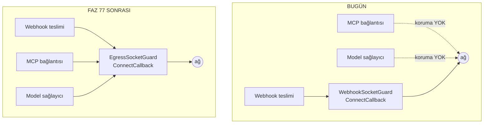

# Faz 77 — Giden Ağ Muhafızı

> **Durum:** 📋 Planlandı (2026-08-20)
> **Kaynak:** [ADAYLAR.md](ADAYLAR.md) · **F-131** · bulgular
> [`guvenlik-tarama/BULGULAR.md`](guvenlik-tarama/BULGULAR.md) B05-2 · B05-3 · B05-4 · B05-5 · B05-6 · B05-7
> **Önkoşul:** Yok — K-164'ün `ConnectCallback` deseni bugün webhook yolunda çalışıyor ve bu faz onu genelleştirir
> **Paketler:** `AgentPrism.Abstractions`, `AgentPrism.Core`, `AgentPrism.Mcp`, `AgentPrism.AspNetCore`
> **Yeni paket:** Yok · **Migration:** Yok
> **Public API:** Büyüyor — `PublicAPI.Shipped.txt` dosyaları **API kaydı taşımaz** (`wc -l src/*/PublicAPI.Shipped.txt` → her biri tek satır, yalnız `#nullable enable`), yani bugün eklemek ucuzdur; Faz 7'den sonra bir sürüm kararı olur
> **Tüketici yüzeyi:** `docs-site/src/content/docs/getting-started/security.md` (giden ağ bölümü) · `docs-site/src/content/docs/guides/production.md` (yeni ayar) · sevk edilen: `AgentPrismEgressOptions` XML dokümanı, `capabilities.md` satırı
> **Manuel test alanı:** [`manuel-test/13-KIRACI-VE-GUVENLIK.md`](manuel-test/13-KIRACI-VE-GUVENLIK.md) ve [`manuel-test/18-MCP-VE-A2A.md`](manuel-test/18-MCP-VE-A2A.md)

---

## Bu Faza Başlarken

> `faz-baslangic` skill'ini uygula. Aşağıdaki liste o skill'in 2. adımıdır —
> **tamamını değil, yalnız işaret edilen bölümleri oku.**

1. Bu doküman
2. Kararlar — dosyanın tamamını **okuma**, yalnız bu kalemleri grep'le:
   ```bash
   grep -n "K-164\|K-163\|K-165\|K-058\|K-059\|K-007" docs/KARARLAR.md
   ```
   **K-164** (SSRF koruması `WebhookHttpClient`'ın **içine** gömülüdür,
   `IHttpClientFactory` **kullanılmaz** — bu fazın en sıkı kısıtı) ·
   **K-163** (webhook imzası zaman damgası içerir) ·
   **K-165** (hız sınırı varsayılanı kapalı — varsayılan seçimi için emsal) ·
   **K-058/K-059** (`secret` değeri değil, yapılandırma anahtarının **adı**
   saklanır) · **K-007** (yeni NuGet paketi gerekçe ister)
3. [`76-DOKUMAN-KALITESI-VE-GORSEL-KIMLIK.md`](76-DOKUMAN-KALITESI-VE-GORSEL-KIMLIK.md)
   — yalnız devir notu:
   ```bash
   awk '/## Sonraki Faza Devir Notu/,0' docs/76-DOKUMAN-KALITESI-VE-GORSEL-KIMLIK.md
   ```
4. Alan hafızası (bu faz üç alana dokunuyor):
   [`hafiza/mcp-a2a-sunucu.md`](hafiza/mcp-a2a-sunucu.md) (MCP bağlantı kurulumu) ·
   [`hafiza/openai-saglayici.md`](hafiza/openai-saglayici.md) (sağlayıcı istemci fabrikaları) ·
   [`hafiza/aspnetcore-di.md`](hafiza/aspnetcore-di.md) (uç kaydı ve seçenek bağlama)
5. Gerektiğinde, tamamı değil ilgili bölümü:
   [`MIMARI-GUVENLIK.md`](MIMARI-GUVENLIK.md) — "Dış ağ erişimi" bölümü

---

## Amaç

AgentPrism bugün **üç** yerden dışarı ağ isteği atar: webhook teslimi, MCP
sunucu bağlantısı ve model sağlayıcı çağrısı. SSRF koruması yalnız **birincide**
vardır. Bu faz korumayı üçüne de taşır ve `secret`'ın yanlış hedefe gitmesini
engelleyen yapılandırma anahtarı kısıtını eksik iki yüzeye yayar.

- **F-131** — Giden ağ isteklerinin hedef adresini tek bir muhafızdan geçir;
  `secret` çözen her yapılandırma anahtarını bir önek allow-list'ine bağla.

Kazanan: çok kiracılı bir kurulumu işleten operatör. Bugün `AgentsAdmin`
kapsamlı bir çağrı MCP sunucusunu bulut sağlayıcısının metadata adresine
yöneltebilir; `SecurityAdmin` kapsamlı bir çağrı aynısını model sağlayıcısı için
yapabilir ve çözülen API anahtarı o adrese gider.

### Bugün ne çalışmıyor — doğrulanmış kanıt

| Kanıt | Gözlem |
|---|---|
| [`GovernanceEndpoints.cs:790`](../src/AgentPrism.AspNetCore/Endpoints/GovernanceEndpoints.cs) · [`:800`](../src/AgentPrism.AspNetCore/Endpoints/GovernanceEndpoints.cs) | MCP `endpoint` yalnız "mutlak URI" ve "şema `http`/`https`" denetimi görür. Adres denetimi yoktur |
| [`McpTransportFactory.cs:19-23`](../src/AgentPrism.Mcp/Internal/McpTransportFactory.cs) | `IsRemoteHttp` de yalnız şemaya bakar; `169.254.169.254` ve `10.0.0.5:8080` kabul edilir |
| [`AgentPrismWebhookOptions.cs:28`](../src/AgentPrism.Core/Webhooks/AgentPrismWebhookOptions.cs) | `AllowPrivateNetworkTargets` **yalnız** webhook seçeneklerindedir; MCP ve sağlayıcı yolunda karşılığı yoktur |
| [`TenantProviderEndpoints.cs:163`](../src/AgentPrism.AspNetCore/Endpoints/TenantProviderEndpoints.cs) | `Endpoint = request.Endpoint` — hiçbir denetimden geçmez. Aynı metotta `ApiKeyConfigurationName` için önek denetimi **vardır** |
| [`McpTransportFactory.cs:110`](../src/AgentPrism.Mcp/Internal/McpTransportFactory.cs) | `headers["Authorization"] = configuration[key]` — anahtar adı için önek kısıtı yoktur |
| [`AgentPrismInboundTriggerOptions.cs:27`](../src/AgentPrism.Abstractions/Options/AgentPrismInboundTriggerOptions.cs) · [`AgentPrismTenantProviderOptions.cs:18`](../src/AgentPrism.Abstractions/Options/AgentPrismTenantProviderOptions.cs) | Karşıt desen: iki yerde `AllowedConfigurationPrefix` vardır ve XML dokümanı ikisini de "a security boundary" diye adlandırır |
| `grep -rl "WebhookSocketGuard" tests` → boş | K-164'ün gerçek zorlama noktasının testi yoktur |
| [`WebhookUrlValidator.cs:207-262`](../src/AgentPrism.Core/Webhooks/WebhookUrlValidator.cs) | `::ffff:a.b.c.d` ele alınır; NAT64 (`64:ff9b::/96`) ve `::a.b.c.d` alınmaz |

> Kanıtlar 2026-08-20 tarihinde doğrulandı. Satır numaraları aynı gün yapılan
> güvenlik kapanışından **sonra** yeniden ölçüldü.

### Ölçülen: dört sağlayıcı da `HttpClient` enjeksiyonuna izin verir

Adaylar listesi bunu "ölçülmedi" diye bırakmıştı; bu fazın maliyetini belirleyen
soru buydu ve **ölçüldü**:

| Sağlayıcı | Kanca | Kanıt |
|---|---|---|
| Anthropic | `ClientOptions.HttpClient` (settable) + `ClientOptions.Handlers` | `~/.nuget/packages/anthropic/12.35.1/lib/net9.0/Anthropic.xml` — `P:Anthropic.Core.ClientOptions.HttpClient` |
| OpenAI | `OpenAIClientOptions` (Azure SDK `ClientPipelineOptions` ailesi) | [`OpenAIChatClientFactory.cs:110`](../src/AgentPrism.OpenAI/OpenAIChatClientFactory.cs) |
| Azure OpenAI | `AzureOpenAIClientOptions` (aynı aile) | [`AzureOpenAIChatClientFactory.cs:156`](../src/AgentPrism.Azure/AzureOpenAIChatClientFactory.cs) |
| Google | Fabrika zaten kendi `HttpClient`'ına sahiptir | [`GoogleChatClientFactory.cs:31`](../src/AgentPrism.Google/GoogleChatClientFactory.cs) yorumu |

**Sonuç:** yeni paket gerekmez, `IHttpClientFactory` gerekmez, K-164 korunur.

> 🚨 **Doğrulanmadı — uygulama anında ölçülmeli:** OpenAI ve Azure `ClientOptions`
> üzerinde `Transport` mü yoksa `HttpClient` mi kabul edildiği SDK sürümüne
> bağlıdır. İlk iş: `maf-api-kesfi` deseniyle bu iki tipin gerçek imzasını çıkar.
> Tahmin edilmiş bir imza sessizce yanlış koda dönüşür.

---

## 77.1 — Muhafız nereye konur

K-164 kısıtı bu fazın şeklini belirler: koruma **`SocketsHttpHandler.ConnectCallback`
içinde** kalır, çünkü orada doğrulanan adres soketin bağlandığı adresin ta
kendisidir (TOCTOU penceresi yoktur). `IHttpClientFactory` **kullanılmaz**.

Bugün bu mantık `WebhookSocketGuard` içinde webhook'a gömülüdür. Faz onu
`AgentPrism.Core` altında paylaşılan bir tipe çıkarır ve üç yüzeyin de kendi
`SocketsHttpHandler`'ını o tiple kurmasını sağlar.



**Neden ortak tip, üç kopya değil:** B05-1'in dersi tam buydu. MCP anahtarı elle
tekrarlanan bir ifadeydi ve okuma yolu ile yazma yolu sessizce ayrıştı. Aynı
çözüm+denetim döngüsünün üç kopyası aynı sonu verir — biri düzeltilir, ikisi
unutulur. `WebhookSocketGuard` bugün bile döngüyü `ValidateResolvedAsync`'ten
**kopyalıyor** (B05-6) ve testi yok.

## 77.2 — Varsayılan: özel ağ hedefleri reddedilir

**Kullanıcı kararı (2026-08-20):** üç yüzeyde de varsayılan **reddetmektir** —
webhook bugün ne yapıyorsa aynısı. Tek zihinsel model, tek ayar.

```
AgentPrism:Egress:AllowPrivateNetworkTargets = false   (varsayılan)
```

Bu bir davranış değişikliğidir ve **yükseltmede kırabilir**: iç ağda MCP sunucusu
çalıştıran bir kurulum bağlantı kuramaz. Plan bunu gizlemez:

- Hata mesajı hangi ayarın açılacağını **adıyla** söyler.
- `docs-site/.../production.md` bir yükseltme notu taşır.
- Ayar tek satırla geri alınır.

> **K1 (sıfır sürpriz) ile ilişkisi.** K1 yeni bir genişleme noktasının kapalı
> gelmesini ister. Burada kapalı olan **hedef**tir, yetenek değil: muhafız açık
> gelir ve özel ağı reddeder. Bu K1'in ruhuna uygundur — sürpriz olan, bir
> kurulumun farkında olmadan metadata adresine istek atabilmesidir.

## 77.3 — Yapılandırma anahtarı önek kısıtı iki yüzeye daha

`secret` çözen her yapılandırma anahtarı bir önek allow-list'ine bağlıdır.
Bugün iki yerde vardır, iki yerde yoktur:

| Yüzey | Bugün | Faz sonrası |
|---|---|---|
| Gelen tetikleyici imza `secret`'ı | ✅ `AgentPrism:TriggerSecrets:` | değişmez |
| Kiracı sağlayıcı API anahtarı | ✅ `AgentPrism:ProviderKeys:` | değişmez |
| MCP `AuthorizationConfigurationKey` | ❌ yok | ✅ yeni önek |
| MCP `OAuthClientSecretConfigurationKey` | ❌ yok | ✅ aynı önek |
| Webhook `SecretConfigurationKey` | ❌ yok | ✅ yeni önek |

Desen `InboundTriggerSecretResolver.ValidatePrefix` ile birebir aynıdır: boşsa
reddet, önekle başlamıyorsa reddet, hata mesajı öneki yazsın.

> **Bu da kırıcıdır.** Mevcut bir MCP kaydı öneksiz bir anahtar adı taşıyorsa
> kaydetme reddedilir. Yükseltme notu bunu söyler; varsayılan önekler
> (`AgentPrism:McpSecrets:`, `AgentPrism:WebhookSecrets:`) operatör tarafından
> gevşetilebilir.

## 77.4 — Muhafızın testi ve NAT64

Bu faz K-164'ün zorlama noktasına **ilk testini** yazar (B05-6) ve
`IsPrivate`'in kaçırdığı iki IPv6 biçimini ekler (B05-7): NAT64 `64:ff9b::/96`
ve IPv4-uyumlu `::a.b.c.d`.

Ayrıca webhook ek başlıklarına ad ve sayı sınırı gelir (B05-5): imza başlığının
adını taşıyan bir giriş alıcının doğrulamasını bozuyordu.

---

## Planlanan Public API

> Taslak imzalardır. Gerçekleşen imzalar kapanışta ayrı bir bölüme yazılır.

```csharp
// AgentPrism.Abstractions
/// <summary>Giden ağ isteklerinin hedef adresi için ortak kurallar.</summary>
public sealed class AgentPrismEgressOptions
{
    public const string SectionName = "AgentPrism:Egress";

    /// <summary>Özel ağ adreslerine bağlanmaya izin verilir mi. Varsayılan false.</summary>
    public bool AllowPrivateNetworkTargets { get; set; }

    /// <summary>Yalnız https kabul edilir mi. Varsayılan false (http de kabul).</summary>
    public bool RequireHttps { get; set; }
}

// AgentPrism.Core
/// <summary>Bir soketin bağlanacağı adresi bağlanmadan ÖNCE denetler.</summary>
public sealed class EgressSocketGuard
{
    public EgressSocketGuard(IOptionsMonitor<AgentPrismEgressOptions> options);

    /// <summary>ConnectCallback olarak takılacak temsilci.</summary>
    public ValueTask<Stream> ConnectAsync(SocketsHttpConnectionContext context, CancellationToken cancellationToken);

    /// <summary>Bir URI'yi kaydetmeden önce denetler (kaydetme ucu için).</summary>
    public ValueTask ValidateAsync(Uri target, CancellationToken cancellationToken = default);
}

/// <summary>Bir yapılandırma anahtarı adının izinli önekte olduğunu doğrular.</summary>
public static class ConfigurationKeyGuard
{
    public static void RequirePrefix(string configurationKeyName, string allowedPrefix, string fieldName);
}
```

### HTTP `endpoint`'leri

Yeni uç yoktur. Var olan iki uç **reddetmeye** başlar:

| Metot | Yol | Rol | Değişiklik |
|---|---|---|---|
| `PUT` | `/api/mcp-servers/{name}` | Admin | Özel ağ adresi veya önek dışı anahtar adı → `400` |
| `PUT` | `/api/tenants/{id}/providers/{provider}` | Admin | Özel ağ `Endpoint`'i → `400` |
| `PUT` | `/api/webhooks/{name}` | Admin | Önek dışı `secretConfigurationKey` → `400` |

### Arayüz payı

Yok. Arayüz yeni alan göstermez; sunucu yanıtındaki hata metni gösterilir (K-232:
sunucu yanıtları çevrilmez).

---

## Planlanan Dosya Listesi

```
src/AgentPrism.Abstractions/Options/
└── AgentPrismEgressOptions.cs              (yeni)

src/AgentPrism.Core/Egress/
├── EgressSocketGuard.cs                    (yeni — WebhookSocketGuard'dan çıkarıldı)
├── EgressAddressValidator.cs               (yeni — WebhookUrlValidator'dan çıkarıldı, NAT64 eklendi)
└── ConfigurationKeyGuard.cs                (yeni — ValidatePrefix deseni ortaklaştı)

src/AgentPrism.Core/Webhooks/
├── WebhookSocketGuard.cs                   (silinir — EgressSocketGuard'a taşındı)
├── WebhookUrlValidator.cs                  (incelir — adres mantığı taşındı)
└── WebhookDeliveryJobHandler.cs            (başlık sınırı eklenir)

src/AgentPrism.Mcp/Internal/
└── McpTransportFactory.cs                  (handler EgressSocketGuard ile kurulur; önek denetimi)

src/AgentPrism.Anthropic|Azure|Google|OpenAI/
└── *ChatClientFactory.cs                   (HttpClient/Transport muhafızla kurulur)

src/AgentPrism.AspNetCore/Endpoints/
├── GovernanceEndpoints.cs                  (MCP kaydetme: adres + önek denetimi)
├── TenantProviderEndpoints.cs              (Endpoint denetimi)
└── WebhookEndpoints.cs                     (önek + başlık denetimi)

tests/AgentPrism.Core.UnitTests/Egress/
├── EgressAddressValidatorTests.cs          (yeni — NAT64 dahil)
└── ConfigurationKeyGuardTests.cs           (yeni)

tests/AgentPrism.AspNetCore.FunctionalTests/
└── EgressGuardTests.cs                     (yeni — üç yüzey birden)
```

---

## Hata Modları ve Testler

> Mutlu yoldan değil, **ne bozulabilir**den türetilir. Seviyeyi plan seçer.
> Sınır geçen davranış (DI · HTTP · kiracı · akış · depo · paket) birim
> testiyle kanıtlanamaz — `faz-uygulama` Adım 2.

| Ne bozulabilir | Seviye | Test sınıfı |
|---|---|---|
| MCP `endpoint` özel ağa işaret ediyor, kaydetme geçiyor | Fonksiyonel (HTTP sınırı) | `EgressGuardTests` |
| Kiracı sağlayıcı `Endpoint`'i özel ağa işaret ediyor | Fonksiyonel | `EgressGuardTests` |
| Kaydetme geçiyor ama DNS **sonradan** özel adrese dönüyor (rebinding) | Fonksiyonel | `EgressGuardTests` — `ConnectCallback` kapısı |
| Önek dışı `secret` anahtar adı kabul ediliyor | Fonksiyonel | `EgressGuardTests` |
| NAT64 (`64:ff9b::a9fe:a9fe`) muhafızdan geçiyor | Birim | `EgressAddressValidatorTests` |
| `::ffff:169.254.169.254` regresyonu | Birim | `EgressAddressValidatorTests` |
| Muhafız iptal edilebiliyor mu (`CancellationToken` akıyor mu) | Birim | `EgressAddressValidatorTests` |
| Eşzamanlı iki bağlantı muhafızı yarıştırıyor | Birim | `EgressAddressValidatorTests` |
| Boş / aşırı uzun / şemasız URI | Birim | `EgressAddressValidatorTests` |
| **Başka kiracının** MCP kaydı bu kiracının önek ayarıyla denetleniyor | Fonksiyonel | `EgressGuardTests` |
| DNS çözümü hata veriyor (alt sistem hatası) → bağlantı **açılmıyor** | Birim | `EgressAddressValidatorTests` |
| Webhook ek başlığı imza başlığının adını taşıyor | Birim | `WebhookDeliveryHeaderTests` |
| Yükseltme: var olan öneksiz MCP kaydı okunuyor ama **yeniden kaydedilemiyor** | Fonksiyonel | `EgressGuardTests` |

Beş soru her yeni kod yolu için cevaplandı ve tabloya girdi: iptal ·
eşzamanlılık · boş/aşırı girdi · başka kiracının kaydı · alt sistem hatası.

Sözleşme testi gerekmiyor: muhafız depo katmanına dokunmaz, kiracı boyutu
taşımaz.

---

## Manuel Kabul Case'leri

| # | Ön koşul | Adımlar | Beklenen sonuç |
|---|---|---|---|
| 1 | Varsayılan ayarlar | `PUT /api/mcp-servers/probe` gövde `{"endpoint":"http://169.254.169.254/"}` | `400`; mesaj `AllowPrivateNetworkTargets` adını içerir |
| 2 | `AgentPrism:Egress:AllowPrivateNetworkTargets=true` | Aynı istek | `200`; kayıt oluşur |
| 3 | Varsayılan ayarlar | `PUT /api/tenants/acme/providers/anthropic` gövde `{"endpoint":"http://10.0.0.5/"}` | `400` |
| 4 | Varsayılan ayarlar | `PUT /api/mcp-servers/probe` gövde `authorizationConfigurationKey: "ConnectionStrings:Default"` | `400`; mesaj izinli öneki yazar |
| 5 | Faz öncesi kaydedilmiş öneksiz bir MCP kaydı | Arayüzden aç, değiştirmeden kaydet | `400` ve mesaj hangi alanın düzeltileceğini söyler (yükseltme yolu) |
| 6 | 👤 insan gerekir — iç ağda gerçek MCP sunucusu | Varsayılanla bağlan, sonra ayarı açıp tekrar bağlan | İlkinde red, ikincisinde bağlantı |

---

## Açık Sorular

| # | Soru | Seçenekler | Öneri |
|---|---|---|---|
| 1 | Sağlayıcı istemcilerine muhafız **her zaman** mı takılsın, yoksa yalnız kiracı `Endpoint` override'ı varken mi? | A: her zaman · B: yalnız override varken | **B.** Kurulum zamanı global `Endpoint` operatörün kendi kararıdır ve zaten koda yazılır; kiracıdan gelen override ise dış girdidir. A, sovereign cloud kurulumlarını gereksiz kırar |
| 2 | `RequireHttps` bu fazda gerçekten gerekli mi? | A: ekle · B: erteleme | **B.** Ölçülmedi: bugün kaç kurulumun `http` MCP sunucusu var bilinmiyor. Bir bayrak eklemek ucuz ama varsayılanı seçmek ölçüm ister; kalem F-NN olarak ayrılabilir |
| 3 | `EgressSocketGuard` `AgentPrism.Core`'da mı `AgentPrism.Abstractions`'ta mı? | A: Core · B: Abstractions | **A.** `Abstractions` yalnız sözleşme taşır; muhafız `SocketsHttpHandler`'a bağımlıdır. Yalnız `AgentPrismEgressOptions` Abstractions'a gider |
| 4 | Var olan öneksiz kayıtlar için bir taşıma (migration) yardımcısı gerekli mi? | A: gerekli · B: hata mesajı yeter | **B.** Kayıt sayısı azdır (MCP sunucusu ve webhook başına bir alan) ve değer değil **ad** taşınır; elle düzeltme ucuzdur |

---

## Bitiş Ölçütleri (DoD)

- [ ] `PUT /api/mcp-servers/x` ile `http://169.254.169.254/` → `400`, mesaj ayar adını içerir
- [ ] Aynı istek `AllowPrivateNetworkTargets=true` iken → `200`
- [ ] `PUT /api/tenants/{id}/providers/anthropic` ile özel ağ `Endpoint`'i → `400`
- [ ] MCP ve webhook `secret` anahtar adları önek dışındaysa → `400`
- [ ] `WebhookSocketGuard`'ın (yeni adıyla `EgressSocketGuard`) testi vardır ve NAT64'ü kapsar
- [ ] `WebhookUrlValidator` içindeki adres mantığı **tek** yerde kalır; kopya yoktur
- [ ] Dört doğrulama kapısı sıfır uyarı verir
- [ ] `samples/AgentPrism.Api` ile gerçek `run` yapıldı, çıktı belgeye yazıldı
- [ ] `secret` taraması boş döndü
- [ ] Manuel kabul case'leri `docs/manuel-test/13-KIRACI-VE-GUVENLIK.md` ve `18-MCP-VE-A2A.md` içine eklendi; otomatikleştirilebilenler koşuldu
- [ ] `faz-denetim` koşuldu; 🔴 bulgu kalmadı
- [ ] `docs-site/` güncellendi (`security.md` giden ağ bölümü + `production.md` yükseltme notu); `npm run build` + `check-links.mjs` temiz
- [ ] [`BULGULAR.md`](guvenlik-tarama/BULGULAR.md) içindeki B05-2/3/4/5/6/7 satırları **KAPANDI** olarak işaretlendi

### Doğrulama komutları

```bash
# Özel ağ hedefi reddedilir
curl -s -X PUT http://localhost:5081/agentprism/api/mcp-servers/probe \
  -H 'Content-Type: application/json' \
  -d '{"endpoint":"http://169.254.169.254/","transport":"StreamableHttp"}' | jq .detail

# Önek dışı yapılandırma anahtarı reddedilir
curl -s -X PUT http://localhost:5081/agentprism/api/mcp-servers/probe \
  -H 'Content-Type: application/json' \
  -d '{"endpoint":"https://mcp.example.com/","authorizationConfigurationKey":"ConnectionStrings:Default"}' | jq .detail

# Adres mantığının tek yerde kaldığı
grep -rn "IsPrivate\|ConnectCallback" src/ --include="*.cs"
```

---

## Riskler

| Risk | Önlem |
|------|-------|
| Varsayılan reddetme, iç ağda MCP sunucusu olan kurulumları kırar | Hata mesajı ayarın **adını** yazar; `production.md` yükseltme notu taşır; ayar tek satırla geri alınır |
| Önek kısıtı var olan MCP/webhook kayıtlarını kaydedilemez yapar | Okuma etkilenmez, yalnız yazma reddedilir; mesaj hangi alanın düzeltileceğini söyler (manuel case 5) |
| Sağlayıcı SDK'sının `HttpClient`/`Transport` kancası sürümle değişir | Uygulamanın **ilk işi** dört SDK'nın gerçek imzasını ölçmektir; tahmin edilmiş imza plana yazılmadı |
| `WebhookSocketGuard` taşınırken K-164'ün TOCTOU garantisi bozulur | Denetim `ConnectCallback` **içinde** kalır; taşıma sonrası test bunu doğrular. `IHttpClientFactory` kullanılmaz |
| Muhafız her istekte DNS çözerse gecikme artar | Ölçülmeli: bugünkü webhook yolunda çözüm zaten yapılıyor; MCP bağlantısı kalıcıdır ve tur başına bir kez kurulur |
| Üç kopya muhafız üretilir ve biri bayatlar | Ortak tip zorunludur; DoD "adres mantığı **tek** yerde" maddesiyle ölçülür |

---

<!-- ============================================================
     AŞAĞISI KAPANIŞTA DOLDURULUR — `faz-tamamlama` skill'i.
     Plan anında boş kalır. Başlıkları SİLME.
     ============================================================ -->

## Plandan Sapmalar

> Kapanışta doldurulur. Plan ile gerçek arasındaki fark **gizlenmez** — sonraki
> oturumun en değerli bilgisidir.

## Bu Fazda Verilen Kararlar

> Kapanışta doldurulur. K-NNN numaraları burada alınır; plan numara rezerve etmez.

## Gerçekleşen Public API

> Kapanışta doldurulur. Koddaki **gerçek** imzalar.

## Dosya Listesi (gerçekleşen)

> Kapanışta doldurulur.

## Denetim Bulguları

> Kapanışta doldurulur — `faz-denetim` çıktısı. Her satır: bulgu · seviye
> (🔴/🟡/🟢) · sonuç (düzeltildi / gerekçelendi / F-NN olarak devredildi).
> Bulgu yoksa "🔴 ve 🟡 yok" yazılır; boş bırakılmaz.

## Sonraki Faza Devir Notu

> Kapanışta doldurulur: devralınan sözleşmeler, bilinen tuzaklar (🚨), yarım
> kalan işler, sıradaki faz.
