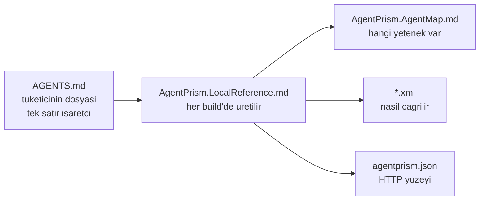
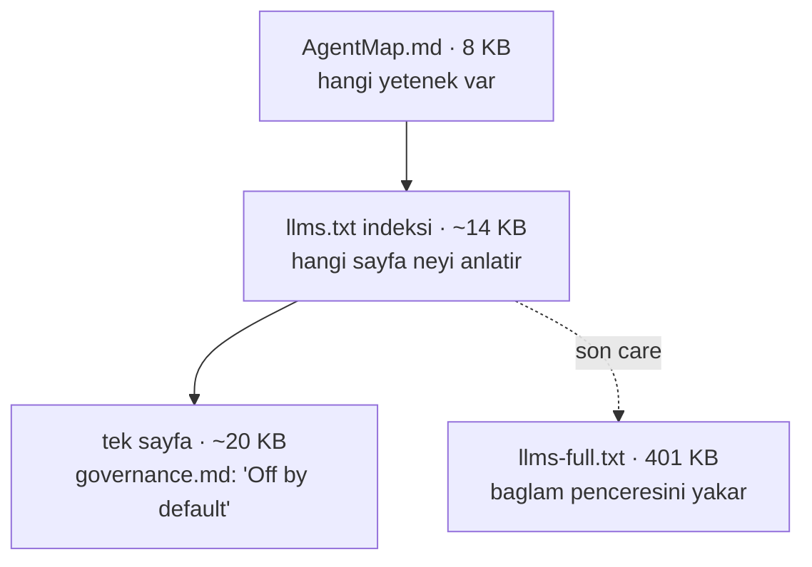

# Faz 78 — Yetenek Haritası Erişimi

> **Durum:** ✅ Tamamlandı (2026-08-21)
> **Kaynak:** [ADAYLAR.md](ADAYLAR.md) · **F-135**
> **Önkoşul:** [Faz 73](73-TUKETICI-AGENT-DESTEGI.md) — haritayı ve `APG01xx`–`APG0401` ailesini kurar · [Faz 74](74-YEREL-REFERANS-YUZEYI.md) — bu fazın genişlettiği `AgentPrism.LocalReference.md`'yi kurar
> **Paketler:** `AgentPrism.Core` (targets), `AgentPrism.Generators` (analyzer)
> **Yeni paket:** Yok · **Migration:** Yok
> **Public API:** Büyümüyor — değişiklik MSBuild target'ı, `internal` bir tanı tanımı ve bir Node üretecidir; hiçbir C# public üye eklenmez
> **Tüketici yüzeyi:** site: [`guides/coding-agents.md`](../docs-site/src/content/docs/guides/coding-agents.md) (§"`AGENTS.md` — the capability map" yanlış tavsiye veriyor), `capabilities.md` (tanı tablosu satırı)
> · sevk edilen: `AgentPrism.LocalReference.md` gövdesi (targets içinde), `AgentPrism.AgentMap.md` alt bölümü, `APG0402` tanı metni, `llms.txt`
> **Manuel test alanı:** [`docs/manuel-test/30-YEREL-REFERANS.md`](manuel-test/30-YEREL-REFERANS.md) — case'ler oraya eklenir

---

## Bu Faza Başlarken

> `faz-baslangic` skill'ini uygula. Aşağıdaki liste o skill'in 2. adımıdır —
> **tamamını değil, yalnız işaret edilen bölümleri oku.**

1. Bu doküman
2. Kararlar — dosyanın tamamını **okuma**, yalnız bu kalemleri grep'le:
   ```bash
   grep -n "K-505\|K-506\|K-507\|K-510" docs/KARARLAR.md
   ```
   **K-505** (harita `capabilities.md`'den üretilir ve commit edilir), **K-506**
   (`AgentPrism.Usage` tanıları `Warning`'dir — `Info` build çıktısına düşmez),
   **K-507** (harita işareti içerik revizyonudur; işaret taşımayan elle yazılmış
   `AGENTS.md` hiç bildirilmez), **K-510** (yerel referans dosyası **proje**
   başına yazılır).
3. [`77-GIDEN-AG-MUHAFIZI.md`](77-GIDEN-AG-MUHAFIZI.md) — yalnız devir notu:
   ```bash
   awk '/## Sonraki Faza Devir Notu/,0' docs/77-GIDEN-AG-MUHAFIZI.md
   ```
   Faz 77 `AgentPrism.Core`'un `buildTransitive/` dizinine dokunmadı; devir notu
   yalnız o dizinin bugünkü durumunu doğrulamak için okunur.
4. Alan hafızası (bu faz üç alana dokunuyor):
   [`hafiza/build-ve-analyzer.md`](hafiza/build-ve-analyzer.md) (analyzer kayıt
   ve test altyapısı) · [`hafiza/paketleme-ve-dagitim.md`](hafiza/paketleme-ve-dagitim.md)
   (`buildTransitive/` akışı ve meta paket) ·
   [`hafiza/dokumantasyon.md`](hafiza/dokumantasyon.md) (site kapıları)

---

## Amaç

AgentPrism yetenek haritasını **`AGENTS.md` olarak** teslim ediyor. O dosya adı
tüketicinindir; bir kütüphane onu ancak **boş repo'da** kazanabilir — yani yalnız
`dotnet new agentprism-api` durumunda. Var olan bir `AGENTS.md` asla ezilmez, bu
doğru karardır, ama sonucu şudur: **harita o repo'ya hiç ulaşmaz.** Faz 73 bu
bedeli öngörmüştü ("Opt-in kararının bedeli benimseme oranıdır", [73.2](73-TUKETICI-AGENT-DESTEGI.md));
bu faz bedeli öder.

Çözüm haritayı tüketicinin dosyasına yazmak **değildir**. Sınır şudur: bizim
içeriğimiz bizim dosyamızda yaşar, tüketicinin dosyasına yalnız bir **işaretçi**
girer. `AgentPrism.LocalReference.md` bu deseni zaten uyguluyor (K-510); harita
yolu oraya eklenir.

Faz iki katmanı birden açar. **Referans** katmanı (ne var, nasıl çağrılır)
diskte hazır ve yalnız yolu eksik — 78.1 ve 78.2 onu bağlar. **Anlatı** katmanı
(ne varsayılan, hangisi ne zaman) yalnız sitededir ve yerel karşılığı yoktur —
78.4 ona ucuz bir giriş açar.

- **F-135** — Harita yolu `AgentPrism.LocalReference.md`'ye eklenir; `APG0402`
  yönlendirme satırı olmayan bir `AGENTS.md`'yi bildirir; `llms.txt` gerçek bir
  sayfa indeksine dönüşür ve sevk edilen harita ona işaret eder.

### Bugün ne çalışmıyor — doğrulanmış kanıt

Ölçüm gerçek bir tüketici projesinde yapıldı: `prodigy-enabler-backend`, kök
`AGENTS.md` (191 satır, elle yazılmış), `AgentPrismWriteLocalReference=true`,
`AgentPrismWriteAgentsFile` bilerek kapalı.

| Kanıt | Gözlem |
|---|---|
| [`AgentPrism.Core.targets:149-175`](../src/AgentPrism.Core/buildTransitive/AgentPrism.Core.targets#L149) | `LocalReference.md` gövdesi yalnız XML doc yollarını ve OpenAPI belgesini yazar. **Harita yolu yok** |
| Tüketicide üretilen `AgentPrism.LocalReference.md` | 41 satır: 12 XML doc + 1 OpenAPI belgesi. Haritaya tek bir gönderme yok |
| `~/.nuget/packages/agentprism.core/0.0.0-preview.0.286/buildTransitive/AgentPrism.AgentMap.md` | Harita **diskte var**, 8161 B. Hiçbir üretilen dosya bu yolu göstermiyor |
| [`AgentPrismUsageAnalyzer.cs:308-313`](../src/AgentPrism.Generators/AgentPrismUsageAnalyzer.cs#L308) | `APG0401` işaret taşımayan dosyada erken döner (K-507, doğru davranış) — yani bu repo'da **hiçbir tanı ötmüyor** |
| [`AgentPrism.Core.targets:77-80`](../src/AgentPrism.Core/buildTransitive/AgentPrism.Core.targets#L77) | `AdditionalFiles` opt-in özelliğine **bağlı değil** — tüketicinin `AGENTS.md`'si analyzer'a bugün zaten akıyor |
| [`guides/coding-agents.md:59-61`](../docs-site/src/content/docs/guides/coding-agents.md#L59) | Site'nin bu duruma cevabı: *"copy the capability section out of a generated one and maintain it yourself"* — elle iş, sessizce bayatlar, hiçbir kapı yakalamaz |
| Tüketicinin `AGENTS.md:105`'i | 🚨 Dosya AgentPrism'i **zaten ayrıntılı anlatıyor**: `LocalReference.md`'yi, opt-in'in neden kapalı olduğunu, hatta `AgentPrism.AgentMap.md` adını biliyor — ama haritanın **yolunu** taşımıyor |

> Kanıtlar 2026-08-21 tarihinde doğrulandı.

Son satır bu fazın teşhisidir: **eksik olan bilgi değil, yoldur.** Oradaki kod
agent'ı `LocalReference.md`'yi kendiliğinden bulmuş ve doğru belgelemiş; haritanın
var olduğunu biliyor ve okuyamıyor.

Aynı satır ikinci bir şey daha kanıtlar: naif bir tanı **yanlış olurdu**.
"`AGENTS.md` AgentPrism'den söz ediyor mu?" kontrolü bu dosyada sessiz kalırdı —
20'den fazla kez söz ediyor. `APG0402`'nin tetiği bu ölçüme göre seçildi (78.2).

### Anlatı katmanına ucuz giriş yok — doğrulanmış kanıt

Sevk edilen harita site adresini **zaten taşıyor** ("Where to look" bölümü, dört
URL). Yani Faz 78.1 haritayı ulaşılabilir yapınca adres de gelir; adresi ayrıca
öğretmeye gerek yoktur. Ulaşılan yerde ise ucuz bir giriş yoktur:

| Kanıt | Gözlem |
|---|---|
| [`concepts/governance.md:15`](../docs-site/src/content/docs/concepts/governance.md#L15) | 🚨 Tüketicinin agent'ının kaydettiği tuzağın (`UseTenancy()` çağrılmazsa sessizce single-tenant) cevabı **"Off by default."** — yalnız burada. Harita `- Multi-tenancy: UseTenancy()` der, varsayılanı söylemez; `SingleTenantContext` XML doc'u **tipi** anlatır, riski değil |
| `docs-site/public/llms.txt` | `llmstxt.org` konvansiyonu bir **bağ listesi** ister; bizimki yetenek haritasının kopyası + 5 URL. `^- [` deseni **0** kez eşleşiyor — indeks değil |
| `docs-site/public/llms-full.txt` | **401 254 B**. Site köküne ulaşan agent'ın iki seçeneği var: HTML tarayarak gezinmek, veya bir bağlam penceresini yakmak |
| [`build-agent-map.mjs:62`](../docs-site/scripts/build-agent-map.mjs#L62) | `llms-full.txt` satırı **yalnız** site kopyasına eklenir. Dağıtım ters: anlatıya başka yolu olmayan **yerel** okuyucudan saklanır, siteye zaten ulaşmış olana verilir |
| `guides/` · `concepts/` · `reference/` · `getting-started/` | **424 KB** elle yazılmış anlatı; yerel karşılığı **yok**. Buna karşılık `api/` (698 sayfa) ve `http-api/` (272 sayfa) üretilendir — kaynakları tüketicide zaten var |
| Ölçüm: 38 sayfanın frontmatter'ı | 38/38 sayfa `title` **ve** `description` taşıyor; indeks yedek yol gerektirmeden üretilebilir. İndeks boyutu **5841 B** |

> Kanıtlar 2026-08-21 tarihinde doğrulandı.

🚨 Bir ters ölçüm de kayda geçer: sevk edilen XML doc'lar **51** `AgentPrism:`
yapılandırma anahtarı taşıyor, sitenin `reference/configuration.md`'si **39**.
Referans yüzeyi bu eksende siteden **zengindir** — bu fazın açtığı boşluk
referans değil, **anlatıdır**.

---

## 78.1 — A: harita yolu yerel referansa girer

`AgentPrism.LocalReference.md` gövdesine yeni bir bölüm eklenir. Harita
**kopyalanmaz**, yolu yazılır — XML doc'lar için zaten uygulanan desen budur.
Yol `$(AgentPrismAgentMapFile)` özelliğinde hazır ([targets:18](../src/AgentPrism.Core/buildTransitive/AgentPrism.Core.targets#L18)).



Bölüm haritadan **önce** gelir: agent'ın sorduğu ilk soru "ne var", ikincisi
"nasıl çağrılır". Bugünkü gövde ikinciyle başlıyor.

Yazılacak bölüm, mevcut `_AgentPrismLocalReferenceLine` `ItemGroup`'una
([targets:149](../src/AgentPrism.Core/buildTransitive/AgentPrism.Core.targets#L149))
girer ve şu biçimdedir:

```
## Capability map — read this first

- <$(AgentPrismAgentMapFile) degeri>

Every capability AgentPrism ships, with the call that turns it on. Read it
before you write agent, run, tool, or evaluation code by hand.
```

Bölüm `Condition="Exists('$(AgentPrismAgentMapFile)')"` ile yazılır. Gerekçe:
`ProjectReference` ile derleyen bir repo (AgentPrism'in kendisi) zaten hiçbir
satır üretmez, ama koşul yolun var olmadığı her durumu da kapatır — ölü bir yol
yazmak, hiç yazmamaktan kötüdür.

🚨 **`Overwrite="true"` + `WriteOnlyWhenDifferent="true"` semantiği korunur.**
Yeni bölüm dosyayı büyütür; ilk build'de içerik değişeceği için dosya bir kez
yeniden yazılır. Bu beklenen davranıştır, bir kusur değildir.

## 78.2 — D: `APG0402` yönlendirme satırını ister

Yeni tanı, `AgentPrism.Usage` ailesinin altıncı üyesidir.

| Alan | Değer |
|---|---|
| Kod | `APG0402` |
| Seviye | `Warning` (K-506 — `Info` build çıktısına düşmez) |
| Kategori | `AgentPrism.Usage` |
| Etiket | `WellKnownDiagnosticTags.CompilationEnd` (`APG0401` ile aynı) |
| Yardım bağlantısı | `…/capabilities/#coding-agent-support` |

**Tetikleme koşulu — dördü birden sağlanmalıdır:**

1. `AGENTS.md` `AdditionalFiles` içinde var (yani kökte bir dosya var),
2. dosya harita **işaretini taşımıyor** — taşıyorsa dosya zaten haritadır ve
   bayatlığı `APG0401`'in işidir (K-507),
3. dosya `AgentPrism.LocalReference.md` dizesini **hiç içermiyor**
   (`OrdinalIgnoreCase`),
4. harita dosyası da `AdditionalFiles` içinde — yani AgentPrism gerçekten
   referanslı.

Ölçülen tüketicide (2) sağlanır, (3) **sağlanmaz** → tanı **sessiz kalır**. Bu
doğru sonuçtur: oradaki agent yolu zaten bulmuş. Tanının hedefi `AGENTS.md`'si
AgentPrism'den hiç söz etmeyen repo'dur.

Mesaj, `APG0003` desenini izler — neyin yanlış olduğunu söyler ve çözen adımı
adlandırır:

> `'AGENTS.md' never points at 'AgentPrism.LocalReference.md'. A coding agent
> reading it cannot find the capability map or the API documentation on this
> machine, so it will hand-write behaviour AgentPrism already ships. Add one line
> naming that file; the build writes it next to each project.`

🚨 **`NoWarn` listesi genişletilmelidir.** [targets:67](../src/AgentPrism.Core/buildTransitive/AgentPrism.Core.targets#L67)
bugün altı kod sayıyor; `APG0402` eklenmezse `AgentPrismUsageDiagnostics=false`
aileyi **eksik** susturur. Bunu yakalayan bir test yazılır (78.3 tablosu).

**Konum.** `APG0401` ile aynı: `AGENTS.md`'nin 0. satırı. Elle yazılmış bir
dosyada işaret olmadığı için `markerLength` sıfırdır; konum sıfır uzunlukta bir
`TextSpan` olur. Uygulama bunu doğrular — sıfır uzunluklu span'ın IDE'de
gösterilebildiği **ölçülmelidir**.

**Ölçülmedi:** `APG0402` `AGENTS.md`'nin **tamamını** okur, `APG0401` yalnız ilk
satırını. Büyük bir `AGENTS.md`'de (ölçülen dosya 191 satır) derleme başına
maliyeti ölçülmedi. Uygulayan oturum bunu ölçer; maliyet fark edilirse arama
`GetText()` yerine satır satır kısa devre yapar.

## 78.3 — Site yanlış tavsiyeyi bırakır

[`guides/coding-agents.md:59-61`](../docs-site/src/content/docs/guides/coding-agents.md#L59)
bugün "bölümü kopyala ve bakımını sen yap" diyor. Bu tavsiye elle iştir, sessizce
bayatlar ve hiçbir kapı onu yakalamaz. Yerine tek satırlık yönlendirme reçetesi
ve `APG0402`'nin ne istediği yazılır.

`capabilities.md`'nin tanı tablosuna `APG0402` satırı girer — bu dosya sevk
edilen haritanın **tek kaynağıdır** (K-505), yani satır eklenmezse harita
kendi tanısından habersiz kalır.

## 78.4 — `llms.txt` gerçek bir sayfa indeksi olur

Bugün üç yapıt üretiliyor ve ortadaki katman eksik: 8 KB harita (ne var) ile
401 KB tam metin (her şey) arasında, **hangi sayfayı okumalıyım** sorusunu
cevaplayan bir şey yok.



**Üreteç değişikliği.** `renderFullText()` ([build-agent-map.mjs:285](../docs-site/scripts/build-agent-map.mjs#L285))
elle yazılan sayfa kümesini **zaten** doğru sırayla dolaşıyor
(`fullTextRootPages` + `fullTextOrder`). İndeks aynı dolaşımı kullanır ve her
sayfa için frontmatter'ın `title` ve `description` alanlarını okuyup tek satır
üretir:

```
- [Coding agents](https://farukatasoy.github.io/AgentPrism/guides/coding-agents/) — Teach the coding agent working in your repository what AgentPrism already does…
```

Yedek yol gerekmez: **38/38** sayfa iki alanı da taşıyor (ölçüldü). Bir sayfa
alanı kaybederse üreteç **hata vermelidir**, eksik satır üretmemeli — boş harita
yasağının (`parseCapabilities`, [satır 82](../docs-site/scripts/build-agent-map.mjs#L82))
aynı gerekçesi.

**İki bütçe, tek harita.** İndeks `llms.txt`'i 8256 → **14 097 B**'a çıkarır ve
bugünkü `agentMapBudgetBytes` (10 240) sınırını aşar. Bütçe **bölünür**, çünkü
iki dosyanın ekonomisi farklıdır:

| Yapıt | Kim okur | Bütçe |
|---|---|---|
| `AgentPrism.AgentMap.md` | Her tüketici oturumunun **başında**, diskten | **10 240 B** — değişmez |
| `llms.txt` | Ağ üzerinden, **bilerek** getiren agent | **16 384 B** — yeni |

16 384, ölçülen 14 097'ye %15 boşluk eklenerek kondu — Faz 58.4'ün kalibrasyon
kuralı (K-524 emsali). Bu bir bütçe **büyütmesi değildir** (K-214): sınır ilk kez
konuyor ve haritanın 10 240'ı **düşürülmüyor**.

**Sevk edilen haritaya iki satır.** `build()` içindeki dağıtım düzeltilir
([satır 62](../docs-site/scripts/build-agent-map.mjs#L62)): `llms-full.txt`
satırı artık **her iki** kopyada bulunur, ve harita indeksi de adlandırır. Sevk
edilen haritanın "Where to look" bölümü şu iki satırı kazanır:

```
- Which page answers what, one line per page: <site>llms.txt
- Full text of every hand-written page (401 KB — prefer one page above): <site>llms-full.txt
```

Boyut satırı ve "önce yukarıdaki tek sayfayı tercih et" uyarısı **bilerek**
yazılır: 401 KB'ı uyarısız adlandırmak, agent'ı bağlam penceresini yakmaya davet
eder.

🚨 **Harita bütçesi bu iki satırla yeniden ölçülmelidir.** Bugün 8161 B; iki
satır ~200 B ekler ve 10 240 sınırı içinde kalır — ama üreteç sınırı aşınca
**hata verir**, kesmez. Uygulayan oturum bunu ölçer.

**Adres kanonik kalır.** `siteUrl` sabittir (`https://farukatasoy.github.io/AgentPrism/`,
[satır 30](../docs-site/scripts/build-agent-map.mjs#L30)) ve öyle kalır. Özel
ağdaki bir ayna (`http://10.8.0.3:4321/…`) bir Astro **dev server**'ıdır:
`npm run dev` durunca ölür ve VPN dışından erişilemez. Sevk edilen bir yapıta
gömülecek adres değildir; override özelliği bu fazda **açılmaz** (Açık Soru 5).

---

## Planlanan Public API

Yok. Değişiklik iki yerdedir ve ikisi de C# public yüzeyi büyütmez:

```
src/AgentPrism.Core/buildTransitive/AgentPrism.Core.targets   → ItemGroup satirlari
src/AgentPrism.Generators/UsageDiagnostics.cs                 → internal static readonly DiagnosticDescriptor
```

`wc -l src/*/PublicAPI.Shipped.txt` bugün **16** satır döndürür (16 dosya × 1
başlık satırı; hepsi boş). Bu faz o sayıyı değiştirmez.

### HTTP `endpoint`'leri

Yok.

### Arayüz payı

Yok — arayüze dokunulmaz.

---

## Planlanan Dosya Listesi

```
src/AgentPrism.Core/
└── buildTransitive/
    └── AgentPrism.Core.targets              (degisir: harita bolumu + NoWarn)

src/AgentPrism.Generators/
├── UsageDiagnostics.cs                      (degisir: APG0402 tanimi)
└── AgentPrismUsageAnalyzer.cs               (degisir: ReportMissingMapPointer)

tests/AgentPrism.Generators.UnitTests/
└── UsageAnalyzerTests.cs                    (degisir: APG0402 birim case'leri)

tests/AgentPrism.Templates.Tests/
└── TemplateAgentsFileTests.cs               (degisir: paket siniri case'leri)

docs-site/scripts/
└── build-agent-map.mjs                      (degisir: sayfa indeksi + iki butce
                                              + llms-full satiri her iki kopyada)

docs-site/src/content/docs/
├── guides/coding-agents.md                  (degisir: yanlis tavsiye kalkar,
                                              llms.txt indeksi anlatilir)
└── capabilities.md                          (degisir: APG0402 satiri)

docs-site/public/
├── llms.txt                                 (uretilen: indeks eklenir)
└── llms-full.txt                            (uretilen: degismez)

src/AgentPrism.Core/buildTransitive/
└── AgentPrism.AgentMap.md                   (uretilen: iki "Where to look" satiri)

docs/manuel-test/
└── 30-YEREL-REFERANS.md                     (degisir: kabul case'leri)
```

`llms.txt`, `llms-full.txt` ve `AgentPrism.AgentMap.md` **üretilir ve commit
edilir** (K-505). Elle düzenlenmez; üreteç koşulur.

---

## Hata Modları ve Testler

> Mutlu yoldan değil, **ne bozulabilir**den türetilir. Seviyeyi plan seçer.
> Sınır geçen davranış (DI · HTTP · kiracı · akış · depo · paket) birim
> testiyle kanıtlanamaz — `faz-uygulama` Adım 2.

Bu fazın davranışı **paket sınırını** geçer: MSBuild target'ı ancak gerçek bir
`dotnet restore` + `dotnet build` altında çalışır. Faz 73 bu altyapıyı
`TemplateAgentsFileTests` içinde zaten kurdu; yeni case'ler oraya girer.

| Ne bozulabilir | Seviye | Test sınıfı |
|---|---|---|
| Harita bölümü `LocalReference.md`'ye hiç yazılmaz | **Fonksiyonel** (gerçek `dotnet build`) | `TemplateAgentsFileTests` |
| Yazılan harita yolu diskte yok (ölü bağlantı) | **Fonksiyonel** | `TemplateAgentsFileTests` |
| `ProjectReference` ile derleyen repo'da dosya üretilir | **Fonksiyonel** | `TemplateAgentsFileTests` |
| `AgentPrismWriteLocalReference=false` iken bölüm yine yazılır | **Fonksiyonel** | `TemplateAgentsFileTests` |
| `APG0402` yönlendirme satırı **olan** dosyada öter (yanlış pozitif) | Birim | `UsageAnalyzerTests` |
| `APG0402` üretilmiş (işaretli) `AGENTS.md`'de öter — `APG0401`'in işi | Birim | `UsageAnalyzerTests` |
| `APG0402` `AGENTS.md` yokken öter | Birim | `UsageAnalyzerTests` |
| `APG0402` AgentPrism referanssız derlemede öter | Birim | `UsageAnalyzerTests` |
| 🚨 `AgentPrismUsageDiagnostics=false` `APG0402`'yi susturmaz | **Fonksiyonel** | `TemplateAgentsFileTests` |
| Çok projeli çözümde `APG0402` proje başına tekrarlar | **Fonksiyonel** | `TemplateAgentsFileTests` |
| `capabilities.md` ile sevk edilen harita ayrışır | Manuel/CI | `build-agent-map.mjs --check` |
| İndeks bir sayfayı atlar veya ölü bağ üretir | Manuel/CI | `build-agent-map.mjs --check` + `check-links.mjs` |
| `title`/`description` eksik sayfa sessizce atlanır (üreteç hata vermeli) | Manuel/CI | `build-agent-map.mjs --check` |
| İndeks satırları sıralı değil — üretim commit'ten sapar | Manuel/CI | `build-agent-map.mjs --check` |
| İki satır haritayı 10 240 B bütçesinin üstüne çıkarır | Manuel/CI | üreteç **hata verir**, kesmez |
| `llms.txt` yeni 16 384 B bütçesini aşar | Manuel/CI | üreteç hata verir |
| `llms-full.txt` satırı yalnız bir kopyada kalır (bugünkü kusur geri gelir) | Manuel/CI | `check-content.mjs` zorunlu kanıt dizesi |

Beş soru:

| Soru | Cevap |
|---|---|
| İptal | `CancellationToken` `GetText()` çağrısına geçirilir — `APG0401`'in bugünkü deseni |
| Eşzamanlılık | Paralel build'de her proje **kendi** `LocalReference.md`'sini yazar (K-510) — yarış yok. `AGENTS.md` yalnız **okunur**, hiç yazılmaz |
| Boş/aşırı girdi | Boş `AGENTS.md`: işaret yok, dize yok → tanı öter (doğru). Çok büyük `AGENTS.md`: maliyet **ölçülmeli** (78.2) |
| Başka kiracının kaydı | İlgisiz — derleme zamanı yüzeyi, çalışma anı verisi yok |
| Alt sistem hatası | Salt-okunur kaynak ağacı: `WriteLinesToFile` zaten `ContinueOnError="WarnAndContinue"` taşır ([targets:189](../src/AgentPrism.Core/buildTransitive/AgentPrism.Core.targets#L189)). Yeni bölüm bu davranışı değiştirmez |

---

## Manuel Kabul Case'leri

> Kapanışta [`docs/manuel-test/30-YEREL-REFERANS.md`](manuel-test/30-YEREL-REFERANS.md)
> içine eklenecek case'lerin taslağı.

| # | Ön koşul | Adımlar | Beklenen sonuç |
|---|---|---|---|
| 1 | Temiz tüketici projesi, `AgentPrismWriteLocalReference=true` | `dotnet build`; üretilen `AgentPrism.LocalReference.md`'yi aç | "Capability map" bölümü **ilk** bölümdür ve tek bir mutlak yol taşır |
| 2 | Case 1'in çıktısı | Yazılan yolu `cat` ile oku | Dosya var; ilk satırı `<!-- AgentPrism agent map · revision:` ile başlar |
| 3 | Kökte `AGENTS.md` var, içinde `AgentPrism.LocalReference.md` **geçmiyor** | `dotnet build` | Çıktıda `APG0402` warning'i görünür ve mesaj eklenecek dosyayı adlandırır |
| 4 | Case 3'ün deposu; `AGENTS.md`'ye tek satır işaretçi eklenir | `dotnet build` | `APG0402` **kaybolur**; başka tanı belirmez |
| 5 | `AgentPrismWriteAgentsFile=true`, kökte `AGENTS.md` yok | `dotnet build` | `AGENTS.md` üretilir; `APG0402` **ötmez** (işaret taşıyor) |
| 6 | Case 5'in deposu; `<PropertyGroup><AgentPrismUsageDiagnostics>false</…>` eklenir | `AGENTS.md`'den işaretçiyi sil, `dotnet build` | `APG0402` dahil hiçbir `APG` uyarısı çıkmaz |
| 7 | Üreteç koşuldu | `grep -c '^- \[' docs-site/public/llms.txt` | **38** — her elle yazılan sayfa bir satır |
| 8 | Case 7'nin çıktısı | Sevk edilen `AgentPrism.AgentMap.md`'nin "Where to look" bölümünü oku | `llms.txt` **ve** `llms-full.txt` satırlarının ikisi de var; ikincisi 401 KB uyarısını taşıyor |
| 9 | 👤 Gerçek tüketici: `prodigy-enabler-backend` | Paketi yeni sürüme yükselt, `dotnet build`, kod agent'ına "AgentPrism hangi yetenekleri sunuyor" diye sor | Agent haritayı `LocalReference.md` üzerinden bulur ve okur — yolu tahmin etmez |
| 10 | 👤 Case 9'un deposu | Agent'a **"`UseTenancy()` çağırmazsam ne olur"** diye sor | Agent `concepts/governance.md`'ye ulaşıp **"Off by default"** cevabını verir — türetmez, kaynağı adlandırır |

Case 9 ve 10 bu fazın **gerçek** kabul ölçütüdür: mekanizma değil, sonuç
ölçülür. Case 10 özellikle seçildi — bu tam olarak tüketicinin agent'ının
kendi başına türetmek zorunda kaldığı ve "yakalayan APG kodu yok" diye
kaydettiği sorudur.

---

## Açık Sorular

> Planı bloklamayan, faz uygulanırken karara bağlanacak sorular. Bloklayan
> sorular plan yazılmadan **önce** soruldu (`APG0402` tetiği — 78.2).

| # | Soru | Seçenekler | Öneri |
|---|---|---|---|
| 1 | `APG0402` çok projeli çözümde proje başına tekrarlamalı mı? | A: tekrarlasın (`APG0401` emsali) · B: yalnız ilk projede | **A** — `APG0401` bugün böyle davranıyor; tutarlılık, gürültü azaltmaktan değerlidir. Tüketici tek satırla ikisini birden susturur |
| 2 | Harita bölümü `LocalReference.md`'nin başına mı sonuna mı? | A: başa · B: sona | **A** — agent'ın ilk sorusu "ne var", ikincisi "nasıl çağrılır". 78.1 A'yı varsayar; ölçüm aksini gösterirse plandan sapma yazılır |
| 3 | `AGENTS.md` araması `GetText()` mi satır satır mı? | A: `GetText()` + `IndexOf` · B: satır satır kısa devre | **A** ile başla, 78.2'nin maliyet ölçümü B'yi gerektirirse geç |
| 4 | `dokuman-bakim.py` `SITE_KURALLARI`'na `buildTransitive/` deseni eklensin mi? | A: bu fazda · B: F-129'a bırak | **B** — F-129 zaten bu boşluğu kaydediyor ve kapsamı bu fazdan geniştir |
| 5 | Özel ayna için `AgentPrismDocumentationUrl` override özelliği açılsın mı? | A: şimdi · B: talep gelince | **B** — bugün tek bilinen ayna bir Astro dev server'ıdır (ölçüldü: `10.8.0.3:4321`), yani kalıcı bir adres değil. Hava boşluklu bir kurulum talebi gelirse açılır; o zaman `siteUrl` sabiti bir MSBuild özelliğinden beslenir |
| 6 | İndeks sayfa `description`'ını kırpsın mı? | A: tam yaz · B: ilk cümlede kes | **A** — ölçülen ortalama satır **153 B** ve toplam 5841 B bütçe içinde. Kırpma, `F-124`'ün kelime ortası kesme kusurunu geri getirir |

---

## Bitiş Ölçütleri (DoD)

- [x] Temiz bir tüketici projesinde `dotnet build` sonrası `AgentPrism.LocalReference.md` "Capability map" bölümüyle **başlar**; yazılan yol diskte vardır ve harita işaretini taşır — `LocalReferenceTests.The_first_section_is_the_capability_map_and_the_path_it_names_is_real`
- [x] `AGENTS.md`'si `AgentPrism.LocalReference.md`'den söz etmeyen bir depoda `dotnet build` `APG0402` üretir; tek satır işaretçi eklenince uyarı kaybolur — `TemplateAgentsFileTests.Instructions_that_never_name_the_local_reference_are_reported`. 🚨 **Denetim bunu daralttı:** yalnız yerel referans dosyası gerçekten yazılırken (Sapma 5)
- [x] `AgentPrismUsageDiagnostics=false` `APG0402` dahil **yedi** kodun tamamını susturur — plan "altı" diyordu, aile yedi koda çıktı
- [x] Üretilmiş (işaretli) `AGENTS.md` taşıyan depoda `APG0402` **ötmez** — `UsageAnalyzerTests.APG0402_is_silent_for_a_generated_agents_file`
- [x] Dört doğrulama kapısı sıfır uyarı verir. 🚨 `dotnet build` yeşilken `dotnet format` bir `IDE1006` verdi (`_` öneki eksik alan) — dördü de koşmanın sebebi tam olarak budur
- [x] `samples/AgentPrism.Api` derlenir ve **yeni uyarı üretmez** — çözüm derlemesi 0 uyarı
- [x] `secret` taraması bu fazın dosyalarında boş döndü (eşleşenler `docs/arsiv/` ve `.agents/` içindeki yerel Docker kapsayıcı parolalarıdır, faz öncesinden)
- [x] Manuel kabul case'leri eklendi: `MT-YRF-020`…`027` (8 case, 19 → 27). `MT-YRF-026` ve `027` `👤 insan gerekir` işaretlidir (planın 9 ve 10 numaralı case'leri)
- [x] `faz-denetim` koşuldu; bir 🔴 bulundu ve **kapatıldı**, altı 🟡 kapandı, iki 🟢 devredildi
- [x] `docs-site/` güncellendi; `npm run check` (dört kapı: `check:content` · `build` · `check:links` · `check:weight`) temiz. 🚨 `capabilities.md` `APG0402` **satırı almadı** — o dosyada kod-kod tanı tablosu yok (Sapma 1)
- [x] `build-agent-map.mjs --check` temiz — `up to date and within budget`
- [x] `grep -c '^- \[' docs-site/public/llms.txt` → **38**; 38 bağın tamamı `check-links.mjs`'den geçiyor (`130991 internal reference(s) … none broken`) — kapının `llms.txt`'i görmesi için genişletilmesi gerekti (Sapma 4)
- [x] Sevk edilen harita iki satırı da taşır; boyut uyarısı **üretilir** (`about 400 KB`), elle yazılmaz (Sapma 6)
- [x] Harita ≤ 10 240 B (**8 391**), `llms.txt` ≤ **20 480** B (**16 617**) — plan 16 384 öngörmüştü, ölçüm bütçeyi değiştirdi (Sapma 3)
- [x] `title`/`description` silinince üreteç `exit=1` ile düşer ve sayfayı adıyla söyler: `concepts/governance.md: the page index needs both 'title' and 'description' … this page has no description.`

### Doğrulama komutları

```bash
# Harita yolu yerel referansa girdi mi, ve yol yasiyor mu
grep -A 2 "Capability map" <tuketici-proje>/AgentPrism.LocalReference.md
head -1 "$(grep -m1 -o '/.*AgentPrism\.AgentMap\.md' <tuketici-proje>/AgentPrism.LocalReference.md)"

# APG0402 oter mi
dotnet build <tuketici>.slnx 2>&1 | grep APG0402

# Aile tamamen susuyor mu
dotnet build <tuketici>.slnx -p:AgentPrismUsageDiagnostics=false 2>&1 | grep -c APG0

# Indeks eksiksiz mi ve iki butce de tutuyor mu
node docs-site/scripts/build-agent-map.mjs --check
grep -c '^- \[' docs-site/public/llms.txt                                  # 38
wc -c src/AgentPrism.Core/buildTransitive/AgentPrism.AgentMap.md           # <= 10240
wc -c docs-site/public/llms.txt                                            # <= 16384

# llms-full satiri iki kopyada da var mi
grep -c "llms-full.txt" src/AgentPrism.Core/buildTransitive/AgentPrism.AgentMap.md docs-site/public/llms.txt
```

---

## Riskler

| Risk | Önlem |
|------|-------|
| `APG0402` gürültü sayılır ve tüketici **tüm** aileyi susturur — `APG0101`/`APG0201` de kaybolur | Mesaj tek ve küçük bir eylem ister (bir satır). Site reçeteyi `guides/coding-agents.md`'de kopyalanabilir biçimde verir |
| Dize araması kırılgan: tüketici dosyayı başka adla anarsa yanlış pozitif | Aranan dize üretilen dosyanın **tam adıdır** ve o adı yalnız bu paket belirler. Ad değişirse tanı ve target birlikte değişir — aynı dosyada |
| Büyük `AGENTS.md` derleme başına maliyet ekler | 78.2 ölçümü DoD'ye bağlı değil ama Açık Soru 3 ile izlenir; maliyet görülürse satır satır kısa devre |
| Yeni bölüm `WriteOnlyWhenDifferent`'ı her build'de tetikler | Bölüm **sabit** metindir; yol yalnız paket sürümü değişince değişir. Case 1 iki ardışık build'de dosyanın bayt bayt aynı kaldığını doğrular |
| `NoWarn` listesine `APG0402` eklenmesi unutulur | Fonksiyonel test bunu doğrudan ölçer (hata modu tablosu, 🚨 işaretli satır) |
| Agent indeksi görmezden gelip 401 KB'lık `llms-full.txt`'i çeker | Harita satırı boyutu **açıkça yazar** ve tek sayfayı tercih etmesini söyler. İndeks satırı ondan **önce** gelir |
| İki bütçe, ikinci bir kalibrasyon borcu üretir | `llms.txt` bütçesi ölçülene %15 eklenerek kondu (K-524 emsali); `dokuman-bakim.py` bu iki dosyayı zaten denetlemiyor — bütçe üretecin **kendi** içindedir, tek yerde |
| Site sayfası eklenince indeks bayatlar | İndeks her koşumda **yeniden üretilir** ve `--check` commit'ten sapmayı yakalar. Elle bakım yok |

---

<!-- ============================================================
     AŞAĞISI KAPANIŞTA DOLDURULUR — `faz-tamamlama` skill'i.
     Plan anında boş kalır. Başlıkları SİLME.
     ============================================================ -->

## Plandan Sapmalar

Planın **altı** iddiası ölçümle düştü. Hiçbiri hedefi değiştirmedi; hepsi
**nasıl**'ı değiştirdi.

### 1 — `capabilities.md`'de kod-kod tanı tablosu YOK

Plan 78.3 şöyle diyordu: *"`capabilities.md`'nin tanı tablosuna `APG0402` satırı
girer — bu dosya sevk edilen haritanın tek kaynağıdır (K-505), yani satır
eklenmezse harita kendi tanısından habersiz kalır."*

Ölçüm: o dosyanın "Coding-agent support" bölümü **yetenek** tablosudur; tek bir
`Usage diagnostics` satırı aileyi bütün olarak anlatır ve hiçbir `APG` kodu
adlandırmaz. Kod-kod tablolar başka yerdedir:
`guides/coding-agents.md` ve `troubleshooting.md`.

Sonuç: `APG0402` satırı **o iki tabloya** girdi. `capabilities.md`'de yalnız
aile tarifi genişletildi (`… and instructions that leave the map unreachable`).
Kod-kod bir satır eklemek yeni bir desen açardı ve sevk edilen haritayı her tanı
için bir satır büyütürdü — `APG0101`…`APG0401` için de hiç yapılmamıştı.

🚨 Bunun bıraktığı boşluk kaydedildi: yeni bir `APG` kodunun dokümana girdiğini
ölçen **hiçbir kapı yok** (`ADAYLAR.md` **F-136**).

### 2 — `markerLength` elle yazılmış dosyada sıfır DEĞİL

Plan 78.2: *"Elle yazılmış bir dosyada işaret olmadığı için `markerLength`
sıfırdır; konum sıfır uzunlukta bir `TextSpan` olur. Uygulama bunu doğrular —
sıfır uzunluklu span'ın IDE'de gösterilebildiği ölçülmelidir."*

Ölçüm: `ReadRevision` `markerLength`'i işaret aramasından **önce** atıyor
(`markerLength = line.Length`), yani elle yazılmış bir dosyada da ilk satırın
uzunluğudur. Konum gerçek bir span'dır ve `APG0401`'inkiyle aynıdır; sıfır
uzunluk yalnız **boş** bir `AGENTS.md`'de oluşur. İkisi de test edildi
(`APG0402_reports_instructions_that_never_name_the_local_reference` span
uzunluğunu, `APG0402_reports_an_empty_agents_file` sıfırı ölçer).

### 3 — İndeks planın öngördüğünün **%37 üstünde**; `llms.txt` bütçesi 20 480 B

Plan: indeks **5 841 B**, `llms.txt` **14 097 B**, bütçe **16 384 B**
("ölçülene %15 boşluk").

Ölçüm: indeks **8 002 B** (ortalama satır 211 B, planın saydığı 153 B değil),
`llms.txt` **16 617 B** — yani planın önerdiği bütçeyi **doğduğu gün aşıyordu**.
Aynı kalibrasyon kuralı gerçek ölçüme uygulandı: 16 617 × 1,15 ≈ 19 110 →
**20 480 B** (20 KiB).

🚨 Denetim bunu bir **tavan yükseltmesi** olarak niteledi ve haklıdır: eski
`verifyBudget` `llms`'i de 10 240'a karşı denetliyordu. Karar **K-535** olarak
yazıldı (K-214 gereği ölçümle).

Harita bütçesi (10 240) **düşürülmedi** ve harita 8 391 B'de kaldı.

### 4 — `check-links.mjs` `llms.txt`'i göremiyordu

DoD *"her bağ `check-links.mjs`'den geçer"* diyordu. Ölçüm: o betik yalnız
`dist/**/*.html` dosyalarını tarıyor; `llms.txt` düz metindir ve `public/`'ten
`dist/`'e kopyalanır — yani **hiç denetlenmiyordu**. Betik genişletildi
(`dist/llms.txt` içindeki markdown bağ satırları aynı çözücüden geçer) ve
kırmızı olduğu **görüldü**: bozuk tek bir bağ `exit=1` üretiyor.

### 5 — 🚨 `APG0402` opt-in'e BAĞLANDI (denetim 🔴 #1, kullanıcı kararı)

Planın dört tetikleme koşulunun hiçbiri "yerel referans dosyası gerçekten
yazılıyor mu" değildi. Denetim bunun sonucunu ölçtü: **hiçbir özellik açmamış**
bir tüketicide `AdditionalFiles` yine akıyor (targets'taki `ItemGroup` opt-in'e
bağlı değil, bu bilerek böyle), yani `APG0402` ötüyordu — ve önerdiği satır
**hiç yazılmayan** bir dosyayı adlandırıyordu. Ölü işaretçi, işaretçisizlikten
kötüdür.

İki seçenek kullanıcıya soruldu; **opt-in'e bağlama** seçildi. Mekanizma
`CompilerVisibleProperty` ile `AgentPrismWriteLocalReference`'ı analyzer'a
akıtmaktır (`build_property.` öneki). Kazanılan: paketi kurmak hâlâ **hiçbir
uyarı üretmez** — targets'ın kendi sözü ve K1 korunur. Bedeli: hiç opt-in
yapmamış bir depo bir dürtme almaz; site bu yüzden reçeteyi **iki adımlı** yazar
(önce özellik, sonra satır).

### 6 — `llms-full.txt` boyutu elle yazılmadı, ÜRETİLİYOR

Plan sevk edilen haritaya `(401 KB — prefer one page above)` diye sabit bir metin
koyuyordu. Sabit sayı sessizce bayatlar. Bunun yerine boyut üretim anında
ölçülüyor ve **100 KB'a yuvarlanıyor** (`about 400 KB`). Yuvarlama bilerek
kabadır: harita gövdesinin SHA-256'sı revizyon işaretidir (K-507), ve her prose
düzenlemesinde değişen bir sayı **kurulu her tüketicinin** haritasını bayat
gösterirdi.

---

## Bu Fazda Verilen Kararlar

| Karar | Nerede |
|---|---|
| **K-535** — `llms.txt` haritadan AYRI bütçelenir (20 480 B); ikisinin ekonomisi farklıdır | `docs/KARARLAR.md` |
| **K-536** — `APG0402` yalnız yerel referans dosyası YAZILIRKEN öter; opt-in yapmamış tüketici hiçbir uyarı almaz | `docs/KARARLAR.md` |

---

## Gerçekleşen Public API

Yok — plandaki gibi. C# public yüzeyi büyümedi; `wc -l src/*/PublicAPI.Shipped.txt`
hâlâ **16** satır döndürür.

Değişen üç yüzey de public C# değildir:

```
src/AgentPrism.Generators/UsageDiagnostics.cs
  internal static readonly DiagnosticDescriptor MissingLocalReferencePointer   // APG0402

src/AgentPrism.Core/buildTransitive/AgentPrism.Core.targets
  <NoWarn>…;APG0402</NoWarn>
  <CompilerVisibleProperty Include="AgentPrismWriteLocalReference" />
  _AgentPrismLocalReferenceLine  ->  "## Capability map - read this first"

docs-site/scripts/build-agent-map.mjs
  export const llmsBudgetBytes = 20480;
  export const budgets = { agentMap, llms };
```

**Tüketiciye dönük yeni sözleşme:** `AgentPrismWriteLocalReference` artık
`CompilerVisibleProperty`'dir. Adı değişirse analyzer'daki
`WriteLocalReferenceProperty` sabiti **aynı anda** değişmelidir — ikisi de
`AgentPrism.Core` ile sevk edilir.

### HTTP `endpoint`'leri · Arayüz payı

Yok, dokunulmadı.

---

## Dosya Listesi (gerçekleşen)

```
src/AgentPrism.Core/buildTransitive/
├── AgentPrism.Core.targets                   (degisti: harita bolumu + NoWarn
│                                              + CompilerVisibleProperty)
└── AgentPrism.AgentMap.md                    (uretildi: iki "Where to look" satiri)

src/AgentPrism.Generators/
├── UsageDiagnostics.cs                       (degisti: APG0402)
├── AgentPrismUsageAnalyzer.cs                (degisti: ReportAgentsFileDiagnostics,
│                                              ReportMissingLocalReferencePointer,
│                                              WritesLocalReference, FirstLineOf)
└── AnalyzerReleases.Unshipped.md             (degisti: APG0402 satiri)

tests/AgentPrism.Generators.UnitTests/
├── UsageAnalyzerTests.cs                     (degisti: 9 APG0402 case'i)
└── AnalyzerTestHelper.cs                     (degisti: build_property destegi)

tests/AgentPrism.Templates.Tests/
├── TemplateAgentsFileTests.cs                (degisti: 4 yeni fonksiyonel case)
└── LocalReferenceTests.cs                    (degisti: harita bolumu case'i)

docs-site/scripts/
├── build-agent-map.mjs                       (degisti: sayfa indeksi, iki butce,
│                                              uretilen boyut, sayfa ayristirma)
├── check-content.mjs                         (degisti: PLAN DISI - iki kanit kapisi)
└── check-links.mjs                           (degisti: PLAN DISI - llms.txt baglari)

docs-site/src/content/docs/
├── guides/coding-agents.md                   (degisti: yanlis tavsiye kalkti,
│                                              iki adimli recete, diyagram, indeks)
├── troubleshooting.md                        (degisti: APG0402 satiri + bolumu)
└── capabilities.md                           (degisti: aile tarifi + anlati)

docs-site/public/
├── llms.txt                                  (uretildi: + 38 satirlik indeks)
└── llms-full.txt                             (uretildi: bayt bayt AYNI kaldi)

docs/manuel-test/
├── 30-YEREL-REFERANS.md                      (degisti: MT-YRF-020…027)
├── 29-AGENT-DESTEGI.md                       (degisti: bayat iki iddia duzeltildi)
└── 00-INDEKS.md                              (degisti: 19 -> 27 case, Faz 74 · 78)

.claude/skills/tuketici-dokuman-senkronu/resources/
└── kalite-sozlesmesi.md                      (degisti: "uc bolum" -> "dort bolum")
```

**Planda olmayan üç dosya** ve gerekçeleri:

| Dosya | Neden |
|---|---|
| `check-links.mjs` | DoD "her bağ kapıdan geçer" diyordu, kapı `llms.txt`'i görmüyordu (Sapma 4) |
| `check-content.mjs` | Planın hata modu tablosu `llms-full.txt` satırı için "zorunlu kanıt dizesi" istiyordu; üretilen ile commit edileni karşılaştırmak bu sınıfı **yakalayamaz** — ikisi de yanlış olabilir |
| `29-AGENT-DESTEGI.md` | `MT-AGD-011` *"elle yazılmış `AGENTS.md` hiçbir zaman bildirilmez"* diyordu; `APG0402` bunu yanlışladı. Doküman-kod çelişkisinde doküman yanlıştır |

---

## Testler

| Sınıf | Ne kanıtlıyor | Sayı |
|---|---|---|
| `UsageAnalyzerTests` | `APG0402`: ötme, susma (işaretçi var · üretilmiş dosya · `AGENTS.md` yok · AgentPrism referanssız · **opt-in kapalı** · özellik `false`), boş dosya, kod bloğu içindeki işaretçi | +9 (84 toplam) |
| `TemplateAgentsFileTests` | **Paket sınırı**: `APG0402` gerçek `dotnet build`'de öter ve tek satırla kapanır · 🚨 opt-in yapmamış tüketici **hiçbir uyarı almaz ve dosya yoktur** · yerel referans kapatılınca susar · çözümdeki **her proje** bildirir · tek özellik **yedi** kodu susturur | +4 |
| `LocalReferenceTests` | İlk `##` bölümü harita bölümüdür, yazılan yol **diskte vardır** ve revizyon işaretiyle başlar | +1 |
| `build-agent-map.mjs --check` · `check-content.mjs` · `check-links.mjs` | İndeks eksiksiz, iki bütçe tutuyor, iki kopya da iki adresi adlandırıyor, 38 bağ çözülüyor | 3 kapı |

**Mutasyon denetimi yapıldı** (Faz 77 devir notu 1: *"bu kodu bozarsam hangi test
kırmızıya döner?"*). Üç mutasyon üçünde de kırmızı üretti:

| Mutasyon | Kırmızıya dönen |
|---|---|
| İşaretçi araması hep bulur | 2 birim testi |
| İşaretçi araması hiç bulmaz | 2 birim testi |
| Opt-in kapısı kaldırılır | `A_consumer_who_opted_into_nothing_is_never_told_to_name_a_file_that_is_not_written` |

---

## Denetim Bulguları

| # | Seviye | Bulgu | Sonuç |
|---|---|---|---|
| 1 | 🔴 | `APG0402` opt-in yapmamış tüketicide de ötüyor ve önerdiği satır **ölü** bir dosyayı adlandırıyor | **Düzeltildi** — `CompilerVisibleProperty` kapısı (Sapma 5, K-536). İki fonksiyonel + iki birim testi eklendi; mutasyonla kırmızı olduğu görüldü |
| 2 | 🟡 | `Every_project_of_a_solution_reports_the_missing_pointer` satır sayıyordu; tek proje de eşiği geçiyordu | **Düzeltildi** — ayrık proje adları sayılıyor. 🚨 İlk düzeltme `HashSet.ShouldBe` ile yazıldı ve **sıralamaya takıldı** (denetim listesi 3.2'nin tam kendisi); `Distinct().Order()` ile deterministik hâle getirildi |
| 3 | 🟡 | `llms.txt` tavanı DoD'nin yazdığı sayı değil ve bu bir tavan **yükseltmesidir** | **Düzeltildi** — DoD düzeltildi, K-535 ölçümle yazıldı |
| 4 | 🟡 | Site kapıları son içeriğe karşı koşulmamıştı (`dist/` bayattı) | **Düzeltildi** — `npm run check` tam koştu; en ağır sayfa 49 873 B, harita 8 391 B |
| 5 | 🟡 | Kalite sözleşmesi yerel referans dosyasını "üç bölüm" diye anlatıyordu | **Düzeltildi** — dört bölüm, ilki harita |
| 6 | 🟡 | Planın 9/10 numaralı manuel case'leri hiçbir yere yazılmamıştı | **Düzeltildi** — `MT-YRF-026` ve `027`, `👤 insan gerekir` işaretiyle |
| 7 | 🟡 | Manuel test indeksi ve başlıkları bayat (19 case, Faz 74, eski diyagram) | **Düzeltildi** — 27 case, Faz 74 · 78, diyagram `0402` taşıyor |
| 8 | 🟢 | Yeni bir `APG` kodunun dokümana girdiğini ölçen kapı yok | **Devredildi** — `ADAYLAR.md` **F-136** |

**Denetimin doğruladığı temiz başlıklar:** 3.5 (imza-gövde kayması), 3.6 (plan
dışı public API), 3.7 (repo kuralları — sevk edilen metinde iç referans yok).

---

## Tüketici Yüzeyi Envanteri

> `tuketici-dokuman-senkronu` Adım 1. Faz üç kovanın **üçüne birden** dokundu.

| Kova | Ne değişti | Üretilen mi |
|---|---|---|
| `docs-site/` | `guides/coding-agents.md` (yanlış tavsiye kalktı, iki adımlı reçete, diyagram, `llms.txt` anlatısı) · `troubleshooting.md` (`APG0402` satırı + bölümü) · `capabilities.md` (aile tarifi + anlatı) | Elle |
| Sevk edilen metin | `AgentPrism.Core.targets` (harita bölümü · `NoWarn` · `CompilerVisibleProperty`) · `APG0402` tanı metni · `AnalyzerReleases.Unshipped.md` | Elle |
| Yerel referans ve harita | `AgentPrism.LocalReference.md` gövdesi **dört bölüm** oldu · `AgentPrism.AgentMap.md` iki "Where to look" satırı kazandı · `llms.txt` 38 satırlık indeks kazandı | Üretilir, commit edilir |

Dokunulmayanlar: `api/` · `http-api/` · `public/openapi/` · `ui.md` · ekran
görüntüleri · paket `README.md`'leri · `sidebar.mjs` (yeni sayfa yok).

### Kapı çıktıları

| Kapı | Sonuç |
|---|---|
| `ShippedDocumentationSelfContainmentTests` · `CapabilityExampleTests` · `SourceLanguageTests` | **6/6** — iki taban çizgisi de **büyümedi** |
| `LocalReferenceTests` | **10/10** |
| `build-agent-map.mjs --check` | `Agent map: up to date and within budget.` |
| `npm run check` (içerik · derleme · bağlantı · ağırlık) | `Content: 39 manual pages and 1009 total pages passed.` · `Links: 130991 internal reference(s) across 1010 pages and llms.txt, none broken.` · `Weight: 1010 pages under 57000 B gzip. Heaviest: troubleshooting/index.html at 49873 B.` |
| `dokuman-bakim.py --site-denetle --taban 6b94fb0` | `✅ Site 3 sayfada değişti` |
| `dotnet build` · `dotnet test` · `dotnet pack` · `dotnet format` | 0 uyarı · **16/16 proje geçti** · 0 uyarı · `exit 0` |

🚨 Hiçbir muafiyet listesi ve hiçbir taban çizgisi büyümedi. `check-content.mjs`
yalnız **iddia kazandı** (iki yeni kapı), eşik kaybetmedi.

---

## Sonraki Faza Devir Notu

1. 🚨 **Bir tanının önerdiği düzeltmenin GERÇEKTEN uygulanabilir olduğunu ölç.**
   Bu fazın tek 🔴'ı buydu: `APG0402` doğru koşulda ötüyordu, mesajı doğruydu,
   testleri geçiyordu — ve önerdiği satır **var olmayan** bir dosyayı
   adlandırıyordu. Soru şudur: *bu tanının dediğini harfiyen yapan bir tüketici
   ne elde eder?* Yeni bir tanı yazarken bu soruyu **her yapılandırmada** sor,
   yalnız mutlu yolda değil.
2. 🚨 **`AdditionalFiles` opt-in'e bağlı değildir; tanının kendisi bağlanmalıdır.**
   `AgentPrism.Core.targets:78` iki dosyayı **her zaman** analyzer'a akıtır (bu
   bilerek: bir kez açıp kapatan tüketicinin dosyası hâlâ bayatlayabilir). Yani
   bir tanı "tüketici bunu açtı mı" bilgisine ihtiyaç duyuyorsa onu
   `CompilerVisibleProperty` ile **ayrıca** almalıdır. Desen:
   `<CompilerVisibleProperty Include="X" />` → `build_property.X`.
3. 🚨 **`HashSet.ShouldBe` SIRALI eşitlik denetler.** MSBuild proje sırasını
   garanti etmez; küme karşılaştırması bu yüzden kırılgandır. `Distinct(...)` +
   `Order(...)` + liste karşılaştırması kullan, ya da her öğe için ayrı
   `ShouldContain(predicate)`. `ShouldContain("dize")` bir `HashSet<string>`
   üzerinde `MA0002` ile **derlemeyi kırar** — karşılaştırıcı ister.
4. **Devralınan sözleşme: `AgentPrism.LocalReference.md` dört bölümlüdür** ve
   ilki `## Capability map - read this first`. Yeni bir bölüm eklenirse sıra
   soruların sırasını korumalıdır: ne var → nasıl çağrılır → HTTP yüzeyi → nasıl
   okunur. `LocalReferenceTests` ilk bölümü **adıyla** sabitler.
5. **Devralınan sözleşme: `llms.txt` = harita + sayfa indeksi**, ve indeks
   `handWrittenPages()` dolaşımından üretilir — `llms-full.txt` ile **aynı**
   liste. Yeni bir elle yazılan sayfa ikisine de otomatik girer; `title` veya
   `description` eksikse üreteç **düşer**. Site kök `index.mdx`'i bilerek
   dışarıdadır (splash sayfası bir soru cevaplamaz).
6. **İki bütçe artık ayrı:** harita 10 240 B (8 391 dolu), `llms.txt` 20 480 B
   (16 617 dolu). Harita bütçesi ~22 yetenek satırı daha kaldırır; `llms.txt`
   ~18 sayfa daha. İkisi de üreteçte, tek yerde (`budgets`).
7. **Yarım kalan iş yok.** DoD'nin tamamı işaretlendi. İki kalem devredildi:
   **F-136** (`APG` kodu için doküman kapısı) ve **F-137** (aşağıya bak).
8. 🚨 **F-137 — `Shell_opens_and_asks_for_token_when_required` çalışma kopyasına
   göre düşüyor ve Faz 78 ile İLGİSİ YOK.** Kanıt `git stash`'tir: temiz `HEAD`'de,
   aynı kopyada **yine düşüyor**. Ölçüm matrisi dört satırdır ve okunmadan
   tekrarlanmamalıdır:

   | Koşum | Sonuç |
   |---|---|
   | `Ui.E2ETests` tek başına, bu çalışma kopyası | **5/5 düştü** |
   | Yalnız o test, izole, aynı kopya | 1/1 geçti |
   | `/private/tmp` altında `git worktree`, aynı `HEAD`, tam set | 2/2 geçti |
   | `dotnet test AgentPrism.slnx` içinde | 1 düştü, 1 geçti |

   Yani **deterministik değil**, ama tek başına koşan sette bu yolda neredeyse
   her zaman düşüyor. Fark diff değil, **yol/ortam** kaynaklıdır. Bir sonraki
   oturum `kusur-giderme` ile kök sebebi arasın; şüpheliler kalıcı tarayıcı
   profili, `localStorage` ve yol izinleridir. **Bu faz onu düzeltmedi ve
   gizlemedi.**
