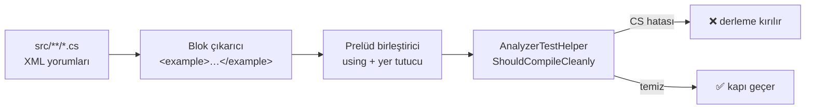

# Faz 79 — Sevk Edilen Yüzey Kapıları

> **Durum:** 📋 Planlandı (2026-08-21)
> **Kaynak:** [ADAYLAR.md](ADAYLAR.md) · **F-125**, **F-136** (Dalga 13, Küme A'nın C# kapı yarısı)
> **Önkoşul:** Yok. [Faz 78](78-YETENEK-HARITASI-ERISIMI.md) `APG0402`'yi ekledi; bu faz onu da kapsar
> **Paketler:** `AgentPrism.Generators` (yalnız tanı metinleri) · test projesi `AgentPrism.Generators.UnitTests`
> **Yeni paket:** Yok · **Migration:** Yok
> **Public API:** Büyümüyor. İki kalem de test ve doküman kapısıdır
> **Tüketici yüzeyi:** `docs-site/` → `troubleshooting.md` (beş yeni tanı bölümü)
> · sevk edilen: iki XML `<example>` bloğu **yeniden yazılır** (`AgentPrismToolAttribute.cs`, `AgentPrismMcpServerBuilderExtensions.cs`)
> **Manuel test alanı:** [`docs/manuel-test/31-DOKUMAN-DOGRULUGU.md`](manuel-test/31-DOKUMAN-DOGRULUGU.md)

---

## Bu Faza Başlarken

> `faz-baslangic` skill'ini uygula. Aşağıdaki liste o skill'in 2. adımıdır —
> **tamamını değil, yalnız işaret edilen bölümleri oku.**

1. Bu doküman
2. Kararlar — dosyanın tamamını **okuma**, yalnız bu üçünü grep'le:
   ```bash
   grep -n "K-421\|K-522\|K-538" docs/KARARLAR.md
   ```
   **K-421** (public API takibi açık ama hiçbir şey sevk edilmedi), **K-522**
   (tüketici doküman standardı `tuketici-dokuman-senkronu` skill'ine taşındı),
   **K-538** (`APG0402` yalnız yerel referans dosyası gerçekten yazılırken öter)
3. [`78-YETENEK-HARITASI-ERISIMI.md`](78-YETENEK-HARITASI-ERISIMI.md) — yalnız devir notu:
   ```bash
   awk '/## Sonraki Faza Devir Notu/,0' docs/78-YETENEK-HARITASI-ERISIMI.md
   ```
   Faz 78 `APG0402`'yi ve yetenek haritası bütçesini bıraktı; bu faz o tanının
   dokümante edilme sözleşmesini devralır.
4. Alan hafızası (bu faz iki alana dokunuyor):
   [`hafiza/analyzer-yazimi.md`](hafiza/analyzer-yazimi.md) (tanı descriptor'ları ve
   `AnalyzerTestHelper`) · [`hafiza/dokumantasyon.md`](hafiza/dokumantasyon.md)
   (içerik kapısı yazarken, `check-content.mjs`, site yayın hattı)
5. Gerektiğinde, tamamı değil ilgili bölümü:
   [`MAF-GENISLEME-NOKTALARI.md`](MAF-GENISLEME-NOKTALARI.md) — yalnız `<example>`
   bloklarının hangi giriş noktalarını anlattığını görmek için

---

## Amaç

AgentPrism bugün üç şeyi sevk ediyor ve üçü de yanlış olabildiği hâlde
**hiçbir kapı kızarmıyor**: XML `<example>` blokları (tüketicinin kopyaladığı
kod), `APG` tanı kodları (tüketicinin derlemesinde gördüğü mesaj) ve bunların
doküman karşılıkları. Bu faz iki kapıyı kurar. Kazanan, paketi ilk kez kuran
geliştirici ve tüketicinin kod agent'ıdır: kopyaladıkları örnek derlenir, aldıkları
tanı kodunun bir karşılığı bulunur.

- **F-125** — 49 `<example>` bloğunun tamamı Roslyn ile derlenir; derlenmeyen blok
  derlemeyi kırar
- **F-136** — 14 `APG` tanı kodunun tamamı `troubleshooting.md`'de geçer; geçmeyen
  kod derlemeyi kırar

### Bugün ne çalışmıyor — doğrulanmış kanıt

| Kanıt | Gözlem |
|---|---|
| [`CapabilityExampleTests.cs`](../tests/AgentPrism.Core.UnitTests/Architecture/CapabilityExampleTests.cs) | Dört kapı var (`Every_registration_entry_point_shows_a_worked_example`, `The_reader_sees_every_entry_point_including_the_generic_ones`, `No_example_teaches_a_registration_that_does_not_exist`, `Every_example_calls_the_member_it_documents`) — **dördü de ad denetimi**. Hiçbiri derlemiyor |
| [`AnalyzerTestHelper.cs:82`](../tests/AgentPrism.Generators.UnitTests/AnalyzerTestHelper.cs#L82) | `ShouldCompileCleanly(string source)` **zaten var**. F-125'in ihtiyacı olan ilkel hazır; kurulacak şey blok çıkarma ve prelüd |
| [`AnalyzerTestHelper.cs:97`](../tests/AgentPrism.Generators.UnitTests/AnalyzerTestHelper.cs#L97) | `BuildReferences()` `TRUSTED_PLATFORM_ASSEMBLIES` okur — derleme yalnız **test projesinin kendi referanslarını** görür |
| [`ToolDiagnostics.cs`](../src/AgentPrism.Generators/ToolDiagnostics.cs) · [`UsageDiagnostics.cs`](../src/AgentPrism.Generators/UsageDiagnostics.cs) | Toplam **14** descriptor: `APG0001`…`APG0007` ve `APG0101`, `APG0102`, `APG0201`, `APG0301`, `APG0302`, `APG0401`, `APG0402` |
| [`DiagnosticIntegrityTests.cs:128`](../tests/AgentPrism.Generators.UnitTests/DiagnosticIntegrityTests.cs#L128) | `Every_help_link_resolves_to_a_section_of_the_capability_map` her kodun **yardım bağlantısını** `capabilities.md` başlığına bağlıyor — ama kodun kendisinin bir sayfada **anlatıldığını** hiçbir kapı istemiyor |
| `docs-site/.../troubleshooting.md` | **9** kod geçiyor. **Beşi yok:** `APG0002` · `APG0003` · `APG0004` · `APG0005` · `APG0006` |
| `capability-example-baseline.txt` | 4 satırın **dördü de yorum** → sıfır muafiyet. Dosya kendi sözünü yazıyor: *"born empty and that is the intended state"* |

> Kanıtlar **2026-08-21** tarihinde yeniden doğrulandı. Aday kaydına göre **üç
> düzeltme** yapıldı ve bunlar plana işlendi:
>
> 1. Kayıt *"`guides/coding-agents.md` ve `troubleshooting.md` birlikte 9 kod
>    taşıyor"* diyordu. Ölçüm: **her biri ayrı ayrı** aynı dokuzu taşıyor.
> 2. Kayıt elipsis blok sayısını 2 diyordu ve **doğru** — ama dosya seviyesinde
>    grep 10 dosya gösterir; sayım **blok** seviyesinde yapılmalıdır.
> 3. Kayıt kapının maliyetini yazmamıştı. Ölçüldü: 49 blok **15 pakete** yayılmış,
>    test projesi bugün yalnız **dördünü** görüyor (§79.2).

---

## 79.1 — `<example>` derleme kapısı (F-125)

Kapı `AgentPrism.Generators.UnitTests` içinde yaşar. Gerekçe ölçüldü: Roslyn
(`Microsoft.CodeAnalysis.CSharp`) ve `ShouldCompileCleanly` orada; `Core.UnitTests`
ikisini de taşımıyor. F-136 da aynı projeye düştüğü için iki kalem tek yerde
buluşur.



**Prelüd yalnız iki yer tutucu ister** (ölçüldü): `app` **6** blokta,
`agentPrism` **1** blokta. `options`, `o`, `context` ve `services` blok içinde
lambda parametresi olarak bağlanır; prelüd istemez.

Blokların çoğu bir `using` bloğu taşımaz, çünkü XML örneği bağlamı varsayar.
Prelüd bu yüzden sabit bir `using` kümesi ve iki yer tutucu bildirimi ekler.
Prelüdün kendisi **testte** yaşar, sevk edilen XML'de değil.

### İki elipsis bloğu yeniden yazılır

`AgentPrismToolAttribute.cs` ve `AgentPrismMcpServerBuilderExtensions.cs`
bloklarında `...` vardır ve derlenmez. Muafiyet tabanı **açılmaz** (kullanıcı
kararı 👤): var olan `capability-example-baseline.txt` kendi sözünü *"yalnız
küçülür, boş doğdu"* diye yazıyor; ikinci bir muafiyet listesi o sözü bozar.
İki blok derlenebilir hâle getirilir — tüketici de böylece kopyalanabilir bir
örnek görür.

## 79.2 — On bir proje referansı (F-125'in gerçek maliyeti)

49 blok **15 pakete** yayılmıştır:

| Paket | Blok | Paket | Blok |
|---|---|---|---|
| `AgentPrism.Core` | 19 | `AgentPrism.Testing` | 1 |
| `AgentPrism.AspNetCore` | 7 | `AgentPrism.SqlServer` | 1 |
| `AgentPrism.Workflows` | 4 | `AgentPrism.UI` | 1 |
| `AgentPrism.Azure` | 3 | `AgentPrism.PostgreSql` | 1 |
| `AgentPrism.OpenAI` | 3 | `AgentPrism.Sqlite` | 1 |
| `AgentPrism.Anthropic` | 2 | `AgentPrism.Google` | 1 |
| `AgentPrism.Mcp` | 2 | `AgentPrism.Voice` | 1 |
| `AgentPrism.Abstractions` | 2 | | |

Test projesi bugün **dördünü** görüyor: `Core`, `AspNetCore`, `OpenAI`,
`Generators` (`Abstractions` `Core` üzerinden geçişli gelir). Kalan **11**
paket `ProjectReference` olarak eklenir: `Workflows` · `Azure` · `Anthropic` ·
`Mcp` · `Testing` · `SqlServer` · `UI` · `PostgreSql` · `Sqlite` · `Google` ·
`Voice`.

Bu kullanıcı kararıdır 👤. Ölçülen gerekçe: `DependencyDirectionTests` yalnız
`src/` katmanlarını kısıtlar, test projesini değil — yani mimari bir ihlal yoktur.
Alternatifler reddedildi: yeni bir test projesi 17. projeyi ve paket kontrol
listesini getirirdi; `artifacts/bin`'den DLL yolu ile referans vermek derleme
sırasını garanti etmez ve çıktı dizin düzenine bağlanırdı.

🚨 **Uygulayan oturum için tuzak:** referans eklemek derleme süresini büyütür ve
`AgentPrism.UI` referansı arayüz derlemesini test projesinin önkoşulu yapar.
Ölçüm gerekir: referanslar eklendikten sonra `dotnet build` süresi yazılır. Süre
kabul edilemez çıkarsa çözüm referansı düşürmek değil, `AgentPrism.UI`'nin tek
bloğunu taşımaktır — karar o anda alınır ve kapanışta yazılır.

## 79.3 — `APG` tanı kodu doküman kapısı (F-136)

Kapı `DiagnosticIntegrityTests`'in kardeşidir ve aynı dosyada yaşar. Var olan
`Every_help_link_resolves_to_a_section_of_the_capability_map` **yardım
bağlantısını** kontrol eder; yeni kapı **kodun kendisinin anlatıldığını**
kontrol eder.

**Zorunlu ev `troubleshooting.md`'dir** (kullanıcı kararı 👤). Gerekçe: bir kod
gören tüketicinin gittiği sayfa orasıdır ve zaten dokuzu taşır.
`guides/coding-agents.md` bir **seçki** olarak özgür kalır — agent'a yönelik bir
sayfanın her kodu tekrarlaması gerekmez.

### Beş kod yazılacak

| Kod | Başlık |
|---|---|
| `APG0002` | Invalid tool name |
| `APG0003` | Unsupported parameter type |
| `APG0004` | A generic method cannot be a tool |
| `APG0005` | No marked tool method |
| `APG0006` | Tool description missing |

Her biri `troubleshooting.md`'de bir bölüm alır: ne olduğu, neden ötüğü,
düzeltmenin ne olduğu. Metin **İngilizce**dir (dil sınırı).

---

## Planlanan Public API

**Yok — bu faz public yüzeyi büyütmez.** İki kalem de test ve doküman kapısıdır.

Doğrulandı (2026-08-21): `wc -l src/*/PublicAPI.Shipped.txt` → 16 satır / 16
dosya, yani her dosya yalnız `#nullable enable` taşıyor. Hiçbir şey sevk
edilmemiştir; yine de bu faz yüzeye dokunmadığı için o gerçeğin bir maliyeti yok.

### HTTP `endpoint`'leri

Yok.

### Arayüz payı

Yok — arayüz kaynağına dokunulmaz. `AgentPrism.UI` yalnız **referans** olarak
eklenir (tek bir `<example>` bloğu için); bundle üretilmez, `wwwroot` değişmez.

---

## Planlanan Dosya Listesi

```
tests/AgentPrism.Generators.UnitTests/
├── AgentPrism.Generators.UnitTests.csproj   (11 ProjectReference eklenir)
├── Examples/
│   ├── ExampleBlock.cs                      (blok + kaynak dosya + satır)
│   ├── ExampleExtractor.cs                  (XML'den <example> çıkarır)
│   ├── ExamplePrelude.cs                    (using kümesi + app/agentPrism)
│   └── ExampleCompilationTests.cs           (F-125 kapısı)
└── DiagnosticIntegrityTests.cs              (F-136 kapısı eklenir)

src/AgentPrism.Abstractions/Tools/
└── AgentPrismToolAttribute.cs               (elipsis bloğu yeniden yazılır)

src/AgentPrism.AspNetCore/McpServer/
└── AgentPrismMcpServerBuilderExtensions.cs  (elipsis bloğu yeniden yazılır)

docs-site/src/content/docs/
└── troubleshooting.md                       (beş yeni tanı bölümü)
```

---

## Hata Modları ve Testler

> Mutlu yoldan değil, **ne bozulabilir**den türetilir. Seviyeyi plan seçer.

| Ne bozulabilir | Seviye | Test sınıfı |
|---|---|---|
| Bir `<example>` bloğu var olmayan bir API adlandırır (`CS1061`) | Birim (Roslyn derleme) | `ExampleCompilationTests` |
| Bir blok var olan ada **yanlış biçimde** atar (`CS0200`, salt okunur özellik) | Birim (Roslyn derleme) | `ExampleCompilationTests` |
| Çıkarıcı bir bloğu **sessizce atlar** ve kapı 49 yerine 30 blok görür | Birim | `ExampleCompilationTests` — sayı iddiası: çıkarılan blok sayısı beklenen sayıya eşit olmalı |
| Prelüd bir yer tutucuyu bağlamaz; blok `CS0103` ile düşer | Birim | `ExampleCompilationTests` |
| 🚨 Kapı **hiçbir şey derlemez** ve yine de yeşil kalır (boş küme tuzağı) | Birim | `ExampleCompilationTests` — sıfır blok bulunursa test **düşer** |
| Yeni bir paket eklenir, `<example>` taşır ama referans eklenmez → blokları sessizce kapsam dışı kalır | Birim | `ExampleCompilationTests` — bulunan paket kümesi referans kümesiyle karşılaştırılır; fark **düşürür** |
| Yeni bir `APG` descriptor eklenir, dokümana yazılmaz | Birim | `DiagnosticIntegrityTests` (yeni `Theory`) |
| Bir kod dokümanda geçer ama descriptor silinmiştir (ölü satır) | Birim | `DiagnosticIntegrityTests` — ters yön de denetlenir |

Beş soru, bu fazın kod yolları için:

| Soru | Cevap |
|---|---|
| İptal | Yok — kapılar senkron test kodudur, `CancellationToken` yalnız `TestContext.Current` üzerinden geçer |
| Eşzamanlılık | Yok — dosya okuma ve Roslyn derleme, paylaşılan durum yok |
| Boş/aşırı girdi | **Var ve kritik:** sıfır blok bulunması sessiz bir geçiş üretir. Tabloda kendi satırı var |
| Başka kiracının kaydı | Yok — kiracı kavramı bu fazda yok |
| Alt sistem hatası | Kaynak dosya okunamazsa test düşer; bu doğru davranıştır (kapı kapı olmaktan çıkmamalı) |

Sözleşme testi **gerekmez** — hiçbir davranış DI, HTTP, kiracı, akış veya depo
sınırını geçmiyor. İkisi de derleme anı kapısıdır.

---

## Manuel Kabul Case'leri

> Kapanışta [`docs/manuel-test/31-DOKUMAN-DOGRULUGU.md`](manuel-test/31-DOKUMAN-DOGRULUGU.md)
> içine eklenecek case'lerin taslağı.

| # | Ön koşul | Adımlar | Beklenen sonuç |
|---|---|---|---|
| 1 | Temiz çalışma kopyası | Bir `<example>` bloğuna var olmayan bir üye ekle (`options.NoSuchThing = 1;`), `dotnet test tests/AgentPrism.Generators.UnitTests -c Release` | Test **düşer** ve mesaj dosya adını + `CS1061`'i adlandırır |
| 2 | Temiz çalışma kopyası | `ToolDiagnostics.cs`'e `APG0008` adında yeni bir descriptor ekle, `dotnet test tests/AgentPrism.Generators.UnitTests -c Release` | Test **düşer**: `APG0008` `troubleshooting.md`'de geçmiyor |
| 3 | Temiz çalışma kopyası | `troubleshooting.md`'den `APG0003` bölümünü sil, testi koş | Test **düşer** |
| 4 | Temiz çalışma kopyası | Tüm `<example>` bloklarını geçici olarak sil, testi koş | Test **düşer** — "sıfır blok bulundu" (kapının kendisi çalışıyor mu) |
| 5 | 👤 insan gerekir | `docs-site`'ta `npm run build`, `troubleshooting` sayfasını tarayıcıda aç | Beş yeni bölüm görünür; başlık slug'ları yardım bağlantılarıyla çakışmıyor |

---

## Açık Sorular

> Planı bloklamayan, faz uygulanırken karara bağlanacak sorular.

| # | Soru | Seçenekler | Öneri |
|---|---|---|---|
| 1 | Prelüd tek bir sabit `using` kümesi mi, blok başına çıkarım mı? | A: tek sabit küme (tüm paketlerin ana namespace'leri) · B: blokta geçen tipe göre çıkarım | **A** — 49 blok için tek küme ölçülebilir ve okunur; B bir mini derleyici yazmaktır |
| 2 | `AgentPrism.UI` referansı derleme süresini kabul edilemez büyütürse? | A: o tek bloğu başka pakete taşı · B: UI'yi kapsam dışı bırak ve baseline'a yaz | **A** — muafiyet açmamak §79.1'in kararıdır; ölçüm yapılmadan seçilmez |
| 3 | Beş tanı bölümü `troubleshooting.md`'nin neresine girer? | A: var olan `APG` bölümünün altına sırayla · B: yeni bir "Generator diagnostics" alt başlığı | **A** — sayfa zaten dokuz kodu sıralı taşıyor; ikinci bir grup okuyucuyu böler |
| 4 | Kapı `docs-site/dist/` çıktısını mı, kaynak `.md`'yi mi okur? | A: kaynak `.md` · B: üretilen `dist/` | **A** — `dist/` derleme çıktısıdır ve temiz klonda yoktur; `check-content.mjs` tuzağı aynısıdır (`hafiza/dokumantasyon.md`) |

---

## Bitiş Ölçütleri (DoD)

- [ ] `ExampleCompilationTests` **49** bloğun tamamını derler; blok sayısı iddiası testte yazılıdır
- [ ] İki elipsis bloğu yeniden yazılmıştır ve derlenir; **muafiyet tabanı açılmamıştır**
- [ ] `<example>` taşıyan **15 paketin tamamı** test projesinden referanslıdır; referans kümesi ile bulunan paket kümesi testte karşılaştırılır
- [ ] Sıfır blok bulunursa test düşer (boş küme tuzağı kapatıldı)
- [ ] `DiagnosticIntegrityTests` **14** `APG` kodunun tamamını `troubleshooting.md`'de bulur; ters yön (ölü satır) de denetlenir
- [ ] `APG0002`…`APG0006` `troubleshooting.md`'de anlatılmıştır — İngilizce, her biri "ne oldu / neden / düzeltme"
- [ ] Referans eklemenin **derleme süresine etkisi ölçüldü** ve dokümana yazıldı
- [ ] Dört doğrulama kapısı sıfır uyarı verir
- [ ] `samples/AgentPrism.Api` ile gerçek `run` yapıldı, çıktı belgeye yazıldı
- [ ] `secret` taraması boş döndü
- [ ] Manuel kabul case'leri `docs/manuel-test/31-DOKUMAN-DOGRULUGU.md` içine eklendi; 1–4 koşuldu
- [ ] `faz-denetim` koşuldu; 🔴 bulgu kalmadı
- [ ] `docs-site/` güncellendi; `npm run build` + `check-links.mjs` temiz

### Doğrulama komutları

```bash
# Kapı gerçekten 49 blok görüyor mu (test çıktısındaki sayı iddiası)
dotnet test tests/AgentPrism.Generators.UnitTests -c Release

# Descriptor sayısı ile dokümandaki kod sayısı eşit mi
grep -rhoE 'APG[0-9]{4}' src/AgentPrism.Generators/ | sort -u | wc -l
grep -ohE 'APG[0-9]{4}' docs-site/src/content/docs/troubleshooting.md | sort -u | wc -l

# Muafiyet tabanı hâlâ boş mu (yalnız yorum satırları)
grep -cv '^#' tests/AgentPrism.Core.UnitTests/Architecture/capability-example-baseline.txt
```

---

## Riskler

| Risk | Önlem |
|------|-------|
| 11 proje referansı derleme süresini gözle görülür büyütür | Süre **ölçülür** ve dokümana yazılır. Açık Soru 2 kabul edilemez durumu karara bağlar |
| Blok çıkarıcı XML kaçışlarını (`&lt;`, `&amp;`) çözmezse blok yanlış derlenir | Çıkarıcı `System.Xml` ile çözer, elle `Replace` ile değil. Test: kaçış taşıyan bir blok |
| Prelüd blok içindeki adla çakışır (`app` iki kez bildirilir) | Prelüd yer tutucuyu **yalnız blokta bağlı değilse** ekler; test: her iki durum |
| 🚨 Kapı yazılır ama hiçbir şey bulmaz ve yeşil kalır | Sıfır blok testi DoD'dedir. Bu repoda aynı sınıf tuzak `check-content.mjs`'te yaşandı (`hafiza/dokumantasyon.md`) |
| `troubleshooting.md` bütçeyi aşar | Beş bölüm kısa tutulur; aşarsa içerik **silinmez**, sayfa bölünür (`dokuman-bakim.py` kararı) |
| `AgentPrism.UI` referansı E2E/frontend derlemesini test projesine bağlar ve `-p:AgentPrismFrontendEnabled=false` ile iç döngü kırılır | Bayraklı koşum **ölçülür**. Kırılırsa Açık Soru 2'nin A seçeneği uygulanır |

---

<!-- ============================================================
     AŞAĞISI KAPANIŞTA DOLDURULUR — `faz-tamamlama` skill'i.
     Plan anında boş kalır. Başlıkları SİLME.
     ============================================================ -->

## Plandan Sapmalar

> Kapanışta doldurulur. Plan ile gerçek arasındaki fark **gizlenmez** — sonraki
> oturumun en değerli bilgisidir.

## Bu Fazda Verilen Kararlar

> Kapanışta doldurulur. K-NNN numaraları burada alınır; plan numara rezerve etmez.
> 🚨 Numarayı **maksimumdan** al, tablonun son satırından değil (K-539).

## Gerçekleşen Public API

> Kapanışta doldurulur. Koddaki **gerçek** imzalar.

## Dosya Listesi (gerçekleşen)

> Kapanışta doldurulur.

## Denetim Bulguları

> Kapanışta doldurulur — `faz-denetim` çıktısı. Her satır: bulgu · seviye
> (🔴/🟡/🟢) · sonuç (düzeltildi / gerekçelendi / F-NN olarak devredildi).
> Bulgu yoksa "🔴 ve 🟡 yok" yazılır; boş bırakılmaz.

## Sonraki Faza Devir Notu

> Kapanışta doldurulur: devralınan sözleşmeler, bilinen tuzaklar (🚨), yarım
> kalan işler, sıradaki faz.
