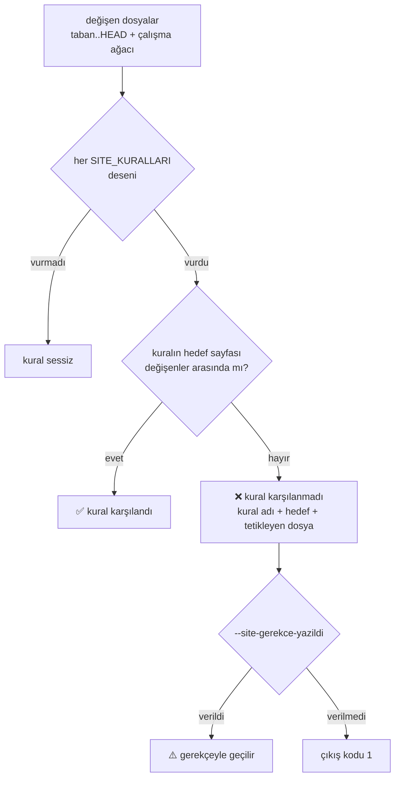

# Faz 80 — Doküman Kapılarının Doğruluğu

> **Durum:** 📋 Planlandı (2026-08-21)
> **Kaynak:** [ADAYLAR.md](ADAYLAR.md) · **F-129** (Dalga 13, Küme A'nın Python kapı yarısı) · K-522'nin yeniden açılma koşulu
> **Önkoşul:** Yok. [Faz 79](79-SEVK-EDILEN-YUZEY-KAPILARI.md) ile bağımsızdır; ikisi farklı alet zincirine dokunur
> **Paketler:** Yok — iş `scripts/` ve `.github/` içindedir
> **Yeni paket:** Yok · **Migration:** Yok
> **Public API:** Büyümüyor
> **Tüketici yüzeyi:** Yok. Bu faz kapıları düzeltir, sevk edilen metni değiştirmez
> **Manuel test alanı:** [`docs/manuel-test/31-DOKUMAN-DOGRULUGU.md`](manuel-test/31-DOKUMAN-DOGRULUGU.md)

---

## Bu Faza Başlarken

> `faz-baslangic` skill'ini uygula. Aşağıdaki liste o skill'in 2. adımıdır —
> **tamamını değil, yalnız işaret edilen bölümleri oku.**

1. Bu doküman
2. Kararlar — dosyanın tamamını **okuma**, yalnız bu üçünü grep'le:
   ```bash
   grep -n "K-214\|K-522\|K-539" docs/KARARLAR.md
   ```
   **K-214** (bütçe büyütülmez; aşılınca içerik taşınır), **K-522** (tüketici
   doküman standardı `tuketici-dokuman-senkronu` skill'ine taşındı — yeniden
   açılma koşulu **bu fazı** adlandırır), **K-539** (aynı script'e eklenen karar
   defteri kapısı; bu fazın kardeşi)
3. [`.agents/skills/tuketici-dokuman-senkronu/SKILL.md`](../.agents/skills/tuketici-dokuman-senkronu/SKILL.md)
   — yalnız **Adım 5** (dört kapı) ve **Adım 7** (gözle denetlenen kalan kalemler).
   Bu faz o skill'in çağırdığı kapıyı düzeltir; skill metni de güncellenir.
4. Alan hafızası (bu faz tek alana dokunuyor):
   [`hafiza/dokumantasyon.md`](hafiza/dokumantasyon.md) — özellikle
   **"Kapiyi CI'da hangi is kosuyor?"** ve **"`check-content.mjs` TEMIZ bir
   checkout'ta kosar"** bölümleri; ikisi de bu fazın tuzaklarıdır
5. `scripts/dokuman-bakim.py` — **tamamını** oku. 670 satırdır ve bu fazın
   tek çalışma dosyasıdır

---

## Amaç

AgentPrism'in doküman kapıları yeşil rapor veriyor ama iddia ettikleri şeyi
kanıtlamıyor. Üç yerde ölçüldü: senkron kapısı **herhangi** bir sayfanın
değişmesini **tüm** kuralların karşılığı sayıyor, bir kural yanlış sayfaya
yönlendiriyor, ve sevk edilen sayfalardaki site bağlantılarını hiçbir şey
çözmüyor. Üstüne, kapının kendisi ne test edilmiş ne de CI'da koşuyor.

Kazanan sonraki her faz oturumudur: `faz-tamamlama` bu kapıya güvenerek "site
senkronu tamam" diyor.

- **F-129** — senkron kapısı kural başına eşleşir, `capabilities.md` bir hedef
  olur, site bağlantıları çözülür, kapı test edilir ve CI'da koşar

### Bugün ne çalışmıyor — doğrulanmış kanıt

| Kanıt | Gözlem |
|---|---|
| [`dokuman-bakim.py`](../scripts/dokuman-bakim.py) `site_denetle()` → `if site_degisti: return 0` | 🚨 **Kapı aktif olarak yanıltıyor.** `docs-site/src/content/docs/` altında **herhangi** bir sayfa değişmişse **tetiklenen tüm kuralların** karşılığı yazılmış sayılır. `Workflows/` değiştirip yalnız `packages.md`'yi düzenlemek ✅ verir. Kapı bunu kendi mesajında itiraf ediyor: *"Yine de yukarıdaki her satırın karşılığı yazıldı mı, göz at."* |
| `SITE_KURALLARI` — **10** desen | Dokuzu dosya hedefi, **biri** dizin hedefi (`concepts/`). `capabilities.md` **hiçbir kuralın hedefi değil**; script'te `capabilities` dizesi **sıfır kez** geçiyor |
| `^src/AgentPrism\.(Abstractions\|Core)/` → `("concepts/",)` | `src/AgentPrism.Core/buildTransitive/` bu deseni **vuruyor** ama `concepts/`'e yönlendiriyor. Orada `AgentPrism.Core.targets` var ve tüketicinin gördüğü MSBuild özelliklerini tanımlıyor; `AgentPrismWriteLocalReference` **`capabilities.md`**'de belgeleniyor, `concepts/`'te değil |
| `kirik_baglantilar()` → `if re.match(r"^([a-z]+:\|/\|#)", h): continue` | Site-mutlak bağlantılar (`/AgentPrism/...`) **atlanıyor**. Ayrıca `if not fn_.endswith(".md"): continue` — `.mdx` sayfaları denetim dışı |
| `check-content.mjs:555-561` | `## Read next` bağlantılarını **sayıyor** (0 < n ≤ 3), hedefin var olduğunu **doğrulamıyor** |
| `find . -name "test_*.py"` → boş · `grep dokuman-bakim .github/workflows/ci.yml` → boş | Kapının **hiç testi yok** ve **CI'da hiç koşmuyor**. Yalnız `faz-tamamlama` sırasında elle çağrılıyor |

> Kanıtlar **2026-08-21** tarihinde doğrulandı. Aday kaydına göre **iki düzeltme**
> yapıldı ve bir hipotez **çürütüldü**:
>
> 1. Kayıt *"dokuz `SITE_KURALLARI` deseni"* diyordu; ölçüm **10** desen buldu.
> 2. Kayıt *"`buildTransitive/` değişimi hiçbir sayfaya eşlenmiyor"* diyordu.
>    Yanlış: `Abstractions|Core` deseni onu **yakalıyor** — ama **yanlış sayfaya**
>    yönlendiriyor. Boşluk "eşleme yok" değil, "eşleme hatalı".
> 3. 🚨 **Çürütülen hipotez:** üretilen `buildTransitive/AgentPrism.AgentMap.md`'nin
>    kaynağından (`capabilities.md`) bayatlaması **zaten kapalı** —
>    `ci.yml:71` `build-agent-map.mjs --check` koşuyor ve `build` işindedir,
>    yani PR'leri durdurur. Bu kapsam dışıdır.
>
> **Boşluk C'nin bugün hasarı yoktur.** Elle yazılan sayfalarda **163** site-mutlak
> bağlantı var ve **hiçbiri kırık değil** (ölçüldü). Eklenen kapı bir düzeltme
> değil, bir **regresyon kapısıdır** — bu bilerek kabul edildi 👤.

---

## 80.1 — Senkron kapısı kural başına eşleşir

Bugünkü akış, tetiklenen kural sayısından bağımsız olarak tek bir "site değişti mi"
sorusuna düşüyor. Hedef akış her kuralı kendi hedefiyle karşılaştırır.



**Dizin hedefi:** on desenden yalnız biri dizin kullanır (`concepts/`). Onu
`concepts/` altındaki **herhangi bir** sayfanın değişmesi karşılar (kullanıcı
kararı 👤). Gerekçe: kural bilerek geniştir — `Abstractions`/`Core` değişiminin
hangi kavram sayfasına düşeceği önceden bilinemez. Kalan dokuz hedef dosyadır ve
**tam eşleşme** ister.

**Kaçış kapısı global kalır** (kullanıcı kararı 👤). Bugünkü kusur kaçış kapısı
değil, sessiz `return 0`'dır. `--site-gerekce-yazildi` açıktır ve gerekçesi faz
dokümanına yazılır; kural başına yapmak tören ekler, kapının gücünü artırmaz.
Ama rapor **hangi kuralların** gerekçeyle geçildiğini tek tek yazar — bugün
yazmıyor.

🚨 **Tuzak:** `_degisen_dosyalar()` izlenmeyen dosyaları da döndürür (yeni bir
site sayfası henüz commit edilmemiş olabilir). Eşleme bunu korumalıdır; yalnız
`git diff`'e bakan bir uygulama yeni sayfayı görmez ve kapıyı **yanlış yere**
kırmızı yapar.

## 80.2 — `capabilities.md` bir hedef olur

`buildTransitive/` için ayrı bir kural eklenir ve **genel `Abstractions|Core`
kuralından önce** yazılır:

```python
(r"^src/AgentPrism\.Core/buildTransitive/",
 ("capabilities.md",), "tuketicinin gordugu MSBuild yuzeyi degisti"),
```

Desenler bir liste olduğu için **ikisi de tetiklenir** — bu doğrudur: bir
`buildTransitive/` değişimi hem `capabilities.md`'yi hem bir kavram sayfasını
gerektirebilir. Kapı ikisini ayrı satır olarak raporlar.

**Kapsam dışı:** `AgentPrism.AgentMap.md` üretilen bir dosyadır ve tazeliği
`ci.yml`'de zaten denetleniyor. Kural yalnız **`.targets`** değişimini
hedefler; üretilen `.md` bir çıktıdır, kaynak değil.

## 80.3 — Site bağlantıları çözülür

`kirik_baglantilar()` iki yerde genişler:

1. **`.mdx` de okunur.** Bugün yalnız `.md` okunuyor; `index.mdx` ve kardeşleri
   denetim dışı.
2. **`/AgentPrism/...` önekli bağlantılar çözülür.** Slug haritası
   `docs-site/src/content/docs/` altındaki sayfalardan kurulur:
   frontmatter'da `slug:` varsa **o** kullanılır, yoksa dosya yolu kullanılır
   (`x/index.md` → `x`).

🚨 **Bu ayrım kritik ve ölçüldü.** Naif "dosya yolu = slug" varsayımı 7 355
bağlantının **6 916**'sını kırık gösterdi — çünkü `http-api/` ve `api/` üretilen
sayfaları frontmatter `slug:` ile yeniden adlandırıyor. Doğru harita kurulunca
elle yazılan sayfalardan çıkan **163** bağlantının **0**'ı kırık çıktı.

**Kapsam:** yalnız elle yazılan sayfalardan çıkan bağlantılar denetlenir.
Üretilen sayfalar (`api/`, `http-api/`) hem kaynak hem hedef olarak **hariçtir**
— oradaki iş koddadır ve `BAGLANTI_HARIC` deseni zaten vardır. Uzantı taşıyan
hedefler (`llms.txt`, `openapi/agentprism.json`) dosya varlığıyla çözülür.

## 80.4 — Kapının kendi testi

`scripts/dokuman-bakim_test.py`, **stdlib `unittest`** ile (kullanıcı kararı 👤).
Yeni bağımlılık yoktur; K-007 gerekçesi gerekmez ve .NET bağımlılık grafiği
etkilenmez.

Test edilebilmesi için eşleme mantığı **saf bir fonksiyona** ayrılır:

```python
def _kural_eslesmesi(degisen: list[str]) -> list[tuple[str, tuple[str, ...], str, bool]]
```

Girdi bir dosya yolu listesidir; çıktı her tetiklenen kural için "karşılandı mı".
`git` çağrısı yoktur, dosya sistemi okuması yoktur — test doğrudan liste verir.

Koşum: `python3 -m unittest discover -s scripts -p "*_test.py"`.

## 80.5 — Kapı CI'da koşar

`ci.yml`'nin **`build`** işine tek satır eklenir (kullanıcı kararı 👤):

```yaml
      - name: Dokuman kapilari
        run: python3 scripts/dokuman-bakim.py --denetle
```

🚨 **`pages` işine konmaz.** O iş `github.event_name != 'pull_request'`
koşulludur ve oraya konan bir kapı **hiçbir PR'i durdurmaz**
(`hafiza/dokumantasyon.md`). `build-agent-map.mjs --check` ve
`check-content.mjs` zaten `build` işindedir; bu satır onların yanına gider.

Aynı işte `python3 -m unittest` de koşar (80.4).

---

## Planlanan Public API

**Yok.** Bu faz `src/` altına hiç dokunmaz.

---

## Planlanan Dosya Listesi

```
scripts/
├── dokuman-bakim.py          (site_denetle · kirik_baglantilar · SITE_KURALLARI)
└── dokuman-bakim_test.py     (YENİ — stdlib unittest)

.github/workflows/
└── ci.yml                    (build işine iki satır)

.agents/skills/tuketici-dokuman-senkronu/
└── SKILL.md                  (Adım 5: kapının artık kural başına eşleştiğini yaz)
```

---

## Hata Modları ve Testler

> Mutlu yoldan değil, **ne bozulabilir**den türetilir.

| Ne bozulabilir | Seviye | Test |
|---|---|---|
| Kural tetiklenir, hedef sayfa değişmemiştir, kapı yine ✅ der (**bugünkü kusur**) | Birim (`unittest`) | `dokuman-bakim_test.py` — kural karşılanmadı iddiası |
| Kural tetiklenir, hedef sayfa değişmiştir → kapı gereksiz kırmızı verir | Birim | aynı dosya — yanlış pozitif yok |
| Dizin hedefi (`concepts/`) altındaki bir sayfa değişir; kapı yine kırmızı verir | Birim | dizin hedefi ayrı case |
| Yeni site sayfası **izlenmeyen** dosyadır; kapı onu görmez ve yanlış yere kırmızı verir | Birim | `_degisen_dosyalar` çıktısı taklit edilir; izlenmeyen yol içerir |
| Slug haritası frontmatter `slug:`'ı okumaz → 6 916 yanlış pozitif | Birim | frontmatter'lı ve frontmatter'sız sayfa; ikisi de çözülmeli |
| `.mdx` sayfası hâlâ atlanır | Birim | `.mdx` uzantılı bir sayfa denetlenmeli |
| Üretilen sayfa (`http-api/`) kaynak olarak taranır → gürültü | Birim | hariç tutma iddiası |
| 🚨 Kapı **hiçbir kural bulmaz** ve yeşil kalır (boş küme tuzağı) | Birim | sıfır kural tetiklenirse test bunu ayırt eder; `SITE_KURALLARI` boşalırsa **düşer** |
| CI satırı `pages` işine konur → hiçbir PR durmaz | Manuel | Case 5 — `ci.yml`'de satırın hangi işte olduğu gözle doğrulanır |

Beş soru:

| Soru | Cevap |
|---|---|
| İptal | Yok — script senkron çalışır |
| Eşzamanlılık | Yok — tek süreç, paylaşılan durum yok |
| Boş/aşırı girdi | **Var:** değişen dosya listesi boş (bugün ele alınıyor) · hiçbir kural tetiklenmedi · `SITE_KURALLARI` boş. Üçü de tabloda |
| Başka kiracının kaydı | Yok |
| Alt sistem hatası | `git` çağrısı düşerse `_degisen_dosyalar` boş döner ve kapı "değişiklik yok" der — **sessiz geçiş**. Bu davranış korunur mu, Açık Soru 2 |

Sözleşme testi **gerekmez** — hiçbir davranış DI, HTTP, kiracı, akış veya depo
sınırını geçmiyor.

---

## Manuel Kabul Case'leri

> Kapanışta [`docs/manuel-test/31-DOKUMAN-DOGRULUGU.md`](manuel-test/31-DOKUMAN-DOGRULUGU.md)
> içine eklenecek case'lerin taslağı.

| # | Ön koşul | Adımlar | Beklenen sonuç |
|---|---|---|---|
| 1 | Temiz ağaç | `src/AgentPrism.Workflows/` altında bir dosyaya boşluk ekle, `docs-site/.../packages.md`'ye bir satır ekle, `python3 scripts/dokuman-bakim.py --site-denetle --taban HEAD` | ❌ **kırmızı** — `concepts/workflows.md` istendi, `packages.md` onu karşılamaz |
| 2 | Case 1'in ağacı | `concepts/workflows.md`'ye de bir satır ekle, tekrar koş | ✅ **yeşil** — her tetiklenen kuralın hedefi değişti |
| 3 | Temiz ağaç | `src/AgentPrism.Core/buildTransitive/AgentPrism.Core.targets`'a yorum ekle, koş | Rapor **`capabilities.md`**'yi ister (bugün yalnız `concepts/` istiyordu) |
| 4 | Temiz ağaç | Elle yazılan bir sayfanın `## Read next` bağlantısını `/AgentPrism/yok-boyle-sayfa/` yap, `--denetle` koş | ❌ **kırmızı** — çözülemeyen site bağlantısı |
| 5 | 👤 insan gerekir | `ci.yml`'yi aç | `dokuman-bakim.py --denetle` satırı **`build`** işinde; `pages` işinde **değil** |

---

## Açık Sorular

> Planı bloklamayan, faz uygulanırken karara bağlanacak sorular.

| # | Soru | Seçenekler | Öneri |
|---|---|---|---|
| 1 | Kural adı raporda nasıl görünsün? | A: desen dizesi · B: kurala eklenen kısa ad alanı | **B** — desen okunmaz; `SITE_KURALLARI` dörtlüye çıkar (ad, desen, sayfalar, neden) |
| 2 | `git` çağrısı düşerse kapı sessizce geçmeli mi? | A: bugünkü davranış (boş liste → "değişiklik yok", çıkış 0) · B: `git` hatası çıkış 1 | **B** — CI'ya girince sessiz geçiş bir kapının en kötü hâlidir. Ama bu **davranış değişikliğidir**; ölçülüp karara bağlanmalı |
| 3 | `## Read next` hedefinin **doğru** sayfa olduğu makine ile denetlenebilir mi? | A: hayır, semantiktir — skill Adım 7'de gözle kalır · B: bir yakınlık kuralı yazılır | **A** — çözülebilirlik makinedir, doğruluk değildir. Skill metni bunu açıkça yazsın |
| 4 | `--denetle` CI'ya girince bütçe aşımı **derlemeyi kırar**. Bu istenen mi? | A: evet — bütçe bir kapıdır · B: bütçe uyarı, kalanlar hata | **A**, ama Risk tablosundaki dar marj okunmalı |

---

## Bitiş Ölçütleri (DoD)

- [ ] `--site-denetle` **kural başına** eşleşir: tetiklenen her kuralın hedefi değişenler arasında yoksa çıkış kodu **1**
- [ ] Rapor karşılanmayan her kuralı **adıyla, hedefiyle ve tetikleyen dosyasıyla** yazar
- [ ] `--site-gerekce-yazildi` ile geçilen kurallar rapora **tek tek** yazılır
- [ ] `src/AgentPrism.Core/buildTransitive/` değişimi **`capabilities.md`**'yi ister
- [ ] `kirik_baglantilar()` `.mdx` okur ve `/AgentPrism/...` bağlantılarını çözer; frontmatter `slug:` dikkate alınır
- [ ] Bugünkü depoda çözülemeyen site bağlantısı **0** (taban ölçüm: 163 bağlantı, 0 kırık)
- [ ] `scripts/dokuman-bakim_test.py` yazıldı; `python3 -m unittest discover -s scripts -p "*_test.py"` yeşil
- [ ] Eşleme mantığı **saf fonksiyona** ayrıldı; testi `git` veya dosya sistemi istemez
- [ ] `ci.yml`'nin **`build`** işine `--denetle` ve `unittest` eklendi; `pages` işine **eklenmedi**
- [ ] `tuketici-dokuman-senkronu` SKILL.md Adım 5 güncellendi
- [ ] Dört doğrulama kapısı sıfır uyarı verir
- [ ] `samples/AgentPrism.Api` ile gerçek `run` yapıldı, çıktı belgeye yazıldı
- [ ] `secret` taraması boş döndü
- [ ] Manuel kabul case'leri `docs/manuel-test/31-DOKUMAN-DOGRULUGU.md` içine eklendi; 1–4 koşuldu
- [ ] `faz-denetim` koşuldu; 🔴 bulgu kalmadı

### Doğrulama komutları

```bash
# Kapı yanlış sayfayı kabul ediyor mu (Case 1'in makine hâli)
python3 scripts/dokuman-bakim.py --site-denetle --taban HEAD; echo "çıkış: $?"

# Kapının kendi testi
python3 -m unittest discover -s scripts -p "*_test.py" -v

# Çözülemeyen site bağlantısı sayısı
python3 scripts/dokuman-bakim.py --denetle | grep "Kırık bağlantı"

# CI satırı DOĞRU işte mi (build, pages değil)
awk '/^  build:/{j="build"} /^  pages:/{j="pages"} /dokuman-bakim/{print j": "$0}' .github/workflows/ci.yml
```

---

## Riskler

| Risk | Önlem |
|------|-------|
| 🚨 `--denetle` CI'ya girince **bugünkü dar bütçeler** derlemeyi kırar. Ölçüldü: **12 kalem DAR**, `docs/hafiza/sql-saglayicilari.md` **15 969 / 16 000** (%0,2 boşluk) | Faz CI satırını eklemeden **önce** `--denetle`'nin çıkış kodunu ölçer. 1 dönüyorsa önce dar dosya bölünür — içerik **silinmez** (K-214). Bu iş fazın parçasıdır, sürpriz değil |
| Kural başına eşleme kapıyı sık kırmızı yapar ve muafiyete iter | Case 2 yanlış pozitif olmadığını kanıtlar. Dizin hedefi kararı (§80.1) tam bu baskıyı azaltmak içindir |
| Slug haritası yanlış kurulursa binlerce yanlış pozitif | Ölçülmüş taban çizgisi DoD'dedir: bugün **0** kırık olmalı. Test frontmatter'lı ve frontmatter'sız iki sayfa içerir |
| Saf fonksiyona ayırma `site_denetle`'nin bugünkü davranışını sessizce değiştirir | Test **önce** bugünkü davranışı sabitler (karşılanan kural yeşil), sonra yeni iddia eklenir |
| `python3` CI imajında yok veya sürümü eski | `ci.yml` imajı ölçülür. Script `pathlib`/`re`/`os` dışında bir şey istemiyor; 3.10+ yeterli (`match` kullanılmıyor, tip birleşimi `X | None` var → **3.10+ gerekir**, ölçülmeli) |

---

<!-- ============================================================
     AŞAĞISI KAPANIŞTA DOLDURULUR — `faz-tamamlama` skill'i.
     Plan anında boş kalır. Başlıkları SİLME.
     ============================================================ -->

## Plandan Sapmalar

> Kapanışta doldurulur. Plan ile gerçek arasındaki fark **gizlenmez** — sonraki
> oturumun en değerli bilgisidir.

## Bu Fazda Verilen Kararlar

> Kapanışta doldurulur. K-NNN numaraları burada alınır; plan numara rezerve etmez.
> 🚨 Numarayı **maksimumdan** al, tablonun son satırından değil (K-539).

## Gerçekleşen Public API

> Kapanışta doldurulur. Bu fazda public yüzey beklenmiyor; beklenmedik bir üye
> çıkarsa nedeni buraya yazılır.

## Dosya Listesi (gerçekleşen)

> Kapanışta doldurulur.

## Denetim Bulguları

> Kapanışta doldurulur — `faz-denetim` çıktısı. Her satır: bulgu · seviye
> (🔴/🟡/🟢) · sonuç (düzeltildi / gerekçelendi / F-NN olarak devredildi).
> Bulgu yoksa "🔴 ve 🟡 yok" yazılır; boş bırakılmaz.

## Sonraki Faza Devir Notu

> Kapanışta doldurulur: devralınan sözleşmeler, bilinen tuzaklar (🚨), yarım
> kalan işler, sıradaki faz.
