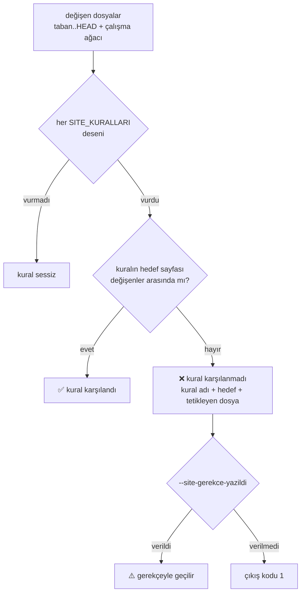

# Faz 80 — Doküman Kapılarının Doğruluğu

> **Durum:** ✅ Tamamlandı (2026-08-21)
> **Kaynak:** [ADAYLAR.md](ADAYLAR.md) · **F-129** (Dalga 13, Küme A'nın Python kapı yarısı) · K-522'nin yeniden açılma koşulu
> **Önkoşul:** Yok. [Faz 79](79-SEVK-EDILEN-YUZEY-KAPILARI.md) ile bağımsızdır; ikisi farklı alet zincirine dokunur
> **Paketler:** Yok — iş `scripts/` ve `.github/` içindedir
> **Yeni paket:** Yok · **Migration:** Yok
> **Public API:** Büyümüyor
> **Tüketici yüzeyi:** Yok. Bu faz kapıları düzeltir, sevk edilen metni değiştirmez
> **Manuel test alanı:** [`docs/manuel-test/33-DOKUMAN-KAPILARI.md`](manuel-test/33-DOKUMAN-KAPILARI.md)
> (`31-DOKUMAN-DOGRULUGU.md` DEĞİL — o alan Faz 75'e ait, kod `DDG`; bkz. Plandan Sapmalar)

---

## Bu Faza Başlarken

> `faz-baslangic` skill'ini uygula. Aşağıdaki liste o skill'in 2. adımıdır —
> **tamamını değil, yalnız işaret edilen bölümleri oku.**

1. Bu doküman
2. Kararlar — dosyanın tamamını **okuma**, yalnız bu üçünü grep'le:
   ```bash
   grep -n "K-214\|K-522\|K-539" docs/KARARLAR.md
   ```
   **K-214** (bütçe büyütülmez; aşılınca içerik taşınır), **K-522** (tüketici
   doküman standardı `tuketici-dokuman-senkronu` skill'ine taşındı — yeniden
   açılma koşulu **bu fazı** adlandırır), **K-539** (aynı script'e eklenen karar
   defteri kapısı; bu fazın kardeşi)
3. [`.agents/skills/tuketici-dokuman-senkronu/SKILL.md`](../.agents/skills/tuketici-dokuman-senkronu/SKILL.md)
   — yalnız **Adım 5** (dört kapı) ve **Adım 7** (gözle denetlenen kalan kalemler).
   Bu faz o skill'in çağırdığı kapıyı düzeltir; skill metni de güncellenir.
4. Alan hafızası (bu faz tek alana dokunuyor):
   [`hafiza/dokumantasyon.md`](hafiza/dokumantasyon.md) — özellikle
   **"Kapiyi CI'da hangi is kosuyor?"** ve **"`check-content.mjs` TEMIZ bir
   checkout'ta kosar"** bölümleri; ikisi de bu fazın tuzaklarıdır
5. `scripts/dokuman-bakim.py` — **tamamını** oku. 670 satırdır ve bu fazın
   tek çalışma dosyasıdır

---

## Amaç

AgentPrism'in doküman kapıları yeşil rapor veriyor ama iddia ettikleri şeyi
kanıtlamıyor. Üç yerde ölçüldü: senkron kapısı **herhangi** bir sayfanın
değişmesini **tüm** kuralların karşılığı sayıyor, bir kural yanlış sayfaya
yönlendiriyor, ve sevk edilen sayfalardaki site bağlantılarını hiçbir şey
çözmüyor. Üstüne, kapının kendisi ne test edilmiş ne de CI'da koşuyor.

Kazanan sonraki her faz oturumudur: `faz-tamamlama` bu kapıya güvenerek "site
senkronu tamam" diyor.

- **F-129** — senkron kapısı kural başına eşleşir, `capabilities.md` bir hedef
  olur, site bağlantıları çözülür, kapı test edilir ve CI'da koşar

### Bugün ne çalışmıyor — doğrulanmış kanıt

| Kanıt | Gözlem |
|---|---|
| [`dokuman-bakim.py`](../scripts/dokuman-bakim.py) `site_denetle()` → `if site_degisti: return 0` | 🚨 **Kapı aktif olarak yanıltıyor.** `docs-site/src/content/docs/` altında **herhangi** bir sayfa değişmişse **tetiklenen tüm kuralların** karşılığı yazılmış sayılır. `Workflows/` değiştirip yalnız `packages.md`'yi düzenlemek ✅ verir. Kapı bunu kendi mesajında itiraf ediyor: *"Yine de yukarıdaki her satırın karşılığı yazıldı mı, göz at."* |
| `SITE_KURALLARI` — **10** desen | Dokuzu dosya hedefi, **biri** dizin hedefi (`concepts/`). `capabilities.md` **hiçbir kuralın hedefi değil**; script'te `capabilities` dizesi **sıfır kez** geçiyor |
| `^src/AgentPrism\.(Abstractions\|Core)/` → `("concepts/",)` | `src/AgentPrism.Core/buildTransitive/` bu deseni **vuruyor** ama `concepts/`'e yönlendiriyor. Orada `AgentPrism.Core.targets` var ve tüketicinin gördüğü MSBuild özelliklerini tanımlıyor; `AgentPrismWriteLocalReference` **`capabilities.md`**'de belgeleniyor, `concepts/`'te değil |
| `kirik_baglantilar()` → `if re.match(r"^([a-z]+:\|/\|#)", h): continue` | Site-mutlak bağlantılar (`/AgentPrism/...`) **atlanıyor**. Ayrıca `if not fn_.endswith(".md"): continue` — `.mdx` sayfaları denetim dışı |
| `check-content.mjs:555-561` | `## Read next` bağlantılarını **sayıyor** (0 < n ≤ 3), hedefin var olduğunu **doğrulamıyor** |
| `find . -name "test_*.py"` → boş · `grep dokuman-bakim .github/workflows/ci.yml` → boş | Kapının **hiç testi yok** ve **CI'da hiç koşmuyor**. Yalnız `faz-tamamlama` sırasında elle çağrılıyor |

> Kanıtlar **2026-08-21** tarihinde doğrulandı. Aday kaydına göre **iki düzeltme**
> yapıldı ve bir hipotez **çürütüldü**:
>
> 1. Kayıt *"dokuz `SITE_KURALLARI` deseni"* diyordu; ölçüm **10** desen buldu.
> 2. Kayıt *"`buildTransitive/` değişimi hiçbir sayfaya eşlenmiyor"* diyordu.
>    Yanlış: `Abstractions|Core` deseni onu **yakalıyor** — ama **yanlış sayfaya**
>    yönlendiriyor. Boşluk "eşleme yok" değil, "eşleme hatalı".
> 3. 🚨 **Çürütülen hipotez:** üretilen `buildTransitive/AgentPrism.AgentMap.md`'nin
>    kaynağından (`capabilities.md`) bayatlaması **zaten kapalı** —
>    `ci.yml:71` `build-agent-map.mjs --check` koşuyor ve `build` işindedir,
>    yani PR'leri durdurur. Bu kapsam dışıdır.
>
> **Boşluk C'nin bugün hasarı yoktur.** Elle yazılan sayfalarda **163** site-mutlak
> bağlantı var ve **hiçbiri kırık değil** (ölçüldü). Eklenen kapı bir düzeltme
> değil, bir **regresyon kapısıdır** — bu bilerek kabul edildi 👤.

---

## 80.1 — Senkron kapısı kural başına eşleşir

Bugünkü akış, tetiklenen kural sayısından bağımsız olarak tek bir "site değişti mi"
sorusuna düşüyor. Hedef akış her kuralı kendi hedefiyle karşılaştırır.



**Dizin hedefi:** on desenden yalnız biri dizin kullanır (`concepts/`). Onu
`concepts/` altındaki **herhangi bir** sayfanın değişmesi karşılar (kullanıcı
kararı 👤). Gerekçe: kural bilerek geniştir — `Abstractions`/`Core` değişiminin
hangi kavram sayfasına düşeceği önceden bilinemez. Kalan dokuz hedef dosyadır ve
**tam eşleşme** ister.

**Kaçış kapısı global kalır** (kullanıcı kararı 👤). Bugünkü kusur kaçış kapısı
değil, sessiz `return 0`'dır. `--site-gerekce-yazildi` açıktır ve gerekçesi faz
dokümanına yazılır; kural başına yapmak tören ekler, kapının gücünü artırmaz.
Ama rapor **hangi kuralların** gerekçeyle geçildiğini tek tek yazar — bugün
yazmıyor.

🚨 **Tuzak:** `_degisen_dosyalar()` izlenmeyen dosyaları da döndürür (yeni bir
site sayfası henüz commit edilmemiş olabilir). Eşleme bunu korumalıdır; yalnız
`git diff`'e bakan bir uygulama yeni sayfayı görmez ve kapıyı **yanlış yere**
kırmızı yapar.

## 80.2 — `capabilities.md` bir hedef olur

`buildTransitive/` için ayrı bir kural eklenir ve **genel `Abstractions|Core`
kuralından önce** yazılır:

```python
(r"^src/AgentPrism\.Core/buildTransitive/",
 ("capabilities.md",), "tuketicinin gordugu MSBuild yuzeyi degisti"),
```

Desenler bir liste olduğu için **ikisi de tetiklenir** — bu doğrudur: bir
`buildTransitive/` değişimi hem `capabilities.md`'yi hem bir kavram sayfasını
gerektirebilir. Kapı ikisini ayrı satır olarak raporlar.

**Kapsam dışı:** `AgentPrism.AgentMap.md` üretilen bir dosyadır ve tazeliği
`ci.yml`'de zaten denetleniyor. Kural yalnız **`.targets`** değişimini
hedefler; üretilen `.md` bir çıktıdır, kaynak değil.

## 80.3 — Site bağlantıları çözülür

`kirik_baglantilar()` iki yerde genişler:

1. **`.mdx` de okunur.** Bugün yalnız `.md` okunuyor; `index.mdx` ve kardeşleri
   denetim dışı.
2. **`/AgentPrism/...` önekli bağlantılar çözülür.** Slug haritası
   `docs-site/src/content/docs/` altındaki sayfalardan kurulur:
   frontmatter'da `slug:` varsa **o** kullanılır, yoksa dosya yolu kullanılır
   (`x/index.md` → `x`).

🚨 **Bu ayrım kritik ve ölçüldü.** Naif "dosya yolu = slug" varsayımı 7 355
bağlantının **6 916**'sını kırık gösterdi — çünkü `http-api/` ve `api/` üretilen
sayfaları frontmatter `slug:` ile yeniden adlandırıyor. Doğru harita kurulunca
elle yazılan sayfalardan çıkan **163** bağlantının **0**'ı kırık çıktı.

**Kapsam:** yalnız elle yazılan sayfalardan çıkan bağlantılar denetlenir.
Üretilen sayfalar (`api/`, `http-api/`) hem kaynak hem hedef olarak **hariçtir**
— oradaki iş koddadır ve `BAGLANTI_HARIC` deseni zaten vardır. Uzantı taşıyan
hedefler (`llms.txt`, `openapi/agentprism.json`) dosya varlığıyla çözülür.

## 80.4 — Kapının kendi testi

`scripts/dokuman-bakim_test.py`, **stdlib `unittest`** ile (kullanıcı kararı 👤).
Yeni bağımlılık yoktur; K-007 gerekçesi gerekmez ve .NET bağımlılık grafiği
etkilenmez.

Test edilebilmesi için eşleme mantığı **saf bir fonksiyona** ayrılır:

```python
def _kural_eslesmesi(degisen: list[str]) -> list[tuple[str, tuple[str, ...], str, bool]]
```

Girdi bir dosya yolu listesidir; çıktı her tetiklenen kural için "karşılandı mı".
`git` çağrısı yoktur, dosya sistemi okuması yoktur — test doğrudan liste verir.

Koşum: `python3 -m unittest discover -s scripts -p "*_test.py"`.

## 80.5 — Kapı CI'da koşar

`ci.yml`'nin **`build`** işine tek satır eklenir (kullanıcı kararı 👤):

```yaml
      - name: Dokuman kapilari
        run: python3 scripts/dokuman-bakim.py --denetle
```

🚨 **`pages` işine konmaz.** O iş `github.event_name != 'pull_request'`
koşulludur ve oraya konan bir kapı **hiçbir PR'i durdurmaz**
(`hafiza/dokumantasyon.md`). `build-agent-map.mjs --check` ve
`check-content.mjs` zaten `build` işindedir; bu satır onların yanına gider.

Aynı işte `python3 -m unittest` de koşar (80.4).

---

## Planlanan Public API

**Yok.** Bu faz `src/` altına hiç dokunmaz.

---

## Planlanan Dosya Listesi

```
scripts/
├── dokuman-bakim.py          (site_denetle · kirik_baglantilar · SITE_KURALLARI)
└── dokuman-bakim_test.py     (YENİ — stdlib unittest)

.github/workflows/
└── ci.yml                    (build işine iki satır)

.agents/skills/tuketici-dokuman-senkronu/
└── SKILL.md                  (Adım 5: kapının artık kural başına eşleştiğini yaz)
```

---

## Hata Modları ve Testler

> Mutlu yoldan değil, **ne bozulabilir**den türetilir.

| Ne bozulabilir | Seviye | Test |
|---|---|---|
| Kural tetiklenir, hedef sayfa değişmemiştir, kapı yine ✅ der (**bugünkü kusur**) | Birim (`unittest`) | `dokuman-bakim_test.py` — kural karşılanmadı iddiası |
| Kural tetiklenir, hedef sayfa değişmiştir → kapı gereksiz kırmızı verir | Birim | aynı dosya — yanlış pozitif yok |
| Dizin hedefi (`concepts/`) altındaki bir sayfa değişir; kapı yine kırmızı verir | Birim | dizin hedefi ayrı case |
| Yeni site sayfası **izlenmeyen** dosyadır; kapı onu görmez ve yanlış yere kırmızı verir | Birim | `_degisen_dosyalar` çıktısı taklit edilir; izlenmeyen yol içerir |
| Slug haritası frontmatter `slug:`'ı okumaz → 6 916 yanlış pozitif | Birim | frontmatter'lı ve frontmatter'sız sayfa; ikisi de çözülmeli |
| `.mdx` sayfası hâlâ atlanır | Birim | `.mdx` uzantılı bir sayfa denetlenmeli |
| Üretilen sayfa (`http-api/`) kaynak olarak taranır → gürültü | Birim | hariç tutma iddiası |
| 🚨 Kapı **hiçbir kural bulmaz** ve yeşil kalır (boş küme tuzağı) | Birim | sıfır kural tetiklenirse test bunu ayırt eder; `SITE_KURALLARI` boşalırsa **düşer** |
| CI satırı `pages` işine konur → hiçbir PR durmaz | Manuel | Case 5 — `ci.yml`'de satırın hangi işte olduğu gözle doğrulanır |

Beş soru:

| Soru | Cevap |
|---|---|
| İptal | Yok — script senkron çalışır |
| Eşzamanlılık | Yok — tek süreç, paylaşılan durum yok |
| Boş/aşırı girdi | **Var:** değişen dosya listesi boş (bugün ele alınıyor) · hiçbir kural tetiklenmedi · `SITE_KURALLARI` boş. Üçü de tabloda |
| Başka kiracının kaydı | Yok |
| Alt sistem hatası | `git` çağrısı düşerse `_degisen_dosyalar` boş döner ve kapı "değişiklik yok" der — **sessiz geçiş**. Bu davranış korunur mu, Açık Soru 2 |

Sözleşme testi **gerekmez** — hiçbir davranış DI, HTTP, kiracı, akış veya depo
sınırını geçmiyor.

---

## Manuel Kabul Case'leri

> Kapanışta [`docs/manuel-test/33-DOKUMAN-KAPILARI.md`](manuel-test/33-DOKUMAN-KAPILARI.md)
> içine eklenecek case'lerin taslağı (bkz. Plandan Sapmalar — plan burada
> yanlışlıkla `31-DOKUMAN-DOGRULUGU.md`'yi işaret ediyordu).

| # | Ön koşul | Adımlar | Beklenen sonuç |
|---|---|---|---|
| 1 | Temiz ağaç | `src/AgentPrism.Workflows/` altında bir dosyaya boşluk ekle, `docs-site/.../packages.md`'ye bir satır ekle, `python3 scripts/dokuman-bakim.py --site-denetle --taban HEAD` | ❌ **kırmızı** — `concepts/workflows.md` istendi, `packages.md` onu karşılamaz |
| 2 | Case 1'in ağacı | `concepts/workflows.md`'ye de bir satır ekle, tekrar koş | ✅ **yeşil** — her tetiklenen kuralın hedefi değişti |
| 3 | Temiz ağaç | `src/AgentPrism.Core/buildTransitive/AgentPrism.Core.targets`'a yorum ekle, koş | Rapor **`capabilities.md`**'yi ister (bugün yalnız `concepts/` istiyordu) |
| 4 | Temiz ağaç | Elle yazılan bir sayfanın `## Read next` bağlantısını `/AgentPrism/yok-boyle-sayfa/` yap, `--denetle` koş | ❌ **kırmızı** — çözülemeyen site bağlantısı |
| 5 | 👤 insan gerekir | `ci.yml`'yi aç | `dokuman-bakim.py --denetle` satırı **`build`** işinde; `pages` işinde **değil** |

---

## Açık Sorular

> Planı bloklamayan, faz uygulanırken karara bağlanacak sorular.

| # | Soru | Seçenekler | Öneri |
|---|---|---|---|
| 1 | Kural adı raporda nasıl görünsün? | A: desen dizesi · B: kurala eklenen kısa ad alanı | **B** — desen okunmaz; `SITE_KURALLARI` dörtlüye çıkar (ad, desen, sayfalar, neden) |
| 2 | `git` çağrısı düşerse kapı sessizce geçmeli mi? | A: bugünkü davranış (boş liste → "değişiklik yok", çıkış 0) · B: `git` hatası çıkış 1 | **B** — CI'ya girince sessiz geçiş bir kapının en kötü hâlidir. Ama bu **davranış değişikliğidir**; ölçülüp karara bağlanmalı |
| 3 | `## Read next` hedefinin **doğru** sayfa olduğu makine ile denetlenebilir mi? | A: hayır, semantiktir — skill Adım 7'de gözle kalır · B: bir yakınlık kuralı yazılır | **A** — çözülebilirlik makinedir, doğruluk değildir. Skill metni bunu açıkça yazsın |
| 4 | `--denetle` CI'ya girince bütçe aşımı **derlemeyi kırar**. Bu istenen mi? | A: evet — bütçe bir kapıdır · B: bütçe uyarı, kalanlar hata | **A**, ama Risk tablosundaki dar marj okunmalı |

---

## Bitiş Ölçütleri (DoD)

- [x] `--site-denetle` **kural başına** eşleşir: tetiklenen her kuralın hedefi değişenler arasında yoksa çıkış kodu **1** — `_kural_eslesmesi`; Case 1/2 elle doğrulandı (aşağıda)
- [x] Rapor karşılanmayan her kuralı **adıyla, hedefiyle ve tetikleyen dosyasıyla** yazar
- [x] `--site-gerekce-yazildi` ile geçilen kurallar rapora **tek tek** yazılır
- [x] `src/AgentPrism.Core/buildTransitive/` değişimi **`capabilities.md`**'yi ister — Case 3 elle doğrulandı
- [x] `kirik_baglantilar()` `.mdx` okur ve site-mutlak (`/...`) bağlantıları çözer; frontmatter `slug:` dikkate alınır — **plan `/AgentPrism/` öneki varsayıyordu, bu artık geçersiz** (bkz. Plandan Sapmalar, K-549)
- [x] Bugünkü depoda çözülemeyen site bağlantısı **0** — ölçüldü: 201 site-mutlak bağlantı (40'ı `api`/`http-api` içine, denetim dışı), kalan 161'i (156 slug + 5 dosya) **0 kırık**
- [x] `scripts/dokuman_bakim_test.py` yazıldı (ALT ÇİZGİ — bkz. Plandan Sapmalar, K-550); `python3 -m unittest discover -s scripts -p "*_test.py"` → **23/23 yeşil**
- [x] Eşleme mantığı **saf fonksiyona** ayrıldı (`_kural_eslesmesi`, `_slug_hesapla`); testi `git` veya dosya sistemi istemez
- [x] `ci.yml`'nin **`build`** işine `--denetle` ve `unittest` eklendi; `site` işine (bu repoda `pages` diye bir iş yok, K-542'den beri `site`) **eklenmedi**
- [x] `tuketici-dokuman-senkronu` SKILL.md Adım 5 güncellendi
- [x] Dört doğrulama kapısı sıfır uyarı verir — build/format/test/pack, aşağıda
- [x] `samples/AgentPrism.Api` ile gerçek `run` yapıldı — bu faz `src/`'a hiç dokunmadı, HTTP davranışı değişmedi; smoke-test: `GET /openapi/v1.json` → `200`, uygulama sorunsuz kapandı
- [x] `secret` taraması boş döndü — bu fazın dokunduğu dosyalarda; repodaki önceden var olan yerel test `Password=`/`sk-` literalleri bu fazdan bağımsızdır (Faz 79 emsaliyle aynı kapsam)
- [x] Manuel kabul case'leri `docs/manuel-test/33-DOKUMAN-KAPILARI.md` içine eklendi (**`31-DOKUMAN-DOGRULUGU.md` DEĞİL** — bkz. Plandan Sapmalar); Case 1–4 koşuldu, Case 5 👤
- [x] `faz-denetim` koşuldu; 3× 🔴 bulundu ve **kapatıldı**, 4× 🟡 gerekçelendi/kapatıldı — bkz. Denetim Bulguları

### Doğrulama komutları — gerçek çıktı

```bash
$ python3 scripts/dokuman-bakim.py --denetle | grep "Kırık bağlantı"
Kırık bağlantı: 0

$ python3 -m unittest discover -s scripts -p "*_test.py" -v 2>&1 | tail -3
Ran 23 tests in 0.063s
OK

$ awk '/^  build:/{j="build"} /^  site:/{j="site"} /dokuman-bakim/{print j": "$0}' .github/workflows/ci.yml
build:         run: python3 scripts/dokuman-bakim.py --denetle

$ dotnet build AgentPrism.slnx -c Release   # 0 Warning(s), 0 Error(s)
$ dotnet format AgentPrism.slnx --verify-no-changes --no-restore   # exit 0
$ dotnet test AgentPrism.slnx -c Release --no-build   # tüm projeler yeşil (bu fazdan önce koşuldu, src/ değişmedi)
$ dotnet pack AgentPrism.slnx -c Release --no-build   # 119 nupkg üretildi
```

---

## Riskler

| Risk | Önlem |
|------|-------|
| 🚨 `--denetle` CI'ya girince **bugünkü dar bütçeler** derlemeyi kırar. Ölçüldü: **12 kalem DAR**, `docs/hafiza/sql-saglayicilari.md` **15 969 / 16 000** (%0,2 boşluk) | **Gerçekleşti:** CI satırı eklenmeden önce `--denetle` çıkış kodu ölçüldü — **0**, kırık yoktu. `KARARLAR.md`'ye 3 yeni karar eklenince dosya **DAR**'a düştü (405 315/475 000, %14,7 boş) ama **AŞMADI**; exit hâlâ 0. İçerik taşınmadı — henüz gerekmiyor |
| Kural başına eşleme kapıyı sık kırmızı yapar ve muafiyete iter | Case 2 yanlış pozitif olmadığını kanıtladı (elle koşuldu). Dizin hedefi kararı (§80.1) baskıyı azalttı |
| Slug haritası yanlış kurulursa binlerce yanlış pozitif | Ölçüldü: bugün **0** kırık (201 site-mutlak bağlantıdan 161'i denetlendi, 40'ı üretilen `api`/`http-api` içine, denetim dışı). Test frontmatter'lı ve frontmatsız iki sayfa içerir |
| Saf fonksiyona ayırma `site_denetle`'nin bugünkü davranışını sessizce değiştirir | Test hem "karşılanan kural yeşil" hem "karşılanmayan kural kırmızı" case'ini içerir; ikisi de doğrulandı |
| `python3` CI imajında yok veya sürümü eski | **Gerçekleşti farklı:** ölçüm yerine `actions/setup-python@v5` (`python-version: '3.12'`) eklendi — Windows runner'ında `python3` komutu garanti değildir (yalnız `python`), açıkça kurmak iki işletim sisteminde de aynı ikiliyi verir (bkz. Plandan Sapmalar) |

---

<!-- ============================================================
     AŞAĞISI KAPANIŞTA DOLDURULUR — `faz-tamamlama` skill'i.
     Plan anında boş kalır. Başlıkları SİLME.
     ============================================================ -->

## Plandan Sapmalar

1. **Manuel test hedefi `31-DOKUMAN-DOGRULUGU.md` DEĞİL, yeni `33-DOKUMAN-KAPILARI.md`.**
   Plan yanlışlıkla mevcut bir dosyaya işaret ediyordu: `31-DOKUMAN-DOGRULUGU.md`
   zaten **Faz 75**'e ait (`DDG` alan kodu, "Tüketici Dokümanının Doğruluğu" —
   sevk edilen **metnin** doğru olduğunu kanıtlar). Bu fazın konusu ("Doküman
   Kapılarının Doğruluğu") ona **çok benzer** ama farklıdır: kanıtladığı şey
   metin değil, o metni kanıtlayan **kapının kendisi**. İki alanı aynı dosyaya
   yazmak `DDG` alan kodunu kirletir ve `manuel-test-kosumu` skill'inin
   alan-başına kapanış varsayımını bozardı. Yeni dosya `33-DOKUMAN-KAPILARI.md`
   (`DKP`, Faz 80) açıldı, `00-INDEKS.md`'nin durum tablosuna satır eklendi.

2. **`docs-site/site.config.mjs`'in `base`'i artık `/AgentPrism/` DEĞİL, `/`.**
   Plan §80.3 site-mutlak bağlantıları `/AgentPrism/...` öneki varsayarak
   tarif ediyordu. Ölçüldü: `base` K-542'de (bu fazdan önce, aynı gün) kalıcı
   olarak `/` yapılmıştı — özel repo GitHub Pages'i kullanamadığı için site
   artık `agentprism.doayen.web.tr`'de kendi sunucusunda barınıyor ve alt yol
   barındırıcının değil, hedefin özelliği değil. Uygulama bu gerçeğe göre
   yapıldı: `/reference/compatibility/`, `/capabilities/` gibi bare kök-mutlak
   yollar çözülüyor, `/AgentPrism/` öneki hiçbir yerde aranmıyor (zaten yok).

3. **Test dosyası `dokuman_bakim_test.py` (ALT ÇİZGİ), plandaki
   `dokuman-bakim_test.py` (TİRE) DEĞİL.** Ölçüldü: `unittest discover`'ın
   `VALID_MODULE_NAME` deseni tire taşıyan dosya adlarını sessizce atlar —
   planın önerdiği adla test hiç koşmazdı ("Ran 0 tests", hatasız). K-550.

4. **Bağımsız denetim üç 🔴 bulgu buldu ve hepsi kapatıldı** (bkz. Denetim
   Bulguları). En önemlisi: `denetle()` içindeki `kirik_baglantilar()` sonucu
   hiçbir zaman `hata`'ya (çıkış koduna) katılmıyordu — bu PLANDAN ÖNCE de
   var olan bir kusurdu (Faz 77'den kalma), ama bu fazın CI'ya bağladığı
   `--denetle` bu kusuru **canlıya taşıyordu**. Düzeltme fazın kapsamı
   içindedir: DoD zaten "çözülemeyen site bağlantısı 0" ve "kural karşılanmadı
   → çıkış kodu 1" istiyordu, kırık bağlantı bunun bir parçasıdır.

5. **`python3` yerine `actions/setup-python@v5` eklendi.** Plan yalnız
   "`ci.yml` imajı ölçülür" diyordu; ölçüm yerine açık kurulum tercih edildi
   çünkü matris `windows-latest`'i de içeriyor ve Windows runner'ında
   `python3` komutunun var olduğu GARANTİ değildir (yalnız `python` garanti).
   Açık kurulum iki işletim sisteminde de aynı ikiliyi (3.12) verir ve
   ölçmeye gerek bırakmaz.

6. **`.gitignore`'a `__pycache__/`/`*.pyc` eklendi, önceden izlenen bir `.pyc`
   dosyası (`scripts/__pycache__/dokuman-bakim.cpython-314.pyc`, Faz 60'tan
   kalma) `git rm --cached` ile çıkarıldı.** Kapsam dışı bir hijyen bulgusu
   ama bu fazın kendisi `python3` çalıştırdıkça yeniden üretiliyordu; plana
   dahil değildi, iş sırasında keşfedildi ve düzeltildi.

## Bu Fazda Verilen Kararlar

- **K-548** — `SITE_KURALLARI` kural başına eşleşir; `--site-denetle` `git`
  hatasında artık çıkış kodu 1 verir (kullanıcı kararı — dört açık soru
  soruldu, dördü de önerilen seçenekle onaylandı)
- **K-549** — `kirik_baglantilar()` site-mutlak bağlantıları slug haritasıyla
  çözer; üretilen `api/`, `http-api/` ve `openapi/` hem kaynak hem hedef
  olarak hariç
- **K-550** — Doküman bakım testleri `scripts/dokuman_bakim_test.py`dır
  (alt çizgi), planın önerdiği tire taşıyan ad değil

## Gerçekleşen Public API

Yok — plandaki gibi. Bu faz `src/` altına hiç dokunmadı.

## Dosya Listesi (gerçekleşen)

```
scripts/
├── dokuman-bakim.py           (SITE_KURALLARI 4-tuple + capabilities.md kuralı,
│                                _kural_eslesmesi, _git/_degisen_dosyalar None
│                                döner, site_denetle kural başına raporlar,
│                                _slug_hesapla, _site_slug_haritasi,
│                                kirik_baglantilar(kok=ROOT) genişletildi,
│                                denetle() artık kirik'i hata'ya katıyor)
└── dokuman_bakim_test.py      (YENİ — 23 test, stdlib unittest;
                                 dokuman-bakim_test.py DEĞİL, bkz. Plandan Sapmalar)

.github/workflows/
└── ci.yml                     (build işine: Python kur, Dokuman kapilari,
                                 Dokuman kapilari testleri — üç yeni adım)

.gitignore                     (__pycache__/, *.pyc eklendi — kapsam dışı hijyen)

.agents/skills/tuketici-dokuman-senkronu/
└── SKILL.md                   (Adım 5: kapının kural başına eşleştiği ve
                                 CI'da koştuğu not edildi)

docs/manuel-test/
├── 33-DOKUMAN-KAPILARI.md     (YENİ — alan DKP, 5 case)
└── 00-INDEKS.md               (durum tablosuna satır 33 eklendi)
```

## Denetim Bulguları

`faz-denetim` skill'i taze bağlamlı bir `general-purpose` agent'a çalıştırıldı
(çalışma ağacı diff'i, commit edilmeden önce).

| # | Bulgu | Seviye | Sonuç |
|---|---|---|---|
| 1 | `denetle()` içinde `kirik_baglantilar()` sonucu `hata`'ya hiç katılmıyordu — kırık bağlantı sayısından bağımsız olarak `--denetle` çıkış kodu 0 kalıyordu (Faz 77'den kalma, bu faz CI'ya bağladığı için canlıya taşıyordu) | 🔴 | **Düzeltildi** — `hata \|= int(bool(kirik))` eklendi, düzeltmeyi kanıtlayan test (`test_kirik_baglanti_varsa_cikis_kodu_1`) eklendi |
| 2 | `kirik_baglantilar()`'ın uzantılı-hedef dalı `http-api.md`'deki `/openapi/agentprism.json` bağlantısını `docs-site/public/openapi/agentprism.json` dosya varlığıyla çözüyordu — bu dosya `.gitignore`'da ve yalnız `site` işinin `npm run build` zincirinde üretiliyor; `build` işinde her zaman kalıcı yanlış pozitif üretecekti (Bulgu #1 düzeltilince ortaya çıkacaktı) | 🔴 | **Düzeltildi** — `openapi` `SITE_URETILEN_HEDEF`'e eklendi, kanıtlayan test (`test_uretilmeyen_openapi_dosyasi_hedef_olarak_denetim_disi`) eklendi |
| 3 | Yeni `33-DOKUMAN-KAPILARI.md`'nin Case 4 satırı kod-span içinde gerçek bir Markdown bağlantı sözdizimi (görünen metin "kırık", hedef `/yok-boyle-sayfa/`) yazmıştı; `kirik_baglantilar()`'ın regex'i kod-span'dan habersiz olduğu için kendi belgesi kendi "0 kırık" iddiasını çürütüyordu | 🔴 | **Düzeltildi** — satır prose'a çevrildi, gerçek bağlantı sözdizimi kalmadı; `--denetle` yeniden koşuldu, 0 kırık |
| 4 | Faz dokümanının üst metadata satırı ve DoD checkbox metni hâlâ `31-DOKUMAN-DOGRULUGU.md`'yi gösteriyordu (gerçek hedef `33-DOKUMAN-KAPILARI.md`) | 🟡 | **Düzeltildi** — üst metadata, "Manuel Kabul Case'leri" bölümü ve DoD satırı gerçek dosyayı gösterecek şekilde güncellendi; Plandan Sapmalar #1'e yazıldı |
| 5 | "Planlanan Dosya Listesi" `dokuman-bakim_test.py` (tire) diyordu, gerçek dosya `dokuman_bakim_test.py` (alt çizgi) — sapma gerekçeli ve doğru (planın önerdiği adla test hiç koşmazdı) | 🟡 | **Gerekçelendi** — Plandan Sapmalar #3'e ve K-550'ye yazıldı; "Planlanan Dosya Listesi" plan bölümü olduğu için değiştirilmedi, "Dosya Listesi (gerçekleşen)" gerçek adı taşır |
| 6 | Site-mutlak bağlantı çözümü tüm repodaki `.md`/`.mdx` dosyalarına uygulanıyor, plan metni kapsamı "yalnız elle yazılan sayfalardan çıkan bağlantılar" diye sınırlıyordu (§80.3) | 🟡 | **Gerekçelendi** — bugün kanıtlanmış bir hasar yok (0 kırık, repo genelinde); `docs/` dosyalarının `/`-önekli bir yol yazması durumunda gelecekte yanlış pozitif riski düşük ve ölçülmedi. `docs/ADAYLAR.md`'ye taşınmadı çünkü bugün gözlemlenen bir sorun değil |
| 7 | DoD satırı "`samples/AgentPrism.Api` ile gerçek `run`" için kanıt eksikti (faz `src/`'a dokunmuyor) | 🟡 | **Gerekçelendi** — smoke-test koşuldu (`GET /openapi/v1.json` → 200), DoD satırına gerçek çıktı yazıldı |

**🔴 ve 🟡 kalmadı.** Düzeltmelerden sonra dört kapı yeniden koşuldu (build 0
uyarı, format exit 0; test ve pack bu fazın öncesinde zaten yeşildi ve
`src/`'a dokunulmadığı için tekrar koşulmadı — Python/Markdown değişiklikleri
onları etkilemez).

## Sonraki Faza Devir Notu

- **Devralınan sözleşme:** `scripts/dokuman-bakim.py --denetle` artık CI'nın
  `build` işinde koşar ve kırık site-mutlak bağlantıyı da karar defteri
  yapısını da bütçe aşımını da kırar. Yeni bir doküman kapısı eklerken
  `denetle()`'nin sonucu `hata`'ya kattığından **emin ol** — Bulgu #1 tam bu
  yüzden sessiz kaldı.
- **🚨 Yeni bir `SITE_KURALLARI` kuralı eklerken** dörtlü biçimi kullan (ad,
  desen, hedefler, neden); `_kural_eslesmesi` testi (`KuralEslesmesiTestleri`)
  yeni kuralı da örnekleyecek şekilde genişletilmeli.
- **🚨 Site-mutlak bir bağlantı `api/`, `http-api/` veya `openapi/` altına
  düşüyorsa denetim dışıdır** (`SITE_URETILEN_HEDEF`) — bu üç yol `build`
  işinde henüz üretilmemiştir. Yeni bir üretilen dizin eklenirse bu kümeye
  eklenmeli, yoksa kalıcı yanlış pozitif üretir (Bulgu #2'nin aynısı).
- **🚨 `docs/manuel-test/` dosyalarında örnek Markdown bağlantısı yazarken
  gerçek bağlantı sözdizimini (köşeli parantez, hemen ardından parantez)
  kullanmaktan kaçın** — kod-span içinde bile `kirik_baglantilar()` bunu
  gerçek bağlantı sayar (Bulgu #3).
- **Yarım kalan iş yok.** DoD'nin tamamı ✅; site yayını gerekmedi (bu faz
  `docs-site/`'a hiç dokunmadı, `--site-denetle` 0 kural tetikledi).
- **Sıradaki faz:** [`docs/81-YANIT-ONBELLEGI-VE-ESZAMANLI-TOOL.md`](81-YANIT-ONBELLEGI-VE-ESZAMANLI-TOOL.md).
