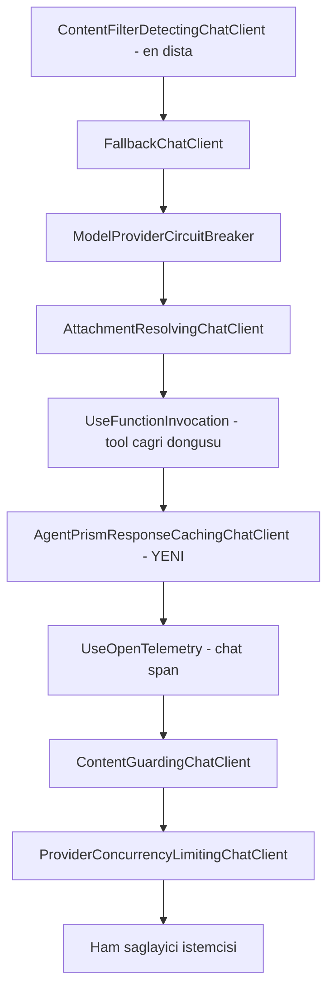
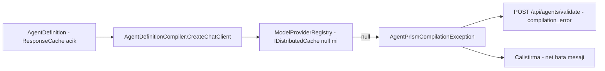

# Faz 81 — Yanıt Önbelleği ve Eşzamanlı Tool Çağrısı

> **Durum:** 📋 Planlandı (2026-08-21)
> **Kaynak:** [ADAYLAR.md](ADAYLAR.md) · **F-45**, **F-134** — Dalga 13 Küme B
> **Önkoşul:** [Faz 62](62-MODEL-YEDEK-ZINCIRI-VE-ON-UCUS-DENETIMI.md) — halka sırası kuralı ve `ModelBinding` bayrak emsali oradan gelir
> **Paketler:** `AgentPrism.Abstractions`, `AgentPrism.Core`
> **🚨 Plan sonrası sürüm değişimi:** Plan MAF 1.16.0 · MEAI 10.8.3'e karşı yazıldı; depo 2026-08-21'de **MAF 1.18.0 · MEAI 10.9.0 · MCP 2.2.0**'a yükseldi (K-543, K-544). İki etkisi vardır ve ikisi de §81.5 ile §81.1'dedir: eşzamanlı tool bayrağının **ikinci bir evi** doğdu, ve MEAI 10.9.0 kendi yönlendirme/yedek istemcilerini getirdi (`RoutingChatClient` ailesi) — bu faz onları kullanmaz, ama halka sırası kararı verilirken bilinmelidir
> **Yeni paket:** Yok — `Microsoft.Extensions.Caching.Abstractions` 10.0.10 `AgentPrism.Core`'un grafiğinde **zaten var** (üç TFM'de de, `Microsoft.Extensions.AI` üzerinden; ölçüldü 2026-08-21) · **Migration:** Yok — `ModelBinding` `jsonb` sütununa bütün olarak serileşir
> **Public API:** Büyüyor — iki `ModelBinding` alanı, bir `sealed record`, bir `public class`. `PublicAPI.Shipped.txt` dosyalarının toplamı **16 satır** (yalnız başlık satırları; ölçüldü) → Faz 7'den önce eklemek ucuzdur, sonra bir sürüm kararıdır
> **Tüketici yüzeyi:** `docs-site/` → `guides/model-providers.md` (önbellek), `guides/reliability.md` (önbelleğin devre kesici ve yedek zincirle ilişkisi), `concepts/tools.md` §"Authorization and timeout" kardeşi (eşzamanlı çağrı), `capabilities.md` §"Agent design and model control" tablosuna iki satır
> · sevk edilen: `ModelBinding` XML dokümanı (yeni alanlar), `src/AgentPrism.Core/README.md`. `api/` ve `http-api/schema-modelbinding.md` **üretilir** — orada iş XML dokümanıdır
> **Manuel test alanı:** [`docs/manuel-test/27-MODEL-YEDEK-VE-ON-UCUS.md`](manuel-test/27-MODEL-YEDEK-VE-ON-UCUS.md) (`MYU`) — ikisi de `ModelBinding` + `ModelProviderRegistry` yüzeyidir

---

## Bu Faza Başlarken

> `faz-baslangic` skill'ini uygula. Aşağıdaki liste o skill'in 2. adımıdır —
> **tamamını değil, yalnız işaret edilen bölümleri oku.**

1. Bu doküman
2. Kararlar — dosyanın tamamını **okuma**, yalnız bu kalemleri grep'le:
   ```bash
   grep -n "K-320\|K-380\|K-443\|K-471\|K-525\|K-007" docs/KARARLAR.md
   ```
   **K-320** (boru hattının tamamını `ModelProviderRegistry` kurar; halka sırası
   kararı orada verilir), **K-443** (bir halkanın içeride mi dışarıda mı
   duracağının gerekçelendirilme biçimi — bu fazın 81.1'i onun aynısıdır),
   **K-380** (kiracı, derlenmiş agent önbelleğinin anahtarına eklendi),
   **K-471** (kiracı credential'ı gömülü agent önbelleğe **alınmaz**),
   **K-525** (kiracı verisi tutan cache anahtarı **tipli** olur; elle
   birleştirilen string yasak), **K-007** (yeni paket gerekçesi).
3. [`62-MODEL-YEDEK-ZINCIRI-VE-ON-UCUS-DENETIMI.md`](62-MODEL-YEDEK-ZINCIRI-VE-ON-UCUS-DENETIMI.md) — yalnız devir notu:
   ```bash
   awk '/## Sonraki Faza Devir Notu/,0' docs/62-MODEL-YEDEK-ZINCIRI-VE-ON-UCUS-DENETIMI.md
   ```
   Bu faz onun sözleşmesini devralır: `ModelBinding` üzerinden agent başına
   boru hattı bayrağı ve `ModelProviderRegistry` içindeki halka sırası.
   🚨 **Faz 79 ve Faz 80 planlandı ama uygulanmadı** — devir notları boştur,
   okuma.
4. Alan hafızası (bu faz üç alana dokunuyor):
   [`hafiza/model-boru-hatti.md`](hafiza/model-boru-hatti.md) (halka sırası ve
   dekoratör tuzakları — özellikle "yerinde değiştirme" maddesi) ·
   [`hafiza/cekirdek-calistirma.md`](hafiza/cekirdek-calistirma.md)
   (`AsyncLocal` tuzağı; F-134'ün kayıtlı riski buydu) ·
   [`hafiza/test-altyapisi.md`](hafiza/test-altyapisi.md) (eşzamanlılık testi
   yazarken kırılganlığı ayırt etme protokolü)
5. Gerektiğinde, tamamı değil ilgili bölümü:
   [`MIMARI.md`](MIMARI.md) §6 (Çalıştırma Yolu)

---

## Amaç

Bu faz model boru hattına **iki opt-in ergonomi anahtarı** ekler. İkisi de aynı
yere takılır — `ModelProviderRegistry`'nin kurduğu zincir — ve ikisi de
varsayılan kapalıdır. Kazanan, deterministik iş yükü koşturan tüketicidir:
aynı soru iki kez sorulduğunda ikinci kez ödemez, ve bir turda birbirinden
bağımsız üç tool çağrıldığında üçünü sırayla beklemez.

- **F-45** — Yanıt önbelleği: `DistributedCachingChatClient` boru hattına
  takılır, anahtar kiracıya ve tool kümesine bağlanır, kayıt süresi sınırlanır.
- **F-134** — `FunctionInvokingChatClient.AllowConcurrentInvocation`'ı agent
  başına açığa çıkarır.

**Bu faz hiçbir hız iddiası yazmaz.** Ne gecikme kazancı ne fatura düşüşü
ölçüldü. İkisi de tüketicinin kendi yükünde ölçeceği şeydir; fazın işi
anahtarı **doğru** vermektir.

### Bugün ne çalışmıyor — doğrulanmış kanıt

| Kanıt | Gözlem |
|---|---|
| `grep -rn "IDistributedCache" src` → **boş** | Yanıt önbelleği hiç yok. Aynı istem iki kez sorulursa iki kez ağa çıkar |
| `grep -rn "AllowConcurrentInvocation" src` → **tek bir yorum** ([`ToolUsageAccumulator.cs:18`](../src/AgentPrism.Core/Recording/ToolUsageAccumulator.cs#L18)) | Bayrak hiçbir yerde `true` değil. Bir turdaki bağımsız tool'lar sırayla koşar |
| [`ModelProviderRegistry.cs:318-320`](../src/AgentPrism.Core/Models/ModelProviderRegistry.cs#L318-L320) | Ekleme noktası ayakta: `.AsBuilder().UseFunctionInvocation(_loggerFactory).UseOpenTelemetry(...)`. K-320'nin merkezî kurulum noktası korunuyor |
| [`ModelBinding.cs`](../src/AgentPrism.Abstractions/Agents/ModelBinding.cs) | `Fallbacks`, `ResponseFormat`, `ReasoningEffort` aynı desendedir: agent başına boru hattı bayrağı buraya konur |
| [`AgentDefinitionPayload.cs:36`](../src/AgentPrism.Sql.Shared/Internal/AgentDefinitionPayload.cs#L36) | `ModelBinding` `jsonb`'ye **bütün olarak** serileşir → yeni alan migration istemez |
| [`AgentDefinitionCompiler.cs:444`](../src/AgentPrism.Core/Compilation/AgentDefinitionCompiler.cs#L444) → [`AgentDefinitionValidator.cs:332`](../src/AgentPrism.Core/Compilation/AgentDefinitionValidator.cs#L332) | Derleyici istemciyi kayıt defterinden alır; `AgentPrismCompilationException` doğrulama ucunda `compilation_error` mesajına dönüşür. Fail-fast yolu **hazır** |

> Kanıtlar 2026-08-21 tarihinde doğrulandı.

### 🚨 Planlama sırasında ölçülen dört şey — ikisi aday kaydını değiştirdi

| Ölçüm | Sonuç |
|---|---|
| **F-134'ün kayıtlı "asıl riski" çürüdü** | `FunctionInvokingChatClient.CurrentContext` `AsyncLocal<FunctionInvocationContext>` ile desteklenir (reflection: `_currentContext`). `AllowConcurrentInvocation = true` ile iki tool gövdesi `Barrier` ile gerçekten çakıştırıldı: hem MEAI'nin ambient'ı hem de gövde içinde yazılan **AgentPrism tarzı bir `AsyncLocal`**, `await` öncesi ve sonrası kendi çağrısının değerini okudu. Ambient bağlam **çağrı başına yalıtılmıştır** |
| **🚨 MEAI'nin varsayılan önbellek anahtarı `ChatOptions.Tools`'u KAPSAMIYOR** | Ölçüldü: `ModelId`, `Temperature`, `ToolMode`, `ChatOptions.Instructions` ve mesajlar anahtarı ayırıyor; **tool kümesi ayırmıyor**. Farklı tool kümesine sahip iki agent aynı kayda düşer. 81.2'nin tamamı bu ölçümden doğdu |
| **`IDistributedCache` sıfır yeni paket** | `Microsoft.Extensions.Caching.Abstractions` 10.0.10 zaten geçişli bağımlılıktır. Yeni paket olan şey `Microsoft.Extensions.Caching.Memory`'dir ve o repoda **hiç yok** — bu yüzden bellek içi yedek seçeneği elendi |
| **`DistributedCachingChatClient` kayıt süresi vermiyor** | Public yüzeyi yalnız `CacheKeyAdditionalValues`, `JsonSerializerOptions` ve devralınan `CoalesceStreamingUpdates` (varsayılan `true`). TTL yok → 81.3 |

---

## 81.1 — Önbelleğin boru hattındaki yeri

Karar **kullanıcıya soruldu (2026-08-21)**: önbellek **tool çağrı döngüsünün
içinde, telemetrinin dışında** durur.



Gerekçe ve bilinçli bedel:

| Neden burada | Bedel |
|---|---|
| **Isabet hiçbir maliyet yazmaz.** Halka telemetrinin dışındadır; isabet eden çağrı `chat` span'i üretmez ve token/maliyet kaydına girmez. Harcama olmadığı için doğru olan budur; Faz 68'in maliyet kırılımı harcanmamış token'ı saymaz | **Isabet content guard'ı da atlar.** Kayıt yazılırken guard koşmuştu; ama kural sonradan değişirse eski yanıt yeniden denetlenmez. 81.3'ün TTL'i bu pencereyi sınırlar ve `docs-site` bunu açıkça yazar |
| **Tool'lar koşmaya devam eder.** Halka döngünün içindedir: isabet eden bir yanıt `FunctionCallContent` taşıyorsa döngü onu yine yürütür. Yan etkili tool sessizce atlanmaz | Bir turda birden çok model çağrısı olur; her biri ayrı ayrı anahtarlanır. Bu daha çok kayıt demektir, ama her biri daha küçük ve daha çok yeniden kullanılabilirdir |
| Halka **koşulludur**: `binding.ResponseCache` `null` veya kapalıysa `ChatClientBuilder`'a hiç eklenmez. Bugünkü davranış birebir korunur (K1) | — |

🚨 **Sıra kuralı `ChatClientBuilder`'da terstir.** İlk `Use` **en dıştaki**
halkadır. Zincir şöyle yazılır ve `UseOpenTelemetry`'nin **önüne** eklenen bir
`Use` telemetrinin dışında kalır:

```csharp
var builder = chatClient.AsBuilder().UseFunctionInvocation(_loggerFactory);

if (binding.ResponseCache is { Enabled: true } cacheSettings)
{
    builder = builder.Use(inner => new AgentPrismResponseCachingChatClient(
        inner, cache, _tenantContext?.TenantId, cacheSettings));
}

chatClient = builder
    .UseOpenTelemetry(_loggerFactory, AgentPrismDiagnostics.ActivitySourceName)
    .Build();
```

---

## 81.2 — 🚨 Önbellek anahtarı: MEAI'nin varsayılanı YETMEZ

**Bu bölüm bir ölçümden doğdu, bir tasarım tercihinden değil.**

`DistributedCachingChatClient.GetCacheKey` mesajları ve `ChatOptions`'ı
karıştırır. Ölçüm (2026-08-21) neyin karıştığını tek tek gösterdi:

| Anahtara giren mi? | Girdi |
|---|---|
| ✅ Ayırıyor | Mesajlar · sistem talimatı · `ChatOptions.Instructions` · `ModelId` · `Temperature` · `ToolMode` · `CacheKeyAdditionalValues` |
| 🚨 **Ayırmıyor** | **`ChatOptions.Tools`** |

Sonuç: aynı kiracıda, aynı talimatla, aynı soruyu soran ama **farklı tool
kümesine** sahip iki agent **aynı önbellek kaydına** düşer. Bu bir performans
kusuru değil, bir yetki sızıntısıdır: isabet eden yanıt, o agent'ın sahip
olmadığı bir tool için `FunctionCallContent` taşıyabilir. `TerminateOnUnknownCalls`
varsayılanı **`false`**'tur (ölçüldü) — yani döngü bunu kesmez.

Ayrıca kiracı da varsayılan anahtarda **yoktur**. K-380 bu sınıfın birebir
tekrarıdır ve K-525 elle birleştirilmiş string anahtarı yasaklar.

### Karar: `GetCacheKey` override edilir, yapılandırmaya güvenilmez

`CacheKeyAdditionalValues` **örnek başına** bir özelliktir ve tool kümesi
**çağrı başına** değişir; o yüzden yalnız o özellik yetmez. Anahtar üç ek
girdiyle zorlanır:

| Ek girdi | Neden |
|---|---|
| `TenantId` | K-380 / K-525. Kiracı A'nın yanıtı B'ye gitmez |
| Tool kimliği — sıralanmış `AITool.Name` listesi | Ölçülen boşluğu kapatır. Farklı yetkiye sahip iki agent ayrışır |
| Sağlayıcı adı (`binding.Provider`) | `ModelId` aynı olabilir; `openai` ile `openai-uyumlu` bir `endpoint` aynı model adını taşıyabilir |

🚨 **Agent adı anahtara KONMAZ** ve bu bilinçlidir. Aynı kiracıda, aynı
talimatı, aynı tool kümesini ve aynı model bağlamasını taşıyan iki agent
davranışsal olarak aynıdır; kaydı paylaşmaları doğrudur. Agent adını eklemek
önbelleği ölçüsüz büyütür ve isabet oranını düşürür.

BYOK (K-471) ayrıca bir şey istemez: kiracı credential'ı kiracı başına
çözülür ve `TenantId` zaten anahtardadır.

---

## 81.3 — Kayıt süresi: MEAI vermiyorsa AgentPrism verir

`DistributedCachingChatClient` bir TTL yüzeyi **açmıyor** (ölçüldü). Kayıt
`IDistributedCache`'e boş bir `DistributedCacheEntryOptions` ile yazılır; süre
tamamen store'un yapılandırmasına kalır. Bu, önbellek anahtarına giren hiçbir
şey değişmediği sürece bir yanıtın **süresiz** yaşaması demektir.

Bu kabul edilmez. İki gerekçe: model sürümü aynı adla değişebilir, ve 81.1'in
bilinçli bedeli (isabet guard'ı atlar) yalnız sınırlı bir pencerede kabul
edilebilir.

**Karar:** `WriteCacheAsync` ve `WriteCacheStreamingAsync` override edilir ve
`AbsoluteExpirationRelativeToNow` uygulanır. Süre `ModelBinding` üzerinden
gelir ve varsayılanı **vardır** — süresiz bir varsayılan sürprizdir (K1).

🚨 **İki override de yazılır.** Akışlı yol ayrı bir metottur; yalnız birini
yazmak akışlı bir `run`'ın kayıtlarını süresiz bırakır. Bu, "imza değiştirmek
ile gövdeyi kullanmak iki ayrı adımdır" kuralının bu fazdaki karşılığıdır.

---

## 81.4 — `IDistributedCache` kayıtlı değilse: derleme anında hata

Karar **kullanıcıya soruldu (2026-08-21)**: sessizce kapalı kalmak yok, bellek
içi yedek yok. Açıkça açılan bir özelliğin çalışmaması sürprizdir.

Bayrak `ModelBinding`'de yaşadığı için hata anı **kurulum (startup) değil,
agent derlemesidir** — bir tanım çalışma anında da oluşturulabilir. Yol zaten
kuruludur:



Hata metni **hangi kaydın eksik olduğunu** söyler; "önbellek çalışmıyor"
demek yetmez. Emsal `ParseReasoningEffort`
([`AgentDefinitionCompiler.cs:654-662`](../src/AgentPrism.Core/Compilation/AgentDefinitionCompiler.cs#L654-L662)):
geçersiz değer sessizce yok sayılmaz, geçerli değerler listelenir.

`ModelProviderRegistry` kurucusuna `IDistributedCache?` eklenir ve
`AgentPrismServiceCollectionExtensions` içindeki açık fabrikada
`provider.GetService<IDistributedCache>()` ile çözülür. AgentPrism
`IDistributedCache`'i **kaydetmez** — kayıt tüketicinin kararıdır (K4).

---

## 81.5 — Eşzamanlı tool çağrısı: ölçülen risk ve kalan iş

Bayrak `ModelBinding.AllowConcurrentToolCalls` olur ve `UseFunctionInvocation`
yapılandırma geri çağrısına geçer:

```csharp
.UseFunctionInvocation(_loggerFactory, fic => fic.AllowConcurrentInvocation = binding.AllowConcurrentToolCalls)
```

> 🚨 **2026-08-21 sürüm yükseltmesi bu tasarımı etkiliyor — plan yazıldıktan
> SONRA ölçüldü.** Depo MAF 1.16.0'dan **1.18.0**'a yükseltildi (K-543 turu) ve
> tam yüzey diff'i şunu buldu: **`ChatClientAgentOptions.AllowConcurrentInvocation`
> artık var.** Yani bayrağın iki olası evi vardır ve **plan anındaki tek ev
> varsayımı geçersizdir**:
>
> | Ev | Nokta | Ne anlama gelir |
> |---|---|---|
> | Boru hattı (planın yazdığı) | [`ModelProviderRegistry.cs:319`](../src/AgentPrism.Core/Models/ModelProviderRegistry.cs#L319) | Bayrak `IChatClient` örneğine bağlanır. `ModelProviderRegistry` istemciyi **kiracı + sağlayıcı** başına önbelleğe alır; agent başına bir bayrak burada agent başına bir istemci örneği demektir |
> | Agent seçenekleri (1.18.0'ın getirdiği) | [`AgentDefinitionCompiler.cs:1050`](../src/AgentPrism.Core/Compilation/AgentDefinitionCompiler.cs#L1050) — `new ChatClientAgentOptions { ... }` | Bayrak **derlenmiş agent'a** bağlanır. `ModelBinding` zaten agent başınadır; `Fallbacks`/`ResponseFormat` ile aynı yolu izler ve istemci önbelleğini bölmez |
>
> **Uygulayan oturum bunu karara bağlamalıdır.** F-45'in önbellek anahtarı da
> aynı soruyu (örnek başına mı, agent başına mı) sorar; ikisi tek fazdadır ve
> cevabın tutarlı olması gerekir. Aynı yükseltme F-134'ün aday kaydındaki
> "agent-seviyesi harness entegrasyonu **doğrulanmadı**" satırını da kapattı —
> yüzey artık ölçüldü.

### Ölçülen: tool katmanı eşzamanlılığa zaten hazır

| Yüzey | Durum (2026-08-21 ölçümü) |
|---|---|
| `FunctionInvokingChatClient.CurrentContext` | `AsyncLocal` tabanlı; çakışan iki gövdede **çağrı başına yalıtık** — probe ile kanıtlandı |
| Gövde içinde yazılan AgentPrism `AsyncLocal`'ı (`AgentPrismRunContext.SetCurrent` deseni) | Aynı probe'ta **yalıtık** |
| [`ToolUsageAccumulator.cs`](../src/AgentPrism.Core/Recording/ToolUsageAccumulator.cs) · [`ToolAuthorizationAccumulator.cs`](../src/AgentPrism.Core/Recording/ToolAuthorizationAccumulator.cs) | İkisi de `ConcurrentDictionary`, `callId` ile anahtarlı |
| [`AgentRunBudget.cs`](../src/AgentPrism.Abstractions/Runs/AgentRunBudget.cs) | `Interlocked` sayaç + son slot için CAS döngüsü; XML dokümanı eşzamanlı alt `run`'ı zaten anlatıyor |
| Skill script'leri | `SkillScriptConcurrencyLimiter` zaten var ([`SandboxedSkillScriptRunner.cs:57`](../src/AgentPrism.Core/Skills/Scripts/SandboxedSkillScriptRunner.cs#L57)) |

### 🚨 Ölçülen tek çatlak — ve neden bugün kapalı

`ToolInvocationTracker` **thread-safe değildir** (düz `Dictionary`; sınıfın
kendi XML dokümanı bunu yazıyor). Bayrak bunu **açmaz**, çünkü sınıf eşzamanlı
yoldan çağrılmaz: `RunRecordingAgent`'ın **tek okuma döngüsü** sürer
([`RunRecordingAgent.cs:1092`](../src/AgentPrism.Core/Recording/RunRecordingAgent.cs#L1092) ve
[`:1109`](../src/AgentPrism.Core/Recording/RunRecordingAgent.cs#L1109)) — tool
gövdeleri değil.

**Bu, akıl yürütmeyle kanıtlanmış bir iddiadır; fazın işi onu testle
sabitlemektir.** Eğer bir gün kayıt yolu tool gövdesinden sürülürse bu cümle
sessizce yanlışlanır. Hata modu tablosundaki `ToolInvocationTracker` satırı
tam olarak bunu kilitler.

---

## Planlanan Public API

> Taslak imzalardır. Gerçekleşen imzalar kapanışta ayrı bir bölüme yazılır.

```csharp
// AgentPrism.Abstractions — ModelBinding'e iki alan
public sealed record ModelBinding
{
    /// <summary>Response caching for this agent. Disabled when null.</summary>
    public ResponseCacheSettings? ResponseCache { get; init; }

    /// <summary>Whether independent tool calls in one turn may run at the same time.</summary>
    public bool AllowConcurrentToolCalls { get; init; }
}

// AgentPrism.Abstractions — yeni sözleşme tipi
public sealed record ResponseCacheSettings
{
    /// <summary>Whether the cache ring is added to the pipeline.</summary>
    public bool Enabled { get; init; }

    /// <summary>How long a cached response stays valid.</summary>
    public TimeSpan Lifetime { get; init; } = TimeSpan.FromMinutes(10);
}

// AgentPrism.Core — anahtarı zorlayan alt sınıf
public sealed class AgentPrismResponseCachingChatClient : DistributedCachingChatClient
{
    public AgentPrismResponseCachingChatClient(
        IChatClient innerClient,
        IDistributedCache storage,
        string? tenantId,
        ResponseCacheSettings settings);

    protected override string GetCacheKey(
        IEnumerable<ChatMessage> messages,
        ChatOptions? options,
        params ReadOnlySpan<object?> additionalValues);

    protected override Task WriteCacheAsync(string key, ChatResponse value, CancellationToken cancellationToken);

    protected override Task WriteCacheStreamingAsync(string key, IReadOnlyList<ChatResponseUpdate> value, CancellationToken cancellationToken);
}
```

`ModelProviderRegistry` kurucusuna `IDistributedCache? distributedCache = null`
parametresi eklenir. Kurucu zaten varsayılan değerli parametrelerle
büyüyor ve DI kaydı **açık fabrika** kullanıyor — yeni parametre o fabrikaya
bir satır ekler.

🚨 `ResponseCacheSettings` ve iki `ModelBinding` alanı **bugün eklemek
bedavadır**; Faz 7'den sonra `sealed record`'a alan eklemek kırıcıdır.

### HTTP `endpoint`'leri

Yeni uç **yok**. `ModelBinding` zaten `POST /api/agents` ve
`POST /api/agents/validate` gövdesindedir; iki yeni alan o sözleşmeye
kendiliğinden girer. `http-api/schema-modelbinding.md` **üretilir**.

### Arayüz payı

Yok. Bu faz arayüze dokunmaz. Bayraklar bugün yalnız kod ve HTTP tanımı
üzerinden seçilir; arayüz düzenleyicisine eklemek ayrı bir kalemdir
(Açık Sorular #2).

---

## Planlanan Dosya Listesi

```
src/AgentPrism.Abstractions/
├── Agents/
│   ├── ModelBinding.cs                          (değişir — iki alan)
│   └── ResponseCacheSettings.cs                 (yeni)

src/AgentPrism.Core/
├── Models/
│   ├── ModelProviderRegistry.cs                 (değişir — halka + fail-fast)
│   └── AgentPrismResponseCachingChatClient.cs   (yeni)
├── Diagnostics/
│   └── AgentPrismMetrics.cs                     (değişir — isabet/ıska sayacı)
└── AgentPrismServiceCollectionExtensions.cs     (değişir — IDistributedCache çözümü)

src/AgentPrism.Sql.Shared/
└── Internal/AgentDefinitionPayload.cs           (değişmez — ModelBinding bütün serileşir)

tests/
├── AgentPrism.Core.UnitTests/Models/
│   ├── ResponseCacheKeyTests.cs                 (yeni)
│   └── ResponseCacheLifetimeTests.cs            (yeni)
└── AgentPrism.Api.FunctionalTests/
    ├── ResponseCachePipelineTests.cs            (yeni)
    └── ConcurrentToolInvocationTests.cs         (yeni)
```

Test proje adları uygulama anında var olan adlarla eşleştirilir; yukarıdakiler
yerleşimi gösterir, dosya adını dayatmaz.

---

## Hata Modları ve Testler

> Mutlu yoldan değil, **ne bozulabilir**den türetilir. Seviyeyi plan seçer.
> Sınır geçen davranış (DI · HTTP · kiracı · akış · depo · paket) birim
> testiyle kanıtlanamaz — `faz-uygulama` Adım 2.

| Ne bozulabilir | Seviye | Test sınıfı |
|---|---|---|
| 🚨 Farklı tool kümesine sahip iki agent aynı kayda düşer (**ölçülen boşluk**) | Birim | `ResponseCacheKeyTests` |
| 🚨 Başka kiracının önbelleklenmiş yanıtı görünür | Sözleşme (`TenantIsolationContract`) | dört koşumda birden |
| Aynı kiracı + aynı tool kümesi + aynı istem **isabet ETMEZ** (anahtar aşırı ayrıştı) | Birim | `ResponseCacheKeyTests` |
| Kayıt süresiz yaşar — **akışlı** yolda override unutuldu | Birim | `ResponseCacheLifetimeTests` |
| Isabet eden çağrı `chat` span'i veya token kaydı yazar (81.1 bozuldu) | Fonksiyonel | `ResponseCachePipelineTests` |
| Isabet eden yanıttaki `FunctionCallContent` yürütülmez (halka döngünün dışına kaydı) | Fonksiyonel | `ResponseCachePipelineTests` |
| `ResponseCache.Enabled` açık, `IDistributedCache` kayıtlı değil → sessiz devam | Fonksiyonel | `ResponseCachePipelineTests` |
| `ResponseCache` `null` iken boru hattı **değişir** (K1 ihlali; fazladan halka veya fazladan `if`) | Fonksiyonel | `ResponseCachePipelineTests` |
| `run` iptal edilirken önbelleğe yazma askıda kalır | Fonksiyonel | `ResponseCachePipelineTests` |
| `IDistributedCache` hata verirse `run` durur (gözlemlenebilirlik işlevselliği bozmaz kuralı) | Fonksiyonel | `ResponseCachePipelineTests` |
| Boş mesaj listesi veya aşırı büyük yanıt (`IDistributedCache` boyut sınırı) | Birim | `ResponseCacheLifetimeTests` |
| 🚨 `AllowConcurrentToolCalls` açıkken tool kaydı bozulur — `ToolInvocationTracker` yarışa girer | Fonksiyonel | `ConcurrentToolInvocationTests` |
| Eşzamanlı gövdelerde yetkilendirme reddi yanlış çağrıya bağlanır (`callId` karışır) | Fonksiyonel | `ConcurrentToolInvocationTests` |
| Eşzamanlı gövdelerde tool metriği yanlış çağrıya yazılır (`AgentPrismToolUsage.Report`) | Fonksiyonel | `ConcurrentToolInvocationTests` |
| Eşzamanlı alt agent çağrılarında bütçe sayacı kayar | Fonksiyonel | `ConcurrentToolInvocationTests` |
| Bir tool gövdesi iptal edilirken diğeri koşmaya devam eder | Fonksiyonel | `ConcurrentToolInvocationTests` |
| `AllowConcurrentToolCalls` kapalıyken sıra garantisi **korunur** | Fonksiyonel | `ConcurrentToolInvocationTests` |

🚨 **Eşzamanlılık testi gerçekten çakışmalıdır.** `Task.Delay` ile "muhtemelen
çakışır" demek test tiyatrosudur. Planlama probe'unda kullanılan desen
`Barrier`'dır: iki gövde de barajda buluşmadan hiçbiri ilerleyemez, yani
çakışma **garantidir**. Testler bu deseni kullanır.

Kiracı yalıtımı sözleşme testi `tests/Shared/Contracts/` altına girer — hem
bellek içi hem üç SQL sağlayıcısı üzerinde koşar.

---

## Manuel Kabul Case'leri

> Kapanışta [`docs/manuel-test/27-MODEL-YEDEK-VE-ON-UCUS.md`](manuel-test/27-MODEL-YEDEK-VE-ON-UCUS.md)
> içine eklenecek case'lerin taslağı (`MYU` alan kodu, mevcut 9 case'in
> devamı). Otomatikleştirilebilenler kapanışta koşulur.

| # | Ön koşul | Adımlar | Beklenen sonuç |
|---|---|---|---|
| 1 | `samples/AgentPrism.Api`, `AddDistributedMemoryCache()` kayıtlı, bir agent `ResponseCache.Enabled = true` | Aynı istemi iki kez `POST /api/agents/{ad}/run` ile gönder | İkinci yanıt aynı; ikinci `run`'ın `usage` token'ları **sıfır** ve `chat` span'i yok |
| 2 | Case 1'in kurulumu | `AgentPrism:...:Lifetime` süresi dolduktan sonra aynı istemi tekrar gönder | Yanıt yeniden modelden gelir; token kaydı yeniden dolu |
| 3 | Aynı talimatlı iki agent, **farklı** `ToolNames` | İkisine de aynı istemi gönder | İkinci agent birincinin kaydını **almaz**; kendi tool kümesiyle koşar |
| 4 | İki kiracı, aynı agent adı, aynı istem | Kiracı A'ya sor, sonra kiracı B'ye sor | B modele çıkar; A'nın yanıtını görmez |
| 5 | `ResponseCache.Enabled = true`, `IDistributedCache` **kayıtlı değil** | `POST /api/agents/validate` gövdesinde tanımı doğrula | `compilation_error` döner ve mesaj eksik kaydı adıyla söyler |
| 6 | Bağımsız üç tool'u olan bir agent, `AllowConcurrentToolCalls = true` | Üçünü de çağıran bir istem gönder | Üç `tool_invocations` kaydı da doğru ad, argüman ve sonuçla yazılır; hiçbiri `unknown` değil |
| 7 | Case 6'nın agent'ı, bayrak **kapalı** | Aynı istemi gönder | Kayıtlar aynı; davranış Faz 80 öncesiyle birebir aynı |

---

## Açık Sorular

> Planı bloklamayan, faz uygulanırken karara bağlanacak sorular. Bloklayan
> dört soru plan yazılmadan önce soruldu ve cevaplandı (81.1, 81.4, bayrak
> evi, F-134 kapsamı).

| # | Soru | Seçenekler | Öneri |
|---|---|---|---|
| 1 | Önbellek isabeti hangi sinyalle görünür olsun? | A: `AgentPrismMetrics`'e `agentprism.model.cache` sayacı (`hit`/`miss` etiketi) · B: ayrıca bir `RunEventType` · C: yalnız log | **A.** Sayaç ucuzdur ve `dotnet-counters` ile okunur. Yeni bir `RunEventType` sözleşme genişletir ve arayüz tarafı ister; isabet bir olay değil bir ölçüdür |
| 2 | Arayüzün agent düzenleyicisi bu iki bayrağı göstersin mi? | A: bu fazda hayır · B: evet | **A.** Faz arayüze dokunmuyor ve bundle payı doğurmuyor. Arayüz alanı ayrı bir kalemdir; `ModelBinding`'in `Fallbacks` alanı da aynı yolu izledi |
| 3 | `Lifetime` varsayılanı ne olsun? | A: 10 dakika · B: 1 saat · C: zorunlu alan, varsayılan yok | **A**, ama uygulama anında `docs-site` metniyle birlikte gözden geçirilir. Ölçülmemiş bir değerdir; kısa varsayılan yanlış olduğunda ucuz, uzun varsayılan yanlış olduğunda pahalıdır |
| 4 | Önbellek akışlı (`streaming`) yolda da açık mı olsun? | A: evet, `CoalesceStreamingUpdates` varsayılanı (`true`) korunur · B: yalnız akışsız yol | **A.** İki yol da aynı anahtarı kullanır ve 81.3 ikisini de kapsar. B seçilirse akışlı bir `run` sessizce hiç isabet etmez ve bu sürpriz olur |
| 5 | `AllowConcurrentToolCalls` açıkken eşzamanlılık **sınırı** gerekir mi? | A: hayır, MEAI'nin kendi davranışı · B: bir üst sınır alanı | **A.** Bir turdaki tool sayısı modelin ürettiği çağrı sayısıyla sınırlıdır ve sağlayıcı eşzamanlılığı zaten `AgentPrismModelConcurrencyOptions` ile sınırlanır. İkinci bir sınır ölçülmemiş bir ihtiyaçtır |

---

## Bitiş Ölçütleri (DoD)

- [ ] Aynı istem iki kez sorulduğunda ikinci `run` modele **çıkmaz**; `usage` token'ları sıfır ve `chat` span'i yok — `samples/AgentPrism.Api` üzerinde ölçüldü ve çıktı belgeye yazıldı
- [ ] Farklı tool kümesine sahip iki agent aynı önbellek kaydını **paylaşmaz** — düşen bir testle önce kanıtlandı, sonra geçti
- [ ] Başka kiracının önbelleklenmiş yanıtı görünmez — `TenantIsolationContract` dört koşumda da yeşil
- [ ] Önbellek kaydı `Lifetime` sonunda geçersizleşir; akışlı ve akışsız yolun **ikisinde de**
- [ ] `ResponseCache.Enabled` açıkken `IDistributedCache` yoksa `POST /api/agents/validate` `compilation_error` döner ve mesaj eksik kaydı adıyla söyler
- [ ] `ResponseCache` `null` ve `AllowConcurrentToolCalls` `false` iken boru hattı bugünküyle **birebir aynı** (K1)
- [ ] `AllowConcurrentToolCalls` açıkken üç eşzamanlı tool'un kaydı, metriği ve yetkilendirme kararı doğru çağrıya bağlanır — çakışma `Barrier` ile garanti edildi
- [ ] Dört doğrulama kapısı sıfır uyarı verir
- [ ] `samples/AgentPrism.Api` ile gerçek `run` yapıldı, çıktı belgeye yazıldı
- [ ] `secret` taraması boş döndü
- [ ] Manuel kabul case'leri `docs/manuel-test/27-MODEL-YEDEK-VE-ON-UCUS.md` içine eklendi; otomatikleştirilebilenler koşuldu
- [ ] `faz-denetim` koşuldu; 🔴 bulgu kalmadı
- [ ] `docs-site/` güncellendi (`guides/model-providers.md`, `guides/reliability.md`, `concepts/tools.md`, `capabilities.md`); `npm run build` + `check-links.mjs` temiz
- [ ] `tuketici-dokuman-senkronu` koşuldu — bu faz sevk edilen bir yüzeye dokunuyor

### Doğrulama komutları

```bash
# Ayni istemi iki kez sor; ikinci yanit onbellekten gelmeli.
curl -s -X POST http://localhost:5081/agentprism/api/agents/cached/run \
  -H 'Content-Type: application/json' -d '{"message":"What is 2+2?"}' | jq '.usage'
curl -s -X POST http://localhost:5081/agentprism/api/agents/cached/run \
  -H 'Content-Type: application/json' -d '{"message":"What is 2+2?"}' | jq '.usage'

# IDistributedCache kayitli degilken tanim dogrulamasi net hata dondurmeli.
curl -s -X POST http://localhost:5081/agentprism/api/agents/validate \
  -H 'Content-Type: application/json' \
  -d '{"name":"cached","model":{"provider":"openai","model":"gpt-5.4-mini","responseCache":{"enabled":true}}}' | jq '.messages'

# Onbellek isabet/iska sayaci.
dotnet-counters monitor --counters AgentPrism -p <pid>
```

---

## Riskler

| Risk | Önlem |
|------|-------|
| 🚨 Önbellek anahtarı tool kümesini kaçırır → agent'lar arası yanıt sızıntısı | 81.2 `GetCacheKey` override'ı; düşen test **önce** yazılır. Ölçüm 2026-08-21'de yapıldı ve boşluk gerçektir |
| Isabet content guard'ı atlar; guard kuralı değişince eski yanıt yeniden denetlenmez | 81.3'ün TTL'i pencereyi sınırlar. `docs-site/guides/model-providers.md` bunu açıkça yazar — sessiz bırakılmaz |
| Önbelleklenen yanıt JSON turundan geçer; `ChatResponse.RawRepresentation` isabet sonrası `null` olur | Ölçüldü: AgentPrism yanıt `RawRepresentation`'ını hiçbir yerde **okumuyor** (yalnız `ContentGuardingChatClient` temizliyor). Yine de `docs-site`'a bir cümle yazılır |
| Bir dekoratör önbellekten gelen nesneyi **yerinde** değiştirir ve kaydı kalıcı bozar | `docs/hafiza/model-boru-hatti.md` bu tuzağı zaten yazıyor ve önbellekleyen istemciyi adıyla anıyor. Halka eklendikten sonra o madde yeniden okunur |
| `ToolInvocationTracker` bir gün tool gövdesinden sürülürse eşzamanlılık onu bozar | Hata modu tablosundaki satır bu varsayımı testle kilitler; varsayım yanlışlanırsa test kırmızıya döner |
| Eşzamanlılık testi çakışmadan geçer (test tiyatrosu) | `Barrier` deseni zorunludur; `Task.Delay` ile "muhtemelen çakışır" kabul edilmez |
| `IDistributedCache` uygulaması boyut sınırı koyar; büyük yanıt sessizce yazılamaz | Hata modu tablosunda satırı var. Yazma hatası `run`'ı durdurmaz, loglanır — "gözlemlenebilirlik işlevselliği bozmaz" kuralının önbellek karşılığı |

---

<!-- ============================================================
     AŞAĞISI KAPANIŞTA DOLDURULUR — `faz-tamamlama` skill'i.
     Plan anında boş kalır. Başlıkları SİLME.
     ============================================================ -->

## Plandan Sapmalar

> Kapanışta doldurulur. Plan ile gerçek arasındaki fark **gizlenmez** — sonraki
> oturumun en değerli bilgisidir.

## Bu Fazda Verilen Kararlar

> Kapanışta doldurulur. K-NNN numaraları burada alınır; plan numara rezerve etmez.

## Gerçekleşen Public API

> Kapanışta doldurulur. Koddaki **gerçek** imzalar.

## Dosya Listesi (gerçekleşen)

> Kapanışta doldurulur.

## Denetim Bulguları

> Kapanışta doldurulur — `faz-denetim` çıktısı. Her satır: bulgu · seviye
> (🔴/🟡/🟢) · sonuç (düzeltildi / gerekçelendi / F-NN olarak devredildi).
> Bulgu yoksa "🔴 ve 🟡 yok" yazılır; boş bırakılmaz.

## Sonraki Faza Devir Notu

> Kapanışta doldurulur: devralınan sözleşmeler, bilinen tuzaklar (🚨), yarım
> kalan işler, sıradaki faz.
