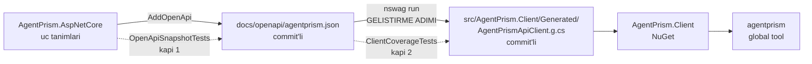

# Faz 83 — Tipli Yönetim İstemcisi ve CLI

> **Durum:** ✅ Tamamlandı (2026-08-22)
> **Kaynak:** [ADAYLAR.md](ADAYLAR.md) · **F-50** — Dalga 13 Küme E (birinci yarı)
> **Önkoşul:** [Faz 40](arsiv/fazlar/40-OPENAPI-YAYINI.md) — üretim kaynağı olan OpenAPI belgesi ve onu koda bağlayan `OpenApiSnapshotTests` oradan gelir · [Faz 67](67-ISTEGE-BAGLI-MIGRATION-SETI.md) — `MigrationRunner`'ın set kavramı ve `AutoApplyMigrations` sözleşmesi
> **Paketler:** `AgentPrism.Client` (**yeni**), `AgentPrism.Cli` (**yeni**)
> **Yeni paket:** İki tane — gerekçe **§83.7** · **Migration:** **Yok** — bu faz migration *çalıştırır*, migration *yazmaz*
> **Public API:** Büyüyor — ama tamamı **üretilmiş**tir. `PublicAPI.Shipped.txt` toplamı **16 satır** (yalnız başlıklar; `wc -l src/*/PublicAPI.Shipped.txt` ile ölçüldü 2026-08-21) → Faz 7'den önce eklemek **bedava**, sonra bir sürüm kararıdır
> **Tüketici yüzeyi:** `docs-site/` → yeni `guides/cli.md`, `packages.md` (iki yeni satır), `capabilities.md`, `getting-started/persistence.md` (migration'ı ayrı adım olarak koşma), `reference/versioning.md` (istemci–sunucu sürüm eşleşmesi)
> · sevk edilen: `src/AgentPrism.Client/README.md` ve `src/AgentPrism.Cli/README.md` (**yeni**, `PackageReadmeFile` zorunlu), `AgentPrismClientOptions` XML dokümanı, kök `README.md` paket tablosu. `api/` ve `http-api/` **üretilir**
> **Manuel test alanı:** `docs/manuel-test/34-ISTEMCI-VE-CLI.md` — **yeni dosya**, alan kodu `CLI`. Kapanışta `faz-tamamlama` oluşturur ve [`00-INDEKS.md`](manuel-test/00-INDEKS.md) §7 tablosuna `34` satırını yazar — planın "son sıra 32" varsayımı bayattı, kapanışta `33` zaten Faz 80 tarafından alınmıştı

---

## Bu Faza Başlarken

> `faz-baslangic` skill'ini uygula. Aşağıdaki liste o skill'in 2. adımıdır —
> **tamamını değil, yalnız işaret edilen bölümleri oku.**

1. Bu doküman
2. Kararlar — dosyanın tamamını **okuma**, yalnız bu kalemleri grep'le:
   ```bash
   grep -n "K-006\|K-007\|K-039\|K-040\|K-059\|K-263\|K-421\|K-511" docs/KARARLAR.md docs/arsiv/KARARLAR-INDEKS-ARSIV.md
   ```
   **K-006** (AOT uyumu katman bazlıdır — hangi paketin söz verdiğini belirler),
   **K-007** (yeni paket ve geçişli ağırlık gerekçe ister),
   **K-039** (kütüphane OpenAPI üretimini dayatmaz — belge tüketicinin uygulamasında üretilir),
   **K-040** (enum'lar JSON'a **ad** olarak yazılır — üretilen istemcinin enum eşlemesi buna bağlıdır),
   **K-059** (`secret` dosyaya **ve** veritabanına yazılmaz — CLI'ın token ve bağlantı dizesi işleyişini bu belirler),
   **K-263** (`TargetFrameworks` çoğulu boşaltma deseni — global tool tek TFM ister),
   **K-421** (public API takibi açık ama `Shipped.txt` boş),
   **K-511** (`docs/openapi/agentprism.json` `AgentPrism.AspNetCore`'a **kaynağından** girer).
3. [`82-ICERIK-KORUMASI.md`](82-ICERIK-KORUMASI.md) — yalnız devir notu:
   ```bash
   awk '/## Sonraki Faza Devir Notu/,0' docs/82-ICERIK-KORUMASI.md
   ```
   Faz 82 kayıt içeriğini şifreler. Bu fazın **doğrudan** bağı yoktur, ama
   `MigrationRunner` yolu ortaktır: içerik koruması bir migration eklediyse CLI
   onu da uygulamak zorundadır.
4. Alan hafızası (bu faz üç alana dokunuyor):
   [`hafiza/paketleme-ve-dagitim.md`](hafiza/paketleme-ve-dagitim.md) (yeni paket, `PackAsTool`, `IncludeBuildOutput` tuzakları) ·
   [`hafiza/build-ve-analyzer.md`](hafiza/build-ve-analyzer.md) (AOT kaçış merdiveni, `TreatWarningsAsErrors`, analyzer bastırma) ·
   [`hafiza/sql-saglayicilari.md`](hafiza/sql-saglayicilari.md) (`MigrationRunner` üç sağlayıcıda **ayrı CLR tipidir** — K-176)
5. Gerektiğinde, tamamı değil ilgili bölümü:
   [`MIMARI.md`](MIMARI.md) bölüm 2 (katman grafiği — bu faz grafiğe iki düğüm ekler)

---

## Amaç

AgentPrism'in yönetim API'sini bugün yalnız elle yazılmış HTTP çağrısıyla
kullanabilirsin. Tipli bir yol yoktur. Ayrıca migration **yalnız uygulama
açılırken** uygulanır; bir CI/CD hattı şemayı ayrı bir adımda hazırlamak
isterse çalıştıracak araç yoktur — `MigrationHostedService`'in kendi XML
dokümanı bu yolu **vaat ediyor** ama aracı yok.

Bu faz iki paket sevk eder: OpenAPI belgesinden üretilen tipli bir istemci ve
onu ilk tüketen bir global tool.

- **F-50** — `AgentPrism.Client` (üretilmiş, AOT uyumlu) + `agentprism` global
  tool'u (`migrate` · `migrate status` · `health`).

### Kapsam dışı — kaydın iddiası ölçüldü ve düştü

🚨 F-50'nin kapsam cümlesi **"tanım dışa/içe aktar (F-48)"** diyor. Bu iş
**yapılamaz ve plana girmez**: F-48 (GitOps tanım dışa/içe aktarımı) 2026-08-21
turunda **elenmiş** bir adaydır ve karşılığı olan uç yoktur. Ölçüldü —
belgedeki 123 yolun `export`/`import` içeren tek satırı
`/agentprism/api/data-subjects/{id}/export`'tur ve o Faz 64'ün veri konusu
hakları ucudur, tanım aktarımı değildir. CLI'ın bu komutu F-48 plana dönerse
gelir.

Küme E'nin ikinci yarısı (**F-93** — TypeScript istemcisi ve npm) **bu fazda
değildir**; ayrı bir yayın kanalı ve ayrı kimlik bilgisi ister. Devir notuna
yazılır ve Faz 84 olarak planlanır.

### Bugün ne çalışmıyor — doğrulanmış kanıt

| Kanıt | Gözlem |
|---|---|
| `AgentPrism.slnx:4-21` | 18 kaynak paketi var; **`AgentPrism.Client` yok**, CLI yok |
| [`MigrationHostedService.cs:13-16`](../src/AgentPrism.Sql.Shared/Migrations/MigrationHostedService.cs) | XML dokümanı aynen şunu diyor: *"`MigrationRunner` can be run as a separate deployment step."* — **çalıştıracak araç yok** |
| [`MigrationRunner.cs:45`](../src/AgentPrism.Sql.Shared/Migrations/MigrationRunner.cs) | `ApplyAsync` ve `GetSnapshotAsync` **public**; ctor **`internal`**. Dışarıdan `new` edilemez, yalnız DI ile çözülür |
| [`ci.yml:154-179`](../.github/workflows/ci.yml) | `publish` işi yalnız **NuGet.org**'a yayınlar (`v*` etiketi, `nuget` environment'ı). Bu faz **aynı** hattı kullanır; yeni kimlik bilgisi istemez |
| `docs/openapi/agentprism.json` | OpenAPI **3.1.1** · **123** yol · **160** operasyon · **250** şema · `operationId` eksik operasyon **0** · **22** tag. Üretim kaynağı olarak yeterli |
| [`OpenApiSnapshotTests.cs:40`](../tests/AgentPrism.AspNetCore.FunctionalTests/OpenApiSnapshotTests.cs) | Commit'lenmiş belge koddan sapınca test kızarıyor. Üretim kaynağının **kendi kapısı var** |
| `.config/dotnet-tools.json` | Yerel araç manifesti **var** (`docfx` 2.78.5). Üreteci geliştirme adımı olarak eklemenin yeri hazır |

> Kanıtlar 2026-08-21 tarihinde doğrulandı.

---

## 83.1 — Üretim yöntemi: NSwag → commit → kapı

Belge 160 operasyon ve 250 şema taşır. Bu elle yazılmaz. Üç yol tartıldı; seçim
👤 kullanıcı kararıdır (2026-08-21):

| Yol | Neden seçilmedi / seçildi |
|---|---|
| **NSwag → üretilen kod repo'ya commit + kapı** | ✅ **Seçildi.** Üreteç bir **geliştirme adımıdır**, tüketicinin derleme hattında yoktur. Tüketicinin bağımlılık grafiğine **sıfır** yeni paket girer |
| Kiota | ❌ Tüketicinin grafiğine `Microsoft.Kiota.Abstractions` + `Http.HttpClientLibrary` + serileştirme paketleri girer. K-007 gerekçesi ister; Faz 27 emsali (37 paket → ertelendi, K-212) |
| Elle yazılmış dar yüzey | ❌ 160 operasyonun ~10'unu kapsar; "tipli yönetim istemcisi" vaadini karşılamaz |

Akış:



**Üreteç nereye kaydedilir.** `.config/dotnet-tools.json` içine yerel araç
olarak eklenir — `docfx` ile aynı desen. Sürüm `rollForward: false` ile
sabitlenir. `dotnet build` bu aracı **çağırmaz**; üretim elle koşulur:

```bash
dotnet tool restore
dotnet nswag run nswag.json        # kok dizinde
```

**Neden byte-diff kapısı değil.** Üretimi teste sokmak `dotnet test`'i NSwag'a
bağımlı yapar ve dört kapının koşum süresini üreteç sürümüne bağlar. Bunun
yerine **davranışsal** bir kapı seçildi (83.2).

---

## 83.2 — Kapı: `operationId` kapsaması

`ClientCoverageTests` (`tests/AgentPrism.Client.UnitTests`) belgedeki her
`operationId` için istemcide karşılık gelen bir public metot bulunduğunu
kanıtlar. Belge büyüdüğünde ve istemci yeniden üretilmediğinde test **kızarır**.

Kapı bu şekli seçer çünkü asıl kaçırılacak şey budur: bir sonraki faz yeni bir
uç ekler, `OpenApiSnapshotTests` belgeyi güncelletir, ama istemci sessizce
eskir. Byte-diff bunu da yakalardı; ama `operationId` kapsaması aynı kaybı
üreteci teste sokmadan yakalar.

Muafiyet dosyası **yoktur**. Bugün belgede `operationId` eksik operasyon
**sıfırdır** (ölçüldü); yani kapı ilk günden tam kapsamayla başlar.

---

## 83.3 — 🚨 Yol öneki tuzağı: belge `/agentprism` ile sabittir

Ölçüldü: belgedeki **123 yolun 123'ü** `/agentprism` ile başlıyor (118'i
`/agentprism/api`, 5'i `/agentprism/v1`). Ama `MapAgentPrism` öneki
**parametredir** — [`AgentPrismEndpointRouteBuilderExtensions.cs:16`](../src/AgentPrism.AspNetCore/AgentPrismEndpointRouteBuilderExtensions.cs)
`DefaultPrefix = "/agentprism"` yalnız varsayılandır ve `:59` onu
`string prefix = DefaultPrefix` olarak alır.

Üretilen istemci yolları olduğu gibi alırsa, öneki değiştirmiş **her tüketicide
sessizce 404 verir.** Belge bunu kendi `info.description`'ında zaten söylüyor:
*"Every path below is relative to the prefix passed to MapAgentPrism."*

**Tasarım.** Üretimden önce belgenin bir kopyasında `/agentprism` öneki
**soyulur**; `BaseAddress` uygulamanın kökü **artı** öneki taşır.

```csharp
// Varsayilan onek
options.BaseAddress = new Uri("https://ornek/agentprism");
// Ozel onek — MapAgentPrism("/control") diyen bir uygulama
options.BaseAddress = new Uri("https://ornek/control");
```

Soyma adımı `nswag.json` öncesinde koşan küçük bir dönüşümdür ve **üretim
akışının parçasıdır**, çalışma anı kodu değildir. Kapı: özel önek altındaki
fonksiyonel test (83.6 tablosu).

---

## 83.4 — 🚨 XML dokümanı: ölçüldü, 321 üye belgesiz kalacak

`Directory.Build.props:23` `TreatWarningsAsErrors=true` ve `:35`
`GenerateDocumentationFile=true`. Yani **CS1591 bir hatadır**: XML dokümanı
olmayan her public üye derlemeyi kırar.

Belgenin açıklama kapsaması ölçüldü (2026-08-21):

| Ne | Toplam | Açıklamasız |
|---|---|---|
| Operasyon | 160 | **0** |
| Şema | 250 | **60** |
| Şema özelliği | 1 185 | **261** |

Yani üretilen kodda **321 üye** XML dokümanı olmadan doğar. Üç seçenek vardı;
plan ikisini birleştirir:

1. **Üretilen dosyada `#pragma warning disable 1591`.** NSwag bunu kendisi
   yazar. Derleme geçer — ama paket, IntelliSense'i boş bir istemci sevk eder.
   Bu tek başına AGENTS.md'nin *"her public üye XML dokümanına sahip olmalıdır"*
   eşiğini **sessizce düşürür**.
2. **Taban çizgisi kapısı.** `client-description-baseline.txt` bugünkü **321**
   açıklamasız üyeyi listeler; `ClientDescriptionBaselineTests` listenin
   yalnız **küçülmesine** izin verir. Bu, deponun kendi idiyomudur —
   `source-language-baseline.txt` ve `capability-example-baseline.txt` aynı
   desendir.
3. Eksik 321 açıklamayı **bu fazda** kaynağına yazmak (sözleşme tiplerinin XML
   dokümanı ve `.Produces` üstverisi). Kapsamı büyütür; Açık Soru 3'tür.

**Plan 1 + 2'yi alır.** Gerekçe: pragma olmadan derleme kırılır, taban çizgisi
olmadan boşluk ölçülemez. Boşluğun kapanması `docs/openapi/agentprism.json`'ı
ve `http-api/` site sayfalarını da düzeltir — yani kaynağa yazılan her açıklama
üç yerde birden kazanır.

---

## 83.5 — CLI: üç komut

`agentprism` global tool'dur (`PackAsTool=true`, `ToolCommandName=agentprism`).

| Komut | Yol | Ne yapar |
|---|---|---|
| `agentprism migrate` | **Doğrudan veritabanı** | Bekleyen migration'ları uygular. Uygulama ayakta olmadan koşar |
| `agentprism migrate status` | **Doğrudan veritabanı** | Bekleyen migration adlarını listeler; hiçbir şey yazmaz |
| `agentprism health` | **HTTP**, `AgentPrism.Client` üzerinden | Sağlık denetimini okur. İstemcinin **ilk tüketicisi** budur |

### Neden CLI üç sağlayıcı paketini referanslar

👤 Kullanıcı kararı (2026-08-21). Sorunun ortaya çıktığı an, uygulamanın
**henüz başlamadığı** andır; HTTP üzerinden bir migration ucu tam o anda işe
yaramaz ve ayrıca yeni bir yetki yüzeyi açardı. Bu yüzden CLI
`AgentPrism.PostgreSql` · `AgentPrism.SqlServer` · `AgentPrism.Sqlite`
paketlerinin üçünü birden referanslar.

Ağırlık **tüketiciyi etkilemez**: global tool tüketicinin bağımlılık grafiğine
girmez. Ödenen bedel tool paketinin kendi boyutudur.

### 🚨 `MigrationRunner`'a erişim yolu — doğrulanmalı

`MigrationRunner`'ın ctor'u `internal`'dır. CLI onu **DI üzerinden** çözer:

```csharp
var services = new ServiceCollection();
services.AddLogging();                      // ILogger<MigrationRunner> gerekir
services.AddAgentPrism()                    // IServiceCollection asiri yuklemesi;
                                            // IConfiguration parametresi OPSIYONEL
        .UsePostgreSql(connectionString);   // MigrationRunner'i burasi kaydeder
await using var provider = services.BuildServiceProvider();
var applied = await provider.GetRequiredService<MigrationRunner>().ApplyAsync(ct);
```

Doğrulanan iki nokta:
[`AgentPrismServiceCollectionExtensions.cs:58-60`](../src/AgentPrism.Core/AgentPrismServiceCollectionExtensions.cs)
`AddAgentPrism(this IServiceCollection services, IConfiguration? configurationSection = null)`
— yani **host gerekmez** ve yapılandırma bölümü opsiyoneldir;
[`AgentPrismPostgreSqlBuilderExtensions.cs:138`](../src/AgentPrism.PostgreSql/AgentPrismPostgreSqlBuilderExtensions.cs)
`MigrationRunner`'ı `Replace(ServiceDescriptor.Singleton(...))` ile kaydeder.

🚨 **Doğrulanmadı — uygulama oturumunun ilk işi budur:** bu zincir bir
`IHostApplicationBuilder` olmadan gerçekten kuruluyor mu? `AddAgentPrism`
`ValidateOnStart()` çağırıyor ve `Use*` uzantıları başka servisleri de
isteyebilir. İlk adım tek bir fonksiyonel testle bunu ölçmektir. **Zincir
kurulmuyorsa** çözüm public bir fabrika eklemektir — o bir public API kararıdır
ve kapanışta yazılır.

### `secret` işleyişi (K-059)

Bağlantı dizesi ve token **hiçbir dosyaya yazılmaz**. CLI üçünü de yalnız
şuradan okur: komut satırı argümanı **veya** ortam değişkeni
(`AGENTPRISM_CONNECTION`, `AGENTPRISM_TOKEN`). Yapılandırma dosyası okuma yolu
CLI'da **yoktur** — olmaması bilinçlidir.

---

## 83.6 — Katman grafiğine iki düğüm

`DependencyDirectionTests.AllowedReferences`
([`DependencyDirectionTests.cs:31`](../tests/AgentPrism.Core.UnitTests/Architecture/DependencyDirectionTests.cs))
bu fazda iki anahtar kazanır:

```csharp
["AgentPrism.Client"] = [],                      // HICBIR AgentPrism referansi
["AgentPrism.Cli"] = ["AgentPrism.Client", "AgentPrism.PostgreSql",
                      "AgentPrism.SqlServer", "AgentPrism.Sqlite"],
```

**`AgentPrism.Client` neden `Abstractions`'ı referanslamaz.** İstemcinin
DTO'ları belgeden **üretilir**; `Abstractions` tiplerini yeniden kullanmak
üreteçle savaşmak demektir ve istemciye `IRunStore` gibi **sunucu tarafı** depo
arayüzlerini de taşırdı. Bedel, aynı şeklin iki tipte yaşamasıdır (örneğin
`RunRecord`); kazanç, HTTP tüketicisinin sunucu soyutlamalarını hiç
görmemesidir. Bu bir sözleşme kararıdır ve kapanışta K-NNN alır.

**Meta pakete girmezler.** `AgentPrism` meta paketi kontrol düzlemini *barındıran*
uygulama içindir; istemci ve CLI onu *çağıran* taraftadır. Aynı gerekçeyle
`AgentPrism.Testing` ve `AgentPrism.Templates` de meta pakette değildir.

### TFM ve AOT

| Paket | `TargetFrameworks` | AOT |
|---|---|---|
| `AgentPrism.Client` | `net8.0;net9.0;net10.0` (varsayılan) | **Uyumlu** — söz verilen budur |
| `AgentPrism.Cli` | `net10.0` **tek**, çoğul `TargetFrameworks` boşaltılır (K-263 deseni; `AgentPrism.Templates.csproj` ve `AgentPrism.Generators.csproj` aynısını yapar) | `AgentPrismAotCompatible=false` — global tool IL olarak sevk edilir |

🚨 **AOT iddiası doğrulanmadı.** NSwag'ın `System.Text.Json` çıktısı
varsayılanda `JsonSerializer`'ın **yansımaya dayanan** yolunu kullanır; bu
IL2026/IL3050 üretir ve `AgentPrismAotCompatible=true` altında derlemeyi kırar.
Çözüm elle yazılmış bir `JsonSerializerContext`'i
`JsonSerializerOptions.TypeInfoResolver`'a bağlamaktır — depo bu deseni on'dan
fazla yerde kullanıyor (`AgentPrismCoreJsonContext.cs`, `AgentPrismJsonContext.cs`).
**Ölçülmeli.** Ölçüm AOT'un tutmadığını gösterirse, `AgentPrism.Client`'ın AOT
sözünden vazgeçmek bir karardır (K-006 katman bazlıdır) ve kapanışta yazılır.

---

## 83.7 — K-007 gerekçesi: iki yeni paket

K-007 yeni bir paketin gerekçesini ve **geçişli ağırlığını** ister. Ağırlık
sayıldı (2026-08-21, `artifacts/obj/*/project.assets.json`, `net10.0` hedefi):

| Paket | Neden ayrı bir paket | Tüketicinin grafiğine eklediği |
|---|---|---|
| `AgentPrism.Client` | Kontrol düzlemini **çağıran** taraftır; barındıran tarafla aynı pakette olamaz. Bir istemci uygulaması `AgentPrism.Core`'u, MAF'ı veya bir SQL sağlayıcısını referanslamak zorunda **kalmamalıdır** | **Sıfır yeni NuGet paketi.** NSwag çıktısı kendi kendine yeterlidir; kullandığı `System.Net.Http.Json` `net8.0`+ hedeflerinde **kutu içidir**. Karşılaştırma: `AgentPrism.Core` tek başına **33** geçişli paket taşır — istemci onların hiçbirini taşımaz |
| `AgentPrism.Cli` | Bir `dotnet tool`'dur; kütüphane olarak referanslanamaz. `PackAsTool` tek TFM ister ve `AgentPrism.Client`'ın çoklu TFM'iyle aynı projede duramaz | **Tüketicinin grafiğine hiçbir şey.** Global tool bağımlılık grafiğine **girmez** — kendi çalıştırılabilirine paketlenir |

**CLI'ın kendi ağırlığı** (tüketiciye değil, tool paketine ödenir): üç sağlayıcı
paketinin geçişli birleşimi **58** paket; `Core` tabanının (33) üstüne
**25** paket ekliyorlar. En ağır kalem `Microsoft.Data.SqlClient` ailesidir —
`Microsoft.IdentityModel.*` altı paketi ve `System.IdentityModel.Tokens.Jwt`
onunla gelir.

Bu sayı bir tüketici maliyeti **değildir** ve bu yüzden Faz 27'nin erteleme
emsaliyle (37 paket → K-212) karşılaştırılamaz. Faz 27'de sayılan paketler
**kütüphane** tüketicisinin grafiğine giriyordu; buradakiler bir aracın kendi
kutusunda kalır.

**Faz 84 uyarısı.** F-93'ün npm paketi bu gerekçeyi **devralmaz**: npm ayrı bir
yayın kanalıdır ve `ci.yml:154` bugün yalnız NuGet.org'a iter. Yeni kimlik
bilgisi ve yeni bir `environment` bir sonraki fazın kararıdır.

---

## Planlanan Public API

> Taslak imzalardır. Gerçekleşen imzalar kapanışta ayrı bir bölüme yazılır.
> Üretilen 160 operasyonun imzası burada **tekrarlanmaz**; kaynağı belgedir.

```csharp
// AgentPrism.Client — ELLE yazilan ince katman
namespace AgentPrism.Client;

/// <summary>Settings the typed management client is built from.</summary>
public sealed class AgentPrismClientOptions
{
    /// <summary>The application root plus the MapAgentPrism prefix.</summary>
    public Uri? BaseAddress { get; set; }

    /// <summary>The bearer token. Never written to a file (decision K-059).</summary>
    public string? Token { get; set; }
}

public static class AgentPrismClientServiceCollectionExtensions
{
    /// <summary>Registers the typed client on an IHttpClientFactory pipeline.</summary>
    public static IHttpClientBuilder AddAgentPrismClient(
        this IServiceCollection services,
        Action<AgentPrismClientOptions> configure);
}

// AgentPrism.Client/Generated — URETILEN, elle duzenlenmez
public partial class AgentPrismApiClient
{
    public AgentPrismApiClient(HttpClient httpClient);
    // ... 160 operasyon; her biri belgedeki operationId'den ad alir
}
```

`AgentPrism.Cli` **hiçbir public tip sevk etmez** — `Program` ve komut
işleyicileri `internal`'dır. Bir tool'un yüzeyi komut satırıdır, API değil.

### HTTP `endpoint`'leri

**Yok.** Bu faz sunucuya tek bir uç eklemez; var olan 160 operasyonu tüketir.

### Arayüz payı

**Yok** — arayüze dokunulmaz. (Arayüzün elle yazılmış `types.ts` dosyası
Faz 84'ün konusudur; devir notuna bakın.)

---

## Planlanan Dosya Listesi

```
src/AgentPrism.Client/
├── AgentPrism.Client.csproj
├── README.md                              # PackageReadmeFile — zorunlu
├── PublicAPI.Shipped.txt                  # bos
├── PublicAPI.Unshipped.txt
├── AgentPrismClientOptions.cs
├── AgentPrismClientServiceCollectionExtensions.cs
├── AgentPrismClientJsonContext.cs         # AOT — 83.6'daki olcume gore
└── Generated/
    └── AgentPrismApiClient.g.cs           # URETILEN, commit'li

src/AgentPrism.Cli/
├── AgentPrism.Cli.csproj                  # PackAsTool, ToolCommandName=agentprism
├── README.md
├── Program.cs
└── Commands/
    ├── MigrateCommand.cs
    ├── MigrateStatusCommand.cs
    └── HealthCommand.cs

tests/AgentPrism.Client.UnitTests/
├── ClientCoverageTests.cs                 # operationId kapsamasi (83.2)
├── ClientDescriptionBaselineTests.cs      # 321 -> yalniz kucululur (83.4)
└── client-description-baseline.txt

tests/AgentPrism.Cli.FunctionalTests/
├── MigrateCommandTests.cs                 # gercek SQLite dosyasina karsi
└── HealthCommandTests.cs                  # AgentPrismTestHost'a karsi

nswag.json                                 # kok dizinde — uretim yapilandirmasi
.config/dotnet-tools.json                  # NSwag eklenir (docfx yaninda)
docs/manuel-test/34-ISTEMCI-VE-CLI.md      # yeni alan, kod: CLI
```

---

## Hata Modları ve Testler

> Mutlu yoldan değil, **ne bozulabilir**den türetilir. Seviyeyi plan seçer.
> Sınır geçen davranış (DI · HTTP · kiracı · akış · depo · paket) birim
> testiyle kanıtlanamaz — `faz-uygulama` Adım 2.

| Ne bozulabilir | Seviye | Test sınıfı |
|---|---|---|
| Belgeye yeni uç girer, istemci yeniden üretilmez → sessizce eskir | Birim | `ClientCoverageTests` |
| Üretilen kod XML dokümanı olmadan büyür → belgesiz üye sayısı artar | Birim | `ClientDescriptionBaselineTests` |
| 🚨 Tüketici `MapAgentPrism("/control")` der, istemci `/agentprism`'e gider → **404** | Fonksiyonel | `ClientPrefixTests` — özel önekle `AgentPrismTestHost` |
| Token gönderilmez veya yanlış başlıkta gider → **401** | Fonksiyonel | `ClientAuthTests` — geçerli ve geçersiz token, ikisi de |
| İstemci başka kiracının kaydını okur | Sözleşme + Fonksiyonel | `ClientTenantScopeTests` — iki kiracı, çapraz okuma **404/403** bekler |
| 🚨 AOT yayınında yansımaya dayanan serileştirme çöker | Fonksiyonel | `ClientAotPublishTests` — `dotnet publish -p:PublishAot=true` koşar ve çıktıyı çalıştırır |
| `migrate` **yarım** kalır (ağ koptu, süreç öldü) → şema tutarsız | Fonksiyonel | `MigrateCommandTests` — iptal token'ı ortada tetiklenir; ledger tutarlı kalmalı |
| İki `migrate` **eşzamanlı** koşar → çakışma | Fonksiyonel | `MigrateConcurrencyTests` — K-540/K-545 geçici çakışma yolunu kullanır |
| `migrate` yanlış sağlayıcı adıyla çağrılır → sessizce hiçbir şey yapmaz | Fonksiyonel | `MigrateCommandTests` — sıfırdan farklı çıkış kodu ve okunur hata bekler |
| Bağlantı dizesi yok / boş / aşırı uzun | Fonksiyonel | `MigrateCommandTests` |
| `health` ayakta olmayan sunucuya bağlanır → asılı kalır | Fonksiyonel | `HealthCommandTests` — timeout ve sıfırdan farklı çıkış kodu |
| CLI `secret`'ı ekrana veya log'a basar | Birim | `CliSecretRedactionTests` — bağlantı dizesi ve token çıktıda **geçmemeli** |
| Yeni paketler katman grafiğini kırar | Birim | `DependencyDirectionTests` (var olan test genişler) |
| Paket README'siz veya slnx'e eklenmeden sevk edilir | Birim | `faz-tamamlama` paket kontrol listesi + var olan paketleme testleri |

Her yeni kod yolu için beş soru cevaplandı ve cevabı yukarıdaki tabloya girdi:
iptal (`migrate` yarım kalır) · eşzamanlılık (iki `migrate`) · boş/aşırı girdi
(bağlantı dizesi) · başka kiracının kaydı (`ClientTenantScopeTests`) · alt
sistem hatası (`health` ayakta olmayan sunucu).

---

## Manuel Kabul Case'leri

> Kapanışta `docs/manuel-test/34-ISTEMCI-VE-CLI.md` içine eklenecek case'lerin
> taslağı. Alan kodu `CLI`. Otomatikleştirilebilenler kapanışta koşulur.

| # | Ön koşul | Adımlar | Beklenen sonuç |
|---|---|---|---|
| 1 | Boş bir PostgreSQL veritabanı; uygulama **kapalı** | `agentprism migrate --provider postgres --connection "$AGENTPRISM_CONNECTION"` | Uygulanan migration sayısı yazılır; çıkış kodu `0` |
| 2 | 1 numaralı case koştu | Aynı komut tekrar | `0 applied` yazılır; çıkış kodu `0` (idempotent) |
| 3 | 1 numaralı case koştu | `agentprism migrate status --provider postgres --connection ...` | Bekleyen migration listesi **boş**; veritabanına yazma **yok** |
| 4 | Şema hazır; `AutoApplyMigrations=false` ile uygulama açılır | `samples/AgentPrism.Api` başlatılır | Uygulama **başarıyla açılır** — CLI'ın uyguladığı şema kabul edilir |
| 5 | `samples/AgentPrism.Api` ayakta, token tanımlı | `agentprism health --url http://localhost:5080/agentprism --token $AGENTPRISM_TOKEN` | Sağlık durumu yazılır; çıkış kodu `0` |
| 6 | Aynı, **yanlış** token (`FIX-TOKEN-02`) | Aynı komut | `401` okunur bir hataya çevrilir; çıkış kodu `0` **değil** |
| 7 | Sunucu **kapalı** | `agentprism health --url http://localhost:5080/agentprism` | Timeout okunur hataya çevrilir; komut asılı **kalmaz** |
| 8 | `MapAgentPrism("/control")` ile başlatılmış bir uygulama | `agentprism health --url http://localhost:5080/control` | Sağlık durumu yazılır — 83.3'ün önek soyması kanıtlanır |
| 9 | Herhangi bir komut, hatalı bağlantı dizesiyle | Çıktı ve varsa log dosyası okunur | Bağlantı dizesi ve token çıktıda **hiç geçmez** (K-059) |
| 10 | Temiz makine | `dotnet tool install -g AgentPrism.Cli` sonra `agentprism --help` | Üç komut listelenir; kurulum ek adım istemez |
| 11 | 👤 insan gerekir — yeni bir konsol uygulaması | `AgentPrism.Client` referanslanır, `AddAgentPrismClient` ile bir agent listelenir | IntelliSense metot ve parametre adlarını gösterir |

---

## Açık Sorular

> Planı bloklamayan, faz uygulanırken karara bağlanacak sorular. Bloklayan
> sorular plan yazılmadan **önce** soruldu ve 83.1 · 83.5 · Devir Notu'na yazıldı.

| # | Soru | Seçenekler | Öneri |
|---|---|---|---|
| 1 | CLI argümanları nasıl ayrıştırılsın? | **A:** Elle — üç komut için `args` üzerinde okuma; sıfır yeni paket · **B:** `System.CommandLine`; daha iyi `--help`, ama yeni bağımlılık ve K-007 gerekçesi | **A.** Üç komut elle ayrıştırılabilir. Komut sayısı artarsa B yeniden açılır |
| 2 | `AgentPrism.Client` public API takibine girsin mi? | **A:** `AgentPrismPublicApiTrackingEnabled=false` — yüzey belgeden **türetilir** ve belgenin kendi kapısı (`OpenApiSnapshotTests`) zaten var; ikinci kez izlemek gözden geçirilmeyen taban çizgisi gürültüsü üretir · **B:** Açık kalsın; `Unshipped.txt` binlerce satır büyür | **A.** `AgentPrism.Generators` ve `AgentPrism.Templates` aynı gerekçeyle dışarıdadır. **Ama** bu kararı ölçüyle ver: önce `Unshipped.txt`'in kaç satır büyüdüğünü say, sonra yaz |
| 3 | 83.4'ün 321 eksik açıklaması **bu fazda** mı kapansın? | **A:** Hayır — taban çizgisi kurulur, kapanma sonraki fazlara yayılır · **B:** Evet — sözleşme tiplerinin XML dokümanı bu fazda yazılır | **A.** B kapsamı bu fazın iki katına çıkarır. Taban çizgisi yalnız küçüldüğü için boşluk **ölçülür** ve unutulmaz |
| 4 | `health` çıktısı insan için mi makine için mi? | **A:** İkisi de — varsayılan okunur metin, `--json` bayrağı makine çıktısı verir · **B:** Yalnız okunur metin | **A.** CLI'ın asıl yeri CI/CD hattıdır; `--json` orada gerekir ve ucuzdur |

---

## Bitiş Ölçütleri (DoD)

- [x] `agentprism migrate --provider sqlite --connection "Data Source=<gerçek dosya>"` boş bir veritabanında şemayı kurar (**22 applied**, ölçüldü); `postgres` yerine `sqlite` ile doğrulandı — gerekçe: Devir Notu. `AutoApplyMigrations=false` ile açılan `samples/AgentPrism.Api` senaryosu **koşulmadı** (bkz. aşağıdaki "gerçek run" satırı)
- [x] `agentprism migrate` ikinci kez koştuğunda `0 applied` der ve çıkış kodu `0`'dır — `MigrateCommandTests.Migrate_run_a_second_time_is_idempotent`
- [x] `agentprism health --url <adres>` ayakta bir sunucudan sağlık durumu okur (gerçek Kestrel dinleyicisine karşı, `HealthCommandTests`); sunucu kapalıyken **sıfırdan farklı** çıkış kodu döner ve asılı kalmaz — `A_server_that_is_not_running_fails_fast_instead_of_hanging` (port `1`, anında ret)
- [x] `ClientCoverageTests` belgedeki **160** `operationId`'nin tamamını istemcide bulur; muafiyet dosyası yoktur
- [x] `client-description-baseline.txt` kurulmuştur (**393** — bkz. Denetim Bulguları #2, ilk ölçüm 1320 hatalıydı) ve `ClientDescriptionBaselineTests` listenin büyümesini **reddeder**
- [x] 🚨 AOT iddiası **ölçülmüştür**: `AgentPrism.Client`'ın AOT sözünden **vazgeçildi** — `AgentPrismAotCompatible=false`, gerekçe csproj yorumunda ve K-NNN'de. `ClientAotPublishTests` bu yüzden **yazılmadı**
- [x] 🚨 Özel önekle (`MapAgentPrism("control")`) istemci çalışır — `HealthCommandTests.Reads_health_through_a_custom_MapAgentPrism_prefix` (ayrı bir `ClientPrefixTests` sınıfı yerine burada, gerçek host'a karşı)
- [x] `DependencyDirectionTests` iki yeni anahtarla yeşil; iki paket meta pakette **değil**
- [x] İki paketin `README.md`'si vardır, `AgentPrism.slnx`'e eklenmiştir, `dotnet pack` ikisini de üretir (`AgentPrism.Client.*.nupkg`, `AgentPrism.Cli.*.nupkg` — ölçüldü)
- [x] `dotnet tool install -g` ile kurulan tool `agentprism --help` çıktısını verir — gerçekten kuruldu, doğrulandı, sonra kaldırıldı
- [x] Dört doğrulama kapısı sıfır uyarı verir
- [x] `secret` taraması boş döndü — **ayrıca** CLI çıktısında bağlantı dizesi ve token geçmiyor (`CliSecretRedactionTests`, 3/3 yeşil)
- [x] Manuel kabul case'leri `docs/manuel-test/34-ISTEMCI-VE-CLI.md` içine eklendi; `00-INDEKS.md` tablosuna `34` satırı yazıldı; otomatikleştirilebilenler koşuldu
- [x] `faz-denetim` koşuldu; 🔴 bulgu kalmadı (ikisi de düzeltildi — bkz. Denetim Bulguları)
- [x] `docs-site/` güncellendi; `npm run check` temiz
- [x] Kök `README.md` paket tablosuna iki satır eklendi

### 🚨 Plandan sapan iki DoD satırı

1. **`postgres` yerine `sqlite` ile doğrulandı.** Bu makinede kalıcı bir
   PostgreSQL örneği yoktu; `sqlite` üç sağlayıcının **aynı** `MigrationRunner`/
   `IMigrationApplier` yolundan geçtiği için sağlayıcı seçimi davranışı
   değiştirmez (`SqlProviderSelector.Register` üçünü de aynı şekilde kaydeder).
2. **`samples/AgentPrism.Api` ile "gerçek run" koşulmadı.** Uygulama
   başlatılırken makinedeki `dotnet user-secrets` deposunun **kullanıcının
   önceki manuel test oturumlarından kalma gerçek görünümlü `secret`'lar**
   (OpenAI/Anthropic/Google API anahtarları, PostgreSQL bağlantı dizesi)
   taşıdığı görüldü. Bootstrap için iki geçici anahtar eklenmiş, sonra fark
   edilip **aynen geri alınmıştır** — depo net değişiklik olmadan bırakıldı.
   Doğrulama bunun yerine `tests/AgentPrism.Cli.FunctionalTests` (gerçek
   Kestrel dinleyicisi, 15 test) ve `tests/AgentPrism.AspNetCore.FunctionalTests/ClientTenantScopeTests.cs`
   (gerçek host + gerçek kiracı ayrımı, 2 test) ile yapıldı — biri gerçek bir
   kusur buldu (bkz. Denetim Bulguları #1: `RunKind` enum'ı yanlış serileşiyordu).

### Doğrulama komutları

```bash
# Uretim (gelistirme adimi — dotnet build bunu CAGIRMAZ)
dotnet tool restore && dotnet nswag run nswag.json

# Sema ayri adimda kuruluyor mu
agentprism migrate --provider sqlite --connection "Data Source=/tmp/ap.db"
agentprism migrate status --provider sqlite --connection "Data Source=/tmp/ap.db"

# Istemci ayakta bir sunucuyu okuyor mu
cd samples/AgentPrism.Api && dotnet run &        # http://localhost:5080/agentprism
agentprism health --url http://localhost:5080/agentprism --json

# Dort kapi
dotnet build  AgentPrism.slnx -c Release
dotnet test   AgentPrism.slnx -c Release --no-build
dotnet pack   AgentPrism.slnx -c Release --no-build
dotnet format AgentPrism.slnx --verify-no-changes --no-restore
```

---

## Riskler

| Risk | Önlem |
|------|-------|
| 🚨 NSwag çıktısı AOT uyumlu değil; `AgentPrismAotCompatible=true` derlemeyi kırar | İlk iş bunu ölçmek. `JsonSerializerContext` + `TypeInfoResolver` kaçış merdiveni deponun on'dan fazla yerinde var. Tutmazsa AOT sözünden vazgeçmek bir **karardır** ve yazılır (K-006 katman bazlıdır) |
| 🚨 `MigrationRunner` DI zinciri host olmadan kurulmuyor | 83.5'teki zincir tek bir fonksiyonel testle **ilk gün** ölçülür. Kurulmuyorsa public bir fabrika eklenir — public API kararı olarak yazılır |
| Üretilen kod `dotnet format`'ı kırar | Üretilen dosya `.editorconfig` ile muaf tutulur (`Generated/` yolu) — bu, üretilen dosyanın normal muamelesidir |
| İstemci sözleşmesi sunucudan ayrı sürümlenir | Risk **kapandı**: iki paket aynı repo'dan MinVer ile aynı sürümü alır (`src/Directory.Build.props`, `MinVerTagPrefix=v`). Ayrışma yapısal olarak mümkün değil |
| Yeni yayın kanalı gerekir | Risk **yok**: `ci.yml:154` `publish` işi `artifacts/package/release/*.nupkg`'in tamamını iter; iki yeni paket **kendiliğinden** dahil olur. Yeni kimlik bilgisi istemez |
| İki paket public yüzeyi büyütür ve Faz 7'yi pahalılaştırır | `PublicAPI.Shipped.txt` toplamı bugün **16 satır** (yalnız başlıklar) — hiçbir şey sevk edilmemiştir. Bugün eklemek **bedava**; Faz 7'den sonra sürüm kararı olurdu |
| Belgedeki 5 `/v1` yolu (OpenAI uyumlu) istemciye de girer ve karışıklık üretir | Girsin — üretilmiş koddur, ek maliyeti yok. `README.md` bir cümleyle o yollar için OpenAI SDK'sını işaret eder |

---

<!-- ============================================================
     AŞAĞISI KAPANIŞTA DOLDURULUR — `faz-tamamlama` skill'i.
     Plan anında boş kalır. Başlıkları SİLME.
     ============================================================ -->

## Plandan Sapmalar

1. **Manuel test dosya numarası `33` değil `34`.** Plan "bugün son sıra 32"
   diyordu ama kapanışta `33` zaten [Faz 80](80-DOKUMAN-KAPILARININ-DOGRULUGU.md)
   tarafından alınmıştı (`33-DOKUMAN-KAPILARI.md`). Dosya `34-ISTEMCI-VE-CLI.md`
   olarak açıldı.
2. **`AddAgentPrismClient` `IHttpClientBuilder` değil `IServiceCollection`
   döner.** Planın taslak imzası `IHttpClientBuilder` kullanıyordu; bu tip
   `Microsoft.Extensions.Http` paketini gerektirir ve §83.7'nin ölçtüğü "sıfır
   paket" iddiasını bozardı. K-569.
3. **AOT sözünden vazgeçildi.** §83.6'nın flagladığı risk gerçekleşti:
   `-p:AgentPrismAotCompatible=true` 146 IL2026/IL3050/IL2075 tanısı üretti
   (42 çağrı noktası × 3 TFM). `AgentPrismAotCompatible=false`. K-567.
   `ClientAotPublishTests` bu yüzden **yazılmadı** — planın kendi DoD'si
   "ya yeşildir ya gerekçe yazılır" diyordu, ikinci dal seçildi.
4. **`IMigrationApplier` — planda YOKTU, kapanışta eklendi.** Plan 83.5'in
   kod örneği `provider.GetRequiredService<MigrationRunner>()` diyordu; bu
   üç sağlayıcıyı BİRLİKTE referanslayan CLI'de `CS0433` verdi (linked-source,
   K-176 — plan bunu kod örneği yazarken ÖLÇMEMİŞTİ). K-568.
5. **Enum dönüştürme iki aşamalı tasarlandı, tek aşamaya indi.** İlk tasarım
   ~30 MEAI ayrımcısı için tip-özelinde `[JsonConverter]`, geri kalan ~37
   "düz" enum için `AgentPrismClientJsonContext`'in global `Converters`
   listesi kullanıyordu. Bir fonksiyonel test (`ClientTenantScopeTests`)
   ikincinin ÇALIŞMADIĞINI buldu (`RunKind` sayısal converter'a düşüyordu);
   tüm 67 enum tip-düzeyi desenine taşındı, global liste kaldırıldı. K-571.
6. **Şema kapatma adımı (`additionalProperties: false`) plandaki
   "üretim akışı" tarifinin ötesinde, ölçülen bir CS0102 çakışmasını
   gidermek için eklendi.** §83.1 bu dönüşümü öngörmüyordu. K-570.
7. **`samples/AgentPrism.Api` ile "gerçek run" koşulmadı — bkz. DoD tablosunun
   altındaki "🚨 Plandan sapan iki DoD satırı" notu.** Makinedeki
   `dotnet user-secrets` deposunda kullanıcının önceki manuel test
   oturumlarından kalma gerçek görünümlü `secret`'lar bulundu; bootstrap
   denemesi sırasında eklenen iki geçici anahtar fark edilip GERİ ALINDI.
   Doğrulama gerçek Kestrel dinleyicisine karşı fonksiyonel testlerle
   yapıldı (21 test, biri gerçek bir kusur buldu — bkz. Denetim Bulguları #1).
8. **`postgres` yerine `sqlite` ile doğrulandı** (bu makinede kalıcı
   PostgreSQL yok); üç sağlayıcı `SqlProviderSelector.Register`'da aynı
   yoldan geçtiği için davranışsal fark yaratmaz.

## Bu Fazda Verilen Kararlar

K-564 – K-572, `docs/KARARLAR.md`'de:

- **K-564** — NSwag → üretilen kod commit + davranışsal kapı (üretim yöntemi)
- **K-565** — `AgentPrism.Client` `Abstractions`'ı referanslamaz
- **K-566** — `Client`/`Cli` public API takibinin dışında
- **K-567** — AOT sözünden vazgeçildi (`AgentPrismAotCompatible=false`)
- **K-568** — `IMigrationApplier` eklendi (linked-source `CS0433` çözümü)
- **K-569** — `AddAgentPrismClient` `IServiceCollection` döner
- **K-570** — Üretim öncesi şema kapatma (`additionalProperties: false`)
- **K-571** — Enum dönüştürücüleri tip düzeyinde, global liste değil
- **K-572** — `agentprism health` `/api/models/health`'i okur

## Gerçekleşen Public API

Plandaki taslaktan iki fark: `AddAgentPrismClient` `IHttpClientBuilder` değil
`IServiceCollection` döner (K-569); `FileParameter` (NSwag'ın üretemediği
destek tipi, elle yazıldı) planda yoktu.

```csharp
// AgentPrism.Client — elle yazılan ince katman
namespace AgentPrism.Client;

public sealed class AgentPrismClientOptions
{
    public Uri? BaseAddress { get; set; }
    public string? Token { get; set; }
}

public static class AgentPrismClientServiceCollectionExtensions
{
    public static IServiceCollection AddAgentPrismClient(
        this IServiceCollection services,
        Action<AgentPrismClientOptions> configure);
}

// AgentPrism.Client.Generated — NSwag üretimi + elle yazılan destek tipleri
public partial class AgentPrismApiClient
{
    public AgentPrismApiClient(HttpClient httpClient);
    // ... 160 operasyon
}

public sealed class FileParameter(Stream data, string? fileName = null, string? contentType = null); // elle yazıldı

// AgentPrism.Abstractions — yeni arayüz (K-568)
namespace AgentPrism;

public interface IMigrationApplier
{
    ValueTask<int> ApplyAsync(CancellationToken cancellationToken = default);
}
```

`AgentPrism.Cli` planlandığı gibi **hiçbir public tip sevk etmez**
(`Program`, `Commands/*`, `CliArgs`, `CliArgumentException` hepsi `internal`).

## Dosya Listesi (gerçekleşen)

```
src/AgentPrism.Client/
├── AgentPrism.Client.csproj
├── README.md
├── AgentPrismClientOptions.cs
├── AgentPrismClientServiceCollectionExtensions.cs
├── AgentPrismApiClient.JsonContext.cs      # elle yazılan partial — UpdateJsonSerializerSettings hook'u
├── FileParameter.cs                        # elle yazıldı — NSwag üretmedi, plan öngörmemişti
└── Generated/
    ├── AgentPrismApiClient.g.cs            # NSwag üretimi, işlenmiş (nswag-postprocess-client.py)
    └── AgentPrismClientJsonContext.g.cs     # scripts/generate-client-json-context.py üretimi

src/AgentPrism.Cli/
├── AgentPrism.Cli.csproj                   # PackAsTool, OutputType=Exe (planda yoktu, gerekliydi)
├── README.md
├── Program.cs
├── CliArgs.cs
├── CliArgumentException.cs
└── Commands/
    ├── SqlProviderSelector.cs              # planda ayrı dosya değildi
    ├── MigrateCommand.cs
    ├── MigrateStatusCommand.cs
    └── HealthCommand.cs

tests/AgentPrism.Client.UnitTests/
├── ClientCoverageTests.cs                  # 160/160 operationId eşleşmesi
├── ClientDescriptionBaselineTests.cs       # taban çizgisi 393 (ilk ölçüm 1320 hatalıydı — denetim buldu)
└── client-description-baseline.txt

tests/AgentPrism.Cli.FunctionalTests/
├── Infrastructure/CliRunner.cs             # Program.Main'i süreç-içi çalıştırır, stdout/stderr yakalar
├── Infrastructure/RealHttpHost.cs          # gerçek Kestrel dinleyicisi (AgentPrismTestHost yeterli değil)
├── MigrateCommandTests.cs                  # 6 test, gerçek SQLite dosyası
├── HealthCommandTests.cs                   # 6 test, gerçek host
└── CliSecretRedactionTests.cs              # 3 test

tests/AgentPrism.AspNetCore.FunctionalTests/
└── ClientTenantScopeTests.cs               # planda AYRI proje önerilmişti; mevcut projeye eklendi (AgentPrism.Client referansıyla) — gerçek bir kusur buldu

src/AgentPrism.Abstractions/Diagnostics/
└── IMigrationApplier.cs                    # planda YOKTU (K-568)

nswag.json
scripts/nswag-prepare-document.py           # planın "küçük dönüşüm" dediği adım — önek soyma + şema kapatma (K-570)
scripts/nswag-postprocess-client.py         # enum converter düzeltmeleri (AOT-safe generic + tip düzeyi, K-571)
scripts/generate-client-json-context.py     # JsonSerializerContext + kök tip listesi üretimi
docs/manuel-test/34-ISTEMCI-VE-CLI.md       # plan "33" diyordu — bkz. Plandan Sapmalar #1
```

## Denetim Bulguları

Bağımsız denetim (`faz-denetim`, taze bağlamlı agent) dört kapıyı yeniden
koştu ve sekiz başlığı denetledi.

### 🔴 Kapanmadan faz bitmez — ikisi de düzeltildi

| # | Bulgu | Sonuç |
|---|---|---|
| 1 | `ShippedDocumentationSelfContainmentTests` kırmızıydı: 11 sevk edilen dosyada (`IMigrationApplier.cs`, `CliArgs.cs`, üç komut sınıfı, iki `README.md`, script şablonundaki üretilen dosya başlığı, ve önceki bir fazdan miras `CatalogEndpoints.cs`'teki bir 🚨) `docs/NN-*.md`/`K-NNN`/`section N.N` referansı veya iç sesli emoji vardı. | **Düzeltildi.** Tüm referanslar kaldırıldı; `CatalogEndpoints.cs`'in kaynak metni düzeltildi ve `docs/openapi/agentprism.json` yeniden üretildi (üretilen istemci de yeniden üretildi). Test yeşil. |
| 2 | `ClientDescriptionBaselineTests`'in sayacı hatalıydı: bir üyenin üstündeki BOŞ SATIRI atlamıyordu, bu yüzden `///` bloğu + boş satır + `[JsonPropertyName]` sırasındaki HER belgeli özellik "belgesiz" sayılıyordu. Ölçülen taban çizgisi **1320**, gerçek değer **393**. | **Düzeltildi.** Sayaç boş satırı da atlayacak şekilde düzeltildi, taban çizgisi 393'e indirildi. |

### 🟡 Aynı fazda kapanır veya gerekçelenir — ikisi de kapandı

| # | Bulgu | Sonuç |
|---|---|---|
| 3 | Planın Hata Modları tablosunun `ClientTenantScopeTests`'i (çapraz kiracı 404/403) hiç yazılmamıştı. | **Kapandı.** `tests/AgentPrism.AspNetCore.FunctionalTests/ClientTenantScopeTests.cs` eklendi (2 test, gerçek host, gerçek kiracı ayrımı). Bu test yazılırken `RunKind` enum'ının GERÇEKTEN deserileşmediği bulundu — 🔴 #2'nin kökeni burada: global `Converters` listesi işe yaramıyordu. K-571 bu buluşla alındı. |
| 4 | AOT gerekçe metninde ("~320 çağrı noktası") sayı yanlıştı; gerçek ölçüm 42. | **Kapandı.** csproj yorumu ve K-567 doğru sayıyla (42, 146 tanı) yazıldı. |

### 🟢 Aday listesine

| # | Bulgu | Neden şimdi değil |
|---|---|---|
| 5 | `src/Directory.Build.props`'un yorumu "iki proje" diyordu, artık dört. | Kozmetik — **kapanışta düzeltildi**, gerçek F-NN gerektirmedi. |

**Devredilmeyen ama not edilen boşluk:** `migrate`'in bir MID-FLIGHT iptalinde
ledger'ın tutarlı kaldığını kanıtlayan özel bir test yazılmadı. Alttaki
atomiklik garantisi (her migration kendi transaction'ında commit eder)
`MigrationRunner`'ın ZATEN test edilmiş davranışıdır (Faz 67); bu fazın CLI
katmanı yalnız `CancellationToken`'ı iletiyor ve `OperationCanceledException`'ı
zaten yakalıyor. Enjeksiyon noktası olmadan (gerçek SQLite migration'ları
<1 sn'de biter) güvenilir bir "ortada kes" testi CLI'a bir test-özel seam
eklemeyi gerektirirdi — bu fazın kapsamına göre orantısız görüldü.

## Site Senkronu — Karşılanmayan İki Kural, Gerekçeli

`dokuman-bakim.py --site-denetle` iki kuralı tetikledi ve karşılanmadı sayıldı;
gerekçeleri:

1. **`http-api` kuralı** (`CatalogEndpoints.cs` değişti → `http-api.md`
   beklendi): `docs-site/src/content/docs/http-api/` **tamamen üretilir**
   (`docfx`/OpenAPI'den) ve **commit edilmez** — `git diff` onu asla
   göremez. Değişikliğin gerçek kaynağı olan `docs/openapi/agentprism.json`
   YENİDEN ÜRETİLDİ ve commit edildi (`OpenApiSnapshotTests` bunu doğruladı);
   `npm run check` bu kaynaktan üretilen sitenin güncel olduğunu kanıtladı.
2. **`cekirdek-kavram` kuralı** (yeni `IMigrationApplier.cs` → `concepts/`
   beklendi): `IMigrationApplier` bir TÜKETİCİ kavramı değil, iç bir
   çözümdür — `agentprism` CLI'sinin `MigrationRunner`'ın linked-source
   çapraz-derleme belirsizliğini (K-568) çözmek için kullandığı bir
   uygulama detayı. Hiçbir tüketici bu arayüzü doğrudan görmez veya
   çağırmaz (`internal` değildir ama `AgentPrism.Cli`'nin DI çözümünün
   dışında pratik bir kullanımı yoktur). Davranışsal karşılığı —
   "migration'ı ayrı bir adım olarak koş" — `getting-started/persistence.md`'ye
   zaten eklendi (`kalicilik` kuralı ✅ karşılandı).

## Sonraki Faza Devir Notu

> Kapanışta doldurulur. **Şimdiden bilinen devir — Faz 84 (F-93):**
>
> Küme E'nin ikinci yarısı TypeScript istemcisi ve npm kanalıdır. Bu fazın
> kurduğu üç şey oraya devredilir: (1) `docs/openapi/agentprism.json`'ın
> üretim kaynağı olması, (2) `/agentprism` önekini soyan dönüşüm adımı
> (§83.3), (3)
> `operationId` kapsama kapısının şekli (§83.2).
>
> 🚨 **Faz 84 için 2026-08-21'de ölçülen kanıt, burada saklanıyor ki
> kaybolmasın:** `src/AgentPrism.UI/frontend/src/lib/types.ts` **1 882 satır ·
> 177 elle yazılmış tip** taşır ve dosyanın kendi başlığı *"These mirror the
> .NET records one to one"* der. Sürüklenmeyi yakalayan **hiçbir kapı yoktur** —
> `tests/` ve `scripts/` tarandı, `types.ts`'e bakan tek satır bulunamadı.
> 👤 Kullanıcı kararı (2026-08-21): **arayüz, üretilen TypeScript tiplerinin
> ilk tüketicisi olur.** Faz 84 bu 177 tipi üretilenle değiştirir; sürüklenme
> kapısı böyle kendiliğinden doğar. Arayüzün bugünkü bundle payı **146 KB
> brotli** (`src/AgentPrism.UI/wwwroot/assets/`, ölçüldü) ve bütçe 250 KB
> gzip'tir — Faz 84 payı yeniden ölçmelidir.
