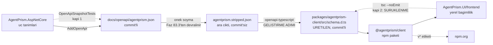

# Faz 84 — TypeScript İstemcisi ve npm Kanalı

> **Durum:** 📋 Planlandı (2026-08-21)
> **Kaynak:** [ADAYLAR.md](ADAYLAR.md) · **F-93** — Dalga 13 Küme E (**ikinci yarı**; birinci yarı F-50 → [Faz 83](83-TIPLI-ISTEMCI-VE-CLI.md))
> **Önkoşul:** [Faz 83](83-TIPLI-ISTEMCI-VE-CLI.md) — üretim akışının şekli (belge → üreteç → commit → kapı), `/agentprism` önekini soyan dönüşüm (§83.3) ve `operationId` kapsama kapısının fikri (§83.2) oradan devralınır · [Faz 40](arsiv/fazlar/40-OPENAPI-YAYINI.md) — üretim kaynağı olan belge ve `OpenApiSnapshotTests` · [Faz 5](arsiv/fazlar/05-AGENTPRISM-UI.md) ve [Faz 30](arsiv/fazlar/30-ARAYUZ-CILASI.md) — göç edecek arayüz katmanı
> **Paketler:** `@agentprism/client` (**yeni — npm**), `AgentPrism.UI` (yalnız `frontend/`)
> **Yeni paket:** Bir npm paketi. K-007 .NET paketleri içindir; gerekçe ve ağırlık yine sayılır — **§84.9** · **Migration:** Yok
> **Public API:** .NET yüzeyi **büyümüyor** — bu faz tek bir C# üyesi eklemez. Yeni yüzey npm tarafındadır ve `PublicAPI.*.txt` onu **görmez**; sözleşmesini §84.10'daki kendi kapısı tutar
> **Tüketici yüzeyi:** `docs-site/` → yeni `guides/typescript-client.md`, `packages.md` (npm kanalı ayrı bir bölüm ister — bugünkü sayfa 17 .NET paketi anlatıyor), `capabilities.md`, `reference/versioning.md` (npm ↔ NuGet sürüm eşleşmesi), `guides/client-side-tools.md` (bugünkü elle `fetch` örneği tipli hâle gelir)
> · sevk edilen: `packages/agentprism-client/README.md` (**npm paket sayfası** — registry'de görünen metin budur), kök `README.md` paket tablosu. `api/` ve `http-api/` **üretilir** ve bu faz onlara dokunmaz
> **Manuel test alanı:** `docs/manuel-test/34-TYPESCRIPT-ISTEMCISI.md` — **yeni dosya**, alan kodu `TSC`. Kapanışta `faz-tamamlama` oluşturur ve [`00-INDEKS.md`](manuel-test/00-INDEKS.md) §7 tablosuna `34` satırını yazar (bugün son sıra `32`; `33`'ü Faz 83 alır)

---

## Bu Faza Başlarken

> `faz-baslangic` skill'ini uygula. Aşağıdaki liste o skill'in 2. adımıdır —
> **tamamını değil, yalnız işaret edilen bölümleri oku.**

1. Bu doküman
2. Kararlar — dosyanın tamamını **okuma**, yalnız bu kalemleri grep'le:
   ```bash
   grep -n "K-007\|K-038\|K-039\|K-040\|K-059\|K-228\|K-232\|K-511\|K-542" \
     docs/KARARLAR.md docs/arsiv/KARARLAR-INDEKS-ARSIV.md
   ```
   **K-007** (yeni paket gerekçe ve ağırlık sayımı ister),
   **K-038** (hata gövdesi `application/problem+json` — üretilen istemcinin hata eşlemesi buna dayanır),
   **K-039** (kütüphane OpenAPI üretimini dayatmaz; belge tüketicinin uygulamasında üretilir),
   **K-040** (enum'lar JSON'a **ad** olarak yazılır — üretilen string union'ların tamamı bu karardan doğar),
   **K-059** (`secret` dosyaya yazılmaz — npm token'ı yalnız CI ortamında yaşar),
   **K-228** (arayüz metni sözlükten gelir; eksik anahtar **derleme hatasıdır**),
   **K-232** (sunucu yanıtları çevrilmez — üretilen istemci metni olduğu gibi taşır),
   **K-511** (`docs/openapi/agentprism.json` `AgentPrism.AspNetCore` paketine kaynağından girer),
   **K-542** (site kendi sunucumuzda barınır; yayın `scripts/site-deploy.sh` ile yapılır — npm kanalı **bundan ayrıdır**).
3. [`83-TIPLI-ISTEMCI-VE-CLI.md`](83-TIPLI-ISTEMCI-VE-CLI.md) — **§83.1, §83.3 ve devir notu**:
   ```bash
   sed -n '/^## 83.1/,/^## 83.4/p' docs/83-TIPLI-ISTEMCI-VE-CLI.md
   awk '/## Sonraki Faza Devir Notu/,0'  docs/83-TIPLI-ISTEMCI-VE-CLI.md
   ```
   Önek soyma adımı ve üretim akışının şekli oradan gelir. 🚨 Faz 83 kapandıysa
   **Plandan Sapmalar** bölümünü de oku: soyma adımı orada değiştiyse bu fazın
   §84.2'si yanlıştır ve koda göre düzeltilir.
4. Alan hafızası (bu faz üç alana dokunuyor):
   [`hafiza/frontend.md`](hafiza/frontend.md) (arayüz kod haritası, sözlük tuzakları) ·
   [`hafiza/paketleme-ve-dagitim.md`](hafiza/paketleme-ve-dagitim.md) (yayın hattı desenleri) ·
   [`hafiza/dokumantasyon.md`](hafiza/dokumantasyon.md) (dil sınırı kapsam listesi — **yeni bir kök dizin** eklendiği için burası kritiktir, §84.7)
5. Gerektiğinde, tamamı değil ilgili bölümü:
   [`MIMARI.md`](MIMARI.md) bölüm 2 (katman grafiği — bu faz .NET grafiğine düğüm **eklemez**)

---

## Amaç

AgentPrism'in yönetim API'sini bir TypeScript uygulamasından tipli olarak
çağırmanın yolu yoktur. Elle `fetch` yazılır, alan adları elle eşleştirilir ve
sunucu sözleşmesi değişince hiçbir şey kızarmaz.

Bu boşluğun ilk kurbanı **AgentPrism'in kendi arayüzüdür**:
`src/AgentPrism.UI/frontend/src/lib/types.ts` 1 882 satır ve 177 elle yazılmış
tip taşır, dosyanın kendi başlığı *"These mirror the .NET records one to one"*
der ve bu iddiayı denetleyen **hiçbir kapı yoktur**. Sürüklenme teorik değildir:
aşağıdaki tabloda iki somut örneği ölçüldü.

Bu faz tek bir npm paketi sevk eder ve o paketin **ilk tüketicisi arayüzün
kendisi olur**. Kapı böyle doğar: arayüz üretilen tipleri kullandığı için,
sunucu sözleşmesi değişip istemci yeniden üretilmediğinde `tsc --noEmit` kızarır
ve `dotnet build` durur.

- **F-93** — `@agentprism/client` npm paketi (üretilmiş tipler + tipli fetch
  istemcisi) ve npm yayın kanalı.

### 👤 Kullanıcı kararları (2026-08-21) — plan bunların üzerine kuruludur

| # | Soru | Karar |
|---|---|---|
| 1 | Paket ne sevk etsin? | **Tam istemci.** Arayüz hem `types.ts`'i hem `api.ts`'i bırakır; ikisi de üretilenle değişir |
| 2 | Üreteç | **`openapi-typescript`** (tip) + **`openapi-fetch`** (çalışma anı) |
| 3 | npm adı | **`@agentprism/client`** — kapsamlı ad; sonraki npm paketleri aynı çatıya girer |
| 4 | Arayüz nasıl tüketsin? | **Repo içi yerel bağımlılık** — yayınlanmış sürüme bağlanmaz, tavuk-yumurta yoktur |

### Bugün ne çalışmıyor — doğrulanmış kanıt

| Kanıt | Gözlem |
|---|---|
| [`types.ts`](../src/AgentPrism.UI/frontend/src/lib/types.ts) | **1 882 satır · 177 tip** (139 `interface` + 38 `type`). Başlığı sözleşmeyi birebir yansıttığını **iddia eder** |
| `grep -rn "types.ts" tests/ scripts/ .github/` | **0 eşleşme.** İddiayı denetleyen kapı yok |
| 🚨 [`types.ts:8`](../src/AgentPrism.UI/frontend/src/lib/types.ts#L8) | `AgentOrigin = 'Code' \| 'Maf' \| 'Database'`. Sunucudaki enum [`AgentDefinitionOrigin.cs:16`](../src/AgentPrism.Abstractions/Agents/AgentDefinitionOrigin.cs#L16) yalnız **`Code`** ve **`Database`** taşır. **`'Maf'` hayalet bir değerdir** — sürüklenme ölçüldü |
| 🚨 [`types.ts:1629`](../src/AgentPrism.UI/frontend/src/lib/types.ts#L1629) | `QuotaMetric` tanımlı, arayüzde **hiç kullanılmıyor** ve belgede karşılığı **yok**. Sunucuda yalnız `QuotaDecision` üzerinde yaşar ve o tip HTTP yanıtı değildir. **Ölü sözleşme** |
| [`api.ts:225-664`](../src/AgentPrism.UI/frontend/src/lib/api.ts#L225) | `api` nesnesi **134 elle yazılmış üye** taşır. **43 dosya** onu import eder, **155 çağrı noktası** vardır |
| `api` üye kullanımı | 134 üyenin **11'i hiç çağrılmıyor**: `deleteTenant` `deleteWorkflow` `entityAudit` `quotas` `recalculateCosts` `saveTenant` `schedule` `tenants` `voiceHealth` `webhook` `workflowCheckpoints` |
| `docs/openapi/agentprism.json` | OpenAPI **3.1.1** · **123** yol · **160** operasyon · **250** şema · `operationId` eksik **0** · **37** enum şeması · `required` taşıyan şema **175/250** |
| 🚨 Yol karşılaştırması | `api.ts`'in çağırdığı yolların **yalnız biri** belgede yoktur: **`/api/diagnostics`**. Sebep [`AgentPrismEndpointOptions.cs:149`](../src/AgentPrism.AspNetCore/AgentPrismEndpointOptions.cs#L149) — `EnableDiagnosticsEndpoint` varsayılan **`false`** ve belge varsayılan ayarla üretilir (§84.3) |
| [`ci.yml:154`](../.github/workflows/ci.yml) | `publish` işi yalnız **NuGet.org**'a iter. `npm publish` · `NPM_TOKEN` · `registry.npmjs` araması `.github/` ve `scripts/` içinde **0 eşleşme** — npm kanalı **yoktur** |
| `src/AgentPrism.UI/wwwroot/assets/` | Konsol payı **146 916 bayt brotli**. Bütçe [`postbuild.mjs:25`](../src/AgentPrism.UI/frontend/scripts/postbuild.mjs#L25) → **250 KB gzip** |
| `src/AgentPrism.UI/frontend/src/embed/` | Gömülebilir widget'ın **kendi** `client.ts`'i var; `lib/api` veya `lib/types`'ı **import etmiyor** (ölçüldü). Widget'ın 30 KB bütçesi bu fazdan **etkilenmez** |
| `find . -name ".npmrc"` | **0 sonuç.** Registry yapılandırması yok |

> Kanıtlar 2026-08-21 tarihinde doğrulandı.

🚨 **Bu makineden npm registry'sine erişilemedi** (ölçüldü: `npm view openapi-fetch`
→ `UNABLE_TO_GET_ISSUER_CERT_LOCALLY`). Bunun iki sonucu vardır ve ikisi de
uygulayan oturumun **ilk işidir**: (1) `@agentprism` kapsamının npm'de boş olduğu
**doğrulanmadı**, (2) `openapi-fetch`'in çalışma anı boyutu **ölçülmedi**.
İkisi de plana rakam olarak yazılmadı — yazılsaydı uydurma olurdu.

---

## 84.1 — Neden bu kalem Faz 83'ün kardeşi ama kopyası değil

Faz 83 aynı belgeden bir **C#** istemcisi üretir. Üç şey ortaktır ve
tekrarlanmaz: belge üretim kaynağıdır, üreteç bir **geliştirme adımıdır**
(tüketicinin derleme hattında yoktur), üretilen kod **commit'lidir**.

Üç şey farklıdır ve bu fazın işi odur:

| Konu | Faz 83 (.NET) | Faz 84 (npm) |
|---|---|---|
| Yayın kanalı | NuGet.org — hat **var** (`ci.yml:154`) | npm.org — hat **yok**, kimlik bilgisi **yok** |
| İlk tüketici | `agentprism` global tool'u (yeni kod) | **AgentPrism'in kendi arayüzü** (var olan 155 çağrı noktası göç eder) |
| Kapının şekli | `ClientCoverageTests` — `operationId` kapsaması | `tsc --noEmit` — arayüz derlemesi (§84.10) |

İkinci satır bu fazın asıl değeridir. Faz 83'ün istemcisini kimse kullanmasa
kapı yine de yeşil kalır; Faz 84'te **arayüz kullanmak zorundadır**, bu yüzden
sürüklenme derlemeyi kırar.

---

## 84.2 — Üretim akışı



**Önek soyma adımı Faz 83'ten devralınır ve yeniden yazılmaz.** Belgedeki 123
yolun 123'ü `/agentprism` ile başlar ama `MapAgentPrism` öneki bir
parametredir; yollar olduğu gibi alınırsa öneği değiştiren her tüketicide
sessizce `404` verir. İstemcinin `baseUrl`'ü uygulama kökü **artı** önektir.

Arayüz için bu değer zaten hesaplanmış durumdadır:
[`base.ts:26`](../src/AgentPrism.UI/frontend/src/lib/base.ts#L26) `apiBase`'i
üretimde `document.baseURI`'den, geliştirmede sabit `/agentprism/`'den alır.
Göç bu değeri `createClient({ baseUrl: apiBase })`'e verir; **davranış
değişmez**.

**Üreteç nereye kaydedilir.** `openapi-typescript` paketin kendi
`devDependencies`'ine girer ve `npm run generate` ile **elle** koşulur.
`dotnet build` üreteci **çağırmaz** — Faz 83'ün aynı kuralı. Gerekçe: üretimi
derlemeye bağlamak dört kapının süresini üreteç sürümüne bağlar.

```bash
cd packages/agentprism-client
npm run generate      # belge -> onek soyma -> schema.d.ts
npm run build         # tsc -> dist/
```

---

## 84.3 — 🚨 `/api/diagnostics` belgede yok — bu bir kapsam kararıdır

Ölçüldü: `api.ts`'in çağırdığı yolların **tam olarak biri** belgede yoktur.

| Ne | Ölçüm |
|---|---|
| Sunucuda var mı? | Evet — [`DiagnosticsEndpoints.cs:38`](../src/AgentPrism.AspNetCore/Endpoints/DiagnosticsEndpoints.cs#L38) `MapGet("/api/diagnostics", ...)` |
| Belgede var mı? | **Hayır** — `agentprism.json` içinde `diagnostics` kelimesi yalnız bir vektör arama açıklamasında geçer |
| Neden yok? | [`AgentPrismEndpointOptions.cs:149`](../src/AgentPrism.AspNetCore/AgentPrismEndpointOptions.cs#L149) `EnableDiagnosticsEndpoint` varsayılan **`false`** (K1 — sıfır sürpriz). Belgeyi üreten `AgentPrismTestHost` varsayılan ayarla açılır, uç bağlanmaz |
| Arayüz çağırıyor mu? | Evet — `api.diagnostics()` |

Yani "belge her ucu tarif eder" iddiası **bugün yanlıştır**: varsayılan kapalı
uçlar belgede yoktur. Bu, Faz 84'ten büyük bir sorundur — belgeden üretilen her
şeyi (C# istemcisi, TypeScript istemcisi, `http-api/` site sayfaları) birden
etkiler.

**Plan şunu seçer:** belge, **her isteğe bağlı uç bağlıyken** üretilir.
`OpenApiSnapshotTests`'in host'u `EnableDiagnosticsEndpoint = true` ile açılır.
Gerekçe: belge bir **API yüzeyi tarifidir**, bir kurulum fotoğrafı değil. Kapalı
gelen bir uç yine de yüzeyin parçasıdır ve tüketicinin onu açtığında ne
göreceğini bilmesi gerekir.

Bunun üç ölçülebilir sonucu vardır ve hepsi kabul edilir:

1. `docs/openapi/agentprism.json` **büyür** — 123 → 124 yol, 160 → 161 operasyon.
   Belge pakete kaynağından girdiği için (K-511) bu bir **tüketici yüzeyi
   değişikliğidir**.
2. `docs-site/http-api/` **üretilir** ve yeni bir sayfa kazanır. Ek iş yok.
3. Sayfa, ucun **varsayılan kapalı** olduğunu söylemelidir; yoksa okuyucu onu
   açık sanar. Bu, `.WithDescription` üstverisine yazılır — kaynağa yazılan
   açıklama üç yerde birden kazanır.

🚨 **Bu bir kapsam genişlemesidir ve bilinçlidir.** Alternatif —
`diagnostics`'i elle yazılmış bırakmak — kapıyı ilk günden delik açarak açardı:
"bir uç üretilenin dışında kalabilir" kuralı bir kez kabul edilirse ikincisi
tartışılmaz. Faz 85 ([Gömme Ekseni](85-GOMME-EKSENI.md)) tanı raporuna alan
ekliyor; o faz bu düzeltmeden **doğrudan kazanır**.

---

## 84.4 — Arayüzün göçü: ne gider, ne kalır

👤 Kullanıcı kararı: `api.ts` de gider. Ama `api.ts` yalnız yol listesi
değildir; içinde üretilenin **veremeyeceği** dört davranış vardır. Bu bölüm
sınırı çizer.

### Gidenler

| Ne | Ölçüm | Yerine ne gelir |
|---|---|---|
| `types.ts` | 1 882 satır · 177 tip | `@agentprism/client` tipleri (`components['schemas']['RunRecord']` üzerinden takma adlarla) |
| `api` nesnesinin 134 üyesi | 43 dosya · 155 çağrı noktası | `client.GET('/api/agents')` — yol ve parametre **belgeden tiplenir** |
| `query()` yardımcısı | `api.ts:216` | `params: { query: { ... } }` — sorgu parametreleri artık **tipli** |
| Elle `encodeURIComponent` | `api.ts` içinde onlarca yer | `params: { path: { name } }` — kodlama üretilende |
| 11 çağrılmayan üye | yukarıdaki liste | Silinir; üretilen istemci onları zaten kapsar |

Son iki satır göçün **kazancıdır**: bugün bir yol parametresini kodlamayı
unutmak sessiz bir kusurdur ve bu sınıf tamamen kapanır.

### Kalanlar — 🚨 üretilen istemci bunları vermez

| Ne | Neden kalır | Nerede yaşar |
|---|---|---|
| **SSE akışı** — `openStream` | Belgede **6** operasyon `text/event-stream` döner (ölçüldü: agent `run`, workflow `run`/`resume`/`respond`, OpenAI `responses` ve `chat/completions`). `fetch` tabanlı üretilen istemci gövdeyi JSON olarak okur; akış yolu **elle kalır** | `lib/sse.ts` + `lib/api.ts`'in **yalnız** `openStream` parçası. 3 ekran, 4 çağrı noktası (`playground`, `run-detail`, `workflow-detail`) |
| **`401` → `rejectToken()`** | Token reddedildiğinde uygulama token istemine döner. Bu bir **uygulama davranışıdır**, sözleşme değil | `openapi-fetch` **middleware**'i olarak arayüzde |
| **`ApiError` / `problem+json`** | Sunucu `title` ve `detail`'i insan için yazar (K-038) ve arayüz onları **olduğu gibi** gösterir (K-232) | Paketin ince katmanı (§84.5) — dışa da lazımdır |
| **Önek çözümü** — `document.baseURI` | Üretilen istemci `baseUrl`'ü **alır**, hesaplamaz | `lib/base.ts` **değişmez** |

**Göçün şekli.** `api.ts` silinmez, **küçülür**: içinde yalnız istemci kurulumu
(middleware'ler + `baseUrl`) ve `openStream` kalır. 134 üye gider, 155 çağrı
noktası `client.GET/POST/PUT/DELETE` biçimine geçer.

🚨 **Bu 155 çağrı noktasının tamamına dokunan mekanik bir göçtür.** `faz-uygulama`
Adım 4'ün kuralı burada birebir geçerlidir: her çağrı noktasının **gövdesini**
elle izle. React Query anahtarları (`queryKey`) çağrı biçimiyle birlikte
değişir; anahtarı güncellemeden çağrıyı değiştirmek önbelleği sessizce bozar ve
**hiçbir test bunu yakalamaz**.

---

## 84.5 — Paketin elle yazılan ince katmanı

`openapi-fetch` `{ data, error }` döndürür; arayüzün 43 dosyası ise **fırlatan**
biçimi kullanır ve React Query hatayı `ApiError` olarak bekler. İkisini
bağlayan katman pakette yaşar — hem arayüz hem dış tüketici aynı ergonomiyi
alır.

```ts
// @agentprism/client — ELLE yazilan ince katman
export class AgentPrismError extends Error {
  readonly status: number;
  readonly title: string;
  readonly detail: string | null;
}

export interface AgentPrismClientOptions {
  /** Application root plus the MapAgentPrism prefix. */
  baseUrl: string;
  /** Bearer token, or a function that supplies one per request. */
  token?: string | (() => string | null);
  /** Called when the server answers 401. */
  onUnauthorized?: () => void;
}

/** Creates a typed client that throws AgentPrismError on a failed response. */
export function createAgentPrismClient(
  options: AgentPrismClientOptions,
): AgentPrismClient;
```

Üç kural:

- Katman **token deposu tutmaz**. Arayüzün `auth.ts`'i (`getToken`,
  `rejectToken`) yerinde kalır ve pakete `token` + `onUnauthorized` olarak
  geçer. Paket bir tarayıcı depolama biçimine bağlanmaz.
- Katman **metin çevirmez** (K-232). `title` ve `detail` sunucudan geldiği gibi
  taşınır.
- Katman **`fetch` sarmalamaz**; `openapi-fetch`'in kendi middleware zincirini
  kullanır. Sarmalamak K3'ün TypeScript'teki karşılığını ihlal ederdi.

---

## 84.6 — Üretilen tiplerin kalitesi: elle yazılandan nerede iyi, nerede kötü

Üretilen tipler elle yazılanın her yerinden iyi **değildir**. Ölçüldü:

| Eksen | Elle yazılan | Üretilen | Sonuç |
|---|---|---|---|
| Enum / string union | 31 union | **37** enum şeması | ✅ Üretilen daha kapsamlı. `'Maf'` hayaleti ve ölü `QuotaMetric` kendiliğinden düşer |
| `required` doğruluğu | Elle seçilmiş | **175/250** şema `required` taşıyor | 🚨 **75 şemada `required` yok** → üretilen tipte her alan `?` olur. Elle yazılanda `required` olan bir alan `undefined` olabilir hâle gelir ve 155 çağrı noktasında `?.` gürültüsü doğar |
| Yol ve parametre | Elle string | Belgeden | ✅ Üretilen kazanır |
| Yorumlar | İnsan için yazılmış | `description`'dan | Belgede açıklama zenginse eşit; değilse kayıp |

🚨 **`required` boşluğu bu fazın en büyük ergonomi riskidir** ve iki yolla
kapanabilir:

1. **Kaynağa yaz.** `required` eksikliği bir üreteç kusuru değildir; ASP.NET
   Core `required` üyeleri zaten işaretler. 75 şemanın `required` taşımaması,
   o tiplerin **tüm alanlarının gerçekten opsiyonel** olduğu anlamına gelebilir
   — yani üretilen tip **doğru**, elle yazılan **iyimserdi**. Bu durumda kayıp
   yoktur, kazanç vardır.
2. Ölçüm birinci maddeyi yanlışlarsa (yani `required` olması gereken alanlar
   işaretlenmemişse) düzeltme **sunucu tarafındadır**: eksik `required`, belgeyi
   ve `http-api/` sayfalarını da yanlış yapıyordur.

**Uygulayan oturumun ilk ölçümü budur:** 75 şemadan kaçının gerçekten tümü
opsiyonel, kaçının işaretlemesi eksik. Sonuç kapanışta yazılır. Plan bu sayıyı
**tahmin etmez**.

---

## 84.7 — Paket repo'da nerede yaşar

```
packages/agentprism-client/          # YENI KOK DIZIN
```

`src/` .NET projelerinindir; bir npm paketi oraya girerse `dotnet build`'in
proje keşfi ve `AgentPrism.slnx` ile ilişkisi bulanıklaşır. Ayrı bir kök dizin
sınırı açık tutar.

🚨 **Bunun ölçülmüş bir bedeli vardır: dil kapısı yeni dizini görmez.**
[`SourceLanguageTests.cs:38`](../tests/AgentPrism.Core.UnitTests/Architecture/SourceLanguageTests.cs#L38)
`ScanRoots = ["src", "tests", "samples"]` der. `packages/` eklenmezse pakete
giren metin **denetimsiz** kalır — ve bu paket npm.org'da görünen bir yüzeydir.

**Plan `ScanRoots`'a `"packages"` ekler.** Taban çizgisi yalnız küçülür kuralı
korunur. Kapsam listesi
[`hafiza/dokumantasyon.md`](hafiza/dokumantasyon.md) içinde güncellenir.

---

## 84.8 — 🚨 Yerel bağımlılık: `npm ci` bugün `frontend/` içinde koşuyor

👤 Kullanıcı kararı repo içi yerel bağımlılıktır. Mekanizma seçimi bir
ölçüme dayanır:

[`AgentPrism.UI.Frontend.targets`](../src/AgentPrism.UI/AgentPrism.UI.Frontend.targets)
`npm ci`'yi `WorkingDirectory="$(AgentPrismFrontendRoot)"` ile, yani
`src/AgentPrism.UI/frontend/` içinde koşar; artımlılık damgası
`package-lock.json`'a bağlıdır ve lock dosyası oradadır.

| Mekanizma | Bedel |
|---|---|
| **`file:` bağımlılığı** ✅ **seçildi** | `frontend/package.json` → `"@agentprism/client": "file:../../../packages/agentprism-client"`. Lock dosyası **yerinde kalır**, `npm ci` **aynı dizinde** koşar, targets dosyası değişmez |
| npm workspaces | Kök `package.json` ve **kök lock dosyası** gerekir; `npm ci` kökten koşmalıdır. Targets dosyasının çalışma dizini, damga girdisi ve artımlılık mantığı birlikte değişir. Kazancı yoktur |

🚨 **Derleme sırası bir tuzaktır.** Paket TypeScript kaynağıdır; arayüz onu
tüketmeden önce **derlenmiş** olmalıdır (`dist/` + `.d.ts`). Bugünkü zincirde
böyle bir adım yoktur. `AgentPrism.UI.Frontend.targets` yeni bir hedef kazanır:
`npm ci` ile `npm run build` **arasında** paketin derlenmesi. Artımlılık aynı
desenle kurulur — damga dosyası `BaseIntermediateOutputPath` altında yaşar ve
girdisi paketin `src/` ağacıdır.

Node.js yoksa derleme **durmaz** (bugünkü davranış): var olan `wwwroot/`
yeterlidir. Bu kural yeni hedefte de korunur.

---

## 84.9 — Bağımlılık ağırlığı

K-007 .NET paketleri için yazıldı; ruhu burada da geçerlidir — **tüketicinin
grafiğine ne giriyor** sorusu sorulur.

| Kim | Ne ekleniyor |
|---|---|
| **npm tüketicisi** (`@agentprism/client`) | `openapi-fetch` — tek çalışma anı bağımlılığı. Tipler derleme sonrası **silinir**, sıfır bayt taşırlar. 🚨 `openapi-fetch`'in boyutu bu makineden **ölçülemedi**; uygulayan oturum ölçer ve kapanışta yazar |
| **`.NET` tüketicisi** | **Hiçbir şey.** Bu paket NuGet'e girmez, `AgentPrism.slnx`'e girmez, meta pakette değildir |
| **`AgentPrism.UI` bundle'ı** | `types.ts` (1 882 satır) **silinir** — tipler zaten bayt taşımıyordu. Net değişim `openapi-fetch`'in çalışma anı eksi `api.ts`'in giden 134 üyesi. **İşaret bile ölçülmeden yazılamaz** |
| **Gömülebilir widget** | **Etkilenmez** — kendi `client.ts`'i var ve `lib/api`'yi import etmiyor (ölçüldü). 30 KB bütçesi bu fazın konusu değildir |

Konsolun bugünkü payı **146 916 bayt brotli**; bütçe **250 KB gzip**
(`postbuild.mjs:25`). Bütçe kapısı `npm run build` içinde koşar, yani göç
bütçeyi aşarsa **derleme kırılır** — ek bir kapı gerekmez.

---

## 84.10 — Kapı: arayüz derlemesi

Faz 83'ün kapısı `operationId` kapsamasıdır. Faz 84'ün kapısı **daha ucuz ve
daha sıkıdır**, çünkü zaten koşan bir adımdır:

```
tsc --noEmit    (npm run build'in ilk adimi, dotnet build icinde kosar)
```

Belgeye yeni bir alan girer ve istemci yeniden üretilmezse arayüzün o alanı
okuyan satırı derlenmez. Bir alan **silinirse** onu okuyan satır derlenmez. Bir
enum değeri değişirse union eşleşmesi kırılır. Üçü de bugün **sessizdir**.

Buna **ek olarak** iki küçük kapı gerekir:

| Kapı | Ne kanıtlar | Nerede |
|---|---|---|
| `schema-drift` | `npm run generate` çıktısı commit'li dosyayla **aynı** mı. Belge değişip üretim koşulmadıysa kızarır | `packages/agentprism-client` — `npm test` |
| `paths-coverage` | Üretilen `paths` ağacı belgedeki **161** yolun tamamını taşıyor mu (§84.3 sonrası) | aynı yer |

Birincisi Faz 83'ün bilerek **almadığı** byte-diff kapısıdır. Burada alınabilir
çünkü üreteç `dotnet test`'e değil, paketin kendi `npm test`'ine bağlanır;
dört kapının süresi etkilenmez.

---

## 84.11 — npm yayın hattı

`ci.yml` bugün dört iş taşır: `build` · `pack` · `publish` (NuGet) · `site`.
Beşinci iş eklenir.

| Ne | Karar |
|---|---|
| Tetikleyici | `v*` etiketi — NuGet yayınıyla **aynı** |
| Sürüm | Etiketten türetilir (`v1.0.0-preview.1` → `1.0.0-preview.1`). MinVer .NET sürümünü aynı etiketten alır, yani iki kanal **yapısal olarak** eşleşir |
| Kimlik bilgisi | `NPM_TOKEN` — yeni bir GitHub `environment` (`npm`). 🚨 `secret` hiçbir dosyaya yazılmaz (K-059); yalnız CI ortamında yaşar |
| İdempotenlik | Aynı sürüm iki kez yayınlanamaz. NuGet'te `--skip-duplicate` var; npm'de karşılığı yoktur ve iş **var olan sürümü atlamalıdır** |
| Erişim | Kapsamlı paket varsayılan **private**'dır. `--access public` **zorunludur**; unutulursa paket yayınlanır ama kimse kuramaz |

🚨 **`@agentprism` kapsamı npm.org'da rezerve edilmelidir ve bu bir insan
işidir.** Bu makineden doğrulanamadı. Kapsam alınmadan iş yeşil olamaz;
uygulayan oturum bunu **ilk gün** kullanıcıya sorar.

---

## Planlanan Public API

> Taslak imzalardır. Gerçekleşen imzalar kapanışta ayrı bir bölüme yazılır.
> Üretilen 161 operasyonun imzası burada **tekrarlanmaz**; kaynağı belgedir.

### .NET

**Yok.** Bu faz tek bir C# public üyesi eklemez veya değiştirmez.
`PublicAPI.Unshipped.txt` dosyalarının hiçbiri büyümez.

### npm — `@agentprism/client`

```ts
// Uretilen — elle duzenlenmez
export type { paths, components, operations } from './schema';

/** Wire contracts, by schema name. Example: Schemas['RunRecord']. */
export type Schemas = components['schemas'];

// Elle yazilan ince katman
export class AgentPrismError extends Error {
  readonly status: number;
  readonly title: string;
  readonly detail: string | null;
}

export interface AgentPrismClientOptions {
  baseUrl: string;
  token?: string | (() => string | null);
  onUnauthorized?: () => void;
  fetch?: typeof globalThis.fetch;
}

export function createAgentPrismClient(
  options: AgentPrismClientOptions,
): AgentPrismClient;
```

### HTTP `endpoint`'leri

**Bir tane — ve o da yeni değildir.** §84.3 gereği `GET /api/diagnostics`
belgeye **girer**. Uç bugün de vardır; değişen, belgenin onu tarif etmesidir.
Varsayılanı **kapalı** kalır.

### Arayüz payı

`types.ts` silinir, `api.ts` küçülür, `openapi-fetch` girer. Net değişim
**ölçülmelidir** — bugünkü taban `146 916 bayt brotli`, bütçe `250 KB gzip` ve
kapı `npm run build` içinde zaten koşuyor.

**Yeni ekran metni yok** → `locales/en.ts` ve `tr.ts` **değişmez** (K-228).

---

## Planlanan Dosya Listesi

```
packages/agentprism-client/                 # YENI KOK DIZIN
├── package.json                            # name: @agentprism/client
├── README.md                               # npm registry sayfasi
├── tsconfig.json
├── scripts/
│   ├── strip-prefix.mjs                    # Faz 83.3'un TS karsiligi
│   └── generate.mjs                        # strip -> openapi-typescript
├── src/
│   ├── schema.d.ts                         # URETILEN, commit'li
│   ├── client.ts                           # ince katman (84.5)
│   ├── error.ts                            # AgentPrismError
│   └── index.ts
└── test/
    ├── schema-drift.test.ts                # 84.10
    ├── paths-coverage.test.ts              # 84.10
    ├── error-mapping.test.ts               # problem+json -> AgentPrismError
    └── prefix.test.ts                      # baseUrl onek davranisi

src/AgentPrism.UI/frontend/
├── package.json                            # file: bagimliligi eklenir
├── src/lib/types.ts                        # SILINIR (1 882 satir)
├── src/lib/api.ts                          # KUCULUR: kurulum + openStream
└── src/**                                  # 43 dosya · 155 cagri noktasi goc eder

src/AgentPrism.UI/AgentPrism.UI.Frontend.targets   # paket derleme hedefi (84.8)

src/AgentPrism.AspNetCore/Endpoints/DiagnosticsEndpoints.cs   # .WithDescription (84.3)
tests/AgentPrism.AspNetCore.FunctionalTests/OpenApiSnapshotTests.cs  # tanı ucu acik (84.3)
docs/openapi/agentprism.json                 # YENIDEN URETILIR: 124 yol · 161 operasyon

tests/AgentPrism.Core.UnitTests/Architecture/SourceLanguageTests.cs  # ScanRoots += packages

.github/workflows/ci.yml                     # npm-publish isi
docs/manuel-test/34-TYPESCRIPT-ISTEMCISI.md  # yeni alan, kod: TSC
docs-site/src/content/docs/guides/typescript-client.md   # yeni sayfa
```

---

## Hata Modları ve Testler

> Mutlu yoldan değil, **ne bozulabilir**den türetilir. Seviyeyi plan seçer.
> Sınır geçen davranış (DI · HTTP · kiracı · akış · depo · paket) birim
> testiyle kanıtlanamaz — `faz-uygulama` Adım 2.

| Ne bozulabilir | Seviye | Test |
|---|---|---|
| Belge değişir, istemci yeniden üretilmez → sessizce eskir | Birim (npm) | `schema-drift.test.ts` |
| Üretilen `paths` belgedeki bir yolu kaçırır | Birim (npm) | `paths-coverage.test.ts` |
| 🚨 Arayüz göçünde bir `queryKey` güncellenmez → önbellek yanlış veriyi gösterir | **E2E** | `AgentPrism.Ui.E2ETests` — var olan koşum; **birim testi bunu yakalamaz** |
| 🚨 Tüketici `MapAgentPrism("/control")` der, istemci `/agentprism`'e gider → `404` | Birim (npm) + **E2E** | `prefix.test.ts` **ve** özel önekle bir E2E koşumu |
| `problem+json` gövdesi `AgentPrismError`'a çevrilmez → kullanıcı `HTTP 500` görür | Birim (npm) | `error-mapping.test.ts` — `title`+`detail`, yalnız `title`, ve **JSON olmayan** gövde |
| `401` geldiğinde token düşürülmez → uygulama yanlış kimlikle döngüye girer | **E2E** | Var olan token istemi senaryosu; middleware bağlanmadıysa kızarır |
| Token hiç gönderilmez veya yanlış başlıkta gider | Birim (npm) | `client.test.ts` — istek başlıkları doğrudan okunur |
| SSE operasyonu üretilen istemciyle çağrılır → gövde JSON olarak okunmaya çalışılır ve akış ölür | **E2E** | `playground` ve `run-detail` akış senaryoları — 6 SSE ucunun `openStream`'de kaldığını kanıtlar |
| İstek iptal edilir (kullanıcı ekranı terk eder) → istek sızar | Birim (npm) | `client.test.ts` — `AbortSignal` uçtan uca taşınmalı |
| Boş / aşırı uzun `baseUrl`, sonda eğik çizgi var/yok | Birim (npm) | `prefix.test.ts` |
| Başka kiracının kaydı okunur | **Fonksiyonel** | Var olan `TenantIsolationContract` yeterlidir — istemci yeni bir yetki yolu **açmaz** ve bu plan onu açmadığını böyle kanıtlar |
| Sunucu ayakta değil / ağ koptu | Birim (npm) | `client.test.ts` — `fetch` reddi `AgentPrismError`'a değil, olduğu gibi yayılmalı |
| `packages/` altına Türkçe metin girer | Birim | `SourceLanguageTests` (`ScanRoots` genişler) |
| Bundle bütçesi aşılır | Birim | `postbuild.mjs` — `npm run build` içinde zaten koşuyor |
| npm paketi `--access public` olmadan yayınlanır → kimse kuramaz | **Manuel** | Kabul case 8 |
| Aynı sürüm iki kez yayınlanır → CI kırılır | **Manuel** | Kabul case 9 |
| `dotnet build` paketi derlemeden arayüzü derler → çözülemeyen import | **Fonksiyonel** | Temiz `artifacts/` üzerinde tam `dotnet build` (Doğrulama komutları) |

Her yeni kod yolu için beş soru cevaplandı ve cevabı yukarıdaki tabloya girdi:
iptal (`AbortSignal`) · eşzamanlılık (React Query önbelleği ve `queryKey`) ·
boş/aşırı girdi (`baseUrl`) · başka kiracının kaydı (`TenantIsolationContract`) ·
alt sistem hatası (sunucu kapalı / JSON olmayan gövde).

---

## Manuel Kabul Case'leri

> Kapanışta `docs/manuel-test/34-TYPESCRIPT-ISTEMCISI.md` içine eklenecek
> case'lerin taslağı. Alan kodu `TSC`. Otomatikleştirilebilenler kapanışta
> koşulur.

| # | Ön koşul | Adımlar | Beklenen sonuç |
|---|---|---|---|
| 1 | Temiz `artifacts/`, Node.js kurulu | `dotnet build AgentPrism.slnx -c Release` | Paket arayüzden **önce** derlenir; arayüz derlemesi geçer; sıfır uyarı |
| 2 | Derleme geçti | `samples/AgentPrism.Api` başlatılır, konsol açılır | Agent listesi, `run` listesi ve `run` ayrıntısı **eskisi gibi** yüklenir |
| 3 | Konsol açık, bir agent seçili | Playground'da bir `run` başlatılır | Token'lar **akarak** gelir — SSE yolu göçten etkilenmemiştir |
| 4 | Konsol açık | Bir workflow çalıştırılır ve insan girdisi istenir | `resume`/`respond` akışı çalışır |
| 5 | Konsol açık, **yanlış** token girilir | Herhangi bir ekran yenilenir | `401` token istemine döner ve istem "reddedildi" der — `onUnauthorized` bağlıdır |
| 6 | `MapAgentPrism("/control")` ile başlatılmış uygulama | Konsol `/control` altından açılır | Tüm çağrılar çalışır — önek `document.baseURI`'den geliyor |
| 7 | Belge elle bozulur (bir alan silinir), üretim koşulmaz | `dotnet build` | 🚨 **Derleme kırılır** — kapı budur. Case sonunda değişiklik geri alınır |
| 8 | 👤 insan gerekir — npm kapsamı hazır | Temiz bir Node projesinde `npm i @agentprism/client` sonra bir agent listelenir | Paket kurulur, IntelliSense yol ve alan adlarını gösterir, çağrı sonuç döner |
| 9 | 👤 insan gerekir — bir `v*` etiketi atıldı | CI koşumu izlenir | NuGet ve npm **aynı sürüm numarasıyla** yayınlanır; ikinci koşum var olan sürümü **atlar**, kırılmaz |
| 10 | Tanı ucu açık bir uygulama | `GET /agentprism/api/diagnostics` üretilen istemciyle çağrılır | Rapor döner — §84.3 kanıtlanır |
| 11 | Tanı ucu **kapalı** (varsayılan) | Aynı çağrı | `404` döner ve `docs-site/http-api/` sayfası ucun varsayılan kapalı olduğunu **yazıyor** |

---

## Açık Sorular

> Planı bloklamayan, faz uygulanırken karara bağlanacak sorular. Bloklayan
> sorular plan yazılmadan **önce** soruldu — dördü de Amaç bölümündeki
> kullanıcı kararları tablosundadır.

| # | Soru | Seçenekler | Öneri |
|---|---|---|---|
| 1 | Üretilen şema tipleri nasıl dışa verilsin? | **A:** Ham `components['schemas']['X']` · **B:** Her şema için okunur takma ad (`export type RunRecord = ...`) | **B.** Bugünkü 155 çağrı noktası `RunRecord` yazıyor; takma ad göçü küçültür ve npm tüketicisinin ergonomisini korur. Üretilir, elle yazılmaz |
| 2 | Paket `dist/` mi yoksa TypeScript kaynağı mı sevk etsin? | **A:** `tsc` ile derlenmiş `dist/` + `.d.ts` · **B:** Kaynak, tüketici derlesin | **A.** B, tüketicinin derleme yapılandırmasına bağımlılık üretir |
| 3 | npm yayınına `--provenance` eklensin mi? | **A:** Şimdilik hayır · **B:** Evet — OIDC izni ve iş ayarı ister | **A.** Kanal ilk kez kuruluyor; kanıtlanabilirlik ayrı ve ucuz bir kalemdir |
| 4 | §84.6'nın `required` boşluğu bu fazda mı kapansın? | **A:** Yalnız **ölçülür**, düzeltme gerekiyorsa F-NN olarak devredilir · **B:** Bu fazda kapatılır | **A.** Ölçüm 75 şemanın gerçekten opsiyonel olduğunu gösterirse yapılacak iş **yoktur**; göstermezse düzeltme sunucu tarafındadır ve kapsamı büyütür |
| 5 | 11 çağrılmayan `api` üyesi ne olsun? | **A:** Silinir — üretilen istemci onları zaten kapsar · **B:** Takma adla korunur | **A.** Ölü koddur |

---

## Bitiş Ölçütleri (DoD)

- [ ] `npm run generate` belgeden `schema.d.ts` üretir; `schema-drift.test.ts` üretilenle commit'linin **aynı** olduğunu kanıtlar
- [ ] `paths-coverage.test.ts` belgedeki **161** yolun tamamını üretilen `paths` ağacında bulur; muafiyet dosyası yoktur
- [ ] `src/AgentPrism.UI/frontend/src/lib/types.ts` **silinmiştir**; `api.ts` yalnız istemci kurulumu ve `openStream` taşır
- [ ] 🚨 Belge elle bozulduğunda `dotnet build` **kırılır** (Kabul case 7) — sürüklenme kapısı budur ve elle kanıtlanır
- [ ] Konsol eskisi gibi çalışır: agent listesi · `run` ayrıntısı · **akan** playground `run`'ı · workflow insan girdisi · token reddi
- [ ] 🚨 Özel önekle (`MapAgentPrism("/control")`) konsol çalışır
- [ ] `GET /api/diagnostics` belgeye girdi; `docs/openapi/agentprism.json` **124 yol · 161 operasyon** ve `OpenApiSnapshotTests` yeşil
- [ ] `SourceLanguageTests.ScanRoots` `packages`'ı kapsıyor; taban çizgisi **büyümedi**
- [ ] Bundle payı **ölçüldü ve belgeye yazıldı**; 250 KB gzip bütçesi aşılmadı
- [ ] `openapi-fetch`'in çalışma anı boyutu **ölçüldü ve yazıldı** (plan anında ölçülemedi)
- [ ] §84.6'nın 75 `required`'sız şeması **sayıldı**: kaçı gerçekten opsiyonel, kaçının işaretlemesi eksik — sonuç kapanışta yazıldı
- [ ] `@agentprism` kapsamı npm.org'da **rezerve edildi**; `ci.yml`'ın npm işi `--access public` ile yayınlıyor
- [ ] Dört doğrulama kapısı sıfır uyarı verir
- [ ] `samples/AgentPrism.Api` ile gerçek `run` yapıldı, çıktı belgeye yazıldı
- [ ] `secret` taraması boş döndü — `NPM_TOKEN` hiçbir dosyada geçmiyor
- [ ] Manuel kabul case'leri `docs/manuel-test/34-TYPESCRIPT-ISTEMCISI.md` içine eklendi; `00-INDEKS.md` tablosuna `34` satırı yazıldı; otomatikleştirilebilenler koşuldu
- [ ] `faz-denetim` koşuldu; 🔴 bulgu kalmadı
- [ ] `docs-site/` güncellendi (`guides/typescript-client.md` **yeni**, `packages.md`, `capabilities.md`, `reference/versioning.md`, `guides/client-side-tools.md`); `npm run check` temiz
- [ ] Kök `README.md` npm kanalını anlatan bir satır kazandı

### Doğrulama komutları

```bash
# Uretim (gelistirme adimi — dotnet build bunu CAGIRMAZ)
cd packages/agentprism-client && npm run generate && npm test

# Belge yeniden uretimi (84.3 sonrasi)
AGENTPRISM_OPENAPI_REFRESH=1 dotnet test tests/AgentPrism.AspNetCore.FunctionalTests \
  -c Release --filter FullyQualifiedName~OpenApiSnapshotTests
python3 -c "import json;d=json.load(open('docs/openapi/agentprism.json'));\
print(len(d['paths']),'yol')"

# Surukleme kapisi gercekten kiriyor mu (Kabul case 7)
#   docs/openapi/agentprism.json icinden bir alan sil, sonra:
dotnet build AgentPrism.slnx -c Release      # KIRILMALI
git checkout docs/openapi/agentprism.json

# Bundle payi
ls -l src/AgentPrism.UI/wwwroot/assets/

# Dort kapi
dotnet build  AgentPrism.slnx -c Release
dotnet test   AgentPrism.slnx -c Release --no-build
dotnet pack   AgentPrism.slnx -c Release --no-build
dotnet format AgentPrism.slnx --verify-no-changes --no-restore
```

---

## Riskler

| Risk | Önlem |
|------|-------|
| 🚨 **155 çağrı noktasına dokunan mekanik göç.** Bir `queryKey` güncellenmezse önbellek sessizce yanlış veri gösterir | Göç ekran ekran yapılır, her ekrandan sonra E2E koşulur. `faz-uygulama` Adım 4 (imza–gövde takibi) burada zorunludur. **Kaçış merdiveni:** göç tek fazda taşınamayacak kadar genişlerse `api.ts` üretilen istemcinin üzerine **adlandırılmış ince cephe** olarak kalır — 134 tek satır, ama her yol ve tip belgeden denetlenir. Sürüklenme kapısı yine kurulur. Bu bir **karardır** ve gerekçesiyle kapanışta yazılır |
| 🚨 §84.6'nın `required` boşluğu göçü `?.` gürültüsüne boğar | Ölçüm ilk gün yapılır (Açık Soru 4). Boşluk gerçekse düzeltme sunucudadır ve **devredilir**; kapsam bu fazda büyümez |
| `@agentprism` kapsamı npm'de alınamaz | Kapsam **ilk gün** kullanıcıyla doğrulanır. Alınamıyorsa ad kararı yeniden açılır — kod bundan etkilenmez, yalnız `package.json` ve doküman değişir |
| §84.3'ün belge değişikliği `http-api/` sayfalarını ve paketlenen belgeyi büyütür | Kabul edilir ve **kazançtır**: kapalı gelen bir uç bugün hiçbir yerde tarif edilmiyor. Kapı `OpenApiSnapshotTests`'tir ve zaten var |
| Paket derleme adımı `dotnet build`'i yavaşlatır | Artımlıdır — damga dosyası deseni `npm ci` ve `npm run build` için zaten kurulu. Paket kaynağı değişmezse adım koşmaz |
| SSE yolu göçten sonra sessizce bozulur | 6 SSE operasyonunun tamamı `openStream`'de kalır ve üç ekranın E2E senaryosu bunu kanıtlar. Üretilen istemciyle **çağrılmamaları** bir kabul case'idir (case 3, 4) |
| npm ve NuGet sürümleri ayrışır | Yapısal olarak mümkün değil: ikisi de aynı `v*` etiketinden türer. Ayrı bir sürüm dosyası **yoktur** |
| Yeni kök dizin dil kapısının dışında kalır | §84.7 — `ScanRoots` genişletilir ve bu bir DoD satırıdır |
| Üretilen dosya `dotnet format`'ı veya lint'i kırar | Üretilen dosya TypeScript'tir; `dotnet format` onu görmez. `tsc` görür ve görmesi **istenir** — kapı budur |

---

<!-- ============================================================
     AŞAĞISI KAPANIŞTA DOLDURULUR — `faz-tamamlama` skill'i.
     Plan anında boş kalır. Başlıkları SİLME.
     ============================================================ -->

## Plandan Sapmalar

> Kapanışta doldurulur. Plan ile gerçek arasındaki fark **gizlenmez** — sonraki
> oturumun en değerli bilgisidir.

## Bu Fazda Verilen Kararlar

> Kapanışta doldurulur. K-NNN numaraları burada alınır; plan numara rezerve etmez.
> En az beş karar bekleniyor: belgenin isteğe bağlı uçları da tarif etmesi (§84.3) ·
> `packages/` kök dizini ve dil kapısının genişlemesi (§84.7) · yerel bağımlılık
> mekanizması (§84.8) · npm yayın sözleşmesi (§84.11) · göçün şekli — tam göç mü
> adlandırılmış cephe mi (Riskler).

## Gerçekleşen Public API

> Kapanışta doldurulur. Koddaki **gerçek** imzalar.

## Dosya Listesi (gerçekleşen)

> Kapanışta doldurulur.

## Denetim Bulguları

> Kapanışta doldurulur — `faz-denetim` çıktısı. Her satır: bulgu · seviye
> (🔴/🟡/🟢) · sonuç (düzeltildi / gerekçelendi / F-NN olarak devredildi).
> Bulgu yoksa "🔴 ve 🟡 yok" yazılır; boş bırakılmaz.

## Sonraki Faza Devir Notu

> Kapanışta doldurulur: devralınan sözleşmeler, bilinen tuzaklar (🚨), yarım
> kalan işler, sıradaki faz.
