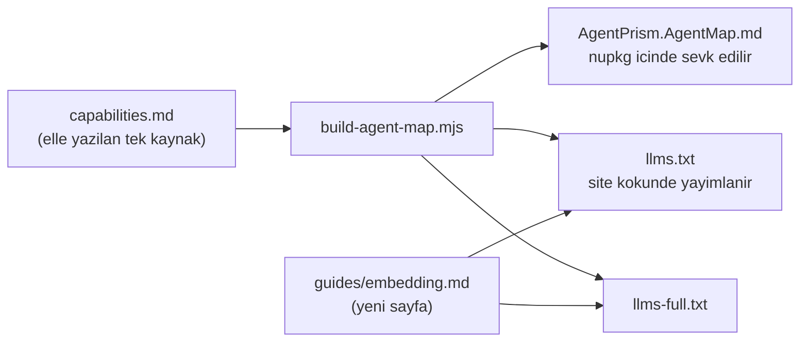

# Faz 85 — Gömme Ekseni

> **Durum:** ✅ Tamamlandı (2026-08-22)
> **Kaynak:** [ADAYLAR.md](ADAYLAR.md) · **F-140** — Dalga 14 Küme K
> **Önkoşul:** [Faz 78](78-YETENEK-HARITASI-ERISIMI.md) — harita ve yerel referans hattı oradan gelir; bu faz o hattın **içeriğini** büyütür, hattı değiştirmez · [Faz 69](69-TOOL-YETKILENDIRMESI-VE-TIMEOUT.md) ve [Faz 70](70-CALISTIRMA-OLAYI-HEDEFI.md) — anlatılan beş noktanın ikisi oradan geldi
> **Paketler:** `AgentPrism.Abstractions` (tanı raporu alanı), `AgentPrism.AspNetCore` (`/api/diagnostics` gövdesi), `docs-site/`, `samples/`
> **Yeni paket:** Yok · **Migration:** Yok
> **Public API:** Büyüyor — yalnız `AgentPrismDiagnosticsReport` üzerinde alan(lar). `PublicAPI.Shipped.txt` toplamı **16 satır** (yalnız başlıklar; ölçüldü 2026-08-21) → Faz 7'den önce eklemek **bedava**, sonra bir sürüm kararıdır
> **Tüketici yüzeyi:** `docs-site/` → yeni `guides/embedding.md`, `capabilities.md` (yeni bölüm — harita ve `llms.txt` ondan **üretilir**), `reference/configuration.md`
> · sevk edilen: `AgentPrism.AgentMap.md` (üretilir), yeni tanı raporu alanlarının XML dokümanı, `samples/` içindeki ikinci örnek. `api/` ve `http-api/` **üretilir** — orada iş XML dokümanı ve `.Produces` üstverisidir
> **Manuel test alanı:** [`docs/manuel-test/25-SAGLIK-TESHIS-OPENAPI.md`](manuel-test/25-SAGLIK-TESHIS-OPENAPI.md) (tanı raporu) · [`docs/manuel-test/29-AGENT-DESTEGI.md`](manuel-test/29-AGENT-DESTEGI.md) (harita ve yerel referans)

---

## Bu Faza Başlarken

> `faz-baslangic` skill'ini uygula. Aşağıdaki liste o skill'in 2. adımıdır —
> **tamamını değil, yalnız işaret edilen bölümleri oku.**

1. Bu doküman
2. Kararlar — dosyanın tamamını **okuma**, yalnız bu kalemleri grep'le:
   ```bash
   grep -n "K-510\|K-421\|K-183\|K-517" docs/KARARLAR.md
   ```
   **K-510** (yerel referans dosyası **proje** başına yazılır, depo köküne değil),
   **K-421** (public API takibi açık; `Shipped.txt` hâlâ boş),
   **K-183** (tanı raporu migration durumunu bildirir — raporun bugünkü işi budur),
   **K-517** (sözleşme tiplerinde `<see cref>` değil `<c>` — yeni XML dokümanı yazarken geçerli).
3. [`78-YETENEK-HARITASI-ERISIMI.md`](78-YETENEK-HARITASI-ERISIMI.md) — yalnız devir notu:
   ```bash
   awk '/^## Sonraki Faza Devir Notu/,0' docs/78-YETENEK-HARITASI-ERISIMI.md
   ```
   Dört madde bu fazı doğrudan bağlar: **§1** (tanının önerdiği düzeltme gerçekten
   uygulanabilir mi), **§4** (yerel referans dosyasının dört bölümü ve sırası),
   **§5** (`llms.txt` = harita + sayfa indeksi; yeni sayfa ikisine de otomatik girer),
   **§6** (harita bütçesi 10 240 B; **8 343 B doluydu**, ölçüldü 2026-08-21).
4. Alan hafızası (bu faz iki alana dokunuyor):
   [`hafiza/dokumantasyon.md`](hafiza/dokumantasyon.md) (yayın hattı, üretilen sayfalar, `capabilities.md` sözleşmesi) ·
   [`hafiza/paketleme-ve-dagitim.md`](hafiza/paketleme-ve-dagitim.md) (`buildTransitive/` akışı)
5. Gerektiğinde, tamamı değil ilgili bölümü:
   [`MIMARI-GUVENLIK.md`](MIMARI-GUVENLIK.md) — kiracı ve rol modeli (anlatılan beş noktanın üçü oradadır)
6. 🚨 **[Faz 84](84-TYPESCRIPT-ISTEMCISI-VE-NPM.md)'ün Sonraki Faza Devir Notu'nu oku.**
   `AgentPrismDiagnosticsReport`'a §85.4'te alan eklemek artık ÜÇ yerde
   yansıtılmalıdır, ikide değil: sunucu kaydı (eskiden olduğu gibi), C#
   `AgentPrism.Client` (`dotnet nswag run nswag.json` yeniden üretilmeli,
   `ClientCoverageTests` yeşil kalmalı) **ve** TS `@agentprism/client`
   (`npm run generate` yeniden üretilmeli, `schema-drift.test.ts` yeşil
   kalmalı). Frontend'in `diagnostics.tsx` ekranı bu tipi
   `src/AgentPrism.UI/frontend/src/lib/server-types.ts`'teki GENİŞLETİLMİŞ
   (`Fix<>`) sürümden okuyor — yeni alan opsiyonel/nullable geliyorsa o
   dosyanın K-listesine de eklenmesi gerekebilir (bkz. dosyanın kendi başlık
   yorumu, "iki sistemik kusur").

---

## Amaç

AgentPrism'i **boş bir repo'ya** kurmak iki satırdır: `AddAgentPrism()` +
`MapAgentPrism()`. AgentPrism'i **var olan** bir uygulamaya gömmek beş genişleme
noktasını aynı anda doğru bağlamayı ister. Beşi de kodda vardır, XML dokümanları
iyidir — ama **sevk edilen keşif yüzeyinde yoktur**. Bu faz o ekseni açar.

Faz keşfedilebilirlik işidir, yetenek işi değil. Yeni bir çalışma anı davranışı
gelmez; gelen şey, var olan davranışın **bulunabilir** hâle gelmesidir. Tek
istisna tanı raporudur: rapor bugün kurulumun kalıcılığını ve sağlayıcılarını
bildirir, **bağlı genişleme noktalarını bildirmez** — bu faz o boşluğu kapatır.

- **F-140** — Gömme ekseni: yetenek haritasına yeni bölüm · siteye gömme
  sayfası · `samples/` altına çerçeve-nötr ikinci örnek · `/api/diagnostics`
  bağlı genişleme noktalarını raporlar.

### Bugün ne çalışmıyor — doğrulanmış kanıt

Sevk edilen harita ([`AgentPrism.AgentMap.md`](../src/AgentPrism.Core/buildTransitive/AgentPrism.AgentMap.md),
202 satır) ve elle yazılan **39** site sayfası tarandı. `api/` ve `http-api/`
**üretilir** ve bilerek sayım dışıdır — bir tüketici oraya ancak tipin adını
zaten biliyorsa gider.

| Sözleşme | Haritada | Elle yazılan sayfada |
|---|---|---|
| `IRunEventSink` | **0** | 2 (`guides/observability.md`, `concepts/runs.md`) |
| `IToolAuthorizationHandler` | **0** | 3 |
| `IRunAttributionContext` | **0** | 3 |
| `ITenantContext` | **0** | **0** (yalnız `http-api/schema-tenantdescriptor.md`, üretilen) |
| `ITenantStore` · `AmbientTenantScope` | **0** | **0** |
| `AgentPrismRunContext` | **0** | **0** |
| `IAttachmentStore` | **0** | **0** |
| `IAttachmentStorage` | **0** | **1** (`guides/multimodal.md`) |

Kod tarafındaki kanıt:

| Kanıt | Gözlem |
|---|---|
| [`AgentPrismRunContext.cs:27`](../src/AgentPrism.Core/Recording/AgentPrismRunContext.cs#L27) | `public static class`; `AgentRunScope` `RunId`·`RootRunId`·`TenantId`·`SessionId`·`Budget` taşır |
| [`AgentPrismRunContext.cs:81`](../src/AgentPrism.Core/Recording/AgentPrismRunContext.cs#L81) | XML dokümanı: *"A tool cannot access `AgentSession`, so this is the only place it can read the session identity from"* — yani cevap yazılıdır, yalnız **aranacak yer** belli değildir |
| [`AgentPrismDiagnosticsReport.cs`](../src/AgentPrism.Abstractions/Diagnostics/AgentPrismDiagnosticsReport.cs) | **On** alan taşır (kalıcılık, migration, sağlayıcı, yapılandırma, arayüz, tool sayısı, agent sayısı). Hiçbiri bağlı genişleme noktası değildir |
| `samples/` | **Tek proje** (`AgentPrism.Api`) — yeşil alan kurulumu. Gömme senaryosu yoktur |
| `docs-site/scripts/build-agent-map.mjs:57` | Harita `capabilities.md`'den **üretilir**; bütçe **10 240 B**, bugün **8 343 B** dolu → ~1 897 B boşluk (≈22 yetenek satırı) |

> Kanıtlar 2026-08-21 tarihinde yeniden ölçüldü. Aday listesinin tek sapması
> `IAttachmentStorage` satırıdır: aday "0 sayfa" diyordu, ölçüm **1** buldu
> (`guides/multimodal.md`). `IAttachmentStore` gerçekten 0'dır.

---

## 85.1 — Gömme ekseni haritaya girer

🚨 **Harita elle yazılmaz.** [`build-agent-map.mjs:3`](../docs-site/scripts/build-agent-map.mjs)
tek bir elle yazılan kaynaktan (`docs-site/src/content/docs/capabilities.md`)
**üç** çıktı üretir. Yeni ekseni `capabilities.md`'ye yazmak yeterlidir.



Yeni bölümün adı ekseni adlandırmalıdır — haritanın bugünkü
*Integration surfaces* bölümü **dışa açtığımız** yüzeyleri sayar; eksik olan
**gömen uygulamanın bağladığı** sözleşmelerdir. İki bölüm karıştırılmamalıdır.

🚨 **Üreteç bir kural paragrafı zorlar.** [`build-agent-map.mjs:160`](../docs-site/scripts/build-agent-map.mjs)
yetenek tablosu taşıyan ama kural paragrafı olmayan bir bölümde **düşer**.
Yeni bölüm kendi `Rule:` cümlesini taşımalıdır.

**Bütçe.** Bugün 1 897 B boşluk vardır. Yeni bölüm başlığı, yedi–sekiz satır ve
bir kural paragrafı bu bütçeye girer; girmezse üreteç düşer ve **kırpma
yapmaz** — bu bilerek böyledir. Bütçe yetmezse çözüm satır kısaltmaktır, bütçe
büyütmek değil.

## 85.2 — Siteye gömme sayfası

`docs-site/src/content/docs/guides/embedding.md` — beş nokta, bağlama sırası ve
bir doğrulama listesi. Sayfa `llms.txt` ve `llms-full.txt`'e **otomatik** girer
(Faz 78 devir notu §5); `title` veya `description` eksikse üreteç düşer.

Sayfanın kapsaması gereken beş nokta:

| # | Nokta | Gömen uygulama ne verir |
|---|---|---|
| 1 | `ITenantContext` · `ITenantStore` · `AmbientTenantScope` | Kiracıyı kendi kimlik katmanından çözer |
| 2 | `IRunAttributionContext` | Koşuyu kendi kullanıcısına bağlar |
| 3 | `IToolAuthorizationHandler` | Tool çağrısını kendi yetki modeline sorar |
| 4 | `IRunEventSink` | Koşu olaylarını kendi kanalına köprüler |
| 5 | `IAttachmentStorage` | Ek içeriğini kendi nesne deposunda tutar |

Ayrıca tool gövdesinin okuduğu çalışma bağlamı (`AgentPrismRunContext`) aynı
sayfada anlatılır: bir tool `AgentSession`'a erişemez, kimliği yalnız oradan
okur.

Sayfa şu dört işletim sorusunu da cevaplar — bunlar gerçek bir gömme
denemesinde soruldu ve bugün hiçbir sayfada yazılı değildir:

- İki veri düzlemi (uygulamanın kendi şeması · AgentPrism şeması) yan yana nasıl yaşar
- Ayrı bağlantı havuzu ne zaman gerekir
- Migration sırası ve `AutoApplyMigrations`'ın gömme kurulumundaki anlamı
- Guard semantiği: *"blokla ve devam et"* **değil**, koşu **düşer**

## 85.3 — `samples/` altına çerçeve-nötr ikinci örnek

👤 **Karar (2026-08-21):** ikinci bir `samples/` projesi açılır. Bugünkü
`samples/AgentPrism.Api` **yeşil alan** kurulumudur ve iki satırlık kurulum
vaadini gösterir; onu gömme senaryosuyla karıştırmak o vaadi bulanıklaştırır.

Bedeli açıkça kabul edilmiştir ve `ADAYLAR.md`'nin karşı görüşünde yazılıdır:
**her faz bu örneği de güncel tutmak zorundadır.** Örnek derlemeye dahildir, bu
yüzden sessizce bayatlayamaz — ama derleme yalnız *derlenirliği* kanıtlar,
*güncelliği* değil.

Örnek beş noktayı da bağlar ve iki senaryo gösterir:

**Arka plan işi senaryosu — zorunludur.** 🚨 `scope`, koşuyu başlatan metodun
**kendi gövdesinde** açılır ve akış yolunda her `MoveNextAsync` öncesi açık
kalır. Bu tuzak bu repo'da **beş kez** yaşandı
([`hafiza/cekirdek-calistirma.md`](hafiza/cekirdek-calistirma.md)); tüketici
tarafında ayıklamak daha zordur çünkü belirti yalnız *"kiracı boş"* olur.

**`IRunEventSink` köprüsü.** Sınırlı kanal + arka plan tüketici + dolulukta
**düşürme** (bloklama değil). Sözleşmenin en kritik cümlesi — *"olayı kuyruğa at
ve dön"* — bugün yalnız XML dokümanındadır; yanlış yazılmış bir sink model
akışını istemci ağının hızına bağlar.

🚨 **Paket büyümez.** Tampon sarmalayıcısı bir AgentPrism tipi olarak
**alınmaz**; yalnız örnekte yaşar. S3/Azure Blob emsali korunur: genişleme
noktası bizim, somut uygulama tüketicinin.

## 85.4 — `/api/diagnostics` bağlı genişleme noktalarını raporlar

👤 **Karar (2026-08-21): tanı yalnız çalışma anı raporunda yaşar; yeni `APG`
kodu açılmaz.** Gerekçe ölçülmüştür:

| Ölçüm | Sonuç |
|---|---|
| `APG` ailesi bugün **14 kod** taşır (`APG0001`…`APG0402`), hepsi `DiagnosticSeverity.Warning` | Şiddet bir seçim değil; [`UsageDiagnostics.cs`](../src/AgentPrism.Generators/UsageDiagnostics.cs) gerekçeyi yazıyor: `Info` hiçbir verbosity'de `dotnet build` çıktısına **ulaşmaz** |
| [`AgentPrismUsageAnalyzer.cs:26`](../src/AgentPrism.Generators/AgentPrismUsageAnalyzer.cs#L26) | Analyzer **tek derleme** görür; `APG0101`/`APG0102` kendi dokümanında *"kayıt başka assembly'deyse yanlış pozitif"* diyor |
| *"Kiracılık açık ama `ITenantContext` varsayılan"* | Bir **çalışma anı** gerçeğidir — hangi uygulamanın hangi servisi kaydettiği derleme anında bilinemez |

Rapor ise gerçek DI konteynerini görür ve yanlış pozitif üretmez.

Rapor bugün on alan taşır. Bu faz **bağlı genişleme noktalarını** ekler: her
nokta için, kayıtlı uygulamanın **yerleşik varsayılan mı yoksa tüketicinin
kendi uygulaması mı** olduğu.

🚨 **Faz 78'in tek 🔴 bulgusu burada da geçerlidir:** bir tanının *dediğini
harfiyen yapan* tüketici gerçekten bir sonuç elde etmelidir. Rapor
*"`ITenantContext` varsayılan"* diyorsa, o satır tüketiciyi **hangi tipi
kaydedeceğine** götürmelidir — yoksa bilgi bir suçlamadır, bir yol gösterme
değil.

**Sır sızmaz.** Rapor yalnız *"kayıtlı mı, yerleşik mi"* bilgisini taşır; tip
adı taşıyabilir, ama hiçbir yapılandırma **değeri** taşımaz (K-059).

---

## Planlanan Public API

> Taslak imzalardır. Gerçekleşen imzalar kapanışta ayrı bir bölüme yazılır.

```csharp
// AgentPrism.Abstractions — AgentPrismDiagnosticsReport üzerine EK alan(lar).
// Yeni tip açılmaz; rapor zaten public'tir.
public sealed record AgentPrismDiagnosticsReport
{
    // ... bugünkü on alan ...

    /// <summary>The extension points the host application has bound.</summary>
    public required IReadOnlyList<ExtensionPointDiagnostic> ExtensionPoints { get; init; }
}

/// <summary>One extension point and whether the host replaced its built-in default.</summary>
public sealed record ExtensionPointDiagnostic
{
    /// <summary>The contract's name.</summary>
    public required string Contract { get; init; }

    /// <summary>The registered implementation's type name.</summary>
    public required string Implementation { get; init; }

    /// <summary>Whether the registration is AgentPrism's built-in default.</summary>
    public required bool IsBuiltInDefault { get; init; }
}
```

Alan adı ve `ExtensionPointDiagnostic`'in şekli **taslaktır**; raporun bugünkü
`ProviderDiagnostic` ve `ConfigurationDiagnostic` desenine uydurulur.

### HTTP `endpoint`'leri

Yeni uç **yoktur**. `GET /api/diagnostics` gövdesi büyür.

| Metot | Yol | Rol | Ne yapar |
|---|---|---|---|
| `GET` | `/api/diagnostics` | mevcut rolü korunur | Gövdeye bağlı genişleme noktaları eklenir |

🚨 Uç bir **rol** taşır ve bu faz onu **gevşetmez**. Rapor kurulumun iç yapısını
anlatır; anonim erişime açılması bir güvenlik gerilemesi olur.

### Arayüz payı

**Yok.** Bu faz arayüze dokunmaz. Bundle bütçesi (250 KB gzip) etkilenmez.

---

## Planlanan Dosya Listesi

```
src/AgentPrism.Abstractions/Diagnostics/
├── AgentPrismDiagnosticsReport.cs        (alan eklenir)
└── ExtensionPointDiagnostic.cs           (yeni)

src/AgentPrism.AspNetCore/Endpoints/
└── DiagnosticsEndpoints.cs               (rapor doldurulur)

docs-site/src/content/docs/
├── capabilities.md                       (yeni bölüm — harita ONDAN uretilir)
├── guides/embedding.md                   (yeni sayfa)
└── reference/configuration.md            (gomme ile ilgili ayarlar)

samples/AgentPrism.Embedded/              (yeni proje — ad taslaktir)
├── Program.cs
├── Tenancy/
├── Authorization/
├── Events/
└── README.md

tests/
├── AgentPrism.AspNetCore.Tests/          (rapor sozlesme testleri)
└── AgentPrism.DocumentationTests/        (site ve harita kapilari)
```

> `src/AgentPrism.Core/buildTransitive/AgentPrism.AgentMap.md` **üretilir** —
> elle düzenlenmez. `docs-site/public/llms.txt` de öyle.

---

## Hata Modları ve Testler

> Mutlu yoldan değil, **ne bozulabilir**den türetilir. Seviyeyi plan seçer.
> Sınır geçen davranış (DI · HTTP · kiracı · akış · depo · paket) birim
> testiyle kanıtlanamaz — `faz-uygulama` Adım 2.

| Ne bozulabilir | Seviye | Test sınıfı |
|---|---|---|
| Yeni bölüm harita bütçesini aşar; üreteç düşer | Fonksiyonel | `AgentMapBudgetTests` |
| Yeni bölüm kural paragrafı taşımaz; üreteç düşer | Fonksiyonel | `CapabilityMapShapeTests` |
| Gömme sayfası `title`/`description` taşımaz; `llms.txt` üreteci düşer | Fonksiyonel | `LlmsIndexTests` |
| Sayfa var olmayan bir tipi anlatır (bayatlar) | Fonksiyonel | `DocumentationSymbolTests` — anlatılan her tip adı derlenen yüzeyde **aranır** |
| Rapor yerleşik varsayılanı "tüketici uygulaması" gösterir | Sözleşme | `DiagnosticsReportContract` — dört koşumda birden |
| Rapor tüketicinin uygulamasını "yerleşik" gösterir | Sözleşme | `DiagnosticsReportContract` |
| Genişleme noktası **hiç** kayıtlı değilse rapor düşer | Fonksiyonel | `DiagnosticsEndpointTests` |
| Rapor bir yapılandırma **değeri** sızdırır | Sözleşme | `SecretLeakContract` — var olan sır taramasına yeni alan katılır |
| Başka kiracının kaydı raporda görünür | Sözleşme | `TenantIsolationContract` |
| Rapor rolsüz erişime açılır | Fonksiyonel | `DiagnosticsEndpointTests` — yetkisiz istek `401`/`403` |
| Örnek proje derlenir ama `scope` akış yolunda kapanır | E2E | `EmbeddedSampleTests` — arka plan işi senaryosu gerçek koşuyla |
| Örnek `IRunEventSink` köprüsü dolulukta **bloklar** | Fonksiyonel | `EmbeddedSampleTests` — kanal dolarken model akışı yavaşlamamalı |
| Örnek bayatlar (API değişir, örnek derlenmez) | E2E | `dotnet build` — örnek `AgentPrism.slnx` içindedir |

Beş soru ve cevapları:

| Soru | Cevap |
|---|---|
| **İptal** | Rapor okuma yoludur; `CancellationToken` uca aktarılır, yeni yol açılmaz |
| **Eşzamanlılık** | Rapor DI konteynerini okur; konteyner kurulumdan sonra değişmez — yarış yoktur |
| **Boş/aşırı girdi** | Genişleme noktası listesi **sabit uzunluktadır**; tüketici girdisi almaz |
| **Başka kiracı** | Rapor kurulum genelidir ve kiracı verisi taşımaz; `TenantIsolationContract` bunu sabitler |
| **Alt sistem hatası** | Bir servis çözülemezse rapor **düşmez**; o satır "çözülemedi" olarak raporlanır. Gözlemlenebilirlik işlevselliği bozmaz |

---

## Manuel Kabul Case'leri

> Kapanışta `docs/manuel-test/25-SAGLIK-TESHIS-OPENAPI.md` ve
> `docs/manuel-test/29-AGENT-DESTEGI.md` içine eklenecek case'lerin taslağı.

| # | Ön koşul | Adımlar | Beklenen sonuç |
|---|---|---|---|
| 1 | `samples/AgentPrism.Api` ayakta (yeşil alan) | `curl -s .../api/diagnostics` | `extensionPoints` dizisi gelir; beş nokta da `isBuiltInDefault: true` |
| 2 | `samples/AgentPrism.Embedded` ayakta | `curl -s .../api/diagnostics` | Beş nokta da `isBuiltInDefault: false`; `implementation` örneğin kendi tiplerini adlandırır |
| 3 | Gömme örneği ayakta | Arka plan işinden bir koşu tetiklenir | Koşu kaydı **doğru kiracıyla** kapanır; `AgentPrismRunContext.Current` akış boyunca dolu kalır |
| 4 | Gömme örneği ayakta | `IRunEventSink` kanalı doldurulur (yavaş tüketici) | Model akışı **yavaşlamaz**; olaylar düşürülür ve düşürme sayısı loglanır |
| 5 | Temiz derleme | `dotnet build` | `AgentPrism.AgentMap.md` yeni bölümü taşır; bütçe aşılmaz |
| 6 | Site derlemesi | `npm run build` + `check-links.mjs` | `guides/embedding.md` yayımlanır; `llms.txt` sayfa indeksinde görünür |
| 7 | 👤 insan gerekir | Gömme sayfası bir kod agent'ına verilir; beş noktayı bağlaması istenir | Agent beş noktayı da **soru sormadan** bulur — kalemin ölçülen boşluğu budur |

---

## Açık Sorular

> Planı bloklamayan, faz uygulanırken karara bağlanacak sorular. Bloklayan
> sorular plan yazılmadan **önce** soruldu ve 85.3 ile 85.4'te yazılıdır.

| # | Soru | Seçenekler | Öneri |
|---|---|---|---|
| 1 | İkinci örneğin adı ne olsun? | A: `AgentPrism.Embedded` · B: `AgentPrism.HostApp` | **A** — "gömme" kelimesi kalemin ve sayfanın adıyla aynı; arama tek terimle çalışır |
| 2 | `ExtensionPointDiagnostic` **hangi** noktaları saysın? | A: yalnız beş gömme noktası · B: `TryAdd*` ile kaydedilen her sözleşme | **A** — B raporu bir DI dökümüne çevirir ve okunmaz olur. Liste sonradan büyütülebilir, küçültülemez |
| 3 | Rapor tip **adını** mı yoksa yalnız "yerleşik/özel" bilgisini mi taşısın? | A: ikisi de · B: yalnız bayrak | **A** — tip adı bir sır değildir ve nöbetçi mühendisin ilk sorusudur. Ad taşımak `IsBuiltInDefault`'u gereksiz kılmaz: yerleşik tip adı da bir addır |
| 4 | Harita bütçesi yeni bölümle aşılırsa ne yapılır? | A: var olan satırlar kısaltılır · B: bütçe büyütülür | **A** — bütçe Faz 78'de ölçümle kondu; büyütmek kararı sessizce geri alır |
| 5 | Gömme sayfası `guides/` altında mı yoksa `getting-started/` altında mı? | A: `guides/` · B: `getting-started/` | **A** — `getting-started/` yeşil alan yolunu anlatır ve bu faz o vaadi korumak için ikinci örneği ayırdı |

---

## Bitiş Ölçütleri (DoD)

- [x] `GET /api/diagnostics` beş genişleme noktasını raporlar; gömme örneğinde beşi de `isBuiltInDefault: false` döner — 🚨 **plandan sapma:** yeşil alan örneğinde (`samples/AgentPrism.Api`) beşi değil **dördü** `true`'dur; `IRunAttributionContext` zaten Faz 68'den beri `DemoRunAttributionContext`'e bağlıdır. Bkz. Plandan Sapmalar #1
- [x] `AgentPrism.AgentMap.md` gömme eksenini taşır ve **10 240 B** bütçesini aşmaz — ölçüldü: **9 249 B** (950 B boşluk kalır)
- [x] `docs-site/guides/embedding.md` yayımlandı; `llms.txt` sayfa indeksinde görünüyor — doğrulandı (`grep` çıktısı Doğrulama Komutları'nda)
- [x] `samples/AgentPrism.Embedded` beş noktayı da bağlar, derlenir ve gerçek bir koşu üretir — gerçek `dotnet run` ile doğrulandı
- [x] Arka plan işi senaryosunda `AgentPrismRunContext.Current` akış boyunca dolu kalır (E2E ile kanıtlandı) — `EmbeddedSampleTests.Background_job_with_no_HTTP_request_carries_tenant_and_user_through_the_run`; `current_account` tool'unun kaydedilen sonucu `tenant=acme run=<gerçek runId> session=(none)` yazar
- [x] Dört doğrulama kapısı sıfır uyarı verir — `dotnet build/test/pack/format` dördü de yeşil (aşağıda)
- [x] `samples/AgentPrism.Api` ile gerçek `run` yapıldı, çıktı belgeye yazıldı — bkz. Doğrulama Komutları
- [x] `secret` taraması boş döndü — yeni rapor alanı da tarandı
- [x] Manuel kabul case'leri `docs/manuel-test/25-*` ve `29-*` içine eklendi; otomatikleştirilebilenler koşuldu — MT-DIAG-049..051, MT-AGD-016..020
- [x] `faz-denetim` koşuldu; 🔴 bulgu kalmadı — 3 🟡 bulgu, üçü de kapandı (bkz. Denetim Bulguları)
- [x] `docs-site/` güncellendi; `npm run check` (dört kapının tamamı) temiz
- [x] `tuketici-dokuman-senkronu` koşuldu — bu faz tüketici yüzeyine dokunur

### Doğrulama komutları ve gerçek çıktı

```bash
# Bagli genisleme noktalari raporlaniyor mu — gomme ornegi
$ curl -s http://localhost:5082/agentprism/api/diagnostics | jq '.extensionPoints'
[
  { "contract": "ITenantContext", "implementation": "EmbeddedTenantContext", "isBuiltInDefault": false },
  { "contract": "IRunAttributionContext", "implementation": "EmbeddedRunAttributionContext", "isBuiltInDefault": false },
  { "contract": "IToolAuthorizationHandler", "implementation": "EmbeddedToolAuthorizationHandler", "isBuiltInDefault": false },
  { "contract": "IRunEventSink", "implementation": "BoundedChannelRunEventSink", "isBuiltInDefault": false },
  { "contract": "IAttachmentStorage", "implementation": "InMemoryBufferAttachmentStorage", "isBuiltInDefault": false }
]

# Ayni uc, yesil alan orneginde — 4 turu true, biri (IRunAttributionContext) onceden bagli
$ curl -s http://localhost:5080/agentprism/api/diagnostics | jq '.extensionPoints[] | {contract, isBuiltInDefault}'
# (statik kod okumasiyla dogrulandi: Program.cs:139 DemoRunAttributionContext'i kosulsuz kaydeder;
#  canli host bu oturumdaki gelistiricinin kendi Bearer token secret'iyla korunuyordu, MT-DIAG-049'a bakin)

# Harita yeni bolumu tasiyor ve butce asilmiyor mu
$ node docs-site/scripts/build-agent-map.mjs
/Users/.../src/AgentPrism.Core/buildTransitive/AgentPrism.AgentMap.md: 9249 bytes
$ grep -n "Embedding points" -A7 src/AgentPrism.Core/buildTransitive/AgentPrism.AgentMap.md
### Embedding points
- Tenant resolution: ITenantContext, ITenantStore
- Run attribution: IRunAttributionContext
- Tool authorization: IToolAuthorizationHandler
- Run event bridge: IRunEventSink
- Attachment storage: IAttachmentStorage
- Rule: Each contract is registered with TryAdd, so a registration made before AddAgentPrism() ...

# llms.txt sayfa indeksinde gorunuyor mu
$ grep -n "Embedding into a host application" docs-site/public/llms.txt
246:- [Embedding into a host application](https://agentprism.doayen.web.tr/guides/embedding/) — Bind AgentPrism's five embedding points ...

# Arka plan isi senaryosu — kimlik AgentPrismRunContext.Current'tan mi geliyor
$ curl -s -X POST http://localhost:5082/jobs -H 'Content-Type: application/json' \
    -d '{"tenantId":"acme","userId":"user-42","message":"who am I"}'
$ curl -s -H 'X-Host-Tenant: acme' "http://localhost:5082/agentprism/api/runs/<runId>/events"
id: 2
event: tool.invoked
data: {..."toolName":"current_account",..."payload":"tenant=acme run=<runId> session=(none)"}
# Istekte X-Host-Tenant/X-Host-User YOK — kimlik yalniz AmbientTenantScope/AmbientRunAttributionScope
# uzerinden EmbeddedJobWorker'in kendi govdesinde acilan `using` bloklariyla akti.

# Event bridge dolulukta dusuruyor mu, kosuyu yavaslatiyor mu
$ for i in $(seq 1 10); do curl -s -X POST .../jobs -d "{...\"message\":\"burst $i\"}" >/dev/null; done
$ curl -s http://localhost:5082/jobs/bridge-state
{"received":9,"dropped":31}
# 10 kosunun tamami < 60ms icinde Completed oldu (startedAt/completedAt farki olculdu) — model
# akisi yavaslamadi, kopru kendi basina geriye dustu.

# 4 dogrulama kapisi
$ dotnet build AgentPrism.slnx -c Release        # 0 Warning(s), 0 Error(s)
$ dotnet test  AgentPrism.slnx -c Release --no-build
# 19 test projesi, tumu yesil (AgentPrism.Embedded.Tests: 3/3 dahil)
$ dotnet pack  AgentPrism.slnx -c Release --no-build   # basarili
$ dotnet format AgentPrism.slnx --verify-no-changes --no-restore   # degisiklik yok
```

---

## Riskler

| Risk | Önlem |
|------|-------|
| İkinci örnek bayatlar — 🚨 kalemin kendi karşı görüşü budur | Örnek `AgentPrism.slnx` içindedir; derleme kapısı derlenirliği zorlar. Bayatlığın **anlatı** yarısı için `faz-tamamlama` Adım 7 örneği kapsam listesine alır |
| Rapor bir DI dökümüne dönüşür ve okunmaz olur | Liste **sabit** ve beş noktayla sınırlıdır (Açık Soru 2) |
| Rapor sızıntı yüzeyi olur | Yalnız tip adı ve bayrak; hiçbir yapılandırma değeri yok (K-059). `SecretLeakContract` yeni alanı kapsar |
| Harita bütçesi taşar ve üreteç düşer | Bütçe kapısı zaten var; boşluk **ölçüldü** (1 897 B). Aşılırsa satır kısaltılır |
| Gömme sayfası XML dokümanını **tekrarlar** ve iki yerde kayar | Sayfa *"hangi soruyu sor"* anlatır; imza ayrıntısı üretilen `api/` referansına **link**lenir, kopyalanmaz |
| Tanı satırı yol göstermez, yalnız suçlar | Faz 78 §1 kuralı: her satır **hangi tipi kaydedeceğini** adlandırır |

---

<!-- ============================================================
     AŞAĞISI KAPANIŞTA DOLDURULUR — `faz-tamamlama` skill'i.
     Plan anında boş kalır. Başlıkları SİLME.
     ============================================================ -->

## Plandan Sapmalar

1. 🚨 **Manuel kabul case #1'in "yeşil alanda beşi de `true`" iddiası yanlıştı.**
   Ölçüldü: `samples/AgentPrism.Api/Program.cs:139`
   `builder.Services.AddSingleton<IRunAttributionContext, DemoRunAttributionContext>();`
   satırını **koşulsuz** çağırır (Faz 68, kullanıcı bazlı maliyet demosu için).
   Bu fazdan ÖNCE var olan bir bağlamadır. Doğru durum: dört nokta `true`,
   `IRunAttributionContext` `false` ve `implementation: "DemoRunAttributionContext"`.
   `MT-DIAG-049` gerçek durumu belgeler; `samples/AgentPrism.Embedded/README.md`
   düzeltildi. Bağımsız denetimin 🟡#1 bulgusu.
2. **`Microsoft.AspNetCore.Mvc.Testing` yeni bir test-only bağımlılık olarak
   eklendi** (K-579) — plan bunu öngörmüyordu ama `tests/AgentPrism.Embedded.Tests`
   örneğin GERÇEK `Program.cs`'ini test etmek zorundaydı ve bu paket tam o
   senaryo için var. `WebApplicationFactory<T>.Server`/`.Services`'in gerçek
   Kestrel'e geçilince `TestServer`'a cast hatası verdiği ölçüldü; çözüm gerçek
   soket değil, `IStartupFilter` ile in-memory `TestServer` üzerinde
   `RemoteIpAddress`'i simüle etmekti (`AgentPrismTestHost`'un başlık-tabanlı
   deseninin `WebApplicationFactory` eşdeğeri).
3. **`EchoModelProvider` planda anılmayan bir davranış kazandı**: ilk turda
   `current_account` tool'unu (mevcutsa) çağırır, ikinci turda sonucu yanıta
   gömer. Gerekçe: plansız bırakılırsa `AgentPrismRunContext.Current`'ı okuyan
   hiçbir tool GERÇEKTEN çalışmaz (echo sağlayıcı hiçbir zaman tool çağırmaz) —
   DoD'nin "E2E ile kanıtlandı" satırı sahte kalırdı. Bu, `samples/AgentPrism.Api`'nin
   kendi `EchoModelProvider`'ından bilinçli bir sapmadır; ikisi ayrı dosyalardır
   ve birbirini etkilemez.
4. **`ExtensionPointDiagnostic` alan adı ve şekli plandaki taslakla birebir
   aynı kaldı** — sapma yok, doğrulama için not düşülüyor.
5. **`docs-site/reference/configuration.md` dokunulmadan bırakıldı.** Planın
   dosya listesi bu sayfayı işaret ediyordu ("gömme ile ilgili ayarlar") ama
   ölçüldü: gömme hiçbir YENİ yapılandırma anahtarı eklemiyor (beş nokta saf
   C# tip kaydıdır, `appsettings.json` anahtarı değil); tek ilgili anahtar
   (`AgentPrism:PostgreSql:SchemaName`) zaten sayfada var. Değişiklik yok.
6. **`dokuman-bakim.py --site-denetle`'nin `cekirdek-kavram` kuralı gerekçeyle
   geçildi** (`--site-gerekce-yazildi`): kural `src/AgentPrism.Abstractions/Diagnostics/`
   değişince `concepts/` sayfası bekliyor, ama diagnostics raporu zaten
   `concepts/` değil `capabilities.md` + `guides/observability.md` +
   (bu fazda) `guides/embedding.md` üzerinden belgelenen bir yüzeydir — kural
   geneldir, alan-özgü değildir.

## Bu Fazda Verilen Kararlar

- **K-579** — `Microsoft.AspNetCore.Mvc.Testing` yalnız GERÇEK giriş noktalı
  örnek uygulamaları test eden projelerde kullanılır; kütüphane testleri
  `TestHost` kalır. Tam gerekçe: `docs/KARARLAR.md`.

## Gerçekleşen Public API

Plandaki taslakla birebir aynı gerçekleşti; tek fark alan sırasıdır (`ExtensionPoints`
`AgentCount`'tan hemen sonra eklendi, `PublicAPI.Unshipped.txt`'in alfabetik
yakınlığına uydu).

```csharp
// AgentPrism.Abstractions
public sealed record AgentPrismDiagnosticsReport
{
    // ... bugünkü on alan ...

    /// <summary>
    /// Gets the embedding points a host application binds to attach AgentPrism
    /// to its own tenancy, identity, authorization, eventing, and storage.
    /// </summary>
    public required IReadOnlyList<ExtensionPointDiagnostic> ExtensionPoints { get; init; }
}

/// <summary>One host-bound extension point and whether the host replaced its built-in default.</summary>
public sealed record ExtensionPointDiagnostic
{
    /// <summary>Gets the contract's name, for example <c>ITenantContext</c>.</summary>
    public required string Contract { get; init; }

    /// <summary>Gets the registered implementation's type name.</summary>
    public required string Implementation { get; init; }

    /// <summary>Gets whether the registration is AgentPrism's built-in default.</summary>
    public required bool IsBuiltInDefault { get; init; }
}
```

`AgentPrism.Core`'da tek değişiklik `AgentPrismDiagnosticsCollector`'ın
kurucusuna beş yeni bağımlılık eklenmesidir (public tip, ama tüketici bu
sınıfı doğrudan `new` etmez — DI çözer):

```csharp
public AgentPrismDiagnosticsCollector(
    IEnumerable<IModelProvider> providers,
    ModelProviderHealthCache healthCache,
    IEnumerable<ISqlPersistenceDiagnostics> sqlDiagnostics,
    IEnumerable<SqlPersistenceRegistrationMarker> sqlMarkers,
    IAgentCatalog agentCatalog,
    IToolRegistry toolRegistry,
    ITenantContext tenantContext,
    IRunAttributionContext runAttributionContext,
    IToolAuthorizationHandler toolAuthorizationHandler,
    IEnumerable<IRunEventSink> runEventSinks,
    IAttachmentStorage? attachmentStorage = null,
    ModelProviderCircuitBreaker? circuitBreaker = null,
    ILogger<AgentPrismDiagnosticsCollector>? logger = null)
```

### HTTP `endpoint`'leri

Plan değişmedi: `GET /api/diagnostics` gövdesi büyüdü, yeni uç yok, rol
korunuyor.

## Dosya Listesi (gerçekleşen)

```
src/AgentPrism.Abstractions/Diagnostics/
├── AgentPrismDiagnosticsReport.cs        (ExtensionPoints alanı eklendi)
└── ExtensionPointDiagnostic.cs           (yeni)

src/AgentPrism.Core/
├── Diagnostics/AgentPrismDiagnosticsCollector.cs   (beş yeni bağımlılık, CollectExtensionPoints())
└── AgentPrismServiceCollectionExtensions.cs        (DI kaydı güncellendi)

docs-site/src/content/docs/
├── capabilities.md                       ("Embedding points" bölümü — YENİ)
├── guides/embedding.md                   (YENİ sayfa)
└── (reference/configuration.md dokunulmadı — Plandan Sapmalar #5)

docs-site/src/sidebar.mjs                 ("Operate in production" bölümüne satır eklendi)

samples/AgentPrism.Embedded/              (YENİ proje)
├── AgentPrism.Embedded.csproj
├── Program.cs
├── EchoModelProvider.cs
├── Tools.cs
├── EnqueueJobRequest.cs
├── README.md
├── appsettings.json
├── Properties/launchSettings.json
├── Tenancy/EmbeddedTenantContext.cs
├── Tenancy/EmbeddedTenantStore.cs
├── Attribution/EmbeddedRunAttributionContext.cs
├── Authorization/EmbeddedToolAuthorizationHandler.cs
├── Events/BoundedChannelRunEventSink.cs
├── Events/RunEventBridgeWorker.cs
├── Events/RunEventBridgeState.cs
├── Attachments/InMemoryBufferAttachmentStorage.cs
├── Jobs/EmbeddedJob.cs
├── Jobs/EmbeddedJobQueue.cs
└── Jobs/EmbeddedJobWorker.cs

tests/
├── AgentPrism.Core.UnitTests/Diagnostics/DiagnosticsCollectorTests.cs        (3 yeni test)
├── AgentPrism.AspNetCore.FunctionalTests/DiagnosticsEndpointTests.cs         (2 yeni test)
└── AgentPrism.Embedded.Tests/          (YENİ proje — plandaki "AgentPrism.DocumentationTests"
    ├── AgentPrism.Embedded.Tests.csproj  yerine, gerçek giriş noktasını test eder)
    ├── EmbeddedSampleTests.cs            (3 test: extensionPoints, arka plan işi, event bridge)
    └── Infrastructure/EmbeddedSampleHost.cs

AgentPrism.slnx                           (iki yeni proje eklendi)
Directory.Packages.props                  (Microsoft.AspNetCore.Mvc.Testing eklendi, K-579)

docs/manuel-test/25-SAGLIK-TESHIS-OPENAPI.md   (MT-DIAG-049..051)
docs/manuel-test/29-AGENT-DESTEGI.md           (MT-AGD-016..020)

Üretilen artefaktlar (kaynağı değişti, otomatik yeniden üretildi):
docs/openapi/agentprism.json
src/AgentPrism.Client/Generated/{AgentPrismApiClient,AgentPrismClientJsonContext}.g.cs
packages/agentprism-client/src/schema.ts
src/AgentPrism.Core/buildTransitive/AgentPrism.AgentMap.md
docs-site/public/{llms.txt,llms-full.txt}
```

**85.3'ün plandaki dosya listesinden sapma:** `Attribution/` ve `Jobs/` ve
`Attachments/` klasörleri plan tarafından adlandırılmamıştı (plan yalnız
`Tenancy/`, `Authorization/`, `Events/` sayıyordu, "ad taslaktır" notuyla) —
beş nokta + arka plan işi senaryosunu ayrı, okunabilir klasörlere ayırmak
için eklendi.

## Denetim Bulguları

`faz-denetim` taze bağlamlı bir alt agent ile koşuldu (2026-08-22); tam
diff + `git status` okudu, `dotnet build/test/pack/format` ve `npm run check`'i
bağımsızca yeniden koştu. **🔴 yok.**

| # | Bulgu | Seviye | Sonuç |
|---|---|---|---|
| 1 | `samples/AgentPrism.Embedded/README.md`, `samples/AgentPrism.Api`'nin dördü değil **beşi** de `true` döndüğünü ima ediyordu — `IRunAttributionContext` zaten Faz 68'den beri `DemoRunAttributionContext`'e bağlı | 🟡 | **Düzeltildi** — README cümlesi gerçek durumu anlatacak şekilde yeniden yazıldı |
| 2 | `MT-DIAG-051`'in ön koşulu `/tmp/embedded-diag.json`'a bağlıydı ama `MT-DIAG-050` o dosyayı hiç yazmıyordu | 🟡 | **Düzeltildi** — `MT-DIAG-050`'nin `curl` komutuna `> /tmp/embedded-diag.json` yönlendirmesi eklendi |
| 3 | Planın manuel case #3 (arka plan işi) ve #4 (event bridge backpressure) satırları `docs/manuel-test/` içine hiç girilmemişti — yalnız otomatik E2E ile kanıtlanmıştı | 🟡 | **Düzeltildi** — `MT-AGD-019` ve `MT-AGD-020` eklendi, ikisi de otomatik eşdeğerine referans verir |

**Temiz çıkan başlıklar** (denetçinin kendi ifadesi): 3.1 (DoD ihlali yok),
3.2 (test tiyatrosu yok — üç test seviyesi de gerçek sınırdan geçiyor), 3.3
(sınır geçen davranış doğru seviyede: DI→unit, HTTP→functional, gerçek giriş
noktası→`WebApplicationFactory<Program>` E2E), 3.5 (imza-gövde kayması yok),
3.6 (public API tam plana uyuyor), 3.7 (İngilizce, XML doküman, `TryAdd*`, K1,
`secret` sızmıyor), 3.8 (`## Read next`, `description` uzunluğu, kenar
çubuğu, `npm run check` dört kapı — hepsi doğrulandı, hiçbir muafiyet listesi
büyümedi).

Denetimden SONRA, kapanış sırasında ayrıca bulundu ve düzeltildi (denetçi
görmedi çünkü henüz yazılmamıştı): DoD'nin "`AgentPrismRunContext.Current`
akış boyunca dolu kalır (E2E ile kanıtlandı)" satırı, `EchoModelProvider`
hiçbir zaman gerçekten bir tool çağırmadığı için **kanıtlanmamıştı** —
`current_account` tool'u hiçbir testte çalışmıyordu. `EchoModelProvider`
scripted bir tool-çağrısı turu kazandı (Plandan Sapmalar #3) ve
`EmbeddedSampleTests`'e gerçek doğrulama eklendi. Bu, denetçinin "iddiaya
güvenme, kanıtı kodda bul" kuralının uygulayan oturumun kendi kapanış
taramasında tekrar işe yaradığı bir örnektir.

## Sonraki Faza Devir Notu

**Sıradaki faz:** [Faz 86 — Talimatın Girdi Yüzeyi](86-TALIMATIN-GIRDI-YUZEYI.md).
Bu fazın kendi önkoşulu Faz 72'dir, Faz 85 değil — iki faz aynı dalgadan
(Dalga 14) bağımsız kalemlerdir ve Faz 86'nın "Bu Faza Başlarken" listesi
zaten devir teslim kalitesindedir; bu fazdan devralacağı bir sözleşme yok.

**Devralınan sözleşmeler:**
- `AgentPrismDiagnosticsReport.ExtensionPoints` — beş sabit uzunluklu giriş,
  sırası her zaman `ITenantContext, IRunAttributionContext,
  IToolAuthorizationHandler, IRunEventSink, IAttachmentStorage`. Yeni bir
  altıncı nokta eklemek istenirse Açık Soru 2'nin kararı (yalnız beş gömme
  noktası, `TryAdd*` ile kaydedilen HER sözleşme değil) yeniden gözden
  geçirilmeli.
- `capabilities.md`'nin "Embedding points" bölümü — yeni bir satır eklerken
  tablo başlığından **önce** bir lead-in paragraf YAZMA (aşağıdaki tuzağa bak).

**Bilinen tuzaklar:**
- 🚨 **`build-agent-map.mjs`'in "Rule:" satırı, tablo SONRASI paragrafın
  İLK cümlesidir — ama `section.prose` tablo ÖNCESİ paragrafları da toplar
  ve `firstSentence()` HANGİSİ önce gelirse onu alır.** Bu fazda bir lead-in
  cümlesi tabloyu ÖNCE açıklıyordu ve üreteç yanlışlıkla o cümleyi "Rule:"
  olarak bastı. Her mevcut bölüm heading→table→(yalnız) rule paragrafı
  sırasını izliyor; bu sıradan sapma sessizce yanlış bir kural üretir,
  hiçbir kapı bunu yakalamaz (üreteç "geçerli" bir metin üretir, yalnız
  YANLIŞ cümleyi seçer). Yeni bir bölüm eklerken bu sırayı ASLA bozma.
- 🚨 **`IRunStore.ListToolInvocationsAsync(runId)` tenant'ı `ITenantContext`'ten
  ÖRTÜK okur** (`QueryRunsAsync`'in aksine, o `RunQuery.TenantId`'yi AÇIKÇA
  alır). HTTP dışından (bir test, bir konsol aracı) çağrılırsa ve ambient
  scope açık değilse SESSİZCE boş döner — hata vermez, `IsOwnedByCurrentTenant`
  içeride `false` bulur ve erken çıkar. `tests/AgentPrism.Embedded.Tests/EmbeddedSampleTests.cs`
  bunu `AmbientTenantScope.Begin(tenantId)` ile sarmalayarak çözdü; aynı çözüm
  gerekir her `IRunStore` tenant-örtük metodunu HTTP dışından çağıran yeni kod.
- 🚨 **`samples/AgentPrism.Api`'nin `IRunAttributionContext`'i zaten özel** —
  bu sample'ı "tüm varsayılanlar açık" örneği olarak kullanan HERHANGİ bir
  gelecek faz bunu hesaba katmalı (bkz. Plandan Sapmalar #1).
- **`WebApplicationFactory<Program>` ile bir örnek uygulamayı test etmek
  istersen** `tests/AgentPrism.Embedded.Tests/Infrastructure/EmbeddedSampleHost.cs`'i
  örnek al — `IStartupFilter` ile `RemoteIpAddress` simülasyonu, gerçek
  Kestrel'e GEÇME (K-579'un ölçtüğü `TestServer` cast hatası).

**Yarım kalan iş yok.** DoD'nin tamamı işaretlendi; 🔴 bulgu kalmadı.
