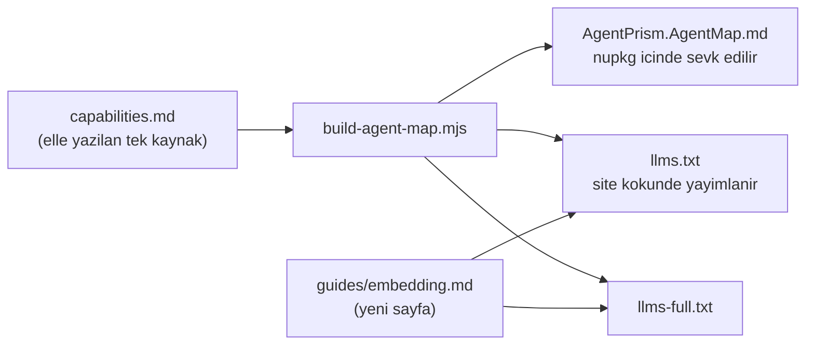

# Faz 85 — Gömme Ekseni

> **Durum:** 📋 Planlandı (2026-08-21)
> **Kaynak:** [ADAYLAR.md](ADAYLAR.md) · **F-140** — Dalga 14 Küme K
> **Önkoşul:** [Faz 78](78-YETENEK-HARITASI-ERISIMI.md) — harita ve yerel referans hattı oradan gelir; bu faz o hattın **içeriğini** büyütür, hattı değiştirmez · [Faz 69](69-TOOL-YETKILENDIRMESI-VE-TIMEOUT.md) ve [Faz 70](70-CALISTIRMA-OLAYI-HEDEFI.md) — anlatılan beş noktanın ikisi oradan geldi
> **Paketler:** `AgentPrism.Abstractions` (tanı raporu alanı), `AgentPrism.AspNetCore` (`/api/diagnostics` gövdesi), `docs-site/`, `samples/`
> **Yeni paket:** Yok · **Migration:** Yok
> **Public API:** Büyüyor — yalnız `AgentPrismDiagnosticsReport` üzerinde alan(lar). `PublicAPI.Shipped.txt` toplamı **16 satır** (yalnız başlıklar; ölçüldü 2026-08-21) → Faz 7'den önce eklemek **bedava**, sonra bir sürüm kararıdır
> **Tüketici yüzeyi:** `docs-site/` → yeni `guides/embedding.md`, `capabilities.md` (yeni bölüm — harita ve `llms.txt` ondan **üretilir**), `reference/configuration.md`
> · sevk edilen: `AgentPrism.AgentMap.md` (üretilir), yeni tanı raporu alanlarının XML dokümanı, `samples/` içindeki ikinci örnek. `api/` ve `http-api/` **üretilir** — orada iş XML dokümanı ve `.Produces` üstverisidir
> **Manuel test alanı:** [`docs/manuel-test/25-SAGLIK-TESHIS-OPENAPI.md`](manuel-test/25-SAGLIK-TESHIS-OPENAPI.md) (tanı raporu) · [`docs/manuel-test/29-AGENT-DESTEGI.md`](manuel-test/29-AGENT-DESTEGI.md) (harita ve yerel referans)

---

## Bu Faza Başlarken

> `faz-baslangic` skill'ini uygula. Aşağıdaki liste o skill'in 2. adımıdır —
> **tamamını değil, yalnız işaret edilen bölümleri oku.**

1. Bu doküman
2. Kararlar — dosyanın tamamını **okuma**, yalnız bu kalemleri grep'le:
   ```bash
   grep -n "K-510\|K-421\|K-183\|K-517" docs/KARARLAR.md
   ```
   **K-510** (yerel referans dosyası **proje** başına yazılır, depo köküne değil),
   **K-421** (public API takibi açık; `Shipped.txt` hâlâ boş),
   **K-183** (tanı raporu migration durumunu bildirir — raporun bugünkü işi budur),
   **K-517** (sözleşme tiplerinde `<see cref>` değil `<c>` — yeni XML dokümanı yazarken geçerli).
3. [`78-YETENEK-HARITASI-ERISIMI.md`](78-YETENEK-HARITASI-ERISIMI.md) — yalnız devir notu:
   ```bash
   awk '/^## Sonraki Faza Devir Notu/,0' docs/78-YETENEK-HARITASI-ERISIMI.md
   ```
   Dört madde bu fazı doğrudan bağlar: **§1** (tanının önerdiği düzeltme gerçekten
   uygulanabilir mi), **§4** (yerel referans dosyasının dört bölümü ve sırası),
   **§5** (`llms.txt` = harita + sayfa indeksi; yeni sayfa ikisine de otomatik girer),
   **§6** (harita bütçesi 10 240 B; **8 343 B doluydu**, ölçüldü 2026-08-21).
4. Alan hafızası (bu faz iki alana dokunuyor):
   [`hafiza/dokumantasyon.md`](hafiza/dokumantasyon.md) (yayın hattı, üretilen sayfalar, `capabilities.md` sözleşmesi) ·
   [`hafiza/paketleme-ve-dagitim.md`](hafiza/paketleme-ve-dagitim.md) (`buildTransitive/` akışı)
5. Gerektiğinde, tamamı değil ilgili bölümü:
   [`MIMARI-GUVENLIK.md`](MIMARI-GUVENLIK.md) — kiracı ve rol modeli (anlatılan beş noktanın üçü oradadır)

---

## Amaç

AgentPrism'i **boş bir repo'ya** kurmak iki satırdır: `AddAgentPrism()` +
`MapAgentPrism()`. AgentPrism'i **var olan** bir uygulamaya gömmek beş genişleme
noktasını aynı anda doğru bağlamayı ister. Beşi de kodda vardır, XML dokümanları
iyidir — ama **sevk edilen keşif yüzeyinde yoktur**. Bu faz o ekseni açar.

Faz keşfedilebilirlik işidir, yetenek işi değil. Yeni bir çalışma anı davranışı
gelmez; gelen şey, var olan davranışın **bulunabilir** hâle gelmesidir. Tek
istisna tanı raporudur: rapor bugün kurulumun kalıcılığını ve sağlayıcılarını
bildirir, **bağlı genişleme noktalarını bildirmez** — bu faz o boşluğu kapatır.

- **F-140** — Gömme ekseni: yetenek haritasına yeni bölüm · siteye gömme
  sayfası · `samples/` altına çerçeve-nötr ikinci örnek · `/api/diagnostics`
  bağlı genişleme noktalarını raporlar.

### Bugün ne çalışmıyor — doğrulanmış kanıt

Sevk edilen harita ([`AgentPrism.AgentMap.md`](../src/AgentPrism.Core/buildTransitive/AgentPrism.AgentMap.md),
202 satır) ve elle yazılan **39** site sayfası tarandı. `api/` ve `http-api/`
**üretilir** ve bilerek sayım dışıdır — bir tüketici oraya ancak tipin adını
zaten biliyorsa gider.

| Sözleşme | Haritada | Elle yazılan sayfada |
|---|---|---|
| `IRunEventSink` | **0** | 2 (`guides/observability.md`, `concepts/runs.md`) |
| `IToolAuthorizationHandler` | **0** | 3 |
| `IRunAttributionContext` | **0** | 3 |
| `ITenantContext` | **0** | **0** (yalnız `http-api/schema-tenantdescriptor.md`, üretilen) |
| `ITenantStore` · `AmbientTenantScope` | **0** | **0** |
| `AgentPrismRunContext` | **0** | **0** |
| `IAttachmentStore` | **0** | **0** |
| `IAttachmentStorage` | **0** | **1** (`guides/multimodal.md`) |

Kod tarafındaki kanıt:

| Kanıt | Gözlem |
|---|---|
| [`AgentPrismRunContext.cs:27`](../src/AgentPrism.Core/Recording/AgentPrismRunContext.cs#L27) | `public static class`; `AgentRunScope` `RunId`·`RootRunId`·`TenantId`·`SessionId`·`Budget` taşır |
| [`AgentPrismRunContext.cs:81`](../src/AgentPrism.Core/Recording/AgentPrismRunContext.cs#L81) | XML dokümanı: *"A tool cannot access `AgentSession`, so this is the only place it can read the session identity from"* — yani cevap yazılıdır, yalnız **aranacak yer** belli değildir |
| [`AgentPrismDiagnosticsReport.cs`](../src/AgentPrism.Abstractions/Diagnostics/AgentPrismDiagnosticsReport.cs) | **On** alan taşır (kalıcılık, migration, sağlayıcı, yapılandırma, arayüz, tool sayısı, agent sayısı). Hiçbiri bağlı genişleme noktası değildir |
| `samples/` | **Tek proje** (`AgentPrism.Api`) — yeşil alan kurulumu. Gömme senaryosu yoktur |
| `docs-site/scripts/build-agent-map.mjs:57` | Harita `capabilities.md`'den **üretilir**; bütçe **10 240 B**, bugün **8 343 B** dolu → ~1 897 B boşluk (≈22 yetenek satırı) |

> Kanıtlar 2026-08-21 tarihinde yeniden ölçüldü. Aday listesinin tek sapması
> `IAttachmentStorage` satırıdır: aday "0 sayfa" diyordu, ölçüm **1** buldu
> (`guides/multimodal.md`). `IAttachmentStore` gerçekten 0'dır.

---

## 85.1 — Gömme ekseni haritaya girer

🚨 **Harita elle yazılmaz.** [`build-agent-map.mjs:3`](../docs-site/scripts/build-agent-map.mjs)
tek bir elle yazılan kaynaktan (`docs-site/src/content/docs/capabilities.md`)
**üç** çıktı üretir. Yeni ekseni `capabilities.md`'ye yazmak yeterlidir.



Yeni bölümün adı ekseni adlandırmalıdır — haritanın bugünkü
*Integration surfaces* bölümü **dışa açtığımız** yüzeyleri sayar; eksik olan
**gömen uygulamanın bağladığı** sözleşmelerdir. İki bölüm karıştırılmamalıdır.

🚨 **Üreteç bir kural paragrafı zorlar.** [`build-agent-map.mjs:160`](../docs-site/scripts/build-agent-map.mjs)
yetenek tablosu taşıyan ama kural paragrafı olmayan bir bölümde **düşer**.
Yeni bölüm kendi `Rule:` cümlesini taşımalıdır.

**Bütçe.** Bugün 1 897 B boşluk vardır. Yeni bölüm başlığı, yedi–sekiz satır ve
bir kural paragrafı bu bütçeye girer; girmezse üreteç düşer ve **kırpma
yapmaz** — bu bilerek böyledir. Bütçe yetmezse çözüm satır kısaltmaktır, bütçe
büyütmek değil.

## 85.2 — Siteye gömme sayfası

`docs-site/src/content/docs/guides/embedding.md` — beş nokta, bağlama sırası ve
bir doğrulama listesi. Sayfa `llms.txt` ve `llms-full.txt`'e **otomatik** girer
(Faz 78 devir notu §5); `title` veya `description` eksikse üreteç düşer.

Sayfanın kapsaması gereken beş nokta:

| # | Nokta | Gömen uygulama ne verir |
|---|---|---|
| 1 | `ITenantContext` · `ITenantStore` · `AmbientTenantScope` | Kiracıyı kendi kimlik katmanından çözer |
| 2 | `IRunAttributionContext` | Koşuyu kendi kullanıcısına bağlar |
| 3 | `IToolAuthorizationHandler` | Tool çağrısını kendi yetki modeline sorar |
| 4 | `IRunEventSink` | Koşu olaylarını kendi kanalına köprüler |
| 5 | `IAttachmentStorage` | Ek içeriğini kendi nesne deposunda tutar |

Ayrıca tool gövdesinin okuduğu çalışma bağlamı (`AgentPrismRunContext`) aynı
sayfada anlatılır: bir tool `AgentSession`'a erişemez, kimliği yalnız oradan
okur.

Sayfa şu dört işletim sorusunu da cevaplar — bunlar gerçek bir gömme
denemesinde soruldu ve bugün hiçbir sayfada yazılı değildir:

- İki veri düzlemi (uygulamanın kendi şeması · AgentPrism şeması) yan yana nasıl yaşar
- Ayrı bağlantı havuzu ne zaman gerekir
- Migration sırası ve `AutoApplyMigrations`'ın gömme kurulumundaki anlamı
- Guard semantiği: *"blokla ve devam et"* **değil**, koşu **düşer**

## 85.3 — `samples/` altına çerçeve-nötr ikinci örnek

👤 **Karar (2026-08-21):** ikinci bir `samples/` projesi açılır. Bugünkü
`samples/AgentPrism.Api` **yeşil alan** kurulumudur ve iki satırlık kurulum
vaadini gösterir; onu gömme senaryosuyla karıştırmak o vaadi bulanıklaştırır.

Bedeli açıkça kabul edilmiştir ve `ADAYLAR.md`'nin karşı görüşünde yazılıdır:
**her faz bu örneği de güncel tutmak zorundadır.** Örnek derlemeye dahildir, bu
yüzden sessizce bayatlayamaz — ama derleme yalnız *derlenirliği* kanıtlar,
*güncelliği* değil.

Örnek beş noktayı da bağlar ve iki senaryo gösterir:

**Arka plan işi senaryosu — zorunludur.** 🚨 `scope`, koşuyu başlatan metodun
**kendi gövdesinde** açılır ve akış yolunda her `MoveNextAsync` öncesi açık
kalır. Bu tuzak bu repo'da **beş kez** yaşandı
([`hafiza/cekirdek-calistirma.md`](hafiza/cekirdek-calistirma.md)); tüketici
tarafında ayıklamak daha zordur çünkü belirti yalnız *"kiracı boş"* olur.

**`IRunEventSink` köprüsü.** Sınırlı kanal + arka plan tüketici + dolulukta
**düşürme** (bloklama değil). Sözleşmenin en kritik cümlesi — *"olayı kuyruğa at
ve dön"* — bugün yalnız XML dokümanındadır; yanlış yazılmış bir sink model
akışını istemci ağının hızına bağlar.

🚨 **Paket büyümez.** Tampon sarmalayıcısı bir AgentPrism tipi olarak
**alınmaz**; yalnız örnekte yaşar. S3/Azure Blob emsali korunur: genişleme
noktası bizim, somut uygulama tüketicinin.

## 85.4 — `/api/diagnostics` bağlı genişleme noktalarını raporlar

👤 **Karar (2026-08-21): tanı yalnız çalışma anı raporunda yaşar; yeni `APG`
kodu açılmaz.** Gerekçe ölçülmüştür:

| Ölçüm | Sonuç |
|---|---|
| `APG` ailesi bugün **14 kod** taşır (`APG0001`…`APG0402`), hepsi `DiagnosticSeverity.Warning` | Şiddet bir seçim değil; [`UsageDiagnostics.cs`](../src/AgentPrism.Generators/UsageDiagnostics.cs) gerekçeyi yazıyor: `Info` hiçbir verbosity'de `dotnet build` çıktısına **ulaşmaz** |
| [`AgentPrismUsageAnalyzer.cs:26`](../src/AgentPrism.Generators/AgentPrismUsageAnalyzer.cs#L26) | Analyzer **tek derleme** görür; `APG0101`/`APG0102` kendi dokümanında *"kayıt başka assembly'deyse yanlış pozitif"* diyor |
| *"Kiracılık açık ama `ITenantContext` varsayılan"* | Bir **çalışma anı** gerçeğidir — hangi uygulamanın hangi servisi kaydettiği derleme anında bilinemez |

Rapor ise gerçek DI konteynerini görür ve yanlış pozitif üretmez.

Rapor bugün on alan taşır. Bu faz **bağlı genişleme noktalarını** ekler: her
nokta için, kayıtlı uygulamanın **yerleşik varsayılan mı yoksa tüketicinin
kendi uygulaması mı** olduğu.

🚨 **Faz 78'in tek 🔴 bulgusu burada da geçerlidir:** bir tanının *dediğini
harfiyen yapan* tüketici gerçekten bir sonuç elde etmelidir. Rapor
*"`ITenantContext` varsayılan"* diyorsa, o satır tüketiciyi **hangi tipi
kaydedeceğine** götürmelidir — yoksa bilgi bir suçlamadır, bir yol gösterme
değil.

**Sır sızmaz.** Rapor yalnız *"kayıtlı mı, yerleşik mi"* bilgisini taşır; tip
adı taşıyabilir, ama hiçbir yapılandırma **değeri** taşımaz (K-059).

---

## Planlanan Public API

> Taslak imzalardır. Gerçekleşen imzalar kapanışta ayrı bir bölüme yazılır.

```csharp
// AgentPrism.Abstractions — AgentPrismDiagnosticsReport üzerine EK alan(lar).
// Yeni tip açılmaz; rapor zaten public'tir.
public sealed record AgentPrismDiagnosticsReport
{
    // ... bugünkü on alan ...

    /// <summary>The extension points the host application has bound.</summary>
    public required IReadOnlyList<ExtensionPointDiagnostic> ExtensionPoints { get; init; }
}

/// <summary>One extension point and whether the host replaced its built-in default.</summary>
public sealed record ExtensionPointDiagnostic
{
    /// <summary>The contract's name.</summary>
    public required string Contract { get; init; }

    /// <summary>The registered implementation's type name.</summary>
    public required string Implementation { get; init; }

    /// <summary>Whether the registration is AgentPrism's built-in default.</summary>
    public required bool IsBuiltInDefault { get; init; }
}
```

Alan adı ve `ExtensionPointDiagnostic`'in şekli **taslaktır**; raporun bugünkü
`ProviderDiagnostic` ve `ConfigurationDiagnostic` desenine uydurulur.

### HTTP `endpoint`'leri

Yeni uç **yoktur**. `GET /api/diagnostics` gövdesi büyür.

| Metot | Yol | Rol | Ne yapar |
|---|---|---|---|
| `GET` | `/api/diagnostics` | mevcut rolü korunur | Gövdeye bağlı genişleme noktaları eklenir |

🚨 Uç bir **rol** taşır ve bu faz onu **gevşetmez**. Rapor kurulumun iç yapısını
anlatır; anonim erişime açılması bir güvenlik gerilemesi olur.

### Arayüz payı

**Yok.** Bu faz arayüze dokunmaz. Bundle bütçesi (250 KB gzip) etkilenmez.

---

## Planlanan Dosya Listesi

```
src/AgentPrism.Abstractions/Diagnostics/
├── AgentPrismDiagnosticsReport.cs        (alan eklenir)
└── ExtensionPointDiagnostic.cs           (yeni)

src/AgentPrism.AspNetCore/Endpoints/
└── DiagnosticsEndpoints.cs               (rapor doldurulur)

docs-site/src/content/docs/
├── capabilities.md                       (yeni bölüm — harita ONDAN uretilir)
├── guides/embedding.md                   (yeni sayfa)
└── reference/configuration.md            (gomme ile ilgili ayarlar)

samples/AgentPrism.Embedded/              (yeni proje — ad taslaktir)
├── Program.cs
├── Tenancy/
├── Authorization/
├── Events/
└── README.md

tests/
├── AgentPrism.AspNetCore.Tests/          (rapor sozlesme testleri)
└── AgentPrism.DocumentationTests/        (site ve harita kapilari)
```

> `src/AgentPrism.Core/buildTransitive/AgentPrism.AgentMap.md` **üretilir** —
> elle düzenlenmez. `docs-site/public/llms.txt` de öyle.

---

## Hata Modları ve Testler

> Mutlu yoldan değil, **ne bozulabilir**den türetilir. Seviyeyi plan seçer.
> Sınır geçen davranış (DI · HTTP · kiracı · akış · depo · paket) birim
> testiyle kanıtlanamaz — `faz-uygulama` Adım 2.

| Ne bozulabilir | Seviye | Test sınıfı |
|---|---|---|
| Yeni bölüm harita bütçesini aşar; üreteç düşer | Fonksiyonel | `AgentMapBudgetTests` |
| Yeni bölüm kural paragrafı taşımaz; üreteç düşer | Fonksiyonel | `CapabilityMapShapeTests` |
| Gömme sayfası `title`/`description` taşımaz; `llms.txt` üreteci düşer | Fonksiyonel | `LlmsIndexTests` |
| Sayfa var olmayan bir tipi anlatır (bayatlar) | Fonksiyonel | `DocumentationSymbolTests` — anlatılan her tip adı derlenen yüzeyde **aranır** |
| Rapor yerleşik varsayılanı "tüketici uygulaması" gösterir | Sözleşme | `DiagnosticsReportContract` — dört koşumda birden |
| Rapor tüketicinin uygulamasını "yerleşik" gösterir | Sözleşme | `DiagnosticsReportContract` |
| Genişleme noktası **hiç** kayıtlı değilse rapor düşer | Fonksiyonel | `DiagnosticsEndpointTests` |
| Rapor bir yapılandırma **değeri** sızdırır | Sözleşme | `SecretLeakContract` — var olan sır taramasına yeni alan katılır |
| Başka kiracının kaydı raporda görünür | Sözleşme | `TenantIsolationContract` |
| Rapor rolsüz erişime açılır | Fonksiyonel | `DiagnosticsEndpointTests` — yetkisiz istek `401`/`403` |
| Örnek proje derlenir ama `scope` akış yolunda kapanır | E2E | `EmbeddedSampleTests` — arka plan işi senaryosu gerçek koşuyla |
| Örnek `IRunEventSink` köprüsü dolulukta **bloklar** | Fonksiyonel | `EmbeddedSampleTests` — kanal dolarken model akışı yavaşlamamalı |
| Örnek bayatlar (API değişir, örnek derlenmez) | E2E | `dotnet build` — örnek `AgentPrism.slnx` içindedir |

Beş soru ve cevapları:

| Soru | Cevap |
|---|---|
| **İptal** | Rapor okuma yoludur; `CancellationToken` uca aktarılır, yeni yol açılmaz |
| **Eşzamanlılık** | Rapor DI konteynerini okur; konteyner kurulumdan sonra değişmez — yarış yoktur |
| **Boş/aşırı girdi** | Genişleme noktası listesi **sabit uzunluktadır**; tüketici girdisi almaz |
| **Başka kiracı** | Rapor kurulum genelidir ve kiracı verisi taşımaz; `TenantIsolationContract` bunu sabitler |
| **Alt sistem hatası** | Bir servis çözülemezse rapor **düşmez**; o satır "çözülemedi" olarak raporlanır. Gözlemlenebilirlik işlevselliği bozmaz |

---

## Manuel Kabul Case'leri

> Kapanışta `docs/manuel-test/25-SAGLIK-TESHIS-OPENAPI.md` ve
> `docs/manuel-test/29-AGENT-DESTEGI.md` içine eklenecek case'lerin taslağı.

| # | Ön koşul | Adımlar | Beklenen sonuç |
|---|---|---|---|
| 1 | `samples/AgentPrism.Api` ayakta (yeşil alan) | `curl -s .../api/diagnostics` | `extensionPoints` dizisi gelir; beş nokta da `isBuiltInDefault: true` |
| 2 | `samples/AgentPrism.Embedded` ayakta | `curl -s .../api/diagnostics` | Beş nokta da `isBuiltInDefault: false`; `implementation` örneğin kendi tiplerini adlandırır |
| 3 | Gömme örneği ayakta | Arka plan işinden bir koşu tetiklenir | Koşu kaydı **doğru kiracıyla** kapanır; `AgentPrismRunContext.Current` akış boyunca dolu kalır |
| 4 | Gömme örneği ayakta | `IRunEventSink` kanalı doldurulur (yavaş tüketici) | Model akışı **yavaşlamaz**; olaylar düşürülür ve düşürme sayısı loglanır |
| 5 | Temiz derleme | `dotnet build` | `AgentPrism.AgentMap.md` yeni bölümü taşır; bütçe aşılmaz |
| 6 | Site derlemesi | `npm run build` + `check-links.mjs` | `guides/embedding.md` yayımlanır; `llms.txt` sayfa indeksinde görünür |
| 7 | 👤 insan gerekir | Gömme sayfası bir kod agent'ına verilir; beş noktayı bağlaması istenir | Agent beş noktayı da **soru sormadan** bulur — kalemin ölçülen boşluğu budur |

---

## Açık Sorular

> Planı bloklamayan, faz uygulanırken karara bağlanacak sorular. Bloklayan
> sorular plan yazılmadan **önce** soruldu ve 85.3 ile 85.4'te yazılıdır.

| # | Soru | Seçenekler | Öneri |
|---|---|---|---|
| 1 | İkinci örneğin adı ne olsun? | A: `AgentPrism.Embedded` · B: `AgentPrism.HostApp` | **A** — "gömme" kelimesi kalemin ve sayfanın adıyla aynı; arama tek terimle çalışır |
| 2 | `ExtensionPointDiagnostic` **hangi** noktaları saysın? | A: yalnız beş gömme noktası · B: `TryAdd*` ile kaydedilen her sözleşme | **A** — B raporu bir DI dökümüne çevirir ve okunmaz olur. Liste sonradan büyütülebilir, küçültülemez |
| 3 | Rapor tip **adını** mı yoksa yalnız "yerleşik/özel" bilgisini mi taşısın? | A: ikisi de · B: yalnız bayrak | **A** — tip adı bir sır değildir ve nöbetçi mühendisin ilk sorusudur. Ad taşımak `IsBuiltInDefault`'u gereksiz kılmaz: yerleşik tip adı da bir addır |
| 4 | Harita bütçesi yeni bölümle aşılırsa ne yapılır? | A: var olan satırlar kısaltılır · B: bütçe büyütülür | **A** — bütçe Faz 78'de ölçümle kondu; büyütmek kararı sessizce geri alır |
| 5 | Gömme sayfası `guides/` altında mı yoksa `getting-started/` altında mı? | A: `guides/` · B: `getting-started/` | **A** — `getting-started/` yeşil alan yolunu anlatır ve bu faz o vaadi korumak için ikinci örneği ayırdı |

---

## Bitiş Ölçütleri (DoD)

- [ ] `GET /api/diagnostics` beş genişleme noktasını raporlar; yeşil alan örneğinde beşi de `isBuiltInDefault: true`, gömme örneğinde beşi de `false` döner
- [ ] `AgentPrism.AgentMap.md` gömme eksenini taşır ve **10 240 B** bütçesini aşmaz
- [ ] `docs-site/guides/embedding.md` yayımlandı; `llms.txt` sayfa indeksinde görünüyor
- [ ] `samples/AgentPrism.Embedded` beş noktayı da bağlar, derlenir ve gerçek bir koşu üretir
- [ ] Arka plan işi senaryosunda `AgentPrismRunContext.Current` akış boyunca dolu kalır (E2E ile kanıtlandı)
- [ ] Dört doğrulama kapısı sıfır uyarı verir
- [ ] `samples/AgentPrism.Api` ile gerçek `run` yapıldı, çıktı belgeye yazıldı
- [ ] `secret` taraması boş döndü — yeni rapor alanı da tarandı
- [ ] Manuel kabul case'leri `docs/manuel-test/25-*` ve `29-*` içine eklendi; otomatikleştirilebilenler koşuldu
- [ ] `faz-denetim` koşuldu; 🔴 bulgu kalmadı
- [ ] `docs-site/` güncellendi; `npm run build` + `check-links.mjs` temiz
- [ ] `tuketici-dokuman-senkronu` koşuldu — bu faz tüketici yüzeyine dokunur

### Doğrulama komutları

```bash
# Bagli genisleme noktalari raporlaniyor mu
curl -s http://localhost:5081/agentprism/api/diagnostics | jq '.extensionPoints'

# Harita yeni bolumu tasiyor ve butce asilmiyor mu
node docs-site/scripts/build-agent-map.mjs
wc -c src/AgentPrism.Core/buildTransitive/AgentPrism.AgentMap.md   # < 10240

# Gomme ornegi ayakta mi
dotnet run --project samples/AgentPrism.Embedded
```

---

## Riskler

| Risk | Önlem |
|------|-------|
| İkinci örnek bayatlar — 🚨 kalemin kendi karşı görüşü budur | Örnek `AgentPrism.slnx` içindedir; derleme kapısı derlenirliği zorlar. Bayatlığın **anlatı** yarısı için `faz-tamamlama` Adım 7 örneği kapsam listesine alır |
| Rapor bir DI dökümüne dönüşür ve okunmaz olur | Liste **sabit** ve beş noktayla sınırlıdır (Açık Soru 2) |
| Rapor sızıntı yüzeyi olur | Yalnız tip adı ve bayrak; hiçbir yapılandırma değeri yok (K-059). `SecretLeakContract` yeni alanı kapsar |
| Harita bütçesi taşar ve üreteç düşer | Bütçe kapısı zaten var; boşluk **ölçüldü** (1 897 B). Aşılırsa satır kısaltılır |
| Gömme sayfası XML dokümanını **tekrarlar** ve iki yerde kayar | Sayfa *"hangi soruyu sor"* anlatır; imza ayrıntısı üretilen `api/` referansına **link**lenir, kopyalanmaz |
| Tanı satırı yol göstermez, yalnız suçlar | Faz 78 §1 kuralı: her satır **hangi tipi kaydedeceğini** adlandırır |

---

<!-- ============================================================
     AŞAĞISI KAPANIŞTA DOLDURULUR — `faz-tamamlama` skill'i.
     Plan anında boş kalır. Başlıkları SİLME.
     ============================================================ -->

## Plandan Sapmalar

> Kapanışta doldurulur. Plan ile gerçek arasındaki fark **gizlenmez** — sonraki
> oturumun en değerli bilgisidir.

## Bu Fazda Verilen Kararlar

> Kapanışta doldurulur. K-NNN numaraları burada alınır; plan numara rezerve etmez.

## Gerçekleşen Public API

> Kapanışta doldurulur. Koddaki **gerçek** imzalar.

## Dosya Listesi (gerçekleşen)

> Kapanışta doldurulur.

## Denetim Bulguları

> Kapanışta doldurulur — `faz-denetim` çıktısı. Her satır: bulgu · seviye
> (🔴/🟡/🟢) · sonuç (düzeltildi / gerekçelendi / F-NN olarak devredildi).
> Bulgu yoksa "🔴 ve 🟡 yok" yazılır; boş bırakılmaz.

## Sonraki Faza Devir Notu

> Kapanışta doldurulur: devralınan sözleşmeler, bilinen tuzaklar (🚨), yarım
> kalan işler, sıradaki faz.
