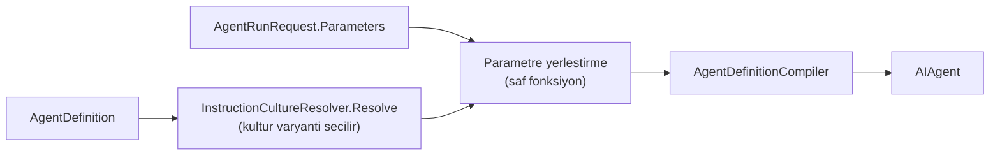

# Faz 86 — Talimatın Girdi Yüzeyi

> **Durum:** 📋 Planlandı (2026-08-21)
> **Kaynak:** [ADAYLAR.md](ADAYLAR.md) · **F-34** — Dalga 14 Küme P (2026-08-21'de yeniden yargılandı; belge kanalını devraldı)
> **Önkoşul:** [Faz 72](72-COK-DILLI-TALIMAT-VE-ZAMAN-DAMGALI-SENTEZ.md) — `InstructionsByCulture` ve `InstructionCultureResolver` oradan gelir; parametre yerleştirme **onun çıktısına** uygulanır · [Faz 19](arsiv/fazlar/19-SURUM-KARSILASTIRMA-VE-AB.md) (sürümleme) — kalemin değeri sürüm geçmişidir · [Faz 18](arsiv/fazlar/18-DEGERLENDIRME.md) · [Faz 45](arsiv/fazlar/45-URETIMDEN-EVAL-KUMESI.md) (eval vakası şeması)
> **Paketler:** `AgentPrism.Abstractions`, `AgentPrism.Core`, `AgentPrism.AspNetCore`, `AgentPrism.Sql.Shared` (üç SQL paketine linked-source, K-176), `AgentPrism.UI`
> **Yeni paket:** Yok — yerleştirme saf bir fonksiyondur, şablon motoru **alınmaz** · **Migration:** 🚨 **Gerekli — ama yalnız eval tarafı için.** Agent tanımı `jsonb`'dir (ölçüldü: `agent_definitions.definition jsonb`), parametre şeması oraya migration'sız girer. `eval_cases` **sütun tabanlıdır** (ölçüldü) → parametre seti için üç migration seti. Numaralar uygulama anında alınır (K-178)
> **Public API:** Büyüyor — parametre tipi, `AgentDefinition` alanı, `AgentRunRequest` alanı, belge tipi, `EvalCase` alanı. `PublicAPI.Shipped.txt` toplamı **16 satır** (yalnız başlıklar; ölçüldü 2026-08-21) → Faz 7'den önce eklemek **bedava**, sonra bir sürüm kararıdır
> **Tüketici yüzeyi:** `docs-site/` → `concepts/agents.md` (parametreli tanım), `concepts/governance.md` (belge kanalının **ne olmadığı**), `concepts/evaluation.md` (parametreli vaka), `reference/configuration.md`, `capabilities.md`
> · sevk edilen: yeni tiplerin XML dokümanı ve `<example>`'ları, `src/AgentPrism.Abstractions/README.md`. `api/` ve `http-api/` **üretilir**
> **Manuel test alanı:** [`docs/manuel-test/02-CEKIRDEK-VE-KATALOG.md`](manuel-test/02-CEKIRDEK-VE-KATALOG.md) (parametre) · [`docs/manuel-test/22-GUARDRAIL-VE-YAPISAL-CIKTI.md`](manuel-test/22-GUARDRAIL-VE-YAPISAL-CIKTI.md) (belge kanalı)

---

## Bu Faza Başlarken

> `faz-baslangic` skill'ini uygula. Aşağıdaki liste o skill'in 2. adımıdır —
> **tamamını değil, yalnız işaret edilen bölümleri oku.**

1. Bu doküman
2. Kararlar — dosyanın tamamını **okuma**, yalnız bu kalemleri grep'le:
   ```bash
   grep -n "K-503\|K-232\|K-228\|K-421\|K-178\|K-176" docs/KARARLAR.md
   ```
   **K-503** (kültür çözümlemesinin sınırı — parametre yerleştirme aynı sınırı
   miras alır), **K-232** (sunucu yanıtları çevrilmez), **K-228** (arayüz metni
   iki sözlükten), **K-421** (public API takibi açık), **K-178** (migration
   numaraları sağlayıcı başına bağımsız), **K-176** (linked-source SQL paylaşımı).
3. [`72-COK-DILLI-TALIMAT-VE-ZAMAN-DAMGALI-SENTEZ.md`](72-COK-DILLI-TALIMAT-VE-ZAMAN-DAMGALI-SENTEZ.md) — yalnız devir notu:
   ```bash
   awk '/^## Sonraki Faza Devir Notu/,0' docs/72-COK-DILLI-TALIMAT-VE-ZAMAN-DAMGALI-SENTEZ.md
   ```
   Kültür çözümlemesinin **hangi yollarda çalıştığı** oradadır. Parametre
   yerleştirme aynı yollarda çalışmak zorundadır; F-123 o yolların **eksik**
   olduğunu söylüyor (eval · replay · alt-agent her zaman `culture: null`).
4. Alan hafızası (bu faz üç alana dokunuyor):
   [`hafiza/cekirdek-calistirma.md`](hafiza/cekirdek-calistirma.md) (derleme ve koşu yolu) ·
   [`hafiza/sql-saglayicilari.md`](hafiza/sql-saglayicilari.md) (üç migration seti) ·
   [`hafiza/frontend.md`](hafiza/frontend.md) (parametre formu ve sözlük)
5. Gerektiğinde, tamamı değil ilgili bölümü:
   [`MIMARI.md`](MIMARI.md) — agent derleme yolu

---

## Amaç

AgentPrism'in agent tanımı bugün **parametresizdir**. `Instructions` düz
metindir; `InstructionsByCulture` yalnız **dile** göre varyant verir. Koşu
isteği de bir parametre taşımaz. Sonuç: parametreli bir agent AgentPrism
tanımına **taşınamaz**.

Bu bir ergonomi eksiği değildir. Ölçülen tüketicinin iki yolu vardır ve ikisi de
kayıp verir:

| Yol | Kaybedilen |
|---|---|
| Parametreyi kullanıcı mesajına koymak | Talimat **veri kanalına** iner — kalemin ikinci yarısını kötüleştirir |
| Her çağrıda `AddAgent(name, factory)` ile dinamik agent üretmek | Sürüm geçmişi **silinir**; kod agent'larının sürümü yoktur, yani sürümleme · eval · deney · canary kazanımlarının **tamamı** erişilemez olur |

Kalemin ikinci yarısı aynı kanaldadır: modele giden içerikte *"bu veri, talimat
değil"* işareti yoktur. Faz 48 guard'ları **kalıp** tabanlıdır ve bilinen
desenleri arar; kullanıcının yazdığı uzun bir metnin talimatın içine gömülmesi
kalıpla yakalanmaz — metin zararsız görünür.

- **F-34** — `AgentDefinition` üzerinde tipli parametre şeması · koşu isteğinde
  parametre sözlüğü · yalnız değer yerleştirme · belge kanalı ve onun kaydı.

### 🚨 Bu faz bir güvenlik garantisi vermez

Belge kanalı bir **konvansiyon ve denetim** kalemidir. Hiçbir sağlayıcı
*"bu veri, talimat değil"* için sert garanti vermiyor. Fazın adı ve sevk edilen
metni **"prompt injection koruması" olmamalıdır** — yanlış güven duygusu üretmek
hiç yapmamaktan kötüdür. Sayfa metni bunu açıkça yazar.

### Bugün ne çalışmıyor — doğrulanmış kanıt

| Kanıt | Gözlem |
|---|---|
| [`AgentDefinition.cs:33`](../src/AgentPrism.Abstractions/Agents/AgentDefinition.cs#L33) | `Instructions` düz `string?` — yer tutucu kavramı yok |
| [`AgentDefinition.cs:41`](../src/AgentPrism.Abstractions/Agents/AgentDefinition.cs#L41) | `InstructionsByCulture` yalnız **dile** göre varyant verir |
| [`AgentContracts.cs:212-282`](../src/AgentPrism.AspNetCore/Contracts/AgentContracts.cs) | `AgentRunRequest` **tam altı** alan taşır: `Message`, `SessionId`, `Culture`, `Approvals`, `ToolResults`, `AttachmentIds`. Parametre **yok**, belge **yok** |
| [`InstructionCultureResolver.cs`](../src/AgentPrism.Core/Compilation/InstructionCultureResolver.cs) | `public static Resolve(definition, culture)` — yerleştirmenin gireceği **temiz dikiş** budur |
| [`EvalCase.cs`](../src/AgentPrism.Abstractions/Evaluation/EvalCase.cs) | `Query`, `ExpectedOutput`, `ExpectedTools`, `Context` — parametre seti **yok** |
| `agent_definitions.definition` | `jsonb` (`0001_initial.sql:34`) → parametre şeması migration **istemez** |
| `eval_cases` | **Sütun tabanlı** (`0009_eval.sql:15`) → parametre seti migration **ister** |
| [`82-ICERIK-KORUMASI.md`](82-ICERIK-KORUMASI.md) | At-rest şifrelemedir; belge/talimat ayrımını **kapsamaz** |
| `RunEventType` | 24 üye (`0`…`23`), `run_events.type smallint` → yeni olay tipi migration **istemez** |

> Kanıtlar 2026-08-21 tarihinde yeniden ölçüldü. Aday listesinin
> *"Migration: agent tanımı yükü zaten `jsonb`"* satırı **yarım doğrudur** —
> eval yarısı için üç migration seti gerekir.

---

## 86.1 — Parametre şeması: yalnız skaler

👤 **Karar (2026-08-21): yalnız skaler** — `string`, `number`, `bool`.

Gerekçe üç kattır: JSON-güvenli kaçış tek satırlık kalır · AOT duruşu bozulmaz
(çözümleyici, yol ayırıcı, yansıma yok) · K2'nin ruhu korunur. Bir tüketicinin
liste ihtiyacı çıkarsa listeyi **tek bir `string` olarak** verebilir; kütüphane
onun ayırıcısını seçmek zorunda kalmaz.

```csharp
public sealed record AgentParameter
{
    public required string Name { get; init; }
    public required AgentParameterKind Kind { get; init; }   // Text | Number | Boolean
    public bool Required { get; init; }
    public string? DefaultValue { get; init; }
    public string? Description { get; init; }
}
```

**Tanım derlenirken doğrulanır.** `AgentDefinitionCompiler` şu üç şeyi kontrol
eder ve ihlalde **derlemeyi düşürür**:

1. Talimatta geçen her `{{ad}}` şemada tanımlıdır
2. Şemadaki her ad geçerli bir tanımlayıcıdır (harf, rakam, alt çizgi)
3. Aynı ad iki kez tanımlanmamıştır

🚨 **Her kültür varyantı aynı şemayı kullanır.** `InstructionsByCulture`
sözlüğündeki **her** metin aynı `{{ad}}` kümesiyle doğrulanır. Bir varyantın
fazladan yer tutucu taşıması derleme hatasıdır — aksi hâlde bir dil çalışır,
diğeri çalışma anında düşer.

## 86.2 — Yerleştirme: yalnız değer, ifade yok

🚨 **Bu kısıt kalemin en değerli parçasıdır ve gevşetilmemelidir.**

| Var | Yok |
|---|---|
| `{{ad}}` — değer yerleştirme | İfade, koşul, döngü, filtre, fonksiyon |
| JSON-güvenli kaçış | Alt alan erişimi (`{{a.b}}`), dizi indeksi |

Scriban gibi tam bir motor **alınmaz**: hem K2'yi hem AOT duruşunu zorlar. Bir
şablon dili kütüphaneye girdikten sonra çıkmaz ve her tüketici kendi lehçesini
ister; *"yalnız `{{ad}}`"* kısıtını her sürümde yeniden savunmak gerekir. Bu
cümle sevk edilen XML dokümanına da girer.

**Yerleştirme nerede olur.** Kültür çözümlemesinin **hemen sonrası**:



**JSON-güvenli kaçış yerleşiktir.** Talimat bir JSON parçası taşıyorsa (tool
şema örneği, çıktı şablonu) yerleştirilen değer yapıyı bozamaz. Yer tutucu bir
JSON string değerinin içindeyse değer kaçırılarak yazılır.

🚨 **Kaçışın bağlamı ölçülmelidir.** Yer tutucunun JSON içinde mi düz metinde mi
olduğunu anlamak bir ayrıştırma işidir. Uygulayan oturum iki seçeneği ölçmelidir:
(a) her zaman kaçır — düz metinde ters bölü çöpü üretir; (b) yer tutucunun
etrafındaki tırnak durumuna bak. Bu **Açık Soru 1**'dir.

## 86.3 — Eksik parametre koşuyu düşürür

**Şemayla eşleşmezse koşu başlamaz.** Sessizce boş bırakmak bir üretim hatasıdır
ve varsayılan olmamalıdır.

Aynı hata üç uçta da aynı biçimde döner — ölçüldü, üçü de vardır:

| Uç | Bugünkü yeri | Davranış |
|---|---|---|
| `POST /api/agents/{name}/run` | `AgentEndpoints.cs` | Koşu **başlamaz**; `400` |
| `POST /api/agents/validate` | [`AgentEndpoints.cs:87`](../src/AgentPrism.AspNetCore/Endpoints/AgentEndpoints.cs#L87) | Aynı hata |
| `POST /api/agents/{name}/estimate` | [`AgentEndpoints.cs:285`](../src/AgentPrism.AspNetCore/Endpoints/AgentEndpoints.cs#L285) | Aynı hata |

Üçünün **aynı** doğrulayıcıyı çağırması zorunludur. 🚨 Bu repo'da
"senkronizasyon kopyası" beş kez yaşandı — doğrulama mantığı tek bir yerde
yaşar, üç uç onu çağırır.

Fazladan gönderilen bir parametre de hatadır: şemada olmayan bir ad sessizce
yutulursa yazım hatası üretimde görünmez kalır.

## 86.4 — Belge kanalı

👤 **Karar (2026-08-21): belge ayrı bir `ChatMessage` olarak girer**,
sınırlayıcıyla sarılır ve `AIContent.AdditionalProperties` ile işaretlenir.

🚨 **Ölçüm kalemin varsayımını değiştirdi.** Aday listesi *"sağlayıcı sınırında
uygun biçimde sarmalanır (biçim her sağlayıcı için ayrı ölçülür)"* diyordu.
`maf-api-kesfi` ile ölçüldü (2026-08-21): `Microsoft.Extensions.AI` içinde
**`DocumentContent` diye bir tip yoktur.** `AIContent` türevlerinin tamamı:

```
TextContent · DataContent · UriContent · HostedFileContent · HostedVectorStoreContent
ErrorContent · TextReasoningContent · UsageContent · ToolCallContent · ToolResultContent
FunctionCallContent · FunctionResultContent · InputRequestContent · InputResponseContent
ToolApprovalRequestContent · ToolApprovalResponseContent · CodeInterpreterTool*Content
ImageGenerationTool*Content · McpServerTool*Content · WebSearchTool*Content
```

Yani **sağlayıcı başına sarmalama biçimi diye bir soyutlama yüzeyi yoktur.**
Biçim her sağlayıcıda **aynı** olmak zorundadır ve AgentPrism seviyesinde bir
konvansiyondur. Bu, planlamayı **basitleştirir** — "hangi sağlayıcılar bu fazda
kapsanacak" sorusu düşer: hepsi, aynı biçimle.

```csharp
public sealed record AgentRunDocument
{
    /// <summary>The document's name, shown to the model inside the delimiter.</summary>
    public required string Name { get; init; }

    /// <summary>The document's text. Never treated as instructions.</summary>
    public required string Content { get; init; }
}
```

Belge kendi `ChatMessage`'ında, `TextContent` olarak, sınırlayıcıyla sarılı
yaşar; `AdditionalProperties` bir işaret taşır ki kayıt tarafı onu talimattan
ayırabilsin.

**Kayıt.** `RunEventType` bugün 24 üye taşır ve `run_events.type` bir
`smallint`'tir → yeni bir olay tipi (`DocumentAttached` gibi) **migration
istemez**. Olay belgenin **adını** ve boyutunu taşır; içeriğini taşıması bir
karardır (Açık Soru 3).

**K3 korunur.** Paralel bir içerik hiyerarşisi kurulmaz. `ChatMessage`,
`TextContent` ve `AIContent.AdditionalProperties` **doğrudan** kullanılır.

## 86.5 — Paylaşılan blok ve eval vakası

**Paylaşılan blok.** On agent aynı "kurum kuralları" bloğunu kopyalıyorsa tek
yerden değiştirmenin yolu yoktur. Blok bir tanım olarak yaşar; agent tanımı ona
adıyla referans verir. 🚨 Referans **özyinelemeli olamaz** — bir blok başka bir
bloğa referans veremez; aksi hâlde döngü tespiti gerekir ve bu bir motorun ilk
adımıdır.

**Eval vakası bir parametre seti taşır.** Aksi hâlde parametreli bir agent
değerlendirilemez ve kalem kendi değerini keser: fazın gerekçesi tam olarak
"sürümleme ve eval kazanımını almak"tır.

🚨 **Burası migration gerektirir.** `eval_cases` sütun tabanlıdır; parametre
seti için üç sağlayıcıda birer migration yazılır (PostgreSQL · SQL Server ·
SQLite). Numaralar **uygulama anında** alınır (K-178) — plan numara rezerve
etmez.

---

## Planlanan Public API

> Taslak imzalardır. Gerçekleşen imzalar kapanışta ayrı bir bölüme yazılır.

```csharp
// AgentPrism.Abstractions
public enum AgentParameterKind { Text = 0, Number = 1, Boolean = 2 }

public sealed record AgentParameter
{
    public required string Name { get; init; }
    public required AgentParameterKind Kind { get; init; }
    public bool Required { get; init; }
    public string? DefaultValue { get; init; }
    public string? Description { get; init; }
}

public sealed record AgentRunDocument
{
    public required string Name { get; init; }
    public required string Content { get; init; }
}

// AgentDefinition uzerine EK alan (jsonb — migration yok)
public sealed record AgentDefinition
{
    // ... bugunku alanlar ...
    public IReadOnlyList<AgentParameter> Parameters { get; init; } = [];
    public string? SharedInstructionsName { get; init; }
}

// EvalCase uzerine EK alan (SUTUN — migration gerekir)
public sealed record EvalCase
{
    // ... bugunku alanlar ...
    public IReadOnlyDictionary<string, string>? Parameters { get; init; }
}

// Yerlestirme: saf fonksiyon, sablon motoru DEGIL
public static class InstructionParameterBinder
{
    public static string? Bind(
        string? instructions,
        IReadOnlyList<AgentParameter> schema,
        IReadOnlyDictionary<string, string>? values);
}
```

```csharp
// AgentPrism.AspNetCore — AgentRunRequest uzerine IKI alan
public sealed record AgentRunRequest
{
    // ... bugunku alti alan ...
    public IReadOnlyDictionary<string, string>? Parameters { get; init; }
    public IReadOnlyList<AgentRunDocument> Documents { get; init; } = [];
}
```

### HTTP `endpoint`'leri

Yeni uç **yoktur**. Üç var olan ucun gövdesi büyür ve üçü **aynı** doğrulayıcıyı
çağırır.

| Metot | Yol | Rol | Ne yapar |
|---|---|---|---|
| `POST` | `/api/agents/{name}/run` | mevcut | `parameters` ve `documents` kabul eder; eksik parametrede `400` |
| `POST` | `/api/agents/validate` | mevcut | Aynı doğrulama, koşu yapmadan |
| `POST` | `/api/agents/{name}/estimate` | mevcut | Aynı doğrulama, maliyet tahmininden **önce** |

Hata gövdesi **çevrilmez** (K-232).

### Arayüz payı

Arayüz parametreli bir agent için bir form gösterir ve şemadan üretir.
🚨 **Bundle payı ölçülmelidir**: bugünkü kullanım
`ls -l src/AgentPrism.UI/wwwroot/assets/` ile alınır, bütçe **250 KB gzip**
(F-93 kaydına göre bugün 146 KB brotli). Üç skaler tipe form üretmek küçük bir
paydır ama **ölçülmeden yazılmaz**.

Yeni ekran metni `locales/en.ts` **ve** `tr.ts`'e girer; eksik anahtar
**derleme hatasıdır** (K-228).

---

## Planlanan Dosya Listesi

```
src/AgentPrism.Abstractions/Agents/
├── AgentParameter.cs                     (yeni)
├── AgentParameterKind.cs                 (yeni)
├── AgentDefinition.cs                    (alan eklenir)
└── AgentRunDocument.cs                   (yeni)

src/AgentPrism.Abstractions/Evaluation/
└── EvalCase.cs                           (alan eklenir)

src/AgentPrism.Core/Compilation/
├── InstructionParameterBinder.cs         (yeni — saf fonksiyon)
├── AgentParameterValidator.cs            (yeni — TEK dogrulayici, uc uc onu cagirir)
└── AgentDefinitionCompiler.cs            (sema dogrulamasi eklenir)

src/AgentPrism.Core/Recording/
└── (RunEventType uzerine DocumentAttached — migration yok)

src/AgentPrism.AspNetCore/Contracts/
└── AgentContracts.cs                     (iki alan)

src/AgentPrism.Sql.Shared/Internal/
└── AgentDefinitionPayload.cs             (jsonb yuku)

src/AgentPrism.PostgreSql/Migrations/     (eval_cases — numara uygulama aninda)
src/AgentPrism.SqlServer/Migrations/
src/AgentPrism.Sqlite/Migrations/

src/AgentPrism.UI/frontend/src/
├── (parametre formu)
└── locales/{en,tr}.ts                    (anahtarlar)
```

---

## Hata Modları ve Testler

> Mutlu yoldan değil, **ne bozulabilir**den türetilir. Seviyeyi plan seçer.

| Ne bozulabilir | Seviye | Test sınıfı |
|---|---|---|
| Talimatta tanımsız `{{ad}}` var; derleme geçer | Birim | `AgentParameterValidatorTests` |
| Şemada var, talimatta yok; sessizce yutulur | Birim | `AgentParameterValidatorTests` |
| Bir kültür varyantı fazladan yer tutucu taşır | Birim | `AgentParameterValidatorTests` |
| Değer JSON yapısını bozar (tırnak, ters bölü, satır sonu) | Birim | `InstructionParameterBinderTests` |
| Değer bir `{{ad}}` içerir → **ikinci tur yerleştirme** olur | Birim | `InstructionParameterBinderTests` — 🚨 yerleştirme **tek geçişlidir** |
| Eksik parametrede `/run` düşer ama `/validate` geçer | Sözleşme | `AgentParameterContract` — üç uç aynı doğrulayıcı |
| Eksik parametrede `/estimate` maliyet tahmini üretir | Sözleşme | `AgentParameterContract` |
| Fazladan parametre sessizce yutulur | Fonksiyonel | `AgentEndpointsTests` |
| Parametre değeri kayda **sır** olarak girer | Sözleşme | `SecretLeakContract` — 🚨 parametre değeri kullanıcı girdisidir ve kaydedilir |
| Belge talimattan ayrılmaz; kayıtta tek metin görünür | Fonksiyonel | `DocumentChannelTests` |
| Belge sınırlayıcısı kullanıcı metninde geçer → **sınırlayıcı kaçışı** | Birim | `DocumentChannelTests` — 🚨 kalemin en kolay yanlış yapılan yeri |
| Parametreli agent eval'de değerlendirilemez | Sözleşme | `EvalCaseContract` — dört koşumda birden |
| `eval_cases` migration'ı üç sağlayıcıda ayrışır | Sözleşme | `EvalStoreContract` — üç SQL sağlayıcısı |
| Başka kiracının paylaşılan bloğu görünür | Sözleşme | `TenantIsolationContract` |
| Paylaşılan blok özyinelemeli referans verir | Birim | `SharedInstructionsTests` — döngü **derlemede** reddedilir |
| Arayüz formu şemayla eşleşmez | E2E | `UiTests` |
| `en.ts`/`tr.ts` anahtar kümesi ayrışır | Birim | derleme hatası (K-228) |

Beş soru ve cevapları:

| Soru | Cevap |
|---|---|
| **İptal** | Yerleştirme saf ve senkron bir fonksiyondur; iptal noktası açmaz |
| **Eşzamanlılık** | Şema tanımın parçasıdır ve `jsonb` ile atomik yazılır; derlenmiş agent önbelleği **şema sürümüyle** anahtarlanmalıdır — aksi hâlde eski şema yeni değerlerle çalışır |
| **Boş/aşırı girdi** | Boş değer `Required` ise hatadır; aşırı uzun değer için bir sınır **gerekir** (Açık Soru 2) |
| **Başka kiracı** | Paylaşılan blok kiracıya bağlıdır; `TenantIsolationContract` sabitler |
| **Alt sistem hatası** | Blok deposu okunamazsa derleme **düşer** — sessiz bir "blok yok" davranışı talimatı eksik gönderir ve bu bir üretim hatasıdır |

---

## Manuel Kabul Case'leri

| # | Ön koşul | Adımlar | Beklenen sonuç |
|---|---|---|---|
| 1 | Parametreli agent tanımlı (`{{musteri}}` zorunlu) | `parameters` olmadan `POST .../run` | `400`; gövde eksik parametrenin **adını** söyler |
| 2 | Aynı agent | Aynı istek `/validate` ve `/estimate` uçlarına | Üçü de **aynı** hatayı döner |
| 3 | Aynı agent | `parameters: {"musteri":"Acme"}` ile `POST .../run` | Koşu çalışır; kayıtta talimat yerleştirilmiş hâliyle görünür |
| 4 | Talimat bir JSON örneği taşır | Parametre değeri `a"b\c` gönderilir | Üretilen talimat **geçerli JSON** taşır |
| 5 | Parametre değeri `{{baska}}` içerir | Koşu yapılır | İkinci tur yerleştirme **olmaz**; değer harfiyen görünür |
| 6 | İki kültür varyantlı agent | `tr` ve `en` ile koşulur | İkisi de **aynı** parametre kümesini ister |
| 7 | Belge kanalı | `documents: [{name, content}]` ile koşulur | Kayıtta belge talimattan **ayrı** görünür; `run_events` bir belge olayı taşır |
| 8 | Belge içeriği sınırlayıcı dizisini içerir | Koşu yapılır | Sınırlayıcı kaçırılır; belge sınırı **kırılmaz** |
| 9 | Parametreli agent + eval seti | Vaka parametre setiyle koşulur | Eval geçer; parametresiz vaka **açık** bir hata verir |
| 10 | 👤 insan gerekir | Arayüzde parametreli agent açılır | Şemadan üretilmiş form görünür; zorunlu alan boşken çalıştır düğmesi engellenir |

---

## Açık Sorular

| # | Soru | Seçenekler | Öneri |
|---|---|---|---|
| 1 | JSON kaçışı **her zaman** mı, yoksa bağlama bakılarak mı? | A: her zaman kaçır · B: yer tutucunun tırnak içinde olup olmadığına bak | **B**, ama ölçümle: A düz metinde ters bölü çöpü üretir ve talimatın okunabilirliğini bozar. B bir mini tarayıcı ister; maliyeti uygulama anında ölçülmeli |
| 2 | Parametre değeri için boyut sınırı ne olsun? | A: `AgentPrismOptions`'ta tek bir sınır · B: parametre başına sınır | **A** — `MaxInstructionsLength` emsali var ([`SkillEndpoints.cs:161`](../src/AgentPrism.AspNetCore/Endpoints/SkillEndpoints.cs#L161), UTF-8 bayt). Parametre başına sınır şemayı şişirir |
| 3 | Belge olayı içeriği de taşısın mı, yalnız ad ve boyut mu? | A: ad + boyut + karma · B: tam içerik | **A** — tam içerik `run_events`'i şişirir ve Faz 82'nin at-rest kapsamını genişletir. Karma "hangi belge girdi" sorusunu cevaplar |
| 4 | Paylaşılan blok yeni bir **tablo** mu, agent tanımının bir türü mü? | A: var olan `agent_definitions` içinde bir tür · B: yeni tablo | **A** — sürümleme, kiracılık ve denetim izi **bedava** gelir; yeni tablo üç migration seti daha ister |
| 5 | Derlenmiş agent önbelleği şema değişince nasıl geçersizleşir? | A: tanım sürümü anahtara zaten dâhil · B: ayrı bir şema damgası | **A** — önce **ölç**: `CompiledAgentCache` anahtarı tanım sürümünü taşıyorsa iş yoktur |
| 6 | Belge kanalı `AttachmentIds` ile nasıl ayrışır? | A: belge = metin, ek = ikili · B: ek yolu belge olarak da kullanılabilir | **A** — iki kavramın karışması Faz 14'ün ek yolunu bulanıklaştırır |

---

## Bitiş Ölçütleri (DoD)

- [ ] `POST /api/agents/{name}/run` eksik zorunlu parametrede `400` döner ve eksik parametrenin **adını** söyler
- [ ] `/validate` ve `/estimate` **aynı** hatayı döner (tek doğrulayıcı, üç çağıran)
- [ ] JSON taşıyan bir talimat, tırnak içeren bir değerle yerleştirildiğinde **geçerli JSON** üretir
- [ ] Yerleştirme **tek geçişlidir**: değerin içindeki `{{ad}}` yeniden yerleştirilmez
- [ ] Her kültür varyantı aynı parametre kümesiyle doğrulanır; fazlası derleme hatasıdır
- [ ] Belge kanalı kayıtta talimattan **ayrı** görünür
- [ ] Belge içeriğindeki sınırlayıcı dizisi kaçırılır
- [ ] Parametreli agent bir eval setinde koşar
- [ ] Üç migration seti (PostgreSQL · SQL Server · SQLite) yazıldı ve `EvalStoreContract` üçünde geçti
- [ ] Dört doğrulama kapısı sıfır uyarı verir
- [ ] `samples/AgentPrism.Api` ile gerçek `run` yapıldı, çıktı belgeye yazıldı
- [ ] `secret` taraması boş döndü
- [ ] Manuel kabul case'leri `docs/manuel-test/02-*` ve `22-*` içine eklendi; otomatikleştirilebilenler koşuldu
- [ ] `faz-denetim` koşuldu; 🔴 bulgu kalmadı
- [ ] `docs-site/` güncellendi; `npm run build` + `check-links.mjs` temiz. Belge kanalı sayfası **güvenlik garantisi vaat etmiyor**
- [ ] `en.ts` ve `tr.ts` eksiksiz; bundle payı **ölçüldü ve yazıldı**

### Doğrulama komutları

```bash
# Eksik parametre uc ucta da ayni hatayi veriyor mu
for p in run validate estimate; do
  curl -s -X POST http://localhost:5081/agentprism/api/agents/parametreli/$p \
    -H 'content-type: application/json' -d '{"message":"selam"}' | jq -r '.title'
done

# Belge kaydi talimattan ayri mi
curl -s http://localhost:5081/agentprism/api/runs/$RUN_ID/events | jq '.[] | select(.type=="DocumentAttached")'

# Bundle payi
ls -l src/AgentPrism.UI/wwwroot/assets/
```

---

## Riskler

| Risk | Önlem |
|------|-------|
| 🚨 Şablon dili bir **güvenlik yüzeyidir** | Yalnız değer yerleştirme. İfade/koşul/döngü yok. Kısıt XML dokümanına ve site sayfasına yazılır; her sürümde savunulur |
| Eksik parametre davranışı **sessiz** olur | Varsayılan yoktur: koşu düşer. Üç uç aynı doğrulayıcıyı çağırır ve sözleşme testi bunu dört koşumda sabitler |
| Belge kanalı kapasitesinden fazlasını vaat eder | Fazın adı ve metni "prompt injection koruması" **demez**. Site sayfası sınırı açıkça yazar |
| Yerleştirme özyinelemeye döner | Tek geçiş. Değerin içindeki `{{ad}}` harfiyen kalır; birim testi bunu sabitler |
| Paylaşılan blok döngü kurar | Blok bloğa referans veremez; derlemede reddedilir |
| Parametre değeri sır taşır ve kaydedilir | Değer kullanıcı girdisidir ve kaydedilir — bu **bilinen** bir davranıştır ve dokümana yazılır. `APG0201` emsali: sır tanıma **değil** tanıma yazılmaz |
| Derlenmiş agent önbelleği eski şemayla çalışır | Açık Soru 5 — önbellek anahtarı **önce ölçülür** |
| İki migration seti kayar (K-178) | Numaralar uygulama anında, sağlayıcı başına bağımsız alınır. Plan numara **rezerve etmez** |

---

<!-- ============================================================
     AŞAĞISI KAPANIŞTA DOLDURULUR — `faz-tamamlama` skill'i.
     Plan anında boş kalır. Başlıkları SİLME.
     ============================================================ -->

## Plandan Sapmalar

> Kapanışta doldurulur. Plan ile gerçek arasındaki fark **gizlenmez** — sonraki
> oturumun en değerli bilgisidir.

## Bu Fazda Verilen Kararlar

> Kapanışta doldurulur. K-NNN numaraları burada alınır; plan numara rezerve etmez.

## Gerçekleşen Public API

> Kapanışta doldurulur. Koddaki **gerçek** imzalar.

## Dosya Listesi (gerçekleşen)

> Kapanışta doldurulur.

## Denetim Bulguları

> Kapanışta doldurulur — `faz-denetim` çıktısı. Her satır: bulgu · seviye
> (🔴/🟡/🟢) · sonuç (düzeltildi / gerekçelendi / F-NN olarak devredildi).
> Bulgu yoksa "🔴 ve 🟡 yok" yazılır; boş bırakılmaz.

## Sonraki Faza Devir Notu

> Kapanışta doldurulur: devralınan sözleşmeler, bilinen tuzaklar (🚨), yarım
> kalan işler, sıradaki faz.
