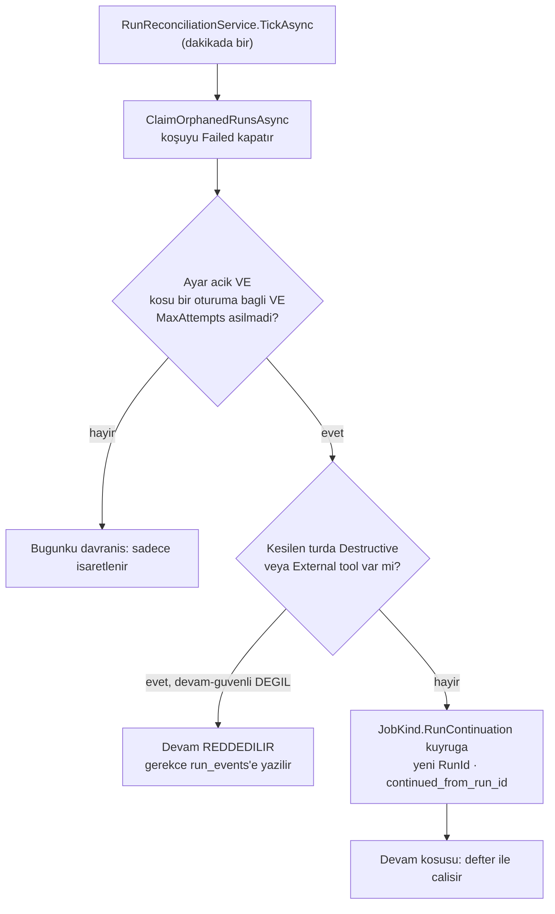

# Faz 87 — Kesilen İşin Devamı

> **Durum:** 📋 Planlandı (2026-08-21)
> **Kaynak:** [ADAYLAR.md](ADAYLAR.md) · **F-141** — Dalga 14 Küme D
> **Önkoşul:** [Faz 46](arsiv/fazlar/46-DAYANIKLI-CALISTIRMA.md) — iş kuyruğu ve `202 Accepted` sözleşmesi · [Faz 47](arsiv/fazlar/47-YENIDEN-OYNATMA-VE-DALLANDIRMA.md) — `RecordedToolPlayback` defteri · [Faz 54](arsiv/fazlar/54-OKSUZ-CALISTIRMA-UZLASTIRMASI.md) — öksüz uzlaştırma, tetikleyicinin takılacağı yer · [Faz 55](arsiv/fazlar/55-ASENKRON-ONAY-KUTUSU.md) — `ApprovalResume` emsali · [Faz 44](arsiv/fazlar/44-HATA-SINIFLANDIRMA.md) — tipli sağlayıcı hataları (geçici/kalıcı ayrımı metin eşleştirmesi **gerektirmez**)
> **Paketler:** `AgentPrism.Abstractions`, `AgentPrism.Core`, `AgentPrism.Workflows`, `AgentPrism.Sql.Shared` (linked-source, K-176), `AgentPrism.AspNetCore`
> **Yeni paket:** Yok · **Migration:** **Gerekli** — `runs` tablosuna nullable bir "hangi koşudan devam" kolonu. Üç set (PostgreSQL · SQL Server · SQLite); numaralar uygulama anında alınır (K-178)
> **Public API:** Büyüyor — 1 enum üyesi, 1 ayar bölümü, 1 tool alanı, 1 workflow retry politikası. `PublicAPI.Shipped.txt` toplamı **16 satır** (yalnız başlıklar; ölçüldü 2026-08-21) → Faz 7'den önce eklemek **bedava**
> **Tüketici yüzeyi:** `docs-site/` → `guides/reliability.md`, `guides/background-work.md`, `concepts/runs.md`, `concepts/workflows.md`, `reference/configuration.md`, `capabilities.md`
> · sevk edilen: yeni ayar ve tool alanının XML dokümanı, `src/AgentPrism.Core/README.md`. `api/` ve `http-api/` **üretilir**
> **Manuel test alanı:** [`docs/manuel-test/21-DAYANIKLILIK-VE-IPTAL.md`](manuel-test/21-DAYANIKLILIK-VE-IPTAL.md) · [`docs/manuel-test/15-WORKFLOWS.md`](manuel-test/15-WORKFLOWS.md)

---

## Bu Faza Başlarken

> `faz-baslangic` skill'ini uygula. Aşağıdaki liste o skill'in 2. adımıdır —
> **tamamını değil, yalnız işaret edilen bölümleri oku.**

1. Bu doküman
2. Kararlar — dosyanın tamamını **okuma**, yalnız bu kalemleri grep'le:
   ```bash
   grep -n "K-315\|K-498\|K-284\|K-178\|K-014" docs/KARARLAR.md
   ```
   🚨 **K-315** (yeniden oynatma **oturumsuzdur**) — bu fazın en kritik sınırı;
   iki işlem **ayrı adlandırılmalıdır**.
   🚨 **K-498** (kontrol noktasından devam sözleşmesi **ölçüldü**: en son
   kontrol noktası kod düğümünü yeniden **çağırmaz**, daha erken bir kontrol
   noktası **çağırır** → işleyici idempotent olmak **zorundadır**) — bu fazın
   workflow yarısının temeli.
   **K-284** (kira tablosu deseni), **K-178** (migration numaraları),
   **K-014** (`run_events` append-only).
3. [`54-OKSUZ-CALISTIRMA-UZLASTIRMASI.md`](arsiv/fazlar/54-OKSUZ-CALISTIRMA-UZLASTIRMASI.md) — yalnız devir notu:
   ```bash
   awk '/^## Sonraki Faza Devir Notu/,0' docs/arsiv/fazlar/54-OKSUZ-CALISTIRMA-UZLASTIRMASI.md
   ```
   Tetikleyici **tam olarak oraya** takılır. Uzlaştırmanın bugünkü tek işi
   kapatmaktır; bu faz ona ikinci bir iş ekler.
4. Alan hafızası (bu faz dört alana dokunuyor):
   [`hafiza/cekirdek-calistirma.md`](hafiza/cekirdek-calistirma.md) (🚨 `AsyncLocal` tuzağı — **beş kez** yaşandı) ·
   [`hafiza/workflows.md`](hafiza/workflows.md) (checkpoint ve süper adım) ·
   [`hafiza/sql-saglayicilari.md`](hafiza/sql-saglayicilari.md) (üç migration seti) ·
   [`hafiza/test-altyapisi.md`](hafiza/test-altyapisi.md) (sözleşme testi dört koşum)
5. Gerektiğinde, tamamı değil ilgili bölümü:
   [`MIMARI.md`](MIMARI.md) — çalıştırma yolu ve iş kuyruğu

---

## Amaç

Dayanıklılık bugün **elle bir düğmeye** bağlıdır. Süreç yeniden başladığında
(deploy, çökme, ölçek olayı) koşu kaybolur ve uzlaştırma onu yalnız
**işaretler**. Kesilen bir workflow için `resume` ucu vardır ama **elle**
çağrılır. Bir düğüm geçici bir sağlayıcı hatasıyla düşerse **tüm koşu** düşer.

**Kritik gözlem — kayıp veri yoktur.** Kesilen turun bilgisi diskte durur ve
mekanizma **iki parça hâlinde zaten mevcuttur**. Eksik olan üçüncü parça onları
birleştiren **tetikleyicidir**.

- **F-141** — Agent turu ile workflow düğümü için **tek** devam sözleşmesi:
  devam kaydı, deneme sayısı, yan etki kısıtı bir kez yazılır.

### 🚨 Bu tasarım MAF'a kanca takmaz

F-95 şu ölçümle kapsam dışına alınmıştı: *"MAF agent düzeyinde kanca vermiyor;
kancayı AgentPrism yazmak K3'ü zorlar."* **O ölçüm doğrudur ve bu faz onu
tartışmıyor.** Kullanılan üç şeyin üçü de AgentPrism'in kendi kaydıdır:
`run_events` · `RecordedToolPlayback` defteri · iş kuyruğu. F-95 kapsam dışı
listesinde **kalır**.

### Bugün ne çalışmıyor — doğrulanmış kanıt

| Kanıt | Gözlem |
|---|---|
| [`SqlRunStore.cs:263`](../src/AgentPrism.Sql.Shared/Stores/SqlRunStore.cs#L263) | `ClaimOrphanedRunsAsync` öksüz koşuyu `Failed` + `Infrastructure` kapatır ve bir `RunFailed` olayı yazar. **Kuyruğa koymaz** |
| [`RunReconciliationService.cs:91`](../src/AgentPrism.Core/Recording/RunReconciliationService.cs#L91) | `TickAsync` yalnız talep eder ve loglar; checkpoint'i olan koşuyu ayırt **etmez** |
| `src/AgentPrism.Workflows` içinde `retry`/`backoff` araması | **0 eşleşme** — düğüm başına retry politikası yok |
| [`AgentPrismWorkflowOptions.cs:25,49,60`](../src/AgentPrism.Workflows/AgentPrismWorkflowOptions.cs) | `EnableCheckpointing` = **`true`**, `MaxSuperSteps` = **100**, `KeepCheckpointsAfterCompletion` = **`true`** → dayanıklılık **var**, otomatiklik yok |
| [`RecordedToolPlayback.cs:25`](../src/AgentPrism.Core/Replay/RecordedToolPlayback.cs#L25) | `internal sealed class`; `(tool adı, argümanlar)` çiftiyle eşleştirir — public yüzey büyümez |
| `AgentSessionManager.SaveSessionAsync` | **Açık** bir çağrıdır (13 çağrı yeri); yarıda kesilen bir tur oturumu **tur öncesi** hâlinde bırakır |
| `runs` tablosu | `session_id text` **var**; `parent_run_id`·`root_run_id`·`heartbeat_at` da var → yeni kolon için net emsal |

> Kanıtlar 2026-08-21 tarihinde yeniden ölçüldü. Beş satırın beşi de doğrulandı;
> sapma yok.

---

## 87.1 — Adlandırma: `RunContinuation`

👤 **Karar (2026-08-21).** Üç işlem birbirine karışmamalıdır:

| İşlem | Oturum | Kim başlatır | Ne yapar |
|---|---|---|---|
| **Replay** (K-315) | **oturumsuz** | kullanıcı | Kaynak koşuyu yeni ve oturumsuz bir koşu olarak tekrar çalıştırır |
| **`ApprovalResume`** | aynı oturum | kullanıcı (onay kararı) | Bekleyen onayı cevaplar, yeni koşuyla sürdürür |
| **`RunContinuation`** ← bu faz | aynı oturum | **kimse — kendiliğinden** | Kesilen turu yeni bir `RunId` ile sürdürür |

Seçilen adlar: `JobKind.RunContinuation` · `runs.continued_from_run_id` ·
`AgentPrismRunContinuationOptions`.

🚨 **K-315 ihlal edilmez ama teğet geçer.** Replay kaynağın konuşmasına
**yazmaz**; devam **aynı oturumun** kesilen turunu sürdürür ve bunu
`ApprovalResume`'un zaten yaptığı gibi **yeni bir koşuyla** yapar. `run_events`
append-only kalır (K-014).

## 87.2 — Tetikleyici: öksüz koşu kuyruğa girer

Bugün öksüz bir koşu `Failed` kapanır ve orada biter. Bu faz araya bir koşul
ekler.



👤 **Ayar varsayılan `false`** (K1, sıfır sürpriz). Uzlaştırmanın kendi
yapılandırma bölümü altında yaşar. Bir yükseltme hiçbir kurulumun davranışını
sessizce değiştirmez.

**Sonsuz devam döngüsü `MaxAttempts` ile kapatılır.** Devam koşusu da kesilirse
zincir sayılır; sınır aşılınca koşu `Failed` kalır ve bir olay yazılır.

## 87.3 — 🚨 Defterin anlamı devam koşusunda TERSİNE döner

**Bu fazın en kolay yanlış yapılan yeridir ve plan onu açıkça yazar.**

[`RecordedToolPlayback.Take`](../src/AgentPrism.Core/Replay/RecordedToolPlayback.cs)
bugün şunu yapar: eşleşme yoksa `_mismatch` kaydedilir,
`FunctionInvocationContext.Terminate = true` konur ve koşu `422` ile düşer.
[`ReplayToolMode.ReplayTools`](../src/AgentPrism.Abstractions/Runs/RunReplay.cs)
XML dokümanı bunu yazıyor: *"A call with no match **stops** the replay."*

Bu semantik **replay için doğrudur** ve **devam için yanlıştır.** Devam
koşusunda kesinti noktasından **sonraki her çağrı** tanımı gereği eşleşmez —
kaydı yoktur çünkü hiç çalışmamıştır. Bugünkü semantik uygulanırsa devam koşusu
**kesinti noktasında anında düşer** ve faz hiçbir işe yaramaz.

Devam için gereken semantik:

| Durum | Replay (bugün) | Devam (bu faz) |
|---|---|---|
| Defterde eşleşme var | Kayıtlı sonucu döner | Kayıtlı sonucu döner (**aynı**) |
| Defterde eşleşme yok | `Terminate` + `422` | **Tool gövdesi gerçekten çalışır** |

Yani devam koşusu bir **melez**dir: tamamlanmış çağrılar oynatılır, kalanlar
canlı çalışır. Uygulama bunu `RecordedToolPlayback`'i **bozmadan** yapmalıdır —
replay'in kesme davranışı korunur. En temiz yol eşleşmeme politikasını
sarmalayıcıya parametre etmektir; `ReplayToolMode`'a dördüncü bir üye eklemek
**değildir**, çünkü o enum replay isteğinin sözleşmesidir ve devam bir replay
isteği değildir.

### Argüman eşleşmesinin gerçek sınırı

🚨 **`ADAYLAR.md`'nin karşı görüşü ölçümle doğrulandı.** Defter anahtarı
`CreateKey(toolName, arguments)` — argümanların **metin** biçimidir. Argümanları
zamana bağlı bir tool (`now`, rastgele kimlik, sayfa imleci) defterde
**eşleşmez** ve yukarıdaki melez semantikte **sessizce yeniden çalışır**.

Bu bir kusur değil, bir **sınırdır** ve dokümana açıkça yazılır: *devam
garantisi argüman eşleşmesine dayanır; argümanları her çağrıda değişen bir tool
yeniden çalışır.* Bu cümle 87.4'ün neden gerekli olduğunun da gerekçesidir.

## 87.4 — Yan etkili işin tekrarı

👤 **Karar (2026-08-21):** `Destructive` **ve** `External` taşıyan tool'lar için
devam varsayılan olarak **reddedilir**; gevşetme **tool başına, kodda** bildirilir.

🚨 **Ölçüm kalemi genişletti.** Aday listesi yalnız `Destructive`'i yazıyordu.
[`ToolEffect.cs`](../src/AgentPrism.Abstractions/Tools/ToolEffect.cs) dört değer
taşır ve `External = 3`'ün XML dokümanı şunu diyor: *"Data leaves the process
(an external call, a notification, a **payment**)."* Tekrarlanan bir ödeme
silinen bir kayıttan az zararlı değildir.

| `ToolEffect` | Devam | Gerekçe |
|---|---|---|
| `Read = 0` | serbest | Yan etki yok |
| `Write = 1` | serbest | Kalıcı veriyi değiştirir ama geri alınabilir; kayıt zaten defterdedir |
| `Destructive = 2` | **reddedilir** | Geri alınamaz |
| `External = 3` | **reddedilir** | Süreç dışına çıkar; idempotency dış sistemin sorumluluğundadır |

**Gevşetme neden ayarla değil, tool başına?** Tek bir kurulum ayarı kapsamı
toptan açar ve `ADAYLAR.md`'nin karşı görüşü tam bunu işaret ediyor:
*"`ToolEffect` kısıtı gevşetilirse kalem üretimde veri bozar."* Gerçekten
idempotent bir tool (idempotency key taşıyan bir ödeme) bunu **kendi kodunda**
bildirir. Bu K2 ile tutarlıdır: tool'lar yalnız kodda tanımlanır, dolayısıyla
idempotency iddiası da yalnız kodda yapılabilir.

Alan `Effect`'in kardeşidir, aynı yerde yaşar:
[`AgentPrismToolRegistration.cs:63-84`](../src/AgentPrism.Abstractions/Tools/AgentPrismToolRegistration.cs).

Aynı kural workflow düğümü için de geçerlidir — K-498 bunu zaten söylüyor:
işleyici **idempotent olmak zorundadır**.

## 87.5 — Workflow tarafı: düğüm başına retry

Ölçüldü: `src/AgentPrism.Workflows` içinde retry/backoff **0 eşleşme**.

- **Düğüm başına retry politikası**: deneme sayısı + geri çekilme çarpanı.
- **Geçici/kalıcı ayrımı** için tipli sağlayıcı exception'ları **zaten var**
  (Faz 44) — metin eşleştirmesi **gerekmez** ve yazılmaz.
- Checkpoint'i olan takılmış bir koşu `Failed` yerine **kuyruğa geri konur**.

🚨 **Süper adım sınırı nerede sayılır — ÖLÇÜLMELİ.** `MaxSuperSteps` = 100 tek
yapısal sonsuz döngü muhafızıdır. Bir düğüm üç kez denenirse bu üç süper adım mı
sayılır, bir mi? İki cevap da savunulabilir ve yanlış seçim ya muhafızı
etkisizleştirir ya da uzun bir workflow'u erken keser. Uygulayan oturum bunu
**önce ölçer**, sonra yazar. Bu **Açık Soru 2**'dir.

## 87.6 — Ucuz yan kalem: zarif kapanış (drain)

`ApplicationStopping` sinyalinde açık koşular beklenir.

🚨 **`ADAYLAR.md`'nin karşı görüşü kabul edilir, çürütülmez:** ölçülmüş ihtiyaç
**tek instance'lı** bir kurulumdan geliyor ve oradaki asıl acı deploy
kesintisidir; onu zarif kapanış **tek başına, çok daha ucuza** büyük ölçüde
kapatır. Devam mekanizmasının kendisi ancak çökme ve ölçek olayı için gereklidir.

**Sonuç plana yazılır:** drain bu fazın **ilk** teslim edilen parçasıdır. Devam
mekanizması ondan sonra gelir. Böylece faz yarıda kalsa bile ölçülmüş acı
kapanmış olur.

Bekleme **sınırlıdır**: bir zaman aşımı sonrası kapanış devam eder, aksi hâlde
takılmış bir koşu deploy'u kilitler.

## 87.7 — Devam koşu ağacında görünür

Operatör *"bu iş bir kez kesildi ve devam etti"* cümlesini konsolda
okuyabilmelidir. `runs.continued_from_run_id` ağacı kurar;
`parent_run_id`/`root_run_id` emsali aynen izlenir.

Devam **bir alt koşu değildir** — `depth` artmaz. Ağaçta kardeş bir bağdır.

---

## Planlanan Public API

> Taslak imzalardır. Gerçekleşen imzalar kapanışta ayrı bir bölüme yazılır.

```csharp
// AgentPrism.Abstractions
public enum JobKind
{
    // ... bugunku sekiz uye (0..7) ...

    /// <summary>Continues an interrupted run in the SAME session, as a new run.</summary>
    RunContinuation = 8,
}

// AgentPrismToolRegistration uzerine EK alan — Effect'in kardesi
public sealed class AgentPrismToolRegistration
{
    // ... bugunku alti alan ...

    /// <summary>
    /// Whether this tool may run again when a run is continued. Default is
    /// <see langword="false"/> for <see cref="ToolEffect.Destructive"/> and
    /// <see cref="ToolEffect.External"/>; the tool's author declares the
    /// idempotency this flag asserts.
    /// </summary>
    public bool SafeToRepeat { get; }
}

// RunRecord uzerine EK alan
public sealed record RunRecord
{
    // ... bugunku alanlar ...
    public Guid? ContinuedFromRunId { get; init; }
}
```

```csharp
// AgentPrism.Core — uzlastirmanin kendi yapilandirma bolumu altinda
public sealed class AgentPrismRunContinuationOptions
{
    /// <summary>Whether an interrupted run is continued automatically. Default is <see langword="false"/>.</summary>
    public bool Enabled { get; set; }

    /// <summary>The most continuations one chain may have.</summary>
    public int MaxAttempts { get; set; } = 1;
}

// AgentPrism.Core — zarif kapanis
public sealed class AgentPrismDrainOptions
{
    public bool Enabled { get; set; }
    public TimeSpan Timeout { get; set; } = TimeSpan.FromSeconds(30);
}
```

```csharp
// AgentPrism.Workflows
public sealed class WorkflowNodeRetryPolicy
{
    public int MaxAttempts { get; set; } = 1;
    public TimeSpan InitialDelay { get; set; } = TimeSpan.FromSeconds(1);
    public double BackoffMultiplier { get; set; } = 2.0;
}
```

> `SafeToRepeat` bugünkü **kurucu** deseniyle çelişir:
> `AgentPrismToolRegistration` isteğe bağlı parametreli bir kurucu taşır, `init`
> property değil. Yeni parametre kaynak-uyumlu ama **ikili-kırıcıdır**;
> `Shipped.txt` boş olduğu için bugün ucuzdur, Faz 7'den sonra değildir.

### HTTP `endpoint`'leri

Yeni uç **yoktur**. Devam bir **çalışma anı** davranışıdır; elle tetikleme
`resume` ucu ile zaten mümkündür.

| Metot | Yol | Rol | Ne yapar |
|---|---|---|---|
| `GET` | `/api/runs/{id}` | mevcut | Gövde `continuedFromRunId` taşır |
| `GET` | `/api/runs` | mevcut | Devam koşuları ağaçta görünür |

### Arayüz payı

Koşu ağacında bir **bağ etiketi** eklenir ("bu koşu şu koşudan devam etti").
🚨 Bundle payı **ölçülmelidir**; bugünkü kullanım
`ls -l src/AgentPrism.UI/wwwroot/assets/`, bütçe **250 KB gzip**. Yeni metin
`en.ts` **ve** `tr.ts`'e girer (K-228).

---

## Planlanan Dosya Listesi

```
src/AgentPrism.Abstractions/
├── Scheduling/JobKind.cs                 (uye eklenir)
├── Tools/AgentPrismToolRegistration.cs   (alan eklenir)
└── Runs/RunRecord.cs                     (alan eklenir)

src/AgentPrism.Core/
├── Recording/RunReconciliationService.cs (tetikleyici)
├── Scheduling/RunContinuationJobHandler.cs   (yeni)
├── Replay/RecordedToolPlayback.cs        (eslesmeme politikasi parametrelenir)
├── Hosting/AgentPrismDrainService.cs     (yeni — 87.6, ILK teslim)
└── AgentPrismRunContinuationOptions.cs   (yeni)

src/AgentPrism.Workflows/
├── WorkflowNodeRetryPolicy.cs            (yeni)
└── WorkflowRunner.cs                     (retry + kuyruga geri koyma)

src/AgentPrism.Sql.Shared/
├── Stores/SqlRunStore.cs                 (continued_from_run_id)
└── Sql/*.cs                              (uc lehcede sorgu)

src/AgentPrism.PostgreSql/Migrations/     (numara UYGULAMA ANINDA)
src/AgentPrism.SqlServer/Migrations/
src/AgentPrism.Sqlite/Migrations/
```

---

## Hata Modları ve Testler

> Mutlu yoldan değil, **ne bozulabilir**den türetilir. Seviyeyi plan seçer.

| Ne bozulabilir | Seviye | Test sınıfı |
|---|---|---|
| 🚨 Devam koşusu kesinti noktasında `422` ile düşer (defter semantiği tersine dönmemiş) | Fonksiyonel | `RunContinuationPlaybackTests` — **bu fazın birinci hata modudur** |
| Replay'in kesme davranışı bozulur (devam için yapılan değişiklik replay'e sızar) | Sözleşme | `ReplayToolModeContract` — dört koşumda birden |
| Tamamlanmış bir tool devam koşusunda **yeniden** çalışır | Fonksiyonel | `RunContinuationPlaybackTests` |
| `Destructive` tool taşıyan koşu devam eder | Sözleşme | `RunContinuationEffectContract` |
| `External` tool taşıyan koşu devam eder | Sözleşme | `RunContinuationEffectContract` |
| `SafeToRepeat` bildiren tool devam **edemez** | Birim | `ToolRegistrationTests` |
| Ayar kapalıyken devam tetiklenir | Sözleşme | `RunContinuationEffectContract` — 🚨 K1 ihlali en pahalı hatadır |
| Sonsuz devam zinciri (`MaxAttempts` sayılmıyor) | Fonksiyonel | `RunContinuationLimitTests` |
| Oturumsuz koşu devam ettirilir | Fonksiyonel | `RunContinuationTriggerTests` — oturumsuz koşunun sürdürülecek turu **yoktur** |
| Aynı öksüz koşu iki kez kuyruğa girer (iki uzlaştırıcı örneği) | Fonksiyonel | `RunContinuationConcurrencyTests` — `ClaimOrphanedRuns` zaten atomiktir; devam da öyle olmalı |
| Başka kiracının koşusu devam ettirilir | Sözleşme | `TenantIsolationContract` |
| `continued_from_run_id` üç sağlayıcıda ayrışır | Sözleşme | `RunStoreContract` — üç SQL sağlayıcısı |
| Kuyruk yazamazsa uzlaştırma **durur** | Fonksiyonel | `RunContinuationStoreFailureTests` — gözlemlenebilirlik işlevselliği bozmaz; koşu yine `Failed` kapanmalı |
| Workflow düğümü retry'da süper adım sınırını tüketir | Fonksiyonel | `WorkflowRetryTests` — 🚨 önce **ölçülür** (Açık Soru 2) |
| Kalıcı hata retry'lanır | Birim | `WorkflowRetryTests` — Faz 44 tipli hataları kullanılır, **metin eşleştirmesi yok** |
| Drain zaman aşımı yok; kapanış kilitlenir | Fonksiyonel | `DrainServiceTests` |
| Drain sırasında yeni koşu kabul edilir | Fonksiyonel | `DrainServiceTests` |
| 🚨 `AsyncLocal` devam koşusunda akmaz | Fonksiyonel | `RunContinuationTriggerTests` — `scope` **çağıran metodun kendi gövdesinde** açılır |

Beş soru ve cevapları:

| Soru | Cevap |
|---|---|
| **İptal** | Devam koşusu normal bir koşudur; iptal yolu Faz 32'den gelir. Drain iptali **beklemez**, zaman aşımıyla sınırlar |
| **Eşzamanlılık** | İki uzlaştırıcı örneği aynı öksüz koşuyu görebilir; `ClaimOrphanedRuns` atomik talep yapar ve devam kaydı da aynı işlemde yazılmalıdır |
| **Boş/aşırı girdi** | Defteri boş bir koşu (hiç tool çağrısı yok) devam edebilmelidir — melez semantikte her çağrı canlı çalışır |
| **Başka kiracı** | `ClaimOrphanedRuns` `[TenantAgnostic]`'tir (bakım işi); devam koşusu **kaynağın kiracısıyla** kuyruğa girer, ortam kiracısıyla değil |
| **Alt sistem hatası** | Kuyruk yazamazsa koşu yine `Failed` kapanır ve hata loglanır — bugünkü davranış korunur |

---

## Manuel Kabul Case'leri

| # | Ön koşul | Adımlar | Beklenen sonuç |
|---|---|---|---|
| 1 | Ayar **kapalı** (varsayılan) | Koşu ortasında süreç öldürülür; uzlaştırma koşar | Koşu `Failed` kapanır. **Devam yok** — bugünkü davranış |
| 2 | Ayar açık, oturumlu koşu, `Read` tool'lar | Aynı senaryo | Yeni bir koşu kuyruğa girer; `continuedFromRunId` kaynağı gösterir |
| 3 | Aynı senaryo | Devam koşusunun tool çağrıları incelenir | Kesintiden **önceki** çağrılar yeniden çalışmaz; sonrakiler canlı çalışır |
| 4 | Ayar açık, koşuda `Destructive` tool | Aynı senaryo | Devam **reddedilir**; gerekçe `run_events`'te okunur |
| 5 | Ayar açık, koşuda `External` tool | Aynı senaryo | Devam **reddedilir** |
| 6 | Aynı tool `SafeToRepeat` bildirir | Aynı senaryo | Devam **çalışır** |
| 7 | Ayar açık, `MaxAttempts = 1` | Devam koşusu da kesilir | İkinci devam **olmaz**; koşu `Failed` kalır |
| 8 | Ayar açık, **oturumsuz** koşu | Aynı senaryo | Devam **olmaz** — sürdürülecek tur yoktur |
| 9 | Workflow, geçici sağlayıcı hatası veren düğüm | Koşu başlatılır | Düğüm politikaya göre yeniden denenir; koşu **düşmez** |
| 10 | Workflow, kalıcı hata veren düğüm | Koşu başlatılır | Yeniden **denenmez**; koşu düşer |
| 11 | Drain açık | `SIGTERM` gönderilir | Açık koşular tamamlanır; yeni koşu kabul edilmez; zaman aşımı sonrası kapanır |
| 12 | 👤 insan gerekir | Konsolda devam eden bir koşu açılır | "Bu koşu şu koşudan devam etti" bağı görünür ve kaynağa tıklanabilir |

---

## Açık Sorular

| # | Soru | Seçenekler | Öneri |
|---|---|---|---|
| 1 | Eşleşmeme politikası nasıl taşınır? | A: `RecordedToolPlayback` kurucusuna bir politika parametresi · B: ikinci bir sarmalayıcı tipi | **A** — tip `internal`'dır, değiştirmek public yüzeye dokunmaz. B ikinci bir eşleştirme kopyası doğurur (🚨 senkronizasyon kopyası beş kez yaşandı) |
| 2 | 🚨 Bir düğüm yeniden denenirken süper adım sınırı nerede sayılır? | A: her deneme bir süper adım · B: düğüm bir kez sayılır, denemeler sayılmaz | **Önce ölç.** A muhafızı korur ama uzun bir workflow'u erken kesebilir; B döngü muhafızını etkisizleştirebilir. Ölçüm `MaxSuperSteps` sayacının bugün nerede arttığını okumakla başlar |
| 3 | Oturum kaydı kesilen turda ne durumda? | A: tur öncesi hâl kabul edilir · B: tur içi kısmi kayıt eklenir | **A** — `SaveSessionAsync` açık bir çağrıdır ve bunu zaten garanti eder. B `AgentSession`'a yazma sıklığını değiştirir ve K3'ü zorlar |
| 4 | Devam koşusu kaynağın `agent_version`'ını mı kullanır, güncelini mi? | A: kaynağın sürümü · B: güncel sürüm | **A** — devam **aynı turun** sürdürülmesidir; sürüm değişirse tur değişmiş olur ve defter anlamını kaybeder |
| 5 | Drain ile devam birlikte açıksa hangisi kazanır? | A: drain açık koşuyu bitirir, devam hiç tetiklenmez · B: drain zaman aşımına uğrayan koşuyu devama bırakır | **B** — ikisi tamamlayıcıdır: drain temiz kapanışı, devam kirli kapanışı kapatır |
| 6 | `SafeToRepeat` alanı `Effect`'ten **türetilebilir** mi? | A: hayır, ayrı alan · B: `ToolEffect`'e beşinci bir değer | **A** — B `Effect`'in anlamını (ne yapıyor) idempotency ile (tekrarlanabilir mi) karıştırır; iki dik eksendir |

---

## Bitiş Ölçütleri (DoD)

- [ ] **Drain önce teslim edilir**: `SIGTERM` sonrası açık koşular tamamlanır, yeni koşu kabul edilmez, zaman aşımı çalışır
- [ ] Ayar **kapalıyken** hiçbir davranış değişmez — öksüz koşu bugünkü gibi `Failed` kapanır
- [ ] Ayar açıkken oturumlu bir öksüz koşu `JobKind.RunContinuation` olarak kuyruğa girer
- [ ] Devam koşusunda kesintiden **önceki** tool çağrıları yeniden çalışmaz; **sonrakiler** canlı çalışır
- [ ] Replay'in `422` ile kesme davranışı **değişmedi** (sözleşme testi dört koşumda geçti)
- [ ] `Destructive` **ve** `External` taşıyan koşular devam etmez; `SafeToRepeat` bildiren tool devam eder
- [ ] `MaxAttempts` sonsuz zinciri kapatır
- [ ] Workflow düğümü geçici hatada yeniden denenir, kalıcı hatada denenmez (Faz 44 tipli hataları; **metin eşleştirmesi yok**)
- [ ] Süper adım sayımı **ölçüldü** ve karar dokümana yazıldı
- [ ] Üç migration seti yazıldı; `RunStoreContract` üçünde geçti
- [ ] Devam bağı koşu ağacında görünür
- [ ] Dört doğrulama kapısı sıfır uyarı verir
- [ ] `samples/AgentPrism.Api` ile gerçek `run` yapıldı, çıktı belgeye yazıldı
- [ ] `secret` taraması boş döndü
- [ ] Manuel kabul case'leri `docs/manuel-test/21-*` ve `15-*` içine eklendi; otomatikleştirilebilenler koşuldu
- [ ] `faz-denetim` koşuldu; 🔴 bulgu kalmadı
- [ ] `docs-site/` güncellendi — **argüman eşleşmesi sınırı açıkça yazıldı**
- [ ] `en.ts` ve `tr.ts` eksiksiz; bundle payı ölçüldü ve yazıldı

### Doğrulama komutları

```bash
# Devam kosusu kaynagi gosteriyor mu
curl -s http://localhost:5081/agentprism/api/runs/$RUN_ID | jq '.continuedFromRunId'

# Kesinti sonrasi tool cagrilarinin hangisi oynatildi
curl -s http://localhost:5081/agentprism/api/runs/$RUN_ID/tools | jq '.[] | {toolName, source}'

# Drain: SIGTERM sonrasi acik kosu tamamlaniyor mu
kill -TERM $PID && sleep 1 && curl -s .../api/runs/$RUN_ID | jq -r '.status'
```

---

## Riskler

| Risk | Önlem |
|------|-------|
| 🚨 Defter semantiği tersine çevrilmez; devam kesinti noktasında düşer | Fazın **birinci** hata modu olarak tabloya yazıldı; fonksiyonel test onu kapıya bağlar |
| Devam için yapılan değişiklik **replay'e** sızar | `ReplayToolModeContract` dört koşumda replay'in kesme davranışını sabitler |
| 🚨 Yan etkili işin tekrarı üretimde veri bozar | `Destructive` **ve** `External` reddedilir; gevşetme yalnız tool'un kendi kodunda, açık bir bildirimle |
| Argümanları zamana bağlı tool sessizce yeniden çalışır | Bir **sınırdır**, kusur değil. Dokümana açıkça yazılır; `SafeToRepeat` bildirimi bu sınırı bilinçli kılar |
| Sonsuz devam döngüsü | `MaxAttempts`, zincir sayımıyla |
| K1 ihlali: yükseltme davranışı sessizce değiştirir | Ayar varsayılan **`false`**; sözleşme testi kapalı davranışı sabitler |
| Retry ile checkpoint'in etkileşimi ölçülmedi | Açık Soru 2 — uygulayan oturum **önce ölçer**, sonra yazar |
| 🚨 `AsyncLocal` devam koşusunda akmaz | `scope` çağıran metodun **kendi gövdesinde**; akışlı yolda her `MoveNextAsync` öncesi. Bu tuzak **beş kez** yaşandı |
| Faz yarıda kalırsa hiçbir değer teslim edilmez | Drain **ilk** parçadır ve tek başına ölçülmüş acıyı kapatır |

---

<!-- ============================================================
     AŞAĞISI KAPANIŞTA DOLDURULUR — `faz-tamamlama` skill'i.
     Plan anında boş kalır. Başlıkları SİLME.
     ============================================================ -->

## Plandan Sapmalar

> Kapanışta doldurulur. Plan ile gerçek arasındaki fark **gizlenmez** — sonraki
> oturumun en değerli bilgisidir.

## Bu Fazda Verilen Kararlar

> Kapanışta doldurulur. K-NNN numaraları burada alınır; plan numara rezerve etmez.

## Gerçekleşen Public API

> Kapanışta doldurulur. Koddaki **gerçek** imzalar.

## Dosya Listesi (gerçekleşen)

> Kapanışta doldurulur.

## Denetim Bulguları

> Kapanışta doldurulur — `faz-denetim` çıktısı. Her satır: bulgu · seviye
> (🔴/🟡/🟢) · sonuç (düzeltildi / gerekçelendi / F-NN olarak devredildi).
> Bulgu yoksa "🔴 ve 🟡 yok" yazılır; boş bırakılmaz.

## Sonraki Faza Devir Notu

> Kapanışta doldurulur: devralınan sözleşmeler, bilinen tuzaklar (🚨), yarım
> kalan işler, sıradaki faz.
