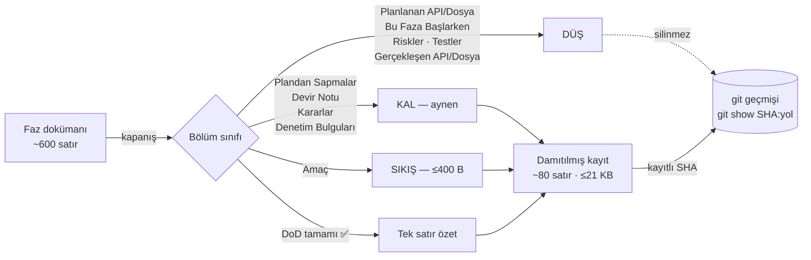

# Faz 90 — Doküman Damıtma Politikası

> **Durum:** 📋 Planlandı (2026-08-23)
> **Kaynak:** [`kesif/2026-08-23-yapisal-sorun-envanteri.md`](kesif/2026-08-23-yapisal-sorun-envanteri.md) — **kalem 20** (F numarası yok; kullanıcı doğrudan seçti)
> **Önkoşul:** Yok
> **Paketler:** Yok — bu faz `scripts/`, `docs/` ve `.agents/skills/` üzerinde çalışır
> **Yeni paket:** Yok · **Migration:** Yok
> **Public API:** Büyümüyor — bu faz C# koduna dokunmaz
> **Tüketici yüzeyi:** Yok (site sayfası değişmez) · sevk edilen metin değişmez
> **Manuel test alanı:** [`docs/manuel-test/33-DOKUMAN-KAPILARI.md`](manuel-test/33-DOKUMAN-KAPILARI.md) — yeni kapılar oraya eklenir

---

## Bu Faza Başlarken

> `faz-baslangic` skill'ini uygula. Aşağıdaki liste o skill'in 2. adımıdır —
> **tamamını değil, yalnız işaret edilen bölümleri oku.**

1. Bu doküman
2. Kararlar — dosyanın tamamını **okuma**, yalnız bu kalemleri grep'le:
   ```bash
   grep -n "K-214\|K-411\|K-426\|K-523\|K-524" docs/KARARLAR.md
   ```
   **K-214** (bütçe büyütülmez, bölünme uygulanır — bu fazın taşıdığı söz),
   **K-411** (senkronizasyon kopyası, `main` kırıldı), **K-426** (`docs/kesif/`
   bir koşum kaydıdır, spec değil), **K-523** (kapanmış faz dokümanları
   `docs/arsiv/fazlar/`'a taşındı — bu fazın devraldığı zemin), **K-524**
   (`MIMARI.md` §7 ayrıldı; ilk kez konan sınıra %15 boşluk kuralı)
3. [`arsiv/fazlar/80-DOKUMAN-KAPILARININ-DOGRULUGU.md`](arsiv/fazlar/80-DOKUMAN-KAPILARININ-DOGRULUGU.md) — yalnız devir notu:
   ```bash
   awk '/## Sonraki Faza Devir Notu/,0' docs/arsiv/fazlar/80-DOKUMAN-KAPILARININ-DOGRULUGU.md
   ```
   "Kapı sessizce yeşil kalıyordu" sınıfını o faz kapattı; bu faz aynı sınıfın
   iki yeni vakasını (çapa denetimi, tazelik) kapatır.
4. Alan hafızası (bu faz tek alana dokunuyor):
   [`hafiza/dokumantasyon.md`](hafiza/dokumantasyon.md) (yayın hattı, üretilen
   sayfalar, `docs/` ↔ `docs-site/` sınırı)
5. Gerektiğinde, tamamı değil ilgili bölümü: [`arsiv/fazlar/INDEKS.md`](arsiv/fazlar/INDEKS.md)
   ("Neden burada" bölümü — 5 MB dizin bütçesinin nasıl aşılmak üzere olduğunu anlatır)

---

## Amaç

AgentPrism'in doküman disiplini **bütçeli bölgede çalışıyor, muaf bölgede
çalışmıyor.** Bir oturum `AGENTS.md` (228 satır) + `MEMORY.md` (103) + faz
dokümanı ile başlıyor; `docs/hafiza/` alan bazlı ve çakışmasız. Buna karşılık
`docs/`'un **%62'si (89.569 satır)** hiçbir tavana tabi değil.

Bu faz arşivlemeyi *taşımak* olmaktan çıkarıp *damıtmak* yapar: faz kapandığında
doküman tam metniyle değil, sabit boyutlu bir kayıtla arşivlenir; tam metin git
geçmişinde kalır ve her CI koşumunda çözülebilirliği kanıtlanır.

- **Kalem 20** — her fazın kalıcı doküman maliyetini sabitle: Faz 91'in
  bıraktığı kayıt Faz 30'unkiyle aynı boyutta olmalı.

### Bugün ne çalışmıyor — doğrulanmış kanıt

| Kanıt | Gözlem |
|---|---|
| [`scripts/dokuman-bakim.py:123`](../scripts/dokuman-bakim.py#L123) | `HARIC` üç ağacı dizin bütçesinden düşer; o üç ağaç (89.569 satır) **hiçbir tavana tabi değil** |
| `--denetle` çıktısı, 2026-08-23 | "denetim dışı arşiv + koşum kaydı: **5.324.346 B** — sınırı etkilemez" |
| [`scripts/dokuman-bakim.py:594`](../scripts/dokuman-bakim.py#L594) | `LINK` regex'i çapayı (`#slug`) yakalar ama **doğrulamaz** — çapa hedefi silinse kapı yeşil kalır |
| `docs/KARARLAR.md` ↔ `docs/arsiv/KARARLAR-GECMISI.md` | **18 sarkan işaretçi**: K-176, K-198, K-210, K-211, K-212, K-218, K-239, K-389, K-390, K-391, K-400, K-405, K-407, K-422, K-505, K-506, K-508, K-526 — "Tam gerekçe: GECMISI — K-NNN" diyor, GECMISI'de o başlık **yok** |
| 12-kelimelik shingle ölçümü | `KARARLAR-GECMISI.md`'nin **%36'sı** `KARARLAR.md`'de birebir tekrar; 358 karar iki yerde tam gerekçeli |
| `--denetle` çıktısı, 2026-08-23 | `docs/hafiza/` altında **7 dosya DAR**; `cekirdek-calistirma.md` 15.999/16.000 ve `sql-saglayicilari.md` 15.984/16.000 → **%0 boş** |
| [`.github/workflows/ci.yml:131`](../.github/workflows/ci.yml#L131) | CI yalnız `--denetle` koşuyor; **üretim modu koşulmuyor** → dört üretilen dosya bayat commit edilebilir, hiçbir kapı söylemez |
| `grep -c "shutil\|os.rename\|.unlink" scripts/dokuman-bakim.py` | **0** — taşıma/damıtma otomasyonu yok; `faz-tamamlama` bunu elle yaptırıyor |
| 91 faz dokümanı, bölüm sayımı | `Planlanan Public API` (4.114 satır) + `Planlanan Dosya Listesi` (1.754) + `Bu Faza Başlarken` (2.060) = **7.928 satır** kapanışta tanımı gereği ölü |

> Kanıtlar 2026-08-23 tarihinde doğrulandı.

---

## 90.1 — Damıtma nedir, arşivleme neden yetmez

`docs/arsiv/fazlar/INDEKS.md` bugünkü modeli anlatıyor: dizin bütçesi her fazda
~41 KB büyüyordu, Faz 76'da 74 KB boşluk kalmıştı, kapanmış fazlar arşive
taşındı ve sayaç 4.925.858 → 3.146.178 B'ye düştü (K-523).

**Taşıma sayacı düşürdü, repo'yu düşürmedi.** Damıtma ikisini birden yapar.



**`HARIC` kalır.** Kaldırmak "arşivlemek sayacı düşürmez" sorununu geri getirir
ve tek çıkışı silmek yapar — `AGENTS.md` "içerik silinmez, taşınır" der. Bunun
yerine **muaf tutulan her ağaç kendi bütçesini alır**; damıtma bunu ödenebilir
kılar (arşiv faz başına ~41 KB → ~9,4 KB).

## 90.2 — Damıtılmış faz kaydının şablonu

Başlık bloğu ve `> **Durum:**` satırı **yerinde kalır** — `yol_haritasi_uret()`
([`dokuman-bakim.py:419-486`](../scripts/dokuman-bakim.py#L419-L486)) onları
okur. Dosya adı ve yolu değişmez; 613 bağlantının tamamı dosya düzeyindedir.

```markdown
# Faz 85 — Gömme Ekseni

> **Durum:** ✅ Tamamlandı (2026-08-22)
> **Kaynak:** [ADAYLAR.md](../../ADAYLAR.md) · **F-140**
> **Paketler:** `AgentPrism.Abstractions` · `AgentPrism.AspNetCore` · `docs-site/`
> **DoD:** 14/14 ✅ · **Denetim:** 🔴 0 · 🟡 3 (düzeltildi) · **Kararlar:** K-579

> ### ⚗️ Damıtılmış kayıt
> Bu dosya fazın **planını** değil, **bıraktığı kalıcı bilgiyi** taşır.
> Plan gövdesi kapanışta düştü — **silinmedi, git geçmişindedir.**
>
> ```bash
> git show 9c32242:docs/arsiv/fazlar/85-GOMME-EKSENI.md   # planın tamamı
> git show --stat 293112f                                  # gerçek dosya listesi
> git diff 6b296f0..293112f -- src/ tests/                 # fazın gerçek kodu
> ```
> Damıtıldı 2026-08-23 · `scripts/dokuman-bakim.py faz-damit`

---

## Amaç
<≤400 B>

## Plandan Sapmalar
<AYNEN — tek karakter değişmez>

## Bu Fazda Verilen Kararlar
## Denetim Bulguları
## Sonraki Faza Devir Notu
<hepsi AYNEN>
```

**`Gerçekleşen Public API` neden düşer:** kod tek kaynaktır (`PublicAPI.*.txt`);
dokümandaki kopya bayatlar ve **aktif olarak yanıltır**. `git show --stat <sha>`
gerçek dosya listesini birebir verir.

🚨 **Standart dışı 130 H2 (3.956 satır) varsayılan KAL + RAPORLA.** Beyaz liste
`## Açık Kalan`, `## 🚨 Ölçülen MAF Davranışları` gibi kalıcı değerli bölümleri
yutar. Toplu geçişte sessiz kayıp yasaktır.

## 90.3 — Tam metin geri getirme sözleşmesi

**Birincil: dosyaya yazılan commit SHA'sı** (~340 B/dosya × 91 ≈ 31 KB). Kendi
kendini anlatır ve **doğrulanabilir** — git'e güvenmenin riskini kapatan tek şey
budur. Ölçüldü: `git log -1 --format=%H -- <yol>` bugün **91/91** faz dokümanı
için tam metni aynı yolda veriyor (00–59 taşıması dahil; `7f1833e` doğru yanıt).
SHA damıtmadan **önce** hesaplanabilir — tavuk-yumurta yok.

**İkincil: toplu etiket** `docs/damitma-oncesi-2026-08`. Eğik çizgili ad
bilinçlidir: [`Directory.Packages.props:184`](../Directory.Packages.props#L184)
MinVer 7.0.0 kullanıyor ve sürümü git etiketinden türetiyor; `v*` desenli yayın
etiketiyle çakışmamalıdır.

`git log --follow` **kullanılmaz** — okuyucu hangi commit'in tam metinli
olduğunu bilemez.

## 90.4 — Koşum kaydı damıtması (asimetrik)

`☑ Geçti` case tek tablo satırına iner. **Kaldı / Atlandı / Beklemede / durum
satırı olmayan** case'in bloğu **aynen** korunur — kusur kanıtı
`kusur-giderme`nin girdisidir, geçen bir case'in ortam çıktısı değildir.

Spec dosyalarına (`docs/manuel-test/*.md`, 48.754 satır) **dokunulmaz**
(kullanıcı kararı); onlar envanter kalem 9'un otomatikleştirme zincirine aittir.

## 90.5 — Karar defteri damıtması

**TAŞIMA, silme değil.** Önce kesilen gerekçe `KARARLAR-GECMISI.md`'ye
`### K-NNN` başlığıyla **eklenir**, *sonra* satır kısaltılır. Tek geçişte iki
dosya yazılır ya da hiçbiri — ters sıra bir kesintide kalıcı kayıp bırakır.

İşaretçi formatı **zaten var** ([`docs/KARARLAR.md:52`](KARARLAR.md)) ve 376
satırda uygulanmış; 374'ü hâlâ 400 B'nin üstünde. İş yeni format icat etmek
değil, **var olan formata bayt tavanı ve kapı koymak**.

Tavan **450 B** (ölçüldü: 350 B → 182 satır iskeletiyle taşar; 600 B → yalnız
%77'ye iner). İskeleti aşan 50 satırda tavan yumuşaktır.

🚨 **ASLA kesilmez:** `**K-NNN — başlık**` · tarih · yeniden açılma koşulu ·
`(kullanıcı kararı)` · `yeniden açıldı`. `_kararlar_kalemleri()`
([`dokuman-bakim.py:210-216`](../scripts/dokuman-bakim.py#L210-L216)) 👤/🔁
işaretlerini bu metinlerden türetir; kesilirse indeks sessizce yanlış olur.

## 90.6 — Sıcak yol acili

Damıtma bu dosyalarda **yetmez** — madde başına 400 B tavanı
`sql-saglayicilari.md` için yalnız %1 kazandırır; kuyrukları çoktan
`HAFIZA-GECMISI.md`'ye taşınmış (21/40 ve 15/45 madde işaretçili). K-214'ün
merdiveni burada **gerçek bölünmeyi** tetikler.

| Dosya | Bugün | İşlem | Hedef |
|---|---:|---|---|
| `sql-saglayicilari.md` | 15.984 (%0) | **BÖL** → `hafiza/sql-server-tuzaklari.md` | ~10.000 / ~6.000 |
| `cekirdek-calistirma.md` | 15.999 (%0) | **BÖL** → `hafiza/olcum-kota-ve-secenekler.md` | ~10.500 / ~5.500 |
| `maf-api.md` | 15.827 (%1) | **BÖL** → `hafiza/maf-oturum.md` | ~10.000 / ~5.800 |
| `test-altyapisi.md` | 15.751 (%2) | **DAMIT** — 400 B madde tavanı | ≥%15 boş |
| `aspnetcore-di.md` | 15.297 (%4) | **DAMIT** | ≥%15 boş |
| `frontend.md` | 13.616 (%14) | **DAMIT** | ≥%15 boş |
| `dokumantasyon.md` | 13.920 (%13) | **elle gözden geçir** (maddeler zaten ~82 B; gövde tablo) | ≥%15 boş |

`HAFIZA_DOSYA_BUTCESI` **16.000'de kalır** — K-214'ün sözü budur.
`MEMORY.md`'nin yönlendirme tablosu yeni üç dosyayı alır.

## 90.7 — Bütçe modeli

```python
HAFIZA_DOSYA_BUTCESI = 16_000          # DEĞİŞMEZ (K-214)
DAMITILMIS_FAZ_BUTCESI = 21_000        # YENİ, dosya başına (ölçülen max + %21)

DIZIN_BUTCESI = {   # (yol, özyinelemeli, haric_uygula) -> sınır
    ("docs/manuel-test", False, True):          1_950_000,  # DEĞİŞMEZ, spec dokunulmadı
    ("docs", True, True):                       3_000_000,  # 5_000_000'DEN DÜŞTÜ
    ("docs/arsiv", True, False):                2_100_000,  # YENİ
    ("docs/manuel-test/kosumlar", True, False):   150_000,  # YENİ
    ("docs/kesif", True, False):                  260_000,  # YENİ
}
YONETIM_BUTCESI = { "docs/KARARLAR.md": 335_000,   # 475_000'DEN DÜŞTÜ
                    "docs/ADAYLAR.md":   80_000 }  # DEĞİŞMEZ
```

Her sınır `ölçülen / 0.85` (`BOSLUK_ORANI`) ile konur — tahminle değil.
**Hiçbiri büyütülmedi**: ikisi düşürüldü, üçü ilk kez konuldu. K-214 "var olan
sınırın aşılmasında büyütme" der; ilk kez sınır koymanın emsali
`MIMARI-GUVENLIK.md: 21_000` (K-524).

🚨 **İki uygulama tuzağı:**
1. `_dizin_boyutu("docs/arsiv", True)` bugün **0 döner** — `HARIC` varsayılanı
   `docs/arsiv`'i kendisinden düşer ([`dokuman-bakim.py:365-372`](../scripts/dokuman-bakim.py#L365-L372)).
   Anahtar bu yüzden **üçlü** olmalı.
2. `projeksiyon()` / `_commit_boyutu()` aynı hatayı yapar → yeni arşiv
   bütçeleri için hep "büyümüyor" der. Bayrak oraya da geçmeli.

---

## Planlanan Public API

**Yok.** Bu faz C# koduna dokunmaz; `src/` ve `tests/` altında tek satır
değişmez. Public API yüzeyi büyümez, küçülmez.

### HTTP `endpoint`'leri

Yok.

### Arayüz payı

Yok — `frontend/` derlenmez, bundle bütçesi etkilenmez.

---

## Planlanan Dosya Listesi

```
scripts/
├── dokuman-bakim.py            # alt komutlar + üç yeni kapı + bütçe modeli
└── dokuman_bakim_test.py       # 26 mevcut + ≥24 yeni test

docs/hafiza/
├── sql-server-tuzaklari.md     # YENİ (sql-saglayicilari.md bölünmesi)
├── olcum-kota-ve-secenekler.md # YENİ (cekirdek-calistirma.md bölünmesi)
└── maf-oturum.md               # YENİ (maf-api.md bölünmesi)

docs/arsiv/fazlar/              # 91 dosya damıtılır
docs/arsiv/fazlar/INDEKS.md     # politika burada anlatılır
docs/KARARLAR.md                # 596 satır ≤450 B'ye iner
docs/arsiv/KARARLAR-GECMISI.md  # kesilen gerekçeler buraya taşınır
docs/manuel-test/kosumlar/      # asimetrik damıtma
docs/arsiv/manuel-test-kosum-2026-08/

.agents/skills/                 # faz-tamamlama · faz-baslangic · faz-planlama · manuel-test-kosumu
MEMORY.md                       # yönlendirme tablosuna 3 yeni satır
```

`.github/workflows/ci.yml` **değişmez** — yeni kapılar `denetle()` içinden gelir.

---

## Hata Modları ve Testler

> Bu faz bir **araç** fazıdır; sınırı DI/HTTP/kiracı değil, **dosya sistemi ve
> git**'tir. Saf fonksiyonlar doğrudan test edilir; git'e dokunan yollar
> `tempfile` + `mock.patch` ile — mevcut `dokuman_bakim_test.py` deseni.

| Ne bozulabilir | Seviye | Test |
|---|---|---|
| Damıtma `> **Durum:**` satırını kaydırır → faz `YOL-HARITASI.md`'den **sessizce düşer** | Birim | `test_durum_satiri_damitmadan_sonra_ayni_yerde` |
| Kalıcı bölüm gövdesi damıtmada değişir | Birim | `test_kalici_bolumler_bire_bir_korunur` |
| DoD'de istisna varken tablo tek satıra iner → kanıt kaybı | Birim | `test_dod_istisnasi_varsa_tablo_aynen_kalir` |
| Tanınmayan bölüm sessizce düşer | Birim | `test_taninmayan_bolum_dusurulmez_uyari_uretir` |
| Kirli çalışma ağacında damıtma → commit edilmemiş düzenleme yok olur | Fonksiyonel | `test_kirli_calisma_agacinda_hicbir_dosya_yazilmaz` |
| Damıtılmışı yeniden damıtmak dosyayı bozar | Birim | `test_idempotent` |
| Üretilen metinde `](` deseni → `kirik_baglantilar()` yanlış pozitif | Birim | `test_uretilen_metinde_markdown_link_deseni_yok` |
| Geçen case damıtılırken **geçmeyen** case bloğu da kırpılır | Birim | `test_kalan_case_blogu_bire_bir_korunur` |
| Durum satırı olmayan case sessizce "geçti" sayılır | Birim | `test_durum_satiri_olmayan_case_korunur_ve_raporlanir` |
| Karar satırı kesilince 🔁/👤 kaybolur | Birim | `test_yeniden_acildi_isareti_korunur` · `test_kullanici_karari_isareti_korunur` |
| Kesme tabloya boş satır sokar → markdown tabloyu orada bitirir (Faz 77/78 vakası) | Fonksiyonel | `test_kararlar_denetle_damitmadan_sonra_temiz` |
| Damıtma sonrası indeks kalem kaybeder | Fonksiyonel | `test_indeks_uretimi_ayni_kalem_sayisini_verir` |
| Yeni arşiv bütçesi 0 ölçülür (`HARIC` koşulsuz düşülüyor) | Birim | `test_arsiv_butcesi_sifir_olcmez` |
| `--projeksiyon` arşiv kalemi için hep "büyümüyor" der | Birim | `test_projeksiyon_arsiv_kalemi_icin_sifir_dondurmez` |
| Kayıtlı SHA git'te çözülmüyor | Fonksiyonel | `test_tam_metin_denetle_cozulmeyen_shayi_yakalar` |
| Sarkan işaretçi (çapa hedefi yok) | Fonksiyonel | `test_gecmis_isaretci_denetle_sarkani_yakalar` |
| Üretilen dosya bayat commit edilir | Fonksiyonel | `test_tazelik_denetle_bayat_dosyayi_yakalar` |
| `faz-arsivle` bağlantı kırar ve kısmi taşıma bırakır | Fonksiyonel | `test_yeni_kirik_baglantida_geri_alinir` |

---

## Manuel Kabul Case'leri

> Kapanışta [`docs/manuel-test/33-DOKUMAN-KAPILARI.md`](manuel-test/33-DOKUMAN-KAPILARI.md)
> içine eklenecek. Hepsi komut tabanlıdır — otomatikleştirilebilir, kapanışta koşulur.

| # | Ön koşul | Adımlar | Beklenen sonuç |
|---|---|---|---|
| 1 | Temiz çalışma ağacı | `python3 scripts/dokuman-bakim.py --denetle` | Çıkış 0; DAR kalem ≤ 1 ve o kalem `docs/manuel-test` |
| 2 | Damıtma uygulandı | `git show $(git log -1 --format=%H -- docs/arsiv/fazlar/00-ALTYAPI.md):docs/arsiv/fazlar/00-ALTYAPI.md \| head -20` | Faz 00'ın **tam** planı basılır (damıtılmış hâli değil) |
| 3 | Üretilen dosya elle bozulmuş | `sed -i '' 's/✅ Tamamlandı/BOZUK/' docs/YOL-HARITASI.md && python3 scripts/dokuman-bakim.py --denetle` | Çıkış 1; "üretilen dosya bayat" bulgusu |
| 4 | Bir kayıttaki SHA bozulmuş | SHA'yı elle değiştir → `--denetle` | Çıkış 1; `tam_metin_denetle()` bulgusu |
| 5 | `KARARLAR.md`'de sarkan işaretçi var | `--denetle` | Çıkış 1; sarkan K-NNN listelenir |
| 6 | Kirli çalışma ağacı | `echo x >> docs/arsiv/fazlar/24-SQLITE.md && python3 scripts/dokuman-bakim.py faz-damit 24` | Hiçbir dosya yazılmaz; "çalışma ağacı temiz değil" mesajı |
| 7 | Damıtma iki kez koşulur | `faz-damit 24 && git diff --stat && faz-damit 24 && git diff --stat` | İkinci koşum **hiçbir değişiklik** üretmez (idempotent) |

---

## Açık Sorular

| # | Soru | Seçenekler | Öneri |
|---|---|---|---|
| 1 | `docs/kesif/` damıtılacak mı? | A: Bütçe konur, damıtılmaz (koşum kaydı, K-426) · B: Faz gibi damıtılır | **A** — 219.746 B ve yavaş büyüyor; bütçe yeterli fren |
| 2 | Damıtılmış kayıtta `Amaç` gerçekten gerekli mi? | A: ≤400 B kalsın · B: Tümüyle düşsün, `FAZ-GECMISI.md` zaten anlatıyor | **A** — `FAZ-GECMISI.md` 82/91 fazı kapsıyor; dosyanın kendi kendine yeter olması ucuz |
| 3 | `karar-damit` 238 satırlık taşımayı otomatik mi yapsın? | A: `--kuru` listeler, kullanıcı onaylar · B: Doğrudan uygula | **A** — cümle sınırında değil karakter sınırında kesme riski var |
| 4 | `DAMITILMIS_FAZ_BUTCESI` dosya başına mı, dizin toplamı mı? | A: İkisi de · B: Yalnız dizin | **A** — dosya başına tavan tek bir fazın şişmesini yakalar; dizin tavanı toplamı |

---

## Bitiş Ölçütleri (DoD)

- [ ] `python3 scripts/dokuman-bakim.py --denetle` çıkış 0 · DAR kalem ≤ 1 ve o kalem `docs/manuel-test` (spec'e bilinçli dokunulmadı)
- [ ] `kirik_baglantilar()` = 0 · **çapa denetimi eklendi** · çapa bulgusu = 0
- [ ] `tam_metin_denetle()` 91/91 · `gecmis_isaretci_denetle()` = 0 bulgu (bugün 18)
- [ ] `--taze` temiz · **`.github/workflows/ci.yml` değişmedi** ve kapı `ci.yml:131`'den koşuyor
- [ ] `docs/YOL-HARITASI.md` damıtma öncesi/sonrası **byte-identical**
- [ ] `docs/arsiv/fazlar/*.md` her biri ≤ 21.000 B
- [ ] `docs/KARARLAR.md` ≤ 335.000 B · `_kararlar_kalemleri()` **596 kalem**; 👤 ve 🔁 sayıları damıtma öncesiyle aynı
- [ ] `docs/hafiza/*.md` hiçbiri DAR değil · `HAFIZA_DOSYA_BUTCESI` **hâlâ 16.000**
- [ ] Geçmeyen manuel case bloğu `git diff`'te **değişmemiş** görünür
- [ ] `python3 -m unittest discover -s scripts -p "*_test.py"` — 26 mevcut + ≥24 yeni test yeşil
- [ ] Dört doğrulama kapısı sıfır uyarı verir
- [ ] `dotnet build -c Release` sonrası `InformationalVersion` etiket öncesiyle **aynı** (MinVer kayması yok)
- [ ] `secret` taraması boş döndü
- [ ] Manuel kabul case'leri `docs/manuel-test/33-DOKUMAN-KAPILARI.md` içine eklendi ve koşuldu
- [ ] `faz-denetim` koşuldu; 🔴 bulgu kalmadı

> `samples/AgentPrism.Api` ile gerçek `run` **bu fazda uygulanmaz** — faz C#
> koduna dokunmaz, çalışma anı davranışı değişmez. Gerekçe: `faz-tamamlama`
> Adım 2 çalışma anı değişikliği için vardır.

### Doğrulama komutları

```bash
# Kapılar
python3 scripts/dokuman-bakim.py --denetle
python3 -m unittest discover -s scripts -p "*_test.py" -v
python3 scripts/dokuman-bakim.py --projeksiyon

# Damıtma güvenliği — YOL-HARITASI byte-identical kalmalı
cp docs/YOL-HARITASI.md /tmp/yh-once.md
python3 scripts/dokuman-bakim.py && diff /tmp/yh-once.md docs/YOL-HARITASI.md

# Tam metin elle örnekleme
git show $(git log -1 --format=%H -- docs/arsiv/fazlar/00-ALTYAPI.md):docs/arsiv/fazlar/00-ALTYAPI.md | head -20

# Sürüm kayması yok
dotnet build AgentPrism.slnx -c Release
```

---

## Riskler

| Risk | Önlem |
|------|-------|
| `kirik_baglantilar()` çapayı denetlemiyor → damıtma çapa hedefini silse kapı **sessizce yeşil** kalır | Çapa doğrulaması eklenir. Faz 80'in kapattığı "kapı sessizce yanıltıyor" sınıfının aynısı |
| `yol_haritasi_uret()` bir fazı **sessizce düşürür** — başlıkta bir karakter kayarsa faz listeden düşer, hata vermez | DoD'de "byte-identical" şartı + `test_durum_satiri_damitmadan_sonra_ayni_yerde` |
| Tanınmayan 130 H2 sessizce düşer | Varsayılan KAL + RAPORLA; `--kuru` raporu insan onayından geçer |
| Karar satırı kesilince 🔁/👤 kaybolur — işaretler satırın **tamamından** türetiliyor | Koruma listesi + iki test; DoD'de sayı sabitliği |
| Kesme tabloya boş satır sokar → sonraki kararlar görünmez (Faz 77/78 vakası) | `kararlar_denetle()` zaten yakalar; damıtma sonrası koşulur |
| Git geçmişine güvenmek — `filter-branch`/`gc`/shallow klon SHA'ları geçersizler | `tam_metin_denetle()` **her CI koşumunda** çözer. `fetch-depth: 0` MinVer yüzünden kaldırılamaz — beklenmedik sigorta |
| MinVer etiketten sürüm türetir → sıradan bir etiket sevk edilen sürümü kaydırabilir | Eğik çizgili etiket adı + Adım 0'da sürüm ölçümü |
| Koşum damıtması kusur kanıtını yakar | Asimetrik kural; geçmeyen bloklar karakter düzeyinde korunur, test doğrular |
| `_dizin_boyutu`/`_commit_boyutu` yeni arşiv bütçesini **0 ölçer** | Üçlü anahtar + `test_arsiv_butcesi_sifir_olcmez` |
| `--denetle` yerelde sık kırmızı olur (tazelik kapısı) | Kabul edilen bedel — `build-agent-map.mjs --check` ile aynı sözleşme; hata mesajı çözüm komutunu yazar |
| `karar-damit` yarıda kesilir → kalıcı kayıp | Tek geçişte iki dosya; `--kuru` zorunlu ön adım; kirli ağaçta reddeder |

---

<!-- ============================================================
     AŞAĞISI KAPANIŞTA DOLDURULUR — `faz-tamamlama` skill'i.
     Plan anında boş kalır. Başlıkları SİLME.
     ============================================================ -->

## Plandan Sapmalar

> Kapanışta doldurulur.

## Bu Fazda Verilen Kararlar

> Kapanışta doldurulur.

## Gerçekleşen Public API

> Kapanışta doldurulur.

## Dosya Listesi (gerçekleşen)

> Kapanışta doldurulur.

## Denetim Bulguları

> Kapanışta doldurulur.

## Sonraki Faza Devir Notu

> Kapanışta doldurulur.
