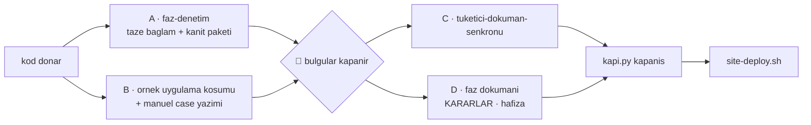

# Faz 92 — Zincir Konsolidasyonu

> **Durum:** 📋 Planlandı (2026-08-23)
> **Kaynak:** [`kesif/2026-08-23-yapisal-sorun-envanteri.md`](kesif/2026-08-23-yapisal-sorun-envanteri.md) kalem **20** (skill metni ayağı) · kullanıcı isteği: geliştirme sürecinin uçtan uca optimizasyonu
> **Önkoşul:** 🚨 [Faz 91](91-GELISTIRME-DONGUSU-KAPILARI.md) — **kesin bağımlılık.** Politika "önce kapı, sonra kısaltma"; bu faz ancak 91'in hangi tuzağı kapıya çevirdiğini bilerek metin düşürebilir. 91 kapanmadan başlatılamaz
> **Paketler:** Yok — iş `.agents/` ve `AGENTS.md` üzerindedir
> **Yeni paket:** Yok · **Migration:** Yok
> **Public API:** Büyümüyor. Hiçbir `src/` dosyasına dokunulmaz
> **Tüketici yüzeyi:** **Yok.** `tuketici-dokuman-senkronu` Adım 0 tablosundaki hiçbir yol tutmuyor; `.agents/` geliştirme aparatıdır ve pakete girmez (kalite sözleşmesi bölüm **B** kapsam tablosu bunu açıkça dışlar). Skill koşmaz — gerekçe budur
> **Manuel test alanı:** `docs/manuel-test/36-GELISTIRME-KAPILARI.md` — **Faz 91 açar**; bu fazın case'leri oraya eklenir. Bağlantı verilmiyor çünkü dosya bu plan yazılırken henüz yoktur

---

## Bu Faza Başlarken

> `faz-baslangic` skill'ini uygula. Bu liste o skill'in 2. adımıdır.

1. Bu doküman
2. Kararlar — yalnız bu kalemler:
   ```bash
   grep -n "K-522\|K-599" docs/KARARLAR.md
   ```
   **K-522** (kalite sözleşmesi faz dokümanlarından **ayrıştırıldı** — bu fazın
   yapacağı işin emsali) · **K-599** (her ağaç kendi bütçesini alır)
3. [`91-GELISTIRME-DONGUSU-KAPILARI.md`](91-GELISTIRME-DONGUSU-KAPILARI.md)
   — 🚨 **yalnız devir notu, ama tamamı:**
   ```bash
   awk '/## Sonraki Faza Devir Notu/,0' docs/arsiv/fazlar/91-*.md
   ```
   O bölüm **hangi tuzağın kapı kazandığını** listeler. Bu fazın tüm kısaltma
   yetkisi o listeden gelir. Liste yoksa faz başlatılamaz — 91 eksik kapanmıştır.
4. Alan hafızası: [`hafiza/dokumantasyon.md`](hafiza/dokumantasyon.md)
   (doküman kuralı yazma tuzakları — 🚨 "bir kuralın kendi sınıfını üretmesi"
   vakası iki kez yaşandı)
5. [`.agents/skills/README.md`](../.agents/skills/README.md) — klasör
   konvansiyonu ve taşınabilirlik kuralı. Bu faz o dosyayı **değiştirir**

---

## Amaç

Faz 91 kuralları koda taşıdı. Bu faz **metni** konsolide eder: zincirde her
fazda okunan skill metnini tekrardan arındırır ve kapanış sırasını seri
olmaktan çıkarır.

İki iş vardır ve **karıştırılmazlar**:

- **(a) Tekrarın tek kaynağa inmesi** — kalite riski **yok**. Aynı bilgi bugün
  birden çok dosyada duruyor ve ayrı ayrı bayatlıyor.
- **(b) Kapı kazanan tuzağın anlatısının taşınması** — kalite riski var, bu
  yüzden politikaya bağlı (aşağıda).

### 🚨 Kısaltma politikası — kullanıcı kararı, tartışmaya kapalı

> Bir tuzağın anlatısı `SKILL.md`'den **ancak onu yakalayan makine kapısı
> yazıldıktan sonra** `references/`'a taşınır. Kapısı olmayan her 🚨 prose'da
> kalır.

Gerekçe: anlatı, agent'ın uyma iradesini üretir. Kapı o iradeye ihtiyaç
duymaz; kapı yoksa anlatı tek savunmadır. Faz 91'in devir notundaki liste bu
fazın **tek** kısaltma yetkisidir. Listede olmayan bir tuzağı kısaltmak bir
DoD ihlalidir.

### Bugün ne çalışmıyor — doğrulanmış kanıt

| Kanıt | Gözlem |
|---|---|
| Zincir metni | Beş zincir skill'i + kalite sözleşmesi = **1348 satır / 62.203 B**. Bu her faz için okunan taban |
| `.agents/**/*.md` | **3060 satır** toplam |
| Dört kapı komut bloğu | **3 dosya**: `AGENTS.md` · `faz-tamamlama` · `kusur-giderme` |
| Test seviyesi / sınır tablosu (`DI · HTTP · kiracı · akış · depo`) | **4 dosya**: `faz-plani-sablonu.md` · `faz-denetim` · `kusur-giderme` · `faz-uygulama` |
| Beş hata modu sorusu (iptal · eşzamanlılık · boş/aşırı girdi · başka kiracı · alt sistem) | **3 dosya**: `faz-plani-sablonu.md` · `faz-denetim` · `faz-uygulama` |
| MTP filtre tuzağı | Uyarı **4 dosyada**: `MEMORY.md` · `tuketici-dokuman-senkronu` · `kusur-giderme` · `test-kosum-tuzaklari.md` |
| **Bayat komutun kendisi** | `arsiv/fazlar/73-*.md:88` · `74-*.md:106` · `75-*.md:99` — üçü de `dotnet test --filter …` yazıyor; MTP bunu sessizce yutar ve tüm paketi yeşil koşar |
| `faz-tamamlama` kapanış sırası | 10 adım, **tamamen seri**. Denetim (Adım 4) bittikten sonra doküman (5–8), site (7), yayın (10) sırayla koşar |

> Kanıtlar 2026-08-23 tarihinde doğrulandı.

### Kapsam dışı — bilinçli

| Ne | Neden |
|---|---|
| `aday-kesfi` (296 satır) · `manuel-test-kosumu` (335 satır) | Zincir dışı ve **nadir** koşar. Faz başına okunmadıkları için tekrar maliyeti üretmezler |
| Kapısı olmayan 🚨 anlatılarının kısaltılması | Politika yasaklıyor. Faz 91 listesi dışına çıkılmaz |
| `docs/hafiza/` dosyalarının konsolidasyonu | Alan dosyaları **yalnız o alana dokunurken** okunur; zincir tabanında değiller |

---

## 92.1 — Ortak metni tek kaynağa indir

Ortak içerik `.agents/ortak/` altına iner.

🚨 **Konum `.agents/skills/` içi DEĞİLDİR.** Skill keşfi `.agents/skills/`
altındaki her klasörü bir skill sanar; `SKILL.md` ve frontmatter taşımayan bir
klasör orada belirsiz davranır. `.agents/ortak/` keşif yolunun dışındadır ve
`.claude/skills → .agents/skills` symlink'i onu görmez.

| Yeni dosya | Ne taşır | Bugün nerede |
|---|---|---|
| `.agents/ortak/kapilar.md` | Kapı koşumunun tek anlatısı — Faz 91 sonrası bu **`kapi.py` çağrısıdır** | 3 dosya |
| `.agents/ortak/test-seviyeleri.md` | Sınır tablosu + beş hata modu sorusu | 4 ve 3 dosya |

Çağıran dosyalar tek satıra iner ve bağlanır. **Silinmez, taşınır** — kural
bütçe aşımında da aynıdır (`AGENTS.md`).

### Taşınabilirlik konvansiyonu güncellenir

[`.agents/skills/README.md`](../.agents/skills/README.md) bugün şunu diyor:
*"`SKILL.md` **kendi kendine yeten** bir metin olmalıdır."*

Zincir bu kuralı zaten esnetiyor — skill'ler birbirine sürekli bağlanıyor
(`faz-tamamlama` → `tuketici-dokuman-senkronu`, `faz-denetim` → kalite
sözleşmesi, K-522). Konvansiyon gerçeğe göre düzeltilir:

> `SKILL.md` **kendi protokolü** bakımından kendi kendine yeter. Ortak
> sözleşme `.agents/ortak/` altında tek kaynakta yaşar ve adıyla bağlanır.
> Bağlantı hedefi repo içinde olmalıdır; skill mekanizması olmayan bir agent
> onu normal bir dosya olarak açabilir.

### Bayat komutlar temizlenir

`arsiv/fazlar/73:88`, `74:106`, `75:99` satırlarındaki `dotnet test --filter`
komutları düzeltilir. 🚨 Bunlar **arşiv** dosyalarıdır; damıtılmış kayıtta
komut bloğu korunmuş durumda. Düzeltme tarihsel kaydı değiştirmez — yalnız
**kopyalanabilir bir yanlışı** kaldırır. Değişiklik `git show` ile çözülen tam
metni etkilemez (K-598); damıtma kapısı bunu doğrular.

---

## 92.2 — Kapı kazanan tuzakların anlatısını taşı

Girdi: Faz 91 devir notundaki **kapı kazanan tuzaklar listesi**. Her kalem için:

```
SKILL.md'de kalan:  tek satır + kapının adı
references/'a giden: ölçüm, vaka, tarih, nasıl kırıldığı
```

Beklenen adaylar (91 gerçekleştirdiyse — **listeden doğrulanır, varsayılmaz**):

| Tuzak | Faz 91'de kazandığı kapı | SKILL.md'de kalan |
|---|---|---|
| Senkronizasyon kopyası (`<ad> 2.<uzantı>`) | `kapi.py tarama` | "Kapı: `kapi.py tarama`. Beş kez yaşandı." |
| `secret` dosyaya/veritabanına yazılması | `kapi.py tarama` | tek satır + K-059 |
| `MSBUILDDISABLENODEREUSE=1` unutulması | `kapi.py` ortamı | tek satır |
| `dotnet test --filter` yutulması | `kapi.py test --sinif` | tek satır |
| İşaretsiz DoD kutusu | `dokuman-bakim.py` | tek satır |

🚨 **Liste bir tahmindir. Uygulayan oturum Faz 91'in devir notunu okur ve
gerçekleşene göre çalışır.** Kapı yazılmamış bir satırı bu tablodan
kısaltmak DoD ihlalidir.

`references/` dosyaları her skill'in **kendi** klasöründe yaşar
(`.agents/skills/<ad>/references/gerekce.md`) — konvansiyon zaten bunu
öngörüyor.

---

## 92.3 — Kapanışı paralelleştir

`faz-tamamlama` bugün 10 adım, tamamen seri. Yeni sıra kulvarlıdır:



### Kural

**Denetim sonucuna bağlı** her iş birleşme noktasını (`J1`) bekler. Geri kalan
paralel koşar. Gerekçe: 🔴 bir bulgu kodu değiştirir; değişen kod faz
dokümanını, siteyi ve manuel case'i de değiştirebilir. Bunları J1'den önce
yazmak iki kez yazmaktır.

`B` kulvarı J1'i beklemez çünkü örnek uygulama koşumu **denetimin girdisidir**,
çıktısı değil — Faz 6, 12, 15, 16, 18, 20, 21 ve 28'de gerçek hatalar yalnız
orada çıktı.

### Kulvar mekanizması

`A` ve `C` **taze bağlamlı ayrı agent**'lardır. Ana oturumun bağlamı şişmez;
bu sonraki adımları da ucuzlatır.

🚨 **Alt agent mekanizması olmayan ortamda kulvarlar seri koşar.**
`faz-denetim` bunu zaten yazıyor: *"Aynı oturumda 'şimdi denetçi gibi düşün'
demek bu skill'i uygulamak değildir."* Paralellik bir hız optimizasyonudur;
**denetimin bağımsızlığı ondan önce gelir.** İkisi çakışırsa bağımsızlık kazanır.

### Adım numaraları korunur

`faz-tamamlama`'nın 10 adımı **yeniden numaralanmaz**. Kulvar şeması adımların
üstüne bir **sıra katmanı** olarak eklenir. Gerekçe: adım numaraları
`faz-denetim`, `faz-planlama` ve arşivlenmiş 91 faz dokümanından referans
alınıyor; yeniden numaralama o referansların tamamını bayatlatır.

---

## Planlanan Public API

**Büyümüyor.** Bu faz hiçbir `src/` dosyasına dokunmaz.

### HTTP `endpoint`'leri

Yok.

### Arayüz payı

Yok.

---

## Planlanan Dosya Listesi

```
.agents/ortak/                    (yeni dizin — skills/ DIŞINDA)
├── kapilar.md                    (yeni)
└── test-seviyeleri.md            (yeni)

.agents/skills/
├── README.md                     (taşınabilirlik konvansiyonu güncellenir)
├── faz-uygulama/
│   ├── SKILL.md                  (ortak tablolar bağlantıya iner)
│   └── references/gerekce.md     (yeni — kapı kazanan anlatılar)
├── faz-denetim/
│   ├── SKILL.md                  (aynı + bayat iddia zaten 91'de düzeldi)
│   └── references/gerekce.md     (yeni)
├── faz-tamamlama/
│   ├── SKILL.md                  (kulvar katmanı + ortak bağlantılar)
│   └── references/gerekce.md     (yeni)
├── kusur-giderme/SKILL.md        (ortak tablolar bağlantıya iner)
└── faz-planlama/resources/faz-plani-sablonu.md  (ortak tablolar bağlantıya iner)

AGENTS.md                         (skill zinciri satırı — kulvar sırası)
docs/arsiv/fazlar/{73,74,75}-*.md (bayat --filter komutları)
docs/manuel-test/36-GELISTIRME-KAPILARI.md  (bu fazın case'leri)
```

---

## Hata Modları ve Testler

> Bu faz **metin** işidir; kod yolu üretmez. Bu yüzden hata modları doküman
> kapılarıyla yakalanır. Sınır geçen davranış yoktur.

| Ne bozulabilir | Seviye | Test / kapı |
|---|---|---|
| Bir `SKILL.md` ortak dosyaya bağlanır ama bağlantı kırıktır | Kapı | `dokuman-bakim.py` kırık bağlantı denetimi (bugün 0) |
| Ortak dosyaya taşınan içerik kaynağında **da** kalır — tekrar kapanmaz | Kapı | Faz 91'in "tekrarlanan komut/regex" kapısı ikinci kopyayı arar |
| Kapısı olmayan bir tuzak kısaltılır (politika ihlali) | **Denetim** (`faz-denetim`) | Denetçi Faz 91 devir notu listesini okur; listede olmayan her kısaltma 🔴 |
| `.agents/ortak/` skill keşfini bozar | Fonksiyonel | `Skill` aracı zinciri listeler; on skill görünmeli, `ortak` **görünmemeli** |
| Kulvar sırası denetimin bağımsızlığını bozar | **Denetim** | Denetçi ana oturumun bağlamında koştuysa 🔴 |
| Bayat `--filter` düzeltmesi damıtılmış kaydın tam metnini bozar | Kapı | `dokuman-bakim.py` "damıtılmış kayıt tam metni" denetimi (Faz 90) |
| `AGENTS.md` bütçesi aşılır | Kapı | `dokuman-bakim.py` bütçe denetimi — bugün %2 boş, **en dar kalem** |

🚨 **`AGENTS.md` bugün 11.816 / 12.000 B (%2 boş).** Faz 91 dört kapı bloğunu
düşürüp yer açar; bu faz zincir satırını değiştirirken **ölçmeden yazmaz**.
Aşarsa içerik silinmez, `.agents/ortak/`'a taşınır.

---

## Manuel Kabul Case'leri

| # | Ön koşul | Adımlar | Beklenen sonuç |
|---|---|---|---|
| 1 | Konsolidasyon bitti | `python3 scripts/dokuman-bakim.py --denetle` | Kırık bağlantı **0**; çıkış kodu 0 |
| 2 | Konsolidasyon bitti | Zincir skill'lerinin satır/bayt toplamını say | Faz öncesi **1348 satır / 62.203 B** ile karşılaştırılır ve yazılır |
| 3 | 👤 insan gerekir | Claude Code'da skill listesini aç | On skill görünür; `ortak` bir skill olarak **görünmez** |
| 4 | Taze bağlamlı oturum | Yalnız `AGENTS.md` + `MEMORY.md` + bir faz dokümanı oku, sonra faz başlat | Kapı komutunu ve test seviyesini bağlantıyı izleyerek bulabilmeli |
| 5 | `arsiv/fazlar/73-*.md` düzeltildi | `git show <sha>:docs/73-*.md \| head` | Tam metin hâlâ çözülüyor (K-598) |

---

## Açık Sorular

| # | Soru | Seçenekler | Öneri |
|---|---|---|---|
| 1 | `MEMORY.md`'deki MTP filtre uyarısı da bağlantıya insin mi? | A: insin · B: kalsın | **B** — `MEMORY.md` "her oturumda geçerli" listesidir ve bağlantı izlemek oturum başına bir tur ekler. Ölçülüp karara bağlanır |
| 2 | `references/gerekce.md` skill başına mı, tek dosya mı? | A: skill başına · B: `.agents/ortak/gerekce.md` | **A** — anlatı ait olduğu protokolün yanında kalır; tek dosya yeni bir birikimli defter üretir (kalem 20'nin şikâyeti) |
| 3 | Kulvar şeması `faz-tamamlama`'ya mı, ayrı dosyaya mı? | A: skill'in başına · B: `.agents/ortak/kapanis-sirasi.md` | **A** — sıra protokolün kendisidir, ortak sözleşme değil |

---

## Bitiş Ölçütleri (DoD)

- [ ] `.agents/ortak/kapilar.md` ve `test-seviyeleri.md` yazıldı; **`.agents/skills/` dışında**
- [ ] Dört kapı anlatısı **tek** dosyada; `AGENTS.md`, `faz-tamamlama`, `kusur-giderme` bağlanıyor
- [ ] Sınır tablosu ve beş hata modu sorusu **tek** dosyada; dört ve üç çağıran bağlanıyor
- [ ] Faz 91'in tekrar kapısı yeşil — hiçbir komut/regex ikinci kopyası kalmadı
- [ ] `.agents/skills/README.md` taşınabilirlik konvansiyonu gerçeğe göre güncellendi
- [ ] **Kısaltılan her tuzak Faz 91 devir notundaki kapı listesinde var** — liste dışı kısaltma yok. Kalem kalem eşleştirme bu dokümana yazıldı
- [ ] `arsiv/fazlar/{73,74,75}` bayat `dotnet test --filter` komutları düzeltildi; damıtılmış kayıt tam metin kapısı yeşil
- [ ] `faz-tamamlama` kulvar sırası yazıldı; **adım numaraları korundu**
- [ ] Kulvar metni alt agent'sız ortam için seri geri düşüşü yazıyor; denetimin bağımsızlığının hızdan önce geldiğini söylüyor
- [ ] **Zincir metni öncesi/sonrası ölçüldü ve yazıldı**: taban 1348 satır / 62.203 B. Yüzde iddia edilmez, sayı yazılır
- [ ] `AGENTS.md` bütçe içinde — ölçüldü ve yazıldı
- [ ] `python3 scripts/dokuman-bakim.py` çıkış kodu 0; kırık bağlantı 0
- [ ] Skill listesi on skill gösteriyor; `ortak` skill olarak görünmüyor
- [ ] Dört doğrulama kapısı sıfır uyarı (`kapi.py kapanis`)
- [ ] `samples/AgentPrism.Api` ile gerçek `run` yapıldı — 🚨 bu faz kod değiştirmez; koşum bir **regresyon kanıtıdır**, çıktı belgeye yazılır
- [ ] `secret` taraması boş döndü
- [ ] Manuel kabul case'leri `docs/manuel-test/36-GELISTIRME-KAPILARI.md` içine eklendi (dosyayı Faz 91 açar); otomatikleştirilebilenler koşuldu
- [ ] `faz-denetim` **yeni kulvar sırasıyla** koşuldu; 🔴 bulgu kalmadı — bu faz kendi çıktısının ilk tüketicisidir

### Doğrulama komutları

```bash
# Zincir metni ölçümü — taban: 1348 satır / 62203 B
wc -l -c .agents/skills/{faz-baslangic,faz-uygulama,faz-denetim,faz-tamamlama,tuketici-dokuman-senkronu}/SKILL.md \
         .agents/skills/tuketici-dokuman-senkronu/resources/kalite-sozlesmesi.md

# Tekrar gerçekten kapandı mı
grep -rln "dotnet format AgentPrism.slnx --verify-no-changes" AGENTS.md .agents/   # 1 dosya olmalı
grep -rln "DI · HTTP · kiracı · akış · depo" .agents/                              # 1 dosya olmalı

# Bayat komut kalmadı mı
grep -rn "dotnet test.*--filter " docs/ .agents/ AGENTS.md MEMORY.md               # boş olmalı

# Doküman kapıları
python3 scripts/dokuman-bakim.py
```

---

## Riskler

| Risk | Önlem |
|------|-------|
| Kısaltma agent'ın uyma iradesini düşürür — kapısız bir tuzak sessizce geri gelir | Politika mutlaktır: yalnız Faz 91 devir notundaki kapı listesi kısaltılır. Denetçi bu listeyi okur ve liste dışı her kısaltmayı 🔴 sayar |
| Faz 91 devir notu eksik veya belirsiz yazılmış olur | Faz başlatılamaz. Bu bir bloke koşuldur, geçici çözüm aranmaz — 91'in kapanışı düzeltilir |
| `.agents/ortak/` skill keşfini bozar | Konum `skills/` dışında seçildi. Manuel case 3 bunu gözle doğrular |
| Ortak dosyaya bağlanmak taşınabilirliği düşürür (Copilot vb.) | Zincir bu kuralı zaten esnetiyor (K-522 emsali). Bağlantı hedefi repo içindedir; skill mekanizması olmayan agent dosyayı normal açar. Konvansiyon buna göre düzeltilir |
| Arşiv dosyasına dokunmak damıtılmış kaydı bozar | Faz 90'ın "tam metin" kapısı doğrular. Düzeltme yalnız kopyalanabilir yanlışı kaldırır, kaydı değil |
| `AGENTS.md` bütçesi aşılır (bugün %2 boş) | Faz 91 yer açar. Bu faz **ölçmeden yazmaz**; aşarsa içerik `.agents/ortak/`'a taşınır, silinmez |
| Paralel kulvar denetimin bağımsızlığını bozar | Yazılı öncelik: bağımsızlık hızdan önce gelir. Alt agent yoksa seri koş |

---

<!-- ============================================================
     AŞAĞISI KAPANIŞTA DOLDURULUR — `faz-tamamlama` skill'i.
     Plan anında boş kalır. Başlıkları SİLME.
     ============================================================ -->

## Plandan Sapmalar

> Kapanışta doldurulur. Plan ile gerçek arasındaki fark **gizlenmez**.

## Bu Fazda Verilen Kararlar

> Kapanışta doldurulur. K-NNN numaraları burada alınır.

## Gerçekleşen Public API

> Kapanışta doldurulur. Bu fazın beklentisi: **değişmedi**.

## Dosya Listesi (gerçekleşen)

> Kapanışta doldurulur.

## Denetim Bulguları

> Kapanışta doldurulur. Bulgu yoksa "🔴 ve 🟡 yok" yazılır; boş bırakılmaz.

## Sonraki Faza Devir Notu

> Kapanışta doldurulur. 🚨 **Zincir metninin son ölçümü** buraya yazılır —
> sonraki oturumun taban çizgisi odur.
