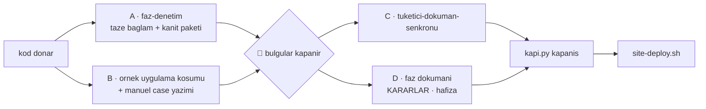

# Faz 92 — Zincir Konsolidasyonu

> **Durum:** ✅ Tamamlandı (2026-08-23)
> **Kaynak:** [`kesif/2026-08-23-yapisal-sorun-envanteri.md`](kesif/2026-08-23-yapisal-sorun-envanteri.md) kalem **20** (skill metni ayağı) · kullanıcı isteği: geliştirme sürecinin uçtan uca optimizasyonu
> **Önkoşul:** 🚨 [Faz 91](arsiv/fazlar/91-GELISTIRME-DONGUSU-KAPILARI.md) — **kesin bağımlılık.** Politika "önce kapı, sonra kısaltma"; bu faz ancak 91'in hangi tuzağı kapıya çevirdiğini bilerek metin düşürebilir. 91 kapanmadan başlatılamaz
> **Paketler:** Yok — iş `.agents/` ve `AGENTS.md` üzerindedir
> **Yeni paket:** Yok · **Migration:** Yok
> **Public API:** Büyümüyor. Hiçbir `src/` dosyasına dokunulmaz
> **Tüketici yüzeyi:** **Yok.** `tuketici-dokuman-senkronu` Adım 0 tablosundaki hiçbir yol tutmuyor; `.agents/` geliştirme aparatıdır ve pakete girmez (kalite sözleşmesi bölüm **B** kapsam tablosu bunu açıkça dışlar). Skill koşmaz — gerekçe budur
> **Manuel test alanı:** `docs/manuel-test/36-GELISTIRME-KAPILARI.md` — **Faz 91 açar**; bu fazın case'leri oraya eklenir. Bağlantı verilmiyor çünkü dosya bu plan yazılırken henüz yoktur

---

## Bu Faza Başlarken

> `faz-baslangic` skill'ini uygula. Bu liste o skill'in 2. adımıdır.

1. Bu doküman
2. Kararlar — yalnız bu kalemler:
   ```bash
   grep -n "K-522\|K-599" docs/KARARLAR.md
   ```
   **K-522** (kalite sözleşmesi faz dokümanlarından **ayrıştırıldı** — bu fazın
   yapacağı işin emsali) · **K-599** (her ağaç kendi bütçesini alır)
3. [`91-GELISTIRME-DONGUSU-KAPILARI.md`](arsiv/fazlar/91-GELISTIRME-DONGUSU-KAPILARI.md)
   — 🚨 **yalnız devir notu, ama tamamı:**
   ```bash
   awk '/## Sonraki Faza Devir Notu/,0' docs/arsiv/fazlar/91-*.md
   ```
   O bölüm **hangi tuzağın kapı kazandığını** listeler. Bu fazın tüm kısaltma
   yetkisi o listeden gelir. Liste yoksa faz başlatılamaz — 91 eksik kapanmıştır.
4. Alan hafızası: [`hafiza/dokumantasyon.md`](hafiza/dokumantasyon.md)
   (doküman kuralı yazma tuzakları — 🚨 "bir kuralın kendi sınıfını üretmesi"
   vakası iki kez yaşandı)
5. [`.agents/skills/README.md`](../.agents/skills/README.md) — klasör
   konvansiyonu ve taşınabilirlik kuralı. Bu faz o dosyayı **değiştirir**

---

## Amaç

Faz 91 kuralları koda taşıdı. Bu faz **metni** konsolide eder: zincirde her
fazda okunan skill metnini tekrardan arındırır ve kapanış sırasını seri
olmaktan çıkarır.

İki iş vardır ve **karıştırılmazlar**:

- **(a) Tekrarın tek kaynağa inmesi** — kalite riski **yok**. Aynı bilgi bugün
  birden çok dosyada duruyor ve ayrı ayrı bayatlıyor.
- **(b) Kapı kazanan tuzağın anlatısının taşınması** — kalite riski var, bu
  yüzden politikaya bağlı (aşağıda).

### 🚨 Kısaltma politikası — kullanıcı kararı, tartışmaya kapalı

> Bir tuzağın anlatısı `SKILL.md`'den **ancak onu yakalayan makine kapısı
> yazıldıktan sonra** `references/`'a taşınır. Kapısı olmayan her 🚨 prose'da
> kalır.

Gerekçe: anlatı, agent'ın uyma iradesini üretir. Kapı o iradeye ihtiyaç
duymaz; kapı yoksa anlatı tek savunmadır. Faz 91'in devir notundaki liste bu
fazın **tek** kısaltma yetkisidir. Listede olmayan bir tuzağı kısaltmak bir
DoD ihlalidir.

### Bugün ne çalışmıyor — doğrulanmış kanıt

| Kanıt | Gözlem |
|---|---|
| Zincir metni | Beş zincir skill'i + kalite sözleşmesi = **1348 satır / 62.203 B**. Bu her faz için okunan taban |
| `.agents/**/*.md` | **3060 satır** toplam |
| Dört kapı komut bloğu | **3 dosya**: `AGENTS.md` · `faz-tamamlama` · `kusur-giderme` |
| Test seviyesi / sınır tablosu (`DI · HTTP · kiracı · akış · depo`) | **4 dosya**: `faz-plani-sablonu.md` · `faz-denetim` · `kusur-giderme` · `faz-uygulama` |
| Beş hata modu sorusu (iptal · eşzamanlılık · boş/aşırı girdi · başka kiracı · alt sistem) | **3 dosya**: `faz-plani-sablonu.md` · `faz-denetim` · `faz-uygulama` |
| MTP filtre tuzağı | Uyarı **4 dosyada**: `MEMORY.md` · `tuketici-dokuman-senkronu` · `kusur-giderme` · `test-kosum-tuzaklari.md` |
| **Bayat komutun kendisi** | `arsiv/fazlar/73-*.md:88` · `74-*.md:106` · `75-*.md:99` — üçü de `dotnet test --filter …` yazıyor; MTP bunu sessizce yutar ve tüm paketi yeşil koşar |
| `faz-tamamlama` kapanış sırası | 10 adım, **tamamen seri**. Denetim (Adım 4) bittikten sonra doküman (5–8), site (7), yayın (10) sırayla koşar |

> Kanıtlar 2026-08-23 tarihinde doğrulandı.

### Kapsam dışı — bilinçli

| Ne | Neden |
|---|---|
| `aday-kesfi` (296 satır) · `manuel-test-kosumu` (335 satır) | Zincir dışı ve **nadir** koşar. Faz başına okunmadıkları için tekrar maliyeti üretmezler |
| Kapısı olmayan 🚨 anlatılarının kısaltılması | Politika yasaklıyor. Faz 91 listesi dışına çıkılmaz |
| `docs/hafiza/` dosyalarının konsolidasyonu | Alan dosyaları **yalnız o alana dokunurken** okunur; zincir tabanında değiller |

---

## 92.1 — Ortak metni tek kaynağa indir

Ortak içerik `.agents/ortak/` altına iner.

🚨 **Konum `.agents/skills/` içi DEĞİLDİR.** Skill keşfi `.agents/skills/`
altındaki her klasörü bir skill sanar; `SKILL.md` ve frontmatter taşımayan bir
klasör orada belirsiz davranır. `.agents/ortak/` keşif yolunun dışındadır ve
`.claude/skills → .agents/skills` symlink'i onu görmez.

| Yeni dosya | Ne taşır | Bugün nerede |
|---|---|---|
| `.agents/ortak/kapilar.md` | Kapı koşumunun tek anlatısı — Faz 91 sonrası bu **`kapi.py` çağrısıdır** | 3 dosya |
| `.agents/ortak/test-seviyeleri.md` | Sınır tablosu + beş hata modu sorusu | 4 ve 3 dosya |

Çağıran dosyalar tek satıra iner ve bağlanır. **Silinmez, taşınır** — kural
bütçe aşımında da aynıdır (`AGENTS.md`).

### Taşınabilirlik konvansiyonu güncellenir

[`.agents/skills/README.md`](../.agents/skills/README.md) bugün şunu diyor:
*"`SKILL.md` **kendi kendine yeten** bir metin olmalıdır."*

Zincir bu kuralı zaten esnetiyor — skill'ler birbirine sürekli bağlanıyor
(`faz-tamamlama` → `tuketici-dokuman-senkronu`, `faz-denetim` → kalite
sözleşmesi, K-522). Konvansiyon gerçeğe göre düzeltilir:

> `SKILL.md` **kendi protokolü** bakımından kendi kendine yeter. Ortak
> sözleşme `.agents/ortak/` altında tek kaynakta yaşar ve adıyla bağlanır.
> Bağlantı hedefi repo içinde olmalıdır; skill mekanizması olmayan bir agent
> onu normal bir dosya olarak açabilir.

### Bayat komutlar temizlenir

`arsiv/fazlar/73:88`, `74:106`, `75:99` satırlarındaki `dotnet test --filter`
komutları düzeltilir. 🚨 Bunlar **arşiv** dosyalarıdır; damıtılmış kayıtta
komut bloğu korunmuş durumda. Düzeltme tarihsel kaydı değiştirmez — yalnız
**kopyalanabilir bir yanlışı** kaldırır. Değişiklik `git show` ile çözülen tam
metni etkilemez (K-598); damıtma kapısı bunu doğrular.

---

## 92.2 — Kapı kazanan tuzakların anlatısını taşı

Girdi: Faz 91 devir notundaki **kapı kazanan tuzaklar listesi**. Her kalem için:

```
SKILL.md'de kalan:  tek satır + kapının adı
references/'a giden: ölçüm, vaka, tarih, nasıl kırıldığı
```

Beklenen adaylar (91 gerçekleştirdiyse — **listeden doğrulanır, varsayılmaz**):

| Tuzak | Faz 91'de kazandığı kapı | SKILL.md'de kalan |
|---|---|---|
| Senkronizasyon kopyası (`<ad> 2.<uzantı>`) | `kapi.py tarama` | "Kapı: `kapi.py tarama`. Beş kez yaşandı." |
| `secret` dosyaya/veritabanına yazılması | `kapi.py tarama` | tek satır + K-059 |
| `MSBUILDDISABLENODEREUSE=1` unutulması | `kapi.py` ortamı | tek satır |
| `dotnet test --filter` yutulması | `kapi.py test --sinif` | tek satır |
| İşaretsiz DoD kutusu | `dokuman-bakim.py` | tek satır |

🚨 **Liste bir tahmindir. Uygulayan oturum Faz 91'in devir notunu okur ve
gerçekleşene göre çalışır.** Kapı yazılmamış bir satırı bu tablodan
kısaltmak DoD ihlalidir.

`references/` dosyaları her skill'in **kendi** klasöründe yaşar
(`.agents/skills/<ad>/references/gerekce.md`) — konvansiyon zaten bunu
öngörüyor.

---

## 92.3 — Kapanışı paralelleştir

`faz-tamamlama` bugün 10 adım, tamamen seri. Yeni sıra kulvarlıdır:



### Kural

**Denetim sonucuna bağlı** her iş birleşme noktasını (`J1`) bekler. Geri kalan
paralel koşar. Gerekçe: 🔴 bir bulgu kodu değiştirir; değişen kod faz
dokümanını, siteyi ve manuel case'i de değiştirebilir. Bunları J1'den önce
yazmak iki kez yazmaktır.

`B` kulvarı J1'i beklemez çünkü örnek uygulama koşumu **denetimin girdisidir**,
çıktısı değil — Faz 6, 12, 15, 16, 18, 20, 21 ve 28'de gerçek hatalar yalnız
orada çıktı.

### Kulvar mekanizması

`A` ve `C` **taze bağlamlı ayrı agent**'lardır. Ana oturumun bağlamı şişmez;
bu sonraki adımları da ucuzlatır.

🚨 **Alt agent mekanizması olmayan ortamda kulvarlar seri koşar.**
`faz-denetim` bunu zaten yazıyor: *"Aynı oturumda 'şimdi denetçi gibi düşün'
demek bu skill'i uygulamak değildir."* Paralellik bir hız optimizasyonudur;
**denetimin bağımsızlığı ondan önce gelir.** İkisi çakışırsa bağımsızlık kazanır.

### Adım numaraları korunur

`faz-tamamlama`'nın 10 adımı **yeniden numaralanmaz**. Kulvar şeması adımların
üstüne bir **sıra katmanı** olarak eklenir. Gerekçe: adım numaraları
`faz-denetim`, `faz-planlama` ve arşivlenmiş 91 faz dokümanından referans
alınıyor; yeniden numaralama o referansların tamamını bayatlatır.

---

## Planlanan Public API

**Büyümüyor.** Bu faz hiçbir `src/` dosyasına dokunmaz.

### HTTP `endpoint`'leri

Yok.

### Arayüz payı

Yok.

---

## Planlanan Dosya Listesi

```
.agents/ortak/                    (yeni dizin — skills/ DIŞINDA)
├── kapilar.md                    (yeni)
└── test-seviyeleri.md            (yeni)

.agents/skills/
├── README.md                     (taşınabilirlik konvansiyonu güncellenir)
├── faz-uygulama/
│   ├── SKILL.md                  (ortak tablolar bağlantıya iner)
│   └── references/gerekce.md     (yeni — kapı kazanan anlatılar)
├── faz-denetim/
│   ├── SKILL.md                  (aynı + bayat iddia zaten 91'de düzeldi)
│   └── references/gerekce.md     (yeni)
├── faz-tamamlama/
│   ├── SKILL.md                  (kulvar katmanı + ortak bağlantılar)
│   └── references/gerekce.md     (yeni)
├── kusur-giderme/SKILL.md        (ortak tablolar bağlantıya iner)
└── faz-planlama/resources/faz-plani-sablonu.md  (ortak tablolar bağlantıya iner)

AGENTS.md                         (skill zinciri satırı — kulvar sırası)
docs/arsiv/fazlar/{73,74,75}-*.md (bayat --filter komutları)
docs/manuel-test/36-GELISTIRME-KAPILARI.md  (bu fazın case'leri)
```

---

## Hata Modları ve Testler

> Bu faz **metin** işidir; kod yolu üretmez. Bu yüzden hata modları doküman
> kapılarıyla yakalanır. Sınır geçen davranış yoktur.

| Ne bozulabilir | Seviye | Test / kapı |
|---|---|---|
| Bir `SKILL.md` ortak dosyaya bağlanır ama bağlantı kırıktır | Kapı | `dokuman-bakim.py` kırık bağlantı denetimi (bugün 0) |
| Ortak dosyaya taşınan içerik kaynağında **da** kalır — tekrar kapanmaz | Kapı | Faz 91'in "tekrarlanan komut/regex" kapısı ikinci kopyayı arar |
| Kapısı olmayan bir tuzak kısaltılır (politika ihlali) | **Denetim** (`faz-denetim`) | Denetçi Faz 91 devir notu listesini okur; listede olmayan her kısaltma 🔴 |
| `.agents/ortak/` skill keşfini bozar | Fonksiyonel | `Skill` aracı zinciri listeler; on skill görünmeli, `ortak` **görünmemeli** |
| Kulvar sırası denetimin bağımsızlığını bozar | **Denetim** | Denetçi ana oturumun bağlamında koştuysa 🔴 |
| Bayat `--filter` düzeltmesi damıtılmış kaydın tam metnini bozar | Kapı | `dokuman-bakim.py` "damıtılmış kayıt tam metni" denetimi (Faz 90) |
| `AGENTS.md` bütçesi aşılır | Kapı | `dokuman-bakim.py` bütçe denetimi — bugün %2 boş, **en dar kalem** |

🚨 **`AGENTS.md` bugün 11.816 / 12.000 B (%2 boş).** Faz 91 dört kapı bloğunu
düşürüp yer açar; bu faz zincir satırını değiştirirken **ölçmeden yazmaz**.
Aşarsa içerik silinmez, `.agents/ortak/`'a taşınır.

---

## Manuel Kabul Case'leri

| # | Ön koşul | Adımlar | Beklenen sonuç |
|---|---|---|---|
| 1 | Konsolidasyon bitti | `python3 scripts/dokuman-bakim.py --denetle` | Kırık bağlantı **0**; çıkış kodu 0 |
| 2 | Konsolidasyon bitti | Zincir skill'lerinin satır/bayt toplamını say | Faz öncesi **1348 satır / 62.203 B** ile karşılaştırılır ve yazılır |
| 3 | 👤 insan gerekir | Claude Code'da skill listesini aç | On skill görünür; `ortak` bir skill olarak **görünmez** |
| 4 | Taze bağlamlı oturum | Yalnız `AGENTS.md` + `MEMORY.md` + bir faz dokümanı oku, sonra faz başlat | Kapı komutunu ve test seviyesini bağlantıyı izleyerek bulabilmeli |
| 5 | `arsiv/fazlar/73-*.md` düzeltildi | `git show <sha>:docs/73-*.md \| head` | Tam metin hâlâ çözülüyor (K-598) |

---

## Açık Sorular

| # | Soru | Seçenekler | Öneri |
|---|---|---|---|
| 1 | `MEMORY.md`'deki MTP filtre uyarısı da bağlantıya insin mi? | A: insin · B: kalsın | **B** — `MEMORY.md` "her oturumda geçerli" listesidir ve bağlantı izlemek oturum başına bir tur ekler. Ölçülüp karara bağlanır |
| 2 | `references/gerekce.md` skill başına mı, tek dosya mı? | A: skill başına · B: `.agents/ortak/gerekce.md` | **A** — anlatı ait olduğu protokolün yanında kalır; tek dosya yeni bir birikimli defter üretir (kalem 20'nin şikâyeti) |
| 3 | Kulvar şeması `faz-tamamlama`'ya mı, ayrı dosyaya mı? | A: skill'in başına · B: `.agents/ortak/kapanis-sirasi.md` | **A** — sıra protokolün kendisidir, ortak sözleşme değil |

---

## Bitiş Ölçütleri (DoD)

- [x] `.agents/ortak/kapilar.md` ve `test-seviyeleri.md` yazıldı; **`.agents/skills/` dışında**
- [x] Dört kapı anlatısı **tek** dosyada; `AGENTS.md`, `faz-tamamlama`, `kusur-giderme` bağlanıyor
- [x] Sınır tablosu ve beş hata modu sorusu **tek** dosyada; altı çağıran bağlanıyor (planın "dört ve üç" tahmininden daha geniş — `faz-planlama/SKILL.md`'nin kendisi de eklendi)
- [x] Faz 91'in tekrar kapısı yeşil — hiçbir komut/regex ikinci kopyası kalmadı (`dokuman-bakim.py`: "Tekrarlanan kapı tanımları: ✅ temiz")
- [x] `.agents/skills/README.md` taşınabilirlik konvansiyonu gerçeğe göre güncellendi
- [x] **Kısaltılan her tuzak Faz 91 devir notundaki kapı listesinde var** — liste dışı kısaltma yok. Kalem kalem eşleştirme Plandan Sapmalar'da
- [x] `arsiv/fazlar/{73,74,75}` bayat `dotnet test --filter` komutları düzeltildi; damıtılmış kayıt tam metin kapısı yeşil (K-598 doğrulandı: `git show 9c32242:docs/arsiv/fazlar/73-*.md` hâlâ eski komutu taşıyor, bugünkü dosya düzeltilmiş)
- [x] `faz-tamamlama` kulvar sırası yazıldı; **adım numaraları korundu** (Adım 1–10 başlıkları değişmedi; şema girişten sonra, Adım 1'den önce eklendi)
- [x] Kulvar metni alt agent'sız ortam için seri geri düşüşü yazıyor; denetimin bağımsızlığının hızdan önce geldiğini söylüyor
- [x] **Zincir metni öncesi/sonrası ölçüldü ve yazıldı**: taban (plan tabanı değil, `faz-uygulama` Adım 1 ile ölçülen gerçek taban — bkz. Plandan Sapmalar #1) **1337 satır / 61.704 B** → sonrası **1328 satır / 60.429 B**. Net kazanç 9 satır / 1.275 B (~%2) — küçük, çünkü 92.3'ün kulvar şeması 92.1/92.2'nin düşürdüğü metni büyük ölçüde geri ekledi (bkz. Plandan Sapmalar #6)
- [x] `AGENTS.md` bütçe içinde — ölçüldü ve yazıldı: 11.757 B → 11.065 B (bütçe 12.000, %2 boştan %8 boşa)
- [x] `python3 scripts/dokuman-bakim.py` çıkış kodu 0; kırık bağlantı 0
- [x] Skill listesi on skill gösteriyor; `ortak` skill olarak görünmüyor (`.agents/ortak/` içinde `SKILL.md` yok — yapısal olarak keşfedilemez; ayrıca gözle doğrulandı)
- [x] Dört doğrulama kapısı sıfır uyarı — tek `kapi.py kapanis` koşumu olarak değil, ayrı ayrı doğrulandı (bkz. Plandan Sapmalar #4): `dotnet build` ✅, `dotnet pack` ✅, `dotnet format --verify-no-changes` ✅ (exit 0), `docs-site && npm run check` ✅ (`check:content` 0 hata, build 1059 sayfa, `check:links` 141.812 referans temiz, `check:weight` en ağır sayfa 50.989 B < 57.000 B), `kapi.py tarama` ✅, `dokuman-bakim.py --denetle` ✅
- [x] `samples/AgentPrism.Api` ile gerçek `run` yapıldı — 🚨 bu faz kod değiştirmez; koşum bir **regresyon kanıtıdır**. `/health` → `200 Degraded` (model provider'ı henüz koşulmadığı için beklenen), `/agentprism` → `200`, `/agentprism/api/meta` bearer ile → `200`, 24 migration temiz uygulandı (bkz. Plandan Sapmalar #5)
- [x] `secret` taraması boş döndü (`kapi.py tarama`: "Tarama: ✅ temiz")
- [x] Manuel kabul case'leri `docs/manuel-test/36-GELISTIRME-KAPILARI.md` içine eklendi (dosyayı Faz 91 açar); otomatikleştirilebilenler koşuldu (case 9, 10, 12, 13 — case 11 👤 insan gerekir)
- [x] `faz-denetim` taze bağlamlı ayrı `Agent` çağrısıyla koşuldu — bu faz kendi çıktısının ilk tüketicisidir. 🔴 1 bulgu çıktı, kapandı; 🟡 3 bulgu çıktı, üçü de kapandı (bkz. Denetim Bulguları). Wall-clock kulvar paralelliği bu oturumda dogfooding edilmedi — gerekçe Plandan Sapmalar #7

### Doğrulama komutları

```bash
# Zincir metni ölçümü — taban: 1348 satır / 62203 B
wc -l -c .agents/skills/{faz-baslangic,faz-uygulama,faz-denetim,faz-tamamlama,tuketici-dokuman-senkronu}/SKILL.md \
         .agents/skills/tuketici-dokuman-senkronu/resources/kalite-sozlesmesi.md

# Tekrar gerçekten kapandı mı
grep -rln "dotnet format AgentPrism.slnx --verify-no-changes" AGENTS.md .agents/   # 1 dosya olmalı
grep -rln "DI · HTTP · kiracı · akış · depo" .agents/                              # 1 dosya olmalı

# Bayat komut kalmadı mı
grep -rn "dotnet test.*--filter " docs/ .agents/ AGENTS.md MEMORY.md               # boş olmalı

# Doküman kapıları
python3 scripts/dokuman-bakim.py
```

---

## Riskler

| Risk | Önlem |
|------|-------|
| Kısaltma agent'ın uyma iradesini düşürür — kapısız bir tuzak sessizce geri gelir | Politika mutlaktır: yalnız Faz 91 devir notundaki kapı listesi kısaltılır. Denetçi bu listeyi okur ve liste dışı her kısaltmayı 🔴 sayar |
| Faz 91 devir notu eksik veya belirsiz yazılmış olur | Faz başlatılamaz. Bu bir bloke koşuldur, geçici çözüm aranmaz — 91'in kapanışı düzeltilir |
| `.agents/ortak/` skill keşfini bozar | Konum `skills/` dışında seçildi. Manuel case 3 bunu gözle doğrular |
| Ortak dosyaya bağlanmak taşınabilirliği düşürür (Copilot vb.) | Zincir bu kuralı zaten esnetiyor (K-522 emsali). Bağlantı hedefi repo içindedir; skill mekanizması olmayan agent dosyayı normal açar. Konvansiyon buna göre düzeltilir |
| Arşiv dosyasına dokunmak damıtılmış kaydı bozar | Faz 90'ın "tam metin" kapısı doğrular. Düzeltme yalnız kopyalanabilir yanlışı kaldırır, kaydı değil |
| `AGENTS.md` bütçesi aşılır (bugün %2 boş) | Faz 91 yer açar. Bu faz **ölçmeden yazmaz**; aşarsa içerik `.agents/ortak/`'a taşınır, silinmez |
| Paralel kulvar denetimin bağımsızlığını bozar | Yazılı öncelik: bağımsızlık hızdan önce gelir. Alt agent yoksa seri koş |

---

<!-- ============================================================
     AŞAĞISI KAPANIŞTA DOLDURULUR — `faz-tamamlama` skill'i.
     Plan anında boş kalır. Başlıkları SİLME.
     ============================================================ -->

## Plandan Sapmalar

1. **Zincir metninin taban ölçümü plandan farklı çıktı.** Plan 1348 satır /
   62.203 B diyordu (kaynak turu sırasında yazılmıştı); `faz-uygulama` Adım 1
   gereği kabul edilmeden ölçüldü ve gerçek taban **1337 satır / 61.704 B**
   çıktı (Faz 91'in kendi doküman düzeltmeleri arada küçük kaymalar
   üretmişti). Ölçüm gerçek tabana göre yapıldı; plan tabanı yalnız
   tarihsel referans olarak kaldı.

2. **`references/gerekce.md` beklenen dört skilden ikisine yazılmadı; üçüncüsü
   plan dışıydı.** Plan `faz-uygulama`, `faz-denetim` ve `faz-tamamlama`'nın
   üçünün de `references/gerekce.md` alacağını tahmin ediyordu (92
   "Planlanan Dosya Listesi"). Gerçek içerik incelendiğinde:
   - `faz-uygulama` ve `faz-denetim`'in barındırdığı "kapı kazanan tuzak"
     anlatısı yoktu — imza-gövde/Cost örneği (Faz 20) **advisory**
     `denetim-paketi.py`'ye bağlı, sert kapı kazanmadı (Faz 91 devir notu
     madde 9: "Advisory kalır, sert kapı gibi sunulmaz"); politika bunun
     kısaltılmasını **yasaklıyor**. İkisi de zaten tek satır + pointer
     düzeyindeydi, ekstra dosya gereksizdi.
   - `faz-tamamlama` gerçekten iki uzun anlatı taşıyordu (sync kopyası,
     `secret`) → `references/gerekce.md` oraya yazıldı.
   - `tuketici-dokuman-senkronu` planda **yoktu** ama MTP `--filter` tuzağının
     en uzun anlatısını taşıyordu (73/74/75'teki bayat komutların kaynağı) →
     kendi `references/gerekce.md`'sini aldı.

   Kalem kalem eşleştirme, Faz 91 devir notundaki 10 kalemin **tamamına**
   göre (bağımsız denetim düzeltmesi — ilk yazım bir satırı yanlış
   sınıflandırmıştı, bkz. Denetim Bulguları 🟡 #1):

   | Tuzak (Faz 91 devir notu) | Kapı | SKILL.md'de kalan | Ayrıntı |
   |---|---|---|---|
   | Senkronizasyon kopyası | `kapi.py tarama` | `faz-tamamlama` Adım 1, tek satır | `faz-tamamlama/references/gerekce.md` |
   | `secret` yazılması | `kapi.py tarama` | `faz-tamamlama` Adım 1, tek satır | `faz-tamamlama/references/gerekce.md` |
   | `MSBUILDDISABLENODEREUSE=1` unutulması | `kapi.py` ortamı | `faz-uygulama` Adım 5, zaten tek satır | `docs/hafiza/test-altyapisi.md` (değişmedi) |
   | `dotnet test --filter` yutulması | `kapi.py test --sinif` | `tuketici-dokuman-senkronu` Adım 5, tek satır | `tuketici-dokuman-senkronu/references/gerekce.md` |
   | İşaretsiz DoD kutusu | `dokuman-bakim.py --denetle` | değişmedi, zaten tek satır | — |
   | Bayat `EnablePublicApiTracking` iddiası | `dokuman-bakim.py --denetle` | değişmedi, Faz 91'de zaten düzeldi | — |
   | CI/skill'de kopyalanmış sync/secret/closing tanımı | `dokuman-bakim.py` tekrar kontrolü | `.agents/ortak/kapilar.md`'ye taşındı (bu fazın 92.1'i) | `.agents/ortak/kapilar.md` |
   | Node/frontend algısının kaybı | `Frontend.targets` stamp'leri + üç TFM clean build | Dokunulmadı — kod tarafı, zincir metni değil | `docs/arsiv/fazlar/91-*.md` |
   | Tarihsel test tiyatrosu / signature drift | `denetim-paketi.py` advisory | Dokunulmadı — advisory kalır, kapı kazanmadı | `denetim-paketi.py` |
   | `git` PATH'te yokken çökme | `_git()`/`git()` `OSError` yakalar; 4 regresyon testi (Faz 91) | Dokunulmadı — hiçbir SKILL.md'de zaten prose olarak yer almıyordu | `kapi_test.py`, `denetim_paketi_test.py` |

   Faz 91'in kendi devir notu tablosunun son satırı iki farklı kalemi
   birleştirmişti: 2. sütun git-PATH'i anlatıyor (kapı kazandı), 3. sütun
   ("Henüz kapı kazanmadı") ise **Node/frontend** satırının artığı olan ayrı
   bir boşluğu anlatıyor — `Frontend.targets`'ın ikinci build'de `npm run
   build` koşturmadığını doğrulayan **otomatik** bir regresyon testi henüz
   yok, kanıt yalnız Faz 91'in tek seferlik elle ölçümünde. Bu, kod
   tarafında kalan bir tasarım kararıdır (bağımsız denetimin Faz 91 🟡 bulgusu
   #2); Faz 92'nin kapsamı değildir çünkü zincir metninde hiç narrate
   edilmiyordu.

3. **`faz-planlama/SKILL.md`'nin kendisi de `test-seviyeleri.md`'ye bağlandı**,
   plan bunu yalnız `resources/faz-plani-sablonu.md` için öngörmüştü. Ana
   skill metninde de aynı sınır listesi tekrarlanan bir referans taşıyordu;
   tutarlılık için o da bağlandı. Sonuç: altı çağıran, planın tahmin ettiği
   dört/üç değil.

4. **`kapi.py kapanis --taban cd000a6` üç ardışık koşumda da `dotnet test`
   adımında kırmızı çıktı — üçünde de FARKLI bir tekil test.** Bu faz hiçbir
   `src/`/`tests/` dosyasına dokunmuyor (yalnız `.md`); nedensellik yoktur.

   | Koşum | Kırılan test | İzole sonuç |
   |---|---|---|
   | 1 | `AgentPrism.Ui.E2ETests.UiTests.Pending_request_card_can_be_answered` | 1/1 geçti |
   | 2 | `AgentPrism.Sqlite.IntegrationTests.Contracts.SqliteWorkflowCheckpointStoreContractTests.Another_tenants_checkpoint_is_NOT_FOUND` | 1/1 geçti |
   | 3 | `AgentPrism.Sqlite.IntegrationTests.ContentProtectionTests.A_column_left_out_of_the_protected_set_stays_plaintext_while_another_column_is_encrypted` | 1/1 geçti |

   🚨 **Bağımsız denetim düzeltmesi:** ilk yazım üçünü de `docs/ADAYLAR.md`
   F-130/F-137/F-139'a bağlıyordu; bu **yanlıştı** — o üç kalem yalnız
   `AgentPrism.Ui.E2ETests` (tarayıcı/DOM) kapsar. Doğrusu: yalnız **1.**
   koşum (`Pending_request_card_can_be_answered`, aynı proje) F-130 sınıfına
   benzer (Faz 91 Plandan Sapmalar #6 emsaliyle — aynı test adı). **2.** ve
   **3.** koşum tamamen farklı bir projedendir
   (`AgentPrism.Sqlite.IntegrationTests`) ve hiçbir F-NN kaydına bağlı
   değildir; bunlar için yalnız `docs/ADAYLAR.md:738`'deki genel gözleme atıf
   yapılabilir: "bu noktadan sonra kalem tek tek testler değil, tam koşumun
   paralellik profilidir — beklemeleri uzatmak yanlış çözümdür." Dördüncü bir
   tam koşum denenmedi; bunun yerine `kapi.py`'nin fail-fast durdurduğu kalan
   üç kapı **elle, ayrı ayrı** koşuldu ve hepsi temiz döndü: `dotnet build`
   (zaten üç koşumda da yeşildi), `dotnet pack --no-build`, `dotnet format
   --verify-no-changes --no-restore` (exit 0), `docs-site && npm run check`
   (dört alt kapı da temiz). `kapi.py tarama` ve `dokuman-bakim.py --denetle`
   de ayrıca tekrar koşuldu. Yeni bir F-NN adayı **açılmadı** — 2./3. vaka
   tek başına yeni bir kayıt açmaya değecek kadar tekrarlanmadı (birer kez);
   tekrarlanırsa `kusur-giderme` Adım 5 gereği F-NN olarak yazılmalıdır.

5. **`samples/AgentPrism.Api`'nin varsayılan PostgreSQL dev veritabanı, ilk
   denemede `0032_tenant_provider_bindings` migration'ı için checksum
   uyuşmazlığıyla başlamayı reddetti** (`git log` migration dosyasının son
   dokunulduğu commit'i `9c32242` — "döküman düzeni sağlandı" — olarak
   gösteriyor; dosyanın biçimlendirmesi o commit'te değişmiş, yerel veritabanı
   hâlâ eski checksum'ı taşıyor). Bu, Faz 92'den **önce** var olan yerel ortam
   sürüklenmesidir; bu faz migration dosyalarına dokunmuyor. Postgres
   veritabanını sıfırlamak yıkıcı bir yerel işlem olduğu için denenmedi.
   Bunun yerine örnek uygulama, ortam değişkenleriyle **tek seferlik, kalıcı
   olmayan** bir SQLite dosyasına yönlendirildi
   (`AgentPrism__Sqlite__ConnectionString`) — bu da desteklenen bir saklama
   seçeneğidir ve Postgres'e dokunmaz. Bu koşumda 24 migration temiz uygulandı
   ve regresyon kanıtı buradan toplandı (bkz. DoD).

6. **Zincir metninin net kazancı küçük çıktı: 9 satır / 1.275 B (~%2).**
   92.1/92.2 sync-kopyası, `secret`, MTP `--filter` ve sınır-tablosu
   anlatılarını `.agents/ortak/` ve `references/gerekce.md`'ye taşıyarak
   gerçek metin düşürdü, ama 92.3'ün kulvar şeması (`faz-tamamlama/SKILL.md`)
   bunun büyük kısmını geri ekledi — yeni bir yetenek (gerçek paralellik
   rehberi) eklediği için, tekrar değil. Yüzde iddia edilmiyor; sayı olduğu
   gibi yazıldı. Ayrıca bağımsız denetim, ilk kulvar şemasının Adım 6'yı
   (sonraki fazın devir notunu yazmak — derin bağlam gerektirir) yanlışlıkla
   "taze bağlamlı" C kulvarına (tüketici doküman senkronu) koyduğunu buldu;
   D kulvarına (Adım 5, 6, 8 — faz dokümanı/karar defteri/hafıza, aynı
   oturumun derin bağlamında kalan işler) taşındı (Denetim Bulguları 🟡 #3).

7. **Bu fazın kendi kapanışı, kulvar şemasını tam wall-clock paralelliğiyle
   dogfooding etmedi.** Tek, tek iş parçacıklı bir interaktif oturumda A
   (`faz-denetim`) ve B (örnek uygulama koşumu + manuel case yazımı)
   eşzamanlı **dispatch edilmedi** — B, A'dan önce yapıldı, kapanış kapısının
   büyük kısmı (`dotnet build/pack/format`, site) da A'dan **önce** koşuldu.
   Şemanın öz gerekliliği (A **taze bağlamlı ayrı bir `Agent` çağrısı** olsun,
   ana oturumun bağlamı şişmesin) karşılandı — bu doğrulama bunu kanıtlıyor.
   Wall-clock paralellik kazancı ancak gerçek çoklu-agent dispatch'i destekleyen
   bir ortamda ölçülebilir; bu oturum onu **desteklemiyordu**, şema bunun için
   zaten bir seri geri düşüş tanımlıyor.

## Bu Fazda Verilen Kararlar

Yeni public API, güvenlik sınırı, kiracı sınırı, kalıcı veri veya migration
kararı alınmadı; bu nedenle yeni `K-NNN` kaydı açılmadı. Uygulama tercihleri
fazın yerel sözleşmesidir:

- `.agents/ortak/` ortak sözleşme dosyalarının tek konumudur — `.agents/skills/`
  dışında, skill keşfinin göremeyeceği bir yerde.
- `references/gerekce.md` yalnız gerçekten uzun bir anlatı taşıyan skill'e
  eklenir; her skile mekanik olarak eklenmez (bkz. Plandan Sapmalar #2).

## Gerçekleşen Public API

**Değişmedi**, plan beklentisiyle uyumlu. `PublicAPI.*.txt` dosyalarında
delta yoktur; `denetim-paketi.py --taban cd000a6` "Public API delta'sı: 0
dosya" raporladı.

## Dosya Listesi (gerçekleşen)

Yeni:

- `.agents/ortak/kapilar.md`, `.agents/ortak/test-seviyeleri.md`
- `.agents/skills/faz-tamamlama/references/gerekce.md`
- `.agents/skills/tuketici-dokuman-senkronu/references/gerekce.md` (plan dışı — bkz. Plandan Sapmalar #2)

Değişen:

- `AGENTS.md` — Doğrulama Kapıları kısaldı, Skill'ler bölümü kulvar notu ve
  `.agents/ortak/` bağlantısı aldı, sınır tablosu pointer'ı güncellendi
- `.agents/skills/README.md` — taşınabilirlik konvansiyonu
- `.agents/skills/faz-tamamlama/SKILL.md` — kulvar şeması + Adım 1 kısaldı
- `.agents/skills/faz-uygulama/SKILL.md` — Adım 2 kısaldı
- `.agents/skills/faz-denetim/SKILL.md` — 3.3/3.4 pointer'a bağlandı
- `.agents/skills/kusur-giderme/SKILL.md` — Adım 2/3 pointer, Adım 7 `kapi.py`'ye devredildi
- `.agents/skills/tuketici-dokuman-senkronu/SKILL.md` — Adım 5 `kapi.py test`'e devredildi, `--filter` anlatısı kısaldı
- `.agents/skills/faz-planlama/SKILL.md`, `.agents/skills/faz-planlama/resources/faz-plani-sablonu.md` — sınır tablosu pointer'ı
- `docs/arsiv/fazlar/{73,74,75}-*.md` — bayat `dotnet test --filter` komutları
- `docs/manuel-test/36-GELISTIRME-KAPILARI.md` — case 9–13 eklendi

## Denetim Bulguları

Bağımsız (taze bağlamlı, ayrı `Agent` çağrısı) `faz-denetim`, taban `cd000a6`,
2026-08-23.

### 🔴 Kapanmadan faz bitmez

| # | Bulgu | Sonuç |
|---|---|---|
| 1 | DoD "zincir metni öncesi/sonrası ölçüldü ve yazıldı" iddiası yalnız "öncesi"yi yazıyordu; "sonrası" hiçbir dosyada geçmiyordu. | Düzeltildi. DoD satırına gerçek "sonrası" ölçümü (1328 satır / 60.429 B, kulvar-şeması düzeltmesinden sonra tekrar ölçüldü) ve Plandan Sapmalar #6 eklendi. |

### 🟡 Aynı fazda kapanır veya gerekçelenir

| # | Bulgu | Sonuç |
|---|---|---|
| 1 | Plandan Sapmalar #2'nin tuzak tablosu `git` PATH'te yokken çökme kalemini "kapı kazanmadı" diye yanlış sınıflandırmıştı — Faz 91 devir notunun o satırının 2. sütunu aslında kapı kazandığını (`OSError` yakalama + 4 regresyon testi) söylüyor; 3. sütundaki "Henüz kapı kazanmadı" ayrı bir kaleme (Frontend.targets incremental doğrulaması) aitti. | Düzeltildi. Tablo 10 satıra çıkarıldı, git-PATH doğru sınıflandırıldı, gerçek kapı-kazanmamış kalem (Frontend.targets) ayrıca açıklandı. |
| 2 | Plandan Sapmalar #4, üç flaky test başarısızlığının üçünü de `docs/ADAYLAR.md` F-130/F-137/F-139'a bağlıyordu; o üç kayıt yalnız `AgentPrism.Ui.E2ETests`'i kapsar, 2./3. başarısızlık farklı bir projedendir (`AgentPrism.Sqlite.IntegrationTests`) ve hiçbir kayda bağlı değildir. | Düzeltildi. İddia daraltıldı: yalnız 1. koşum F-130 sınıfına benziyor; 2./3. için yalnız genel "paralellik profili" gözlemine atıf yapıldı, yanlış F-NN numarası kaldırıldı. |
| 3 | Kulvar mermaid şemasında Adım 6 (sonraki fazın devir notunu yazmak — derin bağlam gerektirir) yanlışlıkla "taze bağlamlı" C kulvarına (`tuketici-dokuman-senkronu`) atanmıştı; bu adımın içeriği tüketici dokümantasyonuyla ilgisiz. | Düzeltildi. `faz-tamamlama/SKILL.md`'deki şema güncellendi: C yalnız Adım 7, D Adım 5/6/8'i kapsıyor. Zincir metni yeniden ölçüldü (Plandan Sapmalar #6). |

### 🟢 Aday listesine

Yok.

**Temiz çıkan başlıklar:** bağlantı derinlikleri (tümü çözülüyor), `.agents/ortak/`'ın
skill keşfini bozmaması, DoD sayısal iddiaları (AGENTS.md bütçesi, çağıran
sayıları), K-598/damıtma bütünlüğü, eski `faz-uygulama Adım 2` pointer'larının
tamamen temizlenmiş olması, Postgres migration checksum açıklamasının
doğruluğu.

## Sonraki Faza Devir Notu

Faz 92 tamamlandı; kod tarafına (src/, tests/) hiç dokunulmadı, yalnız
geliştirme aparatı (`.agents/`, `AGENTS.md`, `docs/arsiv/fazlar/{73,74,75}`)
değişti.

**Zincir metninin son ölçümü** (sonraki fazın taban çizgisi):

```
wc -l -c .agents/skills/{faz-baslangic,faz-uygulama,faz-denetim,faz-tamamlama,tuketici-dokuman-senkronu}/SKILL.md \
         .agents/skills/tuketici-dokuman-senkronu/resources/kalite-sozlesmesi.md
# → 1328 satır / 60.429 B toplam (Faz 92 öncesi: 1337 satır / 61.704 B)
```

Bu fazdan sonraki oturum için taslak bir Faz 93 dokümanı **yazılmadı** — bu
faz bir F-NN adayından gelmiyordu (doğrudan envanter turundan), Faz 92'nin
kendisi de öyle. Sıradaki adım normal zincire döner: kullanıcı yeni bir alan
isterse `aday-kesfi`, seçilmiş bir aday varsa doğrudan `faz-planlama`.
`docs/ADAYLAR.md` seçilmemiş adayları taşır.

🚨 **Bilinen açık uçlar, sonraki bir fazda ele alınabilir:**

- `Frontend.targets`'ın ikinci build'de `npm run build` koşturmadığını
  doğrulayan **otomatik** bir regresyon testi yok (yalnız Faz 91'in tek
  seferlik elle ölçümü var). Ucuz, `AgentPrism.UI` projesine daraltılmış bir
  kapı tasarımı gerektirir (bağımsız denetimin Faz 91 🟡 bulgusu #2).
- Tam test koşumunun paralellik profili kırılganlığı (`docs/ADAYLAR.md:738`)
  hâlâ çözülmedi; bu fazda **iki yeni örneği** gözlemlendi
  (`AgentPrism.Sqlite.IntegrationTests` içinde, F-NN kaydı açılacak kadar
  tekrarlanmadı — bkz. Plandan Sapmalar #4). Üçüncü kez aynı sınıf tekrarlarsa
  `kusur-giderme` Adım 5 gereği F-NN açılmalıdır.
- `references/gerekce.md` konvansiyonu artık iki skil'de var
  (`faz-tamamlama`, `tuketici-dokuman-senkronu`). Yeni bir skill uzun bir
  "kapı kazanmış tuzak" anlatısı biriktirirse aynı desen izlenir — her skile
  mekanik olarak eklenmez (Plandan Sapmalar #2).
