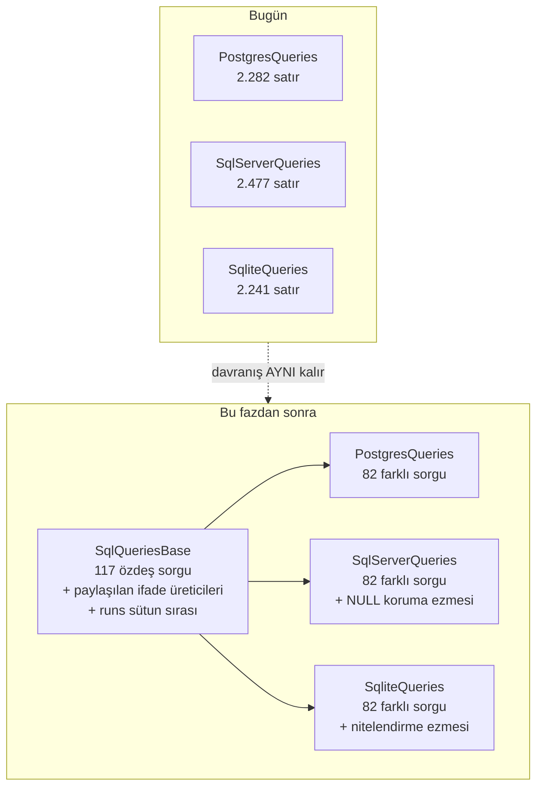

# Faz 94 — SQL Tek Kaynak

> **Durum:** 📋 Planlandı (2026-08-23)
> **Kaynak:** [`kesif/2026-08-23-yapisal-sorun-envanteri.md`](kesif/2026-08-23-yapisal-sorun-envanteri.md) kalem **8**. Bu faz bir `F-NN` adayından gelmez.
> **Önkoşul:** [Faz 93](arsiv/fazlar/93-KUSUR-SINIFI-KAPILARI.md) — zorunlu değil, ama sıra kullanıcı tarafından böyle seçildi: önce kusur sınıfı kapıları, sonra bu faz. Faz 93 bu fazın kapsamındaki C# tarafını (K-483'ün `RunCost.Total()` ikizi) etkilemez
> **Paketler:** `AgentPrism.Sql.Shared` (bağlı kaynak, K-176), `AgentPrism.PostgreSql`, `AgentPrism.SqlServer`, `AgentPrism.Sqlite`
> **Yeni paket:** Yok · **Migration:** **Yok** — bu faz şemaya dokunmaz, yalnız SQL **metninin** nerede yaşadığını değiştirir
> **Public API:** Büyümüyor. Ölçüldü 2026-08-23: `PublicAPI.Unshipped.txt` 8.079 satır, `Shipped.txt` boş. `SqlQueriesBase`, `SqlDialect` ve `Sql*Store` tiplerinin tamamı `internal`'dır
> **Tüketici yüzeyi:** **Yok.** `tuketici-dokuman-senkronu` Adım 0 tablosundaki hiçbir yol tutmuyor: public üye değişmiyor, HTTP ucu değişmiyor, ekran yok, yeni paket yok, sevk edilen metin yok. Üretilen SQL **birebir aynı kalır** — davranış değişmez, yalnız metnin kaynağı tek yere iner. Skill koşmaz; gerekçe budur
> **Manuel test alanı:** [`docs/manuel-test/03-KALICILIK-POSTGRESQL.md`](manuel-test/03-KALICILIK-POSTGRESQL.md) ve [`docs/manuel-test/04-KALICILIK-DIGER.md`](manuel-test/04-KALICILIK-DIGER.md)

---

## Bu Faza Başlarken

> `faz-baslangic` skill'ini uygula. Aşağıdaki liste o skill'in 2. adımıdır —
> **tamamını değil, yalnız işaret edilen bölümleri oku.**

1. Bu doküman
2. Kararlar — dosyanın tamamını **okuma**, yalnız bu kalemleri grep'le:
   ```bash
   grep -n "K-176\|K-193\|K-194\|K-247\|K-259\|K-479\|K-483" docs/KARARLAR.md
   sed -n '16,17p;29,30p' docs/KARARLAR.md   # EF Core REDDEDILDI — bu faz ORM önermez
   ```
   **K-176** (`Sql.Shared` paket değil, bağlı kaynak), **K-193** (SQLite tablo öneki noktasızdır), **K-194** (yeni sağlayıcı sözleşme testi yazmaz, koşucu türetir), **K-247** (bağlı kaynak tipin `internal` işareti çapraz derleme sayımında güvenilmez), **K-259** (`EXISTS` korelasyonunda bare tablo adı yazma), **K-479** (`runs.labels` süzgeci üç dialektte farklıdır), **K-483** (elle tekrarlanan toplama ifadesi — **bu fazın çekirdeği**)
3. [`93-KUSUR-SINIFI-KAPILARI.md`](arsiv/fazlar/93-KUSUR-SINIFI-KAPILARI.md) — yalnız devir notu:
   ```bash
   awk '/## Sonraki Faza Devir Notu/,0' docs/93-KUSUR-SINIFI-KAPILARI.md
   ```
   Faz 93 kusur sınıfını C# tarafında kapattı; bu faz aynı sınıfın SQL ikizini alır.
4. Alan hafızası (bu faz dört alana dokunuyor):
   [`hafiza/sql-saglayicilari.md`](hafiza/sql-saglayicilari.md) (**tamamı** — bu fazın ana alanı) ·
   [`hafiza/sql-server-tuzaklari.md`](hafiza/sql-server-tuzaklari.md) ·
   [`hafiza/sqlite.md`](hafiza/sqlite.md) ·
   [`hafiza/postgresql.md`](hafiza/postgresql.md)
5. Gerektiğinde, tamamı değil ilgili bölümü:
   [`MIMARI.md`](MIMARI.md) — kalıcılık katmanı bölümü

---

## Amaç

Bu faz, üç SQL dialect'inde **elle tekrarlanan** metni tek kaynağa indirir. İki
eksende çalışır ve ikisi de ölçülmüştür.

- **Eksen 1 — özdeş sorgular.** 199 ortak sorgudan **117'si** (%59) üç dialect'te
  aynıdır; bugün hiçbiri paylaşılmıyor.
- **Eksen 2 — tekrarlanan ifadeler.** Maliyet toplama ifadesi **18 yerde** elle
  yazılıdır (dialect başına 6). K-483 tam bu yapıdan doğdu: `InputCost + OutputCost`
  ifadesine üçüncü terim eklenince yalnız SQL düzeltildi ve bir kiracı maliyet
  tavanını aşabilirdi. **4.241 test yakalamadı**; bağımsız denetim buldu.

Kazanç satır sayısı **değildir**, kusur sınıfıdır. Sözleşme testleri var olan
davranışı koruyor — ama **eklenmemiş** bir terimi hiçbir test yakalayamaz.

### Bugün ne çalışmıyor — doğrulanmış kanıt

Aşağıdaki tüm sayılar 2026-08-23'te repo üzerinde ölçüldü.

| Kanıt | Gözlem |
|---|---|
| `wc -l` üç sorgu dosyası | `SqlServerQueries.cs` 2.477 + `PostgresQueries.cs` 2.282 + `SqliteQueries.cs` 2.241 = **7.000** satır |
| Üç dosyanın ayrıştırılıp karşılaştırılması | **199** ortak sorgu adı. Şema niteleyicisi soyutlandığında **117'si üçünde de ÖZDEŞ**; **82'si** gerçekten farklı |
| Aynı karşılaştırma, şema niteleyicisi **soyutlanmadan** | Özdeş sorgu sayısı **0** — PostgreSQL/SQL Server `{Schema}.runs`, SQLite `{Schema}runs` yazar (K-193) |
| Özdeş 117'nin satır payı | Dialect başına **~610** satır; sorgu bloklarının **%37**'si. Birleştirme ~**1.220** satır düşürür — 7.000'in tamamını **değil** |
| `grep -c cached_input_cost` | Maliyet toplama ifadesi **6 + 6 + 6 = 18** yerde elle yazılı. Terim listesi (`input_cost`, `output_cost`, `cached_input_cost`) üçünde **aynı**; yalnız NULL koruma deyimi farklı |
| `grep -c "SUM(sub.input_tokens)\|COALESCE(SUM(input_tokens), 0)"` | Token ağaç toplamları **4 + 4 + 4 = 12** yerde |
| `runColumns` yerel sabiti | Üç dosyada **ayrı ayrı** yazılı; **53** sütunluk sıra sözleşmesi taşır |
| [`SqlRunStore.cs:930-1020`](../src/AgentPrism.Sql.Shared/Stores/SqlRunStore.cs#L930-L1020) | Okuyucu **sabit ordinal** kullanır (8, 9, 10, 28…52). Sıra üç dialect metniyle **elle** hizalanır; `hafiza/sql-saglayicilari.md` "son ordinal 52" der |
| `grep "string.Empty" tests/` | `SqlQueriesBase`'in **200** özelliğinden hiçbirinin doldurulduğunu doğrulayan test **yok**. Dosyanın kendi XML'i riski yazıyor: "yazılmayan sorgu boş metin kalır, hata yalnız çalışma anında görünür" |
| `SqliteQueries.cs` | `UpgradeMigrationsTable` **atanmıyor** — bilerek (SQLite kodda ezer). Boşluk kapısı bu muafiyeti tanımalıdır |
| [`docs/arsiv/KARARLAR-INDEKS-REDDEDILEN.md` L16, L29](arsiv/KARARLAR-INDEKS-REDDEDILEN.md) | EF Core **reddedildi** (kullanıcı kararı). Bu faz bir ORM veya sorgu oluşturucu **önermez** |

> Kanıtlar 2026-08-23 tarihinde doğrulandı.

---

## 94.1 — Tasarımın şekli



Üç kural tasarımı sınırlar:

| Kural | Bu fazda ne demek |
|---|---|
| **Üretilen SQL değişmez** | Her sorgunun **metni** birebir aynı kalmalıdır. Kapı: 94.6'daki anlık görüntü testi |
| **ORM yok** (L16, L29) | Sorgu ağacı, ifade oluşturucu veya dialect emitter **yazılmaz**. Paylaşım düz metin ve `virtual` metotlarla olur |
| **Bağlı kaynak** (K-176) | `SqlQueriesBase` üç derlemeye **ayrı ayrı** derlenir. Paylaşılan metin üç kez bellekte durur; bu bugünkü durumla aynıdır ve bir maliyet artışı değildir |

---

## 94.2 — Tablo nitelendirmesi tek kaynağa iner

**Sorun:** 117 sorgunun bugün özdeş olmamasının **tek** sebebi budur.
PostgreSQL/SQL Server `{Schema}.runs`, SQLite `{Schema}runs` yazar.

`SqlDialect.QualifyTable` zaten bu ayrımı biliyor
([`SqlDialect.cs:283`](../src/AgentPrism.Sql.Shared/Internal/SqlDialect.cs),
`SqliteDialect.cs:358` ezer) — ama **yanlış katmandadır**: `SqlQueriesBase`
dialect'ten **önce** kurulur ve ona erişemez.

**Çözüm:** nitelendirme `SqlQueriesBase`'e iner; `SqlDialect.QualifyTable` ona
devreder.

```csharp
internal abstract class SqlQueriesBase
{
    /// <summary>Qualifies a bare table name for this provider.</summary>
    protected virtual string Table(string name) => $"{Schema}.{name}";
}

// SqliteQueries
protected override string Table(string name) => $"{Schema}{name}";

// SqlDialect
public virtual string QualifyTable(string tableName) => Queries.QualifyTable(tableName);
```

> **🚨 `Schema` `Table()` çağrılmadan ÖNCE atanmış olmalıdır.** Bugün türetilmiş
> kurucular ilk satırda `Schema = SqlIdentifier.RequireSchemaName(...)` yazar.
> Paylaşılan metin **taban kurucuda** kurulacağı için doğrulama da taban kurucuya
> taşınır: `protected SqlQueriesBase(string schemaName)`. Türetilmiş kurucular
> `: base(schemaName)` çağırır ve `Schema` ataması **düşer**. Bu adım atlanırsa
> paylaşılan metinler boş şema adıyla kurulur ve hata yalnız çalışma anında
> görünür.

---

## 94.3 — 117 özdeş sorgu taban sınıfa taşınır

Taban kurucu bu 117 metni kurar. Türetilmiş kurucu **yalnız** farklı olan 82'yi
yazar ve taban değerini üzerine yazar.

```csharp
protected SqlQueriesBase(string schemaName)
{
    Schema = SqlIdentifier.RequireSchemaName(schemaName);
    BuildSharedQueries();          // 117 metin
}
```

**Uygulama sırası — bu sıra atlanmaz:**

1. Ölçüm script'i tekrar koşulur; **bugünkü** özdeş listesi üretilir. Plan 117
   diyor; kod o güne kadar değişmiş olabilir. Liste **koddan** alınır, plandan değil.
2. Liste tek seferde değil, **grup grup** taşınır (deneyler → MCP → kiracı → …).
   Her grup sonrası sözleşme testleri koşulur.
3. Bir sorgu taşındıktan sonra ilgili dialect dosyasından **silinir**. İki yerde
   kalırsa taban değeri sessizce ezilir ve kazanç kaybolur.

> **🚨 82 farklı sorgu birleştirilmeye ÇALIŞILMAZ.** `SelectRunStatistics`,
> `SelectRuns`, upsert'ler ve `ClaimOrphanedRuns` gerçekten farklıdır:
> PostgreSQL `ON CONFLICT … RETURNING`, SQL Server `UPDATE … OUTPUT` + `IF
> @@ROWCOUNT = 0 INSERT`, SQLite ayrı bir üçüncü biçim kullanır. Bunları ortak
> bir şablona zorlamak üç dialect'i de bozar ve bu fazın kapsamı **değildir**.

---

## 94.4 — Tekrarlanan ifadeler tek kaynağa iner

Bu bölüm K-483'ün SQL ikizini kapatır ve fazın **asıl** gerekçesidir.

### 94.4.1 — Maliyet toplama ifadesi (18 yer)

Bugünkü metin, PostgreSQL ve SQLite'ta:

```sql
CASE WHEN COUNT(*) FILTER (WHERE input_cost IS NOT NULL OR output_cost IS NOT NULL OR cached_input_cost IS NOT NULL) = 0
     THEN NULL ELSE COALESCE(SUM(input_cost), 0) + COALESCE(SUM(output_cost), 0) + COALESCE(SUM(cached_input_cost), 0) END
```

SQL Server'da yalnız **NULL koruma deyimi** farklıdır (`COUNT(*) FILTER` yok):

```sql
CASE WHEN COALESCE(SUM(CASE WHEN … THEN 1 ELSE 0 END), 0) = 0 THEN NULL ELSE … END
```

**Terim listesi üçünde aynıdır.** Tek kaynak o listedir:

```csharp
/// <summary>
/// The addends of a cost total, in order. 🚨 A new cost term is added HERE and
/// nowhere else: K-483 was born when a third term reached the SQL but not the
/// C# sum. RunCost.Total() is the C# twin of this list.
/// </summary>
protected static readonly string[] CostAddends =
    ["input_cost", "output_cost", "cached_input_cost"];

/// <summary>Builds the null-preserving cost total over the addends.</summary>
protected string CostTotal(string? alias = null);

/// <summary>Counts the rows in which any addend is not null.</summary>
/// <remarks>SQL Server has no FILTER clause and overrides this.</remarks>
protected virtual string CountWhereAnyNotNull(IReadOnlyList<string> columns, string? alias);
```

Dördüncü maliyet terimi eklemek **tek satır** değiştirir: `CostAddends`.

### 94.4.2 — Token ağaç toplamları (12 yer)

Aynı desen. `TokenAddends` listesi + `TreeSum(column, alias)` üreticisi.

> **🚨 Token toplamı `COALESCE(…, 0)` alır, cache maliyeti ALMAZ.**
> [`SqliteQueries.cs:504-510`](../src/AgentPrism.Sqlite/Internal/SqliteQueries.cs)
> bunu yorumla yazıyor: kimsenin cache kullanımı bildirmediği bir alt ağaç
> "ölçülmedi" okunmalıdır, "sıfır ölçüldü" değil. Üretici bu ayrımı **parametre
> olarak** taşımalıdır; tek bir `TreeSum` ikisini birden yapamaz.

### 94.4.3 — `runs` sütun sırası (3 yer + 1 okuyucu)

`runColumns` üç dosyada ayrı yazılıdır ve **53 sütunluk bir sıra sözleşmesi**
taşır. Sözleşmenin dördüncü tarafı `SqlRunStore`'un sabit ordinalleridir.

Tek kaynak **sıralı mantıksal sütun listesi** olur:

```csharp
/// <summary>
/// The run columns in reader order. 🚨 A new column is APPENDED, never inserted:
/// SqlRunStore reads by ordinal. This list is the ordinal contract.
/// </summary>
protected static readonly RunColumn[] RunColumnOrder = [ /* 53 kalem */ ];
```

Her kalem iki bilgi taşır: mantıksal ad ve **kaynağı** (`Own` = `r.<sütun>`,
`Tree` = ağaç toplamı). `Own` sütunlarının metni üç dialect'te aynıdır. `Tree`
sütunları farklıdır — PostgreSQL/SQL Server bir `treeJoin` alt sorgusundan
okur, SQLite ilişkili alt sorgu yazar (K-193 nedeniyle `treeJoin` yoktur.)
Dialect yalnız `Tree` çözümlemesini ezer.

`SqlRunStore`'un ordinalleri bu listeden türetilmiş **adlandırılmış sabitlere**
döner (`RunOrdinals.CachedInputCost` gibi).

> **Kapsam sınırı:** yalnız **`runs` okuyucusunun** ordinalleri taşınır
> (`ReadRun`, `ReadUsage`, `ReadTreeUsage`, `ReadCost`, `ReadTreeCost`).
> `SqlRunStore` toplam **176** sabit ordinal okuması içeriyor; diğer okuyucular
> (tool çağrısı, olay, istatistik) bu fazın kapsamı **değildir** ve dokunulmaz.

---

## 94.5 — Boşluk kapısı: hiçbir sorgu boş kalamaz

`SqlQueriesBase`'in kendi XML'i riski yazıyor ve **bugün hiçbir test onu
kontrol etmiyor**. Bu faz taban sınıfa 117 metin koyduğu için risk **artar**:
türetilmiş sınıfın bir sorguyu yanlışlıkla `string.Empty`'ye ezmesi mümkün olur.

**`SqlQueryCompletenessTests`** — her sağlayıcının entegrasyon test projesinde
koşan, o projenin kendi derlemesindeki tipe bakan bir test (K-247: bağlı kaynak
tipi çapraz derleme sayılamaz, bu yüzden **sağlayıcı başına** bir koşucu).

İddia: `SqlQueriesBase`'in her `string` özelliği boş olmayan bir metin döndürür.

**Muafiyet listesi tek yerdedir ve gerekçe ister:**

| Sağlayıcı | Muaf özellik | Gerekçe |
|---|---|---|
| SQLite | `UpgradeMigrationsTable` | Statik SQL ile ifade edilemez; `SqliteDialect.UpgradeMigrationsTableAsync` kodda yapar (K-475) |

---

## 94.6 — 🚨 Değişmezlik kapısı: üretilen SQL birebir aynı kalmalı

Bu fazın en büyük riski **sessiz bir metin kayması**dır. Sözleşme testleri
davranışı korur ama bir boşluk veya parantez farkını göstermez; bir sorgu planı
değişikliği de testten geçer.

**Kapı:** faz **başlamadan önce** üç dialect'in 199 sorgusunun tamamı bir anlık
görüntü dosyasına yazılır. Faz boyunca her adımda yeniden üretilir ve
karşılaştırılır.

```bash
# Faz başında bir kez — taban çizgisi
AGENTPRISM_SQL_SNAPSHOT_REFRESH=1 \
  ./artifacts/bin/AgentPrism.PostgreSql.IntegrationTests/release/AgentPrism.PostgreSql.IntegrationTests \
  --filter-class "*SqlTextSnapshotTests*"
```

Anlık görüntü dosyası **normalize edilmiş** metni tutar (boşluk daraltılmış,
yorum çıkarılmış) — biçimlendirme değişikliği kapıyı kırmasın, **anlam**
değişikliği kırsın diye.

> **🚨 Anlık görüntü Docker istemez.** Sorgu metni bir `SqlQueriesBase`
> örneğinden okunur; veritabanı bağlantısı gerekmez. Test bu yüzden
> `AgentPrism.no-docker.slnf` içindeki bir projede de koşabilmelidir —
> yer seçimi Açık Soru 3'tedir.

Faz sonunda anlık görüntü dosyası **silinmez**: kalıcı bir regresyon kapısı olur.

---

## Planlanan Public API

Public API **büyümüyor**. `SqlQueriesBase`, `SqlDialect` ve `Sql*Store`
tiplerinin tamamı `internal`'dır (K-176 bağlı kaynak deseni).

```csharp
// AgentPrism.Sql.Shared/Internal/SqlQueriesBase.cs — hepsi internal/protected
internal abstract class SqlQueriesBase
{
    protected SqlQueriesBase(string schemaName);

    protected virtual string Table(string name);
    public string QualifyTable(string tableName);

    protected static readonly string[] CostAddends;
    protected static readonly string[] TokenAddends;
    protected static readonly RunColumn[] RunColumnOrder;

    protected string CostTotal(string? alias = null);
    protected string TreeSum(string column, string? alias, bool coalesceToZero);
    protected virtual string CountWhereAnyNotNull(IReadOnlyList<string> columns, string? alias);
}

internal readonly record struct RunColumn(string Name, RunColumnSource Source);
internal enum RunColumnSource { Own, Tree }
```

### Arayüz payı

Yok — arayüze dokunulmuyor.

---

## Planlanan Dosya Listesi

```
src/AgentPrism.Sql.Shared/Internal/
├── SqlQueriesBase.cs             (büyür — 117 metin + ifade üreticileri + sütun sırası)
├── SqlDialect.cs                 (küçülür — QualifyTable devreder)
└── RunColumn.cs                  (yeni — sıra sözleşmesinin tipi)

src/AgentPrism.Sql.Shared/Stores/
└── SqlRunStore.cs                (değişir — YALNIZ runs okuyucusunun ordinalleri)

src/AgentPrism.PostgreSql/Internal/
├── PostgresQueries.cs            (küçülür — 117 sorgu düşer)
└── PostgresDialect.cs            (değişir — QualifyTable ezmesi düşer)

src/AgentPrism.SqlServer/Internal/
├── SqlServerQueries.cs           (küçülür — 117 sorgu düşer + CountWhereAnyNotNull ezmesi)
└── SqlServerDialect.cs           (değişir)

src/AgentPrism.Sqlite/Internal/
├── SqliteQueries.cs              (küçülür — 117 sorgu düşer + Table ezmesi)
└── SqliteDialect.cs              (değişir — QualifyTable ezmesi düşer)

tests/Shared/Contracts/
└── SqlQueryCompletenessTests.cs  (yeni — sağlayıcı başına koşar)

tests/<sağlayıcı>.IntegrationTests/
├── SqlTextSnapshotTests.cs       (yeni × 3)
└── sql-text-baseline.txt         (yeni × 3)
```

---

## Hata Modları ve Testler

> Mutlu yoldan değil, **ne bozulabilir**den türetilir. Seviyeyi plan seçer.
> Sınır geçen davranış (DI · HTTP · kiracı · akış · depo · paket) birim
> testiyle kanıtlanamaz — [`.agents/ortak/test-seviyeleri.md`](../.agents/ortak/test-seviyeleri.md).

| Ne bozulabilir | Seviye | Test sınıfı |
|---|---|---|
| Taşınan bir sorgunun metni sessizce değişir | Sözleşme (anlık görüntü) | `SqlTextSnapshotTests` — üç sağlayıcıda |
| Taşınan sorgu dialect dosyasında da kalır ve tabanı ezer | Sözleşme (anlık görüntü) | `SqlTextSnapshotTests` — metin aynı kalır ama kazanç kaybolur; ayrıca 94.3 adım 3 |
| Türetilmiş sınıf bir sorguyu `string.Empty`'ye ezer | Sözleşme | `SqlQueryCompletenessTests` |
| `Schema` `Table()` çağrısından sonra atanır → boş şema adı | Sözleşme | `SqlQueryCompletenessTests` — metin `{Schema}` yer tutucusu **taşımamalı** |
| SQLite nitelendirmesi noktalı üretilir (K-193 ihlali) | Entegrasyon | `SqliteDialectTests` + tüm SQLite sözleşme koşumu |
| Maliyet toplamına dördüncü terim eklenir, SQL'e girer, C#'a girmez | Sözleşme | **yeni**: `CostAddends` ile `RunCost` alanları çapraz doğrulanır (`RunCost.Total()` üzerinden, K-483'ün ikinci kapısı) |
| Ağaç token toplamı yanlışlıkla `COALESCE(…, 0)` alır → "ölçülmedi" yerine "0" | Sözleşme | `RunStoreContract` — cache bildirmeyen alt ağaç `null` döndürmeli |
| `runs` sütun sırası kayar → okuyucu yanlış ordinalden okur | Sözleşme | `RunStoreContract` (mevcut, 382 Fact/Theory) + **yeni**: `RunColumnOrder.Length` ile en yüksek kullanılan ordinal karşılaştırılır |
| SQL Server `COUNT(*) FILTER` üretilir ve çalışma anında patlar | Entegrasyon | `AgentPrism.SqlServer.IntegrationTests` tam koşum (Docker) |
| Yeni bir sağlayıcı eklendiğinde taban metnin `Table()` ezmesi unutulur | Sözleşme | `SqlQueryCompletenessTests` (yer tutucu iddiası) |
| Bağlı kaynak yapısı bozulur, `Sql.Shared` bir derlemede eksik kalır | Paket | `dotnet pack AgentPrism.slnx -c Release` |

**Beş soru** (her yeni kod yolu için):

| Soru | Cevap |
|---|---|
| İptal | Uygulanmaz — sorgu metni kurulumda üretilir, `CancellationToken` almaz |
| Eşzamanlılık | Metinler kurucuda **bir kez** kurulur ve değişmez (`SqlQueriesBase` XML'i bunu yazıyor). Yeni üreticiler de kurucudan çağrılır; çalışma anında birleştirme **yapılmaz** |
| Boş/aşırı girdi | Geçersiz şema adı `SqlIdentifier.RequireSchemaName` ile taban kurucuda reddedilir — bugünkü davranışla aynı, ama artık **tek** yerde |
| Başka kiracının kaydı | Kiracı süzgeci sorgu metninin içindedir ve **değişmiyor**. `TenantIsolationContract` üç sağlayıcıda koşar ve bunu kanıtlar |
| Alt sistem hatası | Uygulanmaz — bu faz çalışma anı yolunu değiştirmez |

---

## Manuel Kabul Case'leri

| # | Aile | Ön koşul | Adımlar | Beklenen sonuç |
|---|---|---|---|---|
| 1 | 03 | PostgreSQL ayakta | Örnek uygulamada bir `run` koştur, `GET /api/runs/{id}` çağır | Maliyet ve token ağaç toplamları faz öncesiyle **birebir aynı** |
| 2 | 04 | SQLite dosya veritabanı | Aynı senaryo | Aynı sonuç; tablo adları **noktasız** öneklidir (`agentprism_runs`) |
| 3 | 04 | SQL Server ayakta | Aynı senaryo | Aynı sonuç |
| 4 | 03 | — | `SqlTextSnapshotTests` taban çizgisini bozacak bir boşluk ekle, testi koştur, geri al | Test **düşer** ve sorguyu adıyla yazar |
| 5 | 04 | — | `SqliteQueries` içinde bir sorguyu `string.Empty` yap, testi koştur, geri al | `SqlQueryCompletenessTests` **düşer** |
| 6 | 03 | — | `CostAddends` listesine sahte bir dördüncü terim ekle, testi koştur, geri al | Çapraz doğrulama testi **düşer** (C# `RunCost` karşılığı yok) |

---

## Açık Sorular

| # | Soru | Seçenekler | Öneri |
|---|---|---|---|
| 1 | 117 sorgu tek fazda mı taşınsın, yoksa yarısı bu fazda mı? | A: tamamı · B: grup grup, kalanı devir notuna | **A**, ama 94.3'teki grup grup sırayla. Yarım bırakmak iki yapıyı aynı anda yaşatır ve sonraki oturum hangi sorgunun nerede olduğunu bilemez |
| 2 | `RunColumnOrder` sütun adını mı yoksa tam ifadeyi mi tutsun? | A: ad + kaynak (`Own`/`Tree`) · B: dialect başına tam ifade sözlüğü | **A.** B, bugünkü tekrarı bir sözlüğe taşır ve hiçbir şey kazandırmaz |
| 3 | `SqlTextSnapshotTests` nerede yaşasın? | A: üç entegrasyon projesinde (Docker'a bağlı) · B: `AgentPrism.Core.UnitTests` içinde, üç `Queries` tipine erişerek | **B**, mümkünse. Metin testi veritabanı istemez; kalem 13'ün dersi budur. Engel: `internal` tipler ve K-247 (bağlı kaynak, ayrı derleme). Uygulayan oturum `InternalsVisibleTo` ile erişimi **ölçer**; olmuyorsa A'ya döner ve gerekçeyi yazar |
| 4 | `SqlDialect.BuildRetention*` / `BuildDataSubject*` metotları da tabana insin mi? | A: evet, aynı fazda · B: hayır, kapsam dışı | **B.** Onlar zaten `SqlDialect` üzerinde ve `virtual` varsayılanları var; ikinci bir yapıyı aynı fazda değiştirmek anlık görüntü kapısını okunamaz hâle getirir |
| 5 | `SqliteQueries`'in `treeJoin`'siz ilişkili alt sorgu biçimi `RunColumnOrder` ile ifade edilebiliyor mu? | A: evet, `Tree` çözümleyicisi dialect'te · B: hayır, SQLite `runColumns`'u kendi yazmaya devam eder | **A** denenir; ölçüm ilk adımdır. Olmuyorsa **B** kabul edilir ve gerekçesi yazılır — SQLite'ın 53 sütunu üç yerde değil **bir** yerde kalmış olur |

---

## Bitiş Ölçütleri (DoD)

- [ ] Faz başında üç dialect'in 199 sorgusu için anlık görüntü taban çizgisi üretildi ve commit edildi
- [ ] Faz sonunda `SqlTextSnapshotTests` üç sağlayıcıda da **sıfır fark** verir — üretilen SQL birebir aynı
- [ ] Özdeş sorgular `SqlQueriesBase`'e taşındı; taşınan sorgu dialect dosyalarında **kalmadı** (ölçüm: taşınan sayı + üç dosyanın yeni satır sayısı belgeye yazıldı)
- [ ] Maliyet toplama ifadesi tek kaynaktan üretilir; `CostAddends` listesine sahte bir terim eklemek üç dialect'in metnini birden değiştirir (manuel case 6 ile kanıtlandı)
- [ ] Token ağaç toplamları tek kaynaktan üretilir; cache toplamının `COALESCE(…, 0)` **almadığı** sözleşme testiyle korunur
- [ ] `runs` sütun sırası tek listede; `SqlRunStore`'un runs okuyucusu adlandırılmış sabit kullanır, sabit ordinal **kalmadı**
- [ ] `SqlQueryCompletenessTests` üç sağlayıcıda koşar; SQLite'ın `UpgradeMigrationsTable` muafiyeti gerekçesiyle listede
- [ ] `tests/Shared/Contracts/` 382 Fact/Theory üç sağlayıcıda da yeşil (PostgreSQL · SQL Server · SQLite)
- [ ] SQLite tablo nitelendirmesi **noktasız** kalır; `SqliteDialectTests` yeşil
- [ ] Dört doğrulama kapısı sıfır uyarı verir (`python3 scripts/kapi.py kapanis --taban <faz öncesi commit>`)
- [ ] `samples/AgentPrism.Api` ile gerçek `run` yapıldı, çıktı belgeye yazıldı (varsayılan InMemory **değil**, PostgreSQL ile)
- [ ] `secret` taraması boş döndü
- [ ] Manuel kabul case'leri `docs/manuel-test/03-KALICILIK-POSTGRESQL.md` ve `04-KALICILIK-DIGER.md` içine eklendi; otomatikleştirilebilenler koşuldu
- [ ] `faz-denetim` koşuldu; 🔴 bulgu kalmadı
- [ ] `docs/hafiza/sql-saglayicilari.md` güncellendi: yeni sorgu **nereye** yazılır (özdeşse tabana, farklıysa dialect'e) ve dördüncü maliyet terimi **nereden** eklenir

### Doğrulama komutları

```bash
# Üç dosyanın satır sayısı (faz öncesi 2477 / 2282 / 2241)
wc -l src/AgentPrism.SqlServer/Internal/SqlServerQueries.cs \
      src/AgentPrism.PostgreSql/Internal/PostgresQueries.cs \
      src/AgentPrism.Sqlite/Internal/SqliteQueries.cs

# Maliyet ifadesi kaç yerde elle yazılı (faz öncesi 6+6+6)
grep -c "COALESCE(SUM(input_cost), 0)" \
  src/AgentPrism.PostgreSql/Internal/PostgresQueries.cs \
  src/AgentPrism.SqlServer/Internal/SqlServerQueries.cs \
  src/AgentPrism.Sqlite/Internal/SqliteQueries.cs

# Sabit ordinal kaldı mı (runs okuyucusunda)
grep -n "reader, [0-9]\+\|IsDBNull([0-9]\+)" src/AgentPrism.Sql.Shared/Stores/SqlRunStore.cs | sed -n '1,40p'

# Sözleşme testleri — üç sağlayıcı
dotnet test tests/AgentPrism.PostgreSql.IntegrationTests -c Release
dotnet test tests/AgentPrism.SqlServer.IntegrationTests -c Release
dotnet test tests/AgentPrism.Sqlite.IntegrationTests -c Release
```

---

## Riskler

| Risk | Önlem |
|------|-------|
| **Sessiz metin kayması** — en büyük risk | 94.6 anlık görüntü kapısı faz **başlamadan önce** kurulur. Kapı kurulmadan tek satır taşınmaz |
| Taşınan sorgu dialect dosyasında kalır; taban değeri ezilir ve kazanç kaybolur | 94.3 adım 3 zorunludur; satır sayısı ölçümü DoD'dedir |
| `Schema` ataması taban kurucuya taşınırken bir dialect atlanır | `SqlQueryCompletenessTests` metinde `{Schema}` yer tutucusu arar |
| SQL Server `COUNT(*) FILTER` desteklemiyor; paylaşılan üretici yanlış metin verir | `CountWhereAnyNotNull` `virtual`'dır ve SQL Server ezer. Kapı: gerçek `mssql/server` üzerinde tam entegrasyon koşumu (K-386, Docker gerekir) |
| SQLite `runColumns`'u paylaşılan sıra listesiyle ifade edilemez | Açık Soru 5: ölçülür, olmuyorsa SQLite kendi metnini korur ve **gerekçe yazılır**. Faz bu yüzden durmaz |
| Bağlı kaynak (K-176) üç derlemede ayrı yaşadığı için `internal` sayım testleri yanılır | K-247 kayıtlıdır: sözleşme testi **sağlayıcı başına** koşar, tek yerden sayılmaz |
| Faz çok büyür ve yarım kalır | Açık Soru 1 tamamını istiyor, ama iş **grup grup** ilerler ve her grup sonrası sözleşme testleri koşulur. Yarım bırakılırsa devir notu hangi grupların taşındığını **listeler** |
| Docker olmayan makinede SQL Server kısmı doğrulanamaz | Faz **kapanamaz**: DoD üç sağlayıcının da yeşil olmasını istiyor. `AgentPrism.no-docker.slnf` bu faz için yeterli **değildir** |

---

<!-- ============================================================
     AŞAĞISI KAPANIŞTA DOLDURULUR — `faz-tamamlama` skill'i.
     Plan anında boş kalır. Başlıkları SİLME.
     ============================================================ -->

## Plandan Sapmalar

> Kapanışta doldurulur. Plan ile gerçek arasındaki fark **gizlenmez** — sonraki
> oturumun en değerli bilgisidir.

## Bu Fazda Verilen Kararlar

> Kapanışta doldurulur. K-NNN numaraları burada alınır; plan numara rezerve etmez.

## Gerçekleşen Public API

> Kapanışta doldurulur. Koddaki **gerçek** imzalar.

## Dosya Listesi (gerçekleşen)

> Kapanışta doldurulur.

## Denetim Bulguları

> Kapanışta doldurulur — `faz-denetim` çıktısı. Her satır: bulgu · seviye
> (🔴/🟡/🟢) · sonuç (düzeltildi / gerekçelendi / F-NN olarak devredildi).
> Bulgu yoksa "🔴 ve 🟡 yok" yazılır; boş bırakılmaz.

## Sonraki Faza Devir Notu

> Kapanışta doldurulur: devralınan sözleşmeler, bilinen tuzaklar (🚨), yarım
> kalan işler, sıradaki faz.
