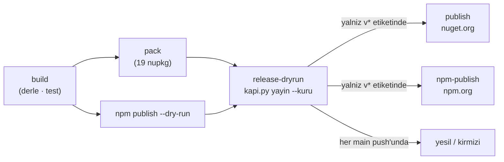

# Faz 97 — Sürüm Politikası ve Yayın Provası

> **Durum:** ✅ Tamamlandı (2026-08-24)
> **Kaynak:** [`kesif/2026-08-23-yapisal-sorun-envanteri.md`](kesif/2026-08-23-yapisal-sorun-envanteri.md) — **madde 2** (stabil sürüm MAF ön sürümüne yapısal olarak bağlı) + **madde 1** (1.0 yok; public API'nin tamamı `Unshipped`). Kalemler `ADAYLAR.md`'de değildir; F numarası yoktur. Sıra bölüm 7.2'de kullanıcı tarafından sabitlendi (sıra 4).
> **Önkoşul:** [Faz 96](arsiv/fazlar/96-PUBLIC-YUZEY-KUCULTME.md) — yüzey küçültme yayından **önce** bitmeliydi; bitti (618 tip). Yayın anından sonra aynı iş bir sürüm kararı olurdu.
> **Paketler:** `src/` altındaki **19** paketin hepsi. Kod değişmez; `src/Directory.Build.props`, 19 `.csproj` ve CI değişir.
> **Yeni paket:** Yok · **Migration:** Yok
> **Public API:** **Değişmiyor.** `PublicAPI.Unshipped.txt` dosyalarına satır eklenmez, silinmez. `Shipped.txt` dosyaları **boş kalır** — bkz. 97.1, karar 2.
> **Tüketici yüzeyi:** site: `docs-site/src/content/docs/reference/compatibility.md` (başlık ve tablo **17 → 19**; `AgentPrism.Client` ve `AgentPrism.Cli` satırları eklenir) · `reference/versioning.md` (tek sürüm hattı ve `Shipped` politikası beyanı) · sevk edilen: **19 `.nupkg`'nin hepsi `icon.png` kazanır** — nuget.org paket kartında ikon görünür; paket `README.md`'leri değişmez
> **Manuel test alanı:** [`docs/manuel-test/01-KURULUM-VE-PAKETLEME.md`](manuel-test/01-KURULUM-VE-PAKETLEME.md) — alan kodu `PKG`, sıradaki case **MT-PKG-097**

---

## Bu Faza Başlarken

> `faz-baslangic` skill'ini uygula. Aşağıdaki liste o skill'in 2. adımıdır —
> **tamamını değil, yalnız işaret edilen bölümleri oku.**

1. Bu doküman.
2. Kararlar — dosyanın tamamını **okuma**, yalnız bu kalemleri grep'le:
   ```bash
   grep -n "K-006\|K-007\|K-008\|K-017\|K-068\|K-265\|K-421\|K-424" docs/KARARLAR.md
   ```
   **K-006** (trim/AOT varsayılan açık) · **K-007** (geçişli sabitleme kapalı; yeni paket gerekçe ister) · **K-008** (ön sürüm MAF bağımlılığı yalnız `AgentPrism.AspNetCore`) · **K-017** (sürüm MinVer ile git etiketinden) · **K-068** (Faz 7 sıradan çıkarıldı; **bu faz onu kapatır**) · **K-265** (şablon paket sürümü kayan `*-*`) · **K-421** (public API takibi yayından bağımsız açıldı) · **K-424** (dört proje public API takibi dışında).
3. [Faz 96](arsiv/fazlar/96-PUBLIC-YUZEY-KUCULTME.md) — yalnız devir notu:
   ```bash
   awk '/## Sonraki Faza Devir Notu/,0' docs/arsiv/fazlar/96-PUBLIC-YUZEY-KUCULTME.md
   ```
   Devralınan sözleşmeler: `PublicSurfaceBaselineTests` (tip sayar) ve
   `PublicApiTrackingDeclarationTests` (her yeni packable paket beyan ister).
   İkisi de bu fazda **korunur**; bu faz yeni paket eklemez.
4. Alan hafızası — bu faz **iki** alana dokunuyor:
   [`hafiza/paketleme-ve-dagitim.md`](hafiza/paketleme-ve-dagitim.md) (🚨 `<None Update=...>`
   çapraz-hedefli projede sessizce hiçbir şey yapmaz — `icon.png` bu tuzağın tam
   içindedir) · [`hafiza/dokumantasyon.md`](hafiza/dokumantasyon.md) (site kapıları,
   `docs/` ile `docs-site/` ayrımı).
5. Keşif turunun ölçülmüş zemini — yalnız **bölüm 7.4**:
   ```bash
   awk '/^### 7.4/,/^### 7.5/' docs/kesif/2026-08-23-yapisal-sorun-envanteri.md
   ```
   🚨 Aynı dosyanın **bölüm 7.5**'i şunu söyler: bu envanterin sayıları bayattır.
   Aşağıdaki kanıt tablosu 2026-08-24'te **yeniden** ölçülmüştür; envanterdeki
   eski değerleri değil bu tabloyu kullan.

---

## Amaç

AgentPrism 97 faz ve 337 commit sonra hâlâ **yayınlanmadı**. Depoda tek bir sürüm
etiketi yoktur, yani hiç kimse `dotnet add package AgentPrism` diyemez. Bu faz
yayının önündeki her yapısal engeli kaldırır ve yayını **prova edilebilir** hâle
getirir: sürüm politikası karara bağlanır, paketlerin içeriği bir kapıya bağlanır
ve yayın işi o kapı geçmeden koşamaz.

Bu faz **yayını kendisi yapmaz.** `v1.0.0-preview.1` etiketi hem NuGet hem npm
yayınını başlatır ve NuGet'e giden bir paket geri çekilemez — yalnız listeden
düşürülür. Geri dönüşü olmayan o tek adım kullanıcının elinde kalır (👤 karar,
2026-08-24). Fazın çıktısı şudur: **etiket atıldığı an ne olacağı önceden ölçülmüş
olur.**

- **madde 2** — 19 paketin tamamı tek `1.0.0-preview.N` hattında; K-008 sınırı bir kapıyla korunur.
- **madde 1** — Faz 7'nin açık kalan yayın hazırlığı (ikon, paket doğrulama, doküman doğruluğu) kapanır; `Shipped.txt` dolumu **bilinçli olarak** GA'ya bırakılır.

### Bugün ne çalışmıyor — doğrulanmış kanıt

| Kanıt | Gözlem |
|---|---|
| `git tag` | Tek etiket var: `docs/damitma-oncesi-2026-08`. Eğik çizgili adı bilinçlidir; MinVer'in SemVer ayrıştırıcısına takılmaz (K-598). **Sürüm etiketi yoktur.** |
| `artifacts/package/release/*.0.0.0-preview.0.353.nupkg` | Son `dotnet pack` **19** paket üretti. Kimlik listesi ölçüldü; hiçbir kapı bu listeyi doğrulamıyor. |
| `unzip -p AgentPrism.Core...nupkg AgentPrism.Core.nuspec` | `README.md`, `license`, `repository` + `commit` ve üç TFM için `.xml` doküman var. **`<icon>` yok** — hiçbir pakette `PackageIcon` tanımlı değil. |
| `grep -rn "PackageValidation" src/ Directory.Build.props` | Çıktı boş. Paket doğrulama **kapalı**; net8/9/10 arasındaki API farkı hiçbir kapıda ölçülmüyor. |
| 19 `.nuspec`'in ön sürüm bağımlılık taraması | **Yalnız `AgentPrism.AspNetCore`** ön sürüm bağımlılığı beyan ediyor (`A2A.AspNetCore 1.0.0-preview2`, dört `Microsoft.Agents.AI.Hosting*`). K-008 bugün **tutuyor** ama bunu koruyan bir kapı yok. |
| [`.github/workflows/ci.yml:6`](../.github/workflows/ci.yml) · `:211` · `:245` | Tetik `tags: ['v*']`. `publish` ve `npm-publish` `startsWith(github.ref, 'refs/tags/v')` ile açılır. **Kuru koşum yolu yoktur**; ilk `v*` etiketi doğrudan iki kanala birden yazar. |
| [`ci.yml:209`](../.github/workflows/ci.yml) | `publish: needs: pack`. Yayın işinin önünde paket **içeriğini** doğrulayan hiçbir iş yok. |
| [`docs-site/.../reference/compatibility.md:24`](../docs-site/src/content/docs/reference/compatibility.md) | Başlık **"The 17 packages"**, tablo 17 satır. Depo **19** paket üretiyor; `AgentPrism.Client` ve `AgentPrism.Cli` tabloda yok. |
| [`docs-site/scripts/check-content.mjs:92-115`](../docs-site/scripts/check-content.mjs) | `packageCount` doğru sayılıyor (19) ama **yalnız açılış sayfası** metriğiyle karşılaştırılıyor. `compatibility.md` bu yüzden sessizce saptı. |
| `find src -name PublicAPI.Shipped.txt` | 16 dosya, hepsi boş (yalnız `#nullable enable`). `Unshipped`: **7.532** girdi · **618** tip. |
| `curl` → nuget.org · npm registry | `agentprism`, `agentprism.core` ve `@agentprism/client` kimliklerinin **üçü de boşta** (HTTP 404). `AgentPrism.*` prefix'i rezerve **değil**. |
| [`docs-site/public/favicon.svg`](../docs-site/public/favicon.svg) | Faz 76 görsel kimliği burada, SVG olarak. **nuget.org SVG kabul etmez**; PNG türetilmelidir. `sharp` zaten `docs-site/package.json:24` bağımlılığıdır. |

> Kanıtlar **2026-08-24** tarihinde ölçüldü. Envanterin (2026-08-23) "8.063 girdi ·
> 716 tip" değeri Faz 96 ile düşmüştür; yukarıdaki sayılar günceldir.

---

## 97.1 — Sürüm politikası: iki karar

Bu faz iki kararı yazılı hâle getirir. İkisi de kullanıcı tarafından verildi
(2026-08-24, 👤); faz onları uygular ve `docs/KARARLAR.md`'ye kaydeder. Numaraları
**kapanışta** alınır.

**Karar 1 — tek sürüm hattı.** Paketlenen **19** projenin hepsi tek hatta,
`1.0.0-preview.N` olarak çıkar. Ayrık hat (18 stabil + 1 preview) değerlendirildi
ve reddedildi: `Abstractions` ile `Core`'u anında dondurur ve yüzey kararlarını
acil hâle getirir. Preview hattında yüzey küçültme kırıcı değişiklik sayılmaz.
Hat, MAF'ın `Hosting` paketleri GA olana kadar sürer (K-008).

**Karar 2 — `Shipped.txt` preview hattı boyunca boş kalır.** 618 tipin hiçbiri
`Shipped`'e taşınmaz. Gerekçe: `Shipped` bir uyumluluk sözüdür ve preview hattı
o sözü vermez. Doldurmak, sonraki her küçültmede `RS0017` sürtünmesi ve bilinçli
bir "kırıcı değişiklik" kaydı üretirdi — verilmemiş bir sözün bedeli. Analyzer'ın
bugünkü değeri (faz başına `Unshipped` diff'i, K-421) **aynen sürer**. Dolum
`1.0.0` GA'da tek seferde yapılır.

> 🚨 Bu karar, Faz 7'nin özgün DoD satırını (`tüm PublicAPI.Shipped.txt dolu`) ve
> K-421'in yeniden açılma notunu (`Faz 7 geldiğinde Unshipped → Shipped tek
> seferlik taşınır`) **bilinçli olarak değiştirir**. Kapanışta iki kayıt da
> güncellenir; sapma gizlenmez.

---

## 97.2 — Yayın provası kapısı

Sorun tek cümledir: **etiket atıldığı an ne olacağını kimse ölçmedi.** Bu bölüm
o boşluğu kapatır.

`scripts/kapi.py`'ye yeni bir alt komut eklenir: **`yayin`**. Depo zaten "kapı
komutlarının tek çalıştırılabilir kaynağı" ilkesini `kapi.py` ile uyguluyor;
yayın kapısı da oraya girer, ayrı bir script'e değil.

```bash
python3 scripts/kapi.py yayin --kuru --surum 1.0.0-preview.1
```

Komut hiçbir ağ **yazımı** yapmaz. Sırayla:

1. Sürümü zorlar ve `dotnet pack` koşar. Zorlama yolu **ölçülmeli**: birinci aday
   `MinVerVersionOverride` ortam değişkeni, ikinci aday geçici yerel etiket. Etiket
   yolu seçilirse komut kendi attığı etiketi `finally` bloğunda **her durumda**
   siler.
2. Üretilen `.nupkg` kimlik kümesini sözleşme listesiyle karşılaştırır. Liste
   `src/` altındaki `IsPackable != false` projelerden **türetilir**, elle yazılmaz.
3. Her `.nupkg`'nin sürümünün istenen sürüme **birebir** eşit olduğunu doğrular.
4. Her paketin metaveri sözleşmesini doğrular: `README.md`, `icon.png`, `license`
   ifadesi, `repository` + `commit`. Kütüphane paketleri için ayrıca her TFM'de
   `.xml` doküman ve bir `.snupkg` eşi. `AgentPrism.Templates` (içerik paketi) ve
   `AgentPrism.Cli` (`DotnetTool`) için sözleşme farklıdır ve **ayrı** tanımlanır.
5. **K-008 kapısı:** `AgentPrism.AspNetCore` **dışında** hiçbir paketin ön sürüm
   üçüncü taraf bağımlılığı beyan etmediğini doğrular. Bugün bu doğrudur; kapı
   onu dondurur.
6. `packages/agentprism-client` için `npm publish --dry-run` koşar ve tarball
   dosya listesini beklenenle karşılaştırır. Ağ erişimi yoksa bu adım **açıkça
   atlandığını yazar** ve komutu yeşil göstermez — atlanan adım çıktıda görünür.

CI'da yeni bir iş bu komutu koşar ve yayın işi **ona bağlanır**:



İki yapısal iddia, ikisi de **uygulama anında grep ile ölçülmelidir**:

- `release-dryrun` **her** koşumda (PR · `main` · etiket) çalışır. Böylece prova
  yalnız yayın gününde değil, sürekli koşar.
- `publish` ve `npm-publish` işlerinin `needs:` satırı `release-dryrun`'ı içerir.
  Bugün `publish: needs: pack` ve `npm-publish: needs: build`
  ([`ci.yml:209`](../.github/workflows/ci.yml), `:244`) — **ikisi de değişir.**
  Bu, geri dönüşü olmayan adımın önüne bir kapı koyan tek satırdır.

---

## 97.3 — Paket ikonu

Bugün hiçbir `.nuspec` `<icon>` taşımıyor; nuget.org paket kartında varsayılan
gri kutu görünür. Faz 76'nın görsel kimliği zaten depodadır, ama SVG'dir ve
nuget.org SVG kabul etmez.

- `assets/icon.png` — **128×128 PNG**, depoya commit edilir. Kaynağı
  `docs-site/public/favicon.svg`'dir.
- `docs-site/scripts/build-package-icon.mjs` — SVG'yi PNG'ye çeviren küçük
  script. `sharp` zaten bağımlılıktır (`docs-site/package.json:24`); **yeni npm
  paketi gerekmez**. Script elle koşulur; ürettiği PNG commit'lidir, çünkü
  `dotnet pack` Node zincirine bağlı olmamalıdır.
- `src/Directory.Build.props` — `<PackageIcon>icon.png</PackageIcon>` ve dosyanın
  paketlenmesi, mevcut `README.md` satırının **tam yanına**:

```xml
<ItemGroup Label="Package files">
  <None Include="README.md" Pack="true" PackagePath="\" Visible="true" />
  <None Include="$(RepositoryRootPath)assets/icon.png" Pack="true" PackagePath="\" Visible="false" />
</ItemGroup>
```

> 🚨 **`<None Update=...>` kullanma.** Çapraz-hedefli bir projede `Update`
> sessizce hiçbir şey yapmaz: SDK'nın `None` glob'u yalnız iç (TFM'e özgü)
> derlemelerde uygulanır, `dotnet pack` ise paket dosyalarını **dış**
> derlemede toplar. `Update` eşleşecek öğe bulamaz, dosya pakete girmez ve
> **hiçbir uyarı çıkmaz**. `README.md`'nin `Include` ile yazılmasının sebebi
> tam olarak budur (`docs/hafiza/paketleme-ve-dagitim.md`). Doğrulama tek
> komuttur: `unzip -l <nupkg> | grep icon.png` — **19 pakette de** koş.

---

## 97.4 — `PackageValidation`

`src/Directory.Build.props`'ta açılır:

```xml
<EnablePackageValidation>true</EnablePackageValidation>
```

Taban çizgisiz hâli bile **TFM'ler arası** API uyumunu denetler: `net8.0`,
`net9.0` ve `net10.0` derlemeleri arasında bir tip veya üye kayboluyorsa `dotnet
pack` kırılır. Bugün bunu ölçen hiçbir kapı yok.

`PackageValidationBaselineVersion` (bir önceki **yayınlanmış** sürüme karşı geriye
uyum denetimi) ancak ilk yayından **sonra** anlam kazanır. Bu faz o satırı
yorumla ve nasıl açılacağını söyleyen bir cümleyle **hazır bırakır**; değer
atamaz.

> **Ölçülmeli.** Açmak bugünkü kodda hata üretebilir — özellikle `AgentPrism.Cli`
> (`PackAsTool`, tek TFM) ve `AgentPrism.Templates` (`IncludeBuildOutput=false`)
> için. Çıkan her hata **düzeltilir**; hiçbiri `NoWarn` ile bastırılmaz. Bastırma
> gerekiyorsa gerekçesi `#pragma`/`NoWarn` yanına yazılır ve kapanışta karar
> defterine girer.

---

## 97.5 — Doküman doğruluğu ve sapma kapısı

İki iş, ayrılmaz:

**(a) Düzeltme.** [`reference/compatibility.md:24`](../docs-site/src/content/docs/reference/compatibility.md)
başlığı **"The 19 packages"** olur ve tabloya iki satır girer:

| Package | Meta | Frameworks | Native AOT | Purpose or limit |
|---|---:|---|---:|---|
| `AgentPrism.Client` | No | net8/9/10 | ölçülecek | OpenAPI belgesinden üretilen tipli yönetim istemcisi |
| `AgentPrism.Cli` | No | net10 (`DotnetTool`) | ölçülecek | `AgentPrism.Client`'ı saran komut satırı aracı |

> AOT sütunu **ölçülür**, tahmin edilmez: `grep -l "AotCompatible>false" src/*/*.csproj`.
> Ayrıca `reference/versioning.md`'ye iki cümle girer: 19 paketin hepsi **tek**
> `v*` etiketinden çıkar, ve preview hattı boyunca public yüzey bir uyumluluk
> sözü taşımaz (97.1, karar 2).

**(b) Kapı.** `docs-site/scripts/check-content.mjs` bugün `packageCount`'u doğru
sayıyor (satır 92-98) ama yalnız açılış sayfasıyla karşılaştırıyor (satır 111).
Yeni iddia eklenir: `compatibility.md`'nin paket tablosu **tam olarak
`packageCount`** satır taşımalı ve başlıktaki sayı ona eşit olmalıdır. Düzeltme
kapısız yapılırsa aynı sapma bir sonraki pakette tekrar eder.

---

## 97.6 — Etiket atma yordamı

Faz etiket **atmaz**. Bunun yerine yordamı belgeler ve DoD "atılmaya hazır"
noktasında biter. Yordam `docs/manuel-test/01-KURULUM-VE-PAKETLEME.md` içine
MT-PKG-097 olarak girer ve şunu içerir:

```bash
# 1. Prova — yerelde, aga hicbir sey yazmadan
python3 scripts/kapi.py yayin --kuru --surum 1.0.0-preview.1

# 2. main'in yesil oldugunu dogrula (release-dryrun dahil)
gh run list --branch main --limit 1

# 3. GERI ALINAMAZ ADIM — kullanicinin karari
git tag v1.0.0-preview.1
git push origin v1.0.0-preview.1
```

Adım 3'ün geri alınamazlığı belgede **açıkça** yazılır:

- nuget.org'a giden bir paket **silinemez**, yalnız listeden düşürülür (unlisted);
  aynı kimlik + sürüm ikinci kez yayınlanamaz. Düzeltme yolu `preview.2`'dir.
- `npm publish` aynı sürümü ikinci kez reddeder; CI bunu önceden yoklar ve adımı
  atlar ([`ci.yml:283-293`](../.github/workflows/ci.yml)), yani **iş kırılmaz**.
- `dotnet nuget push --skip-duplicate` kısmi başarıdan sonra tekrar koşmayı
  güvenli kılar ([`ci.yml:228`](../.github/workflows/ci.yml)).
- Her iki yayın işi de GitHub `environment` kapısı arkasındadır (`nuget`, `npm`);
  onay gerektirecek biçimde yapılandırılabilir. **Yapılandırıldığı doğrulanmalı** —
  bugün yalnız `environment:` satırı ölçüldü, kapının kendisi ölçülmedi.

---

## Planlanan Public API

**Yok.** Bu faz `src/` altında hiçbir tip eklemez, silmez veya imza değiştirmez.
`PublicAPI.Unshipped.txt` dosyaları **bitişik** kalır ve `PublicSurfaceBaselineTests`
618 tip görmeye devam eder. Değişen tek şey `.csproj`/`.props` metaverisi, CI ve
`scripts/`'tir.

### HTTP `endpoint`'leri

Yok.

### Arayüz payı

Yok — `src/AgentPrism.UI/frontend/` değişmez.

---

## Planlanan Dosya Listesi

```
assets/
└── icon.png                                  (YENI, 128x128, commit'li ikili dosya)

src/
└── Directory.Build.props                     (PackageIcon + None Include + EnablePackageValidation)

scripts/
└── kapi.py                                   (YENI alt komut: yayin)

.github/workflows/
└── ci.yml                                    (YENI is: release-dryrun; publish ve npm-publish needs degisir)

docs-site/
├── package.json                              (script kaydi: build-package-icon)
├── scripts/
│   ├── build-package-icon.mjs                (YENI — sharp ile SVG -> 128x128 PNG)
│   └── check-content.mjs                     (YENI iddia: compatibility tablosu == packageCount)
└── src/content/docs/reference/
    ├── compatibility.md                      (17 -> 19; Client ve Cli satirlari)
    └── versioning.md                          (tek hat + Shipped politikasi beyani)

tests/AgentPrism.Package.Tests/
└── ReleaseArtifactTests.cs                   (YENI — uretilmis nupkg'lerin icerik sozlesmesi)

docs/manuel-test/
└── 01-KURULUM-VE-PAKETLEME.md                (MT-PKG-097..100)
```

> `tests/AgentPrism.Package.Tests` Faz 95'te bu adı aldı ve tüketici kapısının
> evidir. Paket **içeriği** de bir tüketici sözleşmesidir; aynı projeye girer.

---

## Hata Modları ve Testler

> Mutlu yoldan değil, **ne bozulabilir**den türetildi. Seviyeyi plan seçer.
> Bu fazın her davranışı **paket sınırını** geçer; birim testi hiçbirini
> kanıtlayamaz ([`.agents/ortak/test-seviyeleri.md`](../.agents/ortak/test-seviyeleri.md)).

| Ne bozulabilir | Seviye | Test sınıfı |
|---|---|---|
| Etiket atılınca üretilen sürüm `1.0.0-preview.1` değil (MinVer beklenmedik değer verir) | Paket (prova) | `ReleaseArtifactTests.EveryPackageCarriesRequestedVersion` |
| Bir paket üretilmez, ya da beklenmeyen bir paket üretilir (test projesi packable olur) | Paket | `ReleaseArtifactTests.PackageIdsMatchProjectSet` |
| Ön sürüm bağımlılığı `AspNetCore` dışına sızar — K-008 **kalıcı olarak** ihlal edilmiş biçimde yayınlanır | Paket | `ReleaseArtifactTests.OnlyAspNetCoreDeclaresPrereleaseDependency` |
| `icon.png` `<None Update>` tuzağına düşer; pakete girmez, uyarı çıkmaz | Paket | `ReleaseArtifactTests.EveryPackageCarriesIcon` |
| Bir paket `README`, XML doküman veya `.snupkg` eşi olmadan çıkar | Paket | `ReleaseArtifactTests.EveryPackageCarriesMetadata` |
| `PackageValidation` net8/9/10 arasında bir üye farkı bulur | Derleme (kapı 1) | `dotnet pack` — `python3 scripts/kapi.py kapanis` |
| npm paketi `--access public` olmadan ya da eksik dosya listesiyle çıkar | Paket (CI provası) | `release-dryrun` işi → `npm publish --dry-run` |
| Yayın işi prova geçmeden koşar (`needs:` satırı unutulur) | Manuel | MT-PKG-100 — `needs:` elle kırılır, `publish` atlanmalı |
| `compatibility.md` paket sayısı repo'dan yeniden sapar | Doküman | `check-content.mjs` yeni iddiası; MT-PKG-099 kapıyı kırar |
| Prova komutu attığı geçici etiketi silmez ve depoyu kirletir | Paket | `ReleaseArtifactTests` sonrası `git tag` iddiası (prova sonrası etiket kümesi değişmemeli) |

### Beş soru — bu faza uyarlanmış

Bu faz **çalışma anı kod yolu eklemiyor**; beş soru paket üretim yoluna uyarlandı:

| Soru | Cevap ve nerede kanıtlanıyor |
|---|---|
| **İptal** | Prova komutu yarıda kesilirse geçici etiket kalabilir. `finally` bloğu + `git tag` iddiası (yukarıdaki son satır). |
| **Eşzamanlılık** | İki `pack` aynı `artifacts/package/release/` dizinine yazar. Prova, kendi ürettiği sürümü **adıyla** seçer; dizindeki 514 eski `.nupkg`'yi okumaz. |
| **Boş/aşırı girdi** | `--surum` verilmezse komut MinVer'in bugünkü değerini kullanır ve `1.0.0-preview.N` desenine uymadığını **söyler**, sessizce geçmez. |
| **Başka kiracı** | Uygulanmaz — kiracı sınırı yok. |
| **Alt sistem hatası** | Ağ yoksa `npm publish --dry-run` adımı atlanır ve komut bunu çıktıda **açıkça** yazar; yeşil görünmez. |

---

## Manuel Kabul Case'leri

> Kapanışta `docs/manuel-test/01-KURULUM-VE-PAKETLEME.md` içine eklenecek
> case'lerin taslağıdır. Alan kodu `PKG`; numaralandırma **MT-PKG-097**'den başlar
> (son kullanılan: MT-PKG-096, Faz 96).

| # | Ön koşul | Adımlar | Beklenen sonuç |
|---|---|---|---|
| MT-PKG-097 | `main` temiz, `git tag` yalnız `docs/damitma-oncesi-2026-08` taşıyor | `python3 scripts/kapi.py yayin --kuru --surum 1.0.0-preview.1` | Komut yeşil. Çıktı 19 paket kimliğini ve sürümlerini listeler. Sonrasında `git tag` **aynı tek etiketi** gösterir. Bu, etiket atma yordamının provasıdır. |
| MT-PKG-098 | Prova bir kez koşmuş | `unzip -l artifacts/package/release/AgentPrism.Core.1.0.0-preview.1.nupkg \| grep -c icon.png` → `1`; sonra 19 paketin hepsinde tekrarla | Her pakette tam bir `icon.png`. 🚨 `<None Update>` tuzağını yakalayan tek adım budur. |
| MT-PKG-099 | — | `compatibility.md`'deki tablodan bir satır sil, `cd docs-site && npm run check:content` | Kapı **kırılır**: tablo satır sayısı `packageCount` ile eşleşmiyor. Satır geri alınır, kapı yeşile döner. |
| MT-PKG-100 | — | `ci.yml`'de `publish` işinin `needs:` satırından `release-dryrun`'ı elle çıkar, `actionlint` veya iş grafiğini yazdır; sonra geri al | Prova kapısının gerçekten yayının **önünde** olduğu görülür. 👤 insan gerekir — yayın işi ancak etiketle koşar, CI'da simüle edilemez. |

---

## Açık Sorular

> Planı bloklamayan, faz uygulanırken karara bağlanacak sorular. Bloklayan üç
> soru plan yazılmadan **önce** kullanıcıya soruldu ve cevaplandı (97.1 karar 1
> ve 2; yayın tetiği kullanıcının elinde; kapsam = ikon + `PackageValidation`).

| # | Soru | Seçenekler | Öneri |
|---|---|---|---|
| 1 | Prova sürümü nasıl zorlanır? | A: `MinVerVersionOverride` ortam değişkeni · B: geçici yerel `v*` etiketi + `finally` ile silme | **A** — depo durumunu hiç değiştirmez, iptal edilse bile iz bırakmaz. **Ölçülmeli:** MinVer'in bu değişkeni okuduğu doğrulanmadan B'ye geçilmez. |
| 2 | `PackageValidation` bugün hata veriyorsa? | A: hataları düzelt · B: sorunlu projede gerekçeli kapat | **A**. B ancak `PackAsTool`/içerik paketi gibi **yapısal** bir sebep varsa; o zaman gerekçe karar defterine girer. |
| 3 | İkon 128×128 mi 256×256 mı? | A: 128×128 · B: 256×256 | **A** — nuget.org'un önerdiği ölçü ve 1 MB sınırının çok altında. Ölçülüp yazılır. |
| 4 | `release-dryrun` PR'larda da koşsun mu? | A: her koşumda · B: yalnız `main` ve etiket | **A**. `pack` zaten her koşumda çalışıyor; prova ondan sonra ucuzdur ve sapmayı PR'da yakalar. Süre ölçülüp yazılır. |
| 5 | `AgentPrism.Templates`/`.Cli` metaveri sözleşmesi ne olmalı? | A: kütüphane sözleşmesinden ayrı iki profil · B: tek gevşek sözleşme | **A** — B, ilk gerçek kusuru göremeyecek kadar gevşek olur. İki profil de **ölçülerek** yazılır (`Templates`: `lib/` yok, `content/` var; `Cli`: `tools/net10.0/any/`, `lib/` yok). |
| 6 | NuGet ID prefix rezervasyonu? | A: bu fazın dışında · B: içinde | **A** — kullanıcı kapsam dışı bıraktı. nuget.org'a manuel başvurudur ve yayından sonra da yapılabilir. |

---

## Bitiş Ölçütleri (DoD)

- [x] `python3 scripts/kapi.py yayin --kuru --surum 1.0.0-preview.1` yeşil; çıktı 19 paket kimliğini ve sürümünü listeliyor ve belgeye yazıldı — bkz. MT-PKG-097 kaydı
- [x] Prova sonrası `git tag` **yalnız** `docs/damitma-oncesi-2026-08` gösteriyor — komut depoyu kirletmedi (MT-PKG-097'de doğrulandı)
- [x] `ReleaseArtifactTests` yeşil; beş iddiayı da kanıtlıyor (kimlik kümesi · sürüm · ikon · metaveri · K-008 ön sürüm sınırı) — `5/5` geçti
- [x] `unzip -l` ile **19 paketin hepsinde** `icon.png` doğrulandı (MT-PKG-098) — 19/19, sıfır eksik
- [x] `EnablePackageValidation=true`; `dotnet pack` sıfır uyarı. Bastırılan hiçbir kural yok, ya da bastırılan her kuralın gerekçesi karar defterinde — hiçbir kural bastırılmadı, `dotnet pack AgentPrism.src.slnf -c Release` temiz
- [x] `ci.yml`: `release-dryrun` işi var; `publish` **ve** `npm-publish` işlerinin `needs:` satırı onu içeriyor — `grep -n "needs:" .github/workflows/ci.yml` → `publish: needs: [pack, release-dryrun]` (satır 262), `npm-publish: needs: [build, release-dryrun]` (satır 297)
- [x] `compatibility.md` başlığı "The 19 packages"; tablo 19 satır; `Client` ve `Cli` satırlarının AOT sütunu **ölçülerek** dolduruldu — `grep -l "AotCompatible>false" src/*/*.csproj` ikisini de listeledi (No)
- [x] `check-content.mjs` yeni iddiayı taşıyor; MT-PKG-099 koşuldu ve kapı **kırıldı** — satır silinince "18 row(s), expected 19", geri alınca temiz
- [x] `versioning.md` tek sürüm hattını ve preview hattı boyunca `Shipped`'in boş kaldığını beyan ediyor
- [x] 97.1'in iki kararı `docs/KARARLAR.md`'ye yazıldı; **K-068 kapatıldı** ve **K-421'in yeniden açılma notu** yeni politikaya göre güncellendi — K-602/K-603/K-604
- [x] `find src -name PublicAPI.Shipped.txt -exec cat {} + | grep -vcE '^\s*$|^#'` → **0**; `PublicSurfaceBaselineTests` hâlâ 618 tip görüyor (yüzey değişmedi) — ikisi de ölçüldü
- [x] Dört doğrulama kapısı sıfır uyarı verir — `python3 scripts/kapi.py kapanis --taban 2fa5a40`
- [x] `samples/AgentPrism.Api` ile gerçek `run` yapıldı, çıktı belgeye yazıldı — fresh SQLite: 24 migration uygulandı, `/health` `Degraded` (model provider yok, beklenen), host temiz açıldı/kapandı
- [x] `secret` taraması boş döndü — `python3 scripts/kapi.py tarama` → ✅ temiz
- [x] Manuel kabul case'leri `docs/manuel-test/01-KURULUM-VE-PAKETLEME.md` içine eklendi (MT-PKG-097..100); MT-PKG-100 dışındakiler koşuldu — 097/098/099 gerçekten koşuldu, 100 👤 yordamı belgelendi
- [x] `faz-denetim` koşuldu; 🔴 bulgu kalmadı — 2 🟡 bulundu ve aynı oturumda kapatıldı (bkz. "Denetim Bulguları")
- [x] `docs-site/` güncellendi; `npm run check` (dört alt kapı) temiz
- [x] **Etiket ATILMADI.** Faz, yordamı belgeleyip durur; `git push origin v1.0.0-preview.1` kullanıcının kararıdır (👤 2026-08-24)

### Doğrulama komutları

```bash
# Prova — aga hicbir sey yazmaz
python3 scripts/kapi.py yayin --kuru --surum 1.0.0-preview.1

# Ikon 19 pakette mi
for f in artifacts/package/release/*.1.0.0-preview.1.nupkg; do
  unzip -l "$f" | grep -q icon.png || echo "IKON YOK: $f"
done

# K-008 siniri — yalniz AspNetCore on surum bagimliligi beyan etmeli
for f in artifacts/package/release/*.1.0.0-preview.1.nupkg; do
  id=$(basename "$f" .1.0.0-preview.1.nupkg)
  unzip -p "$f" "$id.nuspec" \
    | grep -oE 'id="[^"]*" version="[0-9]+\.[0-9]+\.[0-9]+-[^"]*"' \
    | grep -v 'id="AgentPrism' | sed "s|^|$id: |"
done
# Beklenen: yalnizca AgentPrism.AspNetCore satirlari

# Yayin kapisinin yerinde oldugu
grep -n -A2 "^  publish:\|^  npm-publish:\|^  release-dryrun:" .github/workflows/ci.yml

# Yuzey degismedi
find src -name PublicAPI.Shipped.txt -exec cat {} + | grep -vcE '^\s*$|^#'   # 0
find src -name PublicAPI.Unshipped.txt -exec cat {} + \
  | grep -vE '^\s*$|^#' | grep -vE ' -> |\(' | sort -u | wc -l               # 618
```

---

## Riskler

| Risk | Önlem |
|------|-------|
| `EnablePackageValidation` bugünkü kodda hata üretir ve faz bir "hata bastırma" turuna döner | Açık Soru 2: hatalar **düzeltilir**. Yapısal bir sebeple kapatılan her proje karar defterine gerekçesiyle girer. İş beklenenden büyürse kapsam kullanıcıya taşınır, sessizce daraltılmaz |
| `MinVerVersionOverride` MinVer tarafından okunmaz; prova gerçek etiket yolunu kullanmak zorunda kalır | Açık Soru 1. Etiket yolu seçilirse `finally` ile silme **ve** `git tag` iddiası zorunludur (DoD satırı 2) |
| Prova, gerçek yayının **taklidi** olur ama farkı görülmez — yanlış güven üretir | Prova tam olarak `pack` işinin ürettiği yapıtları okur, ayrı bir `pack` koşmaz. CI'da `release-dryrun` işi `pack`'in artifact'ini indirir; yerelde aynı dizini okur |
| İkon PNG'si commit'li ikili dosyadır ve `SourceLanguageTests` taban çizgisini etkileyebilir | Kapı metin dosyalarını sayar; ikili dosya kapsam dışıdır. Yine de kapanışta taban çizgisi **ölçülür** — "yalnız küçülür" kuralı korunur |
| `AgentPrism.Cli` paketi 122 dosya / 66 MB açılmış boyuttadır; içerik sözleşmesi yazmak pahalıya gelir | Açık Soru 5: `Cli` profili yalnız `tools/net10.0/any/` kökünü, `DotnetTool` paket tipini ve `README.md`'yi iddia eder; 122 dosyanın tamamını listelemez |
| Faz 7'nin özgün DoD'si ile bu fazın DoD'si çelişir; sonraki oturum hangisine bakacağını bilemez | Kapanışta Faz 7'nin arşiv dokümanına **tek satırlık** bir yönlendirme yazılır: yayın hazırlığı Faz 97'de kapandı, `Shipped` dolumu GA'ya taşındı |
| Etiket, faz kapandıktan sonra ama `main` kırmızıyken atılır | MT-PKG-097'nin yordamı adım 2'de `gh run list` ile `main`'in yeşil olduğunu doğrulatır |

---

<!-- ============================================================
     AŞAĞISI KAPANIŞTA DOLDURULUR — `faz-tamamlama` skill'i.
     Plan anında boş kalır. Başlıkları SİLME.
     ============================================================ -->

## Plandan Sapmalar

1. **`release-dryrun` CI işi kendi `dotnet pack`'ini koşar; `pack` işinin artifact'ini indirmez.**
   Plan iki farklı yerde iki farklı şey söylüyordu: 97.2'nin numaralı adımları
   ("1. Sürümü zorlar ve `dotnet pack` koşar") komutun **kendi başına** paketlediğini
   varsayıyordu; Riskler tablosundaki bir satır ise "ayrı bir `pack` koşmaz…
   `release-dryrun` işi `pack`'in artifact'ini indirir" diyordu. İkisi birlikte
   tutarlı değildi. Davranışsal sözleşme (numaralı adımlar) esas alındı: `kapi.py
   yayin` her zaman kendi `dotnet pack`'ini koşar — hem yerel prova hem CI için
   aynı komut, artifact indirme/yükleme borusu eklenmedi. `release-dryrun` işi
   `pack` işinden **bağımsız**, yalnız `build`'e bağımlı, **paralel** koşar.
2. **CI'daki `release-dryrun` çağrısı `--surum` GEÇMEZ.** Flowchart zaten bunu
   gösteriyordu (`kapi.py yayin --kuru`, sürüm yok) ama gerekçesi açık yazılmamıştı:
   gerçek bir `v*` etiketinde MinVer'in kendi hesapladığı sürüm zaten hedeftir,
   zorlamaya gerek yoktur. Zorlama yalnız **etiket atılmadan önceki** yerel
   provada (MT-PKG-097) anlamlıdır. `--surum` verilmeden koşulduğunda komut
   `1.0.0-preview.N` desenine uymayan bir sürümü **hata değil uyarı** olarak
   işaretler (`⚠️`) — CI'nin sıradan her push'ta yeşil kalması gerekir.
3. **🚨 Ölçülerek bulunan gerçek kusur: `--surum` verilmeden koşulduğunda bayat
   bir paket "en son yazılan" sanılabiliyordu.** İlk uygulamada
   `_resolve_nupkg`'in "en son yazılan dosyayı seç" sezgisi, artımlı `dotnet
   pack`'in değişmemiş bir projenin çıktısını YENİDEN ÜRETMEMESİNDEN
   yararlanan bir önceki `--surum` koşumunun bayat `.nupkg`'sini seçebiliyordu
   — canlı tekrar üretildi: `AgentPrism` ve `AgentPrism.Templates` iki koşumda
   da değişmediği için pack onları atladı, `1.0.0-preview.1` etiketli bayat
   dosyaları "en yeni" göründü ve "Paketler tek bir sürüm hattında değil"
   hatası üretti. Düzeltme: `dotnet pack` çalışmadan ÖNCE her izlenen projenin
   KENDİ önceki `.nupkg`/`.snupkg` dosyaları silinir (`_clean_stale_packages`)
   — böylece "en son yazılan" her zaman BU koşumun ürünüdür. `scripts/kapi_test.py`
   içine hem tekrar üreten hem düzeltmeyi kanıtlayan testler eklendi.
4. **Bağımsız denetimin bulduğu iki 🟡, aynı oturumda kapatıldı** (bkz. "Denetim
   Bulguları"): `kapi.py yayin` başta yalnız EKSİK paketi yakalıyordu (fazla/
   beklenmeyen paketi değil) ve TFM başına XML doküman varlığını
   doğrulamıyordu — ikisi de 97.2'nin kendi metninin vaat ettiği kontrollerdi.
   İki kontrol de eklendi, gerçek pakete karşı koşuldu (`--surum` ile ve
   olmadan) ve `scripts/kapi_test.py`'ye birim testleri eklendi.
5. **`compatibility.md`'nin AOT sütunu plan taslağının "ölçülecek" yer
   tutucusu yerine doğrudan ölçülmüş değerle yazıldı.** `grep -l
   "AotCompatible>false" src/*/*.csproj` her iki yeni satırda da (`Client`,
   `Cli`) dosyayı listeledi — ikisi de AOT **değil**.
6. **`docs-site/public/llms-full.txt` yeniden üretildi** (`node
   scripts/build-agent-map.mjs`). Planın dosya listesinde açıkça yoktu ama
   `compatibility.md`/`versioning.md` düzenlemesinin doğrudan sonucudur — bu
   dosya sevk edilen (commit'li) her elle yazılan sayfanın tam metnini taşır;
   düzenlemeden sonra yeniden üretilmezse `check-content.mjs` kırmızı kalır
   (ölçüldü, `docs-site senkronu` bölümünde).
7. **`docs/manuel-test/00-INDEKS.md` satır 01 güncellendi** (hedef case 48→52,
   Faz sütununa 97 eklendi, Koşum sütununa 🆕 notu) — plan dosya listesinde
   yoktu ama `faz-tamamlama` Adım 3'ün standart defter tutma işidir.

## Bu Fazda Verilen Kararlar

- **K-602** — Tek sürüm hattı: paketlenen 19 projenin hepsi `1.0.0-preview.N`
  (kullanıcı kararı). K-068'i kapatır.
- **K-603** — `PublicAPI.Shipped.txt` preview hattı boyunca boş kalır; 618
  tipin dolumu `1.0.0` GA'ya ertelendi (kullanıcı kararı). K-421'in yeniden
  açılma notunu günceller.
- **K-604** — Yayın işleri (`publish`, `npm-publish`) yayın provası kapısına
  (`release-dryrun`) bağlandı; kapı her push'ta (PR dahil) koşar.
- K-068 ve K-421'in kayıtları yukarıdaki üç kararı işaret edecek şekilde
  güncellendi (bkz. `docs/KARARLAR.md`).

## Gerçekleşen Public API

**Değişmedi — ölçüldü.** `find src -name PublicAPI.Shipped.txt -exec cat {} +
| grep -vcE '^\s*$|^#'` → `0`. `find src -name PublicAPI.Unshipped.txt -exec
cat {} + | grep -vE '^\s*$|^#' | grep -vE ' -> |\(' | sort -u | wc -l` → `618`
(Faz 96 sonrasıyla aynı). `dotnet build AgentPrism.slnx -c Release` sıfır
uyarı — planlanmamış hiçbir public API büyümesi yok.

## Dosya Listesi (gerçekleşen)

```
assets/
└── icon.png                                   (YENİ, 128x128, docs-site/public/favicon.svg'den üretildi)

src/
└── Directory.Build.props                      (PackageIcon + None Include + EnablePackageValidation)

scripts/
├── kapi.py                                     (YENİ alt komut: yayin — release_rehearsal + yardımcılar)
└── kapi_test.py                                (YENİ: YayinTestleri sınıfı, 12 test)

.github/workflows/
└── ci.yml                                      (YENİ iş: release-dryrun; publish ve npm-publish needs değişti)

docs-site/
├── package.json                                (script kaydı: build:icon)
├── public/llms-full.txt                        (yeniden üretildi — compatibility.md/versioning.md değişikliğinin sonucu)
├── scripts/
│   ├── build-package-icon.mjs                  (YENİ — sharp ile SVG -> 128x128 PNG)
│   └── check-content.mjs                       (YENİ iddia: compatibility tablosu == packageCount)
└── src/content/docs/reference/
    ├── compatibility.md                        (17 -> 19; Client ve Cli satırları, AOT sütunu ölçülerek)
    └── versioning.md                           (tek hat + Shipped politikası beyanı)

tests/AgentPrism.Package.Tests/
├── ReleaseArtifactTests.cs                     (YENİ — 5 fact: sürüm · kimlik kümesi · K-008 · ikon · metaveri)
└── Infrastructure/
    ├── ReleaseArtifactFixture.cs                (YENİ — MinVerVersionOverride ile tek seferlik pack)
    └── PackableProjects.cs                      (YENİ — proje kimliği/profil/TFM türetimi)

docs/manuel-test/
├── 00-INDEKS.md                                (satır 01: hedef case 48->52, Faz sütunu +97)
└── 01-KURULUM-VE-PAKETLEME.md                  (MT-PKG-097..100 eklendi, koşuldu)

docs/KARARLAR.md                                (K-602, K-603, K-604; K-068/K-421 güncellendi)
docs/KARARLAR-INDEKS.md · docs/arsiv/KARARLAR-INDEKS-ARSIV.md   (dokuman-bakim.py ile yeniden üretildi)
```

## Denetim Bulguları

Bağımsız denetim (taze bağlamlı ayrı agent, `faz-denetim` skill'i) 2026-08-24'te
koştu. Gerçek koşumlarla doğruladı: `dotnet pack` (19 paket, 0 uyarı,
`EnablePackageValidation=true` temiz), `dotnet build` (0 uyarı/hata), `dotnet
test tests/AgentPrism.Package.Tests` (43/43), `kapi.py yayin --kuru` (19 paket
+ `npm publish --dry-run` yeşil), `check-content.mjs` (temiz) ve MT-PKG-099'un
gerçekten kırıp geri döndüğü.

**🔴 Kapanmadan faz bitmez:** Yok.

**🟡 Aynı fazda kapanır veya gerekçelenir:**

| # | Bulgu | Sonuç |
|---|---|---|
| 1 | `kapi.py yayin`'in ilk hâli yalnız EKSİK paketi yakalıyordu, beklenmeyen (fazla) paketi yakalamıyordu — 97.2 madde 2 ve Hata Modları tablosu bunu açıkça vaat ediyordu | **Düzeltildi** — `release_rehearsal` artık `resolved_version`'a ait gerçek `.nupkg` kümesini `project_ids`'e karşı iki yönlü karşılaştırıyor (`unexpected` kontrolü). `kapi.py yayin --kuru [--surum]` her iki biçimde de gerçek pakete karşı koşuldu; `scripts/kapi_test.py` etkilenmedi (saf fonksiyon testleri zaten ayrı) |
| 2 | Aynı fonksiyon TFM başına `.xml` doküman varlığını doğrulamıyordu — 97.2 madde 4 bunu açıkça vaat ediyordu | **Düzeltildi** — `_target_frameworks` eklendi (Testing gibi tekil-TFM override'ları okur), `release_rehearsal` her `library`/`tool` profili için beklenen XML sayısını gerçek girişlerle karşılaştırıyor. `test_hedef_frameworkler_tekil_override_okur` eklendi; komut gerçek pakete karşı koşuldu |

**🟢 Aday listesine:** Yok.

**Temiz çıkan başlıklar:** 3.1 (kalan DoD — sürüm tekliği, ikon, metaveri,
K-008, `Shipped` boş kalma, `PublicSurfaceBaselineTests` 618 tip, KARARLAR/
KARARLAR-INDEKS senkronu), 3.2 (`denetim-paketi.py`'nin "iddiasız" işaretlediği
üç test — `EveryPackageCarriesRequestedVersion`,
`OnlyAspNetCoreDeclaresPrereleaseDependency`, `PackageIdsMatchProjectSet` —
üçü de gerçek `.ShouldBeEmpty(...)` iddiası taşıyor; işaret,
`denetim-paketi.py`'nin `\bShould\b` regex'inin Shouldly'nin bitişik
`Should*` CamelCase metotlarını (kelime sınırı yok) kaçırmasından doğan bilinen
bir yanlış pozitiftir — script davranışı, bu fazın kapsamı dışında), 3.5, 3.6,
3.7, 3.8 (ölçülerek dolduruldu, tahmin edilmedi).

## Sonraki Faza Devir Notu

**Devralınan sözleşmeler:**
- `python3 scripts/kapi.py yayin --kuru [--surum <sürüm>]` — ağa hiçbir şey
  yazmaz. `--surum` verilmezse MinVer'in bugünkü değerini kullanır ve
  `1.0.0-preview.N` desenine uymuyorsa **uyarır**, hata vermez.
- CI'da `release-dryrun` işi her push'ta (PR dahil) koşar; `publish` ve
  `npm-publish` işleri ona `needs:` ile bağlıdır (`ci.yml:262`, `:297`).
- `assets/icon.png` her paketin köküne `PackageIcon` olarak paketlenir
  (`src/Directory.Build.props`); kaynağı `docs-site/public/favicon.svg`,
  yeniden üretme komutu `npm run build:icon` (docs-site içinde).
- `EnablePackageValidation=true` — `dotnet pack` artık TFM'ler arası (net8/9/10)
  API farkını denetler. `PackageValidationBaselineVersion` **henüz atanmadı**
  (ilk yayından sonra anlam kazanır, 97.4).
- `tests/AgentPrism.Package.Tests/ReleaseArtifactTests.cs` +
  `Infrastructure/{ReleaseArtifactFixture,PackableProjects}.cs` — beş
  davranışı (sürüm tekliği · kimlik kümesi · K-008 sınırı · ikon · metaveri)
  gerçek `dotnet pack` çıktısına karşı kanıtlar; `1.0.0-preview.1` sabit
  sürümüyle paketler (fixture-özel, `TemplateFixture`'ın doğal sürümünden ayrı).

**Bilinen tuzaklar (🚨):**
- 🚨 **Artımlı `dotnet pack` değişmemiş bir projenin çıktısını yeniden
  üretmeyebilir.** `--surum` olmadan "en son yazılan dosya" seçimi bu yüzden
  bayat bir paketi yanlışlıkla seçebilir — `kapi.py`'nin `_clean_stale_packages`'ı
  bunu her koşumda önler (kendi önceki artefaktlarını siler). Bu deseni elle
  tekrarlayan bir script yazarsan aynı tuzağa düşersin.
- 🚨 `denetim-paketi.py`'nin "iddiası olmayan test metotları" taraması
  Shouldly'nin `ShouldBeEmpty`/`ShouldContain` gibi bitişik CamelCase metot
  adlarını (`\bShould\b` kelime sınırı bulamıyor) kaçırıyor — yeni bir
  Shouldly testi yazınca bu "aday" listesinde görünmesi normaldir, denetçi
  dosyanın gerçek içeriğini okuyarak kapatır.
- 🚨 Yayın işi hâlâ **tetiklenmedi** — `git tag v1.0.0-preview.1` ve `git push
  origin v1.0.0-preview.1` kullanıcının kararıdır (bkz. `MT-PKG-100` yordamı,
  `docs/manuel-test/01-KURULUM-VE-PAKETLEME.md`).

**Yarım kalan iş:** Yok — faz kapsamı tamamlandı, etiket atma bilinçli olarak
faz dışında bırakıldı (Amaç bölümü).

**Sıradaki faz:** Blok B — madde 12 · 15 · 23
(`docs/kesif/2026-08-23-yapisal-sorun-envanteri.md` bölüm 7.6). Henüz
planlanmadı; `faz-planlama` skill'i ile yazılacak.
