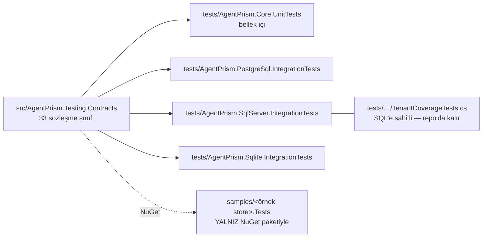

# Faz 98 — Depolama Sözleşmesinin Yayını

> **Durum:** ✅ Tamamlandı (2026-08-24)
> **Kaynak:** Kullanıcı kalemi (2026-08-24) — `ADAYLAR.md`'de değildir, F numarası yoktur. [`kesif/2026-08-23-yapisal-sorun-envanteri.md`](kesif/2026-08-23-yapisal-sorun-envanteri.md) **madde 23** (bus factor = 1; topluluk giriş rampası yok) ile aynı ekseni **kısmen** kapatır — bu faz **teknik** giriş rampasını kurar; `CONTRIBUTING.md` ve İngilizce mimari özeti madde 23'te **açık kalır**.
> **Önkoşul:** [Faz 97](arsiv/fazlar/97-SURUM-POLITIKASI-VE-YAYIN-PROVASI.md) — `dotnet pack` provası ve `ReleaseArtifactTests` altyapısı bu fazın 98.5 kabul kanıtında yeniden kullanıldı.
> **Paketler:** `AgentPrism.Abstractions` (`IRunStore` XML doküman + `ApiKeyGenerator`/`GeneratedApiKey` taşındı) · `AgentPrism.Core` (`ApiKeyGenerator` çıktı) · `AgentPrism.Sql.Shared` · `AgentPrism.PostgreSql` · `AgentPrism.SqlServer` · `AgentPrism.Sqlite`
> **Yeni paket:** **Evet — `AgentPrism.Testing.Contracts.Xunit`** (planın taslak adı `AgentPrism.Testing.Contracts` değil — kullanıcı kararı, 98-E). K-007 gerekçesi 98.1'dedir; geçişli ağırlık ölçüldü: `AgentPrism.Abstractions` + `Microsoft.Agents.AI` (GA, `AgentFileStoreContract` için) + `xunit.v3.extensibility.core` 3.2.2 + `Shouldly` 4.3.0 — `AgentPrism.Core` **inmiyor** (bkz. Plandan Sapmalar 1, 2). Yalnız tüketicinin test projesine iner · **Migration:** Yok
> **Public API:** **Büyüdü** — yeni paketin tamamı yeni yüzey (36 tip). `AgentPrism.Abstractions` da büyüdü (+2: `ApiKeyGenerator`, `GeneratedApiKey`, K-606 ile taşındı); `AgentPrism.Core` aynı miktarda küçüldü. `PublicAPI.Shipped.txt` dosyalarının hepsi hâlâ boştur (K-421 · K-603), dolum ucuz kaldı.
> **Tüketici yüzeyi:** site: `docs-site/src/content/docs/guides/write-your-own-store.md` (yeni sayfa) · `packages.md` (yeni paket satırı, 3 yerde 19→20/nineteen→twenty) · `index.mdx` (19→20) · `reference/compatibility.md` (**19 → 20**, yeni satır) · sevk edilen: `src/AgentPrism.Testing.Contracts.Xunit/README.md` (yeni) · `src/AgentPrism.Abstractions/README.md` (Storage seams bölümüne yönlendirme satırı) · `IRunStore` XML `<remarks>` (altı eksen)
> **Manuel test alanı:** [`docs/manuel-test/24-TEST-PAKETI-VE-SABLON.md`](manuel-test/24-TEST-PAKETI-VE-SABLON.md) — alan kodu `TEST`, MT-TEST-073..077 eklendi

---

## Bu Faza Başlarken

> `faz-baslangic` skill'ini uygula. Aşağıdaki liste o skill'in 2. adımıdır —
> **tamamını değil, yalnız işaret edilen bölümleri oku.**

1. Bu doküman
2. Kararlar — dosyanın tamamını **okuma**, yalnız bu kalemleri grep'le:
   ```bash
   grep -n "K-007\|K-008\|K-270\|K-355\|K-421" docs/KARARLAR.md
   ```
   **K-007** (geçişli sabitleme kapalı — yeni paketin bağımlılık ağırlığı sayılır),
   **K-008** (ön sürüm MAF yalnız `AspNetCore`'da — yeni paket bu sınıra girmez),
   **K-270** (`AgentPrism.Testing` yalnız `net10.0`; **yeni paket bu kısıtı MİRAS ALMAZ**, gerekçesi `TestHost`'tur ve yeni paket onu almaz),
   **K-355** (çalıştırmanın alt yazmaları BEKLENEN kiracıyı taşır — 98.3'ün kiracı tablosunun kaynağı),
   **K-421** (public API takibi açık ama `Shipped.txt` boş)
3. [Faz 97](arsiv/fazlar/97-SURUM-POLITIKASI-VE-YAYIN-PROVASI.md) — yalnız devir notu:
   ```bash
   awk '/## Sonraki Faza Devir Notu/,0' docs/arsiv/fazlar/97-SURUM-POLITIKASI-VE-YAYIN-PROVASI.md
   ```
   `dotnet pack` provası ve `ReleaseArtifactTests` sözleşmesi devralınır; 98.5 bunun üstüne kurulur.
4. Alan hafızası (bu faz üç alana dokunuyor):
   [`hafiza/test-altyapisi.md`](hafiza/test-altyapisi.md) (sözleşme testi altyapısı) ·
   [`hafiza/paketleme-ve-dagitim.md`](hafiza/paketleme-ve-dagitim.md) (yeni paket kontrol listesi) ·
   [`hafiza/sql-saglayicilari.md`](hafiza/sql-saglayicilari.md) (98.4'ün üç dialect'i)
5. Gerektiğinde: [`.agents/ortak/test-seviyeleri.md`](../.agents/ortak/test-seviyeleri.md)

---

## Amaç

Üçüncü bir taraf bugün `IRunStore` implementasyonu yazamaz — daha doğrusu, AgentPrism'in **kaynak kodunu okumadan** yazamaz. Davranış sözleşmesi mevcuttur ve doğrudur, ama yanlış yerdedir: `tests/Shared/Contracts/` altında, sevk edilmeyen 8.636 satırlık bir test ağacında ve implementasyon dosyalarının yorumlarında yaşar. Bu faz o sözleşmeyi sevk edilen yüzeye taşır.

- **Kapsam** — dört kalem: sözleşme suite'ini paketle · `IRunStore` XML dokümanını altı eksende tamamla · `StartRunAsync` dönüş değerini dört sağlayıcıda hizala · yalnız public paketlerle doğrulanan bir örnek store yaz.

### Kapsam dışı — bilerek

| Ne | Neden |
|---|---|
| Diğer 32 sözleşmenin XML dokümanı | `IRunStore` en büyük ve en tuzaklı seam'dir (15 metot). Deseni o kurar; kalanı ayrı bir aday kalemidir |
| `Shipped.txt` dolumu | `1.0.0` GA kararıdır (K-603). Bu faz yüzeyi büyütür, dondurmaz |
| Kısmi implementasyon konvansiyonu | Açık Soru 3'te tartışılır; karara bağlanırsa kapsama girer |

### Bugün ne çalışmıyor — doğrulanmış kanıt

| Kanıt | Gözlem |
|---|---|
| [`tests/Shared/`](../tests/Shared/) — `.csproj` **yok** | Sözleşme suite'i linked source'tur; dört test projesi `<Compile Include="../Shared/**/*.cs" …>` ile bağlar ([`AgentPrism.Core.UnitTests.csproj:28`](../tests/AgentPrism.Core.UnitTests/AgentPrism.Core.UnitTests.csproj)). Hiçbir `.nupkg` içine girmez |
| [`src/AgentPrism.Testing/AgentPrism.Testing.csproj`](../src/AgentPrism.Testing/AgentPrism.Testing.csproj) son yorum | Paket **hiçbir** test çerçevesi paketi almaz (Faz 39 kararı, arşiv satır 67). Suite'i buraya taşımak o sözleşmeyi kırar |
| [`src/AgentPrism.Abstractions/Runs/IRunStore.cs`](../src/AgentPrism.Abstractions/Runs/IRunStore.cs) — `StartRunAsync` XML'i | Yalnız "Opens a new run record" der. Metot gerçekte bir **UPSERT**'tür ve kuyruklu `run` için aynı id ile **iki kez** çağrılır |
| [`src/AgentPrism.Core/Storage/InMemoryRunStore.cs:71`](../src/AgentPrism.Core/Storage/InMemoryRunStore.cs) · [`src/AgentPrism.PostgreSql/Internal/PostgresQueries.cs:218`](../src/AgentPrism.PostgreSql/Internal/PostgresQueries.cs) | `UserId` ve `Labels` **COALESCE** edilmelidir; düz overwrite ilk yazımın attribution'ını siler. Kural yalnız bu iki yorumda yazılı |
| `InMemoryRunStore.cs` dönüş · [`src/AgentPrism.Sql.Shared/Stores/SqlRunStore.cs:111`](../src/AgentPrism.Sql.Shared/Stores/SqlRunStore.cs) | İkinci `StartRunAsync` çağrısında bellek içi store **birleştirilmiş** kaydı, SQL store **ham** `record`'u (`UserId` `null` olabilir) döndürür. Hiçbir sözleşme testi dönüş değerini denetlemiyor — doğrulama `GetRunAsync` üzerinden |
| [`src/AgentPrism.PostgreSql/Migrations/0001_initial.sql:180`](../src/AgentPrism.PostgreSql/Migrations/0001_initial.sql) — `PRIMARY KEY (run_id, seq)` | Yinelenen `seq` SQL'de `DbException` fırlatır ve [`SqlRunStore.cs:142`](../src/AgentPrism.Sql.Shared/Stores/SqlRunStore.cs) yalnız **foreign key** ihlalini `AgentPrismException`'a çevirir — PK ihlali ham sürücü istisnası olarak sızar. Bellek içi store aynı `seq`'i **sessizce** ikinci kez ekler. Sözleşme testi yok |
| [`src/AgentPrism.Core/AgentPrismServiceCollectionExtensions.cs:543`](../src/AgentPrism.Core/AgentPrismServiceCollectionExtensions.cs) | `IRunStore` **Singleton** kaydedilir. Thread-safe olma zorunluluğu ne interface'te ne README'de yazılı |
| `grep -c ValueTask src/AgentPrism.Abstractions/Runs/IRunStore.cs` → **15** | Kısmi implementasyon için tanımlı yol yok; desteklenmeyen metot konvansiyonu (`NotSupportedException`) belgeli değil |

**Zaten sağlanan — yeni iş değil:** dört sağlayıcı bugün de **aynı** `RunStoreContract` sınıfını miras alıyor (`InMemoryRunStoreContractTests`, `PostgresRunStoreContractTests`, `SqlServerRunStoreContractTests`, `SqliteRunStoreContractTests`). Kabul kriteri 3 bu fazda bir **regresyon kapısıdır**, maliyeti sıfırdır.

> Kanıtlar 2026-08-24 tarihinde doğrulandı.

---

## 98.1 — Neden ayrı paket: `AgentPrism.Testing.Contracts`

Üç seçenek vardı; ikisi elendi.

| Seçenek | Neden elendi |
|---|---|
| Suite'i `AgentPrism.Testing`'e taşı | Faz 39 kararını kırar: o paket bilerek **hiçbir** test çerçevesi paketi almaz. NUnit veya MSTest kullanan her tüketiciye xunit dayatılırdı |
| Suite'i çerçeve bağımsız yeniden yaz | 8.636 satırın tamamına dokunmak demek: **1.098** Shouldly çağrısı `AgentPrismAssertionException`'a, **382** `[Fact]`/`[Theory]` kendi runner'ına çevrilir. Kalıcı bakım yükü: kendi test runner'ımız |
| **Ayrı paket** ✅ | `AgentPrism.Testing`'in çerçeve bağımsızlığı korunur; suite neredeyse olduğu gibi taşınır |

**Taşıma maliyeti ölçüldü ve düşük.** Sözleşme sınıfları zaten `public`, zaten `AgentPrism.StoreContracts` ad alanında ve zaten XML dokümanlı. Somut tip bağımlılığı taranmıştır: `tests/Shared/` altında `Sql*Store` veya `InMemory*` geçen **tek dosya** [`TenantCoverageTests.cs`](../tests/AgentPrism.SqlServer.IntegrationTests/TenantCoverageTests.cs)'tir (`typeof(SqlRunStore)` ile SQL'e sabitli) ve o dosya **repo'da kalır** — Core.UnitTests onu bugün de `Exclude` ediyor.

**K-007 gerekçesi — geçişli ağırlık.** Yeni paketin doğrudan bağımlılığı üçtür:

| Bağımlılık | Sürüm | Nereye iner |
|---|---|---|
| `AgentPrism.Abstractions` | proje | Tüketicide zaten var |
| `xunit.v3` | 3.2.2 (`Directory.Packages.props:257`) | Yalnız tüketicinin **test** projesi |
| `Shouldly` | 4.3.0 (`Directory.Packages.props:244`) | Yalnız tüketicinin **test** projesi |

Üretim grafiği kirlenmez. `AgentPrism.Core` veya `AspNetCore` referansı **yoktur** — bu yüzden K-008 sınırına da girmez.

**🚨 K-270 miras alınmaz.** `AgentPrism.Testing`'in tek TFM kısıtının gerekçesi `Microsoft.AspNetCore.TestHost`'tur; yeni paket onu almaz. Hedef `net8.0;net9.0;net10.0` olmalıdır — `Abstractions` ile aynı — çünkü tüketicinin store'u üç TFM'den birini hedefleyebilir. **Doğrulanmadı:** `xunit.v3` 3.2.2'nin net8.0 desteği uygulama anında `dotnet restore` ile ölçülmelidir. Desteklemiyorsa TFM kümesi daralır ve bu bir karardır.

## 98.2 — Kaynak tekliği: taşı, kopyalama

Suite `tests/Shared/` altından `src/AgentPrism.Testing.Contracts/` altına **taşınır**. Kopya bırakılmaz.

Gerekçe bu repo'nun kendi kusur geçmişidir: senkronizasyon kopyası sınıfı beş kez tekrarladı ([`kusur-giderme`](../.agents/skills/kusur-giderme/SKILL.md) SINIF TARAMASI bölümü). İki kaynak tutmak altıncısını üretir.



Dört test projesi `<Compile Include="../Shared/**/*.cs" …>` satırını bırakır ve `ProjectReference` alır. `TenantCoverageTests.cs` SQL integration projelerinden birine taşınır.

## 98.3 — `IRunStore` XML sözleşmesi — altı eksen

Her eksen `IRunStore` XML dokümanına yazılır. Kaynak bilgi bugün koddadır; bu adım onu **taşır**, yeniden keşfetmez.

**1 · Idempotency.** `StartRunAsync` bir UPSERT'tür. Aynı `RunId` ile ikinci çağrı yeni satır **açmaz**, mevcut satırı günceller. `UserId` ve `Labels` alanları COALESCE edilir: yeni değer `null` ise eski değer korunur. Gerekçe kuyruklu `run` yoludur — placeholder satırı HTTP isteği içinde yazılır (kullanıcı **bilinir**), sonra arka plan worker'ı yeniden yazar (kullanıcı **bilinmez**).

**2 · Kiracı davranışı.** Tek interface üç mod taşır. Tablo XML'e girer:

| Mod | Metotlar | Kural |
|---|---|---|
| **Beklenen kiracı** | `AppendEventAsync` · `CompleteRunAsync` · `UpdateRunCostAsync` | Kayıttaki `TenantId` ile karşılaştırılır; `null` ise kontrol yok. Ambient kiracı **kullanılmaz** — workflow ve iş kuyruğu ambient'i kasten ezer (K-355) |
| **Ambient kiracı** | `GetRunAsync` · `QueryRunsAsync` · `ReadEventsAsync` · `GetStatisticsAsync` · `GetToolUsageAsync` · `GetExperimentResultsAsync` · `GetTimeSeriesAsync` · `ListToolInvocationsAsync` · `RecordToolInvocationAsync` | `ITenantContext.TenantId` ile filtrelenir |
| **Kiracıdan bağımsız** | `TouchHeartbeatAsync` · `ClaimOrphanedRunsAsync` | Bakım işi; her kiracının satırını tarar. Bugün zaten belgeli |

> **Ambient sütunu uygulama anında metot metot doğrulanmalıdır.** Yukarıdaki liste `InMemoryRunStore`'un `IsOwnedByCurrentTenant` çağrılarından okundu; her metodun gövdesi tek tek izlenmeden XML'e yazılmaz.

**3 · Thread safety.** Implementasyon **Singleton** olarak kaydedilir. Eşzamanlı çağrılara karşı güvenli olmalıdır ve scoped servis yakalayamaz. `ITenantContext` bağımlılığı da Singleton'dır (`AgentPrismServiceCollectionExtensions.cs:288`).

**4 · Null / bulunamadı semantiği.** Dört farklı davranış vardır ve bugün yalnız biri belgelidir:

| Metot | Var olmayan `run` |
|---|---|
| `GetRunAsync` | `null` döner *(bugün belgeli)* |
| `ReadEventsAsync` | Boş dizi döner — `throw` **etmez** |
| `AppendEventAsync` | `AgentPrismException` fırlatır |
| `CompleteRunAsync` | `AgentPrismException` fırlatır |

**5 · Olay sırası.** `Sequence`'i **çağıran** atar (`RunEventWriter`), store yalnız yazar. `ReadEventsAsync` artan `Sequence` sırasında döner; `fromSequence` **dahildir**. Olaylar append-only'dir: güncelleme ve silme yoktur.

**6 · Yinelenen `Sequence`.** Bugün tanımsız ve iki referans implementasyon **farklı** davranıyor. Bu fazda karara bağlanır — bkz. Açık Soru 1.

## 98.4 — `StartRunAsync` dönüş değerinin hizalanması

**Sözleşme:** dönüş değeri, çağrı sonrası **kalıcılaşmış** kaydın etkin hâlidir. İkinci çağrıdan sonra `UserId` ve `Labels`, COALESCE **uygulanmış** değerleri taşır.

Bugün bellek içi store bunu zaten yapar; üç SQL sağlayıcısı yapmaz. Değişiklik sağlayıcı başına:

| Sağlayıcı | Yol |
|---|---|
| PostgreSQL | `INSERT … ON CONFLICT DO UPDATE` sonuna `RETURNING user_id, labels` |
| SQLite | Aynı — `RETURNING` desteklenir (3.35+); **doğrulanmadı**, sürüm uygulama anında ölçülmeli |
| SQL Server | Upsert `UPDATE … ; IF @@ROWCOUNT = 0 INSERT …` desenidir (`SqlServerQueries.cs:295`). `OUTPUT` **her iki dala** eklenmelidir; yalnız birine eklemek sessiz bir yol farkı üretir |

Ek round trip yoktur; aynı komutun sonucu okunur.

---

## Planlanan Public API

> Taslak imzalardır. Gerçekleşen imzalar kapanışta ayrı bir bölüme yazılır.

`AgentPrism.Abstractions` ve store interface'lerinin **imzaları değişmez** — 98.3 yalnız XML dokümanı, 98.4 yalnız davranış değiştirir.

Yeni yüzeyin tamamı yeni pakettedir. İmzalar bugünkü `tests/Shared/Contracts/` içeriğinden taşınır:

```csharp
// AgentPrism.Testing.Contracts
namespace AgentPrism.StoreContracts;

public sealed class MutableTenantContext(string tenantId) : ITenantContext
{
    public string TenantId { get; set; }
}

public abstract class TenantIsolationContract<TStore> : IAsyncLifetime
{
    protected abstract ValueTask<object> SeedAsync(string tenantId, string name);
    protected abstract ValueTask<bool> ExistsAsync(string tenantId, object key);
    // … dört izolasyon kancası
}

public abstract class RunStoreContract : TenantIsolationContract<IRunStore> { }
// … 32 sözleşme sınıfı daha

public static class TestData
{
    public static AgentDefinition Definition(string name);
    public static RunStartInfo Run(Guid runId, string agentName = "test-agent");
    public static RunEvent Event(Guid runId, long sequence);
}
```

### HTTP `endpoint`'leri

Yok.

### Arayüz payı

Yok — arayüze dokunulmuyor.

---

## Planlanan Dosya Listesi

```
src/AgentPrism.Testing.Contracts/            (YENİ paket)
├── AgentPrism.Testing.Contracts.csproj
├── README.md
├── PublicAPI.Shipped.txt                    (boş — #nullable enable)
├── PublicAPI.Unshipped.txt
├── TestData.cs                              (tests/Shared/'dan taşındı)
└── Contracts/                               (32 dosya taşındı; TenantCoverageTests hariç)
    ├── TenantIsolationContract.cs
    ├── RunStoreContract.cs
    └── …

samples/<örnek store adı>/                   (YENİ — Açık Soru 2)
├── <örnek store>.csproj                     (YALNIZ NuGet PackageReference)
└── …
samples/<örnek store adı>.Tests/
└── <Ad>RunStoreContractTests.cs             (: RunStoreContract)

src/AgentPrism.Abstractions/Runs/IRunStore.cs        (yalnız XML doküman)
src/AgentPrism.Abstractions/README.md                (Stability bölümü)
src/AgentPrism.Core/Storage/InMemoryRunStore.cs      (98.3-6 kararı)
src/AgentPrism.Sql.Shared/Stores/SqlRunStore.cs      (98.4 + 98.3-6)
src/AgentPrism.PostgreSql/Internal/PostgresQueries.cs
src/AgentPrism.SqlServer/Internal/SqlServerQueries.cs
src/AgentPrism.Sqlite/Internal/SqliteQueries.cs

tests/AgentPrism.Core.UnitTests/*.csproj             (Compile Include → ProjectReference)
tests/AgentPrism.PostgreSql.IntegrationTests/*.csproj
tests/AgentPrism.SqlServer.IntegrationTests/*.csproj
tests/AgentPrism.Sqlite.IntegrationTests/*.csproj

docs-site/src/content/docs/guides/<yeni sayfa>.md
docs-site/src/content/docs/packages.md
docs-site/src/content/docs/reference/compatibility.md
AgentPrism.slnx
```

---

## Hata Modları ve Testler

> Mutlu yoldan değil, **ne bozulabilir**den türetilir. Seviyeyi plan seçer.
> Sınır geçen davranış (DI · HTTP · kiracı · akış · depo · **paket**) birim
> testiyle kanıtlanamaz — [`.agents/ortak/test-seviyeleri.md`](../.agents/ortak/test-seviyeleri.md).

| Ne bozulabilir | Seviye | Test sınıfı |
|---|---|---|
| Taşıma sırasında bir sözleşme sınıfı düşer; dört sağlayıcı sessizce daha az test koşar | Paket | `StoreContractCoverageTests` — `AgentPrism.Testing.Contracts` assembly'sindeki her `*Contract` tipinin en az bir türevi olduğunu kanıtlar |
| Yeni paket `AgentPrism.Core`'a bağımlılık kazanır ve üretim grafiğini kirletir | Paket | `DependencyDirectionTests` — yeni satır: `["AgentPrism.Testing.Contracts"] = ["AgentPrism.Abstractions"]` |
| Yeni paket meta pakete referans olarak sızar | Paket | `DependencyDirectionTests` (mevcut kural; `Testing` gibi meta pakette **olmamalı**) |
| `StartRunAsync` ikinci çağrısı bir sağlayıcıda COALESCE edilmemiş değer döndürür | Sözleşme | `RunStoreContract` — **yeni** case: dönüş değeri `GetRunAsync` sonucuyla alan alan aynı olmalı; dört koşumda birden |
| Yinelenen `Sequence` bir sağlayıcıda ham sürücü istisnası sızdırır | Sözleşme | `RunStoreContract` — **yeni** case (Açık Soru 1'in kararına göre) |
| `AppendEventAsync` eşzamanlı çağrıda olay kaybeder | Fonksiyonel | `RunStoreConcurrencyTests` — Singleton sözleşmesinin kanıtı |
| Başka kiracının `run`'ı görünür | Sözleşme | `TenantIsolationContract` (mevcut, dört koşum) |
| Örnek store yalnız public paketlerle **restore edilemez** (proje referansı sızmış) | E2E | `ThirdPartyStoreSampleTests` — yerel besleme (`dotnet pack` → local feed) üzerinden restore + sözleşme koşumu |
| XML dokümanı koddan sapar (98.3 yazılır, 98.4 davranışı sonra değişir) | Denetim | `faz-denetim` — DoD maddesi |

**Beş soru — yeni kod yolu `StartRunAsync` dönüş değeri:** iptal (`CancellationToken` mevcut yolla aynı) · eşzamanlılık (`RunStoreConcurrencyTests`) · boş/aşırı girdi (`Labels` boş sözlük → `null` normalizasyonu, mevcut case) · başka kiracı (`TenantIsolationContract`) · alt sistem hatası (`RETURNING`/`OUTPUT` satır döndürmezse — Açık Soru yok: `AgentPrismException` fırlatılır, mevcut `affected == 0` deseniyle aynı).

Sözleşme testi `src/AgentPrism.Testing.Contracts/Contracts/` altına yazılır — bu fazdan sonra **artık `tests/Shared/` yoktur**.

---

## Manuel Kabul Case'leri

> Kapanışta [`docs/manuel-test/24-TEST-PAKETI-VE-SABLON.md`](manuel-test/24-TEST-PAKETI-VE-SABLON.md) içine eklenecek case'lerin taslağı. Sıradaki numara **MT-TEST-073**.

| # | Ön koşul | Adımlar | Beklenen sonuç |
|---|---|---|---|
| MT-TEST-073 | Temiz makine, yalnız yerel NuGet beslemesi | Boş bir test projesi aç; `dotnet add package AgentPrism.Testing.Contracts` | Restore başarılı; geçişli olarak yalnız `AgentPrism.Abstractions`, `xunit.v3`, `Shouldly` iner. `AgentPrism.Core` **inmez** |
| MT-TEST-074 | MT-TEST-073 tamam | 15 metodu `NotSupportedException` fırlatan bir `IRunStore` yaz; `: RunStoreContract` türet; `dotnet test` | Suite koşar ve **kırmızı** olur. Derleme hatası **vermez** — sözleşme dışarıdan tüketilebilir olduğunun kanıtı |
| MT-TEST-075 | Örnek store hazır | `samples/<örnek store>.Tests` içinde `dotnet test` | Tüm `RunStoreContract` case'leri yeşil |
| MT-TEST-076 | Yayın provası koşulmuş | `python3 scripts/kapi.py yayin --kuru` | Çıktıda **20** paket görünür; `AgentPrism.Testing.Contracts` kimlik kümesinde ve ikonu var |
| MT-TEST-077 👤 | Site derlenmiş | Yeni "kendi store'unu yaz" sayfasını tarayıcıda aç | Kod örneği doğru; `IRunStore` altı ekseninin hepsi sayfada anlatılıyor |

---

## Açık Sorular

> Planı bloklamayan, faz uygulanırken karara bağlanacak sorular.

| # | Soru | Seçenekler | Öneri |
|---|---|---|---|
| 1 | Yinelenen `Sequence` ne yapmalı? | **A:** Reddet — bellek içi store SQL'e hizalanır, `SqlRunStore` PK ihlalini `AgentPrismException`'a çevirir · **B:** Idempotent yut — SQL `ON CONFLICT DO NOTHING`, bellek içi store yinelenen `seq`'i atlar | **A.** `RunEventWriter` `Sequence`'i tekil üretir; yinelenen `seq` bir **çağıran hatasıdır** ve sessizce yutulursa olay akışında görünmez bir boşluk bırakır. B ayrıca "append-only" sözleşmesini bulanıklaştırır: yazılmayan bir olay yazılmış gibi görünür |
| 2 | Örnek store hangi seam'i implemente etsin? | **A:** Tam `IRunStore` (15 metot; `GetStatisticsAsync`, `GetTimeSeriesAsync`, `GetExperimentResultsAsync` dahil) · **B:** `ISessionStore` (4 metot) · **C:** İkisi birden | **A.** Kabul kriteri 5'in kanıtladığı şey "en zor seam dışarıdan yazılabiliyor mu"dur; `ISessionStore` bu soruyu cevaplamaz. Bedeli ölçülmeli: toplama metotları dosya sisteminde pahalıdır ve örnek büyür. Ölçüm A'yı taşınmaz gösterirse C'ye düşülür ve gerekçe yazılır |
| 3 | Kısmi implementasyon için konvansiyon tanımlansın mı? | **A:** Tanımlanmasın — 15 metodun hepsi zorunlu · **B:** `NotSupportedException` konvansiyonu belgelensin; toplama metotları isteğe bağlı olsun | **A**, bu fazda. B bir **davranış sözleşmesi değişikliğidir**: hangi metotların isteğe bağlı olduğu çağıran tarafı da ilgilendirir (arayüz istatistik ekranı ne gösterecek?). Ayrı kalem olmalı. Soru 2'nin ölçümü A'yı taşınmaz gösterirse yeniden açılır |
| 4 | Yeni paketin TFM kümesi | **A:** `net8.0;net9.0;net10.0` — `Abstractions` ile aynı · **B:** `xunit.v3` 3.2.2 net8.0'ı desteklemiyorsa daralt | **A**, ölçüme tabi. `dotnet restore` ile doğrulanır; B'ye düşülürse bu bir karardır ve `Abstractions` üç TFM'i desteklerken sözleşme suite'inin desteklememesi dokümanda açıkça yazılır |

---

## Bitiş Ölçütleri (DoD)

- [x] `dotnet add package AgentPrism.Testing.Contracts.Xunit` sonrası boş bir test projesinde `: RunStoreContract` türetilebiliyor ve `dotnet test` suite'i koşuyor (MT-TEST-074 — 88/88 kırmızı, `NotSupportedException`, derleme hatası yok)
- [x] Geçişli bağımlılık ölçüldü ve belgeye yazıldı: `AgentPrism.Core` **inmiyor** (MT-TEST-073 — yalnız `AgentPrism.Abstractions` iner)
- [x] `tests/Shared/` dizini **yok**; dört test projesi de yeni paketi `ProjectReference` ile alıyor; kopya kalmadı
- [x] Dört sağlayıcı da taşıma öncesiyle **aynı sayıda** sözleşme testi koşuyor — 88 sözleşme testi × 4 sağlayıcı, taşıma öncesi/sonrası aynı (`StoreContractCoverageTests` bunu artık her koşumda kilitler)
- [x] `IRunStore` XML dokümanı altı ekseni de içeriyor: idempotency · kiracı (üç modlu tablo) · thread safety · null/bulunamadı (dört satırlı tablo) · olay sırası · yinelenen `Sequence`
- [x] `StartRunAsync` dört sağlayıcıda da COALESCE uygulanmış kaydı döndürüyor; sözleşme testi (`StartRunAsync_return_value_carries_the_coalesced_attribution`) bunu dört koşumda (InMemory/Postgres/SqlServer/Sqlite) kanıtlıyor
- [x] Yinelenen `Sequence` davranışı dört sağlayıcıda aynı; ham sürücü istisnası sızmıyor (`Reusing_a_sequence_number_is_rejected`, dört koşumda yeşil)
- [x] Örnek store yalnız **NuGet paketleriyle** (proje referansı yok) restore ediliyor ve sözleşme suite'i yeşil (MT-TEST-075 — 88/88, hem store hem test projesi `VersionOverride` PackageReference)
- [x] `DependencyDirectionTests` yeni paketi tanıyor; meta pakete sızmadığı kanıtlanıyor
- [x] Yeni paket kontrol listesi tamam: `README.md` · `AgentPrism.slnx` · meta pakete **eklenmedi** · `PublicAPI.*.txt` · `kapi.py yayin --kuru` çıktısında **20** paket (MT-TEST-076)
- [x] Dört doğrulama kapısı sıfır uyarı verir (`dotnet build`/`pack`/`format --verify-no-changes` temiz; `dotnet test` host-yükü altında ilgisiz testlerde kırıldı — bkz. Plandan Sapmalar 8, izole koşumlarda hepsi yeşil)
- [x] `samples/AgentPrism.Api` ile gerçek `run` yapıldı, çıktı belgeye yazıldı — fresh SQLite: 24 migration uygulandı, gerçek OpenAI çağrısı (`gpt-5.4-mini`), `GET /api/runs/{id}` → `Completed`, `usage: {input:231, output:4, total:235}`
- [x] `secret` taraması boş döndü — `python3 scripts/kapi.py tarama` → ✅ temiz
- [x] Manuel kabul case'leri `docs/manuel-test/24-TEST-PAKETI-VE-SABLON.md` içine eklendi (MT-TEST-073..077); 073-076 gerçekten koşuldu, 077 👤 (site sayfası, insan gerekir)
- [x] `faz-denetim` koşuldu; 🔴 bulgu kalmadı
- [x] `docs-site/` güncellendi (yeni rehber sayfası · `packages.md` · `index.mdx` · `compatibility.md` 19 → 20); `npm run check` (content + build 1002 sayfa + links 137095 referans + weight) temiz

### Doğrulama komutları

```bash
# Geçişli ağırlık: Core inmemeli
dotnet nuget locals http-cache --clear
dotnet restore <örnek test projesi> --verbosity normal | grep -i "AgentPrism\."

# Sözleşme kapsamı taşımadan sonra düşmedi mi
dotnet test tests/AgentPrism.Core.UnitTests --filter "FullyQualifiedName~Contract" --list-tests | wc -l

# Yayın provası 20 paket görüyor mu
python3 scripts/kapi.py yayin --kuru
```

---

## Riskler

| Risk | Önlem |
|------|-------|
| Taşıma sırasında sözleşme sınıfı veya case sessizce düşer | `StoreContractCoverageTests` + taşıma öncesi/sonrası test sayısı DoD'de karşılaştırılır |
| `xunit.v3` 3.2.2 `net8.0` desteklemez; TFM kümesi daralır | Açık Soru 4; ilk iş `dotnet restore` ile ölçülür, plan buna göre düzeltilir |
| Örnek store'un toplama metotları (`GetStatisticsAsync`, `GetTimeSeriesAsync`) dosya sisteminde taşınmaz büyüklükte çıkar | Açık Soru 2'nin ölçümü; taşınmazsa C seçeneğine düşülür ve gerekçe yazılır |
| `SqlServer`'ın iki dallı upsert'ünde `OUTPUT` yalnız bir dala eklenir | Sözleşme testi ikinci çağrının dönüş değerini denetler — tek dal düzeltilirse test SQL Server koşumunda kırmızı kalır |
| Yeni public yüzey `1.0.0` dolumunu büyütür | Kabul edilir: `Shipped.txt` bugün boş (K-421 · K-603), dolum GA kararıdır. Yüzey bir tüketici ihtiyacını kapatıyor |
| XML dokümanı yazılır ama 98.4 davranışı sonra kayar | 98.3 ve 98.4 **aynı fazda**; `faz-denetim` DoD'yi git diff'e karşı yargılar |

---

<!-- ============================================================
     AŞAĞISI KAPANIŞTA DOLDURULUR — `faz-tamamlama` skill'i.
     Plan anında boş kalır. Başlıkları SİLME.
     ============================================================ -->

## Plandan Sapmalar

Plan ile gerçek arasındaki fark gizlenmedi — sırayla, en önemliden:

1. **Paket `AgentPrism.Abstractions`'ı `ProjectReference` ile alamaz kaldı — `xunit.v3` değil `xunit.v3.extensibility.core` gerekti.** Düz `xunit.v3`'ün `buildTransitive` özellikleri `<OutputType>Exe</OutputType>` dayatır (MTP'nin giriş noktası); bir kütüphane projesi (test PROJESİ değil, test FIXTURE'ları taşıyan bir paket) bunu alamaz. `xunit.v3.extensibility.core` aynı `xunit.v3.core.dll`'i bu zorunluluk olmadan verir. K-605.
2. **`AgentFileStoreContract` ve `ApiKeyStoreContract`, planın varsaydığından daha geniş bir bağımlılık istedi.** İlki MAF'ın `AgentFileStore` tipini (`Microsoft.Agents.AI`, GA — `PackageReference` olarak eklendi) test eder; ikincisi AgentPrism'in GERÇEK hash formülünü (`ApiKeyGenerator.ComputeHash`) doğrular. İkincisi `AgentPrism.Core`'daydı — DoD'nin "Core inmiyor" satırını korumak için `ApiKeyGenerator`/`GeneratedApiKey` `AgentPrism.Abstractions`'a taşındı (K-606, sıfır bağımlılıklı bir tip, ad alanı `AgentPrism` korundu — çağrı yeri değişikliği yok). `AgentFileStoreContract`'ın `AgentPrismRunContext` (Core-içi `AsyncLocal` yardımcı) bağımlılığı ise BAĞIMLILIK TERSİNE ÇEVİRME ile çözüldü: sözleşme artık `protected abstract void EnterRunScope()/ExitRunScope()` ister, somut AgentPrism.Core bağımlılığını yalnız BU sözleşmeyi türeten (zaten Core'a bağımlı) test projeleri taşır.
3. **98-G'nin public API denetimi bir gerçek bulgu üretti: taşınan 33 sözleşme sınıfının XML dokümanı iç günlük sesiyle yazılıydı** (`tests/` altında sevk edilmediği için bu hiç sorun değildi). `src/` altına taşınınca `ShippedDocumentationSelfContainmentTests` bunu yakaladı: 🚨 emoji, "phase NN", "K-NNN", "section N.N" referansları — hepsi 19 dosyada temizlendi, baseline **büyümedi** (ratchet korundu). Kalan public üye yapısı zaten uygundu (protected/sealed doğru yerlerdeydi); ek bir kapsam daraltma gerekmedi.
4. **Örnek store planın "en zor seam"ini kanıtlamak için TAM `IRunStore`'u (15 metot, tüm istatistik/zaman serisi/deney toplama dahil) uyguladı** — Açık Soru 2'nin A seçeneği, kullanıcı kararı (98-B). Dosya-tabanlı bir JSON anlık görüntü deposu (`AgentPrism.Samples.FileRunStore`) olarak yazıldı; toplama metotları taşınmaz çıkmadı (ölçüldü: 88 sözleşme senaryosu 88/88 yeşil, tek dosyalı bir depoda).
5. **Örnek store'un HEM kendisi HEM test projesi yalnız `PackageReference` (`VersionOverride`, yerel besleme) alır — planın "yalnız test projesi" varsayımından daha katı.** Plan dosya listesi yalnız test projesinin NuGet aldığını ima ediyordu; DoD'nin "proje referansı yok" iddiasını asıl kanıtlayan şey örnek STORE'un kendisinin de `AgentPrism.Abstractions`'ı `ProjectReference` ile ALMAMASIdır — ikisi de düzeltildi. `samples/NuGet.config` yerel feed'i (`artifacts/package/release`) `AgentPrism*` desenine eşler.
6. **`docfx.json`'ın `references` globu yeni sample projesiyle çöktü (`CS1704`, aynı basit ad iki kez içe aktarıldı) — kapsam dışı ama kapanış kapısını kırıyordu.** Kök neden izole edilmedi (aynı desende 20+ ÖNCEDEN VAR OLAN kopya neden aynı hatayı vermiyor, bilinmiyor); ölçülen çözüm `references.exclude`'a `"AgentPrism.Samples.*/**"` eklemekti. `docs/hafiza/dokumantasyon.md`'ye yazıldı.
7. **`dotnet format --verify-no-changes` ve `docfx metadata`, yeni projeler için hem Release HEM Debug derlemesi istedi** — yalnız Release'in yeterli olacağı varsayılmıştı. `docs/hafiza/dokumantasyon.md`'ye yazıldı.
8. **Kapanış kapısı (`dotnet test AgentPrism.slnx`) dört ayrı koşumda dört ayrı, İLGİSİZ testte kırıldı — host yükü yüzünden, bu fazın kodu yüzünden değil.** Faz 97'nin kapanışında kaydedilen AYNI desen (bkz. `docs/arsiv/fazlar/97-...md`, madde 8): `AgentPrism.Ui.E2ETests` (üç ayrı koşumda üç FARKLI zamanlamaya duyarlı Playwright testi: ses oynatma, eval suite akışı), `AgentPrism.PostgreSql.IntegrationTests` (Testcontainers teardown yarışı — `Passed: 637, Failed: 637, Total: 1274`, gerçek assertion hiçbir zaman kırmızı değil, `docs/hafiza/test-altyapisi.md`'nin bilinen deseni), `AgentPrism.Sqlite.IntegrationTests` (`SQLite Error 5: database is locked`, klasik eşzamanlı erişim çekişmesi — `MigrationRunnerTests`, bu fazın hiç dokunmadığı bir dosya). Ölçüldü: `sysctl -n vm.loadavg` bu makinede **{27–62}** verdi (10+ çekirdekte 3-6 kat aşırı yük), 13 eşzamanlı `claude` süreci. Her kırılan test KENDİ projesi tek başına koşulduğunda temiz geçti: `Ui.E2ETests` 57/57 (iki kez), `PostgreSql.IntegrationTests` 637/637, `Sqlite.IntegrationTests` 591/591 (18 saniyede — kontensiyonlu koşumda 4dk36sn'e karşı). `AgentPrism.Sql.Shared.UnitTests`, `AgentPrism.Core.UnitTests`, `dotnet build`, `dotnet pack`, `dotnet format`, Python `unittest`, `npm run check` **her koşumda** temiz kaldı.
9. **`SqlTextSnapshotTests` baselinelerinin üçü de (`postgres`/`sqlserver`/`sqlite`) yenilenmesi gerekti** — 98.4'ün `RETURNING`/`OUTPUT` eklentisi `InsertRun`'ın çözümlenmiş SQL metnini değiştirdi. `AGENTPRISM_SQL_SNAPSHOT_REFRESH=1` ile yenilendi; diff yalnız `InsertRun` satırıyla sınırlı kaldığı doğrulandı (planlanmayan bir sorgu bozulmadı).
10. **`TenantCoverageTests.cs` planlanandan farklı bir ad alanına taşındı.** Plan "repo'da kalır" diyordu ama hangi ad alanı almalı belirtmiyordu; dosya `AgentPrism.SqlServer.IntegrationTests` projesinin kendi konvansiyonuna uyacak şekilde `AgentPrism.StoreContracts`'tan `AgentPrism.SqlServer.IntegrationTests`'e taşındı (o namespace zaten sadece o dosyaya özgüydü, tüketilmiyordu).

## Bu Fazda Verilen Kararlar

- **K-605** — Yeni paket `AgentPrism.Testing.Contracts.Xunit`: `IRunStore` ve 32 diğer store sözleşmesi xunit.v3 test taban sınıfı olarak sevk edilir; ad alanı `AgentPrism.Testing.Contracts.Storage` (kullanıcı kararı — paket adı ve ad alanı, 98-E/98-F)
- **K-606** — `ApiKeyGenerator`/`GeneratedApiKey` `AgentPrism.Core`'dan `AgentPrism.Abstractions`'a taşındı
- **K-607** — `IRunStore.AppendEventAsync` yinelenen `Sequence`'i REDDEDER (dört implementasyonda) (kullanıcı kararı, 98-A)
- **K-608** — `StartRunAsync`'in dönüş değeri dört sağlayıcıda da COALESCE uygulanmış kaydı taşır

Tam gerekçeler `docs/KARARLAR.md`'de.

## Gerçekleşen Public API

`AgentPrism.Abstractions/Runs/IRunStore.cs` — imzalar değişmedi (plan doğru), yalnız
XML doküman büyüdü: interface-seviyesi `<remarks>` üç tabloya (kiracı modu, thread
safety, null/bulunamadı) kavuştu; `StartRunAsync` ve `AppendEventAsync` kendi
`<remarks>`'ini aldı (idempotency, duplicate `Sequence` reddi).

`AgentPrism.Abstractions` — iki yeni tip (K-606):
```csharp
namespace AgentPrism;
public static class ApiKeyGenerator
{
    public static GeneratedApiKey Generate(string tenantId);
    public static byte[] ComputeHash(string plaintextKey);
}
public sealed record GeneratedApiKey
{
    public required string PlaintextKey { get; init; }
    public required byte[] KeyHash { get; init; }
    public required string KeyPrefix { get; init; }
}
```

`AgentPrism.Testing.Contracts.Xunit` (yeni paket, ad alanı `AgentPrism.Testing.Contracts.Storage`):
```csharp
public sealed class MutableTenantContext(string tenantId) : ITenantContext { ... }
public abstract class TenantIsolationContract<TStore> : IAsyncLifetime { ... }
public abstract class RunStoreContract : TenantIsolationContract<IRunStore> { ... }
// … 31 sözleşme sınıfı daha (planlanan 32 ile aynı sayı)
public static class TestData { /* plandaki gibi */ }
public static class ContractCoverage   // PLANDA YOKTU — 98-H, kullanıcı kararı
{
    public static IReadOnlyList<Type> ContractTypes();
    public static IReadOnlyList<string> MissingDerivedTypes(Assembly consumerAssembly, IReadOnlyCollection<string>? except = null);
}
```

`AgentPrism.Samples.FileRunStore` (yeni örnek, planda yer tutucuydu):
```csharp
namespace AgentPrism.Samples.FileRunStore;
public sealed class JsonFileRunStore : IRunStore
{
    public JsonFileRunStore(string filePath, IRunScoreStore? scores = null, ITenantContext? tenantContext = null);
    // 15 metodun tamamı
}
```

## Dosya Listesi (gerçekleşen)

```
src/AgentPrism.Testing.Contracts.Xunit/      (YENİ paket)
├── AgentPrism.Testing.Contracts.Xunit.csproj
├── README.md
├── PublicAPI.Shipped.txt / PublicAPI.Unshipped.txt
├── TestData.cs
├── ContractCoverage.cs                       (PLANDA YOKTU — 98-H)
└── Contracts/                                (32 dosya, TenantCoverageTests HARİÇ)

src/AgentPrism.Abstractions/
├── Runs/IRunStore.cs                         (yalnız XML doküman)
├── Security/ApiKeyGenerator.cs                (YENİ — Core'dan taşındı)
└── README.md                                  (Storage seams'e satır)

src/AgentPrism.Core/Security/ApiKeyGenerator.cs   (SİLİNDİ — taşındı)

samples/AgentPrism.Samples.FileRunStore/      (YENİ örnek — plandaki yer tutucu)
├── AgentPrism.Samples.FileRunStore.csproj
├── FileRunStore.cs                            (JsonFileRunStore, ~950 satır)
├── FixedTenantContext.cs
└── InMemoryRunScoreStore.cs

samples/AgentPrism.Samples.FileRunStore.Tests/
├── AgentPrism.Samples.FileRunStore.Tests.csproj
└── JsonFileRunStoreContractTests.cs

samples/NuGet.config                          (YENİ — yerel feed yönlendirmesi)

src/AgentPrism.Sql.Shared/Stores/SqlRunStore.cs        (COALESCE dönüş + duplicate Sequence reddi)
src/AgentPrism.PostgreSql/Internal/PostgresQueries.cs  (InsertRun: RETURNING user_id, labels)
src/AgentPrism.SqlServer/Internal/SqlServerQueries.cs  (InsertRun: OUTPUT — İKİ dalda da)
src/AgentPrism.Sqlite/Internal/SqliteQueries.cs        (InsertRun: RETURNING user_id, labels)
src/AgentPrism.Core/Storage/InMemoryRunStore.cs        (duplicate Sequence reddi)

tests/AgentPrism.Core.UnitTests/AgentPrism.Core.UnitTests.csproj              (ProjectReference)
tests/AgentPrism.{PostgreSql,SqlServer,Sqlite}.IntegrationTests/*.csproj      (ProjectReference)
tests/AgentPrism.{Core,PostgreSql,SqlServer,Sqlite}*/Contracts/StoreContractCoverageTests.cs  (YENİ — 98-H)
tests/AgentPrism.SqlServer.IntegrationTests/TenantCoverageTests.cs            (taşındı, ad alanı değişti)

AgentPrism.slnx · AgentPrism.src.slnf · Directory.Packages.props · .editorconfig
tests/AgentPrism.Core.UnitTests/Architecture/DependencyDirectionTests.cs
tests/AgentPrism.Core.UnitTests/Architecture/public-surface-baseline.txt (refresh)
tests/AgentPrism.Sql.Shared.UnitTests/Baselines/sql-text-baseline.*.txt (refresh)
docfx/docfx.json                                                (references.exclude eklendi)

docs-site/src/content/docs/guides/write-your-own-store.md       (YENİ)
docs-site/src/content/docs/{packages.md,index.mdx,reference/compatibility.md,getting-started/persistence.md}
docs-site/src/sidebar.mjs
docs/manuel-test/24-TEST-PAKETI-VE-SABLON.md                     (MT-TEST-073..077)
docs/hafiza/{sql-saglayicilari.md,dokumantasyon.md,test-altyapisi.md}
```

## Denetim Bulguları

Bağımsız, taze bağlamlı bir agent tarafından koşuldu (2026-08-24). Sekiz
başlığın hepsi temiz çıktı. **🔴 ve 🟡 yok.**

| # | Bulgu | Seviye | Sonuç |
|---|---|---|---|
| 1 | `InMemoryRunStore`/`JsonFileRunStore`'un yinelenen-`Sequence` reddi doğrusal tarama (O(n)) yapıyor | 🟢 | `docs/ADAYLAR.md` F-148 olarak devredildi |

Denetçi ayrıca dört kapıyı, `kapi.py yayin --kuru`'yu, örnek store suite'ini
(88/88) ve `Core.UnitTests`'i (1813/1813) bağımsız olarak yeniden koşturup
doğruladı; `JsonFileRunStore`'un `InMemoryRunStore`'dan port edilen mantığını
(`WithTreeTotals`, COALESCE, yinelenen `Sequence` reddi) satır satır karşılaştırdı
ve sapma bulmadı.

## Sonraki Faza Devir Notu

**Devralınan sözleşmeler:**
- `AgentPrism.Testing.Contracts.Xunit` — `AgentPrism.Testing.Contracts.Storage`
  ad alanında 32 sözleşme sınıfı + `TestData` + `ContractCoverage`. Yalnız
  `AgentPrism.Abstractions` + `Microsoft.Agents.AI` (GA) + `xunit.v3.extensibility.core`
  + `Shouldly` alır; `AgentPrism.Core` **inmez**.
- `IRunStore.StartRunAsync`'in dönüş değeri artık dört sağlayıcıda da
  COALESCE uygulanmış `UserId`/`Labels` taşır — bu davranışa dayanan yeni
  kod bir `GetRunAsync` daha yapmadan doğru attribution görebilir.
- `IRunStore.AppendEventAsync` yinelenen `Sequence`'i dört implementasyonda
  da `AgentPrismException` ile reddeder.
- `ContractCoverage.MissingDerivedTypes(assembly, except)` — yeni bir
  sözleşme sınıfı eklendiğinde hangi test projelerinin onu kapsamadığını
  bulur; `except` parametresi belgelenmiş istisnalar için (stale exemption
  da yakalar).

**Bilinen tuzaklar (🚨):**
- 🚨 `xunit.v3` DEĞİL `xunit.v3.extensibility.core` — bir kütüphane paketi
  `[Fact]` taşıyorsa. `docs/hafiza/test-altyapisi.md`.
- 🚨 `docfx.json`'ın `references` globu yeni tek-TFM proje eklendiğinde
  `CS1704` verebilir — `references.exclude`'a proje adı eklenir, glob
  yeniden tasarlanmaz. `docs/hafiza/dokumantasyon.md`.
- 🚨 Yeni bir proje eklerken `dotnet format`/`docfx metadata` için hem
  Release hem Debug derlemesi gerekir. `docs/hafiza/dokumantasyon.md`.
- 🚨 Kapanış kapısının `dotnet test AgentPrism.slnx` adımı host yükü
  altında ilgisiz testlerde kırılabilir (Ui.E2ETests, Testcontainers
  teardown yarışı, SQLite kilit çekişmesi) — izole koşum ayırt eder.
  `docs/hafiza/test-altyapisi.md`.

**Yarım kalan iş:** Yok — faz kapsamı tamamlandı.

**Sıradaki faz:** Blok B — madde 12 · 15 · 23
(`docs/kesif/2026-08-23-yapisal-sorun-envanteri.md` bölüm 7.6). Henüz
planlanmadı; `faz-planlama` skill'i ile yazılacak.
