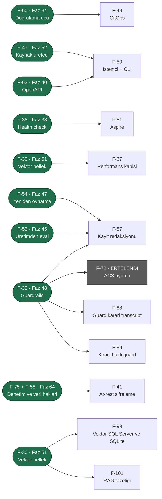

# ADAYLAR.md — Üçüncü Tur Aday Yetenekleri

> **Durum (2026-08-08): FAZ 31–56 PLANLANDI; KALAN 15 KALEM SEÇİLMEDİ.**
> İkinci tur (Faz 8–30) [Faz 30](arsiv/fazlar/30-ARAYUZ-CILASI.md) ile kapandı. Dalga 1, 2
> ve 3'ün toplam **yirmi altı** kalemi [Faz 31–52](arsiv/UCUNCU-FAZ-YOL-HARITASI.md)
> olarak plana dönüştü ve bölümleri **bu dosyadan silindi**. Kalan kalemler
> için seçim yapılmadan faz dokümanı yazılmaz.
>
> 🚨 **2026-08-08 denetimi dört kalemi daha plana çevirdi ve birini kapattı:**
> F-56 → [Faz 53](arsiv/fazlar/53-KIRACI-API-ANAHTARLARI.md), F-36 →
> [Faz 54](arsiv/fazlar/54-OKSUZ-CALISTIRMA-UZLASTIRMASI.md), F-69 →
> [Faz 55](arsiv/fazlar/55-ASENKRON-ONAY-KUTUSU.md), F-74 →
> [Faz 56](arsiv/fazlar/56-KANARYA-YAYINI-VE-OTOMATIK-GERI-ALMA.md). **F-76 faza dönüşmedi;
> bir kusur olarak düzeltildi** (K-352). Aynı denetim numarasız kalan on üç işi
> **F-90…F-102** olarak listeye aldı.
>
> 🚨 **F-72 (ACS uyumu) Dalga 3'e seçildi ama ölçüm sonucu ERTELENDİ** ve bu
> listede kaldı. Bölümü artık **ölçülmüş kanıt** taşıyor; sonraki oturum
> ölçümü tekrarlamak zorunda değildir.
>
> 🚨 **2026-08-10: manuel kabul testi senaryo yazımının düşürdüğü notların
> taranması F-103–F-105'i ekledi** (`docs/manuel-test/00-INDEKS.md` §8).
> Aynı tarama sırasında bulunan gerçek kusurlar (kiracı yalıtımı, `--no-build`
> paketleme, SSE hata çerçevesi vb.) doğrudan kodlandı — burada yalnız var
> olmayan bir **yetenek** gerektiren adaylar durur.
>
> 🚨 **2026-08-14: Ortak kuyruk manuel kabul testi kapanışı F-106'yı ekledi**
> (`HATA-K-003`/K-401) — Magentic round-limit sonrası zarif durdurma, MAF'ın
> kapalı-kutu orkestrasyon durumuna bağımlı bir yetenek adayıdır. Aynı
> koşumda bulunan diğer sekiz kusur (`HATA-K-001`..`008`) doğrudan kodlandı.
>
> 🚨 **2026-08-15: Manuel kabul testi kapanışı (KAPANIS-PLANI §5 Karar 4)
> F-107'yi ekledi** (`HATA-S2-010`/`MT-RES-005`) — bir `WorkflowRunner`
> çalıştırmasının gerçekten iptal edilip edilemediği MAF'ın kendi
> `AgentWorkflowBuilder.BuildSequential` grafiğinin iç iptal davranışına
> bağımlı bir yetenek adayıdır. Kullanıcı kararıyla, yetenek isteyen diğer
> tüm bulgular doğrudan kodlandı; yalnız bu istisna faza döndü.
>
> 🚨 **2026-08-18: Kullanıcı sorusu F-108'i ekledi ve aynı gün F-64 ile birlikte
> plana dönüştü** → [Faz 61](61-ISTEMCI-TOOLLARI-VE-GOMULEBILIR-SOHBET.md).
> İkisinin bölümü bu dosyadan **silindi**. Planlama sırasında yapılan ölçüm iki
> iddiayı düzeltti: (1) MAF'ın OpenAI uyumlu girdi dönüşümü
> `function_call_output` öğesini **reddediyor** — o yüzey sonuç kanalı olamaz;
> (2) **CORS kodda hiç yok**, bu F-64'ün gerçek ön koşuludur ve aday bölümü
> bunu yazmamıştı. Ayrıca `AIFunction.AsDeclarationOnly()` ile bildirim-yalnız
> tool'un modele gidip **sunucuda çalışmadığı** davranış probuyla kanıtlandı.
>
> 🚨 **2026-08-18 (ikinci tur): beş faz daha planlandı, üç kalem kapandı.**
> F-44+F-59 → [Faz 62](62-MODEL-YEDEK-ZINCIRI-VE-ON-UCUS-DENETIMI.md) ·
> F-61 → [Faz 63](63-ARGUMAN-DUZEYINDE-ONAY-POLITIKASI.md) ·
> F-75+F-58 → [Faz 64](64-DENETIM-ZINCIRI-VE-VERI-KONUSU-HAKLARI.md) ·
> F-40 → [Faz 65](65-KIRACI-SAGLAYICI-ANAHTARLARI.md) ·
> F-65 → [Faz 66](66-GELEN-TETIKLEYICILER.md). Aynı turda **F-100, F-102 ve
> F-103 ölçümle kapandı** — üçü de artık bir aday değildir. Planlama sırasında
> düzeltilen iddialar: `ToolApprovalRule` konumsal **değildir** (ek kurucu
> istemez), `CompiledAgentCache` anahtarı kiracıyı **zaten** taşır (K-380) ve
> `Microsoft.ML.Tokenizers` geçişli olarak var olsa da AgentPrism onu **hiç
> doğrudan çağırmıyor**.
>
> 🚨 **2026-08-20: MAF/Semantic Kernel/`Microsoft.Extensions.AI` ekosistem
> taraması F-45'i doğruladı ve F-134'ü ekledi.** `DistributedCachingChatClient`
> reflection ile ölçüldü — pinlenmiş 10.8.3'te zaten var, sürüm yükseltmesi
> gerekmiyor. Aynı taramanın kod yazmayan üç bulgusu kullanıcıya ayrıca
> bildirildi (aday değildir, burada durmaz): (1) MAF/MEAI/MCP paket
> sürümlerinin rutin güncellenmesi (kusur kanalı), (2) K-053'ün yeniden test
> edilmesi önerisi — `Microsoft.Agents.AI.Harness` artık GA hattında ama
> davranışsal düzelme ölçülmedi (karar kanalı), (3) `docs/hafiza/maf-api.md`
> satır 51'deki MCP OAuth notunun netleştirilmesi — `IdentityAssertionGrantProvider`
> pinlenmiş 2.0.0'da bile var, ama saf `client_credentials` sağlamıyor (belge
> düzeltmesi). Tam koşum kaydı: [`kesif/2026-08-20-maf-ekosistem-taramasi.md`](kesif/2026-08-20-maf-ekosistem-taramasi.md).
>
> Bu belge 2026-08-05 tarihli ilk aday listesinin **yerini alır**. Ayrı bir
> aday listesi dosyası açılmaz; iki yerde tutmak kayma üretir. Eski sürümün
> tarihsel değeri "hangi iddia yanlış çıktı" bilgisidir ve o bilgi aşağıdaki
> [Yeniden Yargı](#yeniden-yargı-2026-08-06) bölümünde durur. Eski metnin
> tamamı git geçmişindedir; arşive kopya alınmadı.
>
> **Okuma notu — bu dosya baştan sona okunmaz.** Seçim yaparken önce
> [Bu Turda Neyin Değiştiği](#bu-turda-neyin-değiştiği), sonra
> [Önerilen Sıralama](#önerilen-sıralama--üç-dalga) okunur. Tek bir kalemin
> ayrıntısı için `grep -n "F-68" docs/ADAYLAR.md` yeterlidir.
> Bir kalem faz dokümanına dönüştürüldüğünde ilgili bölüm buradan **silinir**
> ve faz dokümanına taşınır.

---

## Plana Dönüşenler (2026-08-06)

Aşağıdaki **yirmi altı** kalemin bölümü bu dosyadan **silindi**. Ayrıntı artık
faz dokümanındadır; bu tablo yalnız yönlendirmedir.

### Dalga 1–3 → Faz 31–52 — arşive taşındı (2026-08-21)

Yirmi altı kalemin faz eşlemesi kapanmış bir yönlendirme kaydıdır; faz durumu
[`YOL-HARITASI.md`](YOL-HARITASI.md)'de yaşar. Tablolar:
[`arsiv/PLANA-DONUSEN-ADAYLAR.md`](arsiv/PLANA-DONUSEN-ADAYLAR.md) § *Dalga 1–3 eşleme tabloları*.

### Dalga 6 → Faz 61

| Kalem | Faz |
|---|---|
| **F-108** İstemci tarafında çalışan tool | [Faz 61](61-ISTEMCI-TOOLLARI-VE-GOMULEBILIR-SOHBET.md) |
| **F-64** Gömülebilir sohbet bileşeni | [Faz 61](61-ISTEMCI-TOOLLARI-VE-GOMULEBILIR-SOHBET.md) |

İkisi tek fazdadır: gömülebilir bileşen, istemci tool'unu **çalıştıran**
taraftır ve CORS ikisinin ortak ön koşuludur.

### Dalga 7 → Faz 62–66

| Kalem | Faz |
|---|---|
| **F-44** Model yedek zinciri · **F-59** Ön uçuş bütçe denetimi | [Faz 62](62-MODEL-YEDEK-ZINCIRI-VE-ON-UCUS-DENETIMI.md) |
| **F-61** Argüman düzeyinde onay politikası | [Faz 63](63-ARGUMAN-DUZEYINDE-ONAY-POLITIKASI.md) |
| **F-75** Denetim hash zinciri · **F-58** Veri konusu hakları | [Faz 64](64-DENETIM-ZINCIRI-VE-VERI-KONUSU-HAKLARI.md) |
| **F-40** Kiracı sağlayıcı anahtarları (BYOK) | [Faz 65](65-KIRACI-SAGLAYICI-ANAHTARLARI.md) |
| **F-65** Gelen tetikleyiciler | [Faz 66](66-GELEN-TETIKLEYICILER.md) |

Üç faz iki kalemi birleştirir ve gerekçesi her birinde yazılıdır: F-44 ile F-59
aynı sözleşmeyi (`ModelBinding`) ve aynı boru hattını paylaşır; F-75 ile F-58
**aynı tabloda çatışır** ve ayrı planlanırsa ikincisi birincisini bozar.

🚨 **Faz 64 iki tasarım kararını plan anında verdi:** denetim izi
**dokunulmazdır** (silme yalnız içerik verisinde uygulanır) ve veri konusu
kimliği bir **genişleme noktasıyla** (`IDataSubjectResolver`) çözülür —
AgentPrism kişisel kimlik **saklamaz**.

🚨 **F-63'ün kapsamı daraldı.** Kalem "TypeScript istemci paketi **ve** OpenAPI
yayını" idi; [Faz 40](arsiv/fazlar/40-OPENAPI-YAYINI.md) yalnız **belgeyi** kapsar.
TypeScript/npm yayını ayrı bir dağıtım kanalıdır ve yeni bir aday kalemidir.

🚨 **F-72 seçildi ama plana dönüşmedi.** Bölümü aşağıda duruyor ve artık
ölçülmüş kanıt taşıyor.

Planlama sırasında **on beş kanıt düzeltildi** (Dalga 1–2'de yedi, Dalga 3'te
sekiz); ayrıntı [`arsiv/UCUNCU-FAZ-YOL-HARITASI.md`](arsiv/UCUNCU-FAZ-YOL-HARITASI.md)
içindedir.

---

### Dalga 9 → Faz 73

| Kalem | Faz |
|---|---|
| **F-120** Tüketici agent desteği (tanılar + üretilen yetenek haritası) | [Faz 73](73-TUKETICI-AGENT-DESTEGI.md) |

Bu kalem bir tüketici sorusundan doğdu: paketi entegre eden uygulamaların **kod
agent'ları** yeteneklere hâkim değil. Dört seçenek tartıldı (RAG · MCP · yalnız
doküman · derleme anı tanıları); RAG **elendi** — chunk sınırı imza ile kullanımı
koparır, ve indeks tüketicinin kurduğu sürümden kayar. Kalan üç katmanın ikisi
(tanılar + üretilen harita) tek faz oldu; üçüncüsü F-121'dir.

---

### Dalga 10 → Faz 74

| Kalem | Faz |
|---|---|
| **F-121** Yerel referans yüzeyi (kapsamı ölçümle değişti) | [Faz 74](74-YEREL-REFERANS-YUZEYI.md) |

F-121 bir `dotnet tool` MCP sunucusu olarak yazılmıştı ve kendi kaydı ölçüm
istiyordu. Ölçüm 2026-08-19'da yapıldı ve **öneriyi düşürdü**: detay korpusu
(2.96 MB XML, ~5 600 üye) tüketicinin diskinde zaten duruyor ve `grep` onu
cevaplıyor. Kalan boşluk erişim değil **işaret**tir. Faz 74 üç şeyi alır:
üretilen bir yerel referans dosyası, paketlenen OpenAPI belgesi ve 39 giriş
noktasının tamamında çalışan bir örnek — hepsi yeni dağıtım kanalı açmadan.

---

### Dalga 11 → Faz 75–76

| Kalem | Faz |
|---|---|
| **F-126** Tüketici dokümanının doğruluğu ve kapıları | [Faz 75](75-TUKETICI-DOKUMAN-DOGRULUGU.md) |
| **F-124** Harita üretecinin kesme ve kural kusurları | [Faz 75](75-TUKETICI-DOKUMAN-DOGRULUGU.md) |
| **F-127** Doküman kalitesi ve görsel kimlik | [Faz 76](76-DOKUMAN-KALITESI-VE-GORSEL-KIMLIK.md) |

Bu tur bir **denetim turudur**, bir keşif turu değil: kaynağı yeni bir ihtiyaç
değil, Faz 73 ve 74'ün kendi çıktısının ölçülmesidir. Soru şuydu — tüketicinin
kod agent'ına verdiğimiz korpus gerçekten okunabilir mi.

Ölçüm ikisini birden buldu. Sevk edilen dokümantasyon **kendi kendine
yetmiyor**: 15 paketin XML dosyalarında **1 033 satır**, paketlenen
`agentprism.json`'da **39 yer** ve 18 paket README'sinin **9'unda** tüketicide
var olmayan adreslere gönderme var (`phase 64`, `K-032`, `docs/NN-*.md`). K-408
bu sınıfın bir katman yüzeyini kapatmıştı ("imza İngilizce, açıklama Türkçe");
bu, aynı kusurun bir katman derinidir — dil doğru, **hedef kitle** yanlış.

İkinci bulgu kapılarla ilgilidir: sızıntıyı arayan kod (`hasInternalHistory`)
**zaten yazılmış** ve doğru çalışıyor, ama yalnız sitenin sanitize edilmiş
kopyalarında koşuyor. Sevk edilen `.nupkg` içeriği hiçbir kapının arkasında
değil. Aynı desen beş yerde daha tekrarlandı: konsol ekranları, telemetri
öznitelikleri, `Options` üyeleri, HTTP sayıları ve harita kuralları — hiçbiri
bugün bir testi kızartmıyor.

F-127 ayrı tutuldu çünkü **farklı bir yargı türü** ister: F-126 testle
kanıtlanır, F-127 gözle. İkisini tek faza koymak DoD'yi bulanıklaştırırdı.

---

### Dalga 12 → Faz 78

| Kalem | Faz |
|---|---|
| **F-135** Yetenek haritasının var olan `AGENTS.md` taşıyan repo'ya erişimi | [Faz 78](78-YETENEK-HARITASI-ERISIMI.md) |

F-135 bir keşif turundan değil, **gerçek bir tüketici kurulumundan** doğdu
(2026-08-21, kullanıcı sorusu — F-108 emsali). Paket
`prodigy-enabler-backend`'e eklendi ve harita o repo'ya hiç ulaşmadı: kökte
zaten bir `AGENTS.md` vardı, paket onu doğru şekilde ezmedi, ve haritayı
gösteren başka hiçbir yol yoktu.

Ölçüm teşhisi keskinleştirdi. Oradaki kod agent'ı `AgentPrism.LocalReference.md`'yi
**kendiliğinden** bulmuş ve `AGENTS.md:105`'te doğru biçimde belgelemiş — hatta
`AgentPrism.AgentMap.md` adını biliyor. Yani eksik olan bilgi değil, **yoldur**:
`LocalReference.md` XML doc yollarını yazıyor ama haritanın yolunu yazmıyor
([targets:149](../src/AgentPrism.Core/buildTransitive/AgentPrism.Core.targets#L149)).

Aynı ölçüm bir tanı tasarımını da düşürdü: "`AGENTS.md` AgentPrism'den söz
ediyor mu" kontrolü o dosyada sessiz kalırdı (20'den fazla kez söz ediyor).
`APG0402`'nin tetiği bu yüzden yönlendirme **hedefine** bağlandı, konuya değil.

Kapsam ikinci bir soruyla büyüdü: *harita ulaşılır olunca yeterli mi?* Ölçüm
hayır dedi. Tüketicinin agent'ının kendi kaydettiği tuzağın
(`UseTenancy()` çağrılmazsa sessizce single-tenant) cevabı korpusta **tek bir
yerde** var — [`concepts/governance.md:15`](../docs-site/src/content/docs/concepts/governance.md#L15),
"Off by default". Harita giriş noktasını adlandırır, XML doc tipi anlatır;
**varsayılanı** yalnız anlatı söyler. O katmanın yerel karşılığı yok (424 KB) ve
girişi de yok: `llms.txt` bir bağ listesi değil (`^- [` deseni **0** eşleşiyor),
`llms-full.txt` **401 KB**. Üstelik `llms-full.txt` satırı sevk edilen haritadan
çıkarılmış ([`build-agent-map.mjs:62`](../docs-site/scripts/build-agent-map.mjs#L62))
— dağıtım ters. İkisi de Faz 78'e katlandı (§78.4).

Ters yönde bir ölçüm de kayda geçti: sevk edilen XML doc'lar **51**
`AgentPrism:` yapılandırma anahtarı taşıyor, sitenin `configuration.md`'si
**39**. Boşluk referansta değil, anlatıdadır.

Faz 73 bu bedeli önceden yazmıştı — "opt-in kararının bedeli benimseme
oranıdır". F-135 o cümlenin ilk ölçülen faturasıdır.

---

## Bu Turda Neyin Değiştiği

Üçüncü turun kendi anlatısı kapanmış kayıttır — tam metin:
[`arsiv/PLANA-DONUSEN-ADAYLAR.md`](arsiv/PLANA-DONUSEN-ADAYLAR.md).

## Değerlendirme Ölçütleri

Dört temel soru korunur:

| Ölçüt | Soru |
|-------|------|
| **Değer** | Bu olmadan AgentPrism'i kim kullanamaz? |
| **Maliyet** | Kaç paket, kaç yeni public tip, kaç migration? |
| **Risk** | Bir tasarım kuralını (K1–K4) zorluyor mu? Bundle bütçesini? |
| **Hazırlık** | MAF veya .NET ekosisteminde hazır mı, sıfırdan mı? |

### Sekiz mercek

Bir fikir yalnız bir mercekten iyi görünüyorsa zayıftır. Her kalemin
**Mercek** satırı destekleyen mercekleri numarayla sayar.

| # | Mercek | Sorusu |
|---|--------|--------|
| 1 | **Benimseme** | İlk agent'a kadar geçen süreyi kısaltır mı? |
| 2 | **Üretim işletimi** | Gece 03:00'te nöbetçi mühendisin işine yarar mı? |
| 3 | **Kurumsal satın alma** | Hangi kurumsal kapıyı açar? |
| 4 | **Performans ve AOT** | Sıcak yolda tahsis üretir mi? AOT duruşunu bozar mı? |
| 5 | **API ergonomisi** | Yanlış kullanım derlemede yakalanır mı? Sonradan eklemek kırıcı mı? |
| 6 | **Ekosistem yerleşimi** | Aspire, OTel, MCP, A2A, DI ile doğal mı oturuyor? |
| 7 | **Ölçme–iyileştirme** | Üretim verisini geliştirmeye geri besler mi? |
| 8 | **Maliyet (FinOps)** | Tüketicinin model faturasını düşürür mü? |

---

## Yeniden Yargı (2026-08-06)

### İptal — tamamlandı

| Kalem | Kanıt |
|---|---|
| **F-43** Sağlayıcıya özgü ayar torbası | `ModelBinding.ProviderSettings` sözleşmede yaşıyor: [`ModelBinding.cs:70`](../src/AgentPrism.Abstractions/Agents/ModelBinding.cs). Karar K-208. Bilinmeyen anahtar derleme hatasıdır — istenen davranış birebir uygulanmış. Eski liste bunu "Faz 26 isteyecek" diye yazmıştı; Faz 26 bitti ve isteği karşıladı |

### Kanıtı yanlışlanan — kalem ayakta, gerekçe değişti

| Kalem | Eski iddia | 2026-08-06 ölçümü |
|---|---|---|
| **F-35** Çalıştırma iptali | "`RunStatus.Canceled` tanımlı ama hiçbir kod yazmıyor" | **Yanlış.** Üç yer yazıyor: [`RunRecordingAgent.cs:186`](../src/AgentPrism.Core/Recording/RunRecordingAgent.cs), aynı dosya `:251` ve [`WorkflowRunner.cs:463`](../src/AgentPrism.Workflows/Internal/WorkflowRunner.cs). Gerçek delik başkadır ve aşağıda yazılıdır |
| **F-57** Çok örnekli koordinasyon | "Faz 17 bu olmadan yapılırsa her cron N kez tetiklenir" | **Yanlış.** [`0008_scheduling.sql:46`](../src/AgentPrism.PostgreSql/Migrations/0008_scheduling.sql) `jobs_schedule_scheduled_uq UNIQUE (schedule_id, scheduled_for)` kısıtını taşıyor (K-138). Cron çift tetiklemesi zaten kapalı. Kalemin aciliyeti düştü, kapsamı daraldı |

### Yükseltilenler

| Kalem | Neden yükseldi |
|---|---|
| **F-30** Vektör bellek | Yeni kanıt: kalıcı depo geldi ama arama hâlâ regex **ve** O(n). `SqlAgentFileStore.SearchAsync` her çağrıda tüm dosyaları belleğe alıyor |
| **F-32** Guardrails | Microsoft 2026-06-02'de **Agent Control Specification**'ı yayımladı. İş artık "kendi filtremizi yaz" değil, "bir standarda otur" |
| **F-33** A2A | `Microsoft.Agents.AI.A2A` ve `Microsoft.Agents.AI.Hosting.A2A` paketleri **var**. "Elle uygulamak pahalı" gerekçesi düştü |
| **F-44** Model yedek zinciri | LiteLLM ve Portkey'de temel yetenek. .NET'te karşılığı yok |
| **F-52** Geri bildirim | Önkoşulsuz, tek tablo, ölçme döngüsünün ilk halkası |
| **F-53** Üretimden eval kümesi | Faz 18 bitti. Bu artık "önce yapılmalı" değil, **eksik yarısı** |
| **F-54** Yeniden oynatma | LangGraph 1.2'nin "time travel"i fiilî standart oldu |

### Birleşmeler

| Birleşen | Nasıl |
|---|---|
| **F-31 + F-33** | Tek faz: "dışa açılan agent yüzeyi". İkisi de aynı altyapıyı ister — kimlik doğrulama, kiracı çözümleme, derinlik ve bütçe sınırı, onay sınırı. Protokoller iki ince adaptördür. İki ID korunur |
| **F-54 + F-66** | Tek faz. İkisi de "kayıtlı bir noktadan dallanma"dır; `conversation_items` append-only olduğu için ikisi de aynı dal işaretçisini ister |
| **F-39 → F-68** | F-39 (`202 Accepted`) dayanıklı çalıştırmanın **HTTP yüzüdür**. Ayrı kalem tutmak sözleşmeyi motordan koparır. F-39 ID'si F-68'in içinde yaşar |

---

## A. Kontrol düzlemi çekirdeği — işletim

> **Bu bölümün her iki kalemi de plana dönüştü (2026-08-08):** F-36 →
> [Faz 54](arsiv/fazlar/54-OKSUZ-CALISTIRMA-UZLASTIRMASI.md), F-69 →
> [Faz 55](arsiv/fazlar/55-ASENKRON-ONAY-KUTUSU.md). Bölümleri buradan silindi.
>
> 🚨 **2026-08-18 turunun üç kalemi de aynı gün plana dönüştü** (F-110, F-114,
> F-115). Aşağıdaki satırlar yalnız **iz**dir; gövdeler arşivdedir. Bu bölümde
> **seçilmemiş kalem kalmadı** ([keşif notu](kesif/2026-08-18-tuketici-raporu.md)).

- **F-110** `pgvector`'ün isteğe bağlı olması → [Faz 67](67-ISTEGE-BAGLI-MIGRATION-SETI.md) 📋 · gövdesi: [`arsiv/PLANA-DONUSEN-ADAYLAR.md`](arsiv/PLANA-DONUSEN-ADAYLAR.md)
- **F-114** Tool yürütme timeout'u → [Faz 69](69-TOOL-YETKILENDIRMESI-VE-TIMEOUT.md) 📋 · gövdesi: [`arsiv/PLANA-DONUSEN-ADAYLAR.md`](arsiv/PLANA-DONUSEN-ADAYLAR.md)
- **F-115** Çalıştırma olayı hedefi ve `ReasoningDelta` → [Faz 70](70-CALISTIRMA-OLAYI-HEDEFI.md) 📋 · gövdesi: [`arsiv/PLANA-DONUSEN-ADAYLAR.md`](arsiv/PLANA-DONUSEN-ADAYLAR.md)

## B. Model yüzeyi ve yönlendirme

### F-45 · Yanıt önbelleği

**Sorun:** Aynı soru iki kez sorulursa iki kez ödenir. Önbellek yok.
**Kapsam:** `DistributedCachingChatClient` boru hattına takılır.
**Değer:** Deterministik iş yüklerinde fatura düşer.
**Mercek:** 8.
**Hazırlık:** **Ölçüldü (2026-08-20):** `Microsoft.Extensions.AI.DistributedCachingChatClient`
ve `DistributedCachingChatClientBuilderExtensions.UseDistributedCache` pinlenmiş
sürümde (10.8.3) doğrudan reflection ile doğrulandı —
`~/.nuget/packages/microsoft.extensions.ai/10.8.3/lib/net10.0/Microsoft.Extensions.AI.dll`
içinde tip mevcut. Sürüm yükseltmesi gerekmiyor.
🚨 **İmzalar ölçüldü (2026-08-21, reflection).** Üç şey netleşti:

| Ölçüm | Sonuç |
|---|---|
| `DistributedCachingChatClient(IChatClient, IDistributedCache)` | 🚨 `IDistributedCache` bugün AgentPrism'de **hiç kullanılmıyor** (`grep -rn "IDistributedCache" src` → boş). Tüketici bir cache uygulaması seçmek zorunda kalır ve bellek içi olan çok örnekli kurulumda **sessizce işe yaramaz** — bu bir K1 (sıfır sürpriz) kararıdır |
| `CacheKeyAdditionalValues { get; set; }` — `IReadOnlyList<Object>` | Kiracı anahtara **yapısal** olarak karışır; elle string birleştirme gerekmez, **K-525 sağlanır** |
| `GetCacheKey(...)` ve `EnableCaching(...)` `protected virtual` | AgentPrism kiracı anahtarlamasını yapılandırmaya güvenmek yerine **zorlayabilir** |

**Maliyet:** Düşük — yeni MEAI paketi yok; `IDistributedCache` kaydı tüketicinin kararı.
**Risk:** Varsayılan **kapalı**. Agent'ın aynı soruya farklı yanıt vermesi
beklenen davranıştır; önbellek bunu bozar. Kiracı yalıtımı önbellek
anahtarında olmalıdır.
🚨 **Ölçülmedi:** önbelleğin boru hattındaki **konumu**. Telemetrinin dışına
konursa isabet eden bir çağrı `chat` span'i ve token kaydı **üretmez** (harcama
yok, doğru olabilir); içine konursa sıfır token'lı bir span yazar. Karar
Faz 68'in maliyet kırılımını etkiler ve plan anında verilmelidir
([`ModelProviderRegistry.cs:300-360`](../src/AgentPrism.Core/Models/ModelProviderRegistry.cs)).
**Bağımlılık:** Yok.
**Ekosistem:** LiteLLM ve Portkey'de standart (önceki turların damgası; 2026-08-21'de
**yeniden doğrulanmadı**). Anthropic'in prompt caching'i ayrı bir kavramdır ve Faz 26'da zaten var.
**Karşı görüş:** `CacheKeyAdditionalValues` **örnek başına** bir özelliktir —
kiracı başına anahtarlama kiracı başına istemci örneği demektir; bu, bugünkü
`CompiledAgentCache` kiracı anahtarlamasıyla (K-380) hizalanmalıdır.

---

### F-134 · Eşzamanlı tool çağrısını açığa çıkar

**Sorun:** Bir turda birden çok bağımsız tool çağrıldığında bugün sırayla
çalışıyor. `FunctionInvokingChatClient.AllowConcurrentInvocation` MEAI'de
zaten var (**Ölçüldü**, aynı reflection: `strings` çıktısında
`AllowConcurrentInvocation`/`allowConcurrentInvocation` alanı görünüyor) ama
AgentPrism hiçbir yerde açmıyor (`grep -rn AllowConcurrentInvocation src`
yalnız bir **yorum** buluyor: [`ToolUsageAccumulator.cs:18`](../src/AgentPrism.Core/Recording/ToolUsageAccumulator.cs#L18)
— sınıf zaten eşzamanlı çağrıyı bekleyerek `ConcurrentDictionary` kullanıyor,
ama tetikleyen ayar hiçbir yerde `true` değil).
**Kapsam:** `ChatClientBuilder` boru hattına bir agent/model tanımı bayrağı ekler.
**Ölçüldü (2026-08-21):** ekleme noktası doğrulandı —
[`ModelProviderRegistry.cs:317-321`](../src/AgentPrism.Core/Models/ModelProviderRegistry.cs)
`.AsBuilder().UseFunctionInvocation(_loggerFactory).UseOpenTelemetry(...)`; K-320'nin
merkezi kurulum noktası ayakta.
**Değer:** Bağımsız tool'ları paralel çağıran bir turda gecikme düşer —
örn. üç farklı API'ye bakan bir araştırma agent'ı.
**Mercek:** 1, 4.
**Hazırlık:** **Ölçüldü (2026-08-20).** MAF 1.18.0 (2026-08-18) bu yeteneği
agent seviyesinde de öne çıkardı: "Allow agents to opt into concurrent tool
invocation" ([release notes](https://github.com/microsoft/agent-framework/releases/tag/dotnet-1.18.0)).
Pinlenmiş sürüm 1.16.0'da bu MEAI düzeyinde zaten var; agent-seviyesi
harness entegrasyonu doğrulanmadı.
**Maliyet:** Düşük — tek bayrak, yeni paket yok.
**Risk:** Sıralı yan etkili tool'lar (ör. birbirine bağımlı yazma işlemleri)
paralelleşirse sıra garantisi bozulur. Varsayılan **kapalı** olmalı; agent
tanımında açıkça seçilmeli.
**Bağımlılık:** Yok.
**Ekosistem:** MAF 2026-08-18'de bunu ürün özelliği olarak öne çıkardı —
kendi ekosistemimizin en taze sinyali.

🚨 **Asıl risk ölçüldü (2026-08-21): eşzamanlılık AgentPrism'in AMBIENT tool
bağlamına çarpar.** Tool katmanı iki yerde `FunctionInvokingChatClient.CurrentContext`
okuyor — [`AuthorizingAIFunction.cs:107`](../src/AgentPrism.Core/Tools/AuthorizingAIFunction.cs#L107)
(çağrı kimliğiyle yetkilendirme) ve
[`AgentPrismToolUsage.cs:56`](../src/AgentPrism.Core/Tools/AgentPrismToolUsage.cs#L56).
Bayrak açılınca tool gövdeleri eşzamanlı koşar; bu ambient'ın çağrı başına doğru
çözülüp çözülmediği **ölçülmemiştir**. Bu depo aynı sınıf tuzağı **beş kez**
yaşadı (`MEMORY.md`, `docs/hafiza/cekirdek-calistirma.md`). Plan bunu ilk iş
olarak bir davranış probuyla kanıtlamalıdır — bayrağı açmak son adımdır.

**Karşı görüş:** Bugüne kadar hiçbir manuel test veya kullanıcı bu gecikmeyi
sorun olarak bildirmedi; çoğu agent turu tek tool çağırıyor. Ölçülmeden
"performans kazancı" iddia edilemez — ilk adım gerçek bir çok-tool senaryosunda
benchmark almaktır, doğrudan bayrağı eklemek değil.

- **F-112** Cache ve reasoning token kırılımı → [Faz 68](68-CALISTIRMA-KIMLIGI-VE-TOKEN-KIRILIMI.md) 📋 · gövdesi: [`arsiv/PLANA-DONUSEN-ADAYLAR.md`](arsiv/PLANA-DONUSEN-ADAYLAR.md)

## C. Güvenlik, yönetişim ve uyum

### F-72 · Agent Control Specification (ACS) uyumu — ERTELENDİ (2026-08-06). Gövde: [`arsiv/PLANA-DONUSEN-ADAYLAR.md`](arsiv/PLANA-DONUSEN-ADAYLAR.md).

### F-76 · Paylaşılan SQL kaynağının XML doküman çakışması — KAPATILDI (2026-08-08, K-276). Gövde: [`arsiv/PLANA-DONUSEN-ADAYLAR.md`](arsiv/PLANA-DONUSEN-ADAYLAR.md).

### F-41 · İçerik şifreleme (at-rest)

**Sorun:** `conversation_items` tam sohbet geçmişini açık saklıyor. Ekler
`attachments.content` sütununda `bytea` olarak açık duruyor
([`0006_attachments.sql:22`](../src/AgentPrism.PostgreSql/Migrations/0006_attachments.sql)).

🚨 **Yüzey ölçüldü (2026-08-20 güvenlik taraması, B06-2): iki sütun değil, dokuz.**
`sessions.state` · `conversation_items.item` · `responses.payload` ·
`run_events.text` · `run_events.payload` · `tool_invocations.arguments/result` ·
`run_inputs.messages` · `attachments.content` · `agent_files.content`.
**Kullanıcı istemi ve model çıktısı `run_inputs.messages` ile `run_events.text`
içinde zaten tam metin durur** — yalnız ilk iki sütunu şifrelemek korumayı eksik
bitirir. Plan bu dokuz sütunu birlikte ele almalıdır.

**Kapsam:** `IContentProtector` genişleme noktası **yazılacak** — bugün böyle bir
tip yoktur (`rg -n 'IContentProtector' src/` → sıfır sonuç); varsayılan uygulama
yok (K4).

**Not:** Bu sınır bugün **hiçbir tüketiciye dönük belgede yazmıyor** (B06-1):
`docs-site/.../security.md`, `MIMARI-GUVENLIK.md` ve `README.md` içinde
`at rest`/`encrypt` geçmiyor. F-41 planlanana kadar bile bu bir dokümantasyon
boşluğudur.
**Değer:** Regüle sektörlerde zorunlu.
**Mercek:** 3.
**Hazırlık:** .NET Data Protection API kullanılabilir.
**Maliyet:** Orta.
**Risk:** Şifreli sütun **aranamaz**. Konuşma araması ve saklama sorguları
etkilenir. Anahtar döndürme bir tasarım kararıdır.
**Bağımlılık:** F-58 ile aynı veriye dokunur.
**Ekosistem:** Genel veritabanı deseni; agent'a özgü değil.

🚨 **F-87 ile TEK KÜME olarak planlanır (2026-08-21).** İkisi de aynı dokuz
sütuna dokunur; ayrı planlanırsa ikincisi birincisini bozar — Faz 64'ün
(F-75 + F-58) emsali birebir geçerlidir.

**Çatışma haritası — üç okuma yolu ölçüldü (2026-08-21):**

| Okuma yolu | Kanıt | Şifreleme / redaksiyon etkisi |
|---|---|---|
| Yeniden oynatma | [`RunReplayService.cs:30`](../src/AgentPrism.Core/Replay/RunReplayService.cs) `IRunInputStore _inputs` | Replay **ham** girdiyi ister; redakte edilirse yeniden oynatma sadık değildir |
| Eval terfisi | [`RunToCasePromoter.cs:175`](../src/AgentPrism.Core/Evaluation/RunToCasePromoter.cs) `_runs.ReadEventsAsync`, `:97` `ListToolInvocationsAsync` | Vaka `run_events` ve `tool_invocations` **ham metninden** üretilir |
| Dosya araması | [`SqlAgentFileStore.cs:212`](../src/AgentPrism.Sql.Shared/Stores/SqlAgentFileStore.cs) `CollectMatches(Regex regex, string content)` | Regex **düz metin** üzerinde koşar; şifreleme dosya aramasını tamamen bitirir |

Ayrıca F-87'nin öncülü koddan doğrulandı:
[`AgentPrismServiceCollectionExtensions.cs:870`](../src/AgentPrism.Core/AgentPrismServiceCollectionExtensions.cs#L870)
açıkça yazıyor — *"RunStarted event and IRunInputStore never passes through the guards."*

**Karşı görüş:** `IContentProtector` varsayılansız gelirse (K4) bugün **hiçbir
tüketici korunmaz**. Faz 73'ün "opt-in kararının bedeli benimseme oranıdır"
cümlesi burada da geçerlidir ve F-135 o cümlenin ilk ölçülen faturasıydı.
Kümenin ilk kararı koruma algoritması değil, bu **üç okuma yolunun ne olacağıdır**.

### F-104 · Örnek uygulama rol politikaları — ✅ KAPATILDI (2026-08-18, K-431). Gövde: [`arsiv/PLANA-DONUSEN-ADAYLAR.md`](arsiv/PLANA-DONUSEN-ADAYLAR.md).

### F-105 · Dosya belleği kiracı-içi sınırı — ✅ KAPATILDI (2026-08-18, K-434). Gövde: [`arsiv/PLANA-DONUSEN-ADAYLAR.md`](arsiv/PLANA-DONUSEN-ADAYLAR.md).

### F-106 · Magentic orkestrasyonu round-limit'e ulaştıktan sonra zarif durmuyor — `WorkflowRunner` bunu önceden kestiremiyor

> 🚨 **Durum (2026-08-18): AZALTILDI, DOĞRULANMADI — kalem AÇIK kalır.**
> Pompa artık akışı yeniden açmadan önce MAF'ın kendi durumunu soruyor
> (`run.GetStatusAsync()`, **K-433**), yani bildirilen `RunFailed` yolunun sebebi
> kapatıldı. Ama düşen bir test **yoktur**: sahte katılımcılarla iki repro denendi
> (`MaxIterations` 1 ve 2, tek ve çift onay turu) ve ikisi de düzeltme kapalıyken
> **geçti**. Test tiyatrosu bırakmamak için o dosya silindi. Kapı manuel kabul
> case'idir (gerçek model + `requirePlanApproval`).

**Sorun:** `HATA-K-003` (manuel kabul testi, K-401) bir Magentic +
`requirePlanApproval` iş akışında `maxIterations` plan+onay-sonrası-devam+
katılımcı döngüsü için yetersiz kalınca şunu ölçtü: MAF'ın Magentic
orkestratörü round-limit'e ulaşıp kendi `WorkflowOutput`'unu ("Task
execution stopped due to hitting the maximum round count limit.")
ürettikten SONRA, `WorkflowRunner`'ın süper-adım pompası orkestratörü BİR
KEZ DAHA çağırıyor — MAF bunu "orkestrasyon zaten sonlandı" istisnasıyla
reddediyor, çalıştırma `RunFailed` ile bitiyor. K-401 bu istisnanın
mesajını ANLAMLI hale getirdi (artık gerçek nedeni gösteriyor) ama
çalıştırmanın KENDİSİ hâlâ hatayla bitiyor — plan aslında MAF'ın kendi
tanımına göre "tamamlandı" (round-limit'e vararak durdu) sayılabilecekken,
AgentPrism bunu temiz bir `Completed` yerine bir `RunFailed` olarak
kaydediyor.
**Kapsam:** `WorkflowRunner`'ın MAF'tan gelen `WorkflowOutputEvent`'i
(round-limit metnini taşıyan) GÖRDÜKTEN sonra, aynı orkestratöre yönelik
sonraki bir süper-adım çağrısının "zaten sonlandı" istisnasıyla
başarısız olacağını ÖNCEDEN bilip akışı orada temiz bir `Completed`
olarak kapatması gerekir — bugünkü kod bu iki olayı (round-limit çıktısı
ile sonraki başarısız çağrı) ilişkilendirmiyor, MAF'ın ne üreteceğini
sırayla pompalayıp olduğu gibi yansıtıyor.
**Değer:** `requirePlanApproval: true` + Magentic KULLANAN her tüketici,
`maxIterations`'ı plan+onay-sonrası-devam+katılımcı döngüsü için yeterince
yüksek tutmazsa aynı "opak olmayan ama yine de yanlış" `RunFailed`'i
görür — ergonomik bir kusur, veri kaybı riski taşımaz (K-401 sonrası
mesaj zaten doğru nedeni söylüyor).
**Mercek:** 16 (Workflow yürütme).
**Hazırlık:** Yok — MAF'ın Magentic durum makinesinin "sonlandı mı"
sorusuna yanıt veren herkese açık bir API'si var mı, `maf-api-kesfi`
skill'iyle doğrulanmalı.
**Maliyet:** Orta. `WorkflowRunner`'ın süper-adım pompasına "önceki
adımda round-limit çıktısı görüldüyse sonraki çağrıyı deneme, doğrudan
`Completed`'e geç" mantığı eklenmesi gerekir — MAF'ın kapalı-kutu
orkestrasyon durumuna bağımlı olabilir.
**Risk:** Yanlış sezilen bir "zaten sonlandı" durumu, GERÇEKTEN başarısız
olması gereken bir çalıştırmayı sessizce `Completed` gösterebilir —
round-limit metninin TAM eşleşmesi yerine MAF'ın kendi tip/durum
bilgisine dayanmalı, metin eşleştirme kırılgandır.
**Bağımlılık:** K-401 (mesaj netleştirmesi) zaten main'de.
**Ekosistem:** —

---

### F-107 · Workflow iptali — ✅ KAPATILDI (2026-08-18). Gövde: [`arsiv/PLANA-DONUSEN-ADAYLAR.md`](arsiv/PLANA-DONUSEN-ADAYLAR.md).

## D. Yetenek derinliği

### F-34 · Talimat şablonlama ve paylaşılan prompt kütüphanesi

**Sorun:** Faz 19 sürümlemeyi ve A/B'yi verdi; **içerik yeniden kullanımı**
eksik. On agent aynı "kurum kuralları" bloğunu kopyalıyorsa tek yerden
değiştirmenin yolu yok.
**Kapsam:** Değişkenli talimat (`{{tenant_name}}`), kısmi bloklar, agent
tanımında referans.
**Değer:** Talimat bakımı ölçeklenir.
**Mercek:** 1, 7.
**Hazırlık:** Sıfırdan; şablon motoru yazılmalı veya seçilmeli.
**Maliyet:** Orta.
**Risk:** 🚨 **Şablon dili bir güvenlik yüzeyidir.** İfade değil, yalnız
**değer yerleştirme** desteklenmelidir. Tam bir şablon motoru (Scriban gibi)
K2'nin ruhunu zorlar — arayüzden çalıştırılabilir ifade yazılamamalıdır.
**Bağımlılık:** Yok.
**Ekosistem:** Langfuse'un prompt yönetimi tam olarak budur: arayüzden
sürümle, kod aktif sürümü çeker. Braintrust ve Portkey'de de var.

---

### F-109 · İstemci tarafı tool taşıyan bir `run` sadık biçimde replay edilemez

> Faz 61'in bağımsız denetiminde bulundu (2026-08-18, 🟢 bulgu).

**Sorun:** `RunReplayService`'in `toolTransform`'u yalnız `AIFunction`'lara
uygulanıyor (`AgentDefinitionCompiler.ResolveTools`'taki `is AIFunction`
süzgeci — Faz 61, K-435). İstemci tarafı bir tool (`AddClientTool`) çağrısı
taşıyan bir `run`'ı replay etmeye çalışmak, sunucunun hiçbir zaman
çalıştıramayacağı bir çağrıda takılı kalır.
**Kapsam:** Replay'in istemci tool çağrılarını nasıl ele alacağına karar
vermek — kayıtlı sonucu aynen tekrar mı oynatır, yoksa bu tür `run`'ları
baştan mı reddeder.
**Değer:** Faz 61'den sonra kayıtlı her `run`'ın replay edilebilir
olduğu varsayımı artık **tam doğru değil**; istemci tool'u kullanan
agent'lar için bu görünür bir boşluktur.
**Mercek:** 47 (yeniden oynatma).
**Hazırlık:** Faz 47'nin `ReplayToolMode`'u okunmalı.
**Maliyet:** Küçük–orta.
**Risk:** Düşük — replay isteğe bağlı bir araçtır, çekirdek çalıştırma yolunu etkilemez.
**Bağımlılık:** Faz 61 (K-435).
**Ekosistem:** —

---

- **F-116** Workflow kod düğümü → [Faz 71](71-WORKFLOW-KOD-DUGUMU.md) 📋 · gövdesi: [`arsiv/PLANA-DONUSEN-ADAYLAR.md`](arsiv/PLANA-DONUSEN-ADAYLAR.md)
- **F-117** Talimatta çok dillilik → [Faz 72](72-COK-DILLI-TALIMAT-VE-ZAMAN-DAMGALI-SENTEZ.md) 📋 · gövdesi: [`arsiv/PLANA-DONUSEN-ADAYLAR.md`](arsiv/PLANA-DONUSEN-ADAYLAR.md)
- **F-118** Zaman damgalı konuşma sentezi → [Faz 72](72-COK-DILLI-TALIMAT-VE-ZAMAN-DAMGALI-SENTEZ.md) 📋 · gövdesi: [`arsiv/PLANA-DONUSEN-ADAYLAR.md`](arsiv/PLANA-DONUSEN-ADAYLAR.md)

## E. Ölçme–iyileştirme döngüsü

Bu grup birlikte "agent'ı ölçerek iyileştirme" döngüsünü kurar. Bugün döngü
**tek yönlüdür**: üretim veri üretir, hiçbiri geri beslenmez.

> **Döngünün beş halkası plana dönüştü:** F-52 geri bildirim
> ([Faz 31](arsiv/fazlar/31-GERI-BILDIRIM-VE-PUANLAMA.md)), F-55 hata sınıflandırma
> ([Faz 44](arsiv/fazlar/44-HATA-SINIFLANDIRMA.md)), F-53 üretimden eval kümesi
> ([Faz 45](arsiv/fazlar/45-URETIMDEN-EVAL-KUMESI.md)), F-54+F-66 yeniden oynatma
> ([Faz 47](arsiv/fazlar/47-YENIDEN-OYNATMA-VE-DALLANDIRMA.md)) ve F-71 çevrimiçi
> değerlendirme ([Faz 49](arsiv/fazlar/49-CEVRIMICI-DEGERLENDIRME.md)).
> 🚨 **Döngü kapandı (2026-08-08):** son halka F-74 da plana dönüştü →
> [Faz 56](arsiv/fazlar/56-KANARYA-YAYINI-VE-OTOMATIK-GERI-ALMA.md). Bu bölümde kalem
> kalmadı; bölümü buradan silindi.
>
> 🚨 **2026-08-18:** Döngü *ölçme→iyileştirme* yönünde kapanmıştı ama **kırılım
> boyutu** eksikti — ölçüm kiracıdan ince bir yere inemiyordu. F-111 bunu kapatır
> ve aynı gün [Faz 68](68-CALISTIRMA-KIMLIGI-VE-TOKEN-KIRILIMI.md)'e dönüştü.
> Bu bölümde **seçilmemiş kalem kalmadı**
> ([keşif notu](kesif/2026-08-18-tuketici-raporu.md)).

- **F-111** Çalıştırma kimliği ve maliyet kırılım boyutları → [Faz 68](68-CALISTIRMA-KIMLIGI-VE-TOKEN-KIRILIMI.md) 📋 · gövdesi: [`arsiv/PLANA-DONUSEN-ADAYLAR.md`](arsiv/PLANA-DONUSEN-ADAYLAR.md)

## F. Paket ailesi ve geliştirici deneyimi

### F-48 · GitOps: tanım dışa ve içe aktarımı

**Sorun:** Agent tanımı ya koddadır ya veritabanında. Bir ekip tanımlarını
git'te sürümlemek ve dev→prod terfi etmek isterse **yolu yok**.
**Kapsam:** JSON/YAML dışa aktarım, `--dry-run` ile fark gösterimi, içe
aktarımda sürüm geçmişi ve denetim izi korunur (Faz 9 hazır).
**Değer:** Dağıtım hattına girer. Faz 19'un arayüz diff'inden farklı iştir.
**Mercek:** 1, 3.
**Hazırlık:** `agent_definition_versions` ve `audit_log` hazır.
**Maliyet:** Orta.
**Risk:** İçe aktarım **üzerine yazar**. Çakışma çözümü bir karardır.
**Bağımlılık:** F-60 (doğrulama ucu) bunun CI adımıdır;
[Faz 34](arsiv/fazlar/34-TANIM-DOGRULAMA-UCU.md) tamamlandı (2026-08-06) — önkoşul hazır.
**Ekosistem:** Dify ve n8n dışa aktarımı verir. Langfuse prompt'ları API'den
yönetir.

### F-50 · Tipli yönetim istemcisi ve CLI

**Sorun:** Yönetim API'sini kod içinden çağırmanın tipli yolu yok. Migration
bugün açılışta uygulanıyor; CI/CD hattı ayrı bir migration adımı ister.
**Kapsam:** `AgentPrism.Client` (AOT uyumlu, kaynak üretilmiş JSON) +
`dotnet agentprism` global aracı: migration uygula, tanım dışa/içe aktar
(F-48), sağlık denetimi. CLI istemcinin ilk tüketicisidir.
**Değer:** Dağıtım hattı olgunlaşır.
**Mercek:** 1, 3.
**Hazırlık:** F-63'ün OpenAPI belgesi üretim kaynağıdır ve
[Faz 40](arsiv/fazlar/40-OPENAPI-YAYINI.md) olarak planlandı. 🚨 O faz **yalnız belgeyi**
kapsar; TypeScript istemcisi bu kalemin veya yeni bir kalemin işidir.
**Maliyet:** Orta.
**Risk:** İki yeni paket, K-007 gerekçesi ister. İstemci sözleşmesi sunucuyla
birlikte sürümlenmelidir.
**Bağımlılık:** F-63'ten sonra — [Faz 40](arsiv/fazlar/40-OPENAPI-YAYINI.md).

🚨 **F-93 ile TEK KÜME olarak planlanır (2026-08-21)** — ikisi de aynı OpenAPI
belgesinden üretilir ve aynı sürümleme sözleşmesini paylaşır.

**Ölçüldü (2026-08-21) — iki iddia düzeltildi:**

| Ölçüm | Sonuç |
|---|---|
| `docs/openapi/agentprism.json` | OpenAPI **3.1.1** · **123** yol · **160** operasyon · **250** şema · `operationId` eksik operasyon **0**. Üretim kaynağı olarak **yeterli** |
| 🚨 "İkinci bir üreteç projesi açılmamalıdır" kısıtı | **KONUSUZ.** `AgentPrism.Client`'ın kaynak üretilmiş JSON'u `JsonSerializerContext`'tir — **derleyicinin kendi** üreteci. Depo bunu on'dan fazla yerde zaten kullanıyor (`AgentPrismCoreJsonContext.cs`, `AgentPrismJsonContext.cs`). `AgentPrism.Generators` bir Roslyn analyzer projesidir (`netstandard2.0`) ve bu işe hiç karışmaz. Kalem bu ölçümle **ucuzladı** |
| npm kanalı | [`ci.yml:154`](../.github/workflows/ci.yml) `publish` işi yalnız **NuGet.org**'a yayınlar, `v*` etiketiyle tetiklenir, `nuget` environment'ı kullanır. npm registry veya kimlik bilgisi **yok** — F-93 gerçekten yeni bir kanaldır |

**Ekosistem:** LiteLLM ve Langfuse CLI verir (önceki turların damgası;
2026-08-21'de **yeniden doğrulanmadı**).
**Karşı görüş:** Yayın ertelendiği için yüzey büyütmek bugün **ucuzdur** — ama
bu, kaleme *değer* kazandırmaz. Bugün hiçbir tüketici yönetim API'sini kod
içinden çağıramadığı için engellenmiş **değildir**; F-135'in aksine bu kalem
ölçülmüş bir tüketici acısına bağlı değil.

### F-51 · .NET Aspire entegrasyonu

**Sorun:** Aspire kurumsal .NET'in yeni varsayılan besteleme yoludur.
AgentPrism'in Aspire kaynağı yok.
**Kapsam:** PostgreSQL kaynağı, OTel bağlantısı ve panoya bağlantı hazır gelir.
**Değer:** Yerel geliştirme kurulumu tek komuta iner.
**Mercek:** 1, 6.
**Hazırlık:** Faz 6'nın telemetrisi zaten OTel;
`AgentPrismDiagnostics.ActivitySourceName` public.
**Maliyet:** Düşük.
**Risk:** Yeni paket (K-007). Aspire sürüm hızı yüksektir; bakım borcu üretir.
**Bağımlılık:** F-38 (health check) [Faz 33](arsiv/fazlar/33-SAGLIK-DENETIMI-VE-TESHIS.md) olarak
planlandı; o faz önce biterse Aspire panosu doğal çalışır.
**Ekosistem:** .NET'e özgü. Karşılığı Docker Compose'dur.

### F-67 · Performans regresyon kapısı

**Sorun:** Dört doğrulama kapısı **doğruluğu** koruyor; performans
korunmuyor. Depoda `BenchmarkDotNet` projesi yok (slnx'te 14 kaynak + 13 test
projesi var, benchmark yok).
**Kapsam:** BenchmarkDotNet + tahsis eşiği. İlk hedefler: `run_events` yazma
yolu, `AgentDefinitionCompiler` önbelleği ve `SqlAgentFileStore.SearchAsync`
yolu.
🚨 [Faz 51](arsiv/fazlar/51-VEKTOR-BELLEK-VE-RAG.md) o son yolu **düzeltiyor** ve
düzeltmenin "okunan satır sayısı" ölçümünü devir notuna yazıyor. O sayı bu
kalemin **başlangıç eşiğidir**.
**Değer:** Bir kütüphanede sıcak yolun tahsis bütçesi olmalıdır.
**Mercek:** 4.
**Hazırlık:** BenchmarkDotNet hazır.
**Maliyet:** Orta.
**Risk:** Benchmark CI'da gürültülüdür. Eşik geniş tutulmalı veya yalnız elle
koşulmalıdır. Beşinci bir kapı her fazı yavaşlatır — bu bir karardır.
**Bağımlılık:** Yok.
**Ekosistem:** Bu depoya **kültürel olarak uygundur**; dört kapı disiplini
zaten var.

---

## G. Dış tüketici yüzeyi

> **Bu bölümün üç kalemi de plana dönüştü ve bölümleri silindi (2026-08-18):**
> F-64 ve F-108 → [Faz 61](61-ISTEMCI-TOOLLARI-VE-GOMULEBILIR-SOHBET.md),
> F-65 → [Faz 66](66-GELEN-TETIKLEYICILER.md).

---

## Ekosistem Boşluk Tablosu

"X'te standart, .NET'te yok." AgentPrism'in yankı uyandırma ihtimali en çok
buradadır.

Kalın yazılan kalemler **hâlâ bu listededir**; 📋 işaretliler plana dönüştü.

| Yetenek | Nerede standart | .NET durumu | Karşılık gelen kalem |
|---|---|---|---|
| Dayanıklı agent çalıştırması (crash-resume) | LangGraph 1.2 · Mastra `createDurableAgent` · Temporal · Inngest · Restate | **Yok** | F-68 → [Faz 46](arsiv/fazlar/46-DAYANIKLI-CALISTIRMA.md) 📋 |
| Kontrol noktasından geri sarma (time travel) | LangGraph · Arize playground | **Yok** | F-54 → [Faz 47](arsiv/fazlar/47-YENIDEN-OYNATMA-VE-DALLANDIRMA.md) 📋 |
| Üretim izinden tek tıkla eval vakası | Langfuse · Braintrust | **Var** | F-53 → [Faz 45](arsiv/fazlar/45-URETIMDEN-EVAL-KUMESI.md) ✅ |
| Üretim trafiğinde LLM-yargıç puanlama | Braintrust · Arize Phoenix · Langfuse | **Yok** | F-71 → [Faz 49](arsiv/fazlar/49-CEVRIMICI-DEGERLENDIRME.md) 📋 |
| Guardrail eklenti noktası | LiteLLM · Portkey · NeMo Guardrails · Guardrails AI | **Yok** | F-32 → [Faz 48](arsiv/fazlar/48-GUARDRAILS.md) 📋 |
| Agent'ı MCP tool'u olarak yayımlama | Dify · n8n · OpenAI AgentKit | **Yok** | F-31 → [Faz 50](arsiv/fazlar/50-DISA-ACILAN-AGENT-YUZEYI.md) ✅ |
| A2A ile satıcılar arası çağrı | Google A2A · sekiz satıcı kurulu | MAF paketi **var** (ön sürüm), kontrol düzlemi yok | F-33 → [Faz 50](arsiv/fazlar/50-DISA-ACILAN-AGENT-YUZEYI.md) ✅ |
| Vektör bellek ve RAG | LlamaIndex · LangChain | Semantic Kernel connector'ları var ama **yalnız ön sürüm** ve `Npgsql` 8'e bağlı | F-30 → [Faz 51](arsiv/fazlar/51-VEKTOR-BELLEK-VE-RAG.md) 📋 |
| Derleme anında tool doğrulama | — | **Yalnız .NET'te mümkün** | F-47 → [Faz 52](arsiv/fazlar/52-KAYNAK-URETECI.md) ✅ |
| Tipli yapılandırılmış çıktı | Pydantic AI · OpenAI · Instructor | **Yok** | F-42 → [Faz 38](arsiv/fazlar/38-YAPILANDIRILMIS-CIKTI.md) 📋 |
| Maliyet metriğinin Prometheus'a akması | LiteLLM | **Yok** | F-70 → [Faz 35](arsiv/fazlar/35-MALIYET-VE-KOTA-METRIKLERI.md) 📋 |
| Model yedek zinciri ve yönlendirme | LiteLLM · Portkey · Kong AI Gateway | **Yok** | F-44 → [Faz 62](62-MODEL-YEDEK-ZINCIRI-VE-ON-UCUS-DENETIMI.md) 📋 |
| Sanal anahtar + anahtar başına bütçe | LiteLLM · Portkey | **Yok** | F-56 → [Faz 53](arsiv/fazlar/53-KIRACI-API-ANAHTARLARI.md) ✅ · F-40 → [Faz 65](65-KIRACI-SAGLAYICI-ANAHTARLARI.md) ✅ |
| **Prompt kütüphanesi ve şablon** | Langfuse · Braintrust · Portkey | Kısmen — sürümleme var (Faz 19), şablon yok | **F-34** |
| Olay tabanlı agent tetikleme | n8n · Dify · Inngest | **Yok** | F-65 → [Faz 66](66-GELEN-TETIKLEYICILER.md) 📋 |
| İstemci tarafında çalışan tool | Vercel AI SDK `onToolCall` · CopilotKit · OpenAI Realtime | **Yok** | F-108 → [Faz 61](61-ISTEMCI-TOOLLARI-VE-GOMULEBILIR-SOHBET.md) 📋 |
| **Taşınabilir çalışma anı politikası** | Microsoft ACS | .NET paketi **var** ama **beta ve native** (beş RID) | **F-72** ⏸ ertelendi |
| Tool başına izin (RBAC) | LiteLLM tool izin guardrail'i · LiteLLM MCP izin yönetimi · Portkey MCP Gateway | **Yok** — onay var, izin yok | F-113 → [Faz 69](69-TOOL-YETKILENDIRMESI-VE-TIMEOUT.md) 📋 |
| Kullanıcı ve etiket bazlı maliyet dağıtımı | Langfuse (`user_id` + etiket) · Braintrust (özel etiketle harcama kırılımı) | **Yok** — kırılım kiracı · agent · modelde durur | F-111 → [Faz 68](68-CALISTIRMA-KIMLIGI-VE-TOKEN-KIRILIMI.md) 📋 |

🚨 **Tablo 2026-08-18'de iki satır büyüdü ve ikisi de aynı gün plana girdi.**
On beş boşluğun **on dördü** plana girmiştir; kalın yazılı **iki** satır kalır:
biri ergonomi (F-34 şablon), biri ölçülüp ertelenen bir standart (F-72 ACS).

Turun asıl dersi sayıda değil: **yetkilendirme ve maliyet dağıtımı boşlukları
önceki turlarda görülmemişti.** İkisini de faz listesine bakmak değil, gerçek
bir tüketicinin paketi gömmeye çalışması gösterdi.

**Neden kimse yapmamış?** Üç yanıt vardır ve hepsi AgentPrism'in lehinedir:

1. **Python ekosisteminde kontrol düzlemi ayrı bir üründür** (Langfuse,
   Braintrust). .NET'te tek bir NuGet ailesi hem çerçeveyi hem düzlemi
   verebilir.
2. **Dayanıklı çalıştırma Python'da ayrı altyapı ister** (Temporal, Inngest).
   .NET'te `IHostedService` + PostgreSQL kuyruğu **zaten kurulmuş** durumda.
3. **Derleme anı doğrulama Python'da imkânsızdır.** F-47 ve F-42 .NET'in
   ayrıcalığıdır.

**Kaynaklar:**
[LangGraph durable execution](https://docs.langchain.com/oss/python/langgraph/durable-execution) ·
[Mastra workflow runners](https://mastra.ai/docs/deployment/workflow-runners) ·
[Langfuse observability](https://langfuse.com/docs/observability/overview) ·
[Braintrust eval tools 2026](https://www.braintrust.dev/articles/best-ai-evaluation-tools-2026) ·
[LiteLLM AI Gateway](https://docs.litellm.ai/docs/simple_proxy) ·
[Agent Control Specification](https://microsoft.github.io/agent-governance-toolkit/packages/agent-control-specification/) ·
[A2A v1 in Microsoft Agent Framework](https://devblogs.microsoft.com/agent-framework/a2a-v1-is-here-cross-platform-agent-communication-in-microsoft-agent-framework-for-net/)

---

## Bilerek Önerilmeyenler

Değerlendirildi ve **alınmaması** önerildi. Reddin gerekçesi kabulün gerekçesi
kadar değerlidir.

| Kalem | Neden hayır |
|---|---|
| Arayüzden tool kodu yazma / no-code tool oluşturucu | K2'nin doğrudan ihlali. Güvenlik sınırıdır, gevşetilmez |
| OpenAI Assistants API uyumluluğu | OpenAI kendisi Responses API'ye taşıdı; ölü bir yüzeye maliyet |
| gRPC yönetim yüzeyi | HTTP + OpenAPI yeterli; ikinci yüzey iki kat bakım |
| Çoklu model konsensüs / oylama | Niş; tüketici bunu kendi agent'ında kurar |
| Agent/skill pazar yeri | Barındırma ve moderasyon işi; kütüphane sınırının dışında |
| **Kendi vektör veritabanımızı yazmak** | F-30 `pgvector` ile çözülür. Depolama motoru yazmak kütüphane sınırının dışındadır |
| **S3/Azure Blob ek deposu uygulaması** | Genişleme noktası **zaten var**: `IAttachmentStorage` kayıtlıysa içerik orada yaşar ([`IAttachmentStore.cs`](../src/AgentPrism.Abstractions/Attachments/IAttachmentStore.cs)). Somut uygulama tüketicinin işidir; yazmak iki bulut SDK'sı bağımlılığı getirir |
| **Kendi eval çerçevemizi yazmak** | Faz 18 MAF'ın `LocalEvaluator`'ını kullanıyor (K-139). İkinci bir çerçeve bakım borcudur |
| **MAF tiplerinin üzerine soyutlama** | K3'ün doğrudan ihlali |
| **Dağıtık hız sınırı (Redis)** | K-158 hız sınırını bilerek bellekte tuttu. Redis bağımlılığı K1'i (sıfır sürpriz) zorlar. Gerçek ihtiyaç kotadır ve o **zaten veritabanındadır** |
| **Kendi OTel toplayıcımız** | K-055 `ActivityListener` ile topluyor. Toplayıcı yazmak ekosistemle çakışır |
| **Arayüzde Mermaid.js ile graf çizimi** | K-132 ölçtü: mermaid.js ~100 KB gzip eder. Kalan bundle payının tamamıdır |
| **Yerleşik model listesi** | K-032 kararı. Model adları NuGet yayın hızından hızlı değişir |
| **Declarative workflow (MAF)** | K-129 ölçtü: +19 paket ve Responses API şartı |
| **Azure AI Foundry** | K-212 ölçtü: 37 geçişli paket ve doğrulanamazlık. Karar değişmedi |
| **Fatura üretimi (dönem, kur, fatura satırı, dönem kapatma)** | Maliyet **hesaplanıyor** ve `RunCost` para birimi taşıyor. Dönem, kur dönüşümü, mark-up ve fatura satırı bir **iş katmanıdır**; muhasebe sistemine göre değişir. F-111 kırılım boyutlarını verince toplama katmanı tüketicide ucuzlar (2026-08-18) |
| **Harici hosted agent yönetimi** (üçüncü partide koşan agent'ın konfigürasyonu) | Tek bir satıcının kontrol panelini sarmalamak demektir. MCP client uzak **tool'u**, A2A uzak **agent'ı** zaten konuşuyor; satıcı başına yüzey bakım borcudur (2026-08-18) |

---

## Bağımlılık Grafiği

Oklar **gerçek önkoşulları** gösterir. Ok yoksa kalemler bağımsızdır.
Yuvarlak köşeli düğümler **plana dönüşmüş** kalemlerdir; bu listede yoktur ve
yalnız önkoşul zincirini göstermek için durur.

Grafik 2026-08-18'de yeniden çizildi: Faz 61–72 ile on yedi kalem daha plana
dönüştüğü için eski okların çoğu artık plan içi bağımlılıktır.

> 🚨 **2026-08-18 turunun üç bağı grafikten çıktı** çünkü her üçü de plana
> dönüştü ve artık **plan içi** bağımlılıktır: F-113+F-114 tek fazda
> ([Faz 69](69-TOOL-YETKILENDIRMESI-VE-TIMEOUT.md)), F-111+F-112 tek fazda
> ([Faz 68](68-CALISTIRMA-KIMLIGI-VE-TOKEN-KIRILIMI.md)), F-119
> [Faz 65](65-KIRACI-SAGLAYICI-ANAHTARLARI.md)'in içinde. Gerekçeleri kendi faz
> dokümanlarındadır.

> **Yuvarlak köşeli yeşil düğümler plana dönüşmüştür** ve bu listede
> **yoktur**; yalnız önkoşul zincirini göstermek için dururlar.

> **F-35 kısmen kapandı.** [Faz 32](arsiv/fazlar/32-CALISTIRMA-IPTALI.md) iptali **tek
> örnek** için çözer; çok örnekli yarısı
> [Faz 42](arsiv/fazlar/42-TEK-YURUTUCU-SECIMI.md)'nin `ISingletonLeaseStore`'unu bekler.
> 🚨 Faz 32'nin **kanıtlanamamış** yarısı F-107'dir ve bugün açıktır.

> **F-63'ün oku daraldı.** [Faz 40](arsiv/fazlar/40-OPENAPI-YAYINI.md) yalnız belgeyi
> yayımlar; F-50'nin istemci üretimi için gereken kaynak budur, ama TypeScript
> tarafı (F-93) ayrı bir kalemdir.

> Grafikte yalnız **önkoşulu veya bağımlısı olan** kalemler görünür. Tam
> bağımsız kalemler (F-34, F-45 ve kusur kalemleri F-104…F-107) grafikte yoktur
> ve istenen sırada yapılabilir.

---

## Önerilen Sıralama — Üç Dalga

### Dalga 1–3 ve doğurdukları kalemler — arşive taşındı (2026-08-21)

Üç dalganın anlatısı kapandı ("planlandı, bu listeden çıktı") ve **doğurdukları
kalemler 2026-08-08 denetiminde F-90…F-99 olarak numaralandı**; gerekçeleri
aşağıdaki [Numaralandırılan kapsam-dışı işler](#numaralandırılan-kapsam-dışı-işler-2026-08-08-denetimi)
tablosuna taşınmıştı, yani bu bölümler ikinci kopyaydı. Tam metin:
[`arsiv/PLANA-DONUSEN-ADAYLAR.md`](arsiv/PLANA-DONUSEN-ADAYLAR.md) § *Dalga 1–3 anlatısı ve doğurdukları*.

🚨 **Dört numarasız kalem 2026-08-21'de ölçüldü ve DÖRDÜ DE KAPALI çıktı** —
aday değildirler: `UseMcp(IConfiguration)` bağlama var
([`AgentPrismMcpBuilderExtensions.cs:183`](../src/AgentPrism.Mcp/AgentPrismMcpBuilderExtensions.cs#L183)) ·
migration yarışını [`SchemaReadyGate`](../src/AgentPrism.Abstractions/Diagnostics/SchemaReadyGate.cs) çözüyor ·
alt yazmalarda kiracı [`RunEvent.cs:85`](../src/AgentPrism.Abstractions/Runs/RunEvent.cs#L85) (K-355) ·
akışlı idempotency Faz 43'te karara bağlandı (soru 3 → A). Ölçüm:
[`kesif/2026-08-21-faz-adaylari-tespiti.md`](kesif/2026-08-21-faz-adaylari-tespiti.md) §1.1.

### Dalga 13 önerisi — dört küme (2026-08-21) 👤

Bu tur **yeni kalem üretmedi**; ekosistem boşluk tablosunun 15 satırından 14'ü
kapandığı için "X'te standart, .NET'te yok" damarı tükendi. Kalan sekiz kalem
ölçülerek **dört kümeye** toplandı. Küme mantığı Faz 64 emsalidir: aynı veriye
dokunan iki kalem ayrı planlanırsa ikincisi birincisini bozar.

Kullanıcı sırası: **A → B → C → E**. 🚨 **Küme A ikiye bölündü (2026-08-21):** `faz-planlama` "üç kalem bir faz değil, bir turdur" der ve bir faz ancak AYNI altyapıyı paylaşan iki kalemi birleştirir. F-125 ve F-136 ikisi de `AgentPrism.Generators.UnitTests` içinde bir C# kapısıdır (ölçüldü: `AnalyzerTestHelper` ve `DiagnosticIntegrityTests` orada) → **Faz 79**. F-129 ise `scripts/dokuman-bakim.py` içinde bir Python kapısıdır ve ayrı kalır. Faz 7 **ertelenmeye devam** eder (K-068).
Tam koşum kaydı: [`kesif/2026-08-21-faz-adaylari-tespiti.md`](kesif/2026-08-21-faz-adaylari-tespiti.md).

| Sıra | Küme | Kalemler | Ortak yanı | Bu turda ölçülen |
|---|---|---|---|---|
| 1 | **A** Tüketici yüzeyi kapıları — 📋 **F-125 + F-136 → [Faz 79](79-SEVK-EDILEN-YUZEY-KAPILARI.md)**; F-129 sıradaki tura kaldı | F-125 · F-129 · F-136 | Yeni yetenek/tanı/örnek sevk edilebilir, **hiçbir kapı kızarmaz** | F-136 **beş belgesiz kod** · F-125 prelüd **iki** yer tutucu · F-129 iddiası **yanlış çıktı**, kalem daraldı |
| 2 | **B** Model boru hattı ergonomisi | F-45 · F-134 | İkisi de `ModelProviderRegistry` `.AsBuilder()` zincirine takılır, ikisi de varsayılan kapalı | F-45 `IDistributedCache` **yeni bağımlılık kararı** · F-134 **ambient `CurrentContext` riski** |
| 3 | **C** Kayıt içeriğinin korunması | F-41 · F-87 | **Aynı dokuz sütun**; ayrı planlanırsa çatışır | Üç okuma yolu adlandırıldı: replay · eval terfisi · dosya araması |
| 4 | **E** Dağıtım kanalı | F-50 · F-93 | Aynı OpenAPI belgesinden üretilir, aynı sürümleme sözleşmesi | Belge **yeterli** (0 eksik `operationId`) · "ikinci üreteç" kısıtı **konusuz** · npm gerçekten yeni kanal |

**Küme D düşürüldü** (F-88 · F-89 · F-98). F-88 tek başına faz değil; F-89
yayından sonra pahalı bir **arayüz** değişimidir; F-98'in erteleme gerekçesi
(doğrulanamazlık, K-212 emsali) değişmedi. Üç kalem bu listede **kalır**.

🚨 **Kümeler faz numarası taşımaz.** Numarayı `faz-planlama` verir; her küme
kendi oturumudur.

### Faz 48'in uygulanmasından doğan yeni aday kalemler (2026-08-07)

Bunlar plan anında değil, **kod yazılırken** ortaya çıktı. ID'ler **F-87'den**
devam eder; tam gerekçeleri [`48-GUARDRAILS.md`](arsiv/fazlar/48-GUARDRAILS.md)'nin devir
notundadır.

| ID | Kalem | Neden ayrı |
|---|---|---|
| **F-87** | 🚨 Kayıtlardaki hassas verinin redaksiyonu | Guard **model sınırındadır**; `run_events.RunStarted` kullanıcının ham istemini (Faz 45) ve `run_inputs` ham mesajları (Faz 47) saklar. Maskeleme bunları geriye dönük temizlemez. Ayrı bir sözleşme: hangi kayıt, hangi anda, geri alınamaz mı? **Faz 45'in eval terfisi ve Faz 47'nin yeniden oynatması ham girdiye BAĞIMLIDIR** — redaksiyon ikisini de bozar ve o çatışma önce karara bağlanmalıdır. 🚨 **Küme C** — F-41 ile TEK fazda planlanır: aynı dokuz sütun, çatışma haritası F-41 bölümünde |
| **F-88** | Guard kararının transcript'te gösterilmesi | Faz 48 iki olay tipini **ham olay akışına** ekledi; katlanmış transcript görünümü (`transcript.ts`) onları göstermiyor. `compaction` için var olan "sistem konuşmayı değiştirdi" öğesinin kardeşi gerekir: yeni öğe tipi + bileşen + sözlük anahtarları |
| **F-89** | Kiracı bazlı guard kuralları | `ContentGuardContext.TenantId` **bugün taşınıyor** ve özel bir guard onu kullanabilir; ama yerleşik `PatternContentGuard` tek bir kural kümesi taşır. Kiracı başına kural, kuralların **nerede yaşadığı** sorusunu açar (yapılandırma mı, veritabanı mı) ve K2'ye benzer bir sınır kararı ister |

### Numaralandırılan kapsam-dışı işler (2026-08-08 denetimi)

Aşağıdaki kalemler daha önce **numarasızdı** ve yalnız devir notlarında yaşıyordu.
2026-08-08 denetimi bunları resmî F-numarasıyla listeye aldı; böylece sonraki bir
planlama turu onları yeniden **keşfetmek** zorunda kalmaz. ID'ler **F-90**'dan
devam eder ve sabittir.

| ID | Kalem | Kaynak | Neden ayrı bir kalem |
|---|---|---|---|
| **F-90** | PostgreSQL RLS ile derinlemesine savunma | [Faz 41](arsiv/fazlar/41-KIRACI-YALITIMININ-ZORLANMASI.md) | SQLite'ta karşılığı **yok**; üç sağlayıcıda davranış ayrışır. Faz 41 sözleşme testi kapısını seçti, RLS'i **iptal etmedi** |
| **F-91** | MCP OAuth token'ının örnekler arasında paylaşılması | [Faz 42](arsiv/fazlar/42-TEK-YURUTUCU-SECIMI.md) | 🚨 **K-059 ile çatışır** — `secret` veritabanına yazılmaz. Kendi kararını ister |
| **F-92** | Paylaşılan (dağıtık) hız sınırı | [Faz 42](arsiv/fazlar/42-TEK-YURUTUCU-SECIMI.md) | K-158 bunu bilerek bellekte tuttu; tek yürütücü seçimi bu sorunu **çözmez**. 🚨 "Bilerek Önerilmeyenler" tablosundaki Redis maddesiyle **çakışır**; alınırsa o karar yeniden açılır |
| **F-93** | TypeScript istemci paketi ve npm yayını | [Faz 40](arsiv/fazlar/40-OPENAPI-YAYINI.md) | İkinci bir dağıtım kanalı; ayrı yayın hattı, kimlik bilgisi ve sürümleme ister. F-63'ten ayrıldı. **Küme E** — F-50 ile tek fazda; aynı OpenAPI belgesinden üretilir |
| **F-94** | Çok turlu eval vakası terfisi | [Faz 45](arsiv/fazlar/45-URETIMDEN-EVAL-KUMESI.md) | `EvalCase` sözleşmesini değiştirir; Faz 7'den **önce** karara bağlanması ucuzdur |
| **F-95** | Tur bazlı kontrol noktası (F-68 Okuma B) | [Faz 46](arsiv/fazlar/46-DAYANIKLI-CALISTIRMA.md) | 🚨 MAF agent düzeyinde kanca **vermiyor** — ölçüldü. Kancayı AgentPrism yazmak K3'ü zorlar. Kanca yalnız `Microsoft.Agents.AI.Workflows` içinde var |
| **F-96** | Kuyruğa alınan çalıştırmalarda ek (attachment) desteği | [Faz 46](arsiv/fazlar/46-DAYANIKLI-CALISTIRMA.md) | `AttachmentUriReference` bir HTTP yol öneki ister; bu değer yalnız `MapAgentPrism` çağrısı anında bilinir, `AgentRunJobHandler`'ın DI kayıt anında değil |
| **F-97** | OpenAI uyumlu uçların asenkron sözleşmesi (`background: true`) | [Faz 46](arsiv/fazlar/46-DAYANIKLI-CALISTIRMA.md) | Faz 46 `202 Accepted` + `Location` sözleşmesini **yönetim API'sinde** verdi; OpenAI uyumlu yüzeyin kendi sözleşmesi (`response.id` ile yoklama) ayrı bir iştir |
| **F-98** | Azure AI Content Safety adaptörü | [Faz 48](arsiv/fazlar/48-GUARDRAILS.md) | Ağırlık **4 paket** (ölçüldü) — sorun değil. Erteleme gerekçesi doğrulanamazlıktır (K-212 emsali) |
| **F-99** | `IVectorSearchStore`'un SQL Server / SQLite uygulaması | [Faz 51](arsiv/fazlar/51-VEKTOR-BELLEK-VE-RAG.md) | SQL Server'ın yerel `VECTOR` tipi ve SQLite'ın `sqlite-vec` uzantısı **ölçülmedi** (K-343) |
| ~~**F-100**~~ | ✅ **KAPANDI (2026-08-18)** — bütçe eşiği uyarısı | 2026-08-08 denetimi | 🚨 **İddia ölçüldü ve yanlış çıktı.** Mekanizma koddadır: `AgentPrismQuotaOptions.ThresholdPercents` (varsayılan `[80, 100]`), `QuotaEnforcer.PublishThresholdEventsAsync` ve `WebhookEvents.QuotaThreshold = "quota.threshold"`. Eşik aşımı **zaten** giden webhook tetikliyor |
| **F-101** | RAG belge tazeliği takibi | 2026-08-08 denetimi | Faz 51 vektör aramayı getirdi ama gömülerin ne zaman bayatladığını izleyen bir mekanizma yok. `document_embeddings`'e `source_updated_at`/`last_indexed_at` karşılaştırması ve isteğe bağlı bir "yeniden indeksle" ucu. **Doğrulanmadı** — planlanmadan önce şema okunmalı |
| ~~**F-121**~~ | ✅ **KAPANDI (2026-08-20)** — kapsamı ölçümle değişti → [Faz 74](74-YEREL-REFERANS-YUZEYI.md) tamamlandı | 2026-08-18 tüketici agent turu · [Faz 73](73-TUKETICI-AGENT-DESTEGI.md) | Gerekçe: [`arsiv/PLANA-DONUSEN-ADAYLAR.md`](arsiv/PLANA-DONUSEN-ADAYLAR.md) — F-121. |
| **F-122** | `Runs_button_on_session_page_navigates_to_filtered_list` (`AgentPrism.Ui.E2ETests`) kırılgan | Faz 65 kapanış koşumu (2026-08-19) | 🚨 **Ölçüldü:** izolasyonda 3/3 geçti; tam `AgentPrism.Ui.E2ETests` seti (55 test) koşarken 3 denemeden 2'sinde `tbody tr` satır sayısı, düğme etiketindeki beklenen sayıyla eşleşmeden okundu (`UiTests.cs:720`) — koşu tarayıcı/`Docker` kaynak çekişmesi altında bir zamanlama yarışı. Faz 65'in dokunduğu hiçbir dosyayla (BYOK/egress) ilgisi yok. F-102 emsali: bir kusur değil, kırılgan bir test — ama sessiz bırakılmadı. Ya `runsButton`'ın metnini bekledikten SONRA tablo satır sayısının da stabilize olmasını bekleyen bir `WaitForAsync` eklenir, ya da `expectedCount` okuması tablo render'ından SONRAya taşınır |
| **F-130** | `Eval_suite_is_created_case_added_and_run_passes` (`AgentPrism.Ui.E2ETests`) kırılgan | Faz 77 doküman bütçesi koşumu (2026-08-20) | 🚨 **Ölçüldü, F-122'nin aynısı.** Tam `Ui.E2ETests` setinde (56 test) `TimeoutException: Timeout 30000ms exceeded` — `GetByPlaceholder("What is your return policy?")` üzerinde `fill` sırasında *"element was detached from the DOM, retrying"* (`UiTests.cs:1113`). Üç adımlı ayırt etme protokolü (`docs/hafiza/test-altyapisi.md`) tam uygulandı: izolasyonda **1/1** geçti, **ikinci tam koşumda 56/56** geçti. Kök sebep tarayıcı/`Docker` kaynak çekişmesi altında React yeniden render'ının `textarea`'yı `fill` ortasında DOM'dan koparması — ürün kusuru değil. Faz 77 yalnız dokümana, bir Python script'ine ve `.cs` **yorumlarına** dokundu; arayüzle ilgisi yok. Çözüm F-122 ile aynı sınıftadır: `fill` öncesi elemanın stabilize olmasını bekleyen bir `WaitForAsync`, ya da locator'ı `fill` anında yeniden çözmek |
| **F-123** | Kültürün eval/replay/alt-agent zincirine yayılması | [Faz 72](72-COK-DILLI-TALIMAT-VE-ZAMAN-DAMGALI-SENTEZ.md) denetimi (2026-08-19) | K-503'ün sınırı: `EvalJobHandler`, `RunReplayService` ve `CallableAgentResolver` her zaman `culture: null` çözümler — yalnız KÖK agent'ın çalıştırılması `AgentRunRequest.Culture`'ı görür. Eval seti kültüre özgü talimat metnini otomatik test edemez; replay orijinal `run`'ın kültürünü saklamadığı için (kayıt şeması taşımıyor) yeniden oynatma orijinal koşulu üretemez; çok dilli bir alt-agent zinciri ebeveynin dilini miras almaz. Üçü de ölçülmemiş ihtiyaç — talep gelirse `run` kaydına kültür alanı eklemek ilk adımdır |
| ~~**F-124**~~ | 📋 **PLANA DÖNÜŞTÜ (2026-08-20)** → [Faz 75](75-TUKETICI-DOKUMAN-DOGRULUGU.md) §75.4 | [Faz 73](73-TUKETICI-AGENT-DESTEGI.md) denetimi (2026-08-19) | 🚨 **Kaydın teşhisi ölçümle düzeltildi (2026-08-20).** Kesme iddiası doğruydu — sevk edilen haritada üç kelime ortası kesme var. Kural iddiası **yanlıştı**: "Storage and testability" bölümünün tablodan ÖNCE düz metni yok, yani üreteç tablodan sonrakini zaten alıyor; gerçek kusur alınan cümlenin bir kural değil bir yön tarifi olmasıdır. Ölçüm **üçüncü bir kusur** buldu: 11 bölümün **ikisi hiç kural üretmiyor** ("Runs, sessions, and media" ve "Observability and operations" — `capabilities.md`'de düz metinleri yok). Üçü de Faz 75'e girdi |
| ~~**F-125**~~ | 📋 **PLANA DÖNÜŞTÜ (2026-08-21)** → [Faz 79](79-SEVK-EDILEN-YUZEY-KAPILARI.md) | [Faz 74](74-YEREL-REFERANS-YUZEYI.md) denetimi (2026-08-20) | Gövde faza taşındı. Planlama sırasında kanıt yeniden ölçüldü ve kayda göre üç düzeltme yapıldı; ayrıntı faz dokümanının "Bugün ne çalışmıyor" bölümündedir. |
| **F-128** | `<see cref>` → `<c>` dönüşümünün API referansındaki gezinme maliyeti ölçülmedi | [Faz 75](75-TUKETICI-DOKUMAN-DOGRULUGU.md) denetimi (2026-08-20) | Faz 75, paketlenen OpenAPI belgesinde tam CLR imzası olarak render edilen 83 `<see cref>`'i `<c>` ile değiştirdi (K-517). Kazanç ölçüldü: sızıntı 43+24 → **0**. Maliyet ölçülmedi: `build-api-reference.mjs` her koşumda "109 cross-reference(s) rendered as code because no target exists" diyor ve bu sayının dönüşümden **önceki** değeri kaydedilmedi. Sözleşme tiplerinde `<c>` doğru tercihtir (tüketici JSON alanını görür), ama API referansında bir üyeden diğerine tıklanamıyor olabilir. **Ölçülmedi:** üretecin bu sayıyı bir taban çizgisine bağlaması ve dönüşümün payının ayrıştırılması. Ucuz iş; ölçüm gezinme kaybını önemsiz gösterirse kalem kapanır |
| **F-129** | Kod ile `capabilities.md` arasındaki kapının **kalan dar boşluğu** | [`tuketici-dokuman-senkronu`](../.agents/skills/tuketici-dokuman-senkronu/SKILL.md) kurulumu (2026-08-20) · K-522 | 🚨 **Kaydın ana iddiası 2026-08-21'de ölçüldü ve YANLIŞ çıktı.** "`capabilities.md`'yi kodla karşılaştıran hiçbir kapı yoktur" deniyordu; oysa `CapabilityCoverageTests` `PublicAPI` dosyalarından okunan **53** giriş noktasının haritada adlandırıldığını, `CapabilityExampleTests` de her birinin örnek gösterdiğini kanıtlıyor ve **iki taban çizgisi de boş** (sıfır muafiyet). Kalem bu ölçümle **daraldı**; ayakta kalan iki dar boşluk: (1) `scripts/dokuman-bakim.py` içinde `capabilities.md` **sıfır kez** geçiyor, yani `src/AgentPrism.Core/buildTransitive/` değişimi hiçbir sayfaya eşlenmiyor (giriş noktası olmadığı için var olan kapı da görmüyor); (2) kalan dokuz `SITE_KURALLARI` deseni "değişti"yi "doğru" sayıyor. **Küme A** — tek başına faz değildir |
| ~~**F-131**~~ | ✅ **TAMAMLANDI (2026-08-20)** → [Faz 77](77-GIDEN-AG-MUHAFIZI.md) | Güvenlik taraması (2026-08-20) | Gövde faza taşındı. Planlama sırasında adayın **ölçülmemiş** tek kalemi ölçüldü: dört sağlayıcı SDK'sı da `HttpClient` enjeksiyonuna izin veriyor (`Anthropic.Core.ClientOptions.HttpClient`, OpenAI/Azure `ClientOptions`, Google kendi istemcisine sahip) — yani K-164'ün `IHttpClientFactory` yasağı korunarak muhafız üç yüzeye taşınabilir, yeni paket gerekmez |
| **F-132** | Giden ağ için `RequireHttps` bayrağı | Faz 77 açık soru 2 (2026-08-20) 👤 | Faz 77 muhafızı adres bazlıdır; şema kısıtı yalnız webhook yolunda vardır (`AllowInsecureHttp`, ve orada bile yalnız loopback'e izin verir). MCP sunucusu ve kiracı sağlayıcı `endpoint`'i bugün `http` kabul eder. **Ertelendi çünkü varsayılanı seçmek ölçüm ister:** kaç kurulumun gerçekten `http` MCP sunucusu olduğu bilinmiyor, ve açık gelen bir varsayılan K-165'in önlediği "yükseltme canlı trafiği sessizce kırar" durumunu üretir. Bayrağı eklemek ucuzdur (`AgentPrismEgressOptions.RequireHttps`, `EgressAddressPolicy`'ye üçüncü alan); pahalı olan varsayılan kararıdır. Ölçüm yapılmadan planlanmamalıdır |
| ~~**F-133**~~ | ✅ **KAPANDI (2026-08-21)** — kök sebep ölçüldü, "kırılgan test" teşhisi YANLIŞ çıktı, düzeltildi (K-541) | Faz 77 kapanış koşumu (2026-08-20) | Gövde: [`arsiv/PLANA-DONUSEN-ADAYLAR.md`](arsiv/PLANA-DONUSEN-ADAYLAR.md) — F-133. |
| ~~**F-102**~~ | ✅ **KAPANDI (2026-08-18)** — kırılgan eşzamanlılık testi | 2026-08-08 denetimi | Gerekçe: [`arsiv/PLANA-DONUSEN-ADAYLAR.md`](arsiv/PLANA-DONUSEN-ADAYLAR.md) — F-102. |
| ~~**F-136**~~ | 📋 **PLANA DÖNÜŞTÜ (2026-08-21)** → [Faz 79](79-SEVK-EDILEN-YUZEY-KAPILARI.md) | [Faz 78](78-YETENEK-HARITASI-ERISIMI.md) denetimi (2026-08-21) 🟢 | Gövde faza taşındı. Planlama sırasında kanıt yeniden ölçüldü ve kayda göre üç düzeltme yapıldı; ayrıntı faz dokümanının "Bugün ne çalışmıyor" bölümündedir. |
| **F-137** | `Shell_opens_and_asks_for_token_when_required` (`AgentPrism.Ui.E2ETests`) **çalışma kopyasına göre** düşüyor | [Faz 78](78-YETENEK-HARITASI-ERISIMI.md) kapanış koşumu (2026-08-21) | 🚨 **Ölçüldü ve Faz 78'in DEĞİŞİKLİĞİ DEĞİL** — `git stash` ile temiz `HEAD`'de, aynı çalışma kopyasında **yine düşüyor**. Belirti: token girildikten sonra `GetByRole(Heading, "Dashboard")` 15 sn içinde görünmüyor (`UiTests.cs:599`). Ölçüm matrisi: **(a)** `AgentPrism.Ui.E2ETests` tek başına, `/Users/.../Desktop/projects/AgentPrism` → **5/5 düştü**; **(b)** tek test izole, aynı kopya → **1/1 geçti**; **(c)** `/private/tmp` altındaki `git worktree`, aynı `HEAD`, tam set → **2/2 geçti**; **(d)** `dotnet test AgentPrism.slnx` içinde → 1 düştü, 1 geçti. Yani **deterministik değil ama tek başına koşan sette yola bağlı olarak neredeyse her zaman düşüyor**. F-122/F-130'dan farklı sınıf: onlar kaynak çekişmesi altında araya giren kırılganlıktı, bu **yol/ortam** bağımlı. Kök sebep aranmalı: aynı kaynak ağacının iki kopyasının farklı davranması kalıcı tarayıcı profiline, `localStorage`'a veya yol izinlerine/uzunluğuna işaret eder. **Kusurdur, yeni yetenek değil** — `kusur-giderme` protokolü uygulanmalıdır |
| **F-138** | `Respond_does_not_rerun_the_entry_node_when_it_is_an_agent` (`AgentPrism.Workflows.UnitTests`) kırılgan | Kanal 2 kusur koşumu (2026-08-21) | 🚨 **Ölçüldü:** dört tam koşumun yalnız birinde düştü; **izolasyonda 5/5 geçti**. Belirti: `resumed.Single(runEvent => runEvent.Type == RunEventType.WorkflowOutput)` eşleşme bulamıyor (`WorkflowAgentEntryRespondTests.cs:55`) — yani `RespondStreamingAsync` devam eden akışta çıktı olayını üretmemiş. F-122/F-130 sınıfı (kaynak çekişmesi) OLABİLİR ama kanıtlanmadı: o ikisi tarayıcı/`Docker` çekişmesiydi, bu saf bir birim testidir ve dış kaynağa dokunmaz. **Bu yüzden gerçek bir çıktı-olayı kaybı ihtimali elenemedi**; ilk adım yük altında tekrar üretmektir |

> **F-100, F-101 ve F-102 dışındakiler** daha önce devir notlarında yazılıydı;
> bu denetim yalnız numara verdi ve gerekçeleri buraya taşıdı. F-101 **kod
> tabanında doğrulanmamıştır**; plana dönüşmeden önce ölçülmelidir.

---

## Bundan Sonra Ne Kaldı

2026-08-21 turundan sonra **seçilmemiş 31 kalem** kalır; sekizi
[Dalga 13'ün dört kümesindedir](#dalga-13-önerisi--dört-küme-2026-08-21-).
Ekosistem boşluk tablosunun on beş satırından **on dördü** plana girmiştir;
kalan iki satır F-34 (şablon) ve F-72 ⏸ (ACS).

| Küme | Kalemler | Ortak yanı |
|---|---|---|
| **📋 Dalga 13 — seçildi** | ~~F-125~~·F-129·~~F-136~~ · F-45·F-134 · F-41·F-87 · F-50·F-93 | F-125+F-136 **Faz 79**'a dönüştü. Kalan sıra: F-129 → B → C → E |
| **Kusur kalemleri** | F-106, F-122, F-130, F-137, F-138 | Faza dönüşmez. F-133 **kapandı** (2026-08-21, K-541 — sabit sıra, yarış değil). Kalan dördü **izolasyonda geçiyor**; `kusur-giderme` bekliyor |
| **Uyum** | F-72 ⏸ | .NET paketi hâlâ beta ve native (beş RID) |
| **Guardrail devamı** | F-88, F-89, F-98 | Küme D olarak değerlendirildi ve **düşürüldü** (2026-08-21) |
| **Faz devamları** | F-90…F-99, F-101, F-109, F-123, F-128, F-132 | F-90/F-91/F-92 kapatılmış bir kararla **çatışır**; kalanlar ölçülmemiş ihtiyaç |
| **Bağımsız** | F-34 (şablon), F-48 (GitOps), F-51 (Aspire), F-67 (performans kapısı) | Önkoşulsuz; hiçbiri bugün bir tüketiciyi engellemiyor |

**Bunu yapmazsak ne olur:** Faz 31–78 AgentPrism'i Python ve TypeScript
ekosisteminin bugün verdiği yeteneklere ulaştırdı. Kalan kalemlerin çoğu artık
stratejik boşluk değil, **derinleşme** ve **kusur** kalemidir — 2026-08-21 turu
bunu ölçümle doğruladı.

🚨 **En verimli aday damarı artık "gerçek tüketici denemesi"dir.** Faz 67, 68,
69 ve 78 faz listesine bakarak değil, paketi gömmeye çalışarak görünür oldu.
2026-08-21 turu bu damardan **hiç** beslenemedi çünkü yeni bir gömme denemesi
yapılmamıştı; bir sonraki tur önce onu kurmalıdır.

---

## Faz 7 Hatırlatması

🚨 **Bu bölüm 2026-08-18'de düzeltildi.** `EnablePublicApiTracking` artık
**`true`**'dur ([`Directory.Build.props:58`](../Directory.Build.props), K-421,
Faz 60): kayıtsız bir yüzey değişikliği **derlemeyi kırar**. Ama **hiçbir şey
yayınlanmamıştır** — her paketin `PublicAPI.Shipped.txt` dosyası boştur
(ölçüldü: 1 satır, yalnız `#nullable enable`) ve tüm yüzey `Unshipped`
içindedir.

Sonuç değişmez: **public yüzeyi büyüten veya değiştiren her kalem bugün
bedavadır**, ilk yayından (Faz 7) sonra bir sürüm kararıdır.

| Kalem | Yeni public yüzey | Yayından sonra maliyeti |
|---|---|---|
| **F-50** istemci + CLI | 🚨 **İki yeni paketin tamamı** | En geniş yüzey |
| **F-41** at-rest şifreleme | `IContentProtector` genişleme noktası | Yeni tip — ucuz |
| **F-89** kiracı bazlı guard kuralları | Guard sözleşmesine kural kaynağı | Arayüz değişimi — pahalı |
| **F-94** çok turlu eval vakası | `EvalCase` sözleşmesini değiştirir | `sealed record` — sürüm kararı |
| 🚨 [**Faz 68**](68-CALISTIRMA-KIMLIGI-VE-TOKEN-KIRILIMI.md) | `RunRecord` · `RunStartInfo` · `RunUsage` · `RunCost` · iki istatistik tipi | **Altı `sealed record`** + HTTP filtresi. F-50 dışında en geniş yüzey |
| 🚨 [**Faz 67**](67-ISTEGE-BAGLI-MIGRATION-SETI.md) | Public tip yok — **migration seti** | 🚨 **İmkânsız.** Uygulanmış migration dokunulmazdır (SHA-256); sıra sonradan değiştirilemez |
| [**Faz 69**](69-TOOL-YETKILENDIRMESI-VE-TIMEOUT.md) | `ToolDescriptor` + tool attribute | İki kalem tek fazda — ikinci bir alan ekleme turu olmasın diye |
| [**Faz 70**](70-CALISTIRMA-OLAYI-HEDEFI.md) | Yeni arayüz + `RunEventType`'a **ekleme** | Ucuz — enum sonuna ekleme K-040 ile serbest |
| [**Faz 71**](71-WORKFLOW-KOD-DUGUMU.md) | `WorkflowDefinition` + `WorkflowNodeKind` | Orta |
| [**Faz 72**](72-COK-DILLI-TALIMAT-VE-ZAMAN-DAMGALI-SENTEZ.md) | `AgentDefinition` · `SpeakRequest` · `SpeakResponse` | Orta |
| Plana dönüşenler (F-44, F-59, F-61, F-75, F-58, F-40, F-108 …) | — | ✅ Yüzeyleri kendi faz dokümanlarındadır; üçü Faz 7'den **önce** kalmalıdır (Faz 62, 63, 65) |

🚨 **Faz 65 en pahalı olanıdır:** `IModelProvider.CreateChatClient` bir
**arayüz imzasıdır**. Yayından sonra genişletmek her tüketicinin kodunu kırar.

Plana dönüşen yirmi altı kalemin public yüzey listesi
[`arsiv/UCUNCU-FAZ-YOL-HARITASI.md`](arsiv/UCUNCU-FAZ-YOL-HARITASI.md)'nin "Faz 7 (Yayın)
Etkisi" bölümündedir; burada tekrarlanmaz.

🚨 **Yayından sonra en pahalı üç değişiklik zaten plana alındı** — üçü de var
olan bir **arayüze metot** ekliyor: [Faz 36](arsiv/fazlar/36-SAKLAMA-HACIM-SINIRI.md)
(`IRetentionStore`), [Faz 45](arsiv/fazlar/45-URETIMDEN-EVAL-KUMESI.md) (`IEvalStore`) ve
[Faz 52](arsiv/fazlar/52-KAYNAK-URETECI.md) (`IAgentPrismBuilder`).

~~🚨 **Bu listede kalan en pahalı kalem F-61'dir**: `ToolApprovalRule` public bir
`record`'tur ve alan eklemek ek kurucu ister.~~ **Kapandı (2026-08-18, Faz 63):**
iddia ölçülüp **yanlış** çıktı — `ToolApprovalRule` konumsal değil, `required init`
özellikleri kullanıyor; `ArgumentConditions` alanı ek kurucu istemeden eklendi
(bkz. Faz 63 kanıt tablosu).

🚨 **Faz 67 bu tablodaki tek "sonradan imkânsız" kalemdir.** Diğerlerinin hepsi
yayından sonra *pahalı* olur; Faz 67 **yapılamaz** hâle gelir, çünkü uygulanmış
bir migration'ın metni ve sırası dokunulmazdır. Faz 7 planlanırken bu faz önce
koşulmalıdır.
