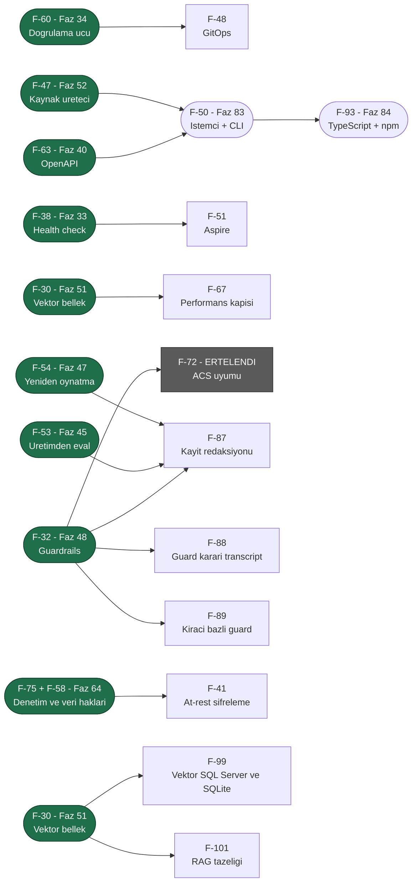

# ADAYLAR.md — Üçüncü Tur Aday Yetenekleri

> **Durum (2026-08-08): FAZ 31–56 PLANLANDI; KALAN 15 KALEM SEÇİLMEDİ.**
> İkinci tur (Faz 8–30) [Faz 30](arsiv/fazlar/30-ARAYUZ-CILASI.md) ile kapandı. Dalga 1, 2
> ve 3'ün toplam **yirmi altı** kalemi [Faz 31–52](arsiv/UCUNCU-FAZ-YOL-HARITASI.md)
> olarak plana dönüştü ve bölümleri **bu dosyadan silindi**. Kalan kalemler
> için seçim yapılmadan faz dokümanı yazılmaz.
>
> 🚨 **2026-08-08 denetimi dört kalemi daha plana çevirdi ve birini kapattı:**
> F-56 → [Faz 53](arsiv/fazlar/53-KIRACI-API-ANAHTARLARI.md), F-36 →
> [Faz 54](arsiv/fazlar/54-OKSUZ-CALISTIRMA-UZLASTIRMASI.md), F-69 →
> [Faz 55](arsiv/fazlar/55-ASENKRON-ONAY-KUTUSU.md), F-74 →
> [Faz 56](arsiv/fazlar/56-KANARYA-YAYINI-VE-OTOMATIK-GERI-ALMA.md). **F-76 faza dönüşmedi;
> bir kusur olarak düzeltildi** (K-352). Aynı denetim numarasız kalan on üç işi
> **F-90…F-102** olarak listeye aldı.
>
> 🚨 **F-72 (ACS uyumu) Dalga 3'e seçildi ama ölçüm sonucu ERTELENDİ** ve bu
> listede kaldı. Bölümü artık **ölçülmüş kanıt** taşıyor; sonraki oturum
> ölçümü tekrarlamak zorunda değildir.
>
> 🚨 **2026-08-10: manuel kabul testi senaryo yazımının düşürdüğü notların
> taranması F-103–F-105'i ekledi** (`docs/manuel-test/00-INDEKS.md` §8).
> Aynı tarama sırasında bulunan gerçek kusurlar (kiracı yalıtımı, `--no-build`
> paketleme, SSE hata çerçevesi vb.) doğrudan kodlandı — burada yalnız var
> olmayan bir **yetenek** gerektiren adaylar durur.
>
> 🚨 **2026-08-14: Ortak kuyruk manuel kabul testi kapanışı F-106'yı ekledi**
> (`HATA-K-003`/K-401) — Magentic round-limit sonrası zarif durdurma, MAF'ın
> kapalı-kutu orkestrasyon durumuna bağımlı bir yetenek adayıdır. Aynı
> koşumda bulunan diğer sekiz kusur (`HATA-K-001`..`008`) doğrudan kodlandı.
>
> 🚨 **2026-08-15: Manuel kabul testi kapanışı (KAPANIS-PLANI §5 Karar 4)
> F-107'yi ekledi** (`HATA-S2-010`/`MT-RES-005`) — bir `WorkflowRunner`
> çalıştırmasının gerçekten iptal edilip edilemediği MAF'ın kendi
> `AgentWorkflowBuilder.BuildSequential` grafiğinin iç iptal davranışına
> bağımlı bir yetenek adayıdır. Kullanıcı kararıyla, yetenek isteyen diğer
> tüm bulgular doğrudan kodlandı; yalnız bu istisna faza döndü.
>
> 🚨 **2026-08-18: Kullanıcı sorusu F-108'i ekledi ve aynı gün F-64 ile birlikte
> plana dönüştü** → [Faz 61](arsiv/fazlar/61-ISTEMCI-TOOLLARI-VE-GOMULEBILIR-SOHBET.md).
> İkisinin bölümü bu dosyadan **silindi**. Planlama sırasında yapılan ölçüm iki
> iddiayı düzeltti: (1) MAF'ın OpenAI uyumlu girdi dönüşümü
> `function_call_output` öğesini **reddediyor** — o yüzey sonuç kanalı olamaz;
> (2) **CORS kodda hiç yok**, bu F-64'ün gerçek ön koşuludur ve aday bölümü
> bunu yazmamıştı. Ayrıca `AIFunction.AsDeclarationOnly()` ile bildirim-yalnız
> tool'un modele gidip **sunucuda çalışmadığı** davranış probuyla kanıtlandı.
>
> 🚨 **2026-08-18 (ikinci tur): beş faz daha planlandı, üç kalem kapandı.**
> F-44+F-59 → [Faz 62](arsiv/fazlar/62-MODEL-YEDEK-ZINCIRI-VE-ON-UCUS-DENETIMI.md) ·
> F-61 → [Faz 63](arsiv/fazlar/63-ARGUMAN-DUZEYINDE-ONAY-POLITIKASI.md) ·
> F-75+F-58 → [Faz 64](arsiv/fazlar/64-DENETIM-ZINCIRI-VE-VERI-KONUSU-HAKLARI.md) ·
> F-40 → [Faz 65](arsiv/fazlar/65-KIRACI-SAGLAYICI-ANAHTARLARI.md) ·
> F-65 → [Faz 66](arsiv/fazlar/66-GELEN-TETIKLEYICILER.md). Aynı turda **F-100, F-102 ve
> F-103 ölçümle kapandı** — üçü de artık bir aday değildir. Planlama sırasında
> düzeltilen iddialar: `ToolApprovalRule` konumsal **değildir** (ek kurucu
> istemez), `CompiledAgentCache` anahtarı kiracıyı **zaten** taşır (K-380) ve
> `Microsoft.ML.Tokenizers` geçişli olarak var olsa da AgentPrism onu **hiç
> doğrudan çağırmıyor**.
>
> 🚨 **2026-08-20: MAF/Semantic Kernel/`Microsoft.Extensions.AI` ekosistem
> taraması F-45'i doğruladı ve F-134'ü ekledi.** `DistributedCachingChatClient`
> reflection ile ölçüldü — pinlenmiş 10.8.3'te zaten var, sürüm yükseltmesi
> gerekmiyor. Aynı taramanın kod yazmayan üç bulgusu kullanıcıya ayrıca
> bildirildi (aday değildir, burada durmaz): (1) MAF/MEAI/MCP paket
> sürümlerinin rutin güncellenmesi (kusur kanalı), (2) K-053'ün yeniden test
> edilmesi önerisi — `Microsoft.Agents.AI.Harness` artık GA hattında ama
> davranışsal düzelme ölçülmedi (karar kanalı), (3) `docs/hafiza/maf-api.md`
> satır 51'deki MCP OAuth notunun netleştirilmesi — `IdentityAssertionGrantProvider`
> pinlenmiş 2.0.0'da bile var, ama saf `client_credentials` sağlamıyor (belge
> düzeltmesi). Tam koşum kaydı: [`kesif/2026-08-20-maf-ekosistem-taramasi.md`](kesif/2026-08-20-maf-ekosistem-taramasi.md).
>
> Bu belge 2026-08-05 tarihli ilk aday listesinin **yerini alır**. Ayrı bir
> aday listesi dosyası açılmaz; iki yerde tutmak kayma üretir. Eski sürümün
> tarihsel değeri "hangi iddia yanlış çıktı" bilgisidir ve o bilgi aşağıdaki
> [Yeniden Yargı](#yeniden-yargı-2026-08-06) bölümünde durur. Eski metnin
> tamamı git geçmişindedir; arşive kopya alınmadı.
>
> **Okuma notu — bu dosya baştan sona okunmaz.** Seçim yaparken önce
> [Bu Turda Neyin Değiştiği](#bu-turda-neyin-değiştiği), sonra
> [Önerilen Sıralama](#önerilen-sıralama--üç-dalga) okunur. Tek bir kalemin
> ayrıntısı için `grep -n "F-68" docs/ADAYLAR.md` yeterlidir.
> Bir kalem faz dokümanına dönüştürüldüğünde ilgili bölüm buradan **silinir**
> ve faz dokümanına taşınır.

---

## Plana Dönüşenler (2026-08-06)

Aşağıdaki **yirmi altı** kalemin bölümü bu dosyadan **silindi**. Ayrıntı artık
faz dokümanındadır; bu tablo yalnız yönlendirmedir.

### Dalga 1–3 → Faz 31–52 — arşive taşındı (2026-08-21)

Yirmi altı kalemin faz eşlemesi kapanmış bir yönlendirme kaydıdır; faz durumu
[`YOL-HARITASI.md`](YOL-HARITASI.md)'de yaşar. Tablolar:
[`arsiv/PLANA-DONUSEN-ADAYLAR.md`](arsiv/PLANA-DONUSEN-ADAYLAR.md) § *Dalga 1–3 eşleme tabloları*.

### Dalga 6–12 → Faz 61–78 — arşive taşındı (2026-08-21)

Yedi dalganın faz eşlemesi kapanmış bir yönlendirme kaydıdır; faz durumu
[`YOL-HARITASI.md`](YOL-HARITASI.md)'de yaşar (K-413). Tablolar:
[`arsiv/PLANA-DONUSEN-ADAYLAR.md`](arsiv/PLANA-DONUSEN-ADAYLAR.md) § *Dalga 6–12 eşleme tabloları*.

### Preview.1 yayın öncesi → Faz 103 (2026-08-25)

- **F-153** Extension sözleşmelerinin yayın öncesi sertleştirilmesi → [Faz 103](arsiv/fazlar/103-EXTENSION-SOZLESMELERININ-YAYIN-ONCESI-SERTLESTIRILMESI.md) 📋

## Bu Turda Neyin Değiştiği

**2026-08-21 · ikinci tüketici gömme turu.** Dört yeni kalem (**F-140** · **F-141**
· **F-142** · **F-143**) ve **F-34'ün yeniden yargılanması**. Beş tüketici iddiası
ölçümle **yanlışlandı** ve kalemleşmedi. Tur kaydı:
[`kesif/2026-08-21-tuketici-turu-2.md`](kesif/2026-08-21-tuketici-turu-2.md).

Üçüncü turun kendi anlatısı kapanmış kayıttır — tam metin:
[`arsiv/PLANA-DONUSEN-ADAYLAR.md`](arsiv/PLANA-DONUSEN-ADAYLAR.md).

## Değerlendirme Ölçütleri

Dört temel soru korunur:

| Ölçüt | Soru |
|-------|------|
| **Değer** | Bu olmadan AgentPrism'i kim kullanamaz? |
| **Maliyet** | Kaç paket, kaç yeni public tip, kaç migration? |
| **Risk** | Bir tasarım kuralını (K1–K4) zorluyor mu? Bundle bütçesini? |
| **Hazırlık** | MAF veya .NET ekosisteminde hazır mı, sıfırdan mı? |

### Sekiz mercek

Bir fikir yalnız bir mercekten iyi görünüyorsa zayıftır. Her kalemin
**Mercek** satırı destekleyen mercekleri numarayla sayar.

| # | Mercek | Sorusu |
|---|--------|--------|
| 1 | **Benimseme** | İlk agent'a kadar geçen süreyi kısaltır mı? |
| 2 | **Üretim işletimi** | Gece 03:00'te nöbetçi mühendisin işine yarar mı? |
| 3 | **Kurumsal satın alma** | Hangi kurumsal kapıyı açar? |
| 4 | **Performans ve AOT** | Sıcak yolda tahsis üretir mi? AOT duruşunu bozar mı? |
| 5 | **API ergonomisi** | Yanlış kullanım derlemede yakalanır mı? Sonradan eklemek kırıcı mı? |
| 6 | **Ekosistem yerleşimi** | Aspire, OTel, MCP, A2A, DI ile doğal mı oturuyor? |
| 7 | **Ölçme–iyileştirme** | Üretim verisini geliştirmeye geri besler mi? |
| 8 | **Maliyet (FinOps)** | Tüketicinin model faturasını düşürür mü? |

---

## Yeniden Yargı (2026-08-06) — arşive taşındı (2026-08-21)

O turun iptal · yanlışlanan kanıt · yükseltme · birleşme tabloları kapanmış
kayıttır. Tam metin:
[`arsiv/PLANA-DONUSEN-ADAYLAR.md`](arsiv/PLANA-DONUSEN-ADAYLAR.md) § *Yeniden Yargı (2026-08-06)*.

---

## A. Kontrol düzlemi çekirdeği — işletim

> **Bu bölümün her iki kalemi de plana dönüştü (2026-08-08):** F-36 →
> [Faz 54](arsiv/fazlar/54-OKSUZ-CALISTIRMA-UZLASTIRMASI.md), F-69 →
> [Faz 55](arsiv/fazlar/55-ASENKRON-ONAY-KUTUSU.md). Bölümleri buradan silindi.
>
> 🚨 **2026-08-18 turunun üç kalemi de aynı gün plana dönüştü** (F-110, F-114,
> F-115). Aşağıdaki satırlar yalnız **iz**dir; gövdeler arşivdedir.
>
> 🚨 **2026-08-21'de bölüm yeniden açıldı:** aynı tüketicinin ikinci turu
> **F-141**'i doğurdu ([keşif notu](kesif/2026-08-21-tuketici-turu-2.md)).

- **F-110** `pgvector`'ün isteğe bağlı olması → [Faz 67](arsiv/fazlar/67-ISTEGE-BAGLI-MIGRATION-SETI.md) 📋 · gövdesi: [`arsiv/PLANA-DONUSEN-ADAYLAR.md`](arsiv/PLANA-DONUSEN-ADAYLAR.md)
- **F-114** Tool yürütme timeout'u → [Faz 69](arsiv/fazlar/69-TOOL-YETKILENDIRMESI-VE-TIMEOUT.md) 📋 · gövdesi: [`arsiv/PLANA-DONUSEN-ADAYLAR.md`](arsiv/PLANA-DONUSEN-ADAYLAR.md)
- **F-115** Çalıştırma olayı hedefi ve `ReasoningDelta` → [Faz 70](arsiv/fazlar/70-CALISTIRMA-OLAYI-HEDEFI.md) 📋 · gövdesi: [`arsiv/PLANA-DONUSEN-ADAYLAR.md`](arsiv/PLANA-DONUSEN-ADAYLAR.md)

- **F-141** Kesilen işin devamı — agent turu ve workflow düğümü için tek sözleşme → [Faz 87](arsiv/fazlar/87-KESILEN-ISIN-DEVAMI.md) 📋 (2026-08-21)

### F-148 · `AppendEventAsync`'in yinelenen-`Sequence` reddi bellek içi ve dosya tabanlı store'larda doğrusal tarama yapıyor

> Faz 98'in bağımsız denetim koşumundan (2026-08-24). `InMemoryRunStore.AppendEventAsync`
> ve örnek `JsonFileRunStore.AppendEventAsync`, yeni bir olay eklemeden önce
> aynı `run`'ın olay günlüğünü `foreach` ile baştan sona tarayarak yinelenen
> `Sequence` arıyor (`InMemoryRunStore.cs`, `FileRunStore.cs`) — O(n). Üç SQL
> sağlayıcısı bunu birincil anahtar ihlaliyle O(log n)/O(1) yapıyor.

**Sorun:** Çok uzun ömürlü bir `run` (binlerce olay biriktiren bir workflow gibi)
bellek içi store'da her `AppendEventAsync` çağrısında gitgide yavaşlayan bir
doğrusal tarama yapar.
**Kapsam:** Ölçüm önce — kaç olaylık bir `run`'da fark edilir hâle geliyor.
Gerekirse `HashSet<long>` tabanlı bir ikincil indeks eklenir.
**Değer:** Ölçülmedi; bellek içi store zaten üretim ölçeği için tasarlanmadı
(dokümanı bunu açıkça söylüyor), örnek store bir öğretim materyali. Gerçek bir
performans sorunu olduğu kanıtlanmadan öncelik verilmez.
**Mercek:** A (çekirdek çalıştırma yolu).

### F-150 · `JobWorkerBackgroundService` kapanışta dispose edilmiş `SemaphoreSlim`'i serbest bırakıyor — süreç çöküyor — ✅ KAPATILDI (2026-08-25)

**Nereden geldi:** Faz 99 kapanış kapısının izole koşumu (2026-08-25).
**Temel commit'te doğrulandı** (`c4e3189`, `git worktree` ile) — Faz 99'un ürünü
DEĞİL, mevcut bir kusurdur.

**Kapanış:** Worker uçuştaki her işi başlatmadan önce kaydeder; `ExecuteAsync`,
slot `SemaphoreSlim`'ini dispose etmeden önce bu görevlerin tamamlanmasını
bekler. `JobWorkerBackgroundServiceTests` `StopAsync`'in iş slotu bırakılmadan
dönmediğini doğrudan kanıtlar. Ateşle-unut çağrılarının sınıf taramasında kalan
iki yol (`McpOAuthAuthorizationCoordinator`, lease renewal) sahiplenilen slot
taşımıyor veya kendi iptal/gözlem yoluna sahip; aynı kusur sınıfı bulunmadı.

> `JobWorkerBackgroundService.ExecuteAsync` semaforu `using var slots = new
> SemaphoreSlim(...)` ile sahiplenir (`JobWorkerBackgroundService.cs:62`), ama
> işleri **ateşle-unut** başlatır: `_ = RunJobAsync(job, slots, stoppingToken)`
> (satır 129). `RunJobAsync`'in `finally` bloğu `slots.Release()` çağırır
> (satır 148). Host, uçuştaki bir iş varken kapanırsa `ExecuteAsync` döner,
> `using` semaforu dispose eder ve gecikmiş `Release()`
> `ObjectDisposedException` atar.

**Belirti:** Görev `await` edilmediği için exception gözlemlenmez ve
**işlenmemiş** olur — .NET süreci sonlandırır. Ölçülen: tek bir testi izole
koşmak (`AgentPrism.AspNetCore.FunctionalTests --filter-method
"*Timed_out_call_completes*"`) test host'unu **exit 134 (SIGABRT)** ile
çökertir; aynı çökme `c4e3189` üzerinde birebir tekrarlanır.

**Neden bugüne kadar görünmedi:** Tam çözüm koşumunda süit uzun sürer ve host
kapanışı uçuştaki işle çakışmaz; çökme yalnız hızlı kapanışta (tek test
filtresi) ortaya çıkar. Üretimde karşılığı **hızlı yeniden başlatma** veya
`SIGTERM` sonrası kısa drain penceresidir.

**Kapsam:** Yalnız bu vakayı kapatmak yetmez, **sınıf taraması** ister: bu bir
"ateşle-unut görev, sahiplenilen kaynağı kapsam dışında serbest bırakıyor"
kusur sınıfıdır. `grep -rn "_ = [A-Za-z]*Async(" src/` ile taranmalı; her
bulunan yerde (a) görevin izlenip kapanışta beklenip beklenmediği, (b)
yakaladığı kaynağın ömrü sorgulanmalı. Olası düzeltme: uçuştaki görevleri bir
listede tut ve `ExecuteAsync` dönmeden önce `Task.WhenAll` ile bekle; ya da
semaforu `using` yerine servis ömrüne bağla.

**Değer:** Yüksek — işlenmemiş exception süreci öldürür ve bu, gözlemlenebilirlik
değil **kullanılabilirlik** sorunudur. Ayrıca `AgentPrism.Core`
`AgentPrismDrainService` ile zarif kapanış vaat eder; bu kusur o vaadi deler.

**Mercek:** A (çekirdek çalıştırma yolu).

## B. Model yüzeyi ve yönlendirme

> **2026-08-25: bölüm F-149 ile yeniden açıldı** (Faz 99 planlamasının
> ölçümünden). F-45 ve F-134 birlikte
> [Faz 81](arsiv/fazlar/81-YANIT-ONBELLEGI-VE-ESZAMANLI-TOOL.md)'e dönüştü — Dalga 13 Küme B.
> Aşağıdaki iz satırlarının gövdeleri arşivdedir.

- **F-45** Yanıt önbelleği → [Faz 81](arsiv/fazlar/81-YANIT-ONBELLEGI-VE-ESZAMANLI-TOOL.md) 📋 · gövdesi: [`arsiv/PLANA-DONUSEN-ADAYLAR.md`](arsiv/PLANA-DONUSEN-ADAYLAR.md)
- **F-134** Eşzamanlı tool çağrısını açığa çıkar → [Faz 81](arsiv/fazlar/81-YANIT-ONBELLEGI-VE-ESZAMANLI-TOOL.md) 📋 · gövdesi: [`arsiv/PLANA-DONUSEN-ADAYLAR.md`](arsiv/PLANA-DONUSEN-ADAYLAR.md)
- **F-112** Cache ve reasoning token kırılımı → [Faz 68](arsiv/fazlar/68-CALISTIRMA-KIMLIGI-VE-TOKEN-KIRILIMI.md) 📋 · gövdesi: [`arsiv/PLANA-DONUSEN-ADAYLAR.md`](arsiv/PLANA-DONUSEN-ADAYLAR.md)

### F-149 · Sağlayıcı hata sınıflandırması exception tip ADI ve mesaj METNİ üzerinden yapılıyor

**Nereden geldi:** Faz 99 planlamasının kanıt doğrulaması (2026-08-25).

> `FallbackRetryClassifier.IsRetryable` ve `DefaultRunErrorClassifier` bir
> sağlayıcı hatasının yeniden denenebilir olup olmadığına, exception'ın tip
> **adına** ve mesaj **metnine** `Regex` uygulayarak karar veriyor
> (`FallbackChatClient.cs:436-458`: `\bHTTP\s+40[13]\b`, `\b429\b`,
> `httprequestexception|socketexception|...`). Gerekçe geçerlidir ve kayıtlıdır:
> `AgentPrism.Core` sağlayıcı SDK'larının exception tiplerine derleme-zamanı
> referans vermez, bu yüzden tipli `catch` yazılamaz.

**Sorun:** Sonuç kırılgandır ve **sözleşme yüzeyinde görünmez**. Üçüncü taraf bir
sağlayıcının hata mesajı `HTTP 429` metnini taşımıyorsa fallback zinciri sessizce
tetiklenmez; sağlayıcı yazarı bunu ancak Faz 99'un belgelediği listeden öğrenir.
Aynı biçimde, bir SDK'nın mesaj metnini değiştirmesi AgentPrism'in
sınıflandırmasını haber vermeden bozar.

**Kapsam:** Metin eşlemeyi yapısal bir sözleşmeyle değiştir. Değerlendirilecek
seçenekler:
- `IProviderFailureClassifier` — kayıtlı, tüketicinin `TryAdd*` ile değiştirebildiği
  bir sınıflandırıcı. Metin eşleme varsayılan implementasyon olarak kalır.
- Sağlayıcı düzeyinde sınıflandırma kancası — `IModelProvider`'a **opsiyonel ikinci
  arayüz** (`IModelProviderHealthCheck` deseninin tekrarı: uygulamamak hata değil).
  Sağlayıcı kendi SDK'sının tiplerini bildiği için tipli `catch` yazabilir.
- AgentPrism'e ait tipli sağlayıcı hatası soyutlaması — sağlayıcı ham exception'ı
  sarmalar. En temiz sözleşme, ama dört sağlayıcı paketini de değiştirir.

**Değer:** Ölçülmedi. Bugün dört yerleşik sağlayıcının mesaj biçimleri Faz 62'de
gerçek SDK'lara karşı ölçüldü ve eşleşiyor; sorun **üçüncü taraf** yüzeyinde ve
SDK sürüm yükseltmelerinde ortaya çıkar.

**Zamanlama:** 🚨 `1.0` API dondurmasından **önce** karara bağlanmalıdır. Üç
seçenekten ikisi public yüzey ekler; sonradan eklemek kırıcıdır.

**Mercek:** B (model yüzeyi ve yönlendirme).

### F-146 · Sürüm-sabitli MAF imza kayıtları damıtmada düşüyor

**Nereden geldi:** Faz 90 bağımsız denetimi, 🟢 bulgu 9.

**Kanıt:** `_DUS_DESENLERI[0]` (`^(Doğrulanmış|Kullanılan).*\b(API|İmza)`) yedi
fazın reflection ile doğrulanmış MAF imza bölümünü düşürüyor — ör. Faz 13'ün
"MAF 1.16.0 — ikinci kez doğrulandı" bölümü. Koddaki gerekçe "`maf-api-kesfi`
yeniden üretir"; bu **bugünkü** MAF sürümü için doğru, **sabitlenmiş eski bir
sürümün** imzası için değil. O sürüm artık kurulu değilse imza geri getirilemez.

**Neden şimdi değil:** Tam metin git geçmişinde ve `tam_metin_denetle()` bunu
her koşumda kanıtlıyor — kayıp değil, bir tık daha uzakta. Politika bilinçli ve
koda gerekçesiyle yazılı.

**İş:** `_DUS_DESENLERI`'ne sürüm numarası içeren başlıklar için istisna
(`MAF 1.16.0` gibi bir sürüm damgası taşıyan bölüm KALIR), ya da o bölümlerin
`docs/hafiza/maf-api.md`'ye sürüm damgasıyla taşınması. Ölçüm: 7 faz.

---

### F-147 · `runColumns`'daki ağaç maliyet sütunları `TreeSum` ile ifade edilebilir

**Nereden geldi:** Faz 94 bağımsız denetimi, 🟢 bulgu 2.

**Kanıt:** `SqlQueriesBase.TreeSum(column, alias, coalesceToZero)` Faz 94'te
token ağaç toplamları için eklendi (94.4.2). Üç dialektin `runColumns`
listesindeki ağaç MALİYET sütunları (`tree.cost_input`, `tree.cost_output`,
`tree.cost_cached_input` — `SUM(sub.input_cost)` vb.) metinsel olarak
`TreeSum(column, alias, false)`'ın ürettiğiyle BİREBİR aynı, ama elle yazılı
kaldı; 94.4.2'nin kapsamı yalnız token sütunlarıydı.

**Neden şimdi değil:** Kusur değil, bir tutarlılık iyileştirmesi — bugünkü
metin doğru ve `SqlTextSnapshotTests` onu koruyor. Dokunmak üç dialektin
`runColumns` metnini yeniden üretip 94.6 anlık görüntü kapısına karşı
doğrulamak ister; ayrı, dar kapsamlı bir iş.

**İş:** `runColumns`'daki 3 ağaç maliyet sütununu (üç dialektte de) `{TreeSum("input_cost", "sub", false)}` gibi çağrılara çevir; `SqlTextSnapshotTests` sıfır fark vermeli. Ölçüm: 3 sütun × 3 dialekt = 9 yer.

---

### F-151 · Uygulanmış iki PostgreSQL migration dosyası sonradan düzenlendi — mevcut kurulumlar yükseltmede BAŞLAMAZ — ✅ KAPATILDI (2026-08-25)

**Nereden geldi:** Faz 99 kapanışının örnek uygulama koşumu (2026-08-25).
Yerel geliştirme veritabanı `AgentPrismException` ile açılışı durdurdu.

**Kapanış:** `0032_tenant_provider_bindings.sql` ve `0037_run_continuation.sql`
ilk uygulanmış baytlarına döndü. `scripts/kapi.py tarama`,
`scripts/applied-migrations.json` içindeki Git kaynak commit'lerinden baytları
okuyarak bütünlüğü doğrular; manifestte checksum değiştirerek migration değişikliği
onaylanamaz. Örnek API gerçek PostgreSQL veritabanıyla yeniden başladı ve
`/health` 200 döndü. `dokuman-bakim.py` arşivleme kodu yalnız Markdown dosyalarını
değiştirir; önceki SQL toplu-onarım kök neden iddiası ölçümle çürütüldü.

> `MigrationRunner` uygulanmış her migration'ın checksum'ını saklar ve dosya
> içeriği değişmişse **açılışı durdurur** — doğru davranıştır, mesajı da
> doğrudur: "An applied migration is never edited; add a new migration file
> for the change."
>
> Ama commit `9c32242` ("döküman düzeni sağlandı", 2026-08-23) tam olarak bunu
> yaptı: `0032_tenant_provider_bindings.sql` ve `0037_run_continuation.sql`
> dosyalarındaki **yorum satırlarında** doküman yolunu güncelledi
> (`docs/65-...md` → `docs/arsiv/fazlar/65-...md`). SQL'in kendisi değişmedi;
> checksum değişti.

**Etki:** Bu iki migration'ı `9c32242` ÖNCESİNDE uygulamış **her** kurulum,
yeni sürüme yükseltince açılışta çöker. Yerel geliştirme veritabanında
ölçüldü — `samples/AgentPrism.Api` başlamıyor:
`Checksum in the database: 9116FE1E...`, `checksum of the file: 16D3AB60...`.
Bu bir geliştirme rahatsızlığı değil, **sevk edilmiş bir kırılmadır**.

**Başlangıçtaki kök neden varsayımı yanlıştı:** Ölçüm, Faz 90 arşivleme yolunun
yalnız `*.md` dosyalarına dokunduğunu gösterdi. `9c32242` değişikliği başka bir
toplu düzenleme ile geldi. Yeni kapı aracı değil baytı korur; bu nedenle aynı
etki hangi düzenleme yolundan gelirse gelsin kırmızıya döner.

**Uygulanan kapsam:**
1. İki dosyanın **baytları geri alındı** (`git show f261cda:<yol>` ve
   `git show 8cf727a:<yol>`). Uygulanmış migration değişmez; içindeki bayat
   doküman bağlantısı checksum'dan daha ucuz bir sorundur.
2. Arşivleme kodunda SQL hariç tutma yapılmadı; ölçülen kök neden o kod değildir.
3. **Kapı eklendi:** uygulanmış migration, değiştirilemeyen Git kaynak baytıyla
   eşleşmezse `kapi.py tarama` kırmızı döner. Bu yol mevcut veritabanına gerek
   duymaz.

**Değer:** Yüksek ve acil — `preview.1` öncesi kapanmalıdır. Aksi hâlde ilk
yükseltme yapan tüketici açılışta çöker ve mesaj onu "yeni migration ekle"
diye yanlış yöne gönderir; sorun onun eklediği bir şey değildir.

**Mercek:** C (güvenlik, yönetişim ve uyum — veri düzlemi bütünlüğü).

## C. Güvenlik, yönetişim ve uyum

### F-72 · Agent Control Specification (ACS) uyumu — ERTELENDİ (2026-08-06). Gövde: [`arsiv/PLANA-DONUSEN-ADAYLAR.md`](arsiv/PLANA-DONUSEN-ADAYLAR.md).

### F-76 · Paylaşılan SQL kaynağının XML doküman çakışması — KAPATILDI (2026-08-08, K-276). Gövde: [`arsiv/PLANA-DONUSEN-ADAYLAR.md`](arsiv/PLANA-DONUSEN-ADAYLAR.md).

- **F-41** İçerik şifreleme (at-rest) → [Faz 82](arsiv/fazlar/82-ICERIK-KORUMASI.md) 📋 · gövdesi: [`arsiv/PLANA-DONUSEN-ADAYLAR.md`](arsiv/PLANA-DONUSEN-ADAYLAR.md)

### F-143 · Tool çıktısı için boyut sınırı → [Faz 89](arsiv/fazlar/89-TOOL-CIKTISI-BOYUT-SINIRI.md) 📋 (2026-08-21). Gövde plana taşındı.

### F-104 · Örnek uygulama rol politikaları — ✅ KAPATILDI (2026-08-18, K-431). Gövde: [`arsiv/PLANA-DONUSEN-ADAYLAR.md`](arsiv/PLANA-DONUSEN-ADAYLAR.md).

### F-105 · Dosya belleği kiracı-içi sınırı — ✅ KAPATILDI (2026-08-18, K-434). Gövde: [`arsiv/PLANA-DONUSEN-ADAYLAR.md`](arsiv/PLANA-DONUSEN-ADAYLAR.md).

### F-106 · Magentic orkestrasyonu round-limit'e ulaştıktan sonra zarif durmuyor — `WorkflowRunner` bunu önceden kestiremiyor

> 🚨 **Durum (2026-08-18): AZALTILDI, DOĞRULANMADI — kalem AÇIK kalır.**
> Pompa artık akışı yeniden açmadan önce MAF'ın kendi durumunu soruyor
> (`run.GetStatusAsync()`, **K-433**), yani bildirilen `RunFailed` yolunun sebebi
> kapatıldı. Ama düşen bir test **yoktur**: sahte katılımcılarla iki repro denendi
> (`MaxIterations` 1 ve 2, tek ve çift onay turu) ve ikisi de düzeltme kapalıyken
> **geçti**. Test tiyatrosu bırakmamak için o dosya silindi. Kapı manuel kabul
> case'idir (gerçek model + `requirePlanApproval`).

**Sorun:** `HATA-K-003` (manuel kabul testi, K-401) bir Magentic +
`requirePlanApproval` iş akışında `maxIterations` plan+onay-sonrası-devam+
katılımcı döngüsü için yetersiz kalınca şunu ölçtü: MAF'ın Magentic
orkestratörü round-limit'e ulaşıp kendi `WorkflowOutput`'unu ("Task
execution stopped due to hitting the maximum round count limit.")
ürettikten SONRA, `WorkflowRunner`'ın süper-adım pompası orkestratörü BİR
KEZ DAHA çağırıyor — MAF bunu "orkestrasyon zaten sonlandı" istisnasıyla
reddediyor, çalıştırma `RunFailed` ile bitiyor. K-401 bu istisnanın
mesajını ANLAMLI hale getirdi (artık gerçek nedeni gösteriyor) ama
çalıştırmanın KENDİSİ hâlâ hatayla bitiyor — plan aslında MAF'ın kendi
tanımına göre "tamamlandı" (round-limit'e vararak durdu) sayılabilecekken,
AgentPrism bunu temiz bir `Completed` yerine bir `RunFailed` olarak
kaydediyor.
**Kapsam:** `WorkflowRunner`'ın MAF'tan gelen `WorkflowOutputEvent`'i
(round-limit metnini taşıyan) GÖRDÜKTEN sonra, aynı orkestratöre yönelik
sonraki bir süper-adım çağrısının "zaten sonlandı" istisnasıyla
başarısız olacağını ÖNCEDEN bilip akışı orada temiz bir `Completed`
olarak kapatması gerekir — bugünkü kod bu iki olayı (round-limit çıktısı
ile sonraki başarısız çağrı) ilişkilendirmiyor, MAF'ın ne üreteceğini
sırayla pompalayıp olduğu gibi yansıtıyor.
**Değer:** `requirePlanApproval: true` + Magentic KULLANAN her tüketici,
`maxIterations`'ı plan+onay-sonrası-devam+katılımcı döngüsü için yeterince
yüksek tutmazsa aynı "opak olmayan ama yine de yanlış" `RunFailed`'i
görür — ergonomik bir kusur, veri kaybı riski taşımaz (K-401 sonrası
mesaj zaten doğru nedeni söylüyor).
**Mercek:** 16 (Workflow yürütme).
**Hazırlık:** Yok — MAF'ın Magentic durum makinesinin "sonlandı mı"
sorusuna yanıt veren herkese açık bir API'si var mı, `maf-api-kesfi`
skill'iyle doğrulanmalı.
**Maliyet:** Orta. `WorkflowRunner`'ın süper-adım pompasına "önceki
adımda round-limit çıktısı görüldüyse sonraki çağrıyı deneme, doğrudan
`Completed`'e geç" mantığı eklenmesi gerekir — MAF'ın kapalı-kutu
orkestrasyon durumuna bağımlı olabilir.
**Risk:** Yanlış sezilen bir "zaten sonlandı" durumu, GERÇEKTEN başarısız
olması gereken bir çalıştırmayı sessizce `Completed` gösterebilir —
round-limit metninin TAM eşleşmesi yerine MAF'ın kendi tip/durum
bilgisine dayanmalı, metin eşleştirme kırılgandır.
**Bağımlılık:** K-401 (mesaj netleştirmesi) zaten main'de.
**Ekosistem:** —

---

### F-144 · Yanıt önbelleği isabetinin `chat` span'i ÜRETMEDİĞİNİ doğrudan bir `ActivityListener` ile kanıtlayan test yok

> Faz 81 bağımsız denetiminin 🟢 bulgusu (2026-08-22). Halka sırası
> (`FunctionInvokingChatClient` → önbellek halkası → `UseOpenTelemetry`)
> bugün doğrudur ve dolaylı olarak kanıtlanır (`FakeModelProvider.Requests`
> ikinci çağrıda büyümüyor → gerçek ağa hiç çıkılmadı). Ama halkanın sırası
> yanlışlıkla değişirse (ör. önbellek `UseOpenTelemetry`'nin İÇİNE alınırsa)
> bunu doğrudan yakalayan bir test yoktur — yalnız dolaylı sonuç (isabet
> gerçek çağrı yapmıyor) test edilir, span'in kendisi değil.

**Sorun:** `ModelProviderRegistry.BuildPipeline`'ın önbellek halkasını
`UseOpenTelemetry`'nin dışına (tool döngüsünün içine) yerleştirme kararı
(K-552) yalnız dolaylı olarak test edilir: bir isabetin gerçek ağa
çıkmadığını `FakeModelProvider.Requests.Count`'un artmamasından çıkarırız.
Halka sırası bir gün yanlışlıkla değişirse (ör. `UseOpenTelemetry` önbelleğin
İÇİNE alınırsa) bu dolaylı test hâlâ GEÇER — ama isabet artık kendi `chat`
span'ini üretiyor olurdu ve hiçbir test bunu yakalamaz.
**Kapsam:** Bir `ActivityListener` kaydeden bir birim/fonksiyonel test:
`AgentPrismDiagnostics.ActivitySourceName` kaynağından gelen `chat` adlı
span'leri sayar; ilk (ıska) çağrıda bir tane, ikinci (isabet) çağrıda SIFIR
span üretildiğini doğrudan doğrular.
**Değer:** Halka sırası regresyonunu (maliyet/token muhasebesi sessizce
bozulur) doğrudan yakalayan tek test bu olurdu; bugünkü dolaylı kanıt aynı
regresyonu KAÇIRABİLİR eğer birisi "gerçek ağa çıkmadı" iddiasını başka bir
yoldan (ör. sahte istemciyi önbellek FARKINDA olacak şekilde değiştirerek)
sağlarsa.
**Mercek:** 81 (Model boru hattı / gözlemlenebilirlik).
**Hazırlık:** Yok — `System.Diagnostics.ActivityListener` .NET'in kendi
API'sidir, yeni bağımlılık istemez.
**Maliyet:** Düşük. Tek bir test dosyası, mevcut `ResponseCachePipelineTests`
kurulumunu yeniden kullanır.
**Risk:** Yok — salt gözlemsel bir test eklemek.
**Bağımlılık:** Yok.
**Ekosistem:** —

---

### F-145 · Yanlış token'ın konsolda "reddedildi" olarak gösterildiğini kanıtlayan uçtan uca test yok

> Faz 84'ün manuel kabul case'i `MT-TSC-005`'in otomasyon boşluğu (2026-08-22).
> `Shell_opens_and_asks_for_token_when_required` (E2E) DOĞRU token'ın kabul
> edildiği yolu kanıtlıyor; `auth.test.ts` (4 birim testi) `rejectToken`/
> `setToken` durum geçişlerini kanıtlıyor. Ama canlı bir `401` yanıtından
> `AgentPrismClientOptions.onUnauthorized` çağrısına, oradan `access-gate.tsx`'in
> "reddedildi" mesajını gösterdiği ekrana kadar olan uçtan uca teli kanıtlayan
> hiçbir test yok — yalnız elle koşularak doğrulanabilir.

**Sorun:** `src/AgentPrism.UI/frontend/src/lib/api.ts`'teki `client`'ın
middleware'i bir 401 yanıtında `options.onUnauthorized?.()` çağırır
(`rejectToken`'a bağlı), sonra `access-gate.tsx` `rejected` durumuna göre
`TokenPrompt failed={true}` gösterir. Zincirin HİÇBİR halkası şu an canlı bir
HTTP round-trip'le uçtan uca test edilmiyor.
**Kapsam:** `UiTests.cs`'e bir E2E senaryosu: yanlış token'la giriş yapılır,
herhangi bir veri isteyen ekran açılır, `401` alınır, `access.token.rejected`
metninin (veya karşılığı ARIA rolünün) göründüğü doğrulanır.
**Değer:** `onUnauthorized` bağlantısı kopsa (ör. bir refactor sırasında
middleware'den silinse) bugün hiçbir kapı bunu yakalamaz — kullanıcı yanlış
token girdiğinde sonsuz "yükleniyor" ekranında kalabilir, hiç kimse fark
etmeden.
**Mercek:** 84 (TypeScript istemcisi ve npm kanalı — `access-gate.tsx`'in göç
ettiği faz).
**Hazırlık:** Yok — `UiTests.cs`'in kendi `UiHost.StartAsync(authToken: ...)`
kurulumu zaten var, `Shell_opens_and_asks_for_token_when_required`'ın aynı
deseni.
**Maliyet:** Düşük — mevcut token testinin bir varyasyonu.
**Risk:** Yok — salt gözlemsel bir test eklemek.
**Bağımlılık:** Yok.
**Ekosistem:** —

---

### F-107 · Workflow iptali — ✅ KAPATILDI (2026-08-18). Gövde: [`arsiv/PLANA-DONUSEN-ADAYLAR.md`](arsiv/PLANA-DONUSEN-ADAYLAR.md).

## D. Yetenek derinliği

### F-34 · Talimatın girdi yüzeyi: parametre şeması ve belge kanalı → [Faz 86](arsiv/fazlar/86-TALIMATIN-GIRDI-YUZEYI.md) 📋 (2026-08-21). Gövde plana taşındı.

### F-142 · Görsel üretim tool'u → [Faz 88](arsiv/fazlar/88-GORSEL-URETIM-TOOLU.md) 📋 (2026-08-21). Gövde plana taşındı. 🚨 Planlama turu paket sorusunu **ölçtü**: yeni NuGet paketi gerekmiyor.

### F-109 · İstemci tarafı tool taşıyan bir `run` sadık biçimde replay edilemez

> Faz 61'in bağımsız denetiminde bulundu (2026-08-18, 🟢 bulgu).

**Sorun:** `RunReplayService`'in `toolTransform`'u yalnız `AIFunction`'lara
uygulanıyor (`AgentDefinitionCompiler.ResolveTools`'taki `is AIFunction`
süzgeci — Faz 61, K-435). İstemci tarafı bir tool (`AddClientTool`) çağrısı
taşıyan bir `run`'ı replay etmeye çalışmak, sunucunun hiçbir zaman
çalıştıramayacağı bir çağrıda takılı kalır.
**Kapsam:** Replay'in istemci tool çağrılarını nasıl ele alacağına karar
vermek — kayıtlı sonucu aynen tekrar mı oynatır, yoksa bu tür `run`'ları
baştan mı reddeder.
**Değer:** Faz 61'den sonra kayıtlı her `run`'ın replay edilebilir
olduğu varsayımı artık **tam doğru değil**; istemci tool'u kullanan
agent'lar için bu görünür bir boşluktur.
**Mercek:** 47 (yeniden oynatma).
**Hazırlık:** Faz 47'nin `ReplayToolMode`'u okunmalı.
**Maliyet:** Küçük–orta.
**Risk:** Düşük — replay isteğe bağlı bir araçtır, çekirdek çalıştırma yolunu etkilemez.
**Bağımlılık:** Faz 61 (K-435).
**Ekosistem:** —

---

- **F-116** Workflow kod düğümü → [Faz 71](arsiv/fazlar/71-WORKFLOW-KOD-DUGUMU.md) 📋 · gövdesi: [`arsiv/PLANA-DONUSEN-ADAYLAR.md`](arsiv/PLANA-DONUSEN-ADAYLAR.md)
- **F-117** Talimatta çok dillilik → [Faz 72](arsiv/fazlar/72-COK-DILLI-TALIMAT-VE-ZAMAN-DAMGALI-SENTEZ.md) 📋 · gövdesi: [`arsiv/PLANA-DONUSEN-ADAYLAR.md`](arsiv/PLANA-DONUSEN-ADAYLAR.md)
- **F-118** Zaman damgalı konuşma sentezi → [Faz 72](arsiv/fazlar/72-COK-DILLI-TALIMAT-VE-ZAMAN-DAMGALI-SENTEZ.md) 📋 · gövdesi: [`arsiv/PLANA-DONUSEN-ADAYLAR.md`](arsiv/PLANA-DONUSEN-ADAYLAR.md)

## E. Ölçme–iyileştirme döngüsü

Bu grup birlikte "agent'ı ölçerek iyileştirme" döngüsünü kurar. Bugün döngü
**tek yönlüdür**: üretim veri üretir, hiçbiri geri beslenmez.

> **Döngünün beş halkası plana dönüştü:** F-52 geri bildirim
> ([Faz 31](arsiv/fazlar/31-GERI-BILDIRIM-VE-PUANLAMA.md)), F-55 hata sınıflandırma
> ([Faz 44](arsiv/fazlar/44-HATA-SINIFLANDIRMA.md)), F-53 üretimden eval kümesi
> ([Faz 45](arsiv/fazlar/45-URETIMDEN-EVAL-KUMESI.md)), F-54+F-66 yeniden oynatma
> ([Faz 47](arsiv/fazlar/47-YENIDEN-OYNATMA-VE-DALLANDIRMA.md)) ve F-71 çevrimiçi
> değerlendirme ([Faz 49](arsiv/fazlar/49-CEVRIMICI-DEGERLENDIRME.md)).
> 🚨 **Döngü kapandı (2026-08-08):** son halka F-74 da plana dönüştü →
> [Faz 56](arsiv/fazlar/56-KANARYA-YAYINI-VE-OTOMATIK-GERI-ALMA.md). Bu bölümde kalem
> kalmadı; bölümü buradan silindi.
>
> 🚨 **2026-08-18:** Döngü *ölçme→iyileştirme* yönünde kapanmıştı ama **kırılım
> boyutu** eksikti — ölçüm kiracıdan ince bir yere inemiyordu. F-111 bunu kapatır
> ve aynı gün [Faz 68](arsiv/fazlar/68-CALISTIRMA-KIMLIGI-VE-TOKEN-KIRILIMI.md)'e dönüştü.
> Bu bölümde **seçilmemiş kalem kalmadı**
> ([keşif notu](kesif/2026-08-18-tuketici-raporu.md)).

- **F-111** Çalıştırma kimliği ve maliyet kırılım boyutları → [Faz 68](arsiv/fazlar/68-CALISTIRMA-KIMLIGI-VE-TOKEN-KIRILIMI.md) 📋 · gövdesi: [`arsiv/PLANA-DONUSEN-ADAYLAR.md`](arsiv/PLANA-DONUSEN-ADAYLAR.md)

## F. Paket ailesi ve geliştirici deneyimi

### F-48 · GitOps: tanım dışa ve içe aktarımı

**Sorun:** Agent tanımı ya koddadır ya veritabanında. Bir ekip tanımlarını
git'te sürümlemek ve dev→prod terfi etmek isterse **yolu yok**.
**Kapsam:** JSON/YAML dışa aktarım, `--dry-run` ile fark gösterimi, içe
aktarımda sürüm geçmişi ve denetim izi korunur (Faz 9 hazır).
**Değer:** Dağıtım hattına girer. Faz 19'un arayüz diff'inden farklı iştir.
**Mercek:** 1, 3.
**Hazırlık:** `agent_definition_versions` ve `audit_log` hazır.
**Maliyet:** Orta.
**Risk:** İçe aktarım **üzerine yazar**. Çakışma çözümü bir karardır.
**Bağımlılık:** F-60 (doğrulama ucu) bunun CI adımıdır;
[Faz 34](arsiv/fazlar/34-TANIM-DOGRULAMA-UCU.md) tamamlandı (2026-08-06) — önkoşul hazır.
**Ekosistem:** Dify ve n8n dışa aktarımı verir. Langfuse prompt'ları API'den
yönetir.

📋 **F-50 PLANA DÖNÜŞTÜ (2026-08-21)** → [Faz 83](arsiv/fazlar/83-TIPLI-ISTEMCI-VE-CLI.md).
Gövde faza taşındı. Planlama sırasında kanıt yeniden ölçüldü ve kaydın kapsam
cümlesi **daraldı**: "tanım dışa/içe aktar (F-48)" işi plana **girmedi**, çünkü
F-48 elenmiş bir adaydır ve karşılığı olan uç yoktur (belgedeki tek `export`
yolu Faz 64'ün veri konusu hakları ucudur). Ayrıntı faz dokümanının "Kapsam
dışı" bölümündedir.

### F-51 · .NET Aspire entegrasyonu

**Sorun:** Aspire kurumsal .NET'in yeni varsayılan besteleme yoludur.
AgentPrism'in Aspire kaynağı yok.
**Kapsam:** PostgreSQL kaynağı, OTel bağlantısı ve panoya bağlantı hazır gelir.
**Değer:** Yerel geliştirme kurulumu tek komuta iner.
**Mercek:** 1, 6.
**Hazırlık:** Faz 6'nın telemetrisi zaten OTel;
`AgentPrismDiagnostics.ActivitySourceName` public.
**Maliyet:** Düşük.
**Risk:** Yeni paket (K-007). Aspire sürüm hızı yüksektir; bakım borcu üretir.
**Bağımlılık:** F-38 (health check) [Faz 33](arsiv/fazlar/33-SAGLIK-DENETIMI-VE-TESHIS.md) olarak
planlandı; o faz önce biterse Aspire panosu doğal çalışır.
**Ekosistem:** .NET'e özgü. Karşılığı Docker Compose'dur.

### F-67 · Performans regresyon kapısı

**Sorun:** Dört doğrulama kapısı **doğruluğu** koruyor; performans
korunmuyor. Depoda `BenchmarkDotNet` projesi yok (slnx'te 14 kaynak + 13 test
projesi var, benchmark yok).
**Kapsam:** BenchmarkDotNet + tahsis eşiği. İlk hedefler: `run_events` yazma
yolu, `AgentDefinitionCompiler` önbelleği ve `SqlAgentFileStore.SearchAsync`
yolu.
🚨 [Faz 51](arsiv/fazlar/51-VEKTOR-BELLEK-VE-RAG.md) o son yolu **düzeltiyor** ve
düzeltmenin "okunan satır sayısı" ölçümünü devir notuna yazıyor. O sayı bu
kalemin **başlangıç eşiğidir**.
**Değer:** Bir kütüphanede sıcak yolun tahsis bütçesi olmalıdır.
**Mercek:** 4.
**Hazırlık:** BenchmarkDotNet hazır.
**Maliyet:** Orta.
**Risk:** Benchmark CI'da gürültülüdür. Eşik geniş tutulmalı veya yalnız elle
koşulmalıdır. Beşinci bir kapı her fazı yavaşlatır — bu bir karardır.
**Bağımlılık:** Yok.
**Ekosistem:** Bu depoya **kültürel olarak uygundur**; dört kapı disiplini
zaten var.

---

## G. Dış tüketici yüzeyi

> **Bu bölümün üç kalemi de plana dönüştü ve bölümleri silindi (2026-08-18):**
> F-64 ve F-108 → [Faz 61](arsiv/fazlar/61-ISTEMCI-TOOLLARI-VE-GOMULEBILIR-SOHBET.md),
> F-65 → [Faz 66](arsiv/fazlar/66-GELEN-TETIKLEYICILER.md).
>
> 🚨 **2026-08-21'de bölüm yeniden açıldı** — **F-140**.

### F-140 · Gömme ekseni: bağlanacak sözleşmeler sevk edilen yüzeyde görünmüyor → [Faz 85](arsiv/fazlar/85-GOMME-EKSENI.md) 📋 (2026-08-21). Gövde plana taşındı.

### F-152 · Yargıç başına checkpoint ve retry

Faz 100, bir `OnlineEval` job'ı yeniden denendiğinde kayıtlı tüm yargıçları
tekrar çalıştırır. `RunScore` upsert'i tekrarları görünür satıra dönüştürmez,
ancak pahalı veya yan etkili üçüncü taraf yargıçlar için yargıç-başına durable
checkpoint gerekir. Önce job item modelinin tek run kimliği sözleşmesini ve SQL
store migration maliyetini ölç; yalnız başarılı yargıçların atlanması doğruysa
ayrı bir kalıcı sonuç modeli tasarla. Kaynak: Faz 100 Açık Soru 3.

### F-154 · Extension ad ve kimlik kurallarını seam'ler arasında standardize et

Faz 103 planlama ölçümü provider, judge, source, tool ve agent adlarının aynı
karakter, uzunluk ve case-sensitivity sözleşmesini kullanmadığını doğruladı.
Bugünkü farklar preview.1 güvenlik veya paketleme kusuru üretmiyor. Bunları Faz
103'e sıkıştırmak mevcut isimleri kırabilir ve bütün registry'leri birlikte
yeniden tasarlamayı gerektirir. 1.0 API freeze öncesi, metric tag olan adlarda
low-cardinality kuralıyla birlikte ölçülmelidir.

### F-155 · Extension seam'leri için ortak exception taxonomy

Faz 103 yalnız doğrulanmış provider raw-message sızıntısını ortak model-pipeline
boundary'sinde kapatır ve kullanılmayan judge exception tipini kaldırır. Storage,
provider, judge, agent source ve tool için tek public exception hierarchy kurmak
preview.1 blocker değildir. F-149'un provider failure classification çalışmasıyla
çakışma ölçülmeden yeni public hata tipleri eklenmemelidir.

### F-156 · Singleton registration disposal ownership modeli

Instance, factory ve generic singleton kayıtlarında DI'ın dispose sahipliği farklı
olabilir. Faz 103 gerekli guide/XML açıklamasını düzeltir; beş seam'i tek public
registration ownership modeline taşımak genel bir API yeniden tasarımıdır. 1.0
öncesi gerçek `ServiceProvider` dispose problarıyla ölçülmelidir.

### F-157 · Definition-source compiler/cache public facade tasarımı

Agent source ile definition compiler/cache sınırındaki yardımcı yüzeyler genel
olarak yeniden tasarlanmayacaktır. Faz 103 yalnız preview.1 blocker olan contract
ve sample kanıtlarını kapatır. Public facade ihtiyacı ayrı tüketici senaryosu ve
cache/BYOK doğruluk ölçümüyle ele alınmalıdır.

### F-158 · Public wrapper/helper yüzeyinin genel küçültülmesi

`AuthorizingAIFunction`, `TimeoutAIFunction` ve `TruncatingAIFunction` bugün Core
ile MCP paketleri arasındaki composition sınırında kullanılır. Faz 103 bu tiplerin
gerçek tüketici beklentisini yeniden sorgular, fakat blocker işi gerektirmiyorsa
genel internalization/refactor yapmaz. 1.0 freeze öncesi package-boundary
alternatifleri ayrıca ölçülmelidir.

### F-159 · Tenant-aware provider/source yük ve performans sözleşmeleri

Faz 103 tenant credential unsupported yolunu fail-closed yapar ve mevcut tenant
yalıtım testlerini korur. Provider credential cache'i ile tenant-aware source için
yük, cache büyümesi ve contention testleri preview.1 doğruluk blocker'ı değildir.
Ölçülebilir eşikler belirlenmeden contract suite'e performans iddiası eklenmemelidir.

### F-160 · NUnit ve MSTest contract paketleri

Bugünkü public contract paketi adında ve bağımlılık grafiğinde xunit.v3'ü açıkça
taşır. NUnit/MSTest karşılıkları üçüncü taraf benimseme işidir; mevcut xunit
suite'inin doğruluğunu veya preview.1 runtime güvenliğini engellemez. Gerçek
tüketici talebi ve paylaşılacak framework-neutral fixture maliyeti ölçülmelidir.

### F-161 · Storage için fluent registration katmanı

Storage contract suite ve packed-package tüketicisi çalışır durumdadır. Storage
provider kayıtlarını yeni bir ortak fluent API'ye taşımak preview.1 blocker
değildir ve provider/judge/source registration düzeltmesine dahil edilmeyecektir.
1.0 öncesi mevcut provider paketlerinin `Use*` desenleriyle birlikte ölçülmelidir.

### F-162 · `GET /api/agents` pagination

Agent catalog liste ucunda pagination olmaması extension contract
sertleştirmesinden bağımsız bir HTTP ölçeklenebilirlik işidir. Faz 103 kapsamına
alınmaz. Tenant-aware source sayısı ve katalog büyüklüğüyle gerçek eşik ölçülmeden
public request/response şekli değiştirilmemelidir.

### F-163 · Contract suite load/performance ailesi

Faz 103 concurrency ve cancellation testlerini deterministic davranış kanıtına
çevirir. Uzun süreli load, throughput veya allocation testi correctness
contract'ıyla karıştırılmaz. F-67 performans regresyon kapısıyla olası birleşme
ölçülmeli; framework ve CI gürültü eşiği belirlenmeden yeni public test family
eklenmemelidir.

## Ekosistem Boşluk Tablosu

"X'te standart, .NET'te yok." AgentPrism'in yankı uyandırma ihtimali en çok
buradadır.

Kalın yazılan kalemler **hâlâ bu listededir**; 📋 işaretliler plana dönüştü.

| Yetenek | Nerede standart | .NET durumu | Karşılık gelen kalem |
|---|---|---|---|
| Dayanıklı agent çalıştırması (crash-resume) | LangGraph 1.2 · Mastra `createDurableAgent` · Temporal · Inngest · Restate | **Yok** | F-68 → [Faz 46](arsiv/fazlar/46-DAYANIKLI-CALISTIRMA.md) 📋 |
| Kontrol noktasından geri sarma (time travel) | LangGraph · Arize playground | **Yok** | F-54 → [Faz 47](arsiv/fazlar/47-YENIDEN-OYNATMA-VE-DALLANDIRMA.md) 📋 |
| Üretim izinden tek tıkla eval vakası | Langfuse · Braintrust | **Var** | F-53 → [Faz 45](arsiv/fazlar/45-URETIMDEN-EVAL-KUMESI.md) ✅ |
| Üretim trafiğinde LLM-yargıç puanlama | Braintrust · Arize Phoenix · Langfuse | **Yok** | F-71 → [Faz 49](arsiv/fazlar/49-CEVRIMICI-DEGERLENDIRME.md) 📋 |
| Guardrail eklenti noktası | LiteLLM · Portkey · NeMo Guardrails · Guardrails AI | **Yok** | F-32 → [Faz 48](arsiv/fazlar/48-GUARDRAILS.md) 📋 |
| Agent'ı MCP tool'u olarak yayımlama | Dify · n8n · OpenAI AgentKit | **Yok** | F-31 → [Faz 50](arsiv/fazlar/50-DISA-ACILAN-AGENT-YUZEYI.md) ✅ |
| A2A ile satıcılar arası çağrı | Google A2A · sekiz satıcı kurulu | MAF paketi **var** (ön sürüm), kontrol düzlemi yok | F-33 → [Faz 50](arsiv/fazlar/50-DISA-ACILAN-AGENT-YUZEYI.md) ✅ |
| Vektör bellek ve RAG | LlamaIndex · LangChain | Semantic Kernel connector'ları var ama **yalnız ön sürüm** ve `Npgsql` 8'e bağlı | F-30 → [Faz 51](arsiv/fazlar/51-VEKTOR-BELLEK-VE-RAG.md) 📋 |
| Derleme anında tool doğrulama | — | **Yalnız .NET'te mümkün** | F-47 → [Faz 52](arsiv/fazlar/52-KAYNAK-URETECI.md) ✅ |
| Tipli yapılandırılmış çıktı | Pydantic AI · OpenAI · Instructor | **Yok** | F-42 → [Faz 38](arsiv/fazlar/38-YAPILANDIRILMIS-CIKTI.md) 📋 |
| Maliyet metriğinin Prometheus'a akması | LiteLLM | **Yok** | F-70 → [Faz 35](arsiv/fazlar/35-MALIYET-VE-KOTA-METRIKLERI.md) 📋 |
| Model yedek zinciri ve yönlendirme | LiteLLM · Portkey · Kong AI Gateway | **Yok** | F-44 → [Faz 62](arsiv/fazlar/62-MODEL-YEDEK-ZINCIRI-VE-ON-UCUS-DENETIMI.md) 📋 |
| Sanal anahtar + anahtar başına bütçe | LiteLLM · Portkey | **Yok** | F-56 → [Faz 53](arsiv/fazlar/53-KIRACI-API-ANAHTARLARI.md) ✅ · F-40 → [Faz 65](arsiv/fazlar/65-KIRACI-SAGLAYICI-ANAHTARLARI.md) ✅ |
| Prompt kütüphanesi ve şablon | Langfuse · Braintrust · Portkey | Kısmen — sürümleme var (Faz 19), şablon yok | F-34 → [Faz 86](arsiv/fazlar/86-TALIMATIN-GIRDI-YUZEYI.md) 📋 |
| Olay tabanlı agent tetikleme | n8n · Dify · Inngest | **Yok** | F-65 → [Faz 66](arsiv/fazlar/66-GELEN-TETIKLEYICILER.md) 📋 |
| İstemci tarafında çalışan tool | Vercel AI SDK `onToolCall` · CopilotKit · OpenAI Realtime | **Yok** | F-108 → [Faz 61](arsiv/fazlar/61-ISTEMCI-TOOLLARI-VE-GOMULEBILIR-SOHBET.md) 📋 |
| **Taşınabilir çalışma anı politikası** | Microsoft ACS | .NET paketi **var** ama **beta ve native** (beş RID) | **F-72** ⏸ ertelendi |
| Tool başına izin (RBAC) | LiteLLM tool izin guardrail'i · LiteLLM MCP izin yönetimi · Portkey MCP Gateway | **Yok** — onay var, izin yok | F-113 → [Faz 69](arsiv/fazlar/69-TOOL-YETKILENDIRMESI-VE-TIMEOUT.md) 📋 |
| Kullanıcı ve etiket bazlı maliyet dağıtımı | Langfuse (`user_id` + etiket) · Braintrust (özel etiketle harcama kırılımı) | **Yok** — kırılım kiracı · agent · modelde durur | F-111 → [Faz 68](arsiv/fazlar/68-CALISTIRMA-KIMLIGI-VE-TOKEN-KIRILIMI.md) 📋 |

🚨 **Sayılar 2026-08-21 planlama turunda yeniden sayıldı: tablo 19 satırdır ve
18'i plana girmiştir.** Önceki "on beş boşluk" cümlesi bayatlamıştı. Kalın yazılı
**tek** satır kalır: F-72 (ACS), ölçülüp ertelenen bir standart.
🚨 **F-34'ün "ergonomi" sınıfı 2026-08-21'de düştü** — ölçülmüş bir tüketiciyi
engelliyor ve ölçme–iyileştirme döngüsünün ön koşuludur; [Faz 86](arsiv/fazlar/86-TALIMATIN-GIRDI-YUZEYI.md)
olarak planlandı. Birinci satırın (dayanıklı çalıştırma) motor tarafı **yeniden
açıldı** ve [Faz 87](arsiv/fazlar/87-KESILEN-ISIN-DEVAMI.md) oldu.

Turun asıl dersi sayıda değil: **yetkilendirme ve maliyet dağıtımı boşlukları
önceki turlarda görülmemişti.** İkisini de faz listesine bakmak değil, gerçek
bir tüketicinin paketi gömmeye çalışması gösterdi.

**Neden kimse yapmamış?** Üç yanıt vardır ve hepsi AgentPrism'in lehinedir:

1. **Python ekosisteminde kontrol düzlemi ayrı bir üründür** (Langfuse,
   Braintrust). .NET'te tek bir NuGet ailesi hem çerçeveyi hem düzlemi
   verebilir.
2. **Dayanıklı çalıştırma Python'da ayrı altyapı ister** (Temporal, Inngest).
   .NET'te `IHostedService` + PostgreSQL kuyruğu **zaten kurulmuş** durumda.
3. **Derleme anı doğrulama Python'da imkânsızdır.** F-47 ve F-42 .NET'in
   ayrıcalığıdır.

**Kaynaklar:**
[LangGraph durable execution](https://docs.langchain.com/oss/python/langgraph/durable-execution) ·
[Mastra workflow runners](https://mastra.ai/docs/deployment/workflow-runners) ·
[Langfuse observability](https://langfuse.com/docs/observability/overview) ·
[Braintrust eval tools 2026](https://www.braintrust.dev/articles/best-ai-evaluation-tools-2026) ·
[LiteLLM AI Gateway](https://docs.litellm.ai/docs/simple_proxy) ·
[Agent Control Specification](https://microsoft.github.io/agent-governance-toolkit/packages/agent-control-specification/) ·
[A2A v1 in Microsoft Agent Framework](https://devblogs.microsoft.com/agent-framework/a2a-v1-is-here-cross-platform-agent-communication-in-microsoft-agent-framework-for-net/)

---

## Bilerek Önerilmeyenler

Değerlendirildi ve **alınmaması** önerildi. Reddin gerekçesi kabulün gerekçesi
kadar değerlidir.

| Kalem | Neden hayır |
|---|---|
| Arayüzden tool kodu yazma / no-code tool oluşturucu | K2'nin doğrudan ihlali. Güvenlik sınırıdır, gevşetilmez |
| OpenAI Assistants API uyumluluğu | OpenAI kendisi Responses API'ye taşıdı; ölü bir yüzeye maliyet |
| gRPC yönetim yüzeyi | HTTP + OpenAPI yeterli; ikinci yüzey iki kat bakım |
| Çoklu model konsensüs / oylama | Niş; tüketici bunu kendi agent'ında kurar |
| Agent/skill pazar yeri | Barındırma ve moderasyon işi; kütüphane sınırının dışında |
| **Kendi vektör veritabanımızı yazmak** | F-30 `pgvector` ile çözülür. Depolama motoru yazmak kütüphane sınırının dışındadır |
| **S3/Azure Blob ek deposu uygulaması** | Genişleme noktası **zaten var**: `IAttachmentStorage` kayıtlıysa içerik orada yaşar ([`IAttachmentStore.cs`](../src/AgentPrism.Abstractions/Attachments/IAttachmentStore.cs)). Somut uygulama tüketicinin işidir; yazmak iki bulut SDK'sı bağımlılığı getirir |
| **Kendi eval çerçevemizi yazmak** | Faz 18 MAF'ın `LocalEvaluator`'ını kullanıyor (K-139). İkinci bir çerçeve bakım borcudur |
| **MAF tiplerinin üzerine soyutlama** | K3'ün doğrudan ihlali |
| **Dağıtık hız sınırı (Redis)** | K-158 hız sınırını bilerek bellekte tuttu. Redis bağımlılığı K1'i (sıfır sürpriz) zorlar. Gerçek ihtiyaç kotadır ve o **zaten veritabanındadır** |
| **Kendi OTel toplayıcımız** | K-055 `ActivityListener` ile topluyor. Toplayıcı yazmak ekosistemle çakışır |
| **Arayüzde Mermaid.js ile graf çizimi** | K-132 ölçtü: mermaid.js ~100 KB gzip eder. Kalan bundle payının tamamıdır |
| **Yerleşik model listesi** | K-032 kararı. Model adları NuGet yayın hızından hızlı değişir |
| **Declarative workflow (MAF)** | K-129 ölçtü: +19 paket ve Responses API şartı |
| **Azure AI Foundry** | K-212 ölçtü: 37 geçişli paket ve doğrulanamazlık. Karar değişmedi |
| **Fatura üretimi (dönem, kur, fatura satırı, dönem kapatma)** | Maliyet **hesaplanıyor** ve `RunCost` para birimi taşıyor. Dönem, kur dönüşümü, mark-up ve fatura satırı bir **iş katmanıdır**; muhasebe sistemine göre değişir. F-111 kırılım boyutlarını verince toplama katmanı tüketicide ucuzlar (2026-08-18) |
| **Harici hosted agent yönetimi** (üçüncü partide koşan agent'ın konfigürasyonu) | Tek bir satıcının kontrol panelini sarmalamak demektir. MCP client uzak **tool'u**, A2A uzak **agent'ı** zaten konuşuyor; satıcı başına yüzey bakım borcudur (2026-08-18) |

---

## Bağımlılık Grafiği

Oklar **gerçek önkoşulları** gösterir. Ok yoksa kalemler bağımsızdır.
Yuvarlak köşeli düğümler **plana dönüşmüş** kalemlerdir; bu listede yoktur ve
yalnız önkoşul zincirini göstermek için durur.

Grafik 2026-08-18'de yeniden çizildi: Faz 61–72 ile on yedi kalem daha plana
dönüştüğü için eski okların çoğu artık plan içi bağımlılıktır.

> 🚨 **2026-08-18 turunun üç bağı grafikten çıktı** çünkü her üçü de plana
> dönüştü ve artık **plan içi** bağımlılıktır: F-113+F-114 tek fazda
> ([Faz 69](arsiv/fazlar/69-TOOL-YETKILENDIRMESI-VE-TIMEOUT.md)), F-111+F-112 tek fazda
> ([Faz 68](arsiv/fazlar/68-CALISTIRMA-KIMLIGI-VE-TOKEN-KIRILIMI.md)), F-119
> [Faz 65](arsiv/fazlar/65-KIRACI-SAGLAYICI-ANAHTARLARI.md)'in içinde. Gerekçeleri kendi faz
> dokümanlarındadır.

> **Yuvarlak köşeli yeşil düğümler plana dönüşmüştür** ve bu listede
> **yoktur**; yalnız önkoşul zincirini göstermek için dururlar.

> **F-35 kısmen kapandı.** [Faz 32](arsiv/fazlar/32-CALISTIRMA-IPTALI.md) iptali **tek
> örnek** için çözer; çok örnekli yarısı
> [Faz 42](arsiv/fazlar/42-TEK-YURUTUCU-SECIMI.md)'nin `ISingletonLeaseStore`'unu bekler.
> 🚨 Faz 32'nin **kanıtlanamamış** yarısı F-107'dir ve bugün açıktır.

> **F-63'ün oku daraldı.** [Faz 40](arsiv/fazlar/40-OPENAPI-YAYINI.md) yalnız belgeyi
> yayımlar; F-50'nin istemci üretimi için gereken kaynak budur ve o kalem
> [Faz 83](arsiv/fazlar/83-TIPLI-ISTEMCI-VE-CLI.md) olarak planlandı. TypeScript tarafı
> (F-93) ayrı bir kalemdir ve Faz 83'ün üretim akışını devralır; o kalem de
> [Faz 84](arsiv/fazlar/84-TYPESCRIPT-ISTEMCISI-VE-NPM.md) olarak planlandı (2026-08-21).

> Grafikte yalnız **önkoşulu veya bağımlısı olan** kalemler görünür. Tam
> bağımsız kalemler (F-34, F-45 ve kusur kalemleri F-104…F-107) grafikte yoktur
> ve istenen sırada yapılabilir.

---

## Önerilen Sıralama — Üç Dalga

### Dalga 1–3 ve doğurdukları kalemler — arşive taşındı (2026-08-21)

Üç dalganın anlatısı kapandı ("planlandı, bu listeden çıktı") ve **doğurdukları
kalemler 2026-08-08 denetiminde F-90…F-99 olarak numaralandı**; gerekçeleri
aşağıdaki [Numaralandırılan kapsam-dışı işler](#numaralandırılan-kapsam-dışı-işler-2026-08-08-denetimi)
tablosuna taşınmıştı, yani bu bölümler ikinci kopyaydı. Tam metin:
[`arsiv/PLANA-DONUSEN-ADAYLAR.md`](arsiv/PLANA-DONUSEN-ADAYLAR.md) § *Dalga 1–3 anlatısı ve doğurdukları*.

🚨 **Dört numarasız kalem 2026-08-21'de ölçüldü ve DÖRDÜ DE KAPALI çıktı** —
aday değildirler: `UseMcp(IConfiguration)` bağlama var
([`AgentPrismMcpBuilderExtensions.cs:183`](../src/AgentPrism.Mcp/AgentPrismMcpBuilderExtensions.cs#L183)) ·
migration yarışını [`SchemaReadyGate`](../src/AgentPrism.Abstractions/Diagnostics/SchemaReadyGate.cs) çözüyor ·
alt yazmalarda kiracı [`RunEvent.cs:85`](../src/AgentPrism.Abstractions/Runs/RunEvent.cs#L85) (K-355) ·
akışlı idempotency Faz 43'te karara bağlandı (soru 3 → A). Ölçüm:
[`kesif/2026-08-21-faz-adaylari-tespiti.md`](kesif/2026-08-21-faz-adaylari-tespiti.md) §1.1.

### Dalga 13 — kapandı, arşive taşındı (2026-08-21)

Dört kümenin tamamı çözüldü: A → [Faz 79](arsiv/fazlar/79-SEVK-EDILEN-YUZEY-KAPILARI.md) +
[Faz 80](arsiv/fazlar/80-DOKUMAN-KAPILARININ-DOGRULUGU.md) · B → [Faz 81](arsiv/fazlar/81-YANIT-ONBELLEGI-VE-ESZAMANLI-TOOL.md) ·
C → [Faz 82](arsiv/fazlar/82-ICERIK-KORUMASI.md) · E → [Faz 83](arsiv/fazlar/83-TIPLI-ISTEMCI-VE-CLI.md) +
[Faz 84](arsiv/fazlar/84-TYPESCRIPT-ISTEMCISI-VE-NPM.md) (F-93; aynı gün planlandı).
Küme D düşürüldü. Turun anlatısı ve ölçümleri:
[`arsiv/PLANA-DONUSEN-ADAYLAR.md`](arsiv/PLANA-DONUSEN-ADAYLAR.md) § *Dalga 13 önerisi* ·
[`kesif/2026-08-21-faz-adaylari-tespiti.md`](kesif/2026-08-21-faz-adaylari-tespiti.md).

### Dalga 14 önerisi — tüketici gömme turu (2026-08-21) 👤

Bu tur **gerçek bir gömme denemesinden** beslendi: ProdigyEnabler (ABP 10.5 ·
.NET 10 · PostgreSQL · Hangfire), `0.0.0-preview.0.291`, 13 paket referanslı.
Tüketicinin 19 iddiasının **8'i doğrulandı, 5'i yanlış çıktı**; 6'sı zaten
kapalıydı. Tur kaydı: [`kesif/2026-08-21-tuketici-turu-2.md`](kesif/2026-08-21-tuketici-turu-2.md).

| Sıra | Küme | Kalem | Faz | Ortak yanı |
|---|---|---|---|---|
| 1 | **K** Gömme ekseni | F-140 | [85](arsiv/fazlar/85-GOMME-EKSENI.md) 📋 | Sevk edilen keşif yüzeyi: harita · site · örnek · tanı · tanılama raporu. **Public yüzey büyümez** |
| 2 | **P** Talimatın girdi yüzeyi | F-34 (yeniden yargılandı) | [86](arsiv/fazlar/86-TALIMATIN-GIRDI-YUZEYI.md) 📋 | Parametre şeması + belge kanalı tek kalemdir; ayrı planlanırsa ikincisi birincinin kararını bozar |
| 3 | **D** Kesilen işin devamı | F-141 | [87](arsiv/fazlar/87-KESILEN-ISIN-DEVAMI.md) 📋 | Agent turu ile workflow düğümü tek sözleşme paylaşır |
| 4 | **Ö** Ölçüm bütünlüğü | F-142 | [88](arsiv/fazlar/88-GORSEL-URETIM-TOOLU.md) 📋 | İkisi de FinOps ama **ortak sözleşmeleri yoktur** — bu yüzden tek faza birleşmediler |
| 4 | **Ö** Ölçüm bütünlüğü | F-143 | [89](arsiv/fazlar/89-TOOL-CIKTISI-BOYUT-SINIRI.md) 📋 | (aynı küme, ayrı faz) |

👤 **Numaralar 2026-08-21'de verildi ve 85'ten başlar** — Faz 84 o gün **F-93'e
ayrılmıştı** ve aynı gün [Faz 84](arsiv/fazlar/84-TYPESCRIPT-ISTEMCISI-VE-NPM.md) olarak
planlandı. Yol haritasında **boşluk kalmadı**.

🚨 **Planlama turu iki kalemin gövdesini ölçümle değiştirdi.** F-142'nin
"ÖLÇÜLMEDİ" paket satırı kapandı (yeni NuGet paketi **gerekmiyor**;
`Microsoft.Extensions.AI` `IImageGenerator`'ı GA sevk ediyor) ve F-34'ün
"sağlayıcı başına sarmalama biçimi" varsayımı **düştü** (MEAI'de `DocumentContent`
tipi **yoktur**). Ayrıntı kendi faz dokümanlarındadır.

🚨 **Dört ölçüm kalemi kalemleşmedi ve bilerek düşürüldü** — gerekçeleri keşif
notundadır: bölgesel PII (`PiiPatterns` ailesi `Iban` ve `TurkishNationalId`'yi
**zaten taşıyor**, ikincisi kontrol hanesi doğruluyor) · koşu ağacı maliyet
toplamı (`RunRecord.TreeCost` var) · kota eşik bildirimi (F-100, kapandı) ·
kütüphane içi tanım doğrulayıcı (`AgentDefinitionCompiler` **public**).

### Faz 48'in uygulanmasından doğan yeni aday kalemler (2026-08-07)

Bunlar plan anında değil, **kod yazılırken** ortaya çıktı. ID'ler **F-87'den**
devam eder; tam gerekçeleri [`48-GUARDRAILS.md`](arsiv/fazlar/48-GUARDRAILS.md)'nin devir
notundadır.

| ID | Kalem | Neden ayrı |
|---|---|---|
| ~~F-87~~ | 🚫 kapatıldı (2026-08-21) | Diğer dokuz kapanmış kalemle birlikte: [`arsiv/PLANA-DONUSEN-ADAYLAR.md`](arsiv/PLANA-DONUSEN-ADAYLAR.md) § *Kapanmış kapsam-dışı kalemler* |
| **F-88** | Guard kararının transcript'te gösterilmesi | Faz 48 iki olay tipini **ham olay akışına** ekledi; katlanmış transcript görünümü (`transcript.ts`) onları göstermiyor. `compaction` için var olan "sistem konuşmayı değiştirdi" öğesinin kardeşi gerekir: yeni öğe tipi + bileşen + sözlük anahtarları |
| **F-89** | Kiracı bazlı guard kuralları | `ContentGuardContext.TenantId` **bugün taşınıyor** ve özel bir guard onu kullanabilir; ama yerleşik `PatternContentGuard` tek bir kural kümesi taşır. Kiracı başına kural, kuralların **nerede yaşadığı** sorusunu açar (yapılandırma mı, veritabanı mı) ve K2'ye benzer bir sınır kararı ister |

### Numaralandırılan kapsam-dışı işler (2026-08-08 denetimi)

Aşağıdaki kalemler daha önce **numarasızdı** ve yalnız devir notlarında yaşıyordu.
2026-08-08 denetimi bunları resmî F-numarasıyla listeye aldı; böylece sonraki bir
planlama turu onları yeniden **keşfetmek** zorunda kalmaz. ID'ler **F-90**'dan
devam eder ve sabittir.

| ID | Kalem | Kaynak | Neden ayrı bir kalem |
|---|---|---|---|
| ~~F-100 · F-102 · F-121 · F-124 · F-125 · F-129 · F-131 · F-133 · F-136~~ | ✅/📋 dokuz kalem kapandı veya plana dönüştü | — | Gerekçeleri ve ölçümleri **arşive taşındı (2026-08-21)**: [`arsiv/PLANA-DONUSEN-ADAYLAR.md`](arsiv/PLANA-DONUSEN-ADAYLAR.md) § *Kapanmış kapsam-dışı kalemler* |
| **F-90** | PostgreSQL RLS ile derinlemesine savunma | [Faz 41](arsiv/fazlar/41-KIRACI-YALITIMININ-ZORLANMASI.md) | SQLite'ta karşılığı **yok**; üç sağlayıcıda davranış ayrışır. Faz 41 sözleşme testi kapısını seçti, RLS'i **iptal etmedi** |
| **F-91** | MCP OAuth token'ının örnekler arasında paylaşılması | [Faz 42](arsiv/fazlar/42-TEK-YURUTUCU-SECIMI.md) | 🚨 **K-059 ile çatışır** — `secret` veritabanına yazılmaz. Kendi kararını ister |
| **F-92** | Paylaşılan (dağıtık) hız sınırı | [Faz 42](arsiv/fazlar/42-TEK-YURUTUCU-SECIMI.md) | K-158 bunu bilerek bellekte tuttu; tek yürütücü seçimi bu sorunu **çözmez**. 🚨 "Bilerek Önerilmeyenler" tablosundaki Redis maddesiyle **çakışır**; alınırsa o karar yeniden açılır |
| ~~F-93~~ | TypeScript istemci paketi ve npm yayını | → [Faz 84](arsiv/fazlar/84-TYPESCRIPT-ISTEMCISI-VE-NPM.md) 📋 (2026-08-21) | Gövde plana taşındı. Küme E'nin ikinci yarısı; birinci yarı F-50 → [Faz 83](arsiv/fazlar/83-TIPLI-ISTEMCI-VE-CLI.md). 👤 Dört karar plan anında alındı: tam istemci · `openapi-typescript` + `openapi-fetch` · `@agentprism/client` · repo içi yerel bağımlılık. 🚨 Planlama turu iki somut sürüklenme **ölçtü** (`AgentOrigin`'in hayalet `'Maf'` değeri, ölü `QuotaMetric`) ve belgede olmayan bir uç buldu (`/api/diagnostics`) |
| **F-94** | Çok turlu eval vakası terfisi | [Faz 45](arsiv/fazlar/45-URETIMDEN-EVAL-KUMESI.md) | `EvalCase` sözleşmesini değiştirir; Faz 7'den **önce** karara bağlanması ucuzdur |
| **F-95** | Tur bazlı kontrol noktası (F-68 Okuma B) | [Faz 46](arsiv/fazlar/46-DAYANIKLI-CALISTIRMA.md) | 🚨 MAF agent düzeyinde kanca **vermiyor** — ölçüldü. Kancayı AgentPrism yazmak K3'ü zorlar. Kanca yalnız `Microsoft.Agents.AI.Workflows` içinde var |
| **F-96** | Kuyruğa alınan çalıştırmalarda ek (attachment) desteği | [Faz 46](arsiv/fazlar/46-DAYANIKLI-CALISTIRMA.md) | `AttachmentUriReference` bir HTTP yol öneki ister; bu değer yalnız `MapAgentPrism` çağrısı anında bilinir, `AgentRunJobHandler`'ın DI kayıt anında değil |
| **F-97** | OpenAI uyumlu uçların asenkron sözleşmesi (`background: true`) | [Faz 46](arsiv/fazlar/46-DAYANIKLI-CALISTIRMA.md) | Faz 46 `202 Accepted` + `Location` sözleşmesini **yönetim API'sinde** verdi; OpenAI uyumlu yüzeyin kendi sözleşmesi (`response.id` ile yoklama) ayrı bir iştir |
| **F-98** | Azure AI Content Safety adaptörü | [Faz 48](arsiv/fazlar/48-GUARDRAILS.md) | Ağırlık **4 paket** (ölçüldü) — sorun değil. Erteleme gerekçesi doğrulanamazlıktır (K-212 emsali) |
| **F-99** | `IVectorSearchStore`'un SQL Server / SQLite uygulaması | [Faz 51](arsiv/fazlar/51-VEKTOR-BELLEK-VE-RAG.md) | SQL Server'ın yerel `VECTOR` tipi ve SQLite'ın `sqlite-vec` uzantısı **ölçülmedi** (K-343) |
| **F-101** | RAG belge tazeliği takibi | 2026-08-08 denetimi | Faz 51 vektör aramayı getirdi ama gömülerin ne zaman bayatladığını izleyen bir mekanizma yok. `document_embeddings`'e `source_updated_at`/`last_indexed_at` karşılaştırması ve isteğe bağlı bir "yeniden indeksle" ucu. **Doğrulanmadı** — planlanmadan önce şema okunmalı |
| ~~F-122~~ | ✅ `Runs_button_on_session_page_navigates_to_filtered_list` E2E yarışı kapandı (2026-08-26) | Faz 65 kapanış koşumu (2026-08-19) | `/api/runs` yanıtına 750 ms gecikme eklenince deterministik düştü: test yönlendirme başlığını bekliyor, tablo verisini beklemiyordu. `ToHaveCountAsync` düzeltmesi gecikme altında 5/5 geçti; ayrıntı `docs/hafiza/test-altyapisi.md` içinde |
| **F-130** | `Eval_suite_is_created_case_added_and_run_passes` (`AgentPrism.Ui.E2ETests`) kırılgan | Faz 77 koşumu (2026-08-20) | `fill` sırasında eleman DOM'dan koparılıyor ([`UiTests.cs:1113`](../tests/AgentPrism.Ui.E2ETests/UiTests.cs#L1113)); izolasyonda 1/1, ikinci tam koşumda 56/56 geçti. F-122 ile aynı kök neden olduğu kanıtlanmadı |
| **F-123** | Kültürün eval/replay/alt-agent zincirine yayılması | [Faz 72](arsiv/fazlar/72-COK-DILLI-TALIMAT-VE-ZAMAN-DAMGALI-SENTEZ.md) denetimi (2026-08-19) | K-503'ün sınırı: `EvalJobHandler`, `RunReplayService` ve `CallableAgentResolver` her zaman `culture: null` çözümler — yalnız KÖK agent'ın çalıştırılması `AgentRunRequest.Culture`'ı görür. Eval seti kültüre özgü talimat metnini otomatik test edemez; replay orijinal `run`'ın kültürünü saklamadığı için (kayıt şeması taşımıyor) yeniden oynatma orijinal koşulu üretemez; çok dilli bir alt-agent zinciri ebeveynin dilini miras almaz. Üçü de ölçülmemiş ihtiyaç — talep gelirse `run` kaydına kültür alanı eklemek ilk adımdır |
| **F-128** | `<see cref>` → `<c>` dönüşümünün API referansındaki gezinme maliyeti ölçülmedi | [Faz 75](arsiv/fazlar/75-TUKETICI-DOKUMAN-DOGRULUGU.md) denetimi (2026-08-20) | Faz 75, paketlenen OpenAPI belgesinde tam CLR imzası olarak render edilen 83 `<see cref>`'i `<c>` ile değiştirdi (K-517). Kazanç ölçüldü: sızıntı 43+24 → **0**. Maliyet ölçülmedi: `build-api-reference.mjs` her koşumda "109 cross-reference(s) rendered as code because no target exists" diyor ve bu sayının dönüşümden **önceki** değeri kaydedilmedi. Sözleşme tiplerinde `<c>` doğru tercihtir (tüketici JSON alanını görür), ama API referansında bir üyeden diğerine tıklanamıyor olabilir. **Ölçülmedi:** üretecin bu sayıyı bir taban çizgisine bağlaması ve dönüşümün payının ayrıştırılması. Ucuz iş; ölçüm gezinme kaybını önemsiz gösterirse kalem kapanır |
| **F-132** | Giden ağ için `RequireHttps` bayrağı | Faz 77 açık soru 2 (2026-08-20) 👤 | Faz 77 muhafızı adres bazlıdır; şema kısıtı yalnız webhook yolunda vardır (`AllowInsecureHttp`, ve orada bile yalnız loopback'e izin verir). MCP sunucusu ve kiracı sağlayıcı `endpoint`'i bugün `http` kabul eder. **Ertelendi çünkü varsayılanı seçmek ölçüm ister:** kaç kurulumun gerçekten `http` MCP sunucusu olduğu bilinmiyor, ve açık gelen bir varsayılan K-165'in önlediği "yükseltme canlı trafiği sessizce kırar" durumunu üretir. Bayrağı eklemek ucuzdur (`AgentPrismEgressOptions.RequireHttps`, `EgressAddressPolicy`'ye üçüncü alan); pahalı olan varsayılan kararıdır. Ölçüm yapılmadan planlanmamalıdır |
| **F-137** | `Shell_opens_and_asks_for_token_when_required` **çalışma kopyasına göre** düşüyor | [Faz 78](arsiv/fazlar/78-YETENEK-HARITASI-ERISIMI.md) kapanış koşumu (2026-08-21) | 🚨 Faz 78'in değişikliği **değil** — temiz `HEAD`'de de düşüyor. F-122/F-130'dan **farklı sınıf**: kaynak çekişmesi değil, **yol/ortam** bağımlı ([`UiTests.cs:599`](../tests/AgentPrism.Ui.E2ETests/UiTests.cs#L599)). Dört satırlık ölçüm matrisi arşivde. **Kusurdur** — `kusur-giderme` |
| **F-138** | `RespondStreamingAsync` devam eden akışta `WorkflowOutput` olayını üretmiyor | Kanal 2 kusur koşumu (2026-08-21) | 🚨 **İki bağımsız kanıt**: `WorkflowAgentEntryRespondTests.cs:55` ve `WorkflowHumanInTheLoopTests.cs:88` **birebir aynı** iddiada düştü; ikisi de izolasyonda 5/5 geçti. Saf birim testidir, dış kaynağa dokunmaz → "kaynak çekişmesi" açıklaması **zayıf**. Bir **ürün kusuru** gibi ele alınmalıdır. Ölçüm arşivde |
| **F-139** | `Version_diff_compares_two_versions` (`AgentPrism.Ui.E2ETests`) kırılgan | K-545 koşumu (2026-08-21) | İzolasyonda 1/1 geçti. F-130 veya F-137 ile ortak kökü kanıtlanmadı; ayrı deterministik repro kurulmadan paralellik kusuru sayılmamalıdır |

> **F-100, F-101 ve F-102 dışındakiler** daha önce devir notlarında yazılıydı;
> bu denetim yalnız numara verdi ve gerekçeleri buraya taşıdı. F-101 **kod
> tabanında doğrulanmamıştır**; plana dönüşmeden önce ölçülmelidir.

---

## Bundan Sonra Ne Kaldı

2026-08-21'in ikinci turu beş kalem üretti ve **aynı gün beşi de plana
dönüştü** (Faz 85–89). Geriye **seçilmemiş 29 kalem** kalır (F-93 aynı gün [Faz 84](arsiv/fazlar/84-TYPESCRIPT-ISTEMCISI-VE-NPM.md) oldu). Ekosistem boşluk
tablosunun **19** satırından **18'i** plana girmiştir; kalan tek satır
F-72 ⏸ (ACS).

| Küme | Kalemler | Ortak yanı |
|---|---|---|
| **📋 Dalga 13 — plana dönüştü** | ~~F-125·F-129·F-136~~ · ~~F-45·F-134~~ · ~~F-41·F-87~~ · ~~F-50~~ · ~~F-93~~ | **Dalga kapandı (2026-08-21).** Faz 79 · 80 · 81 · 82 · [83](arsiv/fazlar/83-TIPLI-ISTEMCI-VE-CLI.md) · [84](arsiv/fazlar/84-TYPESCRIPT-ISTEMCISI-VE-NPM.md); F-87 kapatıldı. Küme **E ikiye bölünmüştü**: F-50 → Faz 83, F-93 → Faz 84 |
| **Kusur kalemleri** | F-106, F-130, F-137, F-138, F-139 | Faza dönüşmez. F-122 deterministik repro ve davranış beklemesiyle **kapandı** (2026-08-26); bu sonuç diğer kırılganların ortak kökünü kanıtlamaz. F-133 daha önce kapandı (2026-08-21, K-541). Açık kalemler önce kendi deterministik repro'larını ister |
| **Uyum** | F-72 ⏸ | .NET paketi hâlâ beta ve native (beş RID) |
| **Guardrail devamı** | F-88, F-89, F-98 | Küme D olarak değerlendirildi ve **düşürüldü** (2026-08-21) |
| **Faz devamları** | F-90…F-99, F-101, F-109, F-123, F-128, F-132 | F-90/F-91/F-92 kapatılmış bir kararla **çatışır**; kalanlar ölçülmemiş ihtiyaç |
| **📋 Dalga 14 — plana dönüştü** | ~~F-140~~ · ~~F-34~~ · ~~F-141~~ · ~~F-142~~ · ~~F-143~~ | **Beşi de kapandı** (2026-08-21): Faz [85](arsiv/fazlar/85-GOMME-EKSENI.md) · [86](arsiv/fazlar/86-TALIMATIN-GIRDI-YUZEYI.md) · [87](arsiv/fazlar/87-KESILEN-ISIN-DEVAMI.md) · [88](arsiv/fazlar/88-GORSEL-URETIM-TOOLU.md) · [89](arsiv/fazlar/89-TOOL-CIKTISI-BOYUT-SINIRI.md). Gövdeler faz dokümanlarındadır |
| **Bağımsız** | F-48 (GitOps), F-51 (Aspire), F-67 (performans kapısı) | Önkoşulsuz. 🚨 **F-34 bu satırdan çıktı (2026-08-21)** ve [Faz 86](arsiv/fazlar/86-TALIMATIN-GIRDI-YUZEYI.md) oldu: ölçülmüş bir tüketiciyi engelliyordu |

**Bunu yapmazsak ne olur:** Faz 31–78 AgentPrism'i Python ve TypeScript
ekosisteminin bugün verdiği yeteneklere ulaştırdı. Kalan kalemlerin çoğu artık
stratejik boşluk değil, **derinleşme** ve **kusur** kalemidir — 2026-08-21 turu
bunu ölçümle doğruladı.

🚨 **En verimli aday damarı "gerçek tüketici denemesi"dir — bir kez daha
doğrulandı.** Faz 67, 68, 69 ve 78 faz listesine bakarak değil, paketi gömmeye
çalışarak görünür oldu. 2026-08-21'in **ikinci** turu bu damardan beslendi ve
dört kalem üretti; aynı tur ayrıca beş iddiayı **yanlışladı**. Ders şudur:
tüketici raporu bir spec değil, bir **girdidir** — her iddia bizim tarafımızda
`dosya:satır` ile yeniden ölçülür, yoksa kapatılmış işler yeniden açılır.

🚨 **Aynı disiplin bize de uygulandı.** Faz 85–89 planlanırken kalemlerin kendi
kanıtları yeniden ölçüldü ve **üç** iddia düzeltildi: F-142'nin paket sorusu
kapandı (yeni paket gerekmiyor), F-34'ün "sağlayıcı başına sarmalama" varsayımı
düştü (MEAI'de `DocumentContent` yok), F-143'ün kırpma kodu **zaten yazılıydı**
(`McpResourceTrimming`). Bir aday kanıtı yazıldığı gün doğrudur; plana dönerken
yeniden ölçülür.

---

## Faz 7 Hatırlatması

🚨 **Bu bölüm 2026-08-18'de düzeltildi.** `EnablePublicApiTracking` artık
**`true`**'dur ([`Directory.Build.props:58`](../Directory.Build.props), K-421,
Faz 60): kayıtsız bir yüzey değişikliği **derlemeyi kırar**. Ama **hiçbir şey
yayınlanmamıştır** — her paketin `PublicAPI.Shipped.txt` dosyası boştur
(ölçüldü: 1 satır, yalnız `#nullable enable`) ve tüm yüzey `Unshipped`
içindedir.

Sonuç değişmez: **public yüzeyi büyüten veya değiştiren her kalem bugün
bedavadır**, ilk yayından (Faz 7) sonra bir sürüm kararıdır.

| Kalem | Yeni public yüzey | Yayından sonra maliyeti |
|---|---|---|
| [**Faz 83**](arsiv/fazlar/83-TIPLI-ISTEMCI-VE-CLI.md) (F-50) istemci + CLI | 🚨 **İki yeni paketin tamamı** — ama tamamı **üretilmiştir** ve kaynağı belgedir | En geniş yüzey |
| **F-41** at-rest şifreleme | `IContentProtector` genişleme noktası | Yeni tip — ucuz |
| **F-89** kiracı bazlı guard kuralları | Guard sözleşmesine kural kaynağı | Arayüz değişimi — pahalı |
| **F-94** çok turlu eval vakası | `EvalCase` sözleşmesini değiştirir | `sealed record` — sürüm kararı |
| 🚨 [**Faz 68**](arsiv/fazlar/68-CALISTIRMA-KIMLIGI-VE-TOKEN-KIRILIMI.md) | `RunRecord` · `RunStartInfo` · `RunUsage` · `RunCost` · iki istatistik tipi | **Altı `sealed record`** + HTTP filtresi. Faz 83 dışında en geniş yüzey |
| 🚨 [**Faz 67**](arsiv/fazlar/67-ISTEGE-BAGLI-MIGRATION-SETI.md) | Public tip yok — **migration seti** | 🚨 **İmkânsız.** Uygulanmış migration dokunulmazdır (SHA-256); sıra sonradan değiştirilemez |
| [**Faz 69**](arsiv/fazlar/69-TOOL-YETKILENDIRMESI-VE-TIMEOUT.md) | `ToolDescriptor` + tool attribute | İki kalem tek fazda — ikinci bir alan ekleme turu olmasın diye |
| [**Faz 70**](arsiv/fazlar/70-CALISTIRMA-OLAYI-HEDEFI.md) | Yeni arayüz + `RunEventType`'a **ekleme** | Ucuz — enum sonuna ekleme K-040 ile serbest |
| [**Faz 71**](arsiv/fazlar/71-WORKFLOW-KOD-DUGUMU.md) | `WorkflowDefinition` + `WorkflowNodeKind` | Orta |
| [**Faz 72**](arsiv/fazlar/72-COK-DILLI-TALIMAT-VE-ZAMAN-DAMGALI-SENTEZ.md) | `AgentDefinition` · `SpeakRequest` · `SpeakResponse` | Orta |
| Plana dönüşenler (F-44, F-59, F-61, F-75, F-58, F-40, F-108 …) | — | ✅ Yüzeyleri kendi faz dokümanlarındadır; üçü Faz 7'den **önce** kalmalıdır (Faz 62, 63, 65) |

🚨 **Faz 65 en pahalı olanıdır:** `IModelProvider.CreateChatClient` bir
**arayüz imzasıdır**. Yayından sonra genişletmek her tüketicinin kodunu kırar.

Plana dönüşen yirmi altı kalemin public yüzey listesi
[`arsiv/UCUNCU-FAZ-YOL-HARITASI.md`](arsiv/UCUNCU-FAZ-YOL-HARITASI.md)'nin "Faz 7 (Yayın)
Etkisi" bölümündedir; burada tekrarlanmaz.

🚨 **Yayından sonra en pahalı üç değişiklik zaten plana alındı** — üçü de var
olan bir **arayüze metot** ekliyor: [Faz 36](arsiv/fazlar/36-SAKLAMA-HACIM-SINIRI.md)
(`IRetentionStore`), [Faz 45](arsiv/fazlar/45-URETIMDEN-EVAL-KUMESI.md) (`IEvalStore`) ve
[Faz 52](arsiv/fazlar/52-KAYNAK-URETECI.md) (`IAgentPrismBuilder`).

~~🚨 **Bu listede kalan en pahalı kalem F-61'dir**: `ToolApprovalRule` public bir
`record`'tur ve alan eklemek ek kurucu ister.~~ **Kapandı (2026-08-18, Faz 63):**
iddia ölçülüp **yanlış** çıktı — `ToolApprovalRule` konumsal değil, `required init`
özellikleri kullanıyor; `ArgumentConditions` alanı ek kurucu istemeden eklendi
(bkz. Faz 63 kanıt tablosu).

🚨 **Faz 67 bu tablodaki tek "sonradan imkânsız" kalemdir.** Diğerlerinin hepsi
yayından sonra *pahalı* olur; Faz 67 **yapılamaz** hâle gelir, çünkü uygulanmış
bir migration'ın metni ve sırası dokunulmazdır. Faz 7 planlanırken bu faz önce
koşulmalıdır.
