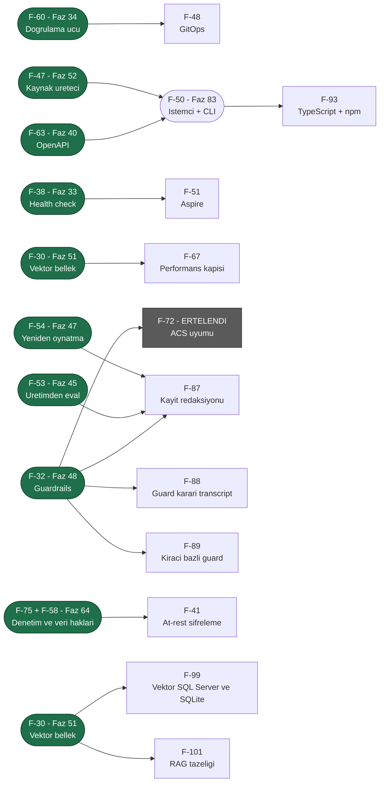

# ADAYLAR.md — Üçüncü Tur Aday Yetenekleri

> **Durum (2026-08-08): FAZ 31–56 PLANLANDI; KALAN 15 KALEM SEÇİLMEDİ.**
> İkinci tur (Faz 8–30) [Faz 30](arsiv/fazlar/30-ARAYUZ-CILASI.md) ile kapandı. Dalga 1, 2
> ve 3'ün toplam **yirmi altı** kalemi [Faz 31–52](arsiv/UCUNCU-FAZ-YOL-HARITASI.md)
> olarak plana dönüştü ve bölümleri **bu dosyadan silindi**. Kalan kalemler
> için seçim yapılmadan faz dokümanı yazılmaz.
>
> 🚨 **2026-08-08 denetimi dört kalemi daha plana çevirdi ve birini kapattı:**
> F-56 → [Faz 53](arsiv/fazlar/53-KIRACI-API-ANAHTARLARI.md), F-36 →
> [Faz 54](arsiv/fazlar/54-OKSUZ-CALISTIRMA-UZLASTIRMASI.md), F-69 →
> [Faz 55](arsiv/fazlar/55-ASENKRON-ONAY-KUTUSU.md), F-74 →
> [Faz 56](arsiv/fazlar/56-KANARYA-YAYINI-VE-OTOMATIK-GERI-ALMA.md). **F-76 faza dönüşmedi;
> bir kusur olarak düzeltildi** (K-352). Aynı denetim numarasız kalan on üç işi
> **F-90…F-102** olarak listeye aldı.
>
> 🚨 **F-72 (ACS uyumu) Dalga 3'e seçildi ama ölçüm sonucu ERTELENDİ** ve bu
> listede kaldı. Bölümü artık **ölçülmüş kanıt** taşıyor; sonraki oturum
> ölçümü tekrarlamak zorunda değildir.
>
> 🚨 **2026-08-10: manuel kabul testi senaryo yazımının düşürdüğü notların
> taranması F-103–F-105'i ekledi** (`docs/manuel-test/00-INDEKS.md` §8).
> Aynı tarama sırasında bulunan gerçek kusurlar (kiracı yalıtımı, `--no-build`
> paketleme, SSE hata çerçevesi vb.) doğrudan kodlandı — burada yalnız var
> olmayan bir **yetenek** gerektiren adaylar durur.
>
> 🚨 **2026-08-14: Ortak kuyruk manuel kabul testi kapanışı F-106'yı ekledi**
> (`HATA-K-003`/K-401) — Magentic round-limit sonrası zarif durdurma, MAF'ın
> kapalı-kutu orkestrasyon durumuna bağımlı bir yetenek adayıdır. Aynı
> koşumda bulunan diğer sekiz kusur (`HATA-K-001`..`008`) doğrudan kodlandı.
>
> 🚨 **2026-08-15: Manuel kabul testi kapanışı (KAPANIS-PLANI §5 Karar 4)
> F-107'yi ekledi** (`HATA-S2-010`/`MT-RES-005`) — bir `WorkflowRunner`
> çalıştırmasının gerçekten iptal edilip edilemediği MAF'ın kendi
> `AgentWorkflowBuilder.BuildSequential` grafiğinin iç iptal davranışına
> bağımlı bir yetenek adayıdır. Kullanıcı kararıyla, yetenek isteyen diğer
> tüm bulgular doğrudan kodlandı; yalnız bu istisna faza döndü.
>
> 🚨 **2026-08-18: Kullanıcı sorusu F-108'i ekledi ve aynı gün F-64 ile birlikte
> plana dönüştü** → [Faz 61](61-ISTEMCI-TOOLLARI-VE-GOMULEBILIR-SOHBET.md).
> İkisinin bölümü bu dosyadan **silindi**. Planlama sırasında yapılan ölçüm iki
> iddiayı düzeltti: (1) MAF'ın OpenAI uyumlu girdi dönüşümü
> `function_call_output` öğesini **reddediyor** — o yüzey sonuç kanalı olamaz;
> (2) **CORS kodda hiç yok**, bu F-64'ün gerçek ön koşuludur ve aday bölümü
> bunu yazmamıştı. Ayrıca `AIFunction.AsDeclarationOnly()` ile bildirim-yalnız
> tool'un modele gidip **sunucuda çalışmadığı** davranış probuyla kanıtlandı.
>
> 🚨 **2026-08-18 (ikinci tur): beş faz daha planlandı, üç kalem kapandı.**
> F-44+F-59 → [Faz 62](62-MODEL-YEDEK-ZINCIRI-VE-ON-UCUS-DENETIMI.md) ·
> F-61 → [Faz 63](63-ARGUMAN-DUZEYINDE-ONAY-POLITIKASI.md) ·
> F-75+F-58 → [Faz 64](64-DENETIM-ZINCIRI-VE-VERI-KONUSU-HAKLARI.md) ·
> F-40 → [Faz 65](65-KIRACI-SAGLAYICI-ANAHTARLARI.md) ·
> F-65 → [Faz 66](66-GELEN-TETIKLEYICILER.md). Aynı turda **F-100, F-102 ve
> F-103 ölçümle kapandı** — üçü de artık bir aday değildir. Planlama sırasında
> düzeltilen iddialar: `ToolApprovalRule` konumsal **değildir** (ek kurucu
> istemez), `CompiledAgentCache` anahtarı kiracıyı **zaten** taşır (K-380) ve
> `Microsoft.ML.Tokenizers` geçişli olarak var olsa da AgentPrism onu **hiç
> doğrudan çağırmıyor**.
>
> 🚨 **2026-08-20: MAF/Semantic Kernel/`Microsoft.Extensions.AI` ekosistem
> taraması F-45'i doğruladı ve F-134'ü ekledi.** `DistributedCachingChatClient`
> reflection ile ölçüldü — pinlenmiş 10.8.3'te zaten var, sürüm yükseltmesi
> gerekmiyor. Aynı taramanın kod yazmayan üç bulgusu kullanıcıya ayrıca
> bildirildi (aday değildir, burada durmaz): (1) MAF/MEAI/MCP paket
> sürümlerinin rutin güncellenmesi (kusur kanalı), (2) K-053'ün yeniden test
> edilmesi önerisi — `Microsoft.Agents.AI.Harness` artık GA hattında ama
> davranışsal düzelme ölçülmedi (karar kanalı), (3) `docs/hafiza/maf-api.md`
> satır 51'deki MCP OAuth notunun netleştirilmesi — `IdentityAssertionGrantProvider`
> pinlenmiş 2.0.0'da bile var, ama saf `client_credentials` sağlamıyor (belge
> düzeltmesi). Tam koşum kaydı: [`kesif/2026-08-20-maf-ekosistem-taramasi.md`](kesif/2026-08-20-maf-ekosistem-taramasi.md).
>
> Bu belge 2026-08-05 tarihli ilk aday listesinin **yerini alır**. Ayrı bir
> aday listesi dosyası açılmaz; iki yerde tutmak kayma üretir. Eski sürümün
> tarihsel değeri "hangi iddia yanlış çıktı" bilgisidir ve o bilgi aşağıdaki
> [Yeniden Yargı](#yeniden-yargı-2026-08-06) bölümünde durur. Eski metnin
> tamamı git geçmişindedir; arşive kopya alınmadı.
>
> **Okuma notu — bu dosya baştan sona okunmaz.** Seçim yaparken önce
> [Bu Turda Neyin Değiştiği](#bu-turda-neyin-değiştiği), sonra
> [Önerilen Sıralama](#önerilen-sıralama--üç-dalga) okunur. Tek bir kalemin
> ayrıntısı için `grep -n "F-68" docs/ADAYLAR.md` yeterlidir.
> Bir kalem faz dokümanına dönüştürüldüğünde ilgili bölüm buradan **silinir**
> ve faz dokümanına taşınır.

---

## Plana Dönüşenler (2026-08-06)

Aşağıdaki **yirmi altı** kalemin bölümü bu dosyadan **silindi**. Ayrıntı artık
faz dokümanındadır; bu tablo yalnız yönlendirmedir.

### Dalga 1–3 → Faz 31–52 — arşive taşındı (2026-08-21)

Yirmi altı kalemin faz eşlemesi kapanmış bir yönlendirme kaydıdır; faz durumu
[`YOL-HARITASI.md`](YOL-HARITASI.md)'de yaşar. Tablolar:
[`arsiv/PLANA-DONUSEN-ADAYLAR.md`](arsiv/PLANA-DONUSEN-ADAYLAR.md) § *Dalga 1–3 eşleme tabloları*.

### Dalga 6–12 → Faz 61–78 — arşive taşındı (2026-08-21)

Yedi dalganın faz eşlemesi kapanmış bir yönlendirme kaydıdır; faz durumu
[`YOL-HARITASI.md`](YOL-HARITASI.md)'de yaşar (K-413). Tablolar:
[`arsiv/PLANA-DONUSEN-ADAYLAR.md`](arsiv/PLANA-DONUSEN-ADAYLAR.md) § *Dalga 6–12 eşleme tabloları*.

## Bu Turda Neyin Değiştiği

**2026-08-21 · ikinci tüketici gömme turu.** Dört yeni kalem (**F-140** · **F-141**
· **F-142** · **F-143**) ve **F-34'ün yeniden yargılanması**. Beş tüketici iddiası
ölçümle **yanlışlandı** ve kalemleşmedi. Tur kaydı:
[`kesif/2026-08-21-tuketici-turu-2.md`](kesif/2026-08-21-tuketici-turu-2.md).

Üçüncü turun kendi anlatısı kapanmış kayıttır — tam metin:
[`arsiv/PLANA-DONUSEN-ADAYLAR.md`](arsiv/PLANA-DONUSEN-ADAYLAR.md).

## Değerlendirme Ölçütleri

Dört temel soru korunur:

| Ölçüt | Soru |
|-------|------|
| **Değer** | Bu olmadan AgentPrism'i kim kullanamaz? |
| **Maliyet** | Kaç paket, kaç yeni public tip, kaç migration? |
| **Risk** | Bir tasarım kuralını (K1–K4) zorluyor mu? Bundle bütçesini? |
| **Hazırlık** | MAF veya .NET ekosisteminde hazır mı, sıfırdan mı? |

### Sekiz mercek

Bir fikir yalnız bir mercekten iyi görünüyorsa zayıftır. Her kalemin
**Mercek** satırı destekleyen mercekleri numarayla sayar.

| # | Mercek | Sorusu |
|---|--------|--------|
| 1 | **Benimseme** | İlk agent'a kadar geçen süreyi kısaltır mı? |
| 2 | **Üretim işletimi** | Gece 03:00'te nöbetçi mühendisin işine yarar mı? |
| 3 | **Kurumsal satın alma** | Hangi kurumsal kapıyı açar? |
| 4 | **Performans ve AOT** | Sıcak yolda tahsis üretir mi? AOT duruşunu bozar mı? |
| 5 | **API ergonomisi** | Yanlış kullanım derlemede yakalanır mı? Sonradan eklemek kırıcı mı? |
| 6 | **Ekosistem yerleşimi** | Aspire, OTel, MCP, A2A, DI ile doğal mı oturuyor? |
| 7 | **Ölçme–iyileştirme** | Üretim verisini geliştirmeye geri besler mi? |
| 8 | **Maliyet (FinOps)** | Tüketicinin model faturasını düşürür mü? |

---

## Yeniden Yargı (2026-08-06) — arşive taşındı (2026-08-21)

O turun iptal · yanlışlanan kanıt · yükseltme · birleşme tabloları kapanmış
kayıttır. Tam metin:
[`arsiv/PLANA-DONUSEN-ADAYLAR.md`](arsiv/PLANA-DONUSEN-ADAYLAR.md) § *Yeniden Yargı (2026-08-06)*.

---

## A. Kontrol düzlemi çekirdeği — işletim

> **Bu bölümün her iki kalemi de plana dönüştü (2026-08-08):** F-36 →
> [Faz 54](arsiv/fazlar/54-OKSUZ-CALISTIRMA-UZLASTIRMASI.md), F-69 →
> [Faz 55](arsiv/fazlar/55-ASENKRON-ONAY-KUTUSU.md). Bölümleri buradan silindi.
>
> 🚨 **2026-08-18 turunun üç kalemi de aynı gün plana dönüştü** (F-110, F-114,
> F-115). Aşağıdaki satırlar yalnız **iz**dir; gövdeler arşivdedir.
>
> 🚨 **2026-08-21'de bölüm yeniden açıldı:** aynı tüketicinin ikinci turu
> **F-141**'i doğurdu ([keşif notu](kesif/2026-08-21-tuketici-turu-2.md)).

- **F-110** `pgvector`'ün isteğe bağlı olması → [Faz 67](67-ISTEGE-BAGLI-MIGRATION-SETI.md) 📋 · gövdesi: [`arsiv/PLANA-DONUSEN-ADAYLAR.md`](arsiv/PLANA-DONUSEN-ADAYLAR.md)
- **F-114** Tool yürütme timeout'u → [Faz 69](69-TOOL-YETKILENDIRMESI-VE-TIMEOUT.md) 📋 · gövdesi: [`arsiv/PLANA-DONUSEN-ADAYLAR.md`](arsiv/PLANA-DONUSEN-ADAYLAR.md)
- **F-115** Çalıştırma olayı hedefi ve `ReasoningDelta` → [Faz 70](70-CALISTIRMA-OLAYI-HEDEFI.md) 📋 · gövdesi: [`arsiv/PLANA-DONUSEN-ADAYLAR.md`](arsiv/PLANA-DONUSEN-ADAYLAR.md)

### F-141 · Kesilen işin devamı — agent turu ve workflow düğümü için tek sözleşme

> 👤 **Kullanıcı kararı (2026-08-21):** agent tarafı ile workflow tarafı **tek
> kalemdir**. İkisi de "kesilen işi devam ettir" sorusudur; ortak sözleşme
> (devam kaydı, deneme sayısı, yan etki kısıtı) bir kez yazılır.
>
> **F-95 ile ilişkisi:** F-95 şu ölçümle kapsam dışına alınmıştı — *"MAF agent
> düzeyinde kanca vermiyor; kancayı AgentPrism yazmak K3'ü zorlar."* **O ölçüm
> doğrudur ve bu kalem onu tartışmıyor.** Bu tasarım MAF'a hiç kanca takmaz;
> kullandığı üç şeyin üçü de AgentPrism'in kendi kaydıdır.

**Sorun:** Dayanıklılık bugün **elle bir düğmeye** bağlıdır. Ölçüldü (2026-08-21):

| Yer | Ölçüm |
|---|---|
| [`SqlRunStore.cs:263`](../src/AgentPrism.Sql.Shared/Stores/SqlRunStore.cs#L263) | Öksüz koşuyu `Failed` + `Infrastructure` kapatır ve bir `RunFailed` olayı yazar. **Kuyruğa koymaz** |
| [`RunReconciliationService.cs:91`](../src/AgentPrism.Core/Recording/RunReconciliationService.cs#L91) | Tek işi kapatmaktır; checkpoint'i olan koşuyu ayırt **etmez** |
| `src/AgentPrism.Workflows` içinde retry/backoff araması | **0 eşleşme** — düğüm başına retry politikası yok |
| [`AgentPrismWorkflowOptions.cs:25,49,60`](../src/AgentPrism.Workflows/AgentPrismWorkflowOptions.cs) | `EnableCheckpointing` varsayılan **açık**, `MaxSuperSteps` 100, `KeepCheckpointsAfterCompletion` açık — dayanıklılık **var**, otomatiklik yok |

Süreç yeniden başladığında (deploy, çökme, ölçek olayı) koşu kaybolur ve
uzlaştırma onu yalnız **işaretler**. Kesilen bir workflow için `resume` ucu
vardır ama **elle** çağrılır. Bir düğüm geçici bir sağlayıcı hatasıyla düşerse
tüm koşu düşer.

**Kritik gözlem — kayıp veri yoktur.** Kesilen turun bilgisi diskte durur ve
mekanizma **iki parça hâlinde zaten mevcuttur**: `run_events` append-only'dir ve
`ToolInvoking`/`ToolInvoked` çiftleri argümanları ve sonuçları taşır;
[`RecordedToolPlayback`](../src/AgentPrism.Core/Replay/RecordedToolPlayback.cs)
o kayıttan bir defter kurup `(tool adı, argümanlar)` çiftiyle eşleştirmeyi
**yapıyor** (tip `internal` — public yüzey büyümez). Eksik olan üçüncü parça
onları birleştiren tetikleyicidir. Oturum tarafı da uyar:
`AgentSessionManager.SaveSessionAsync` **açık** bir çağrıdır, yani yarıda kesilen
bir tur oturumu **tur öncesi** hâlinde bırakır.

**Kapsam:**

- Öksüz bir koşu kapatılırken, koşu bir **oturuma** bağlıysa ve ayar açıksa aynı
  oturum için bir devam koşusu kuyruğa konur (yeni `RunId`, kesilen koşuya
  bağlı). Devam koşusu tool'ları playback defteriyle koşar: **tamamlanmış**
  çağrılar yeniden çalıştırılmaz, kayıtlı sonuçları döner.
- Workflow tarafında: **düğüm başına retry politikası** (deneme sayısı + geri
  çekilme çarpanı) ve checkpoint'i olan takılmış bir koşunun `Failed` yerine
  **kuyruğa geri konması**. Geçici/kalıcı hata ayrımı için tipli sağlayıcı
  exception'ları **zaten var** (Faz 44) — metin eşleştirmesi gerekmez.
- 👤 Ayar varsayılan **kapalı** (K1, sıfır sürpriz); uzlaştırmanın kendi
  yapılandırma bölümü altında yaşar.
- 🚨 **Yan etkili işin tekrarı bu kalemin en büyük riskidir.** `ToolEffect`
  `Destructive` taşıyan tool'lar için devam varsayılan olarak **reddedilir**;
  idempotency tüketicinin sorumluluğudur ve dokümanda açıkça yazılır. Aynı kural
  workflow düğümü için de geçerlidir — K-498 bunu zaten söylüyor.
- Sonsuz devam döngüsü `MaxAttempts` ile kapatılır.
- Devam, koşu ağacında **görünür** olmalıdır: operatör "bu iş bir kez kesildi ve
  devam etti" cümlesini konsolda okuyabilmelidir.
- Ucuz yan kalem: `ApplicationStopping` sinyalinde açık koşuları bekleyen zarif
  kapanış (drain). Tek başına deploy kesintisini azaltır.

**Değer:** Ekosistem boşluk tablosunun **birinci satırının** motor tarafı. Faz 46
bunun HTTP yüzünü (`202 Accepted`) verdi. Bir tüketici bugün kendi job-tabanlı
döngüsünü bırakırsa **dayanıklılık kaybeder** — devir bir gerileme olur.
**Mercek:** 2, 3, 6.
**Hazırlık:** Üç parça hazır (olay akışı, playback defteri, iş kuyruğu); workflow
tarafında checkpoint, `resume` ucu ve tipli hata sınıfları hazır. Yeni olan
tetikleyici ve devam sözleşmesidir.
**Maliyet:** Orta. Yeni public tip: 1–3 (ayar, devam kaydı, düğüm retry
politikası). Migration: `runs` tablosuna nullable bir "hangi koşudan devam"
kolonu; workflow tanımı yükü `jsonb` olduğu için orada gerekmeyebilir.
**Risk:** Orta. Birinci risk yan etkili işin tekrarı (`ToolEffect` ile kapatılır),
ikinci risk sonsuz devam döngüsü (`MaxAttempts`), üçüncü risk retry ile
checkpoint'in etkileşimi — bir düğüm yeniden denenirken süper adım sınırının
nerede sayıldığı **ölçülmelidir**.
**Bağımlılık:** Faz 46 (kuyruk) · Faz 47 (`RecordedToolPlayback`, `ReplayToolMode`)
· Faz 54 (öksüz uzlaştırma) · Faz 55 (`ApprovalResume` emsali) · Faz 15/16
(workflows) · Faz 44 (hata sınıflandırma).
**Karar sınırı:** 🚨 **K-315 (yeniden oynatma oturumsuzdur) ihlal edilmez** ama
teğet geçer. Replay kaynak koşuyu **yeni ve oturumsuz** bir koşu olarak tekrar
çalıştırır; bu kalem **aynı oturumun** kesilen turunu devam ettirir ve bunu
`ApprovalResume`'un zaten yaptığı gibi yeni bir koşuyla yapar. İki işlem **ayrı
adlandırılmalıdır**, yoksa sözleşme karışır.
**Ekosistem:** LangGraph `durable-execution`, Mastra `createDurableAgent`,
Temporal, Inngest, Restate; Temporal ile Inngest'in çekirdek vaadi tam olarak
düğüm başına retry + otomatik devamdır. .NET'te karşılığı **yok** — boşluk
tablosunun kendi satırı bunu yazıyor. 🚨 **Ekosistem bu turda taze taranmadı**;
satır tablonun kendi tarih damgalı kaydından devralındı.
**Karşı görüş:** Ölçülmüş ihtiyaç **tek instance'lı** bir kurulumdan geliyor ve
oradaki asıl acı deploy kesintisidir — onu zarif kapanış tek başına, çok daha
ucuza büyük ölçüde kapatır; devam mekanizmasının kendisi ancak çökme ve ölçek
olayı için gerekir. İkinci gerçek gerekçe: "tamamlanmış tool'u tekrar
çalıştırma" garantisi argüman eşleşmesine dayanır; argümanları zamana bağlı
(`now`, rastgele kimlik) bir tool defterde eşleşmez ve **sessizce** yeniden
çalışır. `ToolEffect` kısıtı gevşetilirse kalem üretimde veri bozar.

## B. Model yüzeyi ve yönlendirme

> **Bu bölümde seçilmemiş kalem kalmadı (2026-08-21).** F-45 ve F-134 birlikte
> [Faz 81](81-YANIT-ONBELLEGI-VE-ESZAMANLI-TOOL.md)'e dönüştü — Dalga 13 Küme B.
> Aşağıdaki satırlar yalnız **iz**dir; gövdeler arşivdedir.

- **F-45** Yanıt önbelleği → [Faz 81](81-YANIT-ONBELLEGI-VE-ESZAMANLI-TOOL.md) 📋 · gövdesi: [`arsiv/PLANA-DONUSEN-ADAYLAR.md`](arsiv/PLANA-DONUSEN-ADAYLAR.md)
- **F-134** Eşzamanlı tool çağrısını açığa çıkar → [Faz 81](81-YANIT-ONBELLEGI-VE-ESZAMANLI-TOOL.md) 📋 · gövdesi: [`arsiv/PLANA-DONUSEN-ADAYLAR.md`](arsiv/PLANA-DONUSEN-ADAYLAR.md)
- **F-112** Cache ve reasoning token kırılımı → [Faz 68](68-CALISTIRMA-KIMLIGI-VE-TOKEN-KIRILIMI.md) 📋 · gövdesi: [`arsiv/PLANA-DONUSEN-ADAYLAR.md`](arsiv/PLANA-DONUSEN-ADAYLAR.md)

## C. Güvenlik, yönetişim ve uyum

### F-72 · Agent Control Specification (ACS) uyumu — ERTELENDİ (2026-08-06). Gövde: [`arsiv/PLANA-DONUSEN-ADAYLAR.md`](arsiv/PLANA-DONUSEN-ADAYLAR.md).

### F-76 · Paylaşılan SQL kaynağının XML doküman çakışması — KAPATILDI (2026-08-08, K-276). Gövde: [`arsiv/PLANA-DONUSEN-ADAYLAR.md`](arsiv/PLANA-DONUSEN-ADAYLAR.md).

- **F-41** İçerik şifreleme (at-rest) → [Faz 82](82-ICERIK-KORUMASI.md) 📋 · gövdesi: [`arsiv/PLANA-DONUSEN-ADAYLAR.md`](arsiv/PLANA-DONUSEN-ADAYLAR.md)

### F-143 · Tool çıktısı için boyut sınırı

**Sorun:** Bir tool'un döndürdüğü metin **sınırsızdır** ve doğrudan bağlama
girer. Ölçüldü (2026-08-21):
[`AgentPrismToolRegistration.cs:63-84`](../src/AgentPrism.Abstractions/Tools/AgentPrismToolRegistration.cs)
altı alan taşır — `Function`, `RequiresApproval`, `Source`, `Effect`,
`RequiredPermission`, `Timeout` — ve **çıktı boyutu yoktur**. Faz 69 zamanı
kısıtladı, hacmi kısıtlamadı. `CompactionSettings` bağlamı **sonradan**
toparlar, ama toparlanacak token zaten harcanmıştır ve sıkıştırmanın kendisi
bir model çağrısıdır.

**Kapsam:**

- `AgentPrismToolRegistration` üzerinde bir çıktı boyutu alanı — `Timeout`
  alanının kardeşi, aynı yerde yaşar, kurulum varsayılanını aynı yerden alır.
- Aşımda çıktı kırpılır ve modele **açık bir işaretle** verilir: "çıktı kırpıldı,
  N bayt atlandı". 🚨 Sessiz kırpma modelin yanlış sonuç üretmesine yol açar ve
  bu kalemin en kolay yanlış yapılan yeridir.
- Kırpma olayı `run_events`'e yazılır: operatör hangi tool'un sürekli
  kırpıldığını görebilmelidir. Kalemin ölçme–iyileştirme tarafı budur —
  sürekli kırpılan tool, yanlış tasarlanmış tool'dur.
- Varsayılan **sınırsızdır** (K1, sıfır sürpriz); sınır açıkça konur.

**Değer:** Doğrudan FinOps. Tek bir kaçak tool bir kiracının kotasını yiyebilir
ve bu, unutulduğunda sessizce pahalıya patlayan türden bir kuraldır.
**Mercek:** 8, 2, 5.
**Hazırlık:** Hazır —
[`TimeoutAIFunction.cs`](../src/AgentPrism.Core/Tools/TimeoutAIFunction.cs)
sarmalayıcısının yanına ikinci bir sarmalayıcı.
**Maliyet:** Küçük. Yeni public alan: 2. Migration yok.
**Risk:** Düşük. Tek gerçek karar varsayılandır ve K1 onu zaten veriyor.
**Bağımlılık:** Faz 69 (`Timeout` alanı — aynı tip) · Faz 13 (compaction;
tamamlayıcıdır, rakip değil).
**Ekosistem:** LiteLLM ve Portkey tool/yanıt boyutu sınırını gateway
seviyesinde sunuyor. 🚨 **Ekosistem doğrulanmadı** — tüketici raporundan
devralındı, bu turda taze taranmadı.
**Karşı görüş:** Tool gövdesi çıktısını **zaten** kısıtlayabilir ve orada
kısıtlamak daha iyidir: tool kendi verisini bilir, kütüphane yalnız bayt sayar.
Bayt bazlı kırpma bir JSON çıktısını ortasından kesebilir; o hâlde model bozuk
JSON okur ve "açık işaret" bunu kurtarmayabilir. Kalem, kırpma biriminin
(bayt · karakter · token) ölçülmesine bağlıdır.

---

### F-104 · Örnek uygulama rol politikaları — ✅ KAPATILDI (2026-08-18, K-431). Gövde: [`arsiv/PLANA-DONUSEN-ADAYLAR.md`](arsiv/PLANA-DONUSEN-ADAYLAR.md).

### F-105 · Dosya belleği kiracı-içi sınırı — ✅ KAPATILDI (2026-08-18, K-434). Gövde: [`arsiv/PLANA-DONUSEN-ADAYLAR.md`](arsiv/PLANA-DONUSEN-ADAYLAR.md).

### F-106 · Magentic orkestrasyonu round-limit'e ulaştıktan sonra zarif durmuyor — `WorkflowRunner` bunu önceden kestiremiyor

> 🚨 **Durum (2026-08-18): AZALTILDI, DOĞRULANMADI — kalem AÇIK kalır.**
> Pompa artık akışı yeniden açmadan önce MAF'ın kendi durumunu soruyor
> (`run.GetStatusAsync()`, **K-433**), yani bildirilen `RunFailed` yolunun sebebi
> kapatıldı. Ama düşen bir test **yoktur**: sahte katılımcılarla iki repro denendi
> (`MaxIterations` 1 ve 2, tek ve çift onay turu) ve ikisi de düzeltme kapalıyken
> **geçti**. Test tiyatrosu bırakmamak için o dosya silindi. Kapı manuel kabul
> case'idir (gerçek model + `requirePlanApproval`).

**Sorun:** `HATA-K-003` (manuel kabul testi, K-401) bir Magentic +
`requirePlanApproval` iş akışında `maxIterations` plan+onay-sonrası-devam+
katılımcı döngüsü için yetersiz kalınca şunu ölçtü: MAF'ın Magentic
orkestratörü round-limit'e ulaşıp kendi `WorkflowOutput`'unu ("Task
execution stopped due to hitting the maximum round count limit.")
ürettikten SONRA, `WorkflowRunner`'ın süper-adım pompası orkestratörü BİR
KEZ DAHA çağırıyor — MAF bunu "orkestrasyon zaten sonlandı" istisnasıyla
reddediyor, çalıştırma `RunFailed` ile bitiyor. K-401 bu istisnanın
mesajını ANLAMLI hale getirdi (artık gerçek nedeni gösteriyor) ama
çalıştırmanın KENDİSİ hâlâ hatayla bitiyor — plan aslında MAF'ın kendi
tanımına göre "tamamlandı" (round-limit'e vararak durdu) sayılabilecekken,
AgentPrism bunu temiz bir `Completed` yerine bir `RunFailed` olarak
kaydediyor.
**Kapsam:** `WorkflowRunner`'ın MAF'tan gelen `WorkflowOutputEvent`'i
(round-limit metnini taşıyan) GÖRDÜKTEN sonra, aynı orkestratöre yönelik
sonraki bir süper-adım çağrısının "zaten sonlandı" istisnasıyla
başarısız olacağını ÖNCEDEN bilip akışı orada temiz bir `Completed`
olarak kapatması gerekir — bugünkü kod bu iki olayı (round-limit çıktısı
ile sonraki başarısız çağrı) ilişkilendirmiyor, MAF'ın ne üreteceğini
sırayla pompalayıp olduğu gibi yansıtıyor.
**Değer:** `requirePlanApproval: true` + Magentic KULLANAN her tüketici,
`maxIterations`'ı plan+onay-sonrası-devam+katılımcı döngüsü için yeterince
yüksek tutmazsa aynı "opak olmayan ama yine de yanlış" `RunFailed`'i
görür — ergonomik bir kusur, veri kaybı riski taşımaz (K-401 sonrası
mesaj zaten doğru nedeni söylüyor).
**Mercek:** 16 (Workflow yürütme).
**Hazırlık:** Yok — MAF'ın Magentic durum makinesinin "sonlandı mı"
sorusuna yanıt veren herkese açık bir API'si var mı, `maf-api-kesfi`
skill'iyle doğrulanmalı.
**Maliyet:** Orta. `WorkflowRunner`'ın süper-adım pompasına "önceki
adımda round-limit çıktısı görüldüyse sonraki çağrıyı deneme, doğrudan
`Completed`'e geç" mantığı eklenmesi gerekir — MAF'ın kapalı-kutu
orkestrasyon durumuna bağımlı olabilir.
**Risk:** Yanlış sezilen bir "zaten sonlandı" durumu, GERÇEKTEN başarısız
olması gereken bir çalıştırmayı sessizce `Completed` gösterebilir —
round-limit metninin TAM eşleşmesi yerine MAF'ın kendi tip/durum
bilgisine dayanmalı, metin eşleştirme kırılgandır.
**Bağımlılık:** K-401 (mesaj netleştirmesi) zaten main'de.
**Ekosistem:** —

---

### F-107 · Workflow iptali — ✅ KAPATILDI (2026-08-18). Gövde: [`arsiv/PLANA-DONUSEN-ADAYLAR.md`](arsiv/PLANA-DONUSEN-ADAYLAR.md).

## D. Yetenek derinliği

### F-34 · Talimatın girdi yüzeyi: parametre şeması ve belge kanalı

> 🚨 **2026-08-21'de yeniden yargılandı.** Kalem "ergonomi" sınıfındaydı ve
> § *Bundan Sonra Ne Kaldı* onu *"hiçbiri bugün bir tüketiciyi engellemiyor"*
> satırında tutuyordu. **Bu ölçümle yanlıştır.** Kalem ayrıca **belge kanalını**
> devraldı 👤: ikisi de "talimata ne girer" sorusudur ve ayrı planlanırsa
> ikincisi birincisinin kararını bozar (Küme C emsali). Tur kaydı:
> [`kesif/2026-08-21-tuketici-turu-2.md`](kesif/2026-08-21-tuketici-turu-2.md).

**Sorun:** İki yarısı vardır ve ikisi de aynı kanalı paylaşır.

1. **Çalışma anı parametresi için yer yok.** `AgentDefinition.Instructions` düz
   metindir ([`AgentDefinition.cs:33`](../src/AgentPrism.Abstractions/Agents/AgentDefinition.cs));
   `InstructionsByCulture` (Faz 72, aynı dosya `:41`) yalnız **dile** göre
   varyant verir. Koşu isteği de taşımaz: `AgentRunRequest` yalnız `Message`,
   `SessionId`, `Culture`, `Approvals`, `ToolResults` ve `AttachmentIds`
   alanlarını taşır
   ([`AgentContracts.cs:212-282`](../src/AgentPrism.AspNetCore/Contracts/AgentContracts.cs)).
   Kalemin ilk hâlindeki ihtiyaç da açık kalır: on agent aynı "kurum kuralları"
   bloğunu kopyalıyorsa tek yerden değiştirmenin yolu yoktur.
2. **Veri ile talimat aynı kanaldan girer.** Modele giden içerikte "bu veri,
   talimat değil" işareti yoktur. Faz 48 guard'ları **kalıp** tabanlıdır ve
   *bilinen* desenleri arar; kullanıcının yazdığı uzun bir metnin (makale,
   transcript, döküman) talimatın içine gömülmesi kalıpla yakalanmaz — metin
   zararsız görünür. 🚨 [Faz 82](82-ICERIK-KORUMASI.md) bunu **kapsamaz**; o
   at-rest şifrelemedir.

**Tüketici kanıtı (ölçüldü 2026-08-21, ProdigyEnabler · `0.0.0-preview.0.291`):**
parametresiz bir kontrol düzleminde tüketicinin iki yolu vardır ve ikisi de
kötüdür. Parametreyi kullanıcı mesajına koymak talimatı veri kanalına indirir —
yani **ikinci yarıyı kötüleştirir**. Her çağrıda `AddAgent(name, factory)` ile
dinamik agent üretmek sürüm geçmişini siler; kod agent'larının sürüm geçmişi
yoktur, yani Faz 18/19/45/49/56'nın kazanımlarının tamamı erişilemez olur.
**Bu yüzden F-34 bir ergonomi kalemi değil, ölçme–iyileştirme döngüsünün
tüketici için ön koşuludur.**

**Kapsam:**

- `AgentDefinition` üzerinde **tipli parametre şeması** (ad, tip, zorunluluk,
  varsayılan). Tanım derlenirken doğrulanır.
- Koşu isteğinde `parameters` sözlüğü. Şemayla eşleşmezse **koşu başlamaz**;
  `/validate` ve `/estimate` aynı hatayı verir. Sessizce boş bırakmak bir üretim
  hatasıdır ve varsayılan olmamalıdır.
- 🚨 **Yalnız değer yerleştirme.** İfade, koşul, döngü, filtre yok — yalnız
  `{{ad}}`. Scriban gibi tam bir motor **alınmaz**: K2'nin ruhunu ve AOT
  duruşunu zorlar. Bu kısıt kalemin en değerli parçasıdır ve gevşetilmemelidir.
- **JSON-güvenli kaçış yerleşiktir.** Talimat bir JSON parçası taşıyorsa (tool
  şema örneği, çıktı şablonu) yerleştirilen değer yapıyı bozamaz.
- Paylaşılan blok / kısmi talimat ve agent tanımında referans.
- Her kültür varyantı **aynı** parametre şemasını kullanır.
- Eval vakası bir parametre seti taşır; aksi hâlde parametreli bir agent
  değerlendirilemez ve kalem kendi değerini keser.
- **Belge kanalı:** adı ve içeriği olan, *talimat olmadığı işaretli* bir dizi.
  Sağlayıcı sınırında uygun biçimde sarmalanır (biçim her sağlayıcı için ayrı
  ölçülür). Kayıtta "talimat" ile "belge" ayrı görünür — denetim izi "modele
  hangi belge girdi" sorusunu cevaplayabilir.
- 🚨 **Fazla söz verilmez.** Belge kanalı bir **konvansiyon ve denetim**
  kalemidir, bir güvenlik garantisi değildir; hiçbir sağlayıcı "bu veri, talimat
  değil" için sert garanti vermiyor. Kalemin adı "prompt injection koruması"
  olmamalıdır — yanlış güven duygusu üretmek hiç yapmamaktan kötüdür.

**Değer:** Parametreli agent'lar bugün AgentPrism tanımına taşınamaz. Bir
tüketici için "agent tanımını AgentPrism'e taşı" adımı yarım kalır — ve o adım
sürümleme, eval, deney ve canary'nin kapısıdır.
**Mercek:** 1, 5, 7 — dolaylı olarak 3 (parametresiz bir kontrol düzlemi
kurumsal bir prompt kütüphanesi olamaz).
**Hazırlık:** Sıfırdan, ama kapsam daraldığı için ucuzladı: değer yerleştirme +
kaçış bir şablon motoru değil, saf bir fonksiyondur. Belge kanalının sarmalama
biçimi **her sağlayıcı için ayrı ölçülmelidir** — planlamadan önce.
**Maliyet:** Orta. Public yüzey büyür (parametre tipi, sözlük alanı, belge
tipi) — Faz 7'den önce eklemek ucuzdur, sonrası bir sürüm kararıdır. Migration:
agent tanımı yükü zaten `jsonb`.
**Risk:** 🚨 **Şablon dili bir güvenlik yüzeyidir.** Değer yerleştirmeyle sınırlı
kalırsa risk düşüktür. İkinci risk: eksik parametre davranışının sessiz olması.
Üçüncü risk: belge kanalının kapasitesinden fazlasını vaat etmesi.
**Bağımlılık:** Faz 19 (sürümleme) · Faz 72 (çok dillilik) · Faz 18/45 (eval
vakası şeması) · [Faz 48](arsiv/fazlar/48-GUARDRAILS.md) (guard'lar —
tamamlayıcıdır, rakip değil).
**Ekosistem:** Langfuse'un prompt yönetimi tam olarak budur: arayüzden sürümle,
kod aktif sürümü çeker. Braintrust ve Portkey'de de var. Belge tarafında
Anthropic'in belge sarmalama önerisi ve OpenAI'ın `input` rolleri emsaldir;
kontrol düzlemi seviyesinde merkezîleştiren bir .NET kütüphanesi yok.
**Karşı görüş:** Tüketici bu işi **bugün kendi tarafında yapabiliyor** (Scriban
ile yapıyor); engellenen şey parametreleme değil, parametreli agent'ın
AgentPrism tanımında yaşamasıdır. Yani kalem "yapamıyor" değil, "sürümleme
kazanımını alamıyor" kalemidir — ve bu ayrım aciliyeti düşürür. İkinci gerçek
gerekçe: bir şablon dili kütüphaneye girdikten sonra çıkmaz ve her tüketici
kendi lehçesini ister; "yalnız `{{ad}}`" kısıtını her sürümde yeniden savunmak
gerekir.

---

### F-142 · Görsel üretim tool'u

**Sorun:** AgentPrism görsel **üretemiyor**. Faz 14 çok modluluğu **girdi**
tarafında çözdü (görsel, ses, dosya girdisi); çıktı tarafında karşılığı yoktur.
Ölçüldü (2026-08-21): `src/` içinde görsel üretimi için **tek eşleşme yok**.
Ses tarafında emsal tamdır —
[`SpeakTool.cs`](../src/AgentPrism.Voice/Tools/SpeakTool.cs),
[`TranscribeTool.cs`](../src/AgentPrism.Voice/Tools/TranscribeTool.cs),
[`ListVoicesTool.cs`](../src/AgentPrism.Voice/Tools/ListVoicesTool.cs) — ve
fiyatlandırma emsali de öyle:
[`VoicePricing.cs:62`](../src/AgentPrism.Voice/Internal/VoicePricing.cs#L62)
`VoicePriceOverride` "bir model ya karakter başına ya süre başına ücretlenir"
ayrımını zaten çözmüş durumdadır.

**Neden ölçüm kalemi:** Çok modlu üretim yapan bir tüketicide görsel adımı
üretim hattının bir parçasıdır. Bugün geçiş yapan bir tüketici için dört adımın
maliyeti görünür olur, beşincisi görünmez kalır — "bir çıktının toplam üretim
maliyeti nedir" sorusu tam cevaplanamaz. O soru kontrol düzleminin varlık
sebebidir.

**Kapsam:**

- `GenerateImageTool` — ses tool'larının yapısıyla birebir aynı. 🚨 **Ayrı bir
  paket mi, mevcut sağlayıcı paketlerine ek mi: ÖLÇÜLMEDİ.** Ses ayrı paket oldu
  (`AgentPrism.Voice`); görselin geçişli bağımlılık ağırlığı planlamadan önce
  sayılmalıdır (K-212 emsali).
- Ölçüm: görsel başına / çözünürlük başına fiyat, `VoicePriceOverride`
  deseniyle. 🚨 **Fiyat uydurulmaz**: eşleşme yoksa `null` döner — ses tarafının
  kuralı burada da korunur.
- `tool_invocations` satırına yazılır; koşuya bağlıdır; kota, onay, denetim ve
  kiracılık otomatik gelir.
- Üretilen görsel `IAttachmentStorage` üzerinden yaşar — genişleme noktası
  ([`IAttachmentStore.cs:69`](../src/AgentPrism.Abstractions/Attachments/IAttachmentStore.cs#L69))
  zaten vardır.
- Koşu dışı bir operatör ucu (`POST /api/images/generate`) **isteğe bağlıdır**;
  sesin `POST /api/voice/speak` emsali aynı kararı taşır.

**Değer:** Çok modlu üretim yapan her tüketici için ölçüm bütünlüğü. Ses için
verilen sözün görsel için de verilmesi.
**Mercek:** 1, 3, 8.
**Hazırlık:** Sağlayıcı SDK'ları hazır. Faz 28'in (ses) yapısı birebir emsaldir.
**Maliyet:** Orta. Yeni paket **gerekmeyebilir** — ölçülmelidir.
**Risk:** Düşük–orta. Asıl risk fiyatlandırmanın karmaşıklığıdır (boyut, kalite,
model başına farklı birim).
**Bağımlılık:** Faz 28 (ses tool'ları — emsal) · Faz 14 (ekler).
**Ekosistem:** LiteLLM görsel üretimini maliyetiyle birlikte proxy'liyor;
Langfuse görsel çıktıyı izlemede gösteriyor. .NET'te kontrol düzlemi
seviyesinde karşılığı yok. 🚨 **Ekosistem doğrulanmadı** — bu satır tüketici
raporundan devralındı, bu turda taze taranmadı.
**Karşı görüş:** Ölçüm bütünlüğü argümanı yalnız görsel **üreten** tüketici için
geçerlidir ve bugün ölçülmüş tek bir tüketici vardır. Sağlayıcıların görsel
fiyatlandırması ses fiyatlandırmasından daha oynak; yanlış fiyat, fiyat
olmamasından kötüdür. Kalem, `null` dönme kuralı korunmazsa değerini kaybeder.

---

### F-109 · İstemci tarafı tool taşıyan bir `run` sadık biçimde replay edilemez

> Faz 61'in bağımsız denetiminde bulundu (2026-08-18, 🟢 bulgu).

**Sorun:** `RunReplayService`'in `toolTransform`'u yalnız `AIFunction`'lara
uygulanıyor (`AgentDefinitionCompiler.ResolveTools`'taki `is AIFunction`
süzgeci — Faz 61, K-435). İstemci tarafı bir tool (`AddClientTool`) çağrısı
taşıyan bir `run`'ı replay etmeye çalışmak, sunucunun hiçbir zaman
çalıştıramayacağı bir çağrıda takılı kalır.
**Kapsam:** Replay'in istemci tool çağrılarını nasıl ele alacağına karar
vermek — kayıtlı sonucu aynen tekrar mı oynatır, yoksa bu tür `run`'ları
baştan mı reddeder.
**Değer:** Faz 61'den sonra kayıtlı her `run`'ın replay edilebilir
olduğu varsayımı artık **tam doğru değil**; istemci tool'u kullanan
agent'lar için bu görünür bir boşluktur.
**Mercek:** 47 (yeniden oynatma).
**Hazırlık:** Faz 47'nin `ReplayToolMode`'u okunmalı.
**Maliyet:** Küçük–orta.
**Risk:** Düşük — replay isteğe bağlı bir araçtır, çekirdek çalıştırma yolunu etkilemez.
**Bağımlılık:** Faz 61 (K-435).
**Ekosistem:** —

---

- **F-116** Workflow kod düğümü → [Faz 71](71-WORKFLOW-KOD-DUGUMU.md) 📋 · gövdesi: [`arsiv/PLANA-DONUSEN-ADAYLAR.md`](arsiv/PLANA-DONUSEN-ADAYLAR.md)
- **F-117** Talimatta çok dillilik → [Faz 72](72-COK-DILLI-TALIMAT-VE-ZAMAN-DAMGALI-SENTEZ.md) 📋 · gövdesi: [`arsiv/PLANA-DONUSEN-ADAYLAR.md`](arsiv/PLANA-DONUSEN-ADAYLAR.md)
- **F-118** Zaman damgalı konuşma sentezi → [Faz 72](72-COK-DILLI-TALIMAT-VE-ZAMAN-DAMGALI-SENTEZ.md) 📋 · gövdesi: [`arsiv/PLANA-DONUSEN-ADAYLAR.md`](arsiv/PLANA-DONUSEN-ADAYLAR.md)

## E. Ölçme–iyileştirme döngüsü

Bu grup birlikte "agent'ı ölçerek iyileştirme" döngüsünü kurar. Bugün döngü
**tek yönlüdür**: üretim veri üretir, hiçbiri geri beslenmez.

> **Döngünün beş halkası plana dönüştü:** F-52 geri bildirim
> ([Faz 31](arsiv/fazlar/31-GERI-BILDIRIM-VE-PUANLAMA.md)), F-55 hata sınıflandırma
> ([Faz 44](arsiv/fazlar/44-HATA-SINIFLANDIRMA.md)), F-53 üretimden eval kümesi
> ([Faz 45](arsiv/fazlar/45-URETIMDEN-EVAL-KUMESI.md)), F-54+F-66 yeniden oynatma
> ([Faz 47](arsiv/fazlar/47-YENIDEN-OYNATMA-VE-DALLANDIRMA.md)) ve F-71 çevrimiçi
> değerlendirme ([Faz 49](arsiv/fazlar/49-CEVRIMICI-DEGERLENDIRME.md)).
> 🚨 **Döngü kapandı (2026-08-08):** son halka F-74 da plana dönüştü →
> [Faz 56](arsiv/fazlar/56-KANARYA-YAYINI-VE-OTOMATIK-GERI-ALMA.md). Bu bölümde kalem
> kalmadı; bölümü buradan silindi.
>
> 🚨 **2026-08-18:** Döngü *ölçme→iyileştirme* yönünde kapanmıştı ama **kırılım
> boyutu** eksikti — ölçüm kiracıdan ince bir yere inemiyordu. F-111 bunu kapatır
> ve aynı gün [Faz 68](68-CALISTIRMA-KIMLIGI-VE-TOKEN-KIRILIMI.md)'e dönüştü.
> Bu bölümde **seçilmemiş kalem kalmadı**
> ([keşif notu](kesif/2026-08-18-tuketici-raporu.md)).

- **F-111** Çalıştırma kimliği ve maliyet kırılım boyutları → [Faz 68](68-CALISTIRMA-KIMLIGI-VE-TOKEN-KIRILIMI.md) 📋 · gövdesi: [`arsiv/PLANA-DONUSEN-ADAYLAR.md`](arsiv/PLANA-DONUSEN-ADAYLAR.md)

## F. Paket ailesi ve geliştirici deneyimi

### F-48 · GitOps: tanım dışa ve içe aktarımı

**Sorun:** Agent tanımı ya koddadır ya veritabanında. Bir ekip tanımlarını
git'te sürümlemek ve dev→prod terfi etmek isterse **yolu yok**.
**Kapsam:** JSON/YAML dışa aktarım, `--dry-run` ile fark gösterimi, içe
aktarımda sürüm geçmişi ve denetim izi korunur (Faz 9 hazır).
**Değer:** Dağıtım hattına girer. Faz 19'un arayüz diff'inden farklı iştir.
**Mercek:** 1, 3.
**Hazırlık:** `agent_definition_versions` ve `audit_log` hazır.
**Maliyet:** Orta.
**Risk:** İçe aktarım **üzerine yazar**. Çakışma çözümü bir karardır.
**Bağımlılık:** F-60 (doğrulama ucu) bunun CI adımıdır;
[Faz 34](arsiv/fazlar/34-TANIM-DOGRULAMA-UCU.md) tamamlandı (2026-08-06) — önkoşul hazır.
**Ekosistem:** Dify ve n8n dışa aktarımı verir. Langfuse prompt'ları API'den
yönetir.

📋 **F-50 PLANA DÖNÜŞTÜ (2026-08-21)** → [Faz 83](83-TIPLI-ISTEMCI-VE-CLI.md).
Gövde faza taşındı. Planlama sırasında kanıt yeniden ölçüldü ve kaydın kapsam
cümlesi **daraldı**: "tanım dışa/içe aktar (F-48)" işi plana **girmedi**, çünkü
F-48 elenmiş bir adaydır ve karşılığı olan uç yoktur (belgedeki tek `export`
yolu Faz 64'ün veri konusu hakları ucudur). Ayrıntı faz dokümanının "Kapsam
dışı" bölümündedir.

### F-51 · .NET Aspire entegrasyonu

**Sorun:** Aspire kurumsal .NET'in yeni varsayılan besteleme yoludur.
AgentPrism'in Aspire kaynağı yok.
**Kapsam:** PostgreSQL kaynağı, OTel bağlantısı ve panoya bağlantı hazır gelir.
**Değer:** Yerel geliştirme kurulumu tek komuta iner.
**Mercek:** 1, 6.
**Hazırlık:** Faz 6'nın telemetrisi zaten OTel;
`AgentPrismDiagnostics.ActivitySourceName` public.
**Maliyet:** Düşük.
**Risk:** Yeni paket (K-007). Aspire sürüm hızı yüksektir; bakım borcu üretir.
**Bağımlılık:** F-38 (health check) [Faz 33](arsiv/fazlar/33-SAGLIK-DENETIMI-VE-TESHIS.md) olarak
planlandı; o faz önce biterse Aspire panosu doğal çalışır.
**Ekosistem:** .NET'e özgü. Karşılığı Docker Compose'dur.

### F-67 · Performans regresyon kapısı

**Sorun:** Dört doğrulama kapısı **doğruluğu** koruyor; performans
korunmuyor. Depoda `BenchmarkDotNet` projesi yok (slnx'te 14 kaynak + 13 test
projesi var, benchmark yok).
**Kapsam:** BenchmarkDotNet + tahsis eşiği. İlk hedefler: `run_events` yazma
yolu, `AgentDefinitionCompiler` önbelleği ve `SqlAgentFileStore.SearchAsync`
yolu.
🚨 [Faz 51](arsiv/fazlar/51-VEKTOR-BELLEK-VE-RAG.md) o son yolu **düzeltiyor** ve
düzeltmenin "okunan satır sayısı" ölçümünü devir notuna yazıyor. O sayı bu
kalemin **başlangıç eşiğidir**.
**Değer:** Bir kütüphanede sıcak yolun tahsis bütçesi olmalıdır.
**Mercek:** 4.
**Hazırlık:** BenchmarkDotNet hazır.
**Maliyet:** Orta.
**Risk:** Benchmark CI'da gürültülüdür. Eşik geniş tutulmalı veya yalnız elle
koşulmalıdır. Beşinci bir kapı her fazı yavaşlatır — bu bir karardır.
**Bağımlılık:** Yok.
**Ekosistem:** Bu depoya **kültürel olarak uygundur**; dört kapı disiplini
zaten var.

---

## G. Dış tüketici yüzeyi

> **Bu bölümün üç kalemi de plana dönüştü ve bölümleri silindi (2026-08-18):**
> F-64 ve F-108 → [Faz 61](61-ISTEMCI-TOOLLARI-VE-GOMULEBILIR-SOHBET.md),
> F-65 → [Faz 66](66-GELEN-TETIKLEYICILER.md).
>
> 🚨 **2026-08-21'de bölüm yeniden açıldı** — **F-140**.

### F-140 · Gömme ekseni: bağlanacak sözleşmeler sevk edilen yüzeyde görünmüyor

**Sorun:** AgentPrism'i **var olan** bir uygulamaya gömmek beş genişleme
noktasını aynı anda doğru bağlamayı ister. Beşi de kodda vardır ve XML
dokümanları iyidir. Ama **sevk edilen keşif yüzeyinde yoklar.** Ölçüldü
(2026-08-21; `anlatı` = `docs-site` elle yazılan sayfa sayısı, üretilen `api/`
ve `http-api/` hariç):

| Ad | `AgentPrism.AgentMap.md` | Anlatı sayfası |
|---|---|---|
| `IRunEventSink` | **0** | 2 |
| `IToolAuthorizationHandler` | **0** | 3 |
| `IRunAttributionContext` | **0** | 3 |
| `ITenantContext` | **0** | **0** (yalnız bir HTTP şema sayfası) |
| `ITenantStore` · `AmbientTenantScope` | **0** | **0** |
| `AgentPrismRunContext` | **0** | **0** |
| `IAttachmentStore` / `IAttachmentStorage` | **0** | **0** |

Haritanın *Integration surfaces* bölümü yalnız **dışa açtığımız** yüzeyleri
sayar (HTTP, MCP, A2A, konsol, widget). **Gömen uygulamanın bağlaması gereken
sözleşmeler için bir eksen yoktur.** Haritanın kendi son kuralı şunu diyor:
*"A coding agent working in your repository cannot use a capability it does not
know exists."*

**Kanıt — bu bir teori değil, yaşandı.** Gerçek bir tüketici (ProdigyEnabler,
13 paket, ~6.100 public member ve OpenAPI belgesi okundu) ilk taslağında
`IRunEventSink` ve `IToolAuthorizationHandler` için **"yok"** yazdı; ikisi de
vardı ve ikisi de **o tüketicinin kendi önceki turunun** kalemleriydi (F-113,
F-115). Aynı tüketici tool gövdesinin oturumu göremediğini yazdı;
[`AgentPrismRunContext.cs:35`](../src/AgentPrism.Core/Recording/AgentPrismRunContext.cs#L35)
**public**'tir ve `AgentRunScope` `RunId`·`SessionId`·`TenantId`·`Budget`
taşır — ve XML dokümanı *"A tool cannot access `AgentSession`, so this is the
only place it can read the session identity from"* der. Yani kayıp yetenek
değil, **keşfedilebilirliktir**.

**Kapsam:**

- Yetenek haritasına ve `capabilities.md`'ye bir **gömme ekseni**: "var olan bir
  uygulamaya bağlarken uygulaman şunları verir" — beş sözleşme + tool gövdesinin
  okuduğu çalışma bağlamı. Bütçe hazır: Faz 78 devir notu §6 haritada **~22
  satır** boşluk ölçtü.
- `docs-site/`'a bir **gömme sayfası**: beş nokta, bağlama sırası, doğrulama
  listesi ve §7.1 sonuçları (iki veri düzlemi · ayrı bağlantı havuzu · migration
  sırası ve `AutoApplyMigrations` · guard semantiği "blokla ve devam et" değil
  "koşu düşer").
- `samples/` altına ikinci bir örnek: bugünkü `AgentPrism.Api` **yeşil alan**
  kurulumudur (ölçüldü: `samples/` tek proje). İkinci örnek çerçeve-nötrdür ve
  beş noktayı da bağlar. 🚨 **Arka plan işi senaryosu zorunludur:** scope'un
  koşuyu başlatan metodun **kendi gövdesinde** açılması ve akış yolunda her
  `MoveNextAsync` öncesi açık kalması gerekir — bu tuzak bu repo'da **beş kez**
  yaşandı ve tüketici tarafında ayıklamak daha zordur.
- 👤 Aynı örnek bir **`IRunEventSink` köprüsü** gösterir: sınırlı kanal + arka
  plan tüketici + dolulukta **düşürme** (bloklama değil). Sözleşmenin en kritik
  cümlesi ("olayı kuyruğa at ve dön") bugün yalnız XML dokümanındadır ve yanlış
  yazılmış bir sink model akışını istemci ağının hızına bağlar. **Paket
  büyümez** — S3/Azure Blob emsali korunur, tampon sarmalayıcısı alınmaz.
- Bağlanmamış genişleme noktası için bir **tanı** (`APG` ailesi). Emsal aynı
  ailede: `APG0102` "bağlanan sağlayıcı kayıtlı değil" der. Karşılığı:
  "kiracılık açık ama `ITenantContext` varsayılan", "tool `RequiredPermission`
  taşıyor ama yalnız `AllowAllToolAuthorizationHandler` kayıtlı".
- `GET /api/diagnostics` bağlı genişleme noktalarını raporlasın —
  [`AgentPrismDiagnosticsReport.cs`](../src/AgentPrism.Abstractions/Diagnostics/AgentPrismDiagnosticsReport.cs)
  bugün on alan taşır (kalıcılık, migration, sağlayıcı, tool sayısı) ve
  **hiçbiri** bu değildir.

**Değer:** Mercek 1'in ta kendisi. Yeşil alan kurulumu iki satırdır
(`AddAgentPrism()` + `MapAgentPrism()`); gömme kurulumu bugün **keşif**
gerektiriyor — ve ölçülen tek denemede keşif iki kez yanlış sonuç verdi.
**Mercek:** 1, 3, 6.
**Hazırlık:** Hazır. Beş nokta da mevcut; üretim hattı (harita üreteci,
`llms.txt`, `LocalReference`, `APG` tanıları) Faz 73–80'de kuruldu.
**Maliyet:** Küçük–orta. Public yüzey **büyümez** — tanı ve rapor alanı hariç.
Migration yok.
**Risk:** Düşük. Tek risk örneğin bayatlamasıdır; `samples/` derlemeye dahil
olduğu için kapı zaten var.
**Bağımlılık:** Faz 69, 70 (iki genişleme noktası oradan geldi) · Faz 73–78
(harita ve yerel referans hattı) · Faz 79/80 (doküman kapıları).
**Ekosistem:** Langfuse ve LiteLLM'in "self-host + mevcut auth'una bağla"
rehberleri benimsemenin en çok okunan sayfalarıdır. 🚨 **Bu turda taze
taranmadı** — satır tüketici raporundan devralındı.
**Karşı görüş:** Doküman ve örnek işi bir **yetenek** değildir ve bir kalem
kadar ağır görünmez; ayrıca beş noktanın hepsi zaten `docs-site` API
referansında ve XML dokümanındadır — yani boşluk "yok" değil, "dağınık"tır.
Karşı gerekçenin zayıf yanı ölçümde: tüketicinin kod agent'ı üretilen referansı
okudu ve yine bulamadı, çünkü **hangi soruyu soracağını bilmiyordu**. Bir de
bakım borcu vardır: gömme örneği ikinci bir örnek uygulamadır ve her faz onu da
güncel tutmak zorundadır.

---

## Ekosistem Boşluk Tablosu

"X'te standart, .NET'te yok." AgentPrism'in yankı uyandırma ihtimali en çok
buradadır.

Kalın yazılan kalemler **hâlâ bu listededir**; 📋 işaretliler plana dönüştü.

| Yetenek | Nerede standart | .NET durumu | Karşılık gelen kalem |
|---|---|---|---|
| Dayanıklı agent çalıştırması (crash-resume) | LangGraph 1.2 · Mastra `createDurableAgent` · Temporal · Inngest · Restate | **Yok** | F-68 → [Faz 46](arsiv/fazlar/46-DAYANIKLI-CALISTIRMA.md) 📋 |
| Kontrol noktasından geri sarma (time travel) | LangGraph · Arize playground | **Yok** | F-54 → [Faz 47](arsiv/fazlar/47-YENIDEN-OYNATMA-VE-DALLANDIRMA.md) 📋 |
| Üretim izinden tek tıkla eval vakası | Langfuse · Braintrust | **Var** | F-53 → [Faz 45](arsiv/fazlar/45-URETIMDEN-EVAL-KUMESI.md) ✅ |
| Üretim trafiğinde LLM-yargıç puanlama | Braintrust · Arize Phoenix · Langfuse | **Yok** | F-71 → [Faz 49](arsiv/fazlar/49-CEVRIMICI-DEGERLENDIRME.md) 📋 |
| Guardrail eklenti noktası | LiteLLM · Portkey · NeMo Guardrails · Guardrails AI | **Yok** | F-32 → [Faz 48](arsiv/fazlar/48-GUARDRAILS.md) 📋 |
| Agent'ı MCP tool'u olarak yayımlama | Dify · n8n · OpenAI AgentKit | **Yok** | F-31 → [Faz 50](arsiv/fazlar/50-DISA-ACILAN-AGENT-YUZEYI.md) ✅ |
| A2A ile satıcılar arası çağrı | Google A2A · sekiz satıcı kurulu | MAF paketi **var** (ön sürüm), kontrol düzlemi yok | F-33 → [Faz 50](arsiv/fazlar/50-DISA-ACILAN-AGENT-YUZEYI.md) ✅ |
| Vektör bellek ve RAG | LlamaIndex · LangChain | Semantic Kernel connector'ları var ama **yalnız ön sürüm** ve `Npgsql` 8'e bağlı | F-30 → [Faz 51](arsiv/fazlar/51-VEKTOR-BELLEK-VE-RAG.md) 📋 |
| Derleme anında tool doğrulama | — | **Yalnız .NET'te mümkün** | F-47 → [Faz 52](arsiv/fazlar/52-KAYNAK-URETECI.md) ✅ |
| Tipli yapılandırılmış çıktı | Pydantic AI · OpenAI · Instructor | **Yok** | F-42 → [Faz 38](arsiv/fazlar/38-YAPILANDIRILMIS-CIKTI.md) 📋 |
| Maliyet metriğinin Prometheus'a akması | LiteLLM | **Yok** | F-70 → [Faz 35](arsiv/fazlar/35-MALIYET-VE-KOTA-METRIKLERI.md) 📋 |
| Model yedek zinciri ve yönlendirme | LiteLLM · Portkey · Kong AI Gateway | **Yok** | F-44 → [Faz 62](62-MODEL-YEDEK-ZINCIRI-VE-ON-UCUS-DENETIMI.md) 📋 |
| Sanal anahtar + anahtar başına bütçe | LiteLLM · Portkey | **Yok** | F-56 → [Faz 53](arsiv/fazlar/53-KIRACI-API-ANAHTARLARI.md) ✅ · F-40 → [Faz 65](65-KIRACI-SAGLAYICI-ANAHTARLARI.md) ✅ |
| **Prompt kütüphanesi ve şablon** | Langfuse · Braintrust · Portkey | Kısmen — sürümleme var (Faz 19), şablon yok | **F-34** |
| Olay tabanlı agent tetikleme | n8n · Dify · Inngest | **Yok** | F-65 → [Faz 66](66-GELEN-TETIKLEYICILER.md) 📋 |
| İstemci tarafında çalışan tool | Vercel AI SDK `onToolCall` · CopilotKit · OpenAI Realtime | **Yok** | F-108 → [Faz 61](61-ISTEMCI-TOOLLARI-VE-GOMULEBILIR-SOHBET.md) 📋 |
| **Taşınabilir çalışma anı politikası** | Microsoft ACS | .NET paketi **var** ama **beta ve native** (beş RID) | **F-72** ⏸ ertelendi |
| Tool başına izin (RBAC) | LiteLLM tool izin guardrail'i · LiteLLM MCP izin yönetimi · Portkey MCP Gateway | **Yok** — onay var, izin yok | F-113 → [Faz 69](69-TOOL-YETKILENDIRMESI-VE-TIMEOUT.md) 📋 |
| Kullanıcı ve etiket bazlı maliyet dağıtımı | Langfuse (`user_id` + etiket) · Braintrust (özel etiketle harcama kırılımı) | **Yok** — kırılım kiracı · agent · modelde durur | F-111 → [Faz 68](68-CALISTIRMA-KIMLIGI-VE-TOKEN-KIRILIMI.md) 📋 |

🚨 **Tablo 2026-08-18'de iki satır büyüdü ve ikisi de aynı gün plana girdi.**
On beş boşluğun **on dördü** plana girmiştir; kalın yazılı **iki** satır kalır.
🚨 **F-34'ün "ergonomi" sınıfı 2026-08-21'de düştü** — ölçülmüş bir tüketiciyi
engelliyor ve ölçme–iyileştirme döngüsünün ön koşulu. Diğeri ölçülüp ertelenen
bir standarttır (F-72 ACS). Birinci satırın (dayanıklı çalıştırma) motor tarafı
**yeniden açıldı**: F-141.

Turun asıl dersi sayıda değil: **yetkilendirme ve maliyet dağıtımı boşlukları
önceki turlarda görülmemişti.** İkisini de faz listesine bakmak değil, gerçek
bir tüketicinin paketi gömmeye çalışması gösterdi.

**Neden kimse yapmamış?** Üç yanıt vardır ve hepsi AgentPrism'in lehinedir:

1. **Python ekosisteminde kontrol düzlemi ayrı bir üründür** (Langfuse,
   Braintrust). .NET'te tek bir NuGet ailesi hem çerçeveyi hem düzlemi
   verebilir.
2. **Dayanıklı çalıştırma Python'da ayrı altyapı ister** (Temporal, Inngest).
   .NET'te `IHostedService` + PostgreSQL kuyruğu **zaten kurulmuş** durumda.
3. **Derleme anı doğrulama Python'da imkânsızdır.** F-47 ve F-42 .NET'in
   ayrıcalığıdır.

**Kaynaklar:**
[LangGraph durable execution](https://docs.langchain.com/oss/python/langgraph/durable-execution) ·
[Mastra workflow runners](https://mastra.ai/docs/deployment/workflow-runners) ·
[Langfuse observability](https://langfuse.com/docs/observability/overview) ·
[Braintrust eval tools 2026](https://www.braintrust.dev/articles/best-ai-evaluation-tools-2026) ·
[LiteLLM AI Gateway](https://docs.litellm.ai/docs/simple_proxy) ·
[Agent Control Specification](https://microsoft.github.io/agent-governance-toolkit/packages/agent-control-specification/) ·
[A2A v1 in Microsoft Agent Framework](https://devblogs.microsoft.com/agent-framework/a2a-v1-is-here-cross-platform-agent-communication-in-microsoft-agent-framework-for-net/)

---

## Bilerek Önerilmeyenler

Değerlendirildi ve **alınmaması** önerildi. Reddin gerekçesi kabulün gerekçesi
kadar değerlidir.

| Kalem | Neden hayır |
|---|---|
| Arayüzden tool kodu yazma / no-code tool oluşturucu | K2'nin doğrudan ihlali. Güvenlik sınırıdır, gevşetilmez |
| OpenAI Assistants API uyumluluğu | OpenAI kendisi Responses API'ye taşıdı; ölü bir yüzeye maliyet |
| gRPC yönetim yüzeyi | HTTP + OpenAPI yeterli; ikinci yüzey iki kat bakım |
| Çoklu model konsensüs / oylama | Niş; tüketici bunu kendi agent'ında kurar |
| Agent/skill pazar yeri | Barındırma ve moderasyon işi; kütüphane sınırının dışında |
| **Kendi vektör veritabanımızı yazmak** | F-30 `pgvector` ile çözülür. Depolama motoru yazmak kütüphane sınırının dışındadır |
| **S3/Azure Blob ek deposu uygulaması** | Genişleme noktası **zaten var**: `IAttachmentStorage` kayıtlıysa içerik orada yaşar ([`IAttachmentStore.cs`](../src/AgentPrism.Abstractions/Attachments/IAttachmentStore.cs)). Somut uygulama tüketicinin işidir; yazmak iki bulut SDK'sı bağımlılığı getirir |
| **Kendi eval çerçevemizi yazmak** | Faz 18 MAF'ın `LocalEvaluator`'ını kullanıyor (K-139). İkinci bir çerçeve bakım borcudur |
| **MAF tiplerinin üzerine soyutlama** | K3'ün doğrudan ihlali |
| **Dağıtık hız sınırı (Redis)** | K-158 hız sınırını bilerek bellekte tuttu. Redis bağımlılığı K1'i (sıfır sürpriz) zorlar. Gerçek ihtiyaç kotadır ve o **zaten veritabanındadır** |
| **Kendi OTel toplayıcımız** | K-055 `ActivityListener` ile topluyor. Toplayıcı yazmak ekosistemle çakışır |
| **Arayüzde Mermaid.js ile graf çizimi** | K-132 ölçtü: mermaid.js ~100 KB gzip eder. Kalan bundle payının tamamıdır |
| **Yerleşik model listesi** | K-032 kararı. Model adları NuGet yayın hızından hızlı değişir |
| **Declarative workflow (MAF)** | K-129 ölçtü: +19 paket ve Responses API şartı |
| **Azure AI Foundry** | K-212 ölçtü: 37 geçişli paket ve doğrulanamazlık. Karar değişmedi |
| **Fatura üretimi (dönem, kur, fatura satırı, dönem kapatma)** | Maliyet **hesaplanıyor** ve `RunCost` para birimi taşıyor. Dönem, kur dönüşümü, mark-up ve fatura satırı bir **iş katmanıdır**; muhasebe sistemine göre değişir. F-111 kırılım boyutlarını verince toplama katmanı tüketicide ucuzlar (2026-08-18) |
| **Harici hosted agent yönetimi** (üçüncü partide koşan agent'ın konfigürasyonu) | Tek bir satıcının kontrol panelini sarmalamak demektir. MCP client uzak **tool'u**, A2A uzak **agent'ı** zaten konuşuyor; satıcı başına yüzey bakım borcudur (2026-08-18) |

---

## Bağımlılık Grafiği

Oklar **gerçek önkoşulları** gösterir. Ok yoksa kalemler bağımsızdır.
Yuvarlak köşeli düğümler **plana dönüşmüş** kalemlerdir; bu listede yoktur ve
yalnız önkoşul zincirini göstermek için durur.

Grafik 2026-08-18'de yeniden çizildi: Faz 61–72 ile on yedi kalem daha plana
dönüştüğü için eski okların çoğu artık plan içi bağımlılıktır.

> 🚨 **2026-08-18 turunun üç bağı grafikten çıktı** çünkü her üçü de plana
> dönüştü ve artık **plan içi** bağımlılıktır: F-113+F-114 tek fazda
> ([Faz 69](69-TOOL-YETKILENDIRMESI-VE-TIMEOUT.md)), F-111+F-112 tek fazda
> ([Faz 68](68-CALISTIRMA-KIMLIGI-VE-TOKEN-KIRILIMI.md)), F-119
> [Faz 65](65-KIRACI-SAGLAYICI-ANAHTARLARI.md)'in içinde. Gerekçeleri kendi faz
> dokümanlarındadır.

> **Yuvarlak köşeli yeşil düğümler plana dönüşmüştür** ve bu listede
> **yoktur**; yalnız önkoşul zincirini göstermek için dururlar.

> **F-35 kısmen kapandı.** [Faz 32](arsiv/fazlar/32-CALISTIRMA-IPTALI.md) iptali **tek
> örnek** için çözer; çok örnekli yarısı
> [Faz 42](arsiv/fazlar/42-TEK-YURUTUCU-SECIMI.md)'nin `ISingletonLeaseStore`'unu bekler.
> 🚨 Faz 32'nin **kanıtlanamamış** yarısı F-107'dir ve bugün açıktır.

> **F-63'ün oku daraldı.** [Faz 40](arsiv/fazlar/40-OPENAPI-YAYINI.md) yalnız belgeyi
> yayımlar; F-50'nin istemci üretimi için gereken kaynak budur ve o kalem
> [Faz 83](83-TIPLI-ISTEMCI-VE-CLI.md) olarak planlandı. TypeScript tarafı
> (F-93) ayrı bir kalemdir ve Faz 83'ün üretim akışını devralır.

> Grafikte yalnız **önkoşulu veya bağımlısı olan** kalemler görünür. Tam
> bağımsız kalemler (F-34, F-45 ve kusur kalemleri F-104…F-107) grafikte yoktur
> ve istenen sırada yapılabilir.

---

## Önerilen Sıralama — Üç Dalga

### Dalga 1–3 ve doğurdukları kalemler — arşive taşındı (2026-08-21)

Üç dalganın anlatısı kapandı ("planlandı, bu listeden çıktı") ve **doğurdukları
kalemler 2026-08-08 denetiminde F-90…F-99 olarak numaralandı**; gerekçeleri
aşağıdaki [Numaralandırılan kapsam-dışı işler](#numaralandırılan-kapsam-dışı-işler-2026-08-08-denetimi)
tablosuna taşınmıştı, yani bu bölümler ikinci kopyaydı. Tam metin:
[`arsiv/PLANA-DONUSEN-ADAYLAR.md`](arsiv/PLANA-DONUSEN-ADAYLAR.md) § *Dalga 1–3 anlatısı ve doğurdukları*.

🚨 **Dört numarasız kalem 2026-08-21'de ölçüldü ve DÖRDÜ DE KAPALI çıktı** —
aday değildirler: `UseMcp(IConfiguration)` bağlama var
([`AgentPrismMcpBuilderExtensions.cs:183`](../src/AgentPrism.Mcp/AgentPrismMcpBuilderExtensions.cs#L183)) ·
migration yarışını [`SchemaReadyGate`](../src/AgentPrism.Abstractions/Diagnostics/SchemaReadyGate.cs) çözüyor ·
alt yazmalarda kiracı [`RunEvent.cs:85`](../src/AgentPrism.Abstractions/Runs/RunEvent.cs#L85) (K-355) ·
akışlı idempotency Faz 43'te karara bağlandı (soru 3 → A). Ölçüm:
[`kesif/2026-08-21-faz-adaylari-tespiti.md`](kesif/2026-08-21-faz-adaylari-tespiti.md) §1.1.

### Dalga 13 — kapandı, arşive taşındı (2026-08-21)

Dört kümenin tamamı çözüldü: A → [Faz 79](79-SEVK-EDILEN-YUZEY-KAPILARI.md) +
[Faz 80](80-DOKUMAN-KAPILARININ-DOGRULUGU.md) · B → [Faz 81](81-YANIT-ONBELLEGI-VE-ESZAMANLI-TOOL.md) ·
C → [Faz 82](82-ICERIK-KORUMASI.md) · E → [Faz 83](83-TIPLI-ISTEMCI-VE-CLI.md) (F-93 açık kalır).
Küme D düşürüldü. Turun anlatısı ve ölçümleri:
[`arsiv/PLANA-DONUSEN-ADAYLAR.md`](arsiv/PLANA-DONUSEN-ADAYLAR.md) § *Dalga 13 önerisi* ·
[`kesif/2026-08-21-faz-adaylari-tespiti.md`](kesif/2026-08-21-faz-adaylari-tespiti.md).

### Dalga 14 önerisi — tüketici gömme turu (2026-08-21) 👤

Bu tur **gerçek bir gömme denemesinden** beslendi: ProdigyEnabler (ABP 10.5 ·
.NET 10 · PostgreSQL · Hangfire), `0.0.0-preview.0.291`, 13 paket referanslı.
Tüketicinin 19 iddiasının **8'i doğrulandı, 5'i yanlış çıktı**; 6'sı zaten
kapalıydı. Tur kaydı: [`kesif/2026-08-21-tuketici-turu-2.md`](kesif/2026-08-21-tuketici-turu-2.md).

| Sıra | Küme | Kalemler | Ortak yanı |
|---|---|---|---|
| 1 | **K** Gömme ekseni | F-140 | Sevk edilen keşif yüzeyi: harita · site · örnek · tanı · tanılama raporu. **Public yüzey büyümez** |
| 2 | **P** Talimatın girdi yüzeyi | F-34 (yeniden yargılandı) | Parametre şeması + belge kanalı tek kalemdir; ayrı planlanırsa ikincisi birincinin kararını bozar |
| 3 | **D** Kesilen işin devamı | F-141 | Agent turu ile workflow düğümü tek sözleşme paylaşır |
| 4 | **Ö** Ölçüm bütünlüğü | F-142 · F-143 | İkisi de FinOps; ortak sözleşme **yoktur**, ayrı planlanabilirler |

🚨 **Kümeler faz numarası taşımaz.** Numarayı `faz-planlama` verir.

🚨 **Dört ölçüm kalemi kalemleşmedi ve bilerek düşürüldü** — gerekçeleri keşif
notundadır: bölgesel PII (`PiiPatterns` ailesi `Iban` ve `TurkishNationalId`'yi
**zaten taşıyor**, ikincisi kontrol hanesi doğruluyor) · koşu ağacı maliyet
toplamı (`RunRecord.TreeCost` var) · kota eşik bildirimi (F-100, kapandı) ·
kütüphane içi tanım doğrulayıcı (`AgentDefinitionCompiler` **public**).

### Faz 48'in uygulanmasından doğan yeni aday kalemler (2026-08-07)

Bunlar plan anında değil, **kod yazılırken** ortaya çıktı. ID'ler **F-87'den**
devam eder; tam gerekçeleri [`48-GUARDRAILS.md`](arsiv/fazlar/48-GUARDRAILS.md)'nin devir
notundadır.

| ID | Kalem | Neden ayrı |
|---|---|---|
| ~~F-87~~ | 🚫 kapatıldı (2026-08-21) | Diğer dokuz kapanmış kalemle birlikte: [`arsiv/PLANA-DONUSEN-ADAYLAR.md`](arsiv/PLANA-DONUSEN-ADAYLAR.md) § *Kapanmış kapsam-dışı kalemler* |
| **F-88** | Guard kararının transcript'te gösterilmesi | Faz 48 iki olay tipini **ham olay akışına** ekledi; katlanmış transcript görünümü (`transcript.ts`) onları göstermiyor. `compaction` için var olan "sistem konuşmayı değiştirdi" öğesinin kardeşi gerekir: yeni öğe tipi + bileşen + sözlük anahtarları |
| **F-89** | Kiracı bazlı guard kuralları | `ContentGuardContext.TenantId` **bugün taşınıyor** ve özel bir guard onu kullanabilir; ama yerleşik `PatternContentGuard` tek bir kural kümesi taşır. Kiracı başına kural, kuralların **nerede yaşadığı** sorusunu açar (yapılandırma mı, veritabanı mı) ve K2'ye benzer bir sınır kararı ister |

### Numaralandırılan kapsam-dışı işler (2026-08-08 denetimi)

Aşağıdaki kalemler daha önce **numarasızdı** ve yalnız devir notlarında yaşıyordu.
2026-08-08 denetimi bunları resmî F-numarasıyla listeye aldı; böylece sonraki bir
planlama turu onları yeniden **keşfetmek** zorunda kalmaz. ID'ler **F-90**'dan
devam eder ve sabittir.

| ID | Kalem | Kaynak | Neden ayrı bir kalem |
|---|---|---|---|
| ~~F-100 · F-102 · F-121 · F-124 · F-125 · F-129 · F-131 · F-133 · F-136~~ | ✅/📋 dokuz kalem kapandı veya plana dönüştü | — | Gerekçeleri ve ölçümleri **arşive taşındı (2026-08-21)**: [`arsiv/PLANA-DONUSEN-ADAYLAR.md`](arsiv/PLANA-DONUSEN-ADAYLAR.md) § *Kapanmış kapsam-dışı kalemler* |
| **F-90** | PostgreSQL RLS ile derinlemesine savunma | [Faz 41](arsiv/fazlar/41-KIRACI-YALITIMININ-ZORLANMASI.md) | SQLite'ta karşılığı **yok**; üç sağlayıcıda davranış ayrışır. Faz 41 sözleşme testi kapısını seçti, RLS'i **iptal etmedi** |
| **F-91** | MCP OAuth token'ının örnekler arasında paylaşılması | [Faz 42](arsiv/fazlar/42-TEK-YURUTUCU-SECIMI.md) | 🚨 **K-059 ile çatışır** — `secret` veritabanına yazılmaz. Kendi kararını ister |
| **F-92** | Paylaşılan (dağıtık) hız sınırı | [Faz 42](arsiv/fazlar/42-TEK-YURUTUCU-SECIMI.md) | K-158 bunu bilerek bellekte tuttu; tek yürütücü seçimi bu sorunu **çözmez**. 🚨 "Bilerek Önerilmeyenler" tablosundaki Redis maddesiyle **çakışır**; alınırsa o karar yeniden açılır |
| **F-93** | TypeScript istemci paketi ve npm yayını | [Faz 40](arsiv/fazlar/40-OPENAPI-YAYINI.md) | İkinci bir dağıtım kanalı; ayrı yayın hattı, kimlik bilgisi ve sürümleme ister. F-63'ten ayrıldı. **Küme E'nin ikinci yarısı** — F-50 [Faz 83](83-TIPLI-ISTEMCI-VE-CLI.md) oldu, bu kalem Faz 84 olarak planlanacak. 🚨 **2026-08-21'de ölçülen kanıt:** `src/AgentPrism.UI/frontend/src/lib/types.ts` **1 882 satır · 177 elle yazılmış tip** taşıyor ve kendi başlığı *"These mirror the .NET records one to one"* diyor; sürüklenmeyi yakalayan **hiçbir kapı yok** (`tests/` ve `scripts/` tarandı). 👤 Kullanıcı kararı: **arayüz üretilen tiplerin ilk tüketicisi olur** — kapı böyle doğar. Bugünkü bundle payı **146 KB brotli**, bütçe 250 KB gzip |
| **F-94** | Çok turlu eval vakası terfisi | [Faz 45](arsiv/fazlar/45-URETIMDEN-EVAL-KUMESI.md) | `EvalCase` sözleşmesini değiştirir; Faz 7'den **önce** karara bağlanması ucuzdur |
| **F-95** | Tur bazlı kontrol noktası (F-68 Okuma B) | [Faz 46](arsiv/fazlar/46-DAYANIKLI-CALISTIRMA.md) | 🚨 MAF agent düzeyinde kanca **vermiyor** — ölçüldü. Kancayı AgentPrism yazmak K3'ü zorlar. Kanca yalnız `Microsoft.Agents.AI.Workflows` içinde var |
| **F-96** | Kuyruğa alınan çalıştırmalarda ek (attachment) desteği | [Faz 46](arsiv/fazlar/46-DAYANIKLI-CALISTIRMA.md) | `AttachmentUriReference` bir HTTP yol öneki ister; bu değer yalnız `MapAgentPrism` çağrısı anında bilinir, `AgentRunJobHandler`'ın DI kayıt anında değil |
| **F-97** | OpenAI uyumlu uçların asenkron sözleşmesi (`background: true`) | [Faz 46](arsiv/fazlar/46-DAYANIKLI-CALISTIRMA.md) | Faz 46 `202 Accepted` + `Location` sözleşmesini **yönetim API'sinde** verdi; OpenAI uyumlu yüzeyin kendi sözleşmesi (`response.id` ile yoklama) ayrı bir iştir |
| **F-98** | Azure AI Content Safety adaptörü | [Faz 48](arsiv/fazlar/48-GUARDRAILS.md) | Ağırlık **4 paket** (ölçüldü) — sorun değil. Erteleme gerekçesi doğrulanamazlıktır (K-212 emsali) |
| **F-99** | `IVectorSearchStore`'un SQL Server / SQLite uygulaması | [Faz 51](arsiv/fazlar/51-VEKTOR-BELLEK-VE-RAG.md) | SQL Server'ın yerel `VECTOR` tipi ve SQLite'ın `sqlite-vec` uzantısı **ölçülmedi** (K-343) |
| **F-101** | RAG belge tazeliği takibi | 2026-08-08 denetimi | Faz 51 vektör aramayı getirdi ama gömülerin ne zaman bayatladığını izleyen bir mekanizma yok. `document_embeddings`'e `source_updated_at`/`last_indexed_at` karşılaştırması ve isteğe bağlı bir "yeniden indeksle" ucu. **Doğrulanmadı** — planlanmadan önce şema okunmalı |
| **F-122** | `Runs_button_on_session_page_navigates_to_filtered_list` (`AgentPrism.Ui.E2ETests`) kırılgan | Faz 65 kapanış koşumu (2026-08-19) | Tam koşumda `tbody tr` sayısı düğme etiketiyle eşleşmeden okunuyor ([`UiTests.cs:720`](../tests/AgentPrism.Ui.E2ETests/UiTests.cs#L720)); izolasyonda 3/3 geçti. Ölçüm matrisi arşivde |
| **F-130** | `Eval_suite_is_created_case_added_and_run_passes` (`AgentPrism.Ui.E2ETests`) kırılgan | Faz 77 koşumu (2026-08-20) | F-122'nin aynısı: `fill` sırasında eleman DOM'dan koparılıyor ([`UiTests.cs:1113`](../tests/AgentPrism.Ui.E2ETests/UiTests.cs#L1113)); izolasyonda 1/1, ikinci tam koşumda 56/56 geçti. Ölçüm matrisi arşivde |
| **F-123** | Kültürün eval/replay/alt-agent zincirine yayılması | [Faz 72](72-COK-DILLI-TALIMAT-VE-ZAMAN-DAMGALI-SENTEZ.md) denetimi (2026-08-19) | K-503'ün sınırı: `EvalJobHandler`, `RunReplayService` ve `CallableAgentResolver` her zaman `culture: null` çözümler — yalnız KÖK agent'ın çalıştırılması `AgentRunRequest.Culture`'ı görür. Eval seti kültüre özgü talimat metnini otomatik test edemez; replay orijinal `run`'ın kültürünü saklamadığı için (kayıt şeması taşımıyor) yeniden oynatma orijinal koşulu üretemez; çok dilli bir alt-agent zinciri ebeveynin dilini miras almaz. Üçü de ölçülmemiş ihtiyaç — talep gelirse `run` kaydına kültür alanı eklemek ilk adımdır |
| **F-128** | `<see cref>` → `<c>` dönüşümünün API referansındaki gezinme maliyeti ölçülmedi | [Faz 75](75-TUKETICI-DOKUMAN-DOGRULUGU.md) denetimi (2026-08-20) | Faz 75, paketlenen OpenAPI belgesinde tam CLR imzası olarak render edilen 83 `<see cref>`'i `<c>` ile değiştirdi (K-517). Kazanç ölçüldü: sızıntı 43+24 → **0**. Maliyet ölçülmedi: `build-api-reference.mjs` her koşumda "109 cross-reference(s) rendered as code because no target exists" diyor ve bu sayının dönüşümden **önceki** değeri kaydedilmedi. Sözleşme tiplerinde `<c>` doğru tercihtir (tüketici JSON alanını görür), ama API referansında bir üyeden diğerine tıklanamıyor olabilir. **Ölçülmedi:** üretecin bu sayıyı bir taban çizgisine bağlaması ve dönüşümün payının ayrıştırılması. Ucuz iş; ölçüm gezinme kaybını önemsiz gösterirse kalem kapanır |
| **F-132** | Giden ağ için `RequireHttps` bayrağı | Faz 77 açık soru 2 (2026-08-20) 👤 | Faz 77 muhafızı adres bazlıdır; şema kısıtı yalnız webhook yolunda vardır (`AllowInsecureHttp`, ve orada bile yalnız loopback'e izin verir). MCP sunucusu ve kiracı sağlayıcı `endpoint`'i bugün `http` kabul eder. **Ertelendi çünkü varsayılanı seçmek ölçüm ister:** kaç kurulumun gerçekten `http` MCP sunucusu olduğu bilinmiyor, ve açık gelen bir varsayılan K-165'in önlediği "yükseltme canlı trafiği sessizce kırar" durumunu üretir. Bayrağı eklemek ucuzdur (`AgentPrismEgressOptions.RequireHttps`, `EgressAddressPolicy`'ye üçüncü alan); pahalı olan varsayılan kararıdır. Ölçüm yapılmadan planlanmamalıdır |
| **F-137** | `Shell_opens_and_asks_for_token_when_required` **çalışma kopyasına göre** düşüyor | [Faz 78](78-YETENEK-HARITASI-ERISIMI.md) kapanış koşumu (2026-08-21) | 🚨 Faz 78'in değişikliği **değil** — temiz `HEAD`'de de düşüyor. F-122/F-130'dan **farklı sınıf**: kaynak çekişmesi değil, **yol/ortam** bağımlı ([`UiTests.cs:599`](../tests/AgentPrism.Ui.E2ETests/UiTests.cs#L599)). Dört satırlık ölçüm matrisi arşivde. **Kusurdur** — `kusur-giderme` |
| **F-138** | `RespondStreamingAsync` devam eden akışta `WorkflowOutput` olayını üretmiyor | Kanal 2 kusur koşumu (2026-08-21) | 🚨 **İki bağımsız kanıt**: `WorkflowAgentEntryRespondTests.cs:55` ve `WorkflowHumanInTheLoopTests.cs:88` **birebir aynı** iddiada düştü; ikisi de izolasyonda 5/5 geçti. Saf birim testidir, dış kaynağa dokunmaz → "kaynak çekişmesi" açıklaması **zayıf**. Bir **ürün kusuru** gibi ele alınmalıdır. Ölçüm arşivde |
| **F-139** | `Version_diff_compares_two_versions` (`AgentPrism.Ui.E2ETests`) kırılgan | K-545 koşumu (2026-08-21) | F-122/F-130 sınıfı; izolasyonda 1/1 geçti. Tek başına faz **değildir** — üç E2E kırılganı ve F-137 birlikte ele alınmalıdır; ortak kök tam koşumun paralelliğidir |

> **F-100, F-101 ve F-102 dışındakiler** daha önce devir notlarında yazılıydı;
> bu denetim yalnız numara verdi ve gerekçeleri buraya taşıdı. F-101 **kod
> tabanında doğrulanmamıştır**; plana dönüşmeden önce ölçülmelidir.

---

## Bundan Sonra Ne Kaldı

2026-08-21'in **ikinci** turundan sonra **seçilmemiş 35 kalem** kalır; beşi
[Dalga 14'ün dört kümesindedir](#dalga-14-önerisi--tüketici-gömme-turu-2026-08-21-).
Ekosistem boşluk tablosunun on beş satırından **on dördü** plana girmiştir;
kalan iki satır F-34 (şablon) ve F-72 ⏸ (ACS).

| Küme | Kalemler | Ortak yanı |
|---|---|---|
| **📋 Dalga 13 — seçildi** | ~~F-125·F-129·F-136~~ · ~~F-45·F-134~~ · ~~F-41·F-87~~ · ~~F-50~~·F-93 | **Küme A, B ve C bitti** (Faz 79 · 80 · 81 · 82; F-87 kapatıldı). Küme **E ikiye bölündü**: F-50 → Faz 83. Kalan tek kalem: **F-93** (Faz 84) |
| **Kusur kalemleri** | F-106, F-122, F-130, F-137, F-138, F-139 | Faza dönüşmez. F-133 **kapandı** (2026-08-21, K-541). Kalan beşi **izolasyonda geçiyor**. 🚨 2026-08-21'de **dört** tam koşum **dört FARKLI tekil düşüş** verdi ve dördü de izolasyonda geçti: `WorkflowHumanInTheLoopTests.Once_a_response_is_given_the_run_completes` (F-138'in ikizi, aynı iddia) · `UiTests.Version_diff_compares_two_versions` (F-139) · `SingletonLeaseTakeoverTests.Other_instance_takes_over_when_the_owner_stops` (izolasyonda 3/3) · ve K-540 turunun SQL Server düşüşü (kapandı). Sonuncusuna numara **verilmedi**: bu noktadan sonra kalem tek tek testler değil, **tam koşumun paralellik profilidir** — beklemeleri uzatmak yanlış çözümdür |
| **Uyum** | F-72 ⏸ | .NET paketi hâlâ beta ve native (beş RID) |
| **Guardrail devamı** | F-88, F-89, F-98 | Küme D olarak değerlendirildi ve **düşürüldü** (2026-08-21) |
| **Faz devamları** | F-90…F-99, F-101, F-109, F-123, F-128, F-132 | F-90/F-91/F-92 kapatılmış bir kararla **çatışır**; kalanlar ölçülmemiş ihtiyaç |
| **📋 Dalga 14 — seçildi** | F-140 · F-34 · F-141 · F-142 · F-143 | 2026-08-21 gömme turu. Dördü yeni, biri (F-34) yeniden yargılandı |
| **Bağımsız** | F-48 (GitOps), F-51 (Aspire), F-67 (performans kapısı) | Önkoşulsuz. 🚨 **F-34 bu satırdan çıktı (2026-08-21):** ölçülmüş bir tüketiciyi engelliyor |

**Bunu yapmazsak ne olur:** Faz 31–78 AgentPrism'i Python ve TypeScript
ekosisteminin bugün verdiği yeteneklere ulaştırdı. Kalan kalemlerin çoğu artık
stratejik boşluk değil, **derinleşme** ve **kusur** kalemidir — 2026-08-21 turu
bunu ölçümle doğruladı.

🚨 **En verimli aday damarı "gerçek tüketici denemesi"dir — bir kez daha
doğrulandı.** Faz 67, 68, 69 ve 78 faz listesine bakarak değil, paketi gömmeye
çalışarak görünür oldu. 2026-08-21'in **ikinci** turu bu damardan beslendi ve
dört kalem üretti; aynı tur ayrıca beş iddiayı **yanlışladı**. Ders şudur:
tüketici raporu bir spec değil, bir **girdidir** — her iddia bizim tarafımızda
`dosya:satır` ile yeniden ölçülür, yoksa kapatılmış işler yeniden açılır.

---

## Faz 7 Hatırlatması

🚨 **Bu bölüm 2026-08-18'de düzeltildi.** `EnablePublicApiTracking` artık
**`true`**'dur ([`Directory.Build.props:58`](../Directory.Build.props), K-421,
Faz 60): kayıtsız bir yüzey değişikliği **derlemeyi kırar**. Ama **hiçbir şey
yayınlanmamıştır** — her paketin `PublicAPI.Shipped.txt` dosyası boştur
(ölçüldü: 1 satır, yalnız `#nullable enable`) ve tüm yüzey `Unshipped`
içindedir.

Sonuç değişmez: **public yüzeyi büyüten veya değiştiren her kalem bugün
bedavadır**, ilk yayından (Faz 7) sonra bir sürüm kararıdır.

| Kalem | Yeni public yüzey | Yayından sonra maliyeti |
|---|---|---|
| [**Faz 83**](83-TIPLI-ISTEMCI-VE-CLI.md) (F-50) istemci + CLI | 🚨 **İki yeni paketin tamamı** — ama tamamı **üretilmiştir** ve kaynağı belgedir | En geniş yüzey |
| **F-41** at-rest şifreleme | `IContentProtector` genişleme noktası | Yeni tip — ucuz |
| **F-89** kiracı bazlı guard kuralları | Guard sözleşmesine kural kaynağı | Arayüz değişimi — pahalı |
| **F-94** çok turlu eval vakası | `EvalCase` sözleşmesini değiştirir | `sealed record` — sürüm kararı |
| 🚨 [**Faz 68**](68-CALISTIRMA-KIMLIGI-VE-TOKEN-KIRILIMI.md) | `RunRecord` · `RunStartInfo` · `RunUsage` · `RunCost` · iki istatistik tipi | **Altı `sealed record`** + HTTP filtresi. Faz 83 dışında en geniş yüzey |
| 🚨 [**Faz 67**](67-ISTEGE-BAGLI-MIGRATION-SETI.md) | Public tip yok — **migration seti** | 🚨 **İmkânsız.** Uygulanmış migration dokunulmazdır (SHA-256); sıra sonradan değiştirilemez |
| [**Faz 69**](69-TOOL-YETKILENDIRMESI-VE-TIMEOUT.md) | `ToolDescriptor` + tool attribute | İki kalem tek fazda — ikinci bir alan ekleme turu olmasın diye |
| [**Faz 70**](70-CALISTIRMA-OLAYI-HEDEFI.md) | Yeni arayüz + `RunEventType`'a **ekleme** | Ucuz — enum sonuna ekleme K-040 ile serbest |
| [**Faz 71**](71-WORKFLOW-KOD-DUGUMU.md) | `WorkflowDefinition` + `WorkflowNodeKind` | Orta |
| [**Faz 72**](72-COK-DILLI-TALIMAT-VE-ZAMAN-DAMGALI-SENTEZ.md) | `AgentDefinition` · `SpeakRequest` · `SpeakResponse` | Orta |
| Plana dönüşenler (F-44, F-59, F-61, F-75, F-58, F-40, F-108 …) | — | ✅ Yüzeyleri kendi faz dokümanlarındadır; üçü Faz 7'den **önce** kalmalıdır (Faz 62, 63, 65) |

🚨 **Faz 65 en pahalı olanıdır:** `IModelProvider.CreateChatClient` bir
**arayüz imzasıdır**. Yayından sonra genişletmek her tüketicinin kodunu kırar.

Plana dönüşen yirmi altı kalemin public yüzey listesi
[`arsiv/UCUNCU-FAZ-YOL-HARITASI.md`](arsiv/UCUNCU-FAZ-YOL-HARITASI.md)'nin "Faz 7 (Yayın)
Etkisi" bölümündedir; burada tekrarlanmaz.

🚨 **Yayından sonra en pahalı üç değişiklik zaten plana alındı** — üçü de var
olan bir **arayüze metot** ekliyor: [Faz 36](arsiv/fazlar/36-SAKLAMA-HACIM-SINIRI.md)
(`IRetentionStore`), [Faz 45](arsiv/fazlar/45-URETIMDEN-EVAL-KUMESI.md) (`IEvalStore`) ve
[Faz 52](arsiv/fazlar/52-KAYNAK-URETECI.md) (`IAgentPrismBuilder`).

~~🚨 **Bu listede kalan en pahalı kalem F-61'dir**: `ToolApprovalRule` public bir
`record`'tur ve alan eklemek ek kurucu ister.~~ **Kapandı (2026-08-18, Faz 63):**
iddia ölçülüp **yanlış** çıktı — `ToolApprovalRule` konumsal değil, `required init`
özellikleri kullanıyor; `ArgumentConditions` alanı ek kurucu istemeden eklendi
(bkz. Faz 63 kanıt tablosu).

🚨 **Faz 67 bu tablodaki tek "sonradan imkânsız" kalemdir.** Diğerlerinin hepsi
yayından sonra *pahalı* olur; Faz 67 **yapılamaz** hâle gelir, çünkü uygulanmış
bir migration'ın metni ve sırası dokunulmazdır. Faz 7 planlanırken bu faz önce
koşulmalıdır.
