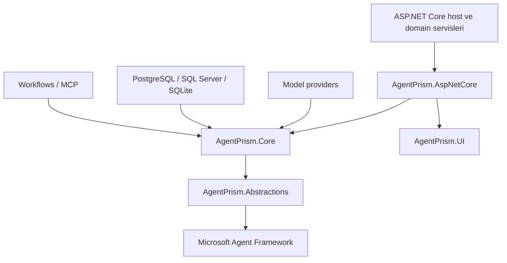
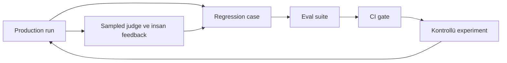
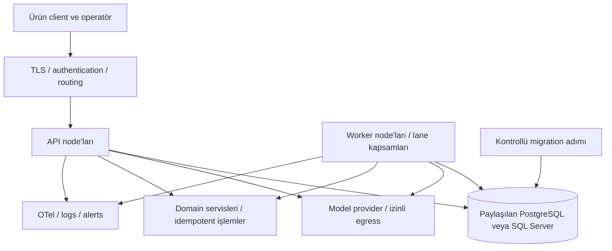

# AgentPrism — Kapsamlı Teknik ve Ürün Analizi

**İncelenen proje:** [agentprism.doayen.web.tr](https://agentprism.doayen.web.tr/)  
**İnceleme tarihi:** 7 Eylül 2026  
**Kapsam:** Mimari, public sözleşmeler, operasyon, güvenlik, geliştirici deneyimi, dokümantasyon tutarlılığı ve 1.0 yol haritası  
**Rapor niteliği:** Public dokümantasyon ve yayımlanmış API şemasına dayalı teknik değerlendirme; kaynak kod güvenlik denetimi veya çalıştırılmış ürün sertifikasyonu değildir.

---

## İçindekiler

1. [Yönetici değerlendirmesi](#1-yönetici-değerlendirmesi)
2. [Yöntem, kanıt düzeyi ve yayın durumu](#2-yöntem-kanıt-düzeyi-ve-yayın-durumu)
3. [Amaç, konumlandırma ve hedef kullanıcı](#3-amaç-konumlandırma-ve-hedef-kullanıcı)
4. [Mimari ve genişletme sözleşmeleri](#4-mimari-ve-genişletme-sözleşmeleri)
5. [Paketler, platformlar ve bağımlılıklar](#5-paketler-platformlar-ve-bağımlılıklar)
6. [Agent tasarımı, providers, tools ve context](#6-agent-tasarımı-providers-tools-ve-context)
7. [Persistence, recording ve sessions](#7-persistence-recording-ve-sessions)
8. [Workflows, jobs, async ve recovery](#8-workflows-jobs-async-ve-recovery)
9. [Evaluation, testing ve experiments](#9-evaluation-testing-ve-experiments)
10. [Governance, tenancy ve güvenlik](#10-governance-tenancy-ve-güvenlik)
11. [HTTP, OpenAI, MCP, A2A, clients, CLI ve UI](#11-http-openai-mcp-a2a-clients-cli-ve-ui)
12. [Observability ve production deployment](#12-observability-ve-production-deployment)
13. [Güçlü yönler, zayıflıklar ve risk kaydı](#13-güçlü-yönler-zayıflıklar-ve-risk-kaydı)
14. [Dokümantasyon drift ve önceki analizin düzeltmeleri](#14-dokümantasyon-drift-ve-önceki-analizin-düzeltmeleri)
15. [Önceliklendirilmiş özellik ve iyileştirme önerileri](#15-önceliklendirilmiş-özellik-ve-iyileştirme-önerileri)
16. [1.0 kabul ölçütleri ve uygulama sırası](#16-10-kabul-ölçütleri-ve-uygulama-sırası)
17. [Kaynak envanteri ve doğrulama kaydı](#17-kaynak-envanteri-ve-doğrulama-kaydı)

## 1. Yönetici değerlendirmesi

**AgentPrism, Microsoft Agent Framework (MAF) kullanan .NET uygulamalarına gömülen bir agent control plane olarak anlamlı ve kapsamlı bir tasarım sunuyor.** Agent çalıştırmanın çevresindeki definition yönetimi, run kanıtları, persistence, erişim kontrolü, değerlendirme, kuyruk, protokol entegrasyonu ve operatör konsolunu aynı sistemde topluyor. Temel değer önerisi, uygulama ekibinin bu operasyon katmanını sıfırdan yazmasını önlemek. [Ürün tanımı](https://agentprism.doayen.web.tr/getting-started/), [mimari](https://agentprism.doayen.web.tr/concepts/).

Bununla birlikte, **tasarım kapsamı ile doğrulanmış üretim olgunluğunu birbirinden ayırmak gerekiyor**. Dokümantasyon 3 Eylül 2026 tarihli `1.0.0-preview.1` sürümünü yayımlanmış olarak anlatıyor. İnceleme sırasında public NuGet araması sıfır sonuç verdi; `AgentPrism`, `AgentPrism.Core`, `AgentPrism.Abstractions` paket indeksleri ve npm `@agentprism/client` kaydı bulunamadı. Bu yüzden “paketleri kurup doğruladım”, “testleri geçiyor” veya “üretime hazır” sonucu çıkarılamaz. Private feed, henüz yayımlanmamış build veya başka dağıtım kanalı olasılıkları açık; bunlardan hangisinin geçerli olduğunu bilmiyoruz. [Release notes](https://agentprism.doayen.web.tr/reference/changelog/), [NuGet araması](https://azuresearch-usnc.nuget.org/query?q=AgentPrism&prerelease=true), [npm kaydı](https://registry.npmjs.org/@agentprism%2fclient).

**Mimari açıdan en güçlü taraflar:** MAF tiplerini korumak, genişletme noktalarını davranış sözleşmeleriyle tarif etmek, run'ı ortak kanıt modeli yapmak, SQL sağlayıcılarını aynı store sözleşmelerine oturtmak ve yetki/onay/telemetri hata davranışlarını bilinçli ayırmak. **En kritik açıklar:** yayın ve sürüm izlenebilirliği, side effect ile recovery arasındaki belirsiz sonuç penceresi, süreçler arası canlı iptal, yaklaşık bütçeler, kalıcı MAF state uyumluluğu ve aynı yeteneğin farklı erişim yüzeylerinde değişen davranışı.

Benim değerlendirmem: **Kontrollü bir .NET pilotu için güçlü aday; kritik, geri döndürülemez işlemleri otomatikleştiren production sistem için henüz yalnızca bu public kanıt yeterli değil.** 1.0 öncesinde yeni ekran ve provider sayısını büyütmekten daha yüksek değer taşıyan iş, mevcut sözleşmeleri tekrar üretilebilir release, failure testleri ve operasyonel kurtarma araçlarıyla kapatmak.

## 2. Yöntem, kanıt düzeyi ve yayın durumu

### 2.1 Neler incelendi?

- Referans verilen önceki konuşmanın erişilebilir içeriği okundu. Eski analizin uzun cevabı araç tarafından kesildiğinden, tam metnin birebir arşivlendiği iddia edilmiyor. Kullanıcının istediği konu kapsamı güncel kaynaklardan yeniden kuruldu.
- `/llms.txt` ve `/llms-full.txt` doğrudan indirildi. İlk dosya **21.193 bayt**, tam doküman **664.535 bayt**; kısa indeksteki üretim revizyonu **`d69f50ba`**. Revizyon yalnızca indeksin bildirdiği kimliktir; erişilebilir Git commit'iyle eşleştirilemedi.
- İndekste bulunan 55 benzersiz URL başarıyla alındı: **51 elle yazılmış dokümantasyon sayfası**, ana sayfa, .NET API giriş sayfası ve iki LLM dosyası. LLM dosyaları normal HTML sayfaları yerine tek başına yeterli sayılmadı; normal sayfalar da karşılaştırma için alındı.
- `IRunStore`, `IModelProvider`, `IStructuredResponseValidator`, `IRunAuthorizationHandler`, `IJobHandler`, `AgentDefinition`, `AgentPrismEndpointOptions` için üretilmiş .NET referans sayfaları erişim açısından kontrol edildi.
- Yayımlanan [OpenAPI JSON](https://agentprism.doayen.web.tr/openapi/agentprism.json) ayrıştırıldı: **127 path, 164 HTTP operasyonu, 269 component schema**. Operasyonlarda ortak `AgentPrism` etiketi dışında **23 alan etiketi** var. `info.version` değeri `v1`; bu NuGet sürüm numarası değildir.
- NuGet, npm ve GitHub public aramalarıyla proje kimliği ve dağıtım iddiası kontrol edildi.

Web okuma aracının siteyi açamaması üzerine HTTPS içerikleri doğrudan HTTP istemcisiyle alındı. Yerel Python sertifika deposu hatası da sistemin çalışan HTTPS istemcisi kullanılarak aşıldı; bunlar sitenin genel olarak erişilemez veya TLS açısından hatalı olduğu sonucu değildir.

### 2.2 Rapordaki ifadelerin anlamı

| Etiket / ifade | Kanıt düzeyi |
|---|---|
| **Doğrudan doğrulandı** | Erişilen kaynak veya dosya üzerinde sayıldı/gözlendi: örneğin OpenAPI operasyon sayısı ve registry cevabı. |
| **Dokümante ediliyor / destek var** | Resmî proje dokümantasyonunda tanımlanan sözleşme. Çalışan binary üzerinde doğrulanmış davranış anlamına gelmez. |
| **Analiz / risk** | Belgelenen davranışın mühendislik sonucu veya açıkça belirtilmiş belirsizlik. |
| **Öneri** | Bu raporun önerisi; mevcut API veya geliştiricinin resmî yol haritası değildir. |

Aşağıdaki özellik anlatımlarında “var” ifadesi, ayrıca belirtilmedikçe **dokümantasyonda tanımlanmış yetenek** anlamında kullanılmıştır. Architecture testleri, tenant contract testleri, AOT ölçümleri ve tarayıcı E2E testleri hakkındaki ifadeler de projenin iddialarıdır; test kodu/CI çıktısı bağımsız çalıştırılmadı.

### 2.3 Public dağıtım kontrolü

| Yüzey | 7 Eylül 2026 bulgusu | Çıkarılabilecek sonuç |
|---|---|---|
| Proje release notes | `1.0.0-preview.1`, 2026-09-03, initial public preview diyor. | Yazarın yayın iddiası mevcut. |
| `nuget.org/packages/AgentPrism` | HTTP 404. | Bu adreste public paket bulunamadı. |
| NuGet flat-container: meta/Core/Abstractions | Üçünde de 404 / `BlobNotFound`. | Temel paket sürümleri public registry üzerinden doğrulanamadı. |
| NuGet araması, prerelease dahil | `totalHits: 0`. | Arama anında AgentPrism sonucu yok. |
| npm `@agentprism/client` | HTTP 404 / `Not found`. | Belgelenen npm kurulum yolu doğrulanamadı. |
| GitHub `AgentPrism language:C#` araması | `total_count: 0`. | Bu sorguyla public C# repository bulunamadı; repository yokluğu kanıtlanmış değil. |
| Site üzerindeki proje repo/lisans izi | İncelenen ana sayfa ve tam dokümanda doğrulanabilir proje GitHub adresi/lisans beyanı bulunamadı. | Açık kaynak lisansı, sahiplik, güvenlik bildirim kanalı ve bakım modeli belirsiz. |

[NuGet paket sayfası](https://www.nuget.org/packages/AgentPrism), [Core indeksi](https://api.nuget.org/v3-flatcontainer/agentprism.core/index.json), [Abstractions indeksi](https://api.nuget.org/v3-flatcontainer/agentprism.abstractions/index.json), [GitHub API araması](https://api.github.com/search/repositories?q=AgentPrism%20language%3AC%23).

**İsim çakışması:** Evil Martians'ın React trace görselleştirme kütüphanesi ile `agentprism/agentprism-workflows` TypeScript/ACP projesi farklı ürünlerdir. Bunların GitHub yıldızları, lisansları veya sürümleri bu rapordaki .NET projesine aktarılamaz. [Evil Martians projesi](https://github.com/evilmartians/agent-prism), [ACP workflow projesi](https://github.com/agentprism/agentprism-workflows).

## 3. Amaç, konumlandırma ve hedef kullanıcı

### 3.1 Hangi problemi çözüyor?

Bir agent'ın model ve tool çağırması, onu işletilebilir bir ürün yapmaya yetmez. AgentPrism şu soruları uygulamanın içinde yanıtlamayı hedefliyor: Hangi definition çalıştı? Hangi tenant/user başlattı? Ne kadar kaynak tüketti? Neden başarısız oldu? İnsan onayı gerekiyor mu? Konuşma sürdürülebilir mi? Prompt değişikliği kaliteyi bozdu mu? İşlem worker'a alınabilir mi?

Bu yüzden en doğru konumlandırma **“MAF tabanlı agent uygulamaları için gömülü operasyon ve yönetişim katmanı”**. Hosted SaaS, kullanıcı/rol yönetim ürünü, şeffaf LLM proxy veya her dilde çalışan yeni agent runtime değildir. ASP.NET Core host'un kimliği, konfigürasyonu ve veritabanıyla birleşir. Runtime katmanını HTTP ve UI olmadan seçmek de mümkündür. [Ürün tanımı](https://agentprism.doayen.web.tr/getting-started/), [capability map](https://agentprism.doayen.web.tr/capabilities/).

### 3.2 Kimler için uygun?

| Kullanıcı / senaryo | Uyum | Gerekçe ve sınır |
|---|---|---|
| Mevcut ASP.NET Core SaaS'ına agent ekleyen ekip | Yüksek potansiyel | Identity, tenant, storage ve domain tool'larını host'ta tutabilir; entegrasyon dikişleri bunun için tasarlanmış. |
| Birden çok agent işleten kurum içi platform ekibi | Yüksek potansiyel | Ortak run/eval/governance modeli tekrarlı platform işini azaltır; fleet işletimini ayrıca doğrulamak gerekir. |
| PostgreSQL kullanan .NET ürün ekibi | Yüksek potansiyel | Durable store ve isteğe bağlı pgvector aynı sağlayıcıda. |
| SQL Server standardı olan kurum | Orta-yüksek | Operasyonel persistence var; built-in vector knowledge yok. |
| Tek agent ve birkaç basit model çağrısı | Koşullu | Geniş control plane bakım ve kavram maliyeti, ihtiyaçtan büyük olabilir. |
| Python ağırlıklı ekip veya hosted ürün isteyen kullanıcı | Düşük runtime uyumu | HTTP istemcisi olabilir; uygulamanın agent runtime'ını bu .NET kütüphanesine taşımak ayrı karar. |
| Kesintisiz, uzun ömürlü iş süreçleri ve sert maliyet tavanı | Koşullu | Checkpoint var; sürümler arası state uyumu ve kesin bütçe garantisi yok. |
| Ödeme, silme, dış sisteme yazma gibi kritik otomasyon | Kontrollü pilot | Effect metadata ve approvals yararlı; domain idempotency ve belirsiz sonuç çözümü uygulamaya ait. |

.NET ve SQL ağırlıklı mevcut ürünlerde en güçlü kullanım, AgentPrism'i **host'un domain kararlarının sahibi olmadan** kullanmak: sipariş/iade yetkisi uygulamada, agent run yaşam döngüsü AgentPrism'de. Böylece operasyon katmanını paylaşırken domain güvenliğini prompt veya framework varsayılanına bırakmazsın.

## 4. Mimari ve genişletme sözleşmeleri

### 4.1 Katmanlar

Dokümantasyon bağımlılık yönünü tek yönlü, cyclesız ve architecture testleriyle denetlenen bir yapı olarak anlatıyor. HTTP katmanı opsiyonel motorlara abstractions üzerinden erişiyor. Workflow paketi olmayınca definition yönetimi çalışabiliyor, execution endpoint'i `501` dönüyor. [Mimari](https://agentprism.doayen.web.tr/concepts/).

**Önemli ifade düzeltmesi:** “MAF'ı wrap etmiyor” yalnızca yeni bir paralel domain tip hiyerarşisi kurmaması anlamında doğrudur. Gerçekte `AIAgent` etrafına `DelegatingAIAgent` decorator'ları sarılıyor. `AIAgent`, `AgentSession`, `ChatMessage`, `AIFunction` korunuyor; davranış dekorasyonu ortadan kalkmıyor.

### 4.2 Başlıca extension seams

| Sözleşme / giriş noktası | İşlev | Uygulama etkisi |
|---|---|---|
| `IAgentSource`, `AddAgentSource<T>()` | Git, başka DB veya harici runtime'dan agent sağlama | Custom source management yüzeyinde salt okunur; catalog pipeline korunur. |
| `IModelProvider`, `AddModelProvider()` | Yeni model sağlayıcısı | Ortak run/governance ile çalışırken provider özellik çevirisi adapter sorumluluğundadır. |
| `IAgentDecorator`, `AddAgentDecorator<T>()` | Agent çevresine davranış ekleme | `Order` hata, süre ve recording kapsamını etkiler. |
| `IRunStore` ve diğer store arayüzleri | Persistence değiştirme | Tenant, sıra, concurrency ve aggregate davranışları da uygulanmalıdır. |
| `IRunJudge`, `AddEvalCheck()` | Domain kalite ölçümü | Deterministik veya model temelli kriter eklenebilir. |
| `IJobHandler`, `AddJobHandler<T>()` | Kuyruğa yeni iş türü | Exact handler key; en az bir kez çalıştırma sözleşmesi. |
| `IProviderRetryClassifier`, hata sınıflandırma seams | Transient hata/fallback kararları | Kalıcı hata ve iptal yanlışlıkla yeniden denenmemeli. |
| `IToolArgumentsValidator`, `IStructuredResponseValidator` | Input/output doğrulama | Schema tanımlamak ile schema'yı uygulamak arasındaki boşluğu kapatır. |
| `IContentGuard`, `IArchiveSink`, `IEmbeddingGenerator` | İçerik kontrolü, arşiv ve embedding | Harici sisteme bağlanırken maliyet ve hata semantiği ayrıca yönetilir. |

[Capability map](https://agentprism.doayen.web.tr/capabilities/), [custom store](https://agentprism.doayen.web.tr/guides/write-your-own-store/), [custom decorator](https://agentprism.doayen.web.tr/guides/write-your-own-agent-decorator/), [custom job](https://agentprism.doayen.web.tr/guides/write-your-own-job-handler/).

### 4.3 Host'a gömülmek için yedi bağlama noktası

| Arayüz | Host'un sağlaması gereken bilgi / davranış | Varsayılan |
|---|---|---|
| `ITenantContext` | Güvenilir tenant kimliği; `ITenantStore` ile tenant kaydı | Built-in çözümleyici. |
| `IRunAttributionContext` | User ve iş etiketleri | Kimlik alanları boş kalır. |
| `IToolAuthorizationHandler` | Çağıran bu tool'u kullanabilir mi? | İzin verir; custom handler exception'ı reddeder. |
| `IRunAuthorizationHandler` | Run başlatma ve run/session erişimi | İzin verir; exception reddeder. |
| `IRunEventSink` | Event'i host bus/channel'a aktarma | Best-effort köprü; durable outbox değildir. |
| `IAttachmentStorage` | Blob/object storage | İçerik veritabanında kalır. |
| `IToolApprovalPresenter` | Ham argümanı insanın anlayacağı entity açıklamasına dönüştürme | Ham argüman gösterilir; presenter hatası onayı durdurmaz. |

`TryAdd` host'un önceden yaptığı kaydı korur. `RequireCustomBinding<T>()` unutulan custom binding'i startup hatasına çevirebilir; handler'ın verdiği kararın doğru olduğunu kanıtlamaz. Diagnostics etkinse hangi bağlamaların built-in kaldığı görülebilir. `AgentPrismRunContext` tool gövdesine run/tenant/user bağlamını taşır. [Embedding rehberi](https://agentprism.doayen.web.tr/guides/embedding/).

**Trade-off:** Arayüz değiştirebilmek vendor bağımlılığını azaltır; ancak store sayısı ve davranış kapsamı custom backend maliyetini artırır. “MongoDB adapter'ını birkaç CRUD metodu ile yazarım” yaklaşımı burada gerçekçi değildir. Envanter `IRunStore` dahil 33 store arayüzünden söz ediyor; birini değiştirmek bütün persistence ailesini değiştirmek değildir.

## 5. Paketler, platformlar ve bağımlılıklar

Dokümantasyon **20 NuGet paketi** tanımlıyor. Aşağıdaki tablo kurulumun registry'den başarıyla yapıldığını değil, belgelenen paket ayrımını gösterir. Meta paket sekiz runtime paketini doğrudan veya transitif getiriyor. [Paket seçimi](https://agentprism.doayen.web.tr/packages/).

| Paket | Sorumluluk | Meta içinde |
|---|---|---:|
| `AgentPrism` | Meta paket, kendi runtime assembly'si yok | — |
| `AgentPrism.Abstractions` | Contracts, records, enums | Evet |
| `AgentPrism.Core` | Catalog/compiler/tools/recording/stores/jobs/eval/governance | Evet |
| `AgentPrism.PostgreSql` | SQL persistence, opsiyonel pgvector | Evet |
| `AgentPrism.OpenAI` | Chat Completions, Responses, compatible endpoint | Evet |
| `AgentPrism.AspNetCore` | HTTP, authorization, OpenAI hosting | Evet |
| `AgentPrism.Workflows` | Orchestration/checkpoint | Evet |
| `AgentPrism.Mcp` | Remote MCP client | Evet |
| `AgentPrism.UI` | Gömülü React konsol ve widget | Evet |
| `AgentPrism.SqlServer` | SQL Server persistence | Hayır |
| `AgentPrism.Sqlite` | Tek düğüm/local persistence | Hayır |
| `AgentPrism.Anthropic` | Claude adapter | Hayır |
| `AgentPrism.Google` | Gemini adapter | Hayır |
| `AgentPrism.Azure` | Azure OpenAI adapter | Hayır |
| `AgentPrism.Voice` | Speech araçları, ElevenLabs ve speech contracts | Hayır |
| `AgentPrism.Testing` | Fake provider, gerçek pipeline test host'u | Hayır |
| `AgentPrism.Testing.Contracts.Xunit` | Tüketilebilir davranış contract suite'leri | Hayır |
| `AgentPrism.Templates` | `dotnet new agentprism-api` | Hayır |
| `AgentPrism.Client` | Generated .NET management istemcisi | Hayır |
| `AgentPrism.Cli` | Migration, health ve eval CLI | Hayır |

`@agentprism/client` ayrı npm paketidir, 20 NuGet sayısına dahil değildir. `AgentPrism.Generators` Core içinde taşınan build-time analyzer/generator projesidir; ayrı public NuGet paketi değildir.

### 5.1 Target framework ve AOT

Runtime paketleri `net8.0`, `net9.0`, `net10.0`; Testing ve CLI `net10.0`; Templates `net10.0` proje üretir; generator `netstandard2.0` hedefler. Contract test paketi net8/9/10 olarak listeleniyor. [Uyumluluk](https://agentprism.doayen.web.tr/reference/compatibility/).

**AOT sözü verilen sekiz paket:** Abstractions, Core, PostgreSql, OpenAI, Anthropic, Google, Azure, Voice. Bu liste **tüm ürün Native AOT çalışır** anlamına gelmez. AspNetCore, UI, MCP, Workflows, Sqlite ve meta paket için söz yok; SqlServer temiz ölçülmüş olsa da canlı query garantisi verilmediği belirtiliyor. Client için de analyzer/generator sınırları nedeniyle AOT sözü yok.

Generated tools tercih edildiğinde reflection gereksinimi azaltılıyor; delegate/scanning convenience API'leri trimming/dynamic-code uyarıları taşıyor. Bu bilinçli sınır, paket pazarlamasında tek bir “AOT supported” rozeti kullanmaktan daha dürüst. Ancak binary ve canlı provider testleri erişilebilir olmadığından doğrulanmış deployment matrisi olarak kabul edilmemeli.

### 5.2 Bağımlılık disiplini

SQL katmanında ORM/EF Core bağımlılığı yok. SQL provider'larının `DbDataSource` kabul etmesi host'un EF Core bağlantı havuzuyla paylaşımı mümkün kılıyor; **aynı pool kullanımı aynı transaction veya ortak unit-of-work demek değildir**. UI hazır ve Brotli sıkıştırılmış asset olarak geliyor, tüketici projeye Node build adımı eklemiyor. Google adapter'ın transitif Newtonsoft.Json/System.Management/System.CodeDom maliyeti belgelenmiş. [Paketler](https://agentprism.doayen.web.tr/packages/), [EF Core entegrasyonu](https://agentprism.doayen.web.tr/guides/ef-core/).

Public API dosyaları (`PublicAPI.Shipped.txt`, `PublicAPI.Unshipped.txt`) değişiklikleri build seviyesinde görünür kılıyor. Bu mekanizma kazara API drift'ini yakalar; kasıtlı breaking change'i engellemez. Pre-1.0 için public API, migration, config ve provider davranışları arasında uyumluluk sözü verilmediği açıkça yazıyor. Site `main` dalını tarif ettiği için kurulu paketle aynı sözleşme olmayabilir. [Versioning](https://agentprism.doayen.web.tr/reference/versioning/).

## 6. Agent tasarımı, providers, tools ve context

### 6.1 Definition modeli

`AgentDefinition`, prompt/model dışında tool ve skill seçimleri, callable agent listesi, parameters, compaction, memory, harness, runtime policy ve metadata taşır. Database definition'ları validation, version, diff ve rollback ile yönetilir; aynı isimde code definition önceliklidir ve UI'dan değiştirilemez. Factory registration herhangi bir MAF `AIAgent` döndürebilir; catalog çözümlemesi decorator'ları yine uygular. [Agents](https://agentprism.doayen.web.tr/concepts/agents/).

Validation provider/tool/skill referanslarını ve graph/policy şekillerini model çağırmadan kontrol eder. Bu, bozuk definition'ı kaydetmeden reddetmek açısından değerlidir; modelin gerçek cevabını veya tüm provider feature'larını doğrulamaz.

Instructions tarafında culture anahtarlı içerikler, run'a özel `{{name}}` parametreleri ve shared instruction block var. Parametre substitution expression engine değildir; condition/loop/member access çalıştırmaz. Shared block başka block'a zincirlenemez. Bu sınırlamalar düşük karmaşıklık ve daha dar saldırı yüzeyi sağlar. Buna rağmen operasyonel prompt değişikliği ürün davranışını değiştirdiği için **deploy gerekmemesi review gerekmemesi anlamına gelmez**.

### 6.2 Providers ve model kontrolü

| Provider | Giriş | Dikkat edilmesi gereken |
|---|---|---|
| OpenAI | `UseOpenAI()` | `openai` ve `openai-responses` ayrı binding isimleri. |
| OpenAI-compatible | `UseOpenAICompatible(name, …)` | `{name}-responses` opsiyonel; bütün uyumlu servisler Responses desteklemez. |
| Anthropic | `UseAnthropic()` | Upstream zorunlu output limit için dokümante default 4.096; caching/thinking ayarları ayrı. |
| Google | `UseGoogle()` | Gemini safety/thinking özellikleri provider settings üzerinden. |
| Azure OpenAI | `UseAzureOpenAI()` | Model alanı deployment adıdır; API key veya host'un verdiği credential kullanılabilir. |
| Özel adapter | `IModelProvider` | Feature mapping ve hata sınıflandırması tüketici sorumluluğuyla genişler. |

Model katalogları boş başlar; isim ve fiyat uydurulmaz. Katalog seçim/health/cost içindir, **model allowlist değildir**. Katalogda bulunmayan model çalışabilir; bu nedenle model erişim kontrolünü katalogla yapamazsın. Credential definition'a gömülmez. [Provider rehberi](https://agentprism.doayen.web.tr/guides/model-providers/), [uyumluluk](https://agentprism.doayen.web.tr/reference/compatibility/).

`ModelBinding.Fallbacks` transient hatalarda başka provider'a geçebilir; kullanılan provider/model run'a yazılır. Non-streaming bir turn'de tamamlanan aynı tool çağrısını fallback'te yeniden işletmemek için paylaşılan ledger anlatılıyor. Streaming fallback ilk chunk öncesiyle sınırlı. Bu ledger, süreç çökmesi sonrasında bütün dış etkileri deduplicate eden genel bir işlem günlüğü değildir. [Reliability](https://agentprism.doayen.web.tr/guides/reliability/).

### 6.3 Tools: güçlü kontrol hattı, önemli yan etki sınırları

Generated, doğrudan `AIFunction`, delegate, attributed scanning ve scoped registration yolları var. Kod tool registry'si startup snapshot'ıdır; remote MCP ayrı dinamik katalog kullanır. Tool instance'ları normalde singleton olduğundan tenant/run durumunu mutable instance alanlarında tutmak güvenli değildir. `AllowConcurrentToolCalls=false` yalnızca bir turn içindeki paralelliği kapatır; farklı run'lar zaten eşzamanlı çağırabilir. Scoped domain dependency için `AddScopedTool` tercih edilmeli. [Tools](https://agentprism.doayen.web.tr/concepts/tools/).

Authorization → argument validation → timeout → approval → tool gövdesi şeklinde belgelenen kontrol hattı var. Yetki reddi modelin görebildiği tool sonucu olabilir; validator hatası `ToolFailed` üretebilir. “Tool başarısızsa mutlaka run da başarısızdır” varsayımı doğru değildir.

**Kritik sınırlar:**

- `Effect=Destructive/External` etiketi tek başına izin veya onay kapısı değildir. Yetki, approval policy ve domain invariant ayrı uygulanır.
- Tool timeout yalnızca beklemeyi kesiyor; gövdeyi zorla durdurmuyor ve ona timeout'a bağlı linked token vermediği belgeleniyor. Süresi dolmuş görünen ödeme çağrısı dış sistemde sonradan tamamlanabilir.
- `SafeToRepeat`, interrupted run continuation için anlamlı; MAF'ın aynı turn içindeki throwing tool retry davranışını ortadan kaldırmaz. Doküman default hata tekrar sınırını 3 olarak veriyor.
- Schema'ya DataAnnotations constraints eklenmesi bunların runtime'da otomatik uygulandığı anlamına gelmez. `IToolArgumentsValidator` gerekli olabilir.
- Tool çıktı boyutu varsayılan olarak sınırsız. `DefaultMaxOutputBytes` veya tool-specific limit belirlenmeli. Canonical representation, guard ve truncation'ın gerçek içeriği incelemesini sağlar; kompleks dönüşler için generated serializer context gerekebilir.

[Custom tool rehberi](https://agentprism.doayen.web.tr/guides/write-your-own-tool/), [tool davranış sınırları](https://agentprism.doayen.web.tr/concepts/tools/).

### 6.4 Skills, memory ve RAG

Session history, compaction, working memory, sabit MCP resources ve vector knowledge birbirinden ayrılıyor. Compaction modelin gördüğü context'i daraltır; kalıcı run kanıtını silmez. Tool output limit tek cevabın büyüklüğünü, compaction birikmiş context'i sınırlar. Harness ve loop, tamamlanma kriterleri ile iteration limitlerini tanımlar; sırf compaction için harness açmak gerekmez. [Context and memory](https://agentprism.doayen.web.tr/guides/context-and-memory/).

Knowledge hattı ingest → chunk → embedding → pgvector/HNSW cosine search şeklinde. Built-in kullanım PostgreSQL, `EnableKnowledge=true` ve `IEmbeddingGenerator<string, Embedding<float>>` gerektirir. Agent'a collection kapsamlı `search_knowledge` verilir; ingestion yönetimi ayrı HTTP yetkisi taşır. Embedding dimension SQL kolon tipine yansır; model değişikliği dimension değiştiriyorsa migration ve yeniden embedding gerekir. [Knowledge](https://agentprism.doayen.web.tr/guides/knowledge/).

Skill metni ile skill script'i aynı güven kategorisi değildir. Script çalıştırma; enablement, interpreter allowlist, tenant grant, timeout/concurrency/output sınırları ve platform izolasyonu kabulüyle açılıyor. **AgentPrism bir OS sandbox sağlamadığını açıkça belirtiyor.** “Tool code yalnızca uygulama kodunda” ilkesi, etkin skill scripts ve remote MCP ile birlikte anlatılmalı; aksi halde güvenlik sınırı olduğundan dar görünür. [Tools/skills](https://agentprism.doayen.web.tr/concepts/tools/).

### 6.5 Structured output, multimodal ve voice

`ResponseFormat` text/JSON/JSON Schema talep edebilir. `StructuredResponse.Enabled` açılırsa JSON well-formedness kontrolü var; **built-in tam JSON Schema validator yok**. `IStructuredResponseValidator` domain/schema kontrolünü ekler ve exception'da kapalı davranır. `MaxRepairAttempts` bounded model repair sağlar; varsayılan sıfır. Repair yalnızca non-streaming ve session taşımayan run'larda uygulanır. Session'a MAF tarafından kaydedilmiş reddedilen draft ile kullanıcıya dönülen düzeltilmiş cevap ayrışmasın diye session'lı repair bastırılıyor. Streaming validation gönderilmiş içeriği geri alamaz. [Structured output](https://agentprism.doayen.web.tr/guides/structured-output/).

Attachment sistemi boyut ve magic-byte kontrolleriyle image/audio/PDF/text taşır; bu bir malware tarama garantisi değildir. OpenAI/Azure/Google image generator kayıtları opsiyoneldir, çıktı attachment olarak saklanır. Voice araçları ile canlı WebSocket konuşması ayrı katmanlardır; canlı konuşma uzun ömürlü bağlantıyı bir node'a bağlar. Speech/transcription/model/synthesis akışının her aşaması latency ve harcama üretir. [Multimodal](https://agentprism.doayen.web.tr/guides/multimodal/), [voice](https://agentprism.doayen.web.tr/guides/voice/).

## 7. Persistence, recording ve sessions

### 7.1 Persistence seçimi

| Özellik | In-memory | PostgreSQL | SQL Server | SQLite |
|---|---:|---:|---:|---:|
| Restart sonrasında veri | Hayır | Evet | Evet | Evet |
| Çok instance için önerilen | Hayır | Evet | Evet | Hayır |
| Okunabilir conversation/branch | Yok | Var | Var | Var |
| Built-in vector knowledge | Yok | pgvector ile | Yok | Yok |
| Migration lock | Yok | Advisory lock | `sp_getapplock` | Sidecar file lock |
| Versioned read view | Yok | Opt-in | Opt-in | Opt-in |
| ORM bağımlılığı | Yok | Yok | Yok | Yok |

[Persistence](https://agentprism.doayen.web.tr/getting-started/persistence/), [storage matrisi](https://agentprism.doayen.web.tr/reference/compatibility/).

SQL provider değiştirmek registration düzeyinde kolay; veri taşıma, collation, locking, throughput ve migration davranışları otomatik eşitlenmez. Default schema/table prefix ayrımı tenant izolasyonu değildir. Auto migrations açık gelir; prod'da kontrollü migration adımı daha öngörülebilirdir.

`runs_v1` metadata ve maliyet için opt-in, read-only SQL view'dır. İç tabloya bağımlı dashboard yazmaya göre daha iyi sözleşme sunar. Ancak **tenant filtresi içermez**; sorgulayan uygulama filtrelemelidir. Content kolonları view kapsamı dışındadır. Aynı veritabanına EF Core ile bağlanmak veya view okumak framework'ün HTTP yetki kontrollerini çalıştırmaz. [Read views](https://agentprism.doayen.web.tr/reference/read-views/).

### 7.2 Run recording

Run temel kanıt birimi: başlangıç/bitiş, status, events, model/tool çağrıları, tokens, cost, hata sınıfı, parent/child ilişkisi ve isteğe bağlı input aynı run kimliğinde toplanır. Recording dış decorator olduğundan toplam çevre davranışını ölçer; event writer sıraları tek noktadan üretir. [Runs](https://agentprism.doayen.web.tr/concepts/runs/).

Burada iki farklı garanti var:

1. **Event üretim sözleşmesi:** sıralı sequence, append-only event davranışı ve terminal durum.
2. **Kalıcı kanıtın dayanıklılığı:** recording best-effort; store hatası run'ı durdurmaz.

İkincisi nedeniyle “gapless event stream” ifadesi **depolama arızasında kayıpsız durable log** diye okunmamalı. Aynı şekilde `IRunEventSink` entegrasyonu her business event'in downstream'e kesin teslim edildiği anlamına gelmez.

Run stream'in `Last-Event-ID` desteği ile management run endpoint'inin canlı SSE sözleşmesi ayrı ele alınmalı; her SSE yüzeyinin frame isimleri ve resume semantiği aynı değildir. Custom event'ler `RunEventType.Custom` üzerinden aynı kanıt akışına katılabilir.

### 7.3 Replay

Recorded input, mevcut veya seçilen definition üzerinde yeniden çalıştırılabilir; tool replay mode ve mismatch kontrolü var. Replay bir prompt değişikliğini karşılaştırmak için değerlidir, fakat gerçek model nondeterminism'ini kaldırmaz. Tool sonucunu replay etmek ile tool'u yeniden icra etmek farklı risk taşır. Client-side tool içeren agent'lar, gerekli çağrı kaydı oluşmadığından dokümana göre replay edilemez. [Runs/replay](https://agentprism.doayen.web.tr/concepts/runs/), [capability sınırları](https://agentprism.doayen.web.tr/capabilities/).

### 7.4 Sessions ve concurrency

Session konuşma state'i, run bir turn'dür. `AgentSessionManager` create/load/save akışını yönetir. İlk yazma `TryCreateAsync`, sonraki yazma version kontrollü `TryUpdateAsync` kullanır. Yarışan iki turn sessizce birbirini ezmek yerine `AgentPrismSessionConflictException` üretir; HTTP'de `409`, başlamış SSE'de error event olarak görünür. [Sessions](https://agentprism.doayen.web.tr/concepts/sessions/).

**Analiz:** Bu optimistic concurrency koruması veri kaybını önler; model veya tool zaten çalıştıysa otomatik “turn'ü yeniden dene” politikası dış etkileri tekrar üretebilir. İstemcinin conflict retry'si domain idempotency ile birlikte tasarlanmalı.

SQL history adreslenebilir message item'larından oluşur. Branch belirtilen sequence'e kadar içeriği yeni conversation'a kopyalar; parent'a sonraki yazmalar paylaşılmaz. In-memory'de branch `501`; playground yalnızca tüm conversation'ı branch edebilirken session ekranı ara noktayı kullanabilir.

State envelope AgentPrism'e, serialize edilmiş body MAF'a aittir. `StateSchemaVersion` ve `StateMafVersion` problemi teşhis eder; migration sağlamaz. Uyumsuz body otomatik silinmez/resetlenmez, tanımlı hatayla kalır. Bu özellikle uzun süren approval ve workflow'ların rolling upgrade planını etkiler. [Versioning](https://agentprism.doayen.web.tr/reference/versioning/).

## 8. Workflows, jobs, async ve recovery

### 8.1 Workflow yeteneğinin gerçek kapsamı

Beş pattern var: **Sequential, Concurrent, Handoff, GroupChat, Magentic**. Handoff'ta karar modeldedir; Magentic manager agent gerektirir. Iteration ve alt çağrı bekleme sınırları sonsuz yönlendirme riskini azaltır. Typed function node'ları şu an yalnızca Sequential definition'da destekleniyor; diğer dört hazır builder agent kabul ediyor. [Workflows](https://agentprism.doayen.web.tr/concepts/workflows/).

Function handler registry oluşturulurken paylaşılan closure üretir; thread-safe olmalı. Function node ayrı model run'ı/token harcaması üretmez, fakat executor event'leriyle görünür. Retry policy transient node hatasını aynı super-step içinde tekrar deneyebilir.

Checkpointing açık gelir; restart durability SQL gerektirir. In-memory en fazla 50 checkpoint/session tutar. Resume **yeni run** açar; eski kaydı değiştirmez. Eski checkpoint'ten devam function side effect'ini yeniden çalıştırabilir. Human input bekleyen workflow'un checkpointing kapalıyken açık hata vermesi, devam edilemeyen bir bekleme yaratmaktan daha güvenli bir karar.

Bu yetenekleri tam bir durable business workflow motorunun bütün garantileriyle eşitlememek gerekir: deterministic history compatibility, saga compensation, timers ve işlem bazlı recovery kapsamı ayrı doğrulanmalıdır.

### 8.2 Job queue ve scheduling

`AddAgentPrism()` scheduling altyapısını ve worker'ı kaydeder; worker varsayılan olarak çalışır. `UseScheduling()` ayarları değiştirir. HTTP'den çağrılabilir handler key listesi kısıtlıdır; custom handler'ı dışarı açmak bilinçli opt-in. `IJobDispatcher.EnqueueAsync()` tanımlı handler'a iş verir. [Background work](https://agentprism.doayen.web.tr/guides/background-work/).

| Varsayılan | Değer | Operasyonel anlam |
|---|---:|---|
| `Scheduling.Enabled` / `RunWorker` | `true` / `true` | API node da worker olabilir; ayırmak gerekir. |
| `MaxConcurrentJobs` | 2 / process | Dört process varsayılan en fazla sekiz job slot'u oluşturur. |
| Poll interval | 10 saniye | Kuyruk başlangıç gecikmesinin parçasıdır. |
| Lease duration | 5 dakika | Renewal var; worker kaybında tekrar sahiplenme mümkün. |
| Job `MaxAttempts` | 3 | Agent async default'uyla karıştırılmamalı. |
| `AsyncRun.MaxAttempts` | 1 | Dış etkili agent işlerini körlemesine tekrar etmez. |
| `MaxItemsPerJob` | 1.000 | Batch boyutu sınırı. |

Cron beş alanlıdır; saniye ve `L/W/#` uzantıları yoktur. Time zone host tarafından doğrulanır; DST'de olmayan dakika atlanır, tekrarlanan dakika erken occurrence'a eşlenir. Manual trigger disabled schedule'ı da tetikleyebilir; schedule silmek oluşmuş job'ları iptal etmez.

**Lanes** iş türlerini ayırır. Worker lane listesi ve lane concurrency budget'ı alabilir; bazı ayar kombinasyonlarında listelenmeyen lane hiç lease edilmeyebilir. Queue depth gauge kapalı geldiğinden yalnızca worker “healthy” görmek yeterli değildir; lane backlog izlenmeli.

Kuyruk **at-least-once** semantiğinde. Custom handler yeniden denemede tamamlanmış item'ları atlamalı. Bir batch'te bazı item'lar başarılı, bazıları başarısızsa job `Completed` olabilir; `Completed = bütün item'lar başarılı` değildir. Bu ayrıntı raporlamada ve otomatik downstream trigger'larda önemlidir.

### 8.3 Async HTTP

Management run isteğinde `Prefer: respond-async`, `202 Accepted`, `Location` ve run/job kimliği üretir; bu patikada job ID ile run ID aynıdır. Başlangıç attachment listesi ve initial approvals kabul edilmez. Sonradan approval gerekirse session gerekir; karar ve continuation yeni run akışıyla ele alınır. Belgelerde otomatik resume ve yeni run başlatma anlatımı tam tutarlı değil; entegrasyon testinde açıkça doğrulanmalı. [Background work](https://agentprism.doayen.web.tr/guides/background-work/), [approvals](https://agentprism.doayen.web.tr/concepts/governance/).

### 8.4 HTTP idempotency

Yalnızca üç POST rotasında uygulanır: management agent run, `/v1/responses`, `/v1/chat/completions`. Key kullanmak management run'ı buffered JSON cevaba çevirir. Aynı tenant/key/method/path/**ham body** eşleşmesi tamamlanmış 2xx cevabı replay eder. [Reliability](https://agentprism.doayen.web.tr/guides/reliability/).

| Durum | Sonuç |
|---|---|
| Aynı istek hâlâ çalışıyor | `409` |
| Aynı key, farklı path veya ham body | `422` |
| `stream:true` ile key | `400` |
| Idempotency kapalıyken key | `501`, execution yok |
| İlk execution non-2xx veya exception | Reservation bırakılır; sonraki istek yeniden çalışabilir |
| Başarı sonrası aynı istek | Saklanan cevap ve `Idempotency-Replayed: true` |

JSON alan sırası/whitespace değişirse semantic olarak aynı istek farklı fingerprint alabilir. Key ve serialize edilmiş body transport retry boyunca aynı tutulmalı. Crash sonrası `InProgress` reservation kalabilir; SQL yalnızca kaydı paylaşır, dış işlemin tamamlanıp tamamlanmadığını çıkaramaz. **HTTP response idempotency, ödeme/iade/silme tool'u için exactly-once garantisi değildir.**

### 8.5 Cancellation, reconciliation, continuation ve drain

| Mekanizma | Mevcut sınır | Sonuç |
|---|---|---|
| Live cancel | In-process registry | Yanlış node'a giden iptal `409`; sticky routing veya custom dağıtık çözüm gerekir. |
| Queued cancel | Shared job store | Cross-process isteği taşıyabilir; çalışan kod yine cancellation'a uymalı. |
| Reconciliation | Opt-in heartbeat/scanner | Stale `Running` kaydı `Failed/orphaned` yapılır; queued iş job leasing'e aittir. |
| Continuation | Opt-in, session-bound, yeni run | Recorded tamamlanmış tool sonuçları replay edilir; riskli effect'ler `SafeToRepeat` olmadan engellenir. |
| Singleton services | Opt-in dağıtık lease | Periyodik servis sahipliği; dış etki exactly-once değil. |
| Drain | Opt-in, default timeout 30 saniye | Yeni run `503`, worker yeni lease almaz; bitmeyen iş host timeout'uyla kesilir. |

[Recovery rehberi](https://agentprism.doayen.web.tr/guides/reliability/).

Reconciliation default heartbeat 30 saniye, orphan threshold 5 dakika, scan 1 dakika. DB erişim sorunu sağlıklı worker'ı orphan gibi gösterebilir. “Run failed oldu” ile “dış etki kesin durdu” aynı bilgi değildir. Root cancel child'lara yayılır; child cancel root/sibling'leri iptal etmez.

## 9. Evaluation, testing ve experiments

### 9.1 Kalite döngüsü

Run'dan case üretmek, hatayı tekrarlanabilir geliştirme girdisine dönüştürüyor. Bunun multi-turn konuşma desteği sınırlı: önceki turn'ü olan run'ın tek query olarak promotion'ı reddediliyor. [Evaluation](https://agentprism.doayen.web.tr/concepts/evaluation/).

### 9.2 Eval suite ve CI

Altı built-in check listeleniyor: `nonEmpty`, `containsExpected`, `keywords`, `toolCalled`, `toolCallsPresent`, `hasImageContent`. Custom `AddEvalCheck` eklenebilir; boş check listesi veya bilinmeyen kind sessiz başarı üretmez. `expectedTools` alanının bulunması otomatik tool assertion demek değildir; `toolCalled` tool listesini suite check'inden alır.

Baseline diff sonuçları Regressed/Fixed/StillFailing/Unchanged/Added/Removed olarak ayrılır. Retention nedeniyle kısmi history kalmışsa karşılaştırma reddedilir. CLI absolute pass-rate/failure kapılarına ek relative regression kapısı sağlayabilir; ilk suite run'ında baseline yoksa relative gate atlanır. Bu durumda pipeline “regresyon yokluğu kanıtlandı” diye yorumlamamalı.

**Reproducibility açığı:** Case içeriği run bazında snapshot değil. HTTP case replacement yeni ID verir; tüm listeyi tekrar göndermek unchanged case kimliğini de değiştirebilir. Store üzerinden kimliği koruyup içeriği değiştirmek ise tespit edilmeyen farklı-soru karşılaştırmasına yol açabilir. İmmutable case revision ve suite snapshot önerisinin temeli budur. [Eval diff sözleşmesi](https://agentprism.doayen.web.tr/concepts/evaluation/).

### 9.3 Testing

`FakeModelProvider`, scripted tool çağrısı ve model cevabı üretir; `AgentPrismTestHost` gerçek HTTP/catalog/tool/recording/SSE hattını in-memory çalıştırır. `RunAssertions` saklanmış kanıttan kontrol yapar. Bu, iç implementation mock'larına aşırı bağlanmayı azaltır. Ancak prompt'un gerçek modeldeki kalitesini, provider token/schema uyumunu veya SQL locking/migration davranışını kanıtlamaz. [Testing](https://agentprism.doayen.web.tr/guides/testing/).

`Testing.Contracts.Xunit` provider/store/judge/source/tool/job gibi extension ailelerinin davranışını denetlemek için yayımlanacağı belirtilen contract paketidir. Store isolation iki tenant yönünde test edilir; public method coverage gate anlatılır. Bu iyi bir framework disiplini, fakat load/chaos testinin yerine geçmez. [Custom store sözleşmesi](https://agentprism.doayen.web.tr/guides/write-your-own-store/).

### 9.4 Online evaluation, feedback ve experiments

Online judge sampling, bounded background maliyet yaratır. Summary in-memory resetlenebilir; otoriter rapor stored score'lardan gelmelidir. Human/judge skorları aynı listede source ve kriter adıyla taşınır; null measurement ile sıfır ayrılır. [Evaluation](https://agentprism.doayen.web.tr/concepts/evaluation/).

Experiment iki **database agent version** arasında, toplam 100 olan ağırlıklarla çalışır; agent başına bir running experiment. Assignment yalnızca management run endpoint'inde: OpenAI yüzeyi ve child çağrıları dahil değildir. Sistem istatistiksel kazanan ilan etmez. Canary rollback explicit policy gerektirir; kontrol/canary sonucu okumada yeniden hesaplanır. Bu dürüst sınır iyi, fakat farklı ingress kullanan ürünlerde deneyin gerçek trafiğin küçük bir bölümünü temsil etmesi riski var.

## 10. Governance, tenancy ve güvenlik

### 10.1 Kimlik ve tenant sınırı

Tenant çözümlemede doğrulanmış API key öncelikli; key/header çelişkisi `403`. Claim type ayarlanmışsa header yolu okunmaz; header ayrıca açılmalıdır. Varsayılan single tenant'tır. Query'ler resolved tenant'ı taşır; framework otomatik DB row-level security kurmaz. [Governance](https://agentprism.doayen.web.tr/concepts/governance/).

API key'ler hash'lenir, revoke/expiry/tenant/scope taşır; raw değer yalnız creation'da görünür. Etkin yetki **role ∩ scope**. Scope role yaratmaz. Reader/Operator/Admin politikaları host tarafından bağlanır; `RequireRolePolicies=true` eksik binding'i startup hatası yapar. User directory ve rol ataması framework içinde değildir. [Security](https://agentprism.doayen.web.tr/getting-started/security/), [scope tablosu](https://agentprism.doayen.web.tr/reference/compatibility/).

### 10.2 Tenant, user ve session ownership aynı şey değil

Default tenant içindeki Reader bütün session'ları görebilir. `SessionOwnership.Enabled` açıldığında owner server attribution'dan gelir, liste filtresi pagination öncesinde uygulanır; başka owner'a erişim `404`. Eski unowned kayıtların davranışı ve `RefuseUnownedSessions` migration sırasında ele alınmalı. Bu özellik tüm run içeriği için otomatik kullanıcı izolasyonu sağlamaz; run-resource yetkileri için `IRunAuthorizationHandler` gerekir. [Sessions](https://agentprism.doayen.web.tr/concepts/sessions/), [embedding](https://agentprism.doayen.web.tr/guides/embedding/).

User attribution request body'den kabul edilmez; host'un güvenilir identity pipeline'ından alınır. Background işte HTTP context yoktur: tenant/user bağlamını enqueue ve execution arasında doğru taşımak custom integration'ın kritik işidir.

### 10.3 Approval

In-band ve durable mailbox şekilleri var. Bekleme ve karar sonrası execution ayrı run kayıtlarıyla kanıtlanır. Code approval policy stored rule'lardan önce gelir ve `Required` diyorsa UI rule'u bunu gevşetemez. Exception approval gerektiren sonuç verir. Standing rule exact argument hash, AND koşulları veya tool geneli olabilir; **standing rule'lar expire olmaz**, revoke/review gerekir. [Governance/approvals](https://agentprism.doayen.web.tr/concepts/governance/).

Presenter entity adını ve açıklamayı zenginleştirir; timeout/hata durumunda raw arguments yine gösterilir. Presenter güvenlik kapısı değildir. Approval decision audit yazımı başarısızsa karar uygulanmaz. Bu, normal best-effort audit'e kasıtlı istisnadır; skill scripts de kritik audit davranışı taşır.

**Analiz:** Onay anındaki sipariş durumu execution anında değişebilir. Güzel entity adı göstermek TOCTOU riskini çözmez; fiyat/tutar/entity version ve gerçek işlem payload'ı execution öncesinde yeniden doğrulanmalı.

### 10.4 Guardrails

`IContentGuard` Allow/Mask/Block kararları ve en sıkı sonucu uygular. Kontrol tool loop içinde olduğundan modelin sonraki çağrısına dönen tool sonucu da incelenir. Source alanı user/tool/document/model/skill ayrımını verir; Unknown daha gevşek ele alınmamalı. Input masking recording öncesi uygulandığı için saklı ham kopya bırakılmadığı belirtiliyor. [Content guards](https://agentprism.doayen.web.tr/concepts/governance/).

Pattern PII ve denied-term kontrolü yararlı, ama kapsamlı veri kaybı önleme veya prompt injection çözümü değildir. `documents` kanalındaki ayraç ve provenance de güvenlik garantisi değil; içeriğin talimata dönüşmesini model seviyesinde kesin önleyemez. Asıl güven sınırı tool authorization, parameter validation ve host domain kurallarıdır.

### 10.5 Quotas, rate limits ve bütçeler

| Kontrol | Scope / zaman | Garantisi |
|---|---|---|
| HTTP rate limit | Process içi kısa pencere | Cluster genelinde ortak hız tavanı değil. |
| Tenant/agent quota | SQL, gün/ay; run/token/cost | Admission öncesi check, completion sonrası accounting; overshoot olabilir. |
| Run-tree budget | Root ve child ağacı | Token/cost/duration model turn'leri arasında kontrol edilir. |
| Provider concurrency | Yerel runtime kontrolü | Provider'a giden çağrıları bekletir; global hesap kotası garantisi çıkarılamaz. |

Quota rule yoksa sınırlama yoktur. Threshold webhook'u 80/100 gibi yüzdelerde bildirim üretir; durdurma kararı değildir. Root run stream'ine threshold yazımı opt-in. Agent graph default depth 3, child run sayısı 25, total token 200.000; cost/duration sınırı varsayılan tanımlı değil. Paralel turn'ler bütçeyi aşabilir, fiyatı bilinmeyen modelde cost kontrolü token sınırına dayanır. [Governance](https://agentprism.doayen.web.tr/concepts/governance/), [reliability](https://agentprism.doayen.web.tr/guides/reliability/).

### 10.6 BYOK, egress, audit ve içerik koruma

Tenant provider binding secret değerini değil config key adını saklar. Eksik binding shared credential'a gider; mevcut ama çözülemeyen binding sessiz fallback yapmaz. Tenant egress policy provider erişimini daraltır. Endpoint egress guard private target, DNS/socket bağlantısı ve webhook/MCP/provider çıkışlarını kontrol eder. Local model senaryosunda private network izni dar kapsamlı yapılandırılmalı. [Providers](https://agentprism.doayen.web.tr/guides/model-providers/), [security](https://agentprism.doayen.web.tr/getting-started/security/).

Audit tenant bazında hash chain ile değişiklik/gap tespiti sunar. Bu **tamper-evident**, otomatik olarak tamper-proof veya harici noterli log değildir. Tüm DB ve zinciri yeniden yazabilen saldırgana karşı dış anchor/WORM olmadan aynı güvence çıkarılamaz. Eski hash'siz kayıtlar doğrulamadan dışlanır. Genel audit best-effort olduğundan compliance açısından kritik olayların dayanıklılık gereksinimi ayrıca seçilmelidir. [Governance](https://agentprism.doayen.web.tr/concepts/governance/).

`AddContentProtection` AES-256-GCM ile belirli içerik kolonlarını korur. Default kapalı; yalnız yeni yazmalar şifrelenir. Rotation lazy; eski key gerekli satır/backuplar bitene kadar tutulmalı. Korunan text üzerinde server-side arama kısıtlanır. Application compromise'a, log'lara veya bütün metadata'ya karşı kapsamlı koruma değildir. [At-rest koruma](https://agentprism.doayen.web.tr/getting-started/security/).

Retention kapalı gelir; archive policy ve sink eksikse silmeme davranışı var. Data subject export/erasure `IDataSubjectResolver` gerektirir: user ID kaydetmek otomatik kimliğe göre tüm içeriği bulup sildirmez. Özellikle `runs.user_id` için resolver run ID'lerini kapsama dahil etmelidir. Bunlar teknik araçlar; tek başına herhangi bir mevzuata uyumluluk sertifikası değildir. [Governance](https://agentprism.doayen.web.tr/concepts/governance/).

## 11. HTTP, OpenAI, MCP, A2A, clients, CLI ve UI

### 11.1 HTTP sözleşmesi

Yayımlanan OpenAPI dosyasında **164 operasyon / 127 path / 269 schema** sayıldı. Alan grupları: Agents, ApiKeys, Approvals, Attachments, Diagnostics, Evals, Experiments, Governance, Images, Knowledge, Meta, Models, OpenAI, Retention, Runs, Scheduling, Sessions, Skills, TenantProviders, Triggers, Voice, Webhooks, Workflows. Ortak `AgentPrism` tag'i ayrıca bütün operasyonlara eklenmiş. [OpenAPI dosyası](https://agentprism.doayen.web.tr/openapi/agentprism.json).

Mount prefix host tarafından seçilir; public snapshot `/agentprism` içeriyor. Conditional feature'a göre gerçek host OpenAPI belgesi değişebilir. Endpoint'in listelenmesi motorun kayıtlı ve işlemin çalışır olduğu anlamına gelmez; bazı optional yeteneklerde `501`, kapatılan rotada `404` beklenebilir. Authentication, enum casing, error shape ve SSE çerçeveleri client entegrasyon testinin parçası olmalı. [HTTP rehberi](https://agentprism.doayen.web.tr/http-api/).

### 11.2 OpenAI-compatible API

Buradaki `model`, ham upstream model ismi değil **AgentPrism agent adı** seçer. Provider modeli, prompt, tools ve policy server definition'dan gelir. Responses server-side session/conversation destekler; Chat Completions history'yi client'tan alır. Kullanım ölçümü provider vermiyorsa unknown kalır. [OpenAI uyumluluk rehberi](https://agentprism.doayen.web.tr/guides/openai-api/).

Tam pass-through değildir: hosted tool'lar, her storage/service tier alanı ve background Responses mode desteklenmiş sayılmaz. Interactive approval turn'ü bu yüzeyde yönetilmez. OpenAI parser'ın bir alanı kabul etmesi feature'ın uygulandığı anlamına gelmez. “Mevcut OpenAI client'ını base URL değiştirerek aynı davranışla kullanırım” ancak seçilen alt sözleşme test edilirse güvenilir olur.

### 11.3 MCP ve A2A

| Yüzey | Destek | Sınır |
|---|---|---|
| MCP client | HTTP(S) remote tool/prompt/resource discovery | `stdio` process başlatmaz; OAuth token'ları in-memory. |
| MCP resources | Run başlangıcına bounded snapshot | 64 KB/resource, 256 KB toplam; editor preservation problemi belgelenmiş. |
| MCP server | Allowlist'teki agent'ları tool olarak açma | Default boş; dış invocation scope ve budget gerekir. |
| MCP task mode | Opt-in uzun çağrı için task ID/poll | Approval beklemesini insan etkileşimine dönüştürmez. |
| A2A server | Agent başına card ve invocation | İsim listesi startup'ta sabit; yeni isim restart gerektirir. Streaming/push/background unsupported. |

[External agents](https://agentprism.doayen.web.tr/guides/external-agents/).

Remote MCP yeni tool'larında approval default; code tool isim çakışmasında code kazanır. Discovery startup'ı bloklamaz, ulaşılamayan server'ın tool'ları kaybolabilir. Agent'ı MCP/A2A olarak publish etmek consume yönünden ayrı güven sınırıdır; static bearer tek başına remote exposure için yeterli sayılmıyor. Approval-required tool içeren exposed agent engelleniyor. Bu, uzun insan onaylı B2B akışların bugün bu protokollere doğrudan taşınamayacağını gösterir.

### 11.4 Clients, CLI ve widget

.NET Client ve TypeScript Client aynı OpenAPI/tag/version ailesinden üretileceği belirtilen management istemcileridir. TypeScript tarafında `openapi-fetch` kullanılır. Ortak kaynak iyi, ancak runtime server ile client sürümlerinin eşleşmesini kendiliğinden sağlamaz. Ayrıca generated client, bütün SSE/media/protokol davranışlarını tek başına üstleniyor diye varsayılmamalı. [CLI/.NET client](https://agentprism.doayen.web.tr/guides/cli/), [TypeScript client](https://agentprism.doayen.web.tr/guides/typescript-client/).

CLI migration/status, provider health ve eval gate kullanımını kapsıyor. Release notes CLI listesinde eval'in geçmemesi ile güncel rehberde bulunması sürüm drift'inin bir örneği. npm ve NuGet dağıtımı doğrulanamadığı için komutlar bu incelemede çalıştırılmadı.

`embed.js` widget ve client-side tool declaration, host ürününe son kullanıcı deneyimi ekleyebilir. Client-side tool'un gövdesi istemcidedir; sonuç request üzerinden geri gelir ve server açısından güvenilmeyen girdidir. Tarayıcıya kalıcı admin anahtarı koymak doğru model değildir; host authentication/BFF veya dar ve kısa ömürlü credential tasarımı gerekir. [Client-side tools/widget](https://agentprism.doayen.web.tr/guides/client-side-tools/).

### 11.5 UI ve operasyonel kapsam

Embedded React konsol; dashboard, agent editor/version diff, playground, sessions, runs/tree, jobs/lanes, workflows, evals, experiments, approvals, tools/models/MCP, skills, triggers, audit, diagnostics ve settings yüzeyleri sunuyor. Code definition salt okunur, executable tool deployment host'a ait. Screenshot'ların gerçek server E2E testinden üretildiği iddia ediliyor; bu testler bağımsız çalıştırılmadı. [UI rehberi](https://agentprism.doayen.web.tr/ui/).

Her capability UI'da round-trip korunmuyor. `McpResourceUris` alanının editor tarafından korunmadığı özellikle önemli: unsupported alanın görünmemesi bir UX sınırı, save sırasında kaybolması ise configuration integrity sorunudur. Tenant yönetimi ve dış protokol exposure gibi bazı işlemler UI kapsamı dışında. Ekran sayısı kaynaklarda 28/30 olarak değiştiğinden kesin sayıya dayanarak olgunluk ölçülmemeli.

### 11.6 Triggers ve outbound webhooks

Inbound trigger bearer yerine HMAC/timestamp doğrulamasıyla tenant/trigger rotasına gelir, queued çalışır. Aynı imzanın tekrarına `409`, doğrulama sorunlarına generic `401` davranışı var. Agent target run ID'si baştan, workflow target run ID'si job çalışınca oluşur. Bu otomatik olarak Slack'in native signature formatını desteklediği anlamına gelmez; gereken adapter sözleşmesi doğrulanmalı. [Inbound triggers](https://agentprism.doayen.web.tr/guides/inbound-triggers/).

Outbound webhook'lar signed delivery, HTTPS/SSRF/header/response sınırları ve retry jobs içerir. Karşı sistem tüketicisi yine deduplication yapmalı; retry “tam bir kez teslim” yaratmaz. [Governance/webhooks](https://agentprism.doayen.web.tr/concepts/governance/).

## 12. Observability ve production deployment

### 12.1 Gözlemlenebilirliğin üç katmanı

1. **Run kanıtı:** input/output/tool event'leri, parent/child ilişkisi ve status.
2. **Trace:** `ActivitySource` ve host'un exporter'ı; request/SQL/provider hattıyla korelasyon.
3. **Metrics:** run/token/cost/tool/error/judge/job ölçümleri, opsiyonel store-backed gauges.

Bu ayrım doğru: her tool argümanını span attribute'a koymak yerine kalıcı run kanıtı ile altyapı telemetry'sini ayırıyor. Buna karşılık log ve run payload'ları ayrı redaction/retention politikasına ihtiyaç duyar. [Observability](https://agentprism.doayen.web.tr/guides/observability/).

Cost hesaplanırken gerçek cevaplayan provider ve uygulanan unit price snapshot tutulur. Unknown pricing sıfır sayılmaz; maliyet yeniden hesaplama zaten bilinen tutarı yeni fiyatla yeniden yazmak yerine bilinmeyenleri doldurur. Böylece tarihsel maliyet açıklanabilir. Yine de provider faturasıyla mutabakat, currency conversion, vergiler veya kesin billing ledger bu özellikten türetilemez.

Job metric'lerinin anlamı iyi okunmalı: terminal execution sayacı retry sayısı değildir; son attempt duration toplam kuyrukta bekleme süresi değildir. Queue depth gauge opt-in ve cache'li. Scale teşhisi için depth'in yanına oldest pending age, schedule lag ve lease expiry izlenmesi önerilir.

### 12.2 Önerilen production topolojisi

**Topoloji önerisidir; AgentPrism'in hazır managed deployment ürünü değildir.** API/worker aynı AgentPrism ve MAF sürümleri, aynı catalog/provider/handler kayıtları ve shared SQL kullanmalı. API-only node'da worker kapatılmalı; lane coverage ve concurrency node sayısıyla birlikte hesaplanmalı. [Production](https://agentprism.doayen.web.tr/guides/production/).

### 12.3 Üretimde özellikle açık karar gerektirenler

| Karar | Neden |
|---|---|
| Paket/MAF sürüm pinleme | Main docs ve preview binary ayrışabilir; state compatibility değişebilir. |
| Migration ve DB yetkisi | Auto-apply default açık; fleet rollout ve forward-only schema rollback'i karmaşıklaştırır. |
| Readiness vs liveness | Provider veya DB erişim sorunu uygulama process'inin öldürülmesini her zaman gerektirmez. |
| Auth/policy binding | Loopback reverse proxy arkasında dış caller'ı yerel gibi görebilir; network filtresi gerçek auth yerine geçmez. |
| Session/run kullanıcı erişimi | Tenant içi içerik erişimi default geniş olabilir. |
| Reconciliation/continuation/drain | Default kapalı; durability paketi eklemek bunları açmaz. |
| Cancellation routing | SQL shared olsa da live cancel process-local kalır. |
| Content retention/encryption | Recording varsayılan açık, retention ve content protection kapalıdır. |
| Backup + key restore | Şifreli verinin backup'ı anahtar lifecycle'ından ayrı işletilemez. |
| Tool idempotency | Lease retry, turn retry, session conflict ve fallback farklı tekrar yollarıdır. |

Migration checksums ve provider lock'ları belgeleniyor. `AutoApplyMigrations=false` olduğunda schema-ready gate dış migration'ın tamamlandığını varsayar; health pending migration'ı yine unhealthy raporlar. Bu nedenle migration adımıyla readiness arasında deployment orkestrasyonu kurulmalı. Application rollback schema'yı geri almaz. [Production rehberi](https://agentprism.doayen.web.tr/guides/production/).

## 13. Güçlü yönler, zayıflıklar ve risk kaydı

### 13.1 Güçlü yönler

- **MAF tipleriyle süreklilik:** Yeni message/session/tool evreni öğrenilmez; agent davranışı framework'e bütünüyle kilitlenmeden host'a gömülebilir. Serialized state sahipliğinin MAF'ta kalması ise uyumluluk maliyeti yaratır.
- **Ortak run kanıtı:** UI, replay, cost, eval ve governance aynı execution kimliğini kullanır; ürün hatası ile model davranışı arasında iz kurulabilir.
- **Kabiliyetler kadar sınırların da belgelenmesi:** Exactly-once yokluğu, streaming'in geri alınamaması, AOT kapsamı ve approximate quotas açık anlatılıyor. Bu, doğru entegrasyon tasarımı için değerlidir.
- **Host entegrasyonu:** Tenant/user/auth/event/blob/presentation seams ve zorunlu binding kontrolü, mevcut ürün mimarisine uyumu artırır.
- **Behavior contract yaklaşımı:** Arayüzün imzasından fazlası; isolation, not-found, duplicate sequence, concurrency ve aggregate semantiği tanımlanıyor.
- **Kademeli kurulum:** In-memory başlangıç ve opt-in SQL/UI/knowledge/protocol seçimi ilk kullanım maliyetini azaltır.
- **AI ile geliştirme farkındalığı:** `llms.txt`, capability map, per-project local reference ve analyzer diagnostics, coding agent'ın zaten var olan özelliği yeniden yazmasını azaltmayı hedefliyor. [Coding agents](https://agentprism.doayen.web.tr/guides/coding-agents/).

### 13.2 Zayıflıklar ve yapısal trade-off'lar

- **Public kanıtın eksikliği:** Paket artifact'ı/repo/CI erişimi doğrulanmadan kapsamlı dokümantasyon güvenilir implementation kanıtı sayılamaz.
- **Geniş Core sorumluluğu:** Jobs/eval/governance/session/recording'in aynı runtime'da olması entegrasyonu kolaylaştırırken regression ve bakım yüzeyini büyütür. Şimdiden her şeyi yeni NuGet'e bölmek de çözüm değildir; önce module ownership ve dependency tests görünür olmalı.
- **Opt-in güvenlik ve operasyon:** Prototype için iyi varsayılanlar production'da eksik politika ile sessiz başlangıca yol açabilir. Tek tek ayar sayısı büyüdükçe güvenli composition zorlaşır.
- **Protokol/ingress asimetrisi:** Experiment, approval, async, session ve cancellation bütün yüzeylerde aynı değil. “Bir agent, her yüzey” söylemi parity matrisiyle birlikte sunulmalı.
- **Persistence ile execution atomik değil:** SQL varlığı dış tool işlemini run/event/session commit'iyle tek transaction'a dönüştürmez.
- **Doküman drift:** Sayıların yanı sıra worker default'u ve tenant default'u gibi davranışsal farklılıklar var; bunlar gerçek yanlış konfigürasyona neden olabilir.

### 13.3 Risk kaydı

Öncelikler hata bulunduğu iddiası değil, belirtilen kullanımda etkisi yüksek doğrulama ve tasarım alanlarıdır.

| Risk | Etki | Öncelik | Mevcut azaltıcı | Kalan ihtiyaç |
|---|---|---:|---|---|
| Artifact/repo/lisans belirsizliği | Kurulum ve bakım kararı doğrulanamaz | P0 | Ayrıntılı docs | Yayın manifesti ve kurulabilir sürüm. |
| Dış etki tamamlandı, kayıt yazılmadan crash | Çift ödeme/silme/bildirim | P0 | Attempts=1, replay, SafeToRepeat | Domain idempotency ve belirsiz sonuç kurtarma. |
| Tool timeout sonrası execution sürmesi | Geç ve beklenmedik yan etki | P0 | Wait timeout | Cooperative deadline + state reconciliation. |
| Tenant/user yetki yanlış binding | İçerik erişim ihlali | P0 | Scope/role, custom handlers | Güvenli profile ve tüm ingress contract testi. |
| MAF upgrade sonrası state okunamaması | Session/workflow sürdürülemez | P0 | Version stamp, açık hata | Restore probe, migrator veya version-affinity worker. |
| Yaklaşık quota overshoot | Maliyet/bütçe ihlali | P1; sert bütçede P0 | Admission + tree limits | Reservation/settlement politikası. |
| Live cancel yanlış node | Müdahale gecikmesi | P1; kritik işlemlerde P0 | `409`, queued cancellation | Durable dağıtık control mesajı. |
| Best-effort recording kaybı | Audit/replay delili eksik | P1 | Log ve özel audit gates | Critical evidence durability seçeneği. |
| Eval case identity drift | Yanlış yeşil CI | P1 | Added/Removed ayrımı | Immutable dataset snapshot. |
| UI save unsupported alanı kaybediyor | Agent konfigürasyonu değişir | P0 | Alanın sınırlı olduğu yazıyor | Lossless round-trip veya save reddi. |
| MCP OAuth restart'ta kayboluyor | Tool erişimi kesilir | P1 | Reauthorization | Durable secret-backed token lifecycle. |
| Hash chain'in DB ile birlikte yeniden yazılması | Denetim kanıtı zayıflar | P1 | Yerel verify | Dış anchor/WORM opsiyonu. |

## 14. Dokümantasyon drift ve önceki analizin düzeltmeleri

### 14.1 Doğrudan saptanan tutarsızlıklar

| Konu | Kaynaklardaki fark | Doğru yaklaşım / düzeltme |
|---|---|---|
| HTTP operasyon sayısı | Ana sayfa ve JSON **164**; capability map **162**; getting-started ve compatibility **143**. | Güncel snapshot sayısı 164. Bütün sayı ve tag listeleri JSON'dan üretilmeli. |
| Tag sayısı | Compatibility **19** diyor; JSON'da 23 alan tag'i + ortak AgentPrism var. | Tag sayımının tanımı ve üretimi merkezileştirilmeli. |
| Diagnostics OpenAPI kapsamı | Bazı metinler generated reference'ta yok diyor; JSON'da `GET /agentprism/api/diagnostics` var. | Conditional runtime route ile doküman build profili ayrılmalı. |
| UI ekran sayısı | Ana sayfa **28**; getting-started **30**; changelog **30 ekran / 36 route**. | Ekran/route tanımı açık olmalı; gerçek route manifestinden üretilmeli. |
| Tenancy default | Changelog multi-tenant by default; governance/capability single tenant ve opt-in. | Deployment için config/governance anlatımı esas alınmalı; binary doğrulanmalı. |
| Worker default | Background guide: AddAgentPrism worker kaydeder, default çalışır. UI: yalnız UseScheduling ile opt-in process kuyruğu tüketir. | UI metni güncellenmeli; sessizce yanlış topology kurdurabilir. |
| CLI kapsamı | Changelog migrate/status/health; güncel guide ayrıca eval/baseline gate. | Hangi build/release'te eklendiği yazılmalı. |
| API key scope | OpenAI guide `ExternalInvoke` önerir; scope matrisi bu scope'u MCP/A2A olarak dar tarif eder. | Gerçek endpoint policy metadata'sından tek scope matrisi üretilmeli. |
| A2A expose-all | A2A bölümü expose-all yok diyor; ortak kapanış paragrafı iki yüzeye birden `ExposeAllAgents` atfediyor. | MCP'ye özgü property açıkça ayrılmalı. |
| Structured validation | Giriş/default tablosu payload validation yok derken alt bölüm opt-in parse/custom validation/repair anlatıyor. | “Default kapalı”, “syntax kontrolü” ve “schema doğrulama” ayrı sütun olmalı. |
| Package immutability | Versioning aynı id/version farklı bytes build'ini engellediğini söylüyor; custom-store rehberi local preview aynı version farklı içerik uyarısı yapıyor. | Eski veya resmî olmayan local build istisnası açık ayrılmalı. |
| Generated TypeScript path | Rehber client üretim belgesinde prefix yok diyor; public JSON `/agentprism` prefiksli. | Prefix normalize edilmiş ayrı client input varsa yayımlanmalı; yoksa örnek hatalı. |

Kaynaklar: [Ana sayfa](https://agentprism.doayen.web.tr/), [capabilities](https://agentprism.doayen.web.tr/capabilities/), [compatibility](https://agentprism.doayen.web.tr/reference/compatibility/), [changelog](https://agentprism.doayen.web.tr/reference/changelog/), [UI](https://agentprism.doayen.web.tr/ui/), [background](https://agentprism.doayen.web.tr/guides/background-work/), [OpenAPI](https://agentprism.doayen.web.tr/openapi/agentprism.json), [TypeScript](https://agentprism.doayen.web.tr/guides/typescript-client/).

Bu farkların bir kısmı site `main` üzerinde güncellendiği için eski metnin kalması olabilir. Bu açıklama drift'i anlaşılır kılar; kullanıcıya aynı anda iki farklı sözleşme sunulmasını düzeltmez. Özellikle preview.1 changelog'u ile sonradan eklenen özelliklerin ayrımı belirsizdir.

### 14.2 Belirsiz veya doğrulama gerektiren ifadeler

- **Approval resume:** Governance kararın yeni run açtığını anlatırken background rehberi karar sonrası aynı session'da yeni run başlatmayı kullanıcıya bırakıyor. Her approval şekli için sequence diagram ve integration test gerekli.
- **Code-only ve skill script:** Architecture console'un yeni code yazmadığını söyler; başka bölümlerde stored skill content/script değişiklikleri governance kapsamındadır. Script resource'un tam olarak kim tarafından oluşturulabildiği ve değiştirildiği açık threat model ile anlatılmalı.
- **SQLite cross-instance:** Bir background paragrafı SQL/SQLite ile cross-instance election derken production matrisi SQLite'ı tek process için sınırlar. Lease store sözleşmesinin varlığı tavsiye edilen cluster topolojisi değildir.
- **No telemetry leaves process:** Hosted AgentPrism servisine zorunlu telemetry yokluğu olarak okunmalı. Configured OTel exporter, cloud provider, webhook ve MCP doğal olarak ağdan veri çıkarabilir.
- **One-line console:** Core registration'ın tek başına konsol verdiğini ima eden cümleler, UI paketi + `UseUI()` + `MapAgentPrism()` gerekliliğiyle düzeltilmeli.
- **Eval sequence/identifier:** Bir paragraf sıra değişikliğinin geçmiş eşleşmeyi değiştirdiğini, sonraki diff açıklaması ID'ye göre eşleştirmeyi anlatıyor. Case identity, revision ve order birbirinden ayrılmalı.

### 14.3 Önceki analize göre önemli düzeltmeler

Eski cevap özellik kapsamını büyük ölçüde yakalamıştı, fakat bu raporda şu iddialar daraltılmıştır:

1. **Paket ekosistemi:** 20 paket belgeleniyor; public registry'de erişilebilirliği doğrulanamadı. React/ACP isimdaşların repo bilgisi kullanılmadı.
2. **162 operasyon:** Güncel JSON 164. Konsol ekran sayısı tek doğru sayı olarak tekrarlanmadı.
3. **MAF wrapper yok:** Paralel type hierarchy yok, decorator wrapper var.
4. **Idempotency:** Yalnız üç ingress route ve raw-body fingerprint; tool exactly-once değil.
5. **Crash recovery:** Session-bound, opt-in ve tool replay sınırlarına bağlı; genel kaldığı instruction'dan devam garantisi değil.
6. **Quotas:** Harcama tavanı kesin değil; admission quota ile run-tree budget farklı.
7. **Experiments:** Yalnız management ingress ve database versions; bütün agent trafiği otomatik A/B değil.
8. **Governance:** Default permissive binding'ler, session ownership, RLS yokluğu ve audit istisnaları açıklandı.
9. **Güvenlik kapsamı:** Skill scripts OS sandbox değil; hash chain değiştirilemez audit değil; schema üretimi validation değil.
10. **AOT/production:** Sekiz paketin sınırlı sözü, tüm HTTP/UI ürününün AOT veya production sertifikası değildir.

Yeni/önceden atlanmış kapsam olarak BYOK, run attribution, session ownership, custom binding gate, source-aware guards, document channel, hash-chain audit, subject export/erasure, içerik şifreleme, job lanes, cost provenance, read views, provider fallback/concurrency, structured repair, named feedback ve relative eval CI gate ayrıca incelendi.

## 15. Önceliklendirilmiş özellik ve iyileştirme önerileri

**Bu bölüm bağımsız öneridir.** API isimleri taslak tasarım önerileridir; bugün pakette var oldukları iddia edilmez. “Eksik” denilen şeyler üç gruptur: dokümantasyonun açıkça sınırladığı yetenek, public kanıtta doğrulanamayan garanti ve mevcut capability'nin tamamlanması. Kod erişimi olmadığından “implementation'da kesin yok” genellemesi yapılmıyor.

**P0 / Must:** Genel kullanıma açık 1.0 öncesi kapatılmalı. **P1 / Should:** Production ürün değerini belirgin artırır; dar scope'lu 1.0'da belgeli sınırla ertelenebilir. **P2 / Could:** Kullanıcı talebi ve ölçülen ihtiyaçla seçilmeli. Sert finansal bütçe veya kritik dış etki gibi kullanımda bazı P1'ler P0'a yükselir.

### 15.1 Özet öncelik tablosu

| No | Öneri | Öncelik | Mevcut durum | Başarı ölçütü |
|---|---|---:|---|---|
| 1 | Doğrulanabilir release ve sürümlü docs | P0 | Main docs var; public artifact bulunamadı | Temiz ortamda exact sürüm restore ve metadata doğrulaması. |
| 2 | Güvenli production profile ve policy parity | P0 | Ayrı ayrı opt-in ayarlar/seams var | Eksik kritik binding'de startup fail; ingress matrisi testli. |
| 3 | Tool operation ledger ve belirsiz sonuç recovery | P0 | Replay, attempts ve SafeToRepeat var | Crash pencerelerinde çift side effect yok; unknown durum işletilebilir. |
| 4 | State compatibility ve upgrade preflight | P0 | MAF/schema version stamp var | Üretim biçimli eski state restore sınaması. |
| 5 | Lossless definition edit ve immutable revision | P0 | Version/diff var; UI field loss belgeli | UI/API round-trip alan kaybetmiyor. |
| 6 | Default validator paketi ve deadline contract | P0 | Validation seams ve wait timeout var | Constraints fiilen uygulanıyor; deadline yan etkisi görünür. |
| 7 | Distributed cancellation/control | P1 | Live registry süreç içi | İptal herhangi node'dan owner'a ulaşıp acknowledgment alıyor. |
| 8 | Budget reservation/settlement | P1 | Approximate quota/tree limits | Tanımlı overshoot envelope ve accounting reconciliation. |
| 9 | Immutable eval dataset ve reproducibility | P1 | Diff/CI var; case snapshot yok | Yeniden çalıştırılan suite aynı case revision'larını kullanıyor. |
| 10 | Critical evidence outbox ve audit anchor | P1 | Recording best-effort; hash chain var | Kayıp durumları ölçülü; kritik olay teslimi ve zincir doğrulanabilir. |
| 11 | Approval transaction ve rule lifecycle | P1 | Policy/rules/presenter var | Stale payload onayı kullanılmıyor; scope/expiry gözden geçirilebilir. |
| 12 | Worker recovery/queue operasyon araçları | P1 | Lease/lanes/retries var | Stuck/poison iş güvenli teşhis ve yeniden sürüşle yönetiliyor. |
| 13 | MCP OAuth ve secret rotation lifecycle | P1 | Token in-memory; içerik rotation lazy | Restart/rotation ve key retirement testli. |
| 14 | Protocol conformance ve capability negotiation | P1 | Çok yüzey var; parity sınırlı | Client feature'ı açıkça öğreniyor; uyumsuz istek anlaşılır hata alıyor. |
| 15 | RAG provenance/ACL ve retrieval kalite hattı | P1 | Tenant collection/vector search var | Kaynak revision ve document ACL sorgu boyunca korunuyor. |
| 16 | Benchmark/chaos/operasyon örnekleri | P1 | Contract/E2E iddiaları var | Public tekrar üretilebilir SLO ve failure kanıtı. |
| 17 | Genel DAG/compensation ve harici orchestrator adapter | P2 | Hazır workflow pattern'ları var | Talep edilen iş akışı çözülebiliyor, Core şişmiyor. |
| 18 | İleri deney analizi ve ek kullanıcı yüzeyleri | P2 | Raw metrics/console mevcut | Ölçülmüş kullanım ihtiyacına göre ekleniyor. |

### 15.2 P0-1 — Yayın zinciri ve sürümlü dokümantasyon

**Gerekçe:** Şu an en temel benimseme sorusu “bu sürümü nereden kuracağım?” yanıtlanamıyor. Doküman bir sonraki build'i anlatıyorsa release özelliği ile main özelliği ayrılmalı. Bu aynı zamanda lisans ve destek kararıdır.

**Önerilen kapsam:** Her release için package ID/version, commit SHA, MAF/provider SDK sürümleri, OpenAPI hash'i, schema migration generation, target frameworks, AOT test profili ve artifact hash'lerini içeren makinece okunur manifest. Sürüm seçicili docs, `introducedIn` bilgisi, changelog ile eşlenen capability map ve LLM dosyaları. Public dağıtılmayacaksa private feed kurulumu ve erişim modeli açık yazılmalı. Lisans, repository/source erişim politikası, security contact ve bakım/sürüm destek takvimi bulunmalı.

**API/mimari etkisi:** `/api/meta` release manifest kimliğini bildirebilir; generated clients aynı manifest'i gömebilir. Eski public API'yi bozmak gerekmeyebilir. Docs build pipeline, “main” ve “release” artefact'larını farklı yollarla üretir.

**Trade-off:** Release otomasyonu ilk etapta feature hızını azaltır; fakat preview troubleshooting ve support maliyetini düşürür. Public repo zorunlu bir mimari şart değildir; **doğrulanabilir artifact ve açık lisans/dağıtım modeli** şarttır.

**Kabul testi:** Boş makine, temiz package cache ve yalnız belgelenmiş kaynaklarla exact sürüm kurulur; örnek host açılır; NuGet/npm/OpenAPI/docs aynı manifest kimliğine bağlanır.

### 15.3 P0-2 — Güvenli production profile ve bütün ingress'lerde aynı policy

**Gerekçe:** `RequireRolePolicies`, required custom bindings, ownership, egress ve durability bugün ayrı ayarlar. Çok sayıda default permissive/disabled seçenek, production'da güvenli composition'ı zorlaştırıyor.

**Öneri:** Örneğin `ValidateProductionProfile()` adlı opt-in validator; durable store ihtiyacı, role bindings, tenant resolution, kullanıcı bazlı ürün için ownership/run authorization, dış exposure sınırları, uzun job için drain/recovery ve configured limits durumunu inceleyebilir. Her alarm için “zorunlu”, “uyarı” ve belgeli exception sınıfları olmalı. Internal operator console ile public customer chat aynı profile zorlanmamalı.

**API/mimari etkisi:** Options validation + machine-readable diagnostics; policy matrix endpoint metadata'sından üretilebilir. Aynı policy evaluator management, OpenAI, MCP, A2A, voice, triggers ve worker girişinde çağrılmalı; execution context actor/tenant/caller surface bilgisi taşımalı.

**Trade-off:** Aşırı katı profile legitimate internal deployment'ı engelleyebilir. Bu yüzden tek sihirli `Production=true` yerine isimli, açıklanabilir profiller ve explicit exceptions daha iyi. Custom binding zorunluluğu tek başına güvenliği kanıtlamaz; testler gerçek deny/allow sonucunu kontrol etmeli.

**Kabul testi:** Her surface için aynı tenant/user/tool kapsamı test edilir; missing role/binding fail-closed, scope eskalasyonu ve async identity kaybı negative testleri geçer.

### 15.4 P0-3 — Tool operation ledger ve belirsiz sonuçların yönetimi

**Gerekçe:** HTTP idempotency, aynı turn fallback ledger'ı ve `SafeToRepeat` mevcut; fakat dış işlem başarıp kayıt commit olmadan process ölürse sonuç bilinmez. Retry bunu bazen çift işleme çevirir.

**Öneri:** Taslak `IToolOperationStore` ile tenant + business operation key + tool/schema revision + input hash kaydı. Durumlar en az `Prepared`, `Executing`, `Succeeded`, `Failed`, `OutcomeUnknown` olmalı. Tool execution context downstream'e iletilecek idempotency key ve attempt kimliği sağlamalı. `OutcomeUnknown` için otomatik tekrar yerine downstream lookup/reconcile veya operatör kararı desteklenmeli.

**API/mimari etkisi:** Tool invocation modeli ve store schema büyür; effect/idempotency metadata daha kesin sözleşme kazanır. Ödeme gibi sistemlerde host'un operation ID'si kullanılmalı; her retry'da yeni run ID üretmek business dedup anahtarı olamaz. Outbox/inbox entegrasyonu aynı DB transaction'ında yazılabilen domain işlemleri için adapter olabilir.

**Trade-off:** Framework dış sistemde exactly-once yaratamaz. Ledger yanlış tamamlanma garantisi vermemeli; karmaşıklığı bütün read-only tool'lara yüklemek yerine side-effecting tool'larda opt-in başlayabilir. Ancak varsayılan retry/timeout semantiği bu güvenlik modeline uygun hale gelmeli.

**Kabul testi:** Dış işlem öncesi, hemen sonrası, response receipt sonrası ve run/session commit öncesi kill testleri; duplicate downstream etki olmaması veya açık `OutcomeUnknown` ve güvenli recovery.

### 15.5 P0-4 — State compatibility ve upgrade preflight

**Gerekçe:** Version stamp teşhis sağlar; restore edilemeyen 3 günlük approval workflow'unu geri getirmez. Uzun state lifecycle'ı library upgrade takviminden bağımsızdır.

**Öneri:** Upgrade öncesi session/checkpoint sample restore komutu; kayıtlı/running MAF sürüm matrisi; deserialize için bounded probe; gerekirse `ISessionStateMigrator` ve `IWorkflowCheckpointMigrator`. MAF state migration mümkün değilse eski worker artifact'ına version-affinity routing veya aktif state'i drain etme prosedürü.

**API/mimari etkisi:** State envelope immutable runtime compatibility ID taşır. Worker capability/lease seçimi gerekli runtime sürümünü dikkate alabilir. Migration işlemi yeni body üretirken eski blob ve provenance kontrollü saklanır.

**Trade-off:** Her MAF sürümü için migrator vaat etmek sürdürülemez. Dar bir supported upgrade window + old-runtime drain, genel serializer converter'dan daha gerçekçi olabilir. Eski runtime'ı uzun süre tutmanın güvenlik/operasyon maliyeti de vardır.

**Kabul testi:** Önceki desteklenen release'in session ve waiting checkpoint corpus'u yeni release preflight'ından geçer; başarısız state için uygulama başlamadan açık plan çıkar.

### 15.6 P0-5 — Lossless edit ve immutable execution revision

**Gerekçe:** UI'da desteklenmeyen `McpResourceUris` gibi alanların save sırasında kaybolması sessiz davranış değişikliği yaratır. Definition version numarası tek başına shared instructions, tools ve model policy'nin tam resolved biçimini temsil etmeyebilir.

**Öneri:** Unsupported alanları koruyan PATCH/merge veya tam round-trip edit modeli; korunamıyorsa edit reddi. Optimistic definition update için ETag/expected revision. Run başlangıcında resolved definition hash, shared block revision, tool schema hash ve policy revision kaydı.

**API/mimari etkisi:** Definition update contract ve compilation result provenance genişler. Gizli credential değerleri snapshot'a girmemeli; yalnız secret reference/version kimliği tutulmalı.

**Trade-off:** Her run'a tam config kopyalamak veri hacmini artırır; content-addressed immutable snapshot + reference daha verimli olabilir. Hash tek başına içeriği sonradan geri getirmez, snapshot retention birlikte tasarlanmalı.

**Kabul testi:** API'den bütün alanlarla oluşturulan definition UI'da yalnız description değiştirilerek kaydedildiğinde diğer alanlar korunur; stale edit conflict döner; geçmiş run aynı resolved revision'la açıklanabilir.

### 15.7 P0-6 — Validator paketi ve deadline sözleşmesi

**Gerekçe:** JSON Schema üretimi başarılı validation gibi algılanabilir; mevcut parse kontrolü tam schema conformance değildir. Wait timeout sonrası tool'un çalışmaya devam etmesi özellikle tehlikelidir.

**Öneri:** Core'a ağır bağımlılık eklemek yerine opt-in, bakımlı JSON Schema validator adapter paketi: desteklenen dialect/subset, depth/size/regex limitleri ve AOT durumu açık. Aynı doğrulama tool arguments ve structured responses için kullanılabilir. Tool execution context gerçek linked deadline token taşımalı; cooperative cancel ve hard wait cutoff ayrı değerler olmalı.

**API/mimari etkisi:** `IToolArgumentsValidator` / `IStructuredResponseValidator` mevcut seams üzerinden implementation; tool context'e deadline, cancellation reason ve operation status bilgisi ekleme. Streaming validated-output ihtiyacı için bounded buffering modu veya “unvalidated delta / validated terminal” ayrımı.

**Trade-off:** Tam JSON Schema engine maliyet ve attack surface ekler; sınırlı ve açık vocabulary daha yönetilebilir. Cooperative token bile dış serviste başlamış işlemi geri alamaz. Deadline sonrası `OutcomeUnknown` hâlâ gerekebilir.

**Kabul testi:** Nested constraints, unsupported dialect, oversize JSON, adversarial regex ve throws fail-closed; timeout testinde gövde cancellation'ı alır ve bitmeyen yan etki ayrı kaydedilir.

### 15.8 P1-7 — Dağıtık cancellation ve control plane komutları

**Gerekçe:** Birden fazla API node kullanan sistemde iptal isteğinin yanlış node'da `409` vermesi acil müdahale davranışını routing tesadüfüne bağlar.

**Öneri:** Durable `RunControlCommand` veya SQL-backed cancellation intent; owner heartbeat'i komutu tüketir, düşük latency için isteğe bağlı bus bildirimi eklenir. Requested/Delivered/Acknowledged/Terminated durumları ayrı olmalı. Lease generation/fencing, eski owner'ın kontrol hakkını yeni owner'dan ayırmalı.

**API etkisi:** Cancel `202` yalnız kabulü ifade eder; kontrol request ID ve query endpoint'i sağlanır. Event stream stop nedenini açık taşır.

**Trade-off:** SQL polling basit ama gecikmeli; bus hızlı ama yeni altyapı bağımlılığı. Durable SQL intent + isteğe bağlı wakeup, zero-infrastructure felsefesini en az bozan çözüm olabilir. Fencing downstream'in buna uymadığı dış etkiyi durdurmaz.

**Kabul testi:** İki node, yanlış node'a cancel, owner crash ve network partition; komut kaybolmaz, stale executor yetkisi gözlenir, terminal sonuç doğru raporlanır.

### 15.9 P1-8 — Bütçe reservation ve settlement

**Gerekçe:** Admission check / completion accounting altında aynı anda çok sayıda run bütçe kontrolünü geçebilir. Sert müşteri bakiyesi için approximate quota yeterli değil.

**Öneri:** İsteğe bağlı strict budget modu: `Reserve → Consume/Settle → Release`, tree child'larının parent reservation kullanması, completion olmayan run'larda reconciliation. Unknown model pricing için explicit deny, conservative token reserve veya tanımlı fallback policy. Image/voice/judge/embedding maliyetlerinin kapsamı açık olmalı.

**API/mimari etkisi:** `IBudgetReservationStore`, transaction-safe compare/update, reservation ID, expiration ve ledger kayıtları. Model provider'a her request öncesi tahmini üst sınır ayrılır; gerçek usage sonrasında fark kapatılır.

**Trade-off:** Upstream'in önceden bilinemeyen billing'i nedeniyle mutlak para garantisi ancak ürünün kabul ettiği rezervasyon varsayımlarıyla verilebilir. Fazla rezervasyon utilization'ı düşürür; az rezervasyon overshoot bırakır. Strict ve soft modları birlikte tutmak uygun.

**Kabul testi:** Paralel root/child çağrıları, cancellation, unknown price, retry ve worker kaybında reservation sızıntısı/çift billing olmaması; belgelenmiş maksimum risk payı.

### 15.10 P1-9 — Immutable eval corpus ve execution fingerprint

**Gerekçe:** Mevcut diff iyi, fakat case identity/content ilişkisi ve mutable suite içeriği karşılaştırmanın doğruluğunu zayıflatıyor.

**Öneri:** Stable `CaseId` + immutable `CaseRevision`, `SuiteRevision` + run snapshot; content hash, agent revision, model binding, judge/prompt revision, tool replay dataset, parameters ve runtime manifest hash'i saklanmalı. Multi-turn evaluation transcript'leri kontrollü eklenmeli. “Previous” baseline'ın CI branch/environment kapsamı açık olmalı.

**API etkisi:** Cases için replace-all yanında explicit add/update/delete; run diff revision-aware. Content değişen case `Changed` gibi ayrı sınıfa alınabilir; schema migration ile eski sonuçların “unversioned” olduğu gösterilir.

**Trade-off:** Snapshot storage büyür; provenance saklamadan aynı sonucu yeniden üretme iddiası daha pahalı hatalar yaratır. Gerçek model determinism'i garanti edilemez; aynı input/runtime koşulunu yeniden kurmak ayrı hedeftir.

**Kabul testi:** Sıralama değişse ID sabit, içerik değişse revision yeni; iki run'ın soruları farklıysa CI bunu regresyon ölçümü diye sunmaz.

### 15.11 P1-10 — Critical evidence outbox ve audit anchor

**Gerekçe:** Best-effort telemetry ürün kullanılabilirliği için doğru default olabilir; ödeme onayı gibi kritik kanıtta sessiz kayıp kabul edilemez.

**Öneri:** Olay sınıfına göre durability policy: normal telemetry best-effort, kritik authorization/approval/business-decision kanıtı commit gerektiren mod. `IRunEventSink` için durable outbox adapter; backpressure ve dead-letter görünürlüğü. Audit chain head'inin periyodik harici immutable storage'a yazımı ve doğrulaması.

**API etkisi:** Olaylara durability sınıfı, delivery state, sink id ve dedup key eklenir. Recorded stream ile store commit durumları ayrılır. Audit checkpoint/anchor metadata ayrı yönetilir.

**Trade-off:** Her token event'ini synchronous durable yapmak latency ve DB yükünü artırır. Yalnız kritik kararları seçmek daha iyi. Hash anchor ile subject erasure/retention çatışması önceden tasarlanmalı; kişisel içeriği gereksiz yere anchor'a taşımamak gerekir.

**Kabul testi:** DB/sink outage'ta belirlenen kritik işlem kapalı davranır; normal text generation tanımlı biçimde devam eder; event kaybı/delay metric'leri oluşur.

### 15.12 P1-11 — Approval lifecycle ve güvenli execution bağlama

**Gerekçe:** Expire olmayan standing rule ve approval/execution arasında değişen domain durumu, onayın kapsamını zamanla genişletebilir.

**Öneri:** Standing rules için opsiyonel expiry, last-used, owner, review-after ve revoke gerekçesi. Approval kaydı tool/input hash + target entity version + definition/policy revision'a bağlanmalı; execution anında yeniden authorization ve optimistic domain check. Hassas use case'lerde approver ile initiator ayrımı / dual approval opt-in.

**API etkisi:** Approval decision request expected revision taşır; conflict ile tekrar review ister. Presenter görüntüsü ile onaylanan canonical payload açık ayrılır. Workflow/mailbox/in-band resume sequence'leri aynı event modelinde açıklanır.

**Trade-off:** Her işleme iki kişi onayı uygulanırsa agent otomasyonu değerini kaybeder. Eşik ve effect bazlı policy ile yalnız yüksek etkili işlemlere uygulanmalı.

**Kabul testi:** Tutar veya entity version onaydan sonra değişince eski karar işlemi açmaz; süresi geçmiş rule bypass yaratmaz; duplicate decision idempotenttir.

### 15.13 P1-12 — Kuyruk operasyonu ve güvenli yeniden sürüş

**Gerekçe:** Lease/lanes var, fakat üretimde en zor soru “bu job niye ilerlemiyor ve güvenle tekrar çalıştırabilir miyim?” olur.

**Öneri:** Operator diagnostics: oldest pending age, schedule lag, retry reason, lease owner/age, lane coverage ve no-worker alarmı. Dead-letter/poison state veya eşdeğer görünürlük; redrive öncesinde side-effect/replay plan preview. Batch status'ta partial success açık summary olarak sunulmalı. Scheduled overlap/misfire politikaları belirtilebilir.

**API etkisi:** Job execution attempt geçmişi, operator action audit'i, lane worker capability endpoint'i ve bounded redrive API. Eski `Completed` enum'unu hemen bozmak yerine outcome summary eklenebilir.

**Trade-off:** Genel amaçlı queue broker yazmaya dönüşmemeli. Mevcut SQL kuyruğunun işletilebilirliğine odaklanmak, önce Kafka/RabbitMQ backend eklemekten daha fazla başlangıç değeri sağlar.

**Kabul testi:** Sahipsiz lane ve tamamlanan/başarısız item karışımı otomatik bulunur; redrive completed item'ı tekrar çalıştırmaz, unknown side effect'te operatöre açık risk gösterir.

### 15.14 P1-13 — MCP OAuth, content key ve secret lifecycle

**Gerekçe:** MCP OAuth token'ının restart'ta kaybolması operasyona, lazy encryption rotation ise eski key'in ne zaman silinebileceğine belirsizlik ekliyor.

**Öneri:** Tenant-scoped encrypted token store seam; refresh concurrency kontrolü, expiration/revocation ve explicit reauthorization state. Content için key usage inventory, re-encryption job, dry run/progress ve backup-aware key retirement rehberi. Mevcut secret-reference yaklaşımı korunmalı.

**API etkisi:** `IMcpTokenStore` gibi opsiyonel seam, key usage diagnostics ve kontrollü rotation job'ı. Secret value endpoint'lerden geri dönmemeli.

**Trade-off:** Kalıcı token saklamak daha büyük güvenlik sorumluluğudur; memory-only seçenek korunabilir. Vault adapter'ı zorunlu altyapı yapmak yerine host secret provider'ına uygun implementation sunmak daha iyi.

**Kabul testi:** Restart sonrası yetki korunur; iki worker aynı refresh token'ı yarıştırmaz; eski key'e bağlı aktif row/backup varken retirement uyarılır.

### 15.15 P1-14 — Protocol conformance ve capability negotiation

**Gerekçe:** Responses/Chat/MCP/A2A/voice yüzeyleri aynı execution katmanına bağlansa da state, async, approval ve experiment farklılıkları var.

**Öneri:** `/api/meta` veya feature endpoint'inde gerçek enablement, protocol revision, supported stream/resume/approval/task özellikleri. Her release için pinned SDK/protocol conformance suite. Generated clients unsupported özelliği server response'u olmadan varsaymamalı. A2A background/push eklemek ancak açık talep varsa sonraki aşama.

**API etkisi:** Feature DTO ve generated client helpers; docs matrisi aynı metadata'dan üretilebilir. Response errors unsupported field/feature'ı açık anlatmalı, silently ignored semantiği minimize edilmeli.

**Trade-off:** Negotiation karmaşıklığı artabilir; makul bir minimum matrix, kapsamlı dinamik adapter sisteminden daha kolay işletilir.

**Kabul testi:** Her surface için text, stream, tenant, cancel, quota, approval ve unsupported-field golden testleri; runtime OpenAPI conditional route'larla tutarlı.

### 15.16 P1-15 — RAG provenance, ACL ve retrieval değerlendirmesi

**Gerekçe:** Tenant-scoped collection başlangıç için yeterli; aynı tenant içinde belge bazlı yetki ve kaynak güncelliği gerekiyorsa yalnız collection sınırı yetersiz olabilir.

**Öneri:** Source URI/ID, document revision/hash, chunk offsets, ingestion/embedding model revision ve delete lineage. Host'un document ACL'lerini query-time filter'a bağlayan seam. Hybrid retrieval/reranker ancak ölçülen kalite ihtiyacına göre opsiyonel. Retrieval eval set'i recall/grounding/citation doğruluğunu ayrı ölçmeli.

**API etkisi:** Knowledge metadata schema ve filter contract genişler; attachment/source deletion ile chunks ilişkisi açık hale gelir. Embedding model değişimi için dual-index migration ve re-ingest job desteklenebilir.

**Trade-off:** Belge ACL'lerini framework'ün yeni IAM ürünü haline getirmemek gerekir. Host policy adapter'ı daha uyumlu; hybrid search eklemek store portability ve query performans maliyetini artırır.

**Kabul testi:** Aynı tenant içindeki yetkisiz belge chunk'ı model context'ine giremez; kaynak güncellenince eski revision açık görünür veya kontrollü kaldırılır.

### 15.17 P1-16 — Benchmark, chaos ve işletim kanıtı

**Gerekçe:** Correctness contract testleri birkaç kayıtla davranış doğrular; production yükünü, streaming fan-out ve storage arızasını ölçmez. Public “production-grade” iddiasını destekleyecek tekrar üretilebilir kanıt gerekiyor.

**Öneri:** Model çağrısından bağımsız recording overhead benchmark'ı; milyonlarca event'te retention/query; concurrent sessions; PostgreSQL/SQL Server lease contention; node kill; DB unavailable; slow sink; provider timeout ve rolling upgrade senaryoları. DB boyutu, payload profile, CPU/RAM, concurrency ve yazılım sürümleri yayımlanmalı.

**Mimari etkisi:** Runtime API değişikliği zorunlu değil; test harness, deterministic failure injection ve metric ekleri olabilir. Production sample ayrı API/worker konfigürasyonunu ve migration pipeline'ını göstermeli.

**Trade-off:** Tek bir yüksek TPS sayısı yanıltıcıdır; senaryo ve percentile raporlamak daha değerlidir. Çok geniş platform matrisi yerine resmi desteklenen dar kombinasyonlarda derin test tercih edilmeli.

**Kabul testi:** Kullanıcı aynı benchmark manifestiyle yaklaşık sonucu üretir; her release için anlamlı performans/regression bütçesi izlenir.

### 15.18 P2-17 — Daha genel workflow veya harici motor entegrasyonu

**Öneri:** Gerçek ihtiyaç oluşursa function node'larını Concurrent graph'a genişletmek, typed ports, conditions, wait/timer, subworkflow ve compensation metadata eklemek. Fakat çok uzun business transaction için harici durable orchestrator adapter'ı daha iyi olabilir; run recording ve governance ortak kalabilir.

**API etkisi:** Versioned graph schema, node input/output contracts, checkpoint compatibility ve compensation lifecycle. Bu büyük yüzey 1.0 öncesi aceleye getirilmemeli.

**Trade-off:** Genel workflow motoru, state migration ve determinism bakımını katlar. Mevcut beş pattern'i sağlamlaştırmak, çoğu agent kullanımında daha iyi ilk yatırım olabilir.

### 15.19 P2-18 — İleri deney analizi ve ek ürün yüzeyleri

**Öneri:** Deneylere confidence interval, minimum sample, sequential testing uyarıları ve segment raporları; UI'ya tenant admin veya end-user review deneyimi; ek provider/vector backend adapter'ları kullanıcı talebiyle eklenebilir.

**API etkisi:** Statistic method/version ve cohort key provenance saklanmalı; farklı yöntemler aynı “winner” alanına indirgenmemeli. Tenant admin eklenecekse host identity ownership ilkesi korunmalı.

**Trade-off:** İstatistiksel kararları otomatikleştirmek yanlış güven oluşturabilir. Yeni provider sayısı da kalite ölçüsü değildir; mevcut provider feature parity ve failure davranışları daha yüksek önceliklidir.

### 15.20 Özellikle eklenmesini önermediğim şeyler

- **Yeni bir `PrismAgent/PrismMessage` tip evreni:** Mevcut MAF yakınlığının değerini azaltır; yalnız somut bir semantik boşluk varsa minimal contract eklenmeli.
- **UI içinde genel C#/shell kod editörü:** Code-defined tool güvenlik sınırını aşındırır. Stored scripts için var olan dar capability ve gerçek izolasyon modeli iyileştirilmeli.
- **Her capability'yi default açmak:** Prototype kolaylığı ile production güvenliği isimli profile'larla çözülmeli; provider/voice/MCP/network yüzeyi kendiliğinden açılmamalı.
- **“Exactly-once agents” veya “prompt injection proof” iddiası:** Dış sistem ve model sınırlarını aşan garantiler üretmez. Ölçülebilir dar sözleşmeler daha güvenilir.
- **Acele microservice ayrıştırması:** Embedded library değerini koru; API/worker process ayrımı ve opt-in adapter'lar yeterli olabilir. Dağıtım sayısını ihtiyacın önüne geçirme.

## 16. 1.0 kabul ölçütleri ve uygulama sırası

### 16.1 Genel kullanıma açık 1.0 için minimum kapı

Aşağıdaki liste bu raporun release önerisidir; mevcut projenin tamamladığı işler olarak okunmamalı.

| Alan | Minimum kabul ölçütü |
|---|---|
| Dağıtım | Exact paket restore; açık lisans/erişim modeli; artifact/source commit/OpenAPI/docs eşleşmesi. |
| API disiplini | Public API diff yanında behavior change notes; versioned docs ve destek matrisi. |
| Güvenlik | Role/scope/tenant/user parity; eksik binding validation; unsafe exposure negative testleri. |
| Tools | Gerçek argument validation; timeout/cancel ayrımı; domain idempotency rehberi ve unknown-outcome testleri. |
| State | Önceki desteklenen session/checkpoint restore corpus'u; upgrade preflight ve failure runbook. |
| Definition | UI/API lossless round-trip ve concurrency kontrolü; resolved revision provenance. |
| Recovery | Worker kill/lease expiry/reconciliation/approval resume için tekrar üretilebilir sonuçlar. |
| Kalite | Stable eval identity; CI baseline davranışı, retention ve ilk run durumları testli. |
| Operasyon | API/worker örneği, migration/readiness, retention/key restore ve cancel routing runbook'ları. |
| Kanıt | Public veya erişimi tanımlı CI/benchmark/security test raporları; “dokümante” ve “test edilmiş” ayrımı. |

### 16.2 Sıralama

**Aşama 1 — Gerçeği sabitle:** Release manifesti, public/private dağıtım yolu, sürümlü docs, sayı/default drift'leri ve UI field loss. Bunlar sonraki geliştirmelerin hangi sürüme ait olduğunu anlaşılır kılar.

**Aşama 2 — Güven sınırını kapat:** Production profile, tool validators/deadlines, operation identity, approval/execution binding ve bütün ingress'lerde auth parity. Kritik side effect otomasyonu bu aşamanın kanıtından önce genişletilmemeli.

**Aşama 3 — Operasyon sürekliliği:** State preflight, multi-node cancellation, evidence durability seçeneği, worker recovery ve budget accounting. Burada gerçek DB ve crash testleri belirleyicidir.

**Aşama 4 — Kalite ve ekosistem:** Immutable eval corpus, provider/protocol conformance, MCP token lifecycle, benchmark ve RAG provenance. Daha sonra advanced workflows ve yeni yüzeyler talebe göre seçilir.

Takvim veya kişi-gün tahmini verilmedi: repository büyüklüğü, test altyapısı, ekip kapasitesi ve implementasyonun gerçek durumu bilinmiyor. Bu bilgi olmadan süre tahmini karar kalitesini artırmaz.

### 16.3 Benimseme kararı için pratik pilot

İlk pilot olarak read-only bir domain agent veya doğrulanmış idempotent raporlama job'ı seçmek uygun. Pilot; gerçek identity/tenant, bir SQL provider, source-generated tool, run recording, basit eval suite ve iki node'lu worker/cancel sınamasını içermeli. UI'dan prompt değiştirip version diff ve geri dönüş davranışı test edilmeli. Ardından process kill ve DB outage sırasında hangi kanıtların kaldığı görülmeli.

Kararı geçirecek kanıt, ekran sayısı değil: **aynı işin tekrarında dış etki güvenliği, tenant/user sınırının korunması, eski state'in upgrade sonrası davranışı ve hata sonrasında operatörün ne yapacağını bilmesi**. Bu dört başlık kanıtlandığında AgentPrism'in geniş capability haritası gerçek ürün avantajına dönüşür.

## 17. Kaynak envanteri ve doğrulama kaydı

### 17.1 Ana kaynaklar

Bütün bağlantılar inceleme tarihinde değerlendirildi. Canlı site main dalını takip ettiğinden ileride içerikleri değişebilir. Kaynak ID'leri yalnız rapor içi envanterdir.

| ID | Kaynak | Kullanım |
|---|---|---|
| S01 | [Ana sayfa](https://agentprism.doayen.web.tr/) | Konumlandırma, güncel görünen sayaçlar. |
| S02 | [llms.txt](https://agentprism.doayen.web.tr/llms.txt) | Capability/registration haritası, page inventory, revision. |
| S03 | [llms-full.txt](https://agentprism.doayen.web.tr/llms-full.txt) | Elle yazılmış dokümanların birleştirilmiş tam metni. |
| S04 | [Capability map](https://agentprism.doayen.web.tr/capabilities/) | Mevcut yetenek ve sınır envanteri. |
| S05 | [Architecture](https://agentprism.doayen.web.tr/concepts/) | Katmanlar, MAF tipi ve TryAdd ilkeleri. |
| S06 | [Packages](https://agentprism.doayen.web.tr/packages/) | 20 paket, meta graph, dependencies, AOT. |
| S07 | [Compatibility](https://agentprism.doayen.web.tr/reference/compatibility/) | TFM, store, scope ve feature matrisi. |
| S08 | [Versioning](https://agentprism.doayen.web.tr/reference/versioning/) | Main/release ayrımı, preview ve state compatibility. |
| S09 | [Changelog](https://agentprism.doayen.web.tr/reference/changelog/) | Preview.1 ve yayın iddiaları. |
| S10 | [Configuration](https://agentprism.doayen.web.tr/reference/configuration/) | Default/opt-in seçenekler. |
| S11 | [Agents](https://agentprism.doayen.web.tr/concepts/agents/) | Definition, version, harness, parameters. |
| S12 | [Tools](https://agentprism.doayen.web.tr/concepts/tools/) | Tool lifecycle, effect, retries, guard ve script sınırları. |
| S13 | [Runs](https://agentprism.doayen.web.tr/concepts/runs/) | Recording/decorator/event/replay. |
| S14 | [Sessions](https://agentprism.doayen.web.tr/concepts/sessions/) | Concurrency, history, ownership, branching. |
| S15 | [Workflows](https://agentprism.doayen.web.tr/concepts/workflows/) | Beş pattern, function nodes, checkpoints. |
| S16 | [Background work](https://agentprism.doayen.web.tr/guides/background-work/) | Job leases/lanes/scheduling/async. |
| S17 | [Reliability](https://agentprism.doayen.web.tr/guides/reliability/) | Idempotency, cancel, recovery, fallback, budget. |
| S18 | [Evaluation](https://agentprism.doayen.web.tr/concepts/evaluation/) | Cases/diff/judges/experiments. |
| S19 | [Testing](https://agentprism.doayen.web.tr/guides/testing/) | Fake host ve kanıt sınırları. |
| S20 | [Governance](https://agentprism.doayen.web.tr/concepts/governance/) | Tenancy, approval, audit, quota, subject data. |
| S21 | [Security](https://agentprism.doayen.web.tr/getting-started/security/) | Auth, egress, secrets ve content protection. |
| S22 | [Providers](https://agentprism.doayen.web.tr/guides/model-providers/) | Adapter/BYOK/catalog/image modelleri. |
| S23 | [Context](https://agentprism.doayen.web.tr/guides/context-and-memory/) | Memory/compaction/resource ayrımı. |
| S24 | [Knowledge](https://agentprism.doayen.web.tr/guides/knowledge/) | pgvector/embedding ve ingestion. |
| S25 | [Structured output](https://agentprism.doayen.web.tr/guides/structured-output/) | Parse/schema/repair ve streaming/session sınırı. |
| S26 | [Multimodal](https://agentprism.doayen.web.tr/guides/multimodal/) | Attachments/image generation. |
| S27 | [Voice](https://agentprism.doayen.web.tr/guides/voice/) | Speech ve WebSocket topolojisi. |
| S28 | [OpenAI API](https://agentprism.doayen.web.tr/guides/openai-api/) | Agent seçim semantics ve compatibility sınırı. |
| S29 | [External agents](https://agentprism.doayen.web.tr/guides/external-agents/) | MCP/A2A consume/expose ve tasks. |
| S30 | [Inbound triggers](https://agentprism.doayen.web.tr/guides/inbound-triggers/) | HMAC, replay ve queued dispatch. |
| S31 | [HTTP guide](https://agentprism.doayen.web.tr/http-api/) | HTTP conventions. |
| S32 | [OpenAPI JSON](https://agentprism.doayen.web.tr/openapi/agentprism.json) | Doğrudan 164 operasyon / 127 path / 269 schema sayımı. |
| S33 | [.NET API](https://agentprism.doayen.web.tr/api/) | Üretilmiş public type referansı. |
| S34 | [Client ve CLI](https://agentprism.doayen.web.tr/guides/cli/) | Management client/migration/health/eval. |
| S35 | [TypeScript](https://agentprism.doayen.web.tr/guides/typescript-client/) | npm client, generation/prefix. |
| S36 | [Widget/client tools](https://agentprism.doayen.web.tr/guides/client-side-tools/) | Browser execution ve embedding. |
| S37 | [UI](https://agentprism.doayen.web.tr/ui/) | Konsol yüzeyleri ve edit sınırları. |
| S38 | [Observability](https://agentprism.doayen.web.tr/guides/observability/) | Cost/traces/metrics/health. |
| S39 | [Production](https://agentprism.doayen.web.tr/guides/production/) | Topoloji, migration, auth/readiness. |
| S40 | [Persistence](https://agentprism.doayen.web.tr/getting-started/persistence/) | SQL sağlayıcıları ve operasyonu. |
| S41 | [Embedding](https://agentprism.doayen.web.tr/guides/embedding/) | Host binding sözleşmeleri. |
| S42 | [EF Core](https://agentprism.doayen.web.tr/guides/ef-core/) | Connection plane ayrımı. |
| S43 | [Read views](https://agentprism.doayen.web.tr/reference/read-views/) | Versioned SQL ve tenant filtresi sınırı. |
| S44 | [Custom store](https://agentprism.doayen.web.tr/guides/write-your-own-store/) | Store davranış sözleşmeleri ve 33 interface. |
| S45 | [Custom tool](https://agentprism.doayen.web.tr/guides/write-your-own-tool/) | Generated schemas, validation ve lifecycle. |
| S46 | [Custom job](https://agentprism.doayen.web.tr/guides/write-your-own-job-handler/) | Handler key ve at-least-once. |
| S47 | [Custom judge](https://agentprism.doayen.web.tr/guides/write-your-own-judge/) | Judge lifecycle/concurrency. |
| S48 | [Custom source](https://agentprism.doayen.web.tr/guides/write-your-own-agent-source/) | Catalog extension. |
| S49 | [Custom decorator](https://agentprism.doayen.web.tr/guides/write-your-own-agent-decorator/) | Agent wrapper order. |
| S50 | [Error classifier](https://agentprism.doayen.web.tr/guides/write-your-own-error-classifier/) | Provider retry ve error classification. |
| S51 | [Coding agents](https://agentprism.doayen.web.tr/guides/coding-agents/) | LocalReference, AGENTS map ve analyzer'lar. |
| S52 | [Troubleshooting](https://agentprism.doayen.web.tr/troubleshooting/) | Operational symptom karşılaştırması. |

### 17.2 Registry kontrol kaynakları

- [NuGet meta package index](https://api.nuget.org/v3-flatcontainer/agentprism/index.json)
- [NuGet Core index](https://api.nuget.org/v3-flatcontainer/agentprism.core/index.json)
- [NuGet Abstractions index](https://api.nuget.org/v3-flatcontainer/agentprism.abstractions/index.json)
- [NuGet prerelease dahil arama](https://azuresearch-usnc.nuget.org/query?q=AgentPrism&prerelease=true)
- [npm client kaydı](https://registry.npmjs.org/@agentprism%2fclient)
- [GitHub C# repository araması](https://api.github.com/search/repositories?q=AgentPrism%20language%3AC%23)

404 veren bağlantıların bu envanterde tutulması kasıtlıdır: inceleme tarihindeki erişilebilirlik iddiasını hangi adreste kontrol ettiğimizi gösterir. Sonradan paket yayımlanırsa bu bulgu güncellenmelidir.

### 17.3 İncelemenin yapmadıkları

Binary restore/build, kaynak kod security review, SQL integration suite, gerçek provider smoke testi, browser console functional testi, load/chaos testi ve production deployment yapılmadı. Bu işlemlerin yapılmama nedeni raporun kanıt sınırıdır; site dokümanındaki implementation ve test iddiaları bağımsız sonuç gibi sunulmadı. Sonraki değerlendirmeyi en çok güçlendirecek girdiler, **exact release artifact'ı, repository/source erişimi, release manifesti ve çalıştırılabilir entegrasyon testleridir**.

### 17.4 İncelenen snapshot kimlikleri

Aşağıdaki SHA-256 özetleri, raporun dayandığı indirilen dosyaları tanımlar. Sitenin sonraki güncellemeleri aynı URL altında farklı içerik üretebilir.

| Dosya | SHA-256 |
|---|---|
| `llms.txt` | `fd939cb3ca28060da42773def2856aea91eed44d024e8b0c144f223e27162e96` |
| `llms-full.txt` | `d5104101070bde21bbf50bd6e7001dcf6cb97abac1fe64820cd55c13df406037` |
| `openapi.json` | `93be06c600210234ecad780d7fb3c771fc8e7b2a5dfb514530dd0a62c35ae5cd` |
