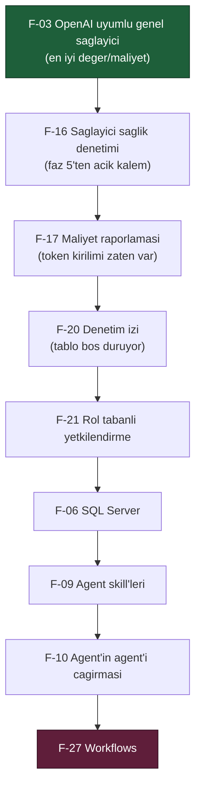

# BEYIN-FIRTINASI.md — İkinci Faz Planı İçin Aday Yetenekler

> **Durum:** Tartışmaya açık. Bu belge bir plan **değildir**; ikinci faz planının
> hammaddesidir. Buradaki hiçbir kalem onaylanmış sayılmaz.
>
> **Nasıl kullanılır:** Kullanıcı ile birlikte kalemler seçilir, seçilenler
> `docs/08-*.md`, `09-*.md` … faz dokümanlarına dönüştürülür. Reddedilen kalemler
> gerekçesiyle `docs/KARARLAR.md`'ye yazılır ve bu belgeden **silinmez**, üstü
> çizilir.
>
> **Referans çerçevesi:** Hedef, OpenRouter ve OpenAI'ın konsol/arayüz
> deneyimlerinin sunduğu her şeyi AgentPrism'de sunabilmektir. Her kalemde
> "kim yapıyor" sütunu bu karşılaştırmayı taşır.

---

## Değerlendirme Ölçütleri

Her kalem dört soruyla ölçülür:

| Ölçüt | Soru |
|-------|------|
| **Değer** | Bu olmadan AgentPrism'i kim kullanamaz? |
| **Maliyet** | Kaç paket, kaç yeni public tip, kaç migration? |
| **Risk** | Bir tasarım kuralını (K1–K4) zorluyor mu? Bundle bütçesini? |
| **Hazırlık** | MAF veya .NET ekosisteminde hazır mı, sıfırdan mı? |

Bundle bütçesi bugün **92,4 / 250 KB gzip** — arayüz tarafı için 157 KB boşluk var.

---

## A. Sağlayıcılar — "OpenAI'dan fazlası"

### F-01 · Anthropic (Claude) sağlayıcısı 🔥

**Değer:** Yüksek. Bugün AgentPrism tek sağlayıcılı; "kontrol düzlemi" iddiası
tek bir satıcıya bağlıyken zayıf kalır.
**Hazırlık:** `Anthropic.SDK` (topluluk) veya `Microsoft.Extensions.AI` üzerinden
`IChatClient`. MAF zaten `IChatClient` konuşuyor — adaptör `AgentPrism.OpenAI` ile
**birebir aynı şekli** alır: `AgentPrism.Anthropic` paketi, `IModelProvider`,
`UseAnthropic(apiKey)`.
**Maliyet:** Bir paket, ~6 dosya. `OpenAIChatClientFactory` iyi bir şablon.
**Dikkat:** Model kataloğu **yapılandırmadan** gelmeli (karar K-032 aynen geçerli);
Anthropic de makinece okunabilir fiyat listesi yayınlamıyor. Uzun bağlam, prompt
caching ve `thinking` blokları sağlayıcıya özgü ayar olarak `ModelBinding`
üzerinden geçirilebilir.

### F-02 · Google Gemini sağlayıcısı 🔥

**Değer:** Yüksek, F-01 ile aynı gerekçe.
**Hazırlık:** `Google_GenerativeAI` veya Vertex AI istemcisi üzerinden `IChatClient`.
**Dikkat:** Gemini'nin tool çağrı biçimi ve güvenlik filtresi yanıtları farklıdır;
`FunctionCallContent` eşlemesi test edilmeli. Çok modluluk (görsel girdi) burada
gündeme gelir — bkz. F-12.

### F-03 · OpenAI uyumlu genel sağlayıcı (OpenRouter, Groq, Ollama, vLLM…)

**Değer:** Çok yüksek / maliyet çok düşük. `AgentPrism.OpenAI` zaten
`OpenAIClientOptions.Endpoint` alıyor; tek gereken **taban adresin
yapılandırmadan verilebilmesi** ve sağlayıcı adının serbest olması.
**Not:** Bu muhtemelen tüm listenin en iyi değer/maliyet oranı. F-01 ve F-02'den
**önce** yapılmalı: OpenRouter üzerinden Claude ve Gemini'ye zaten erişilir.
**Dikkat:** "OpenAI uyumlu" iddiası her sunucuda tam tutmaz; tool çağrısı ve akış
davranışı sağlayıcı bazında farklılaşır. Sağlık denetimi ucu (F-16) burada değerli.

### F-04 · Azure OpenAI / Azure AI Foundry

**Değer:** Orta-yüksek; kurumsal .NET dünyasının varsayılan yolu.
**Hazırlık:** `Microsoft.Agents.AI.Foundry` paketi **var** (1.5.0). Managed identity
ile kimlik doğrulama AgentPrism'in "sır saklamama" duruşuyla iyi örtüşür.

### F-05 · Yerel modeller (Ollama, LM Studio)

**Değer:** Orta. Gizlilik hassas kurulumlar ve maliyetsiz geliştirme.
**Hazırlık:** F-03 ile büyük ölçüde bedava gelir.

---

## B. Kalıcılık

### F-06 · SQL Server desteği 🔥

**Değer:** Yüksek — kurumsal .NET'in en yaygın veritabanı.
**Maliyet:** `AgentPrism.SqlServer` paketi. `AgentPrism.PostgreSql` iyi bir şablon
ama **SQL birebir taşınmaz**:

| PostgreSQL | SQL Server karşılığı |
|---|---|
| `jsonb` / `json` | `nvarchar(max)` + `ISJSON` kısıtı |
| `uuid` | `uniqueidentifier` (v7 sıralaması korunur) |
| `ON CONFLICT DO UPDATE` | `MERGE` veya `UPDATE`+`INSERT` deseni |
| `pg_advisory_lock` | `sp_getapplock` |
| `timestamptz` | `datetimeoffset` |
| Kısmi indeks (`WHERE`) | Filtrelenmiş indeks — **var** |
| İfade üzerinde `UNIQUE INDEX` | Hesaplanmış sütun + `UNIQUE` |

**Kritik nokta:** `sessions.state` ve `conversation_items.item` neden `json`
(jsonb değil) olduğunu anlatan karar **K-027** SQL Server'da geçerli değildir
(anahtar yeniden sıralaması yoktur), ama `nvarchar(max)` zaten sırayı korur —
sorun kendiliğinden yoktur.
**Ön iş:** Sözleşme testleri (`Contracts/`) zaten soyut; üçüncü bir uygulama
eklemek `PostgresStoreContractTests` kadar kolay olmalı. Bu tasarım tam da bunun
içindi.

### F-07 · SQLite desteği

**Değer:** Orta. Tek dosyalık kurulum, demo ve gömülü senaryolar.
**Maliyet:** Düşük (F-06 sonrası SQL soyutlaması olgunlaşmış olur).
**Dikkat:** Eşzamanlı yazma sınırı; `run_events` akışı için WAL şart.

### F-08 · Veri saklama politikası ve arşivleme

**Değer:** Yüksek — üretimde `run_events` sınırsız büyür.
**Kapsam:** Yaş/hacim bazlı temizleme, `runs` özetini koruyup olayları düşürme,
soğuk depolamaya (S3/Blob) arşiv. Faz 6'nın ertelediği `run_events` partition'ı
(K-063) buraya doğal olarak bağlanır.

---

## C. Agent Yetenekleri

### F-09 · Agent skill'leri 🔥

**Değer:** Yüksek. MAF 1.16.0'da **hazır**: `AgentSkill`, `AgentSkillsProvider`,
`AgentFileSkill`, `AgentInlineSkill`, `AgentSkillsSource`, `AgentFileStore`,
`CachingAgentSkillsSource`, `AgentSkillFrontmatter`.
**Ne demek:** Bir agent'a, çalışma anında yüklenen markdown tabanlı yetenek
paketleri verilebilir (Claude Code'un skill mekanizmasının MAF karşılığı).
**🚨 Güvenlik sınırı:** `AgentFileSkill` **script çalıştırabilir**
(`AgentSkillScript`, `AgentFileSkillScriptRunner`). Bu, tasarım kuralı K2'yi
doğrudan zorlar. Öneri: skill'ler önce **script'siz** (yalnız talimat + kaynak)
desteklenir; script çalıştırma ayrı bir karar ve ayrı bir policy ister.
**Depolama:** `agent_skills` tablosu + `IAgentSkillStore`; arayüzde skill editörü.

### F-10 · Agent'ın agent'ı çağırması 🔥

**Değer:** Yüksek. MAF'ta **hazır**: `HarnessAgentOptions.BackgroundAgents` ve
`BackgroundAgentsProvider`. Faz 6'da bilerek kapalı bırakıldı (K-062).
**Kapsam:** Agent tanımına "çağırabileceği agent adları" listesi; derleyici bunları
katalogdan çözer ve harness'a verir.
**🚨 Tasarım soruları — önce bunlar cevaplanmalı:**
- **Özyineleme:** A → B → A döngüsü nasıl kesilir? Derinlik sınırı mı, çağrı
  grafiğinde döngü denetimi mi?
- **Çalıştırma kaydı:** Alt agent'ın çalıştırması ayrı bir `runs` satırı mı olmalı?
  Öyleyse `runs.parent_run_id` gerekir ve waterfall doğal olarak iç içe geçer.
- **Kiracı:** Alt agent aynı kiracıda mı çalışır? (Evet olmalı.)
- **Kaynak sınırı:** Toplam token bütçesi çağrı ağacı boyunca nasıl paylaşılır?
- **Onay:** Alt agent'ın tool onayı kime sorulur?

### F-11 · Bağlam sıkıştırma ve bellek sağlayıcıları

**Değer:** Orta-yüksek. MAF'ta **hazır** ve şu an hiç kullanılmıyor:
`CompactionProvider`, `SummarizationCompactionStrategy`,
`ContextWindowCompactionStrategy`, `ChatHistoryMemoryProvider`,
`FileMemoryProvider`, `TextSearchProvider`, `TodoProvider`.
**Kapsam:** Agent tanımından sıkıştırma stratejisi seçimi; uzun konuşmaların
otomatik özetlenmesi. Harness zaten bunları içeride kullanıyor; düz
`ChatClientAgent` için açığa çıkarmak gerekir.

### F-12 · Çok modluluk: görsel, ses, dosya girdisi

**Değer:** Yüksek — OpenAI/OpenRouter arayüzlerinin standart yeteneği.
**Kapsam:** Playground'da dosya yükleme, `DataContent`/`UriContent` desteği,
`conversation_items` içinde ikili içerik. Boyut sınırı ve depolama (veritabanı mı,
harici mi) tasarım kararıdır.

### F-13 · ElevenLabs entegrasyonu (ses)

**Değer:** Orta; belirli senaryolarda çok yüksek (sesli asistan).
**İki ayrı iş, karıştırılmamalı:**
1. **Tool olarak TTS** — `elevenlabs_speak` benzeri bir tool. Kolay: kodda
   tanımlı bir tool, tasarım kuralına tam uyar. Ses çıktısı nereye yazılır?
2. **Konuşma katmanı** — arayüzde mikrofonla konuşup sesli yanıt almak. Bu bir
   gerçek zamanlı ses boru hattıdır (WebRTC/WebSocket), bundle bütçesini ve
   barındırma modelini ciddi etkiler.
**Öneri:** Önce (1). (2) ayrı bir faz ve muhtemelen ayrı bir paket
(`AgentPrism.Voice`).

### F-14 · Değerlendirme (eval) altyapısı

**Değer:** Orta-yüksek. MAF'ta **hazır**: `AIJudgeLoopEvaluator`, `LoopAgent`,
`EvalCheck`, `EvalItem`, `ExpectedToolCall`, `LocalEvaluator`, `RubricScore`.
**Kapsam:** Bir agent için test kümesi tanımlama, düzenli çalıştırma, regresyon
takibi. Sürüm geçmişi (`agent_definition_versions`) zaten var — "v3 v2'den daha mı
iyi?" sorusu doğal devam.

---

## D. Kontrol Düzlemi Yetenekleri

### F-15 · Prompt/talimat sürümleme ve A/B

**Değer:** Yüksek. Altyapının yarısı hazır: tanım sürümleri ve geri alma var.
**Eksik:** İki sürümü **aynı anda** çalıştırıp karşılaştırma (trafiği bölme),
sürüm bazlı metrik kırılımı. Faz 6'nın metrikleri buna `agentprism.agent.version`
etiketi eklemekle hazır hâle gelir.

### F-16 · Sağlayıcı sağlık denetimi ve devre kesici

**Değer:** Yüksek. Bugün bir sağlayıcı çökerse her çalıştırma tek tek hata verir.
**Kapsam:** `IModelProvider` için sağlık denetimi ucu, `Microsoft.Extensions.Http.Resilience`
ile yeniden deneme + devre kesici, arayüzde sağlayıcı durumu. Faz 5'in Models
ekranındaki "sağlık kontrolü faz 6'da gelir" notu **hâlâ açık** — faz 6 bunu
yapmadı.

### F-17 · Maliyet raporlaması

**Değer:** Yüksek — OpenAI konsolunun en çok bakılan ekranı.
**Durum:** Faz 6 token kırılımını model bazında verdi (`RunStatistics.ByModel`).
Eksik olan tek şey **fiyat**. Sağlayıcılar makinece okunabilir fiyat yayınlamadığı
için (K-032) fiyat listesi **yapılandırmadan** gelmelidir:
`AgentPrism:Pricing:{provider}:{model}:{Input|Output}`. Böylece AgentPrism yanlış
fiyat uydurmaz, kullanıcı kendi anlaşmasını yazar.

### F-18 · Hız sınırı ve kota

**Değer:** Yüksek (çok kiracılı kurulumda zorunlu).
**Kapsam:** Kiracı/agent bazında istek ve token kotası, aşımda `429`.
`System.Threading.RateLimiting` .NET'te hazır. Faz 6'nın kiracı bağlamı bunun
önkoşuluydu ve artık var.

### F-19 · Webhook / olay yayını

**Değer:** Orta-yüksek. Çalıştırma tamamlandığında dış sisteme bildirim; onay
bekleyen çağrı için Slack/Teams bildirimi. Onay akışı (faz 6) bunu doğal olarak
istiyor: kimse arayüze bakmıyorsa onay bekleyen çağrı görülmez.

### F-20 · Denetim izi (audit log)

**Değer:** Yüksek — kurumsal gereksinim. `audit_log` tablosu **0001'de kuruldu ve
hâlâ boş**. Kim hangi agent tanımını değiştirdi, kim hangi MCP sunucusunu ekledi,
kim hangi onayı verdi. Faz 6 bunları yapılabilir kıldı ama kaydetmiyor.

### F-21 · Rol tabanlı yetkilendirme

**Değer:** Yüksek. Bugün erişim ikili: girebilen her şeyi yapar. Gereken ayrım:
okuyucu / operatör (çalıştırma, onay) / yönetici (agent ve MCP tanımı).
MCP sunucusu ekleme ve onay verme ayrı policy'ler istemeli.

### F-22 · Toplu (batch) ve zamanlanmış çalıştırma

**Değer:** Orta. Bir agent'ı bir veri kümesi üzerinde toplu çalıştırma, cron ile
tetikleme. F-14 (eval) ile aynı altyapıyı paylaşır.

---

## E. Arayüz

### F-23 · Grafikler ve gösterge paneli

**Değer:** Yüksek. Bugün Settings ekranı sayı listesi gösteriyor. Zaman serisi
grafikleri (çalıştırma/saat, hata oranı, token) OpenAI konsolunun ana ekranıdır.
**Dikkat:** Bundle bütçesi. Bir grafik kütüphanesi 40–100 KB gzip ekler; waterfall
gibi elle SVG çizmek 5 KB'de biter. Karar ölçümle verilmeli.

### F-24 · Arayüzden diff ve sürüm karşılaştırma

**Değer:** Orta. Sürüm geçmişi var ama iki sürüm yan yana görülemiyor.

### F-25 · Arayüz yerelleştirmesi (i18n)

**Değer:** Orta. Arayüz bugün tamamen İngilizce. Türkçe arayüz kullanıcı için
değerli olabilir; maliyeti bir çeviri katmanı + bundle artışı.

### F-26 · Klavye kısayolları ve komut paleti

**Değer:** Düşük-orta. Konsol deneyimini hızlandırır, maliyeti düşüktür.

---

## F. Ertelenmiş Faz 6 Kalemleri

### F-27 · Workflows (MAF `Microsoft.Agents.AI.Workflows`)

Faz 6'dan ertelendi (K-054, sapma S1). Paket **GA** ve
`Directory.Packages.props`'ta sürümü zaten sabit. Kapsam: workflow kataloğu,
PostgreSQL'de checkpoint kalıcılığı, arayüzde graf görselleştirme,
human-in-the-loop. `Microsoft.Agents.AI.Workflows.Declarative` ile bildirimsel
workflow tanımı da mümkün.
**Not:** MAF dokümanı `previous_response_id` ve `conversation_id` için açık uyarı
verir — checkpoint yüklemeden önce kiracı sahipliği doğrulanmalıdır.

### F-28 · MCP prompts ve resources

Faz 6 MCP'nin yalnız **tool'larını** kullanıyor. `McpClient` ayrıca
`ListPromptsAsync`, `ListResourcesAsync`, `ReadResourceAsync`,
`SubscribeToResourceAsync` sunuyor. Prompt'lar agent talimatı olarak,
resource'lar bağlam olarak kullanılabilir.

### F-29 · MCP OAuth

`HttpClientTransportOptions.OAuth` (`ClientOAuthOptions`) var ve kullanılmıyor.
Bugün yalnız statik bir `Authorization` başlığı destekleniyor.

---

## Öncelik Önerisi

Tek bir kişinin sırayla yapabileceği, her adımı kendi başına değerli bir sıra:

**Gerekçe:** F-03 tek başına Claude, Gemini, Groq ve yerel modelleri açar —
F-01 ve F-02'yi *acil* olmaktan çıkarır. F-16, F-17 ve F-20 hâlâ boş duran
altyapıyı (sağlık notu, `ByModel`, `audit_log`) tamamlar ve her biri küçüktür.
F-21 çok kiracılılığı gerçekten kullanılabilir yapar. F-06 kurumsal kapıyı açar.
F-09 ve F-10 agent yeteneğini büyütür ama güvenlik tasarımı ister. F-27 en büyük
ve en bağımsız iştir; en sona kalabilir.

---

## Açık Sorular (kullanıcıya)

1. **Öncelik neye göre?** Kullanıcı sayısı mı (F-03, F-06), kurumsal satın alma mı
   (F-21, F-20), yoksa yetenek derinliği mi (F-09, F-10, F-27)?
2. **Ses (F-13) hangi biçimde?** Tool olarak TTS mi, gerçek zamanlı konuşma
   katmanı mı? İkisi çok farklı büyüklükte.
3. **Skill'lerde script çalıştırma (F-09) kabul edilebilir mi?** Tasarım kuralı
   K2'nin bilinçli bir istisnası olur; MCP'de (K-058) benzer bir istisna
   yapıldı ama orada süreç **uzakta** çalışıyor.
4. **Agent'ın agent'ı çağırmasında (F-10) alt çalıştırma ayrı bir `runs` satırı
   mı olsun?** Ayrı olursa `runs.parent_run_id` gerekir ve waterfall iç içe geçer;
   olmazsa maliyet ve süre tek satırda toplanır.
5. **Faz 7 (yayın) ne zaman?** Yukarıdaki kalemler public API'yi büyütür; yayın
   önce yapılırsa her kalem `PublicAPI.Unshipped.txt` disiplinine girer — bu
   iyidir ama yavaşlatır.
