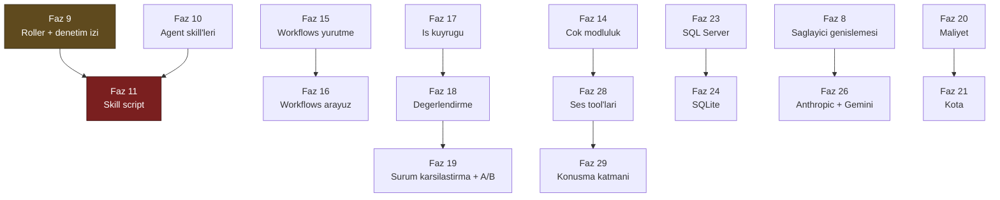

# İkinci Faz Yol Haritası (Faz 8 – Faz 30)

> **Durum:** Onaylı sıra. Bu belge [`BEYIN-FIRTINASI.md`](BEYIN-FIRTINASI.md)'nin
> **hammadde** hâlini, uygulanabilir faz dokümanlarına dönüştürür.
>
> Beyin fırtınası belgesindeki **29 kalemin tamamı** planlandı. Hiçbir kalem
> reddedilmedi. Her faz ayrı bir oturumda uygulanır ve `faz-tamamlama` skill'i ile
> kapanır.

---

## Kullanıcı Cevapları (2026-08-02)

Sıralama bu beş cevaba göre kuruldu. Cevaplar karar defterine de yazıldı
(K-064 … K-068).

| # | Soru | Cevap | Sıralamaya etkisi |
|---|------|-------|-------------------|
| 1 | Öncelik neye göre? | **Yetenek derinliği** | Skill'ler, agent çağrı grafiği ve workflows öne alındı (Faz 10–16) |
| 2 | Ses hangi biçimde? | **Konuşma katmanı** | İki faz: önce tool (28), sonra gerçek zamanlı katman (29) |
| 3 | Skill'de script çalıştırma? | **Kabul edilebilir** | Ayrı faz (11); önkoşulu yönetişim fazıdır (9) |
| 4 | Alt çalıştırma ayrı `runs` satırı mı? | **Olabilir** | Faz 12 ayrı satırı benimser; `runs.parent_run_id` eklenir |
| 5 | Faz 7 (yayın) ne zaman? | **Henüz belirsiz** | Faz 7 sıradan çıkarıldı; istenildiği an araya girer |

---

## Sıra

| Faz | Doküman | Kalem | Neden burada | Yeni paket | Migration |
|-----|---------|-------|--------------|-----------|-----------|
| 8 | [08-SAGLAYICI-GENISLEMESI.md](08-SAGLAYICI-GENISLEMESI.md) | F-03 · F-05 · F-16 | En iyi değer/maliyet. Sonraki her fazı ucuz modelle test edilebilir yapar. Faz 5'ten açık kalan sağlık denetimini kapatır | — | — |
| 9 | [09-YONETISIM-VE-DENETIM-IZI.md](09-YONETISIM-VE-DENETIM-IZI.md) | F-21 · F-20 | Faz 11'in (script) önkoşulu. Boş duran `audit_log` dolar | — | — |
| 10 | [10-AGENT-SKILLERI.md](10-AGENT-SKILLERI.md) | F-09 (1/2) | Yetenek derinliğinin ilk adımı. Script **yok** | — | 0003 |
| 11 | [11-SKILL-SCRIPT-CALISTIRMA.md](11-SKILL-SCRIPT-CALISTIRMA.md) | F-09 (2/2) | K2'nin ikinci bilinçli istisnası. Rol + denetim izi hazır olmadan yapılamaz | — | 0004 |
| 12 | [12-AGENT-CAGRI-GRAFIGI.md](12-AGENT-CAGRI-GRAFIGI.md) | F-10 | ✅ **Tamamlandı (2026-08-02)** — agent'ın agent'ı çağırması, çalıştırma ağacı, paylaşılan bütçe | — | 0005 |
| 13 | [13-BAGLAM-SIKISTIRMA-VE-BELLEK.md](13-BAGLAM-SIKISTIRMA-VE-BELLEK.md) | F-11 | ✅ **Tamamlandı (2026-08-02)** — 5 sıkıştırma stratejisi + pipeline, 3 bellek sağlayıcısı; vektör tabanlı bellek K-105 ile kapsam dışı | — | — |
| 14 | [14-COK-MODLULUK.md](14-COK-MODLULUK.md) | F-12 | ✅ **Tamamlandı (2026-08-02)** — görsel/dosya eki: `attachments` + `agent_files` tabloları, ek referansı model çağrısından hemen önce çözülür | — | 0006 |
| 15 | [15-WORKFLOWS-YURUTME.md](15-WORKFLOWS-YURUTME.md) | F-27 (1/2) | ✅ **Tamamlandı** (2026-08-03) — beş desen, checkpoint, sürdürme | `AgentPrism.Workflows` | 0007 |
| 16 | [16-WORKFLOWS-ARAYUZ.md](16-WORKFLOWS-ARAYUZ.md) | F-27 (2/2) | ✅ **Tamamlandı.** Graf görselleştirme, human-in-the-loop, Magentic plan onayı, kalıcı executor kimliği. Bildirimsel tanım alınmadı (K-129) | — | — |
| 17 | [17-TOPLU-VE-ZAMANLANMIS-CALISTIRMA.md](17-TOPLU-VE-ZAMANLANMIS-CALISTIRMA.md) | F-22 | ✅ **Tamamlandı (2026-08-03)** — PostgreSQL iş kuyruğu (`FOR UPDATE SKIP LOCKED`), cron zamanlama, Jobs ekranı. Faz 18 bunun üzerine kurulur | — | 0008 |
| 18 | [18-DEGERLENDIRME.md](18-DEGERLENDIRME.md) | F-14 | ✅ **Tamamlandı (2026-08-03)** — eval takım/vaka/koşu, Faz 17'nin kuyruğu üzerinde (`JobKind.Eval`); yeni paket gerekmedi (K-139); `RunKind.Eval` ile istatistik hariç tutma (K-141) | — | 0009 |
| 19 | [19-SURUM-KARSILASTIRMA-VE-AB.md](19-SURUM-KARSILASTIRMA-VE-AB.md) | F-15 · F-24 | ✅ **Tamamlandı (2026-08-03)** — diff (`lib/diff.ts`, elle LCS), A/B deneyi (oturum bazlı deterministik SHA-256 atama, yalnız `AgentEndpoints.RunAsync` içinde), `RunStatistics.ByVersion` | — | 0010 |
| 20 | [20-MALIYET-VE-GOSTERGE-PANELI.md](20-MALIYET-VE-GOSTERGE-PANELI.md) | F-17 · F-23 | ✅ **Tamamlandı (2026-08-03)** — fiyat kataloğu/`AgentPrism:Pricing`'den gelir (K-032'nin devamı), `runs` maliyet sütunları (migration 0011), `/api/stats/timeseries`, `POST /api/stats/recalculate-costs` (Admin+audit), Dashboard giriş ekranı + 3 el-çizimi grafik | — | 0011 |
| 21 | [21-KOTA-VE-OLAY-YAYINI.md](21-KOTA-VE-OLAY-YAYINI.md) | F-18 · F-19 | ✅ **Tamamlandı (2026-08-03)** — kota (gün/ay, kiracı+agent kapsamı, migration 0012), hız sınırı (varsayılan kapalı, paylaşılan çerçeve — yeni paket yok), webhook (HMAC imzası, SSRF koruması bağlantı geri çağrısında, teslim Faz 17 kuyruğunda). `IJobStore` geri adımlı beklemeyle genişletildi (K-160) | — | 0012 |
| 22 | [22-MCP-DERINLESMESI.md](22-MCP-DERINLESMESI.md) | F-28 · F-29 | ✅ **Tamamlandı (2026-08-04)** — prompts (panoya kopyalama, anlık görüntü), resources (Mod A bağlam + Mod B `read_resource` tool), OAuth **Mod 1** (SDK yalnız Authorization Code destekliyor, Mod 0 imkânsız çıktı — K-168). Rozet/agent-editör entegrasyonu sonraki faza devredildi | — | 0013 |
| 23 | [23-SQL-SERVER.md](23-SQL-SERVER.md) | F-06 | ✅ **Tamamlandı (2026-08-05).** Kapsam genişledi: depo uygulamaları da `AgentPrism.Sql.Shared` altında paylaşılıyor (K-176) — PostgreSQL Npgsql'den ADO.NET tabanına taşındı, 416/416 test korundu. Sözleşme testleri `azure-sql-edge` ile doğrulandı, üç gerçek hata bulunup düzeltildi (K-187…K-189); gerçek `mssql/server` hâlâ koşturulamadı | `AgentPrism.SqlServer` + `AgentPrism.Sql.Shared` (paket değil) | kendi (`0001`) |
| 24 | [24-SQLITE.md](24-SQLITE.md) | F-07 | ✅ **Tamamlandı (2026-08-05).** Faz 23'ün paylaşım modelini dördüncü kez kullandı — model doğrulandı, ama üç gerçek eksik bulundu: SQLite'ın düz indeks ad alanı (K-193), `ExecuteScalarAsync` sonucunun sağlayıcıya göre değişen CLR tipi (K-195), uuid harf büyüklüğü tutarlılığı (K-191). Uçtan uca örnek uygulamayla doğrulandı. AOT ölçülmedi | `AgentPrism.Sqlite` | kendi (`0001`) |
| 25 | [25-VERI-SAKLAMA-VE-ARSIVLEME.md](25-VERI-SAKLAMA-VE-ARSIVLEME.md) | F-08 | ✅ **Tamamlandı (2026-08-05)** — saklama politikası + arşivleme; hedef başına tek veri tablosu (`RetentionTargetRegistry`) + 3 diyalekt şablonu (K-198); K-063 ölçümle kapandı, partition **açılmadı** (K-199, 100k satırda saniyede ~720k satır silme) | — | 0014 (Postgres) / 0002 (SqlServer, Sqlite) |
| 26 | [26-ANTHROPIC-VE-GEMINI.md](26-ANTHROPIC-VE-GEMINI.md) | F-01 · F-02 | Faz 8'den sonra *acil* değil; birinci sınıf destek yine de değerli | `AgentPrism.Anthropic` · `AgentPrism.Google` | — |
| 27 | [27-AZURE-FOUNDRY.md](27-AZURE-FOUNDRY.md) | F-04 | Managed identity, "sır saklamama" duruşuyla örtüşür | `AgentPrism.Azure` | — |
| 28 | [28-SES-TOOLLARI.md](28-SES-TOOLLARI.md) | F-13 (1/2) | Ses çıktısı için depolama Faz 14'te kuruldu | `AgentPrism.Voice` | — |
| 29 | [29-KONUSMA-KATMANI.md](29-KONUSMA-KATMANI.md) | F-13 (2/2) | Gerçek zamanlı ses. Barındırma modelini etkiler | (28'in paketi genişler) | 0015 |
| 30 | [30-ARAYUZ-CILASI.md](30-ARAYUZ-CILASI.md) | F-25 · F-26 | i18n en sonda: her fazın yeni metni iki dilde yazılmaz | — | — |

Migration numaraları **planlanan sıraya** göredir. Sıra değişirse numara değil,
**bir sonraki boş numara** kullanılır; `MigrationTests` sayıyı gömülü
kaynaklardan okur, teste sabit yazılmaz.

---

## Zorunlu Bağımlılıklar

Aşağıdaki oklar **gerçek önkoşullardır**. Ok yoksa fazlar birbirinden bağımsızdır
ve sıraları değiştirilebilir.

> Kırmızı düğüm (Faz 11) tasarım kuralı **K2'nin bilinçli istisnasıdır**. Sarı
> düğüm (Faz 9) onun güvenlik önkoşuludur ve atlanamaz.

---

## Faz 7 (Yayın) Nerede?

[`07-SAGLAMLASTIRMA-VE-YAYIN.md`](07-SAGLAMLASTIRMA-VE-YAYIN.md) **sıradan
çıkarıldı**. Kullanıcı yayın zamanını henüz belirlemedi (K-068).

Bilinmesi gerekenler:

- Faz 7 **her an** araya girebilir. Diğer fazlar onu beklemez.
- Faz 7 yapıldıktan **sonra** başlayan her faz `PublicAPI.Unshipped.txt`
  disiplinine girer. Bu iyidir ama her fazı yavaşlatır.
- `EnablePublicApiTracking` bugün **`false`**. Yayın yapılana kadar öyle kalır.
- Yayın ne kadar gecikirse ilk `PublicAPI.Shipped.txt` dolumu o kadar büyür.
  Her faz dokümanının "Gerçekleşen Public API" bölümü bu dolumun kaynağıdır —
  faz sonunda **eksiksiz** yazılmalıdır.

Öneri (bağlayıcı değil): Faz 12'den sonra bir `1.0.0-preview.1` yayını, agent
yetenek yüzeyi oturduğu için mantıklı bir kesittir.

---

## Her Fazın Uyacağı Kurallar

1. **Faz dokümanı devir teslim belgesidir.** Oturum başında MIMARI, KARARLAR,
   MEMORY ve faz dokümanı okunur; sonunda dördü de güncellenir.
2. **Yeni MAF tipi kullanmadan önce imza doğrulanır** —
   `.agents/skills/maf-api-kesfi/scripts/dump-api.sh`. Bu belgedeki imzalar
   2026-08-02'de MAF 1.16.0 üzerinde reflection ile çıkarıldı; sürüm değişirse
   yeniden doğrulanır.
3. **Yeni paket bir maliyettir.** Yeni paket ekleyen faz, `faz-tamamlama`
   skill'indeki paket kontrol listesini (README, slnx, meta paket,
   `DependencyDirectionTests`) uygular.
4. **Dört doğrulama kapısı** her fazın sonunda sıfır uyarı verir.
5. **Yeni kararlar K-064'ten devam eder.** Numarayı yazan faz, kararı gerçekten
   verdiği anda alır — plan dokümanları numara rezerve etmez.
6. **Bundle bütçesi 250 KB gzip.** Faz 20 sonunda 116,2 KB. Arayüze dokunan her
   faz ölçümü DoD'ye yazar.

---

## Kalem → Faz Haritası

Beyin fırtınası belgesindeki her kalemin nereye gittiği:

| Kalem | Faz | Kalem | Faz |
|-------|-----|-------|-----|
| F-01 Anthropic | 26 | F-16 Sağlayıcı sağlığı | 8 |
| F-02 Gemini | 26 | F-17 Maliyet | 20 |
| F-03 OpenAI uyumlu | 8 | F-18 Kota | 21 |
| F-04 Azure | 27 | F-19 Webhook | 21 |
| F-05 Yerel modeller | 8 | F-20 Denetim izi | 9 |
| F-06 SQL Server | 23 | F-21 Roller | 9 |
| F-07 SQLite | 24 | F-22 Toplu/zamanlanmış | 17 |
| F-08 Veri saklama | 25 | F-23 Grafikler | 20 |
| F-09 Skill'ler | 10 · 11 | F-24 Diff | 19 |
| F-10 Agent→agent | 12 | F-25 i18n | 30 |
| F-11 Sıkıştırma/bellek | 13 | F-26 Komut paleti | 30 |
| F-12 Çok modluluk | 14 | F-27 Workflows | 15 · 16 |
| F-13 Ses | 28 · 29 | F-28 MCP prompts/resources | 22 |
| F-14 Eval | 18 | F-29 MCP OAuth | 22 |
| F-15 A/B | 19 | | |
