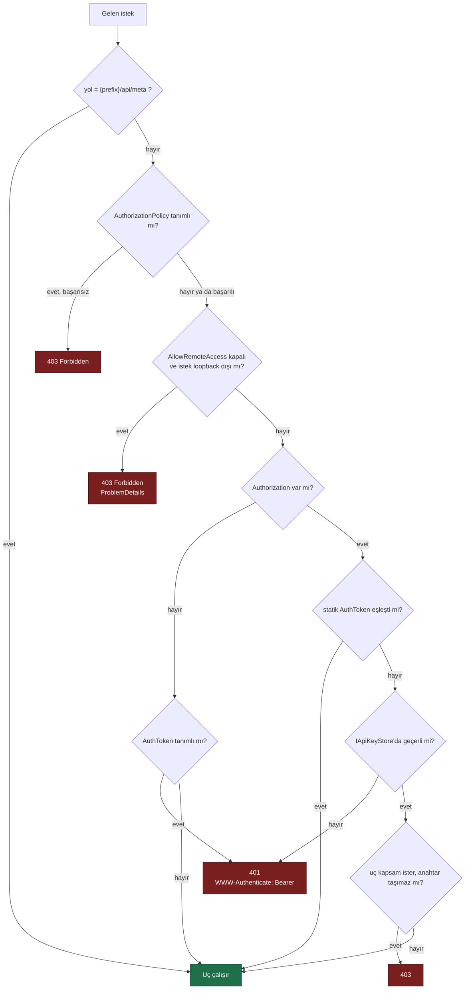
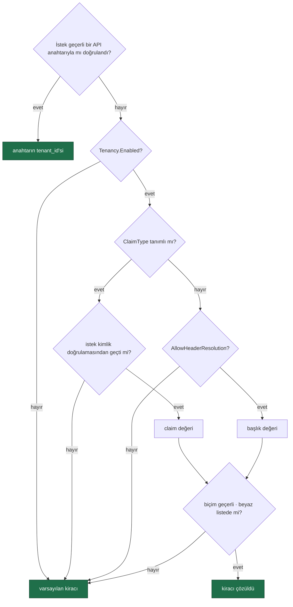

# Güvenlik Modeli

> **`MIMARI.md`'nin güvenlik bölümüdür.** Faz 77'de oradan ayrıldı: bölüm
> 17 KB'a ulaşmıştı (dosyanın %42'si) ve her güvenlik fazı ona ekliyordu.
> `MIMARI.md` zaten bölüm bölüm okunur; bu ayrım okuma biçimini değiştirmez.
> Bugünkü mimarinin geri kalanı: [`MIMARI.md`](MIMARI.md). Karar: K-524.

---

Üç katman, sırayla uygulanır:

1. **Loopback kısıtı** — `AllowRemoteAccess = false` (varsayılan). Loopback dışı istek `403` alır. Kaza ile açılmaya karşı koruma.
2. **Bearer token** — statik `AuthToken` sabit zamanlı karşılaştırmayla denetlenir; eşleşmezse **kiracı bazlı API anahtarı** (`IApiKeyStore`, hash `key_hash`, K-356) denenir: iptal/süre denetiminden geçer, kapsamı (uç istiyorsa) uyuşur. `ApiKeyScope` rolü DARALTIR, yerine geçmez — `rol ∩ kapsam` (K-360). Dışa açılan MCP/A2A yüzeyi geçerli bir `external:invoke` anahtarı ister (`ExternalSurfaceGuard`). `Authorization` başlığı YOKSA ve `AuthToken` tanımsızsa katman atlanır (K1); başlık VARSA her zaman doğrulanır (K-359).
3. **Authorization policy** — `RequireAuthorization("policy")` ile ASP.NET Core kimlik doğrulama boru hattına bağlanır. Üretimde kullanılan yol budur.

`{prefix}/api/meta` kimlik doğrulaması olmadan erişilebilir. Arayüzün hangi kimlik yöntemini kullanacağını öğrenmesi için gereklidir; hiçbir hassas veri döndürmez.

**Arayüz kabuğu (HTML, JS, CSS) bearer token katmanından muaftır** (karar K-046).
Tarayıcı bir `<script src>` isteğine `Authorization` başlığı ekleyemez; kabuk
kilitlenseydi kullanıcı token'ı girebileceği ekranı hiçbir zaman göremezdi. Kabuk
veri taşımaz. Loopback kısıtı ve authorization policy kabuğa da uygulanır:

| Katman | `/api/meta` | Arayüz kabuğu | Konuşma WebSocket'i | Diğer tüm uçlar |
|--------|-------------|---------------|---------------------|------------------|
| Loopback kısıtı | ❌ | ✅ | ✅ | ✅ |
| Authorization policy | ❌ | ✅ | ✅ | ✅ |
| Bearer token | ❌ | ❌ | ✅ **alt protokolde** | ✅ başlıkta |

🚨 **Konuşma WebSocket'i token'ı `Sec-WebSocket-Protocol` alt protokolünde alır**
(`tracon.token.<token>`) ve sabit zamanda kendisi doğrular (K-224). Tarayıcı
bir el sıkışmaya `Authorization` başlığı ekleyemez; sorgu dizesi ise sunucu ve
ters vekil günlüklerine yazılacağı için **kabul edilmez**. Uç ayrıca `Operator`
rolü ister, oturumun kiracı sahipliğini doğrular, kiracı başına eşzamanlı
bağlantıyı sınırlar ve süre/boşta zaman aşımı uygular.

Arayüz token'ı `sessionStorage`'da tutar — sekme kapanınca silinir (K-047). Dil
ve tema tercihi `localStorage`'dadır (K-230).

Ek sınırlar:

- `secret`'lar (`ApiKey`, bağlantı dizesi, MCP kimlik değeri) **hiçbir zaman** veritabanına yazılmaz, API'den dönmez, arayüzde gösterilmez
- `previous_response_id` ve `conversation_id` güvenilmez girdi kabul edilir; her zaman kiracı sahipliği doğrulanır
- `audit_log` Faz 9'dan beri doludur — bkz. "Roller ve denetim izi"

## Çok kiracılılık ve tool onayı

**Tool onayı.** `RequiresApproval = true` işaretli tool, `ToolRegistry` içinde
`ApprovalRequiredAIFunction` ile sarılır. Sarmalama **defterde** yapılır: defter,
"bir agent yalnızca kayıtlı bir tool'a işaret edebilir" kuralının zorlandığı tek
yerdir, yani başka bir kod yolu sarmalamayı atlayamaz.

**Asenkron onay kutusu (Faz 55).** Kuyruktan koşan bir çalıştırma onay isteyip
`AwaitingApproval`'a düşerse `pending_approvals` üzerinden
`POST /api/approvals/{id}/decide` ile kararlanır — denetim izi karardan ÖNCE yazılır
(K-089/K-370). Senkron/MCP/A2A yolu bu tabloya HİÇ yazmaz; oradaki onay bir sonraki
turun `approvals` alanıyla çözülür (K-372).

**MCP sınırı.** MCP sunucusu eklemek dışarıdan gelen tool tanımlarını kabul etmektir
— K2'nin bilinçli istisnası. Beş koruma: yalnız `http`/`https`, **stdio yoktur**
(K-058; süreç başlatmak K2'yi bozar) · varsayılan `RequiresApproval = true` · kodda
kayıtlı bir tool'un adını taşıyan MCP tool'u **yok sayılır** (K-060) · kayıt kimlik
doğrulama **değerini** değil, anahtarın **adını** taşır (K-059) · her çağrı kaynak
sunucu adıyla `tool_invocations`'a yazılır.

**Kiracı çözümleme.** Varsayılan **kapalıdır**; açıldığında sıra:

🚨 **API anahtarı en yüksek önceliktedir** (Faz 53) — bir `secret`'i KANITLAR,
claim/başlık yalnız BEYANDIR; çelişirse filtre `403` verir.

🚨 **Claim tanımlıysa başlık hiç okunmaz.** Aksi hâlde kimlik doğrulamasından
geçmiş bir kullanıcı, bir başlık ekleyerek başka bir kiracının verisine
erişebilirdi. Başlık yolu ayrıca `AllowHeaderResolution` ile **açıkça**
açılmalıdır — bir HTTP başlığı kimlik kanıtı değildir.

**Yalıtımı zorlayan kapı (Faz 41).** Her depo sözleşmesi yalıtımı **iki yönlü**
sınar (B görmemeli · A kendi verisini görmeli) ve dört koşumda çalışır;
`TenantCoverageTests` her public depo metodunun ya sınandığını ya `[TenantAgnostic]`
ile gerekçeli muaf olduğunu zorlar. Bulduğu kusurlar: K-277 · K-278 · K-279.

**Yalıtım hangi katmandadır (K-623, Faz 104).** **Uygulama katmanında**: kiracı
`ITenantContext` ile çözülür, filtre sorgu katmanında uygulanır, kapı bunu zorlar.
Veritabanı RLS'i **bilinçli olarak yoktur** — bir savunma derinliği reddi değil,
sıralama kararıdır (gerekçe K-623; tüketici karşılığı governance sayfası).

**Hız sınırı bir yalıtım sınırı DEĞİLDİR (Faz 104).** `TraconRateLimitOptions` ve
`InboundTriggerRateLimiter` süreç belleğinde sayar; `Partition = Tenant` her örneğin
**kendi** penceresini böler. Kiracının toplam tüketimini bağlayan şey kotadır — o
veritabanında sayılır ve örnek sayısından etkilenmez.

**Kiracı sağlayıcı anahtarları / BYOK ve egress (Faz 65).** Varsayılan
**kapalıdır**. Açıldığında her model çağrısından önce iki kontrol TEK yerde sırayla çalışır:
**egress** (`tenant_egress_policies`; politika yoksa kısıtsız) ve **kimlik bilgisi**
(`tenant_provider_bindings`; kayıtta yalnız anahtarın **adı** durur — K-059). Kayıt
var ama değer yoksa çağrı global anahtara **düşmez**. Aynı nokta hem `run`
derlemesini hem ön-uçuşu besler; izinsiz sağlayıcıya işaret eden tanım **derleme
anında** reddedilir. Gerekçe: K-065 · K-059.

**Kiracının ALTINDA ikinci bir sınır: oturum sahipliği (Faz 148).**
Varsayılan **kapalıdır**; kapalıyken `sessions.owner_id` `NULL` kalır ve hiçbir
liste daralmaz. Açıldığında oturum, onu AÇAN kullanıcıyı kaydeder — kaynak
`IRunAttributionContext`'tir, gövde **asla** okunmaz. Kiracı sınırı değişmez.

Süzgeç SQL `WHERE`'dedir, `Skip`/`Take`'ten **önce** (K-688) · sahiplik **bir kez**
atanır, dört depo da `COALESCE` eder (K-689) · kapı `run` başlatan yüzeyleri ve
`/v1/conversations`'ı kapsar, HTTP sınırında yaşar (K-691) · sahiplik **geriye dönük
değildir** (K-693). Mod açıkken `IRunAttributionContext` muhasebe değil
**yetkilendirme** girdisidir: çözülemeyen kimlik `403` üretir (K-690).

Kapsam ve neden `AgentSessionManager`'da olmadığı:
[`hafiza/maf-oturum.md`](hafiza/maf-oturum.md).

## Roller ve denetim izi

**Rol modeli.** Üç policy adı — `TraconPolicies.Reader` / `.Operator` / `.Admin`.
Tracon rol veya kullanıcı **saklamaz**; tüketici bu adları kendi
`AddAuthorization(...)` çağrısında claim'lerine bağlar. Bir policy **kayıtlı
değilse** ilgili uç grubu yalnız üç katmanlı korumadan geçer — sürüm yükseltmesi
mevcut kurulumları kırmaz. `TraconEndpointOptions.RequireRolePolicies` açılırsa
eksik policy `MapTracon()`'u **açılışta** hataya çevirir.

| Rol | Kapsam |
|-----|--------|
| Reader | Agent, çalıştırma, oturum, trace, istatistik **okuma** |
| Operator | Reader + çalıştırma başlatma, onay verme, oturum silme |
| Admin | Hepsi: agent tanımı yazma, MCP sunucusu ekleme, kiracı ve onay kuralı yönetimi, denetim izi okuma |

`GET {prefix}/api/meta` yanıtı `roles: { canRead, canOperate, canAdminister }` taşır —
arayüz yetkisiz düğmeleri buna göre gizler. Policy kayıtlı değilse alan `true` döner.

**Denetim izi.** `audit_log`'a agent, MCP sunucusu, kiracı ve onay kuralı yazmaları
ile tool onay kararları düşer — **çalıştırmalar düşmez** (`runs` zaten tam kaydı
tutar). Yazma **iki yerde** olur: `store` decorator'ları (`Auditing*Store`) ve
**`endpoint` katmanı**. Endpoint yazması kuraldır: bir `store` yazmasına karşılık
gelmeyen her eylem (`mcp.refresh`, `tenant_egress.save`, onay kararı, eval koşumu,
veri konusu silme…) uçta yazılır.

**Geri alınamaz eylem `AuditRecorder` kullanamaz.** `AuditRecorder` `store`
hatasını yutar ve yalnız uyarı loglar; kod çalıştırma yetkisi veren
`script.grant`/`script.revoke` ve script çalıştırmanın kendisi bu yüzden
`IAuditLog`'u **doğrudan** çağırır ve yazamazsa **eylemi keser**.

Aktör `AuditActorContext` adlı bir `AsyncLocal` köprüsünden okunur —
`Tracon.Core`'a ASP.NET Core bağımlılığı eklemeden "kim yaptı" sorusunu yanıtlamanın
yolu budur (`ClaimsPrincipal` temel kütüphanededir). Kimlik doğrulaması yoksa aktör
`null`'dur ve bu gizlenmez. Dosya haritası:
[`hafiza/kod-haritasi.md`](hafiza/kod-haritasi.md).

`before`/`after` yazılmadan önce `AuditSecretFilter` içinden geçer — alan ADINA
bakar, değere değil ([`hafiza/olcum-kota-ve-secenekler.md`](hafiza/olcum-kota-ve-secenekler.md)).
Denetim izi yazma hatası **çalıştırmayı kesmez**;
"gözlemlenebilirlik işlevi bozmaz" kuralı burada da geçerlidir.

## Denetim zinciri ve veri konusu hakları (Faz 64)

**Değiştirilemezlik.** Her `audit_log` satırı kendi içeriğinin SHA-256 özetini
(`hash`) ve bir öncekinin özetini (`prev_hash`) taşır, kiracı başına zincirlenir.
`IAuditLog.VerifyChainAsync` (`GET /api/audit/verify`) zinciri yürür ve `Valid`,
`Broken` (satır değiştirildi) veya `Gap` (satır silindi ya da hiç yazılmadı)
döner. Kanonik biçim ve doğrulama tek yerdedir
(`AuditChainHasher`/`AuditChainWalker`) — `InMemoryAuditLog` ve üç SQL sağlayıcısı
aynı kodu çağırır. Eşzamanlı yazım `(tenant_id, prev_hash)` benzersiz dizininin
doğal serileştirmesiyle çözülür; kaybeden yazıcı yeniden dener (advisory kilit
**kullanılmaz** — K-284). Bu özellikten ÖNCE yazılmış satırlar `hash` taşımaz ve
zincire dahil edilmez.

**Veri konusu hakları.** Tracon kişisel kimlik saklamaz. Tüketici
`IDataSubjectResolver` kaydederse `GET /api/data-subjects/{id}/export` ve
`DELETE /api/data-subjects/{id}` açılır; çözümleyici yoksa ikisi de `409` döner.
Silme `IDataSubjectStore` üzerinden çalışır: aynı `DELETE` kümesi hem önizleme
(`dryRun=true`, varsayılan — her zaman `ROLLBACK`) hem gerçek silme (yalnız denetim
yazımı başarılıysa `COMMIT`) için kullanılır. Silme **içerik** verisinde uygulanır
(oturum, çalıştırma, konuşma, ek, puan, ses); `audit_log`'a hiç dokunmaz — "kim ne
yaptı" kişinin kendi verisi değildir, silme eylemi yeni bir denetim kaydıdır.

## Skill script çalıştırma

K2'nin (**"tool'lar yalnız kodda tanımlanır"**) ikinci bilinçli istisnası —
birincisi MCP (uzakta çalışır), bu **Tracon'in kendi makinesinde** çalışır.
Varsayılan **kapalıdır**; yalnız kodda açılır ve yürütülebilir yüzeyi genişleten
alanlar (`Interpreters`, `SkillRoots`, `AllowStoredScripts`) yapılandırmadan
OKUNMAZ. Her çalıştırma beş sıralı kapıdan geçer (Enabled · kiracı izni ·
yorumlayıcı beyaz listesi · argüman doğrulama · denetim izi yazımı); denetim izi
kapısı Faz 9 kuralının tek istisnasıdır — yazılamazsa çalıştırma durur (K-089).
`PlatformIsolationAcknowledged` dosya/ağ/kota/hak düşürme sınırlarının barındırma
ortamında kurulduğunu KABUL ETTİRİR; Tracon bunları sağlamaz (K-086).

K2 istisnasının tam gerekçesi, beş kapının akış şeması, koruma tablosu (ortam
temizliği, zaman aşımı, çıktı sınırı, eşzamanlılık, `SkillScriptGrant`, denetim
olayları) ve barındırma kurulumu:
[`11-SKILL-SCRIPT-CALISTIRMA.md`](arsiv/fazlar/11-SKILL-SCRIPT-CALISTIRMA.md).

## Kota ve webhook imzası

**🚨 SSRF — giden istek sınırı.** Webhook adresini *kullanıcı* verir; kontrolsüz
bırakılırsa iç ağa erişim aracı olur — bulut metadata uçları (`169.254.169.254`)
dâhil. Varsayılan `AllowPrivateNetworkTargets = false`; yalnız `https`;
`AllowAutoRedirect = false`.

🚨 **Adres denetimi `SocketsHttpHandler.ConnectCallback`'in içindedir**: doğrulanan
adres, soketin bağlandığı adresin ta kendisidir — önce doğrulayıp sonra
`SendAsync(url)` çağırmak TOCTOU açığı bırakırdı (K-164). Koruma
`WebhookHttpClient`'a **gömülüdür**; tüketici değiştiremez. Tek doğruluk noktası
`WebhookUrlValidator.IsAllowedTarget`; reddedilen aralıklar
[`21-KOTA-VE-OLAY-YAYINI.md`](arsiv/fazlar/21-KOTA-VE-OLAY-YAYINI.md)'dedir.

**Webhook `secret`'i veritabanında durmaz** — kayıt yalnız yapılandırma
anahtarının **adını** taşır; sözleşmede `secret` alanı hiç yoktur (K-059).

**İmza yeniden oynatmaya kapalıdır:** `HMAC-SHA256(timestamp + "." + body, secret)`
— zaman damgası imzaya dâhildir (K-163). Tolerans penceresini alıcı denetler.

**Kota ve hız sınırı ayrı mekanizmalardır** (K-158): hız sınırı saniye/dakika
ölçeğinde bellekte, kota gün/ay ölçeğinde veritabanında. İkisi de **varsayılan
olarak hiçbir isteği reddetmez** (K-165). Kota **yaklaşıktır** — denetim çalıştırma
öncesinde, tüketim sonrasında yazılır (K-159).

## MCP OAuth ve kaynak erişimi

Prompt bir **anlık görüntüdür** — yönetici panoya kopyalar, agent canlı çekmez.
Kaynak erişimi yalnız sunucunun **bildirdiği** URI kümesiyle sınırlıdır; serbest
URI bir SSRF aracı olurdu. OAuth token'ı `(kiracı, sunucu)` başına bellek içinde
tutulur, **veritabanına yazılmaz**; SDK yalnız Authorization Code destekler
(K-168). `/oauth/callback` arayüz kabuğuyla aynı gruptadır: loopback + policy
geçerli, yalnız bearer muaf — güvenlik tek kullanımlık `state`'e dayanır.
Boyut sınırları ve akış: [`22-MCP-DERINLESMESI.md`](arsiv/fazlar/22-MCP-DERINLESMESI.md).

## Başlangıç kompozisyon kapıları (Faz 150 · 170)

`AddTracon()` her genişleme noktasını `TryAdd` ile kaydeder ve güvenlik duyarlı her
anahtarı **izin verici** varsayılanla getirir — K1'in ("sıfır sürpriz") doğru sonucu,
ve bir production dağıtımı için yanlış varsayılan. İki kapı bunu **başlatma
hatasına** çevirir; ikisi de **varsayılan kapalıdır** ve hiçbir değeri değiştirmez.

| Kapı | Neyi sorar | Nerede |
|---|---|---|
| `RequireCustomBinding<T>()` | Yedi genişleme noktasından ilan edileni hâlâ yerleşik varsayılana mı çözülüyor | `RequiredBindingValidator` (`IHostedService`) |
| `RequireProductionProfile()` | Altı güvenlik kararı hâlâ izin verici varsayılanda mı | `ProductionProfileValidator` (`IHostedService`) |

Profil altı kalemi kapsar: **çok kiracılık · oturum sahipliği · at-rest içerik
koruma · içerik denetimi · hız sınırı · saklama.** Her biri ya açılır ya
`Accept(TraconProductionRisk.X)` ile **adıyla** kabul edilir; kabul `Information`
seviyesinde loglanır. Toplu kabul yolu yoktur (K-771).

Kararlar `IProductionProfileCheck` katkılarıyla yanıtlanır ve **bir karara birden
çok kontrol katılabilir; en katı cevap kazanır** (K-769). Kiracı kalemi bunun
sebebidir: `Tracon.Core` hangi `ITenantContext`'in bağlandığını okur,
`Tracon.AspNetCore` ise `UseTenancy` içinden `TraconTenancyOptions.Enabled`'ı ekler
— `UseTenancy(Enabled=false)` bağlamayı değiştirir ama her isteği yine varsayılan
kiracıya çözer. Hiç kontrol kayıtlı değilse kalem `NotApplicable` raporlanır,
gizlenmez (K-770).

İçerik denetimi kalemi bayrak değil **kayıt + etki** okur: guard kayıtlı olmalı
**ve** `InspectInput`/`InspectOutput` ikisi birden kapalı olmamalıdır — ikisi de
kapalıyken sarmalayıcı her çağrıda koşar ve hiçbir şeye bakmaz.

🚨 **İkisi de kompozisyon kapısıdır, güvenlik kanıtı değildir** — bir anahtarın
açık olduğunu söylerler, arkasındaki politikanın doğru olduğunu değil. İkisi de
`IHost` gerektirir; `AddTracon()` + `BuildServiceProvider()` ile duran bir giriş
noktası kapıdan geçmez. Profil kümesi bir **sürüm sözleşmesidir**: kümeye anahtar
eklemek davranışsal kırıcı değişikliktir (K-773).

---

## İçerik denetimi (Faz 48)

`IContentGuard` modele giden ve modelden gelen içeriği denetler; kararlar
`Allow` / `Mask` / `Block`'tur ve **en sert karar kazanır**. Varsayılan
**kapalıdır** — guard kayıtlı değilse sarmalayıcı hiç eklenmez, ölçülen maliyet
sıfırdır (K-323).

🚨 Konum: tool çağrı döngüsünün **içinde**, ham istemcinin üstünde (K-321) — tool
sonucu modele ikinci çağrıda girer ve döngü dışı bir halka onu göremez.
Engellenen içerik ağa **hiç çıkmaz**, devre kesiciyi **tetiklemez** (K-322) ve
**hiçbir yere yazılmaz**; iz yalnız guard/kural/yön taşır (K-325). 🚨 Maskeleme
model sınırındadır — `run_events`/`run_inputs` ham metni saklar.
Ayrıntı: [`48-GUARDRAILS.md`](arsiv/fazlar/48-GUARDRAILS.md).

`ContentGuardContext.Source` (Faz 140) denetlenen metnin kullanıcı mesajı mı, tool
sonucu mu (+ `ToolName`) yoksa model çıktısı mı olduğunu taşır — üçü eskiden aynı
`Direction=Input` torbasındaydı. Sınıflama içerik tipine ve mesajın rolüne bakar,
**`Direction`'a değil** (K-672); `Unknown` gevşek bir karara çevrilmez. Yerleşik
`PatternContentGuard` bunu kasıtlı okumaz.

---
