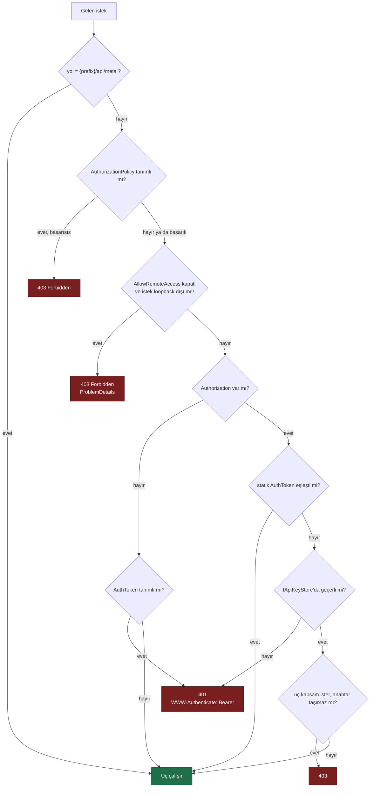
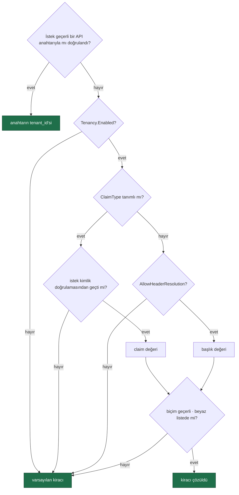

# Güvenlik Modeli

> **`MIMARI.md`'nin güvenlik bölümüdür.** Faz 77'de oradan ayrıldı: bölüm
> 17 KB'a ulaşmıştı (dosyanın %42'si) ve her güvenlik fazı ona ekliyordu.
> `MIMARI.md` zaten bölüm bölüm okunur; bu ayrım okuma biçimini değiştirmez.
> Bugünkü mimarinin geri kalanı: [`MIMARI.md`](MIMARI.md). Karar: K-524.

---

Üç katman, sırayla uygulanır:

1. **Loopback kısıtı** — `AllowRemoteAccess = false` (varsayılan). Loopback dışı istek `403` alır. Kaza ile açılmaya karşı koruma.
2. **Bearer token** — statik `AuthToken` sabit zamanlı karşılaştırmayla denetlenir; eşleşmezse **kiracı bazlı API anahtarı** (`IApiKeyStore`, hash `key_hash`, K-356) denenir: iptal/süre denetiminden geçer, kapsamı (uç istiyorsa) uyuşur. `ApiKeyScope` rolü DARALTIR, yerine geçmez — `rol ∩ kapsam` (K-360). Dışa açılan MCP/A2A yüzeyi geçerli bir `external:invoke` anahtarı ister (`ExternalSurfaceGuard`). `Authorization` başlığı YOKSA ve `AuthToken` tanımsızsa katman atlanır (K1); başlık VARSA her zaman doğrulanır (K-359).
3. **Authorization policy** — `RequireAuthorization("policy")` ile ASP.NET Core kimlik doğrulama boru hattına bağlanır. Üretimde kullanılan yol budur.

`{prefix}/api/meta` kimlik doğrulaması olmadan erişilebilir. Arayüzün hangi kimlik yöntemini kullanacağını öğrenmesi için gereklidir; hiçbir hassas veri döndürmez.

**Arayüz kabuğu (HTML, JS, CSS) bearer token katmanından muaftır** (karar K-046).
Tarayıcı bir `<script src>` isteğine `Authorization` başlığı ekleyemez; kabuk
kilitlenseydi kullanıcı token'ı girebileceği ekranı hiçbir zaman göremezdi. Kabuk
veri taşımaz. Loopback kısıtı ve authorization policy kabuğa da uygulanır:

| Katman | `/api/meta` | Arayüz kabuğu | Konuşma WebSocket'i | Diğer tüm uçlar |
|--------|-------------|---------------|---------------------|------------------|
| Loopback kısıtı | ❌ | ✅ | ✅ | ✅ |
| Authorization policy | ❌ | ✅ | ✅ | ✅ |
| Bearer token | ❌ | ❌ | ✅ **alt protokolde** | ✅ başlıkta |

🚨 **Konuşma WebSocket'i token'ı `Sec-WebSocket-Protocol` alt protokolünde alır**
(`agentprism.token.<token>`) ve sabit zamanda kendisi doğrular (K-224). Tarayıcı
bir el sıkışmaya `Authorization` başlığı ekleyemez; sorgu dizesi ise sunucu ve
ters vekil günlüklerine yazılacağı için **kabul edilmez**. Uç ayrıca `Operator`
rolü ister, oturumun kiracı sahipliğini doğrular, kiracı başına eşzamanlı
bağlantıyı sınırlar ve süre/boşta zaman aşımı uygular.

Arayüz token'ı `sessionStorage`'da tutar — sekme kapanınca silinir (K-047). Dil
ve tema tercihi `localStorage`'dadır (K-230).

Ek sınırlar:

- `secret`'lar (`ApiKey`, bağlantı dizesi, MCP kimlik değeri) **hiçbir zaman** veritabanına yazılmaz, API'den dönmez, arayüzde gösterilmez
- `previous_response_id` ve `conversation_id` güvenilmez girdi kabul edilir; her zaman kiracı sahipliği doğrulanır
- `audit_log` Faz 9'dan beri doludur — bkz. "Roller ve denetim izi"

## Çok kiracılılık ve tool onayı

**Tool onayı.** `RequiresApproval = true` işaretli tool, `ToolRegistry` içinde
`ApprovalRequiredAIFunction` ile sarılır. Sarmalama **defterde** yapılır çünkü
defter, "bir agent yalnızca kayıtlı bir tool'a işaret edebilir" kuralının
zorlandığı tek yerdir; başka bir kod yolunun sarmalamayı atlaması mümkün olmaz.

**Asenkron onay kutusu (Faz 55).** Kuyruktan koşan bir çalıştırma onay isteyip
`AwaitingApproval`'a düşerse `pending_approvals` (izdüşüm) üzerinden
`POST /api/approvals/{id}/decide` ile kararlanır — denetim izi karardan ÖNCE
yazılır (K-089/K-370). Senkron/MCP/A2A yolu bu tabloya HİÇ yazmaz; oradaki
onay bugünkü gibi bir sonraki turun `approvals` alanıyla çözülür (K-372).

**MCP sınırı.** MCP sunucusu eklemek, dışarıdan gelen tool tanımlarını kabul etmek
demektir ve tasarım kuralı K2'nin bilinçli istisnasıdır. Beş koruma: yalnız
`http`/`https` — **stdio yoktur** (K-058), çünkü süreç başlatmak K2'yi bozar ·
varsayılan `RequiresApproval = true` · kodda kayıtlı bir tool'un adını taşıyan
MCP tool'u **yok sayılır** (K-060) · kayıt kimlik doğrulama **değerini** değil,
değerin okunacağı yapılandırma anahtarının **adını** taşır (K-059) · her çağrı
kaynak sunucu adıyla `tool_invocations`'a yazılır.

**Kiracı çözümleme.** Varsayılan **kapalıdır**; açıldığında sıra:

🚨 **API anahtarı en yüksek önceliktedir** (Faz 53) — bir sırrı KANITLAR, claim/başlık
yalnızca BEYANDIR; çelişirse filtre isteği buraya hiç ulaştırmadan `403` verir.

🚨 **Claim tanımlıysa başlık hiç okunmaz.** Aksi hâlde kimlik doğrulamasından
geçmiş bir kullanıcı, bir başlık ekleyerek başka bir kiracının verisine
erişebilirdi. Başlık yolu ayrıca `AllowHeaderResolution` ile **açıkça**
açılmalıdır — bir HTTP başlığı kimlik kanıtı değildir.

**Yalıtımı zorlayan kapı (Faz 41).** Her depo sözleşmesi yalıtımı **iki yönlü**
sınar (B görmemeli · A kendi verisini görmeli) ve dört koşumda çalışır (bellek
içi + üç SQL); `TenantCoverageTests` her public depo metodunun ya sınandığını
ya `[TenantAgnostic]` ile gerekçeli muaf olduğunu zorlar. Bulduğu kusurlar:
K-277, K-278, K-279.

**Yalıtım hangi katmandadır (K-623, Faz 104).** Yalıtım **uygulama
katmanındadır**: kiracı `ITenantContext` ile çözülür, filtre sorgu katmanında
uygulanır ve yukarıdaki kapı bunu zorlar. Veritabanı RLS'i **yoktur ve bilinçli
olarak yoktur** — `grep -rn "ROW LEVEL SECURITY" src/` sıfır döner. Gerekçenin
tamamı K-623'tedir; özeti üç maddedir: kapı zaten `TenantCoverageTests`'tir,
SQLite'ta RLS karşılığı yoktur (üç sağlayıcının davranışı ayrışır) ve SQL Server
tarafı gerçek container üzerinde doğrulanamıyor (K-186, K-317). Bu bir savunma
derinliği reddi değil, bir sıralama kararıdır. Tüketiciye dönük karşılığı
`docs-site/src/content/docs/concepts/governance.md`'dedir.

**Hız sınırı bir yalıtım sınırı DEĞİLDİR (Faz 104).**
`AgentPrismRateLimitOptions` ve `InboundTriggerRateLimiter` süreç belleğinde
sayar; `Partition = Tenant` her örneğin **kendi** penceresini kiracıya böler,
dağıtım genelinde paylaşılan bir pencereyi değil. Bir kiracının toplam
tüketimini bağlayan şey kotadır — o veritabanında sayılır ve örnek sayısından
etkilenmez.

**Kiracı sağlayıcı anahtarları / BYOK ve egress (Faz 65).** Varsayılan
**kapalıdır**: kiracı `store`'larından biri bile kayıtlı değilse veya
tenant context yoksa `ModelProviderRegistry.CreateChatClientAsync` sync
`CreateChatClient` ile birebir davranır. Açıldığında, her model çağrısından
önce iki kontrol TEK yerde sırayla çalışır: (0) **egress** — kiracının
`tenant_egress_policies` kaydı sağlayıcıyı izin veriyor mu (politika yoksa
kısıtsız); (1) **kimlik bilgisi** — kiracının `tenant_provider_bindings`
kaydı var mı, varsa yapılandırma anahtarının **adı** (asla değeri, K-059)
`IConfiguration`'dan çözülür. Kayıt var ama değer yoksa çağrı global
anahtara **düşmez**; anlaşılır bir hata verir. Bu tek nokta hem gerçek
`run` derlemesini (`CompiledAgentCache` → `AgentDefinitionCompiler.CompileAsync`)
hem `AgentDefinitionValidator`'ın ön-uçuş kontrolünü besler — izinsiz bir
sağlayıcıya işaret eden tanım **derleme anında**, gerçek bir ağ çağrısı
olmadan reddedilir.

## Roller ve denetim izi

**Rol modeli.** Üç policy adı — `AgentPrismPolicies.Reader` / `.Operator` / `.Admin`
— tanımlanır. AgentPrism rol veya kullanıcı **saklamaz**; tüketici bu adları kendi
`AddAuthorization(...)` çağrısında kendi claim'lerine bağlar. Bir policy tüketicide
**kayıtlı değilse** ilgili uç grubu yalnızca yukarıdaki üç katmanlı korumadan geçer
— sürüm yükseltmesi mevcut kurulumları kırmaz. `AgentPrismEndpointOptions.RequireRolePolicies`
açılırsa eksik bir policy `MapAgentPrism()` çağrısını **açılışta** hataya çevirir.

| Rol | Kapsam |
|-----|--------|
| Reader | Agent, çalıştırma, oturum, trace, istatistik **okuma** |
| Operator | Reader + çalıştırma başlatma, onay verme, oturum silme |
| Admin | Hepsi: agent tanımı yazma, MCP sunucusu ekleme, kiracı ve onay kuralı yönetimi, denetim izi okuma |

`GET {prefix}/api/meta` yanıtı artık `roles: { canRead, canOperate, canAdminister }`
alanı taşır — arayüz yetkisi olmayan düğmeleri bu alana göre gizler. Bir policy
kayıtlı değilse karşılık gelen alan her zaman `true` döner (rol kısıtı yok).

**Denetim izi.** `audit_log` tablosuna agent, MCP sunucusu, kiracı ve onay kuralı
yazmaları ile tool onay kararları düşer — **çalıştırmalar düşmez** (`runs` tablosu
zaten tam kaydı tutar). Yazma **iki yerde** olur: `store` decorator'ları (`Auditing*Store` —
`AgentPrism.Core`) ve **`endpoint` katmanı**. Endpoint yazması istisna değildir,
kuraldır: bir `store` yazmasına karşılık gelmeyen her eylem (`mcp.refresh`,
`tenant_egress.save`, `stats.recalculate-costs`, onay kararı, eval koşumu,
veri konusu silme…) uçta yazılır. On iki uç dosyası `AuditRecorder.WriteAsync`
çağırır; `DataSubjectEndpoints` ve `TriggerEndpoints` ayrıca doğrudan
`IAuditLog`'a yazar.

**Geri alınamaz eylem `AuditRecorder` kullanamaz.** `AuditRecorder` `store`
hatasını yutar ve yalnız uyarı loglar; kod çalıştırma yetkisi veren
`script.grant`/`script.revoke` ve script çalıştırmanın kendisi bu yüzden
`IAuditLog`'u **doğrudan** çağırır ve yazamazsa **eylemi keser**.

**Denetim yükü elle kurulmaz.** `AuditPayload.Write`/`WriteArray` kullanılır:
elle kurulan JSON, içinde tırnak taşıyan bir değerde bozulur, `AuditSecretFilter`
`JsonException`'ı yakalayıp metni **redakte etmeden** döndürür ve PostgreSQL'de
`jsonb` cast'i düşer — mutasyon uygulanmış, kayıt yazılmamış olur.

Aktör `AuditActorContext` adlı bir `AsyncLocal` köprüsünden okunur:
`AgentPrismEndpointFilter`, her korumalı istekte `HttpContext.User`'ı oraya yazar;
`AgentPrism.Core`'daki `AmbientAuditActorResolver` onu okur. Bu, `AgentPrism.Core`'a
ASP.NET Core bağımlılığı eklemeden "kim yaptı" sorusunu yanıtlamanın yoludur —
`ClaimsPrincipal` temel .NET kütüphanesindedir. Kimlik doğrulaması yoksa aktör
`null`'dur ve bu gizlenmez.

`before`/`after` yazılmadan önce `AuditSecretFilter` içinden geçer: anahtar adında
`apiKey`, `authorization`, `password`, `secret` veya **tekil** `token` geçen her
alanın değeri `"***"` olur (çoğul `tokens` — `maxOutputTokens` gibi sayım
alanları — hariç). Denetim izi yazma hatası **çalıştırmayı kesmez**;
"gözlemlenebilirlik işlevi bozmaz" kuralı burada da geçerlidir.

## Denetim zinciri ve veri konusu hakları (Faz 64)

**Değiştirilemezlik.** Her `audit_log` satırı kendi içeriğinin SHA-256 özetini
(`hash`) ve bir önceki satırın özetini (`prev_hash`) taşır, kiracı başına
zincirlenir. `IAuditLog.VerifyChainAsync` (`GET /api/audit/verify`) zinciri baştan
sona yürür ve üç durumdan birini döner: `Valid`, `Broken` (bir satır değiştirildi)
veya `Gap` (bir satır silindi ya da hiç yazılmadı). Kanonik biçim ve doğrulama
mantığı tek bir yerdedir (`AgentPrism.Core.AuditChainHasher`/`AuditChainWalker`) —
`InMemoryAuditLog` ve üç SQL sağlayıcısı aynı kodu çağırır. Eşzamanlı yazım,
`(tenant_id, prev_hash)` üzerindeki benzersiz bir dizinin doğal olarak
serileştirmesiyle çözülür; kaybeden yazıcı yeniden dener (oturum/advisory kilit
**kullanılmaz** — K-284'ün "bağlantı havuzuna bağımlı kilitten kaçının" ilkesi).
Bu özellikten ÖNCE yazılmış satırlar `hash` taşımaz ve zincire dahil edilmez;
geriye dönük uyumluluk bu şekilde sağlanır.

**Veri konusu hakları.** AgentPrism kişisel kimlik saklamaz. Bir tüketici
`IDataSubjectResolver` kaydederse (`subjectId → sessions/runs/conversations`),
`GET /api/data-subjects/{id}/export` ve `DELETE /api/data-subjects/{id}` uçları
açılır; kayıtlı bir çözümleyici yoksa ikisi de `409` döner. Silme
`IDataSubjectStore` (`SqlDataSubjectStore`) üzerinden çalışır: aynı `DELETE` sorgu
kümesi hem önizleme (`dryRun=true`, varsayılan — her zaman `ROLLBACK`) hem gerçek
silme (yalnız çağıranın denetim yazımı başarılı olursa `COMMIT`) için kullanılır.
Silme **içerik** verisinde uygulanır (oturum, çalıştırma, konuşma, ek, puan, ses);
`audit_log`'a hiç dokunmaz — "kim ne yaptı" bilgisi kişinin kendi verisi değildir,
silme eylemi ise yeni bir denetim kaydı olarak eklenir.

## Skill script çalıştırma

Bu, K2'nin (**"tool'lar yalnız kodda tanımlanır"**) **ikinci bilinçli
istisnasıdır**. Birincisi MCP'ydi ve orada süreç **uzakta** çalışıyordu; burada
süreç **AgentPrism'in makinesinde** çalışır.

Özellik **varsayılan olarak kapalıdır** ve yalnız kodda açılır
(`UseSkillScripts(...)`: zorunlu onay bayrağı + boş başlayan yorumlayıcı beyaz
listesi + kodda verilen skill kökleri). **Yürütülebilir yüzeyi genişleten üç
alan yapılandırmadan okunmaz**: `Interpreters`, `SkillRoots` ve
`AllowStoredScripts`. Bağlama bu alanları kodda verilenin üzerine **eklediği**
için bir ortam değişkeni yeni yorumlayıcı tanıtabiliyordu. `Enabled` ve
`PlatformIsolationAcknowledged` bağlanmaya devam eder — ikisi de yüzeyi
genişletemez, yalnız kapatır veya sınırı kabul eder.

Her çalıştırma **beş kapıdan sırayla** geçer; biri kapalıysa süreç hiç başlamaz
ve `AgentPrismException` atılır: (1) `Enabled` · (2) kiracı için geçerli izin ·
(3) uzantı yorumlayıcı beyaz listesinde (boş varsayılan, K-088) · (4) argüman
boyutu, şeması ve **script adının düz bir dosya adı olduğu** · (5) denetim izine
yazılabildi. Ardından **eşzamanlılık kotası** gelir; o bir kapı **değil, bir
kuyruktur**: iki katmanlı `SemaphoreSlim` (kiracı + toplam) isteği reddetmez,
yer açılana kadar **bekletir** — yalnız `CancellationToken` ile kopar.
Ancak sonra ayrı süreç temiz ortamla, stdin'den argümanla (K-091), zaman aşımı
ve çıktı sınırıyla başlar.

🚨 Beşinci kapı Faz 9 kuralının **istisnasıdır**: denetim izine yazılamayan bir
script çalıştırması, hiçbir kaydı olmayan bir uzaktan kod çalıştırma olurdu
(K-089). Diğer tüm yazmalarda denetim hatası yutulur; burada yutulmaz.

🚨 **AgentPrism dosya sistemi hapsi, ağ kısıtı, bellek/CPU kotası ve hak düşürme
SAĞLAMAZ**; dördü de barındırma ortamında (container + cgroup + ayrıcalıksız
kullanıcı) kurulur. `PlatformIsolationAcknowledged` bayrağı bu sınırı görmeden
özellik açılmasını engeller: `Enabled = true` iken bayrak `false` ise
**açılışta** hata verilir (K-086).

Kapı akış şeması, koruma tablosunun tamamı (ortam temizliği, zaman aşımı, çıktı
sınırı, eşzamanlılık, `SkillScriptGrant`, denetim olayları) ve barındırma
kurulumu: [`11-SKILL-SCRIPT-CALISTIRMA.md`](arsiv/fazlar/11-SKILL-SCRIPT-CALISTIRMA.md).

## Kota ve webhook imzası

**🚨 SSRF — giden istek sınırı.** Webhook adresini *kullanıcı* verir ve sunucu o
adrese istek atar; kontrolsüz bırakılırsa iç ağa erişim aracı olur — bulut
metadata uçları (`169.254.169.254`) dâhil. Varsayılan
`AllowPrivateNetworkTargets = false`; yalnız `https`; `AllowAutoRedirect = false`.

🚨 **Adres denetimi `SocketsHttpHandler.ConnectCallback`'in içindedir**:
doğrulanan adres, soketin bağlandığı adresin ta kendisidir. Önce doğrulayıp
sonra `SendAsync(url)` çağırmak TOCTOU açığı bırakırdı (K-164). Koruma
`WebhookHttpClient`'ın **içine gömülüdür**; tüketici değiştiremez
(`IHttpClientFactory` bilinçli kullanılmadı). Tek doğruluk noktası
`WebhookUrlValidator.IsAllowedTarget`'tır; reddedilen aralıkların tam listesi
ve diğer sınırlar [`21-KOTA-VE-OLAY-YAYINI.md`](arsiv/fazlar/21-KOTA-VE-OLAY-YAYINI.md)'dedir.

**Webhook `secret`'i veritabanında durmaz** — kayıt yalnız yapılandırma
anahtarının **adını** taşır; sözleşmede `secret` alanı hiç yoktur (K-059).

**İmza yeniden oynatmaya kapalıdır:** `HMAC-SHA256(timestamp + "." + body, secret)`
— zaman damgası imzaya dâhildir (K-163). Tolerans penceresini alıcı denetler.

**Kota ve hız sınırı ayrı mekanizmalardır** (K-158). Hız sınırı saniye/dakika
ölçeğinde, bellekte; kota gün/ay ölçeğinde, veritabanında. İkisi de **varsayılan
olarak hiçbir isteği reddetmez**: hız sınırı `Enabled = false`, kota ise kural
tanımlanmadıkça boştur (K-165). Kota **yaklaşıktır** — denetim çalıştırma
öncesinde, tüketim sonrasında yazılır (K-159).

## MCP OAuth ve kaynak erişimi

Prompt bir **anlık görüntüdür** — yönetici panoya kopyalar, agent canlı çekmez.
Kaynak erişimi yalnız sunucunun **bildirdiği** URI kümesiyle sınırlıdır; serbest
URI bir SSRF aracı olurdu. OAuth token'ı `(kiracı, sunucu)` başına bellek içinde
tutulur, **veritabanına yazılmaz**; SDK yalnız Authorization Code destekler
(K-168). `/oauth/callback` arayüz kabuğuyla aynı gruptadır: loopback + policy
geçerli, yalnız bearer muaf — güvenlik tek kullanımlık `state`'e dayanır.
Boyut sınırları ve akış: [`22-MCP-DERINLESMESI.md`](arsiv/fazlar/22-MCP-DERINLESMESI.md).

## İçerik denetimi (Faz 48)

`IContentGuard` modele giden ve modelden gelen içeriği denetler; kararlar
`Allow` / `Mask` / `Block`'tur ve **en sert karar kazanır**. Varsayılan
**kapalıdır** — guard kayıtlı değilse sarmalayıcı hiç eklenmez, ölçülen maliyet
sıfırdır (K-323).

🚨 Konum: tool çağrı döngüsünün **içinde**, ham istemcinin üstünde (K-321) — tool
sonucu modele ikinci çağrıda girer ve döngü dışı bir halka onu göremez.
Engellenen içerik ağa **hiç çıkmaz**, devre kesiciyi **tetiklemez** (K-322) ve
**hiçbir yere yazılmaz**; iz yalnız guard/kural/yön taşır (K-325). 🚨 Maskeleme
model sınırındadır — `run_events`/`run_inputs` ham metni saklar.
Ayrıntı: [`48-GUARDRAILS.md`](arsiv/fazlar/48-GUARDRAILS.md).

`ContentGuardContext.Source` (Faz 140) denetlenen metnin kullanıcı mesajı mı,
tool sonucu mu (+ `ToolName`) yoksa model çıktısı mı olduğunu taşır — üçü de
eskiden aynı `Direction=Input` torbasına giriyordu. Sınıflama içerik tipine
ve mesajın rolüne bakar, **`Direction`'a değil** (K-672); `Unknown` hiçbir
zaman gevşek bir karara çevrilmez. Yerleşik `PatternContentGuard` bunu
kasıtlı okumaz — kaynağa göre farklı davranmak isteyen bir guard kendi
implementasyonunda `context.Source`'u okur.

---
