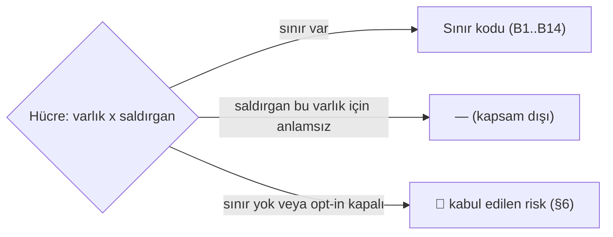

# Tehdit Modeli

> **Ölçüldü:** commit `1fa0c60f`, 2026-09-15. Kaynak sınır kümesi
> [`getting-started/security.md`](../docs-site/src/content/docs/getting-started/security.md)
> § *The boundaries Tracon enforces* (14 satır). Bu dosya o kümeyle
> **eşitlenmek zorundadır** — tazelik kapısı `docs-site/scripts/check-content.mjs`
> içinde iki yönlü çalışır (bkz. § Tazelik Kapısı).
>
> **Bu doküman [`MIMARI-GUVENLIK.md`](MIMARI-GUVENLIK.md)'in tekrarı değildir,
> ona atıf yapar.** Orada uygulamanın **nasıl** çalıştığı (kod, akış, sıra)
> vardır; burada **kime karşı** ve **neyi** koruduğu vardır. Kurumsal
> güvenlik incelemesinin sorduğu ilk soru budur — bugüne kadar cevabı yoktu
> (bkz. faz dokümanının "Bugün ne çalışmıyor" bölümü).

---

## 1. Kapsam ve okuyucu

Bu doküman Türkçe ve geliştirme kaydıdır — sonraki faz oturumu ve kod tabanına
erişimi olan bir denetçi için yazılmıştır. Kod kanıtı (dosya yolu, satır,
`grep` komutu) taşır.

İngilizce özeti [`docs-site/.../reference/threat-model.md`](../docs-site/src/content/docs/reference/threat-model.md)'dedir
— kurumsal güvenlik inceleyicisi için, kod kanıtı ve iç gerekçe olmadan
(K-059 ilkesiyle aynı ayrım: dışa giden metin yalnız **sonucu** taşır).

**Kapsam dışı:** Tracon'un çalıştığı .NET çalışma zamanının, PostgreSQL/SQL
Server/SQLite motorunun veya işletim sisteminin kendi güvenlik açıkları.
Kapsam `SECURITY.md`'nin kapsam listesiyle aynı sınırdadır.

---

## 2. Saldırgan profilleri

Yedi profil, ikisi **dışarıdan gelmez**:

| # | Profil | Tanım |
|---|---|---|
| A1 | Kimliği doğrulanmamış ağ çağrısı | `/tracon` yoluna ulaşan, token/anahtar/politika taşımayan istemci |
| A2 | Yetkisi düşük kiracı kullanıcısı | Geçerli kimliği var, rolü `Reader` veya `Operator`; kendi kiracısı içinde başka bir oturuma veya `Admin` işlemine erişmeye çalışır |
| A3 | Başka kiracının kullanıcısı | Geçerli kimliği var, **farklı** bir kiracıya ait; hedef kiracının verisine erişmeye çalışır |
| A4 | `tool` çıktısı üzerinden gelen içerik | Model bağlamına bir `tool` sonucu, bir dosya içeriği veya bir MCP kaynağı üzerinden giren, talimat gibi davranan metin (prompt injection) |
| A5 | Kötü niyetli MCP sunucusu | Tracon'un bağlandığı, kendi tanımladığı `tool`/kaynak listesini veya yanıtlarını kötüye kullanan bir uzak sunucu |
| A6 | Konsol/API erişimi olan operatör | Geçerli, yetkili bir kimlik; kasıtlı ya da yanlışlıkla yetkisini aşan bir eylem yapar |
| A7 | Veritabanı okuma erişimi olan kişi | Yedek hırsızı, yanlış yapılandırılmış izin, taşınan disk — Tracon'un HTTP yüzeyini hiç görmeden doğrudan depoyu okur |

A6 ve A7 önemlidir: Tracon'un tehdit yüzeyinin bir kısmı kendi API'sinden
**geçmez**. A7 özellikle özeldir — aşağıdaki 3. bölümdeki sınırların
**çoğu uygulama katmanındadır ve A7'yi hiç görmez** (bkz. § 4.7).

---

## 3. Varlıklar

`SECURITY.md` kapsamından genişletilmiş yedi varlık:

| # | Varlık | Kaynak |
|---|---|---|
| V1 | `secret` değerleri | Sağlayıcı anahtarı, `tool`/webhook imzalama anahtarı, MCP yetkilendirme değeri |
| V2 | Kiracı verisi | Agent tanımı, kiracı ayarı, onay kuralı, sağlayıcı bağlaması |
| V3 | Oturum içeriği | `sessions.state`, `conversation_items.item`, `run_inputs.messages`, `run_events.*`, `tool_invocations.*`, `attachments`/`agent_files` içeriği |
| V4 | Denetim izi | `audit_log` tablosu — `before`/`after` durum, aktör, eylem |
| V5 | `tool` çağrı yetkisi | Bir `tool`'u belirli argümanlarla çağırma hakkı |
| V6 | Model bütçesi | İstek hızı ve harcama tavanı |
| V7 | `script` çalıştırma hakkı | Skill script'inin sandbox içinde çalıştırılma izni |

---

## 4. Sınır kodları

`getting-started/security.md` § *The boundaries Tracon enforces* tablosundaki
14 satırın birebir karşılığı. **Bu liste tazelik kapısının karşılaştırdığı
kümedir — bir satır o tablodan silinir veya eklenirse burası da değişir.**

| Kod | Sınır (İngilizce adı, kapı bunu eşler) | Ne durdurur |
|---|---|---|
| B1 | Endpoint access | Kimliği doğrulanmamış veya yetkisiz çağrı |
| B2 | Tenant isolation | Başka kiracının satırını okuma/yazma |
| B3 | Session ownership | Sahibi olmayan oturuma devam etme |
| B4 | Tool authorization | Çağıranın yetkili olmadığı bir `tool` çağrısı |
| B5 | Tool approval | İnsan onayı beklemeden çalışan bir `tool` çağrısı |
| B6 | Tool definition | Konsoldan yazılan bir `tool` — `tool`'lar yalnız kodda tanımlanır |
| B7 | Script sandboxing | `script`'in sandbox'ından kaçması |
| B8 | Outbound egress | Özel ağ hedefine veya izinsiz host'a giden istek (SSRF) |
| B9 | Content guards | Yapılandırılmış bir `guard`'ın reddettiği girdi/çıktı |
| B10 | Secret handling | `secret` değerinin depoya, log'a veya yanıta ulaşması |
| B11 | At-rest protection | Tam güvenilmeyen bir veritabanındaki okunabilir içerik |
| B12 | Audit trail | Altı işlemin kaydı olmadan sürmesi |
| B13 | Quotas and rate limits | Yapılandırılmış tavanın üzerinde harcama/istek hacmi |
| B14 | Production profile | Hiç verilmemiş bir güvenlik kararıyla başlayan host |

---

## 5. Varlık × Saldırgan matrisi

Her hücre ya bir sınır koduyla **kapanır**, ya `—` ile "bu saldırgan profili
bu varlık için anlamlı bir tehdit değil" (örn. A2 kendi kiracısının verisine
zaten yetkilidir), ya da 🔴 ile **kapanmayan hücre** işaretlenir ve § 6'da adıyla
açıklanır.

| Varlık ↓ / Saldırgan → | A1 | A2 | A3 | A4 | A5 | A6 | A7 |
|---|---|---|---|---|---|---|---|
| **V1** `secret` | B1+B10 | B10 | B2+B10 | B10 | B10 | 🔴 R1 | B10 |
| **V2** Kiracı verisi | B1 | B1 (rol) | B2 | — | — | 🔴 R2 | 🔴 R3 |
| **V3** Oturum içeriği | B1 | B3 | B2 | 🔴 R4 | 🔴 R4 | 🔴 R2 | 🔴 R3 |
| **V4** Denetim izi | B1 | B1 (rol) | B2 | — | — | 🔴 R2 | 🔴 R5 |
| **V5** `tool` çağrı yetkisi | B1 | B4 | B2+B4 | B5+B9(opt) | B4+B6 | 🔴 R2 | — |
| **V6** Model bütçesi | B1 | B13 | B2+B13 | — | — | 🔴 R2 | — |
| **V7** `script` çalıştırma | B1 | B7 | B2+B7 | B7 | — | 🔴 R2 | — |

Notlar:

- **V1×A6** (🔴 R1): konsol/API üzerinden ham `secret` değeri **hiçbir zaman**
  dönmez (B10 bunu tam kapatır) — ama operatörün kendi yapılandırma deposuna
  (`dotnet user-secrets`, ortam değişkeni) erişimi Tracon'un sınırı dışındadır;
  bu erişim zaten host'un kendi IAM'ıdır. R1 bu ayrımı adlandırır.
- **V2/V3/V4/V5/V6/V7 × A6** (🔴 R2): `Admin` rolü **tanım gereği** tenant
  yönetimi, onay kuralı ve denetim izi okuma dahil geniş yetkiye sahiptir
  (Roller tablosu). Rolün kötüye kullanılması Tracon'un değil, host'un IAM
  sınırıdır — B1 rolü doğru bağladığını garanti eder, rolün doğru kişiye
  verildiğini garanti etmez.
- **A7 sütunu** neredeyse tamamen 🔴: ham veritabanı erişimi B1–B9'un
  **hepsini** atlar, çünkü bu sınırlar uygulama katmanındadır (bkz. § 4.7).
  Yalnız B10 (`secret` hiç yazılmaz) ve B11 (opt-in şifreleme) çalışır durumda
  kalır.

---

## 6. Kabul edilen riskler (kapanmayan hücreler)

🚨 Bu bölüm gizlenmez — bir tehdit modelinin değeri kapattığı hücrelerde
değil, kapatmadığını **söylediği** hücrelerdedir.

### R1 — Operatörün kendi `secret` deposuna erişimi Tracon'un sınırı dışındadır

K-059: kayıt yalnız yapılandırma anahtarının **adını** taşır, değeri
`IConfiguration` çözer. Bu, değerin Tracon'un veritabanına veya API
yanıtına **hiç girmediğini** garanti eder — ama değerin nerede saklandığı
(`dotnet user-secrets`, ortam değişkeni, bir bulut `secret` deposu) host'un
kararıdır ve Tracon onu göremez, koruyamaz.

### R2 — `Admin` rolünün kötüye kullanımı host'un IAM sınırıdır

Roller (`Reader`/`Operator`/`Admin`) host'un kendi kimlik doğrulama
altyapısına **bağlanır** (`RequireAuthorization("TraconAdmin")`); Tracon
kullanıcı ya da rol saklamaz. B1 rolün doğru **uygulandığını** kanıtlar,
rolün doğru **kişiye verildiğini** kanıtlamaz — bu ayrım `getting-started/security.md`
§ *Roles*'te de örtük olarak vardır (`RequireRolePolicies` yalnız eksik
politikayı yakalar, yanlış atanmış politikayı yakalamaz).

### R3 — Ham veritabanı erişimi uygulama katmanındaki sınırların (B1–B9) hepsini atlar

B1–B9 ASP.NET Core boru hattında, HTTP isteği üzerinde çalışır. A7 bu
boru hattını hiç görmez. Kalan iki sınır:

- **B10** (`secret` hiç yazılmaz) tam kapanır — K-059'un asıl tasarlandığı
  senaryo budur.
- **B11** (at-rest şifreleme) yalnız `AddContentProtection(...)` açıksa ve
  yalnız `ProtectedColumn`'daki **on** sütun için çalışır
  (`src/Tracon.Abstractions/Security/ProtectedColumn.cs`). Kapalıysa
  `TraconProductionRisk.UnencryptedContentAtRest` adıyla kabul edilmiş bir
  risktir (`RequireProductionProfile()` bunu adlandırmadan geçmeyi reddeder).

### R4 — Prompt injection yalnız `guard` yapılandırılmışsa kapanır

`tool` çıktısından veya bir MCP kaynağından gelen, talimat gibi davranan
içerik (A4) ve kötü niyetli bir MCP sunucusunun kendi yanıtı (A5) B9'a
düşer — ama B9 **opt-in**'dir. `SECURITY.md` § *Scope* bunu açıkça kapsam
dışı sayar: *"prompt injection that a configured guard is not enabled to
stop"*. Yapılandırılmamış bir dağıtımda bu hücre **hiçbir sınırla
kapanmaz**; `TraconProductionRisk.UninspectedContent` adı bunu üretim
profili kapısında zorunlu bir karara çevirir.

### R5 — Denetim izi içeriği hiçbir zaman at-rest şifrelemeye girmez

`audit_log` tablosunun `before`/`after` (jsonb) sütunları
`ProtectedColumn` enum'unda **yoktur** (`src/Tracon.PostgreSql/Migrations/0001_initial.sql:229`,
`src/Tracon.Abstractions/Security/ProtectedColumn.cs`). Bu, `AddContentProtection(...)`
açık olsa bile A7'nin denetim izini **her zaman** düz metin okuyabileceği
anlamına gelir. `secret` değeri zaten K-059 ile bu tabloya hiç girmiyor —
ama bir agent tanımının veya onay kuralının önceki/sonraki durumu (`before`/`after`)
girer ve bugün hiçbir ayar bunu şifrelemez. **Bu tur ölçülen, önceden
adlandırılmamış bir bulgudur** — DoD'nin "kapanmayan hücre adıyla yazılır"
maddesi tam bunun için var.

### R6 — Denetim izinin best-effort yarısı, bir depo arızasında sessizce boşluk bırakabilir

K-776: altı işlem (onay kararı, `script` izni verme/alma, `script`
çalıştırma, tetikleyici kayıt/silme, otomatik kanarya geri alma, veri
konusu silme) fail-closed'dır — kayıt başarısız olursa işlem **de**
uygulanmaz. Kalan her denetim yazımı best-effort'tur: depo hatası kaydı
düşürür, işlem **sürer**. Bu, gözlemlenebilirliğin ürün işlevselliğini
kesmemesi için bilinçli bir tasarımdır (`docs-site/.../concepts/governance.md`
§ *What is guaranteed to be written*) — ama sonucu, depo katmanını hedef alan
biri (örn. PostgreSQL'e karşı bir DoS) tarafından best-effort kategorideki
denetim kayıtlarının **görünmeden** düşürülebilmesidir. `tracon.audit.write_failures`
metriği (etiket `swallowed`) bunu izlenebilir kılar ama **önlemez**.

### R7 — Konsol kabuğu bearer katmanından muaftır

`getting-started/security.md` § *Two deliberate exemptions*: konsolun
HTML/JS/CSS'i bearer token katmanından muaf, çünkü bir tarayıcı
`<script src>` isteğine `Authorization` başlığı ekleyemez. Kabuk **veri**
taşımaz; loopback kısıtı ve yetkilendirme politikası hâlâ geçerlidir. Bu
hücre kapanmaz ama zararı sınırlıdır — adlandırılması gereken bir tasarım
kararıdır, bir kusur değildir.

---

## 7. Sürüm ve tazelik notu

Bu tablo (§ 4, 14 sınır) ve `getting-started/security.md`'nin sınır tablosu
**aynı kümeyi** taşımalıdır — K-775 deseni: yayımlanan bir iddia ölçümle
bağlanır ve ölçüm yenilenmeden sürüm satırı güncellenmez. Kapı
`docs-site/scripts/check-content.mjs` içindedir (bkz. `securityPolicyFacts`
emsali, aynı dosyada `SECURITY.md` ↔ `reference/security-policy.md`
senkronu için zaten var — bu fazın kapısı aynı deseni sınır kümesi için
tekrarlar) ve **iki yönlü** çalışır: § 4'te olup site tablosunda olmayan
bir satır da, site tablosunda olup burada olmayan bir satır da kırmızı
döndürür.

Bir faz `getting-started/security.md`'ye 15. bir sınır eklediğinde:

1. § 4'e (bu dosya) satırı ekle
2. § 5 matrisine yedi hücreyi (bir satır) ekle — kapanan/kapanmayan her
   hücreyi yaz, boş bırakma
3. `docs-site/.../reference/threat-model.md`'nin sınır tablosunu güncelle
4. `docs-site/scripts/check-content.mjs` kapısını çalıştır

---

## 8. Atıflar

- Uygulama detayı, akış, sıra: [`MIMARI-GUVENLIK.md`](MIMARI-GUVENLIK.md)
- Sınır listesinin kaynağı: `docs-site/.../getting-started/security.md`
- Kapsam gerekçesi: [`SECURITY.md`](../SECURITY.md), `docs-site/.../reference/security-policy.md`
- Denetim izi garanti ayrımı: K-776, `docs-site/.../concepts/governance.md` § *What is guaranteed to be written*
- Üretim riskleri: `src/Tracon.Abstractions/Diagnostics/TraconProductionRisk.cs`, K-773
- `secret` ilkesi: K-059
- Toplu kabul yolunun neden olmadığı: K-771
