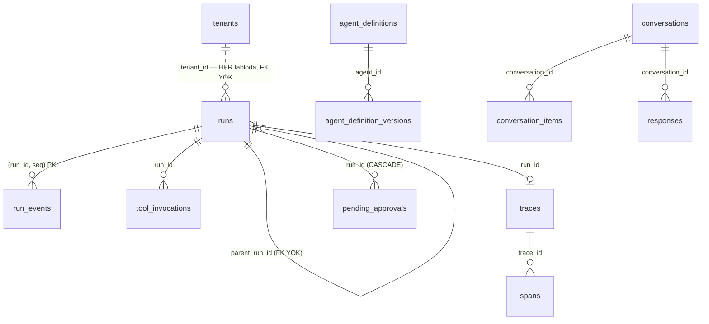
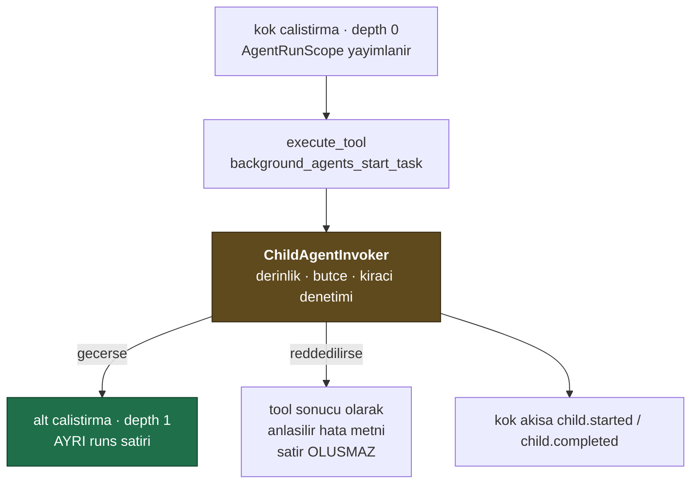
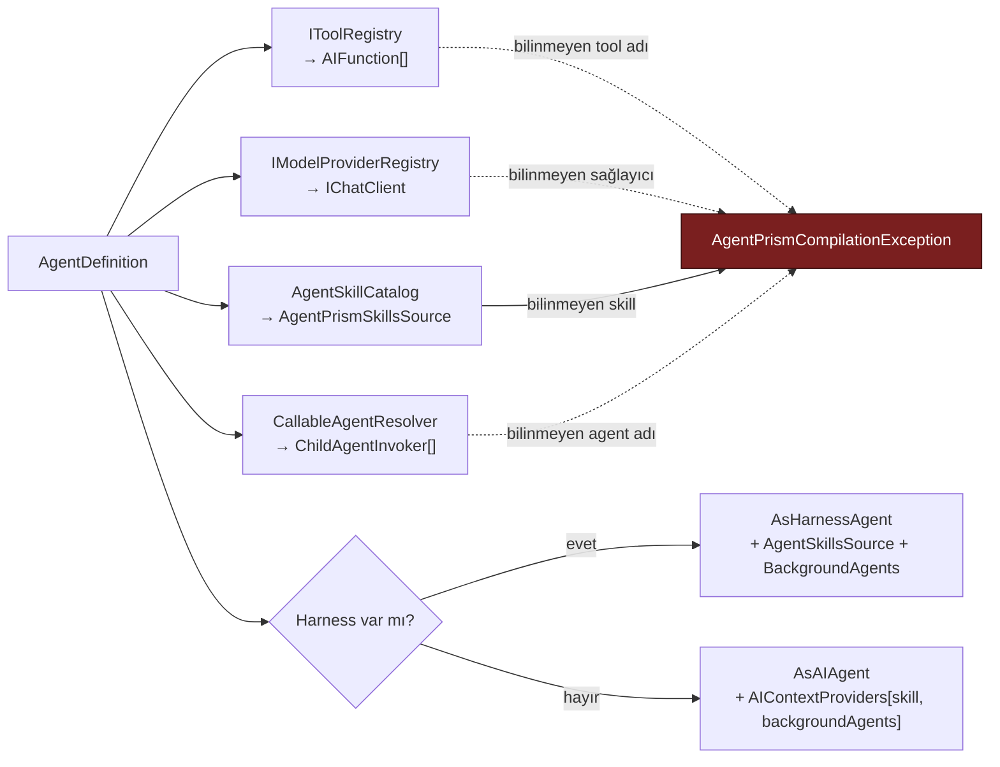
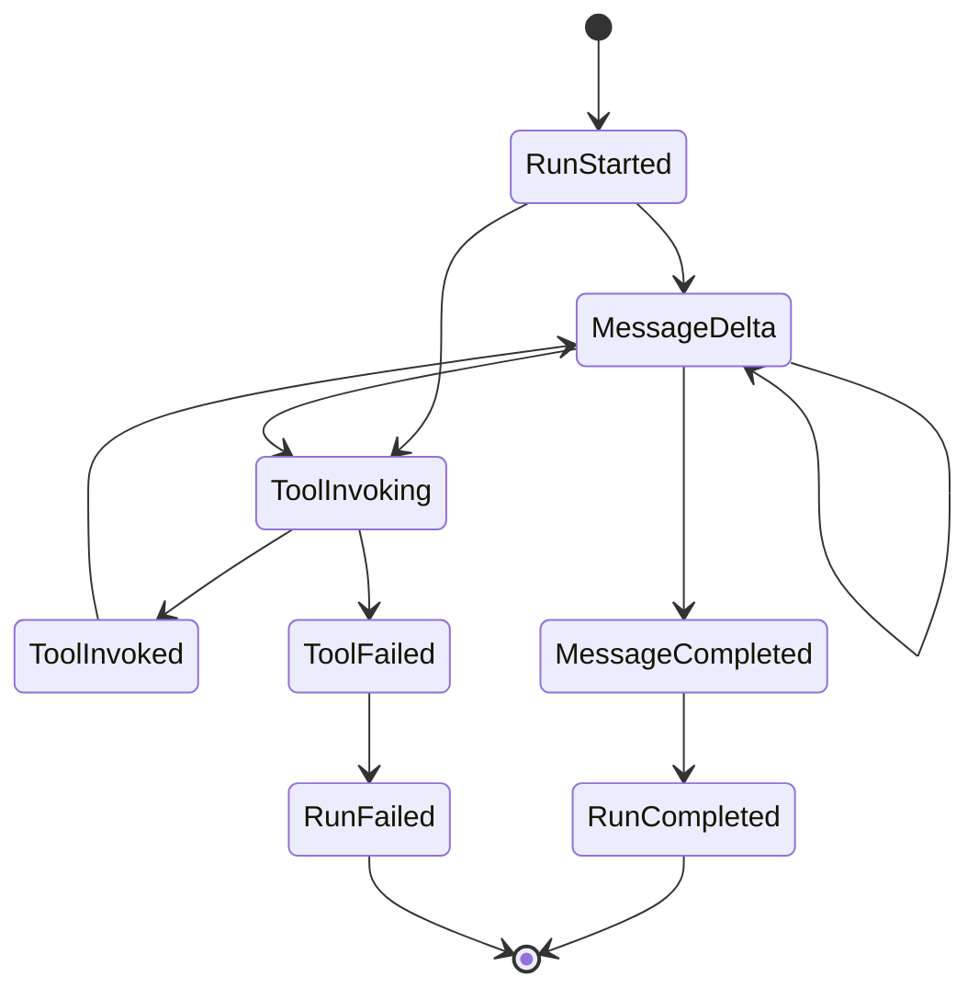
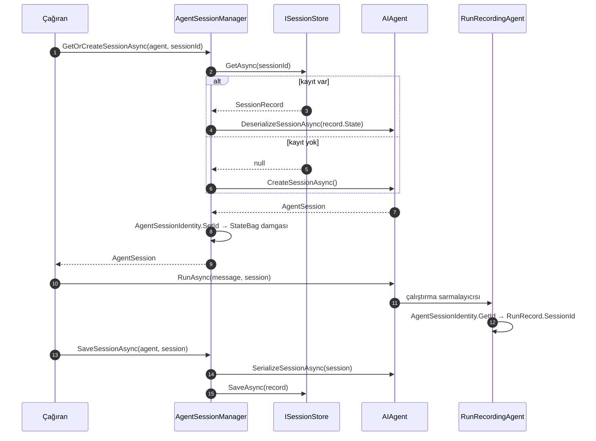
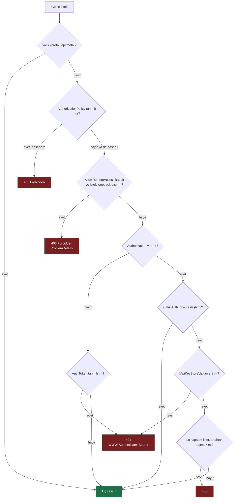
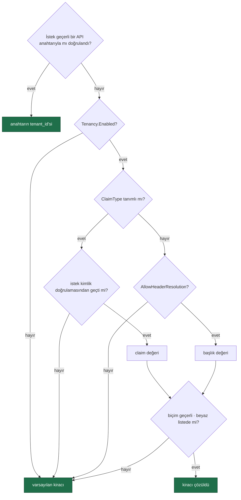

# AgentPrism — Mimari

> AgentPrism'in **bugünkü** mimari resmi. Faz dokümanları (`docs/NN-*.md`) sırayı
> anlatır; bu doküman **ne** inşa ettiğimizi. Kod ile çelişirse **doküman yanlıştır**.
>
> **Bütçelidir** — denetim `python3 scripts/dokuman-bakim.py --denetle`. Anlatı
> burada yaşamaz: faz geçmişi → [`arsiv/FAZ-GECMISI.md`](arsiv/FAZ-GECMISI.md) ·
> paket × faz → [`arsiv/PAKET-FAZ-GECMISI.md`](arsiv/PAKET-FAZ-GECMISI.md) ·
> MAF noktaları → [`MAF-GENISLEME-NOKTALARI.md`](MAF-GENISLEME-NOKTALARI.md).
> Bir bölüm büyüdüyse **eski hâlini** arşive taşı; üst üste yığma.

## 1. Güncel Durum

**Paket listesi tek yerdedir: [`README.md`](../README.md) → "Paketler".** Burada
tekrarlanmaz. Mimari açıdan anlamı olan kalemler:

- `AgentPrism.Sql.Shared` **paket değildir** — `.csproj`'u yoktur; üç SQL
  sağlayıcısı onu `<Compile Include=... />` ile derler: 29 `store`,
  `SqlQueriesBase`, `SqlDialect` (K-198), migration runner (K-176).
- Migration setleri sağlayıcı başına bağımsızdır (K-178): PostgreSql `0001`–`0029`,
  SqlServer ve Sqlite `0001`–`0016` (K-190).
- `PgVectorSearchStore` (Faz 51) `Sql.Shared`'den geçmeyen **tek** `store`'dur —
  doğrudan `Npgsql` kullanır (K4, K-344).
- Meta pakete **dâhil olmayanlar**: `SqlServer` (K-185), `Sqlite`, `Anthropic`
  (K-209), `Google` (K-205), `Azure` (K-210; ayar sunmaz K-211, Responses yok
  K-213), `Voice` (K-216; sözleşme `Abstractions`'ta K-215, gerçek zamanlı
  katman `Core`'da K-222), `Templates`, `Testing`.
- `dotnet pack` **17 paket** üretir. Hangi fazın hangi pakete ne eklediği:
  [`arsiv/PAKET-FAZ-GECMISI.md`](arsiv/PAKET-FAZ-GECMISI.md).

Ne veritabanı ne de belirli bir model satıcısı **zorunludur**: `storage`
yapılandırılmazsa bellek içine düşer; OpenAI · uyumlu `endpoint`'ler ·
Anthropic · Google · Azure OpenAI birlikte çalışır.

**Neden AgentPrism?** MAF GA'dir ama resmî arayüzü DevUI preview'dur ve dokümanı
"not intended for production use" der. AgentPrism onun yerine geçmez, bıraktığı
yerden devam eder — gerekçe ve karşılaştırma:
[`arsiv/DEVUI-KARSILASTIRMASI.md`](arsiv/DEVUI-KARSILASTIRMASI.md).
Faz faz nasıl buraya gelindiği: [`arsiv/FAZ-GECMISI.md`](arsiv/FAZ-GECMISI.md).

---

## 2. Katman Mimarisi

**Bağımlılık yönü tek yönlüdür ve döngü içermez:** her sağlayıcı/kalıcılık paketi
`Core`'a, `Core` `Abstractions`'a, `UI` `AspNetCore`'a bakar; ters yön yoktur.
Kural `DependencyDirectionTests.AllowedReferences` ile zorlanır. AOT uyumluluk
tablosu 9. bölümdedir (K-006).

> `Mcp` ve `Workflows`, `AspNetCore`'a **referans vermez** (kesikli oklar): HTTP
> katmanı onları `IMcpToolRefresher` ve `IWorkflowRunner` soyutlamaları üzerinden
> tetikler. Böylece ikisi de isteğe bağlı paket kalır. Workflow motoru kayıtlı
> değilse yalnız çalıştırma uçları `501` döner; tanım yönetimi çalışır (K-118).

Bu grafiği bozan bir referans eklemek yasaktır; mimari testi bunu zorlar.

---

## 3. Dört Değişmez Tasarım Kuralı

### K1 — Sıfır sürpriz
`AddAgentPrism()` tek başına çalışır. PostgreSQL yapılandırılmazsa tüm `storage` bellek içine düşer. Veritabanı **zorunlu değildir**. Bir geliştirici paketi kurar, tek satır yazar ve çalışan bir arayüz görür.

### K2 — Tool'lar yalnız kodda tanımlanır
Arayüzden agent oluşturulabilir, ancak tool **kodu** yazılamaz. Arayüz sadece kodda kayıtlı tool'lardan seçim yaptırır.

**Arayüz iki dillidir, API tek dillidir.** Konsol metni sözlüklerden gelir ve eksik çeviri **derleme hatasıdır** (K-228); sunucunun `ProblemDetails` metni **İngilizce kalır** (K-232) — aynı hata günlükte, testte ve destek kaydında aynı okunmalıdır.

> **Gerekçe:** Arayüzden çalıştırılabilir kod tanımlanabilseydi, AgentPrism arayüzüne erişen herkes sunucuda kod çalıştırabilirdi.

**Kuralın bilinçli istisnaları — iki tanedir**, ikisi de §7'de korumalarıyla
birlikte anlatılır: **MCP tool'ları** (K-058; süreç *uzakta* çalışır, AgentPrism
yalnız istemcidir) ve **skill script'leri** (K-066; süreç *bu makinede* çalışır —
en sıkı istisna). Her ikisinde de arayüz kullanıcısı **yeni kod yazmaz**, var
olan bir yeteneği etkinleştirir. Bu ayrım kuralın özüdür.

### K3 — MAF nesneleri sızdırılır, sarmalanmaz
`AIAgent`, `AgentSession`, `ChatMessage`, `AIFunction` doğrudan kullanılır. AgentPrism bunların üzerine kendi paralel tip hiyerarşisini koymaz.

> **Gerekçe:** Sarmalama, MAF'ın her yeni sürümünde bakım borcu üretir ve tüketiciyi MAF ekosisteminden koparır. AgentPrism bir *kontrol düzlemi*dir, bir *soyutlama katmanı* değil.

### K4 — Her genişleme noktası değiştirilebilir
Tüm servisler `TryAdd*` ile kaydedilir. Tüketici kendi implementasyonunu daha önce kaydederse onunki kazanır. Aynı kural MAF'ın kendi `Hosting.OpenAI` paketinde de geçerlidir — bu yüzden `IConversationStorage` gibi arayüzleri değiştirebiliyoruz.

---

## 4. MAF Genişleme Noktaları

Ayrı dokümana taşındı: [`MAF-GENISLEME-NOKTALARI.md`](MAF-GENISLEME-NOKTALARI.md)
— hangi noktayı nasıl kullandığımız, hangilerini bilerek kullanmadığımız.
Her oturumda değil, yalnız MAF'a dokunurken okunur.

---

## 5. Veri Modeli (`agentprism` şeması)

Ayrı şema kullanılır. Tüketici uygulamanın `public` şemasına **hiç dokunulmaz**.

> Diyagram **ilişkileri** gösterir; kesikli çizgi (`..`) yabancı anahtarı olmayan
> mantıksal bağdır. Şemanın kaynağı her zaman
> `src/AgentPrism.PostgreSql/Migrations/*.sql`'dir; hangi migration'ın hangi
> tabloyu eklediği [`arsiv/FAZ-GECMISI.md`](arsiv/FAZ-GECMISI.md) → "Migration
> geçmişi" altındadır.

**Span kimliği türetilir, üretilmez.** `spans.id = SHA-256(trace_id + ":" + span_id)`
ilk 16 baytıdır. Sebep: bir span, ebeveyninden **önce** tamamlanabilir; türetilmiş
kimlikte üst span'in kimliği haritasız hesaplanır. Ek fayda: aynı span iki kez
yazılırsa aynı satır güncellenir, tekrar kaydı oluşmaz.

| Tablo | İçerik |
|-------|--------|
| `__migrations` | Uygulanmış migration'lar, checksum ile |
| `tenants` | Kiracı kaydı; tek kiracıda tek varsayılan satır |
| `agent_definitions` | Agent tanımının güncel hali |
| `agent_definition_versions` | Değişmez versiyon geçmişi, geri alma için |
| `agent_skills` | Tenant-yalıtımlı markdown skill tanımı ve frontmatter |
| `agent_skill_resources` | Skill kaynağı; skill silinince cascade ile silinir |
| `sessions` | Serileştirilmiş `AgentSession` (**`json`**) + agent adı + `schema_version`. Anahtar **`(tenant_id, id)`** — kimlik çağırandan gelir ve yalnız kiracı içinde benzersizdir (K-278) |
| `conversations` | Konuşma başlığı; `PostgresChatHistoryProvider` yazar |
| `conversation_items` | Konuşma mesajları, sıralı (**`json`**) |
| `responses` | **Boş.** `/v1/responses` ve `/v1/conversations` durumu `sessions` tablosunda tutulur (K-036, K-043); ayrı bir yanıt kaydı yazılmadı |
| `runs` | Çalıştırma özeti: agent, oturum, durum, token, süre, maliyet |
| `run_events` | Append-only olay akışı, `(run_id, seq)` birincil anahtar |
| `tool_invocations` | Tool çağrıları: ad, argüman, sonuç, süre, hata |
| `traces` / `spans` | OpenTelemetry span'leri |
| `audit_log` | Kim, ne zaman, hangi tanımı değiştirdi |
| `attachments` | Yüklenen ek ustverisi + ikili içerik (`bytea`); `session_id` FK **değil** (K-112) |
| `agent_files` | Kalıcı `AgentFileStore`: agent başına yol→metin çifti |
| `workflows` | Arayüzden tanımlanan workflow grafı (`jsonb`); sürüm **geçmişi yok** (K-126) |
| `workflow_checkpoints` | Yürütme kontrol noktaları — durum **`json`**, `jsonb` değil (K-121) |
| `job_schedules` | Zamanlama tanımı: cron, saat dilimi, yük, etkin/pasif |
| `jobs` | Kuyruktaki iş: durum, kira, deneme sayısı, ilerleme sayaçları |
| `job_items` | Toplu işin tek girdisi ve ürettiği `run_id` |
| `eval_suites` | Bir agent'ı ölçen takım: hedef agent, bildirimsel `checks` (`jsonb`) |
| `eval_cases` | Takımın vakaları: sorgu, beklenen çıktı/tool'lar, terfi kökeni |
| `eval_runs` | Bir takımın tek koşusu: agent sürümü, model, geçme/kalma sayısı |
| `eval_case_results` | Vaka bazında sonuç; `case_id` **yabancı anahtar değil** (K-14) |
| `experiments` | A/B deneyi: hedef agent, kollar (`variants jsonb`), durum, başlangıç/bitiş, kanarya kuralı |
| `quotas` | Kota kuralı: kapsam (kiracı+agent+dönem), üç sınır (`max_runs`/`max_tokens`/`max_cost`) |
| `quota_usage` | Dönem sayacı; `agent_name = ''` kiracı geneli. `ON CONFLICT DO UPDATE` ile **atomik** artar |
| `webhook_subscriptions` | Olay aboneliği: adres, olay listesi, **`secret` değil** anahtar adı (K-059) |
| `webhook_deliveries` | Teslim **geçmişi** — kuyruk değil; zamanlama `jobs`'tadır (K-160) |
| `retention_policies` | Hedef başına saklama kuralı: yaş/hacim sınırı, arşiv bayrağı (K-198) |
| `retention_runs` | Temizleme koşusu geçmişi |
| `voice_sessions` | Konuşma bağlantısı özeti: tur, süre, karakter, kapanış nedeni. **Ses içermez**; `session_id` FK **değil** |
| `run_scores` | Çalıştırma/mesaj puanı: ikili/yıldız, yorum. `runs` FK yok |
| `pending_approvals` | Kuyruktan koşan bir çalıştırmanın bekleyen tool onayı — MAF oturum durumunun **izdüşümü**, sahibi değil. `run_id` FK **CASCADE** |
| `tenant_provider_bindings` | Kiracı × sağlayıcı başına BYOK bağlaması: yalnız yapılandırma anahtarının **adı** (`secret` değil, K-059), isteğe bağlı uç adresi. Anahtar `(tenant_id, provider_name)` (Faz 65) |
| `tenant_egress_policies` | Kiracı başına izinli sağlayıcı listesi; satır **yoksa** kiracı kısıtsızdır (K1, Faz 65) |

Kurallar:

- Zaman alanları `timestamptz`, UTC
- **Sorgulanan** serbest yapılı alanlar `jsonb`, sorgulanan yollarda GIN index
- 🚨 **Opak ve polimorfik yükler `json`, `jsonb` DEĞİL.** `jsonb` nesne anahtarlarını yeniden sıralar; System.Text.Json'ın `$type` ayracı ilk özellik olmak zorundadır. `sessions.state` ve `conversation_items.item` bu yüzden `json`. Karar K-027.
- `run_events.payload` `text` — `RunEventWriter` argümanları AOT uyumlu kalmak için elle biçimlendirir, çıktı geçerli JSON olmayabilir
- Birincil anahtarlar `uuid` v7 — zaman sıralı, index dostu; uygulama üretir (`AgentPrismId.NewId()`), `gen_random_uuid()` **kullanılmaz**
- `RunStatus` ve `RunEventType` `smallint` olarak saklanır; enum değerleri kararlıdır
- 🚨 **NULL sütun içeren benzersizlik `COALESCE` ile kurulur.** PostgreSQL'de NULL'lar birbirine eşit sayılmaz; `quotas` kapsam benzersizliği `(tenant_id, COALESCE(agent_name, ''), period)` ifadesi üzerinedir ve `ON CONFLICT` yan tümcesi **aynı ifadeyi** yazar
- Her tabloda `tenant_id` (`text`); `tenants`'a **yabancı anahtar yoktur** — kısıt Faz 6'da gelir
- Şema adı yapılandırılabilir (`AgentPrismPostgreSqlOptions.SchemaName`); `.sql`'deki `{schema}` yer tutucusu doğrulamadan sonra değiştirilir (K-029)
- `run_events` partition'ı **açılmadı** (K-063 → K-199): 100k satırda parti silme saniyede ~720k satır siliyor, hedef yükün çok üzerinde. `retention_policies` tabloyu sınırlı tutar

---

## 6. Çalıştırma Yolu

```mermaid
flowchart TD
    C["İstemci"]
    H["<b>AgentPrism.AspNetCore</b> — erişim filtresi<br/>loopback / bearer / policy"]
    V1["/v1/* eşlemesi<br/>agent adı = model ?? metadata.entity_id<br/>oturum = conversation ?? previous_response_id ?? yeni yanıt kimliği<br/>güvenilmez kimlikte kiracı sahipliği doğrulanır"]
    R["IAgentCatalog.ResolveAsync(name, culture)<br/>culture = AgentRunRequest.Culture, Accept-Language OKUNMAZ (Faz 72)"]
    SRC["Kaynaklar önceliğe göre<br/>CodeAgentSource 0 → MAF köprüsü 10 → DefinitionStoreAgentSource 100"]
    COMP["CompiledAgentCache.GetOrAddAsync(name, version, bagimlilikParmakIzi, culture)<br/>AgentDefinitionCompiler.CompileAsync(definition, callableAgents, culture)<br/>InstructionCultureResolver: culture → ebeveyn alt etiket → varsayilan Instructions<br/>kiraci egress + BYOK kimlik bilgisi burada cozulur (Faz 65)"]
    DEC["IAgentDecorator[] — Order'a göre, KÜÇÜK olan dışta"]
    REC["<b>RunRecordingAgent</b> · Order 0<br/>kök span agentprism.run burada açılır<br/>AgentRunScope burada yayımlanır<br/>RunEventWriter sıra numarasını üretir<br/>store hatası çalıştırmayı KESMEZ"]
    OTEL["<b>OpenTelemetryAgent</b> · Order 10<br/>invoke_agent span'i"]
    APR["<b>ToolApprovalAgent</b> · Order 20<br/>otomatik onay kuralları"]
    RUN["AIAgent.RunAsync / RunStreamingAsync"]
    CHP["PostgresChatHistoryProvider<br/>geçmişi conversation_items'tan yükler, sonunda geri yazar"]
    LLM["IChatClient — ModelProviderRegistry boru hattini TAMAMEN kurar<br/>içerik filtresi → devre kesici → ek çözme<br/>→ MAF tool döngüsü → OTel → içerik guard'ı → ham istemci"]

    C -->|"POST /api/agents/{name}/run"| H
    C -->|"POST /v1/responses · /v1/chat/completions"| H
    H --> V1 --> R --> SRC
    SRC -->|"bildirimsel tanım"| COMP --> DEC
    SRC -->|"fabrika agent'ı"| DEC
    DEC --> REC --> OTEL --> APR --> RUN
    RUN --> CHP --> LLM

    classDef faz4 fill:#1f4f7a,stroke:#0d2740,color:#ffffff
    classDef faz1 fill:#1f6f4a,stroke:#0d3b27,color:#ffffff
    classDef faz2 fill:#5a3a7a,stroke:#2c1c3d,color:#ffffff
    classDef faz3 fill:#7a4a1f,stroke:#3d250f,color:#ffffff
    class H,V1 faz4
    classDef faz6 fill:#5f4a1e,stroke:#302510,color:#ffffff
    class R,SRC,COMP,DEC,REC faz1
    class CHP faz2
    class LLM faz3
    class OTEL,APR faz6
```

> **Sıra neden böyle?** Kayıt en **dışta** olmalıdır ki iç katmanların harcadığı
> süreyi de ölçsün. Onay ise model çağrısına en **yakın** katmandadır; dışına
> alınsaydı telemetri onay beklemesini kendi süresine katardı.
>
> 🚨 Kök span `RunRecordingAgent`'ın **kendi metot gövdesinde** açılır.
> `Activity.Current` bir `AsyncLocal`'dir ve async bir yardımcı metotta yapılan
> atama çağırana geri akmaz; ölçüldü, iç span'ler kök span'in çocuğu değil
> kardeşi oluyordu.
>
> 🚨 Aynı kuralın ikinci hâli **akışlı** yolda geçerlidir: bir
> `async IAsyncEnumerable` gövdesinde yapılan `AsyncLocal` ataması `yield return`
> sınırını aşmaz. `AgentPrismRunContext.SetCurrent(...)` bu yüzden her
> `MoveNextAsync`'ten hemen önce tekrarlanır (Faz 12'de ölçüldü).

İki sapma vardır. **Deney ataması:** yalnız `POST /api/agents/{name}/run`
`ResolveAsync`'ten **önce** `ExperimentAssignmentResolver`'a uğrar; `Running` bir
deney varsa sürüm deneyden gelir. `/v1/*` ve alt-agent çağrıları bu adımı görmez
(K-131). **Asenkron çalıştırma:** `Prefer: respond-async` → `Queued` satır + iş
kuyruğu + `202`; işçi alınca diyagram normal işler (K-304). Kök çalıştırma onay
isteyerek biterse `AwaitingApproval` ile kapanır ve bir daha DEĞİŞMEZ (K-014);
karar YENİ bir çalıştırma açar (K-368) — bkz. §7.

### Çalıştırma ağacı

Bir agent `CallableAgentNames` taşıyorsa derleyici her alt agent'ı bir
`ChildAgentInvoker` ile sarar ve bunları MAF'ın `BackgroundAgentsProvider`'ına
verir. Sağlayıcı modele altı tool açar; model önce görevi başlatır, sonra bekler,
sonra sonucu okur.

Kurallar:

- Ağaçtaki her çalıştırma **aynı** `AgentRunBudget` örneğini paylaşır (K-096).
- Ağaçtaki her çalıştırma **aynı** W3C trace kimliğini paylaşır; trace tamponunun
  sahibi yalnız kök çalıştırmadır (K-099).
- Alt agent **aynı kiracıda** çalışır; kiracı değişmişse çağrı reddedilir.
- Alt agent **onay isteyemez**; isteyen alt çalıştırma `Failed` olur (K-103).

Derleyicinin içi (`AgentDefinitionCompiler.Compile`):

Çalıştırma olayları, `RunEventWriter` tarafından boşluksuz sıra numarasıyla yazılır:

**Oturum yolu** — çalıştırmadan bağımsızdır, çağıran yönetir:

Damga oturumun `StateBag` alanında yaşar ve `SerializeSessionAsync` çıktısına dahildir; bu yüzden geri yüklenen bir oturum kendi kimliğini bilir.

**Neden `DelegatingAIAgent`, neden middleware değil?**
MAF middleware zinciri agent'a özgüdür ve `HarnessAgent` kendi iç dekoratörlerini ekler. Dış sarmalayıcı, harness dahil **her** agent tipinde aynı şekilde çalışır.

**Neden sıra numarasını yazıcı üretir?**
Tek bir yazıcıdan gelen numaralar deterministik sıra garantiler. Canlı akış (SSE) ve geçmişe dönük yeniden oynatma aynı sonucu verir; istemci `Last-Event-ID` ile kaldığı yerden devam edebilir.

---

## 7. Güvenlik Modeli

Üç katman, sırayla uygulanır:

1. **Loopback kısıtı** — `AllowRemoteAccess = false` (varsayılan). Loopback dışı istek `403` alır. Kaza ile açılmaya karşı koruma.
2. **Bearer token** — statik `AuthToken` sabit zamanlı karşılaştırmayla denetlenir; eşleşmezse **kiracı bazlı API anahtarı** (`IApiKeyStore`, hash `key_hash`, K-356) denenir: iptal/süre denetiminden geçer, kapsamı (uç istiyorsa) uyuşur. `ApiKeyScope` rolü DARALTIR, yerine geçmez — `rol ∩ kapsam` (K-360). Dışa açılan MCP/A2A yüzeyi geçerli bir `external:invoke` anahtarı ister (`ExternalSurfaceGuard`). `Authorization` başlığı YOKSA ve `AuthToken` tanımsızsa katman atlanır (K1); başlık VARSA her zaman doğrulanır (K-359).
3. **Authorization policy** — `RequireAuthorization("policy")` ile ASP.NET Core kimlik doğrulama boru hattına bağlanır. Üretimde kullanılan yol budur.

`{prefix}/api/meta` kimlik doğrulaması olmadan erişilebilir. Arayüzün hangi kimlik yöntemini kullanacağını öğrenmesi için gereklidir; hiçbir hassas veri döndürmez.

**Arayüz kabuğu (HTML, JS, CSS) bearer token katmanından muaftır** (karar K-046).
Tarayıcı bir `<script src>` isteğine `Authorization` başlığı ekleyemez; kabuk
kilitlenseydi kullanıcı token'ı girebileceği ekranı hiçbir zaman göremezdi. Kabuk
veri taşımaz. Loopback kısıtı ve authorization policy kabuğa da uygulanır:

| Katman | `/api/meta` | Arayüz kabuğu | Konuşma WebSocket'i | Diğer tüm uçlar |
|--------|-------------|---------------|---------------------|------------------|
| Loopback kısıtı | ❌ | ✅ | ✅ | ✅ |
| Authorization policy | ❌ | ✅ | ✅ | ✅ |
| Bearer token | ❌ | ❌ | ✅ **alt protokolde** | ✅ başlıkta |

🚨 **Konuşma WebSocket'i token'ı `Sec-WebSocket-Protocol` alt protokolünde alır**
(`agentprism.token.<token>`) ve sabit zamanda kendisi doğrular (K-224). Tarayıcı
bir el sıkışmaya `Authorization` başlığı ekleyemez; sorgu dizesi ise sunucu ve
ters vekil günlüklerine yazılacağı için **kabul edilmez**. Uç ayrıca `Operator`
rolü ister, oturumun kiracı sahipliğini doğrular, kiracı başına eşzamanlı
bağlantıyı sınırlar ve süre/boşta zaman aşımı uygular.

Arayüz token'ı `sessionStorage`'da tutar — sekme kapanınca silinir (K-047). Dil
ve tema tercihi `localStorage`'dadır (K-230).

Ek sınırlar:

- `secret`'lar (`ApiKey`, bağlantı dizesi, MCP kimlik değeri) **hiçbir zaman** veritabanına yazılmaz, API'den dönmez, arayüzde gösterilmez
- `previous_response_id` ve `conversation_id` güvenilmez girdi kabul edilir; her zaman kiracı sahipliği doğrulanır
- `audit_log` Faz 9'dan beri doludur — bkz. "Roller ve denetim izi"

### Çok kiracılılık ve tool onayı

**Tool onayı.** `RequiresApproval = true` işaretli tool, `ToolRegistry` içinde
`ApprovalRequiredAIFunction` ile sarılır. Sarmalama **defterde** yapılır çünkü
defter, "bir agent yalnızca kayıtlı bir tool'a işaret edebilir" kuralının
zorlandığı tek yerdir; başka bir kod yolunun sarmalamayı atlaması mümkün olmaz.

**Asenkron onay kutusu (Faz 55).** Kuyruktan koşan bir çalıştırma onay isteyip
`AwaitingApproval`'a düşerse `pending_approvals` (izdüşüm) üzerinden
`POST /api/approvals/{id}/decide` ile kararlanır — denetim izi karardan ÖNCE
yazılır (K-089/K-370). Senkron/MCP/A2A yolu bu tabloya HİÇ yazmaz; oradaki
onay bugünkü gibi bir sonraki turun `approvals` alanıyla çözülür (K-372).

**MCP sınırı.** MCP sunucusu eklemek, dışarıdan gelen tool tanımlarını kabul etmek
demektir ve tasarım kuralı K2'nin bilinçli istisnasıdır. Beş koruma: yalnız
`http`/`https` — **stdio yoktur** (K-058), çünkü süreç başlatmak K2'yi bozar ·
varsayılan `RequiresApproval = true` · kodda kayıtlı bir tool'un adını taşıyan
MCP tool'u **yok sayılır** (K-060) · kayıt kimlik doğrulama **değerini** değil,
değerin okunacağı yapılandırma anahtarının **adını** taşır (K-059) · her çağrı
kaynak sunucu adıyla `tool_invocations`'a yazılır.

**Kiracı çözümleme.** Varsayılan **kapalıdır**; açıldığında sıra:

🚨 **API anahtarı en yüksek önceliktedir** (Faz 53) — bir sırrı KANITLAR, claim/başlık
yalnızca BEYANDIR; çelişirse filtre isteği buraya hiç ulaştırmadan `403` verir.

🚨 **Claim tanımlıysa başlık hiç okunmaz.** Aksi hâlde kimlik doğrulamasından
geçmiş bir kullanıcı, bir başlık ekleyerek başka bir kiracının verisine
erişebilirdi. Başlık yolu ayrıca `AllowHeaderResolution` ile **açıkça**
açılmalıdır — bir HTTP başlığı kimlik kanıtı değildir.

**Yalıtımı zorlayan kapı (Faz 41).** Her depo sözleşmesi yalıtımı **iki yönlü**
sınar (B görmemeli · A kendi verisini görmeli) ve dört koşumda çalışır (bellek
içi + üç SQL); `TenantCoverageTests` her public depo metodunun ya sınandığını
ya `[TenantAgnostic]` ile gerekçeli muaf olduğunu zorlar. Bulduğu kusurlar:
K-277, K-278, K-279.

**Kiracı sağlayıcı anahtarları / BYOK ve egress (Faz 65).** Varsayılan
**kapalıdır**: kiracı `store`'larından biri bile kayıtlı değilse veya
tenant context yoksa `ModelProviderRegistry.CreateChatClientAsync` sync
`CreateChatClient` ile birebir davranır. Açıldığında, her model çağrısından
önce iki kontrol TEK yerde sırayla çalışır: (0) **egress** — kiracının
`tenant_egress_policies` kaydı sağlayıcıyı izin veriyor mu (politika yoksa
kısıtsız); (1) **kimlik bilgisi** — kiracının `tenant_provider_bindings`
kaydı var mı, varsa yapılandırma anahtarının **adı** (asla değeri, K-059)
`IConfiguration`'dan çözülür. Kayıt var ama değer yoksa çağrı global
anahtara **düşmez**; anlaşılır bir hata verir. Bu tek nokta hem gerçek
`run` derlemesini (`CompiledAgentCache` → `AgentDefinitionCompiler.CompileAsync`)
hem `AgentDefinitionValidator`'ın ön-uçuş kontrolünü besler — izinsiz bir
sağlayıcıya işaret eden tanım **derleme anında**, gerçek bir ağ çağrısı
olmadan reddedilir.

### Roller ve denetim izi

**Rol modeli.** Üç policy adı — `AgentPrismPolicies.Reader` / `.Operator` / `.Admin`
— tanımlanır. AgentPrism rol veya kullanıcı **saklamaz**; tüketici bu adları kendi
`AddAuthorization(...)` çağrısında kendi claim'lerine bağlar. Bir policy tüketicide
**kayıtlı değilse** ilgili uç grubu yalnızca yukarıdaki üç katmanlı korumadan geçer
— sürüm yükseltmesi mevcut kurulumları kırmaz. `AgentPrismEndpointOptions.RequireRolePolicies`
açılırsa eksik bir policy `MapAgentPrism()` çağrısını **açılışta** hataya çevirir.

| Rol | Kapsam |
|-----|--------|
| Reader | Agent, çalıştırma, oturum, trace, istatistik **okuma** |
| Operator | Reader + çalıştırma başlatma, onay verme, oturum silme |
| Admin | Hepsi: agent tanımı yazma, MCP sunucusu ekleme, kiracı ve onay kuralı yönetimi, denetim izi okuma |

`GET {prefix}/api/meta` yanıtı artık `roles: { canRead, canOperate, canAdminister }`
alanı taşır — arayüz yetkisi olmayan düğmeleri bu alana göre gizler. Bir policy
kayıtlı değilse karşılık gelen alan her zaman `true` döner (rol kısıtı yok).

**Denetim izi.** `audit_log` tablosuna agent, MCP sunucusu, kiracı ve onay kuralı
yazmaları ile tool onay kararları düşer — **çalıştırmalar düşmez** (`runs` tablosu
zaten tam kaydı tutar). Yazma **`store` decorator'larında** yapılır
(`Auditing*Store` — `AgentPrism.Core`), `endpoint` katmanında değil; tek istisna
`mcp.refresh` (elle tazeleme bir `store` yazması değildir, `GovernanceEndpoints`
içinde yazılır).

Aktör `AuditActorContext` adlı bir `AsyncLocal` köprüsünden okunur:
`AgentPrismEndpointFilter`, her korumalı istekte `HttpContext.User`'ı oraya yazar;
`AgentPrism.Core`'daki `AmbientAuditActorResolver` onu okur. Bu, `AgentPrism.Core`'a
ASP.NET Core bağımlılığı eklemeden "kim yaptı" sorusunu yanıtlamanın yoludur —
`ClaimsPrincipal` temel .NET kütüphanesindedir. Kimlik doğrulaması yoksa aktör
`null`'dur ve bu gizlenmez.

`before`/`after` yazılmadan önce `AuditSecretFilter` içinden geçer: anahtar adında
`apiKey`, `authorization`, `password`, `secret` veya **tekil** `token` geçen her
alanın değeri `"***"` olur (çoğul `tokens` — `maxOutputTokens` gibi sayım
alanları — hariç). Denetim izi yazma hatası **çalıştırmayı kesmez**;
"gözlemlenebilirlik işlevi bozmaz" kuralı burada da geçerlidir.

### Denetim zinciri ve veri konusu hakları (Faz 64)

**Değiştirilemezlik.** Her `audit_log` satırı kendi içeriğinin SHA-256 özetini
(`hash`) ve bir önceki satırın özetini (`prev_hash`) taşır, kiracı başına
zincirlenir. `IAuditLog.VerifyChainAsync` (`GET /api/audit/verify`) zinciri baştan
sona yürür ve üç durumdan birini döner: `Valid`, `Broken` (bir satır değiştirildi)
veya `Gap` (bir satır silindi ya da hiç yazılmadı). Kanonik biçim ve doğrulama
mantığı tek bir yerdedir (`AgentPrism.Core.AuditChainHasher`/`AuditChainWalker`) —
`InMemoryAuditLog` ve üç SQL sağlayıcısı aynı kodu çağırır. Eşzamanlı yazım,
`(tenant_id, prev_hash)` üzerindeki benzersiz bir dizinin doğal olarak
serileştirmesiyle çözülür; kaybeden yazıcı yeniden dener (oturum/advisory kilit
**kullanılmaz** — K-284'ün "bağlantı havuzuna bağımlı kilitten kaçının" ilkesi).
Bu özellikten ÖNCE yazılmış satırlar `hash` taşımaz ve zincire dahil edilmez;
geriye dönük uyumluluk bu şekilde sağlanır.

**Veri konusu hakları.** AgentPrism kişisel kimlik saklamaz. Bir tüketici
`IDataSubjectResolver` kaydederse (`subjectId → sessions/runs/conversations`),
`GET /api/data-subjects/{id}/export` ve `DELETE /api/data-subjects/{id}` uçları
açılır; kayıtlı bir çözümleyici yoksa ikisi de `409` döner. Silme
`IDataSubjectStore` (`SqlDataSubjectStore`) üzerinden çalışır: aynı `DELETE` sorgu
kümesi hem önizleme (`dryRun=true`, varsayılan — her zaman `ROLLBACK`) hem gerçek
silme (yalnız çağıranın denetim yazımı başarılı olursa `COMMIT`) için kullanılır.
Silme **içerik** verisinde uygulanır (oturum, çalıştırma, konuşma, ek, puan, ses);
`audit_log`'a hiç dokunmaz — "kim ne yaptı" bilgisi kişinin kendi verisi değildir,
silme eylemi ise yeni bir denetim kaydı olarak eklenir.

### Skill script çalıştırma

Bu, K2'nin (**"tool'lar yalnız kodda tanımlanır"**) **ikinci bilinçli
istisnasıdır**. Birincisi MCP'ydi ve orada süreç **uzakta** çalışıyordu; burada
süreç **AgentPrism'in makinesinde** çalışır.

Özellik **varsayılan olarak kapalıdır** ve yalnız kodda açılır
(`UseSkillScripts(...)`: zorunlu onay bayrağı + boş başlayan yorumlayıcı beyaz
listesi + kodda verilen skill kökleri).

Her çalıştırma **altı kapıdan sırayla** geçer; biri kapalıysa süreç hiç başlamaz
ve `AgentPrismException` atılır: (1) `Enabled` · (2) kiracı için geçerli izin ·
(3) uzantı yorumlayıcı beyaz listesinde (boş varsayılan, K-088) · (4) argüman
boyutu ve şeması · (5) denetim izine yazılabildi · (6) eşzamanlılık kotası.
Ancak sonra ayrı süreç temiz ortamla, stdin'den argümanla (K-091), zaman aşımı
ve çıktı sınırıyla başlar.

🚨 Beşinci kapı Faz 9 kuralının **istisnasıdır**: denetim izine yazılamayan bir
script çalıştırması, hiçbir kaydı olmayan bir uzaktan kod çalıştırma olurdu
(K-089). Diğer tüm yazmalarda denetim hatası yutulur; burada yutulmaz.

🚨 **AgentPrism dosya sistemi hapsi, ağ kısıtı, bellek/CPU kotası ve hak düşürme
SAĞLAMAZ**; dördü de barındırma ortamında (container + cgroup + ayrıcalıksız
kullanıcı) kurulur. `PlatformIsolationAcknowledged` bayrağı bu sınırı görmeden
özellik açılmasını engeller: `Enabled = true` iken bayrak `false` ise
**açılışta** hata verilir (K-086).

Kapı akış şeması, koruma tablosunun tamamı (ortam temizliği, zaman aşımı, çıktı
sınırı, eşzamanlılık, `SkillScriptGrant`, denetim olayları) ve barındırma
kurulumu: [`11-SKILL-SCRIPT-CALISTIRMA.md`](11-SKILL-SCRIPT-CALISTIRMA.md).

### Kota ve webhook imzası

**🚨 SSRF — giden istek sınırı.** Webhook adresini *kullanıcı* verir ve sunucu o
adrese istek atar; kontrolsüz bırakılırsa iç ağa erişim aracı olur — bulut
metadata uçları (`169.254.169.254`) dâhil. Varsayılan
`AllowPrivateNetworkTargets = false`; yalnız `https`; `AllowAutoRedirect = false`.

🚨 **Adres denetimi `SocketsHttpHandler.ConnectCallback`'in içindedir**:
doğrulanan adres, soketin bağlandığı adresin ta kendisidir. Önce doğrulayıp
sonra `SendAsync(url)` çağırmak TOCTOU açığı bırakırdı (K-164). Koruma
`WebhookHttpClient`'ın **içine gömülüdür**; tüketici değiştiremez
(`IHttpClientFactory` bilinçli kullanılmadı). Tek doğruluk noktası
`WebhookUrlValidator.IsAllowedTarget`'tır; reddedilen aralıkların tam listesi
ve diğer sınırlar [`21-KOTA-VE-OLAY-YAYINI.md`](21-KOTA-VE-OLAY-YAYINI.md)'dedir.

**Webhook `secret`'i veritabanında durmaz** — kayıt yalnız yapılandırma
anahtarının **adını** taşır; sözleşmede `secret` alanı hiç yoktur (K-059).

**İmza yeniden oynatmaya kapalıdır:** `HMAC-SHA256(timestamp + "." + body, secret)`
— zaman damgası imzaya dâhildir (K-163). Tolerans penceresini alıcı denetler.

**Kota ve hız sınırı ayrı mekanizmalardır** (K-158). Hız sınırı saniye/dakika
ölçeğinde, bellekte; kota gün/ay ölçeğinde, veritabanında. İkisi de **varsayılan
olarak hiçbir isteği reddetmez**: hız sınırı `Enabled = false`, kota ise kural
tanımlanmadıkça boştur (K-165). Kota **yaklaşıktır** — denetim çalıştırma
öncesinde, tüketim sonrasında yazılır (K-159).

### MCP OAuth ve kaynak erişimi

Prompt bir **anlık görüntüdür** — yönetici panoya kopyalar, agent canlı çekmez.
Kaynak erişimi yalnız sunucunun **bildirdiği** URI kümesiyle sınırlıdır; serbest
URI bir SSRF aracı olurdu. OAuth token'ı `(kiracı, sunucu)` başına bellek içinde
tutulur, **veritabanına yazılmaz**; SDK yalnız Authorization Code destekler
(K-168). `/oauth/callback` arayüz kabuğuyla aynı gruptadır: loopback + policy
geçerli, yalnız bearer muaf — güvenlik tek kullanımlık `state`'e dayanır.
Boyut sınırları ve akış: [`22-MCP-DERINLESMESI.md`](22-MCP-DERINLESMESI.md).

### İçerik denetimi (Faz 48)

`IContentGuard` modele giden ve modelden gelen içeriği denetler; kararlar
`Allow` / `Mask` / `Block`'tur ve **en sert karar kazanır**. Varsayılan
**kapalıdır** — guard kayıtlı değilse sarmalayıcı hiç eklenmez, ölçülen maliyet
sıfırdır (K-323).

🚨 Konum: tool çağrı döngüsünün **içinde**, ham istemcinin üstünde (K-321) — tool
sonucu modele ikinci çağrıda girer ve döngü dışı bir halka onu göremez.
Engellenen içerik ağa **hiç çıkmaz**, devre kesiciyi **tetiklemez** (K-322) ve
**hiçbir yere yazılmaz**; iz yalnız guard/kural/yön taşır (K-325). 🚨 Maskeleme
model sınırındadır — `run_events`/`run_inputs` ham metni saklar.
Ayrıntı: [`48-GUARDRAILS.md`](48-GUARDRAILS.md).

---

## 8. Sürüm Politikası

`Microsoft.Agents.AI.Hosting` (preview) ve `.Hosting.OpenAI` (alpha) hâlâ ön
sürümdür. Ön sürüm bağımlılığı **yalnızca** `AgentPrism.AspNetCore` içinde
toplanır (K-008). AgentPrism o iki paket GA olana kadar `1.0.0-preview.N`
yayınlanır — sonra tek pakette sürüm güncellemesi yeterlidir.

---

## 9. Trim ve AOT

Bayrak paket başına `AgentPrismAotCompatible` ile uygulanır (K-006); güncel liste
`grep -l "AotCompatible>false" src/*/*.csproj` ile doğrulanır — burada
tekrarlanmaz.

**Uyumlu olmayanlar ve nedenleri:** `AspNetCore` (minimal API delege
yönlendirmesi reflection kullanır) · `UI` (gömülü varlık tarama) · `SqlServer`
(sıfır IL2/IL3 ölçüldü ama canlı sorgu doğrulanmadı — vaat ertelendi, K-181) ·
`Sqlite` (`SQLitePCLRaw` yerel kütüphane taşır, K-196).

`Core` uyumludur: yansıma yalnız `AddToolsFrom` / `AddTool(Delegate)` yolundadır
ve ikisi de işaretlidir (K-350). **Önerilen yol** `AddGeneratedTools()`
(Faz 52) — derleme anında üretilir, sıfır yansıma. Ölçüm notları:
[`hafiza/build-ve-analyzer.md`](hafiza/build-ve-analyzer.md).

---

## 10. İlgili Dokümanlar

Faz listesi ve durumu **tek yerdedir**: [`YOL-HARITASI.md`](YOL-HARITASI.md),
her fazın `Durum:` satırından üretilir. Seçilmemiş adaylar:
[`ADAYLAR.md`](ADAYLAR.md). Dalgaların sıralama gerekçesi kapandı ve arşive
taşındı (K-427); yalnız grep'lenir.

Karar arıyorsan [`KARARLAR-INDEKS.md`](KARARLAR-INDEKS.md)'ten satırı bul ve
`KARARLAR.md`'yi **grep'le**. MAF'a dokunurken
[`MAF-GENISLEME-NOKTALARI.md`](MAF-GENISLEME-NOKTALARI.md); bir alana dokunurken
[`hafiza/`](hafiza/); "neden böyle olmuş?" için yalnız grep ile
[`arsiv/`](arsiv/).
