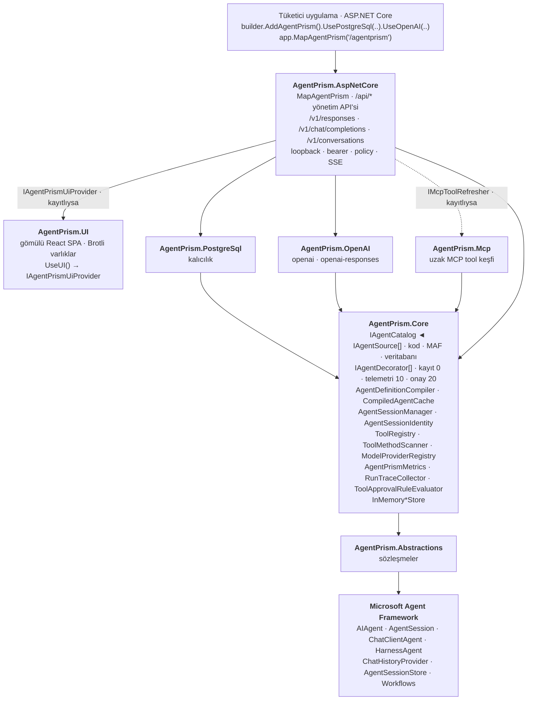
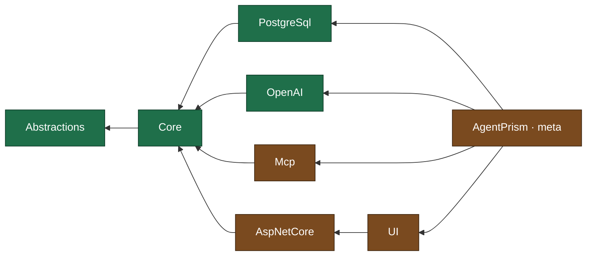
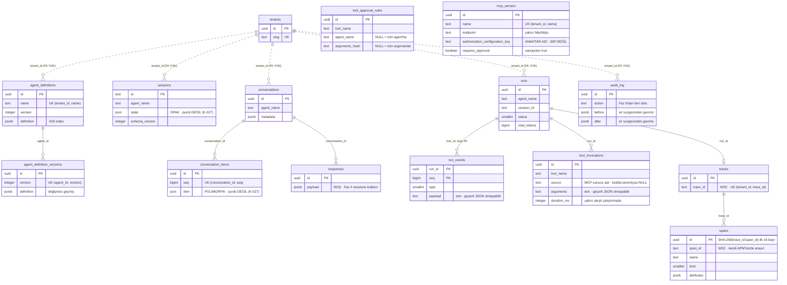
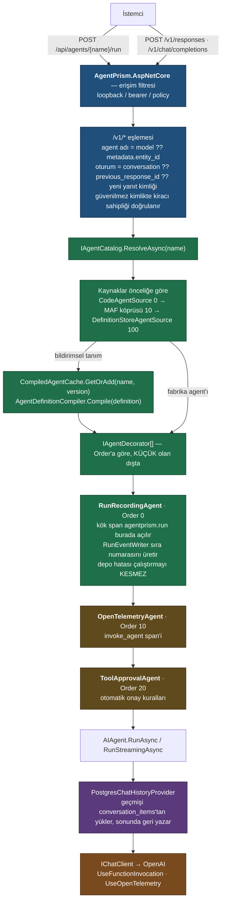
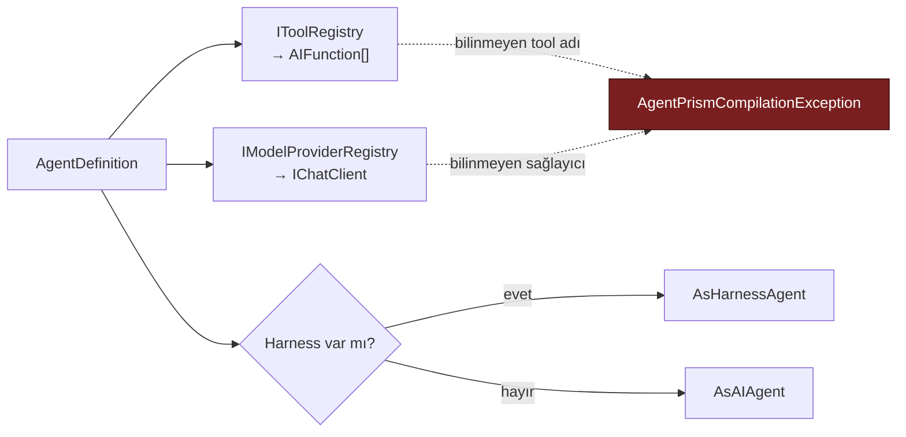
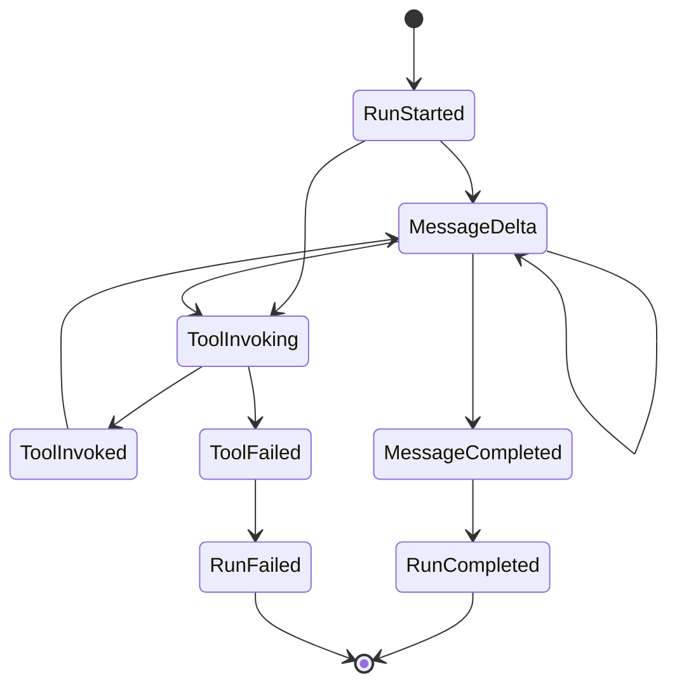
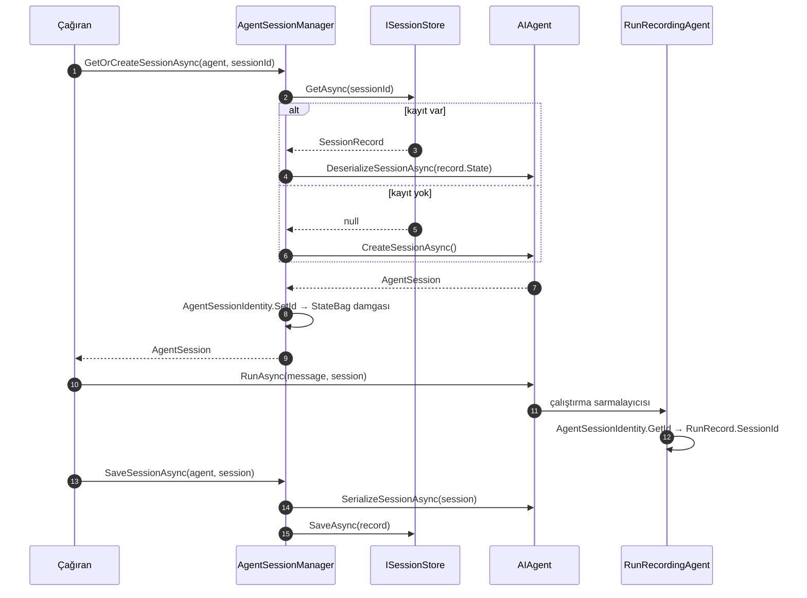
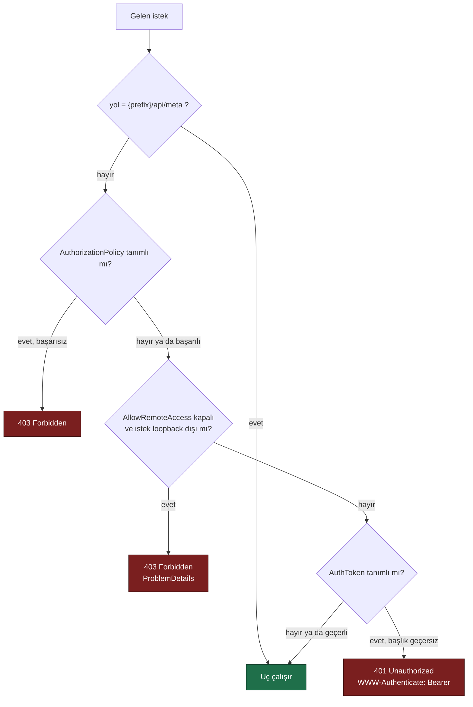
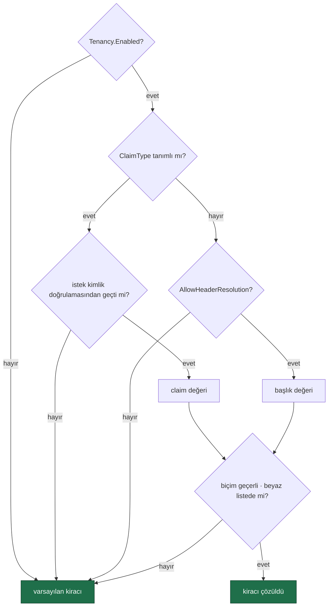

# AgentPrism — Mimari

> Bu doküman AgentPrism'in kalıcı mimari resmidir. Faz dokümanları (`00`–`30`) uygulama sırasını anlatır; bu doküman **ne** inşa ettiğimizi anlatır. Faz 8'den sonraki sıra: [`IKINCI-FAZ-YOL-HARITASI.md`](IKINCI-FAZ-YOL-HARITASI.md).
>
> **Bu dosya her fazın sonunda güncellenir.** Gerçekleşen tasarım ile bu doküman arasında fark varsa doküman yanlıştır — koda göre düzeltilir.

## Güncel Durum (2026-08-02)

| Paket | Durum | Faz |
|-------|-------|-----|
| `AgentPrism.Abstractions` | ✅ Tamamlandı | 1 · 3 (`[AgentPrismTool]`) · 4 (çalıştırma özeti) · 5 (`AgentPrismRunOptions`) · 6 (telemetri, tool çağrısı, onay, MCP, kiracı) · 8 (`IModelProviderHealthCheck`, `AgentPrismProviderUnavailableException`) · 9 (`IAuditLog`, `IAuditActorResolver`, `IAuditDecorated`) |
| `AgentPrism.Core` | ✅ Tamamlandı | 1 · 2 (oturum yönetimi) · 3 (tool tarama, reasoning) · 4 (sohbet geçmişi kaydı) · 5 (çağıranın verdiği çalıştırma kimliği) · 6 (span, metrik, onay kuralı) · 8 (devre kesici, sağlık önbelleği) · 9 (`AuditActorContext`, `AuditSecretFilter`, `Auditing*Store` dekoratörleri) |
| `AgentPrism.PostgreSql` | ✅ Tamamlandı | 2 · 4 (özet sorgusu) · 6 (migration 0002, dört yeni depo) · 9 (`PostgresAuditLog`, migration **yok** — şema Faz 0'dan hazırdı) |
| `AgentPrism.OpenAI` | ✅ Tamamlandı | 3 · 8 (`UseOpenAICompatible`, sağlık denetimi) |
| `AgentPrism.Mcp` | ✅ Tamamlandı | 6 |
| `AgentPrism.AspNetCore` | ✅ Tamamlandı | 4 · 5 (arayüz rota grubu) · 6 (çok kiracılılık, yönetişim uçları) · 8 (`/api/models/health`) · 9 (`AgentPrismPolicies`, rol dağıtımı, `/api/audit`, `/api/meta` rol alanı) |
| `AgentPrism.UI` | ✅ Tamamlandı | 5 · 6 (waterfall, MCP ekranı, onay kartı) · 8 (sağlık rozeti) · 9 (Audit ekranı, rol tabanlı düğme gizleme) |
| `AgentPrism` (meta) | ✅ Paketleniyor | 0 |

Testler: **489 .NET testi + 42 frontend birim testi geçiyor** — 206 birim testi
(129 Core + 77 OpenAI) + 130 fonksiyonel test (TestHost, gerçek HTTP) + 140 entegrasyon
testi (Testcontainers, gerçek PostgreSQL) + 13 arayüz E2E testi (Playwright, gerçek
Kestrel) + 42 Vitest testi (saf mantık; `npm run build` içinde koşar, dolayısıyla
`dotnet build` de koşar). Build, test, pack ve format kapıları sıfır uyarı.

Faz 9 sonunda AgentPrism **denetlenebilir**: üç rol (Reader/Operator/Admin) uç
grupları arasında ayrım yapıyor, `audit_log` gerçekten doluyor (agent, MCP sunucusu,
kiracı, onay kuralı yazmaları + tool onay kararları) ve sır suzgeci bu kayıtlardan
hiçbir kimlik bilgisi sızdırmıyor. Bkz. [`09-YONETISIM-VE-DENETIM-IZI.md`](09-YONETISIM-VE-DENETIM-IZI.md).

Faz 5 sonunda kabul senaryosu tamamlandı: paket kurulur, `.UseUI()` +
`app.MapAgentPrism()` yazılır ve tarayıcıda bir kontrol düzlemi açılır. Faz 6 ekranı
sekize çıkardı (MCP & approvals) ve arayüz artık span waterfall'ı, tool çağrı
sayılarını ve onay kartlarını gösteriyor. Arayüz assembly'ye Brotli sıkıştırılmış
gömülüdür (85,1 KB), tüketici projede hiçbir JavaScript bağımlılığı oluşturmaz ve
JavaScript bütçesi 93,0 KB / 250 KB gzip'tir.

Faz 6 sonunda AgentPrism **işletilebilir**: her çalıştırmanın span ağacı ve metriği
var, geri alınamaz tool'lar kullanıcı onayı bekliyor, tool'lar uzak MCP
sunucularından da gelebiliyor ve kiracı istekten çözülüp hiçbir uçtan sızmıyor.

Faz 8 sonunda AgentPrism **tek satıcıya bağlı değildir**: `UseOpenAICompatible(ad, ...)`
herhangi bir OpenAI uyumlu uca (OpenRouter, Groq, vLLM, yerel Ollama/LM Studio)
bağlanır, her sağlayıcı `GET {endpoint}/models` ile ücretsiz denetlenir ve ardışık
hata veren bir sağlayıcı devre kesici tarafından geçici olarak durdurulur. Doğrulandı:
gerçek OpenAI + gerçek OpenRouter anahtarlarıyla üç sağlayıcı (`openai`,
`openai-responses`, `openrouter`) da gerçek yanıt üretti; ayrıntı
[`08-SAGLAYICI-GENISLEMESI.md`](08-SAGLAYICI-GENISLEMESI.md).

Dış yüzey Faz 4'ten beri açık: stok OpenAI SDK'sı `base_url` değiştirerek AgentPrism'e
bağlanıyor, agent'ı `model` alanından seçiyor, tool döngüsü sunucuda tamamlanıyor,
konuşma hem `previous_response_id` hem `conversations.create()` ile zincirleniyor ve
her çalıştırma `run_events` tablosuna yazılıp SSE ile geri oynatılabiliyor.

---

## 1. Neden AgentPrism?

Microsoft Agent Framework (MAF) 1.16.0 ile GA oldu. Güçlü bir agent runtime sunar. Ancak resmî geliştirici arayüzü **DevUI** hâlâ preview ve dokümanı açıkça şunu söyler:

> "DevUI is a **sample app** to help you visualize and debug your agents and workflows during development. It is **not** intended for production use."

DevUI'nin kaynak kodundan doğrulanan sınırları:

| Sınır | Kanıt |
|-------|-------|
| Kalıcılık yok | `Hosting.OpenAI/ServiceCollectionExtensions.cs` yalnız `InMemoryConversationStorage`, `InMemoryAgentConversationIndex`, `InMemoryResponsesService` kaydeder |
| Erişim kilitli | `DevUIAuthFilter` loopback dışı istekleri 403 döner; token tek sabit değer |
| Agent yönetimi yok | `/v1/entities` ve `/v1/entities/{id}/info` salt okunur |
| .NET dokümanı yok | Learn sayfası C# pivotunda "Coming Soon" |
| PostgreSQL yok | Kalıcılık paketleri yalnız `CosmosNoSql` ve `Valkey` |

**AgentPrism bu boşluğu doldurur.** DevUI'nin yerine geçmez — DevUI'nin bıraktığı yerden devam eder.

| | DevUI | AgentPrism |
|---|-------|------------|
| Amaç | Geliştirme sırasında görselleştirme | Üretimde çalışan kontrol düzlemi |
| Kalıcılık | Bellek içi | PostgreSQL (`agentprism` şeması) |
| Erişim | Loopback + sabit token | Loopback + token + authorization policy |
| Agent tanımı | Salt okunur | Kod + veritabanı, versiyonlu, geri alınabilir |
| Çok kiracılılık | Yok | `tenant_id` ile her sorguda |
| Denetim izi | Yok | `audit_log` |

---

## 2. Katman Mimarisi



**Bağımlılık yönü tek yönlüdür ve döngü içermez:**



> Yeşil paketler AOT uyumludur, turuncular değildir (karar K-006).
>
> `AgentPrism.Mcp`, `AspNetCore`'a **referans vermez**: HTTP katmanı tazelemeyi
> `IMcpToolRefresher` soyutlaması üzerinden tetikler (kesikli ok). Böylece MCP
> isteğe bağlı bir paket olarak kalır ve bağımlılık grafiği tek yönlü kalır.

Bu grafiği bozan bir referans eklemek yasaktır. `AgentPrism.Core.UnitTests` içindeki
mimari testi bunu Faz 1'den itibaren zorlar.

---

## 3. Dört Değişmez Tasarım Kuralı

### K1 — Sıfır sürpriz
`AddAgentPrism()` tek başına çalışır. PostgreSQL yapılandırılmazsa tüm depolama bellek içine düşer. Veritabanı **zorunlu değildir**. Bir geliştirici paketi kurar, tek satır yazar ve çalışan bir arayüz görür.

### K2 — Tool'lar yalnız kodda tanımlanır
Arayüzden agent oluşturulabilir, ancak tool **kodu** yazılamaz. Arayüz sadece kodda kayıtlı tool'lardan seçim yaptırır.

> **Gerekçe:** Arayüzden çalıştırılabilir kod tanımlanabilseydi, AgentPrism arayüzüne erişen herkes sunucuda kod çalıştırabilirdi.

**Kuralın bilinçli istisnaları.** Kural gevşetilmez; istisnalar tek tek
gerekçelendirilir, sayılıdır ve her biri kendi korumalarını taşır:

| İstisna | Durum | Neden kabul edildi | Korumalar |
|---------|-------|--------------------|-----------|
| **MCP tool'ları** (K-058) | ✅ Uygulandı (Faz 6) | Süreç **uzakta** çalışır; AgentPrism yalnız istemcidir | Yalnız `http`/`https` (stdio yok), zorunlu onay, ad ele geçirme engeli, denetim izi, sırsız kayıt |
| **Skill script'leri** (K-066) | 📋 Planlandı ([Faz 11](11-SKILL-SCRIPT-CALISTIRMA.md)) | Kullanıcı kararı. Süreç **bu makinede** çalışır — bu yüzden en sıkı istisnadır | Yorumlayıcı beyaz listesi (varsayılan boş), skill başına izin, zorunlu onay, ayrı OS süreci, zaman aşımı, temiz ortam, **yazılamazsa reddeden** denetim izi, `PlatformIsolationAcknowledged` bayrağı |

Her iki durumda da arayüz kullanıcısı **yeni kod yazmaz**; var olan bir yeteneği
etkinleştirir. Bu ayrım kuralın özüdür.

### K3 — MAF nesneleri sızdırılır, sarmalanmaz
`AIAgent`, `AgentSession`, `ChatMessage`, `AIFunction` doğrudan kullanılır. AgentPrism bunların üzerine kendi paralel tip hiyerarşisini koymaz.

> **Gerekçe:** Sarmalama, MAF'ın her yeni sürümünde bakım borcu üretir ve tüketiciyi MAF ekosisteminden koparır. AgentPrism bir *kontrol düzlemi*dir, bir *soyutlama katmanı* değil.

### K4 — Her genişleme noktası değiştirilebilir
Tüm servisler `TryAdd*` ile kaydedilir. Tüketici kendi implementasyonunu daha önce kaydederse onunki kazanır. Aynı kural MAF'ın kendi `Hosting.OpenAI` paketinde de geçerlidir — bu yüzden `IConversationStorage` gibi arayüzleri değiştirebiliyoruz.

---

## 4. Kullandığımız MAF Genişleme Noktaları

Aşağıdaki imzalar **reflection ile doğrulanmıştır** (`Microsoft.Agents.AI` 1.16.0). Bir sonraki fazda yeni bir MAF tipi kullanacaksanız önce imzayı doğrulayın — `.agents/skills/maf-api-kesfi/SKILL.md`.

### Faz 1'de kullanılanlar

```csharp
// Microsoft.Agents.AI.Abstractions
abstract class AIAgent
{
    protected virtual Task<AgentResponse> RunCoreAsync(
        IEnumerable<ChatMessage> messages, AgentSession? session = null,
        AgentRunOptions? options = null, CancellationToken ct = default);

    protected virtual IAsyncEnumerable<AgentResponseUpdate> RunCoreStreamingAsync(
        IEnumerable<ChatMessage> messages, AgentSession? session = null,
        AgentRunOptions? options = null, CancellationToken ct = default);
}

abstract class DelegatingAIAgent : AIAgent { protected DelegatingAIAgent(AIAgent innerAgent); }

// DİKKAT: AgentResponse / AgentResponseUpdate — "AgentRunResponse" DEĞİL.
sealed class AgentResponse       { IList<ChatMessage> Messages; string Text; UsageDetails? Usage; }
sealed class AgentResponseUpdate { IList<AIContent> Contents; string Text; ChatRole? Role; }

// Microsoft.Extensions.AI uzantıları
static ChatClientAgent AsAIAgent(this IChatClient c, ChatClientAgentOptions o, ILoggerFactory? lf, IServiceProvider? sp);
static HarnessAgent    AsHarnessAgent(this IChatClient c, HarnessAgentOptions o, ILoggerFactory? lf, IServiceProvider? sp);
```

**Tool çağrıları ayrı kanca gerektirmez.** MAF onları `FunctionCallContent` / `FunctionResultContent` olarak içeriklere koyar.

**`HarnessAgentOptions` üyeleri `MAAI001` ("evaluation purposes only") tanısı üretir.** Bastırma tek dosyada toplanmıştır: `AgentDefinitionCompiler.CompileHarnessAgent`.

### Faz 2'de kullanılanlar

Aşağıdaki imzalar `AgentPrism.PostgreSql` içinde **gerçekten uygulandı** ve testlidir.

```csharp
// Microsoft.Agents.AI/ChatHistoryProvider — özel kalıcılık için taban sınıf
public abstract class ChatHistoryProvider
{
    // DİKKAT: parametresiz protected ctor YOKTUR. Üç filtreyi de vermek gerekir.
    protected ChatHistoryProvider(
        Func<IEnumerable<ChatMessage>, IEnumerable<ChatMessage>>? provideOutputMessageFilter,
        Func<IEnumerable<ChatMessage>, IEnumerable<ChatMessage>>? storeInputRequestMessageFilter,
        Func<IEnumerable<ChatMessage>, IEnumerable<ChatMessage>>? storeInputResponseMessageFilter);

    public virtual IReadOnlyList<string> StateKeys { get; }
    protected virtual ValueTask<IEnumerable<ChatMessage>> ProvideChatHistoryAsync(InvokingContext ctx, CancellationToken ct = default);
    protected virtual ValueTask StoreChatHistoryAsync(InvokedContext ctx, CancellationToken ct = default);
}

// İç içe bağlam tipleri — ChatHistoryProvider.InvokingContext / .InvokedContext
sealed class InvokingContext { AIAgent Agent; AgentSession? Session; IEnumerable<ChatMessage> RequestMessages; }
sealed class InvokedContext  { AIAgent Agent; AgentSession? Session; IEnumerable<ChatMessage> RequestMessages;
                               IEnumerable<ChatMessage>? ResponseMessages; Exception? InvokeException; }

// Microsoft.Agents.AI/ProviderSessionState<TState> — session içinde tipli durum
ProviderSessionState(Func<AgentSession, TState> stateInitializer, string stateKey, JsonSerializerOptions? opts);
TState GetOrInitializeState(AgentSession session);
void   SaveState(AgentSession session, TState state);

// Microsoft.Agents.AI.Abstractions/AgentSessionStateBag — oturumla birlikte kalıcılaşır
JsonElement Serialize();
void        SetValue<T>(string key, T value, JsonSerializerOptions? opts);
bool        TryGetValue<T>(string key, out T value, JsonSerializerOptions? opts);

// AIAgent — oturum yaşam döngüsü
ValueTask<AgentSession> CreateSessionAsync(CancellationToken ct = default);
ValueTask<JsonElement>  SerializeSessionAsync(AgentSession session, JsonSerializerOptions? opts, CancellationToken ct = default);
ValueTask<AgentSession> DeserializeSessionAsync(JsonElement state, JsonSerializerOptions? opts, CancellationToken ct = default);

// ChatClientAgentOptions ve HarnessAgentOptions — İKİSİNDE DE var:
ChatHistoryProvider? ChatHistoryProvider { get; set; }
```

**ÖNEMLİ:** `ChatHistoryProvider` örneği **tüm oturumlarda paylaşılır**. Oturuma özgü hiçbir durum alan olarak tutulamaz; `ProviderSessionState` ile `AgentSession` içinde saklanır. `PostgresChatHistoryProvider` yalnız `NpgsqlDataSource` referansını tutar.

### Faz 3'te kullanılanlar

Reflection ile doğrulandı: `OpenAI` 2.12.0, `Microsoft.Extensions.AI.OpenAI` 10.8.3, `Microsoft.Agents.AI.OpenAI` 1.16.0.

```csharp
// OpenAI 2.12.0 — DİKKAT: tip adı ResponsesClient, "OpenAIResponseClient" DEĞİL
sealed class OpenAIClient
{
    OpenAIClient(ApiKeyCredential credential, OpenAIClientOptions options);
    ChatClient      GetChatClient(string model);
    ResponsesClient GetResponsesClient();               // [OPENAI001]
    Uri Endpoint { get; }                               // [OPENAI001]
}

sealed class OpenAIClientOptions : ClientPipelineOptions
{
    Uri?    Endpoint       { get; set; }
    string? OrganizationId { get; set; }                // "Organization" DEĞİL
    string? ProjectId      { get; set; }
    TimeSpan? NetworkTimeout { get; set; }              // tabandan; "Timeout" DEĞİL
}

// Microsoft.Extensions.AI.OpenAI
static IChatClient AsIChatClient(this ChatClient chatClient);                       // temiz
static IChatClient AsIChatClient(this ResponsesClient c, string? defaultModelId);   // [OPENAI001]

// Microsoft.Agents.AI.OpenAI — sunucu tarafı depolamayı kapatır
static IChatClient AsIChatClientWithStoredOutputDisabled(                           // [OPENAI001][MAAI001]
    this ResponsesClient c, string? model = null, bool includeReasoningEncryptedContent = true);

// Microsoft.Extensions.AI — boru hattı
static ChatClientBuilder AsBuilder(this IChatClient inner);
static ChatClientBuilder UseFunctionInvocation(this ChatClientBuilder b, ILoggerFactory? lf, Action<FunctionInvokingChatClient>? cfg);
static ChatClientBuilder UseOpenTelemetry(this ChatClientBuilder b, ILoggerFactory? lf, string? sourceName, Action<OpenTelemetryChatClient>? cfg);

// ChatOptions.Reasoning — ModelBinding.ReasoningEffort buraya bağlanır
sealed class ReasoningOptions { ReasoningEffort? Effort; ReasoningOutput? Output; }
enum ReasoningEffort { None, Low, Medium, High, ExtraHigh }

// AIFunctionFactory — AddToolsFrom bunu kullanır
static AIFunction Create(MethodInfo method, object? target, AIFunctionFactoryOptions options);
static AIFunction Create(MethodInfo method, Func<AIFunctionArguments, object> createInstanceFunc, AIFunctionFactoryOptions? options);
sealed class AIFunctionArguments { IServiceProvider? Services { get; set; } }   // örnek metotları için
```

🚨 **Responses API ile `ChatHistoryProvider` birlikte kullanılamaz.** Sunucu tarafı depolama açıkken OpenAI bir konuşma kimliği döndürür ve `ChatClientAgent` şu hatayı atar: *"Only ConversationId or ChatHistoryProvider may be used, but not both."* `UsePostgreSql()` her derlenen agent'a bir `ChatHistoryProvider` bağladığı için AgentPrism Responses yolunda **her zaman** `AsIChatClientWithStoredOutputDisabled` kullanır. Geçmiş bizim veritabanımızda kalır. Karar K-030.

### Faz 4'te kullanılanlar

Reflection ile doğrulandı: `Microsoft.Agents.AI.Hosting` 1.16.0-preview.260730.1,
`Microsoft.Agents.AI.Hosting.OpenAI` 1.16.0-alpha.260730.1.

```csharp
// Microsoft.Agents.AI.Hosting — ON SURUM, K-008 geregi yalniz AgentPrism.AspNetCore
public abstract class AgentSessionStore
{
    public abstract ValueTask SaveSessionAsync(AIAgent agent, string sessionStoreId, AgentSession session, CancellationToken ct = default);
    public abstract ValueTask<AgentSession> GetSessionAsync(AIAgent agent, string sessionStoreId, CancellationToken ct = default);
    public abstract ValueTask DeleteSessionAsync(AIAgent agent, string sessionStoreId, CancellationToken ct = default);
}
// AgentPrismAgentSessionStore bunu AgentSessionManager'a delege eder (K-026).

// Microsoft.Agents.AI.Hosting.OpenAI — PUBLIC yardimci. /v1/responses bunun uzerine kurulu.
public static class OpenAIResponses
{
    static OpenAIResponsesRunRequest ToAgentRunRequest(JsonElement body, OpenAIResponsesMapOptions? mapOptions = null);
    static string?  GetSessionStoreId(OpenAIResponsesRunRequest request);   // conversation ?? previous_response_id
    static string   CreateResponseId();                                     // "resp_..."
    static JsonElement WriteResponse(AgentResponse response, string responseId, string? conversationId = null);
    static IAsyncEnumerable<string> WriteResponseStreamAsync(                // HAZIR SSE cerceveleri
        IAsyncEnumerable<AgentResponseUpdate> updates, string responseId, string? conversationId = null, CancellationToken ct = default);
}

public sealed class OpenAIResponsesRunRequest
{
    string? ConversationId { get; }   IList<ChatMessage> Messages { get; }
    AgentRunOptions? Options { get; }  string? PreviousResponseId { get; }
    // DIKKAT: agent adi TASIMAZ. Govdeden kendimiz okuruz (model / metadata.entity_id).
}

// Microsoft.Agents.AI.Abstractions — oturum gecmisini okumanin public yolu
public abstract class ChatHistoryProvider
{
    public ValueTask<IEnumerable<ChatMessage>> InvokingAsync(InvokingContext ctx, CancellationToken ct = default);
    public sealed class InvokingContext                                     // [MAAI001]
    {
        public InvokingContext(AIAgent agent, AgentSession? session, IEnumerable<ChatMessage> requestMessages);
    }
}
```

🚨 **`IConversationStorage`, `IAgentConversationIndex`, `IResponsesService`, `IResponseExecutor`
`internal`'dır.** Ölçüldü: `AddOpenAIResponses()` bunları `TryAddSingleton` ile kaydediyor ancak
servis tipleri dışarıdan **adlandırılamaz** (`svcPublic=False`), `InternalsVisibleTo` yalnız
Microsoft'un test derlemesine açık. Bu yüzden MAF'ın `MapOpenAIResponses()` /
`MapOpenAIConversations()` uçları kullanılmadı — kalıcılığı değiştirmek mümkün değil.
Kararlar K-036 ve bölüm 1.

### Faz 5'te kullanılanlar

Faz 5 yeni bir MAF tipi kullanmadı; tek genişletme kendi tipimizdir.

```csharp
// AgentPrism.Abstractions — MAF'in AgentRunOptions tipinden turer
public sealed class AgentPrismRunOptions : AgentRunOptions
{
    public Guid? RunId { get; init; }
    public override AgentRunOptions Clone();   // RunId'yi KORUR
}

// Reflection ile dogrulandi: AgentRunOptions sealed DEGILDIR,
// public parametresiz ctor'u ve protected kopya ctor'u vardir.
//   ctor()
//   protected ctor(AgentRunOptions options)
//   virtual AgentRunOptions Clone()
```

`RunRecordingAgent` bu tipi `options as AgentPrismRunOptions` ile okur; boşsa kimliği
kendisi üretir. Tip `ChatOptions` **taşımaz** — örnekleme ayarları gerekiyorsa MAF'ın
`ChatClientAgentRunOptions` tipi kullanılır ve ikisi birlikte kullanılamaz. AgentPrism
kendi uçlarında örnekleme ayarlarını agent tanımından çözdüğü için pratikte kısıt
oluşturmaz.

### Faz 6'da kullanılanlar

```csharp
// Microsoft.Agents.AI — telemetri
OpenTelemetryAgent(AIAgent innerAgent, string sourceName, bool autoWireChatClient)
// [MAAI001] · autoWireChatClient: false — sohbet istemcisi boru hattinda zaten
// UseOpenTelemetry("AgentPrism") var; otomatik baglama cift span uretirdi.

// Microsoft.Agents.AI — tool onayi
ToolApprovalAgent(AIAgent innerAgent, ToolApprovalAgentOptions options)
ToolApprovalAgentOptions { IEnumerable<Func<ToolAutoApprovalRuleContext, ValueTask<bool>>> AutoApprovalRules }
ToolAutoApprovalRuleContext { FunctionCallContent · Agent · Session · RequestMessages · RunOptions }

// Microsoft.Extensions.AI — onay mekanizmasinin KALBI
ApprovalRequiredAIFunction(AIFunction innerFunction)     // DelegatingAIFunction
ToolApprovalRequestContent(string requestId, ToolCallContent toolCall)
    → ToolApprovalResponseContent CreateResponse(bool approved, string reason)
ToolApprovalResponseContent { bool Approved · string Reason · ToolCallContent ToolCall }

// Microsoft.Agents.AI.Harness — telemetri kaynagi
HarnessAgentOptions.OpenTelemetrySourceName = "AgentPrism"
// Verilmezse harness ic span'leri MAF'in kendi kaynagina gider ve waterfall'da eksik kalir.

// ModelContextProtocol.Core 2.0.0 — MCP istemcisi
McpClient.CreateAsync(IClientTransport, McpClientOptions?, ILoggerFactory?, CancellationToken)
McpClient.ListToolsAsync(RequestOptions?, CancellationToken) → IList<McpClientTool>
McpClientTool : AIFunction                     // MAF'a dogrudan takilir, adaptor GEREKMEZ
McpClientTool.WithName(string)                 // {sunucu}_{tool} onegi icin
HttpClientTransport(HttpClientTransportOptions, ILoggerFactory)
HttpClientTransportOptions { Endpoint · AdditionalHeaders · TransportMode · OAuth }
```

**Nasıl bir arada çalışıyor:** onay gereken tool `ToolRegistry` içinde
`ApprovalRequiredAIFunction` ile sarılır → `FunctionInvokingChatClient` onu
çalıştırmak yerine `ToolApprovalRequestContent` üretir → `ToolApprovalAgent`
otomatik onay kurallarını dener → kural eşleşmezse istek yanıtta yüzeye çıkar ve
çalıştırma biter → karar bir **sonraki turun** girdisi olarak gelir.

### Hâlâ kullanılmayan MAF genişleme noktaları

```csharp
// Microsoft.Agents.AI.Hosting — cok kiracili oturum deposu
IsolationKeyScopedAgentSessionStore · SessionIsolationKeyProvider
// Faz 6 kiraciyi ITenantContext ile cozdu ve her sorguya filtre koydu; MAF'in
// oturum deposu sarmalayicisi gerekmedi. Tuketici kendi AgentSessionStore'unu
// MapAgentPrism'den once kaydederse onunki kazanir.

// Microsoft.Agents.AI — degerlendirme, sikistirma, skill, arka plan agent'lari
AgentSkill · AgentSkillsProvider · AgentFileStore      → Faz 10 · 11 (F-09)
BackgroundAgentsProvider · HarnessAgentOptions.BackgroundAgents → Faz 12 (F-10, K-062)
CompactionProvider · SummarizationCompactionStrategy   → Faz 13 (F-11)
EvalItem · EvalCheck · LocalEvaluator · IAgentEvaluator → Faz 18 (F-14)
AIJudgeLoopEvaluator · LoopAgent                       → planlanmadi (eval'den AYRI kavram)
Microsoft.Agents.AI.Workflows                          → Faz 15 · 16 (F-27, K-054)
```

**2026-08-02'de reflection ile doğrulanan ve ikinci faz planına giren bulgular:**

| Bulgu | Etkisi |
|-------|--------|
| `AgentSkillsProvider`, `CompactionProvider`, `BackgroundAgentsProvider` **`AIContextProvider`'dır** | Üçü de `ChatClientAgentOptions.AIContextProviders` ile düz agent'a takılır — harness zorunlu **değildir**. K-053'ün harness kusuru bu yolla aşılır |
| `AgentSkillsProviderOptions.Disable*Approval` varsayılanı **`false`** | Skill yükleme, kaynak okuma ve script çalıştırma Faz 6'nın onay akışından **zaten** geçer |
| `AgentFileSkillScriptRunner` bir **delegedir**; MAF hiçbir script'i kendi çalıştırmaz | Sandbox, zaman aşımı ve denetim izi tamamen AgentPrism'in sorumluluğudur (Faz 11) |
| `AgentFileStore` bir **soyutlamadır**, dosya sistemi değil | Veritabanı destekli uygulama, agent'a "dosya" verirken diske hiç dokunmaz (K-062 endişesini ortadan kaldırır) |
| `WorkflowVisualizer.ToMermaidString(workflow)` **var** | Graf metni MAF'tan gelir; tarayıcıda render kararı ayrıdır (Faz 16) |
| `HarnessAgentOptions` üyeleri: `AgentSkillsSource`, `CompactionStrategy`, `FileMemoryStore`, `LoopEvaluators`, `BackgroundAgents` | Harness zaten bunları içeride kullanıyor; düz agent için açığa çıkarmak gerekir |

---

## 5. Veri Modeli (`agentprism` şeması)

Ayrı şema kullanılır. Tüketici uygulamanın `public` şemasına **hiç dokunulmaz**.



**Faz 6'da dolan tablolar:** `tool_invocations`, `traces`, `spans`. Faz 6'da eklenen
tablolar: `tool_approval_rules`, `mcp_servers`. **Faz 9'da dolan tablo:** `audit_log`
— şema Faz 0'da kurulmuştu, yazan kod Faz 9'da geldi; migration gerekmedi.

**Span kimliği türetilir, üretilmez.** `spans.id = SHA-256(trace_id + ":" + span_id)`
ilk 16 baytıdır. Sebep: bir span, ebeveyninden **önce** tamamlanabilir; türetilmiş
kimlikte üst span'in kimliği haritasız hesaplanır. Ek fayda: aynı span iki kez
yazılırsa aynı satır güncellenir, tekrar kaydı oluşmaz.

> Kesikli çizgiler (`..`) **yabancı anahtar olmayan** mantıksal bağı gösterir.
> `tenant_id` sütunlarına FK konmadı — gerekçe karar defterinde.


| Tablo | İçerik |
|-------|--------|
| `__migrations` | Uygulanmış migration'lar, checksum ile |
| `tenants` | Kiracı kaydı; tek kiracıda tek varsayılan satır |
| `agent_definitions` | Agent tanımının güncel hali |
| `agent_definition_versions` | Değişmez versiyon geçmişi, geri alma için |
| `sessions` | Serileştirilmiş `AgentSession` (**`json`**) + agent adı + kiracı + `schema_version` |
| `conversations` | Konuşma başlığı; `PostgresChatHistoryProvider` yazar |
| `conversation_items` | Konuşma mesajları, sıralı (**`json`**) |
| `responses` | **Boş.** `/v1/responses` ve `/v1/conversations` durumu `sessions` tablosunda tutulur (K-036, K-043); ayrı bir yanıt kaydı yazılmadı |
| `runs` | Çalıştırma özeti: agent, oturum, durum, token, süre, maliyet |
| `run_events` | Append-only olay akışı, `(run_id, seq)` birincil anahtar |
| `tool_invocations` | Tool çağrıları: ad, argüman, sonuç, süre, hata |
| `traces` / `spans` | OpenTelemetry span'leri (Faz 6) |
| `audit_log` | Kim, ne zaman, hangi tanımı değiştirdi |

Kurallar:

- Zaman alanları `timestamptz`, her zaman UTC
- **Sorgulanan** serbest yapılı alanlar `jsonb`, sorgulanan yollarda GIN index
- 🚨 **Opak ve polimorfik yükler `json`, `jsonb` DEĞİL.** `jsonb` nesne anahtarlarını yeniden sıralar; System.Text.Json'ın `$type` ayracı ilk özellik olmak zorundadır. `sessions.state` ve `conversation_items.item` bu yüzden `json`. Karar K-027.
- `run_events.payload` `text` — `RunEventWriter` argümanları AOT uyumlu kalmak için elle biçimlendirir, çıktı geçerli JSON olmayabilir
- Birincil anahtarlar `uuid` v7 — zaman sıralı, index dostu; uygulama üretir (`AgentPrismId.NewId()`), `gen_random_uuid()` **kullanılmaz**
- `RunStatus` ve `RunEventType` `smallint` olarak saklanır; enum değerleri kararlıdır
- Her tabloda `tenant_id` (`text`); `tenants` tablosuna **yabancı anahtar yoktur** — kısıt Faz 6'da kiracı yönetimiyle gelir
- Şema adı yapılandırılabilir (`AgentPrismPostgreSqlOptions.SchemaName`); `.sql` dosyalarındaki `{schema}` yer tutucusu katı doğrulamadan sonra değiştirilir (karar K-029)
- `run_events` partition'a **aday** (`created_at`); açılırsa birincil anahtarın o sütunu da içermesi gerekir

---

## 6. Çalıştırma Yolu



> **Sıra neden böyle?** Kayıt en **dışta** olmalıdır ki iç katmanların harcadığı
> süreyi de ölçsün. Onay ise model çağrısına en **yakın** katmandadır; dışına
> alınsaydı telemetri onay beklemesini kendi süresine katardı.
>
> 🚨 Kök span `RunRecordingAgent`'ın **kendi metot gövdesinde** açılır.
> `Activity.Current` bir `AsyncLocal`'dir ve async bir yardımcı metotta yapılan
> atama çağırana geri akmaz; ölçüldü, iç span'ler kök span'in çocuğu değil
> kardeşi oluyordu.

Derleyicinin içi (`AgentDefinitionCompiler.Compile`):



Çalıştırma olayları, `RunEventWriter` tarafından boşluksuz sıra numarasıyla yazılır:



**Oturum yolu** (Faz 2 ✅) — çalıştırmadan bağımsız, çağıran tarafından yönetilir:



Damga oturumun `StateBag` alanında yaşar ve `SerializeSessionAsync` çıktısına dahildir; bu yüzden geri yüklenen bir oturum kendi kimliğini bilir.

**Neden `DelegatingAIAgent`, neden middleware değil?**
MAF middleware zinciri agent'a özgüdür ve `HarnessAgent` kendi iç dekoratörlerini ekler. Dış sarmalayıcı, harness dahil **her** agent tipinde aynı şekilde çalışır.

**Neden sıra numarasını yazıcı üretir?**
Tek bir yazıcıdan gelen numaralar deterministik sıra garantiler. Canlı akış (SSE) ve geçmişe dönük yeniden oynatma aynı sonucu verir; istemci `Last-Event-ID` ile kaldığı yerden devam edebilir.

---

## 7. Güvenlik Modeli



Üç katman, sırayla uygulanır:

1. **Loopback kısıtı** — `AllowRemoteAccess = false` (varsayılan). Loopback dışı istek `403` alır. Kaza ile açılmaya karşı koruma.
2. **Bearer token** — `AuthToken` doluysa `Authorization: Bearer` başlığı sabit zamanlı karşılaştırma ile denetlenir.
3. **Authorization policy** — `RequireAuthorization("policy")` ile ASP.NET Core kimlik doğrulama boru hattına bağlanır. Üretimde kullanılan yol budur.

`{prefix}/api/meta` kimlik doğrulaması olmadan erişilebilir. Arayüzün hangi kimlik yöntemini kullanacağını öğrenmesi için gereklidir; hiçbir hassas veri döndürmez.

**Arayüz kabuğu (HTML, JS, CSS) bearer token katmanından muaftır** (karar K-046).
Tarayıcı bir `<script src>` isteğine `Authorization` başlığı ekleyemez; kabuk
kilitlenseydi kullanıcı token'ı girebileceği ekranı hiçbir zaman göremezdi. Kabuk
veri taşımaz. Loopback kısıtı ve authorization policy kabuğa da uygulanır:

| Katman | `/api/meta` | Arayüz kabuğu | Diğer tüm uçlar |
|--------|-------------|---------------|------------------|
| Loopback kısıtı | ❌ | ✅ | ✅ |
| Authorization policy | ❌ | ✅ | ✅ |
| Bearer token | ❌ | ❌ | ✅ |

Arayüz token'ı tarayıcıda `sessionStorage`'da tutar — sekme kapanınca silinir (K-047).

Ek sınırlar:

- Sırlar (`ApiKey`, bağlantı dizesi, MCP kimlik doğrulama değeri) **hiçbir zaman** veritabanına yazılmaz, API'den dönmez, arayüzde gösterilmez
- `previous_response_id` ve `conversation_id` güvenilmez girdi kabul edilir; her zaman kiracı sahipliği doğrulanır
- `audit_log` tablosu Faz 9'dan beri doludur — bkz. aşağıdaki "Faz 9'un eklediği sınırlar"

### Faz 6'nın eklediği sınırlar

**Tool onayı.** `RequiresApproval = true` işaretli tool, `ToolRegistry` içinde
`ApprovalRequiredAIFunction` ile sarılır. Sarmalama **defterde** yapılır çünkü
defter, "bir agent yalnızca kayıtlı bir tool'a işaret edebilir" kuralının
zorlandığı tek yerdir; başka bir kod yolunun sarmalamayı atlaması mümkün olmaz.

**MCP sınırı.** MCP sunucusu eklemek, dışarıdan gelen tool tanımlarını kabul etmek
demektir ve tasarım kuralı K2'nin bilinçli istisnasıdır:

| Koruma | Nasıl |
|--------|-------|
| Yalnız uzak sunucu | Yalnız `http`/`https`. **Stdio yoktur** (K-058) — süreç başlatmak K2'yi bozar |
| Onay zorunluluğu | MCP tool'ları varsayılan olarak `RequiresApproval = true` |
| Ad ele geçirme yok | Kodda kayıtlı bir tool'un adını taşıyan MCP tool'u **yok sayılır** (K-060) |
| Sır sızmaz | Kayıt kimlik doğrulama **değerini** değil, değerin okunacağı yapılandırma anahtarının **adını** taşır (K-059) |
| Denetim izi | Her çağrı kaynak sunucu adıyla `tool_invocations`'a yazılır |

**Kiracı çözümleme.** Varsayılan **kapalıdır**; açıldığında sıra:



🚨 **Claim tanımlıysa başlık hiç okunmaz.** Aksi hâlde kimlik doğrulamasından
geçmiş bir kullanıcı, bir başlık ekleyerek başka bir kiracının verisine
erişebilirdi. Başlık yolu ayrıca `AllowHeaderResolution` ile **açıkça**
açılmalıdır — bir HTTP başlığı kimlik kanıtı değildir.

### Faz 9'un eklediği sınırlar

**Rol modeli.** Üç policy adı — `AgentPrismPolicies.Reader` / `.Operator` / `.Admin`
— tanımlanır. AgentPrism rol veya kullanıcı **saklamaz**; tüketici bu adları kendi
`AddAuthorization(...)` çağrısında kendi claim'lerine bağlar. Bir policy tüketicide
**kayıtlı değilse** ilgili uç grubu yalnızca yukarıdaki üç katmanlı korumadan geçer
— sürüm yükseltmesi mevcut kurulumları kırmaz. `AgentPrismEndpointOptions.RequireRolePolicies`
açılırsa eksik bir policy `MapAgentPrism()` çağrısını **açılışta** hataya çevirir.

| Rol | Kapsam |
|-----|--------|
| Reader | Agent, çalıştırma, oturum, trace, istatistik **okuma** |
| Operator | Reader + çalıştırma başlatma, onay verme, oturum silme |
| Admin | Hepsi: agent tanımı yazma, MCP sunucusu ekleme, kiracı ve onay kuralı yönetimi, denetim izi okuma |

`GET {prefix}/api/meta` yanıtı artık `roles: { canRead, canOperate, canAdminister }`
alanı taşır — arayüz yetkisi olmayan düğmeleri bu alana göre gizler. Bir policy
kayıtlı değilse karşılık gelen alan her zaman `true` döner (rol kısıtı yok).

**Denetim izi.** `audit_log` tablosuna agent, MCP sunucusu, kiracı ve onay kuralı
yazmaları ile tool onay kararları düşer — **çalıştırmalar düşmez** (`runs` tablosu
zaten tam kaydı tutar). Yazma **depo dekoratörlerinde** yapılır
(`Auditing*Store` — `AgentPrism.Core`), uç katmanında değil; tek istisna
`mcp.refresh` (elle tazeleme bir depo yazması değildir, `GovernanceEndpoints`
içinde yazılır).

Aktör `AuditActorContext` adlı bir `AsyncLocal` köprüsünden okunur:
`AgentPrismEndpointFilter`, her korumalı istekte `HttpContext.User`'ı oraya yazar;
`AgentPrism.Core`'daki `AmbientAuditActorResolver` onu okur. Bu, `AgentPrism.Core`'a
ASP.NET Core bağımlılığı eklemeden "kim yaptı" sorusunu yanıtlamanın yoludur —
`ClaimsPrincipal` temel .NET kütüphanesindedir. Kimlik doğrulaması yoksa aktör
`null`'dur ve bu gizlenmez.

`before`/`after` yazılmadan önce `AuditSecretFilter` içinden geçer: anahtar adında
`apiKey`, `authorization`, `password`, `secret` veya tekil `token` (çoğulu
`tokens` — `maxOutputTokens` gibi sayım alanları — hariç) geçen her alanın değeri
`"***"` ile değiştirilir. Denetim izi yazma hatası **çalıştırmayı kesmez**;
Faz 6'nın "gözlemlenebilirlik işlevi bozmaz" kuralının aynısı.

---

## 8. Sürüm Politikası

`Microsoft.Agents.AI.Hosting` (preview) ve `Microsoft.Agents.AI.Hosting.OpenAI` (alpha) hâlâ ön sürümdür. NuGet, ön sürüm bağımlılığı olan bir paketi kararlı olarak yayınlamayı engellemez ancak bu yanıltıcı olur.

Bu yüzden:

- AgentPrism, bu iki paket GA olana kadar `1.0.0-preview.N` olarak yayınlanır
- Ön sürüm bağımlılığı **yalnızca** `AgentPrism.AspNetCore` içinde toplanır
- `Abstractions`, `Core`, `PostgreSql`, `OpenAI` yalnız GA paketlere bağlıdır

Sonuç: MAF GA'ya geçtiğinde tek bir pakette sürüm güncellemesi yeterlidir.

---

## 9. Trim ve AOT

| Paket | AOT uyumlu | Neden |
|-------|-----------|-------|
| `AgentPrism.Abstractions` | Evet | Saf sözleşmeler |
| `AgentPrism.Core` | Evet | Yansımaya dayanan tek yol `AddToolsFrom` / `AddTool(Delegate)`; ikisi de `[RequiresUnreferencedCode]` + `[RequiresDynamicCode]` ile işaretli — uyarı bastırılmaz, çağırana iletilir |
| `AgentPrism.PostgreSql` | Evet | Npgsql AOT uyumlu |
| `AgentPrism.OpenAI` | Evet | Ölçüldü (Faz 3): `IsAotCompatible=true` ile sıfır uyarı. `OPENAI001`/`MAAI001` deneysel API tanılarıdır, AOT tanısı değil |
| `AgentPrism.AspNetCore` | Hayır | Minimal API delege yönlendirmesi reflection kullanır. Bayrak `Directory.Build.targets` içinde türetilir — `src/Directory.Build.props` csproj'dan önce yüklendiği için orada türetmek `false` tercihini yok sayardı (K-006) |
| `AgentPrism.UI` | Hayır | Gömülü varlık tarama + ASP.NET Core bağlantısı |

Bu ayrım `AgentPrismAotCompatible` özelliği ile uygulanır: varsayılan `src/Directory.Build.props` içinde verilir, `IsAotCompatible` türetmesi ise `Directory.Build.targets` içinde yapılır (csproj okunduktan **sonra**).

AOT uyumluluğu Faz 1'de üç somut kısıt getirdi:

| Kısıt | Çözüm |
|-------|-------|
| `ValidateDataAnnotations()` yansıma kullanır | Elle yazılmış `AgentPrismOptionsValidator` |
| `optionsBuilder.Bind()` yansıma kullanır | `EnableConfigurationBindingGenerator=true` (kaynak üreteci) |
| Tool argümanlarını JSON'a çevirme | Elle biçimlendirme; `JsonSerializer` kullanılmaz |

`AgentPrism.PostgreSql` (Faz 2) `jsonb` alanlarını serileştirirken **System.Text.Json kaynak üreteci** kullanmalıdır (`JsonSerializerContext`); yansımaya dayanan aşırı yüklemeler AOT vaadini bozar.

---

## 10. İlgili Dokümanlar

| Doküman | İçerik |
|---------|--------|
| [KARARLAR.md](KARARLAR.md) | Karar defteri — gerekçeleriyle kalıcı tercihler |
| [00-ALTYAPI.md](00-ALTYAPI.md) | Faz 0 — build ve paketleme altyapısı |
| [01-CEKIRDEK-SOYUTLAMALAR.md](01-CEKIRDEK-SOYUTLAMALAR.md) | Faz 1 — sözleşmeler ve runtime |
| [02-POSTGRESQL-KALICILIK.md](02-POSTGRESQL-KALICILIK.md) | Faz 2 — kalıcılık katmanı |
| [03-SAGLAYICI-VE-DERLEYICI.md](03-SAGLAYICI-VE-DERLEYICI.md) | Faz 3 — OpenAI ve agent derleyici |
| [04-HTTP-API.md](04-HTTP-API.md) | Faz 4 — HTTP katmanı |
| [05-AGENTPRISM-UI.md](05-AGENTPRISM-UI.md) | Faz 5 — arayüz |
| [06-GOZLEMLENEBILIRLIK.md](06-GOZLEMLENEBILIRLIK.md) | Faz 6 — telemetri, tool onayı, MCP, çok kiracılılık |
| [07-SAGLAMLASTIRMA-VE-YAYIN.md](07-SAGLAMLASTIRMA-VE-YAYIN.md) | Faz 7 — sağlamlaştırma ve yayın (**beklemede**, K-068) |
| [IKINCI-FAZ-YOL-HARITASI.md](IKINCI-FAZ-YOL-HARITASI.md) | **Faz 8–30** — sıra, bağımlılıklar, migration numaraları, kalem → faz haritası |
| `08-*.md` … `30-*.md` | İkinci faz dokümanları — her biri ayrı bir oturumda uygulanır |
| [BEYIN-FIRTINASI.md](BEYIN-FIRTINASI.md) | İkinci faz hammaddesi — 29 kalemin gerekçesi; **tamamı planlandı**, tarihsel kayıt |
