# AgentPrism — Mimari

> Bu doküman AgentPrism'in kalıcı mimari resmidir. Faz dokümanları (`00`–`30`) uygulama sırasını anlatır; bu doküman **ne** inşa ettiğimizi anlatır. Faz 8'den sonraki sıra: [`IKINCI-FAZ-YOL-HARITASI.md`](IKINCI-FAZ-YOL-HARITASI.md).
>
> **Bu dosya her fazın sonunda güncellenir.** Gerçekleşen tasarım ile bu doküman arasında fark varsa doküman yanlıştır — koda göre düzeltilir.
>
> **Büyüme kuralı — bu dosya 42 KB'yi aşamaz.** Her oturumda okunur; büyümesi her
> oturumu pahalılaştırır. Bu yüzden burada **yalnız bugünkü mimari** yaşar:
> - "Faz N sonunda …" anlatısı → [`arsiv/FAZ-GECMISI.md`](arsiv/FAZ-GECMISI.md)
> - Paket × faz birikimi → [`arsiv/PAKET-FAZ-GECMISI.md`](arsiv/PAKET-FAZ-GECMISI.md)
> - MAF genişleme noktaları → [`MAF-GENISLEME-NOKTALARI.md`](MAF-GENISLEME-NOKTALARI.md)
>
> Bir bölüm bir fazda büyüdüyse, **eski hâlini** arşive taşı; üst üste yığma.
> Denetim: `python3 scripts/dokuman-bakim.py --denetle`

## Güncel Durum (2026-08-05)

| Paket | Rolü | Durum |
|-------|------|-------|
| `AgentPrism.Abstractions` | Sözleşmeler: kayıt, depo, katalog, iş, eval, deney, kota, webhook, saklama tipleri. Bağımlılığı yok. | ✅ |
| `AgentPrism.Core` | Çalıştırma yolu: derleyici, dekoratörler, kayıt, denetim, skill, workflow doğrulama, fiyat, kota, olay yayını, saklama yürütücüsü, konuşma boru hattı (K-222). | ✅ |
| `AgentPrism.PostgreSql` | Kalıcılık: `PostgresQueries` + `PostgresDialect` + gömülü SQL (0001–0016). Depo mantığı `AgentPrism.Sql.Shared` ile paylaşılır. | ✅ |
| `AgentPrism.SqlServer` | SQL Server 2019+ / Azure SQL. Aynı depolar, kendi T-SQL metni ve migration seti (`0001`–`0003`). Meta pakete dâhil değil (K-185). | ⚠️ Faz 25 testleri koşturulmadı |
| `AgentPrism.Sqlite` | Tek dosya/gömülü kalıcılık. Aynı depolar, kendi SQL metni ve migration seti (`0001`–`0004`, K-190). Meta pakete dâhil değil. | ✅ |
| `AgentPrism.Sql.Shared` | **Paket değil** — paylaşılan kaynak: 23 depo (ADO.NET tabanı), `SqlQueriesBase`, `SqlDialect` (+ `QualifyTable`, K-198), migration runner (K-176). | ✅ |
| `AgentPrism.OpenAI` | OpenAI ve OpenAI uyumlu her sağlayıcı + sağlık denetimi | ✅ |
| `AgentPrism.Anthropic` | Anthropic (Claude) — resmî SDK, prompt caching, genişletilmiş düşünme, sağlık denetimi. Meta pakete dâhil değil (K-209). | ✅ |
| `AgentPrism.Google` | Google Gemini — resmî SDK, güvenlik eşikleri, düşünme bütçesi, sağlık denetimi. Meta pakete dâhil değil; geçişli ağırlığı kabul edildi (K-205). | ✅ |
| `AgentPrism.Azure` | Azure OpenAI — deployment tabanlı model çözümü, API anahtarı **veya** Entra kimliği (`Azure.Identity` alınmadı, K-210). Ayar **sunmaz** (K-211); Responses desteklenmez (K-213). Meta pakete dâhil değil. | ✅ |
| `AgentPrism.Voice` | Ses tool'ları: `speak`, `transcribe`, `list_voices`. Sıfır NuGet bağımlılığı (K-216); sözleşme `Abstractions`'ta (K-215). Gerçek zamanlı konuşma katmanı burada **değil**, `Core`'dadır (K-222). Meta pakete dâhil değil. | ✅ |
| `AgentPrism.Mcp` | Uzak MCP tool keşfi | ✅ |
| `AgentPrism.Workflows` | MAF Workflows yürütmesi, kontrol noktası, human-in-the-loop | ✅ |
| `AgentPrism.AspNetCore` | `MapAgentPrism()` — yönetim API'si, OpenAI uyumlu uçlar, roller, hız sınırı. | ✅ |
| `AgentPrism.UI` | Gömülü React arayüzü (`UseUI()`) | ✅ |
| `AgentPrism` (meta) | Hepsini toplayan meta paket | ✅ |

Hangi fazın hangi pakete ne eklediği: [`arsiv/PAKET-FAZ-GECMISI.md`](arsiv/PAKET-FAZ-GECMISI.md).

Testler: **1866 geçiyor** — birim + fonksiyonel + entegrasyon (Testcontainers:
PostgreSQL + SQLite) + arayüz E2E, paket başına dökümü `arsiv/PAKET-FAZ-GECMISI.md`.
Dört kapı sıfır uyarı; `dotnet pack` **15 paket** üretir.
⚠️ `AgentPrism.SqlServer`'ın testleri bu makinede koşmadı — bkz.
`23-SQL-SERVER.md`, `docs/hafiza/sql-saglayicilari.md`.

Ne veritabanı ne de belirli bir model satıcısı **zorunludur**: depolama
yapılandırılmazsa bellek içine düşer; sağlayıcı tarafında OpenAI · uyumlu uçlar ·
Anthropic · Google · Azure OpenAI birlikte çalışır. Yeteneklerin özeti
[`README.md`](../README.md) içinde — burada tekrarlanmaz.

Faz faz nasıl buraya gelindiği: [`arsiv/FAZ-GECMISI.md`](arsiv/FAZ-GECMISI.md).

---

## 1. Neden AgentPrism?

MAF 1.16.0 GA'dir ama resmî arayüzü **DevUI** preview'dur ve dokümani "not
intended for production use" der: kalicilik yok, erisim loopback + sabit
token, agent yonetimi salt okunur, PostgreSQL destegi yok.

**AgentPrism bu boslugu doldurur** — DevUI'nin yerine gecmez, biraktigi yerden
devam eder. Karsilastirma: [`arsiv/DEVUI-KARSILASTIRMASI.md`](arsiv/DEVUI-KARSILASTIRMASI.md).

---

## 2. Katman Mimarisi

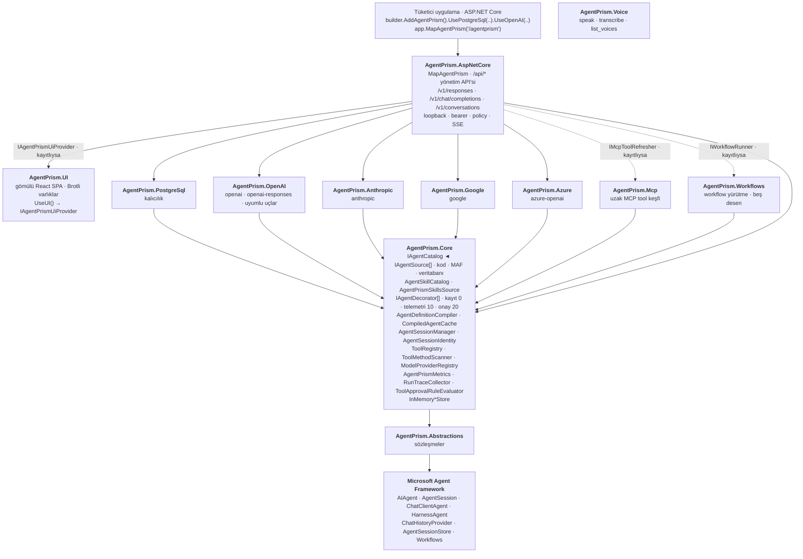

**Bağımlılık yönü tek yönlüdür ve döngü içermez:**

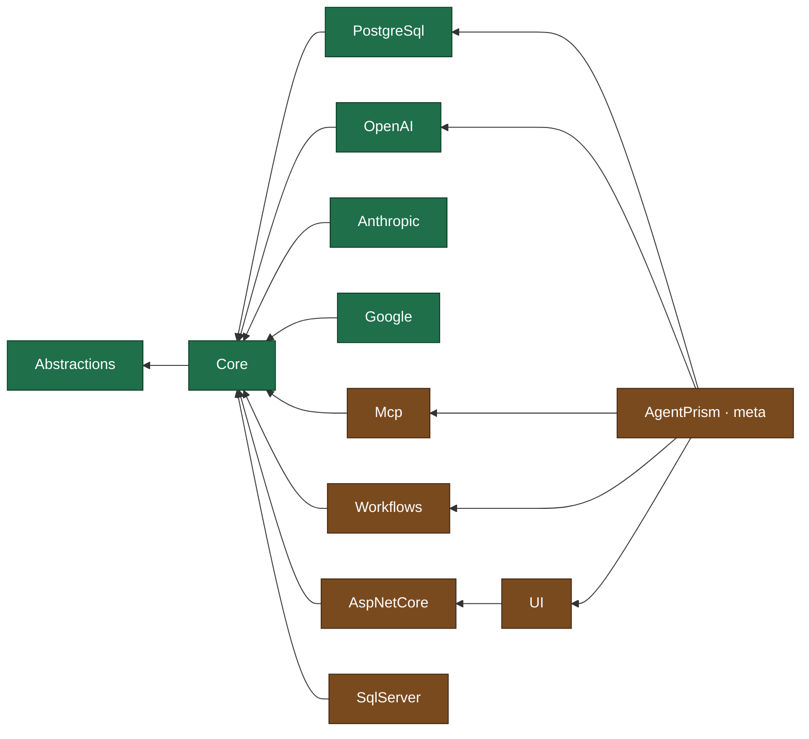

> Yeşil paketler AOT uyumludur, turuncular değildir (karar K-006).
>
> `AgentPrism.SqlServer` meta pakete **dâhil değildir** (K-185): PostgreSQL
> kullanan tüketici `Microsoft.Data.SqlClient` çekmemelidir.
>
> `AgentPrism.Mcp`, `AspNetCore`'a **referans vermez**: HTTP katmanı tazelemeyi
> `IMcpToolRefresher` soyutlaması üzerinden tetikler (kesikli ok). Böylece MCP
> isteğe bağlı bir paket olarak kalır ve bağımlılık grafiği tek yönlü kalır.
>
> `AgentPrism.Workflows` aynı deseni izler: HTTP katmanı workflow'ları
> `IWorkflowRunner` üzerinden çalıştırır. Motor kayıtlı değilse yalnızca
> çalıştırma uçları `501` döner; tanım yönetimi çalışmaya devam eder (K-118).

Bu grafiği bozan bir referans eklemek yasaktır. `AgentPrism.Core.UnitTests` içindeki
mimari testi bunu Faz 1'den itibaren zorlar.

---

## 3. Dört Değişmez Tasarım Kuralı

### K1 — Sıfır sürpriz
`AddAgentPrism()` tek başına çalışır. PostgreSQL yapılandırılmazsa tüm depolama bellek içine düşer. Veritabanı **zorunlu değildir**. Bir geliştirici paketi kurar, tek satır yazar ve çalışan bir arayüz görür.

### K2 — Tool'lar yalnız kodda tanımlanır
Arayüzden agent oluşturulabilir, ancak tool **kodu** yazılamaz. Arayüz sadece kodda kayıtlı tool'lardan seçim yaptırır.

> **Gerekçe:** Arayüzden çalıştırılabilir kod tanımlanabilseydi, AgentPrism arayüzüne erişen herkes sunucuda kod çalıştırabilirdi.

**Kuralın bilinçli istisnaları.** Kural gevşetilmez; istisnalar tek tek
gerekçelendirilir, sayılıdır ve her biri kendi korumalarını taşır:

| İstisna | Durum | Neden kabul edildi | Korumalar |
|---------|-------|--------------------|-----------|
| **MCP tool'ları** (K-058) | ✅ Uygulandı (Faz 6) | Süreç **uzakta** çalışır; AgentPrism yalnız istemcidir | Yalnız `http`/`https` (stdio yok), zorunlu onay, ad ele geçirme engeli, denetim izi, sırsız kayıt |
| **Skill script'leri** (K-066) | ✅ Uygulandı ([Faz 11](11-SKILL-SCRIPT-CALISTIRMA.md)) | Kullanıcı kararı. Süreç **bu makinede** çalışır — en sıkı istisna | Yorumlayıcı beyaz listesi (varsayılan boş), skill başına izin, zorunlu onay, ayrı OS süreci, zaman aşımı, temiz ortam, **yazılamazsa reddeden** denetim izi |

Her iki durumda da arayüz kullanıcısı **yeni kod yazmaz**; var olan bir yeteneği
etkinleştirir. Bu ayrım kuralın özüdür.

### K3 — MAF nesneleri sızdırılır, sarmalanmaz
`AIAgent`, `AgentSession`, `ChatMessage`, `AIFunction` doğrudan kullanılır. AgentPrism bunların üzerine kendi paralel tip hiyerarşisini koymaz.

> **Gerekçe:** Sarmalama, MAF'ın her yeni sürümünde bakım borcu üretir ve tüketiciyi MAF ekosisteminden koparır. AgentPrism bir *kontrol düzlemi*dir, bir *soyutlama katmanı* değil.

### K4 — Her genişleme noktası değiştirilebilir
Tüm servisler `TryAdd*` ile kaydedilir. Tüketici kendi implementasyonunu daha önce kaydederse onunki kazanır. Aynı kural MAF'ın kendi `Hosting.OpenAI` paketinde de geçerlidir — bu yüzden `IConversationStorage` gibi arayüzleri değiştirebiliyoruz.

---

## 4. MAF Genişleme Noktaları

Ayrı dokümana taşındı: [`MAF-GENISLEME-NOKTALARI.md`](MAF-GENISLEME-NOKTALARI.md)
— hangi noktayı nasıl kullandığımız, hangilerini bilerek kullanmadığımız.
Her oturumda değil, yalnız MAF'a dokunurken okunur.

---

## 5. Veri Modeli (`agentprism` şeması)

Ayrı şema kullanılır. Tüketici uygulamanın `public` şemasına **hiç dokunulmaz**.

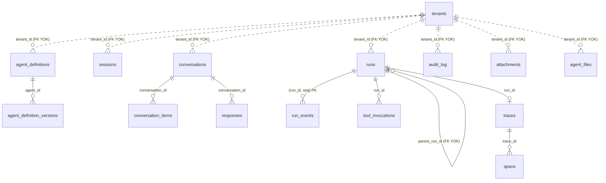

> Diyagram **ilişkileri** gösterir; sütun ayrıntısı için şemanın kaynağına bakın:
> `src/AgentPrism.PostgreSql/Migrations/*.sql`. Kesikli çizgiler (`..`) **yabancı
> anahtar olmayan** mantıksal bağı gösterir — `tenant_id` sütunlarına FK konmadı,
> gerekçe karar defterinde.

Hangi migration'ın hangi tabloyu eklediği (0001–0014) birikimli bir anlatıdır ve
sıcak yolda tutulmaz: [`arsiv/FAZ-GECMISI.md`](arsiv/FAZ-GECMISI.md) → "Migration
geçmişi". Bugünkü tablo listesi aşağıdadır; şemanın kaynağı her zaman
`src/AgentPrism.PostgreSql/Migrations/*.sql` dosyalarıdır.

**Span kimliği türetilir, üretilmez.** `spans.id = SHA-256(trace_id + ":" + span_id)`
ilk 16 baytıdır. Sebep: bir span, ebeveyninden **önce** tamamlanabilir; türetilmiş
kimlikte üst span'in kimliği haritasız hesaplanır. Ek fayda: aynı span iki kez
yazılırsa aynı satır güncellenir, tekrar kaydı oluşmaz.

| Tablo | İçerik |
|-------|--------|
| `__migrations` | Uygulanmış migration'lar, checksum ile |
| `tenants` | Kiracı kaydı; tek kiracıda tek varsayılan satır |
| `agent_definitions` | Agent tanımının güncel hali |
| `agent_definition_versions` | Değişmez versiyon geçmişi, geri alma için |
| `agent_skills` | Tenant-yalıtımlı markdown skill tanımı ve frontmatter |
| `agent_skill_resources` | Skill kaynağı; skill silinince cascade ile silinir |
| `sessions` | Serileştirilmiş `AgentSession` (**`json`**) + agent adı + kiracı + `schema_version` |
| `conversations` | Konuşma başlığı; `PostgresChatHistoryProvider` yazar |
| `conversation_items` | Konuşma mesajları, sıralı (**`json`**) |
| `responses` | **Boş.** `/v1/responses` ve `/v1/conversations` durumu `sessions` tablosunda tutulur (K-036, K-043); ayrı bir yanıt kaydı yazılmadı |
| `runs` | Çalıştırma özeti: agent, oturum, durum, token, süre, maliyet |
| `run_events` | Append-only olay akışı, `(run_id, seq)` birincil anahtar |
| `tool_invocations` | Tool çağrıları: ad, argüman, sonuç, süre, hata |
| `traces` / `spans` | OpenTelemetry span'leri (Faz 6) |
| `audit_log` | Kim, ne zaman, hangi tanımı değiştirdi |
| `attachments` | Yüklenen ek ustverisi + ikili içerik (`bytea`); `session_id` FK **değil** (K-112) |
| `agent_files` | Kalıcı `AgentFileStore`: agent başına yol→metin çifti (Faz 14, 14.5) |
| `workflows` | Arayüzden tanımlanan workflow grafı (`jsonb`); sürüm **geçmişi yok** (K-126) |
| `workflow_checkpoints` | Yürütme kontrol noktaları — durum **`json`**, `jsonb` değil (K-121) |
| `job_schedules` | Zamanlama tanımı: cron, saat dilimi, yük, etkin/pasif (Faz 17) |
| `jobs` | Kuyruktaki iş: durum, kira, deneme sayısı, ilerleme sayaçları (Faz 17) |
| `job_items` | Toplu işin tek girdisi ve ürettiği `run_id` (Faz 17) |
| `eval_suites` | Bir agent'ı ölçen takım: hedef agent, bildirimsel `checks` (`jsonb`) (Faz 18) |
| `eval_cases` | Takımın vakaları: sorgu, beklenen çıktı, beklenen tool'lar (Faz 18) |
| `eval_runs` | Bir takımın tek koşusu: agent sürümü, model, geçme/kalma sayısı (Faz 18) |
| `eval_case_results` | Vaka bazında sonuç; `case_id` **yabancı anahtar değil** (K-14, append-only ruh) (Faz 18) |
| `experiments` | A/B deneyi: hedef agent, kollar (`variants jsonb`), durum, başlangıç/bitiş (Faz 19) |
| `quotas` | Kota kuralı: kapsam (kiracı+agent+dönem), üç sınır (`max_runs`/`max_tokens`/`max_cost`) (Faz 21) |
| `quota_usage` | Dönem sayacı; `agent_name = ''` kiracı geneli. `ON CONFLICT DO UPDATE` ile **atomik** artar (Faz 21) |
| `webhook_subscriptions` | Olay aboneliği: adres, olay listesi, **sır değil** anahtar adı (K-059) (Faz 21) |
| `webhook_deliveries` | Teslim **geçmişi** — kuyruk değil; zamanlama `jobs`'tadır (K-160) (Faz 21) |
| `retention_policies` | Hedef başına saklama kuralı: yaş/hacim sınırı, arşiv bayrağı (K-198) (Faz 25) |
| `retention_runs` | Temizleme koşusu geçmişi (Faz 25) |
| `voice_sessions` | Konuşma bağlantısı özeti: tur, süre, karakter, kapanış nedeni. **Ses içermez**; `session_id` FK **değil** (Faz 29) |

Kurallar:

- Zaman alanları `timestamptz`, her zaman UTC
- **Sorgulanan** serbest yapılı alanlar `jsonb`, sorgulanan yollarda GIN index
- 🚨 **Opak ve polimorfik yükler `json`, `jsonb` DEĞİL.** `jsonb` nesne anahtarlarını yeniden sıralar; System.Text.Json'ın `$type` ayracı ilk özellik olmak zorundadır. `sessions.state` ve `conversation_items.item` bu yüzden `json`. Karar K-027.
- `run_events.payload` `text` — `RunEventWriter` argümanları AOT uyumlu kalmak için elle biçimlendirir, çıktı geçerli JSON olmayabilir
- Birincil anahtarlar `uuid` v7 — zaman sıralı, index dostu; uygulama üretir (`AgentPrismId.NewId()`), `gen_random_uuid()` **kullanılmaz**
- `RunStatus` ve `RunEventType` `smallint` olarak saklanır; enum değerleri kararlıdır
- 🚨 **NULL sütun içeren benzersizlik `COALESCE` ile kurulur.** PostgreSQL'de NULL'lar birbirine eşit sayılmaz; `quotas` kapsam benzersizliği `(tenant_id, COALESCE(agent_name, ''), period)` ifadesi üzerinedir ve `ON CONFLICT` yan tümcesi **aynı ifadeyi** yazar
- Her tabloda `tenant_id` (`text`); `tenants` tablosuna **yabancı anahtar yoktur** — kısıt Faz 6'da kiracı yönetimiyle gelir
- Şema adı yapılandırılabilir (`AgentPrismPostgreSqlOptions.SchemaName`); `.sql` dosyalarındaki `{schema}` yer tutucusu katı doğrulamadan sonra değiştirilir (karar K-029)
- `run_events` partition'ı **açılmadı** (K-063 → K-199): 100k satırda parti silme saniyede ~720k satır siliyor, hedef yükün çok üzerinde. `retention_policies` tabloyu sınırlı tutar

---

## 6. Çalıştırma Yolu

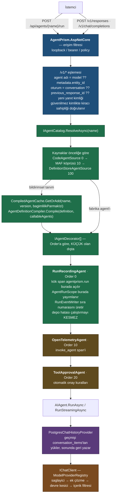

> **Sıra neden böyle?** Kayıt en **dışta** olmalıdır ki iç katmanların harcadığı
> süreyi de ölçsün. Onay ise model çağrısına en **yakın** katmandadır; dışına
> alınsaydı telemetri onay beklemesini kendi süresine katardı.
>
> 🚨 Kök span `RunRecordingAgent`'ın **kendi metot gövdesinde** açılır.
> `Activity.Current` bir `AsyncLocal`'dir ve async bir yardımcı metotta yapılan
> atama çağırana geri akmaz; ölçüldü, iç span'ler kök span'in çocuğu değil
> kardeşi oluyordu.
>
> 🚨 Aynı kuralın ikinci hâli **akışlı** yolda geçerlidir: bir
> `async IAsyncEnumerable` gövdesinde yapılan `AsyncLocal` ataması `yield return`
> sınırını aşmaz. `AgentPrismRunContext.SetCurrent(...)` bu yüzden her
> `MoveNextAsync`'ten hemen önce tekrarlanır (Faz 12'de ölçüldü).

**Faz 19 istisnası:** yalnızca `POST /api/agents/{name}/run` (deneme ucu) için
`R["IAgentCatalog.ResolveAsync(name)"]` adımından **önce** bir
`ExperimentAssignmentResolver.ResolveAsync(...)` çağrısı girer. Bu agent için
`Running` bir deney varsa, `ResolveAsync(name)` yerine `ResolveAsync(name, version)`
çağrılır — sürüm, deneyin atadığı varyanttan gelir. `/v1/*` yolu ve alt-agent
çağrıları bu adımı hiç görmez (K-131, bilinçli kapsam sınırı).

### Çalıştırma ağacı

Bir agent `CallableAgentNames` taşıyorsa derleyici her alt agent'ı bir
`ChildAgentInvoker` ile sarar ve bunları MAF'ın `BackgroundAgentsProvider`'ına
verir. Sağlayıcı modele altı tool açar; model önce görevi başlatır, sonra bekler,
sonra sonucu okur.

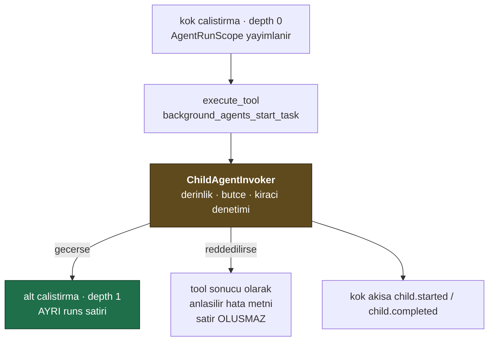

Kurallar:

- Ağaçtaki her çalıştırma **aynı** `AgentRunBudget` örneğini paylaşır (K-096).
- Ağaçtaki her çalıştırma **aynı** W3C trace kimliğini paylaşır; trace tamponunun
  sahibi yalnız kök çalıştırmadır (K-099).
- Alt agent **aynı kiracıda** çalışır; kiracı değişmişse çağrı reddedilir.
- Alt agent **onay isteyemez**; isteyen alt çalıştırma `Failed` olur (K-103).

Derleyicinin içi (`AgentDefinitionCompiler.Compile`):

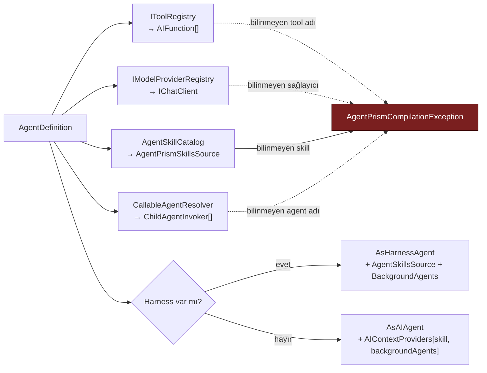

Çalıştırma olayları, `RunEventWriter` tarafından boşluksuz sıra numarasıyla yazılır:

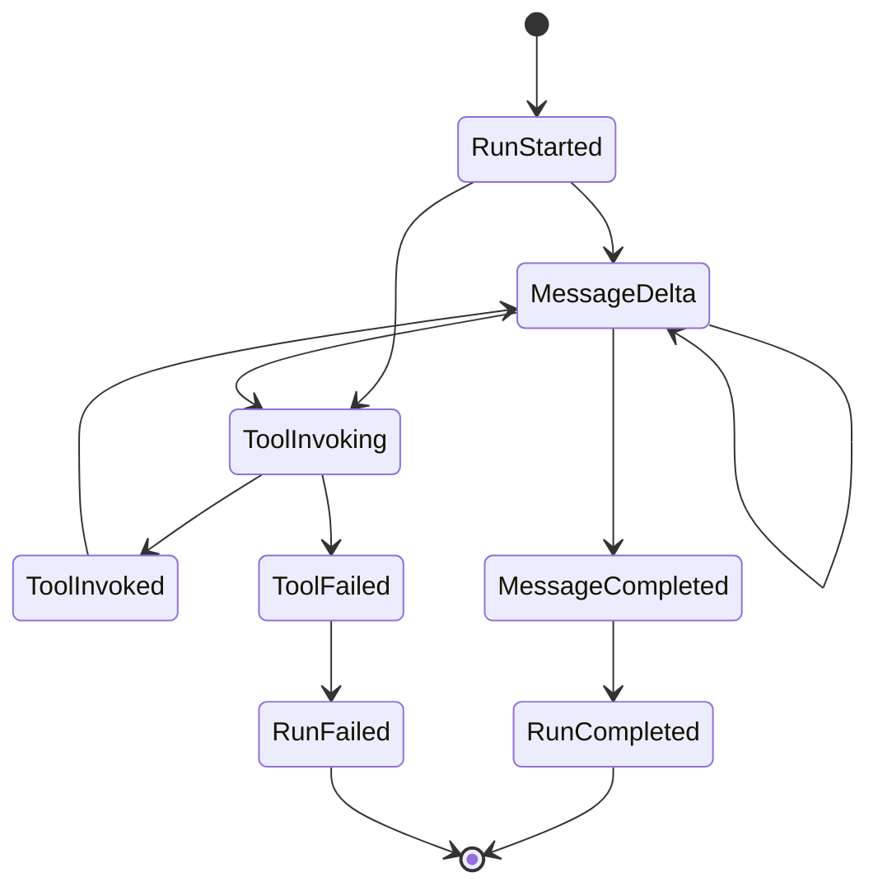

**Oturum yolu** (Faz 2 ✅) — çalıştırmadan bağımsız, çağıran tarafından yönetilir:

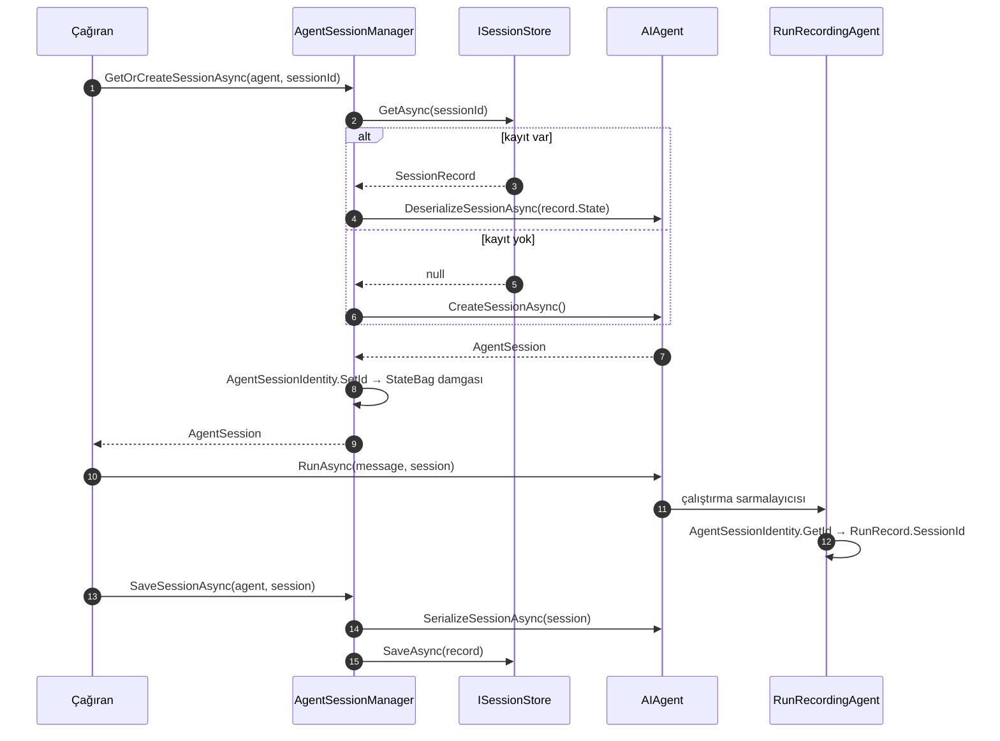

Damga oturumun `StateBag` alanında yaşar ve `SerializeSessionAsync` çıktısına dahildir; bu yüzden geri yüklenen bir oturum kendi kimliğini bilir.

**Neden `DelegatingAIAgent`, neden middleware değil?**
MAF middleware zinciri agent'a özgüdür ve `HarnessAgent` kendi iç dekoratörlerini ekler. Dış sarmalayıcı, harness dahil **her** agent tipinde aynı şekilde çalışır.

**Neden sıra numarasını yazıcı üretir?**
Tek bir yazıcıdan gelen numaralar deterministik sıra garantiler. Canlı akış (SSE) ve geçmişe dönük yeniden oynatma aynı sonucu verir; istemci `Last-Event-ID` ile kaldığı yerden devam edebilir.

---

## 7. Güvenlik Modeli

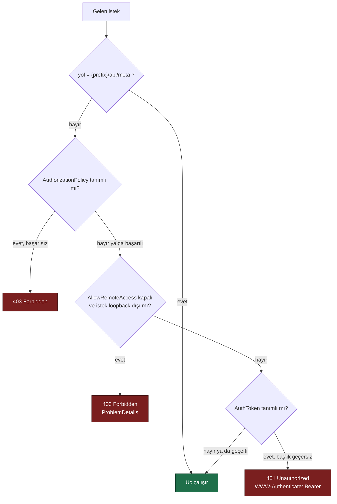

Üç katman, sırayla uygulanır:

1. **Loopback kısıtı** — `AllowRemoteAccess = false` (varsayılan). Loopback dışı istek `403` alır. Kaza ile açılmaya karşı koruma.
2. **Bearer token** — `AuthToken` doluysa `Authorization: Bearer` başlığı sabit zamanlı karşılaştırma ile denetlenir.
3. **Authorization policy** — `RequireAuthorization("policy")` ile ASP.NET Core kimlik doğrulama boru hattına bağlanır. Üretimde kullanılan yol budur.

`{prefix}/api/meta` kimlik doğrulaması olmadan erişilebilir. Arayüzün hangi kimlik yöntemini kullanacağını öğrenmesi için gereklidir; hiçbir hassas veri döndürmez.

**Arayüz kabuğu (HTML, JS, CSS) bearer token katmanından muaftır** (karar K-046).
Tarayıcı bir `<script src>` isteğine `Authorization` başlığı ekleyemez; kabuk
kilitlenseydi kullanıcı token'ı girebileceği ekranı hiçbir zaman göremezdi. Kabuk
veri taşımaz. Loopback kısıtı ve authorization policy kabuğa da uygulanır:

| Katman | `/api/meta` | Arayüz kabuğu | Konuşma WebSocket'i | Diğer tüm uçlar |
|--------|-------------|---------------|---------------------|------------------|
| Loopback kısıtı | ❌ | ✅ | ✅ | ✅ |
| Authorization policy | ❌ | ✅ | ✅ | ✅ |
| Bearer token | ❌ | ❌ | ✅ **alt protokolde** | ✅ başlıkta |

🚨 **Konuşma WebSocket'i token'ı `Sec-WebSocket-Protocol` alt protokolünde alır**
(`agentprism.token.<token>`) ve sabit zamanda kendisi doğrular (K-224). Tarayıcı
bir el sıkışmaya `Authorization` başlığı ekleyemez; sorgu dizesi ise sunucu ve
ters vekil günlüklerine yazılacağı için **kabul edilmez**. Uç ayrıca `Operator`
rolü ister, oturumun kiracı sahipliğini doğrular, kiracı başına eşzamanlı
bağlantıyı sınırlar ve süre/boşta zaman aşımı uygular.

Arayüz token'ı tarayıcıda `sessionStorage`'da tutar — sekme kapanınca silinir (K-047).

Ek sınırlar:

- Sırlar (`ApiKey`, bağlantı dizesi, MCP kimlik doğrulama değeri) **hiçbir zaman** veritabanına yazılmaz, API'den dönmez, arayüzde gösterilmez
- `previous_response_id` ve `conversation_id` güvenilmez girdi kabul edilir; her zaman kiracı sahipliği doğrulanır
- `audit_log` Faz 9'dan beri doludur — bkz. "Roller ve denetim izi"

### Çok kiracılılık ve tool onayı

**Tool onayı.** `RequiresApproval = true` işaretli tool, `ToolRegistry` içinde
`ApprovalRequiredAIFunction` ile sarılır. Sarmalama **defterde** yapılır çünkü
defter, "bir agent yalnızca kayıtlı bir tool'a işaret edebilir" kuralının
zorlandığı tek yerdir; başka bir kod yolunun sarmalamayı atlaması mümkün olmaz.

**MCP sınırı.** MCP sunucusu eklemek, dışarıdan gelen tool tanımlarını kabul etmek
demektir ve tasarım kuralı K2'nin bilinçli istisnasıdır:

| Koruma | Nasıl |
|--------|-------|
| Yalnız uzak sunucu | Yalnız `http`/`https`. **Stdio yoktur** (K-058) — süreç başlatmak K2'yi bozar |
| Onay zorunluluğu | MCP tool'ları varsayılan olarak `RequiresApproval = true` |
| Ad ele geçirme yok | Kodda kayıtlı bir tool'un adını taşıyan MCP tool'u **yok sayılır** (K-060) |
| Sır sızmaz | Kayıt kimlik doğrulama **değerini** değil, değerin okunacağı yapılandırma anahtarının **adını** taşır (K-059) |
| Denetim izi | Her çağrı kaynak sunucu adıyla `tool_invocations`'a yazılır |

**Kiracı çözümleme.** Varsayılan **kapalıdır**; açıldığında sıra:

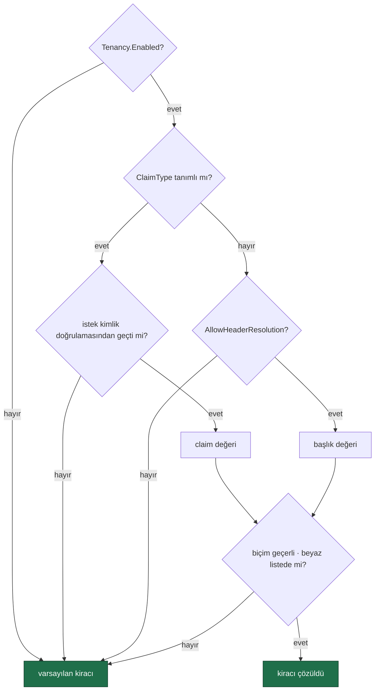

🚨 **Claim tanımlıysa başlık hiç okunmaz.** Aksi hâlde kimlik doğrulamasından
geçmiş bir kullanıcı, bir başlık ekleyerek başka bir kiracının verisine
erişebilirdi. Başlık yolu ayrıca `AllowHeaderResolution` ile **açıkça**
açılmalıdır — bir HTTP başlığı kimlik kanıtı değildir.

### Roller ve denetim izi

**Rol modeli.** Üç policy adı — `AgentPrismPolicies.Reader` / `.Operator` / `.Admin`
— tanımlanır. AgentPrism rol veya kullanıcı **saklamaz**; tüketici bu adları kendi
`AddAuthorization(...)` çağrısında kendi claim'lerine bağlar. Bir policy tüketicide
**kayıtlı değilse** ilgili uç grubu yalnızca yukarıdaki üç katmanlı korumadan geçer
— sürüm yükseltmesi mevcut kurulumları kırmaz. `AgentPrismEndpointOptions.RequireRolePolicies`
açılırsa eksik bir policy `MapAgentPrism()` çağrısını **açılışta** hataya çevirir.

| Rol | Kapsam |
|-----|--------|
| Reader | Agent, çalıştırma, oturum, trace, istatistik **okuma** |
| Operator | Reader + çalıştırma başlatma, onay verme, oturum silme |
| Admin | Hepsi: agent tanımı yazma, MCP sunucusu ekleme, kiracı ve onay kuralı yönetimi, denetim izi okuma |

`GET {prefix}/api/meta` yanıtı artık `roles: { canRead, canOperate, canAdminister }`
alanı taşır — arayüz yetkisi olmayan düğmeleri bu alana göre gizler. Bir policy
kayıtlı değilse karşılık gelen alan her zaman `true` döner (rol kısıtı yok).

**Denetim izi.** `audit_log` tablosuna agent, MCP sunucusu, kiracı ve onay kuralı
yazmaları ile tool onay kararları düşer — **çalıştırmalar düşmez** (`runs` tablosu
zaten tam kaydı tutar). Yazma **depo dekoratörlerinde** yapılır
(`Auditing*Store` — `AgentPrism.Core`), uç katmanında değil; tek istisna
`mcp.refresh` (elle tazeleme bir depo yazması değildir, `GovernanceEndpoints`
içinde yazılır).

Aktör `AuditActorContext` adlı bir `AsyncLocal` köprüsünden okunur:
`AgentPrismEndpointFilter`, her korumalı istekte `HttpContext.User`'ı oraya yazar;
`AgentPrism.Core`'daki `AmbientAuditActorResolver` onu okur. Bu, `AgentPrism.Core`'a
ASP.NET Core bağımlılığı eklemeden "kim yaptı" sorusunu yanıtlamanın yoludur —
`ClaimsPrincipal` temel .NET kütüphanesindedir. Kimlik doğrulaması yoksa aktör
`null`'dur ve bu gizlenmez.

`before`/`after` yazılmadan önce `AuditSecretFilter` içinden geçer: anahtar adında
`apiKey`, `authorization`, `password`, `secret` veya tekil `token` (çoğulu
`tokens` — `maxOutputTokens` gibi sayım alanları — hariç) geçen her alanın değeri
`"***"` ile değiştirilir. Denetim izi yazma hatası **çalıştırmayı kesmez**;
Faz 6'nın "gözlemlenebilirlik işlevi bozmaz" kuralının aynısı.

### Skill script çalıştırma

Bu, K2'nin (**"tool'lar yalnız kodda tanımlanır"**) **ikinci bilinçli
istisnasıdır**. Birincisi MCP'ydi ve orada süreç **uzakta** çalışıyordu; burada
süreç **AgentPrism'in makinesinde** çalışır.

Özellik **varsayılan olarak kapalıdır** ve yalnız kodda açılır
(`UseSkillScripts(...)`: zorunlu onay bayrağı + boş başlayan yorumlayıcı beyaz
listesi + kodda verilen skill kökleri). Kullanım örneği:
[`11-SKILL-SCRIPT-CALISTIRMA.md`](11-SKILL-SCRIPT-CALISTIRMA.md).

Her çalıştırma şu kapılardan **sırayla** geçer; biri kapalıysa süreç hiç başlamaz:

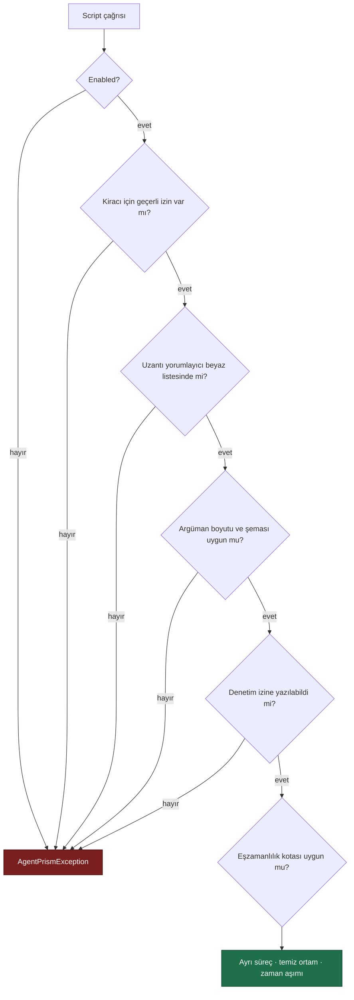

🚨 Beşinci kapı Faz 9 kuralının **istisnasıdır**: denetim izine yazılamayan bir
script çalıştırması, hiçbir kaydı olmayan bir uzaktan kod çalıştırma olurdu
(K-089). Diğer tüm yazmalarda denetim hatası yutulur; burada yutulmaz.

**AgentPrism'in sağladığı korumalar:**

| Koruma | Nasıl |
|--------|-------|
| Yorumlayıcı beyaz listesi | Boş varsayılan; kayıtsız uzantı çalışmaz (K-088) |
| Ortam temizliği | `ProcessStartInfo.Environment.Clear()`; yalnız beyaz listedeki değişkenler eklenir |
| Argüman güvenliği | Argümanlar komut satırına değil **stdin'e** yazılır (K-091) |
| Zaman aşımı | Varsayılan 30 sn; `Kill(entireProcessTree: true)` |
| Çıktı sınırı | Varsayılan 256 KB; aşan çıktı kırpılır, boru hattı boşaltılmaya devam eder |
| Eşzamanlılık | Kiracı başına 2, toplam 8 |
| İzin kaydı | Kiracı bazlı `SkillScriptGrant`; iptal edilir, silinmez (K-092) |
| Onay | MAF'ın `run_skill_script` onayı devrede kalır |
| Denetim izi | `script.run`, `script.denied`, `script.grant`, `script.revoke` |

🚨 **AgentPrism dosya sistemi hapsi, ağ kısıtı, bellek/CPU kotası ve hak düşürme
SAĞLAMAZ**; dördü de barındırma ortamında (container + cgroup + ayrıcalıksız
kullanıcı) kurulur. Nasıl kurulacağı:
[`11-SKILL-SCRIPT-CALISTIRMA.md`](11-SKILL-SCRIPT-CALISTIRMA.md).

`PlatformIsolationAcknowledged` bayrağı bu tabloyu görmeden özellik açılmasını
engeller: `Enabled = true` iken bayrak `false` ise **açılışta** hata verilir
(K-086).

### Kota ve webhook imzası

**🚨 SSRF — giden istek sınırı.** Webhook adresini *kullanıcı* verir ve sunucu o
adrese istek atar. Bu, AgentPrism'in **dışarı** istek attığı ilk yerdir ve
kontrolsüz bırakılırsa iç ağa erişim aracı olur — bulut metadata uçları
(`169.254.169.254`) dâhil, ki bunlar çoğu zaman kimlik doğrulamasız geçici kimlik
bilgisi dağıtır.

| Koruma | Nasıl |
|--------|-------|
| Şema | Yalnız `https`. `http` yalnız `AllowInsecureHttp = true` **ve** loopback hedefi |
| Adres | Özel aralıklar reddedilir: `0/8`, `10/8`, `127/8`, `169.254/16`, `172.16/12`, `192.168/16`, `100.64/10`, `::1`, `fc00::/7`, `fe80::/10`, multicast — ve IPv4'e eşlenmiş IPv6 karşılıkları |
| DNS yeniden bağlama | 🚨 Denetim `SocketsHttpHandler.ConnectCallback` **içindedir**: doğrulanan adres, soketin bağlandığı adresin ta kendisidir. Önce doğrulayıp sonra `SendAsync(url)` çağırmak TOCTOU açığı bırakırdı (K-164) |
| Yönlendirme | `AllowAutoRedirect = false` — yönlendirme, denetimden geçmiş bir adresten özel ağa kaçış yoludur |
| Zaman aşımı | İstek başına `CancellationTokenSource` (varsayılan 10 sn); paylaşılan istemcide `Timeout` alanı değiştirilmez |
| Yanıt | En çok 8 KB okunur; gerisi atılır |
| Varsayılan | `AllowPrivateNetworkTargets = false` |

Koruma `WebhookHttpClient`'ın **içine gömülüdür**; tüketici değiştiremez.
`IHttpClientFactory` bilinçli olarak kullanılmadı (K-164). SSRF kararının tek
doğruluk noktası `WebhookUrlValidator.IsAllowedTarget`'tır.

**Webhook sırrı veritabanında durmaz.** `webhook_subscriptions` kaydı yalnızca
imzalama sırrının okunacağı yapılandırma anahtarının **adını** taşır; değer
çalışma anında `IConfiguration` üzerinden çözülür. Bu, MCP'de verilen K-059
kararının birebir uygulanmasıdır — sözleşmede sır alanı **hiç yoktur**.

**İmza yeniden oynatmaya kapalıdır.** `HMAC-SHA256(timestamp + "." + body, secret)`
— zaman damgası imzaya dâhildir; olmasaydı yakalanan bir istek sonsuza kadar
yeniden oynatılabilirdi (K-163). Alıcının bir tolerans penceresi denetlemesi
gerekir; AgentPrism bunu zorlayamaz.

**Kota ve hız sınırı ayrı mekanizmalardır** (K-158). Hız sınırı saniye/dakika
ölçeğinde, bellekte; kota gün/ay ölçeğinde, veritabanında. İkisi de **varsayılan
olarak hiçbir isteği reddetmez**: hız sınırı `Enabled = false`, kota ise kural
tanımlanmadıkça boştur (K-165). Kota **yaklaşıktır** — denetim çalıştırma
öncesinde, tüketim sonrasında yazılır (K-159).

### MCP OAuth ve kaynak erişimi

| Koruma | Nasıl |
|--------|-------|
| Prompt = anlık görüntü | Yönetici **panoya kopyalar**; agent canlı çekmez |
| Kaynak = yalnız bildirilen URI | Kümesi dışı URI reddedilir — serbest URI SSRF aracı olurdu |
| Kaynak boyutu (Mod A) | Kaynak başına 64 KB, toplam 256 KB; UTF-8 sınırına saygılı kırpma |
| OAuth token | `(kiracı, sunucu)` başına bellek içi önbellek; DB'ye yazılmaz. SDK yalnız Authorization Code destekler (K-168) |
| `/oauth/callback` | Arayüz kabuğuyla aynı grup: loopback+policy geçerli, yalnız bearer muaf. Güvenlik tek kullanımlık `state`'e dayanır |

Ayrıntı: `docs/22-MCP-DERINLESMESI.md`.

---

## 8. Sürüm Politikası

`Microsoft.Agents.AI.Hosting` (preview) ve `.Hosting.OpenAI` (alpha) hâlâ ön
sürümdür. Ön sürüm bağımlılığı **yalnızca** `AgentPrism.AspNetCore` içinde
toplanır (K-008); diğer paketler yalnız GA paketlere bağlıdır. AgentPrism o iki
paket GA olana kadar `1.0.0-preview.N` yayınlanır — sonra tek bir pakette sürüm
güncellemesi yeterlidir.

---

## 9. Trim ve AOT

| Paket | AOT uyumlu | Neden |
|-------|-----------|-------|
| `AgentPrism.Abstractions` | Evet | Saf sözleşmeler |
| `AgentPrism.Core` | Evet | Yansımaya dayanan tek yol `AddToolsFrom` / `AddTool(Delegate)`; ikisi de `[RequiresUnreferencedCode]` + `[RequiresDynamicCode]` ile işaretli — uyarı bastırılmaz, çağırana iletilir |
| `AgentPrism.PostgreSql` | Evet | Npgsql AOT uyumlu |
| `AgentPrism.SqlServer` | Hayır *(vaat ertelendi)* | Ölçüldü: sıfır IL2/IL3; canlı sorgu doğrulanmadı (K-181) |
| `AgentPrism.Sqlite` | Hayır *(ölçülmedi)* | Faz 24 kapanışında ölçüm YAPILMADI; `SQLitePCLRaw` yerel kütüphane taşır (K-196) |
| `AgentPrism.OpenAI` | Evet | Ölçüldü (Faz 3): `IsAotCompatible=true` ile sıfır uyarı. `OPENAI001`/`MAAI001` deneysel API tanılarıdır, AOT tanısı değil |
| `AgentPrism.AspNetCore` | Hayır | Minimal API delege yönlendirmesi reflection kullanır. Bayrak `Directory.Build.targets` içinde türetilir — `src/Directory.Build.props` csproj'dan önce yüklendiği için orada türetmek `false` tercihini yok sayardı (K-006) |
| `AgentPrism.UI` | Hayır | Gömülü varlık tarama + ASP.NET Core bağlantısı |

Bayrak `AgentPrismAotCompatible` ile uygulanır; türetmenin neden
`Directory.Build.targets` içinde olduğu K-006'dadır. AOT'un Faz 1–2'de getirdiği
somut kısıtlar ve çözümleri: [`arsiv/FAZ-GECMISI.md`](arsiv/FAZ-GECMISI.md).

---

## 10. İlgili Dokümanlar

Faz dokümanlarının **tam listesi ve durumu tek yerdedir**: `README.md` yol
haritası tablosu (Faz 0–7) ve
[`IKINCI-FAZ-YOL-HARITASI.md`](IKINCI-FAZ-YOL-HARITASI.md) (Faz 8–30, sıra +
bağımlılıklar + migration numaraları). Burada tekrarlanmaz — iki yerde tutmak
kayma üretir.

| Doküman | Ne zaman |
|---------|----------|
| [KARARLAR-INDEKS.md](KARARLAR-INDEKS.md) → `KARARLAR.md` | Bir karar alınmış mı? İndeksten satırı bul, **grep'le** oku |
| [MAF-GENISLEME-NOKTALARI.md](MAF-GENISLEME-NOKTALARI.md) | MAF'a dokunurken |
| [`hafiza/`](hafiza/) | O alana dokunurken — tuzaklar ve codepath notları |
| [`arsiv/FAZ-GECMISI.md`](arsiv/FAZ-GECMISI.md) | "Neden böyle olmuş?" — yalnız grep ile |
| [BEYIN-FIRTINASI.md](BEYIN-FIRTINASI.md) | Tarihsel kayıt; faz dokümanı geçerlidir |
