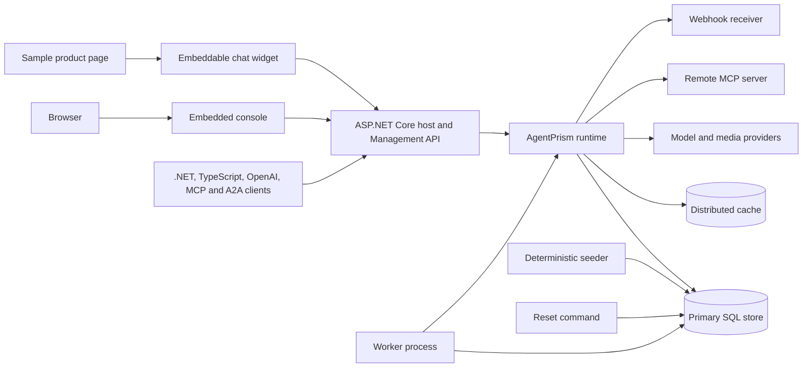

# AgentPrism Panel Sunum Rehberi

> Kaynak envanter: [`PROJE-OZELLIKLERI.md`](PROJE-OZELLIKLERI.md). Bu rehber,
> envanterdeki 13 kategori ve 202 özelliğin tamamı için sunum kararı verir.
> Rehber bir implementation planı değildir. Showcase implementation fazına girdi
> sağlayan, doğrulanabilir bir sunum sözleşmesidir.
>
> Kart ve matris numaraları envanterdeki sıraya karşılık gelir. Envantere yeni
> özellik girdiğinde numaralar kayar; rehber o zaman yeniden hizalanır.
> Son hizalama: Faz 150 (2026-09-06).

## 1. Amaç ve hedef kitle

Bu belge, ayrı bir **AgentPrism Showcase** tüketici uygulamasında hangi yeteneğin
nasıl gösterileceğini tanımlar. Hedef kitle; AgentPrism'i değerlendiren B2B ürün
sahipleri, solution architect'ler, platform ekipleri ve uygulamayı kuracak .NET
geliştiricileridir.

Ana sunum yüzeyi embedded console'dur. Ancak paket desteği ile panel desteği aynı
şey değildir. Bir özellik ancak mevcut React route'u ve API action'ı doğrulandıysa
`Doğrudan panel demosu` olarak sınıflandırılır. Kod, configuration, CLI veya harici
sistem ile hazırlanan ve sonucu console'da görülen özellik `Panel destekli demo`
olarak sınıflandırılır. Build veya altyapı kanıtı gereken özellikler ana akışa
zorlanmaz.

### Kanıt ve dil sözleşmesi

- Birincil yetenek listesi `docs/PROJE-OZELLIKLERI.md` dosyasıdır.
- UI konumu, `src/AgentPrism.UI/frontend/src/app.tsx` route tablosu ve ilgili screen
  veya component ile doğrulanmıştır.
- Tüketici davranışı, `docs-site/src/content/docs/` altındaki ürün dokümantasyonu
  ve public source contract'ları ile çapraz kontrol edilmiştir.
- Bu belge yeni bir UI ekranı varsaymaz. `Panel konumu: Yok` ifadesi bilinçlidir.
- Demo varlığı, prompt, output, tenant, tool ve workflow adları İngilizcedir.
- Secret değeri hiçbir seed veya dokümana girmez. Yalnız configuration key adı
  tutulur. Placeholder biçimi `<OPENAI_API_KEY>` gibi olur.
- Canlı sonuç, seçili model ve harici servis nedeniyle nondeterministic ise kayıtlı
  fixture veya `FakeModelProvider` fallback'i önceden hazırlanır.

### Sınıflandırma özeti

| Sınıf | Sayı | Yorum |
| --- | ---: | --- |
| Doğrudan panel demosu | 78 | Console veya embedded UI üzerinden tetikleme ve görünür sonuç vardır. |
| Panel destekli demo | 75 | Hazırlık panel dışındadır; sonuç veya operasyon kanıtı paneldedir. |
| Panel dışı teknik demo | 36 | API, CLI, SDK, build, test veya altyapı kanıtı gerekir. |
| Gösterilmemeli | 13 | Canlı tüketici sunumunda değer/risk dengesi zayıftır. |
| Belirsiz | 0 | Envanter iddiaları kod ve ürün dokümantasyonunda karşılık buldu. |
| **Toplam** | **202** | Değerlendirilmeden kalan özellik yoktur. |

### Kod, UI ve ürün dokümantasyonu kanıt haritası

Bu tablo tek tek kartlardaki kararların hangi gerçek yüzey ailesiyle çapraz
kontrol edildiğini gösterir. Source type/public contract doğrulaması ilgili
`src/AgentPrism.*` projesinde; UI action doğrulaması adı verilen screen/component'te
yapılmıştır.

| Kategori | Başlıca source/UI kanıtı | Başlıca ürün dokümantasyonu |
| --- | --- | --- |
| C1 Agent/orchestration | `AgentPrism.Core`, `screens/agent-editor/*`, `agent-detail.tsx` | `concepts/agents.md`, `guides/model-providers.md`, `guides/reliability.md` |
| C2 Provider/media | `AgentPrism.OpenAI`, `.Anthropic`, `.Google`, `.AzureOpenAI`, `.Voice`; `models.tsx`, `voice-panel.tsx` | `guides/model-providers.md`, `guides/multimodal.md`, `guides/voice.md` |
| C3 Tool/skill/MCP/context | `AgentPrism.Core`, `.Mcp`, `.Generators`; `tools.tsx`, `skills.tsx`, `mcp.tsx`, `approvals.tsx` | `concepts/tools.md`, `guides/client-side-tools.md`, `guides/context-and-memory.md`, `guides/knowledge.md` |
| C4 Run/session/content | Run/session/attachment contracts ve endpoints; `run-detail.tsx`, `session-detail.tsx`, `playground/*` | `concepts/runs.md`, `concepts/sessions.md`, `guides/multimodal.md` |
| C5 Workflow/job/reliability | Workflow/job stores, endpoints ve workers; `workflow-detail.tsx`, `jobs.tsx`, `job-detail.tsx` | `concepts/workflows.md`, `guides/background-work.md`, `guides/reliability.md` |
| C6 Evaluation/change | Eval/experiment/canary stores ve endpoints; `eval-*.tsx`, `experiment-detail.tsx` | `concepts/evaluation.md` |
| C7 Security/governance | Security/governance endpoints ve stores; Settings governance components, `triggers.tsx`, `audit.tsx` | `concepts/governance.md`, `getting-started/security.md`, `guides/inbound-triggers.md`, `guides/production.md` |
| C8 Persistence/storage | PostgreSQL/SQL Server/SQLite projects ve migrations; `diagnostics.tsx`, Settings storage/retention | `getting-started/persistence.md`, `reference/read-views.md`, `guides/production.md` |
| C9 Observability/operations | Activity/metrics/trace/health/analytics services; `dashboard.tsx`, `run-detail.tsx`, `models.tsx`, `diagnostics.tsx` | `guides/observability.md`, `guides/reliability.md` |
| C10 HTTP/protocol/client | ASP.NET Core endpoint maps, generated clients, CLI; console route consumers | `http-api.md`, `guides/openai-api.md`, `guides/external-agents.md`, `guides/typescript-client.md`, `guides/cli.md`, `guides/embedding.md` |
| C11 Dashboard/UI | `frontend/src/app.tsx` içindeki 36 route ve ilgili screen/component'ler | `ui.md` ve build ile üretilen gerçek-browser screenshots |
| C12 Packaging/DI | Project files, package metadata, DI extensions, template ve PublicAPI baselines | `packages.md`, `reference/compatibility.md`, extension guides |
| C13 Test/quality | `AgentPrism.Testing*`, `.Generators`, packed-consumer/infra tests ve repository scripts | `guides/testing.md`, `guides/coding-agents.md`, `reference/versioning.md` |

## 2. Sunum mimarisi

Showcase tek bir repository olabilir. Ancak runtime sorumlulukları ayrılmalıdır.

| Bileşen | Sorumluluk | Bağımlılık ve sınır |
| --- | --- | --- |
| ASP.NET Core host | `MapAgentPrism()` ile Management API, console ve seçili protocol yüzeylerini yayınlar. | Remote access, authentication, authorization, CORS ve diagnostics bilinçli açılır. |
| AgentPrism paketleri | Core, ASP.NET Core, UI, provider, persistence, MCP, workflow, voice ve testing yeteneklerini seçer. | Showcase, meta package yerine explicit paketlerle dependency graph'ı görünür tutabilir. |
| Embedded console | Ana canlı demo yüzeyidir. | Varsayılan base path `/panel`; yeni route eklenmez. |
| Primary persistence | Agent definition, session, run, workflow, job, eval ve governance kayıtlarını kalıcı tutar. | Önerilen varsayılan PostgreSQL + `pgvector`; SQL Server ve SQLite ayrı profile'dır. |
| Distributed cache | Response cache ve token/cache senaryolarını destekler. | Demo için Redis önerilir; cache temizliği reset'in parçasıdır. |
| Model provider'lar | Birincil, fallback, reasoning, structured output ve multimodal çağrıları sağlar. | OpenAI birincil; Anthropic ve Google fallback/karşılaştırma; Azure opsiyonel profile. |
| Örnek tanımlar | Agent, tool, skill, workflow, suite, experiment, schedule, trigger, quota ve policy varlıklarını sağlar. | Kod-only yüzeyler code registration; mutable tanımlar store seed'i olur. |
| Deterministic seeder | Sabit ad ve version'larla idempotent veri üretir. | Aynı seed revision ikinci kez duplicate üretmez. Secret çözmez. |
| Worker | Job, schedule, eval, webhook, reconciliation ve canary background işlerini yürütür. | Tek-process demo varsayılandır. Dayanıklılık eki için ayrı API ve worker process'i kullanılır. |
| Harici servisler | MCP, webhook receiver, OpenTelemetry collector, model/media provider ve object storage sağlar. | Her biri için local fake veya kayıtlı kanıt fallback'i bulunur. |
| Reset mekanizması | Demo tenant'larını, operational kayıtları, cache'i ve object storage prefix'ini temizleyip yeniden seed eder. | Migration geri alınmaz. Configuration ve secret store korunur. |

### Çalıştırma profilleri

| Profil | Amaç | İçerik |
| --- | --- | --- |
| `showcase-live` | Ana canlı sunum | PostgreSQL, worker, Redis, OpenAI, local MCP, local webhook receiver, console. |
| `showcase-deterministic` | Ağ veya credential sorunu için fallback | PostgreSQL, worker, `FakeModelProvider`, local MCP fixture ve local webhook receiver. |
| `showcase-enterprise` | SQL Server ve Azure odaklı ek sunum | SQL Server, Azure OpenAI, Entra veya API key, ayrı API/worker node'ları. |
| `showcase-technical` | CLI, SDK, protocol ve build eki | Console yanında sample clients, test project ve intentionally failing analyzer samples. |

### Reset seviyeleri

- **R1 — Scenario reset:** Yalnız ilgili run, job, approval, delivery veya eval
  kayıtlarını temizler. Mutable definition version'larını başlangıç revision'ına
  döndürür.
- **R2 — Tenant reset:** `acme-support` ve `globex-support` demo tenant verisini
  temizler. Sonra deterministic seed çalışır.
- **R3 — Infrastructure reset:** Database schema'yı migration ile yeniden kurar;
  Redis ve object storage demo namespace'lerini temizler. Yalnız prova öncesinde
  kullanılır.
- **R4 — Evidence reset:** Teknik ek için temp project, build artifact, trace ve
  prerecorded failure fixture'larını yeniden üretir.

## 3. Ortak demo veri seti

Domain, çok kanallı e-commerce customer support operasyonudur. Senaryo gerçek bir
B2B problemi gösterir: müşteri talebini anlama, sipariş araştırma, refund kararı,
insan onayı, kalite ölçümü ve tenant governance.

| Varlık | Tanım | Gösterdiği ana özellikler |
| --- | --- | --- |
| `Customer Support Agent` | İlk teması yönetir, culture ve parameter kullanır, diğer agent'ları çağırır. | Agent editor, versions, playground, sessions, run tree, culture, structured output. |
| `Order Investigation Agent` | CRM, order ve shipment araçlarıyla kanıt toplar. | Tool calls, concurrent calls, MCP, context, run attribution. |
| `Refund Approval Agent` | Policy'yi uygular ve yüksek tutarda insan onayı ister. | Tool governance, approval, authorization, quota ve audit. |
| `Quality Analyst Agent` | Transcript ve expected policy üzerinden değerlendirme üretir. | Judges, online eval, experiments ve canary. |
| `Product Knowledge Skill` | Product policy markdown'i ve bounded resource'ları taşır. | Skill catalog, resource, approval ve version etkisi. |
| `Refund Policy Skill` | Refund kurallarını ve kayıtlı `calculate_refund` script referansını taşır. | Skill editor, script grant ve güvenlik sınırı. |
| `Customer CRM Tool` | Deterministic müşteri ve segment verisi döndürür. | Code-only tool, schema, authorization ve usage analytics. |
| `Order Lookup Tool` | Sipariş, ödeme ve fulfillment durumunu döndürür. | Tool metadata, timeout/output limit ve replay. |
| `Issue Refund Tool` | Dış etki üreten destructive tool'dur. | Pending approval, standing rule, audit ve webhook. |
| `Browser Sentiment Tool` | Client-side çalışır ve sentiment sonucu geri yollar. | Client-side tool ve widget. |
| `Commerce MCP Server` | `search_catalog`, prompt ve policy resource'u yayınlar. | Discovery, OAuth/header auth, prompt ve resource. |
| `Refund Workflow` | Intake → investigate → policy → approval → execute → notify graph'ıdır. | Multi-agent workflow, function node, checkpoint ve human-in-the-loop. |
| `Support Quality Suite` | 12 deterministic case ve safety/semantic check içerir. | Suite, checks, promotion, judge ve run history. |
| `Reply Tone Experiment` | Aynı agent'ın `v1` ve `v2` version'larını stable assignment ile karşılaştırır. | A/B results ve canary rollback. |
| `Daily Quality Report` | Her gün eval + summary job'ı üretir. | Schedule, worker, job queue ve retry. |
| `High Value Refund Trigger` | İmzalı inbound event ile workflow job'ı başlatır. | Trigger, replay/flood protection ve async processing. |
| `Support Event Webhook` | Run, approval ve eval event'lerini local receiver'a yollar. | HMAC, delivery retry ve disable. |
| `acme-support` tenant | OpenAI binding, Europe/Istanbul quota ve tam catalog erişimi. | Multi-tenancy, BYOK, egress, quota ve audit. |
| `globex-support` tenant | Google binding, düşük quota ve kısıtlı egress. | Tenant isolation ve policy rejection. |
| `customer-handbook.pdf` | Sentetik ürün ve refund bilgisi içerir. | Attachment, multimodal, document channel ve knowledge ingestion. |

Seed hiçbir gerçek kişi, gerçek sipariş veya production endpoint içermez. Order
kimlikleri `ORD-DEMO-1001` biçimindedir. E-posta ve telefon alanları sentetiktir.

## 4. Configuration ve tanımlama envanteri

| Tanım | Amaç | Gerekli paket/altyapı | Configuration veya registration | Secret ihtiyacı | Seed edilebilir mi? | Kullanıldığı demolar |
| --- | --- | --- | --- | --- | --- | --- |
| Core host | Runtime ve DI | `AgentPrism.Core`, ASP.NET Core | `AddAgentPrism()` | Hayır | Hayır | Tümü |
| Management + console | API ve embedded panel | `AgentPrism.AspNetCore`, `AgentPrism.UI` | `MapAgentPrism("/panel")`, `UseUI()` | Opsiyonel bearer key: `AgentPrism:Http:BearerToken` | Hayır | A–M |
| PostgreSQL store | Kalıcı veri ve vector search | `AgentPrism.PostgreSql`, PostgreSQL, `pgvector` | `AgentPrism:PostgreSql:ConnectionString` | Evet, `<POSTGRES_CONNECTION_STRING>` | Migration ve seed | C–K |
| SQL Server profile | Enterprise persistence kanıtı | `AgentPrism.SqlServer`, SQL Server 2019+ | `AgentPrism:SqlServer:ConnectionString` | Evet | Migration ve seed | J, L |
| SQLite profile | Tek dosyalı local profil | `AgentPrism.Sqlite` | `AgentPrism:Sqlite:ConnectionString` | Hayır | Migration ve seed | J, L |
| Redis cache | Response cache | `IDistributedCache`, Redis | `ConnectionStrings:AgentPrismRedis` | Ortama göre | Hayır | A, H |
| OpenAI provider | Birincil text/image provider | `AgentPrism.OpenAI` | `AgentPrism:Providers:OpenAI:ApiKey` | Evet, `<OPENAI_API_KEY>` | Hayır | A–I |
| OpenAI Responses provider | Responses yüzeyi ve reasoning | `AgentPrism.OpenAI` | Ayrı provider adı ve aynı/ayrı key reference | Evet | Hayır | A, C, I |
| OpenAI-compatible provider | Local veya hosted compatible endpoint | `AgentPrism.OpenAI` | `AgentPrism:Providers:Compatible:Endpoint`, `:ApiKey` | Ortama göre | Hayır | G, I |
| Anthropic provider | Fallback ve comparison | `AgentPrism.Anthropic` | `AgentPrism:Providers:Anthropic:ApiKey` | Evet, `<ANTHROPIC_API_KEY>` | Hayır | E, G |
| Google provider | Gemini ve image | `AgentPrism.Google` | `AgentPrism:Providers:Google:ApiKey` | Evet, `<GOOGLE_API_KEY>` | Hayır | C, G |
| Azure OpenAI provider | Deployment ve enterprise profile | `AgentPrism.AzureOpenAI` | `AgentPrism:Providers:AzureOpenAI:Endpoint`, `:ApiKey` veya Entra registration | Ortama göre | Hayır | G, L |
| Fake provider | Deterministic fallback | `AgentPrism.Testing` | `FakeModelProvider` scripted registration | Hayır | Script seed | Tüm canlı akışların fallback'i |
| ElevenLabs speech | Speak/transcribe/voices | `AgentPrism.Voice` | `AgentPrism:Voice:ElevenLabs:ApiKey` | Evet, `<ELEVENLABS_API_KEY>` | Hayır | C |
| Image generators | Görsel üretme | Provider paketleri | Provider-specific image registration | Evet | Hayır | C |
| Commerce MCP | Remote tool/prompt/resource | `AgentPrism.Mcp`, local MCP host | Server definition; auth key `AgentPrism:Mcp:Commerce:Authorization` | Opsiyonel | Definition seed | B, I |
| Knowledge store | Ingestion ve vector search | PostgreSQL + `pgvector`, embedding provider | Knowledge registration ve embedding model binding | Evet | Corpus seed | B, C |
| Worker/scheduling | Queue, retry, canary, eval, webhook | Workflow/background packages | `UseScheduling()` ve worker options | Hayır | Schedule seed | D–F |
| Security boundary | AuthN/AuthZ, tenant ve roles | Consumer auth pipeline | Named policies; tenant claim/header; exact CORS origins | Token/key olabilir | Policy seed kısmen | F, I |
| API keys | Scoped external access | Governance store | Panel/API ile hash'li key oluşturma | Değer yalnız oluşturulurken görünür | Metadata seed; gerçek key hayır | F, I |
| Tenant provider binding | BYOK ve egress | Provider + governance store | Yalnız `AgentPrism:TenantSecrets:Acme:OpenAI` key adı | Evet, değer config'de | Binding seed | F, G |
| Quota | Admission control | Durable quota store | Tenant, dönem, time zone, request/token/cost limitleri | Hayır | Evet | F, H |
| Webhook receiver | Signed outbound delivery | Local HTTPS receiver | `AgentPrism:Webhooks:Support:SigningSecret` | Evet | Subscription seed | D, F |
| Inbound trigger | İmzalı job başlatma | Trigger store + worker | `AgentPrism:Triggers:HighValueRefund:SigningSecret` | Evet | Definition seed | D, F |
| Content protection | At-rest encryption | Key provider + SQL/object storage | `AgentPrism:Protection:Keys:Primary` | Evet | Hayır | J |
| Object storage | Attachment binary store | Custom `IAttachmentStorage` | `AgentPrism:Storage:Attachments:*` | Ortama göre | Namespace seed | C, J |
| OpenTelemetry | Trace ve metrics export | OTLP collector | `OTEL_EXPORTER_OTLP_ENDPOINT`; service name | Ortama göre | Hayır | H |
| Protocol allowlists | MCP server ve A2A exposure | ASP.NET Core protocol packages | Explicit agent allowlists ve remote-access options | Scoped API key gerekir | Evet | I |
| Sample clients | .NET, TypeScript, OpenAI, MCP ve A2A kanıtı | Client paketleri/SDK'lar | Base URL, tenant ve scoped key placeholders | Evet | Request fixtures | I, L |
| Demo revision | Idempotent seed ve reset | Showcase infrastructure | `Showcase:SeedRevision`, `Showcase:TenantIds` | Hayır | Evet | Tümü |

## 5. Özellik bazlı demo kataloğu

### Ortak kısaltmalar

- **P1:** Host + console + PostgreSQL + worker + deterministic seed.
- **P2:** P1 + bir veya daha çok gerçek model provider; fake fallback hazırdır.
- **P3:** P1 + two-tenant auth, roles, scoped key ve governance seed'i.
- **P4:** P1 + local HTTPS MCP ve webhook/trigger test host'ları.
- **P5:** P2 + speech, image, attachment/object storage ve browser media izni.
- **P6:** Technical profile; CLI/SDK/build/test terminali ve temiz temp consumer.
- **Reset:** `R1` hedef kayıtları, `R2` tenant verisini, `R3` altyapıyı, `R4`
  teknik kanıtları sıfırlar.

Her karttaki panel yolu `/panel` base path'ine göredir. Örneğin `Runs > Detail`,
`/panel/runs/:id` route'unu ifade eder.

### Agent ve model orchestration yetenekleri

#### 1. Declarative agent tanımları
- **Sınıf:** Doğrudan panel demosu. **Sunum değeri:** Runtime davranışının kod deploy'u olmadan yönetilebilir bir definition ile kurulabildiğini kanıtlar.
- **Ön koşullar:** P1–P2. **Hazırlanacak tanımlar:** `Customer Support Agent`, tool/skill/callable-agent bağlantıları ve metadata.
- **Panel konumu:** `Agents > New/Edit`, sonra `Agent Detail`. **Demo adımları:** Definition'ı panelde oluştur; model, instructions, tools, skills ve callable agents alanlarını doldur; kaydet; Playground'da çalıştır.
- **Beklenen görünür sonuç:** Definition özeti ve başarılı run. **Kanıt ölçütü:** Kaydedilen alanlar detail'da görünür ve run bunları kullanır.
- **Reset/tekrar koşum:** R1 ile definition başlangıç version'ına döner. **Risk ve notlar:** Tool kodu panelde yazılmaz. **İlişkili özellikler:** 3, 6–8, 11–14, 16, 171–172.

#### 2. Factory agent kaydı
- **Sınıf:** Panel destekli demo. **Sunum değeri:** Mevcut MAF agent yatırımının yeniden yazılmadan kataloğa girebildiğini gösterir.
- **Ön koşullar:** P1–P2. **Hazırlanacak tanımlar:** Kodda `Legacy Escalation Agent` factory registration.
- **Panel konumu:** `Agents` ve read-only `Agent Detail`. **Demo adımları:** Host'u factory registration ile başlat; agent'ı listede aç; Playground'da çalıştır.
- **Beklenen görünür sonuç:** Origin'i code olan agent ve kayıtlı run. **Kanıt ölçütü:** Editor görünmez; factory çıktısı MAF `AIAgent` olarak çalışır.
- **Reset/tekrar koşum:** R1 run temizliği. **Risk ve notlar:** Factory'nin kendisi panelden değiştirilemez. **İlişkili özellikler:** 4, 168, 184.

#### 3. Agent tanımı yaşam döngüsü
- **Sınıf:** Doğrudan panel demosu. **Sunum değeri:** Güvenli prompt/model değişikliği, audit edilebilir history ve rollback'i gösterir.
- **Ön koşullar:** P1, durable definition store. **Hazırlanacak tanımlar:** `Customer Support Agent` v1 ve kontrollü v2 değişikliği.
- **Panel konumu:** `Agents > Detail/Edit > Version history, Diff, Rollback`. **Demo adımları:** Bir alanı değiştir; v1-v2 diff'i aç; v1'e rollback yap.
- **Beklenen görünür sonuç:** Yeni version, alan bazlı diff ve rollback sonrası yeni current version. **Kanıt ölçütü:** Current badge ve resolved definition v1 davranışına döner.
- **Reset/tekrar koşum:** R1 seed revision'ı restore eder. **Risk ve notlar:** Rollback geçmişi silmez; yeni version üretir. **İlişkili özellikler:** 102–103, 116, 171.

#### 4. Custom agent source
- **Sınıf:** Panel destekli demo. **Sunum değeri:** Repository veya external runtime catalog entegrasyonunu kanıtlar.
- **Ön koşullar:** P1. **Hazırlanacak tanımlar:** Kodda deterministic `ShowcaseRepositoryAgentSource` ve `Repository FAQ Agent`.
- **Panel konumu:** `Agents` ve read-only detail. **Demo adımları:** Source'u register et; host'u başlat; source agent'ını filtrele ve çalıştır.
- **Beklenen görünür sonuç:** Custom origin'li agent ve run. **Kanıt ölçütü:** Agent store seed'inde yokken catalog'da görünür.
- **Reset/tekrar koşum:** R1. **Risk ve notlar:** Source configuration ve refresh panel action'ı yoktur. **İlişkili özellikler:** 2, 5, 193.

#### 5. Source fault isolation
- **Sınıf:** Panel destekli demo. **Sunum değeri:** Tek catalog entegrasyonu bozulunca control plane'in tamamının kaybolmadığını gösterir.
- **Ön koşullar:** P1 ve iki custom source. **Hazırlanacak tanımlar:** Biri çalışan, biri opt-in hata üreten source.
- **Panel konumu:** `Agents`; dolaylı kanıt için uygulama log'u. **Demo adımları:** Hatalı source'u aç; Agents'ı yenile; çalışan source ve store agent'larını aç.
- **Beklenen görünür sonuç:** Sağlam agent'lar listelenmeye devam eder. **Kanıt ölçütü:** Source hatası loglanır, catalog isteği bütünüyle fail olmaz.
- **Reset/tekrar koşum:** Failure flag kapatılır; R1. **Risk ve notlar:** Hata mesajı için ayrı panel yoktur. **İlişkili özellikler:** 4, 150, 154.

#### 6. Tanım doğrulama
- **Sınıf:** Doğrudan panel demosu. **Sunum değeri:** Hatalı agent'ın ilk customer request'inde değil save aşamasında reddedildiğini gösterir.
- **Ön koşullar:** P1. **Hazırlanacak tanımlar:** Bilinmeyen tool ve callable-agent cycle içeren geçici draft.
- **Panel konumu:** `Agents > New/Edit > Validation report`. **Demo adımları:** Bilinmeyen tool ekle; kaydetmeyi dene; sonra cycle üret.
- **Beklenen görünür sonuç:** Alan/graph validation hataları; model çağrısı ve run oluşmaz. **Kanıt ölçütü:** Run sayısı değişmez ve invalid definition persist edilmez.
- **Reset/tekrar koşum:** Draft kapatılır; R1 gerekmez. **Risk ve notlar:** Gerçek provider çağrısı yapılmaması özellikle belirtilir. **İlişkili özellikler:** 7–8, 11–14, 171.

#### 7. Model binding
- **Sınıf:** Doğrudan panel demosu. **Sunum değeri:** Model seçimi ve inference policy'nin agent bazında olduğunu gösterir.
- **Ön koşullar:** P2. **Hazırlanacak tanımlar:** OpenAI ve Anthropic model catalog kayıtları.
- **Panel konumu:** `Agents > Edit > Model`; `Models`; `Runs > Detail`. **Demo adımları:** Provider/model, temperature, output limit, `top_p` ve reasoning effort ayarla; run başlat.
- **Beklenen görünür sonuç:** Binding detail'da, model ve usage run'da görünür. **Kanıt ölçütü:** Persist edilen binding ile recorded provider/model aynıdır.
- **Reset/tekrar koşum:** R1. **Risk ve notlar:** Provider-specific setting desteği modelden modele değişir. **İlişkili özellikler:** 8, 20, 24–30.

#### 8. Structured output
- **Sınıf:** Doğrudan panel demosu. **Sunum değeri:** Downstream otomasyon için schema-conformant response üretimini gösterir.
- **Ön koşullar:** P2 ve structured output destekleyen model. **Hazırlanacak tanımlar:** `RefundDecision` JSON Schema.
- **Panel konumu:** `Agents > Edit > Model > Response format`; `Playground`; `Runs > Detail`. **Demo adımları:** JSON Schema seç; schema'yı gir; refund prompt'u çalıştır.
- **Beklenen görünür sonuç:** JSON output ve tamamlanmış run. **Kanıt ölçütü:** Output schema validation'dan geçer; unsupported provider save/compile sırasında reddedilir.
- **Reset/tekrar koşum:** R1. **Risk ve notlar:** JSON'un semantic doğruluğu ayrı eval ister. **İlişkili özellikler:** 6, 30, 97.

#### 9. Structured response validation
- **Sınıf:** Panel destekli demo. **Sunum değeri:** Schema'ya uyan bir yanıtın iş kuralına da uyduğunu run kapanmadan önce kanıtlar.
- **Ön koşullar:** P1–P2 ve kodda kayıtlı validator. **Hazırlanacak tanımlar:** Limit üstü tutarı reddeden `RefundDecisionValidator`.
- **Panel konumu:** `Playground`; `Runs > Detail`. **Demo adımları:** Limit içi bir refund çalıştır; sonra limiti aşan bir refund iste.
- **Beklenen görünür sonuç:** İlk run tamamlanır; ikincisi reddedilir. **Kanıt ölçütü:** Reddedilen run fail-closed biter ve output tüketiciye teslim edilmez.
- **Reset/tekrar koşum:** R1. **Risk ve notlar:** Validator opt-in'dir; kaydedilmezse davranış değişmez. **İlişkili özellikler:** 8, 10, 41.

#### 10. Structured response repair
- **Sınıf:** Panel destekli demo. **Sunum değeri:** Reddedilen bir yanıtın sınırlı sayıda ek model turuyla onarılabildiğini gösterir.
- **Ön koşullar:** P2 ve kayıtlı validator. **Hazırlanacak tanımlar:** `MaxRepairAttempts` ayarı ve ilk turda reddedilen scripted yanıt.
- **Panel konumu:** `Runs > Detail` event ve usage bölümü. **Demo adımları:** Akışsız bir run başlat; onarım turlarını olay listesinde izle; aynı senaryoyu akışlı dene.
- **Beklenen görünür sonuç:** Akışsız run onarılır; akışlı run onarılmaz. **Kanıt ölçütü:** Onarım turu ek token kullanımı üretir ve deneme sınırı aşılmaz.
- **Reset/tekrar koşum:** R1. **Risk ve notlar:** Streaming ve durable session run'ında onarım yapılmaz; bu sınır açıkça söylenir. **İlişkili özellikler:** 9, 57–58.

#### 11. Parameterized instructions
- **Sınıf:** Doğrudan panel demosu. **Sunum değeri:** Aynı agent definition'ının doğrulanmış business context ile yeniden kullanılmasını gösterir.
- **Ön koşullar:** P1–P2. **Hazırlanacak tanımlar:** `customerTier`, `orderId`, `responseTone` parameter schema'sı.
- **Panel konumu:** `Agents > Edit > Instructions/Parameters`; `Playground` generated form. **Demo adımları:** Placeholder'ları tanımla; Playground formunu doldur; gerekli alanı boş bırakarak ikinci deneme yap.
- **Beklenen görünür sonuç:** Bound instructions ile cevap; eksik required alanında Run disabled/rejection. **Kanıt ölçütü:** Output doğru order/tier'ı kullanır ve invalid run başlamaz.
- **Reset/tekrar koşum:** Playground reset. **Risk ve notlar:** Parameter secret taşımamalıdır. **İlişkili özellikler:** 1, 6, 172.

#### 12. Culture-aware instructions
- **Sınıf:** Doğrudan panel demosu. **Sunum değeri:** Tek agent'ın locale'e göre kontrollü davranış verdiğini gösterir.
- **Ön koşullar:** P2. **Hazırlanacak tanımlar:** Default English ve `tr` instructions varyantı.
- **Panel konumu:** `Agents > Edit > Instructions`; Playground culture seçimi/request context; version diff. **Demo adımları:** İki culture metnini kaydet; aynı prompt'u `en` ve `tr` ile çalıştır.
- **Beklenen görünür sonuç:** Dil ve policy varyantı değişir. **Kanıt ölçütü:** İki run aynı version'da farklı resolved instruction etkisi gösterir.
- **Reset/tekrar koşum:** R1. **Risk ve notlar:** Model dil kalitesi nondeterministic olabilir; fake fixture hazırdır. **İlişkili özellikler:** 3, 11, 178.

#### 13. Shared instructions
- **Sınıf:** Panel destekli demo. **Sunum değeri:** Ortak compliance metninin agent'lar arasında merkezi tutulmasını gösterir.
- **Ön koşullar:** P1–P2. **Hazırlanacak tanımlar:** Kod/store'da `Support Compliance Baseline`; iki bağlı agent.
- **Panel konumu:** `Agent Detail` ve `Run Detail` output/event dolaylı kanıtıdır. **Demo adımları:** Shared block'u seed et; iki agent'ı aynı prohibited request ile çalıştır.
- **Beklenen görünür sonuç:** İki agent aynı refusal policy'sini uygular. **Kanıt ölçütü:** Shared block değişince bağlı definition fingerprint ve davranış yenilenir.
- **Reset/tekrar koşum:** R1. **Risk ve notlar:** Compiled instructions'ın tamamı secret/policy sızıntısı nedeniyle panelde gösterilmez. **İlişkili özellikler:** 23, 47–48.

#### 14. Agent-to-agent çağrı grafiği
- **Sınıf:** Doğrudan panel demosu. **Sunum değeri:** Uzman agent delegation ve bounded orchestration'ı gösterir.
- **Ön koşullar:** P1–P2. **Hazırlanacak tanımlar:** Support → Investigation → Refund callable graph'ı ve budget.
- **Panel konumu:** `Agents > Edit > Callable agents`; `Runs > Detail > Call tree`. **Demo adımları:** Root agent'ı yüksek değerli refund prompt'uyla çalıştır; child node'ları aç.
- **Beklenen görünür sonuç:** Root/child ağaç, ayrı usage ve cost. **Kanıt ölçütü:** Parent id'leri ve tree totals tutarlıdır; cycle validation engellenir.
- **Reset/tekrar koşum:** R1. **Risk ve notlar:** Gerçek model delegation'ı değişken olabilir; forced fake tool-call fallback'i bulunur. **İlişkili özellikler:** 62–63, 77.

#### 15. Alt-agent bekleme sınırı
- **Sınıf:** Panel destekli demo. **Sunum değeri:** Asılı kalan bir alt-agent'ın çağıran run'ı süresiz bloke edemediğini gösterir.
- **Ön koşullar:** P1 ve asılı kalan fixture agent. **Hazırlanacak tanımlar:** İptal token'ını okuyan ve yok sayan iki `Hanging Escalation Agent` varyantı; kısaltılmış `ChildDeadline` ve `WaitTimeout`.
- **Panel konumu:** `Runs > Detail` (run tree ve event listesi). **Demo adımları:** Token'ı okuyan varyantı çalıştır; sonra token'ı yok sayan varyantı çalıştır.
- **Beklenen görünür sonuç:** İki run da sınır süresinde biter. **Kanıt ölçütü:** Zaman aşımı olayı akışa yazılır; hard cutoff sonrası geç biten çocuk yeni olay üretmez.
- **Reset/tekrar koşum:** R1. **Risk ve notlar:** Süreler demo için kısaltılır; üretim varsayılanı ayrıca söylenir. **İlişkili özellikler:** 14, 62–63.

#### 16. Harness mode
- **Sınıf:** Doğrudan panel demosu. **Sunum değeri:** Uzun işlerde bounded iteration, todo, memory, web ve skill yardımcılarını gösterir.
- **Ön koşullar:** P2; harness provider registration'ları. **Hazırlanacak tanımlar:** `Support Research Agent` harness ve 3-step task.
- **Panel konumu:** `Agents > Edit > Harness`; `Playground`; `Run Detail` tool/event listesi. **Demo adımları:** Harness'i aç; iteration/context limitlerini ayarla; araştırma prompt'u çalıştır.
- **Beklenen görünür sonuç:** Todo/memory/tool activity ve bounded completion. **Kanıt ölçütü:** Event sayısı limit içinde kalır; harness badge/detail görünür.
- **Reset/tekrar koşum:** R1 ve file-memory tenant prefix temizliği. **Risk ve notlar:** Web search için local fixture kullanılır. **İlişkili özellikler:** 17, 56.

#### 17. Context compaction
- **Sınıf:** Doğrudan panel demosu. **Sunum değeri:** Uzun session'ın context window taşmadan sürdürülebildiğini gösterir.
- **Ön koşullar:** P1–P2 ve düşük demo threshold'u. **Hazırlanacak tanımlar:** Sliding window ve summarization variant'ı.
- **Panel konumu:** `Agents > Edit > Context`; `Playground`; `Run Detail > Timeline/Trace`. **Demo adımları:** Uzun fixture conversation'ı sürdür; compaction threshold'unu geçir.
- **Beklenen görünür sonuç:** Compaction event/span ve tamamlanan response. **Kanıt ölçütü:** Compaction öncesi/sonrası context usage ve session devamlılığı tutarlıdır.
- **Reset/tekrar koşum:** R1 session/run temizliği. **Risk ve notlar:** Gerçek token eşiği zaman alır; düşük demo limiti yalnız showcase config'indedir. **İlişkili özellikler:** 22, 71, 141–142.

#### 18. Response cache
- **Sınıf:** Panel destekli demo. **Sunum değeri:** Tekrarlı deterministic request maliyeti ve latency'sinin düşürüldüğünü gösterir.
- **Ön koşullar:** P1–P2 + Redis. **Hazırlanacak tanımlar:** Cache-enabled `Product FAQ Agent`, aynı tenant/request fixture'ı.
- **Panel konumu:** `Runs > Detail > Timeline/Trace`; `Dashboard` token/cost. **Demo adımları:** Aynı request'i iki kez çalıştır; run'ları karşılaştır.
- **Beklenen görünür sonuç:** İkinci run'da cache event/span, düşük süre ve uygun usage. **Kanıt ölçütü:** Provider test proxy'sinde tek outbound call ve cache-key isolation testi.
- **Reset/tekrar koşum:** Redis demo namespace + R1. **Risk ve notlar:** Model/provider cache token'ı ile AgentPrism response cache'i karıştırılmamalıdır. **İlişkili özellikler:** 143–144, 146.

#### 19. Concurrent tool calls
- **Sınıf:** Doğrudan panel demosu. **Sunum değeri:** Bağımsız I/O işlemlerinin toplam latency'yi azalttığını gösterir.
- **Ön koşullar:** P2 ve parallel tool-call destekleyen model/fake script. **Hazırlanacak tanımlar:** Gecikmeli CRM ve shipment tools; concurrency açık agent.
- **Panel konumu:** `Agents > Edit > Model`; `Run Detail > Trace/Tool calls`. **Demo adımları:** Concurrency'yi açık kaydet; investigation run'ı başlat; waterfall'u aç.
- **Beklenen görünür sonuç:** İki tool span'i zaman olarak çakışır. **Kanıt ölçütü:** Toplam süre yaklaşık maksimum tek-tool süresidir, toplamları değildir.
- **Reset/tekrar koşum:** R1. **Risk ve notlar:** Side-effect tools paralel seçilmemelidir. **İlişkili özellikler:** 39, 141, 152.

#### 20. Model fallback zinciri
- **Sınıf:** Doğrudan panel demosu. **Sunum değeri:** Provider outage sırasında kontrollü hizmet devamını gösterir.
- **Ön koşullar:** P2; primary failure toggle. **Hazırlanacak tanımlar:** OpenAI → Anthropic → fake fallback chain.
- **Panel konumu:** `Agents > Edit > Model/Fallbacks`; `Run Detail > Timeline`; `Models`. **Demo adımları:** Chain'i kaydet; primary proxy'yi transient fail moduna al; run başlat.
- **Beklenen görünür sonuç:** Fallback event'i, secondary provider/model ve completed run. **Kanıt ölçütü:** Hata sınıfı fallback'e uygundur; non-retriable hata fallback yapmaz.
- **Reset/tekrar koşum:** Failure toggle kapatılır; circuit state ve R1 temizlenir. **Risk ve notlar:** Canlı provider outage'ı beklenmez; controlled proxy gerekir. **İlişkili özellikler:** 68, 147–148.

#### 21. Provider concurrency limiti
- **Sınıf:** Panel destekli demo. **Sunum değeri:** Ortak credential'ın burst altında korunmasını gösterir.
- **Ön koşullar:** P2, limit=1 ve gecikmeli provider proxy. **Hazırlanacak tanımlar:** Aynı credential scope kullanan iki agent.
- **Panel konumu:** `Runs`, `Run Detail > Trace`, `Dashboard`. **Demo adımları:** İki run'ı aynı anda başlat; start/model span zamanlarını karşılaştır.
- **Beklenen görünür sonuç:** İkinci model çağrısı slot boşalana kadar bekler; iki run da tamamlanır. **Kanıt ölçütü:** Proxy max concurrency metriği 1'dir.
- **Reset/tekrar koşum:** R1. **Risk ve notlar:** Bekleme nedeni panelde özel queue adıyla görünmeyebilir; proxy metriği ek kanıttır. **İlişkili özellikler:** 143, 148.

#### 22. Context preflight
- **Sınıf:** Panel destekli demo. **Sunum değeri:** Aşırı büyük request'in maliyet oluşmadan reddedildiğini gösterir.
- **Ön koşullar:** P2 ve küçük context catalog fixture'ı. **Hazırlanacak tanımlar:** `Tiny Context Agent`, büyük document fixture'ı.
- **Panel konumu:** `Playground` error; run oluşursa `Run Detail` classified failure. **Demo adımları:** Büyük document ekle; run'ı gönder.
- **Beklenen görünür sonuç:** Açık context-window rejection; provider çağrısı yok. **Kanıt ölçütü:** Provider proxy call count değişmez.
- **Reset/tekrar koşum:** Playground attachment temizlenir; R1. **Risk ve notlar:** Exact token tahmini model catalog doğruluğuna bağlıdır. **İlişkili özellikler:** 17, 30, 74.

#### 23. Compiled agent cache
- **Sınıf:** Gösterilmemeli. **Sunum değeri:** Runtime performans optimizasyonudur; tüketici hikâyesi zayıftır.
- **Ön koşullar:** Teknik benchmark harness. **Hazırlanacak tanımlar:** Fingerprint'i değişen agent/tool/skill fixtures.
- **Panel konumu:** Özel ekran yok; yalnız definition değişikliği ve sonraki output dolaylıdır. **Demo adımları:** Ana canlı akışa alma; teknik ekte compile counter/benchmark ile ölç.
- **Beklenen görünür sonuç:** Panel kanıtı beklenmez. **Kanıt ölçütü:** Aynı fingerprint tek compile; dependency değişiminde cache miss.
- **Reset/tekrar koşum:** R4. **Risk ve notlar:** İç cache davranışını ürün özelliği gibi sunmak yanlış beklenti üretir. **İlişkili özellikler:** 3, 13, 49.

### Model provider ve media yetenekleri

#### 24. OpenAI provider
- **Sınıf:** Panel destekli demo. **Sunum değeri:** OpenAI Chat Completions ve Responses yüzeylerinin ayrı binding olarak kullanılabildiğini kanıtlar.
- **Ön koşullar:** P2, `AgentPrism:Providers:OpenAI:ApiKey`. **Hazırlanacak tanımlar:** İki provider adı ve iki agent binding'i.
- **Panel konumu:** `Models`, `Agent Detail`, `Playground`, `Run Detail`. **Demo adımları:** İki agent'ı çalıştır; provider/model kayıtlarını karşılaştır.
- **Beklenen görünür sonuç:** Sağlıklı provider'lar, streaming cevap ve ayrı recorded provider adı. **Kanıt ölçütü:** Her binding doğru API surface'ine outbound çağrı yapar.
- **Reset/tekrar koşum:** R1. **Risk ve notlar:** Token maliyeti ve rate limit vardır. **İlişkili özellikler:** 7, 157–158.

#### 25. OpenAI-compatible provider
- **Sınıf:** Panel destekli demo. **Sunum değeri:** Self-hosted veya üçüncü taraf OpenAI-compatible endpoint taşınabilirliğini gösterir.
- **Ön koşullar:** P2 ve local vLLM/Ollama ya da OpenRouter. **Hazırlanacak tanımlar:** `local-compatible` named provider.
- **Panel konumu:** `Models`, `Agent Detail`, `Playground`. **Demo adımları:** Endpoint'i config ile bağla; agent'ı çalıştır.
- **Beklenen görünür sonuç:** Catalog/health ve tamamlanan run. **Kanıt ölçütü:** Request configured endpoint'e gider; başka provider credential'ı kullanılmaz.
- **Reset/tekrar koşum:** R1. **Risk ve notlar:** Compatible endpoint'lerin capability parity'si değişir; structured output/tool desteği catalog'da doğru işaretlenir. **İlişkili özellikler:** 30, 147.

#### 26. Anthropic provider
- **Sınıf:** Panel destekli demo. **Sunum değeri:** Claude, prompt caching ve extended thinking ayarlarının native provider ile kullanılmasını gösterir.
- **Ön koşullar:** P2, `AgentPrism:Providers:Anthropic:ApiKey`. **Hazırlanacak tanımlar:** `Quality Analyst Agent` Claude binding'i.
- **Panel konumu:** `Models`, `Agent Edit/Detail`, `Playground`, token breakdown. **Demo adımları:** Thinking setting'li run başlat; reasoning ve cache usage'ı incele.
- **Beklenen görünür sonuç:** Claude model, reasoning block ve usage. **Kanıt ölçütü:** Provider-specific settings request'e taşınır.
- **Reset/tekrar koşum:** R1. **Risk ve notlar:** Extended thinking maliyetlidir ve model desteği gerekir. **İlişkili özellikler:** 7, 143–144.

#### 27. Google provider
- **Sınıf:** Panel destekli demo. **Sunum değeri:** Gemini safety/thinking ayarları ve provider çeşitliliğini gösterir.
- **Ön koşullar:** P2, `AgentPrism:Providers:Google:ApiKey`. **Hazırlanacak tanımlar:** `globex-support` tenant binding'i.
- **Panel konumu:** `Models`, `Settings > Tenant providers`, `Playground`. **Demo adımları:** Tenant binding'i seç; safety-sensitive prompt çalıştır.
- **Beklenen görünür sonuç:** Gemini run ve safety outcome. **Kanıt ölçütü:** Recorded provider/model ile tenant binding eşleşir.
- **Reset/tekrar koşum:** R2. **Risk ve notlar:** Safety kararları model version'ına göre değişebilir; deterministic fallback gerekir. **İlişkili özellikler:** 110–111, 147.

#### 28. Azure OpenAI provider
- **Sınıf:** Panel destekli demo. **Sunum değeri:** Deployment tabanlı enterprise model erişimini ve credential seçeneğini gösterir.
- **Ön koşullar:** Enterprise profile; endpoint + API key veya Entra credential. **Hazırlanacak tanımlar:** `azure-support-primary` deployment binding'i.
- **Panel konumu:** `Models`, `Agent Detail`, `Diagnostics`. **Demo adımları:** Profile'ı başlat; health check yap; agent'ı çalıştır.
- **Beklenen görünür sonuç:** Deployment/model metadata ve başarılı run. **Kanıt ölçütü:** Azure endpoint çağrılır; secret panel veya store'da görünmez.
- **Reset/tekrar koşum:** R1. **Risk ve notlar:** Entra demo ortamı ve role assignment hazırlığı pahalıdır; API key fallback'i bulunur. **İlişkili özellikler:** 110, 122, 150.

#### 29. Custom model provider
- **Sınıf:** Panel destekli demo. **Sunum değeri:** Paket dışı model runtime'ının extension seam ile katılabildiğini gösterir.
- **Ön koşullar:** P1. **Hazırlanacak tanımlar:** Kodda `Deterministic Commerce Provider` instance/factory registration.
- **Panel konumu:** `Models`, `Agent Detail`, `Runs`. **Demo adımları:** Provider'ı register et; bound agent'ı çalıştır.
- **Beklenen görünür sonuç:** Custom provider catalog'da ve run kaydında görünür. **Kanıt ölçütü:** Custom implementation request'i cevaplar ve usage kaydeder.
- **Reset/tekrar koşum:** R1. **Risk ve notlar:** Registration panelden yapılamaz. **İlişkili özellikler:** 147, 183, 193.

#### 30. Configuration tabanlı model catalog
- **Sınıf:** Panel destekli demo. **Sunum değeri:** Model capability, context ve pricing metadata'sının deploy config ile yönetildiğini gösterir.
- **Ön koşullar:** P1–P2. **Hazırlanacak tanımlar:** Fiyatlı, fiyatı bilinmeyen ve küçük context'li model entries.
- **Panel konumu:** `Models`, `Dashboard`, `Settings > Token by model`. **Demo adımları:** Catalog'u yükle; modelleri ve capability badge'lerini göster; priced/unpriced run üret.
- **Beklenen görünür sonuç:** Model listesi, context/capability ve unknown-pricing uyarısı. **Kanıt ölçütü:** Catalog'da olmayan fakat provider'ın kabul ettiği modelin allowlist nedeniyle reddedilmediği teknik ekte gösterilir.
- **Reset/tekrar koşum:** Config restart + R1. **Risk ve notlar:** Catalog permission sınırı değildir. **İlişkili özellikler:** 22, 144, 146.

#### 31. Image generation
- **Sınıf:** Panel destekli demo. **Sunum değeri:** Model output'un doğrulanmış durable attachment'a dönüştüğünü gösterir.
- **Ön koşullar:** P5 ve image-capable provider. **Hazırlanacak tanımlar:** `Generate Product Recovery Card` tool/agent prompt'u.
- **Panel konumu:** `Playground`, `Session Detail`, `Run Detail > Tool calls`. **Demo adımları:** Görsel üretim isteği gönder; sonucu aç; session'ı yeniden yükle.
- **Beklenen görünür sonuç:** Image attachment, media type/size ve tool activity. **Kanıt ölçütü:** Magic-byte/media validation geçer ve binary storage'dan yeniden okunur.
- **Reset/tekrar koşum:** R1 + attachment namespace. **Risk ve notlar:** Maliyet ve latency yüksektir; prerecorded valid attachment fallback'i kullanılır. **İlişkili özellikler:** 74–75, 139, 144.

#### 32. Speech tools
- **Sınıf:** Doğrudan panel demosu. **Sunum değeri:** Speech synthesis, transcription ve voice catalog entegrasyonunu gösterir.
- **Ön koşullar:** P5, `AgentPrism:Voice:ElevenLabs:ApiKey`, microphone permission. **Hazırlanacak tanımlar:** `speak`, `transcribe`, `list_voices` tool'ları.
- **Panel konumu:** `Playground`; `Settings > Voices`; `Tools`. **Demo adımları:** Voice seç; kısa audio yükle/transcribe et; answer'ı speak ile oynat.
- **Beklenen görünür sonuç:** Voice listesi, transcript, audio response ve run tool cards. **Kanıt ölçütü:** Session/run yeniden açıldığında text ve configured audio persistence policy tutarlıdır.
- **Reset/tekrar koşum:** R1 + media izinleri. **Risk ve notlar:** Sessiz ortam, browser codec ve ücret gerekir; prerecorded audio fallback'i bulunur. **İlişkili özellikler:** 34, 74–75, 167.

#### 33. Voice provider metadata
- **Sınıf:** Doğrudan panel demosu. **Sunum değeri:** Voice catalog'un provider'a özgü bilgiyi kaybetmeden panele taşındığını gösterir.
- **Ön koşullar:** P5. **Hazırlanacak tanımlar:** ElevenLabs voice listesi veya kayıtlı voice fixture'ı.
- **Panel konumu:** `Settings > Voices`. **Demo adımları:** Voice listesini aç; dil başına voice seç; option etiketindeki provider bilgisini göster.
- **Beklenen görünür sonuç:** Voice seçenekleri provider attribute'larıyla etiketlenir. **Kanıt ölçütü:** Attribute kümesi bounded'dır ve yalnız güvenli scalar değer taşır.
- **Reset/tekrar koşum:** Gerekmez. **Risk ve notlar:** Provider attribute kümesini değiştirebilir; etiket eksik attribute'a dayanmaz. **İlişkili özellikler:** 32, 34.

#### 34. Live voice conversation
- **Sınıf:** Doğrudan panel demosu. **Sunum değeri:** WebSocket, durable session, transcription ve speech synthesis'in tek konuşmada birleştiğini gösterir.
- **Ön koşullar:** P5. **Hazırlanacak tanımlar:** Voice-enabled `Customer Support Agent`.
- **Panel konumu:** `Playground > Conversation mode`; sonra `Sessions`. **Demo adımları:** Conversation mode'u aç; iki turn konuş; kapat; session'ı aç.
- **Beklenen görünür sonuç:** Live transcript/reply, run id'leri ve durable conversation history. **Kanıt ölçütü:** Her turn doğru session'a bağlıdır ve reconnect sonrası history okunur.
- **Reset/tekrar koşum:** R1. **Risk ve notlar:** Browser permission/network en kırılgan canlı adımdır; recorded video ve text fallback'i hazırdır. **İlişkili özellikler:** 57, 71, 167, 172.

### Tool, skill, MCP ve context yönetimi

#### 35. Tool kayıt seçenekleri
- **Sınıf:** Panel destekli demo. **Sunum değeri:** Farklı .NET registration stillerinin aynı governance catalog'una girdiğini gösterir.
- **Ön koşullar:** P1. **Hazırlanacak tanımlar:** Bir `AIFunction`, delegate, attributed type ve generated tool.
- **Panel konumu:** `Tools`; `Agent Edit`; `Run Detail`. **Demo adımları:** Dört tool'u kodda register et; Tools ekranında schema/origin bilgilerini göster; birer çağrı üret.
- **Beklenen görünür sonuç:** Dört catalog kaydı ve tool-call records. **Kanıt ölçütü:** Her registration runtime'da invocable olur.
- **Reset/tekrar koşum:** R1. **Risk ve notlar:** Tool body panelden oluşturulamaz. **İlişkili özellikler:** 37, 39–40, 177.

#### 36. Scoped tool çalıştırma
- **Sınıf:** Panel destekli demo. **Sunum değeri:** Tool gövdesinin `DbContext` gibi scoped bağımlılıkları güvenle kullanabildiğini gösterir.
- **Ön koşullar:** P1 ve `AddScopedTool` ile kayıtlı bir tool. **Hazırlanacak tanımlar:** Scope kimliğini döndüren `Order Lookup Tool` varyantı.
- **Panel konumu:** `Tools`; `Runs > Detail` tool çağrıları. **Demo adımları:** Aynı run'da tool'u iki kez çağırt; dönen scope kimliklerini karşılaştır.
- **Beklenen görünür sonuç:** Her çağrı ayrı scope kimliği döndürür. **Kanıt ölçütü:** Scope çağrı sonunda kapanır; kayıt disposed scope kullanımı üretmez.
- **Reset/tekrar koşum:** R1. **Risk ve notlar:** Scope kimliği yalnız demo için döndürülür. **İlişkili özellikler:** 35, 39.

#### 37. Build-time tool generation
- **Sınıf:** Panel dışı teknik demo. **Sunum değeri:** Reflection/dynamic code olmadan compile-time discovery ve AOT uyumunu kanıtlar.
- **Ön koşullar:** P6. **Hazırlanacak tanımlar:** `[AgentPrismTool]` kullanılan temp consumer.
- **Panel konumu:** Dolaylı olarak `Tools`; ana kanıt build output ve generated source'dur. **Demo adımları:** `dotnet build`; generated registration'ı incele; host'u açıp tool'u catalog'da göster.
- **Beklenen görünür sonuç:** Build başarılı ve tool panelde görünür. **Kanıt ölçütü:** Reflection scanning kapalıyken tool çağrısı geçer.
- **Reset/tekrar koşum:** R4. **Risk ve notlar:** Teknik ek sunuma alınır. **İlişkili özellikler:** 182, 194.

#### 38. Generated tool schema
- **Sınıf:** Doğrudan panel demosu. **Sunum değeri:** Tool sözleşmesinin elle JSON Schema yazılmadan koddan üretildiğini gösterir.
- **Ön koşullar:** P1 ve `[AgentPrismTool]` ile kayıtlı tool'lar. **Hazırlanacak tanımlar:** `[Description]`, DataAnnotations kısıtı ve iç içe object parametre taşıyan bir tool.
- **Panel konumu:** `Tools`; `Playground` tool çağrısı. **Demo adımları:** Tool'un argüman listesini aç; açıklama ve kısıtları göster; agent'a tool'u çağırt.
- **Beklenen görünür sonuç:** Panelde açıklamalı ve kısıtlı argüman şeması. **Kanıt ölçütü:** Şema koddaki attribute'lardan derleme sırasında üretilir; reflection kullanılmaz.
- **Reset/tekrar koşum:** Gerekmez. **Risk ve notlar:** Object graph derinliği üç seviye ile sınırlıdır. **İlişkili özellikler:** 37, 39, 194.

#### 39. Tool governance metadata
- **Sınıf:** Panel destekli demo. **Sunum değeri:** Tool riskinin schema dışında açık policy metadata'sı taşıdığını gösterir.
- **Ön koşullar:** P1. **Hazırlanacak tanımlar:** Read-only CRM, external shipment ve destructive refund tool metadata'sı.
- **Panel konumu:** `Tools`, `Approvals`, `Run Detail`. **Demo adımları:** Tools listesinde effect, permission, timeout, approval ve client-side badge'lerini karşılaştır.
- **Beklenen görünür sonuç:** Risk badge'leri ve agent usage bağlantıları. **Kanıt ölçütü:** Runtime kararları aynı metadata ile timeout/approval üretir.
- **Reset/tekrar koşum:** R1. **Risk ve notlar:** `SafeToRepeat` her durumda idempotency garantisi değildir. **İlişkili özellikler:** 40, 42, 44–46.

#### 40. Tool authorization
- **Sınıf:** Panel destekli demo. **Sunum değeri:** Tool erişiminin yalnız agent seçimine değil caller/run context'e göre de sınırlandığını gösterir.
- **Ön koşullar:** P3. **Hazırlanacak tanımlar:** `RefundAuthorizationHandler`; operator ve reader caller'ları.
- **Panel konumu:** `Playground`, `Run Detail > Timeline/Tool calls`; audit dolaylıdır. **Demo adımları:** Aynı request'i iki role ile çalıştır.
- **Beklenen görünür sonuç:** Operator izinli, reader reddedilmiş tool sonucu alır; run devam eder. **Kanıt ölçütü:** Handler decision ve event/record eşleşir.
- **Reset/tekrar koşum:** R1. **Risk ve notlar:** UI nav gizleme authorization kanıtı değildir; server response esas alınır. **İlişkili özellikler:** 42, 106–107.

#### 41. Tool argument validation
- **Sınıf:** Panel destekli demo. **Sunum değeri:** Şemayı geçen ama iş kuralını ihlal eden argümanın tool gövdesine hiç ulaşmadığını gösterir.
- **Ön koşullar:** P1 ve kayıtlı `IToolArgumentsValidator`. **Hazırlanacak tanımlar:** Demo dışı `orderId` prefix'ini reddeden validator.
- **Panel konumu:** `Runs > Detail` tool çağrıları. **Demo adımları:** Geçerli sipariş numarasıyla çalıştır; sonra izinsiz prefix ile çalıştır.
- **Beklenen görünür sonuç:** İkinci çağrı reddedilir ve model ret sonucunu görür. **Kanıt ölçütü:** Tool gövdesi hiç çalışmaz — code tool'unda ve MCP tool'unda aynı sonuç.
- **Reset/tekrar koşum:** R1. **Risk ve notlar:** Ret metni tüketiciye aittir ve panelde çevrilmez. **İlişkili özellikler:** 40, 42, 193.

#### 42. Tool approval akışı
- **Sınıf:** Doğrudan panel demosu. **Sunum değeri:** Destructive action öncesi insan kontrolü ve durable resume'u gösterir.
- **Ön koşullar:** P1–P2 + worker. **Hazırlanacak tanımlar:** Approval-required `Issue Refund Tool`.
- **Panel konumu:** `Playground`, `Approvals`, `Runs`, `Jobs`. **Demo adımları:** Refund iste; pending card'ı aç; approve veya reject et; resumed run'ı aç.
- **Beklenen görünür sonuç:** Expiry/arguments, decision, queued resume ve final answer. **Kanıt ölçütü:** Tool approval öncesi çalışmaz; karar sonrası tam bir sonuç/refusal modele döner.
- **Reset/tekrar koşum:** Pending approvals expire/delete; R1. **Risk ve notlar:** Kısa ama sunumdan uzun olmayan expiry seçilir. **İlişkili özellikler:** 44, 81, 116.

#### 43. Approval presentation
- **Sınıf:** Doğrudan panel demosu. **Sunum değeri:** Onay isteğinin ham JSON yerine anlamlı bir iş kaydı olarak sunulduğunu gösterir.
- **Ön koşullar:** P1 ve kayıtlı `IToolApprovalPresenter`. **Hazırlanacak tanımlar:** `orderId`'yi müşteri ve sipariş adına çeviren presenter.
- **Panel konumu:** `Approvals`. **Demo adımları:** `Issue Refund Tool` çağrısıyla pending approval üret; kartı aç; ham argümanları da göster.
- **Beklenen görünür sonuç:** Kartta entity adı ve açıklama; altında ham argümanlar. **Kanıt ölçütü:** Presenter kayıtlı değilken veya hata verirken kart yine görünür ve onay akışı bozulmaz.
- **Reset/tekrar koşum:** R1. **Risk ve notlar:** Presenter best-effort'tur; onay kararını değiştirmez. **İlişkili özellikler:** 42, 44.

#### 44. Standing approval rules
- **Sınıf:** Doğrudan panel demosu. **Sunum değeri:** Düşük riskli tekrarların kontrollü biçimde otomatik onaylanabildiğini gösterir.
- **Ön koşullar:** P1. **Hazırlanacak tanımlar:** `amount <= 100` refund rule.
- **Panel konumu:** `MCP > Remembered approvals` ve approval transcript action. **Demo adımları:** Koşullu rule oluştur; 50 ve 500 USD refund request'lerini çalıştır; rule'u revoke et.
- **Beklenen görünür sonuç:** 50 USD beklemez, 500 USD pending olur; revoke sonrası ikisi de policy'ye göre sorar. **Kanıt ölçütü:** Argument condition ve karar yolu kayıtlarda ayrışır.
- **Reset/tekrar koşum:** Rule seed'i restore; R1. **Risk ve notlar:** Exact-argument ile conditional rule karıştırılmamalıdır. **İlişkili özellikler:** 42, 116, 176.

#### 45. Tool timeout ve output sınırı
- **Sınıf:** Panel destekli demo. **Sunum değeri:** Hatalı veya büyük tool sonucunun model context'ini ve run'ı sınırsız tüketmediğini gösterir.
- **Ön koşullar:** P1–P2. **Hazırlanacak tanımlar:** `Slow Shipment Tool` ve büyük CRM payload fixture'ı.
- **Panel konumu:** `Tools`, `Run Detail > Timeline/Tool calls`. **Demo adımları:** Timeout tool'u çağır; sonra büyük output üreten tool'u çağır.
- **Beklenen görünür sonuç:** Classified timeout ve bounded/truncated JSON envelope. **Kanıt ölçütü:** Runtime süre/output byte limitini aşmaz.
- **Reset/tekrar koşum:** R1. **Risk ve notlar:** Büyük payload panel/log'u şişirmemelidir; sentetik veri kullanılır. **İlişkili özellikler:** 39, 68.

#### 46. Client-side tools
- **Sınıf:** Doğrudan panel demosu. **Sunum değeri:** Browser-owned capability'nin server'a body vermeden model tool loop'una katıldığını gösterir.
- **Ön koşullar:** P1–P2. **Hazırlanacak tanımlar:** `Browser Sentiment Tool` declaration ve browser handler.
- **Panel konumu:** `Playground`, `Tools` client-side badge'i; widget ek yüzeydir. **Demo adımları:** Agent'ı çalıştır; browser tool request'ini yürüt; sonucu server'a gönder.
- **Beklenen görünür sonuç:** Tool card, client-side badge ve final response. **Kanıt ölçütü:** Server'da tool implementation yoktur; returned result run event'ine girer.
- **Reset/tekrar koşum:** Playground reset; R1. **Risk ve notlar:** Client sonucu güvenilir input sayılmamalıdır. **İlişkili özellikler:** 166, 172.

#### 47. Custom content guards
- **Sınıf:** Panel destekli demo. **Sunum değeri:** Consumer policy'lerinin modelden önce ve sonra compose edilebildiğini gösterir.
- **Ön koşullar:** P1–P2. **Hazırlanacak tanımlar:** `CustomerDataGuard` ve `RefundPolicyGuard`.
- **Panel konumu:** `Playground`; `Run Detail > Timeline`. **Demo adımları:** Safe, masked ve blocked prompt/output fixtures çalıştır.
- **Beklenen görünür sonuç:** Guard decision event'i; en katı kararın output'u. **Kanıt ölçütü:** Block halinde provider çağrısı/output delivery policy'ye uygun durur.
- **Reset/tekrar koşum:** R1. **Risk ve notlar:** Guard configuration için panel yoktur. **İlişkili özellikler:** 48, 68, 116.

#### 48. Pattern content guard
- **Sınıf:** Panel destekli demo. **Sunum değeri:** Basit denied-term ve PII masking policy'sini anlaşılır biçimde gösterir.
- **Ön koşullar:** P1–P2. **Hazırlanacak tanımlar:** Sentetik e-posta/telefon patterns ve denied phrase.
- **Panel konumu:** `Playground`; `Run Detail > Timeline`. **Demo adımları:** Sentetik PII içeren prompt gönder; denied-term prompt'u tekrarla.
- **Beklenen görünür sonuç:** Maskelenmiş content veya block. **Kanıt ölçütü:** Raw PII run event/input store'a policy dışı sızmaz.
- **Reset/tekrar koşum:** R1. **Risk ve notlar:** Gerçek kişisel veri kullanılmaz; regex guard semantic güvenlik değildir. **İlişkili özellikler:** 47, 123, 125.

#### 49. Skill catalog
- **Sınıf:** Doğrudan panel demosu. **Sunum değeri:** Reusable instructions ve bounded resource paketinin agent'a bağlanmasını gösterir.
- **Ön koşullar:** P1–P2. **Hazırlanacak tanımlar:** `Product Knowledge Skill` ve iki resource.
- **Panel konumu:** `Skills > New/Edit`, `Agents > Edit > Skills`, `Playground`. **Demo adımları:** Skill oluştur; resources/allowed tools ekle; agent'a bağla; product question sor.
- **Beklenen görünür sonuç:** Skill catalog kaydı, bağlı agent ve doğru grounded answer. **Kanıt ölçütü:** Skill kaldırılınca aynı deterministic question eval'i fail olur.
- **Reset/tekrar koşum:** R1 skill/agent version restore. **Risk ve notlar:** Markdown source gösterilir, rendered HTML beklenmez. **İlişkili özellikler:** 50, 55–56, 171.

#### 50. Skill script execution
- **Sınıf:** Panel destekli demo. **Sunum değeri:** Script'in yalnız açık opt-in ve tenant grant ile çalıştığını gösterir.
- **Ön koşullar:** P1; interpreter allowlist. **Hazırlanacak tanımlar:** Kodda registered `calculate_refund`; skill script reference ve tenant grant.
- **Panel konumu:** `Skills > Edit`, `Skills > Script grants`, `Run Detail`, `Audit`. **Demo adımları:** Grant yokken çalıştır; grant ver; tekrar çalıştır; revoke et.
- **Beklenen görünür sonuç:** Önce red, sonra bounded result ve audit entries. **Kanıt ölçütü:** Timeout/output/concurrency limits uygulanır.
- **Reset/tekrar koşum:** Grant seed'i restore; R1. **Risk ve notlar:** OS sandbox sağlanmaz; yalnız güvenilir script kullanılır. **İlişkili özellikler:** 129, 176.

#### 51. Remote MCP tool discovery
- **Sınıf:** Doğrudan panel demosu. **Sunum değeri:** Remote tool catalog'un restart olmadan tenant bazında keşfedildiğini gösterir.
- **Ön koşullar:** P4. **Hazırlanacak tanımlar:** `Commerce MCP Server` ve iki tool revision'ı.
- **Panel konumu:** `MCP`, `Tools`, `Agent Edit`. **Demo adımları:** Server ekle; Refresh yap; discovered tool'u agent'a bağla; server catalog revision'ını değiştirip tekrar yenile.
- **Beklenen görünür sonuç:** Normalize tool adları ve yeni catalog. **Kanıt ölçütü:** Tenant cache yenilenir; diğer tenant catalog'u etkilenmez.
- **Reset/tekrar koşum:** MCP cache ve R2. **Risk ve notlar:** Local deterministic MCP ana canlı default'udur. **İlişkili özellikler:** 52–54, 160.

#### 52. MCP authentication ve OAuth
- **Sınıf:** Doğrudan panel demosu. **Sunum değeri:** Credential'ın definition'a yazılmadan header veya user OAuth ile edinildiğini gösterir.
- **Ön koşullar:** P4; local OAuth fixture veya gerçek provider. **Hazırlanacak tanımlar:** Auth key reference ve OAuth-enabled server.
- **Panel konumu:** `MCP > Server form/Authorize`. **Demo adımları:** Header-auth server'ı kaydet; key adı göster; OAuth start action'ını çalıştır; discovery yenile.
- **Beklenen görünür sonuç:** Authorized server ve discovered tools; secret görünmez. **Kanıt ölçütü:** Token cache çalışır ve persisted definition yalnız key adını içerir.
- **Reset/tekrar koşum:** OAuth token cache + R2. **Risk ve notlar:** Gerçek OAuth redirect kırılgandır; local fixture önerilir. **İlişkili özellikler:** 51, 122.

#### 53. MCP prompts
- **Sınıf:** Panel destekli demo. **Sunum değeri:** Remote prompt template'inin bounded snapshot ile kontrollü kullanıldığını gösterir.
- **Ön koşullar:** P4. **Hazırlanacak tanımlar:** `investigate_order` prompt ve arguments.
- **Panel konumu:** Prompt için özel console ekranı yok; `Run Detail` snapshot/context etkisini dolaylı gösterir. **Demo adımları:** Management API/SDK ile prompt'u listele ve çağır; snapshot'ı agent request'ine ekle; run'ı panelde aç.
- **Beklenen görünür sonuç:** Grounded investigation output ve recorded run. **Kanıt ölçütü:** API response bounded snapshot'tır; MCP fixture request arguments'ı kaydeder.
- **Reset/tekrar koşum:** MCP cache + R1. **Risk ve notlar:** Ana canlı akışta kısa dipnot, protocol ekinde tam demo. **İlişkili özellikler:** 51–54.

#### 54. MCP resources
- **Sınıf:** Panel destekli demo. **Sunum değeri:** Seçili remote URI içeriğinin bounded context olarak kullanıldığını gösterir.
- **Ön koşullar:** P4. **Hazırlanacak tanımlar:** `commerce://policies/refund` resource URI ve agent binding.
- **Panel konumu:** `MCP` server kanıtı; `Run Detail` output/context etkisi dolaylıdır. **Demo adımları:** Resource'u API/definition ile bağla; policy question çalıştır.
- **Beklenen görünür sonuç:** Resource-grounded answer. **Kanıt ölçütü:** MCP fixture read çağrısı ve bounded content boyutu doğrulanır.
- **Reset/tekrar koşum:** MCP cache + R1. **Risk ve notlar:** Resource içeriği için ayrı viewer yoktur. **İlişkili özellikler:** 49, 51, 55.

#### 55. Knowledge ingestion ve search
- **Sınıf:** Panel destekli demo. **Sunum değeri:** Tenant-isolated RAG pipeline'ını ve `pgvector` search'ü gösterir.
- **Ön koşullar:** P1–P2, PostgreSQL + `pgvector`, embedding provider. **Hazırlanacak tanımlar:** `customer-handbook.pdf` corpus ve search-enabled agent.
- **Panel konumu:** Ingestion için özel ekran yok; `Playground`, `Run Detail > Tool calls/Trace` sonuç kanıtıdır. **Demo adımları:** Seed ingestion çalıştır; handbook'a özgü soru sor; diğer tenant'ta tekrarla.
- **Beklenen görünür sonuç:** Relevant chunks kullanan cevap; diğer tenant'ta sonuç yok/farklıdır. **Kanıt ölçütü:** Search tool sonucu ve tenant-filtered vector query.
- **Reset/tekrar koşum:** Knowledge rows + R2. **Risk ve notlar:** Embedding maliyeti için precomputed synthetic vectors kullanılabilir. **İlişkili özellikler:** 56, 131, 140.

#### 56. Working memory
- **Sınıf:** Doğrudan panel demosu. **Sunum değeri:** Uzun görevin todo, file, text ve vector memory ile state tuttuğunu gösterir.
- **Ön koşullar:** P1–P2; vector mode için P6 knowledge altyapısı. **Hazırlanacak tanımlar:** Memory-enabled `Support Research Agent`.
- **Panel konumu:** `Agents > Edit > Context/Memory`; `Playground`; `Run Detail`. **Demo adımları:** Todo/file/text search seçeneklerini aç; multi-step investigation çalıştır.
- **Beklenen görünür sonuç:** Memory tool events ve tutarlı final answer. **Kanıt ölçütü:** Tenant-prefixed files başka tenant'ta okunamaz.
- **Reset/tekrar koşum:** File/vector memory namespace + R2. **Risk ve notlar:** File memory genel amaçlı filesystem değildir. **İlişkili özellikler:** 16–17, 55.

### Run, session ve içerik yönetimi

#### 57. Streaming run
- **Sınıf:** Doğrudan panel demosu. **Sunum değeri:** Kullanıcıya ilk token, reasoning ve tool activity'nin anlık ulaştığını gösterir.
- **Ön koşullar:** P2. **Hazırlanacak tanımlar:** Streaming-capable support agent ve tool call fixture.
- **Panel konumu:** `Playground`; `Run Detail` live timeline. **Demo adımları:** Run başlat; token ve tool card akışını izle; detail'ı eşzamanlı aç.
- **Beklenen görünür sonuç:** Incremental text/reasoning/tool updates. **Kanıt ölçütü:** Final recorded output streamed deltas ile aynı sonucu verir.
- **Reset/tekrar koşum:** R1. **Risk ve notlar:** Network buffering için fake slow stream fallback'i gerekir. **İlişkili özellikler:** 60, 155, 172.

#### 58. Non-streaming run
- **Sınıf:** Panel destekli demo. **Sunum değeri:** Basit request/response entegrasyonunu ve yine de tam recording'i gösterir.
- **Ön koşullar:** P1–P2. **Hazırlanacak tanımlar:** Non-streaming HTTP request fixture.
- **Panel konumu:** Tetikleme HTTP/.NET client'tadır; `Runs > Detail` sonuçtur. **Demo adımları:** Non-streaming endpoint'i çağır; returned response/run id ile paneli aç.
- **Beklenen görünür sonuç:** Tek HTTP response ve completed recorded run. **Kanıt ölçütü:** Response body recorded output ile eşleşir.
- **Reset/tekrar koşum:** R1. **Risk ve notlar:** Ana canlı akışta streaming ile kısa karşılaştırma yeterlidir. **İlişkili özellikler:** 57, 155.

#### 59. Run recording
- **Sınıf:** Doğrudan panel demosu. **Sunum değeri:** Operasyon, denetim ve kalite için execution'ın tek yerde izlenmesini gösterir.
- **Ön koşullar:** P1. **Hazırlanacak tanımlar:** Başarılı, failed ve tool kullanan seeded/real runs.
- **Panel konumu:** `Runs`, `Run Detail`, `Dashboard`. **Demo adımları:** Üç run türünü aç; summary, status, events, usage, cost, error ve optional input alanlarını göster.
- **Beklenen görünür sonuç:** Tam ve tenant-scoped records. **Kanıt ölçütü:** Event/tool/usage totals detail ile analytics arasında tutarlıdır.
- **Reset/tekrar koşum:** R1. **Risk ve notlar:** Input recording production'da privacy kararı ister. **İlişkili özellikler:** 60, 62–69, 151.

#### 60. Ordered event stream
- **Sınıf:** Doğrudan panel demosu. **Sunum değeri:** Live tail ve reconnect sonrası replay'in kayıpsız sıra ile çalıştığını gösterir.
- **Ön koşullar:** P1–P2. **Hazırlanacak tanımlar:** Yavaş streaming run.
- **Panel konumu:** `Run Detail > Timeline`. **Demo adımları:** Run sırasında detail'ı aç; ağı kısa kes/reload et; timeline'ı tekrar yükle.
- **Beklenen görünür sonuç:** Gapless sequence ve duplicate olmayan replay. **Kanıt ölçütü:** Sequence 1..N tamdır; `Last-Event-ID` sonrası yalnız yeni event gelir.
- **Reset/tekrar koşum:** R1. **Risk ve notlar:** Browser network throttling kontrollü yapılır. **İlişkili özellikler:** 57, 154.

#### 61. Event frame sözleşmesi
- **Sınıf:** Panel dışı teknik demo. **Sunum değeri:** SSE tüketicisinin olay adlarına güvenerek kod yazabileceğini kanıtlar.
- **Ön koşullar:** P1 ve terminal. **Hazırlanacak tanımlar:** Kayıtlı bir run.
- **Panel konumu:** Yok; kanıt `GET /api/runs/{id}/events` çıktısıdır. **Demo adımları:** Akışı `curl` ile oku; frame adlarını göster; OpenAPI belgesindeki `text/event-stream` bildirimini aç.
- **Beklenen görünür sonuç:** Her olay adlandırılmış bir frame ile gelir. **Kanıt ölçütü:** Hiçbir olay `unknown` adına düşmez ve sevk edilmiş adlar değişmez.
- **Reset/tekrar koşum:** Gerekmez. **Risk ve notlar:** Bu bir sözleşme kanıtıdır; görsel değeri düşüktür. **İlişkili özellikler:** 60, 70, 156.

#### 62. Run tree
- **Sınıf:** Doğrudan panel demosu. **Sunum değeri:** Delegated işin sahiplik, usage ve maliyet dağılımını gösterir.
- **Ön koşullar:** P1–P2. **Hazırlanacak tanımlar:** Üç agent callable graph'ı.
- **Panel konumu:** `Run Detail > Call tree`. **Demo adımları:** Root run'ı aç; child satırlarına geç; tree token/cost toplamını incele.
- **Beklenen görünür sonuç:** Parent-child tree ve per-node metrics. **Kanıt ölçütü:** Root tree totals child records ile matematiksel olarak tutarlıdır.
- **Reset/tekrar koşum:** R1. **Risk ve notlar:** Çok büyük tree yerine üç node kullanılır. **İlişkili özellikler:** 14, 63–64, 144.

#### 63. Run budget
- **Sınıf:** Panel destekli demo. **Sunum değeri:** Recursive/multi-agent execution'ın maliyet ve derinlik sınırını gösterir.
- **Ön koşullar:** P1–P2. **Hazırlanacak tanımlar:** Düşük depth/run/token/cost budget'lı graph.
- **Panel konumu:** `Run Detail > Failure/Timeline/Call tree`. **Demo adımları:** Budget'ı aşacak request çalıştır.
- **Beklenen görünür sonuç:** Classified budget failure ve bounded child count. **Kanıt ölçütü:** Limit sonrası yeni model/child çağrısı yoktur.
- **Reset/tekrar koşum:** R1. **Risk ve notlar:** Gerçek maliyet budget'ı yerine deterministic token/depth limiti canlıda güvenilirdir. **İlişkili özellikler:** 14, 62, 113.

#### 64. Run cancellation
- **Sınıf:** Doğrudan panel demosu. **Sunum değeri:** Uzun işi kullanıcı kontrolüyle durdurmayı ve child propagation'ı gösterir.
- **Ön koşullar:** P1–P2, slow fake provider/tool. **Hazırlanacak tanımlar:** Uzun root + child run.
- **Panel konumu:** `Run Detail > Cancel`; `Runs`. **Demo adımları:** Run başlat; child çalışırken Cancel seç; tree'yi yenile.
- **Beklenen görünür sonuç:** Cancellation requested/status transition ve child'ların son durumları. **Kanıt ölçütü:** Yeni child başlamaz; root/active child cancellation contract'ına uyar.
- **Reset/tekrar koşum:** R1. **Risk ve notlar:** Cancel request anlık completion garantisi değildir. **İlişkili özellikler:** 62, 83, 95.

#### 65. Run replay
- **Sınıf:** Doğrudan panel demosu. **Sunum değeri:** Aynı recorded input ile regression incelemesi ve safe tool playback'i gösterir.
- **Ön koşullar:** P1–P2, input recording açık. **Hazırlanacak tanımlar:** Tool kullanan completed run ve iki agent version'ı.
- **Panel konumu:** `Run Detail > Replay`. **Demo adımları:** `ReplayTools`, `NoTools` ve kontrollü `LiveTools` seçeneklerinden uygun olanla replay başlat; target version seç.
- **Beklenen görünür sonuç:** Yeni run ve source/replay ilişkisi. **Kanıt ölçütü:** Recorded mode'da external tool tekrar çalışmaz; mismatch guard uygunsuz kaydı reddeder.
- **Reset/tekrar koşum:** R1. **Risk ve notlar:** Destructive tool için `LiveTools` canlı sunumda kullanılmaz. **İlişkili özellikler:** 39, 66, 94.

#### 66. Run karşılaştırma
- **Sınıf:** Doğrudan panel demosu. **Sunum değeri:** Prompt/model/version değişikliğinin output ve maliyet etkisini yan yana gösterir.
- **Ön koşullar:** P1. **Hazırlanacak tanımlar:** Aynı case'e ait v1 ve v2 run'ları.
- **Panel konumu:** `Run Detail > Compare`. **Demo adımları:** İkinci run'ı seç; output, usage, cost, duration ve status'u karşılaştır.
- **Beklenen görünür sonuç:** Side-by-side comparison. **Kanıt ölçütü:** Gösterilen değerler iki source run record ile eşleşir.
- **Reset/tekrar koşum:** Seeded comparison runs restore edilir. **Risk ve notlar:** Comparison kazanan seçmez. **İlişkili özellikler:** 3, 65, 102.

#### 67. Run feedback ve score
- **Sınıf:** Doğrudan panel demosu. **Sunum değeri:** Human feedback ile automated judge skorlarının aynı run etrafında birleştiğini gösterir.
- **Ön koşullar:** P1. **Hazırlanacak tanımlar:** Completed support run ve score labels.
- **Panel konumu:** `Run Detail > Feedback/Score`; `Dashboard`. **Demo adımları:** Positive/negative feedback ekle; custom score ekle/sil; dashboard oranını yenile.
- **Beklenen görünür sonuç:** Run-level score ve aggregate feedback. **Kanıt ölçütü:** Add/delete sonrası store ve dashboard totals değişir.
- **Reset/tekrar koşum:** R1 score seed'i. **Risk ve notlar:** Human feedback ground truth olarak sunulmaz. **İlişkili özellikler:** 99, 101, 151.

#### 68. Run error classification
- **Sınıf:** Doğrudan panel demosu. **Sunum değeri:** Operasyon ekibinin ham exception yerine actionable failure sınıfı ve cluster gördüğünü gösterir.
- **Ön koşullar:** P1. **Hazırlanacak tanımlar:** Timeout, auth, rate-limit ve custom classifier fixtures.
- **Panel konumu:** `Run Detail > Failure`; `Dashboard > Error breakdown/Clusters`; `Jobs`. **Demo adımları:** Kontrollü hataları üret; cluster'a ve sample run'a git.
- **Beklenen görünür sonuç:** Error class, safe message ve fingerprint cluster. **Kanıt ölçütü:** Aynı hata aynı fingerprint'e; farklı class ayrı bucket'a düşer.
- **Reset/tekrar koşum:** R1. **Risk ve notlar:** Safe UI message debug detail yerine geçmez. **İlişkili özellikler:** 20, 82–83, 151.

#### 69. Run attribution
- **Sınıf:** Panel destekli demo. **Sunum değeri:** Spend ve kaliteyi tenant altındaki user/correlation/job label'a bağlar.
- **Ön koşullar:** P3. **Hazırlanacak tanımlar:** `IRunAttributionContext` ile `user-42`, `channel:web`, `campaign:refund`.
- **Panel konumu:** `Runs` filters, `Run Detail` badges, `Dashboard` breakdown. **Demo adımları:** Attributed request gönder; user ve label ile filtrele.
- **Beklenen görünür sonuç:** User/labels ve filtrelenmiş analytics. **Kanıt ölçütü:** Caller-supplied values sanitized ve aynı run id'ye bağlıdır.
- **Reset/tekrar koşum:** R1. **Risk ve notlar:** Correlation id UI'da her breakdown için ayrı chart olmayabilir; API ek kanıttır. **İlişkili özellikler:** 109, 113, 151.

#### 70. Custom run event'leri
- **Sınıf:** Panel destekli demo. **Sunum değeri:** Tüketicinin kendi domain olayını run'ın kendi akışına yazabildiğini gösterir.
- **Ön koşullar:** P1 ve custom event yazan bir tool. **Hazırlanacak tanımlar:** `refund.evaluated` custom event tipi ve payload'ı.
- **Panel konumu:** `Playground` canlı akış; `Runs > Detail` event listesi. **Demo adımları:** Refund senaryosunu çalıştır; custom olayı akışta göster; aynı olayı run detayında tekrar aç.
- **Beklenen görünür sonuç:** Custom olay sıra numarasıyla hem akışta hem kayıtta görünür. **Kanıt ölçütü:** Tip doğrulanır; sınırı aşan payload reddedilir ve run devam eder.
- **Reset/tekrar koşum:** R1. **Risk ve notlar:** Custom olay payload'ı secret taşımaz. **İlişkili özellikler:** 60–61, 153.

#### 71. Durable sessions
- **Sınıf:** Doğrudan panel demosu. **Sunum değeri:** Conversation'ın process ve browser ömründen bağımsız olduğunu gösterir.
- **Ön koşullar:** P1, SQL store. **Hazırlanacak tanımlar:** İki-turn support conversation.
- **Panel konumu:** `Playground`, `Sessions > Detail > History/State`. **Demo adımları:** İki turn konuş; browser'ı yenile veya host'u restart et; session'ı aç ve sürdür.
- **Beklenen görünür sonuç:** History, MAF state ve yeni turn. **Kanıt ölçütü:** Aynı session id ve ordered messages korunur.
- **Reset/tekrar koşum:** R1. **Risk ve notlar:** In-memory profile bu garantiyi vermez. **İlişkili özellikler:** 34, 73–76.

#### 72. Session optimistic concurrency
- **Sınıf:** Panel dışı teknik demo. **Sunum değeri:** Aynı konuşmaya iki eşzamanlı yazımın birbirini sessizce ezmediğini gösterir.
- **Ön koşullar:** P1 ve iki eşzamanlı istemci. **Hazırlanacak tanımlar:** Aynı conversation kimliğine giden iki paralel run.
- **Panel konumu:** Yok; kanıt HTTP yanıtı ve `Sessions > Detail` geçmişidir. **Demo adımları:** İki isteği aynı anda gönder; conflict yanıtını göster; session geçmişini aç.
- **Beklenen görünür sonuç:** Bir yazım kazanır, diğeri conflict alır. **Kanıt ölçütü:** Session state kaybolmaz ve generation ilerler.
- **Reset/tekrar koşum:** R1. **Risk ve notlar:** Zamanlama nondeterministic'tir; kayıtlı kanıt hazır tutulur. **İlişkili özellikler:** 71, 73.

#### 73. Session branching
- **Sınıf:** Doğrudan panel demosu. **Sunum değeri:** Geçmişi bozmadan alternate conversation path denemeyi gösterir.
- **Ön koşullar:** P1 ve SQL session store. **Hazırlanacak tanımlar:** En az üç addressable item içeren session.
- **Panel konumu:** `Session Detail > History > Branch`; Playground branch action. **Demo adımları:** İkinci item'dan branch oluştur; farklı karar ile devam et; iki session'ı karşılaştır.
- **Beklenen görünür sonuç:** Yeni session id, kopyalanan prefix ve bağımsız suffix. **Kanıt ölçütü:** Original session değişmez.
- **Reset/tekrar koşum:** Branched session silinir; R1. **Risk ve notlar:** In-memory store ile demo yapılmaz. **İlişkili özellikler:** 65, 71, 173.

#### 74. Attachment yönetimi
- **Sınıf:** Doğrudan panel demosu. **Sunum değeri:** Dosyanın doğrulama, storage ve lifecycle sınırlarını gösterir.
- **Ön koşullar:** P1/P5. **Hazırlanacak tanımlar:** Valid PNG, WAV, PDF, TXT ve yanlış magic-byte fixture.
- **Panel konumu:** `Playground > Attach`; `Session Detail` attachment listesi. **Demo adımları:** Valid dosyaları yükle; invalid dosyayı dene; bir attachment indir/sil.
- **Beklenen görünür sonuç:** Type/size metadata, valid preview/download ve açık rejection. **Kanıt ölçütü:** Media type ile magic bytes uyuşur; deleted binary tekrar okunamaz.
- **Reset/tekrar koşum:** Attachment namespace + R1. **Risk ve notlar:** Küçük sentetik dosyalar kullanılır. **İlişkili özellikler:** 31–32, 34, 75–76, 139.

#### 75. Multimodal messages
- **Sınıf:** Doğrudan panel demosu. **Sunum değeri:** Text, image, audio ve document content'in provider'a native content olarak ulaştığını gösterir.
- **Ön koşullar:** P5 ve modality destekleyen provider. **Hazırlanacak tanımlar:** Hasarlı ürün image, call audio ve invoice PDF fixtures.
- **Panel konumu:** `Playground`, `Run Detail`, `Session Detail`. **Demo adımları:** Her modality ile ayrı kısa request çalıştır.
- **Beklenen görünür sonuç:** Modality-aware answer ve recorded attachment references. **Kanıt ölçütü:** Provider test proxy content types'ı doğrular.
- **Reset/tekrar koşum:** R1. **Risk ve notlar:** Tek model tüm modality'leri desteklemeyebilir; capability-driven agent seçilir. **İlişkili özellikler:** 30–32, 34, 74, 167.

#### 76. Document channel
- **Sınıf:** Panel destekli demo. **Sunum değeri:** Referans belgenin system instructions içine string olarak gömülmeden ayrı content channel'da taşındığını gösterir.
- **Ön koşullar:** P2 ve document-capable provider. **Hazırlanacak tanımlar:** `customer-handbook.pdf` reference message.
- **Panel konumu:** `Playground` attachment ve `Run Detail` recorded input dolaylı kanıttır; channel için özel badge doğrulanmamıştır.
- **Demo adımları:** Belgeyi document content olarak API/Playground ile gönder; aynı agent'ın instruction definition'ını göster.
- **Beklenen görünür sonuç:** Belgeye dayalı output ve recorded input reference. **Kanıt ölçütü:** Provider proxy belgenin instruction text değil document content olduğunu doğrular.
- **Reset/tekrar koşum:** R1. **Risk ve notlar:** Ayrım panelde tek başına kanıtlanamaz; technical trace eklenir. **İlişkili özellikler:** 48, 74–75.

### Workflow, job ve dayanıklılık yetenekleri

#### 77. Multi-agent workflows
- **Sınıf:** Doğrudan panel demosu. **Sunum değeri:** Beş orchestration pattern'inin bounded MAF graph olarak çalışmasını gösterir.
- **Ön koşullar:** P1–P2. **Hazırlanacak tanımlar:** `Refund Workflow` Sequential; küçük Concurrent, Handoff, GroupChat ve Magentic örnekleri.
- **Panel konumu:** `Workflows > Detail > Graph/Run`; `Run Detail`. **Demo adımları:** Sequential ana akışı çalıştır; diğer pattern graph'larını aç; birini tetikle.
- **Beklenen görünür sonuç:** Compiled graph, live node states ve workflow run. **Kanıt ölçütü:** Executor id'leri event/node id'leriyle eşleşir.
- **Reset/tekrar koşum:** R1. **Risk ve notlar:** Beşini canlı çalıştırmak yerine yalnız ikisini çalıştır. **İlişkili özellikler:** 14, 78–81.

#### 78. Workflow tanımları
- **Sınıf:** Doğrudan panel demosu. **Sunum değeri:** Code ve store workflow'larının aynı catalog/validation yüzeyini kullandığını gösterir.
- **Ön koşullar:** P1. **Hazırlanacak tanımlar:** Read-only code workflow ve editable store workflow.
- **Panel konumu:** `Workflows > New/Edit/Detail`. **Demo adımları:** Store graph'ı oluştur; invalid edge dene; kaydet; code workflow'un edit action'ı olmadığını göster.
- **Beklenen görünür sonuç:** Valid graph ve origin'e uygun actions. **Kanıt ölçütü:** Invalid graph persist edilmez.
- **Reset/tekrar koşum:** R1. **Risk ve notlar:** Function/agent node registration yine kod gerektirir. **İlişkili özellikler:** 79, 171, 174.

#### 79. Workflow functions
- **Sınıf:** Panel destekli demo. **Sunum değeri:** Deterministic application logic'in agent maliyeti olmadan graph node'u olmasını gösterir.
- **Ön koşullar:** P1. **Hazırlanacak tanımlar:** Kodda typed `CalculateRefundEligibility` function node.
- **Panel konumu:** `Workflow Detail > Graph`; run events. **Demo adımları:** Function node içeren workflow'u aç ve çalıştır.
- **Beklenen görünür sonuç:** Function node completed; model usage eklenmez. **Kanıt ölçütü:** Typed input/output ve event payload eşleşir.
- **Reset/tekrar koşum:** R1. **Risk ve notlar:** Function body panelde yazılmaz. **İlişkili özellikler:** 77–78, 82.

#### 80. Durable checkpoints
- **Sınıf:** Panel destekli demo. **Sunum değeri:** Process restart sonrası workflow state'in kaybolmadığını gösterir.
- **Ön koşullar:** P1, SQL store, restart script. **Hazırlanacak tanımlar:** Approval öncesi checkpoint alan `Refund Workflow`.
- **Panel konumu:** `Workflow Detail`, `Jobs`, resumed `Run Detail`. **Demo adımları:** Checkpoint'e kadar çalıştır; host'u restart et; request'i cevapla.
- **Beklenen görünür sonuç:** Pending request korunur ve yeni execution step tamamlanır. **Kanıt ölçütü:** Checkpoint id/state SQL'den okunur.
- **Reset/tekrar koşum:** R1. **Risk ve notlar:** Restart prova edilir; live failure olursa prerecorded evidence kullanılır. **İlişkili özellikler:** 81, 93–94.

#### 81. Human-in-the-loop
- **Sınıf:** Doğrudan panel demosu. **Sunum değeri:** Workflow karar noktasında insan input'u ve durable resume'u gösterir.
- **Ön koşullar:** P1–P2. **Hazırlanacak tanımlar:** `ManagerRefundDecision` request node.
- **Panel konumu:** `Workflow Detail > Pending request`. **Demo adımları:** Workflow'u başlat; request'i answer et; yeni run'a geç.
- **Beklenen görünür sonuç:** Waiting state, submitted response ve resumed graph. **Kanıt ölçütü:** Response checkpoint'ten sonraki step'e girer.
- **Reset/tekrar koşum:** R1. **Risk ve notlar:** Tool approval ile workflow request aynı şey değildir. **İlişkili özellikler:** 42, 80.

#### 82. Workflow node retry
- **Sınıf:** Panel destekli demo. **Sunum değeri:** Tüm workflow yerine yalnız transient-failing node'un retry edilmesini gösterir.
- **Ön koşullar:** P1, fail-once function. **Hazırlanacak tanımlar:** Backoff policy'li shipment node.
- **Panel konumu:** `Workflow Detail` live graph; `Run Detail` timeline. **Demo adımları:** Workflow'u çalıştır; ilk node failure ve retry'ı izle.
- **Beklenen görünür sonuç:** Aynı node yeniden çalışır; önceki nodes tekrarlanmaz. **Kanıt ölçütü:** Attempt count ve invocation counters.
- **Reset/tekrar koşum:** Failure counter + R1. **Risk ve notlar:** Backoff demo için kısa tutulur. **İlişkili özellikler:** 68, 83.

#### 83. Job queue
- **Sınıf:** Doğrudan panel demosu. **Sunum değeri:** At-least-once background işin lease, retry, item ve cancellation modelini gösterir.
- **Ön koşullar:** P1 + worker. **Hazırlanacak tanımlar:** Başarılı, fail-once ve cancelable jobs.
- **Panel konumu:** `Jobs > List/Detail`. **Demo adımları:** Üç job queue et; attempt/item/status alanlarını izle; birini cancel et.
- **Beklenen görünür sonuç:** Status transitions, attempt ve classified error. **Kanıt ölçütü:** Worker tek lease ile item'ları terminal state'e taşır.
- **Reset/tekrar koşum:** R1. **Risk ve notlar:** At-least-once handler idempotent olmalıdır. **İlişkili özellikler:** 84, 87–89.

#### 84. Custom job handler
- **Sınıf:** Panel destekli demo. **Sunum değeri:** Consumer business job'ının ortak durable queue'ya eklenebildiğini gösterir.
- **Ön koşullar:** P1. **Hazırlanacak tanımlar:** Kodda `DailySupportDigestJobHandler`.
- **Panel konumu:** `Jobs > Detail`. **Demo adımları:** Custom kind job queue et; worker çalıştır; detail'ı aç.
- **Beklenen görünür sonuç:** Custom kind, item result ve completed status. **Kanıt ölçütü:** Registered handler payload'ı işler.
- **Reset/tekrar koşum:** R1. **Risk ve notlar:** Handler registration panelde yoktur. **İlişkili özellikler:** 83, 88, 193.

#### 85. Programmatic job dispatch
- **Sınıf:** Panel destekli demo. **Sunum değeri:** Uygulama kodunun dayanıklı kuyruğa doğrudan iş bırakabildiğini gösterir.
- **Ön koşullar:** P1 ve worker. **Hazırlanacak tanımlar:** Kayıtlı `showcase.daily-report` handler'ı ve onu `IJobDispatcher` ile kuyruğa alan bir uygulama endpoint'i.
- **Panel konumu:** `Jobs`; `Jobs > Detail`. **Demo adımları:** Uygulama endpoint'ini çağır; job'u listede aç; sonucunu göster.
- **Beklenen görünür sonuç:** Kuyruğa alınan job worker tarafından çalıştırılır. **Kanıt ölçütü:** Yalnız kayıtlı handler key'i kabul edilir; bilinmeyen key reddedilir.
- **Reset/tekrar koşum:** R1. **Risk ve notlar:** Reserved namespace tüketiciye kapalıdır. **İlişkili özellikler:** 83–84, 86.

#### 86. Job queue lane'leri
- **Sınıf:** Doğrudan panel demosu. **Sunum değeri:** İlgisiz arka plan işlerinin birbirini aç bırakmadığını gösterir.
- **Ön koşullar:** P1 ve iki lane'e abone worker. **Hazırlanacak tanımlar:** `reports` ve `refunds` lane'leri; her biri için ayrı concurrency limiti.
- **Panel konumu:** `Jobs` (lane sütunu ve lane filtresi). **Demo adımları:** `reports` lane'ini uzun işlerle doldur; `refunds` lane'ine yeni iş bırak; lane filtresiyle ikisini karşılaştır.
- **Beklenen görünür sonuç:** Dolu lane diğerini geciktirmez. **Kanıt ölçütü:** Her lane kendi concurrency limitiyle ilerler.
- **Reset/tekrar koşum:** R1. **Risk ve notlar:** Lane adı bounded'dır; queue-depth metriğinin kardinalitesi sınırlıdır. **İlişkili özellikler:** 83, 85, 143.

#### 87. Agent ve workflow jobs
- **Sınıf:** Doğrudan panel demosu. **Sunum değeri:** Agent, batch ve workflow işlerinin ortak operasyon yüzeyini gösterir.
- **Ön koşullar:** P1–P2 + worker. **Hazırlanacak tanımlar:** Single agent, three-item batch ve refund workflow jobs.
- **Panel konumu:** `Jobs`; linked `Runs/Workflows`. **Demo adımları:** Üç kind'ı queue et; listede filtrele; detail ve linked run'ları aç.
- **Beklenen görünür sonuç:** Ortak status/attempt modeli ve kind-specific items. **Kanıt ölçütü:** Her job doğru dispatcher'a gider.
- **Reset/tekrar koşum:** R1. **Risk ve notlar:** Batch küçük tutulur. **İlişkili özellikler:** 83, 90.

#### 88. Schedules
- **Sınıf:** Doğrudan panel demosu. **Sunum değeri:** Time zone açık cron/one-time planın aynı durable job'ı üretmesini gösterir.
- **Ön koşullar:** P1 + scheduling worker. **Hazırlanacak tanımlar:** `Daily Quality Report` ve manual-only schedule.
- **Panel konumu:** `Jobs > Schedules`. **Demo adımları:** Schedule oluştur; time zone/cron'u göster; manual trigger seç.
- **Beklenen görünür sonuç:** Yeni job ve next-run bilgisi. **Kanıt ölçütü:** Manual trigger ile timer aynı payload/kind'ı üretir.
- **Reset/tekrar koşum:** Schedule seed + R1. **Risk ve notlar:** Günlük cron'u canlı bekleme; manual trigger kullan. **İlişkili özellikler:** 83, 89, 101.

#### 89. Worker control
- **Sınıf:** Panel destekli demo. **Sunum değeri:** API-only node ile worker node'un ayrılabildiğini gösterir.
- **Ön koşullar:** İki process profile. **Hazırlanacak tanımlar:** Queue'da bekleyen demo job.
- **Panel konumu:** `Jobs`; `Diagnostics` dolaylı. **Demo adımları:** API-only profile'da job queue et; pending göster; worker'ı başlat.
- **Beklenen görünür sonuç:** Pending job worker sonrası ilerler. **Kanıt ölçütü:** API process handler çalıştırmaz.
- **Reset/tekrar koşum:** R1. **Risk ve notlar:** İki terminal/process sunum yükü getirir. **İlişkili özellikler:** 83, 92.

#### 90. Async HTTP run
- **Sınıf:** Panel destekli demo. **Sunum değeri:** Uzun HTTP request'i bağlantıyı açık tutmadan queue etmeyi gösterir.
- **Ön koşullar:** P1 + worker. **Hazırlanacak tanımlar:** `Prefer: respond-async` request.
- **Panel konumu:** İstek HTTP client'ta; `Jobs` ve `Runs` sonucu gösterir. **Demo adımları:** Request gönder; `202` ve Location'ı göster; panelden işi izle.
- **Beklenen görünür sonuç:** Pending job, sonra run completion. **Kanıt ölçütü:** Response body sync output içermez; tracking URL aynı işi çözer.
- **Reset/tekrar koşum:** R1. **Risk ve notlar:** Main story'de kısa terminal kullanımı gerekir. **İlişkili özellikler:** 83, 155.

#### 91. Idempotent HTTP işlemleri
- **Sınıf:** Panel destekli demo. **Sunum değeri:** Client retry'ın duplicate side effect/run üretmediğini gösterir.
- **Ön koşullar:** P1. **Hazırlanacak tanımlar:** Sabit tenant/operation/`Idempotency-Key` request çifti.
- **Panel konumu:** HTTP response ana kanıt; `Runs/Jobs` sayısı dolaylı kanıttır. **Demo adımları:** Aynı isteği iki kez gönder; response ve panel sayısını karşılaştır.
- **Beklenen görünür sonuç:** Aynı completed response; tek run/job. **Kanıt ölçütü:** Store'da tek operation kaydı.
- **Reset/tekrar koşum:** Idempotency row + R1. **Risk ve notlar:** Farklı tenant veya operation aynı key'i paylaşabilir. **İlişkili özellikler:** 90, 120.

#### 92. Singleton execution
- **Sınıf:** Gösterilmemeli. **Sunum değeri:** Multi-instance scheduler ownership contract'ıdır; canlı tüketici hikâyesi zayıftır.
- **Ön koşullar:** İki worker + SQL lease. **Hazırlanacak tanımlar:** Tek sayaçlı singleton service.
- **Panel konumu:** Özel ekran yok; Jobs yalnız sonucu gösterir. **Demo adımları:** Ana akışa alma; technical appendix'te iki worker log/lease query ile kanıtla.
- **Beklenen görünür sonuç:** Panelde tek job olabilir. **Kanıt ölçütü:** Aynı anda tek lease owner.
- **Reset/tekrar koşum:** Lease expiry + R4. **Risk ve notlar:** Timing-sensitive ve failure injection gerektirir. **İlişkili özellikler:** 89, 93.

#### 93. Run reconciliation
- **Sınıf:** Gösterilmemeli. **Sunum değeri:** Crash sonrası orphan record temizliğidir; normal ürün hikâyesini keser.
- **Ön koşullar:** SQL, heartbeat scanner, process kill fixture. **Hazırlanacak tanımlar:** Orphaned running run.
- **Panel konumu:** `Runs > Detail` failed state dolaylıdır. **Demo adımları:** Canlıda kill yapma; prerecorded run/log veya isolated technical test kullan.
- **Beklenen görünür sonuç:** Reconciled failure. **Kanıt ölçütü:** Heartbeat stale threshold sonrası tek transition.
- **Reset/tekrar koşum:** R4/R1. **Risk ve notlar:** Process kill diğer demoları bozar. **İlişkili özellikler:** 80, 94.

#### 94. Run continuation
- **Sınıf:** Panel destekli demo. **Sunum değeri:** Uygun orphaned session run'ın safe completed tool sonuçlarını tekrar kullanarak devamını gösterir.
- **Ön koşullar:** P1, controlled crash fixture. **Hazırlanacak tanımlar:** Safe-to-repeat metadata'lı investigation run.
- **Panel konumu:** `Run Detail` continuation link ve timeline. **Demo adımları:** Prerecorded/isolated crash sonrası continuation scanner çalıştır; yeni run'ı aç.
- **Beklenen görünür sonuç:** `continuedFromRunId` link'i ve replayed safe result. **Kanıt ölçütü:** Unsafe tool yeniden çalışmaz/uygunsuz run devam etmez.
- **Reset/tekrar koşum:** R1/R4. **Risk ve notlar:** Ana canlıda önceden hazırlanmış kayıt önerilir. **İlişkili özellikler:** 65, 93.

#### 95. Graceful drain
- **Sınıf:** Gösterilmemeli. **Sunum değeri:** Deployment shutdown contract'ıdır; panel hikâyesi yoktur.
- **Ön koşullar:** Slow run ve orchestrated SIGTERM. **Hazırlanacak tanımlar:** Drain timeout profile.
- **Panel konumu:** `Runs` status yalnız dolaylıdır. **Demo adımları:** Technical appendix'te HTTP status/log ve in-flight completion ile doğrula.
- **Beklenen görünür sonuç:** Yeni admission reddi, mevcut run'ın bounded completion'ı. **Kanıt ölçütü:** Drain state testleri.
- **Reset/tekrar koşum:** Process restart + R4. **Risk ve notlar:** Live showcase host'unu kapatır. **İlişkili özellikler:** 64, 89.

### Evaluation ve controlled change

#### 96. Eval suite ve case yönetimi
- **Sınıf:** Doğrudan panel demosu. **Sunum değeri:** Reusable regression corpus ve run history'yi gösterir.
- **Ön koşullar:** P1–P2 + worker. **Hazırlanacak tanımlar:** `Support Quality Suite`, 12 case, parameters/expected/checks.
- **Panel konumu:** `Evals > Suite Detail`. **Demo adımları:** Case ekle/düzenle; suite run başlat; geçmiş run'ı aç.
- **Beklenen görünür sonuç:** Case listesi, checks ve results. **Kanıt ölçütü:** Her case aynı input/parameters ile tekrar çalışır.
- **Reset/tekrar koşum:** Suite seed + R1. **Risk ve notlar:** Live için 3-case subset kullan. **İlişkili özellikler:** 97–101.

#### 97. Built-in eval checks
- **Sınıf:** Doğrudan panel demosu. **Sunum değeri:** Basit kalite kurallarının judge maliyeti olmadan deterministik ölçülmesini gösterir.
- **Ön koşullar:** P1. **Hazırlanacak tanımlar:** Exact/contains/schema benzeri supported checks.
- **Panel konumu:** `Evals > Suite/Run Detail`. **Demo adımları:** Pass ve fail fixture'ları çalıştır.
- **Beklenen görünür sonuç:** Check-level pass/fail ve gerekçe. **Kanıt ölçütü:** Model judge çağrısı/usage yoktur.
- **Reset/tekrar koşum:** R1. **Risk ve notlar:** Semantic kaliteyi tek başına kanıtlamaz. **İlişkili özellikler:** 8, 98–99.

#### 98. Custom eval checks
- **Sınıf:** Panel destekli demo. **Sunum değeri:** Domain-specific deterministic kalite kuralını registry'ye eklemeyi gösterir.
- **Ön koşullar:** P1. **Hazırlanacak tanımlar:** Kodda `RefundPolicyCitationCheck`.
- **Panel konumu:** `Evals > Suite/Run Detail`. **Demo adımları:** Check'i suite'e seed et; pass/fail case çalıştır.
- **Beklenen görünür sonuç:** Named custom check sonucu. **Kanıt ölçütü:** Registered implementation expected/output'u değerlendirir.
- **Reset/tekrar koşum:** R1. **Risk ve notlar:** Check implementation panelden yazılmaz. **İlişkili özellikler:** 97, 193.

#### 99. Run judges
- **Sınıf:** Panel destekli demo. **Sunum değeri:** Human-like model judge ile custom judge extension'ını ayrı binding'de gösterir.
- **Ön koşullar:** P2. **Hazırlanacak tanımlar:** Built-in model judge + custom `PolicyComplianceJudge`.
- **Panel konumu:** `Run Detail > Scores`; `Eval Run Detail`; Dashboard. **Demo adımları:** Aynı run'ı iki judge ile score et; sonuçları karşılaştır.
- **Beklenen görünür sonuç:** Judge adı, score ve aggregate. **Kanıt ölçütü:** Judge provider usage root run usage'ından ayrı doğru kaydedilir.
- **Reset/tekrar koşum:** R1. **Risk ve notlar:** Model judge nondeterministic/maliyetlidir; fake judge fallback'i vardır. **İlişkili özellikler:** 67, 101.

#### 100. Run-to-case promotion
- **Sınıf:** Doğrudan panel demosu. **Sunum değeri:** Production benzeri bir failure'ı tek action ile regression case'e dönüştürür.
- **Ön koşullar:** P1, input recording açık ve suite var. **Hazırlanacak tanımlar:** Kötü cevaplı synthetic run.
- **Panel konumu:** `Run Detail > Promote to eval case`; `Evals`. **Demo adımları:** Run'ı seç; suite'e promote et; case'i aç.
- **Beklenen görünür sonuç:** Yeni case ve source input/parameters. **Kanıt ölçütü:** Case yeniden çalıştırılabilir.
- **Reset/tekrar koşum:** Promoted case silinir; R1. **Risk ve notlar:** Sensitive recorded input promote edilmemelidir. **İlişkili özellikler:** 59, 96.

#### 101. Online evaluation
- **Sınıf:** Doğrudan panel demosu. **Sunum değeri:** Live traffic'ten bounded sampling ile sürekli kalite ölçümünü gösterir.
- **Ön koşullar:** P1–P2 + worker. **Hazırlanacak tanımlar:** Filter, hourly cap ve deterministic judge.
- **Panel konumu:** `Dashboard > Online evaluation`; `Jobs`; run scores. **Demo adımları:** Uygun ve uygunsuz label'lı runs üret; worker'ı çalıştır.
- **Beklenen görünür sonuç:** Sample/scored counts, threshold state ve jobs. **Kanıt ölçütü:** Filter ve hourly cap aşılmaz.
- **Reset/tekrar koşum:** Online-eval window + R1. **Risk ve notlar:** Clock kontrolü için fake time önerilir. **İlişkili özellikler:** 67, 88, 99.

#### 102. A/B experiments
- **Sınıf:** Doğrudan panel demosu. **Sunum değeri:** Stable assignment ve version bazlı ölçümü gösterir.
- **Ön koşullar:** P1–P2. **Hazırlanacak tanımlar:** `Reply Tone Experiment`, agent v1/v2 ve fixed subject ids.
- **Panel konumu:** `Experiments > Detail > Configuration/Results`. **Demo adımları:** Experiment'i başlat; aynı/different subject request'leri üret; results'u yenile.
- **Beklenen görünür sonuç:** Per-arm count, error, token ve duration. **Kanıt ölçütü:** Aynı subject stable arm'a gider.
- **Reset/tekrar koşum:** Experiment/results + R1. **Risk ve notlar:** UI winner iddiası yapmaz. **İlişkili özellikler:** 3, 66, 103.

#### 103. Canary rollback
- **Sınıf:** Doğrudan panel demosu. **Sunum değeri:** Kötü version rollout'un automated policy ile durdurulmasını/geri alınmasını gösterir.
- **Ön koşullar:** P1 + worker, fake clock/data. **Hazırlanacak tanımlar:** v2 canary, error threshold ve rollback action.
- **Panel konumu:** `Experiments > Detail > Canary`. **Demo adımları:** Policy oluştur; seeded failing canary runs üret; scan'i tetikle.
- **Beklenen görünür sonuç:** Rollback decision, stopped experiment ve current version değişimi. **Kanıt ölçütü:** Minimum sample/threshold sağlanmadan karar verilmez.
- **Reset/tekrar koşum:** Agent/experiment seed restore. **Risk ve notlar:** Gerçek traffic beklenmez. **İlişkili özellikler:** 3, 102.

### Güvenlik, governance ve multi-tenancy

#### 104. Loopback varsayılanı
- **Sınıf:** Panel destekli demo. **Sunum değeri:** Management ve external protocols'ün secure-by-default kapalı olduğunu gösterir.
- **Ön koşullar:** P3, iki network origin. **Hazırlanacak tanımlar:** Default ve explicit remote profile.
- **Panel konumu:** `Settings > Access`; uzak curl/browser ana kanıttır. **Demo adımları:** Default profile'da remote request dene; Settings badge'ini göster.
- **Beklenen görünür sonuç:** Loopback-only badge ve remote red. **Kanıt ölçütü:** Server boundary remote request'i reddeder.
- **Reset/tekrar koşum:** Profile restart. **Risk ve notlar:** Ana demo remote profile gerektirirse auth zorunlu tutulur. **İlişkili özellikler:** 105–107, 127.

#### 105. Static bearer token
- **Sınıf:** Panel destekli demo. **Sunum değeri:** Küçük deployment için basit Management API korumasını gösterir.
- **Ön koşullar:** P3, `AgentPrism:Http:BearerToken`. **Hazırlanacak tanımlar:** Token placeholder; gerçek değer runtime secret store'da.
- **Panel konumu:** `Access Gate`, `Settings > Access`. **Demo adımları:** Tokensız gir; token'ı yalnız browser tab'a ver; paneli aç.
- **Beklenen görünür sonuç:** Önce 401/access prompt, sonra token-required badge. **Kanıt ölçütü:** Secret response/UI/store'da geri okunmaz.
- **Reset/tekrar koşum:** Browser token forget. **Risk ve notlar:** Enterprise demo için consumer AuthN tercih edilir. **İlişkili özellikler:** 106–108.

#### 106. ASP.NET Core authorization
- **Sınıf:** Panel destekli demo. **Sunum değeri:** Consumer'ın mevcut authentication/authorization pipeline'ının korunduğunu gösterir.
- **Ön koşullar:** P3. **Hazırlanacak tanımlar:** Cookie/OIDC fake scheme ve named policy.
- **Panel konumu:** Login/access flow; `Settings > Authorization policy`. **Demo adımları:** Unauthenticated ve authenticated requests dene.
- **Beklenen görünür sonuç:** Challenge/forbid ve applied-policy badge. **Kanıt ölçütü:** Endpoint group consumer principal/policy ile karar verir.
- **Reset/tekrar koşum:** Session/logout. **Risk ve notlar:** Gerçek corporate IdP ana sunuma bağlanmaz. **İlişkili özellikler:** 40, 107.

#### 107. Role policy'leri
- **Sınıf:** Panel destekli demo. **Sunum değeri:** Reader, Operator ve Admin görev ayrımını gösterir.
- **Ön koşullar:** P3. **Hazırlanacak tanımlar:** Üç demo user ve required named policies.
- **Panel konumu:** Role-filtered navigation/actions; server 403 ana kanıttır. **Demo adımları:** Reader ve Admin ile giriş yap; mutation action'larını karşılaştır; direct URL dene.
- **Beklenen görünür sonuç:** Admin nav/actions yalnız uygun role'de; direct forbidden request reddedilir. **Kanıt ölçütü:** Server enforcement UI gizlemesinden bağımsızdır.
- **Reset/tekrar koşum:** Login switch. **Risk ve notlar:** Nav hiding güvenlik sınırı değildir. **İlişkili özellikler:** 106, 116.

#### 108. Scoped API key'ler
- **Sınıf:** Doğrudan panel demosu. **Sunum değeri:** Tenant-bound, expiring ve revocable machine access'i gösterir.
- **Ön koşullar:** P3. **Hazırlanacak tanımlar:** Read-only ve `ExternalInvoke` scoped key metadata.
- **Panel konumu:** `Settings > API keys`. **Demo adımları:** Key oluştur; değeri bir kez yakala; scoped request yap; revoke et; tekrar dene.
- **Beklenen görünür sonuç:** Hash'li metadata, expiry/revocation ve request sonucu. **Kanıt ölçütü:** Raw key tekrar okunamaz; closed scope dışında 403 olur.
- **Reset/tekrar koşum:** Demo keys revoke/delete; seed metadata. **Risk ve notlar:** Ekran kaydında raw key maskelenir. **İlişkili özellikler:** 109, 127, 160–162.

#### 109. Multi-tenancy
- **Sınıf:** Panel destekli demo. **Sunum değeri:** Catalog ve operational verinin tenant boundary ile ayrıldığını gösterir.
- **Ön koşullar:** P3. **Hazırlanacak tanımlar:** `acme-support`, `globex-support`, ayrı agents/runs.
- **Panel konumu:** Tüm listeler; `Settings > Current tenant`. **Demo adımları:** Tenant principal/header değiştir; Agents/Runs/Sessions listelerini karşılaştır.
- **Beklenen görünür sonuç:** Yalnız aktif tenant verisi. **Kanıt ölçütü:** Başka tenant id'sine direct detail request 404/forbidden contract'ına uyar.
- **Reset/tekrar koşum:** R2. **Risk ve notlar:** Header yalnız izinli profile'da kullanılır. **İlişkili özellikler:** 110–111, 113, 115, 140.

#### 110. Tenant BYOK
- **Sınıf:** Doğrudan panel demosu. **Sunum değeri:** Tenant-specific model credential'ının store'a yazılmadan seçilmesini gösterir.
- **Ön koşullar:** P3 + providers. **Hazırlanacak tanımlar:** Acme OpenAI ve Globex Google key references.
- **Panel konumu:** `Settings > Tenant providers`. **Demo adımları:** Binding ekle; config key adını ve endpoint'i göster; tenant agent'ı çalıştır.
- **Beklenen görünür sonuç:** Binding metadata ve doğru provider run. **Kanıt ölçütü:** Database yalnız key adını içerir.
- **Reset/tekrar koşum:** Binding seed + R2. **Risk ve notlar:** Secret değeri asla ekrana yazılmaz. **İlişkili özellikler:** 27–28, 111, 122, 148.

#### 111. Tenant provider egress policy
- **Sınıf:** Doğrudan panel demosu. **Sunum değeri:** Tenant'ın data egress yapabileceği provider kümesini sınırlar.
- **Ön koşullar:** P3. **Hazırlanacak tanımlar:** Acme allow OpenAI/Anthropic; Globex allow Google.
- **Panel konumu:** `Settings > Tenant providers/Egress`; `Agent Edit > Validation`. **Demo adımları:** Globex agent'ını OpenAI'a bind etmeyi dene; sonra izinli Google binding'i kaydet.
- **Beklenen görünür sonuç:** Compile/save rejection ve başarılı izinli run. **Kanıt ölçütü:** Yetkisiz provider'a outbound call yoktur.
- **Reset/tekrar koşum:** Policy seed + R2. **Risk ve notlar:** Catalog presence izin anlamına gelmez. **İlişkili özellikler:** 6, 30, 110.

#### 112. Session sahipliği
- **Sınıf:** Panel destekli demo. **Sunum değeri:** Kiracı sınırının altına ikinci bir sınırın — kullanıcının — çizilebildiğini gösterir.
- **Ön koşullar:** P3 ve iki authenticated demo identity. **Hazırlanacak tanımlar:** Sahiplik modu açık configuration; iki kullanıcının oturumları; mod açılmadan önce yazılmış sahipsiz bir oturum.
- **Panel konumu:** `Sessions`; `Sessions > Detail`. **Demo adımları:** İki identity ile listeyi karşılaştır; başka sahibin oturumunu adresle aç; sonra katı modu açıp sahipsiz oturumu dene.
- **Beklenen görünür sonuç:** Liste yalnız çağıranın oturumlarını gösterir; başka sahibin oturumu bulunamaz. **Kanıt ölçütü:** Filtre sayfalamadan önce uygulanır; ret yanıtı var olmayan oturumunkiyle aynıdır.
- **Reset/tekrar koşum:** R2. **Risk ve notlar:** Mod varsayılan olarak kapalıdır; sahip istek gövdesinden okunmaz. **İlişkili özellikler:** 71, 109, 128.

#### 113. Usage quota
- **Sınıf:** Doğrudan panel demosu. **Sunum değeri:** Request/token/cost admission limitini tenant ve dönem bazında gösterir.
- **Ön koşullar:** P3, priced models. **Hazırlanacak tanımlar:** Globex düşük daily run/token quota.
- **Panel konumu:** `Settings > Quotas`; `Dashboard`; rejected `Run Detail`. **Demo adımları:** Quota oluştur; threshold'a kadar run üret; limiti aş.
- **Beklenen görünür sonuç:** Usage bar/threshold ve admission rejection. **Kanıt ölçütü:** Reddedilen request provider'a gitmez; time zone period doğru resetlenir.
- **Reset/tekrar koşum:** Quota usage window + R2. **Risk ve notlar:** Cost quota catalog pricing doğruluğuna bağlıdır. **İlişkili özellikler:** 63, 69, 143–144.

#### 114. Kota eşiği korelasyonu
- **Sınıf:** Panel destekli demo. **Sunum değeri:** Kota uyarısının hangi run ve hangi kullanıcı tarafından tetiklendiğini gösterir.
- **Ön koşullar:** P3, P4 ve düşük kota limiti. **Hazırlanacak tanımlar:** `globex-support` için düşük limit; local webhook receiver; opt-in run stream ayarı.
- **Panel konumu:** `Settings > Quota`; `Runs > Detail`. **Demo adımları:** Eşiği geçir; webhook payload'ını receiver'da aç; run detayındaki notice olayını göster.
- **Beklenen görünür sonuç:** Payload run ve user kimliğini taşır; run akışında bir notice olayı görünür. **Kanıt ölçütü:** Aynı dönemde aynı eşik ikinci kez yayımlanmaz — host yeniden başlasa da.
- **Reset/tekrar koşum:** R2. **Risk ve notlar:** Run stream'e yazma varsayılan olarak kapalıdır. **İlişkili özellikler:** 70, 113, 118.

#### 115. HTTP rate limiting
- **Sınıf:** Panel destekli demo. **Sunum değeri:** Burst abuse'un tenant/key/address partition'ında sınırlandığını gösterir.
- **Ön koşullar:** P3. **Hazırlanacak tanımlar:** Düşük fixed-window test profile.
- **Panel konumu:** HTTP client ana kanıt; panelde run sayısı dolaylıdır. **Demo adımları:** Aynı partition'dan burst gönder; başka tenant/key ile tekrar et.
- **Beklenen görünür sonuç:** 429 ve yalnız admitted run kayıtları. **Kanıt ölçütü:** Partition'lar birbirini tüketmez.
- **Reset/tekrar koşum:** Fake clock/window. **Risk ve notlar:** Ana panel akışında kısa dipnot. **İlişkili özellikler:** 108–109, 120.

#### 116. Audit trail
- **Sınıf:** Doğrudan panel demosu. **Sunum değeri:** Kim, neyi, ne zaman değiştirdi sorusuna redacted cevap verir.
- **Ön koşullar:** P3. **Hazırlanacak tanımlar:** Agent update, approval, key revoke ve quota mutation.
- **Panel konumu:** `Audit`. **Demo adımları:** Admin mutation yap; actor/action/entity/date ile filtrele; before/after aç.
- **Beklenen görünür sonuç:** Ordered audit entries ve masked sensitive fields. **Kanıt ölçütü:** Mutation ile audit kaydı aynı tenant/actor'a bağlıdır.
- **Reset/tekrar koşum:** R2; demo audit seed'i yeniden üretilir. **Risk ve notlar:** Secret-like test value bile sentetik olmalıdır. **İlişkili özellikler:** 3, 42, 44, 107–111, 113.

#### 117. Tamper-evident audit chain
- **Sınıf:** Panel destekli demo. **Sunum değeri:** Audit kayıt bütünlüğünün sonradan doğrulanabildiğini gösterir.
- **Ön koşullar:** P3, SQL audit store. **Hazırlanacak tanımlar:** En az 10 audit entry.
- **Panel konumu:** `Audit` kayıtları; verify için `/api/audit/verify`. **Demo adımları:** Audit listesini göster; verify endpoint'ini çağır.
- **Beklenen görünür sonuç:** `Valid`, entries checked ve null failing id. **Kanıt ölçütü:** Isolated test DB'de kontrollü tamper invalid verir.
- **Reset/tekrar koşum:** R2/R4. **Risk ve notlar:** Canlı database'i değiştirme; invalid kanıt prerecorded olmalıdır. **İlişkili özellikler:** 116, 123.

#### 118. Signed outbound webhooks
- **Sınıf:** Doğrudan panel demosu. **Sunum değeri:** Event delivery'nin HMAC, retry ve disable policy ile yönetildiğini gösterir.
- **Ön koşullar:** P4 + worker. **Hazırlanacak tanımlar:** `Support Event Webhook` ve fail-twice receiver.
- **Panel konumu:** `Settings > Webhooks/Deliveries`; `Jobs`. **Demo adımları:** Subscription oluştur; run tamamla; deliveries'i izle; receiver failure mode'unu kullan.
- **Beklenen görünür sonuç:** Event, attempts, success/failure ve gerekirse disabled state. **Kanıt ölçütü:** Receiver HMAC'i doğrular; secret UI/store'da yoktur.
- **Reset/tekrar koşum:** Delivery/job + receiver counter. **Risk ve notlar:** Local HTTPS receiver kullan. **İlişkili özellikler:** 83, 116, 122.

#### 119. Signed inbound triggers
- **Sınıf:** Doğrudan panel demosu. **Sunum değeri:** Harici sistemin API key olmadan imzalı agent/workflow job başlatmasını gösterir.
- **Ön koşullar:** P3–P4 + worker. **Hazırlanacak tanımlar:** `High Value Refund Trigger`.
- **Panel konumu:** `Triggers > New/Edit`; `Jobs`, `Runs/Workflow`. **Demo adımları:** Trigger oluştur; shown URL ve key adını kullanarak signed request gönder.
- **Beklenen görünür sonuç:** Resolved/enabled trigger, queued job ve completed target. **Kanıt ölçütü:** API key yoktur; HMAC/timestamp valid request kabul edilir.
- **Reset/tekrar koşum:** Trigger/job + R2. **Risk ve notlar:** Signature helper terminalde çalışır; raw secret görünmez. **İlişkili özellikler:** 120, 122.

#### 120. Trigger replay ve flood koruması
- **Sınıf:** Panel destekli demo. **Sunum değeri:** Webhook retry veya saldırının duplicate/flood job üretmediğini gösterir.
- **Ön koşullar:** P4, low rate test profile. **Hazırlanacak tanımlar:** Aynı timestamp/signature/payload request seti.
- **Panel konumu:** HTTP response ana kanıt; `Jobs` count dolaylıdır. **Demo adımları:** Aynı signed request'i iki kez ve oversized/burst variants gönder.
- **Beklenen görünür sonuç:** Tek job; replay, size veya rate rejection. **Kanıt ölçütü:** Store/job count değişmez.
- **Reset/tekrar koşum:** Replay window/fake clock + R1. **Risk ve notlar:** Security appendix'te göster. **İlişkili özellikler:** 91, 115, 119.

#### 121. Outbound network guard
- **Sınıf:** Gösterilmemeli. **Sunum değeri:** SSRF/private-network egress sınırıdır; yanlış canlı test risklidir.
- **Ön koşullar:** Isolated network test host. **Hazırlanacak tanımlar:** Public allow, loopback/private deny targets.
- **Panel konumu:** Özel ekran yok; failed provider/MCP/webhook run dolaylıdır. **Demo adımları:** Ana akışa alma; automated integration test ve sanitized log ile kanıtla.
- **Beklenen görünür sonuç:** Panel kanıtı zorunlu değildir. **Kanıt ölçütü:** DNS ve socket-connect rebinding testleri red verir.
- **Reset/tekrar koşum:** R4. **Risk ve notlar:** Production/private endpoint taraması yapılmaz. **İlişkili özellikler:** 51, 118, 127.

#### 122. Secret reference sınırı
- **Sınıf:** Doğrudan panel demosu. **Sunum değeri:** Persisted record'ın secret değerini değil yalnız allowlisted configuration key adını taşıdığını gösterir.
- **Ön koşullar:** P3. **Hazırlanacak tanımlar:** Allowed ve disallowed key prefixes.
- **Panel konumu:** `Settings > Tenant providers/Webhooks`; `Triggers`; `MCP`. **Demo adımları:** Key adıyla save et; disallowed prefix ve literal-looking value dene.
- **Beklenen görünür sonuç:** Allowed reference ve validation rejection. **Kanıt ölçütü:** DB/audit payload'ında raw secret yoktur.
- **Reset/tekrar koşum:** R2. **Risk ve notlar:** Placeholder bile secret değeri gibi persist edilmemelidir. **İlişkili özellikler:** 52, 110, 118–119.

#### 123. At-rest content protection
- **Sınıf:** Panel dışı teknik demo. **Sunum değeri:** Sensitive operational content'in SQL/object storage'da plaintext kalmadığını kanıtlar.
- **Ön koşullar:** P3, key provider ve SQL. **Hazırlanacak tanımlar:** Sentetik known plaintext session/run/attachment.
- **Panel konumu:** Panel aynı content'i normal okur; ana kanıt direct DB/blob inspection ve key-rotation tests'tir. **Demo adımları:** Record üret; storage bytes içinde plaintext ara; API ile oku.
- **Beklenen görünür sonuç:** Panelde transparent content. **Kanıt ölçütü:** Storage AES-256-GCM payload'dır; yanlış key auth fail verir.
- **Reset/tekrar koşum:** R3/R4. **Risk ve notlar:** Key asla belgelenmez/gösterilmez; technical security appendix. **İlişkili özellikler:** 48, 74, 117.

#### 124. Retention ve archive
- **Sınıf:** Doğrudan panel demosu. **Sunum değeri:** Operational data lifecycle'ının preview ve bounded cleanup ile yönetildiğini gösterir.
- **Ön koşullar:** P1, fake clock ve archive sink. **Hazırlanacak tanımlar:** Eski/yeni runs, events, attachments ve retention policies.
- **Panel konumu:** `Settings > Retention`. **Demo adımları:** Policy oluştur; preview çalıştır; küçük batch cleanup; archive receipt'i göster.
- **Beklenen görünür sonuç:** Target counts, cleanup status ve remaining data. **Kanıt ölçütü:** Preview mutation yapmaz; batch limiti aşılmaz.
- **Reset/tekrar koşum:** Seed snapshot restore. **Risk ve notlar:** Demo tenant dışı veri hedeflenmez. **İlişkili özellikler:** 125, 136.

#### 125. Data subject hakları
- **Sınıf:** Panel dışı teknik demo. **Sunum değeri:** Consumer identity resolver üzerinden preview/export/erase lifecycle'ını gösterir.
- **Ön koşullar:** P3. **Hazırlanacak tanımlar:** `subject-demo-42` resolver ve sentetik linked content.
- **Panel konumu:** Özel UI yok; Management API/SDK ve sonra panel listelerindeki eksilme dolaylı kanıttır. **Demo adımları:** Preview, export, erase çağrılarını sırayla yap.
- **Beklenen görünür sonuç:** Export manifest ve erased content'in panelde kaybolması/redaction'ı. **Kanıt ölçütü:** Başka subject/tenant verisi değişmez.
- **Reset/tekrar koşum:** R2. **Risk ve notlar:** Technical privacy appendix; gerçek kişi verisi yok. **İlişkili özellikler:** 109, 123–124.

#### 126. CORS allowlist
- **Sınıf:** Panel dışı teknik demo. **Sunum değeri:** Cross-origin console/widget erişiminin exact origin ile sınırlandığını gösterir.
- **Ön koşullar:** İki local origin. **Hazırlanacak tanımlar:** Allowed product page ve denied origin.
- **Panel konumu:** Console değil browser network panel/widget ana kanıttır. **Demo adımları:** İki origin'den preflight/request yap.
- **Beklenen görünür sonuç:** Allowed origin başarılı, wildcard/denied origin başarısız. **Kanıt ölçütü:** Response CORS headers exact match'tir.
- **Reset/tekrar koşum:** Profile restart. **Risk ve notlar:** Ana canlıya yalnız widget kullanılıyorsa ekle. **İlişkili özellikler:** 166.

#### 127. External protocol guard
- **Sınıf:** Panel dışı teknik demo. **Sunum değeri:** MCP/A2A exposure için remote access ile `ExternalInvoke` scope'un birlikte gerektiğini gösterir.
- **Ön koşullar:** P3 ve protocol clients. **Hazırlanacak tanımlar:** Scope'suz ve scoped keys, allowlisted agent.
- **Panel konumu:** `Settings`/API keys dolaylı; protocol response ana kanıt. **Demo adımları:** Dört access combination'ını test et.
- **Beklenen görünür sonuç:** Yalnız güvenli birleşim kabul edilir. **Kanıt ölçütü:** Matrix integration test'i.
- **Reset/tekrar koşum:** Keys/profile + R4. **Risk ve notlar:** Security appendix. **İlişkili özellikler:** 104, 108, 160–162.

#### 128. Run ve session authorization
- **Sınıf:** Panel destekli demo. **Sunum değeri:** Aynı kiracıdaki bir kullanıcının başka bir kullanıcının run'ını okuyamadığını gösterir.
- **Ön koşullar:** P3 ve kayıtlı `IRunAuthorizationHandler`. **Hazırlanacak tanımlar:** Yalnız çağıranın kendi run'larına izin veren handler.
- **Panel konumu:** `Runs`; `Runs > Detail`; `Sessions`. **Demo adımları:** Bir identity ile run başlat; ikinci identity ile aynı run'ın detayını, trace'ini, tool çağrılarını ve eklerini aç; sonra iptal ve replay dene.
- **Beklenen görünür sonuç:** Her kaynak reddedilir; liste boş döner. **Kanıt ölçütü:** Reddedilen tekil kaynak var olmayan kaynakla aynı yanıtı verir; reddedilen replay `runs` satırı açmaz ve kota tüketmez.
- **Reset/tekrar koşum:** R1. **Risk ve notlar:** Handler kaydedilmezse varsayılan davranış her çağrıya izin verir. **İlişkili özellikler:** 40, 112, 176.

#### 129. Skill script güvenlik sınırı
- **Sınıf:** Gösterilmemeli. **Sunum değeri:** Capability sınırını dürüstçe açıklar; OS sandbox vaat edilmediğini gösterir.
- **Ön koşullar:** Technical docs/test. **Hazırlanacak tanımlar:** Harmless registered script ve denied unregistered script.
- **Panel konumu:** `Skills > Grants/Audit` yalnız opt-in'i gösterir. **Demo adımları:** Ana akışta yalnız kısa risk notu; isolation iddiası yapma.
- **Beklenen görünür sonuç:** Grant/revoke olabilir; sandbox kanıtı beklenmez. **Kanıt ölçütü:** Opt-in, allowlist ve limits tests.
- **Reset/tekrar koşum:** R1/R4. **Risk ve notlar:** Untrusted script çalıştırmak güvenli değildir. **İlişkili özellikler:** 50.

### Persistence ve storage

#### 130. In-memory varsayılanlar
- **Sınıf:** Panel destekli demo. **Sunum değeri:** Database olmadan hızlı başlangıcı ve geçicilik sınırını gösterir.
- **Ön koşullar:** Minimal profile. **Hazırlanacak tanımlar:** In-memory seeded agent/run.
- **Panel konumu:** `Settings > Storage`, shell footer. **Demo adımları:** Minimal host'u aç; storage badge'ini göster; restart et.
- **Beklenen görünür sonuç:** In-memory warning ve restart sonrası veri kaybı. **Kanıt ölçütü:** Core contracts resolve olur, durable guarantee verilmez.
- **Reset/tekrar koşum:** Restart seed'i tekrarlar. **Risk ve notlar:** Ana showcase persistence olarak kullanılmaz. **İlişkili özellikler:** 131–134, 168.

#### 131. PostgreSQL persistence
- **Sınıf:** Panel destekli demo. **Sunum değeri:** Production-capable durable store, migration, views ve vector desteğini gösterir.
- **Ön koşullar:** P1 + `pgvector`. **Hazırlanacak tanımlar:** Full seed.
- **Panel konumu:** `Settings > Storage`, `Diagnostics`, tüm durable screens. **Demo adımları:** Provider/schema readiness'i göster; restart sonrası session/job/eval aç.
- **Beklenen görünür sonuç:** Persistent badge ve up-to-date migrations. **Kanıt ölçütü:** Data survives restart; tenant queries isolate.
- **Reset/tekrar koşum:** R2/R3. **Risk ve notlar:** Ana önerilen provider. **İlişkili özellikler:** 55, 134, 140.

#### 132. SQL Server persistence
- **Sınıf:** Panel destekli demo. **Sunum değeri:** SQL Server 2019+/Azure SQL parity'sini gösterir.
- **Ön koşullar:** Enterprise profile. **Hazırlanacak tanımlar:** Aynı seed revision.
- **Panel konumu:** `Settings`, `Diagnostics`, durable screens. **Demo adımları:** SQL Server profile'ı aç; migration ve seeded run/session'ı göster.
- **Beklenen görünür sonuç:** SQL Server store names ve aynı contract davranışı. **Kanıt ölçütü:** Provider contract/integration suite.
- **Reset/tekrar koşum:** R3. **Risk ve notlar:** Ana canlıda profile switch maliyetlidir; recorded evidence yeterlidir. **İlişkili özellikler:** 134–136, 138–140.

#### 133. SQLite persistence
- **Sınıf:** Panel destekli demo. **Sunum değeri:** Tek dosyalı local durable profile ve single-writer sınırını gösterir.
- **Ön koşullar:** SQLite profile. **Hazırlanacak tanımlar:** Prefixed tables ve small seed.
- **Panel konumu:** `Settings`, `Diagnostics`. **Demo adımları:** Profile'ı aç; restart persistence'ını göster.
- **Beklenen görünür sonuç:** SQLite store metadata ve durable records. **Kanıt ölçütü:** Single-process contract suite.
- **Reset/tekrar koşum:** Demo DB file'ı kontrollü yeniden üret; R3. **Risk ve notlar:** Multi-instance showcase için kullanılmaz. **İlişkili özellikler:** 134, 179.

#### 134. Migration yönetimi
- **Sınıf:** Panel destekli demo. **Sunum değeri:** Startup veya deployment-step migration ve status görünürlüğünü gösterir.
- **Ön koşullar:** SQL profile + P6 CLI. **Hazırlanacak tanımlar:** Up-to-date ve pending migration database snapshots.
- **Panel konumu:** `Diagnostics`; CLI/API ana action. **Demo adımları:** `migration status`; pending diagnostics; `migration apply`; refresh.
- **Beklenen görünür sonuç:** Pending → up-to-date. **Kanıt ölçütü:** Applied migration ledger ve schema readiness.
- **Reset/tekrar koşum:** Snapshot restore/R3. **Risk ve notlar:** Shared DB'de canlı migration yapılmaz. **İlişkili özellikler:** 131–133, 150, 165.

#### 135. Consumer data source kullanımı
- **Sınıf:** Panel dışı teknik demo. **Sunum değeri:** Consumer connection pool/`DbDataSource` ownership'ının korunmasını gösterir.
- **Ön koşullar:** P6 ve her SQL provider için registration test. **Hazırlanacak tanımlar:** Instrumented consumer data source.
- **Panel konumu:** `Diagnostics` yalnız active store'u gösterir; ownership görünmez. **Demo adımları:** Contract/integration test çalıştır; dispose counters göster.
- **Beklenen görünür sonuç:** Panelde normal persistence. **Kanıt ölçütü:** AgentPrism consumer-owned source'u yanlış dispose etmez.
- **Reset/tekrar koşum:** R4. **Risk ve notlar:** Technical persistence appendix. **İlişkili özellikler:** 131–133, 138.

#### 136. Read contract view'ları
- **Sınıf:** Panel dışı teknik demo. **Sunum değeri:** BI/analytics consumer için stable SQL column contract'ı gösterir.
- **Ön koşullar:** PostgreSQL veya SQL Server views. **Hazırlanacak tanımlar:** Seeded run/tool/cost rows ve sample SQL query.
- **Panel konumu:** `Dashboard` sonucu dolaylı karşılaştırmadır; SQL/BI client ana kanıttır. **Demo adımları:** View query çalıştır; bir run total'ını panelle karşılaştır.
- **Beklenen görünür sonuç:** Stable columns ve aynı total. **Kanıt ölçütü:** View schema contract tests.
- **Reset/tekrar koşum:** R2/R4. **Risk ve notlar:** View tenant security boundary değildir. **İlişkili özellikler:** 144, 151.

#### 137. Persisted payload compatibility
- **Sınıf:** Panel dışı teknik demo. **Sunum değeri:** Sürüm yükseltmesinin eski kayıtları sessizce bozmayacağını gösterir.
- **Ön koşullar:** P1 ve doğrudan SQL erişimi. **Hazırlanacak tanımlar:** Bilinmeyen daha yeni schema version'ı taşıyan bir session ve bir workflow checkpoint satırı.
- **Panel konumu:** Yok; kanıt HTTP yanıtı ve uygulama log'udur. **Demo adımları:** Hazırlanmış satırı okumayı dene; ret mesajını göster; sonra geçerli satırla aynı işlemi yap.
- **Beklenen görünür sonuç:** Bilinmeyen schema okunmadan reddedilir. **Kanıt ölçütü:** Kayıt schema ve MAF version bilgisini taşır; ret açık bir mesaj üretir.
- **Reset/tekrar koşum:** R3. **Risk ve notlar:** Elle satır hazırlama yalnız demo tenant'ında yapılır. **İlişkili özellikler:** 71, 80, 134.

#### 138. Replaceable store'lar
- **Sınıf:** Panel dışı teknik demo. **Sunum değeri:** Consumer registration'ının `TryAdd*` nedeniyle kazanmasını gösterir.
- **Ön koşullar:** P6. **Hazırlanacak tanımlar:** Instrumented custom run store registered before AgentPrism.
- **Panel konumu:** `Diagnostics` active store dolaylıdır. **Demo adımları:** DI test host başlat; resolved implementation type ve call counter'ı göster.
- **Beklenen görünür sonuç:** Custom store kullanılır. **Kanıt ölçütü:** Built-in registration override etmez; contract suite geçer.
- **Reset/tekrar koşum:** R4. **Risk ve notlar:** Main live flow'a alınmaz. **İlişkili özellikler:** 135, 183, 193.

#### 139. External attachment storage
- **Sınıf:** Panel destekli demo. **Sunum değeri:** Binary content'in SQL yerine consumer object store'una yönlenmesini gösterir.
- **Ön koşullar:** P1/P5. **Hazırlanacak tanımlar:** Local S3-compatible `IAttachmentStorage`.
- **Panel konumu:** `Playground`, `Session Detail`; diagnostics yalnız store metadata sağlıyorsa gösterir. **Demo adımları:** Attachment yükle; panelden indir; object key'i storage console'da doğrula.
- **Beklenen görünür sonuç:** Normal attachment UX. **Kanıt ölçütü:** Binary object store'da; metadata tenant store'dadır.
- **Reset/tekrar koşum:** Object prefix + R2. **Risk ve notlar:** Presigned production URL kullanılmaz. **İlişkili özellikler:** 74, 123.

#### 140. Tenant-isolated durable contracts
- **Sınıf:** Panel destekli demo. **Sunum değeri:** Tenant isolation'ın yalnız agent listesinde değil tüm durable domain'lerde olduğunu gösterir.
- **Ön koşullar:** P3 + SQL. **Hazırlanacak tanımlar:** İki tenant için aynı isim/id-pattern'li definition, run, job, eval ve policy records.
- **Panel konumu:** İlgili tüm list/detail screens; direct API probes ek kanıttır. **Demo adımları:** Tenant değiştir; her domain'i örnekle; cross-tenant id probe yap.
- **Beklenen görünür sonuç:** Her tenant yalnız kendi verisini görür. **Kanıt ölçütü:** Store contract suites ve HTTP 404/forbid behavior.
- **Reset/tekrar koşum:** R2. **Risk ve notlar:** Yalnız header switching'e güvenme; authenticated tenant resolver kullan. **İlişkili özellikler:** 109, 131–136, 138–139.

### Gözlemlenebilirlik ve operasyon

#### 141. OpenTelemetry traces
- **Sınıf:** Panel dışı teknik demo. **Sunum değeri:** Run/model/tool/compaction spans'in standart telemetry pipeline'ına çıkmasını gösterir.
- **Ön koşullar:** P1 + OTLP collector/Jaeger. **Hazırlanacak tanımlar:** Tool ve compaction kullanan run.
- **Panel konumu:** `Run Detail > Trace` persisted trace ile dolaylıdır; external trace UI ana kanıttır. **Demo adımları:** Run üret; trace id ile collector'da aç.
- **Beklenen görünür sonuç:** Parent-child spans ve attributes. **Kanıt ölçütü:** ActivitySource export'u ve run correlation eşleşir.
- **Reset/tekrar koşum:** Collector + R4. **Risk ve notlar:** Persisted trace ile exported OTel trace aynı contract değildir. **İlişkili özellikler:** 142–143.

#### 142. Persisted trace sample
- **Sınıf:** Doğrudan panel demosu. **Sunum değeri:** External backend olmadan seçili run'ın waterfall incelemesini gösterir.
- **Ön koşullar:** P1, success sample=100% demo profile. **Hazırlanacak tanımlar:** Başarılı ve failed runs.
- **Panel konumu:** `Run Detail > Trace waterfall`. **Demo adımları:** İki run aç; span hierarchy/duration göster.
- **Beklenen görünür sonuç:** Sampled success ve always-sampled failure traces. **Kanıt ölçütü:** Root-only trace query ve bounded span list.
- **Reset/tekrar koşum:** R1. **Risk ve notlar:** Production sample oranı daha düşük olmalıdır. **İlişkili özellikler:** 19, 141.

#### 143. Metrics
- **Sınıf:** Panel dışı teknik demo. **Sunum değeri:** Standard .NET metrics ile vendor-neutral export'u gösterir.
- **Ön koşullar:** Metrics exporter/Prometheus. **Hazırlanacak tanımlar:** Run/tool/error/judge/cache/quota fixtures.
- **Panel konumu:** Dashboard aggregate'leri dolaylıdır; metrics endpoint/backend ana kanıttır. **Demo adımları:** Workload çalıştır; stable metric names/labels sorgula.
- **Beklenen görünür sonuç:** Counter/histogram/gauge series. **Kanıt ölçütü:** Cardinality sınırları ve totals beklenen workload ile eşleşir.
- **Reset/tekrar koşum:** Exporter + R4. **Risk ve notlar:** Dashboard değerleri metric export'tan değil store analytics'ten gelebilir. **İlişkili özellikler:** 113, 151–152.

#### 144. Cost attribution
- **Sınıf:** Doğrudan panel demosu. **Sunum değeri:** Text, cache, voice ve image maliyetinin root/child seviyesinde sahiplenilmesini gösterir.
- **Ön koşullar:** P2/P5, priced catalog. **Hazırlanacak tanımlar:** Multi-agent, cached, voice ve image runs.
- **Panel konumu:** `Dashboard`; `Run Detail > Summary/Call tree`; comparison. **Demo adımları:** Seeded runs'ı aç; cost breakdown ve tree total göster.
- **Beklenen görünür sonuç:** Cost ve unknown-pricing ayrımı. **Kanıt ölçütü:** Component totals root total ile tutarlıdır.
- **Reset/tekrar koşum:** R1. **Risk ve notlar:** Fiyatlar billing invoice garantisi değildir. **İlişkili özellikler:** 18, 31–32, 62, 146.

#### 145. Applied price snapshot
- **Sınıf:** Doğrudan panel demosu. **Sunum değeri:** Geçmiş maliyetin sonradan yapılan fiyat değişikliğiyle değişmediğini gösterir.
- **Ön koşullar:** P2 ve yapılandırılmış model fiyatı. **Hazırlanacak tanımlar:** Tamamlanmış bir run ve sonradan değiştirilen catalog fiyatı.
- **Panel konumu:** `Runs > Detail` (unit price bölümü). **Demo adımları:** Run maliyetini aç; catalog fiyatını değiştir; aynı run'ı tekrar aç; sonra yeni bir run çalıştır.
- **Beklenen görünür sonuç:** Eski run'ın birim fiyatı sabit kalır; yeni run yeni fiyatı kullanır. **Kanıt ölçütü:** Snapshot gerçek provider kimliğini, model, rate, currency ve source bilgisini taşır.
- **Reset/tekrar koşum:** R1. **Risk ve notlar:** Catalog fiyatı provider faturası diye sunulmaz. **İlişkili özellikler:** 144, 146.

#### 146. Cost recalculation
- **Sınıf:** Panel destekli demo. **Sunum değeri:** Catalog fiyatı değişince geçmiş analytics'i yeniden hesaplamayı gösterir.
- **Ön koşullar:** P1, recorded usage ve iki price revision. **Hazırlanacak tanımlar:** Priced seeded runs.
- **Panel konumu:** Management endpoint action; `Dashboard/Run Compare` sonucu. **Demo adımları:** Eski total'i kaydet; price config değiştir; recalc çağır; paneli yenile.
- **Beklenen görünür sonuç:** Cost değişir, token usage değişmez. **Kanıt ölçütü:** Pricing source/revision ve recomputed totals.
- **Reset/tekrar koşum:** Price seed + R1. **Risk ve notlar:** Panelde doğrudan Recalculate action doğrulanmadı. **İlişkili özellikler:** 30, 144.

#### 147. Provider health
- **Sınıf:** Doğrudan panel demosu. **Sunum değeri:** Provider readiness'in cache ve explicit refresh ile görüldüğünü gösterir.
- **Ön koşullar:** P2. **Hazırlanacak tanımlar:** Healthy, unknown ve controlled unhealthy providers.
- **Panel konumu:** `Models > Check now`; `Dashboard alerts`. **Demo adımları:** Health listesi aç; provider refresh et; failure toggle kullan.
- **Beklenen görünür sonuç:** Healthy/Unknown/Unhealthy status ve updated time. **Kanıt ölçütü:** Refresh provider check'i çağırır; unknown error diye sunulmaz.
- **Reset/tekrar koşum:** Health cache/failure flag. **Risk ve notlar:** Credential'ı canlıda deliberately revoke etme. **İlişkili özellikler:** 20, 148–150.

#### 148. Circuit breaker
- **Sınıf:** Panel destekli demo. **Sunum değeri:** Tekrarlayan provider failure'ın outbound çağrıyı kısa devre etmesini gösterir.
- **Ön koşullar:** P2, controlled provider proxy ve düşük demo threshold. **Hazırlanacak tanımlar:** Shared ve tenant-BYOK credential scopes.
- **Panel konumu:** `Run Detail` failure/timeline; `Models/Dashboard` health alert dolaylıdır. **Demo adımları:** Threshold kadar transient failure üret; sonraki çağrıyı ve half-open recovery'yi göster.
- **Beklenen görünür sonuç:** Fast failure/open ve sonra recovery. **Kanıt ölçütü:** Open state'te proxy call count artmaz; BYOK state ayrıdır.
- **Reset/tekrar koşum:** Breaker state/fake clock. **Risk ve notlar:** Özel breaker ekranı yoktur. **İlişkili özellikler:** 20–21, 110, 147.

#### 149. ASP.NET Core health check
- **Sınıf:** Panel dışı teknik demo. **Sunum değeri:** AgentPrism readiness'in consumer health pipeline'ına birleşmesini gösterir.
- **Ön koşullar:** HealthChecks registration. **Hazırlanacak tanımlar:** Healthy ve database-unready profiles.
- **Panel konumu:** `Diagnostics` dolaylı; `/health/ready` ana kanıt. **Demo adımları:** Endpoint'i iki profile'da çağır.
- **Beklenen görünür sonuç:** HTTP health status ve named entries. **Kanıt ölçütü:** Consumer pipeline output'u.
- **Reset/tekrar koşum:** Profile restart. **Risk ve notlar:** Kubernetes probe appendix. **İlişkili özellikler:** 147, 150.

#### 150. Diagnostics report
- **Sınıf:** Doğrudan panel demosu. **Sunum değeri:** Deployment wiring, store, migration, provider ve config readiness'i tek yerde gösterir.
- **Ön koşullar:** Admin, explicit `EnableDiagnosticsEndpoint`. **Hazırlanacak tanımlar:** Resolved/unresolved safe config references.
- **Panel konumu:** `Diagnostics`. **Demo adımları:** Disabled halini göster; enabled profile'da persistence, surfaces, providers ve configuration tablolarını aç.
- **Beklenen görünür sonuç:** Store/schema/surface readiness; secret value yok. **Kanıt ölçütü:** Report runtime registrations ile eşleşir.
- **Reset/tekrar koşum:** Profile restart. **Risk ve notlar:** Sensitive setup metadata nedeniyle production'da opt-in'dir. **İlişkili özellikler:** 28, 134–136, 138, 177.

#### 151. Run analytics
- **Sınıf:** Doğrudan panel demosu. **Sunum değeri:** Volume, latency, cost, error ve attribution trendlerini karar verilebilir hale getirir.
- **Ön koşullar:** P1 ve 7 günlük deterministic analytics seed. **Hazırlanacak tanımlar:** Agent/version/user/label/error çeşitliliği.
- **Panel konumu:** `Dashboard`, `Runs` filters, `Settings > Activity`. **Demo adımları:** Window değiştir; top agents, error clusters ve breakdown'ları aç.
- **Beklenen görünür sonuç:** Summary/time series ve bounded clusters. **Kanıt ölçütü:** Seed manifest totals ile panel totals eşleşir.
- **Reset/tekrar koşum:** Analytics seed restore. **Risk ve notlar:** Live few runs chart için yetersizdir; seeded history gerekir. **İlişkili özellikler:** 59, 68–69, 143–144, 146.

#### 152. Tool usage analytics
- **Sınıf:** Doğrudan panel demosu. **Sunum değeri:** Hangi tool'un kullanıldığı, başarılı olduğu ve ne kadar sürdüğünü gösterir.
- **Ön koşullar:** P1. **Hazırlanacak tanımlar:** Başarılı, failed, MCP ve unused tools.
- **Panel konumu:** `Tools`; `Run Detail > Tool calls`. **Demo adımları:** Usage/agent badges'i göster; specific run tool record'a geç.
- **Beklenen görünür sonuç:** Count, success, duration, source ve provider usage. **Kanıt ölçütü:** Aggregate invocation records ile tutarlıdır.
- **Reset/tekrar koşum:** R1. **Risk ve notlar:** Tool business outcome'u başarı status'undan ayrı olabilir. **İlişkili özellikler:** 35, 37, 39–40, 42, 44–46, 143.

#### 153. Run event bridge
- **Sınıf:** Panel dışı teknik demo. **Sunum değeri:** Domain event'lerinin consumer bus/channel'a aktarılmasını gösterir.
- **Ön koşullar:** Custom `IRunEventSink` ve local queue. **Hazırlanacak tanımlar:** Capturing sink.
- **Panel konumu:** `Run Detail` source events'i gösterir; bus consumer ana kanıttır. **Demo adımları:** Run üret; panel event sequence ile consumed messages'i karşılaştır.
- **Beklenen görünür sonuç:** Aynı event semantics. **Kanıt ölçütü:** Sink failure run işlevini beklenmeyen biçimde bozmaz.
- **Reset/tekrar koşum:** Queue + R4. **Risk ve notlar:** Delivery guarantee consumer implementation'ına bağlıdır. **İlişkili özellikler:** 60, 118.

#### 154. Silent-gap diagnostics
- **Sınıf:** Gösterilmemeli. **Sunum değeri:** Internal observability integrity diagnostic'idir; normal akışta boşluk üretmek anlamsızdır.
- **Ön koşullar:** Isolated corrupt/gap fixture. **Hazırlanacak tanımlar:** Missing event/span sequence.
- **Panel konumu:** Özel ekran yok; log ana kanıttır. **Demo adımları:** Automated test veya prerecorded log kullan.
- **Beklenen görünür sonuç:** Warning log. **Kanıt ölçütü:** Gap detection testleri.
- **Reset/tekrar koşum:** R4. **Risk ve notlar:** Live store'u bozma. **İlişkili özellikler:** 60, 142.

### ASP.NET Core, protokoller ve client araçları

#### 155. Management HTTP API
- **Sınıf:** Panel destekli demo. **Sunum değeri:** Tüm control-plane domain'lerinin seçilebilir prefix altında programmatic olduğunu gösterir.
- **Ön koşullar:** P1/P3. **Hazırlanacak tanımlar:** Scoped sample requests.
- **Panel konumu:** Console API'nin doğrudan consumer'ıdır; terminal/HTTP client ek kanıttır. **Demo adımları:** Panel action yap; aynı resource'u API ile oku; prefix'i Settings'te göster.
- **Beklenen görünür sonuç:** Aynı state. **Kanıt ölçütü:** API ve UI tenant/auth rules'ı paylaşır.
- **Reset/tekrar koşum:** R1. **Risk ve notlar:** Endpoint listesi için published OpenAPI kullan. **İlişkili özellikler:** 156, 163–165, 168–169.

#### 156. OpenAPI metadata
- **Sınıf:** Panel dışı teknik demo. **Sunum değeri:** Generated client ve API discovery için complete contract metadata'yı gösterir.
- **Ön koşullar:** P6. **Hazırlanacak tanımlar:** Published OpenAPI document ve drift check.
- **Panel konumu:** Yok. **Demo adımları:** Document'ta operation id/tag/summary/schema/security göster; client generation testini çalıştır.
- **Beklenen görünür sonuç:** Valid document. **Kanıt ölçütü:** OpenAPI drift ve TypeScript generation tests.
- **Reset/tekrar koşum:** R4. **Risk ve notlar:** Technical client appendix. **İlişkili özellikler:** 155, 163–164.

#### 157. OpenAI Responses compatibility
- **Sınıf:** Panel destekli demo. **Sunum değeri:** Existing OpenAI client'ın Responses, streaming, conversation, tools ve attachment ile AgentPrism'e bağlanmasını gösterir.
- **Ön koşullar:** P2/P3 ve compatibility mapping. **Hazırlanacak tanımlar:** OpenAI SDK request fixture.
- **Panel konumu:** `Runs`, `Sessions`, `Run Detail` sonucu gösterir. **Demo adımları:** `/v1/responses` çağır; stream et; previous response/conversation ile devam et.
- **Beklenen görünür sonuç:** Recorded run/session/tool loop. **Kanıt ölçütü:** OpenAI client response contract ve panel record eşleşir.
- **Reset/tekrar koşum:** R1. **Risk ve notlar:** Management API ile compatibility surface ayrıdır. **İlişkili özellikler:** 24, 57, 74.

#### 158. OpenAI Chat Completions compatibility
- **Sınıf:** Panel destekli demo. **Sunum değeri:** Yaygın chat client'ların streaming/non-streaming taşınabilirliğini gösterir.
- **Ön koşullar:** P2/P3. **Hazırlanacak tanımlar:** OpenAI SDK chat fixtures.
- **Panel konumu:** `Runs > Detail`. **Demo adımları:** `/v1/chat/completions` sync ve stream çağrıları yap.
- **Beklenen görünür sonuç:** İki recorded agent run. **Kanıt ölçütü:** Choice/delta contract ve final output tutarlıdır.
- **Reset/tekrar koşum:** R1. **Risk ve notlar:** Responses-only özellik parity'si varsayılmaz. **İlişkili özellikler:** 24, 57–58.

#### 159. OpenAI Conversations compatibility
- **Sınıf:** Panel destekli demo. **Sunum değeri:** OpenAI conversation contract'ının durable session store üzerinde çalıştığını gösterir.
- **Ön koşullar:** P1/P3. **Hazırlanacak tanımlar:** Conversation create/item/delete requests.
- **Panel konumu:** `Sessions > Detail`. **Demo adımları:** Client ile conversation yarat; items ekle/listele; panelde aç; sil.
- **Beklenen görünür sonuç:** Aynı conversation history ve deletion. **Kanıt ölçütü:** Session store id/items eşleşir.
- **Reset/tekrar koşum:** R1. **Risk ve notlar:** SQL store önerilir. **İlişkili özellikler:** 71, 73, 157.

#### 160. MCP server
- **Sınıf:** Panel destekli demo. **Sunum değeri:** Allowlisted AgentPrism agent'ının remote MCP client'a tool olarak açılmasını gösterir.
- **Ön koşullar:** P3, MCP client, `ExternalInvoke` key. **Hazırlanacak tanımlar:** Allowlisted `Customer Support Agent`.
- **Panel konumu:** External MCP client tetikler; `Runs` sonucu gösterir. **Demo adımları:** Tools list; agent tool invoke; run detail aç.
- **Beklenen görünür sonuç:** MCP result ve external protocol run. **Kanıt ölçütü:** Allowlist dışı agent görünmez.
- **Reset/tekrar koşum:** R1. **Risk ve notlar:** Remote access/scope guard zorunludur. **İlişkili özellikler:** 108, 127, 161.

#### 161. MCP task mode
- **Sınıf:** Panel destekli demo. **Sunum değeri:** Uzun MCP invocation'ın poll edilebilir durable task olmasını gösterir.
- **Ön koşullar:** P3 + worker/MCP client. **Hazırlanacak tanımlar:** Slow allowlisted agent.
- **Panel konumu:** Client poll ana kanıt; `Runs/Jobs` kayıtları dolaylıdır. **Demo adımları:** Task mode invoke; task id poll; linked run'ı aç.
- **Beklenen görünür sonuç:** Pending → completed task ve tenant-scoped run. **Kanıt ölçütü:** Başka tenant task id'sini okuyamaz.
- **Reset/tekrar koşum:** R1. **Risk ve notlar:** Protocol appendix. **İlişkili özellikler:** 83, 90, 160.

#### 162. A2A server
- **Sınıf:** Panel destekli demo. **Sunum değeri:** Agent'ın dış agent ecosystem'ine explicit allowlist ile açılmasını gösterir.
- **Ön koşullar:** P3, A2A client. **Hazırlanacak tanımlar:** Agent card/allowlist ve scoped key.
- **Panel konumu:** A2A client tetikler; `Runs > Detail` sonucu gösterir. **Demo adımları:** Discovery/invoke yap; run'ı panelde aç; disallowed agent dene.
- **Beklenen görünür sonuç:** Successful external run ve denied non-allowlisted target. **Kanıt ölçütü:** Protocol contract + tenant/scope enforcement.
- **Reset/tekrar koşum:** R1. **Risk ve notlar:** Console'da A2A screen yoktur. **İlişkili özellikler:** 108, 127, 160.

#### 163. Typed .NET client
- **Sınıf:** Panel dışı teknik demo. **Sunum değeri:** Generated typed Management API access ve DI kullanımını gösterir.
- **Ön koşullar:** P6 + `AgentPrism.Client`. **Hazırlanacak tanımlar:** Minimal console client.
- **Panel konumu:** Client mutation sonucu ilgili panelde görünür. **Demo adımları:** DI client ile agent list/run request yap; returned DTO/run id göster.
- **Beklenen görünür sonuç:** Typed result ve panel record. **Kanıt ölçütü:** Compile-time DTO/operation surface ve error mapping.
- **Reset/tekrar koşum:** R4/R1. **Risk ve notlar:** Technical client appendix. **İlişkili özellikler:** 155–156, 164.

#### 164. Typed TypeScript client
- **Sınıf:** Panel dışı teknik demo. **Sunum değeri:** Browser/Node consumer için aynı OpenAPI'den typed operations ve errors gösterir.
- **Ön koşullar:** P6 + `@agentprism/client`. **Hazırlanacak tanımlar:** Node sample ve browser fixture.
- **Panel konumu:** Mutation/run sonucu panelde görünür. **Demo adımları:** Typed request çalıştır; intentional error mapping göster.
- **Beklenen görünür sonuç:** Typed success/error ve recorded state. **Kanıt ölçütü:** Schema drift testleri.
- **Reset/tekrar koşum:** R4/R1. **Risk ve notlar:** Console da bu client'ı kullanır; bu tek başına public consumer proof değildir. **İlişkili özellikler:** 156, 163.

#### 165. CLI
- **Sınıf:** Panel dışı teknik demo. **Sunum değeri:** Deployment migration, provider health ve CI eval quality gate komutlarını gösterir.
- **Ön koşullar:** P6, `agentprism` global tool. **Hazırlanacak tanımlar:** CLI profile ve passing/failing suite.
- **Panel konumu:** `Diagnostics`, `Models`, `Evals` sonuçları dolaylıdır. **Demo adımları:** migration status, provider health ve eval gate çalıştır.
- **Beklenen görünür sonuç:** Structured exit/output ve panelde aynı state. **Kanıt ölçütü:** Threshold fail non-zero exit üretir.
- **Reset/tekrar koşum:** R4. **Risk ve notlar:** Technical/CI appendix. **İlişkili özellikler:** 96, 134, 147.

#### 166. Embeddable chat widget
- **Sınıf:** Panel destekli demo. **Sunum değeri:** Başka origin'deki product page'e streaming chat ve client-side tool eklenmesini gösterir.
- **Ön koşullar:** P1–P3, allowed CORS origin. **Hazırlanacak tanımlar:** Local storefront page ve `Browser Sentiment Tool`.
- **Panel konumu:** Widget ayrı UI'dır; `Runs/Sessions` panel kanıtıdır. **Demo adımları:** Storefront'ta widget'ı aç; chat/tool call yap; panelde run/session aç.
- **Beklenen görünür sonuç:** Widget stream ve panel recording. **Kanıt ölçütü:** Separate `embed.js` bundle ve CORS/auth contract.
- **Reset/tekrar koşum:** Browser storage + R1. **Risk ve notlar:** “Panel ekranı” diye sunulmaz. **İlişkili özellikler:** 46, 126, 168.

#### 167. Voice WebSocket protocol
- **Sınıf:** Doğrudan panel demosu. **Sunum değeri:** Browser/native client için versioned audio/message frame contract'ını gösterir.
- **Ön koşullar:** P5. **Hazırlanacak tanımlar:** Voice-enabled agent.
- **Panel konumu:** `Playground > Conversation mode`; protocol capture ek kanıttır. **Demo adımları:** Voice session başlat; frames/transcript/reply'i izle.
- **Beklenen görünür sonuç:** Connected session, turns ve audio response. **Kanıt ölçütü:** Version/frame parser tests ve durable run ids.
- **Reset/tekrar koşum:** R1. **Risk ve notlar:** Native client parity technical appendix'tedir. **İlişkili özellikler:** 32, 34, 75.

### Dashboard ve kullanıcı arayüzü

#### 168. Embedded console
- **Sınıf:** Doğrudan panel demosu. **Sunum değeri:** Consumer'a frontend build/runtime bağımlılığı eklemeden tam control plane UI verir.
- **Ön koşullar:** `AgentPrism.UI`. **Hazırlanacak tanımlar:** P1 seed.
- **Panel konumu:** Tüm console. **Demo adımları:** Host'u yalnız packaged assets ile aç; browser network/static headers'ı göster.
- **Beklenen görünür sonuç:** SPA ve compressed assets. **Kanıt ölçütü:** Consumer project'te `node_modules`/JS build yoktur.
- **Reset/tekrar koşum:** Browser cache. **Risk ve notlar:** Source UI build'i showcase'e kopyalanmaz. **İlişkili özellikler:** 169–178, 200.

#### 169. Runtime base path
- **Sınıf:** Doğrudan panel demosu. **Sunum değeri:** Console/API'nin consumer route yapısına uyduğunu gösterir.
- **Ön koşullar:** Base path `/panel`. **Hazırlanacak tanımlar:** Reverse-proxy-safe profile.
- **Panel konumu:** `Settings > Prefix/UI base/API base`. **Demo adımları:** `/panel` aç; deep route reload yap.
- **Beklenen görünür sonuç:** Assets/API/navigation seçili prefix altında çalışır. **Kanıt ölçütü:** Root `/agentprism` varsayımı yoktur.
- **Reset/tekrar koşum:** Profile restart. **Risk ve notlar:** Proxy path rewrite prova edilir. **İlişkili özellikler:** 155, 168.

#### 170. Dashboard
- **Sınıf:** Doğrudan panel demosu. **Sunum değeri:** Run, token, cost, error ve agent activity'nin yönetici özetini verir.
- **Ön koşullar:** 7 günlük analytics seed. **Hazırlanacak tanımlar:** Priced/unpriced, success/failure ve feedback runs.
- **Panel konumu:** `Dashboard`. **Demo adımları:** Window seç; chart, token breakdown, agents, errors, alerts, feedback ve online eval panellerini gez.
- **Beklenen görünür sonuç:** Deterministic charts/totals. **Kanıt ölçütü:** Seed manifest ile eşleşir.
- **Reset/tekrar koşum:** Analytics seed. **Risk ve notlar:** Seed olmadan boş dashboard demo değeri düşürür. **İlişkili özellikler:** 144, 147, 151.

#### 171. Agent ve skill yönetimi
- **Sınıf:** Doğrudan panel demosu. **Sunum değeri:** Mutable definition/skill lifecycle'ını tek UI'da gösterir.
- **Ön koşullar:** P1. **Hazırlanacak tanımlar:** Code/store agents ve skills.
- **Panel konumu:** `Agents`, `Skills`, editors/details. **Demo adımları:** Create/edit/validate/diff/rollback ve grant işlemlerini uygula.
- **Beklenen görünür sonuç:** Origin-aware actions ve versions. **Kanıt ölçütü:** Code objects read-only; store objects mutable.
- **Reset/tekrar koşum:** R1. **Risk ve notlar:** Tool body ve registered script UI'da yazılmaz. **İlişkili özellikler:** 1–8, 11–14, 16–17, 49–50.

#### 172. Playground
- **Sınıf:** Doğrudan panel demosu. **Sunum değeri:** Parameter, attachment, streaming, client tool, speech ve session continuation için tek test yüzeyi verir.
- **Ön koşullar:** P2/P5. **Hazırlanacak tanımlar:** Showcase agents ve fixtures.
- **Panel konumu:** `Playground`. **Demo adımları:** Agent seç; parameter/attachment ekle; stream; client tool/voice kullan; session'ı sürdür/reset et.
- **Beklenen görünür sonuç:** Transcript, tool cards, reasoning/media ve session id. **Kanıt ölçütü:** Her action linked run/session üretir.
- **Reset/tekrar koşum:** Playground reset/R1. **Risk ve notlar:** Her capability aynı provider'da olmayabilir. **İlişkili özellikler:** 11, 32, 34, 46, 57, 74–76.

#### 173. Session ve run inceleme
- **Sınıf:** Doğrudan panel demosu. **Sunum değeri:** History'den trace, feedback, replay ve cancellation'a kadar investigation workflow'unu gösterir.
- **Ön koşullar:** P1 ve çeşitli seeded runs/sessions. **Hazırlanacak tanımlar:** Tree, failed, trace, replayable ve branchable records.
- **Panel konumu:** `Sessions`, `Runs` ve details. **Demo adımları:** History/state, transcript/events/waterfall/tools/feedback/replay/compare/branch/cancel actionsını örnekle.
- **Beklenen görünür sonuç:** İlgili detail views ve links. **Kanıt ölçütü:** Her action gerçek API/store mutation'ına dayanır.
- **Reset/tekrar koşum:** R1. **Risk ve notlar:** Tek run'da tüm action'lar zorlanmaz. **İlişkili özellikler:** 59–60, 62–69, 71, 73–76, 142.

#### 174. Workflow ve job yönetimi
- **Sınıf:** Doğrudan panel demosu. **Sunum değeri:** Graph ve durable background operations'ı aynı console'da gösterir.
- **Ön koşullar:** P1 + worker. **Hazırlanacak tanımlar:** Workflows, pending request, schedules ve jobs.
- **Panel konumu:** `Workflows`, `Jobs`. **Demo adımları:** Graph/editor, live node, human request, schedule, queue ve detail akışlarını izle.
- **Beklenen görünür sonuç:** State transitions ve linked runs. **Kanıt ölçütü:** UI actions durable API'lerle eşleşir.
- **Reset/tekrar koşum:** R1. **Risk ve notlar:** Restart/failure cases prerecorded olabilir. **İlişkili özellikler:** 77–84, 87–95.

#### 175. Eval ve experiment yönetimi
- **Sınıf:** Doğrudan panel demosu. **Sunum değeri:** Quality corpus'tan controlled rollout'a tüm değişiklik döngüsünü gösterir.
- **Ön koşullar:** P1–P2 + worker. **Hazırlanacak tanımlar:** Suite, judges, experiment ve canary.
- **Panel konumu:** `Evals`, `Experiments`. **Demo adımları:** Suite run, case result, promotion, arm results ve canary policy göster.
- **Beklenen görünür sonuç:** Scores/history/results/decision. **Kanıt ölçütü:** Source runs ve aggregate counts tutarlıdır.
- **Reset/tekrar koşum:** R1. **Risk ve notlar:** Seeded traffic gerekir. **İlişkili özellikler:** 96–103.

#### 176. Governance ekranları
- **Sınıf:** Doğrudan panel demosu. **Sunum değeri:** Approval, integration ve tenant policy'lerini tek operasyon yüzeyinde gösterir.
- **Ön koşullar:** P3–P4. **Hazırlanacak tanımlar:** Approval, MCP, trigger, key, quota, webhook, retention, provider ve audit seed'i.
- **Panel konumu:** `Approvals`, `MCP`, `Triggers`, `Audit`, `Settings`. **Demo adımları:** Her panelde bir safe mutation ve audit sonucu göster.
- **Beklenen görünür sonuç:** Policy state ve redacted audit. **Kanıt ölçütü:** Role/tenant enforcement server-side'dır.
- **Reset/tekrar koşum:** R2. **Risk ve notlar:** Raw keys/secrets gösterilmez. **İlişkili özellikler:** 42, 44–54, 104–111, 113, 115–127, 129.

#### 177. Catalog ve operations ekranları
- **Sınıf:** Doğrudan panel demosu. **Sunum değeri:** Tool/model/diagnostics/runtime wiring görünürlüğünü gösterir.
- **Ön koşullar:** P1–P2, diagnostics opt-in. **Hazırlanacak tanımlar:** Mixed tools/providers/config states.
- **Panel konumu:** `Tools`, `Models`, `Diagnostics`, `Settings`. **Demo adımları:** Catalog badges, health refresh, schema readiness ve runtime bases'i göster.
- **Beklenen görünür sonuç:** Read-only catalog ve actionable readiness. **Kanıt ölçütü:** Runtime registration'larla eşleşir.
- **Reset/tekrar koşum:** Health cache/profile. **Risk ve notlar:** Diagnostics sensitive olabilir. **İlişkili özellikler:** 35, 37, 39, 147, 150.

#### 178. Kullanılabilirlik seçenekleri
- **Sınıf:** Doğrudan panel demosu. **Sunum değeri:** İki locale, theme, responsive layout ve keyboard-first operasyonu gösterir.
- **Ön koşullar:** Console. **Hazırlanacak tanımlar:** Yok.
- **Panel konumu:** Shell, `Settings`, command palette. **Demo adımları:** Türkçe/İngilizce ve light/dark/system değiştir; mobile width; `Cmd/Ctrl+K`, shortcuts kullan.
- **Beklenen görünür sonuç:** Anlık locale/theme/layout değişimi ve role-filtered commands. **Kanıt ölçütü:** Refresh sonrası preferences korunur; missing locale key yoktur.
- **Reset/tekrar koşum:** Browser local storage. **Risk ve notlar:** Locale agent output dili değildir. **İlişkili özellikler:** 12, 168.

### Paketleme, DI ve genişletilebilirlik

#### 179. Modüler NuGet ailesi
- **Sınıf:** Panel dışı teknik demo. **Sunum değeri:** Consumer'ın yalnız gereken capability/dependency'yi seçmesini gösterir.
- **Ön koşullar:** P6. **Hazırlanacak tanımlar:** Minimal, UI ve full sample project dependency graphs.
- **Panel konumu:** Yok; package graph ana kanıttır. **Demo adımları:** `dotnet list package --include-transitive` karşılaştır.
- **Beklenen görünür sonuç:** Capability'ye göre farklı graph. **Kanıt ölçütü:** Packed-consumer tests. **Reset/tekrar koşum:** R4. **Risk ve notlar:** Teknik satın alma eki. **İlişkili özellikler:** 180–182.

#### 180. Meta package
- **Sınıf:** Panel dışı teknik demo. **Sunum değeri:** Hızlı kurulum için curated full-stack reference'ı gösterir.
- **Ön koşullar:** P6. **Hazırlanacak tanımlar:** Meta-package consumer.
- **Panel konumu:** Console çalışması dolaylıdır. **Demo adımları:** Restore/build/run; transitive graph'ı göster.
- **Beklenen görünür sonuç:** OpenAI/PostgreSQL/MCP/workflow/API/UI hazırdır. **Kanıt ölçütü:** Packed sample. **Reset/tekrar koşum:** R4. **Risk ve notlar:** Her projede en küçük graph değildir. **İlişkili özellikler:** 179, 187.

#### 181. Target framework desteği
- **Sınıf:** Panel dışı teknik demo. **Sunum değeri:** `net8.0`, `net9.0`, `net10.0` consumer compatibility'sini gösterir.
- **Ön koşullar:** P6 ve SDK matrix. **Hazırlanacak tanımlar:** Üç minimal consumer.
- **Panel konumu:** Yok. **Demo adımları:** Matrix build/test raporunu göster.
- **Beklenen görünür sonuç:** Üç TFM başarılı. **Kanıt ölçütü:** Packed-consumer CI. **Reset/tekrar koşum:** R4. **Risk ve notlar:** Canlı terminalde üç restore gereksizdir. **İlişkili özellikler:** 200–202.

#### 182. Package bazlı AOT contract'ı
- **Sınıf:** Panel dışı teknik demo. **Sunum değeri:** Seçili paketlerin trimming/Native AOT uyumluluğunu gösterir.
- **Ön koşullar:** P6, Apple Silicon-compatible publish profile. **Hazırlanacak tanımlar:** AOT sample for declared packages.
- **Panel konumu:** Yok. **Demo adımları:** CI artifact/report ve smoke run göster.
- **Beklenen görünür sonuç:** AOT publish/smoke success. **Kanıt ölçütü:** Package metadata + tests. **Reset/tekrar koşum:** R4. **Risk ve notlar:** ASP.NET hosting package parity varsayılmaz. **İlişkili özellikler:** 37, 188.

#### 183. Consumer-first DI
- **Sınıf:** Panel dışı teknik demo. **Sunum değeri:** Consumer'ın önceki implementation registration'ının korunmasını gösterir.
- **Ön koşullar:** P6. **Hazırlanacak tanımlar:** Custom store/provider pre-registration.
- **Panel konumu:** Diagnostics dolaylıdır. **Demo adımları:** DI resolution/behavior testini çalıştır.
- **Beklenen görünür sonuç:** Consumer implementation kazanır. **Kanıt ölçütü:** Service descriptor ve contract tests. **Reset/tekrar koşum:** R4. **Risk ve notlar:** UI demo değeri düşük. **İlişkili özellikler:** 138, 185.

#### 184. MAF type passthrough
- **Sınıf:** Panel dışı teknik demo. **Sunum değeri:** MAF object'lerinin ikinci bir abstraction'a çevrilmediğini gösterir.
- **Ön koşullar:** P6. **Hazırlanacak tanımlar:** Consumer code using `AIAgent`, `AgentSession`, `ChatMessage`, `AIFunction` directly.
- **Panel konumu:** Run sonucu dolaylıdır. **Demo adımları:** Compile/run sample ve public signatures göster.
- **Beklenen görünür sonuç:** Native MAF types work end-to-end. **Kanıt ölçütü:** Public API/reflection signature test. **Reset/tekrar koşum:** R4. **Risk ve notlar:** Architect appendix. **İlişkili özellikler:** 2, 35.

#### 185. Agent decorator seam
- **Sınıf:** Panel destekli demo. **Sunum değeri:** Consumer cross-cutting behavior'ının telemetry/recording pipeline'ına sıralı katılmasını gösterir.
- **Ön koşullar:** P1. **Hazırlanacak tanımlar:** `CorrelationTagDecorator` type/instance/factory examples.
- **Panel konumu:** `Run Detail` label/event/trace dolaylıdır; registration kodda. **Demo adımları:** Decorator'lı run üret; order/correlation evidence göster.
- **Beklenen görünür sonuç:** Decorated output/metadata ve normal recording. **Kanıt ölçütü:** Registration order test'i. **Reset/tekrar koşum:** R1/R4. **Risk ve notlar:** Panel action yoktur. **İlişkili özellikler:** 69, 141, 183.

#### 186. Zorunlu binding profili
- **Sınıf:** Panel dışı teknik demo. **Sunum değeri:** Güvenlik açısından kritik bir genişleme noktasının unutulmasının sessiz kalmadığını gösterir.
- **Ön koşullar:** P6 ve ayrı bir host koşumu. **Hazırlanacak tanımlar:** `RequireCustomBinding<IRunAuthorizationHandler>()` çağıran ama handler kaydetmeyen bir profil.
- **Panel konumu:** Yok; kanıt startup çıktısı ve `GET /api/diagnostics` yanıtıdır. **Demo adımları:** Host'u eksik binding ile başlat; hata mesajını göster; binding'i ekleyip tekrar başlat.
- **Beklenen görünür sonuç:** İlk deneme başlamaz; ikincisi başlar. **Kanıt ölçütü:** Mesaj hangi sözleşmenin, hangi tiple çözüldüğünü ve nasıl düzeltileceğini söyler. **Reset/tekrar koşum:** Gerekmez. **Risk ve notlar:** Ana showcase host'u bu profille başlatılmaz. **İlişkili özellikler:** 128, 150, 183.

#### 187. Project template
- **Sınıf:** Panel dışı teknik demo. **Sunum değeri:** Working control plane başlangıcını ve safe secret placeholders'ı gösterir.
- **Ön koşullar:** P6, installed template. **Hazırlanacak tanımlar:** Temp `dotnet new agentprism-api` output.
- **Panel konumu:** Generated app console'u dolaylıdır. **Demo adımları:** Template instantiate/build; files/README/placeholders göster; run.
- **Beklenen görünür sonuç:** Çalışan host/sample tool ve boş secret placeholders. **Kanıt ölçütü:** Packed template test. **Reset/tekrar koşum:** R4. **Risk ve notlar:** Ana showcase'i template sırasında üretme. **İlişkili özellikler:** 180, 200.

#### 188. Pre-release dependency isolation
- **Sınıf:** Gösterilmemeli. **Sunum değeri:** Dependency graph hygiene'dır; panel hikâyesi yoktur.
- **Ön koşullar:** Packed package graph. **Hazırlanacak tanımlar:** Package matrix.
- **Panel konumu:** Yok. **Demo adımları:** Yalnız package/release appendix'te graph assertion göster.
- **Beklenen görünür sonuç:** Preview MAF hosting yalnız ASP.NET Core package graph'ındadır. **Kanıt ölçütü:** NuGet dependency tests. **Reset/tekrar koşum:** R4. **Risk ve notlar:** Son kullanıcı capability'si gibi sunma. **İlişkili özellikler:** 179–182.

#### 189. Package artifact kimliği
- **Sınıf:** Gösterilmemeli. **Sunum değeri:** Release engineering kapısıdır; canlı tüketici sunumunda görünür değeri yoktur.
- **Ön koşullar:** P6. **Hazırlanacak tanımlar:** Aynı version için farklı içerikli iki pack denemesi.
- **Panel konumu:** Yok; kanıt pack kapısı çıktısıdır. **Demo adımları:** Teknik ekte pack kapısı raporunu göster.
- **Beklenen görünür sonuç:** Kapı ikinci pack'i reddeder. **Kanıt ölçütü:** Mevcut release artifact'ı overwrite edilmez. **Reset/tekrar koşum:** R4. **Risk ve notlar:** Due-diligence pack'ine taşınır. **İlişkili özellikler:** 179, 199–200.

### Test, kalite ve coding-agent desteği

#### 190. Fake model provider
- **Sınıf:** Panel dışı teknik demo. **Sunum değeri:** Network olmadan deterministic text/usage/tool turns testini gösterir.
- **Ön koşullar:** P6. **Hazırlanacak tanımlar:** Scripted support conversation.
- **Panel konumu:** Deterministic profile panelde normal run gösterir; API/test setup ana kanıttır. **Demo adımları:** Test çalıştır; aynı script'i iki kez çalıştır.
- **Beklenen görünür sonuç:** Aynı output/usage/tool sequence. **Kanıt ölçütü:** No network ve stable assertions. **Reset/tekrar koşum:** R4/R1. **Risk ve notlar:** Gerçek provider kalitesini kanıtlamaz. **İlişkili özellikler:** 191–192.

#### 191. Integrated test host
- **Sınıf:** Panel dışı teknik demo. **Sunum değeri:** Real catalog/HTTP/in-memory stores ile hızlı integration test kurulumunu gösterir.
- **Ön koşullar:** P6. **Hazırlanacak tanımlar:** `AgentPrismTestHost` sample test.
- **Panel konumu:** Yok. **Demo adımları:** Host başlat; endpoint request; teardown çalıştır.
- **Beklenen görünür sonuç:** Isolated passing test. **Kanıt ölçütü:** Real endpoint/catalog path. **Reset/tekrar koşum:** Test teardown. **Risk ve notlar:** Production persistence proof değildir. **İlişkili özellikler:** 190, 192.

#### 192. Framework-neutral assertions
- **Sınıf:** Panel dışı teknik demo. **Sunum değeri:** Test framework lock-in olmadan run/tool assertions gösterir.
- **Ön koşullar:** P6. **Hazırlanacak tanımlar:** xUnit veya console sample using `RunAssertions`.
- **Panel konumu:** Yok. **Demo adımları:** Pass ve intentional fail output göster.
- **Beklenen görünür sonuç:** Clear assertion message. **Kanıt ölçütü:** xUnit/NUnit/MSTest dependency yoktur. **Reset/tekrar koşum:** R4. **Risk ve notlar:** Technical testing appendix. **İlişkili özellikler:** 190–193.

#### 193. Extension contract suites
- **Sınıf:** Panel dışı teknik demo. **Sunum değeri:** Custom store/provider/judge/source/tool/job handler için reusable behavioral contracts gösterir.
- **Ön koşullar:** P6 + xUnit contracts package. **Hazırlanacak tanımlar:** Bir passing custom store ve intentional broken fixture.
- **Panel konumu:** Yok. **Demo adımları:** Contract suite run/report göster.
- **Beklenen görünür sonuç:** Passing implementation ve actionable failing contract. **Kanıt ölçütü:** Relevant contract coverage. **Reset/tekrar koşum:** R4. **Risk ve notlar:** Ana canlı akışa alınmaz. **İlişkili özellikler:** 4, 29, 84, 98, 138.

#### 194. Source generator diagnostics
- **Sınıf:** Panel dışı teknik demo. **Sunum değeri:** Tool definition hatalarının build sırasında yakalanmasını gösterir.
- **Ön koşullar:** P6. **Hazırlanacak tanımlar:** Invalid name/signature/serialization samples.
- **Panel konumu:** Yok; successful tool sonradan `Tools` ekranında görünebilir. **Demo adımları:** Intentional failing build; diagnostic ids/messages göster.
- **Beklenen görünür sonuç:** Expected compile diagnostics. **Kanıt ölçütü:** Analyzer/generator tests. **Reset/tekrar koşum:** R4. **Risk ve notlar:** Ayrı failing project kullan. **İlişkili özellikler:** 37, 195.

#### 195. Usage analyzer diagnostics
- **Sınıf:** Panel dışı teknik demo. **Sunum değeri:** Missing registration, literal secret ve risky patterns'i build'de yakalar.
- **Ön koşullar:** P6. **Hazırlanacak tanımlar:** Her diagnostic için isolated bad sample.
- **Panel konumu:** Yok. **Demo adımları:** Failing build output ve fixed variant göster.
- **Beklenen görünür sonuç:** Expected diagnostics; secret yalnız placeholder'dır. **Kanıt ölçütü:** Analyzer tests/baselines. **Reset/tekrar koşum:** R4. **Risk ve notlar:** Gerçek secret yazma. **İlişkili özellikler:** 122, 194.

#### 196. Generated agent map
- **Sınıf:** Panel dışı teknik demo. **Sunum değeri:** Coding agent için repository capability map'i opt-in üretir.
- **Ön koşullar:** P6. **Hazırlanacak tanımlar:** Temp repo without existing target file ve overwrite guard case.
- **Panel konumu:** Yok. **Demo adımları:** Build target çalıştır; generated `AGENTS.md` diff'ini göster.
- **Beklenen görünür sonuç:** Capability map; mevcut file ezilmez. **Kanıt ölçütü:** Build tests. **Reset/tekrar koşum:** R4. **Risk ve notlar:** Showcase runtime müşterisi için ikincil değer. **İlişkili özellikler:** 197–198.

#### 197. Local reference üretimi
- **Sınıf:** Panel dışı teknik demo. **Sunum değeri:** Restore edilen exact package version XML/OpenAPI reference'ını coding agent'a verir.
- **Ön koşullar:** P6. **Hazırlanacak tanımlar:** Consumer project with pinned packages.
- **Panel konumu:** Yok. **Demo adımları:** Build; `AgentPrism.LocalReference.md` link/version içeriklerini göster.
- **Beklenen görünür sonuç:** Exact local references. **Kanıt ölçütü:** Restore graph ile version eşleşir. **Reset/tekrar koşum:** R4. **Risk ve notlar:** Runtime feature değildir. **İlişkili özellikler:** 196, 198.

#### 198. Web-agent doküman yüzeyi
- **Sınıf:** Panel dışı teknik demo. **Sunum değeri:** Documentation'ın machine-readable capability index/full text sağlamasını gösterir.
- **Ön koşullar:** Docs build. **Hazırlanacak tanımlar:** `llms.txt`, `llms-full.txt` artifacts.
- **Panel konumu:** Yok. **Demo adımları:** Dosyaları ve content checks'i göster.
- **Beklenen görünür sonuç:** Index ve full text. **Kanıt ölçütü:** Documentation build/checks. **Reset/tekrar koşum:** R4. **Risk ve notlar:** Product docs appendix. **İlişkili özellikler:** 196–197.

#### 199. Public API tracking
- **Sınıf:** Gösterilmemeli. **Sunum değeri:** Maintainer compatibility gate'idir; consumer canlı sunumunda düşük değerlidir.
- **Ön koşullar:** Repository build. **Hazırlanacak tanımlar:** Isolated unshipped API diff fixture.
- **Panel konumu:** Yok. **Demo adımları:** Release engineering appendix'te baseline failure göster.
- **Beklenen görünür sonuç:** Build error. **Kanıt ölçütü:** Public API analyzer. **Reset/tekrar koşum:** R4. **Risk ve notlar:** Showcase repo'suna intentional break ekleme. **İlişkili özellikler:** 181, 202.

#### 200. Packed-consumer doğrulaması
- **Sınıf:** Gösterilmemeli. **Sunum değeri:** Release artifact'ın gerçek consumer'da çalıştığını kanıtlayan maintainer gate'tir.
- **Ön koşullar:** Package build pipeline. **Hazırlanacak tanımlar:** Packed consumer fixtures.
- **Panel konumu:** Embedded UI smoke sonucu dolaylıdır. **Demo adımları:** Canlı değil, CI report/artifact sun.
- **Beklenen görünür sonuç:** Package/template/UI/generated tool tests pass. **Kanıt ölçütü:** `.nupkg` consumer run. **Reset/tekrar koşum:** R4. **Risk ve notlar:** Uzun ve release-internal. **İlişkili özellikler:** 168, 187, 201–202.

#### 201. Gerçek altyapı testleri
- **Sınıf:** Gösterilmemeli. **Sunum değeri:** SQL/browser/OpenAPI/client sınırlarının real integration coverage'ını kanıtlar; demo akışı değildir.
- **Ön koşullar:** CI infrastructure. **Hazırlanacak tanımlar:** Test matrix report.
- **Panel konumu:** Browser E2E screenshots dolaylıdır. **Demo adımları:** CI evidence appendix'te pass matrix göster.
- **Beklenen görünür sonuç:** Provider/browser/client test status. **Kanıt ölçütü:** Real infrastructure gates. **Reset/tekrar koşum:** CI rerun/R4. **Risk ve notlar:** Canlı koşum uzun ve kırılgandır. **İlişkili özellikler:** 131–134, 156, 164.

#### 202. Build kalite kapıları
- **Sınıf:** Gösterilmemeli. **Sunum değeri:** Maintainer kalite standardını gösterir; tüketici capability demosu değildir.
- **Ön koşullar:** Full repository. **Hazırlanacak tanımlar:** Latest clean gate report.
- **Panel konumu:** Yok. **Demo adımları:** Yalnız due-diligence appendix'te warning/format/test/package/language/docs/bundle gate özetini göster.
- **Beklenen görünür sonuç:** Zero-warning green report. **Kanıt ölçütü:** Repository closing gate. **Reset/tekrar koşum:** CI rerun. **Risk ve notlar:** Uzun canlı build sunumu bozabilir. **İlişkili özellikler:** 194–201.

## 6. Önerilen canlı sunum akışları

Akışlar modülerdir. 45 dakikalık ana sunum A, B, C, D, F, G ve I akışlarının
kısaltılmış sürümüdür. Diğerleri teknik veya karar verici ekidir.

### A — Agent Studio: oluşturma, version ve playground

- **Amaç:** Bir store agent'ını panelde üretmek, güvenli değişiklik yapmak ve canlı çalıştırmak.
- **Tahmini süre:** 8 dakika. **Hazır tanımlar:** `Customer Support Agent`, providers, tools, skills ve v1 seed.
- **Panelde izlenecek yol:** `Agents > Edit > Detail > Diff/Rollback > Playground > Run Detail`.
- **Tetiklenen davranışlar:** Validation, model/structured output/parameter/culture, callable agents, harness, compaction, cache/concurrency/fallback/preflight.
- **Görülecek sonuçlar:** Version history, streaming response, child tree, events, trace ve usage.
- **Kapsanan özelliklerin tam listesi:** 1–14, 16–23, ayrıca 57, 59–60, 62–66, 168–173.
- **Fallback:** `showcase-deterministic` provider ve önceden seed edilmiş v1/v2 runs.

### B — Governed tools, skills, MCP ve approval

- **Amaç:** Code-only tool sınırını, risk metadata'sını ve insan kontrollü side effect'i göstermek.
- **Tahmini süre:** 8 dakika. **Hazır tanımlar:** CRM/order/refund tools, two skills, Commerce MCP.
- **Panelde izlenecek yol:** `Tools > Skills > MCP > Playground > Approvals > Audit`.
- **Tetiklenen davranışlar:** Authorization, approval/rule, timeout, client tool, content guard, script grant, discovery/OAuth/resource ve memory.
- **Görülecek sonuçlar:** Risk badges, pending decision, resumed run, discovered tools ve audit.
- **Kapsanan özelliklerin tam listesi:** 35–56, ayrıca 116, 122, 129, 152, 176–177.
- **Fallback:** Local MCP fixture, fake tool-call script ve seeded pending approval.

### C — Multi-agent run, session, attachment ve multimodal

- **Amaç:** Bir support request'inin specialist agent'lara dağılması ve durable conversation olarak kalmasını göstermek.
- **Tahmini süre:** 7 dakika. **Hazır tanımlar:** Üç-agent graph, image/audio/PDF fixtures.
- **Panelde izlenecek yol:** `Playground > Run Detail > Call tree > Sessions > Branch`.
- **Tetiklenen davranışlar:** Streaming, recording, ordered events, budgets, replay/compare/feedback, durable session, branching ve modalities.
- **Görülecek sonuçlar:** Root/child usage, transcript, attachment metadata, branch ve replay.
- **Kapsanan özelliklerin tam listesi:** 15, 31–34, 57–60, 62–76, 142, 144, 167, 173.
- **Fallback:** Prerecorded audio/image runs ve deterministic tree fixture.

### D — Workflow, checkpoint ve human-in-the-loop

- **Amaç:** Agent ve deterministic function nodes içeren durable refund graph'ını göstermek.
- **Tahmini süre:** 6 dakika. **Hazır tanımlar:** `Refund Workflow` ve pending manager request.
- **Panelde izlenecek yol:** `Workflows > Detail/Graph > Pending request > Run Detail`.
- **Tetiklenen davranışlar:** Workflow pattern, validation, function, checkpoint, human response ve node retry.
- **Görülecek sonuçlar:** Live node state, waiting card, resumed execution ve retry event'i.
- **Kapsanan özelliklerin tam listesi:** 77–82, ayrıca 42, 68, 174.
- **Fallback:** Seeded checkpoint/request ve completed continuation pair.

### E — Job, schedule ve dayanıklılık

- **Amaç:** Queue tabanlı background processing ve operational state'i göstermek.
- **Tahmini süre:** 6 dakika. **Hazır tanımlar:** Agent/batch/workflow/custom jobs ve `Daily Quality Report`.
- **Panelde izlenecek yol:** `Jobs > Schedules > Trigger > Job Detail > linked Run`.
- **Tetiklenen davranışlar:** Lease/retry/items/cancel, schedule, worker control, async HTTP ve idempotency.
- **Görülecek sonuçlar:** Status/attempt transitions ve tek idempotent operation.
- **Kapsanan özelliklerin tam listesi:** 83–95. 92, 93 ve 95 yalnız prerecorded/technical evidence'dır.
- **Fallback:** Seeded job state machine ve recorded process-recovery evidence.

### F — Eval, experiment ve canary

- **Amaç:** Gerçek run'dan regression case'e ve controlled rollout'a kalite döngüsünü göstermek.
- **Tahmini süre:** 7 dakika. **Hazır tanımlar:** `Support Quality Suite`, judges, `Reply Tone Experiment`.
- **Panelde izlenecek yol:** `Run Detail > Promote > Evals > Eval Run > Experiments > Canary`.
- **Tetiklenen davranışlar:** Built-in/custom checks, judges, online sampling, stable assignment ve rollback.
- **Görülecek sonuçlar:** Case results, scores, arm metrics ve rollback decision.
- **Kapsanan özelliklerin tam listesi:** 96–103, ayrıca 67, 88, 175.
- **Fallback:** Fake judge ve seeded traffic/results.

### G — Multi-tenancy, quota ve audit

- **Amaç:** Tenant boundary, BYOK, egress, admission ve administrative accountability'yi göstermek.
- **Tahmini süre:** 9 dakika. **Hazır tanımlar:** Acme/Globex principals, keys, bindings, quotas, trigger ve webhook.
- **Panelde izlenecek yol:** `Settings > API keys/Tenant providers/Quota/Webhook/Retention > Triggers > Audit`.
- **Tetiklenen davranışlar:** Auth/roles, tenant switch, BYOK, egress rejection, quota rejection, signed event ve audit.
- **Görülecek sonuçlar:** Tenant-scoped lists, safe key references, quota bars, deliveries ve redacted changes.
- **Kapsanan özelliklerin tam listesi:** 104–129, ayrıca 69, 109, 140, 176. 121, 123, 125–127 ve 129 technical/security appendix'tedir.
- **Fallback:** Seeded audit/delivery/quota records; raw secret hiçbir kayıtta yoktur.

### H — Provider fallback, health ve circuit breaker

- **Amaç:** Multi-provider selection ve controlled outage davranışını göstermek.
- **Tahmini süre:** 6 dakika. **Hazır tanımlar:** OpenAI, Anthropic, Google, optional Azure, custom/fake provider ve failure proxy.
- **Panelde izlenecek yol:** `Models > Agent Edit > Playground > Run Detail > Dashboard`.
- **Tetiklenen davranışlar:** Health refresh, fallback, concurrency limit, circuit open/half-open ve pricing catalog.
- **Görülecek sonuçlar:** Provider status, fallback event, secondary completion ve alert.
- **Kapsanan özelliklerin tam listesi:** 20–30, 147–150.
- **Fallback:** Bütün outage davranışı local proxy/fake provider ile deterministik yapılır.

### I — Observability, trace, cost ve analytics

- **Amaç:** Tek run'dan fleet görünümüne operation verisini göstermek.
- **Tahmini süre:** 6 dakika. **Hazır tanımlar:** 7 günlük analytics seed ve OTLP profile.
- **Panelde izlenecek yol:** `Dashboard > Runs > Detail/Trace > Tools > Diagnostics`.
- **Tetiklenen davranışlar:** Persisted trace, cost, recalc, health, analytics ve tool usage.
- **Görülecek sonuçlar:** Waterfall, token/cost breakdown, time series ve failure clusters.
- **Kapsanan özelliklerin tam listesi:** 141–154, ayrıca 59–60, 62–69, 113, 170, 177. 141, 143, 149 ve 153 external technical evidence kullanır; 154 gösterilmez.
- **Fallback:** Seeded trace/analytics ve prerecorded collector screenshot/query.

### J — MCP, A2A ve OpenAI-compatible protocol yüzeyleri

- **Amaç:** AgentPrism'in yalnız panel değil, protocol server ve compatibility layer olduğunu göstermek.
- **Tahmini süre:** 8 dakika. **Hazır tanımlar:** OpenAI/.NET/TS/MCP/A2A clients ve allowlists.
- **Panelde izlenecek yol:** Client terminali → `Runs/Sessions/Jobs`; ayrıca product widget → panel.
- **Tetiklenen davranışlar:** Responses, Chat Completions, Conversations, MCP invoke/task, A2A invoke ve widget/voice protocol.
- **Görülecek sonuçlar:** Protocol response ve aynı control-plane record'ları.
- **Kapsanan özelliklerin tam listesi:** 155–167, ayrıca 46, 57–58, 71, 108, 126–127.
- **Fallback:** Recorded request/response fixtures ve local clients.

### K — Persistence, retention ve data lifecycle

- **Amaç:** Store seçimi, migrations, restart durability, object storage ve lifecycle'ı göstermek.
- **Tahmini süre:** 7 dakika. **Hazır tanımlar:** PostgreSQL ana profile; SQL Server/SQLite evidence; retention seed.
- **Panelde izlenecek yol:** `Settings > Storage/Retention > Diagnostics > Sessions/Runs`.
- **Tetiklenen davranışlar:** Provider selection, migration, restart, retention preview/cleanup ve attachment read.
- **Görülecek sonuçlar:** Persistent store, schema readiness ve bounded cleanup.
- **Kapsanan özelliklerin tam listesi:** 123–125, 130–140, ayrıca 71, 73–74, 150.
- **Fallback:** Database snapshots ve contract-suite reports.

### L — Client SDK, CLI, testing ve build-time yetenekler

- **Amaç:** Implementasyon ekibine integration, extensibility ve quality toolchain'i göstermek.
- **Tahmini süre:** 12 dakika; ayrı technical appendix. **Hazır tanımlar:** Temp consumers ve CI reports.
- **Panelde izlenecek yol:** Terminal/build/test → gerektiğinde `Tools/Runs/Diagnostics` dolaylı kanıtı.
- **Tetiklenen davranışlar:** Generated clients/tools, CLI, template, DI seams, fake/test host/assertions/analyzers/docs.
- **Görülecek sonuçlar:** Build/test outputs ve panelde oluşan resources.
- **Kapsanan özelliklerin tam listesi:** 37, 61, 135–136, 138, 156, 163–165, 179–202.
- **Fallback:** Son doğrulanmış CI artifact'ları. Intentionally failing samples ana showcase project'inden ayrıdır.

### M — Console shell ve kullanılabilirlik

- **Amaç:** Embedded dağıtım, custom base path ve operator UX'i göstermek.
- **Tahmini süre:** 3 dakika. **Hazır tanımlar:** Full seed.
- **Panelde izlenecek yol:** Console shell, Settings, command palette ve responsive viewport.
- **Tetiklenen davranışlar:** Embedded assets, prefix, dashboard/domain screens, locale/theme/shortcuts.
- **Görülecek sonuçlar:** Deep-link-safe console ve role-aware navigation.
- **Kapsanan özelliklerin tam listesi:** 168–178.
- **Fallback:** E2E-generated product screenshots.

## 7. Sunum matrisi

Kategori kodları kaynak sırasını korur: `C1` Agent/orchestration, `C2` Provider/media,
`C3` Tool/skill/MCP/context, `C4` Run/session/content, `C5` Workflow/job/reliability,
`C6` Evaluation/change, `C7` Security/governance/tenancy, `C8` Persistence/storage,
`C9` Observability/operations, `C10` ASP.NET/protocol/client, `C11` Dashboard/UI,
`C12` Packaging/DI/extensibility, `C13` Test/quality/coding-agent.

Sınıf kodları: `DP` = Doğrudan panel demosu, `PD` = Panel destekli demo,
`TD` = Panel dışı teknik demo, `G` = Gösterilmemeli, `B` = Belirsiz.
`Canlı` sütununda `Evet` ana/modüler canlı akışı, `Kısa` yalnız kısa kanıtı,
`Ek` technical appendix'i, `Hayır` prerecorded veya doküman kanıtını ifade eder.

| No | Kategori | Özellik | Sınıf | Demo akışı | Panel ekranı/kanıtı | Harici bağımlılık | Canlı |
| --: | --- | --- | --- | --- | --- | --- | --- |
| 1 | C1 | Declarative agent tanımları | DP | A | Agents/Edit/Playground | Model | Evet |
| 2 | C1 | Factory agent kaydı | PD | A | Agents/read-only + run | Model | Kısa |
| 3 | C1 | Agent tanımı yaşam döngüsü | DP | A | Versions/Diff/Rollback | SQL | Evet |
| 4 | C1 | Custom agent source | PD | A/L | Agents origin | Custom source | Kısa |
| 5 | C1 | Source fault isolation | PD | A | Agents + log | Failing source | Ek |
| 6 | C1 | Tanım doğrulama | DP | A | Agent validation report | Yok | Evet |
| 7 | C1 | Model binding | DP | A/H | Agent Edit/Run | Model | Evet |
| 8 | C1 | Structured output | DP | A | Editor/Playground output | Capable model | Evet |
| 9 | C1 | Structured response validation | PD | A | Playground/Run detail | Model | Kısa |
| 10 | C1 | Structured response repair | PD | A | Run detail events/usage | Model | Kısa |
| 11 | C1 | Parameterized instructions | DP | A | Playground form | Model | Evet |
| 12 | C1 | Culture-aware instructions | DP | A | Editor/Playground/Diff | Model | Evet |
| 13 | C1 | Shared instructions | PD | A | Run output/fingerprint | Model | Kısa |
| 14 | C1 | Agent-to-agent çağrı grafiği | DP | A/C | Callable editor/Run tree | Model | Evet |
| 15 | C1 | Alt-agent bekleme sınırı | PD | C | Run tree/events | Hanging fixture | Ek |
| 16 | C1 | Harness mode | DP | A | Editor/Run events | Model/fixture | Kısa |
| 17 | C1 | Context compaction | DP | A/C | Editor/Timeline/Trace | Model | Kısa |
| 18 | C1 | Response cache | PD | A/I | Trace/Compare/Dashboard | Redis | Kısa |
| 19 | C1 | Concurrent tool calls | DP | A/I | Editor/Trace waterfall | Model | Kısa |
| 20 | C1 | Model fallback zinciri | DP | H | Editor/Timeline | 2 providers/proxy | Evet |
| 21 | C1 | Provider concurrency limiti | PD | H | Runs/Trace + proxy metric | Proxy | Ek |
| 22 | C1 | Context preflight | PD | A | Playground rejection | Model catalog | Kısa |
| 23 | C1 | Compiled agent cache | G | A/L | Yalnız dolaylı | Benchmark | Hayır |
| 24 | C2 | OpenAI provider | PD | H | Models/Run | OpenAI | Evet |
| 25 | C2 | OpenAI-compatible provider | PD | H | Models/Run | Compatible endpoint | Kısa |
| 26 | C2 | Anthropic provider | PD | H | Models/Reasoning/Usage | Anthropic | Kısa |
| 27 | C2 | Google provider | PD | H | Models/Tenant/Run | Google | Kısa |
| 28 | C2 | Azure OpenAI provider | PD | H | Models/Diagnostics/Run | Azure | Ek |
| 29 | C2 | Custom model provider | PD | H/L | Models/Run | Custom code | Ek |
| 30 | C2 | Configuration tabanlı model catalog | PD | H/I | Models/Dashboard | Config | Evet |
| 31 | C2 | Image generation | PD | C | Playground/Session attachment | Image provider | Kısa |
| 32 | C2 | Speech tools | DP | C | Playground/Settings/Tools | ElevenLabs | Kısa |
| 33 | C2 | Voice provider metadata | DP | C | Settings voices | Speech provider | Kısa |
| 34 | C2 | Live voice conversation | DP | C | Playground/Session | Speech + browser | Kısa |
| 35 | C3 | Tool kayıt seçenekleri | PD | B/L | Tools/Run | Code | Kısa |
| 36 | C3 | Scoped tool çalıştırma | PD | B | Tools/Run detail | Scoped service | Kısa |
| 37 | C3 | Build-time tool generation | TD | L | Build + Tools dolaylı | SDK | Ek |
| 38 | C3 | Generated tool schema | DP | B | Tools arguments | SDK/build | Evet |
| 39 | C3 | Tool governance metadata | PD | B | Tools badges | Code | Evet |
| 40 | C3 | Tool authorization | PD | B/G | Run decision | Auth context | Kısa |
| 41 | C3 | Tool argument validation | PD | B | Run detail tool calls | Validator | Kısa |
| 42 | C3 | Tool approval akışı | DP | B | Approvals/Run/Jobs | Worker | Evet |
| 43 | C3 | Approval presentation | DP | B | Approvals card | Presenter | Evet |
| 44 | C3 | Standing approval rules | DP | B | MCP remembered approvals | Yok | Evet |
| 45 | C3 | Tool timeout ve output sınırı | PD | B | Tool calls/Timeline | Fixture | Kısa |
| 46 | C3 | Client-side tools | DP | B/J | Playground/Widget/Tools | Browser | Evet |
| 47 | C3 | Custom content guards | PD | B | Run guard events | Custom code | Kısa |
| 48 | C3 | Pattern content guard | PD | B/G | Playground/Run | Config | Kısa |
| 49 | C3 | Skill catalog | DP | B | Skills/Agent/Playground | Yok | Evet |
| 50 | C3 | Skill script execution | PD | B | Skills grants/Run/Audit | Interpreter | Kısa |
| 51 | C3 | Remote MCP tool discovery | DP | B | MCP/Tools | MCP server | Evet |
| 52 | C3 | MCP authentication ve OAuth | DP | B | MCP Authorize | OAuth fixture | Kısa |
| 53 | C3 | MCP prompts | PD | B/J | API + Run output | MCP server | Ek |
| 54 | C3 | MCP resources | PD | B/J | MCP + Run output | MCP server | Kısa |
| 55 | C3 | Knowledge ingestion ve search | PD | B/K | Tool calls/Run | pgvector/embed | Kısa |
| 56 | C3 | Working memory | DP | B | Agent context/Run | Optional vector | Kısa |
| 57 | C4 | Streaming run | DP | A/C | Playground/live Run | Model | Evet |
| 58 | C4 | Non-streaming run | PD | J | HTTP + Run | Client | Kısa |
| 59 | C4 | Run recording | DP | C/I | Runs/Detail/Dashboard | SQL | Evet |
| 60 | C4 | Ordered event stream | DP | C | Run timeline/reload | Browser/SSE | Kısa |
| 61 | C4 | Event frame sözleşmesi | TD | L | SSE/OpenAPI output | Terminal | Ek |
| 62 | C4 | Run tree | DP | C | Run call tree | Model | Evet |
| 63 | C4 | Run budget | PD | C | Run failure/tree | Model/fake | Kısa |
| 64 | C4 | Run cancellation | DP | C/E | Run Cancel/tree | Slow fixture | Kısa |
| 65 | C4 | Run replay | DP | C | Run Replay | Recorded input | Evet |
| 66 | C4 | Run karşılaştırma | DP | A/C | Run Compare | Seeded runs | Evet |
| 67 | C4 | Run feedback ve score | DP | F/I | Run Feedback/Dashboard | Judge optional | Evet |
| 68 | C4 | Run error classification | DP | E/I | Failure/Clusters | Failure fixture | Evet |
| 69 | C4 | Run attribution | PD | G/I | Run badges/filters | Consumer context | Kısa |
| 70 | C4 | Custom run event'leri | PD | C | Playground/Run events | Custom code | Kısa |
| 71 | C4 | Durable sessions | DP | C/K | Sessions/Playground | SQL | Evet |
| 72 | C4 | Session optimistic concurrency | TD | C | HTTP conflict + history | İki istemci | Ek |
| 73 | C4 | Session branching | DP | C | Session Branch | SQL | Evet |
| 74 | C4 | Attachment yönetimi | DP | C/K | Playground/Session | Storage | Evet |
| 75 | C4 | Multimodal messages | DP | C | Playground/Run | Capable provider | Kısa |
| 76 | C4 | Document channel | PD | C | Attachment + proxy proof | Provider/proxy | Ek |
| 77 | C5 | Multi-agent workflows | DP | D | Workflow graph/run | Model | Evet |
| 78 | C5 | Workflow tanımları | DP | D | Workflow editor/detail | SQL | Evet |
| 79 | C5 | Workflow functions | PD | D | Graph/events | Code | Kısa |
| 80 | C5 | Durable checkpoints | PD | D/E | Pending/resumed run | SQL/restart | Kısa |
| 81 | C5 | Human-in-the-loop | DP | D | Pending request | Worker | Evet |
| 82 | C5 | Workflow node retry | PD | D | Live graph/timeline | Fail-once node | Kısa |
| 83 | C5 | Job queue | DP | E | Jobs/list/detail | Worker/SQL | Evet |
| 84 | C5 | Custom job handler | PD | E/L | Job detail | Custom code | Kısa |
| 85 | C5 | Programmatic job dispatch | PD | E | Jobs list/detail | Worker | Kısa |
| 86 | C5 | Job queue lane'leri | DP | E | Jobs lane filter | Worker | Evet |
| 87 | C5 | Agent ve workflow jobs | DP | E | Jobs/linked runs | Worker | Evet |
| 88 | C5 | Schedules | DP | E/F | Jobs/Schedules | Worker | Evet |
| 89 | C5 | Worker control | PD | E | Pending→running jobs | 2 processes | Ek |
| 90 | C5 | Async HTTP run | PD | E/J | HTTP 202 + Jobs/Runs | Client/worker | Kısa |
| 91 | C5 | Idempotent HTTP işlemleri | PD | E/J | HTTP + single Run | Client | Kısa |
| 92 | C5 | Singleton execution | G | E | Job dolaylı + lease | 2 workers | Hayır |
| 93 | C5 | Run reconciliation | G | E | Reconciled Run | Crash fixture | Hayır |
| 94 | C5 | Run continuation | PD | E | Continuation link | Crash fixture | Ek |
| 95 | C5 | Graceful drain | G | E | Run status dolaylı | Process control | Hayır |
| 96 | C6 | Eval suite ve case yönetimi | DP | F | Evals/Suite/Run | Worker/model | Evet |
| 97 | C6 | Built-in eval checks | DP | F | Eval results | Yok | Evet |
| 98 | C6 | Custom eval checks | PD | F/L | Eval results | Custom code | Kısa |
| 99 | C6 | Run judges | PD | F | Scores/Eval results | Judge model/code | Kısa |
| 100 | C6 | Run-to-case promotion | DP | F | Run Promote/Evals | Input recording | Evet |
| 101 | C6 | Online evaluation | DP | F/I | Dashboard/Jobs/Scores | Worker/judge | Kısa |
| 102 | C6 | A/B experiments | DP | F | Experiments/results | Seeded traffic | Evet |
| 103 | C6 | Canary rollback | DP | F | Experiment Canary | Worker/fake clock | Evet |
| 104 | C7 | Loopback varsayılanı | PD | G/J | Settings Access + remote red | Network profile | Kısa |
| 105 | C7 | Static bearer token | PD | G | Access Gate/Settings | Secret store | Kısa |
| 106 | C7 | ASP.NET Core authorization | PD | G | Login/Settings + 403 | Auth pipeline | Kısa |
| 107 | C7 | Role policy'leri | PD | G | Role-aware UI + 403 | Demo identities | Evet |
| 108 | C7 | Scoped API key'ler | DP | G/J | Settings/API keys | Client | Evet |
| 109 | C7 | Multi-tenancy | PD | G/K | Tüm tenant-scoped screens | Auth/SQL | Evet |
| 110 | C7 | Tenant BYOK | DP | G/H | Settings/Tenant providers | Provider secret | Evet |
| 111 | C7 | Tenant provider egress policy | DP | G/H | Settings/Agent validation | Providers | Evet |
| 112 | C7 | Session sahipliği | PD | G | Sessions list/detail | İki identity | Evet |
| 113 | C7 | Usage quota | DP | G/I | Settings/Quota/Run red | Pricing/SQL | Evet |
| 114 | C7 | Kota eşiği korelasyonu | PD | G | Quota/Run detail | Webhook receiver | Kısa |
| 115 | C7 | HTTP rate limiting | PD | G/J | HTTP 429 + run count | Client/fake clock | Ek |
| 116 | C7 | Audit trail | DP | G | Audit | SQL/auth | Evet |
| 117 | C7 | Tamper-evident audit chain | PD | G | Audit + verify API | SQL | Ek |
| 118 | C7 | Signed outbound webhooks | DP | G/E | Settings/Webhooks/Jobs | HTTPS receiver | Evet |
| 119 | C7 | Signed inbound triggers | DP | G/E | Triggers/Jobs/Runs | Signed client | Evet |
| 120 | C7 | Trigger replay ve flood koruması | PD | G | HTTP red + job count | Signed client | Ek |
| 121 | C7 | Outbound network guard | G | G | Failure dolaylı | Isolated network | Hayır |
| 122 | C7 | Secret reference sınırı | DP | G | Settings/Triggers/MCP | Config keys | Evet |
| 123 | C7 | At-rest content protection | TD | G/K | Normal panel read + DB proof | Key provider | Ek |
| 124 | C7 | Retention ve archive | DP | G/K | Settings/Retention | SQL/archive sink | Evet |
| 125 | C7 | Data subject hakları | TD | G/K | API + list change | Resolver | Ek |
| 126 | C7 | CORS allowlist | TD | J | Browser network/widget | 2 origins | Ek |
| 127 | C7 | External protocol guard | TD | G/J | Protocol matrix | MCP/A2A clients | Ek |
| 128 | C7 | Run ve session authorization | PD | G | Runs/Sessions ret | İki identity | Evet |
| 129 | C7 | Skill script güvenlik sınırı | G | B/G | Skills grants/Audit | Interpreter | Hayır |
| 130 | C8 | In-memory varsayılanlar | PD | K | Settings/footer | Yok | Kısa |
| 131 | C8 | PostgreSQL persistence | PD | K | Settings/Diagnostics/durable UI | PostgreSQL | Evet |
| 132 | C8 | SQL Server persistence | PD | K | Settings/Diagnostics | SQL Server | Ek |
| 133 | C8 | SQLite persistence | PD | K | Settings/Diagnostics | SQLite | Ek |
| 134 | C8 | Migration yönetimi | PD | K/L | CLI + Diagnostics | SQL/CLI | Evet |
| 135 | C8 | Consumer data source kullanımı | TD | K/L | Diagnostics dolaylı | Instrumented DB | Ek |
| 136 | C8 | Read contract view'ları | TD | K/I | SQL/BI + Dashboard | SQL client | Ek |
| 137 | C8 | Persisted payload compatibility | TD | K | HTTP ret + log | SQL erişimi | Ek |
| 138 | C8 | Replaceable store'lar | TD | K/L | Diagnostics + DI test | Custom store | Ek |
| 139 | C8 | External attachment storage | PD | C/K | Playground/Session + object | Object store | Kısa |
| 140 | C8 | Tenant-isolated durable contracts | PD | G/K | Tüm domain lists + API | SQL/auth | Evet |
| 141 | C9 | OpenTelemetry traces | TD | I | External trace + waterfall | OTLP backend | Ek |
| 142 | C9 | Persisted trace sample | DP | I | Run Trace waterfall | SQL | Evet |
| 143 | C9 | Metrics | TD | I | Metrics backend + Dashboard | Exporter | Ek |
| 144 | C9 | Cost attribution | DP | I | Dashboard/Run tree | Priced providers | Evet |
| 145 | C9 | Applied price snapshot | DP | I | Run detail unit price | Model/pricing | Evet |
| 146 | C9 | Cost recalculation | PD | I | API + Dashboard | Price config | Kısa |
| 147 | C9 | Provider health | DP | H/I | Models/Dashboard | Providers | Evet |
| 148 | C9 | Circuit breaker | PD | H | Run events + proxy count | Failure proxy | Kısa |
| 149 | C9 | ASP.NET Core health check | TD | H/I | Health endpoint/Diagnostics | Health pipeline | Ek |
| 150 | C9 | Diagnostics report | DP | H/I/K | Diagnostics | Admin/config | Evet |
| 151 | C9 | Run analytics | DP | I | Dashboard/Runs/Settings | Seeded history | Evet |
| 152 | C9 | Tool usage analytics | DP | B/I | Tools/Run tool calls | Seeded calls | Evet |
| 153 | C9 | Run event bridge | TD | I | Run timeline + bus | Custom sink/bus | Ek |
| 154 | C9 | Silent-gap diagnostics | G | I | Log only | Corrupt fixture | Hayır |
| 155 | C10 | Management HTTP API | PD | J | Console state + HTTP | Client/auth | Evet |
| 156 | C10 | OpenAPI metadata | TD | J/L | OpenAPI document | Tooling | Ek |
| 157 | C10 | OpenAI Responses compatibility | PD | J | Runs/Sessions | OpenAI client | Evet |
| 158 | C10 | OpenAI Chat Completions compatibility | PD | J | Runs | OpenAI client | Kısa |
| 159 | C10 | OpenAI Conversations compatibility | PD | J | Sessions | OpenAI client/SQL | Kısa |
| 160 | C10 | MCP server | PD | J | MCP client + Runs | MCP client/key | Evet |
| 161 | C10 | MCP task mode | PD | J/E | Client poll + Jobs/Runs | MCP client/worker | Kısa |
| 162 | C10 | A2A server | PD | J | A2A client + Runs | A2A client/key | Kısa |
| 163 | C10 | Typed .NET client | TD | J/L | Client + panel state | .NET sample | Ek |
| 164 | C10 | Typed TypeScript client | TD | J/L | Client + panel state | Node/browser | Ek |
| 165 | C10 | CLI | TD | L | Terminal + domain screens | CLI | Ek |
| 166 | C10 | Embeddable chat widget | PD | J | Widget + Runs/Sessions | Product origin | Evet |
| 167 | C10 | Voice WebSocket protocol | DP | C/J | Playground voice | Speech/browser | Kısa |
| 168 | C11 | Embedded console | DP | M | Tüm console | UI package | Evet |
| 169 | C11 | Runtime base path | DP | M | Settings/deep links | Proxy optional | Evet |
| 170 | C11 | Dashboard | DP | M/I | Dashboard | Seeded data | Evet |
| 171 | C11 | Agent ve skill yönetimi | DP | M/A/B | Agents/Skills | SQL | Evet |
| 172 | C11 | Playground | DP | M/A/C | Playground | Model/media | Evet |
| 173 | C11 | Session ve run inceleme | DP | M/C | Sessions/Runs details | SQL | Evet |
| 174 | C11 | Workflow ve job yönetimi | DP | M/D/E | Workflows/Jobs | Worker/SQL | Evet |
| 175 | C11 | Eval ve experiment yönetimi | DP | M/F | Evals/Experiments | Worker/model | Evet |
| 176 | C11 | Governance ekranları | DP | M/G | Approvals/MCP/Triggers/Audit/Settings | Auth/SQL | Evet |
| 177 | C11 | Catalog ve operations ekranları | DP | M/H/I | Tools/Models/Diagnostics/Settings | Providers | Evet |
| 178 | C11 | Kullanılabilirlik seçenekleri | DP | M | Shell/Settings/Palette | Browser | Evet |
| 179 | C12 | Modüler NuGet ailesi | TD | L | Package graph | NuGet | Ek |
| 180 | C12 | Meta package | TD | L | Restore + console dolaylı | NuGet | Ek |
| 181 | C12 | Target framework desteği | TD | L | Build matrix | SDK matrix | Ek |
| 182 | C12 | Package bazlı AOT contract'ı | TD | L | AOT report/smoke | Native AOT | Ek |
| 183 | C12 | Consumer-first DI | TD | L | DI test/Diagnostics | Custom code | Ek |
| 184 | C12 | MAF type passthrough | TD | L | Compile/signatures | MAF | Ek |
| 185 | C12 | Agent decorator seam | PD | L/I | Run metadata/trace | Custom code | Ek |
| 186 | C12 | Zorunlu binding profili | TD | L | Startup + diagnostics | Ayrı host | Ek |
| 187 | C12 | Project template | TD | L | Template build/console | CLI/NuGet | Ek |
| 188 | C12 | Pre-release dependency isolation | G | L | Package graph | NuGet | Hayır |
| 189 | C12 | Package artifact kimliği | G | L | Pack gate report | Package pipeline | Hayır |
| 190 | C13 | Fake model provider | TD | L | Test + deterministic run | Testing package | Ek |
| 191 | C13 | Integrated test host | TD | L | Test output | Testing package | Ek |
| 192 | C13 | Framework-neutral assertions | TD | L | Test output | Testing package | Ek |
| 193 | C13 | Extension contract suites | TD | L | Contract report | xUnit/infra | Ek |
| 194 | C13 | Source generator diagnostics | TD | L | Failing build | SDK | Ek |
| 195 | C13 | Usage analyzer diagnostics | TD | L | Failing build | SDK | Ek |
| 196 | C13 | Generated agent map | TD | L | Generated file | Build target | Ek |
| 197 | C13 | Local reference üretimi | TD | L | Generated reference | Restore/build | Ek |
| 198 | C13 | Web-agent doküman yüzeyi | TD | L | llms artifacts | Docs build | Ek |
| 199 | C13 | Public API tracking | G | L | Build gate | Repository | Hayır |
| 200 | C13 | Packed-consumer doğrulaması | G | L | CI evidence | Package pipeline | Hayır |
| 201 | C13 | Gerçek altyapı testleri | G | L | CI matrix/screenshots | Infra matrix | Hayır |
| 202 | C13 | Build kalite kapıları | G | L | CI gate report | Full repo | Hayır |

## 8. Gösterilmemesi önerilen özellikler ve dipnotlar

| No | Özellik | Neden canlı gösterilmemeli? | Teknik doğrulama | Taşınacağı yer | Sonraki kullanıcı kararı |
| --: | --- | --- | --- | --- | --- |
| 23 | Compiled agent cache | Internal optimization; güvenilir UI kanıtı yok. | Compile counter ve benchmark. | Performance appendix. | Benchmark isteniyor mu? |
| 92 | Singleton execution | İki process ve lease timing'i gerekir. | Multi-worker integration test ve lease query. | Reliability appendix. | Multi-node topology sunulacak mı? |
| 93 | Run reconciliation | Process kill ana ortamı kirletir. | Isolated crash test ve prerecorded run. | Reliability appendix. | Recorded failure kanıtı yeterli mi? |
| 95 | Graceful drain | Showcase host'unu kapatır. | SIGTERM integration test. | Deployment appendix. | Kubernetes senaryosu gerekli mi? |
| 121 | Outbound network guard | SSRF/private network denemesi güvenlik riski taşır. | Isolated DNS/socket integration tests. | Security appendix. | Pentest raporu paylaşılacak mı? |
| 129 | Skill script güvenlik sınırı | OS sandbox yoktur; untrusted script demosu yanlış güven verir. | Allowlist/grant/limit tests. | Security limitations. | Script özelliği ana showcase'te açık mı? |
| 154 | Silent-gap diagnostics | Bozuk event/span verisi üretmek gerekir. | Corruption fixture ve log assertion. | Observability appendix. | Operasyon log'u gösterilecek mi? |
| 188 | Pre-release dependency isolation | Package internal hygiene'dır. | Packed dependency graph assertion. | Package appendix. | Dependency due diligence kapsamda mı? |
| 189 | Package artifact kimliği | Release engineering kapısıdır; canlı sunumda görünür değeri yoktur. | Pack gate raporu ve artifact karşılaştırması. | Release engineering appendix. | Artifact bütünlüğü kanıtı isteniyor mu? |
| 199 | Public API tracking | Maintainer gate'idir. | Isolated baseline failure. | Release engineering appendix. | API stability kanıtı isteniyor mu? |
| 200 | Packed-consumer doğrulaması | Uzun release-pipeline testidir. | Son CI artifact/report. | Due-diligence pack. | CI evidence paylaşılacak mı? |
| 201 | Gerçek altyapı testleri | Canlı koşum uzun ve nondeterministic'tir. | CI matrix ve E2E screenshots. | Due-diligence pack. | Hangi infra raporu paylaşılabilir? |
| 202 | Build kalite kapıları | Ürün yeteneği değil repository gate'idir. | `kapi.py`/CI green report. | Release engineering appendix. | Full gate log'u gerekli mi? |

### Güvenlik ve failure dipnotları

- 117 audit-chain invalid örneği için canlı SQL mutation yapılmaz. Isolated snapshot
  veya test sonucu kullanılır.
- 123 at-rest protection için yalnız sentetik known plaintext kullanılır. Encryption
  key, raw ciphertext veya production schema dump'ı sunum kaydına alınmaz.
- 125 data-subject erase yalnız demo tenant ve sentetik subject üzerinde çalışır.
- 148 circuit breaker ve 20 fallback gerçek provider credential'ını bozarak değil,
  controlled proxy ile tetiklenir.
- 80, 93, 94 ve 95 process lifecycle senaryoları ayrı environment'ta prova edilir.
  Ana demo ortamında process kill yapılmaz.
- 194 ve 195 intentionally failing projects ayrı dizinde tutulur. Ana showcase
  solution'ı her zaman green kalır.

## 9. Açık kararlar

1. **Ana persistence provider hangisi olmalı?** Önerilen varsayılan PostgreSQL +
   `pgvector`'dır. En geniş demo kapsamını tek profile verir. SQL Server kurumsal
   alıcılar için ayrı recorded/live profile olabilir. SQLite yalnız local ekidir.
2. **Hangi model provider'lar canlı kullanılmalı?** Önerilen varsayılan OpenAI
   primary, Anthropic fallback ve fake deterministic fallback'tir. Google ve Azure
   ek profile alınır. Dört gerçek provider canlı güvenilirliği ve maliyeti düşürür.
3. **Multi-tenant demo gerçek tenant ayrımıyla mı yapılmalı?** Öneri evettir. İki
   authenticated demo identity kullan. Yalnız header switch hızlıdır fakat güvenlik
   kanıtını zayıflatır.
4. **Harici MCP canlı mı fake mi olmalı?** Öneri local deterministic HTTPS MCP
   server'dır. Gerçek üçüncü taraf MCP ayrı bonus demo olabilir.
5. **Speech canlı mı fake mi olmalı?** Öneri prerecorded audio input + gerçek
   ElevenLabs output'tur. Mikrofon/network sorunu için recorded output tutulur.
6. **Sunum tek uzun akış mı, modüler mi olmalı?** Öneri 45 dakikalık modüler ana
   akış ve seçilebilir eklerdir. 202 özelliği art arda göstermek etkisizdir.
7. **Failure/security senaryoları nasıl gösterilmeli?** Öneri controlled proxy ve
   prerecorded evidence'dır. Process kill, SSRF ve storage tamper canlı yapılmaz.
8. **Ana base path ne olmalı?** Öneri `/panel`'dir. Bu, runtime prefix özelliğini
   görünür kılar ve ürün adını URL contract'ına zorlamaz.
9. **Worker topology tek process mi olmalı?** Öneri ana sunumda tek process;
   reliability ekinde ayrı API/worker'dır. Tek process daha güvenilirdir.
10. **Seed analytics ne kadar geçmiş içermeli?** Öneri sabit saatli yedi günlük
    dataset'tir. Charts anlamlı olur ve clock-dependent sonuçlar tekrarlanır.
11. **At-rest protection ve external object storage ana profile'da açık mı olmalı?**
    Öneri object storage açık, content protection ayrı security profile'dır. Key
    yönetimi ana akışı gereksiz zorlaştırır.
12. **OpenAI compatibility, MCP ve A2A hangi sırada sunulmalı?** Öneri alıcı
    entegrasyonuna göre yalnız birini canlı, diğerlerini fixture ile göstermektir.
13. **Technical appendix paylaşılacak mı?** Öneri CI report, package graph, OpenAPI
    ve sample client sonuçlarından oluşan ayrı evidence pack'tir.
14. **Gerçek maliyet gösterilecek mi?** Öneri küçük gerçek run maliyeti ile seeded
    analytics'i açıkça ayırmaktır. Catalog cost, provider faturası diye sunulmaz.

## Son doğrulama raporu

1. **Kaynak kategori sayısı:** 13.
2. **Kaynak özellik sayısı:** 202. Özet altındaki iki sayı satırı özellik olarak
   sayılmamıştır.
3. **Sınıf dağılımı:** 78 Doğrudan panel demosu, 75 Panel destekli demo, 36 Panel
   dışı teknik demo, 13 Gösterilmemeli, 0 Belirsiz.
4. **Değerlendirilmeden kalan:** Yok. Katalog ve matris 1–202 arasında kesintisizdir.
5. **Kod veya UI ile doğrulanamayan iddialar:** Kaynak envanterdeki paket destek
   iddiaları için açık bir karşılıksız kayıt bulunmadı. Buna karşın şu **panel
   action'ları yoktur veya özel UI kanıtı yoktur**: custom source configuration ve
   source failure detail (4–5), shared-instruction resolved text (13), compiled
   cache (23), MCP prompt/resource viewer (53–54), document-channel badge (76),
   idempotency UI (91), singleton/reconciliation/drain UI (92–93, 95), audit-chain
   verify action'ı (117), data-subject UI (125), OTel/metrics/health/event-bridge UI
   (141, 143, 149, 153), circuit-breaker state ekranı (148), A2A ekranı (162),
   build/package/test özelliklerinin UI yüzeyi (179–202) ve sözleşme kanıtı
   panel dışında kalan yüzeyler: SSE frame adları (61), session concurrency
   conflict'i (72), persisted payload uyumu (137) ve zorunlu binding profili (186). Bunlar mevcut özellik
   gibi yalnız kendi doğrulanmış API/SDK/build yüzeyleriyle sunulur.
6. **Kullanıcı kararı bekleyen noktalar:** Bu bölümdeki 14 soru. Implementation
   başlamadan önce özellikle persistence, canlı provider kümesi, tenant identity,
   MCP/speech modu, failure evidence ve worker topology seçilmelidir.

### Implementation fazına giriş kapısı

Sonraki faz, bu rehberi code task listesine doğrudan çevirmemelidir. Önce açık
kararlar kapanmalıdır. Sonra her akış için executable acceptance case, seed manifest,
configuration schema, reset command contract ve fallback artifact listesi
çıkarılmalıdır. Bir demo ancak primary ve fallback yolu prova edilince hazır sayılır.
