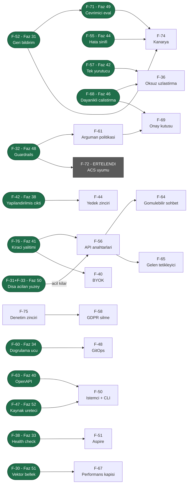

# UCUNCU-FAZ-ADAYLARI.md — Üçüncü Tur Aday Yetenekleri

> **Durum (2026-08-06): ÜÇ DALGA DA PLANLANDI; KALAN 20 KALEM SEÇİLMEDİ.**
> İkinci tur (Faz 8–30) [Faz 30](30-ARAYUZ-CILASI.md) ile kapandı. Dalga 1, 2
> ve 3'ün toplam **yirmi altı** kalemi [Faz 31–52](UCUNCU-FAZ-YOL-HARITASI.md)
> olarak plana dönüştü ve bölümleri **bu dosyadan silindi**. Kalan kalemler
> için seçim yapılmadan faz dokümanı yazılmaz.
>
> 🚨 **F-72 (ACS uyumu) Dalga 3'e seçildi ama ölçüm sonucu ERTELENDİ** ve bu
> listede kaldı. Bölümü artık **ölçülmüş kanıt** taşıyor; sonraki oturum
> ölçümü tekrarlamak zorunda değildir.
>
> Bu belge 2026-08-05 tarihli ilk aday listesinin **yerini alır**. Ayrı bir
> aday listesi dosyası açılmaz; iki yerde tutmak kayma üretir. Eski sürümün
> tarihsel değeri "hangi iddia yanlış çıktı" bilgisidir ve o bilgi aşağıdaki
> [Yeniden Yargı](#yeniden-yargı-2026-08-06) bölümünde durur. Eski metnin
> tamamı git geçmişindedir; arşive kopya alınmadı.
>
> **Okuma notu — bu dosya baştan sona okunmaz.** Seçim yaparken önce
> [Bu Turda Neyin Değiştiği](#bu-turda-neyin-değiştiği), sonra
> [Önerilen Sıralama](#önerilen-sıralama--üç-dalga) okunur. Tek bir kalemin
> ayrıntısı için `grep -n "F-68" docs/UCUNCU-FAZ-ADAYLARI.md` yeterlidir.
> Bir kalem faz dokümanına dönüştürüldüğünde ilgili bölüm buradan **silinir**
> ve faz dokümanına taşınır.

---

## Plana Dönüşenler (2026-08-06)

Aşağıdaki **yirmi altı** kalemin bölümü bu dosyadan **silindi**. Ayrıntı artık
faz dokümanındadır; bu tablo yalnız yönlendirmedir.

### Dalga 1 → Faz 31–37

| Kalem | Faz |
|---|---|
| **F-35** Çalıştırma iptali | [Faz 32](32-CALISTIRMA-IPTALI.md) |
| **F-38** ASP.NET Core `IHealthCheck` | [Faz 33](33-SAGLIK-DENETIMI-VE-TESHIS.md) |
| **F-49** `dotnet new` şablon paketi | [Faz 37](37-PROJE-SABLONU.md) |
| **F-52** Geri bildirim ve puanlama | [Faz 31](31-GERI-BILDIRIM-VE-PUANLAMA.md) |
| **F-60** Tanım doğrulama ucu | [Faz 34](34-TANIM-DOGRULAMA-UCU.md) |
| **F-62** Yapılandırma teşhisi | [Faz 33](33-SAGLIK-DENETIMI-VE-TESHIS.md) |
| **F-70** Maliyet ve kota OTel metrikleri | [Faz 35](35-MALIYET-VE-KOTA-METRIKLERI.md) |
| **F-73** Saklama `MaxRows` uygulaması | [Faz 36](36-SAKLAMA-HACIM-SINIRI.md) |

### Dalga 2 → Faz 38–45

| Kalem | Faz |
|---|---|
| **F-37** `Idempotency-Key` desteği | [Faz 43](43-IDEMPOTENCY-KEY.md) |
| **F-42** Yapılandırılmış çıktı (JSON şeması) | [Faz 38](38-YAPILANDIRILMIS-CIKTI.md) |
| **F-46** `AgentPrism.Testing` paketi | [Faz 39](39-TEST-PAKETI.md) |
| **F-53** Üretimden eval kümesi toplama | [Faz 45](45-URETIMDEN-EVAL-KUMESI.md) |
| **F-55** Hata sınıflandırma ve arıza kümeleme | [Faz 44](44-HATA-SINIFLANDIRMA.md) |
| **F-57** Tek yürütücü seçimi | [Faz 42](42-TEK-YURUTUCU-SECIMI.md) |
| **F-63** OpenAPI yayını | [Faz 40](40-OPENAPI-YAYINI.md) |
| **F-76** Kiracı yalıtımının zorlanması | [Faz 41](41-KIRACI-YALITIMININ-ZORLANMASI.md) |

### Dalga 3 → Faz 46–52

| Kalem | Faz |
|---|---|
| **F-30** Vektör bellek ve RAG | [Faz 51](51-VEKTOR-BELLEK-VE-RAG.md) |
| **F-31** AgentPrism'in MCP sunucusu olması | [Faz 50](50-DISA-ACILAN-AGENT-YUZEYI.md) |
| **F-32** Guardrails | [Faz 48](48-GUARDRAILS.md) |
| **F-33** A2A protokolü | [Faz 50](50-DISA-ACILAN-AGENT-YUZEYI.md) |
| **F-47** Kaynak üreteci | [Faz 52](52-KAYNAK-URETECI.md) |
| **F-54** Yeniden oynatma | [Faz 47](47-YENIDEN-OYNATMA-VE-DALLANDIRMA.md) |
| **F-66** Konuşma dallandırma | [Faz 47](47-YENIDEN-OYNATMA-VE-DALLANDIRMA.md) |
| **F-68** Dayanıklı çalıştırma (F-39 içinde) | [Faz 46](46-DAYANIKLI-CALISTIRMA.md) |
| **F-71** Çevrimiçi değerlendirme | [Faz 49](49-CEVRIMICI-DEGERLENDIRME.md) |

🚨 **F-63'ün kapsamı daraldı.** Kalem "TypeScript istemci paketi **ve** OpenAPI
yayını" idi; [Faz 40](40-OPENAPI-YAYINI.md) yalnız **belgeyi** kapsar.
TypeScript/npm yayını ayrı bir dağıtım kanalıdır ve yeni bir aday kalemidir.

🚨 **F-72 seçildi ama plana dönüşmedi.** Bölümü aşağıda duruyor ve artık
ölçülmüş kanıt taşıyor.

Planlama sırasında **on beş kanıt düzeltildi** (Dalga 1–2'de yedi, Dalga 3'te
sekiz); ayrıntı [`UCUNCU-FAZ-YOL-HARITASI.md`](UCUNCU-FAZ-YOL-HARITASI.md)
içindedir.

---

## Bu Turda Neyin Değiştiği

| Ne | Sonuç |
|---|---|
| Bu listede kalan kalem | **20** — üç dalganın yirmi altı ID'si plana dönüştü ve bölümleri silindi |
| Plana dönüşen | **26** — Dalga 1: F-35, F-38, F-49, F-52, F-60, F-62, F-70, F-73 → Faz 31–37 · Dalga 2: F-37, F-42, F-46, F-53, F-55, F-57, F-63, F-76 → Faz 38–45 · Dalga 3: F-30, F-31, F-32, F-33, F-47, F-54, F-66, F-68, F-71 → Faz 46–52 (F-39 F-68'in içinde) |
| İptal edilen | **1** — F-43, çünkü tamamlandı |
| Seçildi ama **ertelendi** | **1** — F-72; ölçüm erteleme getirdi ve kanıt bölümüne yazıldı |
| Kanıtı düzeltilen | **19** — Dalga 1–2'de 11, Dalga 3'te 8. Kalemler ayakta, gerekçeler değişti |
| Yükseltilen | **7** — F-30, F-32, F-33, F-44, F-52, F-53, F-54 |
| Tek faza birleşen | **3 çift** — F-31+F-33, F-54+F-66, F-68 F-39'u yutar |
| Kapsamı daraltılan | **2** — F-63 (TypeScript/npm çıkarıldı) · F-30 (yalnız PostgreSQL) |
| Aciliyeti **artan** | **4** — F-36, F-56, F-69, F-74; hepsi Dalga 3'ün çıktısına bağlı |

**ID'ler sabittir.** F-35 her zaman "çalıştırma iptali"dir — kalem plana
dönüşse bile ID yeniden kullanılmaz. Yeni kalemler F-77'den devam eder. Sabit
ID olmadan sonraki oturumun referansları kaybolur.

**Kod kanıtları 2026-08-06'da bu depo üzerinde `grep` ile yeniden
doğrulandı.** Depo ilerledikçe satır numaraları kayar. Bir kanıtı
kullanmadan önce yeniden ölç.

---

## Değerlendirme Ölçütleri

Dört temel soru korunur:

| Ölçüt | Soru |
|-------|------|
| **Değer** | Bu olmadan AgentPrism'i kim kullanamaz? |
| **Maliyet** | Kaç paket, kaç yeni public tip, kaç migration? |
| **Risk** | Bir tasarım kuralını (K1–K4) zorluyor mu? Bundle bütçesini? |
| **Hazırlık** | MAF veya .NET ekosisteminde hazır mı, sıfırdan mı? |

### Sekiz mercek

Bir fikir yalnız bir mercekten iyi görünüyorsa zayıftır. Her kalemin
**Mercek** satırı destekleyen mercekleri numarayla sayar.

| # | Mercek | Sorusu |
|---|--------|--------|
| 1 | **Benimseme** | İlk agent'a kadar geçen süreyi kısaltır mı? |
| 2 | **Üretim işletimi** | Gece 03:00'te nöbetçi mühendisin işine yarar mı? |
| 3 | **Kurumsal satın alma** | Hangi kurumsal kapıyı açar? |
| 4 | **Performans ve AOT** | Sıcak yolda tahsis üretir mi? AOT duruşunu bozar mı? |
| 5 | **API ergonomisi** | Yanlış kullanım derlemede yakalanır mı? Sonradan eklemek kırıcı mı? |
| 6 | **Ekosistem yerleşimi** | Aspire, OTel, MCP, A2A, DI ile doğal mı oturuyor? |
| 7 | **Ölçme–iyileştirme** | Üretim verisini geliştirmeye geri besler mi? |
| 8 | **Maliyet (FinOps)** | Tüketicinin model faturasını düşürür mü? |

---

## Yeniden Yargı (2026-08-06)

### İptal — tamamlandı

| Kalem | Kanıt |
|---|---|
| **F-43** Sağlayıcıya özgü ayar torbası | `ModelBinding.ProviderSettings` sözleşmede yaşıyor: [`ModelBinding.cs:70`](../src/AgentPrism.Abstractions/Agents/ModelBinding.cs). Karar K-208. Bilinmeyen anahtar derleme hatasıdır — istenen davranış birebir uygulanmış. Eski liste bunu "Faz 26 isteyecek" diye yazmıştı; Faz 26 bitti ve isteği karşıladı |

### Kanıtı yanlışlanan — kalem ayakta, gerekçe değişti

| Kalem | Eski iddia | 2026-08-06 ölçümü |
|---|---|---|
| **F-35** Çalıştırma iptali | "`RunStatus.Canceled` tanımlı ama hiçbir kod yazmıyor" | **Yanlış.** Üç yer yazıyor: [`RunRecordingAgent.cs:186`](../src/AgentPrism.Core/Recording/RunRecordingAgent.cs), aynı dosya `:251` ve [`WorkflowRunner.cs:463`](../src/AgentPrism.Workflows/Internal/WorkflowRunner.cs). Gerçek delik başkadır ve aşağıda yazılıdır |
| **F-57** Çok örnekli koordinasyon | "Faz 17 bu olmadan yapılırsa her cron N kez tetiklenir" | **Yanlış.** [`0008_scheduling.sql:46`](../src/AgentPrism.PostgreSql/Migrations/0008_scheduling.sql) `jobs_schedule_scheduled_uq UNIQUE (schedule_id, scheduled_for)` kısıtını taşıyor (K-138). Cron çift tetiklemesi zaten kapalı. Kalemin aciliyeti düştü, kapsamı daraldı |

### Yükseltilenler

| Kalem | Neden yükseldi |
|---|---|
| **F-30** Vektör bellek | Yeni kanıt: kalıcı depo geldi ama arama hâlâ regex **ve** O(n). `SqlAgentFileStore.SearchAsync` her çağrıda tüm dosyaları belleğe alıyor |
| **F-32** Guardrails | Microsoft 2026-06-02'de **Agent Control Specification**'ı yayımladı. İş artık "kendi filtremizi yaz" değil, "bir standarda otur" |
| **F-33** A2A | `Microsoft.Agents.AI.A2A` ve `Microsoft.Agents.AI.Hosting.A2A` paketleri **var**. "Elle uygulamak pahalı" gerekçesi düştü |
| **F-44** Model yedek zinciri | LiteLLM ve Portkey'de temel yetenek. .NET'te karşılığı yok |
| **F-52** Geri bildirim | Önkoşulsuz, tek tablo, ölçme döngüsünün ilk halkası |
| **F-53** Üretimden eval kümesi | Faz 18 bitti. Bu artık "önce yapılmalı" değil, **eksik yarısı** |
| **F-54** Yeniden oynatma | LangGraph 1.2'nin "time travel"i fiilî standart oldu |

### Birleşmeler

| Birleşen | Nasıl |
|---|---|
| **F-31 + F-33** | Tek faz: "dışa açılan agent yüzeyi". İkisi de aynı altyapıyı ister — kimlik doğrulama, kiracı çözümleme, derinlik ve bütçe sınırı, onay sınırı. Protokoller iki ince adaptördür. İki ID korunur |
| **F-54 + F-66** | Tek faz. İkisi de "kayıtlı bir noktadan dallanma"dır; `conversation_items` append-only olduğu için ikisi de aynı dal işaretçisini ister |
| **F-39 → F-68** | F-39 (`202 Accepted`) dayanıklı çalıştırmanın **HTTP yüzüdür**. Ayrı kalem tutmak sözleşmeyi motordan koparır. F-39 ID'si F-68'in içinde yaşar |

---

## A. Kontrol düzlemi çekirdeği — işletim

### F-36 · Öksüz çalıştırma uzlaştırması 🔥

**Sorun:** Süreç düşerse `runs` satırı sonsuza dek `Running` kalır. Arayüzde
asla bitmeyen çalıştırmalar birikir ve `RunStatistics.settled` hesabı
([`RunStatistics.cs:116`](../src/AgentPrism.Abstractions/Runs/RunStatistics.cs))
bozulur.
**Kapsam:** Çalıştırma kirası — `runs`'a heartbeat sütunu, açılışta ve
aralıklarla uzlaştırma. Süresi geçmiş `Running` satırlar `Failed` olarak
kapanır ve nedeni yazılır. Bir migration.
**Değer:** Gösterge paneli doğru sayıyı gösterir. Kota hesabı sızmaz.
**Mercek:** 2, 7.
**Hazırlık:** Kira deseni `jobs` tablosunda zaten var; aynı desen kopyalanır.
**Maliyet:** Düşük.
**Risk:** Kira süresi yanlış seçilirse çalışan bir işi ölü ilan eder. F-68
yapılırsa uzlaştırma "öldür" değil "devam ettir" olur — sıralama önemlidir.
**Bağımlılık:** F-57'den sonra ([Faz 42](42-TEK-YURUTUCU-SECIMI.md) — tek
yürütücü uzlaştırsın; `ISingletonLeaseStore` oradan gelir) **ve**
[Faz 46](46-DAYANIKLI-CALISTIRMA.md)'dan sonra.
🚨 **Aciliyeti arttı:** Faz 46 öksüz `Running` satırı **üretir** ve o fazın
devir notu bu kalemi işaret ediyor. Faz 46'dan önce yapılırsa iki kez yazılır.
**Ekosistem:** Temporal ve Inngest'te "workflow lease" adıyla standarttır.

### F-69 · Onay kutusu — asenkron onay **YENİ**

**Sorun:** Tool onayı yalnız **aynı istemcinin bir sonraki turunda**
verilebilir. Uç, gövdede `approvals` alanını bekler
([`AgentEndpoints.cs:311`](../src/AgentPrism.AspNetCore/Endpoints/AgentEndpoints.cs))
ve kararı `ToolApprovalResolver` çözer (aynı dosya `:500`). Bekleyen onaylar
için **depo yok**, `GET /api/approvals/pending` **yok**. Bir arka uç
`/v1/responses` üzerinden çalıştırma başlatırsa, o çalıştırmanın onayını
operatör konsoldan veremez — onay isteği o istemcinin yanıtında kalır.
**Kapsam:** `pending_approvals` tablosu, `GET /api/approvals/pending`,
`POST /api/approvals/{id}/decide`, arayüzde bir onay kutusu ekranı, Faz 21'in
webhook'uyla bildirim. Bir migration.
**Değer:** Onay akışı bugün yalnız Playground'da işe yarıyor. Bu kalem onu
**üretim yeteneği** yapar.
**Mercek:** 2, 3.
**Hazırlık:** MAF'ın `ToolApprovalRequestContent` / `ToolApprovalResponseContent`
çifti hazır; eksik olan kalıcılık ve ikinci kanal.
**Maliyet:** Orta. Arayüz payı **ölçülmeli** — tek ekran, tahminî 3–5 KB gzip.
**Risk:** Onay kararı bir güvenlik kararıdır; rol denetimi Faz 9'un
`AgentPrismPolicies` yapısıyla aynı olmalıdır. Bekleyen onayın süre sonu
olmalıdır.
**Bağımlılık:** [Faz 46](46-DAYANIKLI-CALISTIRMA.md)'dan sonra.
🚨 **Aciliyeti arttı:** kuyrukta koşan bir çalıştırma onay isterse **kimse
cevap veremez** — kuyrukta bir istemci yoktur. Faz 46 bu kalemi bir kolaylıktan
**eksiğe** çevirdi.
**Ekosistem:** LangGraph `interrupt()` + Studio onay kuyruğu; Mastra
`suspend`/`resume`.

## B. Model yüzeyi ve yönlendirme

### F-44 · Model yedek zinciri ve yönlendirme 🔥

**Sorun:** Faz 8 devre kesiciyi verdi — yarısı. Eksik yarı: "sağlayıcı A
kesikse B'ye geç". Bugün devre açılınca çalıştırma yalnız **hata veriyor**
([`ModelProviderRegistry.cs:100-109`](../src/AgentPrism.Core/Models/ModelProviderRegistry.cs)).
Giden trafikte eşzamanlılık sınırı da yok; 429 fırtınasına karşı savunma
yalnız devre kesicidir.
**Kapsam:** `ModelBinding.Fallbacks` (sıralı liste) + sağlayıcı başına giden
eşzamanlılık sınırı. Entegrasyon noktası tektir:
`ModelProviderRegistry.CreateChatClient` — Faz 8 zaten oraya dokundu.
**Değer:** Sağlayıcı kesintisi tüketicinin hizmetini durdurmaz.
**Mercek:** 2, 3, 8.
**Hazırlık:** Tek entegrasyon noktası hazır. `VoiceConnectionLimiter` (Faz 29)
eşzamanlılık sayacı için kullanılabilir bir desen taşıyor.
**Maliyet:** Düşük-orta.
**Risk:** Yedek model **farklı fiyatlıdır**. Faz 20'nin maliyet raporu hangi
modelin çalıştığını yazmalıdır — `RunStatistics.ByModel` zaten var. Yedek
varsayılan **kapalı** gelir (K1). Sessiz model değişimi bir sürprizdir;
çalıştırma kaydına açık bir olay yazılmalıdır.
**Bağımlılık:** F-42 ile aynı sözleşmeye (`ModelBinding`) dokunur.
[Faz 38](38-YAPILANDIRILMIS-CIKTI.md) planlandı; devir notu bu kalemin
ekleyeceği `Fallbacks` alanının nasıl oturacağını yazacaktır.
**Ekosistem:** LiteLLM ve Portkey'de temel yetenek: model başına yedek, bütçe
aşımında yedek, otomatik devir. **.NET'te açık kaynak bir karşılığı yok.**

### F-59 · Ön uçuş bütçe denetimi ve bağlam penceresi koruması 🔥

**Sorun:** `ModelDescriptor.ContextWindowTokens`
([`ModelDescriptor.cs:13`](../src/AgentPrism.Abstractions/Models/ModelDescriptor.cs))
**tanımlı ama hiç okunmuyor.** Dört sağlayıcı paketi onu yapılandırmadan
*yazıyor* (`OpenAIProviderExtensions.cs:204`, `AnthropicProviderExtensions.cs:176`,
`GoogleProviderExtensions.cs:172`, `AzureOpenAIProviderExtensions.cs:197`), hiçbir
kod *okumuyor*. Kullanıcı aynı sayıyı `HarnessSettings.MaxContextWindowTokens`
ve `CompactionSettings.MaxContextWindowTokens` alanlarına elle yazıyor. Yanlış
yazarsa hata sağlayıcıdan gelir.
**Kapsam:** Model üstverisinden varsayılan türetme, çağrı öncesi token sayımı,
aşımda erken ve anlaşılır red. `POST /api/agents/{name}/estimate` ucu.
**Değer:** Kota (Faz 21) ve ağaç bütçesi (Faz 12) bu sayıyı **zaten** istiyor;
ikisi de çağrıdan sonra ölçüyor. Ön uçuş denetimi para harcanmadan reddeder.
**Mercek:** 2, 5, 8.
**Hazırlık:** Tokenizer `Microsoft.ML.Tokenizers` üzerinden geçişli
bağımlılıkta hazır (K-104) — Faz 13'te gerçek çalıştırmayla doğrulandı.
**Maliyet:** Düşük.
**Risk:** Token sayımı yaklaşıktır. Erken red yanlış olursa çalışan bir agent
durur; eşik gevşek tutulmalı ve varsayılan **kapalı** gelmelidir.
**Bağımlılık:** Yok. Bugün yapılabilir.
**Ekosistem:** LiteLLM `max_input_tokens` denetimi yapar.

### F-40 · Kiracı başına sağlayıcı anahtarı (BYOK)

**Sorun:** Sağlayıcı anahtarı global yapılandırmadadır. Tüm kiracılar aynı
faturayı paylaşır. Çok kiracılı SaaS için kabul edilemez.
**Kapsam:** Kiracı kaydında **yapılandırma anahtarının adı** durur, değer
çalışma anında `IConfiguration`'dan çözülür. Sır veritabanına yazılmaz.
**Değer:** Kiracı kendi faturasını taşır.
**Mercek:** 3, 8.
**Hazırlık:** K-059 deseni birebir uygulanabilir — MCP kimlik doğrulamasında
zaten kullanılıyor.
**Maliyet:** Orta. `ModelProviderRegistry` kiracı farkındalığı kazanır;
`CreateChatClient` bugün kiracıyı bilmiyor.
**Risk:** `CompiledAgentCache` anahtarı kiracı içermelidir, yoksa bir kiracının
istemcisi diğerine sızar. Bu **gerçek bir güvenlik riskidir** ve testle
kapatılmalıdır.
**Bağımlılık:** F-56 ile aynı kiracı modeline dokunur.
**Ekosistem:** LiteLLM'in "virtual keys" kavramının giden yarısı.

### F-45 · Yanıt önbelleği

**Sorun:** Aynı soru iki kez sorulursa iki kez ödenir. Önbellek yok.
**Kapsam:** `DistributedCachingChatClient` boru hattına takılır.
**Değer:** Deterministik iş yüklerinde fatura düşer.
**Mercek:** 8.
**Hazırlık:** `Microsoft.Extensions.AI` içinde `DistributedCachingChatClient`
hazır **görünüyor** — **doğrulanmadı, `maf-api-kesfi` ile ölçülmeli.**
**Maliyet:** Düşük.
**Risk:** Varsayılan **kapalı**. Agent'ın aynı soruya farklı yanıt vermesi
beklenen davranıştır; önbellek bunu bozar. Kiracı yalıtımı önbellek
anahtarında olmalıdır.
**Bağımlılık:** Yok.
**Ekosistem:** LiteLLM ve Portkey'de standart. Anthropic'in prompt caching'i
ayrı bir kavramdır ve Faz 26'da zaten var.

---

## C. Güvenlik, yönetişim ve uyum

### F-72 · Agent Control Specification (ACS) uyumu — ÖLÇÜLDÜ, ERTELENDİ (2026-08-06)

> **Dalga 3'e seçildi, plana dönüşmedi.** Kullanıcı kararı: ertelensin.
> Aşağıdaki kanıt **ölçülmüştür**; sonraki oturum ölçümü tekrarlamak zorunda
> değildir, yalnız tarihini denetler.

**Sorun:** AgentPrism bir kontrol düzlemidir ama kontrol kuralları **kendi
biçiminde** yaşar: onay kuralları `tool_approval_rules`, kota `quotas`, rol
politikaları kodda. Microsoft 2026-06-02'de bunun için açık bir standart
yayımladı.
**Kapsam:** ACS bildirimini okuyan bir politika değerlendirici; kesişim
noktalarının AgentPrism dekoratör zincirine eşlenmesi (kayıt 0 → telemetri 10
→ onay 20 zinciri hazır yuvadır).
**Değer:** Kurumsal alıcı "hangi standarda uyuyorsunuz" diye sorar. Bugün
cevap "kendi modelimiz"dir.
**Mercek:** 3, 6.

**Hazırlık — 🚨 ÖLÇÜLDÜ (2026-08-06):**

| Ölçüm | Sonuç |
|---|---|
| Spesifikasyon sürümü | **0.3.1-beta**, durum **Draft**. Belge kendisi yazıyor: *"the contract MAY change in breaking ways between minor versions"* |
| Sekiz kesişim noktası | ✅ Doğrulandı: `agent_startup`, `input`, `pre_model_call`, `post_model_call`, `pre_tool_call`, `post_tool_call`, `output`, `agent_shutdown` |
| Beş karar | ✅ `allow`, `warn`, `deny`, `escalate`, `transform` |
| .NET paketi | ✅ **Var:** `AgentControlSpecification` `0.3.1-beta.1`, yazar **Microsoft**, MIT, imzalı, `projectUrl = github.com/microsoft/agent-governance-toolkit` |
| Geçişli yönetilen bağımlılık | ✅ **0** (sıfır) — restore ile ölçüldü |
| Public tip sayısı | 66. `AgentControlAgentFrameworkRunMiddleware<,>`, `AgentControlDelegatingChatClient<,>`, `AgentControlMcpToolProvider<,>`, `ApprovalResolver`, `NativeAgentControlRuntime` dahil |
| 🚨 **Uygulama biçimi** | **Native P/Invoke.** `lib/net8.0/AgentControlSpecification.dll` yalnız ince bir sarmalayıcıdır; iş `libagent_control_specification_core` (Rust) içindedir |
| 🚨 **Taşınan RID'ler** | **Beş:** `linux-x64`, `linux-arm64`, `osx-x64`, `osx-arm64`, `win-x64`. **`win-arm64` YOK. `linux-musl` (Alpine) YOK** |
| 🚨 NuGet arama indeksi | Paket `azuresearch` sorgusunda **görünmüyor** (unlisted veya indekslenmemiş) |
| İkinci paket | `Microsoft.AgentGovernance` 5.0.0 — GA görünümlü, 33 318 indirme, 2 geçişli paket (`YamlDotNet`). ACS'nin **üst çerçevesi**, spesifikasyon paketi değil |

🚨 **"MAF adaptörü hazır" iddiası yarım doğrudur.**
`AgentControlAgentFrameworkRunMiddleware<TInput,TOutput>` **MAF tipi almaz** —
ACS'nin kendi `IAgentControlAgentInvocationContext<TInput,TOutput>` arayüzünü
alır. Adaptör bir **şekildir**, hazır bir köprü değil; AgentPrism yine de
`AIAgent` → o arayüz dönüşümünü yazmak zorundadır.

**Maliyet:** Uygulama **düşük-orta** (adaptör şekilleri hazır). **Bağımlılık
riski yüksek** — asıl maliyet buradadır.

**Risk:** 🚨 Native bir bağımlılık bir NuGet **kütüphanesi** için ağır bir
taahhüttür: Alpine tabanlı bir konteynerde veya Windows ARM64'te tüketicinin
uygulaması **çalışmaz**. Standart beta ve kırıcı değişebileceğini kendisi
yazıyor.
**Erteleme gerekçesi (kullanıcı kararı, 2026-08-06):** K-212'nin (Foundry)
deseni — ağırlık değil, **olgunluk ve doğrulanabilirlik**.
**Yeniden açılma koşulu:** ACS **GA** olduğunda; ya da spesifikasyon yönetilen
bir uygulamaya kavuştuğunda. Alınırsa **ayrı bir paket** olmalıdır
(`AgentPrism.AgentControl`), K-185/K-209/K-212 deseniyle — native ağırlık
yalnız isteyen tüketiciye bulaşmalıdır.
**Bağımlılık:** [Faz 48](48-GUARDRAILS.md)'in `IContentGuard`'ı ACS'nin
`input`/`output` kesişim noktalarına eşlenir. `pre_tool_call`/`post_tool_call`
Faz 48'de **kapsanmadı** ve F-61 ile birlikte düşünülmelidir.
**Ekosistem:** Microsoft'un kendi standardı; Apache 2.0, topluluk yönetimli.
Kaynak: [spesifikasyon](https://microsoft.github.io/agent-governance-toolkit/packages/agent-control-specification/) ·
[normatif metin](https://github.com/microsoft/agent-governance-toolkit/blob/main/policy-engine/spec/SPECIFICATION.md)

### F-56 · Kiracı bazlı API anahtarları ve kapsamlar 🔥

**Sorun:** Gelen kimlik doğrulaması **tek statik token**'dır.
[`AgentPrismEndpointFilter.cs:21-22`](../src/AgentPrism.AspNetCore/Security/AgentPrismEndpointFilter.cs)
tek bir `_authToken` alanı taşır ve onu kurulum anında okur. Anahtar döndürme
yok, iptal yok, son kullanım damgası yok, kiracıya bağlanma yok.
**Kapsam:** `api_keys` tablosu — hash saklanır, ham değer bir kez gösterilir;
kiracı bağı; kapsam (`runs:write`, `agents:admin`); süre sonu; iptal; son
kullanım damgası. Faz 9'un rol politikalarıyla birleşir. Bir migration.
**Değer:** F-40 **giden** anahtarları çözüyordu; bu **gelen** kimliktir ve çok
kiracılı kurulumda ondan kritiktir. Bugün bir kiracıya kendi anahtarını
veremezsiniz.
**Mercek:** 3.
**Hazırlık:** Sıfırdan; desen iyi bilinir.
**Maliyet:** Orta.
**Risk:** Faz 9'un `AgentPrismPolicies` yapısı korunmalıdır. Bu onun
**alternatifi değil**, ikinci bir kimlik kaynağıdır. Anahtar karşılaştırması
sabit zamanlı olmalıdır — mevcut kod bunu zaten yapıyor.
**Bağımlılık:** F-40 ile aynı kiracı modeline dokunur.
🚨 **Aciliyeti arttı:** [Faz 50](50-DISA-ACILAN-AGENT-YUZEYI.md) bir **dış
yüzey** açtı (MCP sunucusu, A2A) ve onu bu tek statik token koruyor. O faz
geçici bir savunma koydu — `AllowRemoteAccess` ile dış yüzey birlikte
açılamıyor. Kilidin kalkması bu kaleme bağlıdır.
**Ekosistem:** LiteLLM'in "virtual keys" yeteneğinin gelen yarısı: anahtar
başına bütçe, hız sınırı ve kapsam.

### F-75 · Denetim izi değişmezliği (hash zinciri) **YENİ**

**Sorun:** `audit_log` append-only **ruhla** yazılır ama **teknik olarak
değişmez değildir.** Migration'larda hash zinciri veya imza yok. Veritabanına
yazma yetkisi olan biri geçmişi sessizce düzenleyebilir. Bir denetçi bunu
sorar.
**Kapsam:** Satır başına `prev_hash` + `hash` sütunu, açılışta ve istek
üzerine zincir doğrulaması, `GET /api/audit/verify`. Bir migration.
**Değer:** Denetlenebilirlik iddiası kanıtlanabilir olur.
**Mercek:** 3.
**Hazırlık:** SHA-256 hazır. `TraceSpanIdentity` deposunda benzer bir türetme
deseni zaten var.
**Maliyet:** Düşük.
**Risk:** Zincir **yazma sırasına** bağlıdır; eşzamanlı yazımda sıralama
gerekir. Denetim kaydı yazımı bugün hata yutuyor (`AuditRecorder`) — hash
zinciri bunu zorlaştırır. Yavaşlama **ölçülmeli**.
**Bağımlılık:** F-58 ile çatışır — silme hakkı ile değişmezlik aynı tabloda
buluşur. İkisi **birlikte** tasarlanmalıdır.
**Ekosistem:** AWS CloudTrail ve GCP Cloud Audit Logs bunu yapar.

### F-76 · Paylaşılan SQL kaynağının XML doküman çakışması (`AddOpenApi()` ile 500) **YENİ** — ÖLÇÜLDÜ (2026-08-06)

**Sorun:** `AgentPrism.Sql.Shared` bir paket değildir; kaynağı
`<Compile Include="../AgentPrism.Sql.Shared/**/*.cs" LinkBase="Shared" />` ile
üç ayrı derlemeye (`AgentPrism.SqlServer`, `AgentPrism.Sqlite`,
`AgentPrism.PostgreSql`) bağlanır (Faz 23, K-185 deseni). `MigrationRunner`,
`SqlStoreContext` gibi tipler bu üç derlemenin **her birinde aynı tam
nitelikli adla** (`T:AgentPrism.MigrationRunner`) üretilen `.xml` doküman
dosyasına yazılır. `Microsoft.AspNetCore.OpenApi`'nin XML yorum kaynak
üreteci tüm referanslı derlemelerin doküman girdilerini **tek bir sözlükte**
(doküman kimliğine göre, derlemeden bağımsız) toplar; iki derleme aynı
kimlikle geldiğinde `ArgumentException: An item with the same key has already
been added` fırlatır ve `/openapi/v1.json` isteği **500** döner.
**Kanıt (2026-08-06):** `samples/AgentPrism.Api` (SqlServer + Sqlite birlikte
referanslanmış, K-185 örneği için bilerek) üzerinde `AddOpenApi()` +
`MapOpenApi()` ilk kez uçtan uca denendi ve tekrarlandı. Yığın izi:
`OpenApiXmlCommentCache.GenerateCacheEntries()` →
`Dictionary<TKey,TValue>.Add`. `AgentPrism.AspNetCore.FunctionalTests` bunu
**yakalamaz** çünkü hiçbir SQL sağlayıcısına referans vermez — hata yalnız
2+ SQL sağlayıcısı **birlikte** yüklendiğinde ortaya çıkar.
**Kapsam:** Kesin çözüm üçünden biri: (a) çakışan shared-source tiplerin XML
doküman üretimini yalnız birinde bırakacak bir yapılandırma bulunması, (b)
`AgentPrism.Sql.Shared`'ın gerçek bir iç paket olarak derlenmesi (K-185'in
"paket değildir" kararını yeniden açar), (c) yukarı akış (`dotnet/aspnetcore`)
kaynak üreteci sorunu olarak bildirilip beklenmesi.
**Değer:** Faz 40'ın vaat ettiği "belge gerçek uygulamada üretilebilir"
iddiası, 2+ SQL sağlayıcısı birlikte kurulu **her** tüketici için bugün
yanlıştır — `samples/AgentPrism.Api` dahil.
**Mercek:** 3 (K-185'in kendisini etkiliyor).
**Hazırlık:** Kanıt tam; kök neden yığın izinden doğrulandı, tahmine
dayanmıyor.
**Maliyet:** Bilinmiyor — seçeneğe göre değişir; (a) düşük-orta, (b) K-185
kararının yeniden açılması, (c) AgentPrism'in kontrolü dışında.
**Risk:** Faz 40 kapsamının dışında bırakıldı (paket sınırı yalnız
`AgentPrism.AspNetCore`); `AgentPrism.AspNetCore`'un kendisi K-039 gereği
`Microsoft.AspNetCore.OpenApi`'ye zaten bağımlı değildir, dolayısıyla bu
kütüphanenin değil **tüketicinin OpenAPI kurulumunun** karşılaştığı bir
sorundur — ama K-185 deseninin (Sql.Shared linked-source) doğrudan sonucu
olduğu için AgentPrism'in kendi mimari kararı kaynaklıdır.
**Bağımlılık:** K-185 (paylaşılan SQL kaynağı deseni), Faz 40 (OpenAPI
yayını — bu tuzağı ortaya çıkaran faz).
**Ekosistem:** `dotnet/aspnetcore` kaynak üreteci sınırlaması; benzer
"linked-source çoklu derleme" deseni kullanan başka kütüphanelerde de
görülebilir.

### F-58 · Veri konusu silme ve ihracı (GDPR)

**Sorun:** Faz 25 **yaşa göre** temizliyor; **kişiye göre** silme yolu yok.
K-107 "özetlenen mesajlar silinmez" diyor — depo tüm hassas içeriği bilerek
biriktiriyor. Saklama uçları yalnız hedef bazlıdır (`/api/retention/{target}`).
**Kapsam:** Konu kimliğine göre arama, dışa aktarım, silme veya maskeleme.
**Değer:** AB'de kurumsal kapı.
**Mercek:** 3.
**Hazırlık:** Sıfırdan. Konu kimliğinin **nerede** yaşadığı bugün belirsiz —
`sessions` tablosunda kullanıcı kimliği yok.
**Maliyet:** Orta-yüksek.
**Risk:** 🚨 **Gerçek bir tasarım çatışması:** denetim izi değişmez olmalıdır
(F-75), veri konusu ise silme hakkına sahiptir. Silme işaretlemesi mi, alan
bazlı maskeleme mi? `KARARLAR.md`'ye yazılacak cinsten bir karardır ve
atlanamaz.
**Bağımlılık:** F-75 ile birlikte tasarlanır.
**Ekosistem:** Langfuse ve Braintrust'ta veri saklama ve silme birinci sınıf
yetenektir.

### F-41 · İçerik şifreleme (at-rest)

**Sorun:** `conversation_items` tam sohbet geçmişini açık saklıyor. Ekler
`attachments.content` sütununda `bytea` olarak açık duruyor
([`0006_attachments.sql:22`](../src/AgentPrism.PostgreSql/Migrations/0006_attachments.sql)).
**Kapsam:** `IContentProtector` genişleme noktası; varsayılan uygulama yok
(K4).
**Değer:** Regüle sektörlerde zorunlu.
**Mercek:** 3.
**Hazırlık:** .NET Data Protection API kullanılabilir.
**Maliyet:** Orta.
**Risk:** Şifreli sütun **aranamaz**. Konuşma araması ve saklama sorguları
etkilenir. Anahtar döndürme bir tasarım kararıdır.
**Bağımlılık:** F-58 ile aynı veriye dokunur.
**Ekosistem:** Genel veritabanı deseni; agent'a özgü değil.

### F-61 · Argüman düzeyinde tool politikası

**Sorun:** Onay kuralları **tool düzeyindedir**.
[`ToolApprovalRule.cs:41`](../src/AgentPrism.Abstractions/Approvals/ToolApprovalRule.cs)
yalnız `ArgumentsHash` taşır — bu **birebir aynı argüman** demektir, koşul
değil. `refund_order` ya hep onay ister ya hiç. Gerçek ihtiyaç "100 TL altı
otomatik, üstü onay" biçimindedir.
**Kapsam:** `ToolApprovalRule`'a argüman koşulu; izin verilen değer listesi ve
sayısal eşik.
**Değer:** Bugünkü kabalık onay yorgunluğu üretir. Kullanıcı her şeyi
onaylamayı öğrenir ve onay akışı değerini kaybeder.
**Mercek:** 2, 3.
**Hazırlık:** `ApprovalRequiredAIFunction` sarmalaması `ToolRegistry` içinde
tek kapıdır — yer hazır.
**Maliyet:** Düşük.
**Risk:** Koşul dili bir güvenlik yüzeyidir. **İfade değil**, yalnız
karşılaştırma desteklenmelidir. `ToolApprovalRule` public API'dir; alan
eklemek `record` olduğu için ek kurucu ister.
**Bağımlılık:** F-69 ile birlikte değerli.
🚨 [Faz 48](48-GUARDRAILS.md) içerik denetimini **model sınırına** koydu ve
tool **argümanı** denetimini bilerek kapsam dışı bıraktı. O boşluğun sahibi bu
kalemdir; Faz 48'in devir notu bunu yazıyor.
**Ekosistem:** ACS'nin (F-72) `pre_tool_call` kesişim noktası tam olarak bunu
tanımlar.

---

## D. Yetenek derinliği

### F-34 · Talimat şablonlama ve paylaşılan prompt kütüphanesi

**Sorun:** Faz 19 sürümlemeyi ve A/B'yi verdi; **içerik yeniden kullanımı**
eksik. On agent aynı "kurum kuralları" bloğunu kopyalıyorsa tek yerden
değiştirmenin yolu yok.
**Kapsam:** Değişkenli talimat (`{{tenant_name}}`), kısmi bloklar, agent
tanımında referans.
**Değer:** Talimat bakımı ölçeklenir.
**Mercek:** 1, 7.
**Hazırlık:** Sıfırdan; şablon motoru yazılmalı veya seçilmeli.
**Maliyet:** Orta.
**Risk:** 🚨 **Şablon dili bir güvenlik yüzeyidir.** İfade değil, yalnız
**değer yerleştirme** desteklenmelidir. Tam bir şablon motoru (Scriban gibi)
K2'nin ruhunu zorlar — arayüzden çalıştırılabilir ifade yazılamamalıdır.
**Bağımlılık:** Yok.
**Ekosistem:** Langfuse'un prompt yönetimi tam olarak budur: arayüzden
sürümle, kod aktif sürümü çeker. Braintrust ve Portkey'de de var.

---

## E. Ölçme–iyileştirme döngüsü

Bu grup birlikte "agent'ı ölçerek iyileştirme" döngüsünü kurar. Bugün döngü
**tek yönlüdür**: üretim veri üretir, hiçbiri geri beslenmez.

> **Döngünün beş halkası plana dönüştü:** F-52 geri bildirim
> ([Faz 31](31-GERI-BILDIRIM-VE-PUANLAMA.md)), F-55 hata sınıflandırma
> ([Faz 44](44-HATA-SINIFLANDIRMA.md)), F-53 üretimden eval kümesi
> ([Faz 45](45-URETIMDEN-EVAL-KUMESI.md)), F-54+F-66 yeniden oynatma
> ([Faz 47](47-YENIDEN-OYNATMA-VE-DALLANDIRMA.md)) ve F-71 çevrimiçi
> değerlendirme ([Faz 49](49-CEVRIMICI-DEGERLENDIRME.md)).
> 🚨 **Geriye tek kalem kaldı: F-74** ve önkoşullarının **tamamı** artık
> planlıdır.

### F-74 · Kanarya yayını ve otomatik geri alma **YENİ**

**Sorun:** Faz 19 A/B deneyini verdi ama **kimse sonuca göre karar vermiyor.**
[`ExperimentVariantResult.cs:32,63`](../src/AgentPrism.Abstractions/Experiments/ExperimentVariantResult.cs)
varyant başına `CanceledRuns` ve `settled` hesaplıyor; bu sayıları okuyup
deneyi durduran hiçbir kod yok. Trafik oranı sabittir; hata oranı patlarsa
deney kendiliğinden durmaz.
**Kapsam:** Deneye eşik kuralı (`hata oranı > X` veya `puan < Y` ise durdur),
kademeli trafik artırma, otomatik geri alma ve denetim kaydı.
**Değer:** Yeni bir talimat sürümü güvenle yayına alınır.
**Mercek:** 2, 7.
**Hazırlık:** `experiments` tablosu ve atama çözücü hazır. Karar mantığı
sıfırdan.
**Maliyet:** Orta.
**Risk:** Otomatik geri alma bir **otomatik eylemdir**. Varsayılan kapalı
olmalıdır ve her karar denetim izine yazılmalıdır. Az örnekte eşik gürültüye
tepki verir — asgari örnek sayısı zorunlu olmalıdır.
**Bağımlılık:** F-52 ([Faz 31](31-GERI-BILDIRIM-VE-PUANLAMA.md)), F-55
([Faz 44](44-HATA-SINIFLANDIRMA.md)) ve F-71
([Faz 49](49-CEVRIMICI-DEGERLENDIRME.md))'den sonra.
🚨 **Üç önkoşulun üçü de artık planlıdır; bu, listedeki en hazır kalemdir.**
Eşik mantığı [Faz 49](49-CEVRIMICI-DEGERLENDIRME.md)'un `MinSampleSize` +
pencere kuralını **aynen** kullanmalıdır — üçüncü bir eşik kuralı yazmak üç
yerde bakım demektir.
**Ekosistem:** Statsig ve LaunchDarkly'nin "guarded release" yeteneği; LLM
tarafında Braintrust "CI quality gates".

## F. Paket ailesi ve geliştirici deneyimi

### F-48 · GitOps: tanım dışa ve içe aktarımı

**Sorun:** Agent tanımı ya koddadır ya veritabanında. Bir ekip tanımlarını
git'te sürümlemek ve dev→prod terfi etmek isterse **yolu yok**.
**Kapsam:** JSON/YAML dışa aktarım, `--dry-run` ile fark gösterimi, içe
aktarımda sürüm geçmişi ve denetim izi korunur (Faz 9 hazır).
**Değer:** Dağıtım hattına girer. Faz 19'un arayüz diff'inden farklı iştir.
**Mercek:** 1, 3.
**Hazırlık:** `agent_definition_versions` ve `audit_log` hazır.
**Maliyet:** Orta.
**Risk:** İçe aktarım **üzerine yazar**. Çakışma çözümü bir karardır.
**Bağımlılık:** F-60 (doğrulama ucu) bunun CI adımıdır;
[Faz 34](34-TANIM-DOGRULAMA-UCU.md) tamamlandı (2026-08-06) — önkoşul hazır.
**Ekosistem:** Dify ve n8n dışa aktarımı verir. Langfuse prompt'ları API'den
yönetir.

### F-50 · Tipli yönetim istemcisi ve CLI

**Sorun:** Yönetim API'sini kod içinden çağırmanın tipli yolu yok. Migration
bugün açılışta uygulanıyor; CI/CD hattı ayrı bir migration adımı ister.
**Kapsam:** `AgentPrism.Client` (AOT uyumlu, kaynak üretilmiş JSON) +
`dotnet agentprism` global aracı: migration uygula, tanım dışa/içe aktar
(F-48), sağlık denetimi. CLI istemcinin ilk tüketicisidir.
**Değer:** Dağıtım hattı olgunlaşır.
**Mercek:** 1, 3.
**Hazırlık:** F-63'ün OpenAPI belgesi üretim kaynağıdır ve
[Faz 40](40-OPENAPI-YAYINI.md) olarak planlandı. 🚨 O faz **yalnız belgeyi**
kapsar; TypeScript istemcisi bu kalemin veya yeni bir kalemin işidir.
**Maliyet:** Orta.
**Risk:** İki yeni paket, K-007 gerekçesi ister. İstemci sözleşmesi sunucuyla
birlikte sürümlenmelidir.
**Bağımlılık:** F-63'ten sonra — [Faz 40](40-OPENAPI-YAYINI.md).
[Faz 52](52-KAYNAK-URETECI.md) bir üreteç altyapısı kurar; `AgentPrism.Client`'ın
kaynak üretilmiş JSON'u aynı projeyi kullanabilir ve **ikinci bir üreteç
projesi açılmamalıdır**.
**Ekosistem:** LiteLLM ve Langfuse CLI verir.

### F-51 · .NET Aspire entegrasyonu

**Sorun:** Aspire kurumsal .NET'in yeni varsayılan besteleme yoludur.
AgentPrism'in Aspire kaynağı yok.
**Kapsam:** PostgreSQL kaynağı, OTel bağlantısı ve panoya bağlantı hazır gelir.
**Değer:** Yerel geliştirme kurulumu tek komuta iner.
**Mercek:** 1, 6.
**Hazırlık:** Faz 6'nın telemetrisi zaten OTel;
`AgentPrismDiagnostics.ActivitySourceName` public.
**Maliyet:** Düşük.
**Risk:** Yeni paket (K-007). Aspire sürüm hızı yüksektir; bakım borcu üretir.
**Bağımlılık:** F-38 (health check) [Faz 33](33-SAGLIK-DENETIMI-VE-TESHIS.md) olarak
planlandı; o faz önce biterse Aspire panosu doğal çalışır.
**Ekosistem:** .NET'e özgü. Karşılığı Docker Compose'dur.

### F-67 · Performans regresyon kapısı

**Sorun:** Dört doğrulama kapısı **doğruluğu** koruyor; performans
korunmuyor. Depoda `BenchmarkDotNet` projesi yok (slnx'te 14 kaynak + 13 test
projesi var, benchmark yok).
**Kapsam:** BenchmarkDotNet + tahsis eşiği. İlk hedefler: `run_events` yazma
yolu, `AgentDefinitionCompiler` önbelleği ve `SqlAgentFileStore.SearchAsync`
yolu.
🚨 [Faz 51](51-VEKTOR-BELLEK-VE-RAG.md) o son yolu **düzeltiyor** ve
düzeltmenin "okunan satır sayısı" ölçümünü devir notuna yazıyor. O sayı bu
kalemin **başlangıç eşiğidir**.
**Değer:** Bir kütüphanede sıcak yolun tahsis bütçesi olmalıdır.
**Mercek:** 4.
**Hazırlık:** BenchmarkDotNet hazır.
**Maliyet:** Orta.
**Risk:** Benchmark CI'da gürültülüdür. Eşik geniş tutulmalı veya yalnız elle
koşulmalıdır. Beşinci bir kapı her fazı yavaşlatır — bu bir karardır.
**Bağımlılık:** Yok.
**Ekosistem:** Bu depoya **kültürel olarak uygundur**; dört kapı disiplini
zaten var.

---

## G. Dış tüketici yüzeyi

### F-64 · Gömülebilir sohbet bileşeni

**Sorun:** Arayüz **tam bir kontrol düzlemidir**. Tüketicinin kendi
uygulamasına koyacağı küçük bir sohbet kutusu yok.
**Kapsam:** Ayrı, küçük bir bundle. Hedef **<30 KB gzip**.
**Değer:** Tüketici son kullanıcıya agent açabilir.
**Mercek:** 1.
**Hazırlık:** Playground'un akış mantığı yeniden kullanılabilir.
**Maliyet:** Orta.
**Risk:** 🚨 **Bundle bütçesi ayrı tutulmalıdır.** Bugün kontrol düzlemi
151,3 KB / 250 KB kullanıyor, kalan pay ~99 KB. Sohbet bileşeni bu paya
**girmemelidir**; ayrı bir çıktı ve ayrı bir kapı ister. Kontrol düzlemi
bileşenleri bu pakete sızmamalıdır — sızarsa 30 KB hedefi tutmaz.
**Bağımlılık:** F-56 (API anahtarı) olmadan güvenli gömülemez — son
kullanıcının tarayıcısına yönetim token'ı konulamaz.
[Faz 46](46-DAYANIKLI-CALISTIRMA.md)'nın `202 Accepted` sözleşmesi uzun süren
bir sohbet için ikinci bir okuma yolu verir.
**Ekosistem:** Vercel AI SDK'nın `useChat` kancası ve Dify'ın gömülebilir
widget'ı.

### F-65 · Gelen tetikleyiciler

**Sorun:** Faz 21 **giden** webhook'u verdi. Tersi yok: dış bir olay (Slack
mesajı, e-posta, kuyruk) bir çalıştırma başlatamıyor.
**Kapsam:** İmzalı gelen webhook ucu, olay → agent eşlemesi, Faz 17'nin
kuyruğuna düşürme.
**Değer:** Agent olaya tepki verir; yalnız sorulunca konuşmaz.
**Mercek:** 1, 3.
**Hazırlık:** Faz 17'nin kuyruğu ve Faz 21'in imza doğrulayıcısı hazır —
`WebhookSigner` ters yönde de kullanılır.
**Maliyet:** Düşük.
**Risk:** Gelen uç **kimlik doğrulaması olmadan** açılamaz. Her kaynak için
ayrı sır gerekir ve K-059 deseni uygulanır.
**Bağımlılık:** F-56'dan sonra doğal.
**Ekosistem:** n8n ve Dify'ın ana ekseni. Inngest olay tabanlı tetiklemeyi
altyapı olarak satar.

---

## Ekosistem Boşluk Tablosu

"X'te standart, .NET'te yok." AgentPrism'in yankı uyandırma ihtimali en çok
buradadır.

Kalın yazılan kalemler **hâlâ bu listededir**; 📋 işaretliler plana dönüştü.

| Yetenek | Nerede standart | .NET durumu | Karşılık gelen kalem |
|---|---|---|---|
| Dayanıklı agent çalıştırması (crash-resume) | LangGraph 1.2 · Mastra `createDurableAgent` · Temporal · Inngest · Restate | **Yok** | F-68 → [Faz 46](46-DAYANIKLI-CALISTIRMA.md) 📋 |
| Kontrol noktasından geri sarma (time travel) | LangGraph · Arize playground | **Yok** | F-54 → [Faz 47](47-YENIDEN-OYNATMA-VE-DALLANDIRMA.md) 📋 |
| Üretim izinden tek tıkla eval vakası | Langfuse · Braintrust | **Var** | F-53 → [Faz 45](45-URETIMDEN-EVAL-KUMESI.md) ✅ |
| Üretim trafiğinde LLM-yargıç puanlama | Braintrust · Arize Phoenix · Langfuse | **Yok** | F-71 → [Faz 49](49-CEVRIMICI-DEGERLENDIRME.md) 📋 |
| Guardrail eklenti noktası | LiteLLM · Portkey · NeMo Guardrails · Guardrails AI | **Yok** | F-32 → [Faz 48](48-GUARDRAILS.md) 📋 |
| Agent'ı MCP tool'u olarak yayımlama | Dify · n8n · OpenAI AgentKit | **Yok** | F-31 → [Faz 50](50-DISA-ACILAN-AGENT-YUZEYI.md) 📋 |
| A2A ile satıcılar arası çağrı | Google A2A · sekiz satıcı kurulu | MAF paketi **var** (ön sürüm), kontrol düzlemi yok | F-33 → [Faz 50](50-DISA-ACILAN-AGENT-YUZEYI.md) 📋 |
| Vektör bellek ve RAG | LlamaIndex · LangChain | Semantic Kernel connector'ları var ama **yalnız ön sürüm** ve `Npgsql` 8'e bağlı | F-30 → [Faz 51](51-VEKTOR-BELLEK-VE-RAG.md) 📋 |
| Derleme anında tool doğrulama | — | **Yalnız .NET'te mümkün** | F-47 → [Faz 52](52-KAYNAK-URETECI.md) 📋 |
| Tipli yapılandırılmış çıktı | Pydantic AI · OpenAI · Instructor | **Yok** | F-42 → [Faz 38](38-YAPILANDIRILMIS-CIKTI.md) 📋 |
| Maliyet metriğinin Prometheus'a akması | LiteLLM | **Yok** | F-70 → [Faz 35](35-MALIYET-VE-KOTA-METRIKLERI.md) 📋 |
| **Model yedek zinciri ve yönlendirme** | LiteLLM · Portkey · Kong AI Gateway | **Yok** | **F-44** |
| **Sanal anahtar + anahtar başına bütçe** | LiteLLM · Portkey | **Yok** | **F-56** + F-40 (zemin: [Faz 41](41-KIRACI-YALITIMININ-ZORLANMASI.md) 📋) |
| **Prompt kütüphanesi ve şablon** | Langfuse · Braintrust · Portkey | Kısmen — sürümleme var (Faz 19), şablon yok | **F-34** |
| **Olay tabanlı agent tetikleme** | n8n · Dify · Inngest | **Yok** | **F-65** |
| **Taşınabilir çalışma anı politikası** | Microsoft ACS | .NET paketi **var** ama **beta ve native** (beş RID) | **F-72** ⏸ ertelendi |

🚨 **Dokuz boşluğun dokuzu plana girdi.** Kalan beş satır bu listenin
stratejik çekirdeğidir; ikisi kimlik (F-56, F-40), biri maliyet (F-44), biri
ergonomi (F-34), biri tetikleme (F-65).

**Neden kimse yapmamış?** Üç yanıt vardır ve hepsi AgentPrism'in lehinedir:

1. **Python ekosisteminde kontrol düzlemi ayrı bir üründür** (Langfuse,
   Braintrust). .NET'te tek bir NuGet ailesi hem çerçeveyi hem düzlemi
   verebilir.
2. **Dayanıklı çalıştırma Python'da ayrı altyapı ister** (Temporal, Inngest).
   .NET'te `IHostedService` + PostgreSQL kuyruğu **zaten kurulmuş** durumda.
3. **Derleme anı doğrulama Python'da imkânsızdır.** F-47 ve F-42 .NET'in
   ayrıcalığıdır.

**Kaynaklar:**
[LangGraph durable execution](https://docs.langchain.com/oss/python/langgraph/durable-execution) ·
[Mastra workflow runners](https://mastra.ai/docs/deployment/workflow-runners) ·
[Langfuse observability](https://langfuse.com/docs/observability/overview) ·
[Braintrust eval tools 2026](https://www.braintrust.dev/articles/best-ai-evaluation-tools-2026) ·
[LiteLLM AI Gateway](https://docs.litellm.ai/docs/simple_proxy) ·
[Agent Control Specification](https://microsoft.github.io/agent-governance-toolkit/packages/agent-control-specification/) ·
[A2A v1 in Microsoft Agent Framework](https://devblogs.microsoft.com/agent-framework/a2a-v1-is-here-cross-platform-agent-communication-in-microsoft-agent-framework-for-net/)

---

## Bilerek Önerilmeyenler

Değerlendirildi ve **alınmaması** önerildi. Reddin gerekçesi kabulün gerekçesi
kadar değerlidir.

| Kalem | Neden hayır |
|---|---|
| Arayüzden tool kodu yazma / no-code tool oluşturucu | K2'nin doğrudan ihlali. Güvenlik sınırıdır, gevşetilmez |
| OpenAI Assistants API uyumluluğu | OpenAI kendisi Responses API'ye taşıdı; ölü bir yüzeye maliyet |
| gRPC yönetim yüzeyi | HTTP + OpenAPI yeterli; ikinci yüzey iki kat bakım |
| Çoklu model konsensüs / oylama | Niş; tüketici bunu kendi agent'ında kurar |
| Agent/skill pazar yeri | Barındırma ve moderasyon işi; kütüphane sınırının dışında |
| **Kendi vektör veritabanımızı yazmak** | F-30 `pgvector` ile çözülür. Depolama motoru yazmak kütüphane sınırının dışındadır |
| **S3/Azure Blob ek deposu uygulaması** | Genişleme noktası **zaten var**: `IAttachmentStorage` kayıtlıysa içerik orada yaşar ([`IAttachmentStore.cs`](../src/AgentPrism.Abstractions/Attachments/IAttachmentStore.cs)). Somut uygulama tüketicinin işidir; yazmak iki bulut SDK'sı bağımlılığı getirir |
| **Kendi eval çerçevemizi yazmak** | Faz 18 MAF'ın `LocalEvaluator`'ını kullanıyor (K-139). İkinci bir çerçeve bakım borcudur |
| **MAF tiplerinin üzerine soyutlama** | K3'ün doğrudan ihlali |
| **Dağıtık hız sınırı (Redis)** | K-158 hız sınırını bilerek bellekte tuttu. Redis bağımlılığı K1'i (sıfır sürpriz) zorlar. Gerçek ihtiyaç kotadır ve o **zaten veritabanındadır** |
| **Kendi OTel toplayıcımız** | K-055 `ActivityListener` ile topluyor. Toplayıcı yazmak ekosistemle çakışır |
| **Arayüzde Mermaid.js ile graf çizimi** | K-132 ölçtü: mermaid.js ~100 KB gzip eder. Kalan bundle payının tamamıdır |
| **Yerleşik model listesi** | K-032 kararı. Model adları NuGet yayın hızından hızlı değişir |
| **Declarative workflow (MAF)** | K-129 ölçtü: +19 paket ve Responses API şartı |
| **Azure AI Foundry** | K-212 ölçtü: 37 geçişli paket ve doğrulanamazlık. Karar değişmedi |

---

## Bağımlılık Grafiği

Oklar **gerçek önkoşulları** gösterir. Ok yoksa kalemler bağımsızdır.
Yuvarlak köşeli düğümler **plana dönüşmüş** kalemlerdir; bu listede yoktur ve
yalnız önkoşul zincirini göstermek için durur.

> **Yuvarlak köşeli yeşil düğümler plana dönüşmüştür** ve bu listede
> **yoktur**; yalnız önkoşul zincirini göstermek için dururlar. On dört düğüm
> bu durumdadır — Faz 31–52.

> 🚨 **Üç ok yön değiştirdi.** Dalga 3 planlandıktan sonra bazı bağımlılıklar
> tersine döndü: Faz 46 artık F-36'nın **sebebi**, Faz 50 F-56'nın **sebebi**,
> Faz 49 F-74'ün **son eksik önkoşulu**. Bunlar önkoşul değil, **aciliyet**
> oklarıdır ve etiketleriyle ayrılmıştır.

> **F-35 kısmen kapandı.** [Faz 32](32-CALISTIRMA-IPTALI.md) iptali **tek
> örnek** için çözer; çok örnekli yarısı
> [Faz 42](42-TEK-YURUTUCU-SECIMI.md)'nin `ISingletonLeaseStore`'unu bekler.

> **F-63'ün oku daraldı.** [Faz 40](40-OPENAPI-YAYINI.md) yalnız belgeyi
> yayımlar; F-50'nin istemci üretimi için gereken kaynak budur, ama TypeScript
> tarafı ayrı bir kalemdir.

> Grafikte yalnız **önkoşulu veya bağımlısı olan** kalemler görünür. Tam
> bağımsız kalemler (F-34, F-41, F-45, F-59) grafikte yoktur ve istenen sırada
> yapılabilir.

---

## Önerilen Sıralama — Üç Dalga

### Dalga 1 — ✅ planlandı (2026-08-06), bu listeden çıktı

Sekiz kalemin tamamı [Faz 31–37](UCUNCU-FAZ-YOL-HARITASI.md) olarak plana
dönüştü. Bölümleri bu dosyadan silindi; yönlendirme için
[Plana Dönüşenler](#plana-dönüşenler-2026-08-06) tablosuna bakın.

**Kod yazılmadı.** Fazlar `📋 Planlandı` durumundadır.

### Dalga 2 — ✅ planlandı (2026-08-06), bu listeden çıktı

Sekiz kalemin tamamı [Faz 38–45](UCUNCU-FAZ-YOL-HARITASI.md) olarak plana
dönüştü. Bölümleri bu dosyadan silindi; yönlendirme için
[Plana Dönüşenler](#plana-dönüşenler-2026-08-06) tablosuna bakın.

**Kod yazılmadı.** Fazlar `📋 Planlandı` durumundadır.

Dalganın ortak gerekçesi korunur: **her kalem başka bir işten önce yapılmazsa
iki kat pahalıya gelir** — biri kırıcı bir sürüm kararı, biri yeniden yazım,
biri güvenlik düzeltmesi olarak geri döner.

### Dalga 2'den doğan yeni aday kalemler

Planlama dokuz işi **bilinçli olarak kapsam dışına** çıkardı. Bunlar yeni kalem
olarak buraya yazılmalıdır; ID'ler **F-77'den** devam eder.

| Kapsam dışı iş | Hangi fazdan | Neden ayrı bir kalem |
|---|---|---|
| PostgreSQL RLS ile derinlemesine savunma | [Faz 41](41-KIRACI-YALITIMININ-ZORLANMASI.md) | SQLite'ta karşılığı **yok**; üç sağlayıcıda davranış ayrışır. Faz 41 sözleşme testi kapısını seçti, RLS'i **iptal etmedi** |
| 🚨 Çalıştırmanın alt yazmalarında **açık kiracı** | [Faz 41](41-KIRACI-YALITIMININ-ZORLANMASI.md) | `IRunStore.AppendEventAsync` · `CompleteRunAsync` · `UpdateRunCostAsync` · `RecordToolInvocationAsync` kiracı süzgeci taşımaz (K-280). Ambient ile süzmek denendi ve geri alındı: `RunStartInfo.TenantId` ambient kiracıyı bilerek ezer ve süzgeç meşru yazmaları düşürüyordu. Gerçek denetim, çağrının **beklenen** kiracıyı taşımasını ister — yani `RunEvent`/`RunCompletion`/`ToolInvocationRecord`'a birer alan. Bugün ulaşılabilir sızıntı **yok** (uuid v7 kimlikler, okuma tarafı süzülü); public API büyüteceği için ayrı kalem |
| MCP OAuth token'ının örnekler arasında paylaşılması | [Faz 42](42-TEK-YURUTUCU-SECIMI.md) | 🚨 **K-059 ile çatışır** — `secret` veritabanına yazılmaz. Kendi kararını ister |
| Paylaşılan (dağıtık) hız sınırı | [Faz 42](42-TEK-YURUTUCU-SECIMI.md) | K-158 bunu bilerek bellekte tuttu; tek yürütücü seçimi bu sorunu **çözmez** |
| Akışlı yanıtta idempotency | [Faz 43](43-IDEMPOTENCY-KEY.md) | Doğru evi F-68'in `202 Accepted` + `Location` sözleşmesidir |
| TypeScript istemci paketi ve npm yayını | [Faz 40](40-OPENAPI-YAYINI.md) | İkinci bir dağıtım kanalı; ayrı yayın hattı, kimlik bilgisi ve sürümleme ister |
| Çok turlu eval vakası terfisi | [Faz 45](45-URETIMDEN-EVAL-KUMESI.md) | `EvalCase` sözleşmesini değiştirir; Faz 7'den **önce** karara bağlanması ucuzdur |
| `AgentPrismMcpOptions`'ı `IConfiguration`'a bağlamak | [Faz 42](42-TEK-YURUTUCU-SECIMI.md) | Ölçüldü: `.UseMcp()` yalnız kod-taraflı `configure` delegesi kabul eder, `IConfiguration.Bind` hiç çağrılmaz — `AgentPrism:Mcp:RefreshInterval` gibi bir ortam değişkeni **sessizce hiçbir şey yapmaz**. Faz 42'den önce de böyleydi; ilk kez orada gerçek bir dağıtım denemesinde ortaya çıktı |
| 🚨 `BackgroundService` başlatma sırası migration'la yarışır | [Faz 42](42-TEK-YURUTUCU-SECIMI.md) | Ölçüldü: `MigrationHostedService.StartAsync` migration'ları TAM bekler ama `BackgroundService.StartAsync` (taban sınıf) `ExecuteAsync`'i beklemeden döner; kayıt sırası `.UseMcp()` `.UseSqlite()`'tan önceyse `McpDiscoveryService`'in ilk SQL denemesi migration bitmeden çalışabilir ("no such table"). Kendiliğinden iyileşir (bir sonraki turda) ama gözlemlenebilir bir uyarı üretir. Kalıcı çözüm hosted service sırasını garanti etmek veya ilk turu geciktirmek — ikisi de kendi kararını ister |

### Dalga 3 — ✅ planlandı (2026-08-06), bu listeden çıktı

Dokuz kalem [Faz 46–52](UCUNCU-FAZ-YOL-HARITASI.md) olarak plana dönüştü.
Bölümleri bu dosyadan silindi; yönlendirme için
[Plana Dönüşenler](#plana-dönüşenler-2026-08-06) tablosuna bakın.

🚨 **F-72 seçildi ama plana dönüşmedi.** Ölçüm erteleme getirdi ve kalem
[C bölümünde](#f-72--agent-control-specification-acs-uyumu--ölçüldü-ertelendi-2026-08-06)
ölçülmüş kanıtıyla duruyor. Dalga bu yüzden sekiz değil **yedi** fazdır.

**Kod yazılmadı.** Fazlar `📋 Planlandı` durumundadır.

Dalganın ortak gerekçesi korunur: **her kalem kendi başına bir tur
büyüklüğündedir** ve hiçbiri eksik bir yarıyı tamamlamaz; her biri .NET'te
karşılığı **hiç bulunmayan** bir yetenek ekler.

### Dalga 3'ten doğan yeni aday kalemler

Planlama **on** işi bilinçli olarak kapsam dışına çıkardı. Tam liste ve
gerekçeleri [`UCUNCU-FAZ-YOL-HARITASI.md`](UCUNCU-FAZ-YOL-HARITASI.md)'nin
"Dalga 3'ün Açtığı Yeni Aday Kalemler" bölümündedir; burada tekrarlanmaz.
ID'ler **F-77'den** devam eder.

Öne çıkan üçü:

| Kapsam dışı iş | Hangi fazdan | Neden ayrı bir kalem |
|---|---|---|
| Tur bazlı kontrol noktası (F-68 Okuma B) | [Faz 46](46-DAYANIKLI-CALISTIRMA.md) | 🚨 MAF agent düzeyinde kanca **vermiyor** — ölçüldü. Kancayı AgentPrism yazmak K3'ü zorlar |
| Azure AI Content Safety adaptörü | [Faz 48](48-GUARDRAILS.md) | Ağırlık **4 paket** (ölçüldü) — sorun değil. Erteleme gerekçesi doğrulanamazlıktır (K-212 emsali) |
| `IVectorSearchStore`'un SQL Server / SQLite uygulaması | [Faz 51](51-VEKTOR-BELLEK-VE-RAG.md) | SQL Server'ın yerel `VECTOR` tipi ve SQLite'ın `sqlite-vec` uzantısı **ölçülmedi** |

---

## Bundan Sonra Ne Kaldı

Üç dalga bittiğinde ekosistem boşluk tablosunun **dokuz satırı** kapanmış olur.
Kalan 20 kalem üç kümede toplanır:

| Küme | Kalemler | Ortak yanı |
|---|---|---|
| **Kimlik ve çok kiracılılık** | F-56, F-40, F-64, F-65 | 🚨 Zinciri F-56 açar ve [Faz 50](50-DISA-ACILAN-AGENT-YUZEYI.md) onu **acil** hâle getirdi |
| **İşletim boşlukları** | F-36, F-69, F-74, F-44, F-59, F-45 | Altısı da planlanmış bir fazın **doğrudan devamıdır** |
| **Uyum ve veri hakları** | F-72 ⏸, F-75, F-58, F-41, F-61 | Kurumsal kapı. F-75 ve F-58 **birlikte** tasarlanmalıdır (silme hakkı ↔ değişmezlik) |

Geriye kalanlar bağımsızdır: F-34 (şablon), F-48 (GitOps), F-50 (istemci+CLI),
F-51 (Aspire), F-67 (performans kapısı).

**Bunu yapmazsak ne olur:** Üç dalga AgentPrism'i Python ve TypeScript
ekosisteminin bugün verdiği yeteneklere ulaştırır. Kalan 20 kalem onu
**çok kiracılı bir SaaS ürününün** altına koyabilecek düzleme taşır; en zayıf
halka bugün **kimliktir** ve dış yüzey açıldıktan sonra en görünür eksik odur.

---

## Faz 7 Hatırlatması

`EnablePublicApiTracking` bugün **`false`**. **Bu listede kalan** ve public
yüzeyi genişleten kalemler:

| Kalem | Yeni public yüzey | Yayından sonra maliyeti |
|---|---|---|
| **F-56** kiracı API anahtarları | Anahtar tipi, kapsam enum'u, depo arayüzü | Yeni tip — ucuz |
| **F-44** model yedek zinciri | 🚨 `ModelBinding`'e bir alan | `sealed record` — sürüm kararı |
| **F-40** BYOK | `ModelBinding` veya kiracı kaydına bir alan | `sealed record` — sürüm kararı |
| **F-50** istemci + CLI | 🚨 **İki yeni paketin tamamı** | En geniş yüzey |
| **F-59** ön uçuş bütçe denetimi | Bir uç, bir ayar | Ucuz |
| **F-61** argüman düzeyinde tool politikası | 🚨 `ToolApprovalRule`'a alan — `record` olduğu için ek kurucu ister | `sealed record` — sürüm kararı |
| **F-75** denetim hash zinciri | Denetim kaydına iki alan | `sealed record` — sürüm kararı |
| **F-30/F-32/F-68 vb.** | — | ✅ Artık **plana dönüştü**; yüzeyleri yol haritasındadır |

Yayından **önce** yapılırlarsa bedavadır. Sonra yapılırlarsa her biri bir
sürüm kararıdır ve `PublicAPI.Shipped.txt` disiplinine girer.

Plana dönüşen yirmi altı kalemin public yüzey listesi
[`UCUNCU-FAZ-YOL-HARITASI.md`](UCUNCU-FAZ-YOL-HARITASI.md)'nin "Faz 7 (Yayın)
Etkisi" bölümündedir; burada tekrarlanmaz.

🚨 **Yayından sonra en pahalı üç değişiklik zaten plana alındı** — üçü de var
olan bir **arayüze metot** ekliyor: [Faz 36](36-SAKLAMA-HACIM-SINIRI.md)
(`IRetentionStore`), [Faz 45](45-URETIMDEN-EVAL-KUMESI.md) (`IEvalStore`) ve
[Faz 52](52-KAYNAK-URETECI.md) (`IAgentPrismBuilder`).

🚨 **Bu listede kalan en pahalı kalem F-61'dir**: `ToolApprovalRule` public bir
`record`'tur ve alan eklemek ek kurucu ister. Faz 7'den önce yapmak bedavadır.
