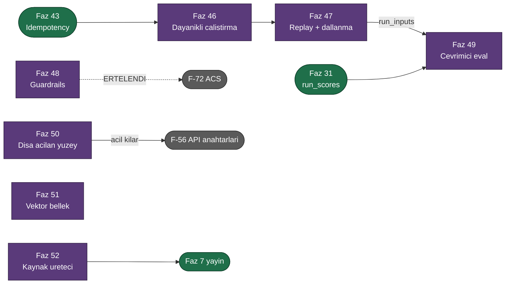

# Üçüncü Faz Yol Haritası (Faz 31 – 52)

> **Durum (2026-08-06): Üç dalga da planlandı, kod yazılmadı.**
> Bu tur [`UCUNCU-FAZ-ADAYLARI.md`](UCUNCU-FAZ-ADAYLARI.md) listesinden seçilir.
> **Yirmi altı kalem** faz dokümanına dönüştürüldü (Faz 31–52) ve aday
> listesinden **silindi**. Kalan 20 kalem seçilmemiştir.
>
> 🚨 **F-72 (ACS uyumu) Dalga 3'e alındı ve ölçüm sonucunda ERTELENDİ.** Sekiz
> kalemlik dalga bu yüzden **yedi faz** oldu. Ölçülen kanıt ve erteleme
> gerekçesi aday listesindedir; karar kullanıcıya ait ve tarihlidir.

---

## Kullanıcı Cevapları

| # | Soru | Cevap | Sıralamaya etkisi |
|---|------|-------|-------------------|
| 1 | Faz dokümanları hangi dilde? | **Türkçe** | `faz-planlama` skill'inin kuralı korundu; `docs/` tek dilli kaldı |
| 2 | Hangi kalemler plana dönüşsün? | **Dalga 1**, sonra **Dalga 2**, sonra **Dalga 3** (hepsi 2026-08-06) | Faz 31–37, 38–45 ve 46–52. Turun tamamı planlandı |
| 3 | Defter tutma yapılsın mı? | **Evet, tam Adım 6** | Kalemler aday listesinden silindi, README ve bu dosya güncellendi |
| 4 | Dalga 2 kaç faza bölünsün? | **Sekiz ayrı faz (38–45)** | Hiçbir iki kalem aynı altyapıyı paylaşmıyor; birleştirme DoD'yi bulanık yapardı |
| 5 | F-76 hangi kapıyla zorlansın? | **Seçenek A — sözleşme testi** | [Faz 41](41-KIRACI-YALITIMININ-ZORLANMASI.md). RLS ertelendi; SQLite'ta karşılığı yok |
| 6 | F-63'ün kapsamı? | **Yalnız belge** | [Faz 40](40-OPENAPI-YAYINI.md). npm yayın hattı ayrı bir dağıtım kanalıdır |
| 7 | `AgentPrism.Testing` hangi test çerçevesine bağlansın? | **Hiçbirine** | [Faz 39](39-TEST-PAKETI.md). `Mvc.Testing` deseni |
| 8 | Dalga 3 kaç faza bölünsün ve hangi sırayla? | **Bağımlılık sırası** | Faz 46–52. Önkoşul zinciri sırayı belirledi; F-72 düştüğü için sekiz değil **yedi** faz |
| 9 | F-68 hangi okumayla planlansın? | **Okuma A** — kuyruk + baştan çalıştırma | [Faz 46](46-DAYANIKLI-CALISTIRMA.md). Okuma B'nin MAF kancası **ölçüldü ve yok**; Okuma D (`runs`/`workflows` ikileşmesi) reddedildi |
| 10 | F-72 için ACS'nin beta native paketi alınsın mı? | **Ertelensin** | Dalga 3 sekiz değil yedi faz oldu. Ölçüm aday listesinde korunur |
| 11 | F-30 hangi kapsamda? | **Yalnız PostgreSQL, SK bağlayıcısı yok** | [Faz 51](51-VEKTOR-BELLEK-VE-RAG.md). `Npgsql` sürüm kayması (K-211 deseni) belirleyici oldu |

---

## Sıra — Dalga 1

| Faz | Doküman | Kalem | Neden burada | Yeni paket | Migration |
|-----|---------|-------|--------------|-----------|-----------|
| 31 | [31-GERI-BILDIRIM-VE-PUANLAMA.md](31-GERI-BILDIRIM-VE-PUANLAMA.md) | F-52 | 📋 Planlandı. Ölçme döngüsünün ilk halkası; aday listesindeki F-53, F-55, F-71 ve F-74'ün dördü de buna bağlıdır | — | üç set |
| 32 | [32-CALISTIRMA-IPTALI.md](32-CALISTIRMA-IPTALI.md) | F-35 | 📋 Planlandı. Kaçak bir agent'ı durdurmanın tek yolu bugün süreci öldürmektir. **Kapsam tek örnekle sınırlı** — çok örnek F-57'yi bekler | — | — |
| 33 | [33-SAGLIK-DENETIMI-VE-TESHIS.md](33-SAGLIK-DENETIMI-VE-TESHIS.md) | F-38 · F-62 | 📋 Planlandı. İkisi de **aynı veriyi** okur (DI kayıtları, migration durumu, Faz 8'in sağlık önbelleği); tek toplayıcı, iki sunum | — | — |
| 34 | [34-TANIM-DOGRULAMA-UCU.md](34-TANIM-DOGRULAMA-UCU.md) | F-60 | 📋 Planlandı. Derleyici hazır; döngü denetimi **yeni yazılır**. Aday listesindeki F-48'in (GitOps) CI adımıdır | — | — |
| 35 | [35-MALIYET-VE-KOTA-METRIKLERI.md](35-MALIYET-VE-KOTA-METRIKLERI.md) | F-70 | 📋 Planlandı. Turun **en ucuz** kalemi: iki enstrüman, uç yok, arayüz yok | — | — |
| 36 | [36-SAKLAMA-HACIM-SINIRI.md](36-SAKLAMA-HACIM-SINIRI.md) | F-73 | 📋 Planlandı. `MaxRows` yayımlanmış ama ölü bir ayardır (K-201). Sütun zaten var — migration gerekmez | — | — |
| 37 | [37-PROJE-SABLONU.md](37-PROJE-SABLONU.md) | F-49 | 📋 Planlandı. İlk on dakikayı kısaltır. Şablon paketi bağımlılık grafiğine **girmez** | `AgentPrism.Templates` | — |

Sıra **zorunlu değildir**; Dalga 1 kalemlerinin hiçbiri diğerine bağlı değildir.
Numaralar sırayı değil kimliği belirler. Faz 33 önce biterse Faz 37'nin şablonu
sağlık denetimini de taşıyabilir.

---

## Sıra — Dalga 2

Dalga 2'nin ortak yanı şudur: **her kalem başka bir işten önce yapılmazsa iki
kat pahalıya gelir.** Beşi Faz 7'den (yayın) önce yapılırsa bedavadır; üçü
sonradan yapılırsa yeniden yazım veya güvenlik düzeltmesi olarak geri döner.

| Faz | Doküman | Kalem | Hangi işten önce | Yeni paket | Migration |
|-----|---------|-------|------------------|-----------|-----------|
| 38 | [38-YAPILANDIRILMIS-CIKTI.md](38-YAPILANDIRILMIS-CIKTI.md) | F-42 | 📋 **Faz 7.** `ModelBinding` public `sealed record`'tur; alan eklemek yayından sonra bir sürüm kararıdır | — | — (tanım `jsonb`'de, K-208) |
| 39 | [39-TEST-PAKETI.md](39-TEST-PAKETI.md) | F-46 | 📋 **Faz 7.** Test API'sini kırmak tüketicinin **tüm** test paketini kırar | `AgentPrism.Testing` | — |
| 40 | [40-OPENAPI-YAYINI.md](40-OPENAPI-YAYINI.md) | F-63 | 📋 **F-50** (istemci + CLI). Belge, istemci üretiminin kaynağıdır | — | — |
| 41 | [41-KIRACI-YALITIMININ-ZORLANMASI.md](41-KIRACI-YALITIMININ-ZORLANMASI.md) | F-76 | 📋 **F-40 · F-56.** İki kimlik kalemi de kiracı zeminine yazar; zemin önce sağlamlaştırılmalıdır | — | 🚨 kusur çıkarsa gerekebilir |
| 42 | [42-TEK-YURUTUCU-SECIMI.md](42-TEK-YURUTUCU-SECIMI.md) | F-57 | 📋 **F-36.** Uzlaştırıcıyı yazdıktan sonra eklemek onu yeniden yazmaktır | — | bir tablo, üç set |
| 43 | [43-IDEMPOTENCY-KEY.md](43-IDEMPOTENCY-KEY.md) | F-37 | 📋 **F-68.** Dayanıklı çalıştırma yeniden deneme üretir; idempotency olmadan yan etkili tool iki kez koşar | — | bir tablo, üç set |
| 44 | [44-HATA-SINIFLANDIRMA.md](44-HATA-SINIFLANDIRMA.md) | F-55 | 📋 **F-74.** Kanarya kararı hata sınıfına dayanır; sınıf yoksa eşik kurulamaz | — | iki sütun + indeks, üç set |
| 45 | [45-URETIMDEN-EVAL-KUMESI.md](45-URETIMDEN-EVAL-KUMESI.md) | F-53 | 📋 **Faz 7** (`IEvalStore`'a metot eklemek yayından sonra kırıcıdır). Ayrıca [Faz 31](31-GERI-BILDIRIM-VE-PUANLAMA.md) puan bazlı terfi için gerekir | — | üç sütun + indeks, üç set |

Dalga 2 içinde de sıra **zorunlu değildir**; tek gerçek bağ Faz 45'in Faz 31'e
olan bağıdır ve o da yalnız **puan bazlı** terfi içindir. Durum bazlı terfi Faz
31 olmadan da çalışır.

---

## Sıra — Dalga 3

Dalga 3'ün ortak yanı şudur: **her kalem kendi başına bir tur büyüklüğündedir.**
Hiçbiri "eksik bir yarıyı tamamlamaz"; her biri AgentPrism'e Python ve
TypeScript ekosisteminde standart olan ama .NET'te **hiç bulunmayan** bir
yetenek ekler.

Dalga 1 ve 2'nin aksine **sıra burada anlamlıdır**: dört fazın gerçek bir
önkoşulu vardır.

| Faz | Doküman | Kalem | Önkoşul / neden burada | Yeni paket | Migration |
|-----|---------|-------|------------------------|-----------|-----------|
| 46 | [46-DAYANIKLI-CALISTIRMA.md](46-DAYANIKLI-CALISTIRMA.md) | F-68 (F-39 içinde) | 📋 [Faz 43](43-IDEMPOTENCY-KEY.md) üstüne. Turun en temel yeteneği; F-36 ve F-69 buna bağlıdır | — | — |
| 47 | [47-YENIDEN-OYNATMA-VE-DALLANDIRMA.md](47-YENIDEN-OYNATMA-VE-DALLANDIRMA.md) | F-54 · F-66 | 📋 Bağımsız. 🚨 Açtığı `run_inputs` tablosu **Faz 49'un girdi kaynağıdır** | — | bir tablo + iki sütun, üç set |
| 48 | [48-GUARDRAILS.md](48-GUARDRAILS.md) | F-32 | 📋 Bağımsız. Ertelenen F-72'nin üstüne oturacağı katman | — | — |
| 49 | [49-CEVRIMICI-DEGERLENDIRME.md](49-CEVRIMICI-DEGERLENDIRME.md) | F-71 | 📋 🚨 **[Faz 31](31-GERI-BILDIRIM-VE-PUANLAMA.md)** — `run_scores` oradan gelir. Faz 47 girdiyi verir | — | — (Faz 31'in tablosu) |
| 50 | [50-DISA-ACILAN-AGENT-YUZEYI.md](50-DISA-ACILAN-AGENT-YUZEYI.md) | F-31 · F-33 | 📋 Bağımsız. 🚨 **F-56'yı acil hâle getirir** — dış yüzey tek statik token'la korunuyor | — (yeni NuGet: MCP sunucusu) | — |
| 51 | [51-VEKTOR-BELLEK-VE-RAG.md](51-VEKTOR-BELLEK-VE-RAG.md) | F-30 | 📋 Bağımsız, turun en ağırı. 🚨 Paylaşılan depo modelini **kısmen kırar** | — (yeni NuGet **yok**) | bir tablo + uzantı, **yalnız PostgreSQL** |
| 52 | [52-KAYNAK-URETECI.md](52-KAYNAK-URETECI.md) | F-47 | 📋 **Faz 7.** `IAgentPrismBuilder`'a metot ekler; yayından sonra kırıcıdır. K-218'in açık bıraktığı onarımı kapatır | — (üreteç `.Core` nupkg'sinde) | — |

### Neden bu sıra

**Faz 48, 50, 51 ve 52 birbirinden bağımsızdır** ve istenen sırada yapılabilir.
Gerçek bağ üç tanedir: 43 → 46 → 47 → 49 ve 31 → 49.

🚨 **Faz 52 bir istisna taşır:** bağımsızdır ama **Faz 7'den önce** yapılmalıdır.
`IAgentPrismBuilder` public bir arayüzdür ve ona metot eklemek yayından sonra
kırıcıdır — Faz 36 ve Faz 45 ile aynı sınıf.

### Dalga 3'ün ölçtüğü ve düzelttiği kanıtlar

`faz-planlama`'nın 1. adımı sekiz kalemin kanıtını 2026-08-06'da ölçtü.
**Sekiz iddia düzeltildi.**

| Kalem | Aday listesinin iddiası | 2026-08-06 ölçümü |
|---|---|---|
| **F-68** | "Okuma B'nin MAF kancası doğrulanmadı" | 🚨 **Ölçüldü: agent düzeyinde kanca YOK.** `*Checkpoint*` sorgusu `Microsoft.Agents.AI` ve `.Abstractions` içinde **sıfır** tip buluyor; altı tipin tamamı `Microsoft.Agents.AI.Workflows` içinde. Okuma B'nin kancasını AgentPrism yazacaktı — K3'ü zorlar. Okuma A seçildi |
| **F-54** | "Hazırlık: **kayıt hazır**" | 🚨 **Yanlış.** Çalıştırmanın **girdisi hiçbir yerde saklanmıyor**: `RunRecord`'un 25 alanında girdi yok, `RunStarted` olayı yüksüz yazılıyor, `runs` tablosunda sütun yok. Faz 47 bir `run_inputs` tablosu açmak zorunda |
| **F-54** | "Dal işaretçisi yeni" | **Yarısı yanlış.** `workflow_checkpoints.parent_id` **zaten var** (Faz 15). Yeni olan yalnız konuşma dalıdır |
| **F-71** | "`AIJudgeLoopEvaluator` var; imzaları ölçülmeli" | 🚨 **Ölçüldü ve iş için UYGUN DEĞİL.** `LoopEvaluation` bir **puan döndürmez** (yalnız `ShouldReinvoke` + `Feedback`); `LoopContext` canlı bir `AIAgent` + `AgentSession` ister. Bitmiş bir çalıştırma puanlanamaz |
| **F-71** | "Yargıç maliyeti ayrı hesaplanmalı (K-151 deseni)" | **Mekanizma zaten var.** `RunKind.Eval` çalıştırmaları `RunStatistics`'ten **hâlihazırda hariç** ([`InMemoryRunStore.cs:333`](../src/AgentPrism.Core/Storage/InMemoryRunStore.cs), [`SqlRunStore.cs:214`](../src/AgentPrism.Sql.Shared/Stores/SqlRunStore.cs)). Yeni sütun gerekmez |
| **F-33** | "Maliyet: F-31 ile birlikte **düşük**" | **Doğru ama sebebi farklı.** `Hosting.A2A` 45 paket getiriyor — ama 43'ü `Microsoft.Agents.AI.Hosting`'ten geliyor ve o **zaten `AgentPrism.AspNetCore`'da**. Artımlı maliyet **2 paket**. 🚨 Gerçek kısıt ağırlık değil: `AddA2AServer` bir **kayıt zamanı** API'sidir ve AgentPrism'in **dinamik** katalogunu göremez |
| **F-30** | "`pgvector` … sürüm uyumu ölçülmeli" | 🚨 **Ölçüldü ve iki aday da düştü.** `SK.Connectors.PgVector` **yalnız ön sürüm** ve `Npgsql 8.0.7`'ye karşı derlenmiş; `Pgvector` 0.3.2 `Npgsql 8.0.5`'e karşı. Bizde **10.0.3**. K-211'in birebir tuzağı. Faz 51 **hiç paket almaz** |
| **F-30** | "vektör destekli `AgentFileStore.SearchAsync`" | 🚨 **İmza buna izin vermiyor.** MAF'ın parametresi `String regexPattern`. Faz 51 işi ikiye böldü: O(n) düzeltmesi (üç sağlayıcı) ve anlamsal arama (yeni yüzey) |
| **F-47** | "`ToolMethodScanner` tek yansıma noktasıdır" | ✅ **Doğrulandı** — ve fazlası bulundu: K-218'in yan bulgusu hâlâ kodda. `arguments.Services is { }` denetimi **hiç çalışmıyor** çünkü sağlayıcı `null` değil, **boş**. Yazılan hata mesajı hiçbir zaman görülmüyor ve XML dokümanı kodla **çelişiyor** |

---

## Bu Turda Doğrulanan ve Düzeltilen Kanıtlar

`faz-planlama`'nın 1. adımı on altı kalemin kanıtını 2026-08-06'da yeniden
ölçtü. **Yedi iddia düzeltildi. Düzeltmeler ilgili faz dokümanlarında da
yazılıdır.**

### Dalga 1

| Kalem | Aday listesinin iddiası | 2026-08-06 ölçümü |
|---|---|---|
| **F-52** | `grep -rni "feedback" src/` **boş** döner | **Boş dönmez.** `src/AgentPrism.UI/frontend/node_modules/` altında yüzlerce eşleşme var. İddia yalnız `--include="*.cs"` ile doğrudur. Sonuç değişmez, **ölçüm komutu** değişir |
| **F-70** | Kiracı etiketi metrik patlaması üretir; **varsayılan kapalı** olmalı | **Kiracı etiketi bugün zaten açık.** `agentprism.runs` sayacı `tenant.id` etiketini koşulsuz taşıyor ([`AgentPrismMetrics.cs:113`](../src/AgentPrism.Core/Diagnostics/AgentPrismMetrics.cs)). Yeni sayaçta kapalı yapmak iki sayacı tutarsız kılardı; Faz 35 mevcut davranışı sürdürür |
| **F-60** | "eksik olan yalnız bir uçtan çağrılmasıdır" | Model/tool/skill denetimleri için doğru. **Çağrı grafiği döngü denetimi hiç yoktur** — o fazda yeni yazılır |
| **F-73** | "satır sayma büyük tabloda pahalıdır" | Tasarım tabloyu **hiç saymaz**: N'inci satırın eşiği bulunur, sonra mevcut yaş bazlı silme kullanılır. K-200'ün sırasız silmesi böylece korunur |

### Dalga 2

| Kalem | Aday listesinin iddiası | 2026-08-06 ölçümü |
|---|---|---|
| **F-76** | "`PostgresQueries.cs` içinde `tenant_id` **177 kez** geçiyor" | **262 kez.** Ayrıca `SqlServerQueries.cs` 278, `SqliteQueries.cs` 266 — toplam **806** elle yazılmış filtre noktası. İddianın yönü doğru, büyüklüğü eksikti |
| **F-76** | "`tenants` tablosuna yabancı anahtar yok (**K-030**)" | **Kayıt numarası yanlış.** Bu bir `K-` kararı değil, `KARARLAR.md`'nin **reddedilen işler** bölümündeki **L30**'dur; K-030 bambaşka bir konudur. İddianın kendisi doğrudur |
| **F-76** | *(hiç söz edilmemiş)* | 🚨 **`TenantIsolationTests` VARDIR** ([`IsolationTests.cs:69`](../tests/AgentPrism.PostgreSql.IntegrationTests/IsolationTests.cs)) ama **üç depo** ve **yalnız PostgreSQL** ile sınırlıdır. Ayrıca **altı depo** hiç sözleşme testi görmüyor |
| **F-55** | "`runs.error` **serbest metindir**" | **Böyle bir sütun yok.** `runs` iki sütun taşıyor: `error_type` ve `error_message`. Ayrım zaten yapılmış; eksik olan `error_type`'ın **kararlı** olmaması |
| **F-55** | "`ContentFilterDetectingChatClient` bir sınıfı zaten tespit ediyor" | **Düşünülenden güçlü.** `AgentPrismException.ErrorType` **sanal üyesi** bir taksonomi yuvasıdır ve `RunRecordingAgent` onu zaten okuyor. Faz sıfırdan mekanizma kurmaz; var olanı **doldurur**. Kapsam daraldı, değer aynı |
| **F-63** | "Uçların üstverisi zaten var" | **Yarısı doğru.** 121 uçta 121 `WithName`, 119 `WithSummary` var — ama `WithTags` yalnız **beş grup çağrısında** ve hepsi **tek** etiket yazıyor. Ayrıca **on bir uç** ham `Task<IResult>` döndürüyor ve **hiçbir yanıt şeması üretmiyor** — biri agent'ı çalıştıran uçtur |
| **F-53** | "Eksik olan yalnız terfi yolu" | **Bir engel görülmemiş.** `IEvalStore` yalnız `ReplaceCasesAsync` sunuyor; **tek vaka ekleyen metot yok**. Terfi bugün "hepsini oku–ekle–geri yaz" demektir ve eş zamanlı iki terfi birbirini siler |
| **F-57** | "Kalan gerçek kanıtlar **üçtür**" | **Dörttür.** `ModelProviderHealthBackgroundService` ikinci bir `BackgroundService`'tir ve listede yoktu. Ayrıca "saklama koşusu bunu paylaşır" **yanlıştır**: `JobKind.Retention` iş kuyruğundan geçer ve kuyruk **zaten kira tabanlıdır** |
| **F-42** | *(imza doğrulanmamıştı)* | **Ölçüldü** (`Microsoft.Extensions.AI` 10.8.3). `ChatResponseFormat` public kurucu taşımaz; `Text` ve `Json` **statik property**'dir; `ForJsonSchema`'nın üç aşırı yüklemesi vardır ve **ikisi yansımaya dayanır** — AOT duruşu için yalnız `JsonElement` alanı kullanılır |

---

## Ölçülen Sayılar

Plan anında ölçüldü; uygulama anında yeniden ölçülür.

| Ölçüm | Değer | Kaynak |
|---|---|---|
| Arayüz bundle kullanımı | **151,3 KB gzip** / 250 KB bütçe | `wwwroot/assets/` brotli çıktısı açılıp gzip'lendi |
| Kalan bundle payı | **98,7 KB** | aynı |
| Dalga 1'in tahminî arayüz payı | **4–8 KB gzip** (tahmin) | Faz 31, 32, 33, 34 payları toplamı — **ölçülmedi** |
| Dalga 2'nin arayüz payı | **ölçülmedi** | Faz 38, 44, 45 arayüze dokunur; üçü de payı uygulama anında ölçer |
| Yeni tablo | **5** | `run_scores` (31), `singleton_leases` (42), `idempotency_keys` (43), `run_inputs` (47), `document_embeddings` (51 — **yalnız PostgreSQL**) |
| Sütun ekleyen migration | **3** | `runs`'a iki sütun (44), `eval_cases`'e üç sütun (45), `conversations`'a iki sütun (47) |
| Yeni AgentPrism paketi | **2** | `AgentPrism.Templates` (37), `AgentPrism.Testing` (39) — ikisi de bağımlılık grafiğine girmez. 🚨 `AgentPrism.Generators` (52) **yayımlanmaz**; DLL `AgentPrism.Core` nupkg'sinde taşınır |
| Yeni NuGet bağımlılığı | **2** | `ModelContextProtocol.AspNetCore` (50, **GA**, 13 geçişli, hepsi bizim sürümlerimizde) ve `Microsoft.CodeAnalysis.CSharp` (52, `PrivateAssets=all` — tüketiciye **sızmaz**). Açık Soru 1'e bağlı olarak A2A (+2 paket) |
| 🚨 **Alınmayan** NuGet bağımlılığı | **3** | `SK.Connectors.PgVector`, `Pgvector`, `AgentControlSpecification` — üçü de ölçüldü ve reddedildi ([Faz 51](51-VEKTOR-BELLEK-VE-RAG.md), F-72) |
| MAF/MEAI imza ölçümü | **6** | `ChatResponseFormat` (38) · `*Checkpoint*` yokluğu (46) · `AIJudgeLoopEvaluator` ailesi (49) · MCP sunucu handler'ları (50) · A2A kayıt API'si (50) · `VectorStoreCollection` ifade ağacı (51) |
| Dalga 3'ün arayüz payı | **tahminî 4–7 KB gzip** | Faz 46 (~0,5) + Faz 47 (3–5) + Faz 48 (~1). Faz 49 1–2 KB; Faz 50, 51, 52 arayüze **dokunmaz**. Hepsi **tahmindir** |

---

## Faz 7 (Yayın) Etkisi

`EnablePublicApiTracking` bugün **`false`** (K-068). Yirmi iki fazın **on
dokuzu** public yüzeyi büyütür.

### Dalga 1

| Faz | Yeni public yüzey |
|---|---|
| 31 | `RunScore`, `RunScoreKind`, `IRunScoreStore`, `RunStatistics`'e iki alan |
| 32 | `IRunCancellationRegistry` |
| 33 | `AgentPrismDiagnosticsReport`, `ConfigurationDiagnostic`, `ProviderDiagnostic`, `AddAgentPrismHealthChecks()` |
| 34 | `AgentValidationReport`, `ValidationMessage`, `ValidationSeverity`, `AgentDefinitionValidator` |
| 35 | İki enstrüman adı, üç etiket adı, iki ayar |
| 36 | 🚨 `IRetentionStore`'a bir **metot** |

### Dalga 2

| Faz | Yeni public yüzey | Yayından sonra maliyeti |
|---|---|---|
| 38 | `AgentResponseFormat`, `AgentResponseFormatKind`, `ModelBinding`'e bir alan, `ModelDescriptor`'a bir alan | `sealed record`'a alan — sürüm kararı |
| 39 | 🚨 **Paketin tamamı**: `FakeModelProvider`, `AgentPrismTestHost`, `RunAssertions`, `AgentPrismAssertionException` | Kırılırsa tüketicinin **tüm test paketi** kırılır |
| 40 | Yok — yalnız uç üstverisi | — |
| 41 | Yok — yalnız test altyapısı | — |
| 42 | `ISingletonLeaseStore`, `SingletonExecutionOptions` | Yeni arayüz — ucuz |
| 43 | `IIdempotencyStore`, `IdempotencyState`, dört kayıt tipi, bir ayar | Yeni arayüz — ucuz |
| 44 | `RunErrorClass`, `IRunErrorClassifier`, `RunStatistics`'e bir alan | `sealed record`'a alan — sürüm kararı |
| 45 | 🚨 `IEvalStore`'a bir **metot**, `EvalCase`'e üç alan, `EvalCaseDraft`, `EvalCaseSource` | **Arayüze metot eklemek yayından sonra kırıcıdır** |

### Dalga 3

| Faz | Yeni public yüzey | Yayından sonra maliyeti |
|---|---|---|
| 46 | `JobKind.AgentRun`, `RunStatus.Queued`, `AgentRunJobPayload`, `AgentPrismAsyncRunOptions`, `AcceptedRunResponse` | Enum'a **sona** değer eklemek ucuz; yeni tipler ucuz |
| 47 | `IRunInputStore`, `RunInputRecord`, `ReplayToolMode`, `RunReplayRequest`, `SessionBranchRequest`/`Result`, `RunRecord`'a bir alan | `sealed record`'a alan — sürüm kararı |
| 48 | `IContentGuard`, `ContentGuardContext`/`Result`/`Action`/`Direction`, `AgentPrismContentBlockedException`, `RunEventType`'a iki üye | Yeni arayüz ucuz; enum sona ekleme ucuz |
| 49 | `IRunJudge`, `RunJudgeContext`, `RunJudgment`, `JobKind.OnlineEval`, `RunScoreKind.Numeric`, `RunQuery`'ye bir alan | 🚨 `RunScoreKind.Numeric` **Faz 31'e taşınmalıdır** — aynı enum'a iki kez dokunmamak için |
| 50 | `MapAgentPrismMcpServer()`, `MapAgentPrismA2A()`, iki ayar sınıfı, `AgentPrismExternalCallException` | Yeni uzantı metodu — ucuz |
| 51 | `IVectorSearchStore`, `VectorChunk`, `VectorSearchRequest`/`Hit`, `MemorySettings`'e iki alan | `sealed record`'a alan — sürüm kararı |
| 52 | 🚨 `IAgentPrismBuilder`'a bir **metot** (`AddGeneratedTools()`) | **Arayüze metot eklemek yayından sonra kırıcıdır** |

**Hepsi Faz 7'den önce yapılırsa bedavadır.** Sonra yapılırsa her biri bir sürüm
kararıdır ve `PublicAPI.Shipped.txt` disiplinine girer.

🚨 **Üç faz özel dikkat ister** — üçü de var olan bir **arayüze metot** ekliyor
ve bu yayından sonra **kırıcıdır**: Faz 36 (`IRetentionStore`), Faz 45
(`IEvalStore`) ve Faz 52 (`IAgentPrismBuilder`). Faz 39 dördüncü sırada gelir:
yeni bir paket olduğu için kırıcı değildir, ama kırılırsa etkisi en geniş
olanıdır.

🚨 **Faz 49 bir bağ taşır:** `RunScoreKind.Numeric` üyesi Faz 31'in enum'una
girer. İki faz aynı turdadır; üyeyi **Faz 31 baştan taşımalıdır**. Aksi hâlde
aynı public enum iki ayrı fazda değişir ve `PublicAPI.Unshipped.txt` gereksiz
karmaşıklaşır.

---

## Her Fazın Uyacağı Kurallar

Değişmez tasarım kuralları ([`AGENTS.md`](../AGENTS.md)) ve `faz-planlama`'nın
sınırları bu turda da geçerlidir:

- **K1 — sıfır sürpriz.** Yeni genişleme noktası **varsayılan kapalı** gelir.
  Bu turda: Faz 33'ün teşhis ucu, Faz 35'in kota ölçeri, Faz 42'nin tek
  yürütücü seçimi, Faz 48'in guard'ı, Faz 49'un yargıcı ve Faz 50'nin dış
  yüzeyi kapalı doğar.
  🚨 **İki faz istisna önerir ve gerekçelerini yazar.** Faz 43
  (`Idempotency-Key`) ve Faz 46 (`Prefer: respond-async`): başlığı göndermeyen
  istemci için maliyet **sıfırdır**, ama kapalı gelirse başlık gönderen istemci
  **korunduğunu sanır ve korunmaz**.
  🚨 **Faz 48 K1'i DÜZ uygular** ve farkı açıkça yazar: guard **her istekte**
  çalışır ve davranışı değiştirir; maskelenmiş bir istem sürprizdir. İki
  yorumun sınırı Faz 48'in kapanışında `KARARLAR.md`'ye yazılmalıdır — yoksa
  sonraki fazlar rastgele seçim yapar.
  🚨 **Faz 49 İKİ kapı kullanır:** `Enabled = false` **ve** `SampleRate = 0`.
  Yargıç para harcar; tek kapı bir hesap hatasında yetmez.
- **K2 — tool'lar yalnız kodda.** Faz 37'nin şablonu bunu **gösteren** bir örnek
  taşır; gevşetmez. Faz 51'in `search_knowledge` tool'u da **kodda** tanımlıdır;
  agent tanımından yalnız *açılır*. Faz 50'nin beyaz listesi bir **dağıtım**
  ayarıdır, agent tanımında değildir.
- **K3 — MAF sarmalanmaz.** Bu turun hiçbir fazı MAF tipi sarmalamaz. Faz 38
  MAF'ın `ChatResponseFormat`'ını **doğrudan** kullanır; Faz 50 bir `AIFunction`'ı
  `McpServerTool.Create` ile doğrudan MCP tool'una çevirir. 🚨 Faz 49 ve Faz 51
  bir MAF tipini **kullanmamaya** karar verir (`AIJudgeLoopEvaluator`,
  `VectorStore`) ve gerekçelerini ölçümle yazar — bu K3'ün ihlali değil,
  uygulanmasıdır: yanlış tipi sarmalamak yerine kullanmamak.
- **K4 — her nokta değiştirilebilir.** Yeni kayıtlar `TryAdd*` /
  `TryAddEnumerable` ile yapılır — Faz 42'nin `ISingletonLeaseStore`'u, Faz
  43'ün `IIdempotencyStore`'u, Faz 44'ün `IRunErrorClassifier`'ı, Faz 48'in
  `IContentGuard`'ı, Faz 49'un `IRunJudge`'ı ve Faz 51'in
  `IVectorSearchStore`'u dahil.
- **Üç migration seti.** Yedi faz şemaya dokunur (31, 42, 43, 44, 45, 47, 51);
  numaralar uygulama anında alınır (K-178). 🚨 **Faz 51 bir istisnadır:** yalnız
  PostgreSQL setine dokunur; SQL Server ve SQLite setleri değişmez.
- **🚨 `json` / `jsonb` ayrımı.** Faz 47 polimorfik `ChatMessage` saklar ve
  sütun **`json`** olmalıdır (K-027, `$type` ilk özellik). Faz 51'in `metadata`
  sütunu düz bir sözlüktür ve **`jsonb`**'dir. İki kural karıştırılırsa yanlış
  sütun tipi seçilir ve hata **çalışma anında** çıkar.
- **Dört doğrulama kapısı** her fazın DoD'sindedir.
- **Örnek uygulamayla gerçek `run`** her fazın DoD'sindedir. Gerekçe: birim
  testleri Faz 6, 12, 15, 16, 18, 20, 21 ve 28'de gerçek hataları **kaçırdı**.

---

## Kalem → Faz Haritası

| Kalem | Faz | Dalga |
|---|---|---|
| F-52 Geri bildirim ve puanlama | 31 | 1 |
| F-35 Çalıştırma iptali | 32 | 1 |
| F-38 `IHealthCheck` | 33 | 1 |
| F-62 Yapılandırma teşhisi | 33 | 1 |
| F-60 Tanım doğrulama ucu | 34 | 1 |
| F-70 Maliyet ve kota metrikleri | 35 | 1 |
| F-73 Saklama `MaxRows` | 36 | 1 |
| F-49 `dotnet new` şablonu | 37 | 1 |
| F-42 Yapılandırılmış çıktı | 38 | 2 |
| F-46 `AgentPrism.Testing` | 39 | 2 |
| F-63 OpenAPI yayını | 40 | 2 |
| F-76 Kiracı yalıtımının zorlanması | 41 | 2 |
| F-57 Tek yürütücü seçimi | 42 | 2 |
| F-37 `Idempotency-Key` | 43 | 2 |
| F-55 Hata sınıflandırma | 44 | 2 |
| F-53 Üretimden eval kümesi | 45 | 2 |
| F-68 Dayanıklı çalıştırma (F-39 içinde) | 46 | 3 |
| F-54 Yeniden oynatma | 47 | 3 |
| F-66 Konuşma dallandırma | 47 | 3 |
| F-32 Guardrails | 48 | 3 |
| F-71 Çevrimiçi değerlendirme | 49 | 3 |
| F-31 AgentPrism'in MCP sunucusu olması | 50 | 3 |
| F-33 A2A protokolü | 50 | 3 |
| F-30 Vektör bellek ve RAG | 51 | 3 |
| F-47 Kaynak üreteci | 52 | 3 |

🚨 **F-72 (ACS uyumu) Dalga 3'e seçildi ama plana DÖNÜŞMEDİ.** Ölçüm sonucu
erteleme getirdi ve kalem aday listesinde — artık **ölçülmüş kanıtıyla** —
bekliyor.

Kalan 20 kalem [`UCUNCU-FAZ-ADAYLARI.md`](UCUNCU-FAZ-ADAYLARI.md) içindedir ve
seçilmemiştir.

---

## Dalga 2'nin Açtığı Yeni Aday Kalemler

Planlama sırasında beş iş **bilinçli olarak kapsam dışına** çıkarıldı. Hiçbiri
unutulmadı; her biri ilgili fazın devir notunda ve aday listesinde yaşar.

| Kapsam dışı | Nereden | Neden ayrı |
|---|---|---|
| PostgreSQL RLS ile derinlemesine savunma | Faz 41 | SQLite'ta karşılığı yok; üç sağlayıcıda davranış ayrışır |
| MCP OAuth token'ının örnekler arasında paylaşılması | Faz 42 | 🚨 K-059 ile çatışır — `secret` veritabanına yazılmaz. Kendi kararını ister |
| Paylaşılan (dağıtık) hız sınırı | Faz 42 | K-158 bunu bilerek bellekte tuttu |
| Akışlı yanıtta idempotency | Faz 43 | ✅ **Kapandı** — [Faz 46](46-DAYANIKLI-CALISTIRMA.md)'nın `Prefer: respond-async` sözleşmesi sorunu ortadan kaldırıyor |
| TypeScript istemcisi ve npm yayını | Faz 40 | İkinci bir dağıtım kanalı; ayrı yayın hattı ister |
| Çok turlu eval vakası terfisi | Faz 45 | `EvalCase` sözleşmesini değiştirir; Faz 7'den önce karara bağlanması ucuzdur |

---

## Dalga 3'ün Açtığı Yeni Aday Kalemler

Planlama sırasında **dokuz** iş bilinçli olarak kapsam dışına çıkarıldı.
Hiçbiri unutulmadı; her biri ilgili fazın devir notunda yaşar. ID'ler
**F-77'den** devam eder.

| Kapsam dışı iş | Hangi fazdan | Neden ayrı bir kalem |
|---|---|---|
| Tur bazlı kontrol noktası (F-68 Okuma B) | [Faz 46](46-DAYANIKLI-CALISTIRMA.md) | 🚨 MAF agent düzeyinde kanca **vermiyor** (ölçüldü). Kancayı AgentPrism yazmak K3'ü zorlar; yeni tablo + üç migration seti ister |
| OpenAI uyumlu uçların asenkron sözleşmesi | [Faz 46](46-DAYANIKLI-CALISTIRMA.md) | OpenAI'ın kendi modeli farklıdır (`background: true` + `response.id`); iki sözleşmeyi karıştırmamak gerekir |
| Workflow dallandırma ucu | [Faz 47](47-YENIDEN-OYNATMA-VE-DALLANDIRMA.md) | `workflow_checkpoints.parent_id` **zaten var** ama bir uç yok |
| Azure AI Content Safety adaptörü | [Faz 48](48-GUARDRAILS.md) | Ağırlık sorun değil (**4 paket**, ölçüldü). Erteleme gerekçesi **doğrulanamazlıktır** — K-212 emsali. `AgentPrism.ContentSafety` olacaktır |
| Tool argümanı denetimi | [Faz 48](48-GUARDRAILS.md) | Guard model sınırındadır; argüman denetimi **F-61**'in işidir ve o kalem listede duruyor |
| Agent başına eval ölçütü | [Faz 49](49-CEVRIMICI-DEGERLENDIRME.md) | `AgentDefinition`'a alan eklemek bir sözleşme değişikliğidir; ihtiyaç **ölçülmeden** yapılmaz |
| A2A istemci tarafı (uzak agent çağırma) | [Faz 50](50-DISA-ACILAN-AGENT-YUZEYI.md) | 6 paket, ön sürüm. 🚨 K-008 gereği `.Core`'a giremez; yerleşimi ayrı bir karardır |
| MCP kaynak ve istem yayını | [Faz 50](50-DISA-ACILAN-AGENT-YUZEYI.md) | Agent'ı **tool** olarak açmakla `resources`/`prompts` yayınlamak ayrı sözleşmelerdir |
| `IVectorSearchStore`'un SQL Server / SQLite uygulaması | [Faz 51](51-VEKTOR-BELLEK-VE-RAG.md) | SQL Server'ın yerel `VECTOR` tipi ve SQLite'ın `sqlite-vec` uzantısı **ölçülmedi** |
| Bilgi tabanı arayüz ekranı | [Faz 51](51-VEKTOR-BELLEK-VE-RAG.md) | Faz 51 arayüze hiç dokunmadı; belge yönetimi ekranı ayrı bir iş ve ayrı bir bundle payıdır |

### Dalga 3'ün acil hâle getirdiği mevcut kalemler

Bu üç kalem **yeni değildir**; aday listesinde zaten duruyorlar. Dalga 3
onların aciliyetini **değiştirdi** ve bu bilgi kaybolmamalıdır.

| Kalem | Neden aciliyeti arttı |
|---|---|
| **F-36** öksüz çalıştırma uzlaştırması | 🚨 [Faz 46](46-DAYANIKLI-CALISTIRMA.md) öksüz `Running` satırı **üretir**. Aday listesi sırayı zaten yazıyordu: F-68 → F-36 |
| **F-56** kiracı bazlı API anahtarları | 🚨 [Faz 50](50-DISA-ACILAN-AGENT-YUZEYI.md) bir **dış yüzey** açtı ve onu tek statik bir token koruyor. `AllowRemoteAccess` kilidi geçici bir savunmadır |
| **F-69** asenkron onay kutusu | Kuyrukta koşan bir çalıştırma ([Faz 46](46-DAYANIKLI-CALISTIRMA.md)) onay isterse **kimse cevap veremez** — kuyrukta istemci yoktur |
| **F-74** kanarya ve otomatik geri alma | Üç önkoşulunun üçü de tamamlanır: Faz 31, Faz 44 ve [Faz 49](49-CEVRIMICI-DEGERLENDIRME.md). Eşik mantığı Faz 49'unkiyle **aynı** olmalıdır |
