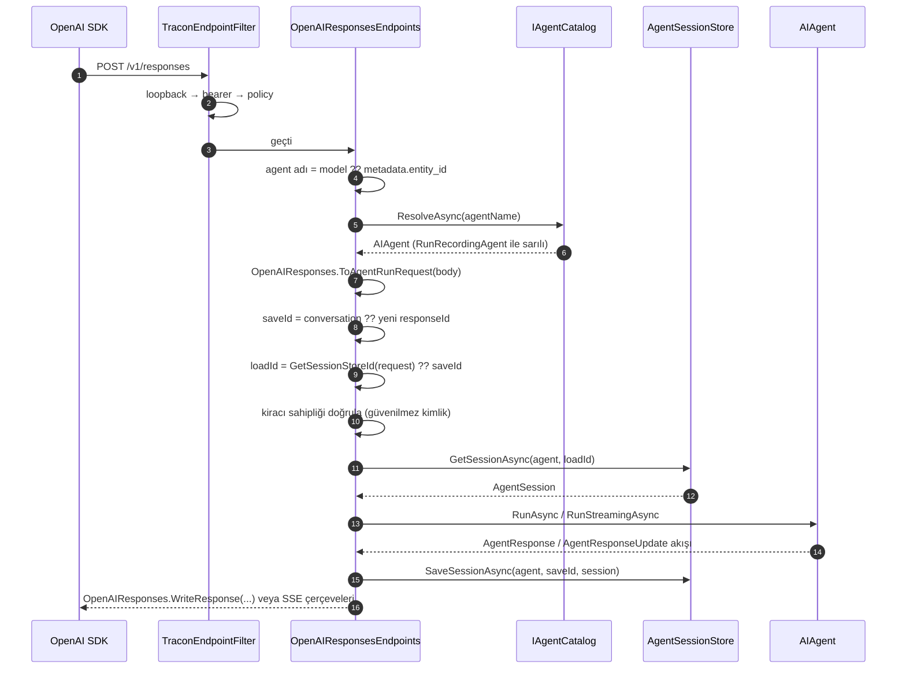
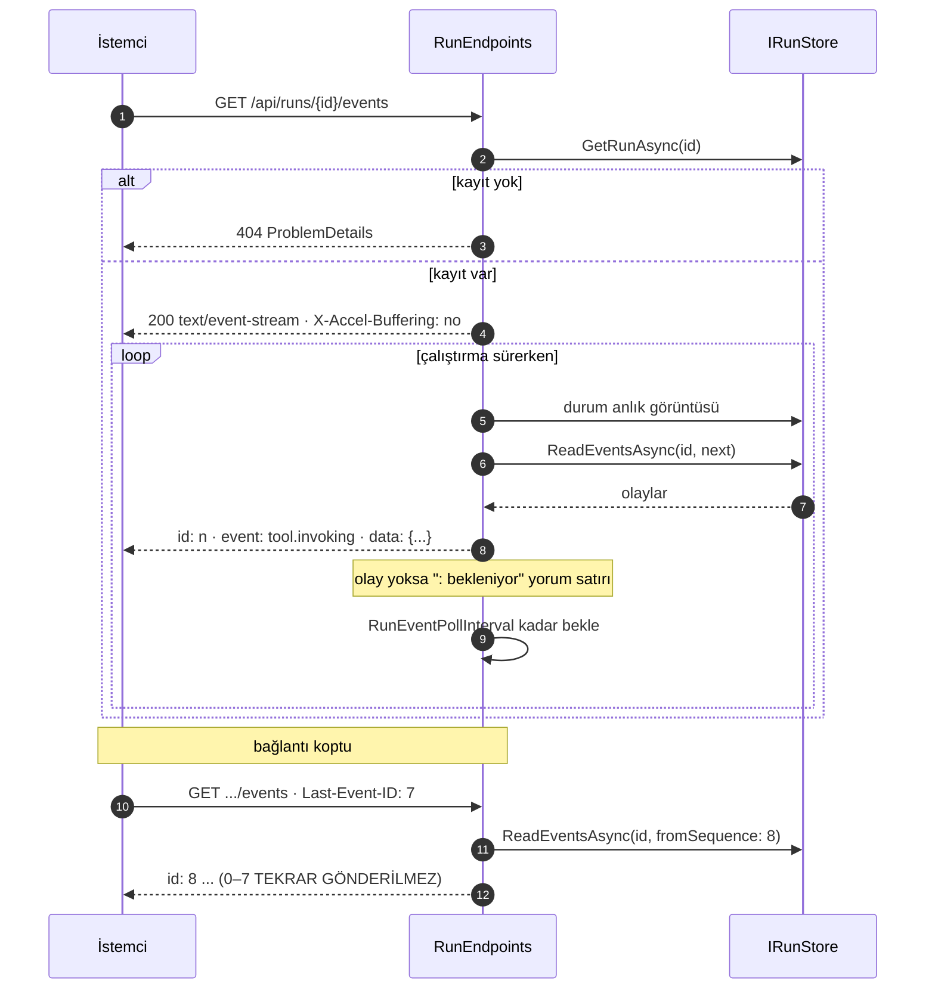

# Faz 4 — HTTP API Katmanı

> **Durum:** ✅ Tamamlandı (2026-08-02)
> **Önkoşul:** [03-SAGLAYICI-VE-DERLEYICI.md](03-SAGLAYICI-VE-DERLEYICI.md) — tamamlandı
> **Sonraki:** [05-TRACON-UI.md](05-TRACON-UI.md)
> **Paket:** `Tracon.AspNetCore`

---

> ### ⚗️ Damıtılmış kayıt
> Bu dosya fazın **planını** değil, fazın bıraktığı **kalıcı bilgiyi**
> taşır. Plan gövdesi, planlanan/gerçekleşen API, dosya listesi, risk ve
> açık soru bölümleri kapanışta düştü — **silinmedi, git geçmişindedir.**
>
> Tam metin — kopyala, çalıştır:
>
> ```bash
> git show 7f1833e:docs/arsiv/fazlar/04-HTTP-API.md
> ```
>
> Damıtıldı 2026-08-23 · `scripts/dokuman-bakim.py faz-damit`

---

## Devraldığınız Sözleşmeler

Bu imzalar **tamamlandı ve testli**. Faz 4 bunları değiştirmez, kullanır.

```csharp
// Tracon.Core — katalog ve calistirma
IAgentCatalog        : ListAsync(ct) · ResolveAsync(name, ct)
AgentDefinitionCompiler.Compile(AgentDefinition) → AIAgent
AgentSessionManager  : GetOrCreateSessionAsync · SaveSessionAsync · DeleteSessionAsync · QuerySessionsAsync
IRunStore            : QueryRunsAsync(RunQuery) · ReadEventsAsync(runId, ...)
IToolRegistry        : List() → IReadOnlyList<ToolDescriptor> · TryGet(name, out AIFunction)
IModelProviderRegistry : List() → IReadOnlyList<ModelProviderDescriptor> · CreateChatClient(ModelBinding)

// Tracon.OpenAI — Faz 3
OpenAIProviderNames.ChatCompletions = "openai"
OpenAIProviderNames.Responses       = "openai-responses"
UseOpenAI(apiKey | IConfiguration | Action<OpenAIProviderOptions>)

// Tracon.Abstractions — Faz 3
[TraconTool(name, description)] · ITraconBuilder.AddToolsFrom<T>() / AddToolsFrom(Type)
```

Davranış sözleşmeleri (mevcut testlerin zorladığı kurallar):

| Kural | Nerede doğrulanıyor |
|-------|--------------------|
| Bilinmeyen tool adı `TraconCompilationException` atar ve kayıtlı tool'ları listeler | `AgentDefinitionCompilerTests` |
| Bilinmeyen sağlayıcı adı derleme hatası verir ve kayıtlı sağlayıcıları listeler | `ModelProviderRegistryTests` |
| `UseOpenAI()` iki sağlayıcı kaydeder; ikinci çağrı çoğaltmaz | `OpenAIProviderExtensionsTests` |
| API anahtarı hiçbir serileştirme, günlük veya istisna çıktısında görünmez | `SecretLeakTests` |
| `UsePostgreSql()` bellek içi depoların yerini `Replace` ile alır | `ServiceRegistrationTests` |
| Kayıtlar `TryAdd*` ile yapılır; tüketicinin kaydı kazanır | `TraconServiceCollectionExtensions` |

---

## Faz 2 ve 3'ten Devralınanlar

Bu fazın dayandığı, **tamamlanmış ve testli** parçalar:

| Ne | Nerede | Not |
|----|--------|-----|
| `conversations` + `conversation_items` tabloları | `0001_initial.sql` | `PostgresChatHistoryProvider` yazıyor. `/api/sessions/{id}` geçmişi buradan okur. Conversations API'si yazılmadı (S1). |
| `responses` tablosu | `0001_initial.sql` | **Boş kaldı.** Sapma S1: MAF'ın `IResponsesService` arayüzü internal olduğu için yazılmadı. `/v1/responses` durumu `sessions` tablosunda tutuluyor. |
| `AgentSessionManager` | `Core/Sessions/` | MAF'ın `AgentSessionStore` uygulaması **buna delege eder** — kendi kalıcılık kodunu yazma. Karar K-026. |
| `AgentSessionIdentity` | `Core/Sessions/` | Oturum kimliği `AgentSession.StateBag` içinde. `AgentSessionStore.sessionStoreId` bu damgayla eşleşmelidir. |
| Kiracı yalıtımı | `Postgres*Store` + `ITenantContext` | Depolar zaten `ITenantContext.TenantId` ile sınırlı. HTTP katmanı yalnız doğru `ITenantContext`'i kaydetmekle yükümlü. |
| `/api/meta` için depo tipi bilgisi | — | Örnek API `/health` içinde `runStore.GetType().Name` döndürüyor; aynı desen `/api/meta` için kullanılabilir (karar K-018). |
| Geçici HTTP uçları | `samples/Tracon.Api/Program.cs` | **Kaldırıldı.** `app.MapTracon("/tracon")` yerlerini aldı. |

---

## 🚨 Bilinen Tuzaklar

**1. `conversation_items.item` sütunu `json`, `jsonb` değil** (karar K-027). Polimorfik `$type` ayracı ilk özellik olmak zorundadır ve `jsonb` anahtarları yeniden sıralar. Bu fazda `responses.payload` için de aynı soruyu sorun: yük polimorfik mi?

**2. 🚨 Responses API sunucu durumu `ChatHistoryProvider` ile çakışır.** Faz 3'te ölçüldü:

```
System.InvalidOperationException: Only ConversationId or ChatHistoryProvider may be used, but not both.
```

`UsePostgreSql()` her derlenen agent'a bir `ChatHistoryProvider` bağlar. Bu yüzden `OpenAIChatClientFactory` Responses yolunda `AsIChatClientWithStoredOutputDisabled` kullanır. Faz 4 kendi `IConversationStorage` implementasyonunu yazarken aynı çatışmayı tekrar değerlendirin — konuşma durumu **iki kez** yönetilmemelidir.

**3. `MAAI001` ve `OPENAI001` derlemeyi kırar.** MAF ve OpenAI kitaplıklarının bazı üyeleri "evaluation purposes only" işaretlidir; `TreatWarningsAsErrors` ile hata olur. Bastırma gerekçeyle ve **tek dosyada** yapılır. Mevcut örnekler: `AgentDefinitionCompiler.CompileHarnessAgent` (K-020), `OpenAIChatClientFactory.CreateInnerChatClient` (K-030, K-031).

**4. `dotnet format`, `dotnet build`'den fazlasını yakalar.** Dört kapıyı da çalıştırın.

**5. `MA0004` (ConfigureAwait) kütüphane kodunda hata seviyesindedir** ve `await using` ifadelerini de kapsar. Kalıp: `var x = ...; await using (x.ConfigureAwait(false)) { ... }`.

**6. Ayar sınıfları `record` OLMAMALIDIR.** `record`'un ürettiği `ToString` tüm özellikleri yazar ve sırları günlüğe ifşa eder. `TraconEndpointOptions.AuthToken` bir sırdır; `SecretLeakTests` desenini bu faza taşıyın.

**7. Model kataloğu boş olabilir.** Tracon yerleşik model listesi taşımaz (K-032). `/api/models` boş liste dönebilir; bu bir hata değildir.

---

## Amaç

Arayüzün ve dış istemcilerin konuşacağı yüzeyi kurmak. Tek giriş noktası: `app.MapTracon()`. ---

## Giriş Noktası

```csharp
app.MapTracon("/tracon", options =>
{
    options.RequireAuthorization("TraconAdmin");
});
```

Varsayılan prefix `/tracon`. Herhangi bir prefix'e bağlanabilir; arayüz bunu çalışma anında öğrenir.

Ek kayıt adımı **yoktur**: `MapTracon()` ihtiyaç duyduğu her şeyi `AddTracon()`
kayıtlarından çözer. Dönen `IEndpointConventionBuilder` yalnızca **korumalı grubu**
temsil eder — böylece `MapTracon(...).RequireAuthorization()` yazmak `/api/meta`
ucunu kazara kilitleyemez.

---

## Uç Grupları

### A) OpenAI uyumlu çalıştırma uçları

```
POST   {prefix}/v1/responses
POST   {prefix}/v1/chat/completions
POST   {prefix}/v1/conversations
GET    {prefix}/v1/conversations/{id}
DELETE {prefix}/v1/conversations/{id}
GET    {prefix}/v1/conversations/{id}/items
```

Bu sayede mevcut OpenAI SDK'ları (Python, JavaScript, .NET) Tracon'e doğrudan bağlanır:

```python
client = OpenAI(base_url="https://app.example.com/tracon/v1", api_key="...")
response = client.responses.create(model="support", input="Merhaba")
```

**Agent seçimi.** Önce `metadata.entity_id`, sonra `model` alanı okunur. `model` alanının
agent adını taşıyabilmesi, stok OpenAI SDK'sının hiçbir ek alan yazmadan çalışmasını sağlar;
`metadata.entity_id` ise DevUI konvansiyonu ile uyum içindir. İkisi de yoksa `400` döner ve
kayıtlı agent'lar listelenir.

### `/v1/responses` istek akışı



**Oturum eşlemesi.** `conversation` verilirse oturum o kimlikle saklanır ve turlar arasında
sabit kalır. Verilmezse üretilen yanıt kimliğiyle saklanır; istemci bir sonraki çağrıyı
`previous_response_id` ile zincirler. Her iki kimlik de **güvenilmez** kabul edilir ve
yüklemeden önce kiracı sahipliği doğrulanır.

**Hata biçimi.** Bu uçlar `ProblemDetails` **kullanmaz**; OpenAI'in `{"error":{...}}`
biçimini döndürür. Aksi hâlde stok SDK'lar hatayı çözümleyemez. Yönetim API'si
(`/api/*`) `ProblemDetails` kullanmaya devam eder.

### B) Yönetim API'si

```
GET    {prefix}/api/meta                      kimlik yöntemi, sürüm, aktif store'lar   [kimlik doğrulaması YOK]

GET    {prefix}/api/agents                    katalog (kod + DB)
POST   {prefix}/api/agents                    yeni tanım
GET    {prefix}/api/agents/{name}
PUT    {prefix}/api/agents/{name}             yeni versiyon üretir
DELETE {prefix}/api/agents/{name}
GET    {prefix}/api/agents/{name}/versions
POST   {prefix}/api/agents/{name}/rollback    versiyona geri dön
POST   {prefix}/api/agents/{name}/run         SSE akışlı test çalıştırma

GET    {prefix}/api/sessions                  filtreli liste
GET    {prefix}/api/sessions/{id}             mesaj geçmişi
DELETE {prefix}/api/sessions/{id}

GET    {prefix}/api/runs                      filtreli liste
GET    {prefix}/api/runs/{id}
GET    {prefix}/api/runs/{id}/events          SSE; canlı veya replay

GET    {prefix}/api/tools                     kayıtlı tool'lar + JSON şemaları
GET    {prefix}/api/models                    sağlayıcılar ve modeller
GET    {prefix}/api/stats                     token, maliyet, hata oranı
```

Minimal API + typed results. `ProblemDetails` ile tek tip hata sözleşmesi. `Microsoft.AspNetCore.OpenApi` ile OpenAPI belgesi üretilir.

---

## Güvenlik — `TraconEndpointFilter`

Üç katman, sırayla:

```csharp
public sealed class TraconEndpointOptions
{
    public bool AllowRemoteAccess { get; set; }          // varsayılan: false
    public string? AuthToken { get; set; }               // varsayılan: null
    public string? AuthorizationPolicy { get; private set; }
    public TimeSpan RunEventPollInterval { get; set; }     // varsayilan: 250 ms
    public void RequireAuthorization(string policyName);
}
```

1. **Loopback kısıtı** — `AllowRemoteAccess = false` iken loopback dışı istek `403`. Kaza ile açılmaya karşı koruma. DevUI'nin davranışı ile aynı.
2. **Bearer token** — `AuthToken` doluysa `Authorization: Bearer` başlığı **sabit zamanlı** karşılaştırma ile denetlenir (`CryptographicOperations.FixedTimeEquals`).
3. **Authorization policy** — `RequireAuthorization("policy")` ASP.NET Core kimlik boru hattına bağlanır. Üretimde kullanılan yol budur.

`{prefix}/api/meta` her zaman kimlik doğrulaması olmadan erişilebilir. Arayüzün hangi kimlik yöntemini kullanacağını öğrenmesi için gereklidir. Yalnız şunları döner: sürüm, kimlik yöntemi, aktif store tipleri. Hiçbir hassas veri içermez.

### Güvenilmez girdi

`previous_response_id` ve `conversation_id` istemciden gelir ve **güvenilmez** kabul edilir. MAF dokümanının uyarısı:

> Treat `previous_response_id` and `conversation_id` as untrusted input. Authenticate and authorize the caller before using either ID to load or save a session or checkpoint.

Her yükleme öncesi kiracı sahipliği doğrulanır.

---

## Akış (Streaming)

Tüm akışlı uçlar Server-Sent Events kullanır. `run_events` append-only olduğu için
(karar K-014) canlı akış ve yeniden oynatma **aynı kod yolundan** geçer:




---

## Plandan Sapmalar

### 🚨 S1 — MAF'ın depolama arayüzleri `internal`; plan uygulanamadı *(kullanıcı kararı)*

Plan, `IConversationStorage` / `IAgentConversationIndex` / `IResponsesService`
implementasyonlarımızı `AddOpenAIResponses()` çağrısından **önce** kaydederek MAF'ın
bellek içi sürümlerini devre dışı bırakmayı öngörüyordu. Reflection ile ölçüldü
(`Microsoft.Agents.AI.Hosting.OpenAI` 1.16.0-alpha.260730.1):

```
Singleton IConversationStorage    -> InMemoryConversationStorage      svcPublic=False
Singleton IAgentConversationIndex -> InMemoryAgentConversationIndex   svcPublic=False
Singleton IResponsesService       -> <factory>                        svcPublic=False
Singleton IResponseExecutor       -> HostedAgentResponseExecutor      svcPublic=False
```

Dört arayüz de **internal**'dır; imzalarındaki model tipleri (`Conversation`,
`ItemResource`, `Response`, `CreateResponse`, `StreamingResponseEvent`) de öyle.
`InternalsVisibleTo` yalnız Microsoft'un kendi test derlemesine açıktır. Tüketici bir
derleme bu tipleri **adlandıramaz**; kayıt sırası ne olursa olsun üzerine yazamaz.

**Alınan karar:** uçları kendimiz yazdık. Paketin *public* yardımcısı `OpenAIResponses`
gövde çözümlemeyi ve OpenAI biçimli yanıt üretimini sağlar; agent çözümleme, kalıcılık,
kiracı yalıtımı ve çalıştırma kaydı Tracon'e aittir. Kablo biçimi MAF'tan geldiği için
stok SDK uyumu korunur. Karar K-036.

**Sonuç:** MAF'ın `MapOpenAIConversations()` ucu da aynı internal depoyu kullandığı için
kullanılamadı. Conversations uçları **kendi oturum soyutlamamız üzerine yazıldı** —
bkz. sapma S10.

### S10 — `/v1/conversations` önce kapsam dışıydı, sonra ölçümle geri alındı

Faz kapanışından sonra stok Python SDK'sı ile ölçüldü:

| SDK çağrısı | Conversations uçları yokken |
|---|---|
| `client.conversations.create()` — OpenAI'in **belgelenmiş** akışı | ❌ 404 |
| `client.conversations.items.list(...)` | ❌ 404 |
| `client.conversations.retrieve(...)` | ❌ 404 |
| `responses.create(conversation="uydurma-id")` | ✅ çalışıyor |

Çalışan tek yol istemcinin konuşma kimliğini **kendisi uydurmasıydı**; bu gerçek
OpenAI'de yoktur, dolayısıyla Tracon'e göre yazılan kod gerçek OpenAI'ye
taşınamazdı. "Stok SDK doğrudan bağlanır" vaadi eksik kalıyordu.

S1'deki engel burada **geçerli değildi**: o engel MAF'ın internal
`IConversationStorage`'ını değiştirmekle ilgiliydi; kendi uçlarımızı kendi oturum
soyutlamamız üzerine yazmak serbesttir. Uçlar eklendi. Karar K-043.

### S2 — `TraconUiOptions` → `TraconEndpointOptions`

Ayar nesnesi yalnız arayüzü değil, `/v1/responses` dahil tüm HTTP yüzeyini yönetiyor.
"Ui" adı Faz 5'te de yanlış kalacaktı ve public API'de yeniden adlandırma kırıcıdır.
Faz 5 ve 6 dokümanlarında eski ada atıf yoktu; ad şimdi düzeltildi.

### S3 — `/v1/*` uçları `ProblemDetails` kullanmıyor

Stok OpenAI SDK'ları hata gövdesini `{"error":{"message":...}}` biçimiyle çözümler.
`ProblemDetails` döndürmek istemcide anlamsız bir hata üretir. Ölçüldü: Python SDK
`NotFoundError` olarak doğru yakalıyor. Yönetim API'si `ProblemDetails` kullanmaya
devam ediyor. Karar K-038.

### S4 — `/api/stats` maliyet döndürmüyor

`runs` tablosu **model adı taşımaz**; maliyet, model kataloğundaki fiyatla çarpım
gerektirir. Token toplamları, durum sayıları ve hata oranı döndürülüyor. Maliyet için
`runs` tablosuna `model` sütunu ve yeni bir migration gerekir; bu Faz 6'nın
(gözlemlenebilirlik) kapsamıdır.

Ayrıca özet **depoda** hesaplanıyor: `IRunStore.GetStatisticsAsync` eklendi.
`QueryRunsAsync` üzerinden bellekte toplamak yalnız sayfalanmış bir alt kümeyi
kapsardı ve yanlış sonuç verirdi.

### S5 — `ChatHistoryProvider` artık `AddTracon()` içinde de kayıtlı

Plan `/api/sessions/{id}` için "mesaj geçmişi" diyordu. Geçmişi okumanın public yolu
`ChatHistoryProvider.InvokingAsync` + `InvokingContext` kurucusudur (ikisi de public,
`[MAAI001]` işaretli). Ancak sağlayıcı kayıtlı değilse MAF her agent için kendi bellek
içi örneğini kurar ve o örneğe dışarıdan erişilemez — geçmiş yalnız PostgreSQL açıkken
okunabilirdi. Açık kayıt iki modda da aynı okuma yolunu verir. Durum oturumun
`StateBag`'inde yaşadığı için tek örneğin paylaşılması MAF'ın öngördüğü kullanımdır.
`UsePostgreSql()` `Replace` kullandığı için hâlâ kazanır. Karar K-037.

### S6 — Faz 0'dan gelen `IsAotCompatible` hatası düzeltildi

`src/Directory.Build.props` içindeki `IsAotCompatible` türetmesi csproj gövdesinden
**önce** çalışıyordu; `Tracon.AspNetCore` csproj'unda yazan
`<TraconAotCompatible>false</TraconAotCompatible>` hiçbir işe yaramıyordu.
Sonuç: minimal API yönlendirmesi için onlarca `IL2026`/`IL3050` hatası.
Türetme `Directory.Build.targets` içine taşındı (csproj okunduktan sonra çalışır).
Karar K-006 bu gerekçeyle güncellendi.

### S7 — Test altyapısı `Mvc.Testing` yerine `TestHost`

`WebApplicationFactory<T>` bir **giriş noktası derlemesi** ister; Tracon bir
kütüphanedir. Testleri örnek uygulamaya bağlamak, kütüphane davranışını örneğin
yapılandırmasına bağımlı kılardı. `Microsoft.AspNetCore.TestHost` ile her test kendi
barındırıcısını kurar. `Microsoft.AspNetCore.Mvc.Testing` paket sürümü kaldırıldı.

### S8 — Enum'lar JSON'da ad olarak yazılıyor

`origin: 0` ve `status: 1` kablo sözleşmesi olarak okunaksızdı. Tip düzeyinde
`JsonStringEnumConverter<T>` eklendi; tüketicinin uygulama genelindeki JSON ayarlarına
dokunulmaz. Güvenli: hiçbir enum JSON olarak kalıcı değildir — `RunStatus` ve
`RunEventType` veritabanında `smallint`, `AgentDefinitionOrigin` okumada yeniden kurulur.

### S9 — OpenAPI paketi kütüphaneye bağımlılık olarak eklenmedi

Uçlar paylaşılan çerçeveden gelen üstveriyi (`WithName`, `WithTags`, `WithSummary`,
`WithDescription`) taşır; tüketici `AddOpenApi()` çağırdığında belge kendiliğinden
oluşur. `Tracon.AspNetCore` nuspec'i **3 doğrudan bağımlılık** taşıyor
(`Tracon.Core`, `Hosting`, `Hosting.OpenAI`). Karar K-039.

---

## Bitiş Ölçütleri (DoD)

| Ölçüt | Durum | Kanıt |
|-------|-------|-------|
| `MapTracon()` her iki uç grubunu bağlar | ✅ | OpenAPI belgesinde 16 Tracon yolu |
| Üç güvenlik katmanı ayrı ayrı test edilir | ✅ | `SecurityTests` — 16 test |
| OpenAI Python SDK ile `/v1/responses` çağrısı çalışır | ✅ | Gerçek `openai` 2.52.0 ile ölçüldü, aşağıda |
| `StorageOverrideTests` PostgreSQL store'larının kazandığını doğrular | ⚠️ | Kapsam değişti — bkz. sapma S1. `UsePostgreSql()` üzerine yazma `ServiceRegistrationTests` (Faz 2) ile korunuyor; `/api/meta` aktif depo tipini bildiriyor ve `MetaEndpointTests` bunu doğruluyor |
| SSE akışı kopan bağlantıdan devam eder | ✅ | `Last_Event_ID_ile_kaldigi_yerden_devam_eder` + gerçek çıktı |
| OpenAPI belgesi üretilir | ✅ | `OpenApiDocumentTests` — 3 test |
| Dört doğrulama kapısı temiz | ✅ | build / test / pack / format → 0 uyarı, 0 hata |
| Sır taraması temiz | ✅ | Çıktı boş |

### Gerçek çıktı — stok Python OpenAI SDK'sı

```python
client = OpenAI(base_url="http://localhost:5080/tracon/v1", api_key="yok-onemli-degil")
```

```
--- 1) responses.create (model=agent adi) ---
id     : resp_JrruFqDtiwr1eD5iiKUCFeodCmR1dl3YjuaN5J57mmzCQPw6
status : completed
text   : ORD-3 siparişiniz kargoya verilmiş. Tahmini teslimat: 2 gün.

--- 2) previous_response_id ile zincirleme ---
text   : ORD-9 siparişiniz de kargoya verilmiş. Tahmini teslimat: 2 gün.

--- 3) responses.stream(...) ---
olaylar: response.created, response.in_progress, response.output_item.added,
         response.content_part.added, response.output_text.delta, response.completed
text   : Ankara

--- 4) chat.completions.create ---
text   : Merhaba!
usage  : 195 token

--- 5) chat.completions stream ---
text   : 1, 2, 3

--- 6) olmayan agent ---
NotFoundError : Error code: 404 - {'error': {'message': "'yok-boyle' adinda bir agent yok.
                Kayitli agent'lar: arastirmaci, support.", 'type': 'model_not_found'}}
```

İkinci turdaki "ORD-9 siparişiniz **de**" ifadesi, `previous_response_id` ile yüklenen
oturumun önceki turu gerçekten taşıdığını gösterir.

### Gerçek çıktı — tool döngüsü `/v1/responses` içinde

```
id     : resp_4OlPmklzhL2C6DQp6locvq22H2DOrn09pDnAR1wCCDKoowVU
status : completed
usage  : {'input_tokens': 444, 'output_tokens': 44, 'total_tokens': 488}
output[0] type=function_call        name=get_order_status args={"orderId":"ORD-7"}
output[1] type=function_call_output
output[2] type=message role=assistant
    output_text : ORD-7 siparişiniz kargoya verilmiş. Tahmini teslim: 2 gün.
```

### Gerçek çıktı — yönetim API'si

> 🚨 Bu örnek Faz 4 kapanışının bir anlık görüntüsüdür (2026-08-02). Sonraki
> fazlar (17, 43, 53) `storage.jobStore`/`jobWorkerEnabled` ve üst düzey
> `roles` alanlarını ekledi — aşağıdaki gövde **güncel** şekli yansıtır
> (2026-08-10, `07-HTTP-YONETIM-API.md` üretilirken `MetaEndpoints.cs` ve
> `TraconMetaResponse.cs`'ten ölçüldü). Faz dokümanlarındaki "gerçek
> çıktı" örnekleri o fazın kapanış anına aittir; sonraki fazlarda sessizce
> eskiyebilirler.

```bash
$ curl -s localhost:5080/tracon/api/meta
{"version":"0.0.0-preview.0.60","prefix":"/tracon",
 "authentication":{"allowRemoteAccess":false,"requiresBearerToken":false,
                   "requiresAuthorizationPolicy":false},
 "storage":{"persistent":false,"agentDefinitionStore":"InMemoryAgentDefinitionStore",
            "runStore":"InMemoryRunStore","sessionStore":"InMemorySessionStore",
            "jobStore":"InMemoryJobStore","jobWorkerEnabled":true},
 "roles":{"canRead":true,"canOperate":true,"canAdminister":true}}

$ curl -s localhost:5080/tracon/api/stats
{"totalRuns":8,"completedRuns":8,"failedRuns":0,"canceledRuns":0,"runningRuns":0,
 "inputTokens":2754,"outputTokens":188,"totalTokens":2942,
 "byAgent":[{"agentName":"support","totalRuns":8,"failedRuns":0,"totalTokens":2942}],
 "errorRate":0}
```

### Gerçek çıktı — SSE ve `Last-Event-ID`

```bash
$ curl -sN localhost:5080/tracon/api/runs/{id}/events
id: 0
event: run.started
data: {"runId":"019fc02e-...","sequence":0,"type":"RunStarted","timestamp":"...", ...}

id: 1
event: message.delta
data: {"runId":"019fc02e-...","sequence":1,"type":"MessageDelta","text":"1", ...}

$ curl -sN -H 'Last-Event-ID: 2' localhost:5080/tracon/api/runs/{id}/events
id: 3      # 0-2 tekrar gonderilmedi
event: message.delta
```

Tool çalıştıran bir kayıtta olay adları:
`run.started · tool.invoking · tool.invoked · message.delta · message.completed · run.completed`

---

## Faz 5'e Devreden Notlar

**1. Konuşma ile oturum aynı şeydir** (K-043). `/v1/conversations` ile açılan kimlik,
`/api/sessions/{id}` ile okunan oturumun kimliğidir. Arayüz konuşma listesini
`/api/sessions` üzerinden kurar; ikinci bir kimlik uzayı yoktur.
`POST /v1/conversations` bir **kimlik rezervasyonudur** — oturum ilk `/v1/responses`
çağrısında doğar, bu yüzden kullanılmamış bir konuşma `404` değil **boş** döner.
`POST /v1/conversations/{id}/items` desteklenmez; mesaj eklemenin yolu bir
`/v1/responses` çağrısıdır.

**2. `/api/sessions/{id}` sohbet geçmişini `messages` alanında döndürür.** Biçim MAF'ın
`ChatMessage` dizisidir (`Microsoft.Extensions.AI` serileştirmesi, polimorfik `$type`
ayraçlı). Arayüz `AIContent` türlerini bu ayraçtan ayırt eder. Geçmiş okunamazsa alan
`null` gelir — bu bir hata değildir.

**3. Canlı olay akışı yoklamayla çalışır.** `RunEventPollInterval` varsayılan 250 ms.
PostgreSQL `LISTEN`/`NOTIFY` ile gecikmeyi düşürmek Faz 6'nın işidir.

**4. `/api/stats` maliyet döndürmez** (S4). Arayüz maliyet sütunu göstermemeli veya
"Faz 6" olarak işaretlemelidir.

**5. Model kataloğu boş olabilir.** `/api/models` boş liste dönebilir; arayüz kullanıcıyı
`Tracon:Providers:OpenAI:Models` ayarına yönlendirmelidir.

**6. `IsEditable` alanına güvenin.** Kodda tanımlı agent'lar için yazma uçları `409`
döner. Arayüz düzenleme düğmesini bu alana göre kapatmalıdır.

**7. Arayüz `/api/meta` ile başlamalıdır.** Prefix, sürüm ve kimlik yöntemi oradan gelir;
bu uç kimlik doğrulaması gerektirmez. `MapTracon`'in döndürdüğü convention builder
korumalı grubu temsil eder, dolayısıyla tüketici `RequireAuthorization()` eklese bile
meta ucu açık kalır.

**8. `Tracon.UI` hâlâ iskelettir.** `TraconAotCompatible=false` yazan csproj'lar
artık gerçekten AOT analyzer'sız derleniyor (S6); Faz 5 bu düzeltmeden yararlanır.
