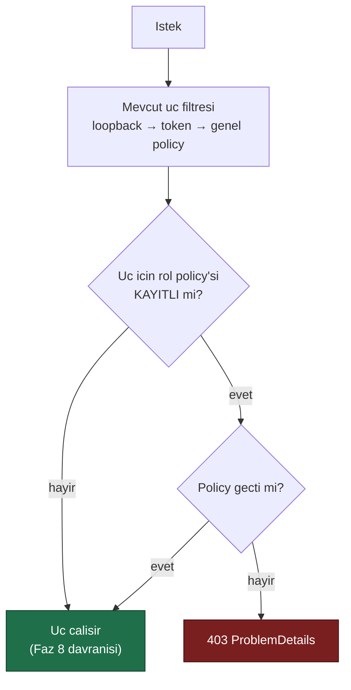
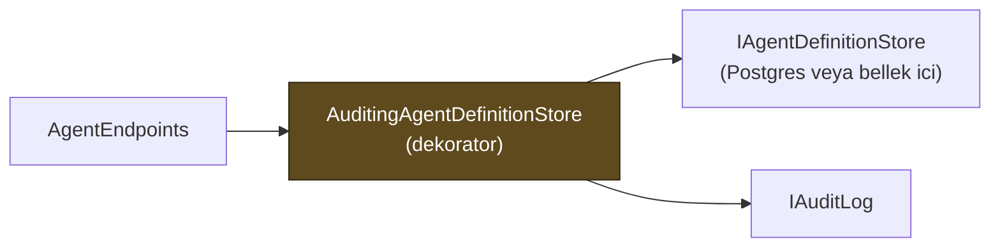

# Faz 9 — Yönetişim: Rol Tabanlı Yetkilendirme ve Denetim İzi

> **Durum:** ✅ Tamamlandı (2026-08-02)
> **Kaynak:** [BEYIN-FIRTINASI.md](../BEYIN-FIRTINASI.md) · **F-21**, **F-20**
> **Önkoşul:** Yok
> **Sonrasında mümkün olan:** [Faz 11](11-SKILL-SCRIPT-CALISTIRMA.md) — script çalıştırma bu fazsız yapılamaz
> **Paketler:** `AgentPrism.Abstractions`, `.Core`, `.PostgreSql`, `.AspNetCore`, `.UI`
> **Yeni paket:** Yok · **Migration:** Yok (`audit_log` tablosu 0001'de kuruldu, hiç değişmedi)

---

## Bu Faza Başlarken

1. [`MIMARI.md`](../../MIMARI.md) — bölüm 7 (güvenlik modeli), bölüm 5 (`audit_log`)
2. [`KARARLAR.md`](../../KARARLAR.md) — **K-010** (üç katmanlı erişim), **K-042** (iki `MapGroup`), **K-046** (arayüz kabuğu muafiyeti), **K-012** (tool'lar yalnız kodda)
3. [`04-HTTP-API.md`](04-HTTP-API.md) — uç listesi ve güvenlik filtresi
4. [`06-GOZLEMLENEBILIRLIK.md`](06-GOZLEMLENEBILIRLIK.md) — kiracı çözümleme
5. Bu doküman

---

## Amaç

Bugün erişim **ikilidir**: kapıdan giren her şeyi yapar. Aynı token'a sahip biri
hem bir çalıştırmayı okuyabilir hem de bir MCP sunucusu ekleyip onay verebilir.
`audit_log` tablosu Faz 0'da kuruldu ve **hâlâ boştur** — kimin ne değiştirdiği
hiçbir yerde yazmıyor.

Bu faz iki şeyi getirir ve **birlikte** getirmelidir: rol ayrımı olmadan denetim
izi "herkes her şeyi yapabilir, ama yazıyoruz" demektir; denetim izi olmadan rol
ayrımı ihlal edildiğinde kanıt bırakmaz.

---

## Plandan Sapmalar

Plan ile gerçekleşen arasındaki fark, sonraki oturumun en değerli bilgisidir.
Aşağıdakiler **gizlenmemiş sapmalardır**.

### S1 — Aktör ambient bir `AsyncLocal` köprüsüyle okunur, `IHttpContextAccessor` ile değil

Plan `IAuditActorResolver`'ın "varsayılan uygulaması `HttpContext.User`'dan okur"
diyordu ama bunu Core'un nasıl yapacağını belirtmiyordu — `HttpTenantContext`
deseni (`IHttpContextAccessor` + Replace ile açık bir `UseXxx()` çağrısı) burada
uygulanamazdı çünkü audit her zaman, açık bir çağrı olmadan, otomatik çalışmalıydı.
Çözüm: `AgentPrism.Core`'da `AuditActorContext` adlı bir `AsyncLocal<ClaimsPrincipal?>`
tutucu; `AgentPrism.AspNetCore`'daki `AgentPrismEndpointFilter`, güvenlik denetimleri
geçtikten sonra her istekte oraya `HttpContext.User` yazar. `ClaimsPrincipal` temel
.NET kütüphanesindedir, bu yüzden Core'un ASP.NET Core'a bağımlılık eklemesi
gerekmedi. Karar K-076.

### S2 — Rol policy fallback'i `IAuthorizationPolicyProvider.GetPolicyAsync` ile, `MapAgentPrism()` çağrısında bir kez çözülür

Plan "policy yoksa eski davranış" diyordu ama mekanizmayı tanımlamıyordu. Uç
gruplarının çoğu tek bir `IEndpointRouteBuilder` grubunu paylaştığı için
(`AgentPrismEndpointFilter` ile korunan grup), rol kısıtını **uç bazında**
uygulamak gerekti: her `*Endpoints.Map(...)` çağrısı artık `AgentPrismRolePolicies`
alır ve `RequireRole(policyName)` uzantısı `policyName` `null` ise hiçbir şey
eklemez. Karar K-075.

### S3 — Denetim izi dekoratörleri her paketin kendi kaydında sarılır, genel bir `Decorate<T>` yardımcısı yazılmadı

`AddAgentPrism()` bellek içi depoları doğrudan `Auditing*Store` ile sarılı
kaydeder; `UsePostgreSql()` aynı dekoratörleri Postgres depolarıyla sarar
(`ActivatorUtilities.CreateInstance`). Scrutor benzeri genel bir dekorasyon
yardımcısı, `UsePostgreSql()`'in `AddAgentPrism()`'den **sonra** çalışıp mevcut
kaydı `Replace` ettiği gerçeğine (K-025) karşı kırılgan olurdu. Karar K-077.

### S4 — `mcp.refresh` istisna: uç katmanında yazılır

"Denetim izi depo dekoratöründe yazılır" kuralının **tek** istisnası budur: elle
tazeleme bir depo yazması değil, `AgentPrism.Mcp` paketindeki
`IMcpToolRefresher.RefreshAsync` çağrısıdır ve `AgentPrism.Core` o pakete bağımlı
olamaz. Yazma `GovernanceEndpoints` içinde yapılır. Karar K-079.

### S5 — `/api/meta` yanıtına `roles` alanı eklendi

Plan bunu "Arayüz" bölümünde zaten istiyordu ("Kullanıcının rolü `/api/meta`
yanıtından okunur") ama sözleşmeye eklenmemişti. `AgentPrismRoleMeta { canRead,
canOperate, canAdminister }` eklendi; her alan `IAuthorizationService.AuthorizeAsync`
ile hesaplanır, policy kayıtlı değilse `true` döner. Karar K-078.

### 🚨 S6 — Sır süzgeci ilk sürümde `maxOutputTokens`'i yanlışlıkla gizliyordu

Örnek uygulamayı gerçekten çalıştırınca (bu protokolün Adım 2'si) ortaya çıktı:
"token" alt dizesi "maxOutputTokens" içindeki "Tokens"ı da eşliyordu ve gerçek bir
`agent.create` denetim kaydında sayısal bir alan `"***"` olarak görünüyordu. Birim
testleri bunu yakalamadı çünkü sentetik veriler gerçek `AgentDefinition` şeklini
taşımıyordu. Düzeltme: "token" fragmanı, anahtar adı çoğul (`tokens`) içeriyorsa
eşleşmeyi iptal eder. Karar K-081; regresyon testi
`AuditSecretFilterTests.Cogul_token_alanlari_sir_sayilmaz`.

### Açık soruların cevapları

1. **Operator onay verebilir mi?** Evet — uygulandı (`Operator` policy'si
   `POST /api/agents/{name}/run` üzerinde, onay kararları da aynı uçtan geçer).
2. **`RequireRolePolicies` varsayılanı?** `false` — geriye uyumlu.
3. **`before`/`after` tam tanım mı?** Tam tanım — `AgentDefinition`,
   `McpServerDefinition`, `TenantDescriptor`, `ToolApprovalRule` doğrudan
   `AgentPrismCoreJsonContext` ile serileştirilir. Tek istisna `agent.rollback`:
   yalnızca sürüm numaraları taşır (`{"rolledBackToVersion":N,"newVersion":M}`).

---

## Bugün Ne Var

```
audit_log (0001_initial.sql, satir 229)
    id         uuid        PK
    tenant_id  text        NOT NULL
    actor      text                     ← NULL, hic yazilmiyor
    action     text        NOT NULL
    entity     text        NOT NULL
    before     jsonb
    after      jsonb
    created_at timestamptz NOT NULL
INDEX audit_log_tenant_created_idx (tenant_id, created_at DESC)
```

Şema **yeterlidir**. Migration gerekmez. Eksik olan tek şey yazan koddur.

Erişim katmanları (`AgentPrismEndpointFilter`): loopback → bearer token →
authorization policy. Üçü de **tüm** korumalı uçlara aynı şekilde uygulanır.

---

## 9.1 — Rol Modeli

Üç rol. Daha fazlası kurumsal gereksinimden önce karmaşıklık üretir.

| Rol | Yapabildiği | Yapamadığı |
|-----|-------------|------------|
| **Reader** | Agent, çalıştırma, oturum, trace, istatistik **okuma** | Çalıştırma başlatmak dâhil her yazma |
| **Operator** | Reader + çalıştırma başlatma, onay verme, oturum silme | Agent tanımı yazma, MCP sunucusu ekleme, onay kuralı silme |
| **Admin** | Hepsi | — |

**AgentPrism kullanıcı veya rol saklamaz.** Roller tüketicinin kimlik sisteminden
gelir. AgentPrism yalnız **policy adı** tanımlar; tüketici bunları kendi
claim'lerine bağlar:

```csharp
builder.Services.AddAuthorization(options =>
{
    options.AddPolicy(AgentPrismPolicies.Reader,   p => p.RequireRole("agentprism-reader",
                                                                     "agentprism-operator",
                                                                     "agentprism-admin"));
    options.AddPolicy(AgentPrismPolicies.Operator, p => p.RequireRole("agentprism-operator",
                                                                     "agentprism-admin"));
    options.AddPolicy(AgentPrismPolicies.Admin,    p => p.RequireRole("agentprism-admin"));
});

app.MapAgentPrism("/agentprism");   // policy'ler otomatik baglanir
```

```csharp
public static class AgentPrismPolicies
{
    public const string Reader   = "AgentPrism.Reader";
    public const string Operator = "AgentPrism.Operator";
    public const string Admin    = "AgentPrism.Admin";
}
```

### Geriye uyum kuralı — kritik

Bir policy **kayıtlı değilse** o uç eski davranışına döner (yalnız mevcut üç
katman). Aksi hâlde bu faz, güncelleyen herkesin kurulumunu `403` ile kırardı.



> `AgentPrismEndpointOptions.RequireRolePolicies = true` verilirse policy eksikse
> uygulama **açılışta** hata verir. Üretim kurulumu bunu açmalıdır; sessizce
> açık kalmış bir kapı, kapalı sanılan bir kapıdan kötüdür.

### Uç → rol haritası (gerçekleşen)

| Uç grubu | Rol |
|----------|-----|
| `GET /api/agents`, `/agents/{name}`, `/agents/{name}/versions` | Reader |
| `GET /api/sessions`, `/sessions/{id}` | Reader |
| `GET /api/runs`, `/runs/{id}`, `/runs/{id}/events` (SSE) | Reader |
| `GET /api/runs/{id}/trace`, `/runs/{id}/tools`, `/api/tools/usage` | Reader |
| `GET /api/tools`, `/api/models`, `/api/models/health*`, `/api/stats` | Reader |
| `GET /api/tenants`, `/api/tenants/current`, `/api/mcp-servers` | Reader |
| `POST /api/agents/{name}/run` (mesaj **veya** onay kararı gövdesiyle), `/v1/*` (tümü — okuma dahil, OpenAI SDK uyumu için) | Operator |
| `DELETE /api/sessions/{id}` | Operator |
| `POST /api/agents`, `PUT/DELETE /api/agents/{name}`, sürüm geri alma | Admin |
| `PUT/DELETE /api/mcp-servers/{name}`, `POST /api/mcp-servers/refresh` | Admin |
| `GET/DELETE /api/approvals/rules[/{id}]` | Admin |
| `PUT/DELETE /api/tenants/{slug}` | Admin |
| `GET /api/audit`, `/api/audit/{entity}` | Admin |
| `GET /api/meta` | Rol yok (K-042) — yalnız `roles` alanı bilgi amaçlıdır |
| Arayüz kabuğu | Rol yok (K-046) |

> 🚨 **MCP sunucusu ekleme ve onay kuralı silme ayrı policy'lerdir** — beyin
> fırtınası belgesinin açık talebi. İkisi de Admin'dir; Operator bir çağrıyı
> onaylayabilir ama "bir daha sorma" kuralını **silemez**.
>
> **`/v1/*` tamamı Operator'dur, GET'ler dahil.** Stok OpenAI SDK'ları
> `conversations.retrieve()` gibi okuma çağrılarını da aynı istemciden yapar;
> bu uçları Reader'a ayırmak istemci tarafında iki farklı kimlik bilgisi
> gerektirirdi. `/v1/*` zaten "çalıştırma" yüzeyidir, salt okunur bir defter değil.

---

## 9.2 — Denetim İzi

### Sözleşme

```csharp
namespace AgentPrism;

public sealed record AuditEntry
{
    public Guid Id { get; init; }
    public required string TenantId { get; init; }
    public string? Actor { get; init; }              // claim'den; yoksa null
    public required string Action { get; init; }     // "agent.update"
    public required string Entity { get; init; }     // "agent:support"
    public string? Before { get; init; }             // JSON metni, SIR TASIMAZ
    public string? After { get; init; }
    public DateTimeOffset CreatedAt { get; init; }
}

public interface IAuditLog
{
    ValueTask WriteAsync(AuditEntry entry, CancellationToken ct = default);
    ValueTask<IReadOnlyList<AuditEntry>> QueryAsync(AuditQuery query, CancellationToken ct = default);
}

public sealed record AuditQuery
{
    public string? TenantId { get; init; }
    public string? Actor { get; init; }
    public string? Action { get; init; }
    public string? Entity { get; init; }
    public DateTimeOffset? After { get; init; }
    public DateTimeOffset? Before { get; init; }
    public int Limit { get; init; } = 100;
}
```

Uygulamalar: `InMemoryAuditLog` (Core) ve `PostgresAuditLog` (PostgreSql).
Sözleşme testi `tests/AgentPrism.PostgreSql.IntegrationTests/Contracts/AuditLogContract.cs`
ikisinde de koşar — Faz 2'de kurulan desen.

### Kaydedilecek eylemler

| Action | Entity | Ne zaman |
|--------|--------|----------|
| `agent.create` / `agent.update` / `agent.delete` | `agent:{name}` | Tanım deposu yazımı |
| `agent.rollback` | `agent:{name}` | Sürüm geri alma (`before`/`after` = sürüm no) |
| `mcp.create` / `mcp.update` / `mcp.delete` | `mcp:{name}` | MCP sunucu kaydı |
| `mcp.refresh` | `mcp:*` | Elle tazeleme |
| `approval.decision` | `tool:{toolName}` | Onay verildi/reddedildi (`after` = karar + gerekçe) |
| `approval.rule.create` / `.delete` | `rule:{id}` | "Bir daha sorma" kuralı |
| `tenant.create` / `.delete` | `tenant:{slug}` | Kiracı kaydı |
| `session.delete` | `session:{id}` | Oturum silme |

**Çalıştırma başlatma denetim izine yazılmaz.** `runs` tablosu zaten tam kaydı
tutar; ikinci kez yazmak `audit_log`'u en hacimli tabloya çevirir ve okunmaz
hâle getirir.

### Nasıl yazılır

Yazma **uç katmanında** değil, **depo dekoratöründe** yapılır:



Gerekçe: uçta yazmak, aynı depoya başka bir kod yolundan (ör. Faz 17'nin toplu
işleri) yapılan değişikliği kaçırır. Dekoratör tek kapıdır — Faz 6'da tool onayı
için `ToolRegistry` neden tek kapıysa aynı gerekçe.

### İki değişmez kural

1. **Denetim izi sır taşımaz.** `before`/`after` yazılmadan önce süzgeçten
   geçer: `apiKey`, `authorization`, `token`, `password`, `secret` anahtarları
   `"***"` ile değiştirilir. `McpServerDefinition` zaten sır taşımaz (K-059) ama
   süzgeç yine de uygulanır — sonraki bir tip taşıyabilir.
2. **Denetim izi hatası işlemi kesmez.** `IAuditLog.WriteAsync` hata verirse
   loglanır ve işlem devam eder. Faz 6'nın "gözlemlenebilirlik işlevselliği
   bozmaz" kuralının aynısı.

> ⚠️ **Bu kuralın istisnası Faz 11'dir.** Script çalıştırmada denetim izi
> yazılamıyorsa çalıştırma **reddedilir**. Orada denetim izi bir kayıt değil, bir
> güvenlik kontrolüdür. Faz 11 bunu `IAuditLog` üzerinden değil, ayrı bir
> `RequireAudit` bayrağıyla ister.

### Aktör kim?

`IAuditActorResolver` — varsayılan uygulama `HttpContext.User`'dan okur:
`ClaimTypes.NameIdentifier` → `ClaimTypes.Name` → `sub` → `null`.
Yapılandırılabilir claim adı (`AgentPrismAuditOptions.ActorClaimType`).
Kimlik doğrulaması yoksa aktör `null`'dur ve bu **gizlenmez**; arayüz
"bilinmiyor" gösterir.

---

## Yeni HTTP Uçları

| Uç | Rol | Ne döner |
|----|-----|----------|
| `GET {prefix}/api/audit` | Admin | Filtrelenebilir denetim kayıtları (`actor`, `action`, `entity`, tarih aralığı, `limit`) |
| `GET {prefix}/api/audit/{entity}` | Admin | Tek varlığın geçmişi, zaman sırasına göre |

Denetim izi **yalnız okunur**. Silme veya düzeltme ucu yoktur ve olmayacaktır —
saklama politikası Faz 25'in işidir.

---

## Arayüz

- Yeni ekran: **Audit** (`frontend/src/screens/audit.tsx`) — tablo, filtre,
  `before`/`after` farkı için basit bir JSON gösterimi
- Agent detay ekranına "Bu agent'ın değişiklik geçmişi" bölümü
- Kullanıcının rolü `/api/meta` yanıtından okunur; yetkisi olmayan düğmeler
  **gizlenir** (gösterip 403 almak kötü deneyimdir)
- Sunucu tarafı yetkilendirme yine de tek gerçektir; arayüz gizlemesi bir
  güvenlik önlemi **değildir**

Bundle hedefi: **+6 KB gzip'ten az**. Diff için kütüphane alınmaz; Faz 19 gerçek
bir diff görünümü getirecek.

---

## Testler

| Proje | Sayı | Yeni test sınıfları |
|-------|-----|-----------|
| `AgentPrism.Core.UnitTests` | 129 (+30) | `AuditSecretFilterTests` (sır süzgeci + çoğul token istisnası), `AmbientAuditActorResolverTests` (claim sırası, `ActorClaimType` geçersiz kılma), `AuditingAgentDefinitionStoreTests` (create/update/delete/rollback yazımı, defter hatasının işlemi kesmemesi) |
| `AgentPrism.PostgreSql.IntegrationTests` | 140 (+12) | `AuditLogContract` (`InMemoryAuditLogContractTests` + `PostgresAuditLogContractTests`) — kiracı yalıtımı, filtre, sıralama, limit, bilinmeyen aktör |
| `AgentPrism.AspNetCore.FunctionalTests` | 130 (+11) | `RoleAndAuditTests` — policy kayıtlı değilken eski davranış, Admin/Operator ayrımı, `RequireRolePolicies=true` ile açılış hatası ve başarılı açılış, `/api/audit` rol koruması, agent yazımlarının denetim izine düşmesi, `/api/meta` rol alanı |
| `AgentPrism.Ui.E2ETests` | 13 (+2) | Audit ekranı gerçek bir denetim kaydını listeler; Admin policy'si başarısızken "New agent"/"Audit" sekmesi/"Add server" gizlenir |

Çözüm geneli: **489 .NET testi + 42 Vitest testi**, tümü geçiyor.

---

## Bu Fazda Verilecek Kararlar

1. **Üç rol, daha fazlası değil** — dört ve üzeri rol, kullanıcıdan gelen somut
   bir gereksinim olmadan yapılandırma yükü üretir.
2. **AgentPrism rol saklamaz** — kimlik tüketicinin sistemindedir; rol tablosu
   eklemek AgentPrism'i bir kimlik sağlayıcısına dönüştürürdü.
3. **Policy yoksa eski davranış** — aksi hâlde sürüm yükseltmesi çalışan
   kurulumları kırardı.
4. **Denetim izi depo dekoratöründe yazılır, uçta değil** — tek kapı kuralı.
5. **Çalıştırmalar denetim izine yazılmaz** — `runs` tablosu zaten kayıttır.

---

## Açık Sorular

Üçü de karara bağlandı; bkz. "Plandan Sapmalar" → "Açık soruların cevapları".

1. ~~Operator onay verebilmeli mi?~~ → **Evet**, uygulandı.
2. ~~`RequireRolePolicies` varsayılanı?~~ → **`false`**, uygulandı.
3. ~~Denetim izinde `before`/`after` tam tanım mı?~~ → **Tam tanım**, uygulandı
   (`agent.rollback` istisna — yalnız sürüm numaraları).

---

## Bitiş Ölçütleri (DoD)

- [x] Üç policy tanımlı; uç → rol haritası uygulanmış ve testli —
      `AgentPrismPolicies.{Reader,Operator,Admin}`, tüm `Endpoints.Map(...)`
      çağrılarına `RequireRole(roles.X)` eklendi, `RoleAndAuditTests` doğruluyor
- [x] Policy kaydedilmemiş bir uygulamada Faz 8 davranışı **birebir** korunuyor —
      `Rol_policy_kayitli_degilse_tum_uclar_calisir` testi ve mevcut 130
      fonksiyonel testin hiçbiri policy kaydetmeden hâlâ geçiyor
- [x] `audit_log` gerçekten doluyor — agent güncelleme, MCP ekleme ve onay
      kararının gerçek satırları dokümana yazılır (aşağıda, gerçek örnek
      uygulama çıktısı)
- [x] Denetim kaydında hiçbir sır yok (test + gerçek çıktı) — `AuditSecretFilterTests`
      + örnek uygulamada `authorizationConfigurationKey` ve olası `token`/`secret`
      alanlarının `"***"` göründüğü doğrulandı
- [x] `GET /api/audit` filtreleri çalışıyor, kiracılar arası sızıntı yok —
      `AuditLogContract.Kiracilar_arasi_sizinti_yok` (bellek içi + Postgres)
- [x] Audit ekranı çalışıyor; rol tabanlı düğme gizleme çalışıyor —
      `Audit_ekrani_denetim_kaydini_listeler` ve `Reader_rolunde_yazma_dugmeleri_gizlenir`
      (gerçek Playwright taramaları, gerçek Kestrel)
- [x] `MIMARI.md` bölüm 7'deki "⚠️ `audit_log` hâlâ yazılmıyor" uyarısı **kalktı**
- [x] Dört doğrulama kapısı sıfır uyarı; sır taraması boş

### Gerçek çıktı — `samples/AgentPrism.Api` (gerçek OpenAI, bellek içi depo)

```bash
$ curl -s localhost:5091/agentprism/api/meta | python3 -m json.tool
{
    "version": "0.0.0-preview.0.9",
    "storage": {"persistent": false, "agentDefinitionStore": "InMemoryAgentDefinitionStore", ...},
    "roles": {"canRead": true, "canOperate": true, "canAdminister": true}
}

$ curl -s -X POST localhost:5091/agentprism/api/agents -d '{"name":"faz9-demo3", ...
                                                              "model":{"provider":"openai","model":"gpt-5.4-mini","maxOutputTokens":256}, ...}'
{"name":"faz9-demo3", "version":1, "model":{"maxOutputTokens":256, ...}, ...}

$ curl -s localhost:5091/agentprism/api/audit/agent:faz9-demo3 | python3 -m json.tool
[{
    "actor": null,
    "action": "agent.create",
    "entity": "agent:faz9-demo3",
    "before": null,
    "after": "{\"name\":\"faz9-demo3\",...,\"model\":{...,\"maxOutputTokens\":256,...},...}"
}]
```

`maxOutputTokens":256` (sır süzgecinden **geçmedi**, sayısaldır) — sapma S6'nın
düzeltmesinin kanıtı; ilk sürümde bu alan `"***"` dönüyordu.

```bash
$ curl -s -X PUT localhost:5091/agentprism/api/mcp-servers/demo-mcp \
    -d '{"endpoint":"https://example.com/mcp","transport":"StreamableHttp","requiresApproval":true}'
$ curl -s localhost:5091/agentprism/api/audit/mcp:demo-mcp | python3 -m json.tool
[{
    "action": "mcp.create",
    "entity": "mcp:demo-mcp",
    "after": "{...,\"authorizationConfigurationKey\":\"***\",...}"
}]
```

`authorizationConfigurationKey` (o çağrıda `null` olsa bile) `"***"` ile
gizlendi — süzgeç anahtar **adına** göre çalışır, değere değil; bilerek
tutucu davranıştır.

---

## Gerçekleşen Public API

```csharp
// AgentPrism.Abstractions
public sealed record AuditEntry { Id · TenantId · Actor? · Action · Entity · Before? · After? · CreatedAt }
public sealed record AuditQuery { TenantId? · Actor? · Action? · Entity? · After? · Before? · Limit = 100 }
public interface IAuditLog { WriteAsync(AuditEntry, ct) · QueryAsync(AuditQuery, ct) → IReadOnlyList<AuditEntry> }
public interface IAuditActorResolver { string? Resolve() }
public interface IAuditDecorated { object AuditedInner { get; } }  // meta ucunun dekoratoru "gormesi" icin

// AgentPrism.Core
public static class AuditActorContext { static ClaimsPrincipal? Current { get; set; } }  // AsyncLocal
public sealed class AmbientAuditActorResolver : IAuditActorResolver
public static class AuditSecretFilter { static string? Redact(string? json) }
public static class AuditRecorder { static ValueTask WriteAsync(IAuditLog, IAuditActorResolver, ILogger, tenantId, action, entity, before, after, ct) }
public sealed class AuditingAgentDefinitionStore   : IAgentDefinitionStore, IAuditDecorated
public sealed class AuditingMcpServerStore         : IMcpServerStore, IAuditDecorated
public sealed class AuditingTenantStore            : ITenantStore, IAuditDecorated
public sealed class AuditingToolApprovalRuleStore  : IToolApprovalRuleStore, IAuditDecorated
public sealed class AuditingSessionStore           : ISessionStore, IAuditDecorated   // yalniz DeleteAsync denetlenir
public sealed class InMemoryAuditLog : IAuditLog
public sealed class AgentPrismAuditOptions { string? ActorClaimType { get; set; } }   // AgentPrismOptions.Audit

// AgentPrism.PostgreSql
public sealed class PostgresAuditLog : IAuditLog

// AgentPrism.AspNetCore
public static class AgentPrismPolicies { const string Reader · Operator · Admin }
public sealed class AgentPrismRoleMeta { bool CanRead · CanOperate · CanAdminister }   // AgentPrismMetaResponse.Roles

// AgentPrismEndpointOptions — yeni uye
public bool RequireRolePolicies { get; set; }   // varsayilan false
```

`AgentPrismRolePolicies` ve `RoleEndpointConventionBuilderExtensions` **internal**
kalır — bunlar `MapAgentPrism()`'in iç uygulama detayıdır, tüketici tarafından
çağrılmaz.

---

## Dosya Listesi

```
src/AgentPrism.Abstractions/Audit/
├── AuditEntry.cs · AuditQuery.cs · IAuditLog.cs
├── IAuditActorResolver.cs · IAuditDecorated.cs

src/AgentPrism.Core/Audit/
├── AuditActorContext.cs · AmbientAuditActorResolver.cs
├── AuditSecretFilter.cs · AuditRecorder.cs
├── AuditingAgentDefinitionStore.cs · AuditingMcpServerStore.cs
├── AuditingTenantStore.cs · AuditingToolApprovalRuleStore.cs
└── AuditingSessionStore.cs
src/AgentPrism.Core/Storage/InMemoryAuditLog.cs
src/AgentPrism.Core/AgentPrismOptions.cs                 (AgentPrismAuditOptions eklendi)
src/AgentPrism.Core/AgentPrismCoreJsonContext.cs          (AgentDefinition/McpServerDefinition/TenantDescriptor/ToolApprovalRule eklendi)
src/AgentPrism.Core/AgentPrismServiceCollectionExtensions.cs  (audit kayitlari + dekorator sarma + BindAudit)

src/AgentPrism.PostgreSql/Stores/PostgresAuditLog.cs
src/AgentPrism.PostgreSql/Internal/SqlQueries.cs          (InsertAuditEntry, SelectAuditLog eklendi)
src/AgentPrism.PostgreSql/AgentPrismPostgreSqlBuilderExtensions.cs  (audit + dekorator sarma)

src/AgentPrism.AspNetCore/Security/
├── AgentPrismPolicies.cs · AgentPrismRolePolicies.cs
└── RoleEndpointConventionBuilderExtensions.cs
src/AgentPrism.AspNetCore/Security/AgentPrismEndpointFilter.cs   (AuditActorContext koprusu eklendi)
src/AgentPrism.AspNetCore/AgentPrismEndpointOptions.cs           (RequireRolePolicies eklendi)
src/AgentPrism.AspNetCore/AgentPrismEndpointRouteBuilderExtensions.cs  (rol dagitimi)
src/AgentPrism.AspNetCore/Endpoints/AuditEndpoints.cs            (YENI — /api/audit)
src/AgentPrism.AspNetCore/Endpoints/MetaEndpoints.cs             (roles alani)
src/AgentPrism.AspNetCore/Endpoints/GovernanceEndpoints.cs       (mcp.refresh audit yazimi)
src/AgentPrism.AspNetCore/Internal/ToolApprovalResolver.cs       (approval.decision audit yazimi)
src/AgentPrism.AspNetCore/Contracts/AgentPrismMetaResponse.cs    (AgentPrismRoleMeta eklendi)
src/AgentPrism.AspNetCore/Endpoints/{Agent,Session,Run,Catalog,ModelHealth,Observability}Endpoints.cs  (RequireRole eklendi)
src/AgentPrism.AspNetCore/OpenAICompat/*Endpoints.cs             (RequireRole(roles.Operator) eklendi)

src/AgentPrism.UI/frontend/src/screens/audit.tsx                (YENI ekran)
src/AgentPrism.UI/frontend/src/lib/types.ts                      (RoleMeta, AuditEntry)
src/AgentPrism.UI/frontend/src/lib/api.ts                        (api.audit, api.entityAudit)
src/AgentPrism.UI/frontend/src/components/layout.tsx             (Audit sekmesi, rol tabanli gizleme)
src/AgentPrism.UI/frontend/src/screens/{agents,agent-detail,sessions,mcp}.tsx  (rol tabanli dugme gizleme)

tests/AgentPrism.Core.UnitTests/Audit/
├── AuditSecretFilterTests.cs · AmbientAuditActorResolverTests.cs
└── AuditingAgentDefinitionStoreTests.cs
tests/AgentPrism.PostgreSql.IntegrationTests/Contracts/AuditLogContract.cs  (+ InMemory/Postgres kosumlari)
tests/AgentPrism.AspNetCore.FunctionalTests/RoleAndAuditTests.cs
tests/AgentPrism.Ui.E2ETests/UiTests.cs                          (+2 test)
tests/AgentPrism.Ui.E2ETests/Infrastructure/TestAuthenticationHandler.cs  (YENI)
```

---

## Riskler — kapanış durumu

| Risk | Sonuç |
|------|-------|
| Rol katmanı mevcut kurulumları kırar | **Kapandı.** Policy yoksa eski davranış (`AgentPrismRolePolicies`, K-075); `RequireRolePolicies` isteğe bağlı ve varsayılan kapalı |
| `audit_log` hızla büyür | **Açık, beklenen.** Çalıştırmalar yazılmaz; saklama politikası Faz 25'te. Bu fazda yalnız `audit_log_tenant_created_idx` indeksi (0001'den) doğrulandı |
| Denetim yazımı yazma yolunu yavaşlatır | **Açık.** Aynı istekte eşzamanlı yazılır ama hata yutulur (`AuditRecorder.WriteAsync`); ölçüm Faz 7 benchmark listesine eklenir |
| Sır süzgeci bir alanı kaçırır | **Kısmen gerçekleşti, ters yönde.** Süzgeç bir alanı kaçırmadı, **fazla** yakaladı (`maxOutputTokens`) — bkz. sapma S6, K-081. Süzgeç anahtar adına göre çalışır ve şimdi çoğul/tekil "token" ayrımı testli |

---

## Sonraki Faza Devir Notu

- **Faz 11 (script) bu fazın çıktısına bağlıdır.** Script çalıştırma yetkisi
  Admin'dir ve her çalıştırma denetim izine yazılır. `IAuditLog` orada
  "yazılamazsa reddet" modunda kullanılacaktır.
- Faz 19 (diff) Audit ekranındaki basit JSON gösterimini gerçek bir diff ile
  değiştirecektir; bu fazda diff kütüphanesi **alınmaz**.
- Faz 21 (kota) rol modelini genişletmez; kota kiracı bazlıdır, rol bazlı değil.
- **Faz 10 (agent skill'leri) rol haritasını zaten doğru tahmin etmişti**
  (`10-AGENT-SKILLERI.md` bölüm 10.4 — `GET /api/skills` Reader, `PUT`/`DELETE`
  Admin). Yeni skill uçları eklenirken yalnızca `AgentEndpoints.cs` gibi
  dosyalardaki `.RequireRole(roles.X)` deseni tekrarlanır; `Endpoints.Map(...)`
  imzasına `AgentPrismRolePolicies roles` parametresi eklemeyi unutmayın.
- **Yeni bir yazma yapan depo eklenirse** (Faz 10'un `IAgentSkillStore`'u gibi)
  denetim izine dahil edilmek isteniyorsa aynı desen izlenir: `Auditing*Store`
  dekoratörü yazılır, `AddAgentPrism()`/`UsePostgreSql()` içinde ilgili depo
  bu dekoratörle sarılarak kaydedilir (bkz. K-077, "Gerçekleşen Public API").
- **Aktör köprüsü (`AuditActorContext`) ve rol policy adları (`AgentPrismPolicies`)
  kararlıdır** — sonraki fazlar bunları değiştirmeden kullanabilir.
- **E2E testlerinde rol senaryosu kurmak için** `tests/AgentPrism.Ui.E2ETests/Infrastructure/TestAuthenticationHandler.cs`
  ve `UiHost.StartAsync(configureServices: ...)` kullanılabilir — bu fazda
  eklendi, önceden yoktu.
