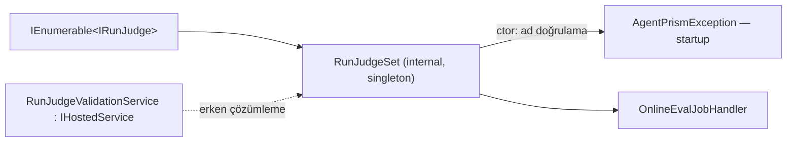

# Faz 100 — Yargıç Sözleşmesinin Yayını

> **Durum:** ✅ Tamamlandı (2026-08-25)
> **Kaynak:** Doğrudan kullanıcı isteği (2026-08-25) — `IRunJudge` üçüncü taraf
> uygulanabilirlik incelemesi. Aday listesinden gelmedi; Faz 98 · 99 ile aynı
> damardır: `preview.1` öncesi genişleme noktası olgunlaştırma.
> **Önkoşul:** [Faz 99](99-SAGLAYICI-SOZLESMESININ-YAYINI.md) —
> `ContractCoverage`'ın aile mekanizmasını (K-610), opt-in sözleşme sınıfı
> kuralını (K-611) ve yalnız-NuGet sample emsalini bu faz devralır.
> **Paketler:** `AgentPrism.Abstractions`, `AgentPrism.Core`,
> `AgentPrism.Testing.Contracts.Xunit`, `samples/`
> **Yeni paket:** Yok — sözleşme suite'i var olan pakete üçüncü bir ad alanı ekler ·
> **Migration:** Yok
> **Public API:** Büyüyor ve **daralıyor** — `RunJudgment.JudgeUsage` kalkar,
> `IModelProviderRegistry`'ye bir aşırı yükleme, `OnlineEvaluationOptions`'a bir
> alan, `ModelCredentialSource` · `AgentPrismJudgeException` · `RunJudgeContract` eklenir. Ölçüldü (2026-08-25):
> `wc -l src/*/PublicAPI.Shipped.txt` = 17 satır, hepsi `#nullable enable`
> başlığı — **her dosya boştur**, yüzeyi bugün değiştirmek bedavadır; Faz 7'den
> sonra bir sürüm kararıdır.
> **Tüketici yüzeyi:** site: yeni `guides/write-your-own-judge.md`,
> `concepts/evaluation.md`, `packages.md`, `capabilities.md`,
> `reference/configuration.md` · sevk edilen: `IRunJudge` · `RunJudgeContext` ·
> `RunJudgment` · `IModelProviderRegistry` XML dokümanı,
> `src/AgentPrism.Testing.Contracts.Xunit/README.md`
> **Manuel test alanı:** [`docs/manuel-test/17-EVAL-VE-DENEYLER.md`](../../manuel-test/17-EVAL-VE-DENEYLER.md) (`EVAL` öneki, bugün 69 case)

---

## Bu Faza Başlarken

> `faz-baslangic` skill'ini uygula. Aşağıdaki liste o skill'in 2. adımıdır —
> **tamamını değil, yalnız işaret edilen bölümleri oku.**

1. Bu doküman
2. Kararlar — dosyanın tamamını **okuma**, yalnız bu kalemleri grep'le:
   ```bash
   grep -n "K-327\|K-328\|K-329\|K-330\|K-331\|K-333\|K-160\|K-609\|K-610\|K-611" docs/KARARLAR.md
   ```
   **K-327** (`IRunJudge` sıfırdan yazıldı, `AIJudgeLoopEvaluator` kullanılmadı) ·
   **K-328** (yargıç maliyeti `RunKind.Eval` dışlamasıyla ayrılır) ·
   **K-329** (iki kapılı varsayılan) · **K-330** (yargıcın istemcisi guard boru
   hattından geçer) · **K-331** (`RunScore.Author` yargıçta bilerek doludur) ·
   **K-333** (`OnlineEvalJobHandler` DI'da iki kayıtlıdır) · **K-160** (job
   kuyruğu ve geri adımlı bekleme) · **K-609 · K-610 · K-611** (Faz 99'un
   sözleşme paketi kuralları).
3. [Faz 99](99-SAGLAYICI-SOZLESMESININ-YAYINI.md) — yalnız devir notu:
   ```bash
   awk '/## Sonraki Faza Devir Notu/,0' docs/arsiv/fazlar/99-SAGLAYICI-SOZLESMESININ-YAYINI.md
   ```
   Sözleşme ailesi ekleme yordamı, `xunit.v3.extensibility.core` tuzağı, sevk
   edilen XML'de emoji yasağı ve `samples/*.Tests` analyzer kuralı oradadır.
4. Alan hafızası (bu faz dört alana dokunuyor):
   [`hafiza/cekirdek-calistirma.md`](../../hafiza/cekirdek-calistirma.md) (`AsyncLocal`
   tuzağı — 100.7 buna dayanır) ·
   [`hafiza/test-altyapisi.md`](../../hafiza/test-altyapisi.md) (sözleşme sınıfı yazımı) ·
   [`hafiza/aspnetcore-di.md`](../../hafiza/aspnetcore-di.md) (`TryAdd` sırası, yaşam döngüsü) ·
   [`hafiza/dokumantasyon.md`](../../hafiza/dokumantasyon.md) (sevk edilen metin kapıları)
5. Gerektiğinde, tamamı değil ilgili bölümü:
   [`MIMARI.md`](../../MIMARI.md) — değerlendirme katmanı

---

## Amaç

`IRunJudge`, AgentPrism'in dört genişleme noktasından biridir. Faz 98 depolama,
Faz 99 sağlayıcı sözleşmesini sevk edilen yüzeye taşıdı. Yargıç hâlâ taşınmadı:
arayüz derlenir, ama derlendikten sonra **sessizce yanlış davranan on kural**
hiçbir sevk edilen yüzeyde yazmaz. Bunlardan biri sonsuz maliyet döngüsü üretir,
biri kalıcı değerlendirme verisini bozar, biri job'ı asılı bırakır.

Faz sonunda şu cümle doğru olmalıdır:

> Üçüncü taraf bir geliştirici AgentPrism kaynak kodunu okumadan, yalnız public
> API + XML dokümanı + `docs-site` + `AgentPrism.Testing.Contracts.Xunit`
> kullanarak güvenli ve uyumlu bir `IRunJudge` yazabilir.

Ve hatalı bir yargıç şunları **yapamaz**: değerlendirme verisini sessizce
bozmak · aynı adlı başka bir yargıcın satırını ezmek · iptal yüzünden job'ı lease
süresince `Running` bırakmak · job slot'unu sınırsız tutmak.

### Bugün ne çalışmıyor — doğrulanmış kanıt

| Kanıt | Gözlem |
|---|---|
| [`IRunJudge.cs`](../../../src/AgentPrism.Abstractions/Evaluation/IRunJudge.cs) tamamı | Ömür, thread-safety, idempotency, ad kuralı, iptal ve zaman aşımı **hiç yazmıyor**. Yalnız `null` skor semantiği belgeli |
| [`AgentPrismOnlineEvaluationBuilderExtensions.cs:58`](../../../src/AgentPrism.Core/Evaluation/AgentPrismOnlineEvaluationBuilderExtensions.cs) | `TryAddEnumerable(Singleton<IRunJudge, ModelRunJudge>)` — ömür singleton, arayüzde yazmıyor |
| [`AgentPrismSchedulingOptions.cs:25`](../../../src/AgentPrism.Abstractions/Scheduling/AgentPrismSchedulingOptions.cs) | `MaxConcurrentJobs = 2` → iki `OnlineEval` job'u aynı singleton yargıcı paralel çağırır |
| [`OnlineEvalJobHandler.cs:192-196`](../../../src/AgentPrism.Core/Evaluation/OnlineEvalJobHandler.cs) | Yargıcın döndürdüğü skor **doğrulanmadan** `RunScore.Value`'ya yazılır; `Source`/`Author` = `judge:{Name}` |
| [`OnlineEvalJobHandler.cs:163`](../../../src/AgentPrism.Core/Evaluation/OnlineEvalJobHandler.cs) | `catch … when (exception is not OperationCanceledException)` — yargıcın **kendi** OCE'si yakalanmaz |
| [`JobWorkerBackgroundService.cs:254, 161`](../../../src/AgentPrism.Core/Scheduling/JobWorkerBackgroundService.cs) | İki üst katman da OCE'yi filtreler → job `Running` kalır, yalnız lease bitince kurtulur |
| [`OnlineEvalJobHandler.cs:140`](../../../src/AgentPrism.Core/Evaluation/OnlineEvalJobHandler.cs) | Retry `judgeList`'in **tamamını** baştan koşar; sınıf yorumu "yalnız başarısız yargıçlar" der — yorum yanlış |
| [`ModelRunJudge.cs:155`](../../../src/AgentPrism.Core/Evaluation/ModelRunJudge.cs) + `grep -rn JudgeUsage src/` | `JudgeUsage` **yalnız yazılır**; hiçbir tüketici okumaz. XML'i "cost report'a dahil" der — yanlış bilgi |
| [`ModelRunJudge.cs:76`](../../../src/AgentPrism.Core/Evaluation/ModelRunJudge.cs) | Senkron `CreateChatClient` — [`IModelProviderRegistry.cs:21-28`](../../../src/AgentPrism.Abstractions/Models/IModelProviderRegistry.cs)'e göre BYOK **ve** egress policy uygulanmaz |
| [`RunSampler.cs:52`](../../../src/AgentPrism.Core/Evaluation/RunSampler.cs) | Döngü yalnız `RunKind.Eval` işaretiyle kırılır. Üçüncü taraf yargıç işaretlemezse **kendi run'ı örneklenir ve yeniden yargılanır** |
| [`OnlineEvalSummaryService.cs:125`](../../../src/AgentPrism.Core/Evaluation/OnlineEvalSummaryService.cs) | Yargıç maliyeti `AgentName.StartsWith("judge:", Ordinal)` ile bulunur — belgesiz ikinci ad kuralı |
| [`0017_run_scores.sql:44`](../../../src/AgentPrism.PostgreSql/Migrations/0017_run_scores.sql) | `(tenant_id, run_id, COALESCE(message_id,''), author)` benzersiz — aynı `Name`'li iki yargıç birbirini **ezer** |
| `0005_run_scores.sql` (üç sağlayıcı) | `comment` sütunu `text` / `nvarchar(max)` / `TEXT` — `Reason` için hiçbir sınır yok |
| [`EvalEndpoints.cs:608-614`](../../../src/AgentPrism.AspNetCore/Endpoints/EvalEndpoints.cs) | Ham `exception.Message` `502` gövdesine girer; kısmi başarısızlıkta `200` döner ve `failures` düşer |
| `ls src/AgentPrism.Testing.Contracts.Xunit/Contracts/` | İki aile var (`Storage`, `Providers`); yargıç ailesi yok |
| `ls samples/` | `CustomModelProvider`, `FileRunStore` var; yargıç sample'ı yok |

> Kanıtlar 2026-08-25 tarihinde doğrulandı.

---

## 100.1 — Çalışma anı sözleşmesini sevk edilen yüzeye taşı

`IRunJudge`, `RunJudgeContext` ve `RunJudgment`'ın XML dokümanı aşağıdaki **on
maddeyi** taşır. Faz 99'un `IModelProvider` bloğu biçim örneğidir: başlıklı
`<para>` grupları, çapraz referanslar, alarm emojisi **yok** (kapı kırar).

| # | Madde | Kaynağı |
|---|---|---|
| M1 | **Singleton ömür.** `AddModelRunJudge()` singleton kaydeder; `OnlineEvalJobHandler` singleton'dır ve yargıçları ctor'da alır. Scoped kayıt captive dependency üretir, transient kayıt fiilen singleton'a döner | ölçüldü |
| M2 | **Eşzamanlı çağrı.** Aynı instance paralel çağrılır (`MaxConcurrentJobs`, çok süreçli kurulum, manuel uç). Implementation thread-safe olmalı; per-run durum instance alanında tutulmamalı | ölçüldü |
| M3 | **Tekrar çağrı.** Bir yargıç aynı `RunId` için birden çok kez çağrılabilir — komşu bir yargıcın başarısızlığı tüm listeyi yeniden koşturur (100.8). Implementation idempotent olmalı; yan etkisi varsa tekrar güvenli olmalı | ölçüldü |
| M4 | **`Name` kuralı.** Boş olamaz; sabit ve düşük kardinaliteli olmalı; `run`/kullanıcı/kimlik gibi dinamik değer taşımamalı. Metric tag'i, `RunScore.Source` ve `Author` alanlarını üretir | 100.2 |
| M5 | **Skor aralığı.** `0..100` veya `null`. Aralık dışı değer **sözleşme ihlalidir**, sessizce düzeltilmez | 100.3 |
| M6 | **`null` semantiği.** Karar verilemediğinde `null` döner; `0` değil. Satır açılmaz | bugün doğru |
| M7 | **İptal.** Verilen token yargıcın bütçesidir; iptal edildiğinde iş bırakılır. Yargıç **kendi** zaman aşımı için `OperationCanceledException` atmamalı | 100.4 |
| M8 | **Zaman aşımı.** Pipeline her yargıç çağrısına bir bütçe uygular (`JudgeTimeout`). Yargıcın kendi iç zaman aşımı bunun altında olmalı | 100.4 |
| M9 | **Kiracı.** `RunJudgeContext.TenantId` yetkili değerdir. `AmbientTenantScope` de kuruludur, bu yüzden inject edilen `ITenantContext` aynı kiracıyı verir; üçüncü taraf hangisini kullanacağını bilmeli | 100.6 |
| M10 | **AgentPrism içinden `run` başlatma.** Yargıç bir AgentPrism agent'ı koşarsa `AgentPrismRunOptions.Kind = RunKind.Eval` vermeli; model çağrısı için `CreateChatClientAsync(binding, ModelCredentialSource.Setup, ct)` kullanmalı | 100.7 · 100.9 |

**`RunJudgeContext` neyin içinde olmadığını da yazar** (100.10): tool argümanı ve
sonucu yok · ara adımlar yok · `run` durumu, süresi, hatası yok · message id yok.
`Output` boş değildir (uzunluk kontrolü vardır) ama **yalnız boşluk olabilir**.
`ToolNames` yinelenensizdir ve yalnız addır.

---

## 100.2 — Ad doğrulama ve yinelenen ad: `RunJudgeSet`

Bugün yargıçlar `IEnumerable<IRunJudge>` olarak doğrudan handler'a girer; hiçbir
yerde ad doğrulanmaz. `ModelProviderRegistry` emsali kurulur: adları **tek bir
yerde** doğrulayan bir küme tipi.



**Doğrulama kuralları** (`RunJudgeSet` ctor'unda, `ModelProviderRegistry.cs:109`
deseniyle):

1. `Name` `null`, boş veya yalnız boşluk olamaz.
2. `Name` en çok 64 karakter; yalnız harf, rakam, `-`, `_`, `.` içerir.
3. İki yargıç aynı adı taşıyamaz — karşılaştırma **`OrdinalIgnoreCase`**.

**Neden `OrdinalIgnoreCase`?** Ölçüldü: kodda karşılaştırma `Ordinal`
(`OnlineEvalSummaryService.cs:125`), ama gerçek çakışma **veritabanı benzersiz
indeksinde** olur ve orada harmanlama (collation) belirler. PostgreSQL `text`
büyük/küçük harfe duyarlıdır, SQL Server'ın varsayılan harmanlaması **duyarsız**.
`model` ve `Model` adlı iki yargıç SQL Server'da birbirini ezer, PostgreSQL'de
ezmez. Duyarsız reddetme güvenli üst kümedir ve `IModelProvider` ile aynı kuraldır.

**Fail-fast yeri:** `RunJudgeSet` ctor'u. Erken çözümlemeyi
`RunJudgeValidationService : IHostedService` zorlar — `QuotaUsageObserver`
emsali (`AgentPrismServiceCollectionExtensions.cs:741`, "IHostedService'in tek
amacı bu nesneyi ERKEN çözümletmektir"). Böylece hata, ilk `run` örneklendiğinde
değil host başlarken çıkar. Yargıç kayıtlı değilse servis hiçbir şey yapmaz (K1).

---

## 100.3 — Skor aralığı: terminal sözleşme ihlali

**Karar (kullanıcı, 2026-08-25):** aralık dışı skor **reject** edilir ve
**retry'lanmaz**.

`JudgeOneAsync` içinde, `UpsertAsync`'ten **önce**:

| Yargıcın döndürdüğü | Sonuç |
|---|---|
| `null` | Satır yazılmaz, hata değil (bugünkü davranış) |
| `0..100` | Yazılır |
| `< 0` veya `> 100` | **Terminal ihlal**: satır yazılmaz, `failures` listesine *terminal* olarak girer, uyarı loglanır, ihlal metriği artar. Job bu yüzden **yeniden kuyruklanmaz** |

Gerekçe: aynı girdi ikinci denemede aynı yanlış skoru verir. Retry yalnız model
parası yakar. Terminal sınıf **yalnız sözleşme ihlallerine** ayrılır (aralık dışı
skor, 100.2 dışında kalan geçersiz ad); ağ hatası, model 429/5xx ve zaman aşımı
**retryable** kalır.

`ModelRunJudge`'ın kendi `Math.Clamp`'i (`ModelRunJudge.cs` `ParseJudgment`)
**yerinde kalır**: yerleşik yargıç modelin saçmaladığı değeri kendi sınırında
düzeltir, pipeline'a hiç aralık dışı değer vermez. Kapı ikisini birden ölçer.

### Job sonucu nasıl kapanır

`ExecuteAsync` bugün tek bir kural işletiyor: `failures.Count > 0` → retry.
Üç yola ayrılır:

| Durum | Job item | Job | Retry |
|---|---|---|---|
| En az bir skor yazıldı, hata yok | `Completed` | `Completed` | Yok |
| Retryable hata var | — | — | `JobRetryException` + geri adım (bugünkü) |
| Yalnız terminal ihlal(ler) var | `Failed` | `Failed` | **Yok** |
| Terminal + retryable karışık | — | — | Retryable kazanır; retry olur, terminal olan tekrar denenir ve yine ihlal verir |

Son satır bilinçli bir kabuldür: terminal ihlali retry'da yeniden ölçmek
ucuzdur (aynı yargıç yine model çağırır, ama bu zaten retryable komşusu yüzünden
olacaktı). Karmaşık bir yargıç-başına kontrol noktası mimarisi bu fazın kapsamı
**değildir** (100.8).

---

## 100.4 — İptal sahipliği ve yargıç başına zaman aşımı

🚨 **Bu fazın en kritik çalışma anı düzeltmesidir.** Bugün yargıcın kendi OCE'si
üç katmanı da geçer ve job `Running` asılı kalır.

**Karar (kullanıcı, 2026-08-25):** `JudgeTimeout` varsayılanı **60 saniye**;
`Infinite`/`Zero` **desteklenmez**.

```csharp
// OnlineEvalJobHandler.JudgeOneAsync — kendi gövdesinde, yardımcı metotta değil
using var budget = CancellationTokenSource.CreateLinkedTokenSource(cancellationToken);
budget.CancelAfter(options.JudgeTimeout);
```

Yakalama sırası ve semantiği:

| Yakalanan | Koşul | Sonuç |
|---|---|---|
| `OperationCanceledException` | `cancellationToken.IsCancellationRequested` | **Gerçek iptal.** Yeniden fırlatılır; host kapanışı/istek iptali bugünkü gibi akar |
| `OperationCanceledException` | `budget.IsCancellationRequested`, çağıran token iptal değil | **Zaman aşımı.** Retryable failure; `judge_timeout` |
| `OperationCanceledException` | ikisi de değil | **Yargıcın keyfi OCE'si.** Retryable failure; `judge_failed`. Job'a **sızmaz** |
| Diğer `Exception` | — | Retryable failure (bugünkü davranış) |

🚨 Üçüncü satır neden terminal değil: `HttpClient`'ın kendi zaman aşımı
`TaskCanceledException` atar ve bu bir `OperationCanceledException`'dır. Bu
gerçekten geçicidir. Terminal sınıfı 100.3'ün ihlallerine ayrılmıştır.

**Zaman aşımı kapsamı:** tek bir `JudgeAsync` çağrısı. Liste değil. N yargıç
kayıtlıysa job'ın üst sınırı N × `JudgeTimeout` olur; `LeaseDuration` 5 dakikadır
ve yenilenir, ama plan bu çarpanı `OnlineEvaluationOptions` XML'ine **yazar**.

**Neden `Infinite` yok:** kapatılabilir bir güvenlik sınırı, kapatıldığında bu
fazın gerekçesini geri alır. `OnlineEvaluationOptionsValidator` (bugün
`LowScoreThreshold`'u doğruluyor) `JudgeTimeout <= TimeSpan.Zero` ve makul bir
üst sınırı (`> LeaseDuration` uyarısı değil, sabit bir tavan) reddeder.

---

## 100.5 — Hata bilgisinin normalizasyonu

Bugün üçüncü tarafın ham `exception.Message`'ı dört yüzeye sızıyor: `failures`
listesi, `JobRetryException` mesajı, job kaydının `error_message` sütunu, HTTP
`502` gövdesi. Sağlayıcı SDK'sının mesajı istek gövdesi parçası veya uç nokta
taşıyabilir.

Mevcut mekanizma kullanılır — **yeni bir hata mimarisi kurulmaz**:
`AgentPrismException.ErrorType` (`AgentPrismException.cs:41`) zaten kararlı,
makine okunur bir ad üretiyor ve XML'i "**hiçbir `secret` taşımaz**" diyor.

```csharp
public sealed class AgentPrismJudgeException : AgentPrismException
{
    public const string JudgeFailedErrorType = "judge_failed";
    public const string JudgeTimeoutErrorType = "judge_timeout";
    public const string JudgeContractErrorType = "judge_contract";

    public required string JudgeName { get; init; }
    public override string ErrorType { get; }
}
```

Kural: **dışarı yalnız `{JudgeName} · {ErrorType}` ve sabit bir AgentPrism
cümlesi çıkar.** Ham mesaj ve yığın izi yalnız `ILogger`'a gider (bugün de
gidiyor, `OnlineEvalJobHandler.cs:167`).

| Yüzey | Bugün | Sonra |
|---|---|---|
| `failures` öğesi | `"{ad}: {ham mesaj}"` | yapısal kayıt: ad · kod · retryable mi |
| `JobRetryException` mesajı | ham mesajları birleştirir | `"2 judge(s) failed for run '…': model (judge_timeout); custom (judge_failed)."` |
| HTTP `502` `detail` | ham mesajlar | aynı kararlı metin |
| Log | ham + yığın | değişmez |

**Kısmi başarısızlık da düzeltilir:** manuel uçta bugün bir yargıç başarılı +
biri hatalıysa `200` döner ve `failures` sessizce düşer
(`EvalEndpoints.cs:608`). Yanıt gövdesi başarısızlıkları da taşır. Bu bir HTTP
sözleşmesi değişikliğidir; `RunScore` listesi yerine bir zarf tipi gerekir —
Açık Soru 2.

Kapsam **yalnız yargıç/değerlendirme yoludur**. Genel exception mimarisi
dokunulmaz.

---

## 100.6 — `JudgeUsage`'ın kaldırılması ve kiracı semantiği

**Ölçüm (2026-08-25):** `grep -rn "JudgeUsage" src/ tests/` iki isabet verir —
tanımı ve `ModelRunJudge`'ın yazması. **Hiçbir tüketici okumaz.** Gerçek yargıç
maliyeti `RunRecordingAgent` + `RecordJudgeCost` + `OnlineEvalSummaryService`'in
`judge:` önekli `RunKind.Eval` sorgusu üzerinden gelir (K-328).

**Karar (kullanıcı, 2026-08-25):** `RunJudgment.JudgeUsage` **kaldırılır**.
`PublicAPI.Shipped.txt` boş olduğu için bugün bedava; `preview.1`'den sonra
kırıcı değişikliktir. Gelecekte belki kullanılır diye ölü public API bırakılmaz.

**Kiracı (M9):** yeni bir mekanizma **kurulmaz**, mevcut doğru sözleşme görünür
kılınır. Belgelenecek olgular ölçüldü:

- `RunJudgeContext.TenantId` yetkilidir ve yargıcın kullanması gereken değerdir.
- Job yolunda `AmbientTenantScope` kuruludur
  (`JobWorkerBackgroundService.cs:226`), HTTP yolunda `HttpTenantContext`
  çözer — bu yüzden inject edilen `ITenantContext` **aynı** kiracıyı verir.
- İkisinin eşitliği bir tesadüf değil, iki çağıranın da `run.TenantId` ile
  `tenantContext.TenantId` denkliğini `JudgeRunAsync`'ten **önce** doğrulamasıyla
  sağlanır (`OnlineEvalJobHandler.cs:58`, `EvalEndpoints.cs:601`).
- Kiracıya duyarlı store okuması yapan yargıç ikisinden birini kullanabilir;
  **tercih `context.TenantId`'dir** — açık parametre, ambient'e bağımlılıktan iyidir.

---

## 100.7 — 🚨 `RunKind.Eval` döngüsü: yapısal koruma

**En pahalı belgesiz invariant.** `RunSampler.cs:52` döngüyü yalnız
`request.Kind == RunKind.Eval` ile kırar. `AgentPrismRunOptions.Kind`
varsayılanı `null`'dur ve `RunRecordingAgent.cs:573` bunu `RunKind.Agent` sayar.
Sonuç: `IAgentCatalog.ResolveAsync` ile bir agent koşan üçüncü taraf yargıç,
`Depth == 0` bir `RunKind.Agent` run üretir → örneklenir → yargılanır → yargıç
yine koşar. Sınırsız maliyet.

**Ölçüm: public yol zaten vardır.** `IAgentCatalog.ResolveAsync` public,
`AgentPrismRunOptions.Kind` public `init`, `RunKind.Eval` public. Yeni API
gerekmiyor. Ama opt-in bir işareti unutmak bu fazın kapatmaya çalıştığı sınıfın
tam örneğidir. Bu yüzden **iki katman** birden konur:

**Katman 1 — yapısal (varsayılan güvenli).** `OnlineEvalJobHandler.JudgeOneAsync`
yargıç çağrısını bir bastırma kapsamına alır; `RunSampler.SampleAsync` bu kapsam
açıkken **hiçbir şeyi örneklemez**:

```csharp
// AgentPrism.Core, internal — AmbientTenantScope ile aynı AsyncLocal deseni
internal static class AmbientSamplingSuppressionScope
{
    public static bool IsSuppressed { get; }
    public static IDisposable Begin();
}
```

🚨 **Tuzak:** `AsyncLocal` yazımı çağırana geri akmaz. Kapsam
`JudgeOneAsync`'in **kendi gövdesinde**, `await judge.JudgeAsync(...)`
satırının hemen üstünde açılır — ayrı bir async yardımcı metotta değil.
Bu kural `docs/hafiza/cekirdek-calistirma.md`'de dört kez tekrarlanmış bir
kusur sınıfıdır.

Bastırma **ileri yönde** akar ve yargıcın başlattığı her `run`'ı kapsar; bu tam
olarak istenen davranıştır. Yargıcın `JudgeAsync`'ten sonra yaşayan bir arka plan
işine sızabileceği XML'de belirtilir.

**Katman 2 — belge.** M10 yine de yazılır: yargıç `run` başlatırsa
`Kind = RunKind.Eval` vermelidir. Gerekçesi iki katlıdır — bastırma yalnız
`JudgeAsync`'in içini korur, ve `RunKind.Eval` ayrıca `GetStatisticsAsync`
dışlamasını ve yargıç maliyeti ayrımını (K-328) sağlar.

**Üçüncü, belgesiz ad kuralı:** `OnlineEvalSummaryService.cs:125` yargıç
maliyetini `AgentName.StartsWith("judge:", Ordinal)` ile bulur. Üçüncü taraf
yargıç kendi run'ını bu önekle adlandırmazsa maliyeti özet uçtan görünmez. Bu
XML'e yazılır; kod değişmez.

---

## 100.8 — Retry semantiği: ölç, belgele, teste bağla

Bugünkü davranış doğrulandı: `ExecuteAsync` başarısızlıkta `JobRetryException`
atar, job yeniden kuyruklanır ve sonraki denemede `JudgeRunAsync`
`judgeList`'in **tamamını** baştan koşar (`OnlineEvalJobHandler.cs:140`).
Başarılı yargıçlar da yeniden çağrılır; `UpsertAsync` idempotent olduğu için
satır çoğalmaz, ama **model çağrısı tekrarlanır ve para harcanır**.

Sınıf yorumu (`OnlineEvalJobHandler.cs:70-73`) "yalnız başarısız yargıçların
job'ı yeniden kuyruklanır" der. **Bu yorum yanlıştır ve düzeltilir.**

Bu fazda mimari **değişmez**. Yapılacaklar:

- Davranış `IRunJudge` XML'inde M3 olarak yazılır ve idempotency beklentisi
  buna bağlanır.
- Yanlış sınıf yorumu düzeltilir.
- Bir fonksiyonel test davranışı kanıtlar: iki yargıç, biri ilk denemede
  patlar; ikinci denemede **iki**si de çağrılır.

Yargıç başına kontrol noktası/retry yeniden tasarımı bir aday kalemi olarak
`docs/ADAYLAR.md`'ye yazılır (Açık Soru 3), bu fazın kapsamına alınmaz.

---

## 100.9 — Egress uygulanan model yolu

**Karar (kullanıcı, 2026-08-25):** yargıç model çağrısında **egress policy
uygulanır**, credential **operatörde kalır**.

Ölçüm: `ModelProviderRegistry.ResolveTenantCredentialAsync` (satır 228) zaten iki
ayrık blok taşır — önce egress denetimi (fallback zinciri dahil), sonra BYOK
çözümlemesi. Ayırmak yapısal olarak ucuzdur.

`IModelProviderRegistry`'ye bir aşırı yükleme eklenir:

```csharp
/// Egress policy her zaman uygulanır; hangi credential'ın kullanılacağını seçer.
ValueTask<IChatClient> CreateChatClientAsync(
    ModelBinding binding,
    ModelCredentialSource credentialSource,
    CancellationToken cancellationToken = default);

public enum ModelCredentialSource
{
    /// Kiracının kendi credential'ı varsa o kullanılır (BYOK). Bugünkü async davranış.
    Tenant = 0,

    /// Kurulum anındaki credential kullanılır; kiracı BYOK kaydı ATLANIR.
    /// Kontrol düzlemi çağrıları içindir: maliyet operatöre aittir.
    Setup = 1,
}
```

Kural tek cümleye iner ve öğretilebilir olur: **her async yol egress'i uygular;
enum yalnız credential'ı seçer.** Mevcut
`CreateChatClientAsync(binding, ct)` aşırı yüklemesi `Tenant` ile denktir ve
korunur.

`ModelRunJudge`, `CreateChatClient` yerine
`CreateChatClientAsync(options.Model, ModelCredentialSource.Setup, ct)` kullanır.
Sonuç: kiracının egress policy'si yargıç sağlayıcısını da kapsar; fatura
semantiği (K-328) değişmez.

> **Arayüz üyesi ekleme kırıcı mıdır?** `IModelProviderRegistry` public'tir ve
> üye eklemek üçüncü taraf implementasyonunu kırar. `PublicAPI.Shipped.txt` boş
> olduğu için bugün bedava. Yine de uygulayan oturum önce ölçer: bu arayüzü
> AgentPrism dışında uygulaması beklenen bir senaryo var mı — yoksa düz üye,
> varsa varsayılan arayüz metodu.

Üçüncü taraf tavsiyesi (M10 · site rehberi): kendi model çağrısını yapan yargıç
`ModelCredentialSource.Setup` kullanır.

---

## 100.10 — `RunJudgeContext` ve `RunJudgment` sözleşmesinin tamamlanması

**`RunJudgeContext`** — her alan ne garanti eder, ne etmez:

| Alan | Garanti |
|---|---|
| `RunId` | Puanlanan `run`. Aynı `run` için tekrar çağrı olabilir (M3) |
| `TenantId` | Yetkili kiracı (100.6) |
| `AgentName` | Puanlanan agent'ın adı |
| `Input` | `run_inputs` kaydından gelir; kayıt yoksa bu tip **hiç üretilmez**. Boş olmayacağı **garanti değildir** |
| `Output` | Uzunluğu sıfırdan büyüktür (`ExtractOutputText` kontrolü). **Yalnız boşluk olabilir** |
| `ToolNames` | Yinelenensiz tool adları. **Argüman ve sonuç taşımaz** |

**Bulunmayanlar açıkça yazılır:** tool argümanı/sonucu · ara adımlar ·
`run` durumu, süresi, hatası · message id · oturum geçmişi.

**`RunJudgment`:**

| Alan | Sözleşme |
|---|---|
| `Score` | `0..100` veya `null`. Aralık dışı = terminal ihlal (100.3) |
| `Reason` | İsteğe bağlıdır. `null` ve boş dize **denktir**: ikisi de `Comment`'e `null` yazılır. Sınır: **4000 karakter**; aşan değer kırpılır (aşağıda) |
| ~~`JudgeUsage`~~ | **Kaldırıldı** (100.6) |

**Karar (kullanıcı, 2026-08-25):** `Reason` kırpılır, sınır belgelenir.
Pipeline sınırında 4000 karaktere kırpılır ve kırpıldığı bir sonek ile
işaretlenir. Skor **yazılır** — uzun gerekçe yüzünden ölçümü kaybetmek yanlış
olur. Sınır public sabit olarak yayınlanır:
`RunJudgment.MaxReasonLength = 4000`.

Yargıç yalnız **`run` düzeyinde `RunScoreKind.Numeric`** puan üretebilir;
`MessageId` handler'da sabit boştur ve bu bir sözleşme sınırıdır — yazılır.

---

## 100.11 — Çalıştırılabilir sözleşme suite'i

`AgentPrism.Testing.Contracts.Xunit` paketine **üçüncü aile** eklenir. Faz 99'un
yordamı (K-610): `Contracts/Judges/` klasörü, `AgentPrism.Testing.Contracts.Judges`
ad alanı, `ContractCoverage`'a bir sabit.

```csharp
public const string JudgeContracts = "AgentPrism.Testing.Contracts.Judges";
public abstract class RunJudgeContract   // Contracts/Judges/RunJudgeContract.cs
```

Paket **yalnız `AgentPrism.Abstractions`** alır; `RunJudgeContext` ve
`RunJudgment` orada yaşar, `AgentPrism.Core` inmez (Faz 99'un ölçülmüş kuralı).

**`RunJudgeContract` neyi ölçer** — yalnız yargıcın kendisinden dışarıdan
gözlenebilenler:

| Senaryo | İddia |
|---|---|
| `Name` geçerlidir | Boş değil, ≤64, izinli karakter kümesi |
| `Name` sabittir | İki ayrı okuma aynı değeri verir |
| Skor aralıktadır | Sağlanan her bağlam için `null` ya da `0..100` |
| `Reason` sınırı | Dönen `Reason` `MaxReasonLength`'i aşmaz |
| Bağlam iletimi | Verilen `RunId`/`TenantId`/`AgentName` yargıcın gördüğüdür |
| Boş/aşırı girdi | Yalnız boşluk `Output`, boş `ToolNames`, tek mesajlık `Input` — hiçbiri exception atmaz |
| Eşzamanlı çağrı | Aynı instance üzerinde N paralel `JudgeAsync`; hepsi tamamlanır, skorlar aralıkta kalır |
| Tekrar çağrı | Aynı bağlamla iki kez; ikisi de tamamlanır (M3 idempotency'nin test edilebilir kısmı) |
| İptal | Önceden iptal edilmiş token → `OperationCanceledException` **veya** normal sonuç; **başka** exception tipi ihlaldir |

**Suite'e girmeyecekler** — bunlar pipeline davranışıdır, yargıcın değil:
skor satırının yazılmaması · zaman aşımı · retry · exception normalizasyonu ·
örnekleme bastırma. Bunlar `tests/AgentPrism.Core.UnitTests` içinde fonksiyonel
testtir (Hata Modları tablosu).

**Opt-in sınıf (K-611):** kiracıya duyarlı yargıçlar için ayrı bir
`TenantAwareRunJudgeContract` **açılmaz** — dışarıdan gözlenebilir bir iddia
üretmiyor. Gerekçesi `RunJudgeContract` XML'ine yazılır (Faz 99'un
"gözlenemeyen yükümlülüğü sözleşmeye koyma" kuralı).

---

## 100.12 — Sample ve docs-site

**Sample** — Faz 98/99 emsali: `samples/AgentPrism.Samples.CustomRunJudge`
yalnız `PackageReference` (`AgentPrism.Abstractions`, `VersionOverride="*-*"`)
kullanır; `grep -c ProjectReference` → `0`.

İçeriği **deterministik** bir yargıçtır — model/API gerektirmez. Örnek:
çıktının uzunluğu, istenen tool'ların çağrılıp çağrılmadığı ve bir yasak sözcük
listesi üzerinden `0..100` üretir. Böylece sample testleri ağsız koşar ve
"yargıç model çağırmak zorunda değildir" (glossary'nin "deterministic veya
model-backed" cümlesi) sevk edilen bir yapıtla kanıtlanır.

`samples/AgentPrism.Samples.CustomRunJudge.Tests`:
- sample'a `ProjectReference`, AgentPrism'e `PackageReference`
  (`AgentPrism.Testing.Contracts.Xunit` + `AgentPrism` meta paketi — CustomModelProvider.Tests emsali),
- `RunJudgeContract`'ı türetir,
- `ContractCoverage.MissingDerivedTypes(..., JudgeContracts)` kapısını koşar,
- yargıcı `AddAgentPrism()` üzerine kaydeder, gerçek bir `run` üretir,
  `POST /api/runs/{id}/judge` çağırır ve **skor + `Reason`'ın kalıcılaştığını**
  doğrular.

Model çağıran yargıç yolu (M10, `ModelCredentialSource.Setup`, `RunKind.Eval`)
sample'ı büyütmez; **site rehberinde kod bloğu** olarak anlatılır.

**docs-site** — yeni sayfa `guides/write-your-own-judge.md`,
`write-your-own-store.md` ile aynı seviyede: kayıt · singleton/thread-safety ·
`Name` · bağlam sözleşmesi · skor ve `null` semantiği · retry/idempotency ·
iptal ve zaman aşımı · kiracı · model çağıran yargıç için doğru registry yolu ·
`RunKind.Eval` invariant'ı · sözleşme suite'inin kullanımı.
Güncellenenler: `concepts/evaluation.md` (yargıç bölümü),
`reference/configuration.md` (`JudgeTimeout`), `capabilities.md`, `packages.md`,
`reference/glossary.md`. `api/` ve `http-api/` **üretilir** — oradaki iş XML
dokümanıdır.

---

## Planlanan Public API

> Taslak imzalardır. Gerçekleşen imzalar kapanışta ayrı bölüme yazılır.

```csharp
// AgentPrism.Abstractions — DEĞİŞEN
public sealed record RunJudgment
{
    public const int MaxReasonLength = 4000;
    public int? Score { get; init; }
    public string? Reason { get; init; }
    // JudgeUsage KALDIRILDI
}

// AgentPrism.Abstractions — YENİ
public enum ModelCredentialSource { Tenant = 0, Setup = 1 }

public interface IModelProviderRegistry
{
    // … mevcut üyeler
    ValueTask<IChatClient> CreateChatClientAsync(
        ModelBinding binding,
        ModelCredentialSource credentialSource,
        CancellationToken cancellationToken = default);
}

public sealed class AgentPrismJudgeException : AgentPrismException
{
    public const string JudgeFailedErrorType = "judge_failed";
    public const string JudgeTimeoutErrorType = "judge_timeout";
    public const string JudgeContractErrorType = "judge_contract";
    public required string JudgeName { get; init; }
    public override string ErrorType { get; }
}

// AgentPrism.Core — YENİ ALAN
public sealed class OnlineEvaluationOptions
{
    // … mevcut alanlar
    public TimeSpan JudgeTimeout { get; set; } = TimeSpan.FromSeconds(60);
}

// AgentPrism.Testing.Contracts.Xunit — YENİ
namespace AgentPrism.Testing.Contracts.Judges;
public abstract class RunJudgeContract : IAsyncLifetime
{
    protected IRunJudge Judge { get; }
    protected abstract ValueTask<IRunJudge> CreateJudgeAsync();
    protected virtual RunJudgeContext CreateContext();
}

public static class ContractCoverage
{
    public const string JudgeContracts = "AgentPrism.Testing.Contracts.Judges";
}
```

### HTTP `endpoint`'leri

Yeni uç **yok**. `POST /api/runs/{runId}/judge`'ın **yanıt gövdesi** değişir
(100.5, Açık Soru 2): bugün `IReadOnlyList<RunScore>`, sonra skorları ve
normalize edilmiş başarısızlıkları birlikte taşıyan bir zarf.

### Arayüz payı

Yok — bu faz arayüze dokunmaz.

---

## Planlanan Dosya Listesi

```
src/AgentPrism.Abstractions/
├── Evaluation/
│   └── IRunJudge.cs                          (XML: M1–M10; JudgeUsage kaldırılır)
├── Exceptions/
│   └── AgentPrismJudgeException.cs           (yeni)
└── Models/
    ├── IModelProviderRegistry.cs             (aşırı yükleme + XML)
    └── ModelCredentialSource.cs              (yeni)

src/AgentPrism.Core/
├── Evaluation/
│   ├── RunJudgeSet.cs                        (yeni — ad doğrulama)
│   ├── RunJudgeValidationService.cs          (yeni — IHostedService, erken çözümleme)
│   ├── OnlineEvalJobHandler.cs               (skor kapısı · iptal · zaman aşımı · normalize · bastırma)
│   ├── OnlineEvaluationOptions.cs            (JudgeTimeout)
│   ├── OnlineEvaluationOptionsValidator.cs   (JudgeTimeout doğrulaması)
│   ├── ModelRunJudge.cs                      (CreateChatClientAsync + Setup)
│   └── RunSampler.cs                         (bastırma kapsamı kontrolü)
├── Runs/
│   └── AmbientSamplingSuppressionScope.cs    (yeni — internal)
├── Models/
│   └── ModelProviderRegistry.cs              (egress bloğu ayrılır)
└── AgentPrismServiceCollectionExtensions.cs  (RunJudgeSet + validation service kaydı)

src/AgentPrism.AspNetCore/Endpoints/
└── EvalEndpoints.cs                          (502 metni · kısmi başarısızlık zarfı)

src/AgentPrism.Testing.Contracts.Xunit/
├── ContractCoverage.cs                       (JudgeContracts sabiti)
├── README.md
└── Contracts/Judges/
    └── RunJudgeContract.cs                   (yeni)

samples/
├── AgentPrism.Samples.CustomRunJudge/        (yeni — yalnız PackageReference)
└── AgentPrism.Samples.CustomRunJudge.Tests/  (yeni)

docs-site/src/content/docs/
├── guides/write-your-own-judge.md            (yeni)
├── concepts/evaluation.md
├── reference/configuration.md
├── reference/glossary.md
├── capabilities.md
└── packages.md
```

---

## Hata Modları ve Testler

> Mutlu yoldan değil, **ne bozulabilir**den türetilir. Seviyeyi plan seçer.
> Sınır geçen davranış (DI · HTTP · kiracı · akış · depo · paket) birim
> testiyle kanıtlanamaz — [`.agents/ortak/test-seviyeleri.md`](../../../.agents/ortak/test-seviyeleri.md).

| Ne bozulabilir | Seviye | Test sınıfı |
|---|---|---|
| Aralık dışı skor kalıcılaşır ve ortalamayı/kanaryayı bozar | Fonksiyonel | `OnlineEvalJudgeContractTests` |
| Aralık dışı skor retry üretir ve modeli üç kez çağırır | Fonksiyonel | `OnlineEvalJudgeContractTests` |
| Aynı adlı iki yargıç kaydı sessizce kabul edilir | Fonksiyonel (DI sınırı) | `RunJudgeRegistrationTests` |
| `model` ve `Model` adlı iki yargıç SQL Server'da birbirini ezer | Fonksiyonel (DI sınırı) | `RunJudgeRegistrationTests` |
| Boş/geçersiz `Name` startup'ta yakalanmaz | Fonksiyonel (DI sınırı) | `RunJudgeRegistrationTests` |
| 🚨 Yargıcın keyfi OCE'si job'ı `Running` bırakır | Fonksiyonel | `OnlineEvalCancellationTests` |
| Gerçek host iptali artık yayılmaz (aşırı düzeltme) | Fonksiyonel | `OnlineEvalCancellationTests` |
| Asılı yargıç job slot'unu süresiz tutar | Fonksiyonel | `OnlineEvalTimeoutTests` |
| Zaman aşımı yargıcın **listesini** değil çağrısını kapsamalı | Fonksiyonel | `OnlineEvalTimeoutTests` |
| Ham üçüncü taraf mesajı `502`/`error_message`'a sızar | Fonksiyonel (HTTP sınırı) | `OnlineEvaluationEndpointTests` |
| Kısmi başarısızlık `200` ile sessizce yutulur | Fonksiyonel (HTTP sınırı) | `OnlineEvaluationEndpointTests` |
| 🚨 Yargıcın başlattığı `run` örneklenir → döngü | Fonksiyonel | `JudgeSamplingSuppressionTests` |
| Bastırma `JudgeAsync` dışına sızar ve normal trafiği susturur | Fonksiyonel | `JudgeSamplingSuppressionTests` |
| Retry tüm listeyi koşar (belgelenen davranış kayar) | Fonksiyonel | `OnlineEvalRetryTests` |
| Yargıç modeli kiracının egress policy'sini atlar | Fonksiyonel (kiracı sınırı) | `JudgeEgressPolicyTests` |
| `Setup` kaynağı yanlışlıkla BYOK anahtarını kullanır | Fonksiyonel (kiracı sınırı) | `JudgeEgressPolicyTests` |
| Başka kiracının `run`'ı yargıca ulaşır | Fonksiyonel | mevcut `OnlineEvalJobHandlerTests` genişletilir |
| Uzun `Reason` kırpılmaz | Birim | `RunJudgmentReasonTests` |
| Üçüncü taraf yargıç sözleşmeyi ihlal eder | Sözleşme (`RunJudgeContract`) | sample testinde |
| Sözleşme sınıfı ailesi düşer | Sözleşme kapsamı | `JudgeContractCoverageTests` (sample) |
| Depo yazamazsa yargıç puanı `run`'ı bozar | Fonksiyonel | mevcut davranış korunur; regresyon testi |
| Sözleşme paketine `AgentPrism.Core` iner | Paket | `project.assets.json` ölçümü (DoD) |

Beş soru, yeni kod yolu başına: **iptal** (100.4) · **eşzamanlılık**
(`RunJudgeContract` paralel senaryosu, `RunJudgeSet` salt-okunur) · **boş/aşırı
girdi** (boş `Name`, 1 MB `Reason`, yalnız boşluk `Output`) · **başka kiracı**
(`JudgeEgressPolicyTests`, mevcut kiracı testi) · **alt sistem hatası**
(`UpsertAsync` hatası, model sağlayıcı hatası).

---

## Manuel Kabul Case'leri

> Kapanışta [`docs/manuel-test/17-EVAL-VE-DENEYLER.md`](../../manuel-test/17-EVAL-VE-DENEYLER.md)
> içine `EVAL` önekiyle eklenecek case taslakları.

| # | Ön koşul | Adımlar | Beklenen sonuç |
|---|---|---|---|
| 1 | İki yargıç aynı `Name` ile kayıtlı | Host başlatılır | Başlangıçta `AgentPrismException`; mesaj iki adı da söyler |
| 2 | `Name` boş dizeyle bir yargıç kayıtlı | Host başlatılır | Başlangıçta `AgentPrismException` |
| 3 | `500` döndüren bir yargıç kayıtlı | `POST /api/runs/{id}/judge` | Skor satırı **yok**; yanıt `judge_contract` kodunu taşır; job yeniden kuyruklanmaz |
| 4 | `JudgeTimeout = 5s`, 30 s bekleyen yargıç | Bir `run` örneklenir | Job ~5 s'de kapanır; yargıç `judge_timeout` ile başarısız; job `Running` kalmaz |
| 5 | `OperationCanceledException` atan yargıç | Bir `run` örneklenir | Job terminal duruma ilerler; lease beklenmez |
| 6 | Yargıç kendi içinde bir agent koşuyor | Örnekleme açık, `SampleRate = 1.0` | Yargıcın `run`'ı örneklenmez; ikinci bir `OnlineEval` job'u oluşmaz |
| 7 | Kiracının egress policy'si yargıç sağlayıcısını **içermiyor** | Bir `run` örneklenir | Yargıç çağrısı reddedilir; hata kararlı metin taşır |
| 8 | 1 MB `Reason` döndüren yargıç | `POST /api/runs/{id}/judge` | Skor yazılır; `Comment` 4000 karakterde kırpılmış ve işaretlenmiş |
| 9 | Sample yargıç kayıtlı | Sample test projesi koşulur | `RunJudgeContract` ve kapsam kapısı yeşil; uçtan uca skor kalıcılaşır |

---

## Açık Sorular

> Planı bloklamayan, faz uygulanırken karara bağlanacak sorular.

| # | Soru | Seçenekler | Öneri |
|---|---|---|---|
| 1 | `IModelProviderRegistry`'ye üye eklemek üçüncü taraf implementasyonunu kırar mı? | A: düz arayüz üyesi · B: varsayılan arayüz metodu | Önce ölç: bu arayüzü dışarıdan uygulaması beklenen bir senaryo var mı. Yoksa **A** — `PublicAPI.Shipped.txt` boş, bugün bedava |
| 2 | `POST /api/runs/{id}/judge` yanıt gövdesi zarfa dönerse istemci üreteci ve TypeScript istemcisi etkilenir | A: zarf tipi (`JudgeRunResponse`) · B: `200` + başlıkta uyarı · C: kısmi başarısızlıkta `207` | **A** — gövde tek sözleşme yüzeyidir; üretilen istemciler kapanışta yeniden üretilir |
| 3 | Yargıç başına kontrol noktası/retry yeniden tasarımı | A: bu fazda · B: aday kalemi | **B** — 100.8 ölçtü, correctness blocker değil. `docs/ADAYLAR.md`'ye yazılır |
| 4 | `Name` karakter kümesi ne kadar sıkı olsun? | A: `[A-Za-z0-9._-]{1,64}` · B: yalnız boş/kontrol karakteri reddi | **A** — metric tag'i ve `Author` alanı üretir; dar küme sonradan genişletilebilir, tersi kırıcıdır |
| 5 | Bastırma kapsamı yalnız yargıca mı özgü olmalı, yoksa genel bir "sentetik trafik" kavramı mı? | A: yargıca özgü internal · B: genel kavram | **A** — YAGNI. İkinci tüketici çıkarsa genelleştirilir |
| 6 | `RunJudgeContract` iptal senaryosunda hangi davranışı zorunlu kılsın? | A: `OperationCanceledException` zorunlu · B: OCE **veya** normal sonuç kabul | **B** — iptali kontrol etmeyen deterministik bir yargıç meşrudur; ihlal yalnız **başka** exception tipidir |

---

## Bitiş Ölçütleri (DoD)

- [ ] `IRunJudge` · `RunJudgeContext` · `RunJudgment` XML dokümanı 100.1'deki **on maddenin hepsini** taşır
- [ ] `RunJudgment.JudgeUsage` kaldırıldı; `grep -rn "JudgeUsage" src/ tests/` boş döner
- [ ] Aynı adlı iki `IRunJudge` kaydı host başlarken `AgentPrismException` üretir; karşılaştırma `OrdinalIgnoreCase`
- [ ] Boş/geçersiz `Name` host başlarken reddedilir
- [ ] Aralık dışı skor kalıcılaşmaz, `judge_contract` üretir ve **yeniden kuyruklanmaz**
- [ ] Yargıcın keyfi `OperationCanceledException`'ı job'ı `Running` bırakmaz; gerçek host iptali hâlâ yayılır (iki test birlikte)
- [ ] `OnlineEvaluationOptions.JudgeTimeout` varsayılanı 60 s; `<= TimeSpan.Zero` ve `Infinite` validator tarafından reddedilir
- [ ] Zaman aşımı **çağrı başına** uygulanır; iki yargıçlı bir koşumda ölçüldü
- [ ] `502` gövdesi ve job `error_message`'ı ham üçüncü taraf metni taşımaz; yalnız `{ad} ({kod})` biçimi
- [ ] Kısmi başarısızlık yanıt gövdesinde görünür
- [ ] 🚨 Yargıcın `JudgeAsync` içinde başlattığı `run` **örneklenmez**; döngü testi yeşil
- [ ] `ModelRunJudge` `CreateChatClientAsync(..., ModelCredentialSource.Setup, ...)` kullanır; egress policy uygulanır, BYOK anahtarı **kullanılmaz** (iki ayrı test)
- [ ] `Reason` 4000 karakterde kırpılır ve kırpma işaretlenir; skor yazılır
- [ ] `RunJudgeContract` `AgentPrism.Testing.Contracts.Judges` ad alanında yayınlandı; paketin bağımlılık grafiğine `AgentPrism.Core` **inmez** (`project.assets.json` ölçümü)
- [ ] Sözleşme paketinin public yüzeyine `Shouldly` tipi sızmaz
- [ ] `samples/AgentPrism.Samples.CustomRunJudge` yalnız `PackageReference` kullanır; `grep -c ProjectReference` → `0`
- [ ] Sample'ın test projesi `RunJudgeContract`'ı türetir, kapsam kapısını koşar **ve** uçtan uca bir skor kalıcılaştırır; hepsi yeşil
- [ ] Mevcut `StoreContractCoverageTests` (dört koşum) ve sağlayıcı kapsam testi yeşil kaldı
- [ ] `OnlineEvalJobHandler`'ın yanlış retry yorumu düzeltildi ve bir test davranışı kanıtlıyor
- [ ] Dört doğrulama kapısı sıfır uyarı verir
- [ ] `samples/AgentPrism.Api` ile gerçek `run` yapıldı; sample yargıç kaydedilip skor üretildi, çıktı belgeye yazıldı
- [ ] `secret` taraması boş döndü
- [ ] Manuel kabul case'leri `docs/manuel-test/17-EVAL-VE-DENEYLER.md` içine eklendi; otomatikleştirilebilenler koşuldu
- [ ] `faz-denetim` koşuldu; 🔴 bulgu kalmadı
- [ ] `docs-site/` güncellendi (`guides/write-your-own-judge.md` dahil); `npm run build` + `check-links.mjs` temiz
- [ ] Açık Soru 3'ün aday kalemi `docs/ADAYLAR.md`'ye yazıldı

### Doğrulama komutları

```bash
# Dört kapı — taban, bu fazdan ÖNCEKİ commit
python3 scripts/kapi.py kapanis --taban 64c0a39

# Ölü alan gerçekten gitti
grep -rn "JudgeUsage" src/ tests/ docs-site/src/content/docs/api/ || echo "temiz"

# Sözleşme paketi Core'a inmiyor
F=$(find artifacts/obj/AgentPrism.Testing.Contracts.Xunit -name project.assets.json | head -1)
python3 -c "import json;d=json.load(open('$F'));print([k for k in list(d['targets'].values())[0] if 'AgentPrism.Core' in k])"
# beklenen: []

# Sample yalnız NuGet
grep -c ProjectReference samples/AgentPrism.Samples.CustomRunJudge/*.csproj || true   # 0

# Sample sözleşmeyi geçiyor
MSBUILDDISABLENODEREUSE=1 dotnet test samples/AgentPrism.Samples.CustomRunJudge.Tests

# Döngü ve iptal regresyonları
./artifacts/bin/AgentPrism.Core.UnitTests/release/AgentPrism.Core.UnitTests \
  --filter-method "*JudgeSamplingSuppression*|*OnlineEvalCancellation*|*OnlineEvalTimeout*"
```

---

## Riskler

| Risk | Önlem |
|------|-------|
| `AsyncLocal` bastırma kapsamı async yardımcı metotta açılır ve akmaz | Kapsam `JudgeOneAsync`'in kendi gövdesinde açılır. `docs/hafiza/cekirdek-calistirma.md`'de dört kez tekrarlanmış kusur sınıfı — `faz-uygulama` kontrol listesine yazılır |
| İptal düzeltmesi aşırıya kaçar ve gerçek host kapanışını yutar | İki test **birlikte** koşar: keyfi OCE yutulur, gerçek iptal yayılır. Biri olmadan diğeri kabul edilmez |
| `IModelProviderRegistry` üyesi eklemek üçüncü taraf implementasyonunu kırar | Açık Soru 1 ölçülür; gerekirse varsayılan arayüz metodu |
| Zaman aşımı yargıç listesini kapsar ve N yargıçta erken keser | Test çağrı başına bütçeyi ölçer; `OnlineEvaluationOptions` XML'i N × `JudgeTimeout` çarpanını yazar |
| Yanıt gövdesi zarfa dönünce üretilen istemciler (`AgentPrism.Client`, TypeScript) kayar | Kapanışta istemciler yeniden üretilir; `tuketici-dokuman-senkronu` yürütülür |
| Egress denetiminin ayrılması `CreateChatClientAsync`'in mevcut davranışını kaydırır | Mevcut BYOK/egress testleri değişmeden koşar; `Tenant` yolu bugünkü davranışla denk kalır |
| Terminal/retryable ayrımı geçici ağ hatasını terminal sayar | `HttpClient` zaman aşımı `TaskCanceledException` üretir; 100.4'ün üçüncü satırı bunu **retryable** yapar ve bir test bunu sabitler |
| Yeni `samples/*.Tests` projesi `tests/**` analyzer gevşemelerini almaz | Faz 99'un devir notu: bastırma projenin kendi `<NoWarn>`'una yazılır |
| Tam çözüm testi bu makinede host çekişmesinden kırılır | Faz 97 · 99'un ölçülmüş sınıfı: kırmızıyı otomatik kusur sayma, **izole koşum ayırt eder** |

---

## Kalemlerin Sınıflandırması

| Kalem | Sınıf |
|---|---|
| 100.7 `RunKind.Eval` döngüsü — yapısal bastırma | 🔴 **preview.1 blocker** — sınırsız maliyet |
| 100.4 iptal sahipliği | 🔴 **preview.1 blocker** — job asılı kalır |
| 100.3 skor aralığı kapısı | 🔴 **preview.1 blocker** — kalıcı veri bozulması |
| 100.2 yinelenen ad reddi | 🔴 **preview.1 blocker** — sessiz satır ezme |
| 100.6 `JudgeUsage` kaldırma | 🔴 **preview.1 blocker** — yayından sonra kırıcı |
| 100.9 `ModelCredentialSource` + egress | 🔴 **preview.1 blocker** — public arayüz üyesi, yayından sonra kırıcı |
| 100.10 `MaxReasonLength` + kırpma | 🔴 **preview.1 blocker** — sınırsız payload'ı sözleşme olarak dondurmamak için |
| 100.4 `JudgeTimeout` seçeneği | 🔴 **preview.1 blocker** — public options alanı |
| 100.5 hata normalizasyonu (+ HTTP zarfı) | 🔴 **preview.1 blocker** — HTTP gövdesi sözleşmedir |
| 100.11 `RunJudgeContract` ailesi | 🟡 **1.0 blocker** — yeni aile eklemek yayından sonra da mümkündür, ama üçüncü taraf onsuz doğrulanamaz |
| 100.12 sample | 🟡 **1.0 blocker** — sözleşmeyi kanıtlayan tek çalışan yapıt |
| 100.1 XML maddeleri (M1·M2·M3·M9) | 🟢 **yalnız doküman** — kod değişmez |
| 100.8 retry semantiği | 🟢 **yalnız doküman** + bir regresyon testi |
| `judge:` ad öneki maliyet kuralı (100.7) | 🟢 **yalnız doküman** |
| 100.10 bağlamın "neyi taşımadığı" | 🟢 **yalnız doküman** |

---

<!-- ============================================================
     AŞAĞISI KAPANIŞTA DOLDURULUR — `faz-tamamlama` skill'i.
     Plan anında boş kalır. Başlıkları SİLME.
     ============================================================ -->

## Plandan Sapmalar

- Planlanan `ModelCredentialSource` overload'ı, mevcut optional
  `CancellationToken` overload'ı nedeniyle `RS0027` ile derlenmedi. Kaynak
  uyumluluğunu koruyan `CreateSetupChatClientAsync` seçildi; gerekçe K-613'tedir.
- Sample kendi başına yalnız NuGet `PackageReference` taşır. Yayınlanmamış
  sözleşme paketini nuget.org'dan çözmek yeni `RunJudgeContract` tipini vermez;
  bu nedenle sample test projesi eklenmedi. HTTP kalıcılık yolu fonksiyonel
  testte, sample sınıfının davranışı ise yayın sonrası package testinde koşulacak.

## Bu Fazda Verilen Kararlar

- K-613 — setup credential yolu ayrı `CreateSetupChatClientAsync` üyesidir.

## Gerçekleşen Public API

- `RunJudgment` artık yalnız `Score`, `Reason` ve `MaxReasonLength` taşır.
- `JudgeFailure`, `JudgeRunResponse` ve `AgentPrismJudgeException` yayınlandı.
- `IModelProviderRegistry.CreateSetupChatClientAsync` setup credential'ı ve
  tenant egress policy'sini birlikte uygular.
- `OnlineEvaluationOptions.JudgeTimeout` varsayılan 60 saniyedir; üst sınır 5 dakikadır.
- `AgentPrism.Testing.Contracts.Judges.RunJudgeContract` üçüncü sözleşme ailesidir.

## Dosya Listesi (gerçekleşen)

- `Abstractions`: yargıç XML sözleşmesi, güvenli hata/HTTP kayıtları, model registry üyesi.
- `Core`: startup name doğrulaması, çağrı-başına timeout, failure normalizasyonu,
  sampling bastırma ve setup model yolu.
- `AspNetCore` + OpenAPI + iki generated client: judge yanıt zarfı.
- `Testing.Contracts.Xunit` + sample + unit/functional testler: yargıç sözleşmesi ve kritik hata yolları.
- `docs-site`, manuel case'ler ve F-152: tüketici ve devir yüzeyi.

## Denetim Bulguları

- 🔴 API overload'ı · K-613 ile gerekçelendirildi; analyzer zorunluluğu ölçüldü.
- 🔴 timeout üst sınırı · düzeltildi, 5 dakika validator sınırı eklendi.
- 🔴 kritik failure yolları · timeout, host iptali, terminal skor ve sampling bastırma testleri eklendi.
- 🔴 yargıç-başına retry checkpoint · F-152 olarak devredildi.
- 🟡 sözleşme tekrar/iptal · `RunJudgeContract` senaryolarına eklendi.
- 🟡 tüketici yüzeyi · README, capabilities, packages ve yeni guide güncellendi.

## Sonraki Faza Devir Notu

🚨 `IRunJudge` singleton'dır; çağrıları paralel gelir ve `JudgeAsync` başlattığı
run'larda `AmbientSamplingSuppressionScope` akmalıdır. Model tabanlı yargıç
`CreateSetupChatClientAsync` kullanır: tenant BYOK değeri okunmaz, fakat egress
policy her primary/fallback sağlayıcı için uygulanır. Retry şu anda bütün yargıç
listesini tekrar koşar; durable yargıç checkpoint'i F-152'dir. Yeni faz seçimi
`docs/YOL-HARITASI.md` üretildikten sonra yapılır.
