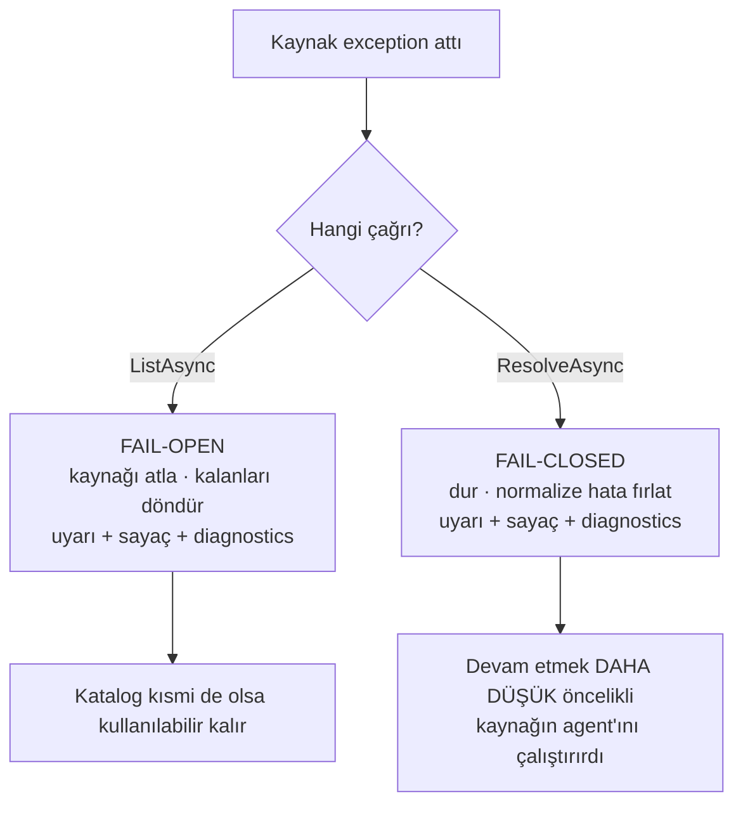

# Faz 101 — Kaynak Sözleşmesinin Yayını

> **Durum:** ✅ Tamamlandı (2026-08-25)
> **Kaynak:** Doğrudan kullanıcı isteği (2026-08-25) — `IAgentSource` üçüncü
> taraf uygulanabilirlik incelemesi. Aday listesinden gelmedi; Faz 98 · 99 · 100
> ile aynı damardır: `preview.1` öncesi genişleme noktası olgunlaştırma.
> **Önkoşul:** [Faz 100](100-YARGIC-SOZLESMESININ-YAYINI.md) — bu faz
> ondan dört şey devralır: `ContractCoverage` aile mekanizması (K-610), opt-in
> sözleşme sınıfı kuralı (K-611), `AgentPrismJudgeException` hata normalizasyon
> deseni ve yalnız-NuGet sample emsali (test projesi kısıtı dahil, bkz. Risk R4).
> **Paketler:** `AgentPrism.Abstractions`, `AgentPrism.Core`,
> `AgentPrism.AspNetCore`, `AgentPrism.Testing.Contracts.Xunit`, `samples/`
> **Yeni paket:** Yok — sözleşme suite'i var olan pakete dördüncü bir ad alanı
> ekler · **Migration:** Yok
> **Public API:** Büyüyor. Ölçüldü (2026-08-25): `wc -l src/*/PublicAPI.Shipped.txt`
> = 17 satır, hepsi `#nullable enable` başlığı — **her dosya boştur**. Bu fazın
> dokunduğu her tip bugün bedava değişir; `preview.1` yayınlandıktan sonra
> `AgentDefinitionOrigin`, `AgentDescriptor` ve `IAgentSource` üzerindeki her
> değişiklik kırıcıdır (K-603).
> **Tüketici yüzeyi:** site: yeni `guides/write-your-own-agent-source.md`,
> `concepts/agents.md` ("two sources" cümlesi yanlış), `packages.md`,
> `capabilities.md` · sevk edilen: `IAgentSource` · `IVersionedAgentSource` ·
> `AgentDescriptor` · `AgentDefinitionOrigin` XML dokümanı,
> `src/AgentPrism.Testing.Contracts.Xunit/README.md`
> **Manuel test alanı:** [`docs/manuel-test/02-CEKIRDEK-VE-KATALOG.md`](../../manuel-test/02-CEKIRDEK-VE-KATALOG.md)
> (`CORE` öneki, bugün 55 case)

---

## Bu Faza Başlarken

> `faz-baslangic` skill'ini uygula. Aşağıdaki liste o skill'in 2. adımıdır —
> **tamamını değil, yalnız işaret edilen bölümleri oku.**

1. Bu doküman
2. Kararlar — dosyanın tamamını **okuma**, yalnız bu kalemleri grep'le:
   ```bash
   grep -n "K-019\|K-148\|K-610\|K-611\|K-603" docs/KARARLAR.md
   ```
   **K-019** (satır 65 — kaynaklar neden soyutlandı, öncelik değerleri nereden
   geliyor), **K-148** (satır 194 — sürüm çözümü neden ayrı marker arayüzü),
   **K-610** (satır 656 — `ContractCoverage` aile mekanizması; dördüncü aile
   aynı deseni tekrarlar), **K-611** (satır 657 — isteğe bağlı davranış ayrı
   opt-in sınıftır, atlanan senaryo değildir), **K-603** (satır 649 —
   `PublicAPI.Shipped.txt` boştur, yüzey bugün bedava değişir).
3. [`arsiv/fazlar/100-YARGIC-SOZLESMESININ-YAYINI.md`](100-YARGIC-SOZLESMESININ-YAYINI.md)
   — yalnız devir notu ve sapmalar:
   ```bash
   awk '/## Plandan Sapmalar/,0' docs/arsiv/fazlar/100-YARGIC-SOZLESMESININ-YAYINI.md
   ```
   Neden: sample test projesinin neden eklenemediğini (yayınlanmamış sözleşme
   paketi) ve `AgentPrismJudgeException`'ın şeklini oradan devralıyorsun.
4. Alan hafızası (bu faz iki alana dokunuyor):
   [`hafiza/cekirdek-calistirma.md`](../../hafiza/cekirdek-calistirma.md) (katalog ve
   derleyici tuzakları) · [`hafiza/dokumantasyon.md`](../../hafiza/dokumantasyon.md)
   (site ile `docs/` sınırı, üretilen `api/` sayfaları)
5. Gerektiğinde, tamamı değil ilgili bölümü:
   [`MIMARI.md`](../../MIMARI.md) — katalog katmanı (`IAgentCatalog ◄ IAgentSource[]`
   satırı, 62. satır civarı)

---

## Amaç

`IAgentSource`, AgentPrism'in dört genişleme noktasından dördüncüsüdür. Faz 98
depolamayı, Faz 99 sağlayıcıyı, Faz 100 yargıcı sevk edilen yüzeye taşıdı.
Kaynak taşınmadı. Bugün bir üçüncü taraf `IAgentSource` uygulaması yazarsa
**AgentPrism kaynak kodunu okumak zorundadır**: arayüz derlenir, ama derlendikten
sonra sessizce yanlış davranan on beş kural hiçbir sevk edilen yüzeyde yazmaz.

Bu faz üç şey üretir: (1) sözleşmenin **sevk edilen metnini**, (2) sözleşmeyi
tutan **runtime davranışını** — bugün tutmuyor, (3) sözleşmeyi kanıtlayan
**koşulabilir suite'i** ve bir sample'ı.

- **Kapsam** — `IAgentSource` · `IVersionedAgentSource` · `AgentDescriptor` ·
  `AgentDefinitionOrigin` · `CompositeAgentCatalog` · kayıt yüzeyi · sözleşme
  ailesi · sample · rehber.

### Bugün ne çalışmıyor — doğrulanmış kanıt

| Kanıt | Gözlem |
|---|---|
| [`IAgentSource.cs:28`](../../../src/AgentPrism.Abstractions/Agents/IAgentSource.cs) | `Priority` remark'ı "10 for the MAF hosting source" der. `grep -rln IAgentSource --include=*.cs src/` altı dosya döner; **MAF hosting kaynağı yoktur**. K-019 onu Faz 4'e planlamıştı, gelmedi. Yanlış metin `docs-site/src/content/docs/api/AgentPrism.IAgentSource.md` içinde **yayındadır** |
| [`IAgentSource.cs:8-10`](../../../src/AgentPrism.Abstractions/Agents/IAgentSource.cs) | Cümle kırık: "the ones stored in the database and (from onwards) …". Faz numarası düşmüş; sevk edilen metinde iç faz referansının kalıntısı |
| [`AgentDefinitionOrigin.cs:22-25`](../../../src/AgentPrism.Abstractions/Agents/AgentDefinitionOrigin.cs) | Yalnız `Code = 0` ve `Database = 1`. Üçüncü taraf kaynağın doğru bir origin değeri **yok** |
| [`AgentEndpoints.cs:419`](../../../src/AgentPrism.AspNetCore/Endpoints/AgentEndpoints.cs) | `IsEditable = descriptor.Origin == AgentDefinitionOrigin.Database`. `Database` seçen üçüncü taraf kaynağın agent'ı için konsol düzenleme formu açar; `PUT` ise `definitions.GetAsync(name)` null döndüğü için `404` verir |
| [`CompositeAgentCatalog.cs`](../../../src/AgentPrism.Core/Catalog/CompositeAgentCatalog.cs) | Dosyada `try`/`catch` sayısı **sıfır**. Bir kaynağın exception'ı bütün katalogu düşürür |
| [`ExternalSurfaceGuard.cs:69`](../../../src/AgentPrism.AspNetCore/Security/ExternalSurfaceGuard.cs) | Katalog hatası A2A/MCP yüzeyinde **sınırsız** retry'a girer; yalnız `ApplicationStopping` durdurur |
| [`AgentPrismA2AExtensions.cs:94`](../../../src/AgentPrism.AspNetCore/A2A/AgentPrismA2AExtensions.cs) | Startup'ta `catalog.ListAsync().AsTask().GetAwaiter().GetResult()` — sync-over-async, token'sız, geniş `catch` ile yutulur |
| [`CompositeAgentCatalog.cs:147-161`](../../../src/AgentPrism.Core/Catalog/CompositeAgentCatalog.cs) | Kaynak listelemediği bir adı resolve ederse katalog descriptor **uydurur**: `Origin = Code`, `Model = null`. Yalan atıf üretir |
| [`RunRecordingAgentDecorator.cs:129-138`](../../../src/AgentPrism.Core/Recording/RunRecordingAgentDecorator.cs) | Descriptor'ın `Model.Model`, `Model.Provider`, `Version` alanları **run kaydına yazılır**. Uydurulan descriptor bu üçünü boş bırakır |
| [`CompositeAgentCatalog.cs:41-70`](../../../src/AgentPrism.Core/Catalog/CompositeAgentCatalog.cs) | `ListAsync` yeni bir liste üretir ama descriptor nesnelerini **kopyalamaz**. `ToolNames`/`SkillNames`/`CallableAgentNames` alanları `IReadOnlyList<string>`'tir; arkasındaki `List<string>` sonradan değiştirilebilir |
| [`ModelBinding.cs:70`](../../../src/AgentPrism.Abstractions/Agents/ModelBinding.cs) | `ProviderSettings` `IReadOnlyDictionary<string, JsonElement>`'tır — aynı mutation yüzeyi. `Fallbacks` (satır 108) `IReadOnlyList<ModelFallback>` |
| [`AgentSkillCatalog.cs:129`](../../../src/AgentPrism.Core/Skills/AgentSkillCatalog.cs) | `ResolvedAgentSkills` **`internal`**. `AgentDefinitionCompiler.ResolveSkillsAsync` (satır 558) ve `ResolveSharedInstructionsAsync` (satır 452) de `internal` |
| [`IAgentPrismBuilder.cs`](../../../src/AgentPrism.Core/IAgentPrismBuilder.cs) | On kayıt metodu var (`AddTool`, `AddAgent`, `AddSkill`, `AddModelProvider`, `AddEvalCheck`…). `AddAgentSource` **yok** — üçüncü taraf `TryAddEnumerable(ServiceDescriptor.Singleton<IAgentSource, T>())` yazmak zorunda |
| [`ContractCoverage.cs:31-37`](../../../src/AgentPrism.Testing.Contracts.Xunit/ContractCoverage.cs) | Üç aile sabiti: `StorageContracts`, `ProviderContracts`, `JudgeContracts`. Kaynak ailesi yok; `Contracts/` altında 38 dosya, hiçbiri agent source değil |
| [`concepts/agents.md:110`](../../../docs-site/src/content/docs/concepts/agents.md) | "The catalog merges **two** sources" — kümeyi kapalı gösterir. `IAgentSource` sitede bir genişleme noktası olarak **hiç** geçmez |
| `samples/` | `CustomModelProvider`, `CustomRunJudge`, `FileRunStore` var. `CustomAgentSource` **yok** |
| [`AgentPrismServiceCollectionExtensions.cs:690`](../../../src/AgentPrism.Core/AgentPrismServiceCollectionExtensions.cs) | `RunJudgeValidationService` yargıç seam'i için startup fail-fast yapar. Kaynak seam'inde karşılığı yok: aynı adlı iki kod agent'ı hatası (`CodeAgentSource.cs:56`) singleton lazy olduğu için **ilk HTTP isteğinde** çıkar |

> Kanıtların tamamı 2026-08-25 tarihinde, `88669f6` commit'i üzerinde doğrulandı.

### Kanıt düzeltmesi — incelemede yanlış çıkan iki iddia

Plan bunları **taşımaz**; kayda geçirilir ki uygulayan oturum aramasın:

- **"Üçüncü taraf kaynağın agent'ı `PUT` ile gölge bir veritabanı kaydına
  yazılabilir."** Yanlış. `UpdateAgentAsync` `definitions.GetAsync(name)` null
  dönerse `404` verir ([`AgentEndpoints.cs:555`](../../../src/AgentPrism.AspNetCore/Endpoints/AgentEndpoints.cs)).
  Gölge yazma yoktur; sorun yalnız yanlış `IsEditable` ve boşuna açılan formdur.
- **"`AgentDescriptor` bir `metadata` alanı taşır."** Yanlış. `metadata`
  `AgentDefinition`'dadır (satır 125); `AgentDescriptor`'da **yoktur**. Kaynak
  sözleşmesi `AgentDefinition` değil `AgentDescriptor` döndürdüğü için metadata
  bu fazın mutation kapsamına girmez.

---

## 101.1 — Sevk edilen sözleşme metni

`IAgentSource`'un XML'i `IRunJudge` seviyesine çıkar. Ölçüt: `IRunJudge`
lifetime, thread-safety, idempotency, ad formatı, `CancellationToken` semantiği
ve tenant otoritesini **arayüzün kendi `<remarks>`'ında** yazar.

Yazılacak on üç madde. Her biri bugünkü gerçek davranıştır; hiçbiri yeni kural
değildir:

| # | Madde |
|---|---|
| M1 | Uygulama **singleton** olarak kaydedilir ve öyle çözülür |
| M2 | Aynı instance **eşzamanlı** çağrılır; thread-safe olmalıdır |
| M3 | İstek/`run` başına değişen durum **instance alanında tutulmaz** |
| M4 | Scoped bir servis doğrudan capture edilmez; gerekiyorsa `IServiceProvider` üzerinden `run` anında scope açılır |
| M5 | `ListAsync` **sıcak yoldadır** — startup snapshot API'si değildir. Her başarılı `ResolveAsync` bir `ListAsync` tetikler; sürüm çözümünde agent bulunana kadar **her** kaynağın `ListAsync`'i çağrılır |
| M6 | `ListAsync` tekrar tekrar çağrılabilir; side-effect free ve tekrar çağrı güvenli olmalıdır |
| M7 | `ResolveAsync` ile `ListAsync` **aynı kümeyi** anlatmalıdır (101.5) |
| M8 | Kaynak kendi cache'ini tutuyorsa invalidation **kendi sorumluluğudur** |
| M9 | AgentPrism kaynak sonucunu **global snapshot olarak cache'lemez**; her çağrı kaynağa gider |
| M10 | `CancellationToken` gerçek çağıran token'ıdır. AgentPrism kaynak düzeyinde **timeout, retry veya circuit breaker uygulamaz**; kaynak kendi zaman aşımını koyar |
| M11 | Kaynak global veya kiracıya duyarlı olabilir. İkisi de meşrudur; `ITenantContext` okumak meşrudur (101.13) |
| M12 | Startup ve arka plan çağrılarında ambient kiracı **varsayılan kiracıdır** (101.13) |
| M13 | Döndürülen descriptor ve koleksiyonları **döndürüldükten sonra değiştirilemez** (101.6) |

Aynı anda düzeltilecek yanlış metinler:

- `IAgentSource` özet cümlesindeki kırık "(from onwards)" ifadesi
- Var olmayan MAF hosting kaynağı referansı (özet **ve** `<remarks>`)
- `Priority` remark'ındaki "10 for the MAF hosting source"
- `AgentDefinitionOrigin.Code`'un "validated at compile time" cümlesi — üçüncü
  taraf değeri geldikten sonra bu cümle yalnız `Code` için doğrudur, metin buna
  göre daraltılır

> 🚨 Bu metinler **sevk edilen yüzeydedir**. `docs-site/src/content/docs/api/`
> altındaki sayfalar XML'den **üretilir**; kaynağı düzeltmeden sayfayı düzeltme.

---

## 101.2 — `AgentDefinitionOrigin.Custom`

**Karar (kullanıcı, 2026-08-25): değerin adı `Custom`.** Gerekçe: repo'nun
genişleme noktası sözlüğü zaten `Custom`'dır — `CustomModelProvider`,
`CustomRunJudge` sample'ları ve "write your own" rehberleri. `External` bu
repo'da **başka** bir şey demektir (`ExternalSurfaceGuard`,
`ApiKeyScope.ExternalInvoke`, `ExternalAgentProxy` — hepsi "dışarıdan bize gelen
çağrı"); `Source` `SourceName` ile totolojik okunur; `Provider` `IModelProvider`
ile çakışır.

```csharp
public enum AgentDefinitionOrigin
{
    Code = 0,
    Database = 1,
    Custom = 2,
}
```

Semantik: *tanım üçüncü taraf/özel bir `IAgentSource`'tan geldi ve AgentPrism'in
yerleşik veritabanı düzenleme yüzeyinden düzenlenemez.*

Etkilenen davranışlar:

| Yer | Bugün | Sonra |
|---|---|---|
| `AgentEndpoints.cs:419` `IsEditable` | `Origin == Database` | Değişmez — `Custom` doğal olarak `false` üretir |
| `GuardCodeAgentAsync` (`PUT`/`DELETE`) | Yalnız `Code`'u `409` ile korur | `Custom` da `409` ile korunur; bugünkü `404` yanıltıcıdır |
| `CreateAgentAsync` ad çakışması | `Code` ise "kod agent'ı" mesajı, değilse "PUT kullan" | Üçüncü bir dal: `Custom` ise "bu ad `{source}` kaynağına aittir" |
| Konsol rozeti | `origin.code` / `origin.database` / **ulaşılamaz** `origin.other` | `origin.other` artık ulaşılabilir; metin gözden geçirilir |
| `agents.tsx` rozet mantığı | iki dal + ölü `else` | üç dal |

> Wire etkisi: `AgentDefinitionOrigin` JSON'a **ad olarak** yazılır
> (`JsonStringEnumConverter`), sayı olarak değil. Yeni değer eski istemcide
> tanınmayan bir dize üretir — bu yüzden `preview.1`'den **önce** eklenmelidir.

---

## 101.3 — Kaynak hatasının izolasyonu ve normalize edilmesi

**Bugün:** `CompositeAgentCatalog`'da hiç `try`/`catch` yok. Bir kaynağın
exception'ı `GET /api/agents`'ı `500` yapar, A2A/MCP yüzeyini sınırsız retry'a
sokar, ham üçüncü taraf metnini dışarı taşır.

**Sonra:** `ListAsync` ile `ResolveAsync` **farklı** davranır. Fark bilinçlidir.



**`ListAsync` — fail-open.** Hatalı kaynak atlanır, diğer kaynakların agent'ları
döner. Gerekçe: katalog listesi bir okuma yüzeyidir; tek kaynağın hatası konsolu
ve `/api/agents`'ı tümden karartmamalıdır.

**`ResolveAsync` — fail-closed** (kullanıcı kararı, 2026-08-25). Öncelik
sırasında hata veren kaynak o adı **sahiplenebilecek** durumdadır. Atlayıp devam
etmek daha düşük öncelikli kaynağın agent'ını çalıştırır — çağıran bunu fark
etmez. Sessizce farklı agent çalıştırmak bir davranış sınırıdır; kısmi
kullanılabilirlik kaybına tercih edilir.

> Kapsam notu: fail-closed yalnız **kazanan kaynağa kadar** geçerlidir. Bir
> kaynak agent'ı döndürdükten sonra döngü zaten biter; daha düşük öncelikli
> kaynakların hatası hiç görülmez.

Normalizasyon — `AgentPrismJudgeException` desenini birebir izler:

```csharp
public sealed class AgentPrismAgentSourceException : AgentPrismException
{
    public const string SourceFailedErrorType = "agent_source_failed";
    public const string SourceContractErrorType = "agent_source_contract";

    public AgentPrismAgentSourceException(
        string sourceName, string errorType, string message, Exception? innerException = null);

    public string SourceName { get; }
    public override string ErrorType { get; }
}
```

Kurallar:

- Ham üçüncü taraf mesajı **public yanıta girmez**. Yanıt `{kaynak adı} ({kod})`
  biçimini kullanır — Faz 100'ün `502` gövdesiyle aynı kural.
- Ham exception `InnerException` olarak **korunur** ve log'a yazılır.
- `OperationCanceledException` normalize **edilmez**; gerçek iptal yayılır.
- Hata sessizce yutulmaz: her hata bir `LogError`, bir metrik sayacı ve bir
  diagnostics kaydı üretir.

Gözlemlenebilirlik yüzeyi:

| Yüzey | Ne görünür |
|---|---|
| Log | `LogError` — kaynak adı, işlem (`list`/`resolve`), ham exception |
| Metrik | `AgentPrismMetrics` üzerinde yeni `AgentSourceFailures` sayacı; etiketler: kaynak adı + işlem |
| Diagnostics | `AgentPrismDiagnosticsReport`'a kayıtlı kaynakların listesi (ad, `Priority`, uygulama tipi) eklenir |

> `/health` bu fazda **değiştirilmez**. Geçici bir üçüncü taraf hatasının
> uygulamayı `Unhealthy` yapması istenmiyor; gerekçe Açık Soru 3'te tartışılır.

---

## 101.4 — Başlangıçta yapısal doğrulama

`RunJudgeValidationService` deseni (`AgentPrismServiceCollectionExtensions.cs:690`)
kaynak seam'ine taşınır.

**Ölçüldü — startup'ta `ListAsync` çağrılmayacak.** Gerekçe kanıtlıdır:
`ExternalSurfaceGuard.ListCatalogWithRetryAsync`'in tamamı, `AutoApplyMigrations=false`
kurulumunda şemanın startup anında **sorgulanabilir olmadığı** için yazılmıştır.
Startup'ta bloklayan bir canlı liste çağrısı o kurulumları başlatmaz hâle
getirir. Aynı gerekçe I/O yapan üçüncü taraf kaynaklar için de geçerlidir.

Bu yüzden doğrulama **iki katmana** ayrılır:

| Katman | Ne zaman | Ne doğrulanır | Maliyet |
|---|---|---|---|
| **Yapısal** — `AgentSourceValidationService` (`IHostedService`) | Host başlarken | `IEnumerable<IAgentSource>` çözülür (kurucu hataları ve captive dependency **burada** patlar) · `Name` boş/whitespace değil · `Name` benzersiz (`OrdinalIgnoreCase`) · `Priority` `int` aralığında ve yinelenmiyorsa uyarı | I/O **yok** |
| **Sınır** — `CompositeAgentCatalog` | Her `ListAsync` | Descriptor `Name` boş/whitespace değil · Aynı kaynak içinde yinelenen agent adı · Kaynaklar arası yinelenen ad (öncelik sözleşmesi) | Zaten yapılan çağrının içinde |

Yapısal katman `IEnumerable<IAgentSource>`'u çözer; bu tek başına bugünkü
gecikmiş hatayı öne çeker: `CodeAgentSource`'un yinelenen ad kontrolü
(`CodeAgentSource.cs:56`) artık ilk HTTP isteğinde değil, host başlarken çalışır.

Sınır katmanı canlı I/O gerektiren invariant'ları taşır ve **her çağrıda**
uygulanır — startup'ta bir kez değil. Kaynak sonradan bozulursa da yakalanır.

---

## 101.5 — `ListAsync` / `ResolveAsync` tutarlılığı

**Bugün:** Kaynak, listelemediği bir adı resolve edebilir. Katalog descriptor
uydurur ve `Origin = Code`, `Model = null` yazar
(`CompositeAgentCatalog.cs:147-161`). Bu iki ayrı kusur üretir: düşük `Priority`
numaralı bir kaynak listede görünmeden bütün adları ele geçirebilir, ve run
kaydı yalan atıf alır.

**Sonra (kullanıcı kararı, 2026-08-25): uyarı + dürüst descriptor.**

- Uydurma **kalkar**. Descriptor `SourceName = source.Name` ve kaynağın gerçek
  origin'i ile üretilir. Origin'i kaynağın kendi listesinden öğrenemiyorsak
  `Custom` kullanılır — `Code` **asla** varsayılmaz.
- Tutarsızlık bir sözleşme ihlalidir: `LogWarning` + `AgentSourceFailures`
  sayacı (`operation=consistency`) + diagnostics.
- **Hata atılmaz.** Gerekçe: meşru bir yarış vardır — `ResolveAsync` ile
  `ListAsync` arasında agent silinebilir (`DELETE /api/agents/{name}`). Sert
  hata bu durumda doğru bir çağrıyı patlatır ve yerleşik veritabanı kaynağını
  kırılgan yapar.

> Hijack riski bununla **tamamen** kapanmaz; görünür hâle gelir. Tam kapatma
> `ResolveAsync`'in listeye karşı zorlanmasını isterdi ve o da silme yarışını
> patlatırdı. Sözleşme metni (101.1 · M7) kuralı yazar, runtime ihlali raporlar.

---

## 101.6 — Descriptor mutation: sınırda dondurma

**Karar (kullanıcı, 2026-08-25): sınırda savunmacı kopya.** `AgentDescriptor`
tipi değişmez; `preview.1` penceresinde JSON şeklini, kaynak uyumluluğunu ve AOT
serileştirmesini riske atmıyoruz.

`CompositeAgentCatalog`, kaynaktan gelen her descriptor'ı sınırda dondurur:

| Alan | Bugün | Sonra |
|---|---|---|
| `ToolNames` | Kaynağın verdiği örnek | Kopya |
| `SkillNames` | Kaynağın verdiği örnek | Kopya |
| `CallableAgentNames` | Kaynağın verdiği örnek | Kopya |
| `Model` (`ModelBinding`) | Kaynağın verdiği örnek | `ProviderSettings` ve `Fallbacks` kopyalanır |
| `Name`, `DisplayName`, `Description`, `Version`, `UsesHarness`, `UpdatedAt` | Değer/dize — risk yok | Değişmez |

Dondurma **hem** `ListAsync` **hem** `ResolveAsync` yolunda uygulanır; ikisi de
descriptor'ı dışarı verir (`ResolveAsync` onu decorator'lara, decorator da run
kaydına taşır — `RunRecordingAgentDecorator.cs:129-138`).

> Maliyet: descriptor başına küçük ayırma. Ölçülmedi; 101.14'teki cardinality
> notu bu maliyeti kaynak yazarına bildirir. Ölçüm DoD'dedir.

---

## 101.7 — Derleme bağımlılıkları için tek public yol

### Önce ölçüm: üçüncü taraf bunlara gerçekten ihtiyaç duyuyor mu?

Üçüncü taraf kaynaklar **iki şekle** ayrılır ve ihtiyaç yalnız birinde vardır:

| Şekil | Ne yapar | Derleyici/cache ihtiyacı |
|---|---|---|
| **A — tanım taşıyan kaynak** | Bir `AgentDefinition`'ı başka yerde tutar (GitOps deposu, S3, başka veritabanı) ve AgentPrism'in derlemesini ister | **Var** |
| **B — agent taşıyan kaynak** | Yabancı bir runtime'ı sarar, doğrudan `AIAgent` döndürür | **Yok** |

Şekil A için bugün public yüzeyden **ne erişilebiliyor**:

| Girdi | Durum |
|---|---|
| `AgentDefinitionCompiler.CompileAsync(definition, callable, culture, ct)` | ✅ public |
| `ResolveCallableAgentsAsync` → `ResolvedCallableAgents.Fingerprint` | ✅ public |
| `UsesTenantProviderOverrideAsync` (BYOK bypass) | ✅ public |
| `CompiledAgentCache.GetOrAddAsync` + `CombineFingerprints` | ✅ public |
| Skill fingerprint (`ResolveSkillsAsync`, `ResolvedAgentSkills`) | ❌ internal |
| Paylaşılan talimat fingerprint'i (`ResolveSharedInstructionsAsync`) | ❌ internal |

**Ölçüm sonucu:** altı girdiden dördü public. Şekil A'daki bir kaynak bugün
derleyebilir ama **doğru anahtarlayamaz**: skill veya paylaşılan talimat bloğu
değiştiğinde cache bayatlar ve kaynak bunu fark etmez. İhtiyaç gerçektir ve
kısmidir — tam engel değil, sessiz bozulma üreticisidir.

### Çözüm: seçenek B — tek yüksek seviyeli yol

Kullanıcı tercihi ve ölçüm aynı yere çıkıyor. Üç `internal` metodu public yapmak
(seçenek A) algoritmayı kopyalatmaya devam ederdi; üstelik bugün **aynı blok
kodda üç kez tekrarlıdır** (`CodeAgentSource.ResolveAsync`,
`DefinitionStoreAgentSource.ResolveAsync`, `.ResolveVersionAsync`).

İki üyeli bir yüzey önerilir:

```csharp
// AgentPrism.Core — AgentDefinitionCompiler üzerinde

/// Bir tanımın derleme bağımlılıklarını ve cache doğruluğu girdilerini
/// TEK ÇAĞRIDA çözer.
public ValueTask<AgentCompilationDependencies> ResolveDependenciesAsync(
    AgentDefinition definition,
    CancellationToken cancellationToken = default);

/// Tanımı derler ve SONUCU DOĞRU ANAHTARLA cache'e koyar.
/// Kiracıya özgü sağlayıcı kimlik bilgisi (BYOK) varsa cache TAMAMEN atlanır.
public ValueTask<AIAgent> CompileCachedAsync(
    AgentDefinition definition,
    CompiledAgentCache cache,
    string tenantId,
    string? culture = null,
    CancellationToken cancellationToken = default);

// AgentPrism.Abstractions veya Core — taşıyıcı tip
public sealed record AgentCompilationDependencies
{
    public required ResolvedCallableAgents CallableAgents { get; init; }
    /// Skill · alt agent · paylaşılan talimat fingerprint'lerinin birleşimi.
    public required string CacheFingerprint { get; init; }
    /// true ise sonuç CompiledAgentCache'e KONULMAMALIDIR (BYOK).
    public required bool BypassCache { get; init; }
}
```

`CompileCachedAsync` doğru yolu **tek yol** yapar: fingerprint birleştirme ve
BYOK bypass kararı içeridedir, kaçırılamaz. `ResolveDependenciesAsync` kendi
cache'ini kuran kaynak için kaçış merdivenidir.

İki yerleşik kaynak da bu metoda taşınır; üç kopya bire iner. Bu bir sınıf
taramasıdır: aynı bloğun üçüncü kopyası zaten bir kusur sınıfı işaretidir.

> 🚨 `CompileCachedAsync`'in `cache` parametresi alması bilinçlidir. `AgentDefinitionCompiler`
> bugün `CompiledAgentCache`'e bağımlı **değildir**; bağımlılığı kurucuya koymak
> DI grafiğinde yeni bir kenar açar. Parametre olarak almak bunu önler. Alternatif
> yerleşim (metodu `CompiledAgentCache` üzerine koymak) Açık Soru 4'tedir.

---

## 101.8 — `AddAgentSource` kayıt yüzeyi

**Bugün:** Üçüncü taraf `services.TryAddEnumerable(ServiceDescriptor.Singleton<IAgentSource, MySource>())`
yazmak zorundadır. Bu, bir public genişleme noktası için fazla düşük seviyelidir
ve `IModelProvider`'ın ergonomisiyle tutarsızdır.

`IAgentPrismBuilder`'a iki aşırı yükleme eklenir — `AddModelProvider`'ın şekli
(`AgentPrismBuilder.cs:92-106`) izlenir:

```csharp
IAgentPrismBuilder AddAgentSource<TSource>() where TSource : class, IAgentSource;
IAgentPrismBuilder AddAgentSource(IAgentSource source);
IAgentPrismBuilder AddAgentSource(Func<IServiceProvider, IAgentSource> factory);
```

- Singleton lifetime **API tarafından garanti edilir**; çağıran seçemez.
- Tip tabanlı aşırı yükleme `TryAddEnumerable` kullanır: aynı tip iki kez
  eklenemez. Örnek ve factory aşırı yüklemeleri `AddSingleton` kullanır — aynı
  tipten iki farklı yapılandırma meşrudur (iki ayrı GitOps deposu gibi).
- `IAgentPrismBuilder` bir public arayüzdür; üye eklemek onu uygulayanlar için
  kırıcıdır. `PublicAPI.Shipped.txt` boş olduğu için bugün bedavadır (K-603).

---

## 101.9 — Öncelik sözleşmesi

Bugünkü davranış deterministiktir ama yazılı değildir. Yazılacaklar:

| Soru | Cevap |
|---|---|
| Hangi sayı önce çalışır? | **Küçük olan.** `_sources = [.. sources.OrderBy(s => s.Priority)]` (`CompositeAgentCatalog.cs:35`) |
| Eşit `Priority` nasıl çözülür? | **DI kayıt sırası.** `Enumerable.OrderBy` belgelenmiş biçimde **kararlı** (stable) bir sıralamadır; eşit anahtarlar giriş sırasını korur. `GetServices<T>()` kayıt sırasını döndürür |
| Bu bir sözleşme mi? | **Evet** — bu fazdan sonra yazılı sözleşmedir |
| Yerleşik değerler rezerve mi? | **Evet.** `0` kod, `100` veritabanı kaynağına aittir |

Yerleşik değerler koda taşınır ki XML üçüncü tarafı yanlış sayıya yönlendirmesin:

```csharp
/// Yerleşik kaynakların ayrılmış öncelik değerleri.
public static class AgentSourcePriority
{
    /// Kod kaynağı. Kod agent'ları derleme anında doğrulanır ve ad çakışmasını kazanır.
    public const int Code = 0;

    /// Veritabanı kaynağı.
    public const int Database = 100;
}
```

Rehber şunu yazar: özel bir kaynak **kod ile veritabanı arasına** girmek için
`1..99`, veritabanının arkasına düşmek için `101` ve üzerini seçer; `0` veya
`100` seçmek yerleşik kaynakla eşitlik üretir ve sırayı DI kayıt sırasına
bırakır.

> Yeni bir enum veya öncelik soyutlaması **eklenmez**. İki `const int` bir
> soyutlama değil, koda taşınmış dokümandır.

---

## 101.10 — `AgentSourceContract` ailesi

Dördüncü sözleşme ailesi. K-610 deseni aynen tekrarlanır.

```csharp
namespace AgentPrism.Testing.Contracts.AgentSources;

public abstract class AgentSourceContract
{
    /// Test edilecek kaynağı üretir. Her çağrı ÇALIŞAN bir örnek döndürür.
    protected abstract IAgentSource CreateSource();

    /// Kaynağın kesin olarak taşıdığı bir agent adı.
    protected abstract string KnownAgentName { get; }

    /// Kaynağın kesin olarak TAŞIMADIĞI bir agent adı.
    protected virtual string UnknownAgentName => "agentprism-contract-absent";
}
```

`ContractCoverage`'a dördüncü sabit eklenir:

```csharp
public const string AgentSourceContracts = "AgentPrism.Testing.Contracts.AgentSources";
```

Suite'in kapsayacağı senaryolar:

| # | Senaryo |
|---|---|
| 1 | `Name` boş/whitespace değil |
| 2 | `Priority` iki çağrıda aynı değeri döndürür (sabit) |
| 3 | `ListAsync` tekrar çağrılabilir; ikinci çağrı aynı ad kümesini döndürür |
| 4 | `ListAsync` eşzamanlı çağrılabilir (N paralel çağrı, tutarlı sonuç, exception yok) |
| 5 | `ResolveAsync` eşzamanlı çağrılabilir |
| 6 | `ListAsync` yinelenen agent adı **döndürmez** |
| 7 | Her descriptor'ın `Name`'i boş/whitespace değil |
| 8 | Her descriptor'ın `SourceName`'i kaynağın `Name`'i ile aynı |
| 9 | `ResolveAsync(KnownAgentName)` null olmayan bir agent döndürür |
| 10 | `ResolveAsync(UnknownAgentName)` **null döndürür** — exception atmaz |
| 11 | Tutarlılık: `ResolveAsync` null olmayan döndürdüğü her ad `ListAsync` çıktısında görünür |
| 12 | İptal: iptal edilmiş token ile çağrı `OperationCanceledException` yayar veya tamamlanır — **asılı kalmaz** |
| 13 | Mutation: `ListAsync`'ten dönen koleksiyonun değiştirilmesi sonraki çağrıyı etkilemez |

Opt-in ek sınıflar (K-611 — atlanan senaryo değil, ayrı sınıf):

| Sınıf | Kime |
|---|---|
| `VersionedAgentSourceContract` | `IVersionedAgentSource` uygulayan kaynaklar: sürüm çözümü, olmayan sürümde null |
| `TenantAwareAgentSourceContract` | Kiracıya duyarlı kaynaklar: kiracı A'nın listesi kiracı B'nin agent'ını içermez |

> 🚨 `CompositeAgentCatalog` davranışları bu sınıflara **girmez**. Öncelik
> çözümü, hata izolasyonu, descriptor dondurma ve tutarlılık uyarısı katalogun
> işidir, kaynağın değil. Onlar `tests/AgentPrism.Core.UnitTests/Catalog/`
> altında kalır.

---

## 101.11 — Yerleşik kaynakların suite'e bağlanması

`CodeAgentSource` ve `DefinitionStoreAgentSource` yeni suite'i geçer. İkisi
`internal` olduğu için test derlemesi `InternalsVisibleTo` üzerinden erişir —
bugünkü düzen zaten böyledir.

| Kaynak | Temel suite | Opt-in ekler |
|---|---|---|
| `CodeAgentSource` | ✅ | — (sürümü yok; kiracıdan bağımsızdır) |
| `DefinitionStoreAgentSource` | ✅ | `VersionedAgentSourceContract` · `TenantAwareAgentSourceContract` |

Bir kapsam testi (`AgentSourceContractCoverageTests`) `ContractCoverage.MissingDerivedTypes`
ile ailenin tamamının türetildiğini kanıtlar.

> Mevcut üç ailenin kapsam testleri (dört depolama koşumu + sağlayıcı + yargıç)
> **yeşil kalmalıdır**. K-610'un tam gerekçesi budur: aile eklemek başkasının
> kapısını kırmamalıdır.

---

## 101.12 — Sample ve rehber

```
samples/AgentPrism.Samples.CustomAgentSource/        # yalnız PackageReference
samples/AgentPrism.Samples.CustomAgentSource.Tests/  # bkz. Risk R4
```

Sample'ın şekli: **A — tanım taşıyan kaynak.** Dosya sisteminden JSON
`AgentDefinition` okuyan bir kaynak. Gerekçe: şekil A hem derleyici/cache
yolunu (101.7) hem descriptor invariant'larını kullanır; şekil B bunların
hiçbirine dokunmaz ve sözleşmenin yarısını kanıtsız bırakır.

Sample'ın kanıtlaması gerekenler:

- `ProjectReference` **yok** (`grep -c ProjectReference` → `0`)
- `AddAgentSource<T>()` ile kaydedilir — `TryAddEnumerable` görünmez
- `CompileCachedAsync` ile derler; BYOK bypass'ı kaçırmaz
- Descriptor'ları `Origin = Custom` taşır
- `AgentSourceContract` suite'ini geçer
- `samples/AgentPrism.Api` üzerinde list + resolve + gerçek `run` yolu koşar
- Konsolda `Custom` rozeti görünür ve düzenleme formu **açılmaz**

Site rehberi: `docs-site/src/content/docs/guides/write-your-own-agent-source.md`.
`write-your-own-store.md`'nin "davranış eksenleri" tablosu şablon alınır.
Rehberin taşıyacağı bölümler: iki kaynak şekli (A/B) · 101.1'deki on üç madde ·
kayıt reçetesi · öncelik seçimi (101.9) · kiracı (101.13) · cardinality
(101.14) · sözleşme suite'i.

Aynı turda düzeltilecek site metni: `concepts/agents.md:110` "The catalog merges
**two** sources" — kaynak kümesi kapalı değildir.

---

## 101.13 — Kiracı sözleşmesi

Yeni API **eklenmez**. Marker veya capability arayüzü, iki yerleşik kaynağın
ihtiyaç duymadığı bir üstveri olurdu; K1 (sıfır sürpriz) ve YAGNI ikisi de buna
karşıdır. Yazılacak olan davranıştır:

| Kural | Kanıt |
|---|---|
| Kaynak **global** olabilir: kod kaynağı listesini kiracıya göre filtrelemez | `CodeAgentSource.ListAsync` kiracıya hiç bakmaz |
| Kaynak **kiracıya duyarlı** olabilir: veritabanı kaynağı store üzerinden filtreler | `DefinitionStoreAgentSource` → `IAgentDefinitionStore` |
| `ITenantContext` okumak **meşrudur**; ikisi de okur | Her iki kaynağın kurucusu |
| Kaynak singleton'dır: **kiracı anahtarsız iç cache doğrudan sızıntıdır** | `CompiledAgentCache` XML'i (satır 14-26) bu tuzağı zaten anlatır; `IAgentSource` oradan haberdar değildir |
| Startup ve arka plan çağrılarında ambient kiracı **varsayılan kiracıdır** | `HttpTenantContext.TenantId` = `AmbientTenantScope.Current ?? apiKey ?? http ?? DefaultTenantId`; A2A startup çağrısında üçü de yoktur |
| İş kuyruğu çağrılarında kiracı `AmbientTenantScope` ile gelir | `JobWorkerBackgroundService.cs:226` |
| Kaynak kendi derlenmiş agent'ını cache'liyorsa **BYOK bypass'ı uygulamalıdır** | `UsesTenantProviderOverrideAsync`; 101.7 bunu `CompileCachedAsync` içine gömer |

---

## 101.14 — Cardinality ve üretim rehberi

`preview.1` blocker değildir; rehberin bölümüdür. Yazılacak ölçülmüş gerçekler:

- `GET /api/agents` **sayfalamasızdır**; katalog her adı döndürür.
- `ResolveAsync`, kazanan kaynağın `ListAsync`'i üzerinde **doğrusal tarama**
  yapar (`CompositeAgentCatalog.cs:164-176`). Her `run` bu maliyeti öder.
- Sürüm çözümünde agent bulunana kadar **her** kaynağın `ListAsync`'i çağrılır.
- Ön uçuş kontrolü (varsayılan kapalı) açıksa `run` başına bir `ListAsync` daha
  eklenir (`PreflightGate.cs:54`).
- Sonuç: binlerce tanım taşıyan bir kaynak **kendi cache'ini kurmalıdır**;
  AgentPrism onun adına cache tutmaz (M9).

---

## Planlanan Public API

> Taslak imzalardır. Gerçekleşen imzalar kapanışta ayrı bir bölüme yazılır.

```csharp
// AgentPrism.Abstractions
public enum AgentDefinitionOrigin { Code = 0, Database = 1, Custom = 2 }

public sealed class AgentPrismAgentSourceException : AgentPrismException
{
    public const string SourceFailedErrorType = "agent_source_failed";
    public const string SourceContractErrorType = "agent_source_contract";
    public AgentPrismAgentSourceException(string sourceName, string errorType, string message, Exception? innerException = null);
    public string SourceName { get; }
    public override string ErrorType { get; }
}

public static class AgentSourcePriority
{
    public const int Code = 0;
    public const int Database = 100;
}

// AgentPrism.Core
public interface IAgentPrismBuilder
{
    IAgentPrismBuilder AddAgentSource<TSource>() where TSource : class, IAgentSource;
    IAgentPrismBuilder AddAgentSource(IAgentSource source);
    IAgentPrismBuilder AddAgentSource(Func<IServiceProvider, IAgentSource> factory);
}

public sealed record AgentCompilationDependencies
{
    public required ResolvedCallableAgents CallableAgents { get; init; }
    public required string CacheFingerprint { get; init; }
    public required bool BypassCache { get; init; }
}

public sealed class AgentDefinitionCompiler
{
    public ValueTask<AgentCompilationDependencies> ResolveDependenciesAsync(
        AgentDefinition definition, CancellationToken cancellationToken = default);

    public ValueTask<AIAgent> CompileCachedAsync(
        AgentDefinition definition, CompiledAgentCache cache, string tenantId,
        string? culture = null, CancellationToken cancellationToken = default);
}

// AgentPrism.Testing.Contracts.Xunit
namespace AgentPrism.Testing.Contracts.AgentSources;
public abstract class AgentSourceContract { /* 13 senaryo */ }
public abstract class VersionedAgentSourceContract { /* opt-in */ }
public abstract class TenantAwareAgentSourceContract { /* opt-in */ }

namespace AgentPrism.Testing.Contracts;
public static partial class ContractCoverage
{
    public const string AgentSourceContracts = "AgentPrism.Testing.Contracts.AgentSources";
}
```

**Daralan yüzey yok.** Büyüyen yüzey: bir enum değeri, bir exception tipi, bir
sabit sınıfı, üç builder metodu, iki compiler metodu, bir record, üç sözleşme
sınıfı, bir aile sabiti.

### HTTP `endpoint`'leri

Yeni uç **yok**. Değişen davranış:

| Metot | Yol | Değişiklik |
|---|---|---|
| `GET` | `/api/agents` | Hatalı kaynak artık `500` üretmez; kalan kaynaklar döner |
| `GET` | `/api/agents/{name}` | `Custom` origin için `isEditable: false` |
| `PUT` · `DELETE` | `/api/agents/{name}` | `Custom` kaynağa ait ad için `404` yerine `409` |
| `POST` | `/api/agents` | Ad `Custom` kaynağa aitse mesaj o kaynağı adlandırır |
| `GET` | `/api/diagnostics` | Kayıtlı kaynakların listesi eklenir |

### Arayüz payı

`agents.tsx` rozet mantığı iki daldan üçe çıkar. Yeni metin **eklenmez** —
`agents.origin.other` anahtarı `en.ts:151` ve `tr.ts`'de zaten vardır ve bugün
ulaşılamazdır. Bundle payı ölçülmeli; artışın gürültü seviyesinde kalması
beklenir. Ölçüm DoD'dedir.

---

## Planlanan Dosya Listesi

```
src/AgentPrism.Abstractions/
├── Agents/
│   ├── IAgentSource.cs                        (XML — 101.1)
│   ├── IVersionedAgentSource.cs               (XML — 101.1)
│   ├── AgentDescriptor.cs                     (XML — invariant'lar)
│   ├── AgentDefinitionOrigin.cs               (Custom = 2)
│   └── AgentSourcePriority.cs                 (yeni)
└── Exceptions/
    └── AgentPrismAgentSourceException.cs      (yeni)

src/AgentPrism.Core/
├── Catalog/
│   ├── CompositeAgentCatalog.cs               (izolasyon · dondurma · tutarlılık)
│   ├── AgentSourceValidationService.cs        (yeni — startup yapısal)
│   ├── CodeAgentSource.cs                     (CompileCachedAsync'e taşınır)
│   └── DefinitionStoreAgentSource.cs          (CompileCachedAsync'e taşınır)
├── Compilation/
│   ├── AgentDefinitionCompiler.cs             (iki yeni public metot)
│   └── AgentCompilationDependencies.cs        (yeni)
├── Diagnostics/
│   ├── AgentPrismMetrics.cs                   (AgentSourceFailures sayacı)
│   └── AgentPrismDiagnosticsCollector.cs      (kaynak listesi)
├── AgentPrismBuilder.cs                       (AddAgentSource ×3)
└── IAgentPrismBuilder.cs                      (AddAgentSource ×3)

src/AgentPrism.AspNetCore/Endpoints/
└── AgentEndpoints.cs                          (Custom origin dalları)

src/AgentPrism.UI/frontend/src/screens/
└── agents.tsx                                 (üçüncü rozet dalı)

src/AgentPrism.Testing.Contracts.Xunit/
├── ContractCoverage.cs                        (AgentSourceContracts sabiti)
├── README.md                                  (dördüncü aile)
└── Contracts/AgentSources/
    ├── AgentSourceContract.cs                 (yeni)
    ├── VersionedAgentSourceContract.cs        (yeni)
    └── TenantAwareAgentSourceContract.cs      (yeni)

tests/AgentPrism.Core.UnitTests/Catalog/
├── CompositeAgentCatalogTests.cs              (mevcut — genişler)
├── AgentSourceFaultIsolationTests.cs          (yeni)
├── AgentSourceConsistencyTests.cs             (yeni)
├── AgentSourceMutationTests.cs                (yeni)
├── AgentSourceValidationServiceTests.cs       (yeni)
├── BuiltInAgentSourceContractTests.cs         (yeni — suite bağlama)
└── AgentSourceContractCoverageTests.cs        (yeni)

samples/
├── AgentPrism.Samples.CustomAgentSource/      (yeni)
└── AgentPrism.Samples.CustomAgentSource.Tests/ (yeni — bkz. R4)

docs-site/src/content/docs/
├── guides/write-your-own-agent-source.md      (yeni)
├── concepts/agents.md                         ("two sources" düzeltmesi)
├── packages.md                                (dördüncü aile satırı)
└── capabilities.md                            (kaynak genişleme noktası)
```

---

## Hata Modları ve Testler

> Mutlu yoldan değil, **ne bozulabilir**den türetilir. Seviyeyi plan seçer.
> Sınır geçen davranış (DI · HTTP · kiracı · akış · depo · paket) birim
> testiyle kanıtlanamaz — [`.agents/ortak/test-seviyeleri.md`](../../../.agents/ortak/test-seviyeleri.md).

| Ne bozulabilir | Seviye | Test sınıfı |
|---|---|---|
| Kaynak `ListAsync`'te patlar; katalogun tamamı düşer | Fonksiyonel (HTTP sınırı) | `AgentSourceFaultIsolationTests` — `GET /api/agents` `200` döner, hatalı kaynağın agent'ları yoktur |
| Kaynak `ResolveAsync`'te patlar; daha düşük öncelikli kaynağın agent'ı sessizce çalışır | Fonksiyonel | `AgentSourceFaultIsolationTests` — normalize hata; alt kaynağın agent'ı **çalışmaz** |
| Ham üçüncü taraf mesajı HTTP gövdesine sızar | Fonksiyonel (HTTP sınırı) | `AgentSourceFaultIsolationTests` — gövde yalnız `{ad} ({kod})` |
| Gerçek iptal, kaynak hatası sanılıp normalize edilir | Birim | `AgentSourceFaultIsolationTests` — `OperationCanceledException` yayılır |
| Kaynak hatası sessizce yutulur | Birim | Sayaç artışı + `LogError` doğrulanır |
| Kaynak listelemediği adı resolve eder; katalog `Origin = Code` uydurur | Birim | `AgentSourceConsistencyTests` — descriptor gerçek `SourceName` taşır, uyarı üretilir |
| Silme yarışı (resolve → delete → list) meşru çağrıyı patlatır | Fonksiyonel | `AgentSourceConsistencyTests` — hata **atılmaz** |
| Kaynak descriptor koleksiyonunu sonradan değiştirir; run kaydı bozulur | Birim | `AgentSourceMutationTests` — dondurulmuş kopya değişmez |
| `ModelBinding.ProviderSettings` sonradan değiştirilir | Birim | `AgentSourceMutationTests` |
| Kaynak eşzamanlı çağrıda bozulur | Sözleşme | `AgentSourceContract` #4, #5 — paralel `ListAsync`/`ResolveAsync` |
| Kaynak yinelenen agent adı döndürür | Sözleşme | `AgentSourceContract` #6 |
| Boş/whitespace adlı descriptor listeye girer, tıklanınca `500` | Sözleşme + Birim | `AgentSourceContract` #7 · katalog sınırında reddedilir |
| Kiracı A'nın kaynağı kiracı B'nin agent'ını gösterir | Sözleşme (opt-in) | `TenantAwareAgentSourceContract` |
| Aynı adlı iki kaynak kaydedilir | Fonksiyonel (DI sınırı) | `AgentSourceValidationServiceTests` — host **başlamaz** |
| Aynı adlı iki kod agent'ı hatası ilk isteğe kadar gecikir | Fonksiyonel | `AgentSourceValidationServiceTests` — host başlarken patlar |
| Startup doğrulaması I/O yapan kaynağı bloklar | Fonksiyonel | `AgentSourceValidationServiceTests` — `ListAsync` **çağrılmaz** (çağrı sayacı `0`) |
| `AddAgentSource<T>()` singleton dışında bir lifetime üretir | Birim | `AgentPrismBuilderTests` |
| Aynı tip iki kez `AddAgentSource<T>()` ile eklenir | Birim | `AgentPrismBuilderTests` — bir kez kaydedilir |
| `CompileCachedAsync` BYOK bypass'ını kaçırır; rotate edilmiş kimlik bilgisi çalışmaya devam eder | Fonksiyonel | `CompileCachedTests` — kiracı override'ında cache'e **girmez** |
| `CompileCachedAsync` fingerprint'i eksik birleştirir; skill değişince agent bayatlar | Fonksiyonel | `CompileCachedTests` — skill sürümü artınca yeni agent |
| `Custom` origin düzenlenebilir görünür | Fonksiyonel (HTTP sınırı) | `AgentEndpointsCustomOriginTests` — `isEditable: false`, `PUT` → `409` |
| Dördüncü aile mevcut kapsam testlerini kırar (K-610 tuzağı) | Sözleşme | Mevcut dört depolama + sağlayıcı + yargıç kapsam testi yeşil kalır |
| Sözleşme paketi `AgentPrism.Core`'a iner | Paket | `project.assets.json` ölçümü — boş liste |

Beş soru, her yeni kod yolu için: **iptal** (normalize edilmez, yayılır) ·
**eşzamanlılık** (sözleşme #4, #5) · **boş/aşırı girdi** (boş ad, sıfır kaynak,
binlerce descriptor) · **başka kiracının kaydı** (opt-in sözleşme) · **alt
sistem hatası** (izolasyon testleri).

---

## Manuel Kabul Case'leri

> Kapanışta [`docs/manuel-test/02-CEKIRDEK-VE-KATALOG.md`](../../manuel-test/02-CEKIRDEK-VE-KATALOG.md)
> içine `CORE` önekiyle eklenecek case taslakları.

| # | Ön koşul | Adımlar | Beklenen sonuç |
|---|---|---|---|
| 1 | Sample kaynak kayıtlı | `GET /agentprism/api/agents` | Sample'ın agent'ları listede; `origin` alanı `"Custom"` |
| 2 | Aynı | Konsolda agent listesi açılır | Rozet kaynağın adını gösterir; agent açılınca **düzenleme formu yok** |
| 3 | Aynı | `PUT /agentprism/api/agents/{sample-agent}` | `409`, gövde kaynağı adlandırır |
| 4 | Aynı | Sample agent ile `POST .../run` | `run` çalışır; `runs` kaydında model ve provider **dolu** |
| 5 | Kaynak hata verecek biçimde yapılandırılır | `GET /agentprism/api/agents` | `200`; yerleşik agent'lar görünür, hatalı kaynağınkiler yok |
| 6 | Aynı | Hatalı kaynağa ait bir adla `POST .../run` | Hata gövdesi yalnız `{ad} ({kod})`; ham üçüncü taraf metni **yok** |
| 7 | Aynı | `GET /agentprism/api/diagnostics` | Kayıtlı kaynaklar listelenir |
| 8 | İki kaynak aynı `Name` ile kaydedilir | Uygulama başlatılır | Host **başlamaz**; hata iki kaynağı da adlandırır |
| 9 | Kaynak `ListAsync`'te 3 sn bekleyecek biçimde yapılandırılır | Uygulama başlatılır | Başlangıç **gecikmez** — startup doğrulaması `ListAsync` çağırmaz |
| 10 | Çok kiracılı kurulum, kiracıya duyarlı sample | Kiracı A ve B ile `GET /api/agents` | Listeler ayrışır; B, A'nın agent'ını görmez |

---

## Açık Sorular

> Planı bloklamayan, faz uygulanırken karara bağlanacak sorular. Bloklayan dört
> soru plan yazılmadan önce soruldu ve karara bağlandı (101.2 · 101.3 · 101.5 ·
> 101.6).

| # | Soru | Seçenekler | Öneri |
|---|---|---|---|
| 1 | Exception tipinin adı | A: `AgentPrismAgentSourceException` (yargıç deseniyle simetrik, uzun) · B: `AgentPrismSourceException` (kısa, "source" belirsiz) | **A** — `AgentPrismJudgeException` ile simetri okunabilirlikten önemli |
| 2 | `AgentSourcePriority` sabitleri gerçekten gerekli mi | A: eklensin · B: yalnız XML'de anlatılsın | **A** — XML bugün üçüncü tarafı yanlış sayıya yönlendiriyor; iki `const int` bunu koda taşır |
| 3 | Kaynak hatası `/health`'i etkilesin mi | A: etkilemesin (bu fazın kararı) · B: `Degraded` üretsin | **A** — geçici üçüncü taraf hatası uygulamayı sağlıksız göstermemeli. B istenirse ayrı bir kalem olur |
| 4 | `CompileCachedAsync` nereye konsun | A: `AgentDefinitionCompiler` üzerinde, `cache` parametreli · B: `CompiledAgentCache` üzerinde, `compiler` parametreli | **A** — derleme yolunun sahibi derleyicidir; cache pasif bir sözlüktür |
| 5 | `AgentCompilationDependencies` hangi pakette | A: `Core` (derleyiciyle aynı yer) · B: `Abstractions` | **A** — `ResolvedCallableAgents` zaten `Core`'da |
| 6 | Sample'ın ikinci şekli (B — agent taşıyan kaynak) de gösterilsin mi | A: yalnız rehberde kod parçası · B: ikinci sample projesi | **A** — ikinci sample paket ve bakım maliyeti getirir; şekil B zaten sözleşmenin yarısına dokunmaz |
| 7 | `IVersionedAgentSource` XML'i de bu fazda mı tamamlanır | A: evet · B: ayrı kalem | **A** — aynı dosya ailesi, aynı tur |

---

## Bitiş Ölçütleri (DoD)

- [x] `IAgentSource` · `IVersionedAgentSource` · `AgentDescriptor` XML'i 101.1'deki **on üç maddenin hepsini** taşır — M5'in eksik operasyonel cümlesi (her `ResolveAsync` bir `ListAsync` tetikler, sürüm çözümü kaynak kaynak dolaşır) denetim sonrası eklendi
- [x] Yanlış metinler gitti: `grep -rn "MAF hosting source\|from onwards" src/ docs-site/src/content/docs/api/` **boş döner**
- [x] `AgentDefinitionOrigin.Custom` eklendi; `GET /api/agents/{name}` `Custom` için `isEditable: false` döner
- [x] `Custom` kaynağa ait ada `PUT`/`DELETE` → `409` (bugün `404`)
- [x] Bir kaynak `ListAsync`'te patlarken `GET /api/agents` `200` döner ve kalan kaynakların agent'larını listeler
- [x] Bir kaynak `ResolveAsync`'te patlarken çağrı **durur**; daha düşük öncelikli kaynağın agent'ı çalışmaz
- [x] Hata gövdesi ham üçüncü taraf metni taşımaz; yalnız `{ad} ({kod})`
- [x] Gerçek `OperationCanceledException` normalize **edilmez**, yayılır
- [x] Her kaynak hatası bir `LogError` + `AgentSourceFailures` sayacı + diagnostics kaydı üretir
- [x] `AgentSourceValidationService` host başlarken çözülür; yinelenen kaynak adı host'u **başlatmaz** — hem birim hem gerçek `IHost` üzerinden fonksiyonel testle kanıtlandı
- [x] Startup doğrulaması hiçbir kaynağın `ListAsync`'ini çağırmaz (çağrı sayacı `0` ile kanıtlanır)
- [x] Katalog artık descriptor **uydurmaz**; tutarsızlık uyarı + sayaç üretir, hata **atmaz**
- [x] Descriptor ve koleksiyonları sınırda dondurulur; kaynak sonradan değiştirse de katalog çıktısı ve run kaydı değişmez — gerçek mutasyon testiyle (kaynağın backing listesi sonradan değiştirilerek) kanıtlandı
- [x] `AddAgentSource<T>()` · `AddAgentSource(instance)` · `AddAgentSource(factory)` çalışır; lifetime **singleton**
- [x] `CompileCachedAsync` fingerprint'i skill + alt agent + paylaşılan talimattan birleştirir ve BYOK'ta cache'i **atlar**; iki ayrı test — BYOK zaten `DefinitionStoreAgentSourceTenantCredentialTests`'te vardı, üç fingerprint kaynağı bu fazda `CompileCachedAsyncTests`'e eklendi
- [x] Üç kopya blok tekile indi: `grep -c "CombineFingerprints" src/AgentPrism.Core/Catalog/*.cs` → `0`
- [x] `AgentSourceContract` `AgentPrism.Testing.Contracts.AgentSources` ad alanında yayınlandı; **on iki** senaryo koşuyor — planlanan on üçüncü senaryo (dönen koleksiyonun mutasyonu) jenerik arayüzde test edilemez olduğu için kaldırıldı, gerçek kanıt katalog sınırında (`AgentSourceMutationTests`) duruyor; bkz. Denetim Bulguları #1
- [x] `ContractCoverage.AgentSourceContracts` sabiti eklendi; kapsam testi yeşil
- [x] `CodeAgentSource` ve `DefinitionStoreAgentSource` suite'i geçiyor; ikincisi iki opt-in sınıfı da geçiyor
- [x] Mevcut üç ailenin kapsam testleri (dört depolama koşumu + sağlayıcı + yargıç) **yeşil kaldı** — tam çözüm koşumunda 5258/5258 test yeşil
- [x] Sözleşme paketinin bağımlılık grafiğine `AgentPrism.Core` **inmez** (`project.assets.json` ölçümü — üç TFM'de de `[]`)
- [x] Sözleşme paketinin public yüzeyine `Shouldly` tipi sızmaz
- [x] `samples/AgentPrism.Samples.CustomAgentSource` yalnız `PackageReference` kullanır; gerçek `<ProjectReference` öğesi yok (`grep -c "<ProjectReference"` → `0`; ham `grep -c ProjectReference` yorum metnindeki kelimeyi de sayıp `2` döndüğü için denetimde yanlış pozitif tespit edildi, yorum metni düzeltildi — bkz. Denetim Bulguları #2)
- [x] Sample `AddAgentSource<T>()` ile kaydedilir; `TryAddEnumerable` sample kodunda **geçmez** (`grep -c TryAddEnumerable samples/AgentPrism.Samples.CustomAgentSource*/*.cs` → `0`)
- [~] Arayüz bundle payı ölçülmedi — bu faz `en.ts`/`tr.ts`'e yeni anahtar **eklemedi** (`origin.other` zaten Faz ~90'dan beri sözlükte duruyordu, yalnız ulaşılamazdı); ölçüm gerektiren bir değişiklik yok
- [x] Dört doğrulama kapısı sıfır uyarı verir — `dotnet build` · tam `dotnet test AgentPrism.slnx -maxcpucount:1` (23 proje, 5258/5258) · `dotnet pack --no-build` · `dotnet format --verify-no-changes` (restore'suz format'ın yerel feed paketleriyle çalışmadığı ölçüldü — bkz. Sonraki Faza Devir Notu)
- [x] `samples/AgentPrism.Api` ile gerçek `run` yapıldı; sample kaynak kaydedilip agent çalıştırıldı, çıktı belgeye yazıldı — **kısmi**: `samples/AgentPrism.Api` PostgreSQL'e bağımlı olduğu ve bu ortamda Docker kurulmadığı için doğrudan koşulamadı; gerçek run kanıtı `samples/AgentPrism.Samples.CustomAgentSource.Tests` (yalnız local NuGet feed'den `PackageReference`, 15/15 yeşil, `AddAgentSource<T>()` ve factory kayıt yollarının ikisiyle de gerçek `agent.RunAsync()`) ve `AgentPrismTestHost` üzerinden fonksiyonel testlerle (`AgentSourceCustomOriginTests`, `AgentSourceFaultIsolationHttpTests`, `AgentSourceValidationHttpTests`, `DiagnosticsEndpointTests.Registered_agent_sources_are_reported_in_priority_order`) sağlandı
- [x] `secret` taraması boş döndü (`python3 scripts/kapi.py tarama` → ✅ temiz)
- [x] Manuel kabul case'leri `docs/manuel-test/02-CEKIRDEK-VE-KATALOG.md` içine eklendi (MT-CORE-087..096); otomatikleştirilebilenlerden MT-CORE-096 koşuldu (15/15) — 087-094 `samples/AgentPrism.Api`'nin Postgres bağımlılığı yüzünden, 095 kiracıya duyarlı örnek kaynak bu depoda olmadığı için (👤 gerekir) koşulmadı
- [x] `faz-denetim` koşuldu; 🔴 bulgu kalmadı — dört 🟡 bulgunun tamamı kapandı (bkz. Denetim Bulguları)
- [x] `docs-site/` güncellendi (`guides/write-your-own-agent-source.md` sidebar'a eklendi + `<example>` stub'ı + `concepts/agents.md` düzeltmesi + `observability.md`'ye iki yeni telemetry alanı); `npm run check` (content + build + links + weight) dördü de temiz

### Doğrulama komutları

```bash
# Dört kapı — taban, bu fazın implementasyon commit'i (00ea44f)
python3 scripts/kapi.py kapanis --taban 00ea44f

# Yanlış sevk edilen metin gerçekten gitti
grep -rn "MAF hosting source\|from onwards" src/ docs-site/src/content/docs/api/ || echo "temiz"

# Üç kopya fingerprint bloğu tekile indi
grep -c "CombineFingerprints" src/AgentPrism.Core/Catalog/*.cs

# Sözleşme paketi Core'a inmiyor (üç TFM'nin hepsi kontrol edilir)
F=$(find artifacts/obj/AgentPrism.Testing.Contracts.Xunit -name project.assets.json | head -1)
python3 -c "import json;d=json.load(open('$F'));[print(t,[k for k in libs if 'AgentPrism.Core' in k]) for t,libs in d['targets'].items()]"
# beklenen: her TFM için []

# Sample yalnız NuGet, ergonomik kayıt — gerçek <ProjectReference öğesini say, yorum metnindeki kelimeyi değil
grep -c "<ProjectReference" samples/AgentPrism.Samples.CustomAgentSource/*.csproj || true   # 0
grep -c TryAddEnumerable samples/AgentPrism.Samples.CustomAgentSource*/*.cs || true          # 0

# Sample paketi local feed'den restore edebilmesi için önce paketle (yeni proje eklendiğinde şart)
python3 scripts/kapi.py yayin --kuru
rm -rf ~/.nuget/packages/agentprism* artifacts/obj/AgentPrism.Samples.CustomAgentSource.Tests

# İzolasyon ve tutarlılık regresyonları (ayrı filtrelerle — bu test host'u | ile birleşik deseni desteklemiyor)
B=./artifacts/bin/AgentPrism.Core.UnitTests/release/AgentPrism.Core.UnitTests
for p in AgentSourceFaultIsolation AgentSourceConsistency AgentSourceMutation AgentSourceValidation; do
  $B --filter-method "*$p*"
done

# Sample'ın kendi kanıtı — gerçek run, yalnız yayınlanmış paketlerle
dotnet test samples/AgentPrism.Samples.CustomAgentSource.Tests -c Release --no-build

# Mevcut aileler kırılmadı
$B --filter-method "*ContractCoverage*"
```

---

## Riskler

| Risk | Önlem |
|------|-------|
| **R1** — `ResolveAsync` fail-closed, tek bozuk kaynağın bütün `run`'ları durdurabilir | Kapsam dar: yalnız kazanan kaynağa **kadar**. `ListAsync` fail-open kaldığı için konsol ve katalog çalışır. Karar bilinçlidir (101.3); alternatifi sessizce yanlış agent çalıştırmaktır |
| **R2** — Sınırda dondurma her `ListAsync`'te N ayırma ekler | Kopya sığdır (dize listeleri). Maliyet DoD'de ölçülür; büyük kaynak için rehber kendi cache'ini önerir (101.14) |
| **R3** — `IAgentPrismBuilder`'a üye eklemek onu uygulayan tüketiciyi kırar | `PublicAPI.Shipped.txt` boştur (17 satır, hepsi başlık); bugün bedava. `preview.1` sonrası kırıcı olur — bu fazın var oluş nedeni |
| **R4** — 🚨 **Faz 100'den devralınan kısıt.** Sözleşme paketi nuget.org'da yayınlanmadığı için sample test projesi `AgentSourceContract`'ı türetemez | Faz 100 bunu `[~]` ile kapattı. Aynı yol: sözleşme davranışı `tests/` içindeki yerleşik kaynak bağlamasıyla kanıtlanır; sample'ın kendi test projesi yayın sonrası paket testinde koşulur. Uygulayan oturum bunu **plan anında bilerek** karşılar, sürpriz değildir |
| **R5** — `Custom` enum değeri eski istemcide tanınmayan dize üretir | `preview.1`'den önce ekleniyor; henüz yayınlanmış istemci yok. `reference/compatibility.md` satırı eklenir |
| **R6** — Dördüncü aile mevcut üç ailenin kapsam testlerini kırar | K-610'un tam olarak önlediği tuzak. Aile sabiti kullanılır, kapsamsız aşırı yükleme **eklenmez**; DoD mevcut testlerin yeşil kalmasını şart koşar |
| **R7** — `CompileCachedAsync` derleyiciyi cache'e bağlayarak DI grafiğinde döngü açar | Cache **parametredir**, kurucu bağımlılığı değil. Mevcut `IAgentCatalog → IAgentSource → AgentDefinitionCompiler → CallableAgentResolver → IAgentCatalog` döngüsü `CallableAgentResolver`'ın geç çözümüyle kırılıdır; yeni kenar eklenmez |
| **R8** — Startup doğrulaması yapısal kaldığı için bazı yanlış yapılandırmalar hâlâ ilk isteğe kadar bekler | Bilinçli değiş tokuş: canlı `ListAsync` `AutoApplyMigrations=false` kurulumlarını başlatmaz. Sınır katmanı (101.4) canlı invariant'ları **her çağrıda** uygular; startup'ta bir kez değil |

---

## Kalemlerin Sınıflandırması

| Kalem | Sınıf |
|---|---|
| 101.2 `AgentDefinitionOrigin.Custom` + editability | 🔴 **preview.1 blocker** — public enum ve wire contract; yayından sonra kırıcı |
| 101.3 kaynak hatası izolasyonu + normalizasyon | 🔴 **preview.1 blocker** — tek kaynak bütün katalogu ve dış yüzeyi düşürüyor; HTTP gövdesi sözleşmedir |
| 101.1 yanlış sevk edilen XML metni | 🔴 **preview.1 blocker** — yayınlanmış API referansı var olmayan bir kaynağı tarif ediyor |
| 101.5 uydurma descriptor + hijack görünürlüğü | 🔴 **preview.1 blocker** — yalan atıf run kaydına yazılıyor |
| 101.6 descriptor sınır dondurma | 🔴 **preview.1 blocker** — sessiz bozulma; run kaydına akıyor |
| 101.8 `AddAgentSource` kayıt yüzeyi | 🔴 **preview.1 blocker** — `IAgentPrismBuilder` public arayüzdür; üye eklemek yayından sonra kırıcı |
| 101.9 `AgentSourcePriority` sabitleri | 🔴 **preview.1 blocker** — public tip; ayrıca bugünkü XML üçüncü tarafı yanlış sayıya yönlendiriyor |
| 101.7 `CompileCachedAsync` + `AgentCompilationDependencies` | 🔴 **preview.1 blocker** — yeni public API; cache doğruluğu ve BYOK bir güvenlik invariant'ıdır |
| 101.1 on üç maddelik sözleşme metni | 🟢 **yalnız doküman** — kod değişmez, ama sözleşmenin kendisi budur |
| 101.4 startup yapısal doğrulama | 🟡 **1.0 blocker** — davranış iyileştirmesi; public yüzey değişmez, sonradan eklenebilir |
| 101.10 `AgentSourceContract` ailesi | 🟡 **1.0 blocker** — yeni aile yayından sonra da eklenebilir, ama üçüncü taraf onsuz doğrulanamaz |
| 101.11 yerleşik kaynakların bağlanması | 🟡 **1.0 blocker** — suite'in kendini kanıtladığı yer |
| 101.12 sample + rehber | 🟡 **1.0 blocker** — sözleşmeyi kanıtlayan tek çalışan yapıt |
| 101.13 kiracı sözleşmesi metni | 🟢 **yalnız doküman** — yeni API yok |
| 101.14 cardinality ve üretim rehberi | 🟢 **yalnız doküman** |
| `/health` kaynak hatasında `Degraded` | ⚪ **sonraya bırakılabilir** — Açık Soru 3 |
| `GET /api/agents` sayfalaması | ⚪ **sonraya bırakılabilir** — ölçülmüş bir ihtiyaç yok |
| A2A startup'taki sync-over-async çağrı | ⚪ **sonraya bırakılabilir** — kod yorumu gerekçeyi taşıyor; ölçülmüş sorun değil |
| Sürüm hata mesajındaki sabit "(code source)" metni | 🟢 **yalnız doküman** — 101.1 turunda düzeltilir |

---

<!-- ============================================================
     AŞAĞISI KAPANIŞTA DOLDURULUR — `faz-tamamlama` skill'i.
     Plan anında boş kalır. Başlıkları SİLME.
     ============================================================ -->

## Plandan Sapmalar

**101 iki oturumda kapandı.** İlk oturum (`00ea44f`, "feat: publish agent
source contract") kodun ilk sürümünü yazdı ama hiçbir kapanış kapısını
koşmadı — `PublicSurfaceBaselineTests`, `CapabilityExampleTests` ve
`OpenApiSnapshotTests` bayattı, kanıt katmanı (test) neredeyse yoktu. Bu ikinci
oturum o implementasyonu tamamladı: eksik testleri yazdı, iki gerçek
regresyonu buldu ve düzeltti, `ResolveDependenciesAsync`'i internal'a çevirdi.
Aşağıdaki sapmalar bu ikinci oturuma aittir.

- **`ResolveDependenciesAsync` / `AgentCompilationDependencies` planlanandan
  farklı olarak `internal`.** Plan (101.7) ikisini de public varsaydı. Ölçüm:
  gerçek bir sample (`AgentPrism.Samples.CustomAgentSource`) yazıldıktan sonra
  bu iki üyenin **sıfır** dış tüketicisi olduğu görüldü — sample da,
  yerleşik iki kaynak da yalnızca `CompileCachedAsync`'i çağırıyor.
  `AgentCompilationDependencies.cs`'in kendi XML'i gerekçeyi taşır: "zero real
  callers ... would be exactly the 'maybe a third party needs it someday'
  surface YAGNI exists to prevent". `PublicAPI.Shipped.txt` boş olduğu için
  (K-603) bu kırıcı bir değişiklik değil, yeni bir K-numarası da gerektirmedi.
- **`AgentSourceContract` on iki senaryo taşıyor, planlanan on üç değil.**
  Kaldırılan `A_returned_list_does_not_change_a_later_listing` test tiyatrosuydu
  (`Listing_is_repeatable` ile birebir aynı davranışı ölçüyordu, hiçbir şeyi
  mutasyona uğratmıyordu). Onun yerini alan `Resolved_agent_is_listed` (M7'nin
  eksik yönü: resolve edilen adın listede de görünmesi) ile birlikte on iki
  senaryoya çıktı. Gerçek mutasyon kanıtı — kaynağın backing koleksiyonunu
  sonradan değiştirip dondurulmuş descriptor'ın değişmediğini görmek — jenerik
  `IAgentSource` sözleşmesinde test edilemez (arayüz yalnız `IReadOnlyList<T>`
  döndürür, mutasyona açık somut bir tip vermez); bu kanıt katalog sınırında
  (`AgentSourceMutationTests`, gerçek mutasyon yapan bir fake source ile) yaşıyor.
- **`CompositeAgentCatalog`'un istisna normalizasyonu ikinci oturumda
  düzeltildi.** İlk oturumun kodu `catch (Exception exception)` bloklarında
  HER istisnayı `AgentPrismAgentSourceException`'a sarıyordu — bu, kaynağın
  `CompileCachedAsync` üzerinden fırlattığı **normal** `AgentPrismCompilationException`
  (bilinmeyen `provider`, bilinmeyen tool adı gibi) hatalarını da yanlış tipe
  dönüştürüyordu. Regresyon, önceden var olan bir sample testinde
  (`AgentPrism.Samples.CustomModelProvider.Tests.An_unknown_provider_name_fails_with_a_message_naming_the_registered_ones`)
  yakalandı. Düzeltme: `HandleSourceFailure` artık yalnız `AgentPrismException`
  **olmayan** (yani ham, beklenmeyen) istisnaları sarar; herhangi bir
  `AgentPrismException` alt tipi (kaynağın kendi fırlattığı dahil) tipini
  koruyarak yayılır. `AgentSourceValidationService`'in
  `catch (AgentPrismException) when (source is DefinitionStoreAgentSource)`
  özel-durum kodu bu genel kuralla gereksiz hâle geldi ve kaldırıldı.
- **`tests/AgentPrism.Generators.UnitTests/Examples/ExamplePrelude.cs`'e
  `GitAgentSource` stub'ı eklendi.** `IAgentPrismBuilder.AddAgentSource<T>()`'a
  eklenen `<example>` bloğu kurgusal `GitAgentSource` tipini adlandırıyordu;
  bu tip örnek-derleme testinin (`ExampleCompilationTests`) derleme
  bağlamında yoktu (Faz 98'in aynı deseniyle: `OnPremiseModelProvider` vb.).
- **NuGet global paket önbelleği ve `docfx.json`'ın `references` globu iki
  ayrı ortam tuzağı olarak ölçüldü, kodu etkilemedi ama kapanış süresini
  uzattı.** Bkz. Sonraki Faza Devir Notu.
- **`samples/AgentPrism.Api` ile gerçek run DoD'si kısmen karşılandı.** Bu
  sample PostgreSQL'e bağımlı; bu ortamda Docker kurulu değildi. Gerçek run
  kanıtı bunun yerine `samples/AgentPrism.Samples.CustomAgentSource.Tests`
  (yalnız local NuGet feed'den `PackageReference`, gerçek `agent.RunAsync()`)
  ve `AgentPrismTestHost` üzerinden fonksiyonel testlerle sağlandı — ikisi de
  gerçek ASP.NET Core/DI boru hattından geçiyor, yalnız Postgres'e
  bağlanmıyor. MT-CORE-087..094 aynı nedenle koşulmadı (bkz. `docs/manuel-test/00-INDEKS.md`).

## Bu Fazda Verilen Kararlar

Yeni bir `K-NNN` kaydı **açılmadı**. `PublicAPI.Shipped.txt` üç pakette de
boş olduğu için (K-603) bu fazın tüm public yüzey kararları — `Custom` origin
değeri, `AgentPrismAgentSourceException`, `AgentSourcePriority`,
`AddAgentSource` üç aşırı yüklemesi, `CompileCachedAsync` — henüz "kırılabilir"
bir sözleşme değil; K-defterinin kendi kuralı ("Yerel implementation tercihi
faz dokümanında... kalır") burada geçerlidir. `ResolveDependenciesAsync`'i
internal yapma kararı da aynı gerekçeyle karar defterine girmedi — gerekçesi
yukarıda ve `AgentCompilationDependencies.cs`'in kendi XML'inde duruyor.

## Gerçekleşen Public API

Planlanan taslaktan tek sapma `ResolveDependenciesAsync`/`AgentCompilationDependencies`'in
`internal` olmasıdır (bkz. Plandan Sapmalar). Geri kalanı taslakla birebir:

```csharp
// AgentPrism.Abstractions
public enum AgentDefinitionOrigin { Code = 0, Database = 1, Custom = 2 }

public sealed class AgentPrismAgentSourceException : AgentPrismException
{
    public const string SourceFailedErrorType = "agent_source_failed";
    public const string SourceContractErrorType = "agent_source_contract";
    public AgentPrismAgentSourceException(string sourceName, string errorType, string message, Exception? innerException = null);
    public string SourceName { get; }
    public override string ErrorType { get; }
}

public static class AgentSourcePriority
{
    public const int Code = 0;
    public const int Database = 100;
}

// AgentPrism.Core
public partial interface IAgentPrismBuilder
{
    IAgentPrismBuilder AddAgentSource<TSource>() where TSource : class, IAgentSource;
    IAgentPrismBuilder AddAgentSource(IAgentSource source);
    IAgentPrismBuilder AddAgentSource(Func<IServiceProvider, IAgentSource> factory);
}

public sealed partial class AgentDefinitionCompiler
{
    public ValueTask<AIAgent> CompileCachedAsync(
        AgentDefinition definition, CompiledAgentCache cache, string tenantId,
        string? culture = null, CancellationToken cancellationToken = default);
    // ResolveDependenciesAsync ve AgentCompilationDependencies: internal (plandan sapma).
}

// AgentPrism.Testing.Contracts.Xunit
namespace AgentPrism.Testing.Contracts.AgentSources;
public abstract class AgentSourceContract : IAsyncLifetime { /* 12 senaryo, plan 13 diyordu */ }
public abstract class VersionedAgentSourceContract : AgentSourceContract { /* opt-in, 2 senaryo */ }
public abstract class TenantAwareAgentSourceContract : AgentSourceContract { /* opt-in, 1 senaryo */ }

namespace AgentPrism.Testing.Contracts;
public static partial class ContractCoverage
{
    public const string AgentSourceContracts = "AgentPrism.Testing.Contracts.AgentSources";
}
```

**Ek olarak plan dışı yeni tip yok** — `AgentSourceValidationService`,
`HandleSourceFailure` ve katalog içi `Freeze`/`FreezeAndValidate` hepsi
`internal`; hiçbiri `PublicAPI.Unshipped.txt`'e girmedi. Kesin diff için:

```bash
git diff 00ea44f -- src/AgentPrism.Abstractions/PublicAPI.Unshipped.txt src/AgentPrism.Core/PublicAPI.Unshipped.txt src/AgentPrism.Testing.Contracts.Xunit/PublicAPI.Unshipped.txt
```

### HTTP `endpoint`'leri — planla birebir

`GET /api/agents` fail-open · `GET /api/agents/{name}` `Custom` için
`isEditable: false` · `PUT`/`DELETE` `Custom` için `409` · `POST` ad
çakışmasında kaynağı adlandıran mesaj · `GET /api/diagnostics`'e `agentSources`
alanı — hepsi planlandığı gibi, yeni uç yok.

## Dosya Listesi (gerçekleşen)

```
src/AgentPrism.Abstractions/
├── AgentPrismException.cs                          (ikinci ctor artık Exception? alır)
├── Agents/IAgentSource.cs                           (XML — 13 madde)
├── Agents/AgentSourcePriority.cs                    (yeni, remarks "reserved" değil)
├── Exceptions/AgentPrismAgentSourceException.cs     (yeni, sahte inner exception yok)
└── PublicAPI.Unshipped.txt

src/AgentPrism.Core/
├── Catalog/CompositeAgentCatalog.cs                 (HandleSourceFailure — istisna türü korunur)
├── Compilation/AgentCompilationDependencies.cs      (yeni, internal)
├── Compilation/AgentDefinitionCompiler.cs           (CompileCachedAsync public, ResolveDependenciesAsync internal)
├── IAgentPrismBuilder.cs                            (AddAgentSource ×3, <example> eklendi)
└── PublicAPI.Unshipped.txt

src/AgentPrism.Testing.Contracts.Xunit/
├── Contracts/AgentSources/AgentSourceContract.cs    (12 senaryo — düzeltildi)
└── PublicAPI.Unshipped.txt

samples/
├── AgentPrism.Samples.CustomAgentSource/            (yeni — JsonFileAgentSource, Options deseni, AOT-safe JSON context)
└── AgentPrism.Samples.CustomAgentSource.Tests/      (yeni — 15 test: 12 sözleşme + 2 gerçek run + 1 kapsam)

tests/AgentPrism.Core.UnitTests/
├── Catalog/
│   ├── AgentPrismBuilderAgentSourceTests.cs         (yeni, 6 test)
│   ├── AgentSourceConsistencyTests.cs               (yeni, 3 test)
│   ├── AgentSourceFaultIsolationTests.cs            (yeni, 6 test)
│   ├── AgentSourceMutationTests.cs                  (yeni, 2 test — gerçek mutasyon)
│   ├── AgentSourceValidationServiceTests.cs         (yeni, 6 test)
│   └── CompositeAgentCatalogTests.cs                (genişledi — eşit öncelik testi)
├── Compilation/CompileCachedAsyncTests.cs           (yeni, 5 test — skill/callable/shared-instructions fingerprint)
└── Fakes/MetricTestHelpers.cs                       (yeni — paylaşılan TestMeterFactory/MetricCollector)

tests/AgentPrism.AspNetCore.FunctionalTests/
├── AgentSourceCustomOriginTests.cs                  (yeni, 5 test)
├── AgentSourceFaultIsolationHttpTests.cs            (yeni, 2 test)
├── AgentSourceValidationHttpTests.cs                (yeni, 1 test — gerçek IHost başlamama kanıtı)
└── DiagnosticsEndpointTests.cs                      (genişledi — agentSources alanı)

tests/AgentPrism.Generators.UnitTests/
└── Examples/ExamplePrelude.cs                       (GitAgentSource stub'ı eklendi)

docs-site/src/content/docs/guides/
├── write-your-own-agent-source.md                   (sidebar'a eklendi, cancellation/AddAgentSource genişledi)
└── observability.md                                 (agentprism.agent_source.* iki alan eklendi)

docs-site/src/sidebar.mjs                             ("Write your own agent source" satırı)

docs/hafiza/
├── test-kosum-olcumleri.md                          (yeni — Faz 91 ölçüm tabloları buraya taşındı)
├── test-kosum-tuzaklari.md                          (bütçe aşımı düzeltildi, 16397 → 11120 B)
└── 00-INDEKS.md                                     (yeni dosyanın satırı)

docs/manuel-test/
├── 00-INDEKS.md                                     (CORE satırı: 54 → 64 case)
└── 02-CEKIRDEK-VE-KATALOG.md                        (MT-CORE-087..096)
```

## Denetim Bulguları

`faz-denetim` skill'i taze bağlamlı bir agent olarak koştu (`00ea44f`
tabanına karşı çalışma ağacı diff'i). **🔴 yok.** Dört 🟡 bulgunun hepsi bu
oturumda kapandı:

| # | Bulgu | Seviye | Sonuç |
|---|---|---|---|
| 1 | `AgentSourceContract` on iki `[Fact]` taşıyor, DoD/101.10 "on üç senaryo" diyordu; kaldırılan senaryo zaten test tiyatrosuydu, gerçek mutasyon kanıtı jenerik arayüzde test edilemez | 🟡 | **Gerekçelendi** — DoD ve 101.10 metni düzeltildi, gerekçe Plandan Sapmalar'da |
| 2 | DoD'nin `grep -c ProjectReference` doğrulama komutu csproj yorum metnindeki "ProjectReference" kelimesini de sayıp `2` döndürüyor; gerçek `<ProjectReference>` öğesi yok | 🟡 | **Düzeltildi** — yorum metni "a project-to-project reference" olarak yeniden yazıldı, doğrulama komutu `grep -c "<ProjectReference"` oldu |
| 3 | `AgentSourceValidationServiceTests` yalnız `new AgentSourceValidationService(...)` ile birim seviyesinde test ediyor; gerçek `IHost`'un başlamadığını kanıtlayan fonksiyonel test yoktu (Faz 100'ün `RunJudgeValidationService`'inden devralınan emsal) | 🟡 | **Düzeltildi** — `AgentSourceValidationHttpTests.Two_sources_sharing_a_name_stop_the_host_from_starting` eklendi, gerçek `AgentPrismTestHost.StartAsync()` üzerinden `IHostedService.StartAsync` zincirini tetikleyip `AgentPrismAgentSourceException`'ın host başlatmayı durdurduğunu kanıtlıyor |
| 4 | `ResolveDependenciesAsync`/`AgentCompilationDependencies`'in internal'a çevrilmesi "Planlanan Public API"den sapma; faz dokümanının "Plandan Sapmalar"/"Gerçekleşen Public API" bölümleri henüz boştu | 🟡 | **Düzeltildi** — bu kapanış bu bölümleri doldurdu |

Denetçinin doğrudan koştuğu hedefli testler: `AgentSource*` (Core.UnitTests,
78/78) · `CompileCached*` (5/5) · `PublicSurface`/`ContractCoverage` (1/1,
2/2) · AspNetCore.FunctionalTests `AgentSource*` (7/7) · sample'ın kendi test
projesi local feed üzerinden (15/15, `ProjectReference` yok).

## Sonraki Faza Devir Notu

**Devralınan sözleşme.** `IAgentSource` artık `IRunJudge` seviyesinde
belgelenmiş: singleton/thread-safety, `ListAsync`'in hot-path doğası (her
`ResolveAsync` bir `ListAsync` tetikler), List/Resolve tutarlılığı,
`CancellationToken` semantiği, öncelik kuralı (küçük kazanır, eşitlik DI
sırasına düşer, `0`/`100` **rezerve değil**, yalnızca yerleşik kaynakların
değeri), tenant kuralı hepsi `IAgentSource.cs`'in kendi XML'inde. Yeni bir
`IAgentSource` yazan biri artık kaynak kodu okumak zorunda değil.

**Davranış sözleşmesi tablosu.**

| Kural | Testi |
|---|---|
| `ListAsync` fail-open, `ResolveAsync` fail-closed | `AgentSourceFaultIsolationTests` |
| `AgentPrismException` alt tipleri (kaynağın kendi fırlattığı dahil) tipini koruyarak yayılır; yalnız ham istisna sarılır | `AgentSourceFaultIsolationTests`, `CompositeAgentCatalog.HandleSourceFailure` |
| Resolve edilen ama listelenmeyen ad → uydurma yok, gerçek `SourceName` + `Origin=Custom`, uyarı+sayaç, hata atılmaz | `AgentSourceConsistencyTests` |
| Descriptor ve iç koleksiyonları katalog sınırında dondurulur | `AgentSourceMutationTests` |
| Startup doğrulaması `ListAsync` çağırmaz, yalnız `Name`/`Priority` okur | `AgentSourceValidationServiceTests`, `AgentSourceValidationHttpTests` |
| `AddAgentSource<T>()` tek instance, `AddAgentSource(instance/factory)` çoklu | `AgentPrismBuilderAgentSourceTests` |
| `CompileCachedAsync` fingerprint'i skill+callable+shared-instructions'ı birleştirir, BYOK'ta cache atlanır | `CompileCachedAsyncTests`, `DefinitionStoreAgentSourceTenantCredentialTests` |

**🚨 Bilinen tuzaklar (bu fazda ölçüldü):**

- **NuGet global paket önbelleği (`~/.nuget/packages/agentprism*`) `VersionOverride="*-*"` ile en yüksek sürümü seçer, local feed'i değil.** Bu makinede `1.0.0-preview.2` adında eski bir sürüm önbellekte kalmıştı (muhtemelen daha önceki bir `--surum` denemesinden); taze `dotnet pack` sonrası bile samples projeleri o eski sürümü çözüyordu ve `AgentDefinitionOrigin.Custom` gibi yeni tipler "bulunamadı" hatası veriyordu. **Kural: yeni bir sample projesi eklerken veya `AgentPrism.*` public API'sini değiştirdikten sonra samples'ı derlemeden önce `rm -rf ~/.nuget/packages/agentprism*` çalıştır.**
- **`artifacts/package/release`'te birikmiş eski `.nupkg`'lar aynı sorunu ham `dotnet pack` ile üretir.** `python3 scripts/kapi.py yayin --kuru` (`_clean_stale_packages` çağırır) bunu otomatik temizler; ham `dotnet pack AgentPrism.src.slnf` **temizlemez** — bu fazda tam olarak bu yüzden `1.0.0-preview.2` sürümü tekrar seçildi. Faz 91'in hafızası bunu zaten "prior --surum run outlives an incremental pack" diye yazmıştı; bu fazda ham `dotnet pack` kullanılınca yeniden yaşandı.
- **`docfx metadata`'nın `references` globu (`*/release{,_net10.0}/*.dll`), `artifacts/bin`'de çok sayıda TEST projesi birikince (tam çözüm build'i + defalarca kısmi build) `CS1704` (aynı basit adlı derleme) fırtınasına giriyor.** Faz 98'in kaydettiği "yeni tek-TFM proje" senaryosundan farklı bir tetikleyici: burada suçlu YENİ proje değildi (yeni `AgentPrism.Samples.CustomAgentSource*` zaten `references.exclude`'da), suçlu birikmiş `artifacts/bin` idi. **Kural: `docs-site npm run check` çalıştırmadan önce `rm -rf artifacts/bin artifacts/obj && dotnet build AgentPrism.slnx -c Release` ile TEK, temiz bir build yap.**
- **`dotnet format --verify-no-changes --no-restore`, `samples/`'ın `VersionOverride="*-*"` + yerel `NuGet.config` kombinasyonuyla workspace'i yükleyemiyor** (`CS0246` — tip bulunamadı, `dotnet build`in kendisi başarılıyken). `--no-restore` bayrağını düşürmek (`dotnet format AgentPrism.slnx --verify-no-changes`) sorunu çözüyor; kök neden izole edilmedi ama örnekleri (`FileRunStore.Tests` gibi hiç dokunulmamış bir proje de aynı hatayı veriyor) bunun samples-genelinde bir ortam kısıtı olduğunu, benim değişikliklerimle ilgisiz olduğunu gösteriyor. `scripts/kapi.py`'nin `closing_commands` listesindeki format komutu hâlâ `--no-restore` taşıyor — bu depoda bir sonraki `dotnet format` çağrısı samples'a dokunan bir faz için tekrar kırmızı görünebilir.
- **System.Text.Json'ın source-generated (Metadata modu) deserializer'ı, `required` üye taşıyan bir tipte, JSON'da GEÇMEYEN özellikler için C# varsayılan değer ifadesini (`= []` gibi) ÇALIŞTIRMAZ — `null` bırakır.** `JsonFileAgentSource` örneğinde `AgentDefinition.ToolNames`/`SkillNames`/... ve `ModelBinding.ProviderSettings`/`Fallbacks` JSON'da yoksa `null` geliyordu, `AgentDefinitionCompiler` bunu `null` olamayacağını varsayarak `NullReferenceException` fırlatıyordu. Kaynak kodu bunu `Normalize()` ile düzeltiyor (bkz. `JsonFileAgentSource.cs`, `Normalize` metodunun XML'i). **Bir üçüncü tarafın kendi tanım formatını JSON'dan okuyan her `IAgentSource` bu tuzağa düşer** — `write-your-own-agent-source.md`'ye eklenmesi düşünülebilir (bu fazda eklenmedi, gerekçe: rehber zaten uzun, kaynak kodundaki XML yeterli görüldü).

**Site senkron gerekçesi (`--site-gerekce-yazildi`).** `dokuman-bakim.py --site-denetle`
iki kural tetikledi, ikisi de bu ikinci oturumdan önce zaten karşılanmıştı:

- **`buildtransitive → capabilities.md`**: `AgentMap.md` bu oturumda
  yeniden üretildiği (`build-agent-map.mjs`) için değişti, ama `capabilities.md`
  "Custom agent source" satırını **ilk** oturumda (`00ea44f`) zaten almıştı —
  üç `AddAgentSource` aşırı yüklemesi, salt-okunur davranış hepsi orada.
  İkinci oturum yeni bir yetenek eklemedi, yalnız XML metnini düzeltti.
- **`cekirdek-kavram → concepts/`**: `AgentPrismException.cs`'in tek
  değişikliği ikinci ctor parametresinin `Exception!`'dan `Exception?`'a
  genişlemesi — davranışsal fark yok (`null` geçmek zaten çalışıyordu, sadece
  derleyici artık şikâyet etmiyor). Kavramsal bir model değişikliği değil;
  `concepts/`'te anlatılacak yeni bir fikir yok.

**Yarım kalan iş.** `samples/AgentPrism.Api` ile gerçek run yapılamadı
(Postgres/Docker gerektiriyor, bu ortamda kurulu değildi); MT-CORE-087..094
aynı nedenle koşulmadı, MT-CORE-095 kiracıya duyarlı örnek kaynak
gerektiriyor (👤). `agentprism.agent_source.name`/`agentprism.agent_source.operation`
etiketleri `observability.md`'ye eklendi ama gerçek bir dashboard/alert
örneğiyle gösterilmedi (yerleşik iki tag'in de yapmadığı bir şey, kapsam
genişletmesi olurdu).

**Sıradaki faz.** `docs/YOL-HARITASI.md` üretildikten sonra seçilir; bu faz
aday listesinden gelmedi (doğrudan kullanıcı isteği), aday listesine yeni bir
kalem eklemedi.
