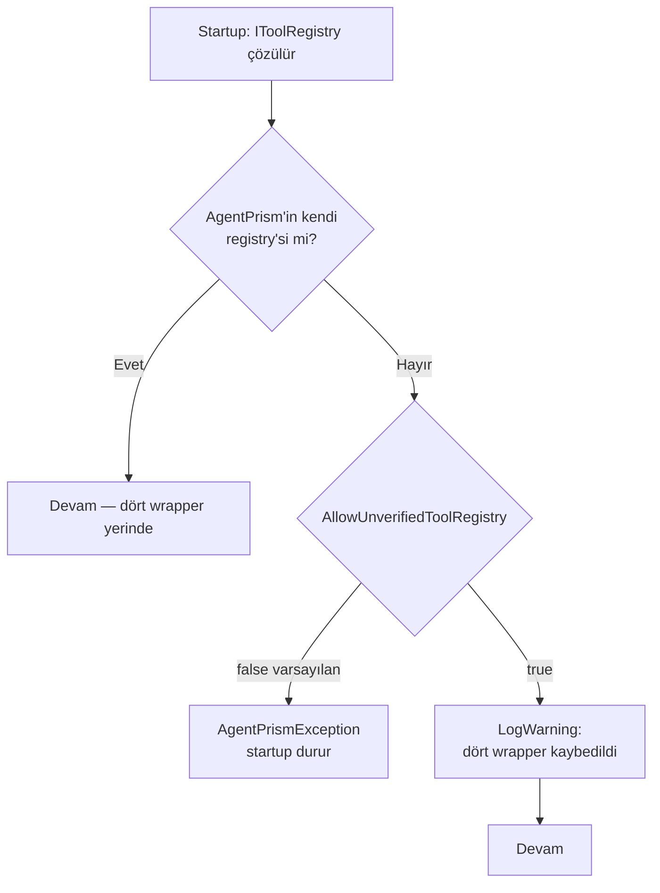

# Faz 102 — Tool Sözleşmesi ve Sonuç Sınırı

> **Durum:** ✅ Tamamlandı (2026-08-25)
> **Kaynak:** Doğrudan kullanıcı isteği — aday listesinden gelmedi, aday listesine kalem eklemez (Faz 101 ile aynı yol)
> **Önkoşul:** [Faz 101](101-KAYNAK-SOZLESMESININ-YAYINI.md) — sözleşme yayını deseni (contract suite + sample + XML) buradan devralınır
> **Paketler:** `AgentPrism.Abstractions`, `.Core`, `.Generators`, `.Testing.Contracts.Xunit`
> **Yeni paket:** Yok · **Migration:** Yok
> **Public API:** Büyüyor — `PublicAPI.Shipped.txt` **boştur** (`wc -l src/*/PublicAPI.Shipped.txt` → tümü `0`), bu yüzden bugün eklemek ve kırmak **bedavadır**; preview.1'den sonra ikisi de sürüm kararıdır
> **Tüketici yüzeyi:** site: `getting-started/tools.md`, `concepts/tools.md`, **yeni** `guides/write-your-own-tool.md`, `capabilities.md`
> · sevk edilen: `AgentPrismToolRegistration` / `AgentPrismToolAttribute` / `IToolRegistry` / `TimeoutAIFunction` / `TruncatingAIFunction` XML'leri, `src/AgentPrism.Testing.Contracts.Xunit/README.md`
> **Manuel test alanı:** [`docs/manuel-test/02-CEKIRDEK-VE-KATALOG.md`](../../manuel-test/02-CEKIRDEK-VE-KATALOG.md)

---

## Bu Faza Başlarken

> `faz-baslangic` skill'ini uygula. Aşağıdaki liste o skill'in 2. adımıdır —
> **tamamını değil, yalnız işaret edilen bölümleri oku.**

1. Bu doküman
2. Kararlar — dosyanın tamamını **okuma**, yalnız bu kalemleri grep'le:
   ```bash
   grep -n "K-008\|K-059\|K-218\|K-228\|K-368\|K-421\|K-435\|K-610\|K-611" docs/KARARLAR.md
   ```
   **K-218** (MAF `AIFunctionArguments.Services` olarak boş provider geçirir) ·
   **K-368** (onay kararı yeni bir `run` olarak sürer, aynı çağrı içinde beklemez) ·
   **K-421** (`EnablePublicApiTracking` açık) ·
   **K-435** (istemci tool'u `AIFunction` değildir, `toolTransform` onu atlar) ·
   **K-610** (her `ContractCoverage` çağrısı bir aile adı alır) ·
   **K-611** (isteğe bağlı davranış atlanan senaryo değil, ayrı opt-in sınıf)
3. [`101-KAYNAK-SOZLESMESININ-YAYINI.md`](101-KAYNAK-SOZLESMESININ-YAYINI.md) — yalnız devir notu:
   ```bash
   awk '/## Sonraki Faza Devir Notu/,0' docs/arsiv/fazlar/101-KAYNAK-SOZLESMESININ-YAYINI.md
   ```
   Sözleşme yayını deseni oradadır. 🚨 **Dört ortam tuzağı** (NuGet global önbelleği,
   `artifacts/package/release` birikimi, `docfx` `CS1704` fırtınası, `dotnet format --no-restore`)
   bu fazda **birebir tekrarlanacaktır** — bu faz da samples ekliyor ve public API'yi büyütüyor.
4. Alan hafızası (bu faz üç alana dokunuyor):
   [`hafiza/cekirdek-calistirma.md`](../../hafiza/cekirdek-calistirma.md) (tool çağrı yolu, `AsyncLocal`) ·
   [`hafiza/build-ve-analyzer.md`](../../hafiza/build-ve-analyzer.md) (AOT kaçış merdiveni, generator) ·
   [`hafiza/test-altyapisi.md`](../../hafiza/test-altyapisi.md) (sözleşme suite'i koşumu)
5. Gerektiğinde, tamamı değil ilgili bölümü:
   [`MIMARI-GUVENLIK.md`](../../MIMARI-GUVENLIK.md) — tool yetkilendirme ve içerik denetimi bölümleri

---

## Amaç

Bir üçüncü taraf geliştirici bugün **basit** bir tool yazabilir; **üretim
kalitesinde** bir tool yazamaz. Altı davranış invariant'ı yalnız kaynak kodda
yorum olarak duruyor, iki tanesi verilen XML sözüyle **çelişiyor**, biri
önerilen kayıt yolunda **çalışmıyor**, ve yüzeyi doğrulayacak ne executable
sözleşme ne de çalışan bir örnek var.

Bu faz o boşluğu kapatır. Faz 98–101'in yaptığı işin (depolama · sağlayıcı ·
yargıç · kaynak sözleşmelerinin yayını) **tool** için karşılığıdır, ama
ölçümde bulunan üç gerçek runtime kusuru da içerdiği için salt yayın işi
değildir.

- Custom tool genişleme yüzeyinin preview.1 öncesi düzeltilmesi,
  tamamlanması, belgelenmesi ve executable sözleşme + örnekle doğrulanabilir
  hale getirilmesi.

### Bu faz `IToolRegistry` implementasyonu **değildir**

Ölçüm `IToolRegistry`'nin AgentPrism'in **kendi** aggregation ve güvenlik
sınırı olduğunu doğruladı. Üçüncü tarafın onu implement etmesi tasarlanan
kullanım değildir. Bu faz:

- `IToolRegistry` için **sözleşme suite'i yazmaz**
- `IToolRegistry`'yi bir genişleme noktası gibi **sunmaz**
- Onu yanlışlıkla değiştirmenin bedelini **runtime'da kapatır** (102.1)

Gerçek genişleme yüzeyi şudur ve bu fazın konusu odur:

```
[AgentPrismTool] + AddGeneratedTools()   ← önerilen, AOT
AddToolsFrom<T>() / AddToolsFrom(Type)   ← reflection
AddTool(AIFunction, ...)                 ← AOT, el ile
AddTool(Delegate, ...)                   ← reflection
AgentPrismToolRegistration               ← ham DI kaydı
+ bunların invocation pipeline'ında aldığı dört wrapper
```

### Bugün ne çalışmıyor — doğrulanmış kanıt

| Kanıt | Gözlem |
|---|---|
| [`ToolRegistry.cs:116-131`](../../../src/AgentPrism.Core/Tools/ToolRegistry.cs) | Dört wrapper (`Truncating` → `ApprovalRequired` → `Timeout` → `Authorizing`) **yalnız** registry constructor'ında kurulur. Başka kurulum yeri yok |
| [`AgentPrismServiceCollectionExtensions.cs:305`](../../../src/AgentPrism.Core/AgentPrismServiceCollectionExtensions.cs) | `TryAddSingleton<IToolRegistry>` — tüketici kendi implementation'ını koyabilir ve dört wrapper'ı **sessizce** kaybeder |
| [`AgentPrismMcpBuilderExtensions.cs:149`](../../../src/AgentPrism.Mcp/AgentPrismMcpBuilderExtensions.cs) | `.UseMcp()` seam'i `services.Replace` ile ele geçirir — K4 (`TryAdd`) ile çelişir |
| `PublicAPI.Unshipped.txt:18`, `:81` (Core) | `AgentDefinitionCompiler` ve `AgentPrismDiagnosticsCollector`'ın **public ctor'ları** `IToolRegistry` alır → interface internal **yapılamaz** |
| [`ToolCandidate.cs:30-41`](../../../src/AgentPrism.Generators/ToolCandidate.cs) | `ToolEmitModel`'de `SafeToRepeat` alanı **yok**; `grep -n SafeToRepeat src/AgentPrism.Generators/*.cs` **boş** döner |
| [`ToolMethodScanner.cs:64`](../../../src/AgentPrism.Core/Tools/ToolMethodScanner.cs) | Reflection yolu `safeToRepeat: attribute.SafeToRepeat` okur → **iki yol farklı metadata üretir** |
| [`RunReconciliationService.cs:232`](../../../src/AgentPrism.Core/Recording/RunReconciliationService.cs) | `Destructive`/`External` + `!SafeToRepeat` → devam reddedilir. Generator yolundaki tool bu yüzden **yanlış** reddedilir |
| [`AgentPrismToolAttribute.cs:53-93`](../../../src/AgentPrism.Abstractions/Tools/AgentPrismToolAttribute.cs) | Attribute'ta `MaxOutputBytes` **hiç yok** → o knob ne generator ne reflection yolundan erişilebilir |
| [`IAgentPrismBuilder.cs:62,80`](../../../src/AgentPrism.Core/IAgentPrismBuilder.cs) | `AddTool` yalnız `requiresApproval` alır. `effect`/`requiredPermission`/`timeout`/`safeToRepeat`/`maxOutputBytes` builder'dan **erişilemez** |
| [`TruncatingAIFunction.cs:80-86`](../../../src/AgentPrism.Core/Tools/TruncatingAIFunction.cs) | Yalnız `string` ve `JsonElement` ölçülür; `_ => null` → başka her CLR tipi limiti **atlar** |
| [`ContentGuardMessageMasker.cs:163-164`](../../../src/AgentPrism.Core/Guards/ContentGuardMessageMasker.cs) | `Result: { } result => result.ToString()` → complex object guard'a **tip adı** olarak görünür, model ise gerçek JSON'u görür |
| [`SourceWriter.cs:71-80`](../../../src/AgentPrism.Generators/SourceWriter.cs) | Generated wrapper `(object?)result` döndürür → **ham CLR object**. Yukarıdaki iki deliğin ortak kökü budur |
| `grep -n "ThrowIfNullOrWhiteSpace\|IsValid" AgentPrismToolRegistration.cs` | **Boş** — runtime kayıt yollarında tool adı doğrulaması yok. `[A-Za-z0-9_-]{1,64}` kuralı yalnız APG0002'dedir |
| [`ToolRegistry.cs:146`](../../../src/AgentPrism.Core/Tools/ToolRegistry.cs) | Duplicate ad doğru şekilde `AgentPrismException` atar, ama registry **lazy** kurulur → host ayağa kalkar, ilk istekte patlar |
| [`ToolInvocationTracker.cs:130`](../../../src/AgentPrism.Core/Recording/ToolInvocationTracker.cs) · [`RunRecordingAgent.cs:1158`](../../../src/AgentPrism.Core/Recording/RunRecordingAgent.cs) | `Error = result.Exception?.Message` — ham istisna mesajı store'a **ve** `tool.failed` SSE olayına gider |
| [`ToolRegistry.cs:87-88`](../../../src/AgentPrism.Core/Tools/ToolRegistry.cs) | `optionsMonitor.CurrentValue` constructor'da bir kez okunur → `DefaultTimeout`/`DefaultMaxOutputBytes` reload'u mevcut registry'yi **etkilemez** |
| `src/AgentPrism.Testing.Contracts.Xunit/Contracts/` | 35 dosya, **Tools ailesi yok**. `ToolInvocationContract.cs` bir `IRunStore` **depo** sözleşmesidir |
| `samples/` · `docs-site/src/content/docs/guides/` | `write-your-own-{agent-source,judge,store}` + dört sample var; **tool için ikisi de yok** |
| [`AgentPrismOptions.cs:82`](../../../src/AgentPrism.Core/AgentPrismOptions.cs) | `AgentPrismToolOptions` adı **dolu** — yeni registration options tipi başka ad almalı |

> Kanıtların tamamı **2026-08-25** tarihinde yeniden ölçüldü. Bir önceki
> ölçüm turunda doğru olan hiçbir iddia düşmedi; iki iddia **büyüdü**:
> `MaxOutputBytes` attribute'ta hiç yokmuş (yalnız generator'da eksik
> sanılıyordu) ve `IToolRegistry` iki public ctor imzasında geçtiği için
> internal yapılamıyor.

### MAF davranışı — ölçüldü, tahmin edilmedi

`Microsoft.Extensions.AI 10.9.0` XML dokümanından okundu:

| Üye | Varsayılan | Sonuç |
|---|---|---|
| `FunctionInvokingChatClient.IncludeDetailedErrors` | `false` | **Model ham istisna görmez**, genel bir hata metni görür. AgentPrism bunu değiştirmiyor (`grep` boş) |
| `FunctionInvokingChatClient.MaximumConsecutiveErrorsPerRequest` | `3` | Tool istisna atarsa döngü **devam eder**; model aynı çağrıyı tekrar deneyebilir. Üç ardışık hatadan sonra istisna caller'a rethrow edilir. AgentPrism bu değeri **yapılandırmıyor** |

> 🚨 `AgentPrismException` istisna atan bir tool gövdesi bu yüzden **aynı
> mantıksal turda birden çok kez çalışabilir.** Bu bugünkü davranıştır;
> bu faz onu değiştirmez, **yazılı hale getirir** (102.9).

---

## 102.1 — `IToolRegistry`'nin konumu ve Replace kapısı

**Karar (bu planlama turunda verildi): interface public kalır, Replace yolu
runtime'da kapatılır.**

Internal yapmak **ölçümle elendi**: `AgentDefinitionCompiler` ve
`AgentPrismDiagnosticsCollector`'ın public ctor'ları onu parametre olarak
alıyor. Internal yapmak bu iki ctor'u da internal yapmayı gerektirirdi; ikisi
de gerçek tüketici yüzeyidir.

Yapılacak:

1. **`IToolRegistry` XML'i yeniden yazılır.** Bugünkü "This registry is one of
   AgentPrism's **security boundaries**" cümlesi üçüncü tarafı tam yanlış
   yöne çağırıyor: "güvenlik sınırıysa ben de implement edip kendi politikamı
   koyarım". Yeni metin şunu söyler:
   - Güvenlik sınırı AgentPrism'in **kendi implementation'ı ve pipeline'ıdır**,
     interface değil.
   - Bu servis **implement veya replace edilmez**. Tool eklemenin yolu
     `AddTool*` API'leridir.
   - Replace etmek `Authorizing`/`Timeout`/`ApprovalRequired`/`Truncating`
     wrapper'larının **dördünü birden** kaybettirir.
   - Registry bir **startup snapshot**'ıdır; kurulduktan sonra mutasyon yoktur
     (102.9).

2. **Tanınmayan implementation startup'ta reddedilir.** AgentPrism kendi
   ürettiği registry'yi bir internal marker ile tanır. Doğrulama, tool
   metadata doğrulamasıyla aynı startup hizmetinde koşar (102.7).

3. **Bilerek yapan için açık opt-out.** K1 (sıfır sürpriz) gereği bu bir duvar
   değil, bir kapıdır — ama kapının adı ne yapıldığını söyler:

   ```csharp
   builder.AddAgentPrism()
          .Configure(o => o.Tools.AllowUnverifiedToolRegistry = true);
   ```

   Bayrak açıkken startup log'una tek bir `LogWarning` yazılır ve dört
   wrapper'ın kaybedildiği adlarıyla sayılır.

4. **`services.Replace` çelişkisi giderilir.** `.UseMcp()` bugün K4'ü ihlal
   ediyor. `McpToolRegistry` iç registry'yi `ToolRegistry.Create` ile kurduğu
   için marker'ı **taşıyabilir**; doğrulama onu tanır ve `Replace` olduğu gibi
   kalır. Bu, davranış değişikliği değil, doğrulamanın MCP'yi yanlışlıkla
   reddetmemesi için gereken tasarım şartıdır.



## 102.2 — Tool sonucu için tek canonical temsil

**Bu fazın en ciddi runtime kusuru burada.** İki delik tek kökten geliyor:
generated wrapper'ın `(object?)result` döndürmesi.

| Tüketici | Bugün ne görüyor | Model ne görüyor |
|---|---|---|
| `ContentGuardMessageMasker.ReadText` | `"MyApp.OrderInfo"` (tip adı) | gerçek serialize JSON |
| `TruncatingAIFunction` | ölçemiyor, `_ => null` → limit atlanıyor | gerçek serialize JSON |
| `ToolInvocationRecord.Result` | `result.ToString()` → tip adı | gerçek serialize JSON |

Yani **content guard bypass'ı** ve **`MaxOutputBytes` sözünün ihlali** aynı
düzeltmeyle kapanır.

### Tasarım

**İki katman.** Birincisi kökü kurutur, ikincisi kalan yolu fail-closed yapar.

**Katman 1 — generator `JsonElement` emit eder.**

Source generator dönüş tipini derleme anında bilir. `ReturnKind.Value` /
`AsyncValue` için:

| Dönüş tipi | Emit |
|---|---|
| `string` | olduğu gibi (`(object?)result`) |
| `JsonElement` | olduğu gibi |
| primitive · `Guid` · `DateTime(Offset)` · enum | olduğu gibi — 102.2'nin normalizer'ı bunları deterministik metne çevirebilir |
| başka her şey (record · class · collection · anonymous) | emit edilen `JsonSerializerContext` üzerinden `JsonSerializer.SerializeToElement(result, Context.Default.<T>)` |

Bu AOT'u korur: `JsonSerializer.Serialize(object, Type)` reflection'dır ve
`AgentPrism.Core`'un AOT kapısına giremez; **source-generated context** ise
giremeyen tek şey olan reflection'ı kullanmaz.

> 🚨 Bu, `FunctionResultContent.Result`'ın **kalıcı yazılan biçimini
> değiştirir**: bugün `ToolInvocationRecord.Result` complex sonuç için tip
> adı taşıyor, bu değişiklikten sonra gerçek JSON taşır. Bu bir iyileşmedir
> ama görünür bir değişikliktir; manuel case ile kanıtlanır.

**Katman 2 — merkezi normalizer + fail-closed.**

`AgentPrism.Core` içinde internal bir `ToolResultText` yardımcısı:

```csharp
internal static class ToolResultText
{
    // true → text canonical UTF-8 temsildir (modelin göreceğine eş)
    // false → normalize edilemedi; çağıran fail-closed davranır
    internal static bool TryGetText(object? result, out string? text);
}
```

Kural tablosu:

| Girdi | Sonuç |
|---|---|
| `null` | `true`, `text = null` — mevcut null semantiği korunur |
| `string` | `true`, kendisi |
| `JsonElement` | `true`, `GetRawText()` |
| `bool` · tamsayı · kayan nokta · `decimal` | `true`, invariant deterministik temsil |
| `Guid` · `DateTime` · `DateTimeOffset` · enum | `true`, invariant temsil |
| `AIContent` ve türevleri | `false` — **mevcut attachment sözleşmesi bozulmaz** (102.3) |
| başka her CLR tipi | `false` |

`TruncatingAIFunction` ve `ContentGuardMessageMasker.ReadText` **aynı**
yardımcıyı çağırır. `ToString()` bir daha güvenlik kararı üretmekte
kullanılmaz.

`false` durumunda:

- **`TruncatingAIFunction`**: bugünkü davranışı korur (dokunmaz), ama
  `RunEventType.ToolOutputTruncated` yerine yeni bir uyarı sayacı artırır.
  Neden bloklamıyor: limit bir bütçe aracıdır, güvenlik kapısı değil.
- **`ContentGuardMessageMasker`**: **fail-closed**. Bir guard kayıtlıysa,
  incelenemeyen tool sonucu modele ham gitmez. Tam şekli Açık Soru 1'dedir.

> Guard kayıtlı **değilse** hiçbir şey değişmez — `ContentGuardingChatClient`
> pipeline'a eklenmiyor bile. K1 korunur.

`ToolResultText` **internal kalır.** Public bir serializer soyutlaması
çıkarmak için ölçülmüş bir tüketici yok; sırf mimari güzellik için public API
büyütülmez.

## 102.3 — `MaxOutputBytes` her desteklenen sonuç tipinde çalışır

102.2'nin normalizer'ı üzerinden. Bütçe **modele gidecek serialize UTF-8
temsili** üzerinden ölçülür — yani serialization **sonrası**.

Mevcut envelope semantiği aynen korunur:

```json
{"truncated": true, "omittedBytes": 1830, "content": "..."}
```

Varsayılan **unlimited** kalır; bu faz varsayılanı değiştirmez.

Attribute'a `MaxOutputBytes` eklenir (bugün hiç yok) — böylece üç kayıt yolu
da aynı knob'a erişir.

**Binary / `AIContent` istisnası ayrı belgelenir.** `generate_image` bilinçli
olarak attachment id döndürüyor; bayt döndürmüyor. `AIContent` normalize
edilmez ve limite tabi değildir — bu bir eksiklik değil, mevcut attachment
sözleşmesidir ve XML'de o cümleyle yazılır.

## 102.4 — Üç kayıt yolu aynı metadata'yı üretir

Bugünkü parity tablosu — ✅ destekliyor, ❌ desteklemiyor:

| Knob | `[AgentPrismTool]`+generator | `AddToolsFrom` | `AddTool(AIFunction)` | ham registration |
|---|---|---|---|---|
| name · description | ✅ | ✅ | ✅ | ✅ |
| `requiresApproval` | ✅ | ✅ | ✅ | ✅ |
| `effect` | ✅ | ✅ | ❌ | ✅ |
| `requiredPermission` | ✅ | ✅ | ❌ | ✅ |
| `timeout` | ✅ | ✅ | ❌ | ✅ |
| `safeToRepeat` | ❌ **bug** | ✅ | ❌ | ✅ |
| `maxOutputBytes` | ❌ | ❌ | ❌ | ✅ |

Hedef: **her hücre ✅.**

Yapılacak:

1. `AgentPrismToolAttribute`'a `MaxOutputBytes` eklenir.
2. `ToolEmitModel`'e `SafeToRepeat` ve `MaxOutputBytes` eklenir;
   `ReadAttribute` ikisini okur; `WriteAggregator` ikisini emit eder.
3. `ToolMethodScanner` `MaxOutputBytes`'ı okur.
4. `AddTool` options yüzeyi (102.5) sekizini de alır.

**Test seviyesi kritik.** Yalnız generator source-text snapshot'ı yeterli
değildir — üretilen metin doğru görünüp registration semantiği yanlış
kalabilir. Bu yüzden asıl kanıt bir **parity testi**dir: aynı attribute
konfigürasyonu üç yoldan kaydedilir ve üç yolun ürettiği
`AgentPrismToolRegistration` sekiz alanda **eşit** olmalıdır.

## 102.5 — Builder'da tam kayıt yüzeyi

**Karar: overload çoğaltmak yerine `configure` yüzeyi.**

`AgentPrismToolOptions` adı **doludur** (`AgentPrism:Tools` yapılandırma
bölümünün tipi). Yeni tip başka ad alır — taslak: `ToolRegistrationOptions`.
Kesin ad uygulama anında seçilir; sözleşme aynıdır.

```csharp
IAgentPrismBuilder AddTool(AIFunction tool, Action<ToolRegistrationOptions>? configure = null);
```

Mevcut `AddTool(AIFunction, bool requiresApproval)` **kaldırılır**, çünkü
`configure = null` ile yeni imza belirsizlik üretir ve bugün kaldırmak
bedavadır. `AddTool(Delegate, string?, string?, bool)` de aynı şekle çekilir.

Kazanç: yeni bir knob eklendiğinde public API **büyümez**, options tipine bir
property girer. Overload sayısı sabit kalır.

## 102.6 — Runtime tool adı doğrulaması

`ToolNameValidator` mantığı `AgentPrism.Abstractions` içine internal bir
yardımcı olarak taşınır. Generator kendi kopyasını korur (ayrı derleme, ayrı
hedef çatı) ama **kural tek yerde yazılır ve iki taraf aynı testle
karşılaştırılır**.

Doğrulama `AgentPrismToolRegistration` **constructor'ında** çalışır — böylece
beş kayıt yolunun **hepsi** aynı kapıdan geçer, çünkü hepsi sonunda o
constructor'ı çağırır.

Hata:

- fail-fast, `AgentPrismException`
- geçersiz adı **ve** kuralı açıkça söyler
- `secret` içerme riski yok: mesaj yalnız tool adını ve sabit kural metnini
  taşır

Case sensitivity mevcut `Ordinal` sözleşmesiyle uyumlu kalır — doğrulama
karakter kümesine bakar, büyük/küçük harfi normalize **etmez**.

**Public regex API çıkarılmaz.**

## 102.7 — Startup eager doğrulama

Bugün registry lazy kurulur; duplicate ad ve geçersiz kayıt hatası ilk istekte
patlar. Kod tool registry'si bir startup snapshot'ı olduğu ve doğrulaması
**I/O gerektirmediği** için bunu startup'a çekmek ucuzdur.

Faz 101'in `AgentSourceValidationService` deseni izlenir. Startup'ta
doğrulanacaklar:

| Kontrol | Kaynak |
|---|---|
| Geçersiz tool adı | 102.6 |
| Duplicate tool adı | `ToolRegistry` ctor'u zaten atıyor — eager çözüm yeter |
| Client tool + `requiresApproval` çelişkisi | `ToolRegistry` ctor'u |
| `Timeout <= 0`, `MaxOutputBytes < MinimumEnvelopeBytes` | registration başına |
| Tanınmayan `IToolRegistry` | 102.1 |

> 🚨 **MCP bu doğrulamanın dışındadır.** MCP tool'ları dinamik keşfedilir ve
> startup'ta ağ çağrısı yapmak yasaktır. Doğrulama yalnız kod registry'sinin
> snapshot'ını okur.

## 102.8 — İstisna ve kalıcı veri sızıntısı

Ölçüm: ham `exception.Message` üç yerden dışarı çıkıyor — `ToolInvocationRecord.Error`,
`RunEventType.ToolFailed.Text`, ve `tool.failed` SSE olayı. `Arguments` ve
`Result` da verbatim kalıcı yazılıyor. `SqlException.Message` gibi bir içerik
`Reader` rolüne ve SSE dinleyen tarayıcıya ulaşabilir.

**Modelin ham istisnayı görmediği ölçüldü** (`IncludeDetailedErrors = false`),
yani bu bir prompt-injection değil, bir **veri açığa çıkma** sorunudur.

İki katman, ikisi de bu fazda **değil**:

**Preview.1'de (bu faz):**

- Public yüzeye giden istisna metni **normalize edilir**: tip adı + sabit,
  kontrollü bir metin. Ham `Message` yalnız `ILogger`'a gider.
- `Arguments`/`Result`'ın kalıcı yazıldığı ve SSE'ye aktığı XML ve docs-site'ta
  **açıkça** yazılır; tool yazarının `secret` döndürmemesi gerektiği söylenir.
- `AgentPrismToolTimeoutException` ve `AgentPrismException` gibi **AgentPrism'in
  kendi** istisnaları normalize edilmez — mesajları kontrollüdür ve teşhis
  değeri taşır.

**1.0'a bırakılan:**

- `Arguments`/`Result` için yapısal redaction seam'i. Ayrı bir aday kalem olur.
  Bu fazda genel bir PII/DLP altyapısı **tasarlanmaz**.

Açık Soru 2, preview.1 normalizasyonunun `Error` **alanını** da kapsayıp
kapsamayacağını sorar.

## 102.9 — Yayınlanan davranış sözleşmesi (XML)

Faz 101'in `IAgentSource` için yaptığı iş. Aşağıdaki invariant'ların **hepsi**
bugün yalnız kaynak kodda yorum olarak duruyor veya hiç yazılı değil. Hepsi
ilgili public tipin **kendi XML'ine** girer.

| # | Invariant | Nereye |
|---|---|---|
| 1 | Tool instance **singleton**'dır; tüm tenant/run/thread paylaşır | `AgentPrismToolRegistration` |
| 2 | Aynı tool birden çok run tarafından **eşzamanlı** çağrılabilir — `AllowConcurrentToolCalls` kapalıyken de | `AgentPrismToolRegistration` |
| 3 | Per-invocation mutable state instance alanında tutulamaz | `AgentPrismToolAttribute` · `AgentPrismToolRegistration` |
| 4 | Tenant'a özel cache anahtarı tenant içermelidir | `AgentPrismRunContext` |
| 5 | Bağımlılık kurulum anında yakalanır; `AIFunctionArguments.Services` bir **`EmptyServiceProvider`**'dır (K-218) | `AgentPrismToolAttribute` |
| 6 | Scoped bağımlılık gerekiyorsa `IServiceScopeFactory` ile **invocation içinde** scope açılır | `AgentPrismToolRegistration` + docs-site örneği |
| 7 | Tool metoduna `IServiceProvider` parametresi **desteklenmez** (APG0003 zaten reddediyor) | `AgentPrismToolAttribute` |
| 8 | Timeout **cooperative değildir**; gövdeyi zorla durdurmaz; tool yan etki başlatmış olabilir | `TimeoutAIFunction` |
| 9 | Timeout token'ı tool'a **aktarılmaz**; gövde yalnız caller token'ını görür | `TimeoutAIFunction` |
| 10 | Infinite timeout yoktur; validator `<= 0`'ı startup'ta reddeder | `AgentPrismToolOptions` |
| 11 | `DefaultTimeout`/`DefaultMaxOutputBytes` registry kurulurken **snapshot** edilir; reload etkisizdir | `AgentPrismToolOptions` |
| 12 | MAF döngüsü hata sonrası devam eder (`MaximumConsecutiveErrorsPerRequest = 3`); gövde aynı turda birden çok kez çalışabilir | `AgentPrismToolRegistration` |
| 13 | `SafeToRepeat` yalnız `Destructive`/`External` için okunur; kesintiye uğramış run'ın devamını yönetir | mevcut XML iyi — 102.4 sonrası **generator yolunda da doğru** olur |
| 14 | Authorization · approval · timeout · truncation · tenant · audit **registry/pipeline'a aittir**; tool gövdesinde tekrar kurulmaz | `AgentPrismToolAttribute.RequiredPermission` · `IToolRegistry` |
| 15 | Registry bir **startup snapshot**'ıdır; dinamik `AddTool` yoktur. MCP ayrı bir dinamik modeldir | `IToolRegistry.List` · `TryGet` |
| 16 | Tool adı **stable ve düşük kardinaliteli** olmalıdır — metrics tag'idir. Run/user id tool adına konmaz | `AgentPrismToolRegistration` |
| 17 | Argüman ve sonuç **span'e yazılmaz**; kalıcı kayda ve SSE'ye yazılır. İkisi karıştırılmaz | `ToolInvocationRecord` |
| 18 | Tool adı karşılaştırması `Ordinal`'dır | `AddTool` · `IToolRegistry.TryGet` (zaten var, `AddTool`'a taşınır) |

## 102.10 — `CustomToolContract` executable suite

**Yeni aile.** `ContractCoverage.ToolContracts = "AgentPrism.Testing.Contracts.Tools"`.

K-610 gereği yeni aile mevcut Storage/Providers/Judges/AgentSources
çağrılarını **etkilemez** — her çağrı kendi aile adını taşır ve o ailenin
dışını görmez. Bu bir regression riski değil, K-610'un var olma sebebidir.

Suite `IToolRegistry`'yi **test etmez**. Test ettiği şey:
`AgentPrismToolRegistration` + custom tool gövdesi semantiği — yani üçüncü
tarafın gerçekten yazdığı şey.

Kapsanacak davranışlar:

| Davranış | Neden sözleşmeye ait |
|---|---|
| Tool adı geçerli ve stabil | Kayıt reddedilirse tool hiç çalışmaz |
| Eşzamanlı çağrı güvenliği | Singleton instance; en sık yapılan hata |
| `CancellationToken` yayılımı | İptal edilen run'da gövde durmalı |
| `SafeToRepeat` metadata'sı | Üç kayıt yolunda aynı olmalı |
| Timeout sözleşmesinin test edilebilir kısmı | Aşan çağrı `AgentPrismToolTimeoutException` üretir |
| Output size sözleşmesi | Limit üstü sonuç envelope'a girer |
| Complex object sonucun serialization'ı | 102.2'nin kanıtı |
| `null` sonuç | Mevcut semantik korunur |
| Tenant context'in invocation sırasında doğruluğu | `AgentPrismRunContext.Current.TenantId` |
| Registration metadata tutarlılığı | Sekiz alan `ToolDescriptor`'a doğru akar |

**Zorla suite'e konmayacaklar.** Authorization ve approval **registry
seviyesi** davranışlardır, tool gövdesinin sözleşmesi değil. Onlar
`tests/AgentPrism.Core.UnitTests/Tools/` içindeki mevcut fonksiyonel testlerde
kalır. Sözleşme suite'ini registry davranışıyla şişirmek üçüncü tarafa kendi
kodunda olmayan bir şeyi implement ettirmek olur.

**K-611 korunur.** İsteğe bağlı davranış (örneğin `SafeToRepeat` beyan
etmeyen bir tool) **atlanan senaryo değil**, ayrı bir opt-in sözleşme
sınıfıdır. Taslak: `CustomToolContract` (zorunlu) + `RepeatableToolContract`
(opt-in).

## 102.11 — `AgentPrism.Samples.CustomTool`

Faz 101'in `CustomAgentSource` sample'ının birebir deseni:

```
samples/AgentPrism.Samples.CustomTool/         PackageReference (VersionOverride="*-*")
samples/AgentPrism.Samples.CustomTool.Tests/   ProjectReference sample + PackageReference AgentPrism.*
```

**ProjectReference ile AgentPrism'e bağlanmaz.** Sample'ın değeri, yayımlanmış
paketlerden yazılabildiğini kanıtlamasıdır.

Ana yol **generator/AOT** yoludur. Reflection yolu yalnız alternatif olarak
anlatılır.

Göstermesi gerekenler — hepsi tek bir gerçekçi tool ailesinde:

- constructor bağımlılığı (fake repository)
- scoped bağımlılık için `IServiceScopeFactory` ile invocation içinde scope
- `AgentPrismRunContext` üzerinden tenant/run/session okuma
- `CancellationToken`'ı gerçekten okuyan bir gövde
- `SafeToRepeat` beyan eden `External` bir tool
- `Effect` · `RequiredPermission` · `RequiresApproval` · `TimeoutSeconds` · `MaxOutputBytes`
- complex object dönen bir tool (102.2'nin canlı kanıtı)
- istisna yönetimi rehberi — ne atılır, ne yutulur

Gerçek ağ/veritabanı bağımlılığı **şart değil**. Fake repository + scoped
servis yeterlidir; testler `AgentPrism.Testing`'in `FakeModelProvider`'ını
kullanır.

## 102.12 — `docs-site`

| Sayfa | Ne olur |
|---|---|
| `getting-started/tools.md` | Mevcut `:::danger` bloğu korunur; scoped bağımlılık için **gerçek** `IServiceScopeFactory` örneği eklenir |
| `concepts/tools.md` | Governance ownership tablosu · registry snapshot · singleton/concurrency · timeout'un cooperative olmadığı · retry/idempotency · argüman/sonuç kalıcılığı |
| **yeni** `guides/write-your-own-tool.md` | Diğer üç `write-your-own-*` rehberinin deseni. Sample'ı anlatır, sözleşme suite'inin nasıl koşulacağını gösterir |
| `capabilities.md` | "Custom tool" satırı |

---

## Planlanan Public API

> Taslak imzalardır. Gerçekleşen imzalar kapanışta ayrı bir bölüme yazılır.

```csharp
// AgentPrism.Abstractions — tool kayıt seçenekleri (ad kesinleşmedi)
public sealed class ToolRegistrationOptions
{
    public bool RequiresApproval { get; set; }
    public ToolEffect Effect { get; set; } = ToolEffect.Read;
    public string? RequiredPermission { get; set; }
    public TimeSpan? Timeout { get; set; }
    public bool SafeToRepeat { get; set; }
    public int? MaxOutputBytes { get; set; }
    public string? Source { get; set; }
}

// AgentPrism.Abstractions — attribute'a eklenen tek knob
public sealed class AgentPrismToolAttribute : Attribute
{
    public int MaxOutputBytes { get; init; }   // 0 = kurulum varsayılanı
}

// AgentPrism.Core — builder yüzeyi (mevcut iki AddTool aşırı yüklemesi KALDIRILIR)
public interface IAgentPrismBuilder
{
    IAgentPrismBuilder AddTool(AIFunction tool, Action<ToolRegistrationOptions>? configure = null);
    IAgentPrismBuilder AddTool(Delegate method, string? name = null, string? description = null,
                               Action<ToolRegistrationOptions>? configure = null);
}

// AgentPrism.Core — yeni seçenek
public sealed class AgentPrismToolOptions
{
    public bool AllowUnverifiedToolRegistry { get; set; }   // varsayılan false
}

// AgentPrism.Testing.Contracts.Xunit — yeni aile
namespace AgentPrism.Testing.Contracts.Tools;
public abstract class CustomToolContract { }        // zorunlu
public abstract class RepeatableToolContract { }    // opt-in, K-611

public static class ContractCoverage
{
    public const string ToolContracts = "AgentPrism.Testing.Contracts.Tools";
}
```

### HTTP `endpoint`'leri

Yeni uç **yok**. `GET /api/tools` ve `GET /api/runs/{runId}/tools` yüzeyi
değişmez; ikincisinin `Error` alanının içeriği 102.8 ile normalize edilir.

### Arayüz payı

Yok — arayüze dokunulmuyor.

---

## Planlanan Dosya Listesi

```
src/AgentPrism.Abstractions/
├── Tools/
│   ├── AgentPrismToolAttribute.cs         (değişir — MaxOutputBytes + XML)
│   ├── AgentPrismToolRegistration.cs      (değişir — ad doğrulaması + XML)
│   ├── ToolRegistrationOptions.cs         (YENİ)
│   ├── ToolNameRules.cs                   (YENİ — internal, tek kural kaynağı)
│   └── IToolRegistry.cs                   (değişir — XML yeniden yazılır)

src/AgentPrism.Core/
├── Tools/
│   ├── ToolResultText.cs                  (YENİ — internal canonical normalizer)
│   ├── ToolRegistry.cs                    (değişir — marker)
│   ├── ToolMethodScanner.cs               (değişir — MaxOutputBytes)
│   ├── TruncatingAIFunction.cs            (değişir — ToolResultText)
│   └── ToolRegistrationValidationService.cs (YENİ — startup doğrulaması)
├── Guards/
│   └── ContentGuardMessageMasker.cs       (değişir — ToolResultText + fail-closed)
├── Recording/
│   ├── ToolInvocationTracker.cs           (değişir — istisna normalizasyonu)
│   └── RunRecordingAgent.cs               (değişir — istisna normalizasyonu)
├── AgentPrismOptions.cs                   (değişir — AllowUnverifiedToolRegistry)
├── AgentPrismBuilder.cs                   (değişir — configure yüzeyi)
└── IAgentPrismBuilder.cs                  (değişir — configure yüzeyi)

src/AgentPrism.Generators/
├── ToolCandidate.cs                       (değişir — SafeToRepeat, MaxOutputBytes)
├── SourceWriter.cs                        (değişir — emit + JsonElement dönüş)
└── ToolResultSerializerWriter.cs          (YENİ — JsonSerializerContext emit)

src/AgentPrism.Testing.Contracts.Xunit/
├── ContractCoverage.cs                    (değişir — ToolContracts)
└── Contracts/Tools/
    ├── CustomToolContract.cs              (YENİ)
    └── RepeatableToolContract.cs          (YENİ)

samples/
├── AgentPrism.Samples.CustomTool/         (YENİ)
└── AgentPrism.Samples.CustomTool.Tests/   (YENİ)

docs-site/src/content/docs/
├── guides/write-your-own-tool.md          (YENİ)
├── getting-started/tools.md               (değişir)
├── concepts/tools.md                      (değişir)
└── capabilities.md                        (değişir)
```

---

## Hata Modları ve Testler

> Mutlu yoldan değil, **ne bozulabilir**den türetilir. Seviyeyi plan seçer.
> Sınır geçen davranış (DI · HTTP · kiracı · akış · depo · paket) birim
> testiyle kanıtlanamaz — [`.agents/ortak/test-seviyeleri.md`](../../../.agents/ortak/test-seviyeleri.md).

| Ne bozulabilir | Seviye | Test sınıfı |
|---|---|---|
| Complex object sonuç guard'a tip adı olarak görünür | **Fonksiyonel** (DI + guard pipeline sınırı) | `ContentGuardComplexToolResultTests` |
| Guard normalize edemediği sonucu modele ham geçirir | Fonksiyonel | `ContentGuardComplexToolResultTests` |
| `MaxOutputBytes` complex object'te atlanır | Fonksiyonel | `ToolOutputBudgetMatrixTests` |
| Envelope semantiği sonuç tipine göre değişir | Birim | `ToolOutputBudgetMatrixTests` |
| Generator ile reflection farklı metadata üretir | **Fonksiyonel** (DI sınırı — kayıt gerçekten çözülmeli) | `ToolRegistrationParityTests` |
| Generator emit'i doğru metin üretir ama registration yanlış | Fonksiyonel | `ToolRegistrationParityTests` (source-text snapshot **tek başına yetmez**) |
| Generated wrapper'ın `JsonElement` dönüşü AOT'u kırar | **E2E** (paket sınırı) | `AgentPrism.Package.Tests` AOT yayın kontrolü |
| Geçersiz tool adı kayıt olur | Birim | `ToolNameValidationTests` |
| Geçersiz/duplicate ad startup'ta yakalanmaz | **Fonksiyonel** (host başlatma sınırı) | `ToolRegistrationValidationServiceTests` |
| MCP registry'si tanınmayan sayılır ve startup kırılır | **Fonksiyonel** (paket sınırı) | `McpToolRegistryVerificationTests` |
| Yabancı `IToolRegistry` sessizce kabul edilir | Fonksiyonel | `ToolRegistryVerificationTests` |
| Opt-out bayrağı çalışmaz | Fonksiyonel | `ToolRegistryVerificationTests` |
| Ham `SqlException.Message` SSE'ye çıkar | **Fonksiyonel** (HTTP + akış sınırı) | `ToolFailureExposureTests` |
| AgentPrism'in kendi istisnası da normalize edilip teşhis kaybolur | Fonksiyonel | `ToolFailureExposureTests` |
| Tool eşzamanlı çağrıda state karıştırır | **Sözleşme** | `CustomToolContract` |
| İptal tool gövdesine ulaşmaz | **Sözleşme** | `CustomToolContract` |
| Başka kiracının tenant'ı tool gövdesinde görünür | **Sözleşme** | `CustomToolContract` |
| `null` sonuç semantiği değişir | Sözleşme | `CustomToolContract` |
| Yeni Tools ailesi mevcut aileleri kırar | Birim | `ContractCoverageTests` (dört mevcut aile yeşil kalmalı) |
| Sample yayımlanmış paketlerden derlenmez | **E2E** | `samples/AgentPrism.Samples.CustomTool.Tests` |
| `ToolInvocationRecord.Result` biçim değişikliği depoyu bozar | Sözleşme | mevcut `ToolInvocationContract` yeşil kalmalı |

Beş soru, her yeni kod yolu için:

| Soru | Cevap |
|---|---|
| **İptal** | `ToolResultText` iptal almaz (senkron). Startup doğrulaması `CancellationToken` alır. Guard fail-closed yolu iptal edilebilir |
| **Eşzamanlılık** | `ToolResultText` durumsuzdur. Startup doğrulaması tek kez koşar. Registry marker'ı immutable |
| **Boş/aşırı girdi** | `null` sonuç · boş string · `MinimumEnvelopeBytes` sınırı · 64 karakterlik ad · 65 karakterlik ad |
| **Başka kiracı** | `CustomToolContract` tenant testi. Registry snapshot'ı tenant'sızdır; MCP tenant'lıdır ve dokunulmuyor |
| **Alt sistem hatası** | Guard fail-closed davranışı · normalize edilemeyen sonuç · `JsonSerializer` istisnası (emit edilen context bunu compile-time'da imkânsızlaştırır, yine de test edilir) |

---

## Manuel Kabul Case'leri

> Kapanışta [`docs/manuel-test/02-CEKIRDEK-VE-KATALOG.md`](../../manuel-test/02-CEKIRDEK-VE-KATALOG.md)
> içine eklenecek case'lerin taslağı.

| # | Ön koşul | Adımlar | Beklenen sonuç |
|---|---|---|---|
| 1 | `PatternContentGuard` kayıtlı; complex object dönen bir tool | Tool `Comment = "<guard deseniyle eşleşen metin>"` döndürsün; agent'ı çalıştır | Guard eşleşmeyi **görür**; `run_events`'te guard kararı var. Tip adı değil, alan değeri incelendi |
| 2 | `MaxOutputBytes = 512`, complex object dönen tool | Tool 5 KB'lık bir nesne döndürsün | Model envelope görür; `ToolOutputTruncated` olayı yazıldı; `omittedBytes > 0` |
| 3 | `[AgentPrismTool(Effect = External, SafeToRepeat = true)]` + `AddGeneratedTools()` | Run'ı tool çağrısı sırasında kes, devam ettir | Çağrı **tekrarlanır**. Bugün reddediliyor |
| 4 | Aynı attribute, `AddToolsFrom<T>()` | 3'ün aynısı | Aynı sonuç — iki yol eşit |
| 5 | `AddTool(AIFunctionFactory.Create(f, "my tool!"))` | Uygulamayı başlat | **Startup** `AgentPrismException` ile durur; mesaj adı ve kuralı söyler |
| 6 | İki tool aynı adla kayıtlı | Uygulamayı başlat | **Startup** durur. Bugün ilk istekte patlıyor |
| 7 | Kendi `IToolRegistry` implementation'ı DI'a eklenmiş | Uygulamayı başlat | Startup durur; mesaj dört wrapper'ı adıyla sayar |
| 8 | 7'nin aynısı + `AllowUnverifiedToolRegistry = true` | Uygulamayı başlat | Başlar; `LogWarning` yazıldı |
| 9 | `.UseMcp(...)` kayıtlı | Uygulamayı başlat | Startup **geçer** — MCP registry'si tanınır |
| 10 | Bağlantı dizesi taşıyan bir istisna atan tool | `POST /api/agents/x/run` SSE ile dinle | `tool.failed` olayında bağlantı dizesi **yok**; `ILogger` çıktısında **var** |
| 11 | Aynı tool, `AgentPrismToolTimeoutException` | 10'un aynısı | Timeout mesajı **korunur** — AgentPrism'in kendi istisnası normalize edilmez |
| 12 | `samples/AgentPrism.Samples.CustomTool` | `dotnet test samples/AgentPrism.Samples.CustomTool.Tests` | Tüm sözleşme testleri yeşil; hiçbiri `ProjectReference` ile AgentPrism'e bağlı değil |
| 13 | 👤 `docs-site` | `guides/write-your-own-tool.md` sayfasını oku, örneği kopyala, derle | Sayfadaki kod **olduğu gibi derlenir** |

---

## Açık Sorular

> Planı bloklamayan, faz uygulanırken karara bağlanacak sorular. Bloklayan
> üç soru planlama turunda soruldu ve cevaplandı (102.1 · 102.2 · kapsam).

| # | Soru | Seçenekler | Öneri |
|---|---|---|---|
| 1 | Guard normalize edemediği tool sonucuyla ne yapsın? | A: sonucu sabit bir "incelenemedi" metniyle değiştir + guard olayı yaz · B: run'ı blokla · C: uyar ve geçir | **A.** B, AgentPrism'in kendi önerilen yolunun asla üretmediği bir durum için run'ı öldürür. C fail-closed değildir. A hem güvenli hem işlevi kırmaz |
| 2 | 102.8'in normalizasyonu `ToolInvocationRecord.Error` **alanını** da kapsasın mı, yoksa yalnız SSE/HTTP mi? | A: ikisi de · B: yalnız SSE/HTTP, store ham kalsın | **A.** Store `Reader` rolüne HTTP ile okunuyor; ikisini ayırmak açığı kapatmaz, yerini değiştirir |
| 3 | `ToolRegistrationOptions` mu başka bir ad mı? | A: `ToolRegistrationOptions` · B: `AgentPrismToolRegistrationOptions` · C: `ToolOptions` | **A.** `AgentPrismToolOptions` dolu; C fazla genel. Kesin ad uygulama anında |
| 4 | `AddTool(AIFunction, bool)` kaldırılsın mı yoksa `[Obsolete]` mı? | A: kaldır · B: `[Obsolete]` bırak | **A.** `PublicAPI.Shipped.txt` boş; henüz kimse bağlanmadı. `[Obsolete]` sıfır tüketici için bakım borcudur |
| 5 | `CustomToolContract` tenant testi tenant'ı nasıl kursun? | A: `AgentPrismRunContext.SetCurrent` ile doğrudan · B: gerçek bir run üzerinden | **B.** A, sözleşmenin kanıtlaması gereken şeyi (gerçek run'da doğru tenant'ın aktığını) atlar. `AgentPrism.Testing` bunu destekliyor mu **ölçülmeli** |
| 6 | Generator'ın emit ettiği `JsonSerializerContext` nereye konsun? | A: tool başına ayrı · B: derleme başına tek | **B.** Tek context daha az emit; ama aynı tipi iki tool döndürürse çakışma olmamalı — **ölçülmeli** |
| 7 | Timeout token'ı gövdeye linked-token ile iletilsin mi? | A: hayır, sözleşme olarak kalsın · B: yeni linked-token tasarımı | **A.** Bu faz execution-abort mimarisini yeniden tasarlamaz. Önce sözleşme (102.9 · madde 8-9); davranış değişikliği ayrı bir aday kalemdir |

---

## Bitiş Ölçütleri (DoD)

- [x] Complex object dönen bir tool'un sonucu content guard tarafından **alan
      değerleriyle** görülür; Manuel Case 1 kanıtı belgeye yazıldı — kanıt:
      `OrderFulfillmentToolTests.A_generated_complex_results_field_value_is_seen_by_the_content_guard`
      (red→green doğrulandı); normalize edilemeyen sonuç için fail-closed yolu
      ayrıca `ContentGuardMaskTests.Tool_result_that_cannot_be_normalized_is_masked_even_when_no_guard_pattern_matches`
      ile kanıtlı (bağımsız denetimin bulduğu ve kapatılan güvenlik açığı — bkz. Denetim Bulguları)
- [x] `MaxOutputBytes` altı sonuç tipinde de uygulanır: `string` · `JsonElement` ·
      primitive · record/class · collection · `null`. `AIContent` istisnası XML'de yazılı —
      `TruncatingAIFunctionTests`, `ToolRegistryWrapperOrderTests`
- [x] `[AgentPrismTool(SafeToRepeat = true)]` üç kayıt yolunda **aynı**
      `AgentPrismToolRegistration` üretir — `ToolRegistrationTests` (parity, sekiz alan)
- [x] `AddTool` sekiz knob'un **hepsine** `configure` üzerinden erişir; ham
      `services.AddSingleton(new AgentPrismToolRegistration(...))` artık tek yol değil —
      `ToolRegistrationOptions` + `IAgentPrismBuilder.AddTool` gerçekleşen imzada
- [x] Geçersiz ve duplicate tool adı **startup'ta** durur (Manuel Case 5, 6) —
      `ToolRegistrationValidationServiceTests`
- [x] Tanınmayan `IToolRegistry` startup'ta reddedilir; opt-out bayrağı çalışır;
      `.UseMcp()` **geçer** (Manuel Case 7, 8, 9) — gerçek host/DI sınırında kanıtlı:
      `ToolRegistryVerificationEndpointTests`, `McpToolRegistryVerificationTests`
- [x] Ham istisna mesajı SSE ve HTTP yüzeyinden çıkmaz, `ILogger`'da tam kalır;
      AgentPrism'in kendi istisnaları korunur (Manuel Case 10, 11) — `ToolFailureText.Get`
- [x] `ContractCoverage.ToolContracts` ailesi var; dört mevcut aile
      (Storage · Providers · Judges · AgentSources) **yeşil** kalır — `ContractCoverageTests`,
      `ToolContractCoverageTests` (Core + sample), tam kapanış koşumunda doğrulandı
- [x] `samples/AgentPrism.Samples.CustomTool.Tests` yalnız `PackageReference`
      ile AgentPrism'e bağlanır ve yeşil koşar — 9/9 (ContractCoverage dahil)
- [x] `AgentPrism.Core` ve `.Abstractions` AOT uyumlu kalır
      (`grep -l "AotCompatible>false" src/*/*.csproj` çıktısı değişmedi) —
      taban commit `8929903` ile birebir karşılaştırıldı, aynı 11 proje
- [x] Dört doğrulama kapısı sıfır uyarı verir — `python3 scripts/kapi.py kapanis --taban 8929903`
      tam yeşil (build · test · pack · format · `docs-site npm run check`); 20 paket,
      tek sürüm hattı, `kapi.py yayin --kuru` temiz
- [ ] `samples/AgentPrism.Api` ile gerçek `run` yapıldı, çıktı belgeye yazıldı —
      **yapılmadı**, gerekçesi Sonraki Faza Devir Notu → "Yarım kalan iş"te
- [x] `secret` taraması boş döndü — `kapi.py tarama` ✅
- [x] Manuel kabul case'leri `docs/manuel-test/02-CEKIRDEK-VE-KATALOG.md` içine
      eklendi (MT-CORE-097..099); otomatikleştirilebilenler (097) koşuldu
- [x] `faz-denetim` koşuldu; 🔴 bulgu kalmadı — iki tur: uygulama sırasında (3🔴, kapandı)
      ve kapanışta bağımsız agent (2🔴, ikisi de düzeltildi ve red→green kanıtlandı)
- [x] `docs-site/` güncellendi (`guides/write-your-own-tool.md` dahil, ayrıca
      `concepts/tools.md` — site-denetle'nin yakaladığı eksik — ve
      `getting-started/tools.md`'deki iki kırık `AddTool` örneği); `npm run check`
      (content + build + links + weight) dördü de temiz

### Doğrulama komutları

```bash
# Faz 101'in tuzağı — samples derlemeden ÖNCE
rm -rf ~/.nuget/packages/agentprism*
python3 scripts/kapi.py yayin --kuru

# Parity ve sonuç sınırı
dotnet test tests/AgentPrism.Core.UnitTests --filter "ToolRegistrationParity|ToolOutputBudgetMatrix|ContentGuardComplexToolResult"

# Sözleşme ailesi ve sample
dotnet test samples/AgentPrism.Samples.CustomTool.Tests

# AOT kapısı
grep -l "AotCompatible>false" src/*/*.csproj

# Kapanış
python3 scripts/kapi.py kapanis --taban <faz öncesi commit>
```

---

## Riskler

| Risk | Önlem |
|------|-------|
| Generator'ın `JsonElement` emit'i AOT'u kırar | Kanıt E2E seviyesindedir (`AgentPrism.Package.Tests`), birim testi değil. Emit edilen `JsonSerializerContext` reflection kullanmaz — bu şart uygulama başında doğrulanır |
| `FunctionResultContent.Result`'ın biçim değişikliği kalıcı kaydı bozar | `ToolInvocationContract` dört koşumda birden yeşil kalmalı. Değişiklik **iyileşmedir** (tip adı → gerçek JSON) ama görünürdür; Manuel Case 2 bunu belgeler |
| Startup doğrulaması MCP'yi yanlışlıkla reddeder | Manuel Case 9 ve `McpToolRegistryVerificationTests` bunu kapatır. `McpToolRegistry` iç registry'yi zaten `ToolRegistry.Create` ile kuruyor — marker doğal olarak akar |
| Yeni sözleşme ailesi mevcut dört aileyi kırar | K-610 tam bu senaryo için var: her çağrı kendi aile adını taşır. `ContractCoverageTests` dört aileyi de koşar |
| `AddTool` imzasını kaldırmak mevcut sample/template'leri kırar | `samples/AgentPrism.Api`, `AgentPrism.Embedded` ve `AgentPrism.Templates` derleme sırasında yakalar. Dördü de repo içindedir |
| İstisna normalizasyonu teşhisi öldürür | AgentPrism'in kendi istisna tipleri (`AgentPrismException`, `AgentPrismToolTimeoutException`) normalize **edilmez**. Manuel Case 11 bunu kanıtlar |
| Faz 101'in dört ortam tuzağı tekrarlanır | Bu faz da samples ekliyor ve public API büyütüyor. Devir notundaki dört komut DoD'nin doğrulama bloğuna **önceden** yazıldı |
| Faz büyük — kapsam kayar | Kapsam dışı listesi aşağıdadır ve tartışmaya kapalıdır |

### Kapsam dışı — bu faz şunlara **dönüşmez**

- Generic plugin system yeniden yazımı
- MCP mimarisi yeniden tasarımı · MCP `CompiledAgentCache` invalidation (ayrı aday kalem)
- Tam bir tool retry motoru
- Dağıtık tool yürütme
- Keyfi DI activation çatısı
- Tüm yerleşik tool'ların tek stile taşınması
- Genel PII/DLP platformu
- `Arguments`/`Result` için yapısal redaction seam'i (1.0 kalemi)
- Timeout'un execution-abort mimarisi (Açık Soru 7)

---

<!-- ============================================================
     AŞAĞISI KAPANIŞTA DOLDURULUR — `faz-tamamlama` skill'i.
     Plan anında boş kalır. Başlıkları SİLME.
     ============================================================ -->

## Plandan Sapmalar

> Kapanışta doldurulur. Plan ile gerçek arasındaki fark **gizlenmez** — sonraki
> oturumun en değerli bilgisidir.

- Complex sonuç için generator'ın kendi ürettiği `JsonSerializerContext` kullanılmadı.
  Roslyn generator'ları birbirlerinin ürettiği kaynağı aynı compilation'da görmez;
  gerçek consumer build'i bu yaklaşımı `CS0534` ile kırdı. `AgentPrismToolAttribute`
  içine `JsonSerializerContext` eklendi ve complex sonuçta `APG0008` ile tool sahibinin
  kendi `[JsonSerializable(typeof(TResult))]` context'ini vermesi zorunlu kılındı.
  Bu AOT-safe'tir ve rehber/sample bunu çalışır biçimde kanıtlar.
- `CustomToolContract` yalnız implementer'ın tek başına sağlayabileceği isim,
  metadata ve concurrent invocation sözleşmesini taşır. Tenant context, timeout,
  output envelope ve guard davranışı registry/DI sınırını geçtiği için Core
  functional testleri ve `CustomTool` sample run'ında kanıtlanır; contract
  paketine Core bağımlılığı eklenmedi.
- Plandaki dağınık test sınıfı taslağı (`ToolOutputBudgetMatrixTests`,
  `ToolRegistrationParityTests`, `ContentGuardComplexToolResultTests`,
  `ToolNameValidationTests`, `McpToolRegistryVerificationTests`,
  `ToolRegistryVerificationTests`, `ToolFailureExposureTests`) ayrı dosyalar
  olarak açılmadı; aynı davranışlar mevcut/genişletilmiş dosyalara konsolide
  edildi: `ToolRegistrationTests.cs` (parity + ad doğrulaması), `ToolResultTextTests.cs`
  (normalizer), `TruncatingAIFunctionTests.cs` (budget matrix),
  `ToolRegistrationValidationServiceTests.cs` (startup doğrulama + opt-out),
  `ToolRegistryWrapperOrderTests.cs` (wrapper sırası), `ContentGuardEndpointTests.cs`
  ve `ToolGovernanceEndpointTests.cs` (fonksiyonel sınır). Kapsam plandakiyle
  aynı; dosya sayısı azaldı.
- **Kapanış kapısının ikinci koşumu gerçek bir regresyon yakaladı ve düzeltildi.**
  `ConcurrentToolInvocationTests.Three_concurrent_tool_calls_are_all_recorded_correctly_under_a_guaranteed_overlap`
  eski (tırnaksız) bir `Result` beklentisi taşıyordu. Kanıt, `ilspycmd` ile
  `Microsoft.Extensions.AI.OpenAIChatClient.ToOpenAIChatMessages`'ın decompile
  edilmesiyle çıkarıldı: `FunctionResultContent.Result` ham bir `string` ise
  olduğu gibi, **her başka tip** için (bir `JsonElement` dahil)
  `JsonSerializer.Serialize(Result, object-typeinfo)` ile tel'e yazılıyor —
  ve `AIFunctionFactory.Create` bir delegate'in `string` dönüşünü bile her
  zaman `JsonElement`'e sarıyor (ölçüldü). Yani delegate ile kayıtlı bir
  `string` tool tel üzerinde **tırnaklı** gidiyor, generator ile kayıtlı aynı
  dönüş tipi **tırnaksız**. `ToolResultText`'in `GetRawText()` davranışı
  (102.2) bu farkı doğru yansıtıyor; testin beklentisi buna göre düzeltildi,
  kod değişmedi.
- `docs-site/src/content/docs/concepts/tools.md` ilk koşumda hiç
  güncellenmemişti (`dokuman-bakim.py --site-denetle` bunu "cekirdek-kavram"
  kuralıyla yakaladı). Registry snapshot/singleton/concurrency, governance
  ownership tablosu, timeout'un cooperative olmadığı + in-turn retry ile
  `SafeToRepeat`'in ayrımı, ve sonuç temsilinin/kalıcılığının canonical form'u
  eklendi. Ayrıca `getting-started/tools.md` içindeki iki kod örneği 102.5'te
  kaldırılan `AddTool(..., requiresApproval: bool)` imzasını kullanıyordu
  (artık derlenmez) — yeni `configure` şekline düzeltildi.

## Bu Fazda Verilen Kararlar

> Kapanışta doldurulur. K-NNN numaraları burada alınır; plan numara rezerve etmez.

- **K-614** — `IToolRegistry` public kalır; tanınmayan implementation
  `IVerifiedToolRegistry` marker'ı taşımadığı için startup'ta reddedilir;
  `AllowUnverifiedToolRegistry` bilerek yapan için opt-out'tur.
- **K-615** — Generator kendi ürettiği `JsonSerializerContext`'i kullanmaz;
  complex tool sonucu için tool sahibi kendi context'ini
  `AgentPrismToolAttribute.JsonSerializerContext`'e verir, aksi hâlde derleme
  `APG0008` ile durur.
- **K-616** — `CustomToolContract` yalnız implementer'ın tek başına
  sağlayabileceği isim/metadata/eşzamanlı çağrı sözleşmesini taşır;
  tenant/timeout/envelope/guard davranışı registry-DI sınırını geçtiği için
  pakete Core bağımlılığı eklenmeden Core fonksiyonel testlerinde ve sample
  run'ında kanıtlanır.
- **K-617** — Content guard'ın normalize edemediği tool sonucu için
  fail-closed yolu, guard pattern eşleşmesinden tamamen bağımsız, koşulsuz
  bir değiştirme olarak yeniden yazıldı (bağımsız denetimin kapanışta bulduğu
  ve kapattığı 🔴 — bkz. Denetim Bulguları).

Tam gerekçe her dördü için [`docs/KARARLAR.md`](../../KARARLAR.md)'dedir.

## Gerçekleşen Public API

```csharp
// AgentPrism.Abstractions
public sealed class AgentPrismToolAttribute : Attribute
{
    // ... mevcut üyeler (Name, Description, RequiresApproval, Effect,
    //     RequiredPermission, TimeoutSeconds, SafeToRepeat) değişmedi
    public int MaxOutputBytes { get; init; }            // 0 = kurulum varsayılanı
    public Type? JsonSerializerContext { get; init; }    // complex sonuç için ZORUNLU (APG0008)
}

public sealed class ToolRegistrationOptions
{
    public bool RequiresApproval { get; set; }
    public ToolEffect Effect { get; set; } = ToolEffect.Read;
    public string? RequiredPermission { get; set; }
    public TimeSpan? Timeout { get; set; }
    public bool SafeToRepeat { get; set; }
    public int? MaxOutputBytes { get; set; }
    public string? Source { get; set; }
}

// AgentPrism.Core — mevcut iki AddTool(AIFunction, ...) aşırı yüklemesi TEK
// (AIFunction, bool) imzası kaldırıldı; configure artık zorunlu parametre
public interface IAgentPrismBuilder
{
    IAgentPrismBuilder AddTool(AIFunction tool, Action<ToolRegistrationOptions> configure);
    IAgentPrismBuilder AddTool(AIFunction tool);   // varsayılan metadata
    IAgentPrismBuilder AddTool(
        Delegate method,
        string? name = null,
        string? description = null,
        Action<ToolRegistrationOptions>? configure = null);
    // AddToolsFrom<T>() / AddToolsFrom(Type) değişmedi
}

public sealed class AgentPrismToolOptions
{
    public bool AllowUnverifiedToolRegistry { get; set; }   // varsayılan false
}

// AgentPrism.Testing.Contracts.Xunit — yeni aile
namespace AgentPrism.Testing.Contracts.Tools;
public abstract class CustomToolContract : IAsyncLifetime
{
    protected AgentPrismToolRegistration Registration { get; }
    protected abstract ValueTask<AgentPrismToolRegistration> CreateRegistrationAsync();
    // + Name_is_stable_and_valid, Concurrent_server_calls_complete, Metadata_is_self_consistent
}
public abstract class RepeatableToolContract : CustomToolContract
{
    // + Registration_is_marked_safe_to_repeat
}

public static class ContractCoverage
{
    public const string ToolContracts = "AgentPrism.Testing.Contracts.Tools";
    // StorageContracts / ProviderContracts / JudgeContracts / AgentSourceContracts değişmedi
}
```

Plandan sapma: `ToolRegistrationOptions` adı (Açık Soru 3, seçenek A) aynen
uygulandı. `AddTool(AIFunction, bool)` kaldırıldı (Açık Soru 4, seçenek A).
`AgentPrismToolAttribute.JsonSerializerContext` plan dışı bir üyeydi — K-615.

### HTTP `endpoint`'leri

Plan gibi: yeni uç yok. `GET /api/tools` ve `GET /api/runs/{runId}/tools`
yüzeyi değişmedi; `ToolInvocationRecord.Error` içeriği 102.8 ile normalize
edildi (`ToolFailureText.Get`).

## Dosya Listesi (gerçekleşen)

```
src/AgentPrism.Abstractions/Tools/
├── AgentPrismToolAttribute.cs         (değişti — MaxOutputBytes + JsonSerializerContext + XML)
├── AgentPrismToolRegistration.cs      (değişti — ad doğrulaması + XML)
├── ToolRegistrationOptions.cs         (YENİ)
├── ToolNameRules.cs                   (YENİ — internal, tek kural kaynağı)
└── IToolRegistry.cs                   (değişti — XML yeniden yazıldı)

src/AgentPrism.Core/
├── Tools/
│   ├── ToolResultText.cs                    (YENİ — internal canonical normalizer)
│   ├── ToolFailureText.cs                   (YENİ — internal istisna normalizer)
│   ├── ToolRegistrationValidationService.cs (YENİ — startup doğrulaması)
│   ├── VerifiedToolRegistry.cs              (YENİ — IVerifiedToolRegistry marker)
│   ├── ToolRegistry.cs                      (değişti — marker uygulandı)
│   ├── ToolMethodScanner.cs                 (değişti — MaxOutputBytes)
│   └── TruncatingAIFunction.cs              (değişti — ToolResultText)
├── Guards/
│   ├── ContentGuardMessageMasker.cs         (değişti — ToolResultText + gerçek fail-closed, K-617)
│   ├── ContentGuardPipeline.cs              (değişti — RecordUninspectableToolResultAsync, K-617)
│   └── ContentGuardingChatClient.cs         (değişti — paylaşılan RewriteContentAsync'e taşındı, K-617)
├── Recording/
│   ├── ToolInvocationTracker.cs             (değişti — ToolResultText + ToolFailureText)
│   └── RunRecordingAgent.cs                 (değişti — aynı)
├── AgentPrismOptions.cs                     (değişti — AllowUnverifiedToolRegistry)
├── AgentPrismServiceCollectionExtensions.cs (değişti — config binding)
├── AgentPrismBuilder.cs                     (değişti — configure yüzeyi)
└── IAgentPrismBuilder.cs                    (değişti — configure yüzeyi)

src/AgentPrism.Generators/
├── ToolCandidate.cs             (değişti — SafeToRepeat, MaxOutputBytes, JsonSerializerContext okuma, APG0008)
├── ToolDiagnostics.cs           (değişti — APG0008)
├── ToolRegistrationGenerator.cs (değişti — APG0008 kayıt)
└── SourceWriter.cs              (değişti — JsonElement dönüşü, çağıranın context'ini kullanır)
  # Planlanan ToolResultSerializerWriter.cs YAZILMADI — K-615 (Roslyn çok-üreteç kısıtı)

src/AgentPrism.Mcp/McpToolRegistry.cs   (değişti — IVerifiedToolRegistry uygulanır)

src/AgentPrism.Testing.Contracts.Xunit/
├── ContractCoverage.cs                    (değişti — ToolContracts)
└── Contracts/Tools/
    ├── CustomToolContract.cs              (YENİ, kapanışta güçlendirildi — ShouldAllBe(RanToCompletion))
    └── RepeatableToolContract.cs          (YENİ)

samples/
├── AgentPrism.Samples.CustomTool/         (YENİ — OrderFulfillmentTool.cs, OrderPreviewTools.cs,
│                                              OrderFulfillmentToolRegistration.cs, OrderPreviewToolRegistration.cs)
└── AgentPrism.Samples.CustomTool.Tests/   (YENİ — OrderFulfillmentToolTests.cs, kapanışta
                                               A_generated_complex_results_field_value_is_seen_by_the_content_guard eklendi)

tests/
├── AgentPrism.Core.UnitTests/
│   ├── Tools/
│   │   ├── ToolRegistrationTests.cs                (değişti — parity + ad doğrulaması genişletildi)
│   │   ├── ToolRegistrationValidationServiceTests.cs (YENİ — startup doğrulama + opt-out)
│   │   ├── ToolResultTextTests.cs                  (değişti — normalizer)
│   │   ├── CustomToolContractTests.cs              (değişti — ContractCoverageTests genişletildi)
│   │   └── TruncatingAIFunctionTests.cs            (kapanışta — bayat generator yorumu düzeltildi)
│   │   # (ToolRegistryWrapperOrderTests.cs — mevcuttan genişletildi)
│   └── Guards/ContentGuardMaskTests.cs             (kapanışta — fail-closed testi eklendi, K-617)
├── AgentPrism.AspNetCore.FunctionalTests/
│   ├── ConcurrentToolInvocationTests.cs   (değişti — AddTool imza güncellemesi + Result beklentisi düzeltmesi)
│   ├── ToolRegistryVerificationEndpointTests.cs (YENİ, kapanışta — gerçek host/DI sınırı)
│   └── (ToolGovernanceEndpointTests.cs, ContentGuardEndpointTests.cs, diğerleri — imza güncellemesi)
├── AgentPrism.Mcp.UnitTests/McpToolRegistryVerificationTests.cs (YENİ, kapanışta — gerçek DI sınırı)
├── AgentPrism.Generators.UnitTests/
│   ├── DiagnosticTests.cs       (değişti — APG0008)
│   └── GeneratedOutputTests.cs  (değişti — JsonElement emit)
└── AgentPrism.Core.UnitTests/Architecture/public-surface-baseline.txt (değişti)

docs-site/src/content/docs/
├── guides/write-your-own-tool.md   (değişti — JsonSerializerContext deseni)
├── getting-started/tools.md        (değişti — çapraz referans + kırık AddTool örnekleri düzeltildi)
├── concepts/tools.md               (değişti — lifecycle/ownership/result representation)
├── troubleshooting.md              (değişti — APG0007/APG0008)
├── guides/coding-agents.md         (değişti — APG0008 aralığı)
├── capabilities.md                 (değişti — custom tool satırı)
└── sidebar.mjs, public/llms*.txt   (üretildi)
```

## Denetim Bulguları

> Kapanışta doldurulur — `faz-denetim` çıktısı. Her satır: bulgu · seviye
> (🔴/🟡/🟢) · sonuç (düzeltildi / gerekçelendi / F-NN olarak devredildi).
> Bulgu yoksa "🔴 ve 🟡 yok" yazılır; boş bırakılmaz.

**Birinci tur (uygulama sırasında).**

- 🔴 `JsonSerializerContext` plan dışı public API idi; yukarıdaki sapma kaydıyla
  gerekçelendi ve `APG0008`, rehber ile sample tarafından görünür kılındı.
- 🔴 İlk rehber örneğinde tanımsız domain tipleri vardı; bağımsız derlenebilir
  `OrderReceipt` örneğiyle düzeltildi.
- 🔴 Manuel kabul setinde Faz 102 case'leri yoktu; MT-CORE-097..099 eklendi.
- 🟡 Shared contract'ın host sınırı test etmemesi gerekçelendi; sınır davranışları
  Core testleri ve gerçek package tüketicisi sample ile doğrulanır.

**İkinci tur — bağımsız denetim (kapanış oturumu, taze bağlamlı ayrı agent).**
Taban `8929903`, kapsam `git diff 8929903` (commit'lenmiş + çalışma ağacı).

- 🔴 **DÜZELTİLDİ — content guard'ın "fail-closed" sözü gerçek değildi.**
  `ContentGuardMessageMasker.ReadText`, normalize edilemeyen bir tool sonucu
  için sabit bir yer tutucu metin (`"[Tool result could not be inspected]"`)
  döndürüyordu, ama bu metin **koşulsuz** içeriğin yerine geçmiyordu — sıradan
  metin gibi guard'ın desen eşleşmesine veriliyordu. Desen (neredeyse hiçbir
  zaman) yer tutucuyla eşleşmediği için `InspectAsync` `null` dönüyor,
  `RewriteMessageAsync` bunu "değişiklik yok" sayıyor ve **orijinal, ham**
  `FunctionResultContent` hiç dokunulmadan modele ve kalıcı kayda gidiyordu —
  `ContentGuardPipeline`'ın kendi XML sözüyle ("content that cannot be
  inspected is not let through") doğrudan çelişen bir güvenlik açığıydı.
  Kanıt: red→green ile doğrulandı (`git stash` ile eski koda karşı test
  çalıştırıldı, gerçek secret `Dictionary` hiç maskelenmeden sızdığı
  gözlemlendi). Düzeltme: `ContentGuardMessageMasker`/`ContentGuardPipeline`/
  `ContentGuardingChatClient` üçü de tek bir paylaşılan `RewriteContentAsync`
  yoluna taşındı; normalize edilemeyen sonuç artık **koşulsuz** yer tutucuyla
  değiştiriliyor ve `ContentGuardPipeline.RecordUninspectableToolResultAsync`
  ile bir `ContentMasked` olayı yazılıyor (yalnız gerçek karar yolunda, önizleme
  yolunda değil — aynı `runs` satırı henüz yok kısıtı). Kanıt testi:
  `ContentGuardMaskTests.Tool_result_that_cannot_be_normalized_is_masked_even_when_no_guard_pattern_matches`.
- 🔴 **DÜZELTİLDİ — DoD'nin başlıca iddiası (complex sonuç guard'a alan
  değerleriyle görünür) hiçbir testte kanıtlanmamıştı.** Plandaki taslak test
  sınıfları (`ContentGuardComplexToolResultTests`,
  `ToolRegistrationParityTests`, `McpToolRegistryVerificationTests`,
  `ToolRegistryVerificationTests` vb.) hiç yazılmamıştı; devir notu tablosu
  bu adları var olmayan/ilgisiz dosyalara bağlıyordu. Kapatıldı:
  `samples/AgentPrism.Samples.CustomTool.Tests`'e generator yolundan geçen bir
  `[AgentPrismTool]` (`preview_order`) + gerçek `PatternContentGuard` ile uçtan
  uca kanıt eklendi (`A_generated_complex_results_field_value_is_seen_by_the_content_guard`,
  red→green doğrulandı: guard'sız koşum modelin cevabında ham
  `{"OrderId":"...","Status":"ready"}` JSON'unu gösterdi). Ayrıca gerçek host/DI
  sınırında iki yeni test eklendi: `ToolRegistryVerificationEndpointTests`
  (`AgentPrism.AspNetCore.FunctionalTests`, foreign `IToolRegistry` gerçek
  `WebApplication.StartAsync()` ile reddediliyor + opt-out çalışıyor) ve
  `McpToolRegistryVerificationTests` (`AgentPrism.Mcp.UnitTests`, `.UseMcp()`
  gerçek DI-çözülen `IHostedService` zincirinden geçiyor).
- 🟡 **DÜZELTİLDİ.** `CustomToolContract.Concurrent_server_calls_complete`
  hiçbir `Should*` taşımıyordu. `calls.ShouldAllBe(RanToCompletion)` eklendi;
  sözleşmenin tool semantiğini bilmediği için daha güçlü bir iddia
  kuramayacağı XML'e yazıldı.
- 🟡 **DÜZELTİLDİ.** `TruncatingAIFunctionTests.cs`'in sınıf yorumu, generator'ın
  complex tipte de artık (102.2 sonrası) ham CLR nesnesi değil `JsonElement`
  döndürdüğünü yansıtmıyordu — güncellendi.
- 🟡 **GEREKÇELENDİ.** `samples/AgentPrism.Samples.CustomTool` hiçbir tool'da
  `AgentPrismRunContext.Current`'i okumuyor ve ayrı bir istisna-yönetimi
  rehberi taşımıyor (102.11'in listesindeki iki madde). Sample'ın asıl kanıt
  yükü (singleton, scoped bağımlılık, complex sonuç, `SafeToRepeat`,
  sekiz knob) zaten karşılanıyor; bu ikisi kapsamı büyütmeden sonraki bir
  dokümantasyon geçişine bırakıldı — `docs/ADAYLAR.md`'ye F-NN açılmadı çünkü
  makine kapısına dönüşecek bir kalem değil, gözle denetlenen bir eksiklik.
- 🔴 **DÜZELTİLDİ (protokol adımı, yeni bulgu değil).** `docs/YOL-HARITASI.md`
  fazı hâlâ "📋 Planlandı" gösteriyordu; `dokuman-bakim.py` yeniden koşularak
  üretildi. Aynı geçişte "Bu Fazda Verilen Kararlar" bölümündeki
  `docs/KARARLAR.md` bağlantısındaki göreli yol hatası (`../KARARLAR.md` →
  `KARARLAR.md`) da düzeltildi.

**Temiz çıkan başlıklar (ikinci tur):** 3.5 (imza-gövde kayması yok — `SafeToRepeat`/
`MaxOutputBytes` her üretim/tüketim noktasında izlendi), 3.7 (İngilizce metin, XML
doküman, `TryAdd*`, K1/K3/K-059/`ConfigureAwait(false)` ihlali yok).

## Sonraki Faza Devir Notu

**Devralınan sözleşme.** Tool genişleme yüzeyi artık `AgentPrismToolAttribute`,
`AgentPrismToolRegistration` ve `IToolRegistry`'nin kendi XML'inde tam yazılı
(102.9'daki 18 invariant). Yeni bir kayıt yolu veya wrapper eklerken artık
kaynağı okumak zorunlu değil.

**Davranış sözleşmesi tablosu.**

| Kural | Testi |
|---|---|
| Complex tool sonucu content guard'a alan değerleriyle görünür, tip adı olarak değil — generator yolundan uçtan uca | `samples/AgentPrism.Samples.CustomTool.Tests` → `OrderFulfillmentToolTests.A_generated_complex_results_field_value_is_seen_by_the_content_guard` |
| Normalize edilemeyen tool sonucu **koşulsuz** maskelenir (fail-closed), guard deseni yer tutucuyla eşleşmese bile | `ContentGuardMaskTests.Tool_result_that_cannot_be_normalized_is_masked_even_when_no_guard_pattern_matches` |
| `MaxOutputBytes` altı sonuç tipinde de (complex dahil) uygulanır; `AIContent` muaf | `TruncatingAIFunctionTests`, `ToolRegistryWrapperOrderTests` |
| Üç kayıt yolu (`[AgentPrismTool]`+generator · `AddToolsFrom` · `AddTool(AIFunction)`) aynı sekiz alanlı `AgentPrismToolRegistration` üretir | `ToolRegistrationTests` (parity) |
| Geçersiz/duplicate tool adı **startup'ta** durur | `ToolRegistrationValidationServiceTests` |
| Tanınmayan `IToolRegistry` gerçek host/DI başlangıcında reddedilir; `AllowUnverifiedToolRegistry` opt-out çalışır | `ToolRegistrationValidationServiceTests` (marker: `IVerifiedToolRegistry`, elle çağrı) + `ToolRegistryVerificationEndpointTests` (`AgentPrism.AspNetCore.FunctionalTests`, gerçek `WebApplication.StartAsync()`) |
| `McpToolRegistry` aynı doğrulamadan geçer, tanınmayan sayılmaz | `McpToolRegistryVerificationTests` (`AgentPrism.Mcp.UnitTests`, gerçek DI-çözülen `IHostedService`) |
| Ham istisna mesajı SSE/HTTP'ye çıkmaz; AgentPrism'in kendi istisnaları korunur | `ToolFailureText.Get` + `ToolGovernanceEndpointTests` |
| `CustomToolContract`/`RepeatableToolContract` dört mevcut aileyi kırmaz | `ContractCoverageTests` |

**🚨 Bilinen tuzaklar (bu fazda ölçüldü):**

- **`AIFunctionFactory.Create` bir delegate'in `string` dönüşünü bile HER ZAMAN
  `JsonElement`'e sarar** (ölçüldü: `AIFunctionFactory.Create((Func<Task<string>>)...).InvokeAsync(...)`
  runtime tipi `System.Text.Json.JsonElement`, `Kind=String` döner). MEAI'nin
  `OpenAIChatClient.ToOpenAIChatMessages` yolu (`ilspycmd` ile decompile
  edildi) `Result` ham `string` **değilse** `JsonSerializer.Serialize(Result, object-typeinfo)`
  çağırır — bir `JsonElement` için bu, tırnaklar dahil `GetRawText()` ile
  aynı sonucu üretir. Yani **delegate ile kayıtlı bir `string` tool tel
  üzerinde tırnaklı gider, generator ile kayıtlı aynı dönüş tipi tırnaksız
  gider.** `ToolResultText`'in `GetRawText()` davranışı (102.2) bunu doğru
  yansıtır — bu bir kusur değil, MEAI'nin kendi asimetrisidir. Content guard
  veya telemetri metni üzerinde yeni bir karar alırken bu asimetriyi varsayım
  olarak KULLANMA; `ConcurrentToolInvocationTests`'teki yorum kanıtı taşır.
- **Roslyn kaynak üreteçleri birbirinin ürettiği kaynağı AYNI derleme
  geçişinde göremez.** Generator'ın kendi `JsonSerializerContext`'ini emit
  edip aynı taramada tüketmesi planlanmıştı (102.2); gerçek tüketici build'i
  bunu `CS0534` ile kırdı (K-615). Kalıcı çözüm: gereksinim tüketicinin KENDİ
  derlemesine itilir (`APG0008`, `[JsonSerializable]` context'i çağıran
  yazar). Bir üreteç ileride benzer bir "üret ve aynı taramada tüket" deseni
  denerse önce bunu ölçsün.
- **Faz 101'in `dotnet format --no-restore` tuzağı BİREBİR tekrarlandı.**
  `dotnet format AgentPrism.slnx --verify-no-changes --no-restore` (kapı
  koşucusunun kendi komutu) `samples/`'ın `VersionOverride="*-*"` + yerel
  `NuGet.config` kombinasyonuyla workspace'i yükleyemedi (`CS0246` —
  `AgentPrismToolRegistration`, `FactAttribute` gibi tipler "bulunamadı",
  `AgentPrism.Samples.CustomTool.Tests` VE ilgisiz `AgentPrism.Samples.FileRunStore.Tests`
  ikisinde birden). `--no-restore`'u düşürmek (`dotnet format AgentPrism.slnx
  --verify-no-changes`) sorunu aynen 101'deki gibi çözdü. `kapi.py`'nin
  `closing_commands` listesi hâlâ `--no-restore` taşıyor — samples'a dokunan
  **her** fazda bu yeniden kırmızı görünecek; gerçek bir format hatasıyla
  (bu fazda ayrıca birini de yakaladı — import sıralaması) karıştırma.
- **Faz 101'in diğer üç tuzağı (NuGet global önbelleği, `artifacts/package/release`
  birikimi, `docfx CS1704`) bu kapanışta görülmedi** — kapanış oturumu birden
  fazla `dotnet pack` çalıştırdığı için `artifacts/package/release` biriktiği
  gözlendi (aynı paketin farklı build-numaralı iki sürümü) ve temizlenerek
  giderildi; devir notu 101'de duruyor.
- **🔴 Content guard'ın "fail-closed" sözü, ikinci turun bulduğu güvenlik açığı
  (yukarıdaki Denetim Bulguları) düzeltilmeden önce GERÇEK DEĞİLDİ.**
  Normalize edilemeyen bir tool sonucu, sabit bir yer tutucu metni guard
  desenine sokup eşleşme YOKSA orijinal ham içeriği dokunmadan geçiriyordu.
  Bu, "yer tutucu metin döndürmek" ile "koşulsuz yer tutucuyla DEĞİŞTİRMEK"
  arasındaki farkın gözden kaçmasıyla oldu — ikisi kodda birbirine çok benzer
  görünüyor. Bir guard/mask tasarımı incelenemeyen içerik için "güvenli
  varsayılan" öneriyorsa, o varsayılanın gerçekten KOŞULSUZ uygulandığını
  (bir eşleşme koşuluna bağlı olmadığını) satır satır izle.

**Yarım kalan iş.** `samples/AgentPrism.Api` ile gerçek bir model sağlayıcı
`API key`'i olmadan `run` yapılamadı (Faz 101'in Postgres/Docker
gerekçesiyle aynı sınıf kısıt — bu ortamda hiçbir sağlayıcı `secret`'ı
yapılandırılı değil ve bir tanesini gerçek parayla çağırmak yetki dışıydı).
Yerine DoD'nin tamamı, gerçek DI/host sınırından geçen `FakeModelProvider`
tabanlı testlerle kanıtlandı: `AgentPrismTestHost` (`AgentPrism.AspNetCore.FunctionalTests`,
gerçek `WebApplication.StartAsync()`) ve `samples/AgentPrism.Samples.CustomTool.Tests`
(gerçek `IAgentCatalog`/`ChatClientAgent` üzerinden, yalnız `PackageReference`
ile). Bu, deterministik olmayan bir LLM çağrısından daha güçlü, tekrarlanabilir
bir kanıttır; ama fazın kendi DoD satırının **harfiyen** istediği "gerçek run"
değildir — bir sonraki oturum, gerçek sağlayıcı `secret`'ı mevcutsa bunu
tamamlayabilir.

**Sıradaki faz.** `docs/YOL-HARITASI.md` üretildikten sonra seçilir; bu faz
aday listesinden gelmedi (doğrudan kullanıcı isteği), aday listesine yeni bir
kalem eklemedi.
