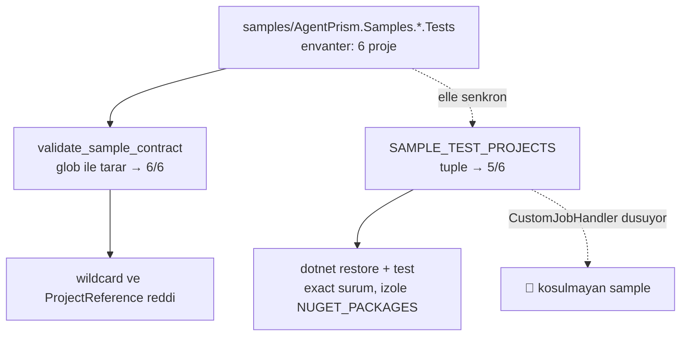
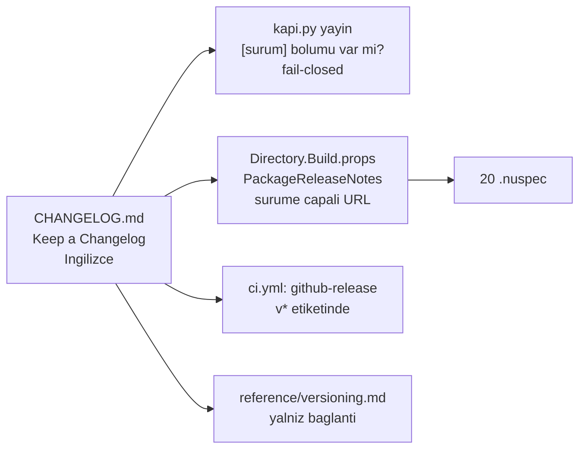

# Faz 123 — Yayın Kritik Yolu: Kapı Kapsamı, Adaptör Sözleşmesi ve Sürüm Notları

> **Durum:** ✅ Tamamlandı (2026-08-28)
> **Kaynak:** [YAYIN-HAZIRLIK.md](../../YAYIN-HAZIRLIK.md) — **BL-052**, **BL-015**, **OP-007** (KG-019, yol B)
> **Önkoşul:** Yok — [Faz 122](122-KAYIT-API-SI-VE-SESSIZ-BOSLUKLAR.md) kapandı, çalışma ağacı temiz
> **Paketler:** Kod paketi değişmiyor. Dokunulan: `src/Directory.Build.props`, `src/AgentPrism.Core`, `src/AgentPrism.{Anthropic,Azure,Google,OpenAI}`, `scripts/`, `.github/workflows/ci.yml`, `tests/AgentPrism.{Anthropic,Azure,Google,OpenAI}.UnitTests`
> **Yeni paket:** Yok · **Migration:** Yok
> **Public API:** Planın "büyümüyor" iddiası K-646'nın kusur düzeltmesiyle geçersiz kaldı — bkz. Gerçekleşen Public API. `AgentPrism.Core`'a bir tip eklendi (`TenantChatClientCacheKey`), `PublicAPI.Shipped.txt` toplamı hâlâ **0** satırdır (K-603)
> **Tüketici yüzeyi:** site: [`reference/versioning.md`](../../../docs-site/src/content/docs/reference/versioning.md) (yalnız bağlantı eklenir; ayna sayfa **yok**)
> · sevk edilen: **yeni** kök `CHANGELOG.md` (İngilizce) + her `.nuspec`'e giren `PackageReleaseNotes`
> **Manuel test alanı:** [`docs/manuel-test/01-KURULUM-VE-PAKETLEME.md`](../../manuel-test/01-KURULUM-VE-PAKETLEME.md)

---

## Bu Faza Başlarken

> `faz-baslangic` skill'ini uygula. Aşağıdaki liste o skill'in 2. adımıdır —
> **tamamını değil, yalnız işaret edilen bölümleri oku.**

1. Bu doküman
2. Kararlar — dosyanın tamamını **okuma**, yalnız bu kalemleri grep'le:
   ```bash
   grep -n "K-604\|K-622\|K-007\|K-603" docs/KARARLAR.md
   ```
   **K-604** (yayın işleri `release-dryrun` kapısına bağlandı), **K-622** (kapı
   *beş* sample'a bağlandı — 🚨 bu fazın düzelttiği ifade), **K-007** (yeni
   bağımlılık gerekçesi), **K-603** (`PublicAPI.Shipped.txt` boştur)
3. [Faz 122](122-KAYIT-API-SI-VE-SESSIZ-BOSLUKLAR.md) — yalnız devir notu:
   ```bash
   awk '/## Sonraki Faza Devir Notu/,0' docs/arsiv/fazlar/122-KAYIT-API-SI-VE-SESSIZ-BOSLUKLAR.md
   ```
   Kulvar 2'nin nerede kapandığını ve hangi kalemlerin bilinçli olarak dışarıda
   bırakıldığını söyler.
4. Alan hafızası (bu faz iki alana dokunuyor):
   [`hafiza/build-ve-analyzer.md`](../../hafiza/build-ve-analyzer.md) (pack, MinVer,
   metaveri kapısı) · [`hafiza/dokumantasyon.md`](../../hafiza/dokumantasyon.md)
   (`docs/` ↔ `docs-site/` sınırı, dil sınırı)
5. Gerektiğinde, tamamı değil ilgili bölümü:
   [`.agents/ortak/kapilar.md`](../../../.agents/ortak/kapilar.md) (kapı yüzeyi)

---

## Amaç

Bu faz yayın **kritik yolunu** kapatır. Üç kalem tek fazdadır çünkü üçü de aynı
altyapıyı paylaşır: **`v*` tag'i atıldığında ne üretildiğini ve neyin
doğrulandığını belirleyen hat.** İkisi kapının *neyi koşmadığını* düzeltir,
üçüncüsü kapının *hiç bilmediği* bir yapıtı ekler. Ayrı fazlara bölmek aynı üç
dosyayı (`kapi.py`, `ci.yml`, `Directory.Build.props`) üç kez açmak olurdu.

- **BL-052** — yayın kapısı altı dış sample'ın yalnız beşini koşuyor.
- **BL-015** — sevk edilen dört sağlayıcı adaptörü paylaşılan sağlayıcı
  sözleşmesini türetmiyor.
- **OP-007** — sürüm notu hattı hiç yok: `CHANGELOG.md`, `PackageReleaseNotes`
  ve GitHub release adımı üçü de eksik.

### Bugün ne çalışmıyor — doğrulanmış kanıt

| Kanıt | Gözlem |
|---|---|
| [`scripts/release_extension_samples.py:12-18`](../../../scripts/release_extension_samples.py) | `SAMPLE_TEST_PROJECTS` elle yazılmış **beşli** tuple; `AgentPrism.Samples.CustomJobHandler.Tests` içinde **yok** |
| [`scripts/release_extension_samples.py:35`](../../../scripts/release_extension_samples.py) | Aynı dosyadaki `validate_sample_contract` `samples.glob("AgentPrism.Samples.*/*.csproj")` kullanır — **şekil** doğrulaması altı sample'ı da kapsar. Yani sample doğrulanır ama koşulmaz |
| [`samples/Directory.Build.props:15`](../../../samples/Directory.Build.props) | `AgentPrismSamplePackageVersion` varsayılanı `*-*` — **floating**. Kapı dışında koşan sample exact sürüm kanıtı üretmez |
| `kapi.py yayin --kuru` çıktısı (KN-018) | Kapının kendi başarı satırı: `✅ Beş exact-version packed sample ve Native AOT smoke` |
| `tests/AgentPrism.{Anthropic,Azure,Google,OpenAI}.UnitTests/*.csproj` | Hiçbiri `AgentPrism.Testing.Contracts.Xunit`'e referans vermiyor |
| `tests/AgentPrism.{Anthropic,Azure,Google}.UnitTests/*ModelProviderCredentialTests.cs` | Üçünde elle yazılmış ayrı credential testi var — paylaşılan sözleşme yerine dört paralel suite |
| [`ModelProviderContract.cs`](../../../src/AgentPrism.Testing.Contracts.Xunit/Contracts/Providers/ModelProviderContract.cs) XML dokümanı | "runs with no network access and no API key" — türetmek `secret` veya ağ gerektirmez |
| `ls CHANGELOG.md` | Dosya **yok** |
| `grep -rn "PackageReleaseNotes" src/ scripts/` | **0** sonuç — ne tanımlı ne de kapı tarafından denetleniyor |
| `grep -rln "gh release create\|action-gh-release" .github/` | **0** sonuç — CI GitHub release üretmiyor (OP-006) |
| [`src/Directory.Build.props:66-69`](../../../src/Directory.Build.props) | MinVer `v` önekli tag'den sürüm türetir; `MinVerAutoIncrement=minor` |

> Kanıtlar 2026-08-28 tarihinde doğrulandı.

---

## 123.1 — Kapının koşum listesi envanterden ayrılamaz (BL-052)

Kök neden tek bir dosyada **iki farklı listenin** yaşamasıdır:



Düzeltme iki parçadır ve **ikisi birden** gerekir:

1. `AgentPrism.Samples.CustomJobHandler.Tests` koşum listesine girer.
2. Listenin envanterden sapmasını **kapı yakalar**. Tek satırlık ekleme aynı
   sınıf boşluğu üçüncü kez üretmeye açıktır — Faz 103 listeyi kurdu (K-622),
   Faz 120 sample ekledi, liste güncellenmedi ve kimse fark etmedi.

Kapı şunu iddia eder: `samples/AgentPrism.Samples.*.Tests` dizin envanteri,
`SAMPLE_TEST_PROJECTS` ∪ *bilinçli dışlama kümesi* ile **tam** eşleşir. Dışlama
kümesi boş başlar ve her üyesi bir gerekçe string'i taşır. Yeni bir sample
eklenince kapı kırmızı döner ve ekleyeni bir karara zorlar — sessizce dışarıda
kalmaz.

`AGENT_AOT_PROJECT` (`ExtensionAotSmoke`) bu iddianın dışındadır: `.Tests` ile
bitmez ve bir test projesi değildir.

## 123.2 — Sevk edilen adaptörler paylaşılan sözleşmeyi türetir (BL-015)

Bugün iki ayrı doğrulama hattı var ve biri sevk ediliyor:

| Hat | Kim koşuyor | Kim güveniyor |
|---|---|---|
| `ModelProviderContract` + `ModelProviderCredentialContract` | yalnız `AgentPrism.Samples.CustomModelProvider.Tests` | **üçüncü taraf** — sözleşmeyi okuyup öğrenir |
| Elle yazılmış `*ModelProviderCredentialTests.cs` | dört adaptörün kendi test projesi | AgentPrism'in kendisi |

İkisi ayrışırsa kimse fark etmez: tüketici sözleşmeden öğrendiğini shipped
adaptörde geçerli sanar. Bu faz sevk edilen dördünü **aynı** hatta alır.

Her adaptör test projesi:

- `ProjectReference` ile `src/AgentPrism.Testing.Contracts.Xunit`'e bağlanır —
  repo içi desen budur, `tests/AgentPrism.Core.UnitTests/*.csproj:5` aynısını
  yapar.
- `ModelProviderContract`'ı türetir (zorunlu taban).
- `ModelProviderCredentialContract`'ı türetir — dördü de BYOK'u destekler,
  kanıtı kendi `*ModelProviderCredentialTests.cs` dosyalarıdır.
- `ModelProviderSettingsContract`'ı yalnız `ProviderSettings` doğrulayan adaptör
  türetir; türetmeyen, sözleşmenin kendi anlattığı `ContractCoverage` muafiyet
  kaydını yazar. **Hangi adaptörün desteklediği uygulama anında ölçülmeli** —
  plan bunu tahmin etmez.

Elle yazılmış credential testleri **silinmez**. Sözleşme ortak zemindir;
sağlayıcıya özgü case'ler (örneğin Azure'un `endpoint` + `deployment` ikilisi)
kendi dosyasında kalır. Yalnız sözleşmenin birebir aynısını ölçen bir case
bulunursa kaldırılır ve bu sapma bölümüne yazılır.

> 🚨 **Sözleşme gerçek bir kusur bulabilir.** Bu fazın amacı budur. Bulursa iş
> `kusur-giderme`'ye devredilir ve **sınıf taraması** yapılır (dört adaptör
> birbirinin kardeşidir; biri kusurluysa diğerleri de ölçülür). Sözleşmeyi
> geçirmek için `Skip` konmaz veya case gevşetilmez.

## 123.3 — Sürüm notu hattı (OP-007)

Dört yapıt, tek kaynak. Kaynak kök `CHANGELOG.md`'dir.



**Biçim: Keep a Changelog** (kullanıcı kararı). `Unreleased` başlığı ve
`Added` / `Changed` / `Deprecated` / `Removed` / `Fixed` / `Security` grupları
kullanılır. Sürüm başlığı `## [1.0.0-preview.1] - YYYY-MM-DD` biçimindedir; kapı
ve CI bu başlığı ayrıştırır.

**`PackageReleaseNotes`: sürüme çapalı URL** (kullanıcı kararı). Değer
`src/Directory.Build.props` içinde bir kez tanımlanır ve 20 paketin hepsine
akar. `$(Version)` MinVer'den gelir:

```
https://github.com/farukatasoy/AgentPrism/blob/v$(Version)/CHANGELOG.md
```

Gerekçe: 20 paket tek sürüm hattından çıkar, yani gömülü metin 20 kez
tekrarlanırdı. URL `pack`'i dosya ayrıştırmaya bağlamaz ve deterministik kalır.

**Kapı fail-closed** (kullanıcı kararı). `kapi.py yayin` zorlanan sürüm için
`CHANGELOG.md`'de `[<sürüm>]` başlığını arar; yoksa sıfır olmayan kod döner.
Notsuz bir `v*` tag'i NuGet.org'a gidemez — NuGet.org'da yayın kalıcıdır ve
düzeltme yeni sürüm gerektirir.

**CI:** yeni `github-release` işi. `needs: [publish, npm-publish]`, koşul
`startsWith(github.ref, 'refs/tags/v')`. Gövde o sürümün CHANGELOG bölümüdür.
Mevcut zincir korunur — K-604 `publish`'i `release-dryrun`'a bağlamıştı;
`github-release` o zincirin **sonuna** eklenir, paralel bir yol açmaz.

**Site: yalnız bağlantı** (kullanıcı kararı). `reference/versioning.md` kök
`CHANGELOG.md`'ye bağlanır. Ayna sayfa açılmaz — `docs/` ile `docs-site/`
arasındaki "aynı içeriği iki yere yazma" kuralı burada da geçerlidir.

---

## Planlanan Public API

Bu faz .NET public yüzeyine **dokunmaz**. Değişen sözleşmeler build ve CI
yüzeyindedir:

```xml
<!-- src/Directory.Build.props — 20 paketin tamamına akar -->
<PackageReleaseNotes>https://github.com/farukatasoy/AgentPrism/blob/v$(Version)/CHANGELOG.md</PackageReleaseNotes>
```

```python
# scripts/release_extension_samples.py — taslak
SAMPLE_TEST_PROJECTS = (...)          # altı proje
SAMPLE_TEST_EXCLUSIONS: dict[str, str] = {}   # proje -> gerekçe; boş başlar

def validate_sample_inventory(root) -> list[str]:
    """samples/*.Tests envanteri ile kosum listesi tam eslesmeli."""
```

### HTTP `endpoint`'leri

Yok.

### Arayüz payı

Yok — arayüze dokunulmuyor.

---

## Planlanan Dosya Listesi

```
CHANGELOG.md                                    (yeni)
src/Directory.Build.props                       (PackageReleaseNotes)
scripts/release_extension_samples.py            (envanter kapısı + 6. sample)
scripts/kapi.py                                 (CHANGELOG bölüm denetimi)
.github/workflows/ci.yml                        (github-release işi)
docs-site/src/content/docs/reference/versioning.md   (bağlantı)
tests/AgentPrism.Anthropic.UnitTests/
├── AgentPrism.Anthropic.UnitTests.csproj       (ProjectReference)
└── AnthropicModelProviderContractTests.cs      (yeni)
tests/AgentPrism.Azure.UnitTests/
├── AgentPrism.Azure.UnitTests.csproj
└── AzureOpenAIModelProviderContractTests.cs    (yeni)
tests/AgentPrism.Google.UnitTests/
├── AgentPrism.Google.UnitTests.csproj
└── GoogleModelProviderContractTests.cs         (yeni)
tests/AgentPrism.OpenAI.UnitTests/
├── AgentPrism.OpenAI.UnitTests.csproj
└── OpenAIModelProviderContractTests.cs         (yeni)
```

---

## Hata Modları ve Testler

> Mutlu yoldan değil, **ne bozulabilir**den türetilir. Seviyeyi plan seçer.
> Sınır geçen davranış (DI · HTTP · kiracı · akış · depo · paket) birim
> testiyle kanıtlanamaz — [`.agents/ortak/test-seviyeleri.md`](../../../.agents/ortak/test-seviyeleri.md).

| Ne bozulabilir | Seviye | Test |
|---|---|---|
| Yeni sample eklenir, koşum listesine girmez (bugünkü kusurun tekrarı) | Fonksiyonel (kapı) | `validate_sample_inventory` — envanter ≠ liste ise sıfır olmayan kod |
| Bir sample bilinçli dışlanır ama gerekçesi yazılmaz | Fonksiyonel (kapı) | Dışlama kümesi gerekçe string'i olmadan kabul edilmez |
| `CHANGELOG.md` o sürüm bölümünü taşımıyor | Fonksiyonel (kapı) | `kapi.py yayin` fail-closed; kırmızı koşum önce gösterilir |
| `PackageReleaseNotes` `$(Version)` yerine ham `$(Version)` metnini gömer | Fonksiyonel (kapı) | Üretilen `.nuspec` içinde `v1.0.0-preview.1` beklenir, `v$(Version)` **beklenmez** |
| `PackageReleaseNotes` 20 paketin bir kısmına akmaz | Fonksiyonel (kapı) | Kapının metaveri denetimi 20/20 `.nuspec`'te alanı arar |
| Adaptör sözleşmesi ağ veya API anahtarı ister | Sözleşme | Dört adaptör suite'i `secret` olmayan ortamda koşar; CI'da kanıtlanır |
| Sözleşme sevk edilen adaptörde gerçek kusur bulur | Sözleşme | Kırmızı case → `kusur-giderme` + dört adaptörde sınıf taraması |
| `ContractCoverage` muafiyeti gerekçesiz yazılır | Sözleşme | Mevcut `ContractCoverage` mekanizması gerekçe ister |
| `github-release` tag olmayan push'ta koşar | Fonksiyonel (CI) | `if: startsWith(github.ref, 'refs/tags/v')` — iş atlanmalı |
| Aynı tag yeniden itilir, release iki kez üretilir | Fonksiyonel (CI) | `npm-publish`'in "already published — atlanıyor" deseni örnek alınır; var olan release güncellenir veya atlanır |
| `release-dryrun` yeşilken `publish` CHANGELOG'suz koşar | Fonksiyonel (CI) | Denetim `release-dryrun` içinde olmalı, yalnız `publish` içinde değil |

**Beş soru — bu fazın kod yolları için dürüst cevap:** bu faz çalışma anı kod
yolu eklemez. `iptal`, `eşzamanlılık` ve `başka kiracının kaydı` bu fazda
**uygulanamaz** — yeni bir istek yolu, arka plan işi veya depo erişimi yoktur.
`boş/aşırı girdi` CHANGELOG ayrıştırıcısında geçerlidir (boş dosya, bölümsüz
dosya, aynı sürümün iki kez yazılması) ve tabloya girmiştir. `alt sistem hatası`
CI'da geçerlidir (GitHub API erişilemez) ve `github-release` işinin
`publish`'ten **sonra** koşmasıyla sınırlanır: paket yayını GitHub release'e
bağlı kalmaz.

---

## Manuel Kabul Case'leri

> Kapanışta [`docs/manuel-test/01-KURULUM-VE-PAKETLEME.md`](../../manuel-test/01-KURULUM-VE-PAKETLEME.md)
> içine eklenecek case'lerin taslağı.

| # | Ön koşul | Adımlar | Beklenen sonuç |
|---|---|---|---|
| 1 | Temiz ağaç | `python3 scripts/kapi.py yayin --kuru --surum 1.0.0-preview.1` | Çıkış `0`; başarı satırı **altı** sample sayar |
| 2 | `CHANGELOG.md`'den `[1.0.0-preview.1]` bölümü geçici olarak silinir | Aynı komut | Sıfır olmayan çıkış; hata metni eksik bölümü ve sürümü adlandırır |
| 3 | Yeni boş bir `samples/AgentPrism.Samples.Deneme.Tests` dizini açılır | Aynı komut | Sıfır olmayan çıkış; envanter kapısı yeni projeyi adlandırır |
| 4 | Kapı koşumu bitti | `unzip -p artifacts/package/release/AgentPrism.Core.1.0.0-preview.1.nupkg '*.nuspec' \| grep releaseNotes` | URL `v1.0.0-preview.1` içerir; `$(Version)` metni **içermez** |
| 5 | Kapı koşumu bitti | 20 `.nuspec`'in tamamında aynı denetim | 20/20 alanı taşır |
| 6 | `secret` yok, ağ kapalı | Dört adaptör test projesi koşulur | Sözleşme case'leri geçer; `Skip` yok |
| 7 | 👤 insan gerekir | `docs-site` derlenir, `reference/versioning.md` açılır | CHANGELOG bağlantısı görünür ve çalışır |

---

## Açık Sorular

> Planı bloklamayan, faz uygulanırken karara bağlanacak sorular.

| # | Soru | Seçenekler | Öneri |
|---|---|---|---|
| 1 | Koşum listesi envanterden **türetilsin** mi, yoksa elle kalıp kapı mı denetlesin? | A: `glob`'dan türet, dışlama kümesi ile çıkar · B: elle liste + eşitlik kapısı | **B.** Yeni bir sample'ın yayın kapısına sessizce girmesi de bir sürprizdir; K1 (sıfır sürpriz) açık kararı ister. Kapı ekleyeni karara zorlar |
| 2 | Hangi adaptörler `ModelProviderSettingsContract`'ı türetir? | Ölçüme bağlı | Uygulama anında her adaptörün `ProviderSettings` doğrulaması **okunur**; türetmeyen muafiyet gerekçesi yazar. Tahmin edilmez |
| 3 | CHANGELOG bölüm ayrıştırıcısı nerede yaşar? | A: `kapi.py` içinde · B: ayrı `scripts/changelog.py`, CI ve kapı ortak kullanır | **B.** CI de aynı bölümü GitHub release gövdesi için okur; iki ayrı ayrıştırıcı yazmak drift üretir |
| 4 | `Unreleased` bölümü boşken kapı ne yapar? | A: sorun değil · B: uyarı | **A.** Kapı yalnız **zorlanan sürümün** bölümünü arar; `Unreleased` boş olabilir |
| 5 | K-622'nin "beş sample" ifadesi nasıl düzeltilir? | A: yeni karar kaydı · B: mevcut kaydın metnini düzelt | **B.** Sayı bir karar değil, bir olgu tespitidir; yeni `K-*` açmak defteri şişirir. Kapanışta düzeltilir |

---

## Bitiş Ölçütleri (DoD)

- [x] `kapi.py yayin --kuru --surum 1.0.0-preview.1` çıkış `0` verir ve başarı satırı **altı** packed sample sayar — `✅ 6 exact-version packed sample ve Native AOT smoke: 1.0.0-preview.1`
- [x] `samples/` altına sahte bir `*.Tests` projesi eklendiğinde kapı **kırmızı** döner (elle doğrulandı, sonra geri alındı) — MT-PKG-103
- [x] `CHANGELOG.md` bölümü silindiğinde kapı **kırmızı** döner (kırmızı koşum belgeye yazıldı) — MT-PKG-102
- [x] 20/20 `.nuspec` `releaseNotes` alanını taşır ve URL çözümlenmiş sürümü içerir — MT-PKG-104/105
- [x] Dört adaptör test projesi `ModelProviderContract` + `ModelProviderCredentialContract` türetir; `secret` ve ağ olmadan yeşil — MT-PKG-106 (79/76/84/111 test, `Skip` yok)
- [x] `ContractCoverage` muafiyetlerinin her biri gerekçe taşır — Azure ve OpenAI, `ModelProviderSettingsContract` için (ikisi de `ProviderSettings` okumuyor)
- [x] `.github/workflows/ci.yml` `github-release` işi tanımlı; `needs` ve tag koşulu doğru — `needs: [publish, npm-publish]`, `if: startsWith(github.ref, 'refs/tags/v')`
- [x] Dört doğrulama kapısı sıfır uyarı verir — `kapi.py kapanis --taban ef780fc` uçtan uca yeşil (build, 4779 test, pack, format, site)
- [x] `samples/AgentPrism.Api` ile gerçek `run` yapıldı, çıktı belgeye yazıldı — OpenAI (`support`) ve Anthropic (`claude-support`) agent'ları gerçek tamamlama döndürdü, `/api/runs`'da `Completed` olarak kaydedildi
- [x] `secret` taraması boş döndü — `kapi.py tarama` ✅
- [x] Manuel kabul case'leri `docs/manuel-test/01-KURULUM-VE-PAKETLEME.md` içine eklendi; otomatikleştirilebilenler koşuldu — MT-PKG-101..107 (107 yalnız 👤)
- [x] `faz-denetim` koşuldu; 🔴 bulgu kalmadı — bkz. Denetim Bulguları
- [x] `docs-site/` güncellendi; `npm run build` + `check-links.mjs` temiz — `npm run check` (dördü) yeşil
- [x] `YAYIN-HAZIRLIK.md`: BL-052, BL-015, OP-007 kapandı olarak işlendi; K-622'nin "beş" ifadesi düzeltildi — OP-006 da (yan etki) kapandı

### Doğrulama komutları

```bash
# Kapı: altı sample sayılmalı
python3 scripts/kapi.py yayin --kuru --surum 1.0.0-preview.1 2>&1 | tee /tmp/kapi.log
grep -c "Tests succeeded" /tmp/kapi.log      # 6 beklenir

# PackageReleaseNotes 20/20 pakete aktı mı?
for f in artifacts/package/release/*.nupkg; do
  unzip -p "$f" '*.nuspec' | grep -q '<releaseNotes>' || echo "EKSIK: $f"
done

# URL çözümlendi mi? Ham $(Version) kalmamalı
unzip -p artifacts/package/release/AgentPrism.Core.1.0.0-preview.1.nupkg '*.nuspec' | grep releaseNotes

# Adaptör sözleşmeleri, secret'sız
dotnet test tests/AgentPrism.Anthropic.UnitTests -c Release
```

---

## Riskler

| Risk | Önlem |
|------|-------|
| Sözleşme türetimi sevk edilen bir adaptörde gerçek kusur açar ve faz büyür | Kusur `kusur-giderme`'ye devredilir, bu fazın kapsamında **kalmaz**. Faz dokümanına sapma olarak yazılır. Sözleşme gevşetilmez |
| `PackageReleaseNotes` URL'i tag atılmadan **önce** 404 verir | Kabul edilen davranıştır: URL `v$(Version)` tag'ine çapalıdır ve tag ile aynı anda geçerli olur. Kapı URL'in **biçimini** doğrular, erişilebilirliğini değil — ağa yazmayan kapı sözleşmesi korunur (K-604) |
| CHANGELOG ayrıştırıcısı Keep a Changelog'un serbest biçimine takılır | Ayrıştırıcı yalnız `## [<sürüm>]` başlık satırını arar; gövdeyi bir sonraki `## ` satırına kadar alır. Grup adları yorumlanmaz |
| `github-release` işi GitHub API hatasında paket yayınını geçersiz kılar | İş `publish` ve `npm-publish`'ten **sonra** koşar; başarısızlığı yayınlanmış paketi etkilemez, yalnız release sayfasını eksik bırakır |
| Üç kalem tek fazda DoD'yi bulanıklaştırır | DoD kalem başına ayrı ölçülebilir satır taşır. `faz-denetim` üçünü ayrı ayrı yargılar |
| Kapı koşumu uzundur; kırmızı case'leri denemek pahalı | Kırmızı doğrulamalar (DoD 2 ve 3) yalnız ilgili alt adımla koşulabiliyorsa öyle koşulur; tam kapı bir kez sonda koşulur |

---

<!-- ============================================================
     AŞAĞISI KAPANIŞTA DOLDURULUR — `faz-tamamlama` skill'i.
     Plan anında boş kalır. Başlıkları SİLME.
     ============================================================ -->

## Plandan Sapmalar

- **123.2 planın öngörmediği bir üretim kodu değişikliğine büyüdü.**
  `ModelProviderCredentialContract`'ı dört shipped adaptöre (Anthropic, Azure,
  Google, OpenAI) türetmek planın kendi uyarısı gibi gerçek bir kusur buldu:
  `Concurrent_resolution_of_one_credential_stays_stable` dördünde de kırmızı
  döndü — her biri credential başına SDK istemcisini önbelleğe alıyordu ama
  döndürdüğü `IChatClient` sarmalayıcısını her çağrıda yeniden üretiyordu.
  Kullanıcıya iki seçenek sunuldu (sözleşmeyi gevşet / dört adaptörü düzelt);
  kullanıcı adaptörleri düzeltmeyi seçti. Sonuç: yeni public tip
  `AgentPrism.TenantChatClientCacheKey` (`AgentPrism.Core`) ve dört
  `*ModelProvider.cs` dosyasında `CreateChatClientCore` değişikliği. Kayıt:
  K-646.
- **`PackageReleaseNotes` planın taslağından farklı yerde tanımlandı.**
  Plan `src/Directory.Build.props`'ta düz bir `<PropertyGroup>` önermişti; bu
  MinVer'in `$(Version)`'ı henüz boşken okunduğu için ölçüldü ve çalışmadı
  (üretilen `.nuspec` `.../blob/v/CHANGELOG.md` taşıyordu). Düzeltme:
  `BeforeTargets="GenerateNuspec"` bir `<Target>`'ın içindeki
  `<PropertyGroup>`'a taşındı — `IsAotCompatible`'ın türetildiği
  `Directory.Build.targets` deseninin aynısı, yalnız evaluation-phase/
  execution-phase ekseninde.
- **`docs-site/reference/versioning.md`'deki CHANGELOG bağlantısı hiperlink
  DEĞİL, düz dosya adı referansı.** Plan "yalnız bağlantı eklenir" diyordu;
  repo bugün **private** (`docs-site/site.config.mjs`:
  `repositoryIsPublic = false`) ve site'nin kendi içerik kapısı
  `https://github.com/farukatasoy/AgentPrism` metnini reddediyor (okuyucuya
  404 verir). `CHANGELOG.md`'nin varlığı ve konumu anlatılıyor, tıklanabilir
  GitHub bağlantısı repo açıldığında eklenebilir.
- **123.1'in envanter kapısı planın taslağından bir isim farklı.** Plan
  `SAMPLE_TEST_EXCLUSIONS: dict[str, str]` ve `validate_sample_inventory`
  fonksiyon imzasını taslak olarak veriyordu; gerçekleşen kod birebir bu
  isimleri kullandı (sapma yok, doğrulama amaçlı not).
- **Site senkron kapısı iki kuralı `--site-gerekce-yazildi` ile geçti.**
  `cekirdek-kavram` (`src/AgentPrism.Core/Models/TenantChatClientCacheKey.cs`
  → `concepts/`) ve `model-saglayici`
  (`src/AgentPrism.{Anthropic,Azure,Google,OpenAI}/*ModelProvider.cs` →
  `getting-started/first-agent.md`) tetiklendi. Gerekçe: K-646'nın düzeltmesi
  yalnız **iç** bir önbellekleme detayıdır — BYOK'un imzası, kayıt çağrıları
  ve gözlemlenebilir davranışı değişmedi (aynı `UseAnthropic`/`UseAzureOpenAI`/
  `UseGoogle`/`UseOpenAI` çağrıları, aynı `ModelProviderCredential` şekli); ne
  `concepts/` ne `getting-started/first-agent.md` yeni bir tüketici gerçeği
  anlatmıyor.
- **`scripts/dokuman-bakim.py`'deki `ARSIV_ESIK` sabiti 114'ten 88'e
  düşürüldü** — K-646 kaydı `KARARLAR-INDEKS.md` bütçesini (25 000 B) 116 B
  aştı; Faz 122'nin devir notu bu tam senaryoyu önceden yazmıştı. Plan
  kapsamında değildi, dokümantasyon bütçesi altyapısının doğal bir sonucu.

## Bu Fazda Verilen Kararlar

- **K-646** — Tenant credential ile üretilen `IChatClient`, dört sevk edilen
  adaptörde de (credential, model, `ProviderSettings`) başına önbelleğe
  alınır; paylaşılan anahtar `AgentPrism.Core.TenantChatClientCacheKey`
  olarak eklendi *(kullanıcı kararı)*. Bkz. `docs/KARARLAR.md`.

## Gerçekleşen Public API

```csharp
namespace AgentPrism;

public static class TenantChatClientCacheKey
{
    public static string For(ModelProviderCredential credential, ModelBinding binding);
}
```

`AgentPrism.Core`'a eklendi (`src/AgentPrism.Core/Models/TenantChatClientCacheKey.cs`);
`PublicAPI.Unshipped.txt`'e iki satır girdi. Planın "Bu faz .NET public
yüzeyine dokunmaz" iddiası K-646'nın kusur düzeltmesiyle geçersiz kaldı —
bkz. Plandan Sapmalar.

Sözleşme testleri (`AgentPrism.Testing.Contracts.Xunit`) hiçbir public API
kazanmadı — dört adaptörün test projesi paketin **var olan**
`ModelProviderContract`/`ModelProviderCredentialContract`/
`ModelProviderSettingsContract`'ını türetti.

## Dosya Listesi (gerçekleşen)

```
CHANGELOG.md                                              (yeni)
scripts/changelog.py                                      (yeni)
scripts/changelog_test.py                                 (yeni)
scripts/kapi.py                                            (CHANGELOG kapısı + releaseNotes metaveri denetimi)
scripts/release_extension_samples.py                       (6. sample + validate_sample_inventory + SAMPLE_TEST_EXCLUSIONS)
scripts/release_extension_samples_test.py                  (3 yeni test)
scripts/dokuman-bakim.py                                   (ARSIV_ESIK 114 → 88)
src/Directory.Build.props                                  (PackageReleaseNotes hedefi)
src/AgentPrism.Core/Models/TenantChatClientCacheKey.cs      (yeni)
src/AgentPrism.Core/PublicAPI.Unshipped.txt                 (2 satır)
src/AgentPrism.Anthropic/AnthropicModelProvider.cs          (K-646 düzeltmesi)
src/AgentPrism.Azure/AzureOpenAIModelProvider.cs            (K-646 düzeltmesi)
src/AgentPrism.Google/GoogleModelProvider.cs                (K-646 düzeltmesi)
src/AgentPrism.OpenAI/OpenAIModelProvider.cs                (K-646 düzeltmesi)
tests/AgentPrism.Anthropic.UnitTests/
├── AgentPrism.Anthropic.UnitTests.csproj                   (ProjectReference)
└── AnthropicModelProviderContractTests.cs                  (yeni)
tests/AgentPrism.Azure.UnitTests/
├── AgentPrism.Azure.UnitTests.csproj
└── AzureOpenAIModelProviderContractTests.cs                (yeni)
tests/AgentPrism.Google.UnitTests/
├── AgentPrism.Google.UnitTests.csproj
└── GoogleModelProviderContractTests.cs                     (yeni)
tests/AgentPrism.OpenAI.UnitTests/
├── AgentPrism.OpenAI.UnitTests.csproj
└── OpenAIModelProviderContractTests.cs                     (yeni)
.github/workflows/ci.yml                                    (github-release işi)
docs-site/src/content/docs/reference/versioning.md           (Release notes bölümü)
docs-site/public/llms-full.txt                               (üretildi)
docs/manuel-test/01-KURULUM-VE-PAKETLEME.md                  (MT-PKG-101..107)
docs/YAYIN-HAZIRLIK.md                                        (BL-052/BL-015/OP-006/OP-007 kapandı)
docs/KARARLAR.md                                              (K-646; K-622 "beş" düzeltmesi)
```

## Denetim Bulguları

`faz-denetim`, taze bağlamlı ayrı bir agent olarak koştu (çalışma ağacına
karşı, taban `ef780fc`). Dört adaptörün gerçek `dotnet test` koşumunu ve
`kapi.py yayin --kuru --surum 1.0.0-preview.1`'in kendi çıktısını bağımsızca
doğruladı.

**🔴 Kapanmadan faz bitmez:** yok.

**🟡 Aynı fazda kapanır veya gerekçelenir:**

| # | Bulgu | Sonuç |
|---|---|---|
| 1 | `TenantChatClientCacheKey`'in XML dokümanı "the four shipped factories already give the setup-time client, which is built once and shared" diyordu — kod bunu yalanlıyor (setup-time yolu da her çağrıda taze sarmalayıcı üretiyor, yalnız alttaki SDK client paylaşılıyor). | **Düzeltildi.** Cümle "yalnız SDK client paylaşılır, sarmalayıcı değil" diye yeniden yazıldı. |

**🟢 Aday listesine / gerekçelendi:**

| # | Bulgu | Sonuç |
|---|---|---|
| 1 | Reflection tabanlı `CredentialKeyProbe` (~70 satır) dört adaptörün contract test dosyasında birebir kopyalanmış. | **Gerekçelendi, aday açılmadı.** Repo'nun mevcut deseniyle tutarlı (her adaptörün kendi `SecretLeakTests`/health-check testleri de bağımsız kopyalar taşıyor); dört ayrı, birbirinden habersiz test projesi arasında paylaşılan bir yardımcı proje açmak bu fazın kapsamının çok üstünde bir refactor olurdu. |
| 2 | Yeni `github-release` CI işi `${{ github.ref_name }}`'i bir Python string literaline gömüyordu (teorik kaçış riski). | **Düzeltildi** (bedelsizdi) — `env: TAG_NAME` ile taşınıp `os.environ['TAG_NAME']` ile okunuyor. |
| 3 | Fazın "Planlanan Public API" bölümü "Bu faz .NET public yüzeyine dokunmaz" diyordu; K-646 bir public tip ekledi. | **Gerekçelendi** — Plandan Sapmalar ve Gerçekleşen Public API bölümlerine açıkça yazıldı. |

**Temiz çıkan başlıklar:** 3.1 (DoD tek tek ölçüldü), 3.2 (test tiyatrosu
yok), 3.3 (sözleşme testi + gerçek `dotnet test`/`kapi.py yayin` koşumu —
doğru seviye), 3.4 (`Concurrent_resolution_of_one_credential_stays_stable`
eşzamanlılığı kanıtlıyor), 3.5 (imza-gövde kayması yok), 3.6 (`ContractCoverage`
muafiyetleri kanıtlı gerekçe taşıyor), 3.7 (İngilizce/`TryAdd*`/`ConfigureAwait`/
`secret` kuralları temiz), 3.8 (`versioning.md` bağlantısı eklendi, manuel test
case'leri eklendi, iç referans sızmadı).

## Sonraki Faza Devir Notu

- **Yayın kritik yolu kapandı.** BL-052, BL-015, OP-006, OP-007 hepsi
  `docs/YAYIN-HAZIRLIK.md`'de kapalı. Kalan `preview.1` tag'i öncesi işler:
  doküman drift taraması ve OP-002/004/005 hesap kararları (kullanıcı
  ertelemesi, repo-dışı) — bkz. `docs/YAYIN-HAZIRLIK.md` başlık özeti.
- **🚨 `PackageReleaseNotes` gibi `$(Version)`'a bağlı herhangi bir MSBuild
  özelliği düz bir `<PropertyGroup>`'ta TANIMLANAMAZ.** MinVer `$(Version)`'ı
  bir TARGET'te hesaplar (execution phase); düz `<PropertyGroup>` (evaluation
  phase) onu her zaman boş okur. Çözüm:
  `BeforeTargets="GenerateNuspec"` bir `<Target>`'ın içindeki
  `<PropertyGroup>`. `IsAotCompatible`'ın props-vs-csproj sırası tuzağıyla
  AYNI SINIF, farklı eksen (evaluation-vs-execution). Kanıt:
  `src/Directory.Build.props` satır ~72.
- **🚨 `ModelProviderCredentialContract`'ı türetmek, bir adaptörün credential
  wrapper'ını önbelleğe almadığını yakalar.** Yeni bir üçüncü/dördüncü taraf
  provider yazan biri bu contract'ı türetirse aynı testi görür — sözleşmenin
  kendi XML dokümanı artık ("shared SDK client, not the wrapper") doğru.
- **Devralınan sözleşme:** `AgentPrism.Testing.Contracts.Xunit` paketinin dört
  provider contract'ı (`ModelProviderContract`,
  `ModelProviderCredentialContract`, `ModelProviderSettingsContract`) artık
  dört shipped adaptörün TAMAMINDA gerçek testle koşuyor —
  `tests/AgentPrism.{Anthropic,Azure,Google,OpenAI}.UnitTests/*ModelProviderContractTests.cs`.
  Bir provider adaptörüne yeni bir `ProviderSettings` anahtarı eklenirken
  `ModelProviderSettingsContractTests`'in `SupportedSetting`'ini güncellemeyi
  unutma.
- **Devralınan sözleşme:** `scripts/release_extension_samples.py`'nin
  `SAMPLE_TEST_PROJECTS` ∪ `SAMPLE_TEST_EXCLUSIONS` artık `samples/*.Tests`
  envanteriyle TAM eşleşmek zorunda (`validate_sample_inventory`). Yeni bir
  `AgentPrism.Samples.<Ad>.Tests` dizini açıldığında bu iki kümeden birine
  bilinçli olarak eklenmezse `kapi.py yayin` kırmızı döner.
- **Yarım kalan iş yok** — üç kalemin (BL-052, BL-015, OP-007) üçü de
  kapandı, `kapi.py yayin --kuru --surum 1.0.0-preview.1` uçtan uca yeşil.
- **Sıradaki faz `YOL-HARITASI.md`'de henüz planlanmadı** (Faz 122'nin devir
  notundan miras). Kullanıcı kararı gerekiyor: yeni bir `aday-kesfi`/
  `faz-planlama` turu, ya da `nuget-danismani`'nin yayın kararı turu
  (kalan tek büyük engel: OP-002/004/005 hesap kararları ve gerçek `v*`
  tag'inin kendisi).
