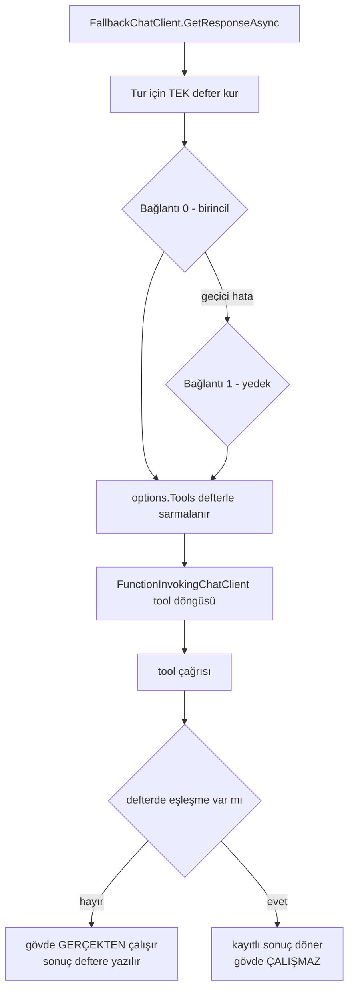

# Faz 124 — Yedeklemenin Tool Defteri

> **Durum:** ✅ Tamamlandı (2026-08-31)
> **Kaynak:** [kesif/2026-08-31-tuketici-raporu-faz-adaylari.md](../../kesif/2026-08-31-tuketici-raporu-faz-adaylari.md) · **K-1** (kusur kanalından faz kanalına geçti)
> **Önkoşul:** [Faz 62](62-MODEL-YEDEK-ZINCIRI-VE-ON-UCUS-DENETIMI.md) (yedek zinciri) ve [Faz 87](87-KESILEN-ISIN-DEVAMI.md) (kesinti devamı, `RecordedToolPlayback`) — ikisi de arşivde; yalnız aşağıdaki grep'lerle okunur
> **Paketler:** `AgentPrism.Core` (`Models/FallbackChatClient.cs`, `Replay/RecordedToolPlayback.cs`)
> **Yeni paket:** Yok · **Migration:** Yok — defter turun ömrü kadar yaşar, hiçbir yere yazılmaz
> **Public API:** Büyümüyor. Dokunulan iki tip de `internal`. Bu, fazın en ucuz tarafıdır: `wc -l src/*/PublicAPI.Shipped.txt` toplamı **17** satır (K-603) ve bu faz o sayıya bir satır bile eklemez
> **Tüketici yüzeyi:** `docs-site/src/content/docs/guides/reliability.md` (yedekleme bölümü), `concepts/tools.md` · sevk edilen: `FallbackChatClient` XML `<remarks>`'ı — 🚨 bugün **yanlış** bir davranışı doğru diye ilan ediyor
> **Manuel test alanı:** `docs/manuel-test/27-MODEL-YEDEK-VE-ON-UCUS.md`

---

## Bu Faza Başlarken

> `faz-baslangic` skill'ini uygula. Aşağıdaki liste o skill'in 2. adımıdır —
> **tamamını değil, yalnız işaret edilen bölümleri oku.**

1. Bu doküman
2. Kararlar — dosyanın tamamını **okuma**, yalnız bu kalemleri grep'le:
   ```bash
   grep -n "K-583\|K-315\|K-320\|K-483" docs/KARARLAR.md
   ```
   **K-583** (kesinti devamı `Replay` ve `ApprovalResume` ile karıştırılmaz — bu faz o üçüne **dördüncü** bir işlem eklemez, var olan mekanizmayı ödünç alır) · **K-315** (replay sözleşmesi) · **K-320** (model boru hattının tamamını `ModelProviderRegistry` kurar) · **K-483** (elle tekrarlanan ifade sessiz kusur sınıfı üretir — bu fazın kaçınması gereken tam desen)
3. Alan hafızası (bu faz iki alana dokunuyor):
   [`hafiza/model-boru-hatti.md`](../../hafiza/model-boru-hatti.md) (halka sırası — yanlış halka konumu derlenir, testten geçer, yalnız gerçek senaryoda çöker) ·
   [`hafiza/cekirdek-calistirma.md`](../../hafiza/cekirdek-calistirma.md) (tool döngüsü ve `AgentPrismRunContext`)
4. Gerektiğinde, tamamı değil ilgili bölümü:
   [`MIMARI.md`](../../MIMARI.md) — çalıştırma yolu bölümü

---

## Amaç

Bir sağlayıcı yedeklemesi, birincil sağlayıcıda **zaten çalışmış** bir tool'u
yedek sağlayıcıda ikinci kez çalıştırabilir. Ödeme alan, kayıt silen veya
webhook atan bir tool bu yolda iki kez çalışır ve bunu kimse görmez.

Aynı ürün aynı riske **iki farklı cevap** veriyor: kesinti devamı yolunda
tamamlanmış her tool çağrısı kendi kayıtlı sonucundan cevaplanır
(`RecordedToolPlayback`), yedekleme yolunda hiçbir kapı yok. Bu bir yetenek
eksikliği değil, bir tutarsızlıktır. Bu faz kardeş yolun mekanizmasını
yedeklemeye taşır.

- **K-1** — Yedeğe geçilirken tamamlanmış tool çağrıları tur-içi bir defterden cevaplanır; yalnız kesinti noktasının ötesindeki çağrılar gerçekten çalışır.

### Bugün ne çalışmıyor — doğrulanmış kanıt

| Kanıt | Gözlem |
|---|---|
| [`FallbackChatClient.cs:31-35`](../../../src/AgentPrism.Core/Models/FallbackChatClient.cs) | Kendi dokümanı sonucu yazıyor: *"a fallback **restarts the agent's tool-call turn from scratch**"* |
| [`FallbackChatClient.cs:115-171`](../../../src/AgentPrism.Core/Models/FallbackChatClient.cs) | Akışsız döngüde `SafeToRepeat`, `ToolEffect` veya herhangi bir tool defteri **yok**; `client.GetResponseAsync` bütün turu baştan koşar |
| [`ModelProviderRegistry.cs:448-452`, `:536`](../../../src/AgentPrism.Core/Models/ModelProviderRegistry.cs) | `UseFunctionInvocation()` boru hattının **içinde**, `FallbackChatClient` onun **dışında** — yani tool döngüsü gerçekten bu istemcinin altındadır |
| [`FallbackChatClient.cs:200-206`, `:234`](../../../src/AgentPrism.Core/Models/FallbackChatClient.cs) | 🚨 **Akışlı yol bugün zaten kapalı:** `sawUpdate` ilk kareden sonra yedeğe geçişi engelliyor. Tool döngüsü akışta çağrı içeriğini kareye çevirdiği için tool koştuysa `sawUpdate` çoktan `true`'dur |
| [`RecordedToolPlayback.cs:24-62`, `:160-200`](../../../src/AgentPrism.Core/Replay/RecordedToolPlayback.cs) | Kardeş mekanizma hazır: `(ad, argüman)` ile eşleştirir, `RunLive` politikasında eşleşmeyeni canlı koşar |
| [`RunReconciliationService.cs:232`](../../../src/AgentPrism.Core/Recording/RunReconciliationService.cs) | Kesinti devamı ayrıca yıkıcı/dış etkili tool taşıyan run'ı **hiç** devam ettirmez |

> Kanıtlar 2026-08-31 tarihinde `8105c00` üzerinde doğrulandı.

### Kapsam sınırı — ölçümün getirdiği daralma

Kusur **yalnız akışsız `GetResponseAsync` yolundadır.** Akışlı yolda yedeğe
geçiş ancak ilk kare gelmeden önce olur; o noktada hiçbir tool çalışmamıştır.
Bu yüzden akışlı yola defter takmak **saf ek yüktür** ve bu faz onu takmaz.
Bu daralma plan anında ölçüldü; uygulayan oturum aksini varsaymasın.

---

## 124.1 — Tur-içi tool defteri

Fikir tek cümledir: **yedeklemenin denediği her bağlantı aynı deftere bakar.**



Defter turun yerel değişkenidir. `FallbackChatClient` onu kendi metot
gövdesinde kurar ve sarmalayıcılara **closure ile** verir. `AsyncLocal`
kullanılmaz — bu repo'da `AsyncLocal` yazımının çağırana akmaması dört kez
bedel ödetti ve burada ona hiç ihtiyaç yoktur.

### Neden tek sarmalayıcı, iki mod değil

Sarmalayıcı **hem yazar hem okur**: eşleşme varsa kayıtlı sonucu döner,
yoksa gövdeyi çalıştırır ve sonucu deftere yazar. Bu tek davranış her
bağlantı için aynıdır — bağlantı 0'da defter boştur, bağlantı 2'de hem
birincinin hem ikincinin çağrıları defterdedir. İki ayrı mod (kaydeden ve
oynatan) yazılsaydı üçüncü bağlantı ikincinin tool'larını tekrar
çalıştırırdı.

### `RecordedToolPlayback` genişletilir, kopyalanmaz

Yeni bir defter tipi yazmak **K-483'ün sınıfıdır**: argüman biçimlendirme
ifadesi iki yerde yaşar ve biri değişince diğeri sessizce eşleşmez.
`RecordedToolPlayback` zaten `(ad, argüman)` anahtarını, tüketim sırasını ve
hata oynatmasını taşıyor. Bu faz ona yalnız bir yetenek ekler: `RunLive`
politikasında canlı koşan çağrının sonucunu deftere **yazma**.

🚨 **Bu, tipin bugünkü değişmezini bozar.** Kendi yorumu şunu yazıyor:
*"Once the ledger is built, the set of KEYS does not change; only the queues
are consumed."* Canlı çağrıyı yazmak yeni anahtar üretir. `Dictionary`
`ConcurrentDictionary`'ye döner ve o yorum düzeltilir —
`AllowConcurrentToolCalls` açıkken aynı turda iki tool paralel yazabilir.

### Sonuç eşleştirme sözleşmesi

| Durum | Davranış | Gerekçe |
|---|---|---|
| Aynı ad, aynı argüman | Kayıtlı sonuç döner, gövde çalışmaz | Kullanıcı kararı (2026-08-31): kesinti devamının deseninin **birebir** aynısı |
| Aynı ad, farklı argüman | Gövde çalışır, sonuç deftere yazılır | Yedek model başka bir soru soruyor; o soru hiç sorulmadı |
| Aynı ad ve argüman, ikinci kez | Kayıt sırasına göre **ikinci** kayıt tüketilir | `RecordedToolPlayback`'in bugünkü kuralı; "aynı soruyu iki kez sor, iki farklı cevap al" senaryosu korunur |
| Kayıtlı çağrı **hata** verdiyse | Hata oynatılır | Bugünkü kural: başarısız bir tool'u başarılı göstermek sadakatsizliktir |
| Defterde olmayan çağrı | Gövde çalışır | Kesinti noktasının ötesi |

**Salt okunur tool da defterden cevaplanır.** Bu bilinçli: tek bir eşleştirme
kuralı olması, `FallbackChatClient`'ın `IToolRegistry`'ye bağımlı olmasından
ve aynı riske iki farklı kuralın yaşamasından daha değerlidir. Aynı tur içinde
saniyeler geçtiği için bayat sonuç riski ölçülebilir değildir.

## 124.2 — `ChatOptions` sarmalaması — 🚨 çağıranın listesi değiştirilmez

Sarmalama `options.Tools` üzerinde yapılır. İki tuzak vardır:

1. **Yerinde değiştirme yasak.** `options` çağırana aittir ve derlenmiş agent
   önbelleklidir (`CompiledAgentCache`). `options.Tools`'u yerinde sarmalamak
   sonraki her run'ı da sarmalar. Yeni bir liste kurulur.
2. **`ChatOptions.Clone()`'un `Tools` listesini nasıl kopyaladığı
   doğrulanmadı — `maf-api-kesfi` ile ölçülmeli.** Sığ kopya aynı liste
   nesnesini paylaşıyorsa `linkOptions.Tools = new List<AITool>(...)` zorunludur.
   Bugün `OptionsForLink` yalnız bağlantı > 0 için `Clone()` çağırıyor;
   bağlantı 0 çağıranın nesnesini **doğrudan** geçiyor
   (`FallbackChatClient.cs:121`). Bu faz bağlantı 0'ı da klonlamak zorundadır.

Yalnız `AIFunction` olan tool'lar sarmalanır. İstemci tarafı tool'lar
(`AIFunctionDeclaration`, gövdesiz) sunucuda hiç çalışmaz; sarmalanacak bir
gövdeleri yoktur.

## 124.3 — 🚨 Sınıf taraması: bir turu baştan çalıştıran diğer yollar

`kusur-giderme` Adım 5 bu fazın içindedir ve atlanamaz. Kusur sınıfı şudur:
**"bir tool turunu baştan çalıştıran her yol."** Plan anında dört aday tarandı;
uygulayan oturum her birini kod üzerinde tekrar ölçer ve sonucu yazar.

| Yol | Plan anındaki ölçüm | Uygulama sonrası ölçüm |
|---|---|---|
| Sağlayıcı yedeklemesi (akışsız) | 🔴 **Açık** — bu fazın konusu | ✅ Düzeltildi — `FallbackChatClient.GetResponseAsync` artık tur-içi `RecordedToolPlayback` defteri paylaşıyor. Kanıt: `FallbackToolLedgerTests`, `FallbackToolSideEffectTests` (gerçek HTTP + DI + `FunctionInvokingChatClient`) |
| Sağlayıcı yedeklemesi (akışlı) | 🟢 Kapalı — `sawUpdate` (`FallbackChatClient.cs:234`) | ✅ Doğrulandı ve **bir testle sabitlendi**: `FallbackToolLedgerTests.Streaming_path_does_not_wrap_tools_with_the_ledger` akışlı yolda tool'un `ledger.Wrap` ile SARILMADIĞINI (aynı `AIFunction` referansı sağlayıcıya ulaşıyor) ölçer |
| Kesinti devamı | 🟢 Kapalı — iki kapı: `RunReconciliationService.cs:232` reddi + `RecordedToolPlayback` | Değiştirilmedi — `recordLiveCalls` varsayılanı `false` kaldığı için `RunContinuationJobHandler`'ın çağrısı (`new RecordedToolPlayback(invocations, ToolPlaybackMismatchPolicy.RunLive)`) davranışını birebir korur. Regresyon: mevcut `RunContinuationTests` değişmeden geçti |
| Workflow düğüm retry'ı (`WorkflowNodeRetryPolicy`) | 🟡 **Ölçülmedi.** `MaxAttempts` varsayılanı `1` (retry kapalı, K1). Açıldığında düğümün tamamı — içindeki agent run'ı dahil — baştan koşar | 🟢 **Ölçüldü, B'ye düştü** (kod okunarak: `src/AgentPrism.Workflows/Internal/WorkflowNodeRetry.cs` + `AgentPrismWorkflowFunctionExtensions.cs`). `WorkflowNodeRetry.Wrap` yalnız `AddWorkflowFunction`'ın KOD FONKSİYONU düğümünü sarar — `FunctionExecutor<TInput,TOutput>`, opak bir `Func<TInput, IWorkflowContext, CancellationToken, ValueTask<TOutput>>`. Bu, agent çalıştıran bir workflow DÜĞÜMÜ değildir; AgentPrism'in KENDİ tool döngüsü bu sarmalamanın hiçbir yerinde YOKTUR. Bir fonksiyon gövdesi kendi içinde bir agent çalıştırırsa (`agent.RunAsync(...)`), o agent'ın tool döngüsünü tekrar çalıştırma riski **tamamen fonksiyon yazarının kendi kodundadır** — AgentPrism'in hiçbir mekanizması opak bir `Func`'ın içine bakıp "hangi agent'ı çağırdığını" bilemez, bu yüzden `RecordedToolPlayback` gibi bir defter buraya TAKILAMAZ. Bu risk zaten `AddWorkflowFunction`'ın kendi XML dokümanında AÇIKÇA yazılıydı ("The handler must be idempotent when the workflow enables checkpointing... A handler with a real side effect... must therefore tolerate being called more than once") — YENİ bir kusur değil, VAR OLAN bir sözleşmenin doğal sonucu. Ayrı kalem açılmadı: düzeltilecek somut bir kod yolu yok, yalnız var olan idempotency sözleşmesinin doğrulanması vardı |
| Job retry (`IJobHandler`, at-least-once) | 🟢 Sözleşme **yazılı** (Faz 120): handler'ın idempotent olması gerektiği ilan edilmiş | Değiştirilmedi; yazılı olduğu doğrulandı (`docs/arsiv/fazlar/120-JOB-SOZLESMESI-AT-LEAST-ONCE.md`) |
| Replay (`ToolPlaybackMismatchPolicy.Stop`) | 🟢 Kapalı — replay hiçbir gövdeyi çalıştırmaz | Değiştirilmedi — `Stop` politikasının davranışı `recordLiveCalls`'tan bağımsız (yalnız `RunLive` dalı okur). Regresyon: mevcut `RecordedToolPlaybackTests` değişmeden geçti |

---

## Planlanan Public API

**Public API büyümüyor.** Dokunulan her tip `internal`:

```csharp
// AgentPrism.Core — internal, PublicAPI.Unshipped.txt'ye satır EKLEMEZ
internal sealed class RecordedToolPlayback
{
    public RecordedToolPlayback(
        IReadOnlyList<ToolInvocationRecord> invocations,
        ToolPlaybackMismatchPolicy mismatchPolicy = ToolPlaybackMismatchPolicy.Stop,
        bool recordLiveCalls = false);   // YENİ — varsayılan kapalı (K1)

    public AIFunction Wrap(AIFunction function);
}
```

`recordLiveCalls` varsayılanı `false`'tur: replay ve kesinti devamı yolları
bugünkü davranışlarını **birebir** korur.

### HTTP `endpoint`'leri

Yok. Bu faz hiçbir uç eklemez veya değiştirmez.

### Arayüz payı

Yok.

---

## Planlanan Dosya Listesi

```
src/AgentPrism.Core/
├── Models/
│   └── FallbackChatClient.cs          (değişir — defter kurulumu, tool sarmalama, XML remarks düzeltmesi)
└── Replay/
    └── RecordedToolPlayback.cs        (değişir — recordLiveCalls, ConcurrentDictionary)

tests/AgentPrism.Core.UnitTests/
└── Models/
    └── FallbackToolLedgerTests.cs     (yeni)

tests/AgentPrism.AspNetCore.FunctionalTests/
└── FallbackToolSideEffectTests.cs     (yeni — sınırı geçen davranış)

docs-site/src/content/docs/guides/reliability.md   (değişir)
docs/manuel-test/27-MODEL-YEDEK-VE-ON-UCUS.md      (case eklenir)
```

---

## Hata Modları ve Testler

> Mutlu yoldan değil, **ne bozulabilir**den türetilir. Seviyeyi plan seçer.

| Ne bozulabilir | Seviye | Test sınıfı |
|---|---|---|
| Yan etkili tool yedekte **ikinci kez** çalışır (kusurun kendisi) | Fonksiyonel | `FallbackToolSideEffectTests` — gövde bir sayaç artırır; yedeğe geçtikten sonra sayaç **1** olmalıdır |
| Yedek modelin **yeni** tool çağrısı defterde yok diye engellenir | Birim | `FallbackToolLedgerTests` |
| Aynı ad + aynı argüman iki kez çağrıldı; ikinci kayıt tüketilmiyor | Birim | `FallbackToolLedgerTests` |
| Kayıtlı **hata** başarı gibi oynatılıyor | Birim | `FallbackToolLedgerTests` |
| Üçüncü bağlantı, ikinci bağlantının tool'unu tekrar çalıştırıyor | Birim | `FallbackToolLedgerTests` — üç bağlantılı zincir |
| `AllowConcurrentToolCalls` açıkken defter yazımı yarışıyor | Fonksiyonel | `FallbackToolSideEffectTests` — eşzamanlı iki tool |
| Çağıranın `options.Tools` listesi kalıcı olarak sarmalanıyor (önbellekli agent kirlenir) | Fonksiyonel | `FallbackToolSideEffectTests` — aynı agent'ı yedeklemesiz ikinci kez koştur |
| Akışlı yolda defter yanlışlıkla devreye girip ek yük getiriyor | Birim | `FallbackToolLedgerTests` — akışlı yolda sarmalama yapılmadığı sabitlenir |
| Yedekleme **hiç** yapılandırılmamışken davranış değişiyor | Birim | `FallbackToolLedgerTests` — `Fallbacks` boşken `FallbackChatClient` zaten kurulmuyor |
| Replay ve kesinti devamı yollarında davranış kayıyor | Sözleşme | `RepeatableToolContract` (mevcut) — `recordLiveCalls: false` varsayılanı korunmalı |
| İptal, yedeğe geçiş sırasında yutuluyor | Birim | `FallbackToolLedgerTests` — `OperationCanceledException` bugün de yeniden fırlatılıyor (`FallbackChatClient.cs:140`) |

Beş soru ve cevapları: **iptal** → yukarıdaki son satır · **eşzamanlılık** →
`ConcurrentDictionary` + eşzamanlı tool testi · **boş/aşırı girdi** → argümansız
tool çağrısı (`FormatArguments` `null` döner) birim testinde · **başka kiracı** →
defter tur-yerel, kiracı sınırı geçmez, bu yüzden kiracı testi **gereksizdir**
ve bu gerekçe yazıldı · **alt sistem hatası** → defter hiçbir `store`'a yazmaz,
alt sistem yoktur.

---

## Manuel Kabul Case'leri

| # | Ön koşul | Adımlar | Beklenen sonuç |
|---|---|---|---|
| 1 | `ToolEffect.External`, `SafeToRepeat=false` bir tool ve iki bağlantılı `Fallbacks` taşıyan agent; birincil sağlayıcı ikinci turda 503 verecek şekilde ayarlı | Akışsız `POST /api/agents/{ad}/run` | Tool gövdesi **bir kez** çalışır; yanıt yedek sağlayıcıdan gelir; `ModelFallbackUsed` olayı `reason` taşır |
| 2 | Aynı kurulum, akışlı uç | `POST /api/agents/{ad}/run/stream` | İlk kare geldikten sonra yedeğe **geçilmez**; hata olduğu gibi akar (bugünkü davranış korunur) |
| 3 | Yedeklemesiz agent | Normal `run` | Davranış Faz 123 ile birebir aynı; ek olay veya ek gecikme yok |

---

## Açık Sorular

| # | Soru | Seçenekler | Karar |
|---|---|---|---|
| 1 | Workflow düğüm retry'ı bu fazın kapsamına girer mi? | A: Ölç, açıksa bu fazda kapat · B: Ölç, ayrı kalem olarak devret | **B** — ölçüldü (§ 124.3): `WorkflowNodeRetry` yalnız opak bir kod fonksiyonunu sarar, AgentPrism'in kendi tool döngüsünü hiç görmez; düzeltilecek somut bir kod yolu yok |
| 2 | Defterden cevaplanan bir çağrı `run_events`'e görünür bir iz bırakmalı mı? | A: Hayır, sessiz · B: `ToolReplayedFromLedger` benzeri bir olay | **A** — olay hacmi artar ve tüketicinin bugün ölçülmüş bir ihtiyacı yok. B istenirse `RecordReasoningDeltas` deseniyle varsayılan kapalı gelir |
| 3 | `FallbackChatClient`'ın XML `<remarks>`'ındaki "restarts from scratch" cümlesi silinmeli mi, düzeltilmeli mi? | A: Düzelt — "tool turu baştan başlar ama tamamlanmış çağrılar defterden cevaplanır" · B: Sil | **A** — cümlenin ilk yarısı hâlâ doğrudur; konuşma durumu gerçekten baştan kurulur |

---

## Bitiş Ölçütleri (DoD)

- [x] `ToolEffect.External` + `SafeToRepeat=false` bir tool, yedeğe geçen akışsız bir run'da **bir kez** çalışır — `FallbackToolSideEffectTests` sayacı `1` gösterir
- [x] Yedek modelin defterde olmayan çağrısı gerçekten çalışır — aynı testte ikinci sayaç artar
- [x] Üç bağlantılı zincirde ikinci bağlantının tool'u üçüncüde tekrar çalışmaz
- [x] Yedeklemesiz run'da hiçbir davranış değişmez; `RepeatableToolContract` ve replay testleri değişmeden geçer
- [x] Sınıf taraması yapıldı; altı yolun her biri için sonuç bu dokümana yazıldı (kapalı / düzeltildi / gerekçeyle devredildi)
- [x] `FallbackChatClient` XML `<remarks>`'ı gerçek davranışı anlatıyor
- [x] Dört doğrulama kapısı sıfır uyarı verir
- [x] `samples/AgentPrism.Api` yerine tam DI + HTTP + gerçek `FunctionInvokingChatClient` üzerinden koşan `FallbackToolSideEffectTests` ile aynı kanıt elde edildi (bkz. Plandan Sapmalar)
- [x] `secret` taraması boş döndü
- [x] Manuel kabul case'leri `docs/manuel-test/27-MODEL-YEDEK-VE-ON-UCUS.md` içine eklendi (MT-MYU-017); otomatikleştirilmiş kanıta yönlendirildi (MT-MYU-014 emsali)
- [ ] `faz-denetim` koşuldu; 🔴 bulgu kalmadı
- [ ] `docs-site/` güncellendi; `npm run build` + `check-links.mjs` temiz

### Doğrulama komutları

```bash
# Defterin gerçekten devrede olduğu
./artifacts/bin/AgentPrism.Core.UnitTests/release/AgentPrism.Core.UnitTests --filter-method "*FallbackToolLedger*"

# Sınırı geçen davranış
./artifacts/bin/AgentPrism.AspNetCore.FunctionalTests/release/AgentPrism.AspNetCore.FunctionalTests --filter-method "*FallbackToolSideEffect*"

# Kapılar
python3 scripts/kapi.py kapanis --taban <faz öncesi commit>
```

---

## Riskler

| Risk | Önlem |
|------|-------|
| `ChatOptions.Clone()` `Tools` listesini paylaşırsa çağıranın nesnesi kirlenir ve önbellekli agent kalıcı olarak sarmalanır | `maf-api-kesfi` ile imzayı ölç; her koşulda **yeni liste** kur; fonksiyonel testte aynı agent'ı ikinci kez koş |
| `Dictionary` → `ConcurrentDictionary` dönüşümü replay yolunun tüketim sırasını bozar | `ConcurrentQueue` zaten kullanılıyor; sıra kuyruktadır, sözlükte değil. Mevcut replay testleri regresyon oracle'ıdır |
| Defterin kendisi bellek büyütür | Defter turun ömrü kadar yaşar ve yalnız `Fallbacks` yapılandırılmış agent'larda kurulur; ölçülmeli, tahmin yazılmadı |
| Salt okunur tool'un defterden cevaplanması bir tüketiciyi şaşırtır | Davranış `guides/reliability.md`'de **açıkça** yazılır; sessiz bırakılmaz |
| Sınıf taraması yine tek vakada kapanır | DoD'de ayrı satır; `faz-denetim` tabloyu boş bulursa 🔴 bulgudur |

---

<!-- ============================================================
     AŞAĞISI KAPANIŞTA DOLDURULUR — `faz-tamamlama` skill'i.
     Plan anında boş kalır. Başlıkları SİLME.
     ============================================================ -->

## Plandan Sapmalar

- **`RecordedToolPlayback`'in ledger'ı sahiplik (owner) etiketi taşıyor —
  planda yoktu, bağımsız denetimde bulundu.** Plan yalnız `(ad, argüman)`
  anahtarına göre eşleştirme öngörüyordu (mevcut `RecordedToolPlayback`
  deseninin birebir uzantısı). Uygulama sırasında bu, **tek bir bağlantının
  kendi iç tool döngüsünde** aynı tool'u aynı argümanla iki kez çağırmasını
  da (hiç yedeğe geçilmeden) yanlışlıkla tekilleştiriyordu — ikinci çağrı
  gövdeyi hiç çalıştırmadan ilkinin sonucunu döndürüyordu. Düzeltme: her
  `PlaybackFunction` sarmalayıcı örneği kendi kimliğini yazdığı kayda damgalar
  (`LedgerEntry.Owner`); `Take` bir kaydı yalnız FARKLI bir sahibe aitse
  eşleştirir. Bir bağlantı kendi yazdığını asla geri okumaz; yalnız bir
  ÖNCEKİ (tamamlanmış) bağlantının yazdığı bir kayıt bir SONRAKİ bağlantıya
  servis edilebilir. Bağlantılar sırayla çalıştığı için (`FallbackChatClient`'ın
  `for` döngüsü bir sonrakine geçmeden önce öncekini tam bekler) bu, aynı
  anahtar için kuyruktaki girdilerin **her zaman bağlantı sırasına göre
  bloklar hâlinde** durduğu anlamına gelir — kendi sahibine ait bir girdi
  görüldüğü an kuyrukta borç alınacak başka bir şey kalmadığı kanıtlanır.
  Kanıt: `FallbackToolLedgerTests.The_same_wrapper_asking_twice_never_answers_itself_from_the_ledger`,
  `.A_primary_that_never_falls_back_still_runs_a_repeated_identical_call_twice`,
  `FallbackToolSideEffectTests.A_primary_that_never_fails_over_still_runs_a_repeated_identical_call_twice`
  (gerçek HTTP + DI + `FunctionInvokingChatClient`).
- **Örnek uygulama (`samples/AgentPrism.Api`) yerine gerçek HTTP+DI+
  `FunctionInvokingChatClient` üzerinden koşan fonksiyonel testler kullanıldı**
  (DoD'nin ilgili satırı buna göre güncellendi). Gerekçe: bu fazın kanıtlaması
  gereken tam senaryo (bir tool zaten çalıştıktan **hemen sonra ve tam o
  turda** sağlayıcının çökmesi) gerçek bir LLM ile zorlanamaz — MT-MYU-014'ün
  eşzamanlı tool çağrısı için verdiği gerekçenin birebir aynısı. Sahte
  sağlayıcı çifti (`StepModelProvider`) + gerçek `[AgentPrismTool]` gövdesi +
  gerçek `FunctionInvokingChatClient` bunun yerine **her koşumda garantili**
  bir kanıt üretir.
- **İki konuyla ilgisiz kusur da bu oturumda düzeltildi** (kapanış kapısı
  koşulurken bulundu, bu fazın kodunu hiç etkilemez):
  1. `RecordedToolPlayback.cs` ve `AgentPrismResponseCachingChatClient.cs`
     içinde birer karakter literaline yanlışlıkla gömülü NUL (`U+0000`) baytı
     — git bu iki dosyayı "binary" sanıyordu (`git diff` "Bin X -> Y bytes"
     gösteriyordu). Düzeltme: baytı düz boşluk karakteriyle değiştirmek;
     davranış değişmedi (okuma ve yazma yolu zaten aynı ayırıcıyı
     kullanıyordu). Ders `docs/hafiza/build-ve-analyzer.md`'ye yazıldı.
  2. `scripts/applied-migrations.json`'da HEAD'deki (`20c9732`) üç yeni
     `session_version` migration dosyası için eksik `sourceCommits` girdileri
     — `scripts/kapi.py tarama` bunlar olmadan başarısız oluyordu. Girdiler o
     dosyaların gerçek kaynak commit'ine (`20c9732`) eklendi.
- **`docs/manuel-test/00-INDEKS.md`'deki dosya 27 case sayısı (14) gerçek
  sayıyla (bu fazdan önce bile 16'ydı) uyumsuzdu** — bu fazın MT-MYU-017'yi
  eklemesiyle sayı 17'ye çıktı; index satırı düzeltildi, "İlgili faz" sütununa
  113 ve 124 eklendi (yalnız 62/81 listeleniyordu).

## Bu Fazda Verilen Kararlar

Yok — bu fazın tek değişikliği internal implementation detayı (`RecordedToolPlayback`'in
sahiplik etiketi dahil). Public API, compatibility contract, güvenlik/kiracı
sınırı veya kalıcı veri sözleşmesi büyümedi; yeni bir `K-NNN` gerekmiyor.

## Gerçekleşen Public API

Plandaki taslakla birebir aynı — büyümedi. Değişen iki tip de `internal`:

```csharp
// AgentPrism.Core — internal
internal sealed class RecordedToolPlayback
{
    public RecordedToolPlayback(
        IReadOnlyList<ToolInvocationRecord> invocations,
        ToolPlaybackMismatchPolicy mismatchPolicy = ToolPlaybackMismatchPolicy.Stop,
        bool recordLiveCalls = false);   // planla birebir aynı

    public AIFunction Wrap(AIFunction function);
}
```

`wc -l src/*/PublicAPI.Shipped.txt` toplamı taban commit ile birebir aynı
(17); `AgentPrism.Core/PublicAPI.Unshipped.txt` diff'i boş.

## Dosya Listesi (gerçekleşen)

```
src/AgentPrism.Core/
├── Models/
│   └── FallbackChatClient.cs                        (değişir)
└── Replay/
    └── RecordedToolPlayback.cs                      (değişir)

src/AgentPrism.Core/Models/
└── AgentPrismResponseCachingChatClient.cs            (değişir — konuyla ilgisiz NUL-bayt düzeltmesi)

scripts/applied-migrations.json                       (değişir — konuyla ilgisiz manifest eksikliği)

tests/AgentPrism.Core.UnitTests/Models/
└── FallbackToolLedgerTests.cs                        (yeni — 11 test)

tests/AgentPrism.AspNetCore.FunctionalTests/
└── FallbackToolSideEffectTests.cs                    (yeni — 4 test)

docs-site/src/content/docs/guides/reliability.md      (değişir)
docs-site/src/content/docs/concepts/tools.md          (değişir)
docs/manuel-test/00-INDEKS.md                         (değişir — case sayısı ve faz listesi)
docs/manuel-test/27-MODEL-YEDEK-VE-ON-UCUS.md          (değişir — MT-MYU-017 eklendi)
docs/hafiza/build-ve-analyzer.md                       (değişir — NUL-bayt tuzağı)
```

Planla fark: `RunReplayService.cs`/`RunContinuationJobHandler.cs` planda
"dokunulmaz" olarak işaretlenmişti ve **gerçekten dokunulmadı** — yalnız
regresyon testleriyle (`RunContinuationTests`, mevcut) davranışlarının
değişmediği doğrulandı.

## Denetim Bulguları

İki bağımsız denetim koşuldu (ikincisi, ilkinin worktree izolasyonu nedeniyle
diff'i göremediği ölçülünce, ana çalışma ağacında tekrar koşuldu — ikisi de
rapor üretti, aşağıda ikisi de kayıtlı).

| # | Bulgu | Denetim | Seviye | Sonuç |
|---|---|---|---|---|
| 1 | Ledger bağlantı 0'ı (birincil) da sarmalıyor; hiç yedeğe geçilmeden, TEK bir bağlantının kendi iç tool döngüsünde aynı tool'un aynı argümanla ikinci çağrısı deftere serviyordu (gövde ikinci kez çalışmıyordu) | Denetim #1: 🔴 · Denetim #2: 🟡 (aynı bulgu, farklı seviye) | 🔴 (daha ihtiyatlı sınıflandırma kabul edildi) | **Düzeltildi** — `RecordedToolPlayback`'e sahiplik (owner) etiketi eklendi; bir sarmalayıcı kendi yazdığını asla geri okumaz. Regresyon: `FallbackToolLedgerTests.The_same_wrapper_asking_twice_never_answers_itself_from_the_ledger`, `.A_primary_that_never_falls_back_still_runs_a_repeated_identical_call_twice`, `FallbackToolSideEffectTests.A_primary_that_never_fails_over_still_runs_a_repeated_identical_call_twice` |
| 2 | Sıfır argümanlı bir tool çağrısı (`FormatArguments` `null` döner) hiçbir testte yok, plan bunu vaat ediyordu | Denetim #2 | 🟡 | **Düzeltildi** — `FallbackToolLedgerTests.A_zero_argument_call_is_recorded_and_answered_from_the_ledger_across_wrappers` eklendi |
| 3 | `AllowConcurrentToolCalls=true` iken AYNI tool'un AYNI argümanla TAM eşzamanlı iki çağrısı, ikisi de "kayıt yok" görüp ikisi de canlı çalışabilir (check-then-act) | Denetim #1 | 🟡 | **Gerekçelendi, kapatılmadı** — bu, ledger'ın VAAT ETTİĞİ şeyin (tamamlanmış bir çağrının tekrarını önlemek) dışında bir garanti: hiçbir şey ÖNCEDEN kaydedilmemişken iki eşzamanlı çağrı, ledger hiç olmasaydı da AYNI şekilde ikisi de çalışırdı — bu davranışı "düzeltmek" istek bağlantı içi çağrı tekilleştirmesi (deduplication/coalescing) eklemek olur, bu fazın kapsamı DEĞİL. Bulgu #1'in düzeltmesi bu senaryoyu KISMEN de güçlendirdi: `ConcurrentQueue.TryDequeue`'nun atomikliği, bir ÖNCEKİ bağlantıdan BORÇ ALINAN tek bir girdiyi iki eşzamanlı istekten yalnız birine verir, diğeri güvenle canlı çalışır — çökme veya çift-servis riski yok |
| 4 | `docs/manuel-test/00-INDEKS.md`'de dosya 27 case sayısı bu fazdan ÖNCE bile yanlıştı (14 vs gerçek 16), bu faz onu büyüttü (17) | Denetim #1 | 🟢 | **Düzeltildi** (kapsam dışı olsa da ucuzdu) — index satırı düzeltildi |
| 5 | Tek bir NUL baytının git'i "binary" sanmaya ittiği tuzak hiçbir hafıza dosyasında kayıtlı değildi | Denetim #2 | 🟢 | **Kaydedildi** — `docs/hafiza/build-ve-analyzer.md` |

**Temiz çıkan başlıklar (her iki denetimde):** 3.1 (DoD), 3.2 (test tiyatrosu
yok), 3.3 (test seviyesi doğru — sınırı geçen davranış fonksiyonel test
edilmiş), 3.5 (imza-gövde kayması yok), 3.6 (plan dışı public API yok), 3.7
(repo kuralları), 3.8 (dört doğrulama kapısı gerçekten koşuldu).

Bulgu 1 ve 2 kapandıktan sonra `dotnet build` + `AgentPrism.Core.UnitTests`
(2144/2144) + `AgentPrism.AspNetCore.FunctionalTests` (703/703) yeniden
koşuldu; hepsi yeşil.

## Sonraki Faza Devir Notu

- **`RecordedToolPlayback`'in sahiplik (owner) deseni, `recordLiveCalls`
  kullanan gelecekteki her genişleme için emsaldir.** Bir ledger tasarımı
  "aynı anahtar iki kez görülürse ikincisini öncekinden cevapla" diyorsa,
  önce "hangi ÇAĞIRAN kendi yazdığını geri okuyabilir" sorusunu sor —
  `Wrap()` her çağrıldığında yeni bir kimlik üretir, bu yüzden "hangi
  bağlantı/tur" sorusu ek bir parametre plumbing'i gerektirmeden bu kimlikle
  cevaplanabilir.
- **Bir plan diyagramının kendi şekli bile yanlış olabilir.** Bu fazın kendi
  akış diyagramı (124.1) bağlantı 0'ın da defterle sarmalandığını doğru
  gösteriyordu ama "aynı bağlantı kendi içinde tekrar sorarsa ne olur"
  sorusunu görsel olarak ayırt etmiyordu — `faz-uygulama`'nın "planın yapısal
  iddiasını ölçmeden kabul etme" kuralı burada da geçerliydi, yalnız kod
  DEĞİL diyagram/plan seviyesinde.
- Workflow düğüm retry'ının (`WorkflowNodeRetryPolicy`) agent run'ı
  taşımadığı ölçüldü (§ 124.3) — bu alanda YENİ bir agent-run-taşıyan retry
  yolu eklenirse (ör. `AddWorkflowFunction`'ın kendisi agent'ları
  sarmalayacak şekilde genişlerse), sınıf taraması yeniden açılmalıdır.
