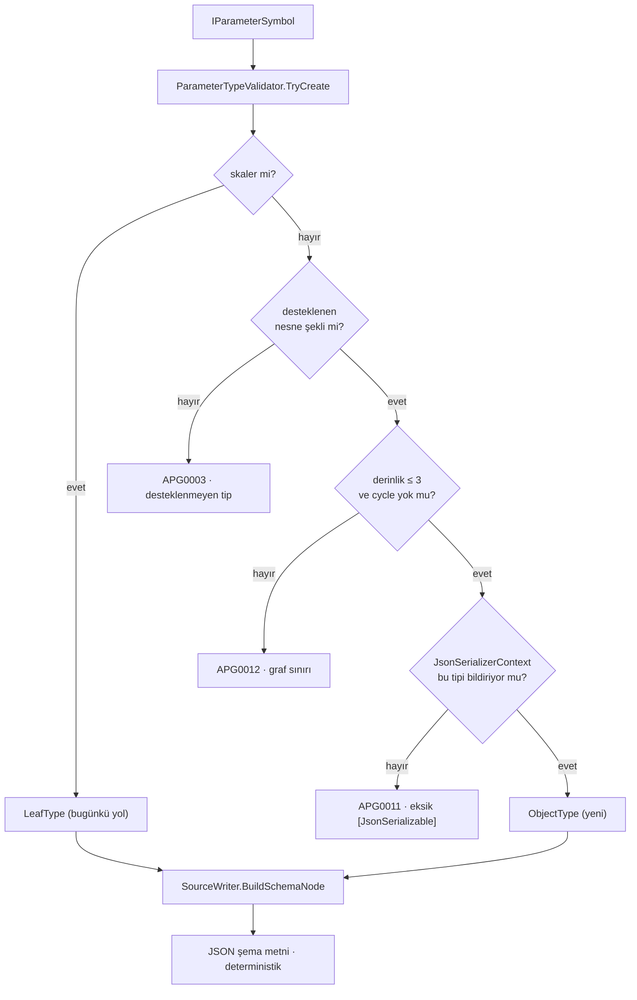

# Faz 135 — Üretilen Şemanın Nesne Grafı

> **Durum:** ✅ Tamamlandı (2026-09-02)
> **Kaynak:** [ADAYLAR.md](../../ADAYLAR.md) — **F-176**
> **Önkoşul:** [Faz 130](130-URETILEN-SEMANIN-KISITLARI.md) — kısıt üretim yolu ve `ParameterConstraints` bu fazın üstüne oturur
> **Paketler:** `AgentPrism.Generators` (tek paket)
> **Yeni paket:** Yok · **Migration:** Yok
> **Public API:** büyümüyor — üretilen şema metni ve derleme anı davranışı değişir. İki yeni analyzer diagnostic kodu eklenir (`APG0011`, `APG0012`)
> **Tüketici yüzeyi:** `docs-site/`: `guides/write-your-own-tool.md`, `concepts/tools.md`, `capabilities.md` (diagnostic bağlantısının hedef bölümü) · sevk edilen: `APG0003` metni, yeni `APG0011`/`APG0012` metinleri, `AnalyzerReleases.Unshipped.md`
> **Manuel test alanı:** [`docs/manuel-test/02-CEKIRDEK-VE-KATALOG.md`](../../manuel-test/02-CEKIRDEK-VE-KATALOG.md) — 🚨 Faz 133'ün **133.0** kalibrasyonu uygulanmamışsa case yazılamaz

---

## Bu Faza Başlarken

> `faz-baslangic` skill'ini uygula. Aşağıdaki liste o skill'in 2. adımıdır.

1. Bu doküman
2. Kararlar — dosyanın tamamını **okuma**, yalnız bu kalemleri grep'le:
   ```bash
   grep -n "K-615" docs/KARARLAR.md
   sed -n '29p' docs/arsiv/KARARLAR-INDEKS-REDDEDILEN.md   # L27
   ```
   **K-615** (generator kendi `JsonSerializerContext`'ini kullanmaz; tool
   sahibi verir, vermezse `APG0008`), **L27** (`ValidateDataAnnotations()`
   `reflection`/`IL2026` yüzünden reddedildi — bu faz da runtime `reflection`
   kullanmaz).
3. [Faz 130](130-URETILEN-SEMANIN-KISITLARI.md) — yalnız devir notu:
   ```bash
   awk '/## Sonraki Faza Devir Notu/,0' docs/arsiv/fazlar/130-URETILEN-SEMANIN-KISITLARI.md
   ```
   Nested object'i o faz **bilerek** kapsam dışı bıraktı ve gerekçesini
   (K-615 ile uzlaşma) yazdı. Bu faz o uzlaşmayı uygular.
4. Alan hafızası (bu faz bir alana dokunuyor):
   [`hafiza/analyzer-yazimi.md`](../../hafiza/analyzer-yazimi.md) (incremental
   generator, **değer eşitliği**, diagnostic yazımı).
5. Gerektiğinde: [`hafiza/build-ve-analyzer.md`](../../hafiza/build-ve-analyzer.md)
   (AOT kaçış merdiveni).

---

## Amaç

Generator bugün skalerleri ve onların dizilerini ifade edebiliyor, kısıtlarını
da Faz 130'dan beri yazıyor. Ama **nesne** ifade edemiyor. Gerçek bir business
tool'unun girdisi çoğu zaman bir nesnedir: bir değerlendirme rubric'i, bir
boyut listesi, bir sahne tanımı. Bugün bu veriler ya JSON taşıyan düz bir
`string` parametresine sıkışıyor ya da tool elle `AIFunction` olarak yazılıyor.

Düz `string`'e sıkışmak modelin hata oranını artırır: model şemadan ne
göndereceğini göremez. Elle şema yazmak ise tip ile şema arasında sessiz bir
kayma riski taşır.

- **F-176** — record/property tabanlı nesne parametresi, nesne dizisi, açık
  derinlik sınırı ve cycle için derleme anı teşhisi.

### Karar: K-615 aynen genişler

Kullanıcı 2026-09-02'de seçti. **Generator nested tipler için kendi
`JsonSerializerContext`'ini üretmez.** Tool sahibi, nested tipleri de
`AgentPrismToolAttribute.JsonSerializerContext`'in gösterdiği context'e
`[JsonSerializable]` ile ekler; eklemezse derleme durur.

K-615 değişmez, yalnız kapsamı büyür. Gerekçe: AOT sorumluluğu tek yerde
kalır ve üretilen bir context ile tool sahibinin kendi context'i asla
çakışmaz — K-615'in ilk gerekçesi buydu ve bu faz onu zayıflatmaz.

Bedeli açıkça yazılır: derin bir nesne grafında tüketici her tipi elle
listeler. `APG0011` bunu **hangi tipin eksik olduğunu söyleyerek** kolaylaştırır.

### Kapsam dışı — bilerek

| Kalem | Neden bu fazda değil |
|---|---|
| `format: email` / `format: uri` | Faz 130'da da dışarıda kaldı; ölçülmüş talep yok |
| Sınırsız `reflection` graph taraması | Generator derleme anında çalışır ve AOT üretir; `reflection` bu paketin tasarım sınırıdır |
| Sözlük (`Dictionary<,>`) parametresi | Şemada `additionalProperties` demektir; kök şema `additionalProperties: false` sözleşmesiyle çelişir. Ayrı bir tasarım |
| Polymorphism / kalıtım (`oneOf`) | Model tarafında hata oranını artırır; ölçülmüş talep yok |
| Runtime kısıt zorlaması | Faz 130'un kararı korunur: şema üretilir, zorlama `IToolArgumentsValidator`'ın işidir |

### Bugün ne çalışmıyor — doğrulanmış kanıt

| Kanıt | Gözlem |
|---|---|
| [`ParameterModel.cs:4-14`](../../../src/AgentPrism.Generators/ParameterModel.cs) | `ParameterShape` üç üye: `Scalar`, `Array`, `CancellationToken`. **`Object` yok** |
| [`ParameterModel.cs:32-42`](../../../src/AgentPrism.Generators/ParameterModel.cs) | `LeafTypeKind` sekiz üye; hepsi skaler. Nesne temsili yok |
| [`SourceWriter.cs:242`](../../../src/AgentPrism.Generators/SourceWriter.cs) | Kök şema `{"type":"object","properties":…,"required":…,"additionalProperties":false}` — **yalnız kökte** nesne var |
| [`SourceWriter.cs:245-269`](../../../src/AgentPrism.Generators/SourceWriter.cs) | `BuildSchemaNode`/`BuildLeafSchemaNode` yalnız skaler ve dizi düğümü üretir |
| [`ToolDiagnostics.cs:38`](../../../src/AgentPrism.Generators/ToolDiagnostics.cs) | `APG0003` metni sınırı sevk edilmiş metinde itiraf ediyor: *"The generator also never expresses a nested object on any parameter … For another type, or a nested schema, register manually"* |
| `grep -n '"APG00' ToolDiagnostics.cs` | Kullanılan kodlar `APG0001`–`APG0010` (`APG0010` Faz 130'da alındı). İlk boş kod **`APG0011`** |
| [`AgentPrismToolAttribute.cs:114`](../../../src/AgentPrism.Abstractions/Tools/AgentPrismToolAttribute.cs) | `public Type? JsonSerializerContext { get; init; }` — K-615'in tüketici yüzeyi. Bu faz **yeni bir alan eklemez**, aynı alanı kullanır |
| [`ToolDiagnostics.cs:83`](../../../src/AgentPrism.Generators/ToolDiagnostics.cs) | `APG0008` metni **sonuç** tipi için yazılmış: *"Tool method '{0}' returns complex type '{1}'"* — parametre için ayrı bir teşhis gerekir |
| [`ParameterModel.cs:55-70`](../../../src/AgentPrism.Generators/ParameterModel.cs) | `ParameterConstraints` yalnız ilkel alan taşıyor; XML'i incremental önbellek gerekçesini yazıyor |

> Kanıtlar 2026-09-02 tarihinde doğrulandı.

---

## 135.1 — Desteklenen şekil

Bir parametre tipi şu koşulları sağlıyorsa **nesne** olarak ifade edilir:

- `record` veya `class`'tır, public'tir, generic **değildir**.
- Tek bir public kurucusu vardır (positional `record` bunu doğal sağlar) veya
  parametresiz kurucusu ve yalnız `init`/`set` public property'leri vardır.
- Her üyesi ya desteklenen bir skaler, ya desteklenen bir skalerin dizisi, ya
  da yine desteklenen bir nesnedir.

Nesne dizisi (`IReadOnlyList<T>`, `T[]`) desteklenir ve `items` düğümü
üretir.

**Derinlik sınırı 3'tür.** Kök parametre 0'dır; kökün nesne üyesi 1, onun
nesne üyesi 2, onun nesne üyesi 3'tür. 3'ü aşan bir graf `APG0012` üretir.
Sınır bir sayı değil, bir sözleşmedir: modelin hata oranı derin şemalarda
artar ve derin bir graf çoğu zaman tool'un fazla iş yaptığının işaretidir.

**Cycle derleme anında yakalanır.** `A → B → A` bir yol bulunduğunda `APG0012`
verilir. Sonsuz özyineleme generator'ı asla kilitlememelidir.

## 135.2 — Model ve şema üretimi



Nesne düğümü, kök şemayla **aynı** biçimi üretir:
`{"type":"object","properties":{…},"required":[…],"additionalProperties":false}`.
Tek bir yazım fonksiyonu hem kökü hem nesne üyelerini üretir — iki ayrı
yazıcı, iki farklı sözleşme demek olurdu.

Faz 130'un kısıtları nesne üyelerinde de **aynen** çalışır: bir üyedeki
`[Range]` o üyenin düğümüne `minimum`/`maximum` yazar. `[Description]` de
aynı şekilde taşınır. Kısıt okuma kodu üye seviyesine taşınır, kopyalanmaz.

## 135.3 — 🚨 Incremental generator değer eşitliği

`ParameterModel` bir `record`'dur ve incremental pipeline'ın önbelleği onun
**değer eşitliğine** dayanır. Faz 130 bunu `ParameterConstraints`'i yalnız
ilkel alanla kurarak korudu.

Nesne modeli bu kuralı zorlar: bir nesne, üyelerinin **listesini** taşır.
Liste referans eşitliğine düşerse önbellek her derlemede kaybolur.

Kural: nesne modelinin üye listesi `EquatableArray<T>` ile tutulur — bu tip
repoda zaten vardır ve tam bu iş için yazılmıştır. Roslyn sembolü (`ITypeSymbol`)
modele **asla** konmaz; yalnız `string` tip adı taşınır.

## 135.4 — İki yeni teşhis

| Kod | Ne zaman | Seviye | Metin ne söyler |
|---|---|---|---|
| `APG0011` | Nesne parametresinin tipi (veya iç tiplerinden biri) `AgentPrismToolAttribute.JsonSerializerContext`'in gösterdiği context'te `[JsonSerializable]` ile bildirilmemiş | `Error` | **Hangi tipin** eksik olduğunu ad ile söyler ve eklenecek satırı gösterir |
| `APG0012` | Derinlik 3'ü aşıyor veya bir cycle var | `Error` | Yolu (`A → B → A`) gösterir; desteklenen manuel `AIFunction` yolunu işaret eder |

İkisi de `Error`'dur, `Warning` değil: `APG0010`'un (Faz 130) aksine burada
**kod üretilemez**. Bir bağlama kodu, çalışma anında serileştiremeyeceği bir
tip için yazılırsa AOT'ta çalışma anında çöker — derleme anında durmak
tek doğru davranıştır. `APG0008` de aynı gerekçeyle `Error`'dur.

`APG0003`'ün metni **yeniden düzeltilir**: nested object artık destekleniyor;
cümle desteklenmeyen tip ailesini anlatmaya devam eder ama "never expresses a
nested object" iddiası kalkar. Faz 130 aynı cümlenin kısıt yarısını kaldırmıştı.

Teşhis bağlantıları `capabilities/#` sayfasına açılır; adres
`DocumentationLinks.cs` içindedir ve `DiagnosticIntegrityTests`
`docs-site/site.config.mjs` ile eşitliğini kapıya bağlar.

## 135.5 — Bağlama kodu

Üretilen kod bugün her parametreyi `AgentPrismGeneratedToolArguments` yardımcısı
üzerinden okuyor. Nesne parametresi için okuma, `JsonSerializerContext`'ten
alınan `JsonTypeInfo` ile yapılır — `JsonSerializer.Deserialize(json, context.<Tip>)`
biçiminde, `reflection` **olmadan**.

🚨 Bu, K-615'in kapsamının neden büyüdüğünün asıl sebebidir: şema üretmek
tek başına yetmez, argümanı **bağlamak** da tipin metadata'sını ister.
Context'i tool sahibi verdiği için bağlama kodu da onun context'ini kullanır.

---

## Planlanan Public API

> C# public yüzeyi **büyümez**. Aşağıdakiler `internal` generator modelidir.

```csharp
// AgentPrism.Generators (internal)
internal enum ParameterShape
{
    Scalar,
    Array,
    Object,            // yeni
    ObjectArray,       // yeni
    CancellationToken,
}

/// <summary>One object member of a tool parameter's schema.</summary>
internal sealed record ObjectMember(
    string Name,
    string JsonName,
    ParameterShape Shape,
    LeafType? Leaf,
    ObjectType? Object,
    bool IsRequired,
    string? Description,
    ParameterConstraints? Constraints);

/// <summary>A supported object-shaped parameter or member type.</summary>
internal sealed record ObjectType(
    string ClrTypeDisplay,
    bool IsNullable,
    EquatableArray<ObjectMember> Members);   // EquatableArray: 135.3

// ToolDiagnostics
internal static readonly DiagnosticDescriptor MissingJsonSerializableParameter = new("APG0011", …);
internal static readonly DiagnosticDescriptor UnsupportedObjectGraph          = new("APG0012", …);
```

`ObjectType` Roslyn sembolü taşımaz; yalnız `string` ve değer eşitliği olan
alanlar taşır (135.3).

### HTTP `endpoint`'leri

Yok.

### Arayüz payı

Yok.

---

## Planlanan Dosya Listesi

```
src/AgentPrism.Generators/
├── ParameterModel.cs           (ParameterShape.Object/ObjectArray · ObjectType · ObjectMember)
├── ParameterTypeValidator.cs   (nesne şekli tanıma · derinlik · cycle · context denetimi)
├── SourceWriter.cs             (nesne düğümü · tek yazım fonksiyonu · bağlama kodu)
├── ToolDiagnostics.cs          (APG0011 · APG0012 · APG0003 metninin düzeltilmesi)
├── ToolCandidate.cs            (JsonSerializerContext'in bildirdiği tip kümesi)
└── AnalyzerReleases.Unshipped.md (iki satır)

tests/AgentPrism.Generators.UnitTests/   (şema · teşhis · determinizm · önbellek)
tests/AgentPrism.Package.Tests/          (paketlenmiş tüketicide AOT/trim koşumu)
docs-site/src/content/docs/guides/write-your-own-tool.md
docs-site/src/content/docs/concepts/tools.md
docs-site/src/content/docs/capabilities.md
```

---

## Hata Modları ve Testler

> Generator paket sınırını geçer (tüketicinin derlemesinde çalışır). Şema
> **metni** birim testiyle kanıtlanır; AOT metadata'sının gerçekten yeterli
> olduğu **yalnız paketlenmiş tüketicide** kanıtlanır —
> [`.agents/ortak/test-seviyeleri.md`](../../../.agents/ortak/test-seviyeleri.md).

| Ne bozulabilir | Seviye | Test sınıfı |
|---|---|---|
| Nesne düğümü şemaya yazılmaz | Birim | `ToolSchemaObjectTests` |
| Nesne dizisi `items` üretmez | Birim | `ToolSchemaObjectTests` |
| Nesne üyesindeki `[Range]`/`[Description]` kaybolur | Birim | `ToolSchemaObjectTests` — Faz 130 davranışı üye seviyesinde de geçerli |
| `required` nesne üyesi için yanlış hesaplanır | Birim | `ToolSchemaObjectTests` — nullable ve varsayılan değerli üyeler |
| Aynı girdi iki derlemede farklı şema üretir | Birim | mevcut `ToolSchemaDeterminismTests` genişletilir |
| `EquatableArray` yerine liste kullanılır; önbellek düşer | Birim | mevcut `IncrementalGeneratorCacheTests` — aynı model iki kez **eşit** çıkmalı |
| Cycle generator'ı sonsuz döngüye sokar | Birim | `ToolObjectGraphTests` — `A → B → A`, `APG0012`, generator **döner** |
| Derinlik 4 sessizce kabul edilir | Birim | `ToolObjectGraphTests` |
| `[JsonSerializable]` eksikken derleme geçer | Birim | `ToolDiagnosticTests` — `APG0011`, `Error` |
| `APG0011` hangi tipin eksik olduğunu söylemez | Birim | `ToolDiagnosticTests` — metin tip adını içermeli |
| `APG0003` metni bayat kalır | Birim | `ToolDiagnosticTests` — metin "never expresses a nested object" içermemeli |
| Yardım bağlantısı siteyle uyuşmaz | Birim | mevcut `DiagnosticIntegrityTests` |
| 🚨 Bağlama kodu `reflection`'a düşer; AOT'ta çalışma anında çöker | **Paket** | `AgentPrism.Package.Tests` — dış tüketici projesinde `PublishAot` ile derlenir **ve koşulur** |
| Trim uyarısı üretilir | Paket | Aynı koşum, `IL2026`/`IL3050` sıfır olmalı |
| Nesne parametresi taşıyan tool gerçek `run`'da çağrılamaz | Fonksiyonel | `samples/AgentPrism.Api` üzerinde gerçek çağrı |

Beş soru: **iptal** — generator'da iptal yolu yok, `CancellationToken` şemadan
çıkarılmaya devam eder; **eşzamanlılık** — incremental pipeline paraleldir,
model değer eşitliğiyle korunur (135.3); **boş/aşırı girdi** — üyesi olmayan
nesne (`{}` üretir), 3. seviyede skaler-only nesne, boş dizi;
**başka kiracı** — bu faz kiracı sınırına dokunmaz; **alt sistem hatası** —
sembol çözülemezse `APG0003` verilir, generator çökmez.

---

## Manuel Kabul Case'leri

> Bu case'ler yazılmadan önce Faz 133'ün **133.0** bütçe kalibrasyonu
> uygulanmış olmalıdır.

| # | Ön koşul | Adımlar | Beklenen sonuç |
|---|---|---|---|
| 1 | `record Rubric(string Name, int Weight)` parametreli tool; context tipi bildiriyor | Derle, üretilen şemayı oku | `type:"object"`, `properties`, `required`, `additionalProperties:false` |
| 2 | `IReadOnlyList<Rubric>` parametresi | Derle | `type:"array"`, `items` nesne düğümü |
| 3 | Nesne üyesinde `[Range(1,5)] int Weight` | Derle | Üye düğümünde `minimum:1, maximum:5` |
| 4 | Context tipi **bildirmiyor** | Derle | `APG0011`; hata metni eksik tipin adını veriyor; derleme **durur** |
| 5 | Dört seviyeli graf | Derle | `APG0012`; derleme durur |
| 6 | `A → B → A` | Derle | `APG0012`; generator asılmaz |
| 7 | Case 1'in tool'u | `samples/AgentPrism.Api` ile gerçek `run`, tool'u çağırt | Model nesne argümanı gönderir; tool gövdesi tipli nesneyi alır |
| 8 | Case 1'in tool'u | Dış tüketici projesinde `PublishAot` ile yayınla ve koş | Trim/AOT uyarısı yok; tool çalışma anında çağrılabiliyor 👤 |

---

## Açık Sorular

| # | Soru | Seçenekler | Öneri |
|---|---|---|---|
| 1 | Derinlik sınırı 3 mü? | A: 3 · B: 2 · C: seçenekle ayarlanabilir | **A.** 2 gerçek bir rubric'i (rubric → boyut → ölçüt) ifade edemez; C bir derleme anı sabitini çalışma anı ayarına çevirir ve şemayı yapılandırmaya bağımlı kılar |
| 2 | Nesne üyelerinin JSON adı `camelCase`'e çevrilsin mi? | A: property adı aynen · B: `camelCase` | **Ölçülmeden karar verilmez.** Bağlama `JsonSerializerContext`'in `JsonSerializerOptions`'ını kullanır; adlandırma politikası **tool sahibinin** context'inde tanımlıdır. Şema ile bağlamanın aynı adı görmesi zorunludur — uygulama bunu ölçüp yazar |
| 3 | `APG0011` tek bir eksik tip için mi, hepsi için mi verilir? | A: her eksik tip için ayrı teşhis · B: ilk eksikte dur | **A.** Tüketici bir derlemede bütün eksikleri görüp hepsini bir kerede ekler; B onu tur tur ekleme döngüsüne sokar |

---

## Bitiş Ölçütleri (DoD)

- [ ] Nesne ve nesne dizisi parametreleri doğru JSON Schema düğümü üretir (case 1–2)
- [ ] Faz 130'un kısıtları ve `[Description]` nesne üyelerinde de çalışır (case 3)
- [ ] `[JsonSerializable]` eksikse `APG0011` ile derleme **durur** ve eksik tipin adı yazılır (case 4)
- [ ] Derinlik aşımı ve cycle `APG0012` üretir; generator asılmaz (case 5–6)
- [ ] `APG0003` metni güncellendi; "never expresses a nested object" iddiası kalktı
- [ ] Aynı girdi iki derlemede **bit düzeyinde aynı** şema üretir
- [ ] `IncrementalGeneratorCacheTests` yeşil — model değer eşitliği korundu
- [ ] 🚨 Dış tüketici projesinde `PublishAot` derlemesi **uyarısız** ve tool çalışma anında çağrılabiliyor (case 8)
- [ ] `AnalyzerReleases.Unshipped.md` iki yeni kodu taşıyor; `DiagnosticIntegrityTests` yeşil
- [ ] Dört doğrulama kapısı sıfır uyarı verir
- [ ] `samples/AgentPrism.Api` ile gerçek `run` yapıldı, çıktı belgeye yazıldı (case 7)
- [ ] `secret` taraması boş döndü
- [ ] Manuel kabul case'leri `docs/manuel-test/02-CEKIRDEK-VE-KATALOG.md` içine eklendi; otomatikleştirilebilenler koşuldu
- [ ] `faz-denetim` koşuldu; 🔴 bulgu kalmadı
- [ ] `docs-site/` güncellendi (`write-your-own-tool.md`, `concepts/tools.md`, `capabilities.md`); `npm run build` + `check-links.mjs` temiz
- [ ] 🚨 `dotnet test AgentPrism.slnx` TAM log dosyasından teyit edildi — `| tail` ile **değil** (Faz 130 devir notu)

### Doğrulama komutları

```bash
# Üretilen şemayı gör
dotnet build samples/... -p:EmitCompilerGeneratedFiles=true
grep -r '"additionalProperties"' obj/**/generated/

# AOT koşumu (asıl kanıt)
dotnet publish <dış tüketici projesi> -r <rid> -p:PublishAot=true
```

---

## Riskler

| Risk | Önlem |
|------|-------|
| 🚨 AOT metadata eksikliği **yalnız paketlenmiş tüketicide** görülür; birim testleri yeşil kalır | DoD'de ayrı bir `PublishAot` satırı; `AgentPrism.Package.Tests` derleyip **koşar** |
| Nesne modeli değer eşitliğini bozar, önbellek düşer | 135.3 kuralı; `IncrementalGeneratorCacheTests` ölçer |
| Cycle generator'ı kilitler ve derleme asılır | `APG0012` ziyaret kümesiyle çalışır; `ToolObjectGraphTests` doğrudan bunu koşar |
| Şema adlandırması ile bağlama adlandırması ayrışır | Açık Soru 2 ölçülmeden kod yazılmaz; test aynı adı iki uçtan karşılaştırır |
| `APG0011` tüketiciyi tur tur ekleme döngüsüne sokar | Açık Soru 3 önerisi: bütün eksikler tek derlemede raporlanır |
| K-615'in kapsamı büyürken gerekçesi kaybolur | 135.1 ve 135.5 gerekçeyi yazar; kapanışta karar defterine kapsam genişlemesi olarak işlenir |
| Manuel test bütçesi Faz 133 kalibre etmeden aşılır | Bu fazın manuel bölümü 133.0'a bağlıdır |

---

<!-- ============================================================
     AŞAĞISI KAPANIŞTA DOLDURULUR — `faz-tamamlama` skill'i.
     Plan anında boş kalır. Başlıkları SİLME.
     ============================================================ -->

## Plandan Sapmalar

1. **135.1'in ikinci nesne şekli (parametresiz kurucu + `init`/`set` property'leri)
   uygulanmadı.** Yalnız "tek public parametreli kurucu" şekli (positional
   record'un doğal biçimi) desteklendi — tüm manuel kabul case'leri ve ölçülen
   gerçek talep bu şekli kullanıyor. İkinci şekil için "required mi, optional mi"
   sorusunun ölçülmüş bir sinyali yok (kurucu parametresinde
   `HasExplicitDefaultValue` var, property'de eşdeğeri yok). Kod bunu
   `ParameterTypeValidator.TryGetSinglePublicParameterizedConstructor`'ın XML
   dokümanında açıkça kapsam daraltması olarak işaretliyor.
2. **Üye taşımayan bir nesne (`{}` üretmesi gereken) desteklenmiyor — bu, planın
   "Hata Modları ve Testler" bölümündeki "boş/aşırı girdi" satırıyla çelişir.**
   Bağımsız denetim bunu 🟡 bulgu olarak işaretledi (aşağıya bakın). Kod
   bilinçli olarak DÜZELTİLMEDİ: yalnız public parametresiz kurucusu olan bir
   tip zaten sapma #1'in ikinci şekliyle ÇAKIŞIYOR — "üye yok" ile "henüz
   desteklenmeyen property tabanlı şekil" arasında Roslyn sembolünden GÜVENLİ
   bir ayrım yok. `Parameters.Length: > 0` şartını gevşetmek, gerçek property'leri
   olan bir tipi SESSİZCE boş şemaya (`{}`) düşürme riski taşırdı — mevcut
   davranıştan (APG0003 ile red) daha kötü bir kusur sınıfı. Karar: ikisi de
   `APG0003` ile reddedilir; "Kapsam dışı - bilerek" tablosuna bu kalem
   eklenmeliydi, plan metni burada kendiyle çelişiyordu.
3. **Nesne/nesne-dizisi şeklindeki bir parametrede (veya üyede) HERHANGİ bir
   `DataAnnotations` kısıt attribute'u her zaman `APG0010` ile "uygulanmaz"
   sayılır** — plan bunu açıkça belirtmiyordu, ama Faz 130'un "sessizce yanlış
   şema üretme" ilkesiyle tutarlı, en muhafazakar yorum bu oldu (nesne
   dizisinde `minItems`/`maxItems` için ayrı bir destek eklenmedi).
4. **Tüketici doküman sözleşmesi:** `JsonSerializerContext`'e camelCase gibi
   varsayılan-dışı bir `PropertyNamingPolicy` konması, şema ile bağlamanın
   FARKLI JSON anahtarları beklemesine yol açabilir (bağlama context'in
   `JsonSerializerOptions`'ını kullanıyor, şema üyenin ham C# adını yazıyor) —
   bağımsız denetimin 🟡 bulgusu. Ölçülmeden bir çözüm yazmak yerine
   `guides/write-your-own-tool.md`'ye açık bir uyarı eklendi: context'in
   adlandırma politikası varsayılanda kalmalı. Açık Soru 2 hâlâ kapanmadı.
5. **`samples/AgentPrism.Api`'ye planın öngördüğünden fazlası eklendi:**
   `estimate_shipping_cost` demo tool'u ve `ShippingAddress` record'u kalıcı
   olarak eklendi, `support` agent'ının `ToolNames`'i genişletildi. Gerekçe:
   manuel case 7'yi gerçek bir OpenAI çağrısıyla kanıtlamak için gerçek bir
   tool gerekiyordu; kalıcı bırakmak (geçici bir test-only tool yerine) diğer
   fazların örnek-uygulama zenginleştirme konvansiyonuyla tutarlı.
6. **`AgentPrism.Package.Tests`'e planın dosya listesinde adı geçmeyen iki yeni
   dosya eklendi** (`ObjectToolAotConsumerProject.cs`,
   `ObjectToolAotPackageTests.cs`) — planın Riskler tablosunun kendisi bu
   koşumu zorunlu kılıyordu ("DoD'de ayrı bir `PublishAot` satırı;
   `AgentPrism.Package.Tests` derleyip **koşar**"), yalnız dosya adları
   önceden yazılmamıştı.

## Bu Fazda Verilen Kararlar

- **K-655** — K-615 aynen genişler: bir tool'un OBJECT parametre grafındaki
  her tip de `JsonSerializerContext`'e `[JsonSerializable]` ile eklenmek
  zorundadır, yalnız complex SONUÇ tipi değil (kullanıcı kararı, 2026-09-02).
  Tam gerekçe `docs/KARARLAR.md`'de.

## Gerçekleşen Public API

Plan doğrulandı: **C# public yüzeyi büyümedi.** `dotnet build` hiçbir
`RS0016`/`RS0017` (`PublicAPI.*.txt` eksikliği) üretmedi;
`PublicAPI.Unshipped.txt` dosyalarında değişiklik yok. Yeni tipler
(`ParameterShape.Object`/`ObjectArray`, `ObjectMember`, `ObjectType`,
`ObjectGraphError`, `ObjectGraphErrorKind`) hepsi `internal`.
İki yeni tanı kodu (`APG0011`, `APG0012`) — bunlar public API değil, derleme
zamanı davranışıdır ve `AnalyzerReleases.Unshipped.md`'ye kaydedildi.

## Dosya Listesi (gerçekleşen)

Planın "Planlanan Dosya Listesi"yle örtüşüyor; `ParameterModel.cs` planda
listelenmemişti (yalnız `ParameterTypeValidator.cs`/`SourceWriter.cs`/
`ToolDiagnostics.cs`/`ToolCandidate.cs` sayılıydı) çünkü model tipleri
(`ObjectMember`/`ObjectType`) oraya eklendi; `ToolRegistrationGenerator.cs`
da iki yeni tanının dispatch tablosuna eklenmesi için değişti (plan bunu
söz konusu etmemişti, K-506 emsaliyle aynı gerekliliktir).

```
src/AgentPrism.Generators/
├── ParameterModel.cs              (ObjectMember, ObjectType, ParameterShape.Object/ObjectArray)
├── ParameterTypeValidator.cs       (nesne şekli tanıma, derinlik/cycle, APG0010 birleştirme)
├── SourceWriter.cs                 (nesne şema düğümü, WriteObjectConverter bağlama kodu)
├── ToolCandidate.cs                (APG0011 context denetimi, referencedObjectTypes toplama)
├── ToolDiagnostics.cs               (APG0011, APG0012, APG0003 metni düzeltmesi)
├── ToolRegistrationGenerator.cs     (iki yeni tanı dispatch tablosuna eklendi)
└── AnalyzerReleases.Unshipped.md    (APG0011, APG0012)

tests/AgentPrism.Generators.UnitTests/
├── ToolSchemaObjectTests.cs         (yeni — şema düğümü, kısıt, description, binding)
├── ToolObjectGraphTests.cs          (yeni — derinlik, cycle, APG0011, APG0003)
├── ToolDiagnosticTests.cs           (genişletildi — nesne üyesi kısıt/APG0010 regresyonu)
├── IncrementalGeneratorCacheTests.cs (genişletildi — nesne modeli değer eşitliği)
└── ToolSchemaDeterminismTests.cs    (genişletildi — nesne şeması bit-determinizmi)

tests/AgentPrism.Package.Tests/
├── ObjectToolAotPackageTests.cs               (yeni — PublishAot koşumu)
└── Infrastructure/ObjectToolAotConsumerProject.cs (yeni — dış tüketici projesi yazıcı)

samples/AgentPrism.Api/
├── OrderTools.cs   (yeni estimate_shipping_cost tool'u, ShippingAddress record'u)
└── Program.cs      (support agent'ının ToolNames'i genişletildi)

docs-site/src/content/docs/
├── capabilities.md            (Generated tools satırı güncellendi)
├── concepts/tools.md           (nesne parametresi kısa notu)
├── guides/write-your-own-tool.md (nesne parametresi bölümü, [property:] tuzağı, naming policy uyarısı)
└── troubleshooting.md          (APG0003 güncellendi, APG0011/APG0012 yeni bölümler)

docs/
├── KARARLAR.md, KARARLAR-INDEKS.md   (K-655)
├── hafiza/analyzer-yazimi.md          ([property:] hedefi tuzağı notu)
└── manuel-test/{00-INDEKS.md,02-CEKIRDEK-VE-KATALOG.md} (MT-CORE-115..122; 00-INDEKS'in
    CORE satırındaki Faz 130 boşluğu da bu kapanışta düzeltildi)
```

## Denetim Bulguları

Bağımsız denetim (`faz-denetim`, taze bağlamlı ayrı agent) 2026-09-02'de
çalışma ağacına karşı koştu; sekiz başlığın tamamı değerlendirildi.

| # | Bulgu | Seviye | Sonuç |
|---|---|---|---|
| 1 | `docs-site/troubleshooting.md`'ye iç karar-defteri referansı (`K-615`, iki yerde) sızmıştı — tüketici doküman sözleşmesi bunu yasaklar | 🔴 | **Düzeltildi** — her iki cümle de `K-615` adı geçmeden yeniden yazıldı |
| 2 | Nesne ÜYESİ üzerindeki uyumsuz bir kısıt attribute'u (`[Range]` bir `string` üyede gibi) hiçbir zaman `APG0010` üretmiyordu — `ObjectGraphState.UnsupportedConstraintAttributes` dolduruluyor ama `TryCreate`'in döndürdüğü `unsupportedConstraintAttributes`'a hiç birleştirilmiyordu | 🔴 | **Düzeltildi** — `CombineUnsupportedConstraintAttributes` eklendi (üst düzey + üye seviyesi birleşimi, üye adı mesajda görünür); regresyon testi: `ToolDiagnosticTests.A_Range_attribute_on_a_string_object_member_is_reported_and_omitted_from_the_schema` |
| 3 | Riskler tablosu naming-policy uyuşmazlığını "test aynı adı iki uçtan karşılaştırır" diye mitig ediyordu; böyle bir test yoktu — bir tüketici context'ine camelCase koyarsa üye sessizce boş kalabilir | 🟡 | **Gerekçelendi** — Açık Soru 2 zaten "ölçülmeden karar verilmez" diyordu; ölçülmüş talep yok. `guides/write-your-own-tool.md`'ye açık bir 🚨 uyarı eklendi (yukarı bakın) |
| 4 | Plan'ın hata modları tablosu üye taşımayan bir nesnenin `{}` ürettiğini vaat ediyordu; kod bunu reddediyor (`APG0003`) | 🟡 | **Gerekçelendi** — bkz. "Plandan Sapmalar" #2; kod DEĞİŞTİRİLMEDİ, çünkü düzeltme sapma #1'deki henüz-desteklenmeyen ikinci şekille çakışıp gerçek property'leri sessizce düşürme riski taşırdı |
| 5 | Dizi üzerinden kendine referans veren bir cycle'ı (`record Node(IReadOnlyList<Node> Children)`) doğrudan hedefleyen bir test yok | 🟢 | Aday listesine alınmadı — mekanizma zaten paylaşılan `TryCreateObjectType`/`ObjectGraphState` yolunu kullanıyor (kod okunarak doğrulandı), yalnız ek kapsama testi. Küçük bir F-NN açmaya değecek kadar büyük bulunmadı |

**Temiz çıkan başlıklar:** 3.1 (derinlik/cycle algoritması satır satır izlendi),
3.3 (AOT/trim seviyesi doğru — `AgentPrism.Package.Tests`), 3.5 (imza-gövde
kayması yok), 3.6 (plan dışı public API yok), APG0011'in graf hatası
durumunda yanlışlıkla tetiklenmediği doğrulandı.

🔴 bulgular kapandıktan sonra dört kapı yeniden koşuldu (`tests/AgentPrism.Generators.UnitTests`
269/269, `tests/AgentPrism.Core.UnitTests` 2285/2285, `tests/AgentPrism.Package.Tests`
ilgili testler yeşil).

## Sonraki Faza Devir Notu

- **Property tabanlı ikinci nesne şekli (parametresiz kurucu + `init`/`set`
  property'leri) hâlâ desteklenmiyor.** Ölçülmüş bir talep çıkarsa, "required"
  belirleme sinyali (nullable annotation mı, `required` C# anahtar sözcüğü mü)
  önce ölçülmeli — bu fazın kendi tecrübesi: kurucu-parametresi yolunun
  `HasExplicitDefaultValue`'su kadar net bir sinyal property'de yok.
- **`JsonSerializerContext`'in adlandırma politikası (camelCase vb.) hâlâ
  ölçülmedi (Açık Soru 2).** Şema ile bağlamanın aynı JSON anahtarını görmesi
  gerektiği doğrulanmadı; bir sonraki tur bunu ya ölçüp uygular ya da kapsam
  dışı bırakmayı resmileştirir (`docs/ADAYLAR.md`'ye taşınabilir).
- **Derinlik sayacı (`depth`) ile cycle path'i (`ObjectGraphState.Path`)
  kasıtlı olarak AYRI tutuldu** (bkz. `docs/hafiza/analyzer-yazimi.md`) —
  yeni bir üye kaynağı (ör. property tabanlı ikinci şekil) eklenirse bu ikisi
  senkron kalmalı, `path.Count`'u "derinlik" olarak yeniden kullanma.
- `docs/manuel-test/00-INDEKS.md`'nin `CORE` satırı Faz 130'dan beri
  güncellenmemişti (faz listesi ve case sayısı); bu kapanışta düzeltildi —
  bir sonraki fazın kapanışı bu satırı GÜNCEL TUTMALI (case sayısı artışını
  o anki toplam üzerinden hesapla, önceki fazın bıraktığı sayıyı değil).
