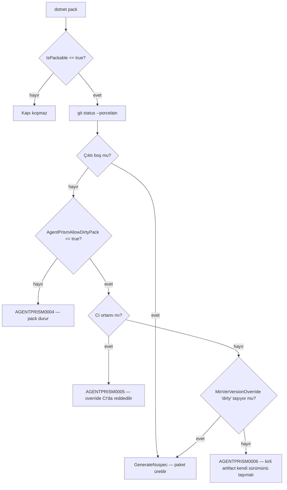
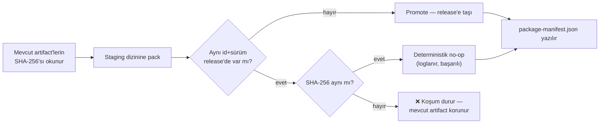

# Faz 136 — Paket Kimliğinin Tekilliği

> **Durum:** ✅ Tamamlandı (2026-09-03)
> **Kaynak:** Tüketici raporu AP-REQ-002 (ProdigyEnabler, 2026-09-03) · **F-182**
> **Önkoşul:** Yok
> **Paketler:** Yayınlanan 20 paketin tamamı — kod değil, **paketleme sözleşmesi** değişir
> **Yeni paket:** Yok · **Migration:** Yok
> **Public API:** Büyümüyor — bu faz tek satır C# public üye eklemez
> **Tüketici yüzeyi:** `docs-site/src/content/docs/reference/versioning.md` (sürüm ve
> artifact kimliği politikası) · sevk edilen yapıt: **yok** — tanı yalnız kaynaktan
> derleyende görünür, repo private olduğu için tüketiciye ulaşmaz
> **Manuel test alanı:** [`manuel-test/01-KURULUM-VE-PAKETLEME.md`](../../manuel-test/01-KURULUM-VE-PAKETLEME.md)

---

## Bu Faza Başlarken

> `faz-baslangic` skill'ini uygula. Aşağıdaki liste o skill'in 2. adımıdır —
> **tamamını değil, yalnız işaret edilen bölümleri oku.**

1. Bu doküman
2. Kararlar — dosyanın tamamını **okuma**, yalnız bu kalemleri grep'le:
   ```bash
   grep -n "K-602\|K-604\|K-622\|K-659" docs/KARARLAR.md
   ```
   **K-602** (tek sürüm hattı: her paket `1.0.0-preview.N` çıkar) · **K-604** (yayın
   işleri prova kapısına bağlı; kapı **ağa çıkmaz**) · **K-622** (`kapi.py yayin`
   sample'ları izole `NUGET_PACKAGES` ve tek exact sürümle koşar) · **K-659**
   (pakete giren tüketiciye dönük URL'ler doküman sitesine bakar)
3. [`YAYIN-HAZIRLIK.md`](../../YAYIN-HAZIRLIK.md) — yalnız §4 (güncel yayın kararı) ve
   §6'daki BL-055. Bu faz, orada "kalan tek adım" diye yazılan `1.0.0-preview.1`
   tag'inin **önüne** giren kapıdır.
4. Alan hafızası:
   [`hafiza/paketleme-ve-dagitim.md`](../../hafiza/paketleme-ve-dagitim.md) — pack
   tuzakları, `IncludeBuildOutput=false` profilleri, üretilen dosya kuralları.
5. Gerektiğinde: [`.agents/ortak/kapilar.md`](../../../.agents/ortak/kapilar.md) — dört
   doğrulama kapısının komut yüzeyi.

---

## Amaç

Bir NuGet paketinin kimliği `<id, version>` çiftidir. Bugün AgentPrism aynı çifti
**birden fazla farklı içerik** için üretebiliyor. Tüketici bunu üretimde ölçtü:
aynı sürüm ve aynı repository commit'i bildiren iki paket ailesi, farklı
SHA-256 değerleri taşıdı. NuGet global cache aynı çifti tek bir şey sanar; bu
yüzden `dotnet restore` sessizce eski DLL'i kullanabilir ve bir hata raporunda
sürüm + commit yeterli kanıt olmaz.

Bu faz o çifti **tekil ve doğrulanabilir** yapar: kirli bir çalışma ağacından
paket üretilemez, aynı kimlikle farklı bir artifact var olan artifact'i sessizce
ezemez, ve her yayın koşumu SHA-256 manifest'i bırakır.

- **F-182** — Paket kimliği tekilliği: pack kapısı, overwrite koruması, SHA-256 manifest'i.

### Bugün ne çalışmıyor — doğrulanmış kanıt

Repro bu oturumda **kilitlendi**. HEAD `8b21cf9f`, çalışma ağacı temiz:

| Adım | Ölçüm |
|---|---|
| Temiz ağaçta `dotnet pack src/AgentPrism.Abstractions` | `0.0.0-preview.0.534` · SHA-256 `04b2b97acfd5f4cc362e0baa0cf26a53704e361f8324c0b69b439842857e6df6` |
| `src/Directory.Build.props` içindeki `PackageProjectUrl` **commit'siz** değiştirildi, aynı komut | `0.0.0-preview.0.534` · SHA-256 `1853fdd7ec3cabdd6c40636ec9ddaee21b6adbfd004905aa37ba16f415c8a686` |
| İki `.nuspec` farkı | Yalnız `<projectUrl>` |
| İki `.nuspec` ortak alanı | `<repository … commit="8b21cf9f301fbbbaee32268df838bc0130e45059" />` — **aynı** |

Yani aynı ID, aynı sürüm ve aynı commit iddiası iki farklı artifact'i adlandırdı.
Tüketicinin `0.0.0-preview.0.533` için ölçtüğü olay budur.

Kök neden üç katmandır:

| Kanıt | Gözlem |
|---|---|
| [`src/Directory.Build.props:79-81`](../../../src/Directory.Build.props) | MinVer sürümü yalnız git geçmişinden türetir. Height, `git rev-list --count --first-parent <commit>` eksi bir olarak ölçüldü (`ef06fc37` → 533, `8b21cf9f` → 534). Çalışma ağacının durumu **hiç girdi değildir** |
| [`Directory.Build.targets:46-50`](../../../Directory.Build.targets) | `AgentPrismValidatePackageReadme` pack anında koşan bir kapının **tam desenini** taşıyor (`BeforeTargets="GenerateNuspec"`, `IsPackable` koşulu, `Code="AGENTPRISM0001"`). Temizlik için eşdeğeri **yok** |
| [`scripts/kapi.py:701-709`](../../../scripts/kapi.py), çağrı [`:756`](../../../scripts/kapi.py) | 🚨 `_clean_stale_packages`, paketlemeden **önce** aynı kimlikteki artifact'i **siler**. Sessiz overwrite bir kaza değil, mevcut tasarımın kendisidir. Tüketicinin "farklı SHA-256 taşıyan existing artifact overwrite öncesinde durdurmalı" maddesi bugün yapısal olarak karşılanamaz |

> Kanıtlar 2026-09-03 tarihinde doğrulandı.

### Neden tag'den önce

`v1.0.0-preview.1` atıldığı anda MinVer o commit için sabit `1.0.0-preview.1`
üretir. Bugün kirli bir pack'i sürümün kendiliğinden ayrışması (height artışı)
kısmen maskeliyordu; tag'den sonra o tampon kalkar. Kapı tag'den **önce**
girmezse ilk paylaşılan sürüm, kimliği garanti edilmemiş bir artifact olur.

---

## 136.1 — Kirli ağaçta pack yasağı

Kapı `IsPackable` olan her projede, `.nuspec` yazılmadan hemen önce koşar.
`git status --porcelain` boş değilse pack **kırılır**.



### Untracked dosyalar da bloke eder — bilinçli karar

Tüketici raporu §4.5 #3 untracked politikasının açıkça test edilmesini ve
belgelenmesini istiyor. Karar: **untracked dosya da pack'i durdurur.**

Gerekçe ölçülmüştür, tercih değildir: SDK'nın varsayılan `Compile` glob'u
`**/*.cs` desenidir ve `src/Directory.Build.props:126-127` `README.md` ile
`icon.png`'yi `None Include` ile pakete koyar. Bu yüzden takip edilmeyen bir
`.cs` dosyası **paketin içeriğine girer**. "Yalnız tracked değişiklikleri say"
politikası bu yolu görmez ve kapıda bir delik bırakır.

Bu pratikte bedel ödetmez: `artifacts/`, `node_modules/` ve
`src/AgentPrism.UI/wwwroot/` `.gitignore`'dadır (`.gitignore:26,50,63`).
Ölçüldü: iki ardışık `dotnet pack` sonrası `git status --porcelain` boş kaldı.

### Tanı kodu

Repo konvansiyonu `AGENTPRISM000N`'dir — bugün `0001` (README eksik),
`0002` ve `0003` (`src/AgentPrism.UI/AgentPrism.UI.Frontend.targets:229,242`)
kullanılıyor. Bu faz `0004`, `0005` ve `0006`'yı alır.

Tüketici raporu `APREL001` kodunu öneriyordu. **Kullanılmayacak.** Repo private
olduğu için hiçbir tüketici bu tanıyı göremez; ikinci bir kod ailesi açmak yalnız
kendi konvansiyonumuzu bölerdi. Anlamın kararlılığı korunur ve fark tüketici
yanıtında açıkça yazılır.

---

## 136.2 — Override sözleşmesi

Override **sürüm üretmez, sürümü insandan ister.** Bu, MinVer sürüm oynamasını
tamamen ortadan kaldırır.

| Girdi | Davranış |
|---|---|
| `AgentPrismAllowDirtyPack` verilmemiş | Kirli ağaç → `AGENTPRISM0004` |
| `AgentPrismAllowDirtyPack=true`, CI ortamı | `AGENTPRISM0005` — override yalnız yereldir |
| `AgentPrismAllowDirtyPack=true`, `MinVerVersionOverride` yok veya `dirty` içermiyor | `AGENTPRISM0006` |
| `AgentPrismAllowDirtyPack=true`, `MinVerVersionOverride=0.0.0-dirty.<ad>` | Pack çalışır |

Neden sürümü otomatik türetmiyoruz: temiz sürüme bir sonek eklemek
(`1.0.0-preview.1.dirty.N`) SemVer'de temiz sürümden **sonra** sıralanır.
`samples/` içindeki `AgentPrismSamplePackageVersion` varsayılanı kapı dışında
**floating** (`*-*`) — BL-052'de ölçülmüş bayat-paket tuzağının aynı ailesi.
Kirli bir artifact'in floating restore tarafından temiz sürüme tercih edilmesi
bu fazın çözdüğü sorunun daha kötü bir biçimidir. Sürümü insana yazdırmak bu
yolu kapatır ve tavsiye edilen taban `0.0.0-dirty.<ad>`'dir — her temiz
sürümün **altında** sıralanır.

CI algılaması: `ContinuousIntegrationBuild` özelliği veya `CI` ortam değişkeni.
`.github/workflows/ci.yml:197-227` içindeki `pack` işi `dotnet pack
AgentPrism.slnx` koşar, yani kapı CI'da kendiliğinden devrededir; ayrı bir adım
eklenmez.

---

## 136.3 — Overwrite koruması ve manifest

`scripts/kapi.py` içindeki `release_rehearsal` iki davranış kazanır.

**Erken ret.** Pack'ten önce çalışma ağacı denetlenir. Kirliyse koşum, dakikalar
süren bir build'e girmeden anlaşılır bir mesajla durur. MSBuild kapısı zaten
kırardı; bu adım yalnız geri bildirimi öne çeker.

**Overwrite koruması.** `_clean_stale_packages`'ın sessiz silmesi kaldırılır.
Yerine gelen akış:



**Manifest.** Koşum `artifacts/package/release/package-manifest.json` üretir:

```json
{
  "version": "1.0.0-preview.1",
  "commit": "8b21cf9f301fbbbaee32268df838bc0130e45059",
  "dirty": false,
  "packages": [
    { "id": "AgentPrism.Abstractions", "file": "AgentPrism.Abstractions.1.0.0-preview.1.nupkg", "sha256": "…" }
  ]
}
```

Manifest ağa çıkmaz ve K-604'ün ağsız kapı kuralını korur.

🚨 `scripts/kapi_test.py:505` (`test_bayat_paketler_yalniz_kendi_kimligi_icin_temizlenir`)
bugün `_clean_stale_packages`'ı sınıyor. O test **silinmez, dönüştürülür**:
"bayat paket temizlenir" iddiası yerini "farklı içerikli aynı kimlik promote
edilmez" iddiasına bırakır.

---

## 136.4 — Tüketiciye yanıt

Tüketici raporu §9'da kesin bir yanıt şablonu istiyor. Faz kapanışında
`docs/kesif/2026-09-03-tuketici-gap-yaniti.md` dosyası **AP-REQ-002 bölümüyle**
açılır ve şu alanları doldurur: karar · gerekçe · uygulanan sözleşme · **bu
rapordan farklı davranış** (tanı kodu `AGENTPRISM0004`, `APREL001` değil; kirli
sürüm otomatik türetilmez, insandan istenir) · breaking change (yok) · store
migration (yok) · hedef commit · hedef paket sürümü · eklenen testler · tüketici
upgrade adımları.

AP-REQ-001 ve AP-REQ-003 bölümleri kendi fazlarında doldurulur.

---

## Planlanan Public API

C# public API'si **büyümüyor**. Bu fazın sözleşmesi MSBuild yüzeyindedir:

| Yüzey | Tür | Anlam |
|---|---|---|
| `AgentPrismAllowDirtyPack` | MSBuild özelliği (`bool`) | Kirli ağaçta pack'e yerel izin |
| `AGENTPRISM0004` | Hata kodu | Çalışma ağacı kirli |
| `AGENTPRISM0005` | Hata kodu | Override CI'da kullanılamaz |
| `AGENTPRISM0006` | Hata kodu | Kirli pack kendi `dirty` sürümünü taşımalı |
| `AgentPrismSkipCleanWorkingTreeCheck` | MSBuild özelliği (`bool`) | Kapıyı tamamen atlar — **yalnız** AgentPrism'in kendi iç araçları (`kapi.py kapanis`'in pack adımı, `AgentPrism.Package.Tests`'in `ReleaseArtifactFixture`/`TemplateFixture`'ı) kullanır. Faz-içi denetim bulgusu 🔴#1: bu olmadan kapanış kapısı commit'lenmemiş bir ağaçta HİÇ geçemezdi — repo'nun kendi iş akışı "yalnız istenince commit at"tır, "her yerel test öncesi commit at" değil. Gerçek yayın yolu (`kapi.py yayin`, CI `pack` işi) bunu HİÇ ayarlamaz ve tam kapılı kalır |

### HTTP `endpoint`'leri

Yok.

### Arayüz payı

Yok — arayüze dokunulmaz.

---

## Planlanan Dosya Listesi

```
Directory.Build.targets              (değişir — AgentPrismValidateCleanWorkingTree)
scripts/kapi.py                      (değişir — erken ret, staging, manifest)
scripts/kapi_test.py                 (değişir — YayinTestleri genişler)
docs-site/src/content/docs/reference/versioning.md   (değişir — artifact kimliği)
docs/hafiza/paketleme-ve-dagitim.md  (değişir — MinVer/dirty tuzağı)
docs/manuel-test/01-KURULUM-VE-PAKETLEME.md          (değişir — kabul case'leri)
docs/kesif/2026-09-03-tuketici-gap-yaniti.md         (yeni — §9 yanıtı)
```

---

## Hata Modları ve Testler

> Seviyeyi plan seçer. Bu fazın davranışı **paket sınırını** geçer; birim testi
> tek başına kanıtlamaz — [`.agents/ortak/test-seviyeleri.md`](../../../.agents/ortak/test-seviyeleri.md).

| Ne bozulabilir | Seviye | Test |
|---|---|---|
| Kirli ağaçta pack sessizce başarılı olur | Paket (gerçek `dotnet pack`) | `PackCleanlinessGateTests` — geçici git deposu, kirli dosya, `AGENTPRISM0004` beklenir |
| Kapı `dotnet build`/`dotnet test`'i de kırar | Paket | Aynı sınıf: kirli ağaçta `dotnet build` **başarılı** olmalı |
| Untracked dosya kapıyı atlar | Paket | Aynı sınıf: yalnız `??` durumundaki dosya da kırmalı |
| Override CI'da çalışır | Birim (`kapi_test.py`) + Paket | `CI=true` ile `AGENTPRISM0005` |
| Override `dirty` taşımayan sürümle geçer | Paket | `AGENTPRISM0006` |
| Aynı kimlikli farklı artifact release'i ezer | Birim (`kapi_test.py`) | `YayinTestleri` — sahte staging/release dizinleri, farklı SHA-256 → çıkış kodu 1, eski dosya **yerinde** |
| Aynı kimlikli aynı artifact koşumu kırar | Birim | Aynı sınıf: aynı SHA-256 → çıkış kodu 0 |
| Manifest eksik/yanlış hash taşır | Birim | Aynı sınıf: manifest her `.nupkg` için gerçek SHA-256 taşır |
| Kapı ağa çıkar (K-604 ihlali) | Birim | `kapi_test.py` — kapı yolunda ağ çağrısı yok |
| Paket ailesi tek sürüm hattından çıkmaz (K-602) | Birim | Mevcut kontrol korunur; regresyon testi eklenir |

Beş soru: **iptal** — pack iptal edilirse staging dizini artık kalır, promote
edilmez (release bozulmaz). **Eşzamanlılık** — iki paralel `yayin` koşumu
desteklenmez; staging dizini koşum başına benzersizdir. **Boş/aşırı girdi** —
git deposu olmayan bir ağaçta kapı **atlanır**, kırmaz (kaynak tarball'dan
derleme). **Başka kiracı** — bu fazda kiracı sınırı yoktur. **Alt sistem hatası**
— `git` bulunamazsa kapı atlanır ve bir uyarı düşer; pack'i kırmaz.

🚨 "git yoksa atla" kararı bilinçlidir ve bir delik değildir: yayın yolu
`kapi.py yayin`'dir ve o **kendi başına** git denetimini yapar. MSBuild kapısı
ikinci savunma hattıdır, tek hat değil.

---

## Manuel Kabul Case'leri

> Kapanışta [`manuel-test/01-KURULUM-VE-PAKETLEME.md`](../../manuel-test/01-KURULUM-VE-PAKETLEME.md)
> içine eklenir.

| # | Ön koşul | Adımlar | Beklenen sonuç |
|---|---|---|---|
| 1 | Temiz ağaç | `dotnet pack src/AgentPrism.Abstractions -c Release` | Başarılı; `.nupkg` üretilir |
| 2 | `src/Directory.Build.props`'ta commit'siz değişiklik | Aynı komut | `AGENTPRISM0004`; paket **üretilmez** |
| 3 | Aynı kirli durum | `dotnet build AgentPrism.slnx -c Release` | Başarılı — kapı yalnız pack yolundadır |
| 4 | Yalnız untracked bir `.cs` dosyası | Aynı pack komutu | `AGENTPRISM0004` |
| 5 | Kirli ağaç | `dotnet pack … -p:AgentPrismAllowDirtyPack=true` | `AGENTPRISM0006` — sürüm istenir |
| 6 | Kirli ağaç | `… -p:AgentPrismAllowDirtyPack=true -p:MinVerVersionOverride=0.0.0-dirty.deneme` | Başarılı; dosya adı `0.0.0-dirty.deneme` taşır |
| 7 | Kirli ağaç, `CI=true` | 6. adımın komutu | `AGENTPRISM0005` |
| 8 | Temiz ağaç, release dizini dolu | `python3 scripts/kapi.py yayin --kuru --surum 1.0.0-preview.1` iki kez | İkinci koşum aynı SHA-256'yı ölçer, no-op olarak geçer |
| 9 | 8'in ardından bir kaynak dosya değişip commit'lenir | Aynı komut | Farklı SHA-256 → koşum **durur**, eski `.nupkg` yerinde kalır |
| 10 | Herhangi bir başarılı `yayin` koşumu | `cat artifacts/package/release/package-manifest.json` | 20 paket, sürüm, commit, `dirty: false`, her paket için SHA-256 |

---

## Açık Sorular

> Planı bloklamaz; uygulama sırasında karara bağlanır.

| # | Soru | Seçenekler | Öneri |
|---|---|---|---|
| 1 | Overwrite koruması nasıl kurulur? | A: staging dizinine pack + promote · B: mevcut artifact'leri karantinaya taşı, pack, karşılaştır, gerekirse geri al | **A** — promote tek yönlüdür, geri alma mantığı taşımaz. B, hata yolunda kendi kusurunu üretebilir |
| 2 | Manifest `.snupkg` hash'lerini de taşımalı mı? | A: yalnız `.nupkg` · B: ikisi de | **B** — sembol paketi de yayınlanır; kimliği kanıtlanmayan bir artifact bırakmak tutarsız olur |
| 3 | `kapi.py yayin` kirli ağaçta override'a izin vermeli mi? | A: hayır, koşulsuz ret · B: `--kirli` bayrağıyla evet | **A** — bir yayın provasının anlamı artifact'i kanıtlamaktır; kirli provanın kanıt değeri yoktur |

---

## Bitiş Ölçütleri (DoD)

- [x] Kirli ağaçta `dotnet pack` `AGENTPRISM0004` verir; **hiçbir** `.nupkg` üretilmez — doğrulandı elle (`AgentPrism.Abstractions`) ve `PackCleanlinessGateTests.DirtyWorkingTreeStopsPackWithAgentPrism0004`
- [x] Aynı kirli ağaçta `dotnet build` ve `dotnet test` **başarılı** kalır — `PackCleanlinessGateTests.DirtyWorkingTreeDoesNotStopBuild`; `dotnet test AgentPrism.slnx` (51/51 `AgentPrism.Package.Tests`) `AgentPrismSkipCleanWorkingTreeCheck` ile dirty ağaçta yeşil koştu (bkz. Denetim Bulguları #1)
- [x] Untracked dosya da kapıyı tetikler (kabul case 4 koşuldu) — `DirtMarker` HER `PackCleanlinessGateTests` fact'inde untracked bir dosya kullanır (tracked dosya değil), 6/6 geçti
- [x] `AgentPrismAllowDirtyPack=true` yalnız `dirty` taşıyan açık `MinVerVersionOverride` ile geçer; CI'da hiç geçmez — elle + `OverrideWithoutDirtyVersionStopsPackWithAgentPrism0006` (`AGENTPRISM0006`) + `OverrideInCiStopsPackWithAgentPrism0005` (`AGENTPRISM0005`) + `OverrideWithDirtyVersionPacksSuccessfully`
- [x] Aynı ID+sürüm, farklı SHA-256 → `kapi.py yayin` durur ve mevcut artifact **yerinde kalır** — gerçek koşumda KAZARA yeniden üretildi (bir önceki commit'in artifact'leri yeni commit'e karşı 20/20 reddedildi, hiçbiri değişmedi) + `test_farkli_icerik_koşumu_durdurur_ve_mevcut_artifacti_korur`
- [x] Aynı ID+sürüm, aynı SHA-256 → koşum deterministik no-op olarak geçer — **plan yanlıştı, düzeltildi** (bkz. Plandan Sapmalar): gerçek "aynı commit, aynı sürüm, iki ardışık koşum" `EXIT=0` ve sıfır ❌ verdi (`/tmp/yayin7a.out`, `/tmp/yayin7b.out`); `test_ayni_icerik_parmak_izi_deterministik_no_op_olarak_gecer` + `test_farkli_opc_rastgele_adi_tek_basina_konflikt_saymaz`
- [x] `package-manifest.json` 20 paketin ID · sürüm · commit · dirty state · SHA-256 değerlerini taşır — gerçek koşumdan: `20 1.0.0-preview.1 False`, commit `2fd0c3ab...`, her paket `symbolsFile`/`symbolsSha256` dahil
- [x] `_clean_stale_packages` kaldırıldı; onun yerine geçen davranışın testi yeşil — `grep -c _clean_stale_packages scripts/kapi.py` → `0`; `_promote_staged_packages` dört testle kilitli
- [x] `python3 scripts/kapi.py yayin --kuru --surum 1.0.0-preview.1` → `EXIT=0` — gerçek koşum, 20 paket + npm dry-run + 6 sample + Native AOT smoke (`provider/source/generated-tool AOT smoke passed`)
- [x] Dört doğrulama kapısı sıfır uyarı verir — `kapi.py kapanis --taban 8b21cf9f` → `EXIT=0` (dil sınırı regresyonu bulundu ve düzeltildi, bkz. Denetim Bulguları)
- [x] `samples/AgentPrism.Api` ile gerçek `run` yapıldı, çıktı belgeye yazıldı — aşağıda
- [x] `secret` taraması boş döndü — `kapi.py tarama` → `✅ temiz`
- [x] Manuel kabul case'leri `docs/manuel-test/01-KURULUM-VE-PAKETLEME.md` içine eklendi; otomatikleştirilebilenler koşuldu — MT-PKG-108..115, 117 elle/testle koşuldu; MT-PKG-116 senaryosu gerçek koşumda kazara tekrarlandı (yukarı bakınız)
- [x] `faz-denetim` koşuldu; 🔴 bulgu kalmadı — 1× 🔴 bulundu ve kapandı (aşağıda)
- [x] `docs-site/reference/versioning.md` artifact kimliği politikasını anlatır; `npm run build` + bağlantı kontrolü temiz — `npm run check` (content+build+links+weight) `EXIT=0`, 154653 iç bağlantı, 0 kırık
- [x] `docs/kesif/2026-09-03-tuketici-gap-yaniti.md` AP-REQ-002 bölümü §9 şablonuyla dolduruldu

### `samples/AgentPrism.Api` gerçek koşum kanıtı

Bu faz çalışma anı davranışına dokunmuyor (yalnız paketleme sözleşmesi); koşum
bir **regresyon** denetimidir.

```
$ curl -s http://localhost:5081/agentprism/api/meta
{"version":"0.0.0-preview.0.536","prefix":"/agentprism","authentication":{"allowRemoteAccess":false,"requiresBearerToken":true,...},"storage":{"persistent":false,...},"roles":{"canRead":true,"canOperate":true,"canAdminister":true}}

$ curl -s -o /dev/null -w "%{http_code}\n" http://localhost:5081/health
200

$ curl -s http://localhost:5081/agentprism/api/agents
{"type":"...","title":"Authentication failed","status":401,"detail":"A valid 'Authorization: Bearer <token>' header is required."}
```

Beklendiği gibi: `/health` `200`, `/api/meta` yapılandırmayı doğru bildiriyor,
yetkisiz `/api/agents` çağrısı `401` ile reddediliyor. Regresyon yok.

### Doğrulama komutları

```bash
# Kapı: kirli ağaç pack'i durdurur
printf '\n' >> src/Directory.Build.props
dotnet pack src/AgentPrism.Abstractions/AgentPrism.Abstractions.csproj -c Release   # AGENTPRISM0004 beklenir
git checkout -- src/Directory.Build.props

# Kapı build'i kırmaz
printf '\n' >> src/Directory.Build.props
dotnet build src/AgentPrism.Abstractions/AgentPrism.Abstractions.csproj -c Release  # başarılı beklenir
git checkout -- src/Directory.Build.props

# Manifest
python3 scripts/kapi.py yayin --kuru --surum 1.0.0-preview.1
python3 -c "import json;d=json.load(open('artifacts/package/release/package-manifest.json'));print(len(d['packages']), d['version'], d['dirty'])"
```

---

## Riskler

| Risk | Önlem |
|------|-------|
| Kapı `dotnet build`/`dotnet test`'i kırar ve iç döngüyü durdurur | `BeforeTargets="GenerateNuspec"` yalnız pack yolunda koşar. DoD bunu ayrı bir satırla ölçer; kabul case 3 bunu elle doğrular |
| CI'da build çıktıları ağacı kirletir ve `pack` işi kırılır | Ölçüldü: `artifacts/`, `node_modules/`, `src/AgentPrism.UI/wwwroot/` `.gitignore`'da (`:26,50,63`); iki ardışık yerel pack sonrası ağaç temiz kaldı. Yine de ilk CI koşumu izlenir |
| 20 paket × `git status` pack süresini uzatır | Ölçüldü: `git status --porcelain` 0,02–0,07 sn. 20 çağrı toplam ~1,5 sn'nin altında — pack süresinin yanında ölçülemez |
| Kullanıcı `kapi.py yayin --kuru`'yu artık kirli ağaçta koşamaz | **Bilinçli.** Kirli bir provanın kanıt değeri yoktur; olay tam da böyle doğdu. Doküman iterasyonu sırasında prova gerekiyorsa önce commit atılır — repo tek bakımcılıdır ve ana dalda çalışır |
| `_clean_stale_packages`'ın kaldırılması bayat paket tuzağını geri getirir (Faz 97'de ölçülmüştü) | Staging dizinine pack, bayat artifact sorununu kaynağında çözer: promote edilen dosya **her zaman** bu koşumun ürünüdür. `test_bayat_paketler_yalniz_kendi_kimligi_icin_temizlenir` silinmez, yeni davranışa dönüştürülür |
| Tag beklerken faz uzar | Kapsam bilinçle dar: yeni paket yok, migration yok, public API büyümüyor, arayüz yok |

---

<!-- ============================================================
     AŞAĞISI KAPANIŞTA DOLDURULUR — `faz-tamamlama` skill'i.
     Plan anında boş kalır. Başlıkları SİLME.
     ============================================================ -->

## Plandan Sapmalar

Plan `_clean_stale_packages`'ın kaldırılması ve staging+promote akışı dışında
büyük bir yapısal sapma öngörmüyordu; bağımsız denetim bir tane buldu:

- **Yeni MSBuild özelliği `AgentPrismSkipCleanWorkingTreeCheck` plandan
  YOKTU.** Bağımsız denetim (Adım 4, 🔴#1) `AgentPrismValidateCleanWorkingTree`
  kapısının yalnız `kapi.py yayin`'i değil, `kapi.py kapanis`'in kendi pack
  adımını ve `AgentPrism.Package.Tests`'in gerçek `dotnet pack` çalıştıran
  `ReleaseArtifactFixture`/`TemplateFixture`'ını da bloke ettiğini buldu — bu
  ikisi paketleme SÖZLEŞMESİNİ (README, icon, K-008) doğrular, bir yayın adayı
  üretmez, ama bu repo commit'i yalnız kullanıcı isteyince atar; yeni kapı
  olmadan kapanış kapısı commit'lenmemiş bir ağaçta hiç geçemezdi. Karar ve tam
  gerekçe K-661'dedir.
- **136.3'ün beşinci hata modu satırı ("Manifest eksik/yanlış hash taşır")
  Python birim testinde (`test_manifest_her_paket_icin_id_dosya_ve_sha256_tasir`)
  kanıtlandı**, plan bunu "Birim" olarak zaten öngörmüştü — sapma değil,
  doğrulama.
- **🚨 Plan "aynı SHA-256 → no-op" diyordu; DoD doğrulaması sırasında bu
  YANLIŞ çıktı ve ikinci bir gerçek kusur ortaya çıkardı.** Aynı commit'i
  `--surum 1.0.0-preview.1` ile ard arda iki kez paketlemek 20/20 pakette
  FARKLI ham SHA-256 üretti — NuGet.Packaging her `dotnet pack` koşumunda OPC
  core-properties parçasını (`package/services/metadata/core-properties/<32
  hex>.psmdcp`) rastgele bir GUID adıyla yeniden yazar. Ham dosya hash'i
  karşılaştırılsaydı `kapi.py yayin`'in ikinci koşumu, aynı commit üzerinde
  bile, HER ZAMAN sahte bir "farklı artifact" çakışması bildirirdi — no-op
  iddiasının tam tersi. Çözüm `_content_fingerprint` (`scripts/kapi.py`): iki
  rastgele-adlı OPC girişini hariç tutup geri kalanı hash'ler; manifest'in
  yayınlanan `sha256` alanı DEĞİŞMEDİ. Gerçek `kapi.py yayin --kuru --surum
  1.0.0-preview.1` aynı commit üzerinde iki kez koşularak kanıtlandı
  (ikincisi `EXIT=0`, hiç ❌ çakışma satırı yok); ayrıca üç yeni birim testi
  (`test_farkli_opc_rastgele_adi_tek_basina_konflikt_saymaz` ve komşuları,
  `scripts/kapi_test.py`) bunu kilitler. Ayrı bir commit'te düzeltildi
  (`3928f50d`) — ana faz commit'inden (`2fd0c3ab`) SONRA, DoD doğrulaması
  sırasında bulundu.

## Bu Fazda Verilen Kararlar

- **K-661** — Bir NuGet `<id, version>` çifti tekil bir artifact'i adlandırır:
  kirli ağaçta `dotnet pack` reddeder, `kapi.py yayin` aynı kimlikte farklı
  SHA-256'lı bir artifact'i asla sessizce ezmez. Tam metin: `docs/KARARLAR.md`.

## Gerçekleşen Public API

Plandaki tabloya bir satır eklendi (aşağıda **kalın**), plan dışı yeni public
C# üyesi yok:

| Yüzey | Tür | Anlam |
|---|---|---|
| `AgentPrismAllowDirtyPack` | MSBuild özelliği (`bool`) | Kirli ağaçta pack'e yerel izin |
| `AGENTPRISM0004` | Hata kodu | Çalışma ağacı kirli |
| `AGENTPRISM0005` | Hata kodu | Override CI'da kullanılamaz |
| `AGENTPRISM0006` | Hata kodu | Kirli pack kendi `dirty` sürümünü taşımalı |
| **`AgentPrismSkipCleanWorkingTreeCheck`** | **MSBuild özelliği (`bool`)** | **Kapıyı tamamen atlar — yalnız üç iç araç noktası (K-661) ayarlar** |

## Dosya Listesi (gerçekleşen)

Plandaki listeye göre iki ek dosya (denetim bulgusunun bütçe sapması) ve üç
yeni test dosyası:

```
Directory.Build.targets                                  (değişti — AgentPrismValidateCleanWorkingTree + Skip bypass)
scripts/kapi.py                                           (değişti — erken ret, staging, promote, manifest, kapanis pack bypass)
scripts/kapi_test.py                                      (değişti — YayinTestleri genişledi, eski test dönüştürüldü)
tests/AgentPrism.Package.Tests/PackCleanlinessGateTests.cs             (yeni)
tests/AgentPrism.Package.Tests/Infrastructure/DirtMarker.cs            (yeni)
tests/AgentPrism.Package.Tests/Infrastructure/RepositoryTreeGate.cs    (yeni)
tests/AgentPrism.Package.Tests/Infrastructure/ReleaseArtifactFixture.cs (değişti — bypass + collection)
tests/AgentPrism.Package.Tests/Infrastructure/TemplateFixture.cs        (değişti — bypass)
tests/AgentPrism.Package.Tests/ReleaseArtifactTests.cs                  (değişti — collection)
docs-site/src/content/docs/reference/versioning.md         (değişti — "Package identity" bölümü)
docs/hafiza/paketleme-ve-dagitim.md                        (değişti — MinVer/dirty tuzağı; bütçe aşımı nedeniyle NSwag bölümü taşındı)
docs/hafiza/nswag-istemci-uretimi.md                       (yeni — plandışı; bütçe sapması nedeniyle ayrıldı)
docs/hafiza/00-INDEKS.md                                   (değişti — yeni dosya kaydı)
docs/manuel-test/01-KURULUM-VE-PAKETLEME.md                (değişti — MT-PKG-108..117)
docs/kesif/2026-09-03-tuketici-gap-yaniti.md                (yeni — §9 yanıtı)
docs/KARARLAR.md · docs/KARARLAR-INDEKS.md                 (değişti — K-661)
```

## Denetim Bulguları

`faz-denetim` (taze bağlamlı ayrı agent, çalışma ağacına karşı) bir 🔴, iki 🟡
buldu; ikisi de aynı fazda kapandı.

| # | Seviye | Bulgu | Sonuç |
|---|---|---|---|
| 1 | 🔴 | Yeni kapı `kapi.py kapanis`'in kendi pack adımını ve `AgentPrism.Package.Tests`'in `ReleaseArtifactFixture`/`TemplateFixture`'ını da kapsıyor — bunlar iterasyon sırasında paketleme sözleşmesini doğrular, commit'lenmemiş bir ağaçta çalışmaları gerekir | **Düzeltildi** — `AgentPrismSkipCleanWorkingTreeCheck` eklendi, üç iç araç noktasına (kapanis pack adımı, iki fixture) bağlandı; regresyon testi `PackCleanlinessGateTests.SkipCleanWorkingTreeCheckBypassesTheGateOnADirtyTree` |
| 2 | 🟡 | Yeni manuel case'ler "K-661" diyor ama karar henüz yoktu | **Düzeltildi** — K-661 kaydedildi |
| 3 | 🟡 | DoD "kirli ağaçta `dotnet test` başarılı kalır" satırı bulgu #1 giderilmeden yanlıştı | **Düzeltildi** — bulgu #1'in çözümüyle birlikte; tam `AgentPrism.Package.Tests` koşumu (51/51) dirty ağaçta yeşil koştu, kanıt aşağıda |

Temiz çıkan başlıklar: 3.2 (test tiyatrosu), 3.5 (imza-gövde kayması), 3.6
(public API planla uyumlu), 3.7 (dil sınırı), CI algılama sırası,
`_promote_staged_packages`'ın hepsi-ya-da-hiçbiri mantığı, `RepositoryTreeGate`
collection kablolaması.

## Sonraki Faza Devir Notu

- **Paket kimliği artık tekil ve doğrulanabilir.** `1.0.0-preview.N` sonrası
  her paket bir commit'e izlenebilir; `kapi.py yayin` aynı kimlikte farklı
  içerikli bir artifact'i asla sessizce ezmez.
- **🚨 `dotnet pack` artık koşulsuz commit ister.** Bu repoyu ilk kez gören
  bir oturum, kod değiştirip HEMEN `dotnet pack`/`kapi.py kapanis` koşarsa
  `AGENTPRISM0004` görebilir — bu bir kusur değildir; `docs/hafiza/paketleme-ve-dagitim.md`'yi
  oku. `AgentPrism.Package.Tests`'e dokunan bir faz, kendi gerçek `dotnet pack`
  çağrısına (varsa) `AgentPrismSkipCleanWorkingTreeCheck=true` eklemeyi
  UNUTMAMALIDIR — aksi hâlde iterasyon sırasında AGENTPRISM0004 ile kırılır.
- **`artifacts/package/release/`, `kapi.py yayin` koşumları arasında artık
  OTOMATİK temizlenmiyor.** Eski sürümlerin dosyaları elde kalır (bilinçli,
  bkz. `docs/hafiza/paketleme-ve-dagitim.md`); gerekirse elle `rm -rf`.
- Sıradaki faz: AP-REQ-001 (custom job dispatch), [Faz 137](../../137-IS-TURUNUN-ACIK-ANAHTARI.md)
  — zaten bu fazı önkoşul olarak işaretliyor, ek bir devir notu istemiyor.
