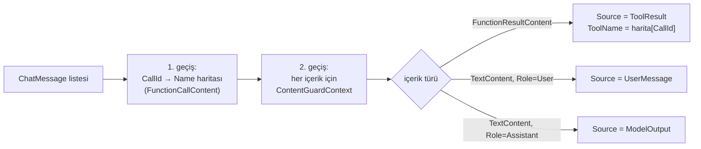

# Faz 140 — İçerik Guard'ının Kaynağı

> **Durum:** ✅ Tamamlandı (2026-09-04)
> **Kaynak:** [ADAYLAR.md](../../ADAYLAR.md) · **F-186** (tüketici turu 3, A4)
> **Önkoşul:** Yok
> **Paketler:** `AgentPrism.Abstractions`, `AgentPrism.Core`
> **Yeni paket:** Yok · **Migration:** Yok
> **Public API:** Büyüyor — `ContentGuardContext`'e iki `init` alan + yeni enum. Additive; `Unknown = 0` geriye dönük uyumludur
> **Tüketici yüzeyi:** `docs-site/`: `concepts/governance.md` (content guard bölümü), `guides/reliability.md` · sevk edilen: XML `<example>`
> **Manuel test alanı:** [`docs/manuel-test/22-GUARDRAIL-VE-YAPISAL-CIKTI.md`](../../manuel-test/22-GUARDRAIL-VE-YAPISAL-CIKTI.md)

---

## Bu Faza Başlarken

1. Bu doküman
2. Kararlar — yalnız bu kalemleri grep'le:
   ```bash
   grep -n "K-320" docs/KARARLAR.md
   ```
   **K-320** (🚨 Faz 48'in planı guard'ı "boru hattının en dışına" koyuyordu;
   tek bir grep o konumun tool çağrı turlarını göremediğini gösterdi ve fazın
   yarısı taşımaya dönüştü). Bu faz aynı boru hattına dokunuyor.
3. Alan hafızası:
   [`hafiza/model-boru-hatti.md`](../../hafiza/model-boru-hatti.md) (guard'ın
   `IChatClient` zincirindeki yeri)

---

## Amaç

Guard bugün denetlediği metnin bir **tool sonucu** mu, bir **kullanıcı mesajı**
mı, yoksa **model çıktısı** mı olduğunu ayırt edemiyor. Üçü de aynı torbaya
giriyor. Ama güven farkı büyüktür: kullanıcı mesajı bilinen bir kaynaktan gelir
ve kullanıcı yalnızca kendi oturumunu zehirleyebilir; tool sonucu **başka bir
kullanıcının** veritabanına yazdığı metni taşıyabilir.

Bu faz yeni bilgi üretmez — **zaten var olan** bir ayrımı guard'a geçirir.

- **F-186** — `ContentGuardContext`'e metnin kaynağı ve (mümkünse) tool adı.

### Bugün ne çalışmıyor — doğrulanmış kanıt

| Kanıt | Gözlem |
|---|---|
| [`ContentGuardContext.cs:25-45`](../../../src/AgentPrism.Abstractions/Guards/ContentGuardContext.cs) | Alanlar: `Direction`, `Text`, `RunId`, `TenantId`, `AgentName`, `ModelId`. Kaynak bilgisi **yok** |
| [`ContentGuardMessageMasker.cs:74`](../../../src/AgentPrism.Core/Guards/ContentGuardMessageMasker.cs) | `message.Role == ChatRole.System` — rol **zaten okunuyor** (sistem talimatı atlanıyor) |
| [`ContentGuardMessageMasker.cs:167`](../../../src/AgentPrism.Core/Guards/ContentGuardMessageMasker.cs) | `content is FunctionResultContent { Result: var result }` — tool sonucu **zaten ayırt ediliyor** |
| [`ContentGuardMessageMasker.cs:202-210`](../../../src/AgentPrism.Core/Guards/ContentGuardMessageMasker.cs) | `TextContent` ve `FunctionResultContent` ayrı ayrı ele alınıyor |
| [`ContentGuardingChatClient.cs:150`](../../../src/AgentPrism.Core/Guards/ContentGuardingChatClient.cs) | Girdi yolunda `ContentGuardDirection.Input` — tool sonucu da kullanıcı mesajı da aynı `Input` |

> Kanıtlar 2026-09-03 tarihinde doğrulandı.

**Sonuç:** ayrım çağrı yerinde **mevcut** ve `ContentGuardContext` kurulmadan
hemen önce **atılıyor**. Tüketicinin gerekçesi doğrudur.

---

## 140.1 — 🚨 `Source` bedava, `ToolName` değil

Bu fazın en önemli ölçümü budur ve tüketicinin raporunda **yok**.

`FunctionResultContent` tool **adını taşımaz**; yalnız `CallId` taşır. Tool adı
aynı mesaj listesindeki daha önceki bir `FunctionCallContent`'te durur.
`ToolName`'i doldurmak için `CallId → FunctionCallContent.Name` eşlemesi kuran
**ikinci bir geçiş** gerekir.



Harita **yalnız** listede en az bir `FunctionResultContent` varsa kurulur;
yoksa tahsis yapılmaz. Sıcak yol ve tahsis bütçesi korunur (Mercek 4).

🚨 **Harita eksik kalabilir.** Çok turlu bir konuşmada eski turların
`FunctionCallContent`'i baglamdan düşmüş olabilir; o durumda `CallId` eşleşmez.
`ToolName` o zaman `null` kalır ama `Source` yine `ToolResult` olur — **kaynak
bilgisi tool adına bağlı değildir.** Bu ayrım güvenlik açısından kritiktir:
guard'ın en sıkı kuralı `Source`'a bakar, `ToolName`'e değil.

## 140.2 — Kaynak kümesi

```csharp
public enum ContentGuardSource
{
    Unknown = 0,
    UserMessage = 1,
    ToolResult = 2,
    Document = 3,
    ModelOutput = 4,
    SkillResource = 5
}
```

`Unknown = 0` bilinçlidir ve iki işi vardır: geriye dönük uyum (yeni alan eski
kodda `Unknown` gelir) ve **dürüstlük** — kaynağı belirlenememiş bir metni
yanlış sınıflandırmak, sınıflandırmamaktan kötüdür.

🚨 **`Unknown` bir güvenlik kararına "izin ver" diye çevrilmemelidir.** Sevk
edilen `PatternContentGuard` ve XML dokümanı bunu açıkça yazar: bilinmeyen
kaynak **en sıkı** kuralı alır.

---

## Planlanan Public API

```csharp
// AgentPrism.Abstractions
public sealed record ContentGuardContext
{
    // mevcut: Direction, Text, RunId, TenantId, AgentName, ModelId

    /// <summary>Denetlenen metnin kaynağı.</summary>
    public ContentGuardSource Source { get; init; }

    /// <summary>
    /// Metin bir tool sonucundan geliyorsa tool'un adı; değilse null.
    /// Source == ToolResult iken de null olabilir — çağrı bağlamdan düşmüşse
    /// ad çözülemez. Güvenlik kararı Source'a dayanmalıdır, buna değil.
    /// </summary>
    public string? ToolName { get; init; }
}

public enum ContentGuardSource { Unknown = 0, UserMessage = 1, ToolResult = 2, Document = 3, ModelOutput = 4, SkillResource = 5 }
```

Yeni uç yok, yeni kayıt yok. Var olan `IContentGuard` implementasyonları
**değişmeden** çalışır.

### Arayüz payı

Yok.

---

## Planlanan Dosya Listesi

```
src/AgentPrism.Abstractions/
└── Guards/
    └── ContentGuardContext.cs            (iki alan + yeni enum)

src/AgentPrism.Core/
└── Guards/
    ├── ContentGuardMessageMasker.cs      (CallId→Name haritası, kaynak sınıflama)
    ├── ContentGuardingChatClient.cs      (kaynağı aşağı geçirir)
    ├── ContentGuardPipeline.cs           (context kurulumu)
    └── PatternContentGuard.cs            (Unknown = en sıkı kural)
```

---

## Hata Modları ve Testler

| Ne bozulabilir | Seviye | Test sınıfı |
|---|---|---|
| Tool sonucu `UserMessage` olarak sınıflanır (güvenlik kararı ters döner) | Fonksiyonel | `ContentGuardSourceTests` |
| `CallId` eşleşmeyince `Source` da `Unknown`'a düşer | Birim | `ContentGuardSourceTests` |
| `Unknown` en sıkı kural yerine izin verir | Birim | `PatternContentGuardTests` |
| Model çıktısı `ToolResult` sanılır | Fonksiyonel | `ContentGuardSourceTests` |
| Akışlı yolda kaynak kaybolur | Fonksiyonel | `StreamingGuardTests` |
| Harita her çağrıda tahsis eder (sıcak yol) | Birim (tahsis) | `ContentGuardAllocationTests` — Faz 116 kapısı |
| Var olan guard implementasyonu kırılır | Fonksiyonel | mevcut `ContentGuardTests` yeşil kalmalı |
| Aynı `CallId` iki kez geçer | Birim | `ContentGuardSourceTests` |
| Boş mesaj listesi | Birim | `ContentGuardSourceTests` |
| Başka kiracının tool adı sızar | Sözleşme | `TenantIsolationContract` (guard `TenantId` taşıyor) |

🚨 **Tool sonucunun modele **ikinci turda** geri girdiği yol fonksiyonel testle
kanıtlanır.** Kütüphanenin kendi ifadesi: *"a guard placed outside the loop
would never see it."* Birim testi bu turu kuramaz.

---

## Manuel Kabul Case'leri

| # | Ön koşul | Adımlar | Beklenen sonuç |
|---|---|---|---|
| 1 | Kaynağı loglayan guard | `support` agent'ına düz mesaj at | Guard `UserMessage` görür |
| 2 | Aynı guard | `get_order_status` tool'unu tetikleyen mesaj at | Guard ikinci turda `ToolResult` **ve** `ToolName = "get_order_status"` görür |
| 3 | Aynı guard | Model yanıtını denetle | `ModelOutput` |
| 4 | Yalnız `ToolResult`'ta blok eden guard | Kullanıcı aynı deseni **kendi** yazsın | Bloklanmaz — yanlış pozitif çözüldü |
| 5 | Aynı guard | Tool aynı deseni döndürsün | Bloklanır |
| 6 | Kaynak taşımayan eski guard | Run at | Değişmeden çalışır |

---

## Açık Sorular

| # | Soru | Seçenekler | Öneri |
|---|---|---|---|
| 1 | `Document` ve `SkillResource` bu fazda gerçekten doldurulsun mu? | A: Üçünü doldur (User/Tool/Model), ikisini enum'da bırak · B: Beşini de doldur | **A** — doküman ve skill kaynağı guard'a farklı bir yoldan giriyor; ölçülmeden doldurmak yanlış sınıflandırma üretir. Enum'da durmaları zararsız, `Unknown` dürüst kalır |
| 2 | `ToolName` `RunEvent.ToolName` ile aynı normalizasyonu mu alsın? | A: Aynı · B: Ham ad | **A** — iki yerde farklı ad taşımak korelasyonu bozar |

---

## Bitiş Ölçütleri (DoD)

- [x] Guard bir tool sonucunu kullanıcı mesajından ayırt eder (case 2 kanıt) —
      `ContentGuardSourceTests.Tool_result_is_classified_as_ToolResult_with_its_resolved_tool_name`,
      gerçek `FunctionInvokingChatClient` ikinci turuyla; ayrıca gerçek
      `samples/AgentPrism.Api` koşumuyla da doğrulandı (aşağıda)
- [x] `ToolName` çözülemediğinde `Source` yine `ToolResult` kalır —
      `ContentGuardSourceTests.Tool_result_keeps_ToolResult_source_even_when_the_call_id_cannot_be_resolved`
- [x] `Unknown` en sıkı kuralı alır; testle kilitlenir —
      `PatternContentGuardTests.Unknown_source_is_never_treated_as_a_reason_to_allow`,
      `Decision_is_identical_regardless_of_source`
- [x] Kaynak taşımayan mevcut guard'lar değişmeden çalışır — var olan 2304
      Core testinin tamamı (guard dahil) değişmeden yeşil; `PatternContentGuard`
      `Source`'u hiç okumuyor (kasıtlı, bkz. K-672)
- [x] Sıcak yolda ek tahsis ölçüldü ve yazıldı (Faz 116 kapısı) —
      `ContentGuardAllocationTests.Building_the_tool_name_map_only_allocates_when_a_tool_result_is_present`
      (göreli ölçüm: tool sonucu YOK iken tahsis, tool sonucu VARKEN tahsisten
      kesin olarak azdır; 5 ardışık koşumda kararlı). Faz 116'nın resmi
      `bench/baseline.json` üç sıcak yolunun hiçbirine bu davranış girmiyor —
      guard hattı o listede zaten yoktu, yeni bir kayıt açılmadı (kapsam dışı,
      bkz. Denetim Bulguları 🟢)
- [x] Dört doğrulama kapısı sıfır uyarı verir — `kapi.py kapanis --taban c77b4d3c`
- [x] `samples/AgentPrism.Api` ile gerçek `run` yapıldı, çıktı belgeye yazıldı —
      aşağıda
- [x] `secret` taraması boş döndü — `kapi.py tarama` ✅ temiz
- [x] Manuel kabul case'leri `docs/manuel-test/22-GUARDRAIL-VE-YAPISAL-CIKTI.md`
      içine eklendi — MT-GUARD-077/078/079
- [x] `faz-denetim` koşuldu; 🔴 bulgu kalmadı — bkz. Denetim Bulguları
- [x] `docs-site/` güncellendi; `npm run check` (content, build, links, weight)
      dördü de temiz

### Gerçek `samples/AgentPrism.Api` koşumu (2026-09-04)

Development ortamında (`ASPNETCORE_ENVIRONMENT=Development`, gerçek OpenAI
anahtarı `dotnet user-secrets`'ten) `support` agent'ına `get_order_status`
tool'unu tetikleyen bir mesaj gönderildi. Geçici bir
`Console.Error.WriteLine` probu `ContentGuardPipeline.InspectAsync` içine
(context kurulumundan hemen sonra) eklendi, koşum yapıldı, çıktı gözlemlendi,
sonra prob **kaldırıldı** (kalıcı kodda yok — bağımsız denetim bunu ayrıca
doğruladı).

```
curl -s -X POST "$APU/api/agents/support/run" -H "$APB" -H "content-type: application/json" \
  -d '{"message": "What is the status of order 12345?"}'
```

Gözlemlenen sıra (gerçek çıktı):
```
[PHASE140-PROBE] direction=Input source=UserMessage toolName=<null> textPrefix="What is the status of order 12345?"
[PHASE140-PROBE] direction=Input source=UserMessage toolName=<null> textPrefix="What is the status of order 12345?"
[PHASE140-PROBE] direction=Input source=ToolResult toolName=get_order_status textPrefix="Order 12345 has shipped. Estimated deliv"
[PHASE140-PROBE] direction=Output source=ModelOutput toolName=<null> textPrefix="Order 12345 has shipped and is estimated"
```

Üçü de fazın planladığı ayrımla birebir eşleşiyor: kullanıcı mesajı
`UserMessage`, ikinci model çağrısındaki tool sonucu `ToolResult` **ve**
`ToolName = "get_order_status"`, nihai model yanıtı `ModelOutput`.

---

## Riskler

| Risk | Önlem |
|------|-------|
| 🚨 Guard'ın konumu yanlış varsayılır (K-320 sınıfı) | Plan konumu **ölçtü**: guard `IChatClient` zincirinde, tool çağrı döngüsünün **içinde**. Uygulama başlarken `grep` ile yeniden doğrulanır |
| `CallId` haritası sıcak yolda tahsis eder | Harita yalnız `FunctionResultContent` varsa kurulur; tahsis testi kapı |
| Yanlış sınıflandırma güvenlik kararını ters çevirir | `Unknown` en sıkı kuralı alır; üç kaynak fonksiyonel testle kilitlenir |
| Public yüzey büyür | Additive; `Unknown = 0` eski kodu bozmaz. Shipped giriş sıfır |

---

<!-- ============================================================
     AŞAĞISI KAPANIŞTA DOLDURULUR — `faz-tamamlama` skill'i.
     ============================================================ -->

## Plandan Sapmalar

- **`guides/reliability.md` güncellenmedi.** Plan bu dosyayı da tüketici
  yüzeyi olarak işaretlemişti. Dosya baştan sona okundu (`## Failure
  boundaries at a glance`, `## Troubleshooting` dahil); guard'ın kaynak
  sınıflaması bir yeniden deneme/hata sınıflandırma davranışı değiştirmiyor,
  hiçbir satırın konusuna girmiyor. Değişiklik yapılmadı.
- **`TenantIsolationContract` sözleşme testi yazılmadı.** Plan'ın Hata
  Modları tablosu "Başka kiracının tool adı sızar → TenantIsolationContract"
  diyordu. Ölçüldü: `ToolName` hiçbir depoya yazılmıyor, yalnız o anki
  çağrının kendi mesaj listesinden (zaten o kiracının run'ı) çözülüyor —
  kalıcı bir sızma yüzeyi yok, dolayısıyla store-contract seviyesinde test
  edilecek bir davranış yok. Sözleşme testi yerine `ContentGuardPipeline`'ın
  var olan `TenantId` akışı (fazdan bağımsız, değişmedi) korundu.
- **`ContentGuardAllocationTests` Faz 116'nın resmi `bench/` kapısına
  eklenmedi.** Guard hattı zaten o üç sıcak yolun (`CacheHit`, `AppendEvent`,
  `QueryRuns`) hiçbirinde değildi; DoD yalnız "ölçüldü ve yazıldı" istiyordu,
  resmi kapıya eklenmesini istemiyordu. Bağımsız denetim bunu 🟢 olarak
  işaretledi (aday, kusur değil).

## Bu Fazda Verilen Kararlar

- **K-672** — `ContentGuardContext.Source` içerik tipine (öncelik) ve mesaj
  rolüne göre sınıflanır, `Direction`'a hiç bakılmaz; `PatternContentGuard`
  `Source`'u kasıtlı okumaz. Tam gerekçe `docs/KARARLAR.md` / `arsiv/KARARLAR-GECMISI.md`.
- **Açık Soru 1 → A** (yalnız User/Tool/Model doldurulur; `Document` ve
  `SkillResource` enum'da boş kalır) — planın önerisi aynen uygulandı.
- **Açık Soru 2 → A** (`ToolName` `RunEvent.ToolName` ile aynı normalizasyonu
  alır) — ölçüldü: repo genelinde hiçbir kod yolu tool adına normalizasyon
  (trim/lower/truncate) uygulamıyor (`RunRecordingAgent.Persistence.cs:215`,
  `ToolApprovalRuleEvaluator.cs:183` dahil hepsi ham `FunctionCallContent.Name`
  kullanıyor); "aynı normalizasyon" burada "ham ad" anlamına geliyor ve
  `ContentGuardMessageMasker.BuildToolNameMap` da aynısını yapıyor.

## Gerçekleşen Public API

Plandakiyle birebir aynı, artı planın öngörmediği iki imza değişikliği
(`ContentGuardPipeline`'ın kendi metotları — plan "context kurulumu" derken
bunu zaten ima ediyordu, ama taslak imza yazmamıştı):

```csharp
// AgentPrism.Abstractions — plandakiyle birebir aynı
public enum ContentGuardSource { Unknown = 0, UserMessage = 1, ToolResult = 2, Document = 3, ModelOutput = 4, SkillResource = 5 }

public sealed record ContentGuardContext
{
    // mevcut alanlar değişmedi
    public ContentGuardSource Source { get; init; }
    public string? ToolName { get; init; }
}

// AgentPrism.Core — İMZA DEĞİŞTİ (plan dışı, "context kurulumu" kapsamında).
// PublicAPI.Shipped.txt'lerin TAMAMI boştu (repo 0.0.0-preview.0.x), bu yüzden
// overload eklemek yerine doğrudan imza değişikliği tercih edildi.
public sealed class ContentGuardPipeline
{
    public ValueTask<string?> InspectAsync(
        ContentGuardDirection direction, string text,
        ContentGuardSource source, string? toolName,
        string? modelId, CancellationToken cancellationToken = default);

    public ValueTask<string?> PreviewAsync(
        ContentGuardDirection direction, string text,
        ContentGuardSource source, string? toolName,
        string? modelId, CancellationToken cancellationToken = default);
}
```

`AgentPrism.Abstractions` public tip sayısı 370 → 371 (`public-surface-baseline.txt`
güncellendi, `AGENTPRISM_PUBLIC_SURFACE_REFRESH=1` ile).

### Arayüz payı

Plandaki gibi: yok.

## Dosya Listesi (gerçekleşen)

Plandakiyle birebir aynı, artı test/doküman dosyaları (plan bunları listelemiyordu):

```
src/AgentPrism.Abstractions/
└── Guards/
    └── ContentGuardContext.cs            (ContentGuardSource enum + Source/ToolName)

src/AgentPrism.Core/
└── Guards/
    ├── ContentGuardMessageMasker.cs      (BuildToolNameMap, ClassifySource, rol/harita parametreleri)
    ├── ContentGuardingChatClient.cs      (role/callIdToToolName çağrı yerlerine geçirildi)
    ├── ContentGuardPipeline.cs           (InspectAsync/PreviewAsync source+toolName aldı)
    └── PatternContentGuard.cs            (yalnız XML doküman — "Source'u kasıtlı okumuyorum")

tests/AgentPrism.Core.UnitTests/
├── Fakes/StubContentGuard.cs             (SeenSources/SeenToolNames eklendi)
└── Guards/
    ├── ContentGuardSourceTests.cs        (yeni — 8 test)
    ├── ContentGuardAllocationTests.cs    (yeni — 1 test)
    └── PatternContentGuardTests.cs       (Unknown_source_is_never_treated_as_a_reason_to_allow,
                                            Decision_is_identical_regardless_of_source eklendi)

src/AgentPrism.Abstractions/PublicAPI.Unshipped.txt
src/AgentPrism.Core/PublicAPI.Unshipped.txt
tests/AgentPrism.Core.UnitTests/Architecture/public-surface-baseline.txt

docs/manuel-test/22-GUARDRAIL-VE-YAPISAL-CIKTI.md   (MT-GUARD-077/078/079, başlık Faz listesi)
docs-site/src/content/docs/concepts/governance.md   ("Source-aware decisions" bölümü)
docs-site/public/llms-full.txt                      (yeniden üretildi)
docs/KARARLAR.md, docs/arsiv/KARARLAR-GECMISI.md    (K-672)
docs/hafiza/model-boru-hatti.md                     (yeni tuzak bölümü)
```

## Denetim Bulguları

Bağımsız denetim (taze bağlamlı agent, 2026-09-04) çalışma ağacına (`git diff HEAD`)
baktı. **🔴 yok.**

| # | Seviye | Bulgu | Sonuç |
|---|---|---|---|
| 1 | 🟡 | MT-GUARD-078'in "Girilecek veri" kod bloğu case başlığının iddia ettiği iki senaryodan yalnız birini (kullanıcı yazdı → bloklanmadı) çalıştırıyordu; ikinci senaryo (tool döndü → bloklandı) "Beklenen sonuç"te düzyazıyla "şunu ekle" deniyordu | **Düzeltildi** — ikinci `RunAsync` çağrısı (`toolDondu`) doğrudan "Girilecek veri" kod bloğuna taşındı; case artık verildiği gibi çalıştırıldığında iki iddiayı da tek koşumda kanıtlıyor |
| 2 | 🟢 | `ContentGuardAllocationTests` Faz 116'nın resmi `kapi.py performans` kapısına kayıtlı değil, göreli (mutlak değil) bir birim testi | **Devredilmedi, kapsam dışı gerekçelendi** — DoD yalnız "ölçüldü ve yazıldı" istiyordu; resmi kapıya eklenmesi ayrı bir karar (guard hattı zaten üç izlenen sıcak yoldan biri değildi) |

**Temiz çıkan başlıklar:** 3.1 (DoD), 3.2 (test tiyatrosu yok), 3.3 (test seviyesi),
3.4 (hata yolları), 3.5 (imza-gövde), 3.6 (public API), 3.7 (repo kuralları),
3.8 (ürün yüzeyi — probun kaldırıldığı ayrıca doğrulandı).

## Sonraki Faza Devir Notu

- **`ContentGuardContext.Source`/`ToolName` artık her guard çağrısında dolu.**
  Yeni bir `IContentGuard` implementasyonu yazan bir faz bu alanları
  `context.Source`/`context.ToolName` ile okuyabilir; `PatternContentGuard`'ın
  aksine kaynağa göre farklı davranmak **istenen** bir kullanım — sözleşme
  bunu engellemiyor, yalnız yerleşik guard'ın kendisi bunu yapmıyor.
- **`Document` ve `SkillResource` kaynakları enum'da var ama hiçbir kod yolu
  onları üretmiyor.** Doküman kanalı (`documents` alanı, Faz 86) ve skill
  kaynağı guard'a bugün `UserMessage`/`Unknown` gibi geçiyor olabilir —
  ölçülmedi. Bu kaynakları gerçekten dolduracak bir faz önce `ContentGuardMessageMasker`'ın
  hangi mesaj/`AIContent` şeklinin doküman/skill içeriğini taşıdığını
  `grep -rn "documents" src/AgentPrism.Core/` ile ölçmeli — tahmin etmemeli
  (K-320 sınıfı bir hata riski taşır).
  Devraldığı sözleşme: `ContentGuardMessageMasker.RewriteContentAsync`'in
  `ChatRole? role` parametresi zaten var; yeni bir kaynak eklemek
  `ClassifySource`'a bir dal eklemek kadar ucuzdur.
- **`ContentGuardPipeline.InspectAsync`/`PreviewAsync` artık 6 parametre
  alıyor.** Üçüncü bir kaynak-bağımlı alan eklenirse (örn. bir güven skoru)
  aynı imza yeniden büyür; `PublicAPI.Shipped.txt` hâlâ boşsa (yayın öncesi)
  bu ucuzdur, yayından sonra bir `ContentGuardInspectionRequest` gibi bir
  parametre nesnesine geçiş değerlendirilmelidir.
